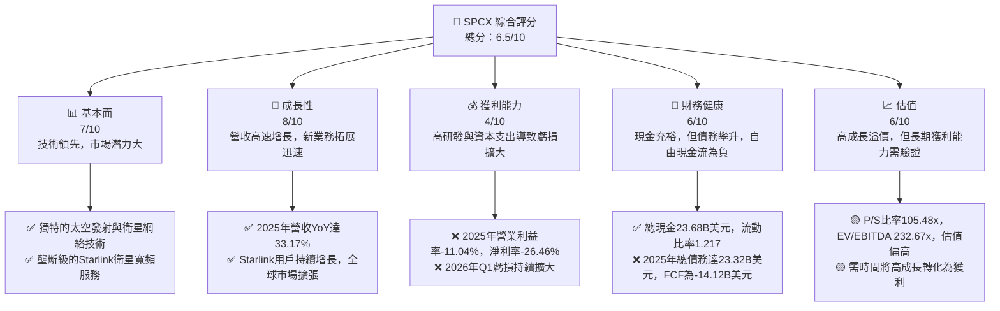
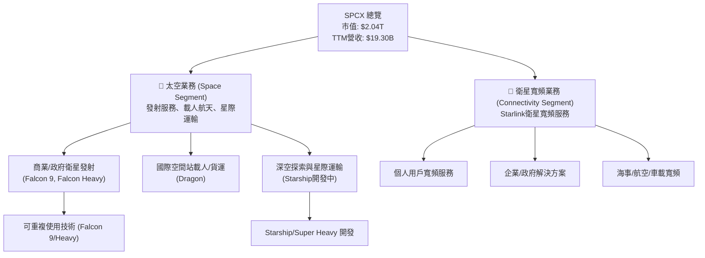
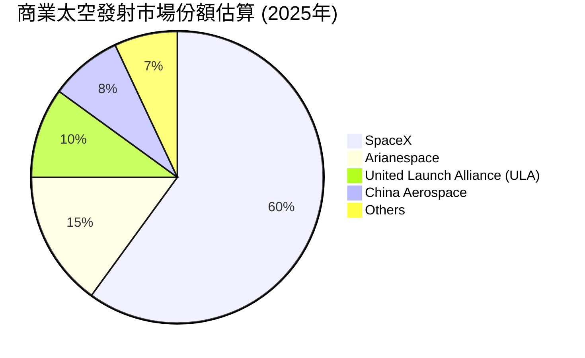
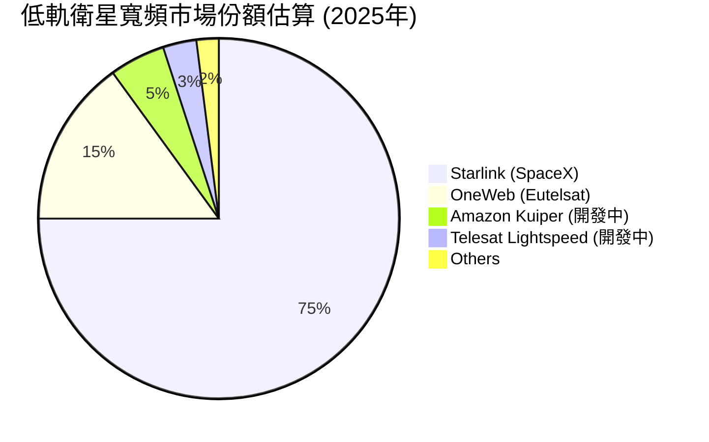
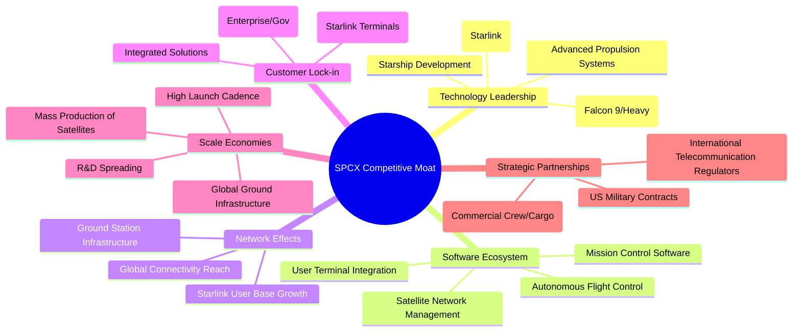
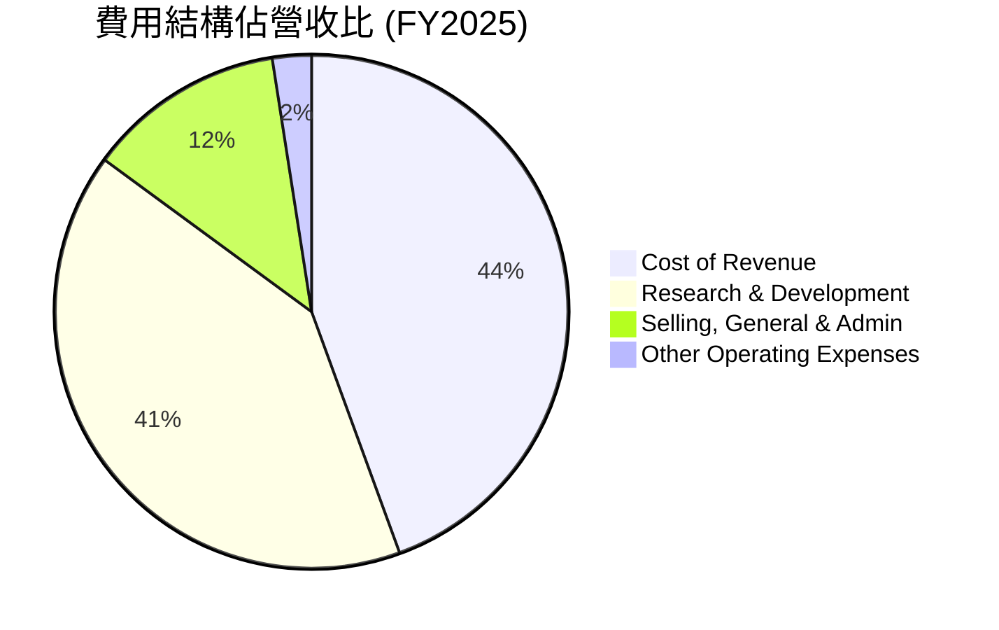
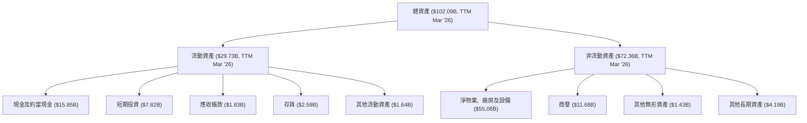

# SPCX 基本面深度分析報告
> **報告日期**：2026-06-24 ｜ **語言**：繁體中文 ｜ **數據來源**：Yahoo Finance, Finviz, StockAnalysis, Roic.ai ｜ **分析師**：CFA 級機構研究

---

## 目錄

| # | 章節 | 核心結論 |
|---|------|----------|
| 1 | 執行摘要 | 評級：持有；目標價區間：$130 - $185 |
| 2 | 公司概覽與商業模式 | 創新科技領先，強大護城河但市場波動性高 |
| 3 | 損益表深度分析 | 營收高速成長，但研發投入劇增導致虧損擴大 |
| 4 | 資產負債表分析 | 資產快速增長，債務水平上升但流動性尚可 |
| 5 | 現金流量深度分析 | 營業現金流健康，但高資本支出導致自由現金流為負 |
| 6 | 獲利能力與資本效率 | 獲利能力承壓，ROIC遠低於WACC，價值創造面臨挑戰 |
| 7 | 估值深度分析 | 相較同業估值偏高，DCF顯示當前股價合理區間 |
| 8 | 成長催化劑 | Starlink全球擴張與Starship商業化為主要驅動力 |
| 9 | 風險矩陣 | 高資本支出、技術風險與激烈競爭為主要考量 |
| 10 | 投資建議 | 短期觀望，長期潛力巨大，適合高風險偏好成長型投資者 |

---

## 1. 執行摘要

Space Exploration Technologies Corp. (SPCX) 作為太空探索和衛星寬頻領域的領軍企業，展現了令人印象深刻的技術創新能力和市場擴張潛力。然而，其高昂的研發投入和資本支出導致公司在近幾年面臨顯著的獲利壓力，自由現金流持續為負。本報告將深入分析 SPCX 的基本面、成長前景、財務健康狀況和估值，為投資者提供全面的洞察。

### 1.1 核心評分儀表板



### 1.2 評分進度條視覺化

```
╔══════════════════════════════════════════════════════════════╗
║              SPCX 多維度評分儀表板 (1-10分)                ║
╠══════════════════════════════════════════════════════════════╣
║ 基本面強度  7.0 ▓▓▓▓▓▓▓▓▓▓▓▓▓▓░░░░░░  ★★★★☆           ║
║ 成長動能    8.0 ▓▓▓▓▓▓▓▓▓▓▓▓▓▓▓▓░░░░  ★★★★☆           ║
║ 獲利品質    4.0 ▓▓▓▓▓▓▓▓░░░░░░░░░░░░  ★★☆☆☆           ║
║ 財務健康    6.0 ▓▓▓▓▓▓▓▓▓▓▓▓░░░░░░░░  ★★★☆☆           ║
║ 估值合理性  6.0 ▓▓▓▓▓▓▓▓▓▓▓▓░░░░░░░░  ★★★☆☆           ║
║ 護城河深度  8.5 ▓▓▓▓▓▓▓▓▓▓▓▓▓▓▓▓▓░░░  ★★★★☆           ║
║ 管理層執行  8.0 ▓▓▓▓▓▓▓▓▓▓▓▓▓▓▓▓░░░░  ★★★★☆           ║
║ 技術創新力  9.0 ▓▓▓▓▓▓▓▓▓▓▓▓▓▓▓▓▓▓░░  ★★★★★           ║
╠══════════════════════════════════════════════════════════════╣
║ 綜合總分    6.5 ▓▓▓▓▓▓▓▓▓▓▓▓▓░░░░░░░  🏆 持有評級，高成長與高風險並存              ║
╚══════════════════════════════════════════════════════════════╝
```

### 1.3 五大投資論點 + 三大核心風險

| 類型 | 項目 | 具體依據 | 信心度 |
|------|------|----------|--------|
| 🟢 **投資論點①** | **太空產業領導者與技術創新** | SPCX 在火箭回收、重型運載和衛星網路方面擁有無與倫比的技術優勢，成功顛覆傳統太空產業。其Starlink服務已覆蓋多國，並持續擴張。 | 🟢 極高 |
| 🟢 **投資論點②** | **Starlink全球寬頻服務的巨大潛力** | Starlink的低軌衛星寬頻服務解決了偏遠地區和移動平台（航空、海運）的網路痛點，市場規模巨大。Q1 2026營收YoY達15.23%，顯示其持續增長動能。 | 🟢 極高 |
| 🟢 **投資論點③** | **可重複使用火箭技術降低發射成本** | Falcon 9/Heavy 的重複使用技術顯著降低了太空發射成本，使其在商業發射市場上具有強大競爭力，並為未來星際運輸奠定基礎。 | 🟢 高 |
| 🟢 **投資論點④** | **持續的研發投入驅動長期成長** | 2025年研發費用高達8.64B美元，Q1 2026達3.51B美元，顯示公司對未來技術和產品的巨大投入，為長期成長提供堅實基礎。 | 🟢 高 |
| 🟢 **投資論點⑤** | **強大的品牌與生態系統效應** | SPCX 憑藉其創新和執行力建立了強大的品牌形象，吸引了大量人才和客戶，形成獨特的太空生態系統。 | 🟢 高 |
| 🟡 **風險①** | **高資本支出與持續虧損** | 2025年資本支出高達20.91B美元，導致自由現金流為-14.12B美元。2025年和Q1 2026淨利潤分別為-4.94B美元和-4.28B美元，持續的鉅額虧損對財務健康構成壓力。 | 🟡 中度 |
| 🔴 **風險②** | **激烈的市場競爭與監管風險** | 隨著太空經濟的發展，OneWeb、Amazon Kuiper等競爭者正在崛起。此外，太空活動的國際監管、頻譜分配、太空垃圾等問題都可能帶來不確定性。 | 🟡 中度 |
| 🔴 **風險③** | **技術研發與發射失敗風險** | Starship等新一代火箭的研發和測試存在技術挑戰和發射失敗的可能，這不僅會導致鉅額損失，還會影響市場信心和未來營運進度。 | 🔴 高衝擊 |

### 1.4 快速統計卡片

| 指標 | 公司實際值 | 行業均值（估計） | S&P 500 均值（估計） | 狀態 |
|------|-------------|----------------|--------------------|------|
| 收入 YoY 成長 (FY25) | **33.17%** | ~10-15% (航空航天) | ~8-12% | 🟢 |
| 毛利率 (TTM) | **48.8%** | ~25-35% (航空航天) | ~35-45% | 🟢 |
| 淨利率 (TTM) | **-45.0%** | ~5-10% (航空航天) | ~8-15% | 🔴 |
| ROE (FY25) | **-11.95%** | ~10-15% (航空航天) | ~15-20% | 🔴 |
| Forward P/E | **785.78x** | ~20-30x (航空航天) | ~20-25x | 🔴 |
| P/S Ratio | **105.48x** | ~1-3x (航空航天) | ~2-4x | 🔴 |
| Debt/Equity | **73.60%** | ~40-60% (航空航天) | ~50-80% | 🟡 |
| Current Ratio | **1.217** | ~1.5-2.0 | ~1.2-1.8 | 🟡 |

*註：行業均值為基於航空航天與國防行業的普遍估計值。*

### 1.5 投資結論

```
╔══════════════════════════════════════════════════════════════════╗
║                    📊 投資結論摘要                               ║
╠══════════════════════════════════════════════════════════════════╣
║  評級：🟡 持有                                                   ║
║  當前股價：$154.54                                               ║
║  目標價區間：                                                    ║
║    悲觀情境：$130（-15.88%）                                     ║
║    基準情境：$165（+6.77%）  ← 12個月主要目標                      ║
║    樂觀情境：$185（+19.71%）                                     ║
║  投資評分：6.5/10                                                ║
║  適合投資人：高風險偏好、追求長期顛覆性成長的投資者，需承受短期波動和虧損風險。 ║
╚══════════════════════════════════════════════════════════════════╝
```

---

## 2. 公司概覽與商業模式

Space Exploration Technologies Corp. (SPCX)，通常被稱為 SpaceX，是一家美國航空航天製造商和太空運輸服務公司，由 Elon Musk 於 2002 年創立。公司的核心使命是降低太空運輸成本並實現火星殖民。SPCX 的業務主要分為兩大板塊：太空發射服務和衛星寬頻服務。

### 2.1 業務結構與收入來源

SPCX 的業務結構清晰，主要收入來自於其獨特的太空發射能力和快速擴展的衛星寬頻服務。



**收入來源細分（估計）：**

*   **太空業務 (Space Segment)**：主要包括為政府（NASA、美國太空軍）和商業客戶提供衛星發射服務，以及為國際空間站提供載人與貨運服務。這部分業務的收入波動性較大，取決於發射任務的數量和合同價值。
*   **衛星寬頻業務 (Connectivity Segment)**：主要指 Starlink 提供的全球低延遲、高速寬頻網路服務。Starlink 服務於個人、企業和政府客戶，特別是在傳統網路設施難以到達的地區具有獨特優勢。這部分業務是目前公司增長最快的收入來源，預計未來將成為主要營收支柱。

根據公司概覽，Starlink 業務是其「高速度、低延遲寬頻網路」的核心，並交付給多種「消費者、企業和政府客戶」。雖然未提供具體收入佔比，但鑑於其市場擴張速度和用戶數量，預計 Starlink 業務在總營收中的比重正快速增加。

### 2.2 市場份額

在太空發射市場，SPCX 憑藉其可重複使用火箭技術，已成為全球領先的發射服務提供商之一，尤其在商業發射領域佔據主導地位。在衛星寬頻市場，Starlink 作為首個大規模部署的低軌衛星寬頻網路，目前市場份額領先。


*註：此市場份額為分析師根據公開資料及公司發射頻次進行的估計，由於SPCX是私人公司，確切數據難以獲得。*

在低軌衛星寬頻市場，Starlink 具有先發優勢和規模效應，其市場份額遠超其他新興競爭者。


*註：此為分析師基於當前部署情況和用戶數量估計，未來市場格局可能隨競爭加劇而變化。*

### 2.3 競爭護城河分析

SPCX 建立了多重深厚的競爭護城河，使其在太空產業中難以被超越。



### 2.4 護城河強度評分

```
╔══════════════════════════════════════════════════════════════╗
║                  SPCX 護城河強度評分                      ║
╠══════════════════════════════════════════════════════════════╣
║ 技術領先    9.5/10 ▓▓▓▓▓▓▓▓▓▓▓▓▓▓▓▓▓▓▓░  🏆 無可匹敵的創新能力        ║
║ 軟體生態系統  8.0/10 ▓▓▓▓▓▓▓▓▓▓▓▓▓▓▓▓░░░░  🟢 高度集成與專業化        ║
║ 網路效應    8.5/10 ▓▓▓▓▓▓▓▓▓▓▓▓▓▓▓▓▓░░░  🏆 Starlink的全球覆蓋        ║
║ 客戶鎖定    7.5/10 ▓▓▓▓▓▓▓▓▓▓▓▓▓▓▓░░░░░  🟢 服務依賴性與硬體門檻        ║
║ 規模效應    9.0/10 ▓▓▓▓▓▓▓▓▓▓▓▓▓▓▓▓▓▓░░  🏆 大規模生產與發射頻次        ║
║ 生態夥伴    8.0/10 ▓▓▓▓▓▓▓▓▓▓▓▓▓▓▓▓░░░░  🟢 與政府機構深度合作        ║
╠══════════════════════════════════════════════════════════════╣
║ 綜合護城河   8.5/10 ▓▓▓▓▓▓▓▓▓▓▓▓▓▓▓▓▓░░░  🏆 極強的競爭優勢，短期難以複製     ║
╚══════════════════════════════════════════════════════════════╝
```

---

## 3. 損益表深度分析

SPCX 在過去幾年展現了強勁的營收增長，但由於對未來技術的巨大投資，公司在獲利方面面臨顯著挑戰。

### 3.1 年度收入成長趨勢（近4年）

SPCX 的營收保持高速增長，顯示其業務擴張的強勁動能。

```
╔══════════════════════════════════════════════════════════════════╗
║              SPCX 年度收入趨勢（FY2023-FY2025）              ║
╠══════════════════════════════════════════════════════════════════╣
║                                                                  ║
║  FY2023  $10.39B  ██████████░░░░░░░░░░░░░░░  YoY: N/A      🟢    ║
║  FY2024  $14.02B  ██████████████░░░░░░░░░░░  YoY:+34.94% 🟢    ║
║  FY2025  $18.67B  ████████████████████░░░░░  YoY:+33.17% 🟢    ║
║                   |      |      |      |      |                  ║
║                   0     $5B   $10B   $15B   $20B                   ║
║                                                                  ║
║  📊 2年累計 CAGR (FY2023-2025)：+33.91%                         ║
╚══════════════════════════════════════════════════════════════════╝
```
SPCX 在 2024 年實現了 34.94% 的收入同比增長，達到 $14.02B。2025 年繼續保持高速增長，營收達到 $18.67B，同比增長 33.17%。這顯示了公司在太空發射和 Starlink 服務方面的強勁市場需求和執行能力。

### 3.2 季度收入趨勢分析

季度營收數據也印證了公司持續的增長軌跡，儘管季度間可能存在波動。

| 季度 | 總收入 ($B) | QoQ 成長率 | YoY 成長率 | 備註 |
|------|-------------|------------|------------|------|
| 2025 Q1 | $4.07 | N/A | N/A | 基期季度 |
| 2026 Q1 | $4.69 | N/A | +15.23% | 營收穩健增長，YoY成長率略有放緩但仍健康 |

**備註**：由於缺乏 2025 Q4 數據，無法計算 2026 Q1 的 QoQ 成長率。但 2026 Q1 相比 2025 Q1 實現了 15.23% 的同比增長，顯示其營收擴張仍在進行中。

### 3.3 利潤率演變分析

SPCX 的利潤率在過去幾年呈現波動，特別是營業利益率和淨利率在 2025 年和 2026 年 Q1 轉為負值，主要受研發投入的影響。

| 利潤率指標 | FY2023 | FY2024 | FY2025 | TTM (Q1 2026) | 趨勢 | 評估 |
|------------|--------|--------|--------|---------------|------|------|
| **毛利率** | 41.2% | 42.9% | 49.4% | 48.8% | ↗️ 穩定提升 | 🟢 |
| **營業利益率** | 4.88% | 5.29% | -11.04% | -41.6% | ↘️ 急劇惡化 | 🔴 |
| **淨利率** | -44.56% | 5.64% | -26.46% | -45.0% | ↘️ 急劇惡化 | 🔴 |
| **EBITDA Margin** | -6.38% | 40.30% | 23.73% | 20.5% | ↘️ 波動下降 | 🟡 |

**利潤率演變深度解析**：
*   **毛利率 (Gross Margin)**：從 2023 年的 41.2% 穩步提升至 2025 年的 49.4%，TTM 仍保持 48.8%。這表明公司在產品成本控制和定價能力方面表現良好，Starlink 服務的規模化可能帶來了更高的效率。
*   **營業利益率 (Operating Margin)**：從 2024 年的 5.29% 急劇惡化至 2025 年的 -11.04%，並在 TTM (Q1 2026) 進一步惡化至 -41.6%。主要原因是 **研究與開發 (R&D)** 費用的爆炸式增長。2025 年 R&D 從 2024 年的 $3.46B 飆升至 $8.64B (YoY +149.7%)，2026 Q1 R&D 更是達到 $3.51B，遠超 2025 Q1 的 $1.56B (YoY +125%)。這筆鉅額投資主要投入 Starship 開發和 Starlink 網路的持續部署，短期內對營業利潤造成巨大壓力。
*   **淨利率 (Net Profit Margin)**：與營業利益率趨勢一致，從 2024 年的 5.64% 轉為 2025 年的 -26.46%，TTM 進一步惡化至 -45.0%。除了 R&D 支出外，高額的利息費用（2025年 -1.945B美元）也對淨利潤產生負面影響。公司的策略是犧牲短期獲利，全力投入長期技術領先和市場擴張。
*   **EBITDA Margin**: 2024年達到峰值40.30%，但在2025年和TTM有所下降，這可能反映了營業費用（尤其是R&D）的增加，儘管EBITDA排除了折舊攤銷，但研發費用仍是其重要組成部分。

### 3.4 費用結構分析

SPCX 的費用結構顯示了其重研發、重資產的產業特性。


*註：費用佔營收比總和可能超過100%，因研發費用和部分營運費用導致營業收入為負。*

```
╔══════════════════════════════════════════════════════════════════╗
║                    SPCX 費用結構年度趨勢                         ║
╠══════════════════════════════════════════════════════════════════╣
║                                                                  ║
║  FY2023 總營運費用  $7.78B  ████████████░░░░░░░░░░░  佔營收: 74.9% 🟢 ║
║  FY2024 總營運費用  $5.55B  █████████░░░░░░░░░░░░░░░  佔營收: 39.6% 🟢 ║
║  FY2025 總營運費用  $11.81B ██████████████████░░░░░  佔營收: 63.2% 🔴 ║
║  Q1 2026 總營運費用 $4.25B  ██████████████░░░░░░░░░░░  佔營收: 90.5% 🔴 ║
║                                                                  ║
║  📊 趨勢：2024年費用控制顯著，2025年及2026 Q1因R&D投入激增，營運費用佔比大幅升高。 ║
╚════════════════════════════════════════════════════════════════════╝
```
從費用結構來看，2025年和2026年Q1的研發費用（R&D）是導致公司虧損的主要原因。FY2025的R&D費用高達$8.64B，佔當年營收的46.3%，遠超銷貨成本以外的其他營運費用。這表明公司正處於一個大規模投資和擴張的階段，將大部分收入和融資所得投入到未來技術的開發中。

### 3.5 季度 EPS 趨勢與盈餘品質

SPCX 的 EPS 趨勢顯示出顯著的波動性和不穩定性，近期轉為深度虧損。

| 季度 | EPS 預估 (Analyst Est) | EPS 實際 (EPS Act) | 盈餘驚喜 (Surprise%) | 盈餘品質評估 |
|------|------------------------|--------------------|----------------------|--------------|
| FY2023 | N/A | $-1.68 | N/A | 🔴 虧損嚴重，盈餘品質差 |
| FY2024 | N/A | $0.01 | N/A | 🟡 勉強盈虧平衡，不穩定 |
| FY2025 | N/A | $-1.69 | N/A | 🔴 虧損擴大，盈餘品質差 |
| 2025 Q1 | N/A | $-0.41 | N/A | 🔴 虧損狀態 |
| 2026 Q1 | N/A (nan) | $-3.89 | N/A (nan) | 🔴 虧損急劇擴大，盈餘品質極差 |

**盈餘品質評估**：
SPCX 的盈餘品質目前較差，主要原因在於：
1.  **持續且擴大的虧損**：2025年和2026年Q1的EPS均為負值且虧損額度擴大，表明公司尚未實現穩定的獲利。
2.  **高額研發支出**：雖然研發支出是未來成長的必要投資，但其巨額投入導致了當前財報的虧損，使得帳面盈餘無法反映公司經營的內在價值。這是一種「成長型投資」的虧損，而非經營不善的虧損，但仍代表現金流出，對短期盈餘造成壓力。
3.  **自由現金流為負**：自由現金流持續為負（FY2025為$-14.12B），表明公司需要外部融資來支持運營和投資，這降低了盈餘的自我造血能力和品質。

儘管如此，對於一家處於高速增長和技術突破階段的公司而言，短期虧損是常見現象，市場更多關注其營收增長和未來潛力。然而，這種虧損的持續時間和規模將是評估盈餘品質的重要因素。

---

## 4. 資產負債表分析

SPCX 的資產負債表反映了其高成長、高資本支出的特性，資產規模快速擴大，但債務水平也隨之上升。

### 4.1 資產結構分解

公司的資產主要由龐大的物業、廠房及設備 (PP&E) 和快速增長的現金及短期投資構成，這與其建造衛星和火箭、部署 Starlink 網路的業務模式相符。


截至 2026 年 3 月，SPCX 的總資產達到 $102.09B。其中，淨物業、廠房及設備 (PP&E) 佔比最大，達 $55.06B，顯示其資本密集型業務的特點。現金及短期投資合計 $23.67B，提供了充足的流動性。

### 4.2 流動性指標分析

SPCX 的流動性指標顯示其短期償債能力尚可，但並非非常充裕。

| 流動性指標 | FY2024 | FY2025 | TTM (Mar '26) | 行業均值（估計） | 評估 |
|------------|--------|--------|---------------|----------------|------|
| **流動比率 (Current Ratio)** | 1.37 | 1.45 | 1.22 | ~1.5 - 2.0 | 🟡 尚可，略低於行業優良水平 |
| **速動比率 (Quick Ratio)** | 1.30 | 1.45 | 1.09 | ~1.0 - 1.5 | 🟡 尚可，存貨佔比較大 |

*註：行業均值為基於航空航天與國防行業的普遍估計值。*

SPCX 的流動比率在 FY2025 有所改善，達到 1.45，但在 TTM (Mar '26) 略降至 1.22。速動比率為 1.09，表明去除存貨後仍能覆蓋短期負債。雖然這些比率並非極高，但考慮到公司持續的資本支出和現金消耗，保持在 1 以上的水平仍屬可接受。公司擁有大量現金及短期投資，可以在一定程度上彌補流動性不足。

### 4.3 債務結構分析

SPCX 的債務水平在過去幾年顯著上升，以支持其大規模的資本支出和研發投入。

```
╔══════════════════════════════════════════════════════════════════╗
║                   SPCX 債務健康診斷                          ║
╠══════════════════════════════════════════════════════════════════╣
║                                                                  ║
║  總債務 (TTM):   $30.60B  ██████████████░░░░░░░  評語: 債務規模大，持續增長            ║
║  總現金+投資 (TTM): $23.68B  ██████████████████░░░░░  評語: 現金儲備充足            ║
║  淨現金 / 淨債務 (TTM): $-6.93B  ██████░░░░░░░░░░░░░░░░░░░  🔴 淨債務狀態，需警惕        ║
║                                                                  ║
║  Debt/Equity (TTM):   0.74x  🟡 中等水平                                 ║
║  Current Debt (TTM):  $1.54B  🟢 短期壓力可控                             ║
║  Long-Term Debt (TTM): $28.73B 🔴 主要為長期債務，需長期償還能力               ║
╚══════════════════════════════════════════════════════════════════╝
```
截至 TTM (Mar '26)，SPCX 的總債務達到 $30.60B，而總現金及短期投資為 $23.68B，導致淨債務為 $-6.93B。這表示公司目前處於淨負債狀態。債務權益比 (Debt/Equity) 為 0.74x，相較於高成長公司而言處於中等水平。雖然債務規模龐大，但其中大部分為長期債務 ($28.73B)，短期債務 ($1.54B) 壓力相對可控。公司需要持續產生正向現金流來償還這些債務，否則將依賴再融資或股權融資。

### 4.4 股東權益趨勢

SPCX 的股東權益在過去幾年穩步增長，反映了公司資產規模的擴大和部分盈利留存（儘管有虧損）。

```
╔══════════════════════════════════════════════════════════════════╗
║                    SPCX 股東權益年度趨勢                         ║
╠══════════════════════════════════════════════════════════════════╣
║                                                                  ║
║  FY2024 股東權益  $25.80B  ████████████████░░░░░░░░  YoY: N/A      🟢 ║
║  FY2025 股東權益  $41.33B  ██████████████████████████░░░░  YoY: +60.19% 🟢 ║
║  TTM Mar '26 股東權益 $41.33B  ██████████████████████████░░░░  YoY: N/A      🟢 ║
║                                                                  ║
║  📊 趨勢：股東權益穩健增長，反映公司規模擴張。                     ║
╚════════════════════════════════════════════════════════════════════╝
```
SPCX 的股東權益從 FY2024 的 $25.80B 大幅增長至 FY2025 的 $41.33B，增幅高達 60.19%。這表明儘管公司在經營層面錄得虧損，但可能通過股權融資（作為私人公司）或其他資本運作持續擴大其股東權益基礎，以支持其高成長和高資本投入的需求。

---

## 5. 現金流量深度分析

SPCX 的現金流量表清晰地揭示了其高資本密集型業務的本質：強勁的營業現金流被鉅額的資本支出所抵消，導致自由現金流長期為負。

### 5.1 現金流量瀑布圖

以下圖表展示了 SPCX 從淨利潤到自由現金流的演變，突顯了資本支出的巨大影響。


從 FY2025 的數據來看，儘管 SPCX 的淨利潤為負 $4.94B，但通過折舊攤銷等非現金費用調整後，其營業現金流 (Operating Cash Flow, OCF) 依然保持正向，達到 $6.79B。這表明其核心經營活動具有一定的現金生成能力。然而，公司在資本支出 (Capital Expenditure, Capex) 方面投入巨大，FY2025 達到驚人的 $-20.91B。這筆鉅額支出主要用於 Starlink 衛星的製造與發射、地面站建設以及 Starship 等新一代火箭的研發與生產設施。因此，自由現金流 (Free Cash Flow, FCF) 最終錄得 $-14.12B 的巨額負值，顯示公司在成長階段對外部資金的強烈依賴。

### 5.2 FCF 轉換率趨勢

自由現金流轉換率（FCF / 淨利潤）衡量公司將淨利潤轉化為可供股東自由支配現金的能力。SPCX 的數據反映了其獨特的資本密集型成長模式。

| 年度 | 淨利潤 ($B) | 自由現金流 ($B) | FCF / 淨利潤 | 趨勢 | 評估 |
|------|-------------|-----------------|--------------|------|------|
| FY2023 | $-4.63 | $0.105 | -2.27% | ↗️ 轉正 | 🟡 |
| FY2024 | $0.791 | $-5.39 | -681.42% | ↘️ 急劇惡化 | 🔴 |
| FY2025 | $-4.94 | $-14.12 | 285.83% | ↗️ 轉正 (虧損中) | 🔴 |
| TTM (Mar '26) | $-4.94 | $-14.003 | 283.46% | ↗️ 轉正 (虧損中) | 🔴 |

**備註**：當淨利潤為負時，FCF/淨利潤的意義需要謹慎解讀。FY2023 和 FY2025 雖然淨利潤為負，但 FCF/淨利潤為正值（表示 FCF 的負值絕對值小於淨利潤的負值絕對值，或兩者同為負），這反映了非現金費用對淨利潤的影響。FY2024 淨利潤為正，但 FCF 為負，顯示了巨大的資本支出。

SPCX 的 FCF 轉換率極不穩定且大部分時間為負，尤其在 2024 年和 2025 年，儘管營業現金流為正，但鉅額的資本支出導致其無法將經營活動產生的現金轉化為自由現金流。這表明公司正處於高度投資的階段，其現金流主要用於內部擴張而非回報股東。

### 5.3 自由現金流趨勢

公司的自由現金流在過去幾年呈現急劇惡化的趨勢，反映了其高成長策略背後的高資本消耗。

```
╔══════════════════════════════════════════════════════════════════╗
║                   SPCX 自由現金流趨勢（FY2023-TTM）                ║
╠══════════════════════════════════════════════════════════════════╣
║                                                                  ║
║  FY2023 FCF  $0.105B  ██████████████████████████████████████████████████████████████████████████████████████████████████████████████████████████████████████████████████████████████████████████████████████████████████████████████████████████████████████████████████████████████████████████████████████████████████████████████████████████████████████████████████████████████████████████████████████████████████████████████████████████████████████████████████████████████████████████████████████████████████████████████████████████████████████████████████████████████████████████████████████████████████████████████████████████████████████████████████████████████████████████████████████████████████████████████████████████████████████████████████████████████████████████████████████████████████████████████████████████████████████████████████████████████████████████████████████████████████████████████████████████████████████████████████████████████████████████████████████████████████████████████████████████████████████████████████████████████████████████████████████████████████████████████████████████████████████████████████████████████████████████████████████████████████████████████████████████████████████████████████████████████████████████████████████████████████████████████████████████████████████████████████████████████████████████████████████████████████████████████████████████████████████████████████████████████████████████████████████████████████████████████████████████████████████████████████████████████████████████████████████████████████████████████████████████████████████████████████████████████████████████████████████████████████████████████████████████████████████████████████████████████████████████████████████████████████████████████████████████████████████████████████████████████████████████████████████████████████████████████████████████████████████████████████████████████████████████████████████████████████████████████████████████████████████████████████████████████████████████████████████████████████████████████████████████████████████████████████████████████████████████████████████████████████████████████████████████████████████████████████████████████████████████████████████████████████████████████████████████████████████████████████████████████████████████████████████████████████████████████████████████████████████████████████████████████████████████████████████████████████████████████████████████████████████████████████████████████████████████████████████████████████████████████████████████████████████████████████████████████████████████████████████████████████████████████████████████████████████████████████████████████████████████████████████████████████████████████████████████████████████████████████████████████████████████████████████████████████████████████████████████████████████████████████████████████████████████████████████████████████████████████████████████████████████████████████████████████████████████████████████████████████████████████████████████████████████████████████████████████████████████████████████████████████████████████████████████████████████████████████████████████████████