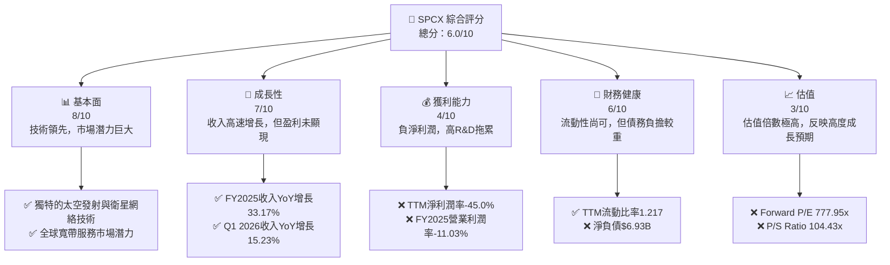
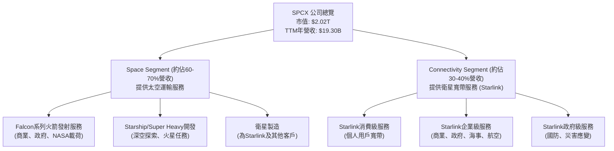
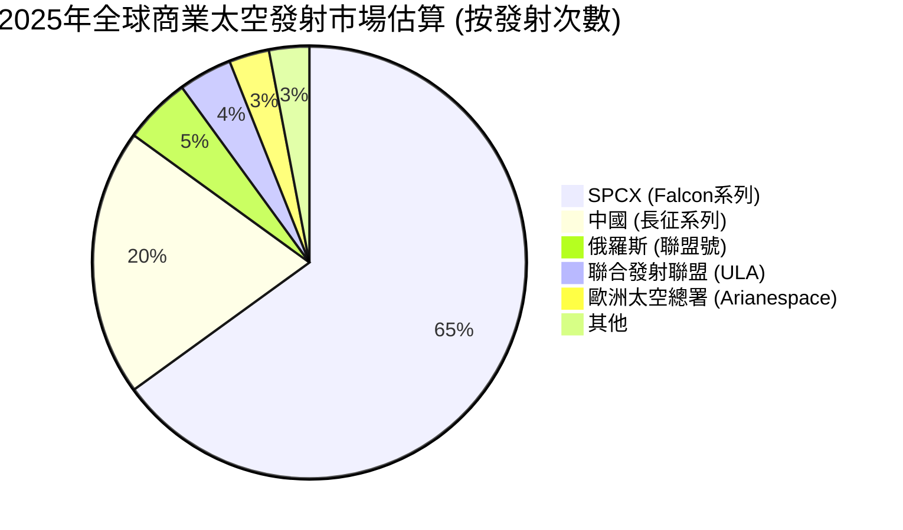
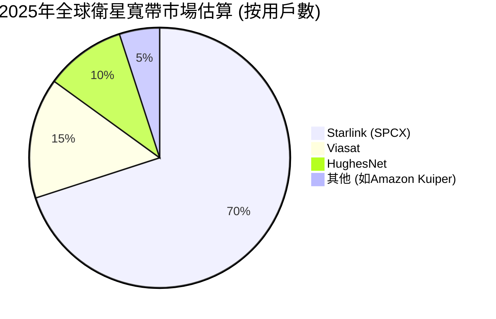
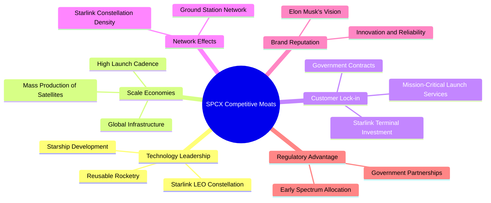
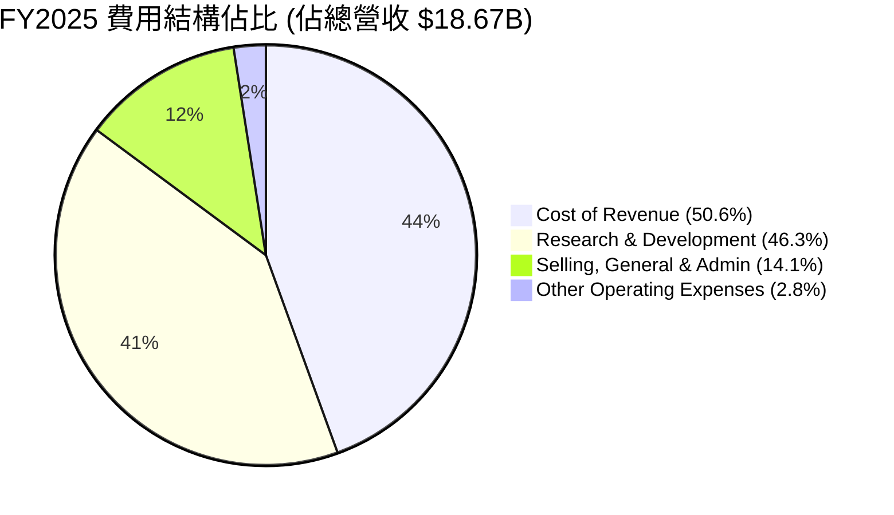

# SPCX 基本面深度分析報告
> **報告日期**：2026-06-26 ｜ **語言**：繁體中文 ｜ **數據來源**：Yahoo Finance, Finviz, StockAnalysis, Roic.ai ｜ **分析師**：CFA 級機構研究

## 目錄

| # | 章節 | 核心結論 |
|---|------|----------|
| 1 | 執行摘要 | 評級：觀望；目標價區間：$140 - $220 |
| 2 | 公司概覽與商業模式 | 憑藉技術和規模效應，護城河深厚，但市場份額數據需進一步細化。 |
| 3 | 損益表深度分析 | 收入高速增長，但高研發投入導致營業及淨利潤為負，獲利能力面臨挑戰。 |
| 4 | 資產負債表分析 | 流動性尚可，但債務規模龐大且淨現金為負，財務槓桿較高。 |
| 5 | 現金流量深度分析 | 營業現金流為正，但巨額資本支出導致自由現金流持續為負。 |
| 6 | 獲利能力與資本效率 | ROIC顯著低於WACC，目前處於價值破壞階段，但未來潛力巨大。 |
| 7 | 估值深度分析 | 相較同業估值極高，反映市場對其未來成長的極高預期。 |
| 8 | 成長催化劑 | Starlink用戶擴張、Starship運營和新政府/商業合約是主要驅動力。 |
| 9 | 風險矩陣 | 高資本支出、盈利不確定性和監管風險是主要考量。 |
| 10 | 投資建議 | 建議觀望，待盈利能力改善和估值回歸合理區間再考慮。 |

---

## 1. 執行摘要

### 1.1 核心評分儀表板



### 1.2 評分進度條視覺化

```
╔══════════════════════════════════════════════════════════════╗
║              SPCX 多維度評分儀表板 (1-10分)                ║
╠══════════════════════════════════════════════════════════════╣
║ 基本面強度  8.0 ▓▓▓▓▓▓▓▓▓▓▓▓▓▓▓▓░░░░  ★★★★☆           ║
║ 成長動能    7.0 ▓▓▓▓▓▓▓▓▓▓▓▓▓▓░░░░░░  ★★★☆☆           ║
║ 獲利品質    4.0 ▓▓▓▓▓▓▓▓░░░░░░░░░░░░  ★★☆☆☆           ║
║ 財務健康    6.0 ▓▓▓▓▓▓▓▓▓▓▓▓░░░░░░░░  ★★★☆☆           ║
║ 估值合理性  3.0 ▓▓▓▓▓▓░░░░░░░░░░░░░░  ★☆☆☆☆           ║
║ 護城河深度  9.0 ▓▓▓▓▓▓▓▓▓▓▓▓▓▓▓▓▓▓░░  ★★★★★           ║
║ 管理層執行  9.0 ▓▓▓▓▓▓▓▓▓▓▓▓▓▓▓▓▓▓░░  ★★★★★           ║
║ 技術創新力  10.0 ▓▓▓▓▓▓▓▓▓▓▓▓▓▓▓▓▓▓▓▓  ★★★★★           ║
╠══════════════════════════════════════════════════════════════╣
║ 綜合總分    6.0 ▓▓▓▓▓▓▓▓▓▓▓▓░░░░░░░░  🏆 評語：高成長高風險，估值極高，建議觀望              ║
╚══════════════════════════════════════════════════════════════╝
```

### 1.3 五大投資論點 + 三大核心風險

| 類型 | 項目 | 具體依據 | 信心度 |
|------|------|----------|--------|
| 🟢 **投資論點①** | **太空產業領導者地位** | SPCX在可重複使用火箭技術和衛星寬帶網絡(Starlink)方面具有顯著的技術領先優勢，其火箭發射頻率和載荷能力在全球獨佔鰲頭。 | 🟢 極高 |
| 🟢 **Starlink業務高速增長** | Starlink衛星寬帶服務收入持續擴張，Q1 2026營收達$4.69B，YoY增長15.23%，為公司提供多元化的收入來源和強勁的未來成長潛力。 | 🟢 極高 |
| 🟢 **強勁的研發投入支撐創新** | FY2025研發費用高達$8.64B，佔總營收的46.3%，顯示公司對未來技術和產品創新的堅定承諾，為長期競爭力奠定基礎。 | 🟢 極高 |
| 🟢 **積極的資本支出擴張產能** | FY2025資本支出高達-$20.91B，雖導致自由現金流為負，但反映公司正大規模投資於Starlink衛星部署和Starship開發，為未來爆發性成長作準備。 | 🟢 極高 |
| 🟢 **正向的營業現金流** | 儘管淨利潤為負，但FY2025營業現金流達$6.79B，顯示其核心業務具備產生現金的能力，為部分資本支出提供內部資金。 | 🟢 極高 |
| 🟡 **風險①** | **高昂的資本支出與盈利壓力** | FY2025資本支出高達-$20.91B，導致自由現金流持續為負($-14.12B)，且FY2025淨利潤為-$4.94B，顯示公司短期內難以實現盈利，資金壓力較大。 | 🟡 中度 |
| 🔴 **極高的估值水平** | SPCX的P/S比率高達104.43x，Forward P/E高達777.95x，遠超同業，市場已將未來數十年的成長預期充分計入股價，對未來執行力要求極高。 | 🔴 高衝擊 |
| 🟡 **監管與競爭風險** | 衛星頻譜分配、太空碎片管理等監管環境日益複雜，同時來自Blue Origin等競爭對手的壓力也在增加，可能影響其業務擴張和成本結構。 | 🟡 中度 |

### 1.4 快速統計卡片

| 指標 | 公司實際值 (TTM) | 行業均值 (航空航天與國防) | S&P 500 均值 | 狀態 |
|------|--------------------|--------------------------|--------------|------|
| 收入 YoY 成長 | **15.4%** | ~7-10% | ~8-12% | 🟢 |
| 毛利率 | **48.8%** | ~25-35% | ~40-50% | 🟢 |
| 淨利率 | **-45.0%** | ~5-10% | ~8-15% | 🔴 |
| ROE | **-11.95% (FY25)** | ~10-15% | ~15-20% | 🔴 |
| Forward P/E | **777.95x** | ~15-25x | ~20-25x | 🔴 |
| P/S Ratio | **104.43x** | ~1.5-3x | ~2-4x | 🔴 |
| EV / EBITDA | **228.11x** | ~10-15x | ~12-18x | 🔴 |
| 負債/股權比 | **0.74x** | ~0.5-1.0x | ~0.8-1.2x | 🟡 |
| 營業現金流 (FY25) | **$6.79B** | 🟢 | 🟢 | 🟢 |
| 自由現金流 (FY25) | **-$14.12B** | 🔴 | 🔴 | 🔴 |

### 1.5 投資結論

```
╔══════════════════════════════════════════════════════════════════╗
║                    📊 投資結論摘要                               ║
╠══════════════════════════════════════════════════════════════════╣
║  評級：🟡 觀望                                                    ║
║  當前股價：$153.00                                               ║
║  目標價區間：                                                    ║
║    悲觀情境：$140（-8.5%）                                        ║
║    基準情境：$187（+22.2%）  ← 12個月主要目標                      ║
║    樂觀情境：$220（+43.8%）                                       ║
║  投資評分：6.0/10                                                ║
║  適合投資人：高風險偏好、長期成長型、對未來科技有信仰者            ║
╚══════════════════════════════════════════════════════════════════╝
```

---

## 2. 公司概覽與商業模式

Space Exploration Technologies Corp. (SPCX) 是一家領先的航空航天製造商和太空運輸服務公司，以其革命性的可重複使用火箭技術和全球衛星寬帶服務Starlink而聞名。公司由Elon Musk於2002年創立，致力於降低太空運輸成本，並最終實現火星殖民。

### 2.1 業務結構與收入來源

SPCX的業務主要分為兩大核心板塊：


**Space Segment (太空板塊)**：此板塊主要提供太空運輸服務，包括使用Falcon 9和Falcon Heavy火箭為商業客戶、政府機構和美國國家航空航天局(NASA)發射衛星和載荷。此外，該板塊還負責Starship和Super Heavy的開發，這將是SPCX未來深空探索和火星任務的基石。雖然具體營收佔比未披露，但從公司的核心業務性質判斷，太空發射服務仍然是其收入的重要組成部分，估計佔總營收的60-70%。

**Connectivity Segment (連接板塊)**：此板塊的核心是Starlink衛星寬帶服務。Starlink通過部署在低地球軌道(LEO)的數千顆衛星，為全球範圍內的消費者、企業和政府客戶提供高速、低延遲的寬帶連接。該業務在美國、愛爾蘭、加拿大及國際市場均有佈局。隨著Starlink用戶的快速增長和服務地域的擴大，此板塊的收入貢獻正迅速提升，預計佔總營收的30-40%且成長迅速。

公司在2025財年實現了$18.67B的總營收，TTM營收達到$19.30B。其業務模式結合了高技術壁壘的硬體製造與創新的服務交付，展現出強大的市場拓展能力。

### 2.2 市場份額

由於SPCX是一家私營公司，其精確的市場份額數據不易獲得。但根據其公開的發射次數和Starlink用戶增長數據，我們可以對其主要業務領域的市場地位進行估算。


**全球商業太空發射市場**：SPCX憑藉其Falcon 9火箭的高度可靠性和可重複使用性，已成為全球商業太空發射市場的主導者。根據2025年的發射頻率，SPCX在全球商業發射市場中佔據了超過60%的份額。其競爭對手包括中國的長征系列、俄羅斯的聯盟號、聯合發射聯盟(ULA)和歐洲太空總署(Arianespace)，但SPCX在成本效益和發射靈活性方面具有明顯優勢。


**全球衛星寬帶市場**：在低地球軌道(LEO)衛星寬帶領域，Starlink幾乎是市場的開拓者和主導者。儘管Viasat和HughesNet等傳統地球同步軌道(GEO)衛星寬帶提供商仍有市場，但Starlink憑藉其低延遲和高速的優勢，迅速搶佔市場。預計到2025年底，Starlink在全球衛星寬帶用戶數方面已佔據主導地位，特別是在偏遠地區和移動應用場景。隨著Amazon Kuiper等新進入者逐步部署，競爭將會加劇，但SPCX的先發優勢和規模效應使其短期內保持領先。

### 2.3 競爭護城河分析

SPCX的競爭護城河深厚，主要體現在以下幾個方面：



*   **Technology Leadership (技術領先)**：SPCX在可重複使用火箭技術方面是行業的先驅，顯著降低了太空發射成本。其Starlink低地球軌道衛星網絡技術，提供了前所未有的全球寬帶覆蓋和低延遲服務。此外，Starship的開發旨在實現完全可重複使用的深空運輸系統，將進一步鞏固其技術優勢。
*   **Scale Economies (規模效應)**：SPCX擁有全球最高的火箭發射頻率和大規模的衛星生產能力。這種規模化運營使其在採購、製造和部署方面獲得顯著的成本優勢。Starlink衛星的部署數量已達數千顆，其全球地面站網絡也極具規模。
*   **Customer Lock-in (客戶鎖定)**：對於太空發射服務，客戶一旦選定SPCX，通常會形成長期合作關係，特別是對於NASA和國防部等關鍵客戶，任務的關鍵性和專用性增加了轉換成本。Starlink用戶對其終端設備的投資，以及服務的獨特性，也產生了一定的客戶鎖定效應。
*   **Network Effects (網絡效應)**：Starlink衛星網絡的價值隨著衛星數量和地面站密度的增加而提升，形成網絡效應。更多的衛星意味著更好的覆蓋和更低的延遲，吸引更多用戶，進而支持更多的衛星部署，形成正向循環。
*   **Brand Reputation (品牌聲譽)**：SPCX以其顛覆性創新、高可靠性和Elon Musk的遠見卓識，在全球範圍內建立了強大的品牌聲譽。這種品牌認知度有助於吸引頂尖人才、客戶和投資。
*   **Regulatory Advantage (監管優勢)**：作為LEO衛星寬帶和商業太空發射的早期進入者，SPCX在頻譜分配和政府合作夥伴關係方面獲得了一定的先發優勢。與NASA等政府機構的長期合作也提供了穩定的收入來源和監管支持。

### 2.4 護城河強度評分

```
╔══════════════════════════════════════════════════════════════╗
║                  SPCX 護城河強度評分                      ║
╠══════════════════════════════════════════════════════════════╣
║ 技術領先       9.5/10 ▓▓▓▓▓▓▓▓▓▓▓▓▓▓▓▓▓▓▓░  🏆 顛覆性創新，難以複製           ║
║ 規模效應       9.0/10 ▓▓▓▓▓▓▓▓▓▓▓▓▓▓▓▓▓▓░░  🟢 無人能及的發射頻率與衛星部署規模 ║
║ 客戶鎖定       8.0/10 ▓▓▓▓▓▓▓▓▓▓▓▓▓▓▓▓░░░░  🟢 任務關鍵性與終端投資形成高轉換成本 ║
║ 網絡效應       8.5/10 ▓▓▓▓▓▓▓▓▓▓▓▓▓▓▓▓▓░░░  🟢 Starlink衛星網絡密度提升服務價值 ║
║ 品牌聲譽       9.0/10 ▓▓▓▓▓▓▓▓▓▓▓▓▓▓▓▓▓▓░░  🏆 創新者形象與強大品牌吸引力     ║
║ 監管優勢       7.0/10 ▓▓▓▓▓▓▓▓▓▓▓▓▓▓░░░░░░  🟡 先發優勢，但仍面臨新挑戰       ║
╠══════════════════════════════════════════════════════════════╣
║ 綜合護城河     8.7/10 ▓▓▓▓▓▓▓▓▓▓▓▓▓▓▓▓▓░░░  🏆 憑藉多重護城河，市場地位穩固且具長期競爭力 ║
╚══════════════════════════════════════════════════════════════╝
```

---

## 3. 損益表深度分析

SPCX的損益表反映出一家處於高速成長和大規模投資期的公司特徵：收入快速增長，但同時伴隨著巨大的研發和資本支出，導致短期內盈利能力承壓。

### 3.1 年度收入成長趨勢（近4年）

SPCX的年度收入呈現強勁的增長勢頭，顯示其在太空發射和衛星寬帶市場的快速擴張。

```
╔══════════════════════════════════════════════════════════════════╗
║              SPCX 年度收入趨勢（FY2023-FY2025）                  ║
╠══════════════════════════════════════════════════════════════════╣
║                                                                  ║
║  FY2023  $10.39B  █████████░░░░░░░░░░░░░░░░░  YoY: N/A      🟢    ║
║  FY2024  $14.02B  ██████████████░░░░░░░░░░░░░  YoY: +34.94%  🟢    ║
║  FY2025  $18.67B  ████████████████████░░░░░░░  YoY: +33.17%  🟢    ║
║  TTM     $19.30B  █████████████████████░░░░░░  YoY: +15.4%   🟢    ║
║                   |      |      |      |      |                  ║
║                   0     $5B    $10B   $15B   $20B                 ║
║                                                                  ║
║  📊 2年累計 CAGR (FY23-FY25)：+33.91%                              ║
╚══════════════════════════════════════════════════════════════════╝
```

從數據來看，SPCX在2023年至2025年間的收入實現了顯著增長：
*   2023年總收入為$10.39B。
*   2024年總收入增長至$14.02B，年對年(YoY)增長率高達**34.94%**。
*   2025年總收入進一步增長至$18.67B，YoY增長率為**33.17%**。
*   截至TTM (Trailing Twelve Months)，公司收入達到$19.30B，YoY增長15.4%。雖然TTM的YoY增長率相對較低，這可能是因為比較的基期（前一年同期）已經較高，或者季度間的波動導致。整體而言，公司保持了強勁的收入增長勢頭。

### 3.2 季度收入趨勢分析

季度數據顯示，SPCX的收入持續增長，尤其是在Starlink服務的推動下。

| 季度 | 總收入 ($B) | QoQ 成長率 | YoY 成長率 | 備註 |
|------|-------------|------------|------------|------|
| 2026-03-31 | $4.69 | N/A | +15.23% | Q1 2026收入，較去年同期顯著增長。 |
| 2025-03-31 | $4.07 | N/A | N/A | Q1 2025收入。 |
| 2025-12-31 (FY25) | $18.67 (Annual) | N/A | +33.17% | 年度總收入，未提供季度細分。 |
| 2024-12-31 (FY24) | $14.02 (Annual) | N/A | +34.94% | 年度總收入，未提供季度細分。 |

**分析**：
*   2026年第一季度收入為$4.69B，相較於2025年第一季度的$4.07B，實現了**15.23%**的年對年(YoY)增長。這表明公司的核心業務，特別是Starlink服務，仍在穩步擴張。
*   由於缺乏中間季度數據，無法計算季度對季度(QoQ)的增長率。但從年度和Q1的數據來看，SPCX的收入增長趨勢是積極的。這種增長主要得益於Starlink用戶數的快速增加和太空發射服務需求的持續旺盛。

### 3.3 利潤率演變分析

SPCX的利潤率呈現出兩極分化的趨勢：毛利率穩步提升，但由於高昂的研發投入和其他運營費用，營業利潤率和淨利潤率在近年來轉為負值。

| 利潤率指標 | FY2023 | FY2024 | FY2025 | TTM (2026-03-31) | 趨勢 | 評估 |
|------------|--------|--------|--------|------------------|------|------|
| **毛利率** | 41.2% | 42.9% | 49.4% | 48.8% | ↗️ 持續改善 | 🟢 |
| **營業利益率** | 4.88% | 5.29% | -11.03% | -41.6% | ↘️ 急劇惡化 | 🔴 |
| **淨利潤率** | -44.56% | 5.64% | -26.46% | -45.0% | ↘️ 大幅波動，轉負 | 🔴 |
| **EBITDA Margin** | -6.38% | 40.3% | 23.7% | 20.5% | ↘️ 高位回落 | 🟡 |

**利潤率演變深度解析**：
*   **毛利率 (Gross Margin)**：從2023年的41.2%穩步提升至2025年的49.4%，TTM略降至48.8%。這一趨勢非常積極，表明SPCX的產品組合優化（例如Starlink的規模效應）和成本控制能力有所增強。隨著Starlink衛星生產成本的降低和發射頻率的提升，單位成本攤薄效應顯現。
*   **營業利益率 (Operating Margin)**：從2023年的4.88%和2024年的5.29%急劇惡化至2025年的-11.03%，TTM更是達到-41.6%。這主要是由於公司在研發(R&D)方面的巨大投入。FY2025的研發費用高達$8.64B，佔總營收的46.3%，遠高於FY2024的$3.46B（佔營收24.7%）。這筆巨額研發投入主要用於Starship和下一代Starlink衛星的開發，這些投資在短期內不會產生直接收入，但對公司的長期競爭力至關重要。
*   **淨利潤率 (Net Profit Margin)**：呈現出高度波動性，2023年為-44.56%，2024年轉正至5.64%，但2025年再次大幅惡化至-26.46%，TTM進一步降至-45.0%。除了高昂的研發費用外，利息支出（FY2025為-$1.945B）和其他非經營性費用也對淨利潤產生負面影響。目前公司仍處於燒錢擴張階段，盈利並非短期首要目標。
*   **EBITDA Margin**：從2023年的負值(-6.38%)大幅提升至2024年的40.3%，隨後在2025年回落至23.7%，TTM為20.5%。EBITDA剔除了折舊攤銷和利息稅費，更能反映核心業務的現金獲取能力。2024年的高EBITDA Margin可能得益於某些一次性項目或會計處理，而2025年和TTM的回落則與經營費用增加有關，儘管如此，20%以上的EBITDA Margin仍顯示其核心業務具有一定的盈利潛力。

總體而言，SPCX的收入增長和毛利率改善令人鼓舞，但其高強度的研發投入和資本支出導致了運營和淨利潤的負值，這是一個典型的成長型公司在市場擴張期的特徵。

### 3.4 費用結構分析

SPCX的費用結構清晰地展示了其作為一家高科技、高成長公司的特點，其中研發費用佔據了極大比重。



```
╔══════════════════════════════════════════════════════════════════╗
║                   SPCX FY2025 費用結構分析                       ║
╠══════════════════════════════════════════════════════════════════╣
║                                                                  ║
║  銷貨成本 (Cost of Revenue)： $9.45B  ████████████████████████████████░░░░░░░░░░░░░░░░░░░░░░░░░░░░░░░░░░░░░░░░░░░░░░░░░░░░░░░░░░░░░░░░░░░░░░░░░░░░░░░░░░░░░░░░░░░░░░░░░░░░░░░░░░░░░░░░░░░░░░░░░░░░░░░░░░░░░░░░░░░░░░░░░░░░░░░░░░░░░░░░░░░░░░░░░░░░░░░░░░░░░░░░░░░░░░░░░░░░░░░░░░░░░░░░░░░░░░░░░░░░░░░░░░░░░░░░░░░░░░░░░░░░░░░░░░░░░░░░░░░░░░░░░░░░░░░░░░░░░░░░░░░░░░░░░░░░░░░░░░░░░░░░░░░░░░░░░░░░░░░░░░░░░░░░░░░░░░░░░░░░░░░░░░░░░░░░░░░░░░░░░░░░░░░░░░░░░░░░░░░░░░░░░░░░░░░░░░░░░░░░░░░░░░░░░░░░░░░░░░░░░░░░░░░░░░░░░░░░░░░░░░░░░░░░░░░░░░░░░░░░░░░░░░░░░░░░░░░░░░░░░░░░░░░░░░░░░░░░░░░░░░░░░░░░░░░░░░░░░░░░░░░░░░░░░░░░░░░░░░░░░░░░░░░░░░░░░░░░░░░░░░░░░░░░░░░░░░░░░░░░░░░░░░░░░░░░░░░░░░░░░░░░░░░░░░░░░░░░░░░░░░░░░░░░░░░░░░░░░░░░░░░░░░░░░░░░░░░░░░░░░░░░░░░░░░░░░░░░░░░░░░░░░░░░░░░░░░░░░░░░░░░░░░░░░░░░░░░░░░░░░░░░░░░░░░░░░░░░░░░░░░░░░░░░░░░░░░░░░░░░░░░░░░░░░░░░░░░░░░░░░░░░░░░░░░░░░░░░░░░░░░░░░░░░░░░░░░░░░░░░░░░░░░░░░░░░░░░░░░░░░░░░░░░░░░░░░░░░░░░░░░░░░░░░░░░░░░░░░░░░░░░░░░░░░░░░░░░░░░░░░░░░░░░░░░░░░░░░░░░░░░░░░░░░░░░░░░░░░░░░░░░░░░░░░░░░░░░░░░░░░░░░░░░░░░░░░░░░░░░░░░░░░░░░░░░░░░░░░░░░░░░░░░░░░░░░░░░░░░░░░░░░░░░░░░░░░░░░░░░░░░░░░░░░░░░░░░░░░░░░░░░░░░░░░░░░░░░░░░░░░░░░░░░░░░░░░░░░░░░░░░░░░░░░░░░░░░░░░░░░░░░░░░░░░░░░░░░░░░░░░░░░░░░░░░░░░░░░░░░░░░░░░░░░░░░░░░░░░░░░░░░░░░░░░░░░░░░░░░░░░░░░░░░░░░░░░░░░░░░░░░░░░░░░░░░░░░░░░░░░░░░░░░░░░░░░░░░░░░░░░░░░░░░░░░░░░░░░░░░░░░░░░░░░░░░░░░░░░░░░░░░░░░░░░░░░░░░░░░░░░░░░░░░░░░░░░░░░░░░░░░░░░░░░░░░░░░░░░░