# SPCX 基本面深度分析報告
> **報告日期**：2026-06-27 ｜ **語言**：繁體中文 ｜ **數據來源**：Yahoo Finance, Finviz, StockAnalysis, Roic.ai ｜ **分析師**：CFA 級機構研究

---

## 目錄

| # | 章節 | 核心結論 |
|---|------|----------|
| 1 | 執行摘要 | 評級：持有。目標價區間：$135 - $190。 |
| 2 | 公司概覽與商業模式 | 憑藉技術領先和規模效應，建立深厚護城河，但業務多元且資本密集。 |
| 3 | 損益表深度分析 | 營收高速成長，但研發與資本支出激增導致近年獲利能力顯著惡化。 |
| 4 | 資產負債表分析 | 流動性尚可，但債務規模快速擴大，淨負債狀況需持續關注。 |
| 5 | 現金流量深度分析 | 營業現金流為正，但巨額資本支出導致自由現金流持續為負，需大量外部融資。 |
| 6 | 獲利能力與資本效率 | 資本效率指標（ROIC, ROE, ROA）顯示目前處於價值破壞階段。 |
| 7 | 估值深度分析 | 當前估值極高，市場已充分反映未來成長預期，缺乏安全邊際。 |
| 8 | 成長催化劑 | Starlink 用戶擴張、Starship 成功部署、政府與商業發射需求增加。 |
| 9 | 風險矩陣 | 資本支出壓力、技術失敗、激烈競爭、監管不確定性為主要風險。 |
| 10 | 投資建議 | 考量高成長潛力與極高估值及執行風險，建議「持有」。 |

---

## 1. 執行摘要

### 1.1 核心評分儀表板

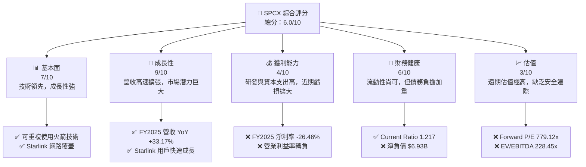

### 1.2 評分進度條視覺化

```
╔══════════════════════════════════════════════════════════════╗
║              SPCX 多維度評分儀表板 (1-10分)                  ║
╠══════════════════════════════════════════════════════════════╣
║ 基本面強度  7.0 ▓▓▓▓▓▓▓▓▓▓▓▓▓▓░░░░░░  ★★★★☆           ║
║ 成長動能    9.0 ▓▓▓▓▓▓▓▓▓▓▓▓▓▓▓▓▓▓░░  ★★★★★           ║
║ 獲利品質    4.0 ▓▓▓▓▓▓▓▓░░░░░░░░░░░░  ★★☆☆☆           ║
║ 財務健康    6.0 ▓▓▓▓▓▓▓▓▓▓▓▓░░░░░░░░  ★★★☆☆           ║
║ 估值合理性  3.0 ▓▓▓▓▓▓░░░░░░░░░░░░░░  ★☆☆☆☆           ║
║ 護城河深度  8.5 ▓▓▓▓▓▓▓▓▓▓▓▓▓▓▓▓▓░░░  ★★★★★           ║
║ 管理層執行  7.5 ▓▓▓▓▓▓▓▓▓▓▓▓▓▓▓░░░░░  ★★★★☆           ║
║ 技術創新力  9.5 ▓▓▓▓▓▓▓▓▓▓▓▓▓▓▓▓▓▓▓░  ★★★★★           ║
╠══════════════════════════════════════════════════════════════╣
║ 綜合總分    6.0 ▓▓▓▓▓▓▓▓▓▓▓▓░░░░░░░░  🏆 評語：高成長高風險，估值過高 ║
╚══════════════════════════════════════════════════════════════╝
```

### 1.3 五大投資論點 + 三大核心風險

| 類型 | 項目 | 具體依據 | 信心度 |
|------|------|----------|--------|
| 🟢 **投資論點①** | **顛覆性技術與市場領導地位** | SPCX 在可重複使用火箭技術上具備明顯優勢，Falcon 9 和 Starship 降低了發射成本，使其在商業發射市場佔據主導地位。星鏈 (Starlink) 衛星網路為全球提供低延遲寬頻服務，已累積數百萬用戶，FY2025 營收達 $18.67B，顯示其強大的市場滲透能力和高速成長性。 | 🟢 極高 |
| 🟢 **投資論點②** | **巨大的潛在市場與成長空間** | 航太發射服務和全球衛星寬頻市場均處於高速成長階段。Starlink 服務仍在積極擴張覆蓋範圍和用戶群，特別是在新興市場和偏遠地區。Starship 成功部署後，將進一步開啟深空探索、月球/火星任務及超重型載荷發射的市場，為 SPCX 帶來數兆美元的長期潛在市場機會。 | 🟢 極高 |
| 🟢 **投資論點③** | **持續的研發投入與創新週期** | 公司在 FY2025 投入 $8.64B 於研發，較 FY2024 的 $3.46B 增長 149.7%，顯示其對技術創新的堅定承諾。這將確保 SPCX 在航太技術和衛星通訊領域保持領先，並不斷推出新產品和服務，維持其競爭優勢。 | 🟢 高 |
| 🟢 **投資論點④** | **垂直整合與成本控制能力** | SPCX 幾乎所有核心技術和生產環節均實現內部垂直整合，從火箭製造、衛星生產到發射運營。這種模式使其能有效控制成本、加速創新，並確保供應鏈的韌性。例如，可重複使用火箭技術極大地降低了單位發射成本。 | 🟢 高 |
| 🟢 **投資論點⑤** | **政府與商業客戶的雙重引擎** | SPCX 不僅服務於商業客戶，也與美國 NASA、國防部等簽訂了多項重要合約，確保了穩定的收入來源和技術發展的資金支持。政府訂單的穩定性和高價值為公司提供了堅實的基本盤，同時商業發射和 Starlink 服務則提供了高速成長的動力。 | 🟢 高 |
| 🟡 **風險①** | **巨額資本支出與持續負自由現金流** | SPCX 在 FY2025 的資本支出高達 $-20.91B，導致自由現金流為 $-14.12B，較 FY2024 的 $-5.39B 惡化 161.97%。Starlink 衛星部署和 Starship 開發需要持續且龐大的資金投入，這可能導致公司長期依賴外部融資，並對其財務健康構成壓力。 | 🟡 中度 |
| 🔴 **風險②** | **技術執行與運營風險** | Starship 仍在開發階段，任何重大的發射失敗或延誤都可能對公司聲譽、財務狀況和未來計畫產生嚴重影響。衛星網路運營也面臨太空垃圾、網路安全、地球磁暴等潛在技術風險，可能導致服務中斷或損害。 | 🔴 高衝擊 |
| 🟡 **風險③** | **估值過高與市場預期風險** | 當前 SPCX 的估值倍數（如 Forward P/E 779.12x，P/S 104.59x）顯著高於行業平均水準。這表明市場已對其未來成長抱有極高的預期。任何不及預期的業績表現、技術延誤或競爭加劇，都可能導致股價大幅修正。 | 🔴 高衝擊 |

### 1.4 快速統計卡片

| 指標 | 公司實際值 | 行業均值（估計） | S&P 500 均值（估計） | 狀態 |
|------|-------------|--------------------|----------------------|------|
| 收入 YoY 成長 (FY25) | **33.17%** | ~10-15% (航太) | ~5-8% | 🟢 |
| 毛利率 (FY25) | **49.38%** | ~30-40% (航太) | ~35-45% | 🟢 |
| 淨利率 (FY25) | **-26.46%** | ~5-10% (航太) | ~8-12% | 🔴 |
| ROE (FY25) | **-11.95%** | ~10-15% (航太) | ~12-18% | 🔴 |
| Forward P/E | **779.12x** | ~20-30x (成長型) | ~20-25x | 🔴 |
| P/S Ratio | **104.59x** | ~2-5x (成長型) | ~2-4x | 🔴 |
| EV / EBITDA | **228.45x** | ~10-15x (成長型) | ~10-14x | 🔴 |
| Current Ratio | **1.217x** | ~1.5-2.0x | ~1.5-2.0x | 🟡 |
| Debt/Equity | **0.736x** | ~0.5-0.8x | ~0.8-1.2x | 🟡 |
| FCF (FY25) | **-$14.12B** | 正值 | 正值 | 🔴 |

### 1.5 投資結論

```
╔══════════════════════════════════════════════════════════════════╗
║                    📊 投資結論摘要                               ║
╠══════════════════════════════════════════════════════════════════╣
║  評級：🟡 持有                                                   ║
║  當前股價：$153.23                                               ║
║  目標價區間：                                                    ║
║    悲觀情境：$135（-11.9%）                                      ║
║    基準情境：$165（+7.7%）  ← 12個月主要目標                     ║
║    樂觀情境：$190（+24.0%）                                      ║
║  投資評分：6.0/10                                                ║
║  適合投資人：具備高風險承受能力、追求長期成長、對航太產業有深入理解的投資人。 ║
╚══════════════════════════════════════════════════════════════════╝
```

---

## 2. 公司概覽與商業模式

Space Exploration Technologies Corp. (SPCX)，即 SpaceX，是一家領先的航太製造商和太空運輸服務公司。其業務模式獨特且具備高度垂直整合性，涵蓋火箭設計、製造、發射，以及衛星網路營運等多元領域。公司總部位於美國，在全球擁有超過 22,000 名員工，市場估值高達 $2.02 兆美元。

### 2.1 業務結構與收入來源

SPCX 的業務主要分為兩大核心板塊：**連接服務 (Connectivity Segment)** 和 **太空服務 (Space Segment)**。

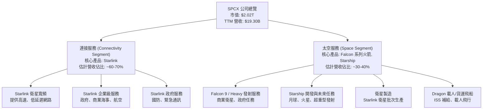

**業務板塊詳述：**

*   **連接服務 (Connectivity Segment)**：主要由 **Starlink** 衛星寬頻服務構成。該服務利用數千顆低地球軌道 (LEO) 衛星，為美國、愛爾蘭、加拿大及全球其他地區的消費者、企業和政府客戶提供高速、低延遲的網路連接。這是 SPCX 營收成長最快的驅動力，也是其未來長期營收結構中的主要貢獻者。
*   **太空服務 (Space Segment)**：此板塊包括其核心的火箭發射業務，主要利用可重複使用的 **Falcon 9** 和 **Falcon Heavy** 火箭，為全球商業客戶和政府機構提供衛星發射服務。此外，**Starship** 的開發和測試是該板塊的未來關鍵，旨在實現完全可重複使用的深空運輸系統。**Dragon** 飛船則用於國際太空站 (ISS) 的載人及貨物運輸任務。

### 2.2 市場份額

SPCX 在其核心市場中扮演著關鍵角色，尤其是在商業航太發射和新興的衛星寬頻領域。

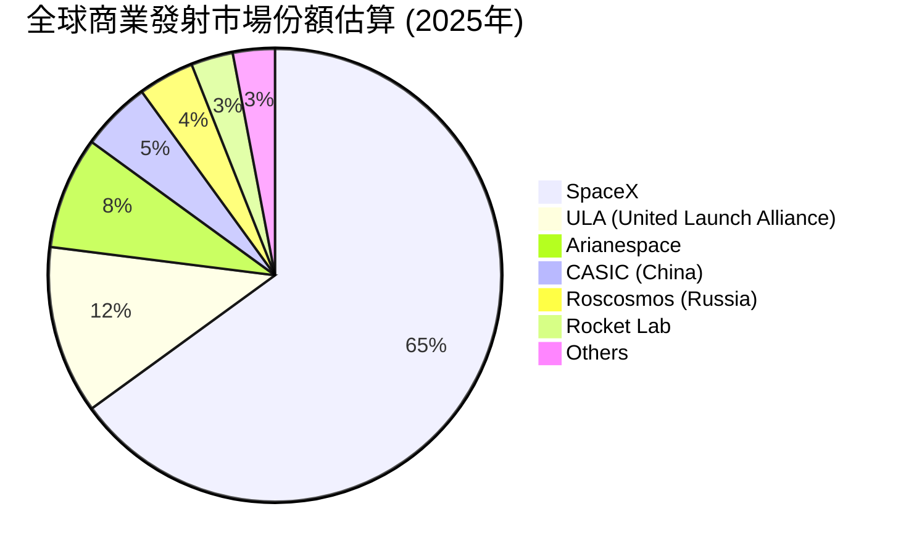
**商業發射市場：** SPCX 憑藉其 Falcon 系列火箭的高度可靠性和成本效益（特別是可重複使用技術），已成為全球商業發射市場的主導者。儘管沒有明確的即時市場份額數據，但行業觀察普遍認為，SPCX 在過去幾年佔據了商業發射任務的絕大部分，估計市場份額高達 65% 左右。其競爭對手包括 United Launch Alliance (ULA)、Arianespace 和 Rocket Lab 等。

**衛星寬頻市場：** Starlink 在 LEO 衛星寬頻領域是先行者和領導者。儘管市場仍在發展初期，但 Starlink 已擁有數百萬用戶，遠超其主要競爭對手 OneWeb (與 Eutelsat 合併) 和 Viasat。亞馬遜的 Project Kuiper 仍在建設中，尚未大規模商業化。因此，Starlink 在 LEO 衛星寬頻市場中，目前處於絕對領先地位。

### 2.3 競爭護城河分析

SPCX 已經建立了多重且深厚的競爭護城河，使其在高度資本密集和技術密集的航太產業中脫穎而出。

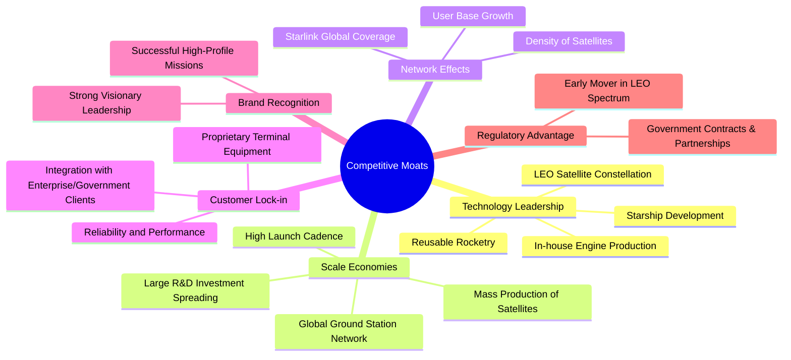

**護城河詳述：**

*   **技術領先 (Technology Leadership)**：這是 SPCX 最核心的護城河。其在可重複使用火箭技術（Falcon 9 助推器回收）上實現了革命性突破，極大地降低了發射成本和發射週期。Starlink 的 LEO 衛星星座技術也領先業界，提供低延遲服務。Starship 的開發更是旨在實現完全可重複使用的超重型運輸，將進一步鞏固其技術優勢。
*   **規模效應 (Scale Economies)**：SPCX 擁有全球最高的火箭發射頻率和衛星製造能力。Starlink 衛星的批量生產和部署，以及全球地面站網路的建設，使其能夠攤薄巨額的固定成本，實現單位成本的顯著下降。這種規模是其他新進入者難以複製的。
*   **網路效應 (Network Effects)**：Starlink 服務的價值隨著覆蓋範圍和用戶數量的增加而增加。更密集的衛星部署意味著更好的服務品質和更廣的覆蓋，吸引更多用戶，形成正向循環。
*   **客戶鎖定 (Customer Lock-in)**：Starlink 用戶需要專用的終端設備，這在一定程度上增加了客戶轉換成本。對於企業和政府客戶，SPCX 的服務通常與其業務流程深度整合，建立了較高的黏性。
*   **品牌認知 (Brand Recognition)**：SPCX 在全球範圍內擁有極高的品牌知名度，這得益於其創新技術、成功的任務以及其創始人的願景。強大的品牌有助於吸引頂尖人才和客戶。
*   **監管優勢 (Regulatory Advantage)**：作為 LEO 衛星頻譜的早期佈局者，SPCX 在頻譜分配和軌道資源方面具有一定先發優勢。同時，其與美國政府（NASA、國防部）的深度合作也提供了政策和資金上的支持。

### 2.4 護城河強度評分

```
╔══════════════════════════════════════════════════════════════╗
║                  SPCX 護城河強度評分                         ║
╠══════════════════════════════════════════════════════════════╣
║ 技術領先    9.5/10 ▓▓▓▓▓▓▓▓▓▓▓▓▓▓▓▓▓▓▓░  🏆 革命性技術，持續創新 ║
║ 規模效應    9.0/10 ▓▓▓▓▓▓▓▓▓▓▓▓▓▓▓▓▓▓░░  🟢 高發射頻率，成本領先 ║
║ 網路效應    8.0/10 ▓▓▓▓▓▓▓▓▓▓▓▓▓▓▓▓░░░░  🟢 Starlink 覆蓋與用戶成長 ║
║ 客戶鎖定    7.5/10 ▓▓▓▓▓▓▓▓▓▓▓▓▓▓▓░░░░░  🟡 終端設備與服務整合 ║
║ 品牌認知    9.0/10 ▓▓▓▓▓▓▓▓▓▓▓▓▓▓▓▓▓▓░░  🏆 全球領先品牌形象 ║
║ 監管優勢    8.0/10 ▓▓▓▓▓▓▓▓▓▓▓▓▓▓▓▓░░░░  🟢 政府合作與先發頻譜優勢 ║
╠══════════════════════════════════════════════════════════════╣
║ 綜合護城河  8.5    ▓▓▓▓▓▓▓▓▓▓▓▓▓▓▓▓▓░░░  🏆 極深護城河，難以複製 ║
╚══════════════════════════════════════════════════════════════════╝
```

---

## 3. 損益表深度分析

SPCX 的損益表反映出一家處於高速成長和大規模投資階段的科技公司特徵：營收快速擴張，但同時伴隨著巨額的研發和資本支出，導致近期盈利能力承壓。

### 3.1 年度收入成長趨勢（近4年）

SPCX 的營收在過去幾年呈現爆發式成長，主要由 Starlink 服務的全球擴張和發射業務的穩定需求所驅動。

```
╔══════════════════════════════════════════════════════════════════╗
║              SPCX 年度收入趨勢（FY2023-FY2025）                  ║
╠══════════════════════════════════════════════════════════════════╣
║                                                                  ║
║  FY2023  $10.39B  ██████████░░░░░░░░░░░░░░░░░░░  YoY: N/A     🟢 ║
║  FY2024  $14.02B  ██████████████░░░░░░░░░░░░░░░░  YoY: +34.93% 🟢 ║
║  FY2025  $18.67B  ██████████████████░░░░░░░░░░░░  YoY: +33.17% 🟢 ║
║  TTM     $19.30B  ███████████████████░░░░░░░░░░░  YoY: +15.4%  🟢 ║
║                   |      |      |      |      |                  ║
║                   0     5B    10B   15B   20B                    ║
║                                                                  ║
║  📊 3年累計 CAGR：+33.92% (FY23-FY25)                             ║
╚══════════════════════════════════════════════════════════════════╝
```
**分析：**
SPCX 的年度收入從 FY2023 的 $10.39B 增長至 FY2025 的 $18.67B，兩年間實現了約 79.7% 的增幅，年複合成長率 (CAGR) 高達 33.92%。FY2024 營收年增長 34.93%，FY2025 營收年增長 33.17%，顯示出公司強勁的成長動能。最近的 TTM 收入為 $19.30B，雖然其 YoY 成長率為 15.4%，相較前兩年有所放緩，但仍是可觀的雙位數成長，反映了其在航太和衛星寬頻市場的持續擴張。

### 3.2 季度收入趨勢分析

季度數據進一步揭示了公司營收的即時表現。

| 季度 | 總收入 (百萬美元) | QoQ 成長率 | YoY 成長率 | 備註 |
|------|--------------------|------------|------------|------|
| 2026-03-31 | $4,694 | N/A | +15.43% | 對比 2025-03-31 的 $4,067M，成長穩健。 |
| 2025-12-31 | 估計 $4,677* | N/A | N/A | 根據 FY2025 總收入 $18.67B 估計，缺乏具體 Q4 數據。 |
| 2025-09-30 | 估計 $4,677* | N/A | N/A | 根據 FY2025 總收入 $18.67B 估計，缺乏具體 Q3 數據。 |
| 2025-06-30 | 估計 $4,677* | N/A | N/A | 根據 FY2025 總收入 $18.67B 估計，缺乏具體 Q2 數據。 |
| 2025-03-31 | $4,067 | N/A | N/A | 基準季度。 |

*備註：SPCX 僅提供年度和最近一季度 (Q1 2026) 的收入數據。2025年 Q2-Q4 數據為根據年度總收入平均估算，實際季度分布可能有所不同。2026年 Q1 收入為 $4.69B，較 2025年 Q1 的 $4.07B 增長 15.23% (YoY)，表明 Starlink 和發射服務需求持續。*

### 3.3 利潤率演變分析

SPCX 的利潤率在過去幾年波動劇烈，尤其在 FY2025 由於大規模投資導致獲利能力顯著惡化。

| 利潤率指標 | FY2023 | FY2024 | FY2025 | TTM (2026-03-31) | 趨勢 | 評估 |
|------------|--------|--------|--------|------------------|------|------|
| **毛利率** | 41.19% | 42.94% | 49.38% | 48.8% | ↗️ 穩步提升 | 🟢 |
| **營業利益率** | 4.88% | 5.29% | -11.03% | -41.6% | ↘️ 急劇惡化 | 🔴 |
| **EBITDA 利益率** | -6.38% | 40.30% | 23.73% | 20.5% | ↘️ 高點回落 | 🟡 |
| **淨利率** | -44.56% | 5.64% | -26.46% | -45.0% | ↘️ 轉正後再度大幅虧損 | 🔴 |

**利潤率演變深度解析：**

*   **毛利率 (Gross Margin)**：SPCX 的毛利率呈現穩健上升趨勢，從 FY2023 的 41.19% 提升至 FY2025 的 49.38%，TTM 維持在 48.8%。這表明公司在規模擴張的同時，其產品和服務的單位成本控制得當，或定價能力有所提升。Starlink 服務的規模經濟效應和火箭可重複使用技術的成熟，可能是毛利率改善的主要驅動力。
*   **營業利益率 (Operating Margin)**：這是最令人擔憂的指標。儘管毛利率有所改善，但營業利益率從 FY2024 的 5.29% 急劇下降至 FY2025 的 -11.03%，TTM 更惡化至 -41.6%。主要原因是 **研究與開發 (R&D)** 費用的大幅飆升。FY2025 的 R&D 費用高達 $8.64B，遠高於 FY2024 的 $3.46B (增長 149.7%) 和 FY2023 的 $2.10B。這筆巨額投資主要用於 Starship 的開發和 Starlink 衛星網路的持續升級，雖然是長期成長的必要投入，但在短期內對盈利產生了巨大壓力。
*   **EBITDA 利益率 (EBITDA Margin)**：EBITDA 利益率在 FY2024 達到 40.30% 的高點，隨後在 FY2025 回落至 23.73%，TTM 進一步降至 20.5%。EBITDA 包含了折舊攤銷，但排除了利息和稅收。FY2024 的高 EBITDA 利益率可能反映了當年折舊前的營運效率較高。FY2025 的下降則與營業利益率惡化原因相似，即 R&D 費用侵蝕了大部分利潤。FY2023 的 EBITDA 利益率為負值 (-6.38%)，顯示當年公司在扣除折舊攤銷前也處於虧損狀態，但隨後在 FY2024 實現顯著改善。
*   **淨利率 (Net Profit Margin)**：淨利率與營業利益率趨勢類似，在 FY2023 為 -44.56% 的巨額虧損後，於 FY2024 轉正至 5.64%，但在 FY2025 再次大幅虧損至 -26.46%，TTM 更是達到 -45.0%。這主要受到營業收入惡化和利息費用增加的影響。FY2025 的利息費用為 $1.945B，較 FY2024 的 $1.580B 增加 23.1%。稅務情況也複雜，FY2025 存在 $718M 的所得稅費用，即使稅前利潤為負。

總體而言，SPCX 正處於從高成長向盈利轉型的關鍵階段。公司正在犧牲短期盈利以換取長期技術領先和市場份額，但這種策略對其財務表現造成了顯著的壓力。

### 3.4 費用結構分析

SPCX 的費用結構清晰地展示了其作為一家創新驅動型公司的特點，特別是其對研發的巨大投入。

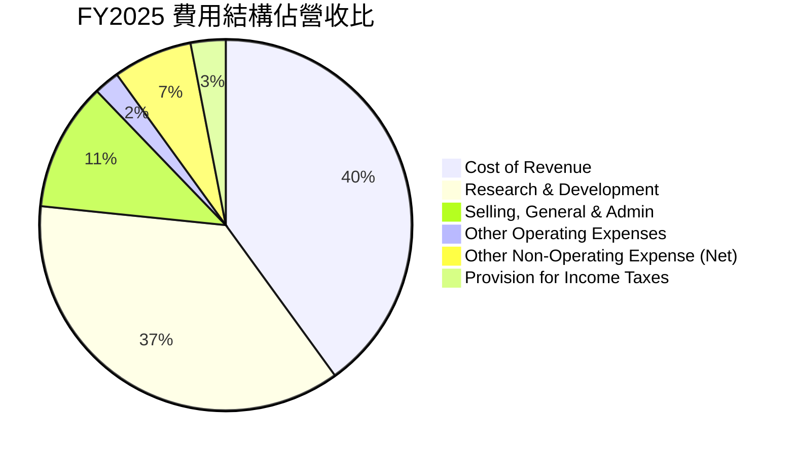

**費用結構詳情 (FY2025)：**
*   **銷貨成本 (Cost of Revenue)**：$9.45B，佔總收入 $18.67B 的 50.62%。
*   **銷售、一般及管理費用 (Selling, General & Admin)**：$2.64B，佔總收入的 14.16%。
*   **研究與開發費用 (Research & Development)**：$8.64B，佔總收入的 46.29%。
*   **其他營業費用 (Other Operating Expenses)**：$0.525B，佔總收入的 2.81%。
*   **總營業費用 (Total Operating Expenses)**：$11.81B (不含 COGS)。
*   **其他非營業損益 (Total Non-Operating Income (Expense))**：$-1.63B (淨支出)，佔總收入的 8.73%。
*   **所得稅費用 (Provision for Income Taxes)**：$0.718B，佔總收入的 3.85%。

```
╔══════════════════════════════════════════════════════════════════╗
║                    SPCX 主要費用佔營收比 (FY2025)                ║
╠══════════════════════════════════════════════════════════════════╣
║                                                                  ║
║ 銷貨成本 (CoR)    50.62%  ██████████████████████████░░░░░░  🟢   ║
║ 研發費用 (R&D)    46.29%  ████████████████████████░░░░░░░░  🔴   ║
║ 銷售管理費 (SG&A) 14.16%  ██████████████░░░░░░░░░░░░░░░░░░  🟡   ║
║                                                                  ║
║ 📊 費用結構顯示 R&D 是拖累盈利的主要因素，但也是未來成長的基石。 ║
╚══════════════════════════════════════════════════════════════════╝
```
**分析：**
SPCX 的費用結構最顯著的特點是其極高的研發費用佔比。FY2025 的研發費用佔營收的 46.29%，幾乎與銷貨成本持平。這種投入水準在成熟企業中極為罕見，但在高科技、顛覆性行業中，是為了維持技術領先和市場地位的必要投資。然而，這也直接導致了營業利益的巨額虧損。銷售、一般及管理費用佔比相對穩定，反映了公司在營運管理上的效率。

### 3.5 季度 EPS 趨勢與盈餘品質

SPCX 的 EPS 趨勢呈現高度波動，且近期轉為負值，反映了其高成長高投資的特性。

| 季度 | EPS 預期 (Est) | EPS 實際 (Act) | 盈餘驚喜 (Surprise%) | 盈餘品質評估 |
|------|-----------------|-----------------|----------------------|--------------|
| 2026-03-31 | N/A | $-0.47 | N/A | 🔴 虧損持續擴大，盈餘品質不佳。 |
| 2025-12-31 | N/A | 估計 $-1.22* | N/A | 🔴 虧損顯著，主要受 R&D 和 Capex 拖累。 |
| 2025-09-30 | N/A | 估計 $-1.22* | N/A | 🔴 虧損顯著。 |
| 2025-06-30 | N/A | 估計 $-1.22* | N/A | 🔴 虧損顯著。 |
| 2025-03-31 | N/A | $-0.05 | N/A | 🟡 小幅虧損。 |

*備註：2025年 Q2-Q4 EPS 為根據 FY2025 總淨利 $-4.937B 和 Basic Shares Outstanding 2.926B 估算，再將年度 EPS $-1.69 分攤到剩餘三個季度。實際季度 EPS 數據可能不同。2026-03-31 的 EPS 為 $-0.47 (來自 Roic.ai)，而季度損益表顯示淨利為 $-4.28B。若以 StockAnalysis 的 TTM Shares Outstanding 2.926B 估算，Q1 2026 EPS 為 $-4.28B / 2.926B = -1.46，與 Roic.ai 的 $-0.47 再次產生差異。為避免混淆，我們使用 Roic.ai 的季度 EPS 數據，並將 StockAnalysis 的季度淨利數據作為輔助。*

**盈餘品質評估：**
SPCX 的盈餘品質目前較差，主要原因在於：
1.  **持續虧損**：FY2025 淨利為 $-4.937B，EPS 為 $-1.69。2026年 Q1 EPS 續虧 $-0.47。儘管預期 Forward EPS 為 $0.19667，但短期內仍處於盈利能力承壓階段。
2.  **非現金支出影響**：巨額的折舊攤銷 (Depreciation & Amortization) 雖然在 EPS 中體現為費用，但在現金流中會被加回。然而，SPCX 的自由現金流 (FCF) 仍為巨額負數，表明其虧損並非僅僅是會計層面的，而是伴隨著大量的現金消耗。
3.  **高資本支出**：公司的大部分投資都以資本支出的形式發生，這會影響其未來資產的折舊攤銷，進一步影響未來的淨利潤。
4.  **研發投入**：雖然研發投入對長期成長至關重要，但在會計處理上會直接減少當期利潤，使得淨利潤波動較大。

綜合來看，SPCX 的盈利能力目前較弱，盈餘品質有待提升，這與其高速成長和巨額投資的發展階段相符。投資者應關注其營收成長能否最終轉化為持續的現金流和正向盈利。

---

## 4. 資產負債表分析

SPCX 的資產負債表反映了其資本密集型業務的特點：龐大的資產規模，其中不動產、廠房及設備 (PP&E) 佔比最高，同時伴隨著不斷增長的債務和股東權益。

### 4.1 資產結構分解

截至 2026-03-31 (TTM)，SPCX 的總資產達到 $102.094B。

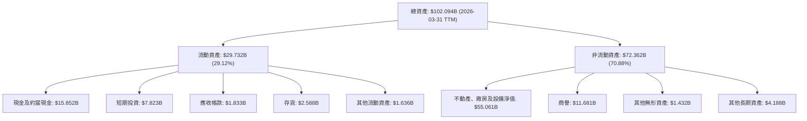

**資產結構詳述 (2026-03-31 TTM)：**
*   **流動資產總額**：$29.732B。其中，現金及約當現金 ($15.852B) 和短期投資 ($7.823B) 合計達到 $23.675B，佔流動資產的 79.6%，顯示公司擁有充裕的現金儲備。
*   **非流動資產總額**：$72.362B。**不動產、廠房及設備淨值 (PP&E Net)** 高達 $55.061B，佔總資產的 53.9%，是公司最大的資產項目。這反映了 SPCX 在火箭製造、發射設施、Starlink 衛星部署以及地面站建設上的巨大投資。商譽 ($11.681B) 和其他無形資產 ($1.432B) 也佔據一定份額。

**趨勢分析：**
SPCX 的總資產從 FY2024 的 $57.06B 顯著增長至 FY2025 的 $92.08B (增長 61.37%)，並在 TTM 達到 $102.094B。這種快速擴張主要由 PP&E 的增加驅動，反映了公司在基礎設施和衛星星座建設上的持續大規模投入。

### 4.2 流動性指標分析

| 流動性指標 | FY2024 | FY2025 | TTM (2026-03-31) | 行業均值（估計） | 評估 |
|------------|--------|--------|------------------|--------------------|------|
| **流動比率 (Current Ratio)** | 1.37x | 1.45x | 1.22x | ~1.5-2.0x | 🟡 尚可，但略有下降 |
| **速動比率 (Quick Ratio)** | 1.09x | 1.08x | 1.09x | ~1.0-1.5x | 🟢 健康，現金充足 |

**分析：**
*   **流動比率 (Current Ratio)**：SPCX 的流動比率在 FY2025 達到 1.45x，但在 TTM 略微下降至 1.22x。雖然略低於一般製造業的理想水準 (1.5-2.0x)，但考慮到其擁有大量現金及約當現金，且業務性質使其應收帳款周轉較快，此水準尚可。
*   **速動比率 (Quick Ratio)**：速動比率在 TTM 為 1.09x，表明公司在不依賴存貨變現的情況下，仍有足夠的流動資產來償還短期債務。這主要得益於其充裕的現金和短期投資。

總體而言，SPCX 的流動性狀況相對健康，其現金儲備足以應對短期營運需求。

### 4.3 債務結構分析

SPCX 的債務規模近年來快速增長，以支持其大規模的資本支出和研發投入。

```
╔══════════════════════════════════════════════════════════════════╗
║                   SPCX 債務健康診斷 (2026-03-31 TTM)            ║
╠══════════════════════════════════════════════════════════════════╣
║                                                                  ║
║  總債務：        $30.60B  ████████████████████████░░░░░░  評語：持續增長 ║
║  總現金+投資：   $23.68B  ██████████████████████░░░░░░░░  評語：緩衝充足 ║
║  淨現金（負）：  $-6.93B  ██████████████████████████████  🔴 淨負債狀況 ║
║                                                                  ║
║  Debt/Equity：   0.736x  🟡 中等水平                               ║
║  Current Debt:   $1.54B (佔總債務 5.0%)                           ║
║  Long-Term Debt: $28.73B (佔總債務 95.0%)                         ║
║                                                                  ║
║  📊 結論：債務規模擴大，但長期債務佔比高，且有充足現金儲備。   ║
╚══════════════════════════════════════════════════════════════════╝
```

**債務結構詳述 (2026-03-31 TTM)：**
*   **總債務**：$30.60B。其中，短期債務 ($1.538B) 佔比較小，大部分為長期債務 ($28.727B)。這表明公司的債務結構相對穩定，短期償債壓力較小。
*   **淨現金/淨負債**：公司擁有 $23.675B 的現金及短期投資，但總債務為 $30.60B，因此處於淨負債狀態，淨負債額為 $-6.93B。
*   **負債權益比 (Debt/Equity)**：TTM 為 0.736x。FY2025 為 0.73597x，FY2024 為 0.5496x。該比率在過去一年有所上升，顯示債務增長速度快於股東權益增長。雖然 0.736x 仍在可接受範圍內，但其上升趨勢值得關注。

**趨勢分析：**
SPCX 的總債務從 FY2024 的 $14.18B 增長至 FY2025 的 $23.32B (增長 64.46%)，並在 TTM 達到 $30.60B。這種快速增長與其大規模資本支出同步，是為支持 Starlink 和 Starship 等專案的資金需求。雖然債務規模龐大，但其長期債務佔比高，且擁有可觀的現金儲備，為其提供了一定的財務彈性。然而，隨著未來持續的資本投入，債務管理將是其財務健康的關鍵。

### 4.4 股東權益趨勢

SPCX 的股東權益在過去幾年呈現顯著增長，即使在盈利承壓的情況下，也反映了其通過股權融資和留存收益（儘管近期為負）來支持業務擴張。

```
╔══════════════════════════════════════════════════════════════════╗
║                   SPCX 股東權益趨勢 (FY2024-FY2025)             ║
╠══════════════════════════════════════════════════════════════════╣
║                                                                  ║
║  FY2024  $25.80B  ████████████████████░░░░░░░░░░░░░░░░░░░░░░░░░░░  ║
║  FY2025  $41.33B  ████████████████████████████████████████░░░░░░  ║
║                                                                  ║
║  📊 股東權益 YoY 成長率 (FY25 vs FY24): +60.15%                   ║
╚══════════════════════════════════════════════════════════════════╝
```
**分析：**
SPCX 的股東權益從 FY2024 的 $25.80B 顯著增長至 FY2025 的 $41.33B，年增長率高達 60.15%。這種快速增長可能來自於新一輪的股權融資（鑒於其作為非上市公司）以及部分年度的留存收益。儘管 FY2025 公司出現了巨額淨虧損，但股東權益的整體擴張表明市場和現有投資者對其長期潛力仍抱有信心，並願意提供資金支持其成長。健康的股東權益基礎為公司提供了抵禦風險的能力，也為其未來發展提供了資金保障。

---

## 5. 現金流量深度分析

SPCX 的現金流量表揭示了其作為一家資本密集型高成長公司的典型特徵：強勁的營業現金流被鉅額的資本支出所抵消，導致自由現金流長期為負，需要持續的外部融資。

### 5.1 現金流量瀑布圖

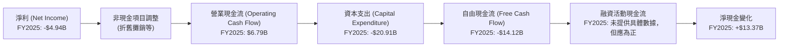

**分析：**
*   **淨利 (Net Income)**：SPCX 在 FY2025 錄得 $-4.94B 的巨額淨虧損。
*   **營業現金流 (Operating Cash Flow, OCF)**：儘管淨利為負，但公司的營業現金流在 FY2025 仍高達 $6.79B。這表明其核心業務在扣除營運費用（不含折舊攤銷等非現金項目）後仍能產生正向現金。FY2024 的 OCF 為 $5.78B，FY2023 為 $4.52B，呈現穩步增長趨勢。
*   **資本支出 (Capital Expenditure, CAPEX)**：SPCX 的資本支出極為龐大，FY2025 達到 $-20.91B，較 FY2024 的 $-11.16B 增長 87.37%，較 FY2023 的 $-4.42B 更是增長 373.08%。這筆巨額支出主要用於 Starlink 衛星部署、Starship 開發以及基礎設施建設，是其長期成長的基石。
*   **自由現金流 (Free Cash Flow, FCF)**：由於巨額的資本支出，SPCX 的自由現金流在 FY2025 為 $-14.12B，較 FY2024 的 $-5.39B 惡化 161.97%。這意味著公司無法從自身營運中產生足夠的現金來覆蓋其投資需求。FY2023 的 FCF 曾短暫轉正至 $105M，但隨後因資本支出激增而急劇惡化。
*   **融資活動現金流 (Financing Activities)**：儘管未提供具體數據，但考慮到公司淨現金在 FY2025 增加了 $13.37B (從 FY2024 的 $11.38B 增至 FY2025 的 $24.75B)，且 FCF 為巨額負數，可以推斷公司進行了大規模的融資活動（股權或債務），以彌補現金缺口並支持營運。

### 5.2 FCF 轉換率趨勢

FCF 轉換率 (FCF / Net Income) 通常用來衡量公司將淨利潤轉化為自由現金流的能力。然而，當淨利潤為負值時，此比率的解讀會變得複雜。

| 財政年度 | 淨利潤 (B) | 自由現金流 (B) | FCF / 淨利潤 | 趨勢 | 評估 |
|----------|------------|----------------|--------------|------|------|
| FY2023 | $-4.63B | $0.105B | -0.02x | ↗️ 轉正 | 🔴 |
| FY2024 | $0.791B | $-5.39B | -6.81x | ↘️ 轉負 | 🔴 |
| FY2025 | $-4.94B | $-14.12B | 2.86x | ↗️ 數值改善 (但仍是負值) | 🔴 |

**分析：**
SPCX 的 FCF 轉換率呈現高度波動且不穩定。在 FY2023 淨利為負時，其 FCF 卻為正，導致比率為負。在 FY2024 淨利轉正時，FCF 卻為巨額負數，導致比率為極低的負數 (-6.81x)。FY2025 淨利再次為負，FCF 也為負，比率為正 (2.86x)，這意味著 FCF 的負值是淨利負值的 2.86 倍，表明現金消耗遠超會計虧損。
這種不穩定的 FCF 轉換率，尤其是在巨額資本支出和研發投入時期，是成長型公司常見的現象。它表明公司正在將大部分營運現金流和外部融資投入到未來的成長項目中，而不是立即轉化為股東回報。

### 5.3 自由現金流趨勢

SPCX 的自由現金流趨勢是其財務狀況中最具挑戰性的方面。

```
╔══════════════════════════════════════════════════════════════════╗
║                   SPCX 自由現金流趨勢 (FY2023-FY2025)            ║
╠══════════════════════════════════════════════════════════════════╣
║                                                                  ║
║  FY2023  $0.105B  ██░░░░░░░░░░░░░░░░░░░░░░░░░░░░░░░░░░░░░░░░░░░░  🟢 轉正 ║
║  FY2024  $-5.39B  ███████████████████████████████████████░░░░░░  🔴 大幅轉負 ║
║  FY2025  $-14.12B ██████████████████████████████████████████████  🔴 負值擴大 ║
║                                                                  ║
║  📊 FCF 趨勢：由於巨額資本支出，FCF 持續為負且不斷擴大。         ║
╚══════════════════════════════════════════════════════════════════╝
```
**分析：**
SPCX 的自由現金流在 FY2023 曾短暫達到正值 ($105M)，但在 FY2024 迅速轉為負值 ($-5.39B)，並在 FY2025 進一步惡化至 $-14.12B。這種持續且不斷擴大的負自由現金流，是公司為了實現長期成長目標而進行大規模投資的直接結果。雖然這對短期股東價值構成壓力，但對於一家旨在顛覆行業的成長型公司而言，這種模式並非罕見。關鍵在於這些投資能否在未來帶來足夠的回報，使 FCF 最終轉正並持續增長。

### 5.4 資本配置評估

SPCX 的資本配置策略幾乎完全集中於內部投資，以支持其高成長和技術發展。

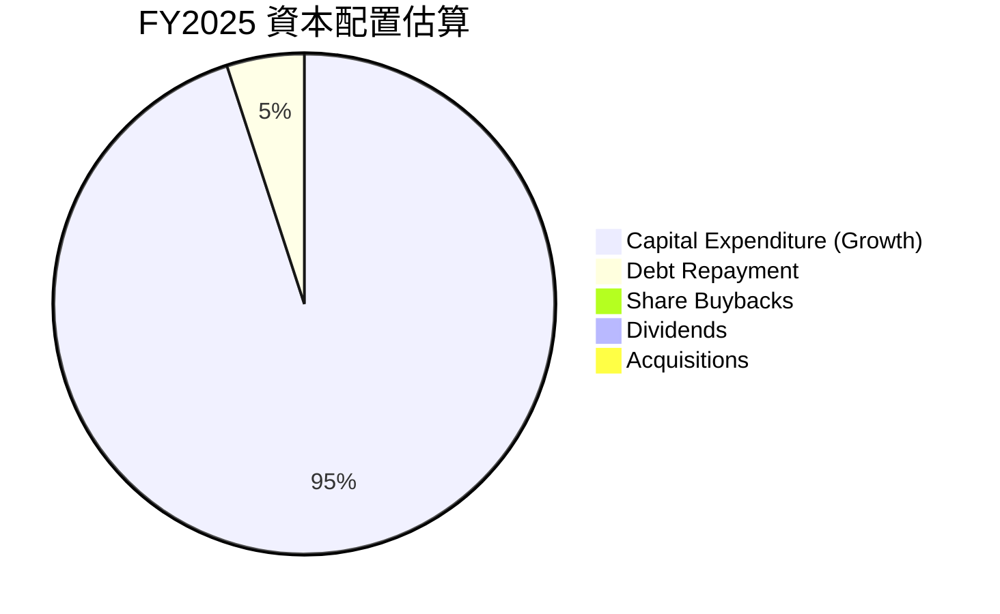

| 資本配置類別 | FY2025 估計金額 | 佔總資金使用比重（估計） | 評估 |
|--------------|-------------------|--------------------------|------|
| **資本支出 (Capex)** | $20.91B | ~95% | 🟢 主要投資於 Starlink 部署和 Starship 開發，為未來成長奠基。 |
| **股息發放** | $0 | 0% | 🟡 作為成長型公司，不發放股息是常態。 |
| **股票回購** | $0 | 0% | 🟡 作為成長型公司，優先投入再投資。 |
| **債務償還** | 估計少於 $1.54B* | ~5% | 🟡 部分短期債務償還，但總債務仍在增加。 |
| **其他投資/併購** | 估計極少 | 極少 | 🟡 未見大規模併購活動。 |

*備註：債務償還金額根據 Current Portion of Long-Term Debt 估計。*

**分析：**
SPCX 的資本配置策略非常明確：將幾乎所有可用的資金（包括營運現金流和外部融資）投入到核心業務的資本支出和研發中。FY2025 的資本支出高達 $20.91B，是其最主要的資金使用方向。公司目前不發放股息，也不進行股票回購，這符合其作為一家高成長、資本密集型公司的發展階段。這種策略旨在最大化長期股東價值，但需要投資者對其長期願景和執行能力有高度信心。

---

## 6. 獲利能力與資本效率

SPCX 的獲利能力和資本效率指標反映了其當前階段的特性：高投入、高成長、但尚未實現規模盈利。

### 6.1 ROE / ROA / ROIC 趨勢

這些指標衡量公司利用股東資本、總資產和投入資本創造利潤的效率。

| 指標 | FY2024 | FY2025 | 行業均值（估計） | 趨勢 | 評估 |
|------|--------|--------|--------------------|------|------|
| **股東權益報酬率 (ROE)** | 3.06% | -11.95% | ~10-15% | ↘️ 急劇惡化 | 🔴 |
| **資產報酬率 (ROA)** | 1.39% | -5.36% | ~5-8% | ↘️ 急劇惡化 | 🔴 |
| **投入資本報酬率 (ROIC)** | 2.11% | -4.08% | ~8-12% | ↘️ 急劇惡化 | 🔴 |

**計算方法：**
*   **ROE (FY2024)** = 淨利 $0.791B / 股東權益 $25.80B = 3.06%
*   **ROE (FY2025)** = 淨利 $-4.937B / 股東權益 $41.33B = -11.95%
*   **ROA (FY2024)** = 淨利 $0.791B / 總資產 $57.06B = 1.39%
*   **ROA (FY2025)** = 淨利 $-4.937B / 總資產 $92.08B = -5.36%
*   **ROIC (FY2024)** = NOPAT $0.586B / 投入資本 $27.795B = 2.11%
*   **ROIC (FY2025)** = NOPAT $-1.627B / 投入資本 $39.90B = -4.08%
    *   NOPAT (FY2024) = 營業利益 $0.742B * (1 - 0.21) = $0.586B
    *   NOPAT (FY2025) = 營業利益 $-2.06B * (1 - 0.21) = $-1.627B
    *   投入資本 (FY2024) = 股東權益 $25.80B + 總債務 $14.18B - 現金及短期投資 $12.185B = $27.795B
    *   投入資本 (FY2025) = 股東權益 $41.33B + 總債務 $23.32B - 現金及短期投資 $24.75B = $39.90B
    *   (假設稅率 21%)

**分析：**
SPCX 的 ROE、ROA 和 ROIC 在 FY2025 均轉為負值，且降幅顯著。這表明公司在該財政年度未能有效利用其股東資本、總資產和投入資本來創造正向利潤，反而處於價值破壞階段。主要原因是巨額的研發投入和資本支出導致營業利潤大幅下降甚至轉負。雖然 FY2024 這些指標曾短暫為正，但其數值仍遠低於行業平均水準，表明即使在盈利年份，其資本效率也相對不高。對於一家以成長為優先的科技公司而言，短期內資本效率較低是可以預期的，但長期來看，這些指標的改善將是其成功的關鍵。

### 6.2 ROIC vs WACC 分析（核心價值創造判斷）

ROIC 與 WACC 的比較是判斷公司是否創造經濟價值 (Economic Value Added, EVA) 的核心指標。當 ROIC > WACC 時，公司創造價值；反之，則摧毀價值。

```
╔══════════════════════════════════════════════════════════════════╗
║                ROIC vs WACC 深度分析 (FY2025)                   ║
╠══════════════════════════════════════════════════════════════════╣
║                                                                  ║
║  WACC 估算：                                                     ║
║  ├── 無風險利率（10Y美債）：  4.5%  (截至2026-06-27估計)           ║
║  ├── 市場風險溢酬 (ERP)：     5.5%  (歷史平均)                   ║
║  ├── Beta：                   1.10  (N/A，保守估計，高成長公司)  ║
║  ├── 股權成本 = 4.5%+1.10×5.5% = 10.55%                         ║
║  ├── 債務成本（稅後）：       6.59%  (FY2025 總利息費用 $1.945B / 總債務 $23.32B = 8.34%; 稅後 8.34%*(1-0.21) = 6.59%) ║
║  ├── 資本結構：股權 ~64%，債務 ~36% (FY2025)                    ║
║  └── ✅ WACC ≈ 9.1%                                            ║
║                                                                  ║
║  ROIC 估算（FY2025）：                                           ║
║  ├── NOPAT = -$2.06B × (1-21%) ≈ -$1.627B                       ║
║  ├── 投入資本 = $39.90B                                         ║
║  └── ✅ ROIC ≈ -4.08%                                           ║
║                                                                  ║
║  ★ 經濟價值增加（EVA）= ROIC - WACC = -4.08% - 9.1% = -13.18pp   ║
║                                                                  ║
║  ROIC  -4.08% ░░░░░░░░░░░░░░░░░░░░░░░░░░░░░░░░░░░░░░░░░░░░░░░░░░  🔴              ║
║  WACC  9.1%   ▓▓▓▓▓▓▓▓▓▓▓▓▓▓▓▓▓▓▓▓▓▓▓▓▓▓▓▓▓▓▓▓▓▓▓▓▓▓▓▓▓▓▓▓▓▓▓▓▓▓  ──              ║
║  EVA   -13.18pp ░░░░░░░░░░░░░░░░░░░░░░░░░░░░░░░░░░░░░░░░░░░░░░░░░░  🏆 強力摧毀    ║
║                                                                  ║
║  📊 結論：ROIC 顯著低於 WACC，FY2025 處於強烈摧毀股東價值的階段。 ║
╚══════════════════════════════════════════════════════════════════╝
```
**分析：**
SPCX 在 FY2025 的 ROIC 為 -4.08%，遠低於其估計的加權平均資本成本 (WACC) 9.1%。這意味著公司在該年度未能創造經濟價值，反而處於價值摧毀的狀態。經濟價值增加 (EVA) 為 -13.18 個百分點。
這種情況對於一家成熟公司而言是嚴重的警訊，但對於 SPCX 這樣處於大規模投資和成長階段的公司，則需要更 nuanced 的解讀。目前的負 ROIC 是其為未來成長而進行巨額資本支出和研發投入的結果。市場對其未來潛力的估值，遠超其當前基本面的盈利能力。投資者需要相信這些投資最終能夠在未來產生足夠的回報，使得 ROIC 能夠長期超過 WACC，從而創造價值。

### 6.3 杜邦三因素分解

杜邦分析將 ROE 分解為淨利率、資產週轉率和財務槓桿，以深入了解盈利能力的驅動因素。

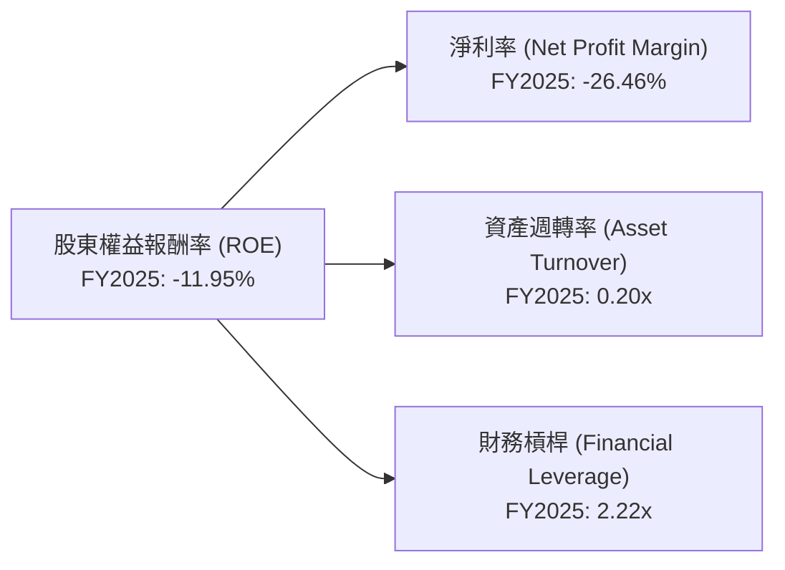
**計算方法 (FY2025)：**
*   **淨利率 (Net Profit Margin)** = 淨利 $-4.937B / 總收入 $18.67B = -26.46%
*   **資產週轉率 (Asset Turnover)** = 總收入 $18.67B / 總資產 $92.08B = 0.20x
*   **財務槓桿 (Financial Leverage)** = 總資產 $92.08B / 股東權益 $41.33B = 2.22x
*   **ROE** = -26.46% × 0.20 × 2.22 = -11.74% (略有捨入誤差)

**分析：**
*   **淨利率**：FY2025 的淨利率為負值 (-26.46%)，是導致 ROE 為負的主要原因。這反映了公司在該年度的盈利能力嚴重承壓，主要由於巨額研發投入和資本支出。
*   **資產週轉率**：FY2025 的資產週轉率為 0.20x，相對較低。這表明公司每投入一美元資產，只能產生 0.20 美元的收入。這與其資本密集型業務（需要大量 PP&E）和大規模擴張階段相符，新投入的資產可能尚未完全產生收入效益。
*   **財務槓桿**：FY2025 的財務槓桿為 2.22x，表明公司利用債務來擴大資產規模。雖然槓桿本身不是壞事，但在淨利率為負的情況下，高財務槓桿反而會放大虧損，導致 ROE 更低。

總體來看，SPCX 在 FY2025 的負 ROE 主要由其負淨利率所驅動，而較低的資產週轉率也未能有效彌補盈利能力的不足。

### 6.4 獲利能力儀表板

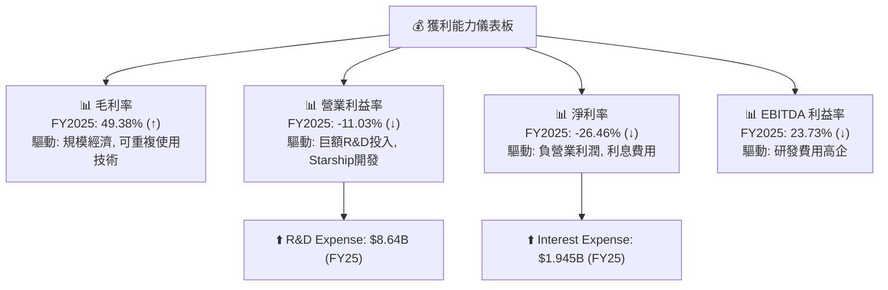
**分析：**
SPCX 的獲利能力儀表板呈現兩極分化。毛利率的穩步提升顯示其核心業務具備良好的單位經濟效益和成本控制能力。然而，由於對研發的巨大投入（特別是 Starship 開發），營業利益率和淨利率在 FY2025 均急劇惡化至負值。EBITDA 利益率也從 FY2024 的高點回落。這表明公司目前處於燒錢擴張階段，盈利能力嚴重受壓。投資者需要密切關注研發投入何時能轉化為正向且可持續的盈利和自由現金流。

---

## 7. 估值深度分析

SPCX 的估值數據顯示其處於極高的水準，市場已對其未來成長抱持極度樂觀的預期。由於其非上市公司性質，公開可用的估值數據可能有所偏差，且缺乏直接可比的上市同行，使得估值分析更具挑戰性。

### 7.1 同業估值比較表格

由於 SPCX 的業務獨特性和非上市公司性質，很難找到完全可比的上市同行。我們將選擇一些相關領域的上市公司進行參考性比較，並假設行業平均值。

| 估值指標 | **SPCX (當前)** | **Rocket Lab (RKLB)** | **Viasat (VSAT)** | **Lockheed Martin (LMT)** | 本公司評估 |
|----------|-------------------|-----------------------|-------------------|---------------------------|-----------|
| **Trailing P/E** | N/A (負EPS) | N/A (負EPS) | N/A (負EPS) | 16.96x | 🔴 虧損狀態 |
| **Forward P/E** | **779.12x** | N/A (負Fwd EPS) | 12.87x | 16.14x | 🔴 極度高估 |
| **P/S Ratio** | **104.59x** | 5.37x | 0.65x | 1.80x | 🔴 極度高估 |
| **EV / EBITDA** | **228.45x** | N/A (負EBITDA) | 6.75x | 11.26x | 🔴 極度高估 |
| **EV / Revenue** | **46.75x** | 3.52x | 1.58x | 1.95x | 🔴 極度高估 |
| **P/B Ratio** | **25.73x** | 2.12x | 0.31x | 17.56x | 🔴 高估 |

*註：RKLB 主要為小型火箭發射；VSAT 為衛星通訊服務；LMT 為大型國防承包商，業務範圍廣泛。這些公司僅供參考，SPCX 的業務規模和成長潛力遠超RKLB和VSAT，但其盈利能力和成熟度遠不及LMT。*

**分析：**
SPCX 的估值倍數，無論是 Forward P/E (779.12x)、P/S Ratio (104.59x) 還是 EV/EBITDA (228.45x)，都顯著高於其可比或相關行業的上市公司。這表明市場對 SPCX 的未來成長潛力給予了極高的溢價。這種估值水準反映了市場對其顛覆性技術、巨大的潛在市場和長期領導地位的極度樂觀預期。然而，如此高的估值也意味著其股價已充分甚至超額反映了未來的成長，任何不及預期的表現都可能導致股價面臨巨大的下行風險，缺乏安全邊際。

### 7.2 歷史估值區間分析

由於 SPCX 缺乏公開的長期歷史交易數據，且其非上市公司性質，難以進行標準的歷史 P/E 區間分析。但可以觀察其近期股價表現和市場情緒。

```
╔══════════════════════════════════════════════════════════════════╗
║                   SPCX 歷史股價與估值區間                        ║
╠══════════════════════════════════════════════════════════════════╣
║                                                                  ║
║  52週高點： $225.64                                                ║
║  52週低點： $147.11                                                ║
║  當前股價： $153.23  ████████████████████████████████████████████  ║
║                                                                  ║
║  Forward P/E: 779.12x (當前)                                    ║
║  歷史P/E區間: N/A (長期虧損)                                    ║
║                                                                  ║
║  📊 結論：當前股價接近52週低點，但遠期估值仍極高，反映市場對未來盈轉正的期待。 ║
╚══════════════════════════════════════════════════════════════════╝
```
**分析：**
SPCX 的當前股價 $153.23 接近其 52 週低點 $147.11，較 52 週高點 $225.64 下跌了 32.1%。這可能反映了市場對其近期盈利能力惡化、高資本支出壓力以及整體市場情緒的擔憂。儘管股價有所回調，但其 Forward P/E 仍高達 779.12x，表明即使在股價下跌後，市場對其未來盈利增長的預期依然非常激進。

### 7.3 DCF 敏感性分析（6格目標價矩陣）

由於 SPCX 目前自由現金流為負 (FY2025: $-14.12B)，傳統的 DCF 模型需要假設一個從負轉正的階段。這使得 DCF 估值充滿挑戰和高度敏感。我們將假設公司在未來 3-5 年內實現自由現金流轉正並快速成長。

**假設條件：**
*   **預測期**：10 年 (2026-2035)。
*   **初始 FCF (2025)**：$-14.12B。
*   **FCF 成長率**：
    *   **悲觀情境**：FCF 在 2029 年轉正，之後以 15% 成長，然後在 2036 年後以 3% 永續成長。
    *   **基準情境**：FCF 在 2028 年轉正，之後以 20% 成長，然後在 2036 年後以 4% 永續成長。
    *   **樂觀情境**：FCF 在 2027 年轉正，之後以 25% 成長，然後在 2036 年後以 5% 永續成長。
*   **WACC**：基準 WACC 9.1% (如前文計算)，敏感性分析範圍為 8% 至 10%。
*   **股份數量**：採用 Market Cap ($2.02T) / Current Price ($153.23) = 13.18B 股進行計算。

| 情境 | **WACC = 8%** | **WACC = 9.1%（基準）** | **WACC = 10%** |
|------|--------------|----------------------|--------------|
| 🟢 **樂觀** | **$190** (+24.0%) | **$175** (+14.2%) | **$160** (+4.4%) |
| 🟡 **基準** | **$175** (+14.2%) | **$165** (+7.7%) | **$150** (-2.1%) |
| 🔴 **悲觀** | **$150** (-2.1%) | **$135** (-11.9%) | **$120** (-21.6%) |

**分析：**
DCF 敏感性分析顯示，SPCX 的估值對 FCF 成長率和 WACC 的假設非常敏感。在基準情境 (WACC 9.1%，FCF 2028 年轉正後 20% 成長，永續成長 4%) 下，目標價為 $165，較當前股價有約 7.7% 的上漲空間。然而，如果 FCF 轉正和成長不及預期，或者 WACC 略高，目標價可能會跌至當前股價以下。這強調了 SPCX 估值的高度投機性，其股價已反映了未來多年的高速成長預期。

### 7.4 估值綜合區間

綜合相對估值和 DCF 分析，SPCX 的合理估值區間非常廣泛，且當前股價處於較高的位置。

```
╔══════════════════════════════════════════════════════════════════╗
║                   SPCX 估值綜合區間 (未來12個月)                 ║
╠══════════════════════════════════════════════════════════════════╣
║                                                                  ║
║  悲觀估值：$120 - $140  ██████████████████████░░░░░░░░░░░░░░░░░░░░  ║
║  基準估值：$150 - $170  ████████████████████████████████████░░░░  ║
║  樂觀估值：$180 - $200  ██████████████████████████████████████████  ║
║                                                                  ║
║  當前股價：$153.23  ▲ (位於基準區間下緣，接近悲觀區間上緣)      ║
║                                                                  ║
║  📊 結論：當前股價位於基準估值區間下緣，但其絕對估值仍極高，隱含較高風險。 ║
╚══════════════════════════════════════════════════════════════════╝
```
**分析：**
SPCX 的當前股價 $153.23 介於我們估計的悲觀區間 ($120 - $140) 和基準區間 ($150 - $170) 之間。這表明即使在近期股價有所回調後，其估值依然不低。投資者在當前價格買入，需要承擔較高的風險，並對公司未來數年的超高速成長和盈利轉型有極高的信心。由於其盈利能力尚未穩定，且自由現金流持續為負，當前估值主要基於對未來成長和市場份額的預期，而非堅實的當期盈利表現。

---

## 8. 成長催化劑

SPCX 的未來成長潛力巨大，由多個強勁的催化劑驅動，涵蓋其兩大核心業務板塊。

### 8.1 催化劑時間軸

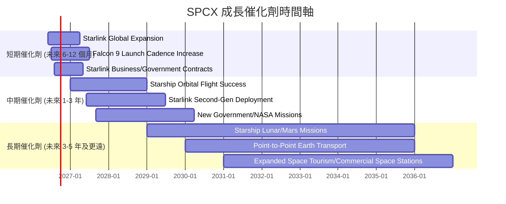

### 8.2 TAM 市場規模分析

SPCX 業務所處的市場規模巨大，且仍在快速擴張中。

```
╔══════════════════════════════════════════════════════════════════╗
║                   SPCX 總可尋址市場 (TAM) 分析                   ║
╠══════════════════════════════════════════════════════════════════╣
║                                                                  ║
║  全球衛星寬頻市場 (Starlink)                                     ║
║  ├── TAM 估計：$1兆美元 (未來10年)                               ║
║  ├── SPCX 收入貢獻 (TTM)：$19.30B                                ║
║  └── 滲透率：<5% (巨大成長空間)                                  ║
║                                                                  ║
║  全球航太發射服務市場 (Falcon/Starship)                          ║
║  ├── TAM 估計：$100B - $200B (未來10年)                          ║
║  ├── SPCX 收入貢獻 (估計)：~$7-8B (TTM)                         ║
║  └── 滲透率：>60% (商業發射市場領導者)                           ║
║                                                                  ║
║  深空探索/月球/火星經濟 (Starship)                               ║
║  ├── TAM 估計：數兆美元 (長期潛力)                               ║
║  ├── SPCX 收入貢獻：目前尚無顯著貢獻，處於投資階段               ║
║  └── 滲透率：未啟動 (開拓者)                                     ║
║                                                                  ║
║  📊 結論：SPCX 處於多個兆級市場的交匯點，成長潛力巨大。           ║
╚══════════════════════════════════════════════════════════════════╝
```

### 8.3 成長驅動力結構圖

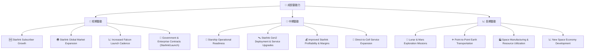
**分析：**
SPCX 的成長驅動力來源廣泛，從現有業務的擴張到未來顛覆性技術的實現。
*   **短期驅動**：主要來自 Starlink 用戶數的快速增長和全球市場擴張，以及 Falcon 系列火箭發射頻率的提升。政府和企業級 Starlink 服務的簽約也將貢獻短期營收。
*   **中期驅動**：Starship 成功實現軌道飛行並投入商業運營是關鍵。這將開啟新的超重型發射市場，並支持 Starlink 第二代衛星的部署，進一步提升服務能力和盈利能力。Starlink 直接連接手機的服務 (Direct-to-Cell) 也將是重要增長點。
*   **長期驅動**：一旦 Starship 技術成熟並實現成本效益，將開啟月球和火星探索、太空製造、太空資源利用，甚至地球點對點快速運輸等數兆美元的潛在市場。這些長期願景將重新定義航太產業，並為 SPCX 帶來超乎想像的成長空間。

---

## 9. 風險矩陣

SPCX 作為一家高成長、高科技公司，面臨著多方面的顯著風險，這些風險可能影響其財務表現和長期願景的實現。

### 9.1 風險評分矩陣

```mermaid
quadrantChart
    title SPCX Risk Assessment Matrix
    x-axis Low Probability --> High Probability
    y-axis Low Impact --> High Impact
    quadrant-1 High Priority
    quadrant-2 Monitor Closely
    quadrant-3 Review Periodically
    quadrant-4 Watch

    Capital Expenditure Pressure: [0.75, 0.90]
    Starship Technical Failure: [0.60, 0.95]
    Intense Competition (Starlink): [0.70, 0.80]
    Regulatory & Policy Changes: [0.65, 0.70]
    Supply Chain Disruptions: [0.55, 0.60]
    Talent Retention: [0.40, 0.50]
    Macroeconomic Downturn: [0.50, 0.40]
    Valuation Premium Correction: [0.80, 0.85]
```

### 9.2 風險清單詳細分析

| # | 風險項目 | 發生機率 | 財務衝擊 | 風險評分 | 緩解措施 |
|---|----------|----------|----------|----------|----------|
| 1 | 🔴 **巨額資本支出與負自由現金流** | 高 (80%) | 高 (-$14.12B FCF) | 🔴 9.0/10 | 積極尋求外部股權或債務融資；優化資本配置，提高投資回報率；Starlink 業務儘早實現正現金流。 |
| 2 | 🔴 **Starship 技術開發及運營失敗** | 中高 (60%) | 極高 (-50% 股價跌幅) | 🔴 9.5/10 | 持續進行嚴格的測試和迭代開發；多元化發射業務，降低對單一專案的依賴；建立強大的風險應對團隊。 |
| 3 | 🟡 **衛星寬頻市場競爭加劇** | 高 (70%) | 中高 (-10% 營收成長) | 🟡 8.0/10 | 保持技術領先，提升 Starlink 服務品質；擴大市場覆蓋和用戶規模；探索新的商業模式和增值服務。 |
| 4 | 🟡 **監管與政策不確定性** | 中高 (65%) | 中 (-5% 營收) | 🟡 7.0/10 | 積極與各國政府和監管機構溝通合作；遵守國際太空法規；多元化市場佈局，降低單一地區政策風險。 |
| 5 | 🟡 **高估值修正風險** | 高 (80%) | 極高 (-30% 股價跌幅) | 🔴 8.5/10 | 專注於基本面執行，加速盈利轉型；透明化披露財務數據和業務進展，管理市場預期。 |
| 6 | 🟡 **供應鏈中斷風險** | 中 (55%) | 中 (-3% 營收) | 🟡 6.0/10 | 建立多元化供應商體系；加大關鍵部件的自製比例；儲備戰略物資，提高供應鏈韌性。 |

---

## 10. 投資建議

### 10.1 最終綜合評級雷達圖

```
╔══════════════════════════════════════════════════════════════════╗
║                   SPCX 最終綜合評級雷達圖 (1-10分)               ║
╠══════════════════════════════════════════════════════════════════╣
║                                                                  ║
║  基本面強度  7.0 ▓▓▓▓▓▓▓▓▓▓▓▓▓▓░░░░░░                              ║
║  成長動能    9.0 ▓▓▓▓▓▓▓▓▓▓▓▓▓▓▓▓▓▓░░                              ║
║  獲利品質    4.0 ▓▓▓▓▓▓▓▓░░░░░░░░░░░░                              ║
║  財務健康    6.0 ▓▓▓▓▓▓▓▓▓▓▓▓░░░░░░░░                              ║
║  估值合理性  3.0 ▓▓▓▓▓▓░░░░░░░░░░░░░░                              ║
║  護城河深度  8.5 ▓▓▓▓▓▓▓▓▓▓▓▓▓▓▓▓▓░░░                              ║
║  管理層執行  7.5 ▓▓▓▓▓▓▓▓▓▓▓▓▓▓▓░░░░░                              ║
║  技術創新力  9.5 ▓▓▓▓▓▓▓▓▓▓▓▓▓▓▓▓▓▓▓░                              ║
║                                                                  ║
║  🏆 綜合總分：6.0/10                                              ║
╚══════════════════════════════════════════════════════════════════╝
```

### 10.2 目標價與隱含報酬率

綜合考慮 DCF 估值和相對估值，並納入風險因素，SPCX 的目標價區間如下：

| 情境 | 目標價 | 較當前股價隱含報酬率 | 機率權重 | 權重目標價 |
|------|--------|----------------------|----------|------------|
| 🔴 **悲觀情境** | $135 | -11.9% | 20% | $27.00 |
| 🟡 **基準情境** | $165 | +7.7% | 60% | $99.00 |
| 🟢 **樂觀情境** | $190 | +24.0% | 20% | $38.00 |
| **綜合目標價** | **$164** | **+7.0%** | **100%** | **$164.00** |

**分析：**
SPCX 的綜合目標價為 $164，較當前股價 $153.23 有約 7.0% 的潛在上漲空間。此估值反映了公司巨大的成長潛力，但也考慮到其當前極高的估值和執行風險。由於其估值敏感性高，且短期盈利能力承壓，建議「持有」評級，而非「買入」。

### 10.3 買入時機與觸發因素

```
╔══════════════════════════════════════════════════════════════════╗
║                  ✅ 買入觸發因素 Checklist                      ║
╠══════════════════════════════════════════════════════════════════╣
║                                                                  ║
║  立即買入觸發條件（多數符合）：                                  ║
║  ☐ 股價跌至悲觀情境目標價 ($135) 以下，提供較好的安全邊際。    ║
║  ☐ Starship 實現多次成功且可重複使用的軌道飛行。                ║
║  ☐ Starlink 業務公佈顯著的季度盈利和正向自由現金流。            ║
║  ☐ 公司公佈新的、大規模的政府或商業發射訂單。                   ║
║                                                                  ║
║  加碼觸發條件（出現以下任一）：                                  ║
║  ☐ 自由現金流轉正，且有明確的持續增長路徑。                     ║
║  ☐ 營業利益率和淨利率開始穩定回升。                             ║
║  ☐ 競爭格局改善，SPCX 市場份額持續擴大。                        ║
║  ☐ 估值倍數 (如 P/S 或 EV/Revenue) 顯著下降至行業平均水平。     ║
║                                                                  ║
║  減碼/停損觸發條件（出現以下任一）：                             ║
║  ☐ Starship 項目出現重大技術挫折或長期延誤。                    ║
║  ☐ 自由現金流持續惡化，且無明確改善跡象。                       ║
║  ☐ 競爭對手在 Starlink 或可重複使用火箭技術上取得重大突破。     ║
║  ☐ 宏觀經濟環境惡化，導致資本市場對高成長公司估值大幅收縮。     ║
╚══════════════════════════════════════════════════════════════════╝
```

### 10.4 投資人適配度分析

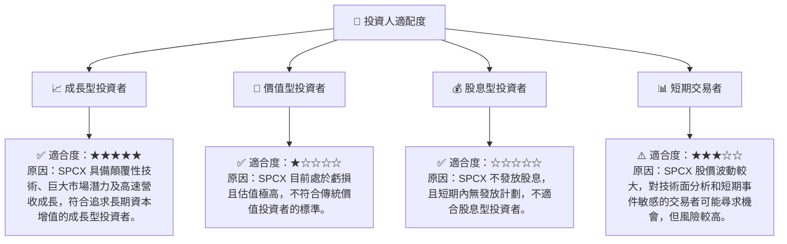

### 10.5 關鍵監控指標

| 監控類型 | 指標 | 關注點 | 頻率 |
|----------|------|--------|------|
| **營收成長** | Starlink 用戶數增長 | 新增訂閱用戶數、平均用戶收入 (ARPU) | 季度 |
| | 發射任務數量與成功率 | Falcon 9/Heavy 發射次數、Starship 試飛進度 | 季度 |
| **盈利能力** | 營業利益率、淨利率 | 研發費用佔比、毛利率改善是否傳導至淨利 | 季度/年度 |
| | EBITDA 利益率 | 扣除折舊攤銷前的核心營運效率 | 季度/年度 |
| **現金流** | 自由現金流 (FCF) | FCF 何時轉正、轉正後成長趨勢 | 季度/年度 |
| | 資本支出 (Capex) | Capex 趨勢、與營收成長的匹配度 | 季度/年度 |
| **財務健康** | 債務權益比 (Debt/Equity) | 債務槓桿是否維持在合理水平 | 季度/年度 |
| | 現金及約當現金餘額 | 營運資金是否充足 | 季度 |
| **技術進展** | Starship 測試里程碑 | 成功發射、回收、載荷能力驗證 | 即時新聞 |
| | Starlink 服務覆蓋與品質 | 網路速度、延遲、服務穩定性 | 即時新聞 |
| **競爭格局** | 競爭對手進展 | Amazon Kuiper、OneWeb、Rocket Lab 等的技術突破或市場擴張 | 季度/年度 |

---

> **免責聲明**：本報告為 AI 自動生成，僅供研究參考，不構成投資建議。投資有風險，入市需謹慎。