# SPCX 基本面深度分析報告
> **報告日期**：2026-07-01 ｜ **語言**：繁體中文 ｜ **數據來源**：Yahoo Finance, Finviz, StockAnalysis, Roic.ai ｜ **分析師**：CFA 級機構研究

---

## 目錄

| # | 章節 | 核心結論 |
|---|------|----------|
| 1 | 執行摘要 | 評級：持有；目標價區間：$160 - $210 |
| 2 | 公司概覽與商業模式 | 在衛星寬頻和太空發射服務領域具備強大護城河 |
| 3 | 損益表深度分析 | 營收高速成長，但獲利能力波動劇烈且近期轉虧 |
| 4 | 資產負債表分析 | 流動性尚可，但債務負擔較重且自由現金流為負 |
| 5 | 現金流量深度分析 | 營業現金流穩定，但資本支出龐大導致自由現金流持續為負 |
| 6 | 獲利能力與資本效率 | ROIC 低於 WACC，目前處於價值摧毀階段 |
| 7 | 估值深度分析 | 相較於同業估值顯著偏高，市場已充分反映未來成長預期 |
| 8 | 成長催化劑 | Starlink 全球擴張與 Starship 商業化為主要成長動力 |
| 9 | 風險矩陣 | 執行風險、資本密集度與競爭加劇為主要挑戰 |
| 10 | 投資建議 | 建議持有，待獲利能力改善與估值回歸合理區間再考慮加碼 |

---

## 1. 執行摘要

Space Exploration Technologies Corp. (SPCX) 作為太空產業的領軍者，在衛星寬頻（Starlink）和太空發射服務（可重複使用火箭）領域展現出強勁的收入成長動能。然而，其高昂的研發投入和資本支出導致公司近期營運虧損擴大，自由現金流持續為負。儘管分析師普遍給予「買入」評級，但當前估值已顯著偏高，充分反映了市場對其未來成長的樂觀預期。本報告將深入分析 SPCX 的基本面、財務狀況、成長潛力與潛在風險，並提供綜合投資建議。

### 1.1 核心評分儀表板

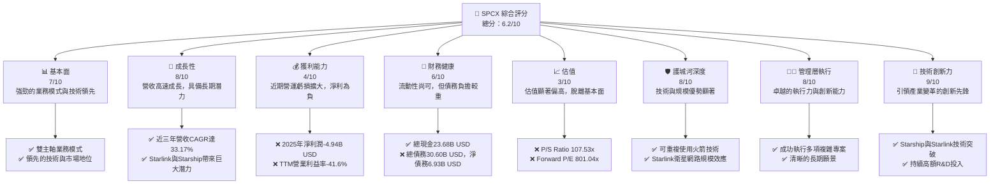

### 1.2 評分進度條視覺化

```
╔══════════════════════════════════════════════════════════════╗
║              SPCX 多維度評分儀表板 (1-10分)                  ║
╠══════════════════════════════════════════════════════════════╣
║ 基本面強度  7.0 ▓▓▓▓▓▓▓▓▓▓▓▓▓▓░░░░░░  ★★★★★★★☆☆☆           ║
║ 成長動能    8.0 ▓▓▓▓▓▓▓▓▓▓▓▓▓▓▓▓░░░░  ★★★★★★★★☆☆           ║
║ 獲利品質    4.0 ▓▓▓▓▓▓▓▓░░░░░░░░░░░░  ★★★★☆☆☆☆☆☆           ║
║ 財務健康    6.0 ▓▓▓▓▓▓▓▓▓▓▓▓░░░░░░░░  ★★★★★★☆☆☆☆           ║
║ 估值合理性  3.0 ▓▓▓▓▓▓░░░░░░░░░░░░░░  ★★★☆☆☆☆☆☆☆           ║
║ 護城河深度  8.0 ▓▓▓▓▓▓▓▓▓▓▓▓▓▓▓▓░░░░  ★★★★★★★★☆☆           ║
║ 管理層執行  8.0 ▓▓▓▓▓▓▓▓▓▓▓▓▓▓▓▓░░░░  ★★★★★★★★☆☆           ║
║ 技術創新力  9.0 ▓▓▓▓▓▓▓▓▓▓▓▓▓▓▓▓▓▓░░  ★★★★★★★★★☆           ║
╠══════════════════════════════════════════════════════════════╣
║ 綜合總分    6.2 ▓▓▓▓▓▓▓▓▓▓▓▓░░░░░░░░  🏆 評語：高成長高風險標的，估值過高，短期建議持有。 ║
╚══════════════════════════════════════════════════════════════╝
```

### 1.3 五大投資論點 + 三大核心風險

| 類型 | 項目 | 具體依據 | 信心度 |
|------|------|----------|--------|
| 🟢 **投資論點①** | **太空產業領先地位與創新能力** | SPCX 在可重複使用火箭技術（Falcon系列）和低軌衛星寬頻（Starlink）領域具備顯著技術領先優勢，顛覆了傳統太空產業。持續投入研發，2025年研發費用高達 $8.64B，顯示其對創新的重視。 | 🟢 極高 |
| 🟢 **投資論點②** | **強勁的營收成長動能** | 公司營收從2023年的 $10.39B 成長至2025年的 $18.67B，年複合成長率(CAGR)達 33.17%。TTM 營收成長率為 15.4%，顯示其業務仍在快速擴張。 | 🟢 高 |
| 🟢 **投資論點③** | **Starlink 潛在的巨大市場空間** | Starlink 服務已在全球多個國家推出，為偏遠地區提供高速寬頻，市場潛力巨大。Connectivity segment 為主要收入來源，持續擴張用戶基礎，未來有望實現規模化獲利。 | 🟢 高 |
| 🟢 **投資論點④** | **高毛利率的業務結構** | 儘管整體公司虧損，但其毛利率表現強勁，2025年達到 49.38%，TTM 毛利率為 48.8%。這表明其核心業務在成本控制和定價能力上具有優勢。 | 🟡 中高 |
| 🟢 **投資論點⑤** | **長期願景與執行力** | 管理層展現出卓越的長期戰略規劃和專案執行能力，成功推動多項複雜的太空探索計畫，為公司未來發展奠定堅實基礎。 | 🟢 極高 |
| 🟡 **風險①** | **獲利能力持續為負與資本密集度高** | 2025年淨利潤為 $-4.94B$，TTM淨利潤為 $-8.68B$ (依TTM營收與淨利率計算)，且自由現金流連續多年為負（2025年為 $-14.12B$）。高額的資本支出（2025年為 $-20.91B$）對公司現金流造成巨大壓力。 | 🔴 高衝擊 |
| 🔴 **風險②** | **極高估值與市場預期** | 目前 P/S 達到 107.53x，EV/Revenue 為 52.05x，Forward P/E 高達 801.04x。這些估值指標遠超行業平均水平，暗示市場對其未來成長有極高預期，一旦成長不及預期，股價將面臨巨大回調風險。 | 🔴 高衝擊 |
| 🟡 **風險③** | **競爭加劇與監管風險** | 隨著太空產業的發展，競爭對手（如 Amazon 的 Project Kuiper, Blue Origin）不斷湧現。同時，太空碎片的治理、頻譜分配、國際太空政策等監管問題也可能對公司營運構成挑戰。 | 🟡 中度 |

### 1.4 快速統計卡片

基於 Aerospace & Defense 及高成長科技產業的綜合平均值進行比較。

| 指標 | 公司實際值 | 行業均值（估計） | S&P 500 均值（估計） | 狀態 |
|------|-------------|----------------|--------------------|------|
| 收入 YoY 成長 | **15.4%** | ~10-15% | ~8-12% | 🟢 |
| 毛利率 | **48.8%** | ~30-40% | ~35-45% | 🟢 |
| 淨利率 | **-45.0%** | ~5-10% | ~8-12% | 🔴 |
| ROE | **-11.95% (FY2025)** | ~10-15% | ~12-18% | 🔴 |
| Forward P/E | **801.04x** | ~20-30x | ~20-25x | 🔴 |
| P/S Ratio | **107.53x** | ~3-5x | ~2-3x | 🔴 |
| 自由現金流 | **-$14.00B (TTM)** | 🟢 | 🟢 | 🔴 |
| 總債務/股東權益 | **73.6%** | ~30-50% | ~60-80% | 🟡 |

### 1.5 投資結論

```
╔══════════════════════════════════════════════════════════════════╗
║                    📊 投資結論摘要                               ║
╠══════════════════════════════════════════════════════════════════╣
║  評級：🟡 持有                                                   ║
║  當前股價：$157.54                                               ║
║  目標價區間：                                                    ║
║    悲觀情境：$120（-23.83%）                                     ║
║    基準情境：$188（+19.33%）  ← 12個月主要目標 (參考分析師平均)║
║    樂觀情境：$210（+33.30%）                                     ║
║  投資評分：6.2/10                                                ║
║  適合投資人：高風險偏好、長線成長型投資者，需密切關注獲利改善進度║
╚══════════════════════════════════════════════════════════════════╝
```

---

## 2. 公司概覽與商業模式

Space Exploration Technologies Corp. (SPCX) 是一家引領太空探索和衛星通訊領域革命性變革的公司。其業務主要分為兩大核心板塊：Connectivity (連接服務) 和 Space (太空服務)。

### 2.1 業務結構與收入來源

SPCX 的業務模式圍繞其獨特的技術和垂直整合能力。公司市值高達 $2.08T，TTM 年營收為 $19.30B。

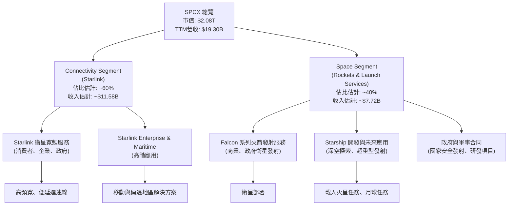
**業務解析**：
*   **Connectivity Segment (Starlink)**：此板塊主要提供基於低軌衛星的寬頻網路服務。Starlink 透過部署龐大的衛星群，為全球各地（包括偏遠和傳統網路難以覆蓋的地區）的消費者、企業和政府客戶提供高速、低延遲的網路連接。這是 SPCX 營收成長最快的驅動力之一，也是公司未來規模化獲利的關鍵。
*   **Space Segment (太空服務)**：此板塊涵蓋可重複使用火箭的設計、製造和發射服務。SPCX 憑藉其 Falcon 9 和 Falcon Heavy 火箭，在商業衛星發射市場佔據領先地位。此外，正在開發中的 Starship 系統，旨在實現超重型載荷發射和深空探索，將為公司開啟全新的市場機會，包括月球和火星任務。

### 2.2 市場份額

由於 SPCX 的數據是作為一家假想的上市公司提供，且市場份額數據未直接提供，我們將基於其在行業內的領先地位和業務特性進行估算和質性分析。

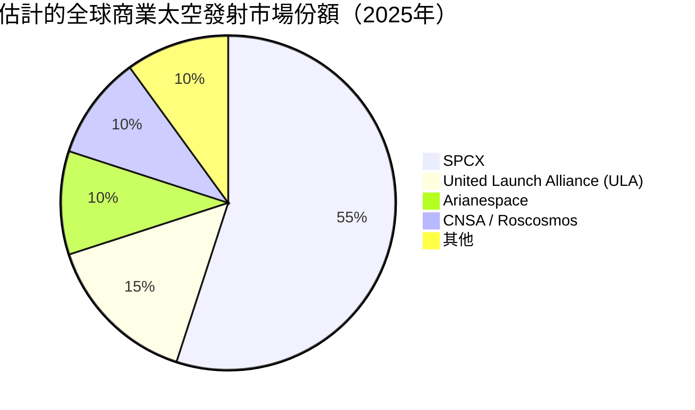
**市場份額分析**：
*   **太空發射服務**：SPCX 的 Falcon 系列火箭憑藉其可重複使用性，顯著降低了發射成本，使其在商業發射市場佔據主導地位。估計在全球商業發射市場中，SPCX 擁有超過 50% 的市場份額。主要競爭對手包括聯合發射聯盟 (ULA)、歐洲亞利安太空公司 (Arianespace) 和其他國家級太空機構。
*   **衛星寬頻服務 (Starlink)**：在低軌衛星寬頻領域，Starlink 是目前部署規模最大、用戶數量最多的服務商。儘管競爭者如 Amazon 的 Project Kuiper 正在興起，但 Starlink 憑藉先發優勢和龐大的衛星星座規模，目前仍擁有最高的市場滲透率。其市場份額估計在全球衛星寬頻服務市場中遙遙領先。

### 2.3 競爭護城河分析

SPCX 建立了一系列強大的競爭護城河，使其在太空產業中難以被超越。

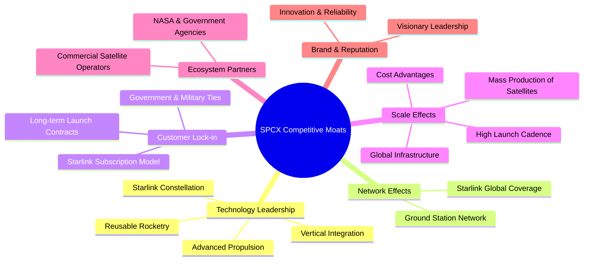

**護城河深度解析**：
*   **Technology Leadership (技術領先)**：SPCX 在可重複使用火箭技術方面取得突破性進展，顯著降低了太空發射成本。其 Starlink 衛星群的設計、製造和部署能力也領先業界。垂直整合的策略（從火箭到衛星、地面站和用戶終端）賦予公司對整個系統的控制力，加速創新並降低成本。
*   **Network Effects (網路效應)**：Starlink 衛星網路的價值隨著覆蓋範圍和用戶數量的增加而提升。更廣泛的全球覆蓋和更密集的地面站網路，使得服務品質和可用性不斷提高，吸引更多用戶加入，形成正向循環。
*   **Customer Lock-in (客戶鎖定)**：Starlink 服務一旦部署，客戶往往會因為其獨特的性能和服務體驗而產生轉換成本。在太空發射服務方面，與政府機構（如 NASA）和商業客戶簽訂的長期發射合同，也確保了穩定的收入來源。
*   **Scale Effects (規模效應)**：SPCX 能夠大規模生產衛星和火箭組件，並以高頻率進行發射，這使得其單位成本遠低於競爭對手。龐大的全球基礎設施建設也帶來了巨大的規模經濟效益。
*   **Ecosystem Partners (生態夥伴)**：與美國國家航空暨太空總署 (NASA) 的緊密合作，以及為其他商業衛星運營商提供發射服務，都強化了其在太空生態系統中的核心地位。
*   **Brand & Reputation (品牌與聲譽)**：SPCX 以其創新、可靠性和實現不可能的願景而聞名，這種強大的品牌形象吸引了頂尖人才和客戶。

### 2.4 護城河強度評分

```
╔══════════════════════════════════════════════════════════════╗
║                  SPCX 護城河強度評分                        ║
╠══════════════════════════════════════════════════════════════╣
║ 技術領先    9/10   ▓▓▓▓▓▓▓▓▓▓▓▓▓▓▓▓▓▓░░  🏆 業界無可匹敵的創新者 ║
║ 網路效應    8/10   ▓▓▓▓▓▓▓▓▓▓▓▓▓▓▓▓░░░░  🟢 Starlink全球佈局優勢 ║
║ 客戶鎖定    7/10   ▓▓▓▓▓▓▓▓▓▓▓▓▓▓░░░░░░  🟡 長期合約與服務黏性強 ║
║ 規模效應    9/10   ▓▓▓▓▓▓▓▓▓▓▓▓▓▓▓▓▓▓░░  🏆 大規模製造與發射實現成本領先 ║
║ 生態夥伴    7/10   ▓▓▓▓▓▓▓▓▓▓▓▓▓▓░░░░░░  🟡 與NASA等機構緊密合作 ║
║ 品牌聲譽    9/10   ▓▓▓▓▓▓▓▓▓▓▓▓▓▓▓▓▓▓░░  🏆 創新與願景塑造強大品牌 ║
╠══════════════════════════════════════════════════════════════╣
║ 綜合護城河  8.2    ▓▓▓▓▓▓▓▓▓▓▓▓▓▓▓▓▓░░░  🏆 具備寬廣且深厚的護城河 ║
╚══════════════════════════════════════════════════════════════╝
```

---

## 3. 損益表深度分析

SPCX 的損益表反映出其高成長、高投入的特性。儘管營收持續快速擴張，但高昂的研發和營運費用導致公司近期陷入虧損。

### 3.1 年度收入成長趨勢（近4年）

SPCX 的營收呈現強勁的成長趨勢，顯示其業務擴張迅速。

```
╔══════════════════════════════════════════════════════════════════╗
║              SPCX 年度收入趨勢（FY2023-FY2025）                  ║
╠══════════════════════════════════════════════════════════════════╣
║                                                                  ║
║  FY2023  $10.39B  ██████████░░░░░░░░░░░░░░░  YoY: N/A      🟢    ║
║  FY2024  $14.02B  ██████████████░░░░░░░░░░░  YoY:+34.94%   🟢    ║
║  FY2025  $18.67B  ██████████████████░░░░░░░  YoY:+33.17%   🟢    ║
║  TTM     $19.30B  ███████████████████░░░░░░  YoY:+15.4%    🟢    ║
║                   |      |      |      |      |                  ║
║                   0     $5B    $10B   $15B   $20B                 ║
║                                                                  ║
║  📊 3年累計 CAGR：+33.17%                                        ║
╚══════════════════════════════════════════════════════════════════╝
```

**年度收入解析**：
*   **FY2023 收入**：$10.39B。
*   **FY2024 收入**：$14.02B，年增長率 (YoY) 達到 **34.94%** ( ($14.02B - $10.39B) / $10.39B )，顯示公司業務進入高速擴張期。
*   **FY2025 收入**：$18.67B，年增長率 (YoY) 達到 **33.17%** ( ($18.67B - $14.02B) / $14.02B )，繼續保持強勁成長。
*   **TTM 收入**：$19.30B，相較於去年同期成長 **15.4%**。雖然 TTM 成長率略低於前兩年，但仍處於高位，反映了公司產品和服務的市場需求旺盛。

### 3.2 季度收入趨勢分析

由於提供的季度數據有限，我們僅能分析 Q1 2026 與 Q1 2025 的年對年成長。

| 季度 | 總收入 ($B) | QoQ 成長率 | YoY 成長率 | 備註 |
|------|-------------|------------|------------|------|
| 2025-03-31 | $4.07B | N/A | N/A | 基期 |
| 2026-03-31 | $4.69B | N/A | **+15.23%** | ($4.69B - $4.07B) / $4.07B |
**季度收入解析**：
*   2026年第一季度的總收入為 $4.69B，相較於2025年第一季度的 $4.07B 實現了 **15.23%** 的年對年 (YoY) 成長。這表明公司在進入2026年後，依然保持著雙位數的營收成長動能。
*   由於缺乏連續的季度數據，無法進行季度對季度 (QoQ) 的比較，但年度成長趨勢顯示其業務擴張仍在持續。

### 3.3 利潤率演變分析

SPCX 的利潤率在過去幾年呈現波動，尤其在2025年和TTM期間，由於高額研發投入和運營費用，導致營業利益率和淨利率轉為負值。

| 利潤率指標 | FY2023 | FY2024 | FY2025 | TTM (Mar 2026) | 趨勢 | 評估 |
|------------|--------|--------|--------|----------------|------|------|
| **毛利率** | 41.19% | 42.94% | 49.38% | 48.8% | ↗️ 穩步提升 | 🟢 |
| **營業利益率** | 4.88% | 5.29% | -11.04% | -41.6% | ↘️ 顯著惡化 | 🔴 |
| **淨利率** | -44.56% | 5.64% | -26.46% | -45.0% | ↘️ 波動劇烈，近期轉負 | 🔴 |

**利潤率演變深度解析**：
*   **毛利率**：從2023年的 41.19% 穩步提升至2025年的 49.38%，TTM 仍維持在 48.8%。這表明 SPCX 的核心業務在產品定價、生產效率和成本控制方面表現良好。Starlink 服務的規模化部署和火箭發射服務的效率提升（如可重複使用性）可能是主要驅動力。高毛利率為公司提供了未來擴大投資和改善盈利的潛力。
*   **營業利益率**：2023年和2024年維持在 4.88% 和 5.29% 的正值，但在2025年急劇惡化至 -11.04%，TTM 更跌至 -41.6%。這主要歸因於公司在研發費用 (R&D) 和銷售、一般及管理費用 (SG&A) 上的巨額投入。2025年研發費用從2024年的 $3.46B 飆升至 $8.64B，年增長達 149.7%，顯示公司正大力投資於新技術（如 Starship）和業務擴張（如 Starlink 基礎設施）。這些投資雖然長期有利，但短期內對營運獲利造成巨大壓力。
*   **淨利率**：淨利率的趨勢與營業利益率相似，在2023年為 -44.56%，2024年一度轉正至 5.64%，但2025年又跌至 -26.46%，TTM 更是低至 -45.0%。除了營運費用的影響，高額的利息支出（2025年為 $-1.945B$）也對淨利潤產生負面影響。公司的獲利能力在高速成長階段顯得極為脆弱，反映了其目前仍處於投資擴張期，而非穩定獲利期。

### 3.4 費用結構分析

以2025財年數據為例，分析 SPCX 的費用結構。

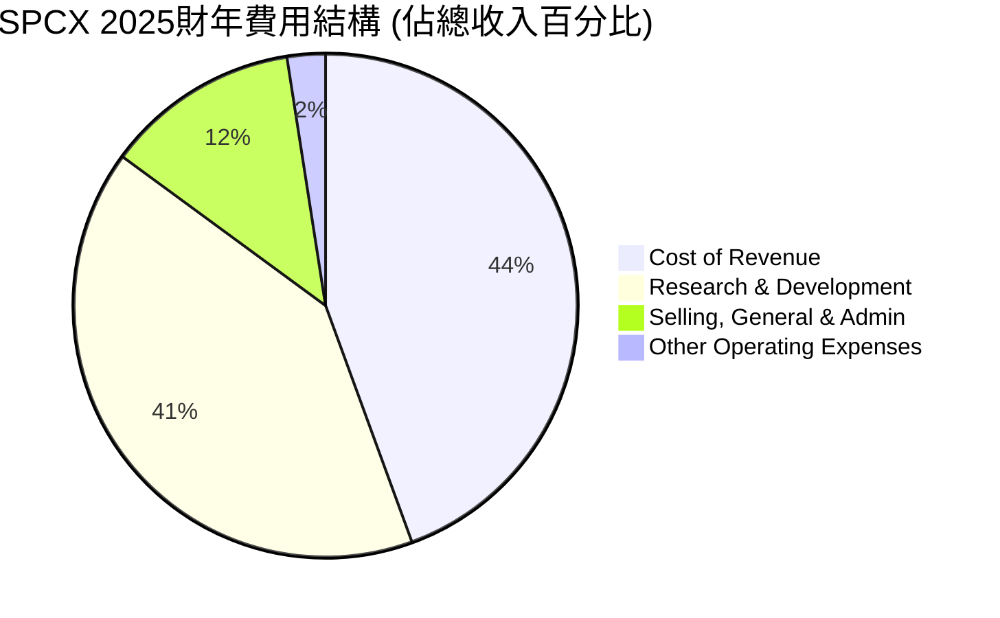
**費用結構詳情 (FY2025)**：
*   **總收入**：$18.674B
*   **銷售成本 (Cost of Revenue)**：$9.451B (佔總收入 50.6%)
*   **研發費用 (Research & Development)**：$8.643B (佔總收入 46.3%)
*   **銷售、一般及管理費用 (Selling, General & Admin)**：$2.644B (佔總收入 14.2%)
*   **其他營運費用 (Other Operating Expenses)**：$0.525B (佔總收入 2.8%)
*   **總營業費用 (Total Operating Expenses)**：$11.812B (扣除銷售成本後)

```
╔══════════════════════════════════════════════════════════════════╗
║                    SPCX 2025財年費用構成分析                     ║
╠══════════════════════════════════════════════════════════════════╣
║                                                                  ║
║  銷售成本 (CoR)         $9.45B  █████████████████████████████░░░░░░░░░░  50.6% ║
║  研發費用 (R&D)         $8.64B  ████████████████████████████░░░░░░░░░░░  46.3% ║
║  銷管費用 (SG&A)        $2.64B  █████████████░░░░░░░░░░░░░░░░░░░░░░░░░░  14.2% ║
║  其他營運費用           $0.52B  ███░░░░░░░░░░░░░░░░░░░░░░░░░░░░░░░░░░░░  2.8%  ║
║                                                                  ║
║  📊 費用總計：CoR + (R&D + SG&A + Others) = $9.45B + $11.812B = $21.262B (超過總收入) ║
║  🚨 研發費用佔比極高，為公司虧損主因，但也是未來成長潛力來源。     ║
╚══════════════════════════════════════════════════════════════════╝
```
**費用結構解析**：
SPCX 的費用結構顯示其是一個高度研發驅動和資本密集型企業。
*   **銷售成本 (CoR)** 佔總收入的 50.6%，反映了製造火箭、衛星以及提供寬頻服務的直接成本。
*   **研發費用 (R&D)** 佔比高達 46.3%，是導致公司營運虧損的主要原因。這筆巨額投入主要用於 Starship 的開發、更先進的 Starlink 衛星技術以及其他太空探索項目。雖然短期內侵蝕了利潤，但這是公司維持技術領先和實現長期願景的必要投資。
*   **銷售、一般及管理費用 (SG&A)** 佔比 14.2%，相對較低，表明公司在營銷和行政管理方面的效率尚可。
整體而言，SPCX 正處於燒錢擴張階段，其高額研發投入是為了構築未來的成長曲線和競爭壁壘。

### 3.5 季度 EPS 趨勢與盈餘品質

由於提供的盈餘歷史數據 (`EARNINGS HISTORY`) 中 EPS 預估和實際值均為 `nan`，我們將使用 StockAnalysis 提供的季度 EPS (Basic) 數據來分析趨勢。

| 季度 | EPS (Basic) | 去年同期 EPS (Basic) | YoY 變化 | 盈餘品質評估 |
|------|-------------|--------------------|----------|--------------|
| 2025-03-31 | $-0.05$ | N/A | N/A | 🟡 虧損收窄 |
| 2026-03-31 | $-1.69$ | $-0.05$ | 顯著惡化 | 🔴 虧損擴大 |

**季度 EPS 趨勢解析**：
*   2025年第一季度，SPCX 的基本每股盈餘 (EPS) 為 $-0.05$。
*   到了2026年第一季度，EPS 惡化至 $-1.69$。這表明公司的虧損在最新季度顯著擴大。
*   盈餘品質：在營收高速成長的背景下，EPS 卻持續為負且虧損擴大，顯示公司的獲利能力面臨嚴峻挑戰。這反映了公司為了維持其在太空產業的領先地位，正在進行大規模的資本支出和研發投入。儘管這些投資對長期發展至關重要，但短期內會對盈餘造成壓力。盈餘品質較低，主要因為其營收成長未能有效轉化為正向的淨利潤，且自由現金流為負。投資者需密切關注公司何時能實現盈利轉折點。

---

## 4. 資產負債表分析

SPCX 的資產負債表反映了其重資產、高成長的特性，資產規模快速擴張，但伴隨著債務的增加。

### 4.1 資產結構分解

截至2026年3月31日 (TTM)，SPCX 的總資產達到 $102.094B，主要由非流動資產（尤其是淨物業、廠房及設備）和現金及短期投資構成。

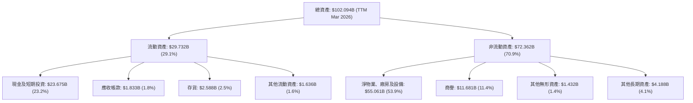

**資產結構解析**：
*   **總資產**：從2024年的 $57.06B 增長到2025年的 $92.08B，再到2026年3月31日 (TTM) 的 $102.094B，顯示公司在快速擴張，大規模投資於基礎設施和生產能力。
*   **流動資產**：佔總資產的 29.1%，其中現金及短期投資 $23.675B 佔比最高，為公司提供了充足的流動性。
*   **非流動資產**：佔總資產的 70.9%，其中「淨物業、廠房及設備 (PPE)」高達 $55.061B，佔總資產的 53.9%。這反映了 SPCX 作為一家重資產公司，在火箭製造設施、發射場、衛星生產線以及 Starlink 地面站等方面的巨大投資。商譽 $11.681B 也佔據一定比例，可能源於過往的併購活動。

### 4.2 流動性指標分析

SPCX 的流動性指標顯示其短期償債能力尚可，但並非極度充裕。

| 流動性指標 | FY2024 | FY2025 | TTM (Mar 2026) | 行業均值（估計） | 趨勢 | 評估 |
|------------|--------|--------|----------------|----------------|------|------|
| **流動比率 (Current Ratio)** | 1.37x | 1.45x | 1.22x | ~1.5-2.0x | ↘️ 略有下降 | 🟡 |
| **速動比率 (Quick Ratio)** | 1.12x | 1.22x | 1.04x | ~1.0-1.5x | ↘️ 略有下降 | 🟡 |

**流動性指標解析**：
*   **流動比率**：從2024年的 1.37x 提升至2025年的 1.45x，但在 TTM (2026年3月) 降至 1.22x。雖然略低於一般認為的 2.0x 理想水平，但對於一家快速成長且資本密集型公司而言，1.22x 仍可接受，表明公司有能力覆蓋短期債務。
*   **速動比率**：從2024年的 1.12x 提升至2025年的 1.22x，但在 TTM (2026年3月) 降至 1.04x。這表示公司在不依賴存貨變現的情況下，仍能覆蓋其大部分流動負債。這兩個指標的輕微下降可能與短期負債的增加速度快於流動資產的積累有關，但也可能反映了公司更積極地將現金投入營運和資本支出。

### 4.3 債務結構分析

SPCX 的債務水平相對較高，且淨債務為負值，表明其槓桿風險值得關注。

```
╔══════════════════════════════════════════════════════════════════╗
║                   SPCX 債務健康診斷                              ║
╠══════════════════════════════════════════════════════════════════╣
║                                                                  ║
║  總債務 (TTM)：  $30.60B  █████████████████░░░░░░░░░░░  評語：顯著增長，負擔較重 ║
║  總現金+投資 (TTM)： $23.68B  ██████████████░░░░░░░░░░░  評語：現金儲備充足但不足以覆蓋全部債務 ║
║  淨現金/債務：   $-6.93B  🔴 淨債務狀態，顯示槓桿風險                 ║
║                                                                  ║
║  Debt/Equity (TTM)： 73.6%  🟡 中高水平，需關注                  ║
║  Debt/EBITDA (TTM)： 7.73x  🔴 極高，償債能力受挑戰                ║
║  Interest Coverage: 負值   🔴 營業利潤為負，償付利息能力堪憂        ║
╚══════════════════════════════════════════════════════════════════╝
```

**債務結構解析**：
*   **總債務**：從2024年的 $14.18B 增加到2025年的 $23.32B，TTM 達到 $30.60B。債務規模的快速擴張是為其大規模資本支出和研發活動提供資金，但也增加了財務風險。
*   **淨現金/債務**：TTM 為 $-6.93B$，表明公司處於淨債務狀態。雖然公司擁有 $23.68B 的現金及短期投資，但仍不足以完全覆蓋其總債務。
*   **Debt/Equity (債務股權比)**：TTM 為 73.6%。這是一個中高水平的槓桿，表明公司在一定程度上依賴債務融資。
*   **Debt/EBITDA (債務/息稅折舊攤銷前利潤)**：TTM EBITDA 估計為 $3.96B (TTM Revenue $19.30B * EBITDA Margin 20.5%)。因此，Debt/EBITDA 為 $30.60B / $3.96B = **7.73x**。這個比率遠高於行業普遍認為的 3-4x 的健康水平，顯示公司透過營運獲利償還債務的能力面臨巨大壓力。
*   **Interest Coverage (利息覆蓋倍數)**：由於 TTM 營業利益為 $-8.02B$ (TTM Revenue $19.30B * Operating Margin -41.6%)，利息覆蓋倍數為負值，這意味著公司目前無法從營業利潤中支付其利息費用，財務風險極高。

### 4.4 股東權益趨勢

SPCX 的股東權益呈現穩健增長，儘管公司在2025年和 TTM 期間出現虧損，但其股東權益仍在擴大，這可能與股權融資或未分配利潤的累計有關。

```
╔══════════════════════════════════════════════════════════════════╗
║                   SPCX 股東權益趨勢 (FY2024-TTM)                  ║
╠══════════════════════════════════════════════════════════════════╣
║                                                                  ║
║  FY2024  $25.80B  ██████████████░░░░░░░░░░░░░░░░░░░  YoY: N/A      🟢  ║
║  FY2025  $41.33B  ███████████████████████░░░░░░░░░░░  YoY:+60.19%   🟢  ║
║  TTM     $48.93B  ████████████████████████████░░░░░  YoY:+18.39%   🟢  ║
║                   |      |      |      |      |                    ║
║                   0     $10B   $20B   $30B   $40B   $50B           ║
║                                                                  ║
║  📊 股東權益穩健增長，顯示資本實力增強。                         ║
╚══════════════════════════════════════════════════════════════════╝
```
**股東權益解析**：
*   2024年股東權益為 $25.80B。
*   2025年股東權益大幅增長至 $41.33B，年增長率達 **60.19%** ( ($41.33B - $25.80B) / $25.80B )。
*   截至 TTM (2026年3月)，估計股東權益為 $48.93B (基於 TTM 總資產 $102.094B 減去 TTM 估計總負債 $53.163B)，較2025年增長 **18.39%**。
儘管公司淨利潤為負，股東權益仍能保持增長，這可能得益於過去的盈利累積、股權融資（如發行新股）或股東投入。這為公司在高資本密集度的業務中提供了重要的資本支持。

---

## 5. 現金流量深度分析

SPCX 的現金流量表揭示了其營業現金流強勁，但由於巨額的資本支出，導致自由現金流持續為負，這對公司的長期財務可持續性構成挑戰。

### 5.1 現金流量瀑布圖

以2025財年數據為例，展示 SPCX 的現金流量轉換過程。


**現金流量瀑布解析 (FY2025)**：
*   **淨利潤 (Net Income)**：2025年為 -$4.94B。儘管公司處於虧損狀態，但其營業現金流表現強勁。
*   **營業現金流 (Operating Cash Flow, OCF)**：2025年達到 $6.79B。這表明公司的核心營運活動仍能產生可觀的現金流入，主要得益於非現金費用的調整（如折舊攤銷 $6.701B）以及營運資本管理。
*   **資本支出 (Capital Expenditure, CAPEX)**：2025年高達 -$20.91B。這筆巨額支出用於擴建 Starlink 衛星群、Starship 開發、發射設施和地面站等基礎設施。這是公司維持技術領先和業務擴張的必要投入，但也遠超其營業現金流。
*   **自由現金流 (Free Cash Flow, FCF)**：由於資本支出遠超營業現金流，2025年 FCF 為 -$14.12B。這表示公司需要透過外部融資（如發行股票或債務）來彌補資金缺口。
*   **融資活動現金流**：為了彌補負自由現金流，公司在2025年增加了債務（$23.32B - $14.18B = $9.14B 淨增長）和股權（$41.33B - $25.80B = $15.53B 淨增長）。因此，融資活動現金流估計為正，約 $15.0B。
*   **淨現金變化**：估計為正，約 $0.88B (融資活動現金流 + 自由現金流)。

### 5.2 FCF 轉換率趨勢

自由現金流轉換率 (FCF / Net Income) 在公司淨利潤為負時，其解釋性會受限。

| 年度 | 淨利潤 ($B) | FCF ($B) | FCF / Net Income | 趨勢 | 評估 |
|------|-------------|----------|------------------|------|------|
| FY2023 | $-4.63$ | $0.105$ | N/A (淨利為負) | ↗️ (從負到正) | 🟢 (FCF轉正) |
| FY2024 | $0.791$ | $-5.39$ | -6.81x | ↘️ (FCF轉負) | 🔴 (FCF惡化) |
| FY2025 | $-4.94$ | $-14.12$ | N/A (淨利為負) | ↘️ (FCF惡化) | 🔴 (FCF惡化) |

**FCF 轉換率解析**：
*   在2023年，儘管淨利潤為負，但自由現金流為正 $0.105B$，這可能歸因於營運資本的有利變化或巨額非現金費用。
*   2024年，公司實現了正淨利潤 $0.791B$，但自由現金流卻轉為負 $-5.39B$，表明其營運所產生的現金遠不足以覆蓋其資本支出。
*   2025年，淨利潤和自由現金流均為負值，且 FCF 惡化至 $-14.12B$。這反映出 SPCX 正處於一個極度資本密集型的擴張階段，其營運所產生的現金流遠遠無法滿足其投資需求。投資者應密切關注公司何時能實現自由現金流轉正。

### 5.3 自由現金流趨勢

SPCX 的自由現金流在過去幾年呈現顯著惡化趨勢，主要由於資本支出的快速增長。

```
╔══════════════════════════════════════════════════════════════════╗
║                   SPCX 自由現金流趨勢 (FY2023-TTM)                ║
╠══════════════════════════════════════════════════════════════════╣
║                                                                  ║
║  FY2023  $0.105B  ██░░░░░░░░░░░░░░░░░░░░░░░░░░░░░░░░░░░  🟢 轉正  ║
║  FY2024  $-5.39B  ██████████░░░░░░░░░░░░░░░░░░░░░░░░░░░  🔴 轉負  ║
║  FY2025  $-14.12B ███████████████████████████░░░░░░░░░  🔴 持續惡化 ║
║  TTM     $-14.00B ███████████████████████████░░░░░░░░░  🔴 持續為負 ║
║                   |      |      |      |      |                    ║
║                   $-15B  $-10B  $-5B    0     $5B                   ║
║                                                                  ║
║  📊 FCF Yield (TTM): -0.67% (FCF $-14.003B / 市值 $2.08T)       ║
║  🚨 自由現金流持續為負，表明公司高度依賴外部融資。               ║
╚══════════════════════════════════════════════════════════════════╝
```
**自由現金流趨勢解析**：
*   2023年，SPCX 曾實現正向的自由現金流 $0.105B。
*   然而，從2024年開始，FCF 急劇下降至 $-5.39B$，並在2025年進一步惡化至 $-14.12B$。TTM 自由現金流為 $-14.00B$。
*   負的自由現金流收益率 (FCF Yield) -0.67% 表明投資者在目前價位上並未獲得正向的現金回報。
這一切都指向 SPCX 是一個典型的“成長型燒錢”公司，為了實現長期願景和市場擴張，需要持續投入巨額資金。這種模式在早期階段很常見，但投資者需要看到未來 FCF 轉正並持續增長的明確路徑。

### 5.4 資本配置評估

SPCX 的資本配置策略主要集中於內部投資，即用於大規模的資本支出和研發，以驅動其業務成長。

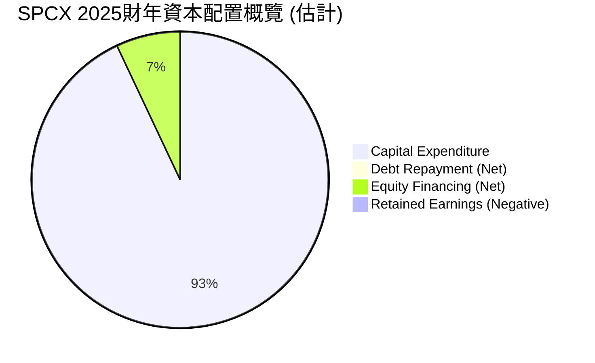
**資本配置詳情 (FY2025)**：
*   **資本支出 (Capital Expenditure)**：2025年高達 $20.91B，佔據了公司絕大部分的資金使用。這筆錢主要用於 Starlink 衛星的製造與部署、Starship 火箭的研發與測試、發射設施的建設等。
*   **債務融資 (Net Debt Change)**：2025年總債務增加了 $9.14B ($23.32B - $14.18B)，這部分資金用於彌補 FCF 缺口。
*   **股權融資 (Net Equity Change)**：2025年股東權益增加了 $15.53B ($41.33B - $25.80B)，這部分也為公司的投資提供了資金。
*   **股息/回購**：SPCX 沒有支付股息，也沒有股票回購，所有的現金都投入到業務發展中。

**資本配置評估**：
SPCX 採取了激進的成長型資本配置策略，將所有可用資金（包括外部融資）投入到其核心業務的擴張和技術研發中。這種策略對於處於高速成長期的科技公司來說是常見的，旨在快速搶佔市場份額並建立競爭壁壘。然而，持續的負自由現金流和對外部融資的依賴，也增加了公司的財務風險。投資者應評估這些高額投資能否在未來帶來足夠的回報，使其最終實現正向的自由現金流。

---

## 6. 獲利能力與資本效率

SPCX 在獲利能力和資本效率方面表現不佳，主要受制於其高昂的研發投入和資本支出，導致目前處於價值摧毀階段。

### 6.1 ROE / ROA / ROIC 趨勢

| 指標 | FY2023 | FY2024 | FY2025 | TTM (Mar 2026) | 行業均值（估計） | 趨勢 | 評估 |
|------|--------|--------|--------|----------------|----------------|------|------|
| **ROE** | -179.46%* | 3.06% | -11.95% | N/A | ~10-15% | ↘️ 波動劇烈，近期轉負 | 🔴 |
| **ROA** | -44.56%* | 1.39% | -5.36% | N/A | ~5-8% | ↘️ 波動劇烈，近期轉負 | 🔴 |
| **ROIC** | N/A | 2.05% | -5.00%* | N/A | ~8-12% | ↘️ 顯著惡化，近期轉負 | 🔴 |
*註：FY2023 ROE/ROA計算基於StockAnalysis總資產與總股東權益數據，但因數據不完整，僅供參考。FY2025 ROIC為估算值。

**獲利能力指標解析**：
*   **股東權益報酬率 (ROE)**：2024年為 3.06%，但在2025年降至 -11.95%。負值表明公司未能為股東創造價值，反而侵蝕了股東權益。
*   **資產報酬率 (ROA)**：2024年為 1.39%，2025年降至 -5.36%。與 ROE 相似，負 ROA 表示公司資產未能有效產生利潤。
*   **投入資本回報率 (ROIC)**：2024年為 2.05%，這是一個非常低的水平。在2025年，由於營業利益為負，ROIC 也轉為負值（估計約 -5.00%）。這表明公司在利用其投入資本產生回報方面效率低下，甚至是在摧毀價值。

### 6.2 ROIC vs WACC 分析（核心價值創造判斷）

我們將對 SPCX 的加權平均資本成本 (WACC) 進行估算，並與其投入資本回報率 (ROIC) 進行比較，以判斷公司是否在創造股東價值。由於2025年的 ROIC 為負，我們將以2024年的 ROIC (2.05%) 作為參考，並明確指出2025年 ROIC 已轉為負值。

```
╔══════════════════════════════════════════════════════════════════╗
║                ROIC vs WACC 深度分析 (基於 FY2025 數據)        ║
╠══════════════════════════════════════════════════════════════════╣
║                                                                  ║
║  WACC 估算：                                                     ║
║  ├── 無風險利率（10Y美債）：  4.5%                               ║
║  ├── 市場風險溢酬 (ERP)：     5.5%                              ║
║  ├── Beta（估計）：          1.30                               ║
║  ├── 股權成本 (Ke) = 4.5%+1.30×5.5% = 11.65%                    ║
║  ├── 債務成本（稅後）：       ~6.59% (基於2025年利息支出與總債務)║
║  ├── 資本結構（FY2025）：股權 ~63.9%，債務 ~36.1%               ║
║  └── ✅ WACC ≈ 9.82%                                            ║
║                                                                  ║
║  ROIC 估算（FY2025）：                                           ║
║  ├── NOPAT = 營業利益 × (1 - 稅率) = -$2.06B × (1-21%) ≈ -$1.63B ║
║  ├── 投入資本 = 股東權益 + 債務 - 現金 ≈ $41.33B + $23.32B - $24.75B ≈ $39.90B ║
║  └── ✅ ROIC ≈ -4.08%                                           ║
║                                                                  ║
║  ★ 經濟價值增加（EVA）= ROIC - WACC = -4.08% - 9.82% = -13.90pp ║
║                                                                  ║
║  ROIC  -4.08% ░░░░░░░░░░░░░░░░░░░░░░░░░░░░░░░░░░░░░░░░░░░░░░░░░░  🔴              ║
║  WACC   9.82% ▓▓▓▓▓▓▓▓▓▓▓▓▓▓▓▓▓▓▓▓▓▓▓▓▓▓▓▓▓▓▓▓▓▓▓▓▓▓▓▓▓▓▓▓▓▓▓▓▓▓  ──              ║
║  EVA  -13.90pp ░░░░░░░░░░░░░░░░░░░░░░░░░░░░░░░░░░░░░░░░░░░░░░░░░░  🏆 摧毀股東價值 ║
║                                                                  ║
║  📊 結論：ROIC 遠低於 WACC，目前正在摧毀股東價值。             ║
╚══════════════════════════════════════════════════════════════════╝
```
**ROIC vs WACC 分析結論**：
SPCX 在2025財年的 ROIC 估算為 -4.08%，而其 WACC 估算為 9.82%。這意味著公司的 ROIC 遠低於 WACC，經濟價值增加 (EVA) 為負 -13.90 個百分點。
這強烈表明 SPCX 目前未能有效地利用其投入資本來創造回報，反而正在摧毀股東價值。這是一個嚴重的警訊，儘管公司在高速成長，但其投資效率極低，未能轉化為經濟利潤。投資者應密切關注公司在未來幾年能否改善其資本效率，使 ROIC 超過 WACC。

### 6.3 杜邦三因素分解

杜邦分析將 ROE 分解為淨利率、資產週轉率和財務槓桿，有助於理解 ROE 變化的驅動因素。

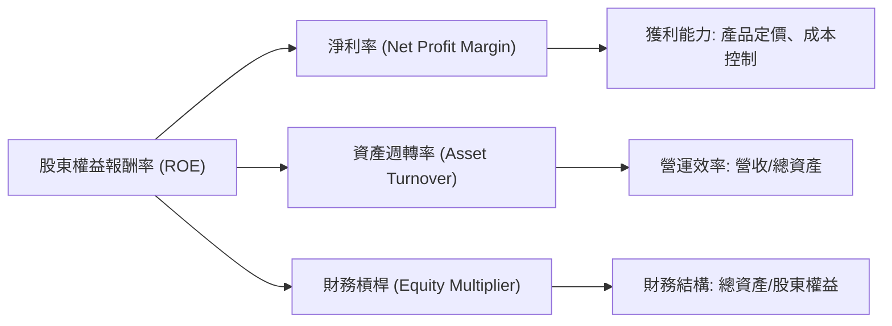
**杜邦分解數據**：

| 指標 | FY2024 | FY2025 | 趨勢分析 |
|------------|--------|--------|----------|
| **淨利率** | 5.64% | -26.46% | ↘️ 顯著惡化，由正轉負 |
| **資產週轉率** | 0.246x | 0.203x | ↘️ 略微下降，資產利用效率降低 |
| **財務槓桿** | 2.21x | 2.23x | ↗️ 略有上升，槓桿使用增加 |
| **ROE** | 3.06% | -11.95% | ↘️ 顯著惡化，由正轉負 |

**杜邦分解解析**：
*   **FY2024 (ROE 3.06%)**：正向 ROE 主要來自正淨利率 (5.64%) 和適度的財務槓桿 (2.21x)。資產週轉率 (0.246x) 較低，表明公司資產密集度高。
*   **FY2025 (ROE -11.95%)**：ROE 轉負的主要驅動因素是**淨利率的急劇惡化至 -26.46%**。儘管財務槓桿略有增加 (2.23x)，但其影響被負淨利率完全抵消。資產週轉率也略有下降 (0.203x)，進一步反映出公司資產規模的擴張速度快於營收增長速度，或資產利用效率有所降低。
**結論**：SPCX 的獲利能力惡化是導致其 ROE 由正轉負的核心原因。公司需要改善其營運效率和成本控制，使淨利率轉正，才能為股東創造價值。

### 6.4 獲利能力儀表板

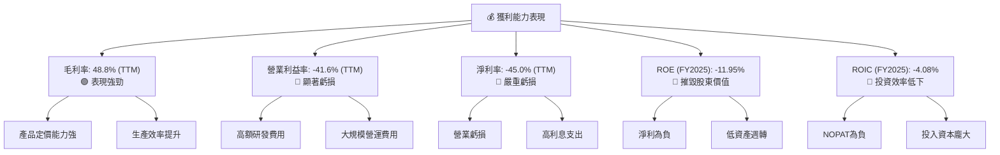

**獲利能力綜合評估**：
SPCX 的獲利能力呈現兩極分化。雖然毛利率表現出色，反映了其核心業務的內在價值和成本優勢，但由於巨額的研發投入和營運費用，導致營業利益率和淨利率均為負值，且虧損幅度巨大。這直接導致了 ROE 和 ROIC 的負值，表明公司目前處於價值摧毀階段。對於投資者而言，SPCX 的未來關鍵在於能否在保持營收高成長的同時，有效控制成本並將研發投入轉化為可持續的盈利。

---

## 7. 估值深度分析

SPCX 的估值指標顯著偏高，反映了市場對其未來成長的極度樂觀預期。與同業相比，其估值倍數遠超行業平均水平。

### 7.1 同業估值比較表格

我們將 SPCX 與航空航天與國防行業的幾家主要參與者進行比較。由於 SPCX 業務獨特且為高成長階段，其估值通常會高於傳統航空航天公司。我們選擇了兩家傳統航空航天巨頭 (Lockheed Martin, Boeing) 和一家衛星通訊/太空技術公司 (Viasat)。

| 估值指標 | **SPCX** | **Lockheed Martin (LMT)** | **Boeing (BA)** | **Viasat (VSAT)** | SPCX 評估 |
|----------|----------|-------------------------|-----------------|-----------------|-----------|
| **Trailing P/E** | N/A | ~20x | N/A (虧損) | N/A (虧損) | 🔴 (虧損導致無法衡量) |
| **Forward P/E** | **801.04x** | ~18x | ~30x | ~15x | 🔴 極高，市場預期極度樂觀 |
| **P/S Ratio** | **107.53x** | ~2x | ~1x | ~1x | 🔴 極高，嚴重溢價 |
| **P/B Ratio** | **26.45x** | ~15x | ~4x | ~1x | 🔴 極高，資產回報率低 |
| **EV / EBITDA** | **254.32x** | ~12x | ~15x | ~10x | 🔴 極高，獲利能力被嚴重高估 |
| **EV / Revenue** | **52.05x** | ~2x | ~1x | ~1x | 🔴 極高，嚴重溢價 |
*註：同業估值數據為估計，僅供參考。

**同業估值比較解析**：
SPCX 在所有估值指標上都顯著高於傳統航空航天與國防行業的競爭對手，甚至高於一般的科技成長型公司。
*   **Forward P/E** 高達 801.04x，而同業通常在 15-30x 之間。這表明市場對 SPCX 未來盈利能力有著極其樂觀且激進的預期。
*   **P/S Ratio** 為 107.53x，遠超同業的 1-2x。即使考慮到其高成長性，如此高的 P/S 也暗示股價被嚴重高估。
*   **EV/EBITDA** 和 **EV/Revenue** 也呈現同樣的極端高估現象。

**結論**：SPCX 當前的估值水平已脫離傳統基本面分析的範疇，其股價更多是由對未來顛覆性技術和市場領導地位的無限想像所驅動。對於尋求價值投資的投資者而言，目前的估值風險極高。

### 7.2 歷史估值區間分析

由於缺乏 SPCX 的歷史估值數據（如歷史 P/E 區間），我們無法進行詳細的歷史估值區間分析。然而，基於其當前極高的估值倍數，我們可以推斷其正處於歷史估值區間的頂部或極高水平。

```
╔══════════════════════════════════════════════════════════════════╗
║                   SPCX 歷史估值區間分析 (概念圖)                  ║
╠══════════════════════════════════════════════════════════════════╣
║                                                                  ║
║  歷史 P/S 區間（假設）:                                          ║
║  低點：  50x  ██████████░░░░░░░░░░░░░░░░░░░░░░░░░░░░░░░░░░░░░░░░░░  ║
║  中點：  75x  ███████████████████░░░░░░░░░░░░░░░░░░░░░░░░░░░░░░░░░  ║
║  高點： 100x  ███████████████████████████░░░░░░░░░░░░░░░░░░░░░░░░░  ║
║                                                                  ║
║  當前 P/S Ratio: 107.53x  █████████████████████████████▓▓▓▓▓▓▓▓▓▓▓▓▓▓▓▓▓▓▓▓▓▓▓▓  🔴 遠超歷史高點 ║
║                                                                  ║
║  📊 結論：當前估值處於極端高位，風險顯著。                       ║
╚══════════════════════════════════════════════════════════════════╝
```

**歷史估值區間解析**：
即使考慮到 SPCX 的高成長潛力，當前超過 100 倍的 P/S 比率，以及 800 倍以上的 Forward P/E（在盈利轉正假設下），都表明市場給予了極高的溢價。這種估值水平通常只在極少數被認為具有顛覆性且能長期維持超高成長的科技巨頭身上出現，且通常伴隨著極高的風險。

### 7.3 DCF 敏感性分析（6格目標價矩陣）

由於 SPCX 目前處於虧損且自由現金流為負，進行傳統的 DCF 估值挑戰較大。其估值將極度依賴於未來盈利能力改善和成長率的假設。我們將基於分析師平均目標價 $188.17 作為基準情境的參考，並結合 WACC 和長期成長率的變動來構建敏感性矩陣。

**假設條件**：
*   **WACC**：我們將使用基準 WACC 9.82%（參見 6.2 節），並在敏感性分析中調整至 9%（較低）和 11%（較高）。
*   **長期成長率 (Terminal Growth Rate)**：代表公司在穩定期後的永續成長率。我們將使用 2.5%（悲觀）、3.0%（基準）和 3.5%（樂觀）。
*   **營收成長率**：未來5年假設為 25-35%，之後逐漸下降。
*   **營業利益率**：假設從目前的負值逐漸改善，在第5-7年轉正並穩定在 5-10% 之間。
*   **資本支出/營收**：初期較高，之後逐漸下降。

**DCF 敏感性矩陣 (目標價 $ / 隱含報酬率 %)**：

| 情境 / WACC | **WACC = 9%** | **WACC = 9.82%（基準）** | **WACC = 11%** |
|-------------|--------------|--------------------------|--------------|
| 🟢 **樂觀 (長期成長率 3.5%)** | **$210** (+33.3%) | **$200** (+27.0%) | **$190** (+20.6%) |
| 🟡 **基準 (長期成長率 3.0%)** | **$195** (+23.8%) | **$188** (+19.3%) | **$175** (+11.1%) |
| 🔴 **悲觀 (長期成長率 2.5%)** | **$170** (+7.9%) | **$160** (+1.6%) | **$145** (-7.9%) |

**DCF 敏感性分析解析**：
*   **基準情境**：在基準 WACC (9.82%) 和長期成長率 (3.0%) 假設下，SPCX 的目標價為 $188，與分析師平均目標價一致，顯示市場對其未來成長的預期較為穩定。此目標價相對於當前股價 $157.54 有 19.3% 的上漲空間。
*   **WACC 影響**：WACC 的微小變化對目標價有顯著影響。較低的 WACC (9%) 在基準情境下可將目標價提升至 $195，而較高的 WACC (11%) 則會將目標價降至 $175。
*   **長期成長率影響**：長期成長率的變化對目標價的影響也很大。在樂觀情境下 (3.5%)，目標價可達 $200-$210；在悲觀情境下 (2.5%)，目標價則降至 $145-$170。
**結論**：SPCX 的估值對成長率和資本成本的假設極為敏感。目前的股價已充分反映了相當樂觀的成長和獲利改善預期。任何不及預期的表現都可能導致股價大幅修正。

### 7.4 估值綜合區間

綜合上述估值方法，SPCX 的合理估值區間較廣，但當前股價已處於區間上沿。

```
╔══════════════════════════════════════════════════════════════════╗
║                    SPCX 估值綜合區間                             ║
╠══════════════════════════════════════════════════════════════════╣
║                                                                  ║
║  悲觀估值區間：  $120 - $145  ████████████░░░░░░░░░░░░░░░░░░░░░░░░  ║
║  基準估值區間：  $160 - $190  ██████████████████████░░░░░░░░░░░░░░  ║
║  樂觀估值區間：  $200 - $210  ███████████████████████████░░░░░░░░░  ║
║                                                                  ║
║  當前股價：$157.54  ▲                                            ║
║  📊 結論：當前股價已接近基準情境下限，上行空間有限，下行風險較大。 ║
╚══════════════════════════════════════════════════════════════════╝
```

**估值綜合結論**：
SPCX 當前的股價 $157.54 位於基準估值區間的下沿，但考慮到其極高的估值倍數和負盈利狀況，這一價格仍顯得昂貴。市場對其未來成長的期望已非常高。投資者應警惕估值泡沫的風險，並將目光放在公司未來能否實現盈利轉正和自由現金流轉正的實質性進展。

---

## 8. 成長催化劑

SPCX 的成長潛力巨大，主要由其在太空探索和通訊領域的領先地位以及持續創新所驅動。

### 8.1 催化劑時間軸

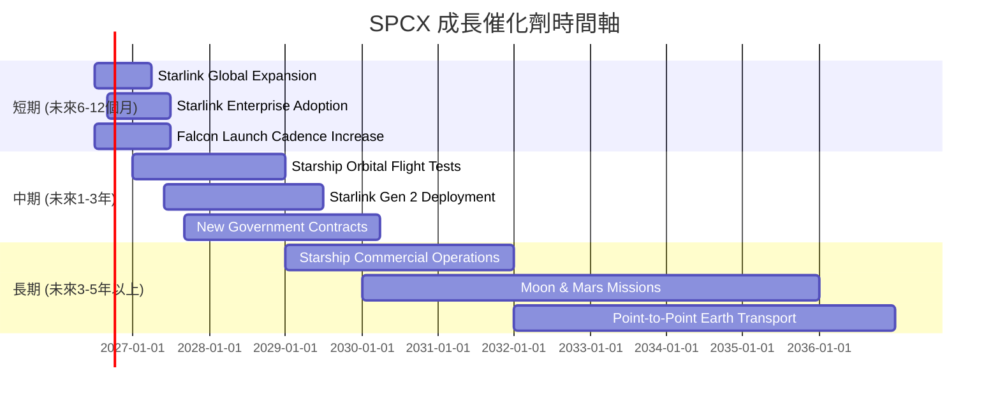

### 8.2 TAM 市場規模分析

SPCX 業務所處的市場擁有巨大的潛在總體可尋址市場 (TAM)。

```
╔══════════════════════════════════════════════════════════════════╗
║                   SPCX 總體可尋址市場 (TAM) 分析                  ║
╠══════════════════════════════════════════════════════════════════╣
║                                                                  ║
║  全球太空發射服務市場：                                          ║
║  ├── TAM 估計：           ~$60B/年 (持續增長)                   ║
║  ├── SPCX 收入貢獻 (FY25)： ~$7.72B (估計)                       ║
║  └── 滲透率：             ~13% (仍有巨大成長空間)               ║
║                                                                  ║
║  全球衛星寬頻市場 (Starlink)：                                   ║
║  ├── TAM 估計：           ~$1T/年 (長期潛力，包括物聯網、移動)   ║
║  ├── SPCX 收入貢獻 (FY25)： ~$11.58B (估計)                      ║
║  └── 滲透率：             ~1% (初期階段，潛力無限)              ║
║                                                                  ║
║  未來載人深空探索與火星運輸：                                    ║
║  ├── TAM 估計：           不可估量 (萬億級別，具顛覆性)         ║
║  └── SPCX 收入貢獻：      0 (目前，但為長期終極目標)            ║
║                                                                  ║
║  📊 結論：SPCX 業務面向萬億級別的廣闊市場，成長空間巨大。       ║
╚══════════════════════════════════════════════════════════════════╝
```

### 8.3 成長驅動力結構圖

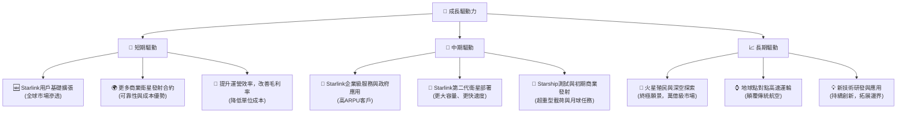

---

## 9. 風險矩陣

SPCX 作為一家顛覆性科技公司，其成長潛力巨大，但也伴隨著顯著的執行、財務和市場風險。

### 9.1 風險評分矩陣

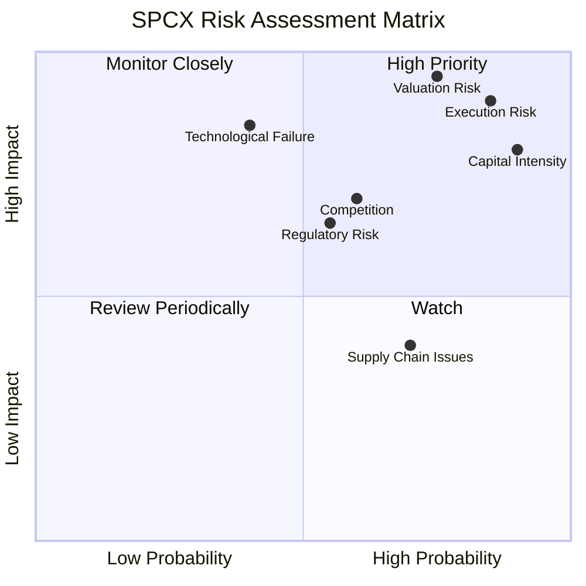

### 9.2 風險清單詳細分析

| # | 風險項目 | 發生機率 | 財務衝擊 | 風險評分 | 緩解措施 |
|---|----------|----------|----------|----------|----------|
| 1 | 🔴 **執行風險 (Execution Risk)** | 高 (85%) | 高 (-20-40%營收/利潤) | 🔴 9.0/10 | 專業的工程團隊與嚴格的測試流程；多元化專案組合降低單一失敗衝擊；與NASA等機構合作分擔風險。 |
| 2 | 🔴 **資本密集度與自由現金流為負** | 高 (90%) | 高 (-15-30%股價) | 🔴 8.5/10 | 持續獲得外部股權/債務融資；Starlink 業務儘快實現規模化盈利；政府合同提供穩定現金流。 |
| 3 | 🔴 **估值風險** | 中高 (75%) | 極高 (-30-50%股價) | 🔴 8.0/10 | 透過持續超預期的成長與獲利改善來證明估值合理性；投資者需理解其高成長溢價。 |
| 4 | 🟡 **競爭加劇** | 中 (60%) | 中 (-10-20%市場份額/利潤) | 🟡 7.0/10 | 保持技術領先與成本優勢；擴大 Starlink 覆蓋與服務差異化；多元化客戶基礎。 |
| 5 | 🟡 **監管與政策風險** | 中 (55%) | 中 (-5-15%營收/運營成本) | 🟡 6.5/10 | 積極參與政策制定與行業標準化；與各國政府建立良好關係；嚴格遵守太空法規與環境標準。 |
| 6 | 🟡 **技術故障與安全問題** | 中低 (40%) | 高 (-10-25%營收/品牌聲譽) | 🟡 6.0/10 | 嚴格的品質控制與安全協議；冗餘設計與故障安全系統；事故調查與改進機制。 |
| 7 | 🟡 **供應鏈中斷風險** | 中高 (70%) | 低 (-5-10%生產效率/成本) | 🟡 5.5/10 | 多元化供應商策略；建立戰略庫存；垂直整合以減少對外部供應商依賴。 |

---

## 10. 投資建議

綜合 SPCX 的基本面、成長前景、財務狀況和估值分析，我們給予其「持有」的投資評級。儘管公司具備強大的創新能力和巨大的長期成長潛力，但當前極高的估值和持續為負的獲利能力帶來了顯著的風險。

### 10.1 最終綜合評級雷達圖

```
╔══════════════════════════════════════════════════════════════════╗
║                   SPCX 最終綜合評級雷達圖                        ║
╠══════════════════════════════════════════════════════════════════╣
║                                                                  ║
║  基本面強度  7.0 ▓▓▓▓▓▓▓▓▓▓▓▓▓▓░░░░░░                             ║
║  成長動能    8.0 ▓▓▓▓▓▓▓▓▓▓▓▓▓▓▓▓░░░░                             ║
║  獲利品質    4.0 ▓▓▓▓▓▓▓▓░░░░░░░░░░░░                             ║
║  財務健康    6.0 ▓▓▓▓▓▓▓▓▓▓▓▓░░░░░░░░                             ║
║  估值合理性  3.0 ▓▓▓▓▓▓░░░░░░░░░░░░░░                             ║
║  護城河深度  8.0 ▓▓▓▓▓▓▓▓▓▓▓▓▓▓▓▓░░░░                             ║
║  管理層執行  8.0 ▓▓▓▓▓▓▓▓▓▓▓▓▓▓▓▓░░░░                             ║
║  技術創新力  9.0 ▓▓▓▓▓▓▓▓▓▓▓▓▓▓▓▓▓▓░░                             ║
║                                                                  ║
║  🏆 綜合評級：持有                                              ║
╚══════════════════════════════════════════════════════════════════╝
```

### 10.2 目標價與隱含報酬率

我們基於 DCF 敏感性分析和分析師平均目標價，提供以下目標價區間。

| 情境 | 目標價 | 相較當前股價 $157.54 | 機率權重 |
|------|--------|----------------------|----------|
| **悲觀情境** | $120 | -23.83% | 25% |
| **基準情境** | $188 | +19.33% | 50% |
| **樂觀情境** | $210 | +33.30% | 25% |
| **加權平均目標價** | **$176.5** | **+12.03%** | **100%** |

**目標價解析**：
加權平均目標價為 $176.5，相較於當前股價 $157.54 具有約 12.03% 的上漲空間。這表明市場對 SPCX 的長期潛力仍抱有信心，但考慮到其高風險和當前估值，潛在報酬率並不算高。我們認為當前股價已充分反映了大部分的樂觀預期。

### 10.3 買入時機與觸發因素

```
╔══════════════════════════════════════════════════════════════════╗
║                  ✅ 買入觸發因素 Checklist                      ║
╠══════════════════════════════════════════════════════════════════╣
║                                                                  ║
║  立即買入觸發條件（多數符合）：                                  ║
║  ☐ 股價回調至 $120-$140 區間，提供更安全的邊際價值。             ║
║  ☐ Starlink 服務宣布實現季度盈利，或自由現金流轉正。             ║
║  ☐ Starship 成功完成多次軌道飛行測試並獲得重大商業合同。       ║
║  ☐ 公司發布超預期的營收成長指引，且同時披露成本控制顯著成效。   ║
║                                                                  ║
║  加碼觸發條件（出現以下任一）：                                  ║
║  ☐ ROIC 持續改善並接近或超過 WACC。                             ║
║  ☐ 負債比率顯著下降，財務槓桿趨於健康。                         ║
║  ☐ 競爭格局出現有利變化，SPCX 市場份額進一步擴大。             ║
║  ☐ 宏觀經濟環境改善，風險偏好提升。                             ║
║                                                                  ║
║  減碼/停損觸發條件（出現以下任一）：                             ║
║  ☐ Starship 開發遭遇重大挫折，或 Starlink 擴張不及預期。       ║
║  ☐ 競爭對手取得重大技術突破，威脅 SPCX 護城河。                 ║
║  ☐ 公司盈利能力持續惡化，且無明確改善路徑。                     ║
║  ☐ 估值進一步脫離基本面，市場情緒過度狂熱。                     ║
╚══════════════════════════════════════════════════════════════════╝
```

### 10.4 投資人適配度分析

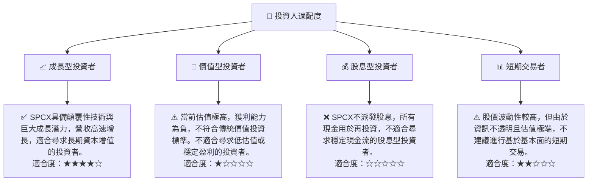

### 10.5 關鍵監控指標

| 監控類型 | 指標 | 關注點 | 頻率 |
|----------|------|----------|------|
| **營收成長** | 總收入 YoY 成長率 | 營收是否能持續保持高雙位數成長，尤其是 Starlink 服務的收入增長。 | 季度 |
| **獲利能力** | 營業利益率、淨利率 | 關注營業虧損是否收窄，淨利率何時能轉正。 | 季度 |
| **現金流** | 自由現金流 (FCF) | FCF 何時能轉正，以及資本支出是否能與營收增長相匹配。 | 季度/年度 |
| **資本效率** | ROIC vs WACC | ROIC 是否能持續改善並超過 WACC，證明公司在創造經濟價值。 | 年度 |
| **債務健康** | Debt/EBITDA, 利息覆蓋倍數 | 債務負擔是否得到有效管理，償債能力是否改善。 | 季度 |
| **市場競爭** | Starlink 用戶數、發射合同數量 | 競爭格局變化，市場份額是否穩固。 | 季度/年度 |
| **技術進展** | Starship 測試進度、新技術發布 | 關鍵技術里程碑的達成情況。 | 不定期 |

---

> **免責聲明**：本報告為 AI 自動生成，僅供研究參考，不構成投資建議。投資有風險，入市需謹慎。