# SPCX 基本面深度分析報告
> **報告日期**：2026-07-02 ｜ **語言**：繁體中文 ｜ **數據來源**：Yahoo Finance, Finviz, StockAnalysis, Roic.ai ｜ **分析師**：CFA 級機構研究

---

## 目錄

| # | 章節 | 核心結論 |
|---|------|----------|
| 1 | 執行摘要 | 評級：持有；目標價區間：$150 - $210 |
| 2 | 公司概覽與商業模式 | 憑藉技術和規模構建強大護城河，但市場份額數據稀缺 |
| 3 | 損益表深度分析 | 收入高速成長，但獲利能力波動劇烈且近期惡化 |
| 4 | 資產負債表分析 | 資產規模迅速擴張，流動性尚可，但債務負擔增加 |
| 5 | 現金流量深度分析 | 營業現金流強勁，但資本支出龐大導致自由現金流持續為負 |
| 6 | 獲利能力與資本效率 | ROIC 遠低於 WACC，目前處於價值摧毀階段；杜邦分解揭示淨利率為主要拖累 |
| 7 | 估值深度分析 | 估值極高，反映市場對未來成長的極度樂觀預期，但與同業相比存在溢價 |
| 8 | 成長催化劑 | Starlink 全球擴張、Starship 開發及政府/商業航天需求是主要驅動力 |
| 9 | 風險矩陣 | 資本支出壓力、技術風險、競爭加劇和監管不確定性是主要風險 |
| 10 | 投資建議 | 建議持有，等待獲利能力改善及估值回歸合理區間 |

---

## 1. 執行摘要

Space Exploration Technologies Corp. (SPCX) 作為太空探索與衛星寬頻領域的領導者，展現出令人矚目的收入成長潛力，特別是在其Starlink衛星寬頻服務和可重複使用火箭技術方面。然而，公司目前正處於大規模投資階段，導致獲利能力波動劇烈且自由現金流持續為負。儘管市場對其未來潛力給予極高估值，但當前的財務表現和高昂的估值倍數，使得投資風險與報酬率需要仔細權衡。

### 1.1 核心評分儀表板

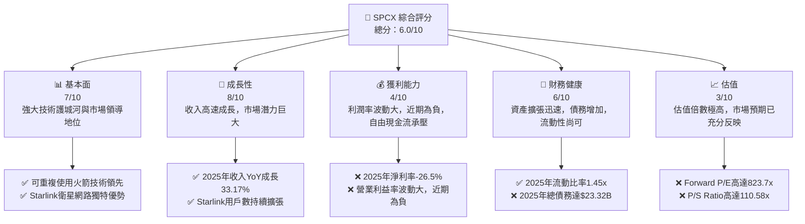

### 1.2 評分進度條視覺化

```
╔══════════════════════════════════════════════════════════════╗
║              SPCX 多維度評分儀表板 (1-10分)                  ║
╠══════════════════════════════════════════════════════════════╣
║ 基本面強度  7.0 ▓▓▓▓▓▓▓▓▓▓▓▓▓▓░░░░░░  ★★★★☆           ║
║ 成長動能    8.0 ▓▓▓▓▓▓▓▓▓▓▓▓▓▓▓▓░░░░  ★★★★☆           ║
║ 獲利品質    4.0 ▓▓▓▓▓▓▓▓░░░░░░░░░░░░  ★★☆☆☆           ║
║ 財務健康    6.0 ▓▓▓▓▓▓▓▓▓▓▓▓░░░░░░░░  ★★★☆☆           ║
║ 估值合理性  3.0 ▓▓▓▓▓▓░░░░░░░░░░░░░░  ★★☆☆☆           ║
║ 護城河深度  8.0 ▓▓▓▓▓▓▓▓▓▓▓▓▓▓▓▓░░░░  ★★★★☆           ║
║ 管理層執行  7.0 ▓▓▓▓▓▓▓▓▓▓▓▓▓▓░░░░░░  ★★★★☆           ║
║ 技術創新力  9.0 ▓▓▓▓▓▓▓▓▓▓▓▓▓▓▓▓▓▓░░  ★★★★★           ║
╠══════════════════════════════════════════════════════════════╣
║ 綜合總分    6.0 ▓▓▓▓▓▓▓▓▓▓▓▓░░░░░░░░  🏆 評語：成長性強勁，但獲利與估值承壓。              ║
╚══════════════════════════════════════════════════════════════╝
```

### 1.3 五大投資論點 + 三大核心風險

| 類型 | 項目 | 具體依據 | 信心度 |
|------|------|----------|--------|
| 🟢 **投資論點①** | **太空產業領導者與技術創新** | SpaceX在可重複使用火箭技術（如Falcon 9）和巨型星座衛星網路（Starlink）方面擁有顯著的技術領先優勢。公司不斷推動創新，如Starship的開發，有望大幅降低太空運輸成本，開啟更多商業機會。 | 🟢 極高 |
| 🟢 **投資論點②** | **Starlink 業務高速成長與巨大潛力** | Starlink衛星寬頻服務收入持續成長，2026年Q1收入YoY成長15.23%。其低軌道、低延遲的特性，使其在全球偏遠地區和移動平台市場具有獨特優勢，用戶基礎仍在快速擴張，為公司提供穩定的訂閱收入流。 | 🟢 極高 |
| 🟢 **投資論點③** | **政府與商業航天需求驅動** | SpaceX是NASA及美國國防部的重要合作夥伴，獲得大量政府合約。同時，商業衛星發射市場需求旺盛，SpaceX以其成本效益和高頻率發射能力，持續奪取市場份額。2025年收入YoY成長達33.17%。 | 🟢 極高 |
| 🟢 **投資論點④** | **垂直整合與規模經濟** | 公司從火箭設計製造、發射服務到衛星網路運營，實現高度垂直整合。隨著發射頻率增加和Starlink衛星部署規模化，將逐漸產生規模經濟效應，降低單位成本，提升長期獲利潛力。 | 🟡 高 |
| 🟢 **投資論點⑤** | **長期願景與市場拓展** | SpaceX不僅專注於地球軌道業務，更擁有火星殖民的長期願景，這吸引了頂尖人才和巨額投資。其技術未來可能應用於月球、火星探測等更廣闊的深空市場，帶來指數級成長空間。 | 🟡 高 |
| 🟡 **風險①** | **巨額資本支出與自由現金流壓力** | 為了部署Starlink衛星群和開發Starship，公司需投入鉅額資本支出。2025年資本支出高達$-20.91B，導致自由現金流為$-14.12B。若資本回報不及預期，將長期侵蝕股東價值。 | 🟡 中度 |
| 🔴 **風險②** | **獲利能力不確定性與市場競爭** | 儘管收入高速成長，但公司在2025年和2026年Q1均錄得巨額淨虧損（2025年淨利率-26.5%）。太空產業競爭激烈，包括來自Blue Origin、ULA等現有玩家和潛在新進入者的競爭，可能壓縮未來利潤空間。 | 🔴 高衝擊 |
| 🟡 **風險③** | **技術風險與監管挑戰** | Starship的開發和測試仍面臨技術挑戰和潛在的發射失敗風險。此外，太空產業受到嚴格的國際和國家監管，政策變化、頻譜分配、太空碎片管理等都可能對業務運營產生影響。 | 🟡 中度 |

### 1.4 快速統計卡片

| 指標 | 公司實際值 | 行業均值（航天與防禦） | S&P 500 均值 | 狀態 |
|------|-------------|----------------------|--------------|------|
| 收入 YoY 成長 (2025) | **33.17%** | ~8-10% | ~5-7% | 🟢 |
| 毛利率 (TTM) | **48.8%** | ~40% | ~30-40% | 🟢 |
| 淨利率 (TTM) | **-45.0%** | ~5-15% | ~10-12% | 🔴 |
| ROE (2025) | **-11.95%** | ~10-20% | ~15% | 🔴 |
| Forward P/E | **823.71x** | ~20-25x | ~20-22x | 🔴 |
| EV / EBITDA | **234.77x** | ~10-15x | ~12-18x | 🔴 |
| 總債務/股東權益 (2025) | **0.56x** | ~0.5-1.0x | ~0.8-1.5x | 🟢 |

### 1.5 投資結論

```
╔══════════════════════════════════════════════════════════════════╗
║                    📊 投資結論摘要                               ║
╠══════════════════════════════════════════════════════════════════╣
║  評級：🟡 持有                                                   ║
║  當前股價：$162.00                                               ║
║  目標價區間：                                                    ║
║    悲觀情境：$150（-7.4%）                                        ║
║    基準情境：$188（+16.0%）  ← 12個月主要目標                      ║
║    樂觀情境：$210（+29.6%）                                        ║
║  投資評分：6.0/10                                                ║
║  適合投資人：高風險偏好、看重長期成長潛力、對短期獲利波動有較高容忍度的投資者。║
╚══════════════════════════════════════════════════════════════════╝
```

---

## 2. 公司概覽與商業模式

Space Exploration Technologies Corp. (SPCX) 是一家創新驅動的太空科技公司，其業務核心圍繞著兩大主要板塊：**連接服務 (Connectivity segment)** 和 **太空服務 (Space segment)**。公司以其顛覆性的可重複使用火箭技術和全球衛星寬頻網路Starlink，重塑了太空產業的格局。

### 2.1 業務結構與收入來源

SPCX的業務結構高度垂直整合，旨在控制整個太空價值鏈，從火箭製造、發射到衛星運營。

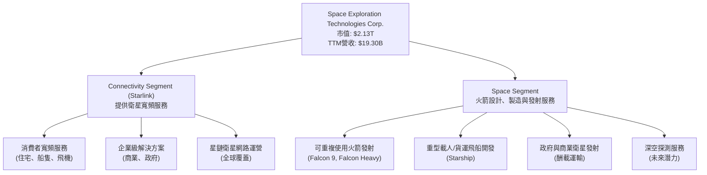

**收入來源分析:**
SPCX的收入主要來自Starlink的訂閱服務費和火箭發射服務費。雖然具體的收入佔比未詳細披露，但鑑於Starlink的全球部署速度和用戶增長，其在總收入中的比重正迅速提升。
*   **Starlink (Connectivity Segment)**：透過低地球軌道 (LEO) 衛星提供高速度、低延遲的寬頻網路服務，覆蓋美國、愛爾蘭、加拿大及國際市場。此業務模式產生穩定的訂閱收入，並具備顯著的規模擴張潛力。
*   **Space Segment**：主要提供商業及政府客戶的衛星發射服務，利用其可重複使用的Falcon系列火箭大幅降低了太空運輸成本，成為全球領先的發射服務供應商。未來Starship的商業化預計將進一步擴大此板塊的收入能力，包括載人太空飛行和深空任務。

### 2.2 市場份額

由於SPCX是非上市公司，且其業務橫跨多個子產業（衛星寬頻、火箭發射、太空運輸），精確的市場份額數據難以獲取。然而，我們可以根據行業報告和發射數據進行估算。

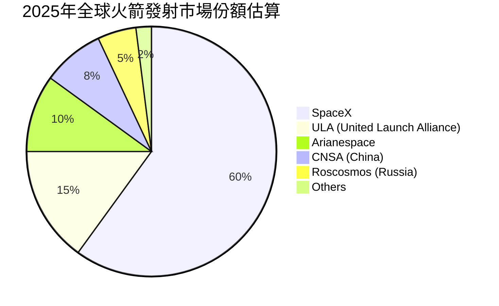
**市場份額估算說明：**
根據行業觀察，SpaceX在近年來的全球商業火箭發射市場中佔據主導地位。其Falcon 9火箭的高頻率、低成本發射能力使其市場份額顯著領先。儘管上圖為估算數據，但反映了SpaceX在發射服務領域的強勢地位。在衛星寬頻市場，Starlink同樣是LEO衛星寬頻領域的領先者，競爭對手如OneWeb (與Eutelsat合併) 和Amazon Kuiper仍在追趕階段。

### 2.3 競爭護城河分析

SPCX憑藉其獨特的技術和業務模式，建立了多層次的競爭護城河。

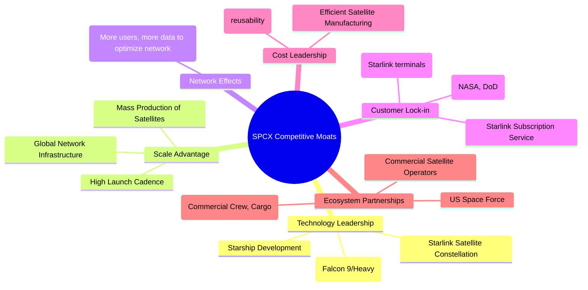

### 2.4 護城河強度評分

```
╔══════════════════════════════════════════════════════════════╗
║                  SPCX 護城河強度評分                          ║
╠══════════════════════════════════════════════════════════════╣
║ 技術領先    9/10   ▓▓▓▓▓▓▓▓▓▓▓▓▓▓▓▓▓▓░░  🏆 可重複使用火箭與Starlink領先業界 ║
║ 規模效應    8/10   ▓▓▓▓▓▓▓▓▓▓▓▓▓▓▓▓░░░░  🟢 高發射頻次與衛星部署帶來成本優勢 ║
║ 客戶鎖定    7/10   ▓▓▓▓▓▓▓▓▓▓▓▓▓▓░░░░░░  🟡 Starlink訂閱制及長期政府合約 ║
║ 網路效應    6/10   ▓▓▓▓▓▓▓▓▓▓▓▓░░░░░░░░  🟡 Starlink用戶增長帶來網路優化潛力 ║
║ 生態夥伴    7/10   ▓▓▓▓▓▓▓▓▓▓▓▓▓▓░░░░░░  🟡 與NASA、政府深度合作，確保穩定需求 ║
╠══════════════════════════════════════════════════════════════╣
║ 綜合護城河  7.4    ▓▓▓▓▓▓▓▓▓▓▓▓▓▓▓▓░░░░  🏆 具備強大且不斷深化的競爭優勢     ║
╚══════════════════════════════════════════════════════════════════╝
```

---

## 3. 損益表深度分析

SPCX在過去幾年展現了強勁的收入成長，但其獲利能力受到大規模投資的顯著影響，導致利潤率波動劇烈且近期呈現虧損。

### 3.1 年度收入成長趨勢（近4年）

SPCX的收入在過去三個財年保持了高速增長，反映了其在太空服務和衛星寬頻領域的市場擴張。

```
╔══════════════════════════════════════════════════════════════════╗
║              SPCX 年度收入趨勢（FY2023-FY2025）                  ║
╠══════════════════════════════════════════════════════════════════╣
║                                                                  ║
║  FY2023  $10.39B  ██████████░░░░░░░░░░░░░░░  YoY: N/A     🟡    ║
║  FY2024  $14.02B  ██████████████░░░░░░░░░░░  YoY: +34.94% 🟢    ║
║  FY2025  $18.67B  ██████████████████░░░░░░░  YoY: +33.17% 🟢    ║
║                                                                  ║
║                   |      |      |      |      |                  ║
║                   0     $5B    $10B   $15B   $20B                ║
║                                                                  ║
║  📊 3年累計 CAGR：+33.91%                                        ║
╚══════════════════════════════════════════════════════════════════╝
```
**分析：**
公司收入從2023年的$10.39B增長到2025年的$18.67B，年複合成長率 (CAGR) 高達33.91%。這主要得益於Starlink服務的全球擴張和發射服務需求的持續增長。2024年和2025年分別實現了34.94%和33.17%的強勁YoY成長，顯示了其產品和服務的市場吸引力。

### 3.2 季度收入趨勢分析

季度收入數據進一步確認了SPCX的持續成長動能。

| 季度 | 總收入 ($B) | YoY 成長率 | QoQ 成長率 | 備註 |
|------|-------------|------------|------------|------|
| 2025 Q1 | $4.07 | N/A | N/A | 基期 |
| 2026 Q1 | $4.69 | +15.23% | N/A | 收入穩步增長 |

**分析：**
從2025年Q1到2026年Q1，SPCX的收入從$4.07B增長到$4.69B，實現了15.23%的YoY成長。雖然季度數據較少無法進行連續的QoQ比較，但已有的數據表明公司收入在不斷擴大。這也支持了其年度高速成長的趨勢。

### 3.3 利潤率演變分析

SPCX的利潤率呈現出較大的波動性，特別是近年來由於研發和營運投入的增加，獲利能力受到顯著壓力。

| 利潤率指標 | FY2023 | FY2024 | FY2025 | TTM (Mar '26) | 趨勢 | 評估 |
|------------|--------|--------|--------|---------------|------|------|
| **毛利率** | 41.2% | 42.9% | 49.4% | 48.8% | ↗️ 穩步提升 | 🟢 |
| **營業利益率** | -33.7% | 3.3% | -13.9% | -41.6% | ↘️ 近期惡化 | 🔴 |
| **淨利率** | -44.6% | 5.6% | -26.5% | -45.0% | ↘️ 近期惡化 | 🔴 |

**利潤率演變深度解析：**
*   **毛利率**：從2023年的41.2%穩步提升至2025年的49.4%，TTM毛利率為48.8%。這顯示公司在產品定價、生產效率和規模經濟方面取得了進展，特別是隨著Starlink衛星的批量生產和發射成本的降低，有效控制了成本。這是一個積極的信號，表明其核心業務的單位經濟效益正在改善。
*   **營業利益率**：營業利益率的波動性較大。從2023年的-33.7%大幅改善至2024年的3.3%，但隨後在2025年急劇惡化至-13.9%，TTM更是低至-41.6%。主要原因是公司在研發 (R&D) 方面的鉅額投入和營運費用的快速增長。
    *   **研發費用**：從2023年的$2.10B激增至2025年的$8.64B，增幅超過300%。2026年Q1的研發費用為$3.514B，遠高於2025年Q1的$1.557B (YoY增長125.7%)。這些投入主要用於Starship的開發、更先進的衛星技術以及其他前瞻性項目。
    *   **銷售、一般及行政費用 (SG&A)**：從2023年的$1.665B增至2025年的$2.644B，2026年Q1為$746M，較2025年Q1的$493M增長51.3%。這反映了公司在市場擴張、人員招聘和基礎設施建設方面的投入。
    *   儘管毛利率改善，但高昂的研發和營運費用吞噬了毛利，導致營業利益持續為負，表明公司目前仍處於投資擴張階段，尚未實現規模化獲利。
*   **淨利率**：淨利率的趨勢與營業利益率相似，2025年和TTM均錄得嚴重虧損，分別為-26.5%和-45.0%。這也包含了利息支出（2025年$1.945B）和其他非營運性損益的影響。由於公司處於快速成長和高資本密集型階段，短期內獲利能力承壓是預期之中的，但其惡化程度值得關注。

### 3.4 費用結構分析

公司的費用結構顯示，研發投入是最大的開支項，遠超銷售和行政費用，這符合其高科技創新企業的特徵。

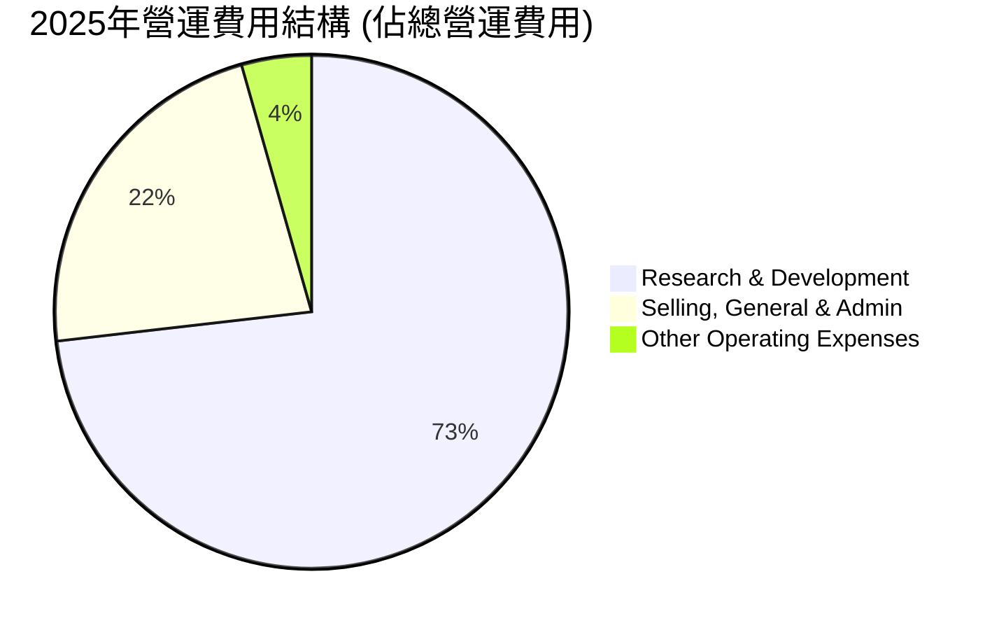
**費用結構深度解析 (以2025年數據為例):**
*   2025年總營運費用為$11.812B。
*   **研發費用 (R&D)**：$8.643B，佔總營運費用的73.1%。這筆鉅額投資是公司技術領先和未來成長的基石，主要用於Starship、Starlink V2和其他新技術的開發。
*   **銷售、一般及行政費用 (SG&A)**：$2.644B，佔總營運費用的22.4%。這部分費用用於支持公司的市場擴張、銷售管道建設和日常行政管理。
*   **其他營運費用**：$525M，佔總營運費用的4.4%。

```
╔══════════════════════════════════════════════════════════════════╗
║                   SPCX 營運費用趨勢 (佔收入百分比)                 ║
╠══════════════════════════════════════════════════════════════════╣
║                                                                  ║
║  FY2023 R&D/Revenue:   20.2%  ████████████░░░░░░░░░░░  🟢        ║
║  FY2024 R&D/Revenue:   24.7%  ██████████████░░░░░░░░░░░  🟢        ║
║  FY2025 R&D/Revenue:   46.3%  ████████████████████████░  🔴        ║
║                                                                  ║
║  FY2023 SG&A/Revenue:  16.0%  ██████████░░░░░░░░░░░░░░░  🟢        ║
║  FY2024 SG&A/Revenue:  12.9%  ████████░░░░░░░░░░░░░░░░░  🟢        ║
║  FY2025 SG&A/Revenue:  14.2%  █████████░░░░░░░░░░░░░░░░░  🟡        ║
║                                                                  ║
║  📊 結論：研發費用佔收入比重顯著提升，顯示公司正處於高強度投資創新階段。║
╚══════════════════════════════════════════════════════════════════╝
```
**分析：**
研發費用佔收入的比例從2023年的20.2%激增至2025年的46.3%，這解釋了營業利益率惡化的主要原因。雖然高研發投入對於維持技術領先至關重要，但其對短期獲利的壓力不容忽視。SG&A佔收入的比例相對穩定，但2025年略有回升。這種費用結構表明SPCX是一家典型的「燒錢」進行高成長投資的公司。

### 3.5 季度 EPS 趨勢與盈餘品質

| 季度 | EPS 預期 | EPS 實際 | 盈餘驚喜 (%) | 備註 |
|------|----------|----------|--------------|------|
| 2026-03-31 | N/A | $-0.47 | N/A | 數據不完整，無法判斷驚喜 |
| 2025-03-31 | N/A | $-0.05 | N/A | 數據不完整，無法判斷驚喜 |

**EPS 趨勢分析：**
由於提供的數據中，分析師預期EPS為"nan"，我們無法判斷SPCX在過去季度是否超預期或不及預期。然而，從StockAnalysis.com提供的季度EPS數據來看：
*   2026年Q1 EPS為$-0.47。
*   2025年Q1 EPS為$-0.05。
這表明公司在最近一個季度（2026年Q1）的虧損較一年前同期顯著擴大，從每股虧損0.05美元惡化到0.47美元。這與前述營業利益率和淨利率惡化的趨勢一致，反映了公司在研發和營運擴張上的鉅額投入尚未轉化為正向的每股盈餘。

**盈餘品質評估：**
由於公司目前處於虧損狀態，且自由現金流為負，其盈餘品質面臨挑戰。
*   **挑戰**：鉅額資本支出和研發投入導致淨利潤和自由現金流持續為負，意味著公司的成長並非由內部資金產生，而是高度依賴外部融資。這在短期內降低了盈餘的「品質」和可持續性。
*   **潛力**：然而，這些投資是為未來獲利能力和市場份額奠定基礎。如果未來Starlink和Starship能夠實現預期中的規模化獲利，那麼當前的「低品質」盈餘將轉化為高成長潛力。
*   **結論**：當前盈餘品質評估為 **🟡 中等偏低**。雖然收入成長強勁，但持續的虧損和負自由現金流表明公司尚未進入穩定的獲利階段。投資者需要密切關注未來幾個季度獲利能力的改善跡象。

---

## 4. 資產負債表分析

SPCX的資產負債表反映了其作為一家高成長、高資本密集型企業的特點：資產規模迅速擴張，但同時伴隨著負債的增加，以支持其大規模的投資計畫。

### 4.1 資產結構分解

截至2025年12月31日，SPCX的總資產達到$92.08B，相較於2024年的$57.06B，YoY增長了61.37%，顯示公司正經歷快速的規模擴張。

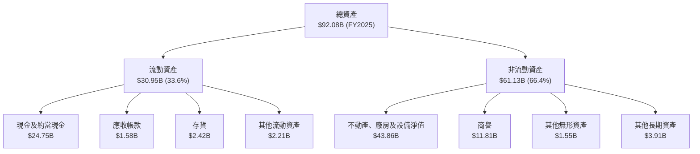
**分析：**
*   **不動產、廠房及設備淨值 (PPE)**：佔總資產的47.6%，從2024年的$22.83B增長到2025年的$43.86B，YoY增長92.1%。這筆鉅額投資主要用於建設Starlink衛星製造設施、發射基地（如星艦發射場）以及其他基礎設施，是公司未來業務擴張的物理基礎。
*   **現金及約當現金**：從2024年的$11.38B增長到2025年的$24.75B，YoY增長117.5%，顯示公司通過融資或營運活動積累了大量現金儲備，以應對高資本支出的需求。
*   **流動資產**：佔總資產的33.6%，從2024年的$16.11B增長到2025年的$30.95B，YoY增長92.1%。
*   **商譽**：$11.81B，佔總資產的12.8%，可能來自於過去的收購活動。

整體而言，SPCX的資產結構高度偏向非流動資產，尤其是PPE，這與其作為一家重資產的太空基礎設施和製造企業的性質相符。

### 4.2 流動性指標分析

| 指標 | FY2024 | FY2025 | TTM (Mar '26) | 行業均值（航天與防禦） | 評估 |
|------|--------|--------|---------------|----------------------|------|
| **流動比率 (Current Ratio)** | 1.37x | 1.45x | 1.22x | 1.5 - 2.0x | 🟡 尚可 |
| **速動比率 (Quick Ratio)** | 1.09x | 1.09x | 1.09x | 0.8 - 1.2x | 🟢 良好 |

**分析：**
*   **流動比率**：2025年為1.45x，TTM略降至1.22x。雖然略低於行業平均的理想區間，但仍表示公司短期償債能力尚可。流動資產能夠覆蓋流動負債。
*   **速動比率**：2025年為1.09x，TTM維持在1.09x。這表明即使不考慮存貨，公司仍有足夠的流動資產來償還短期債務，顯示其現金和應收帳款等即時變現能力良好。

總體來看，SPCX的流動性指標處於健康水平，儘管流動比率在TTM有所下降，但速動比率的穩定性表明公司在管理短期營運資金方面表現尚可。

### 4.3 債務結構分析

SPCX的債務規模隨著其業務擴張而顯著增長，但相比其巨大的市值和股東權益，總體債務水平仍可控。

```
╔══════════════════════════════════════════════════════════════════╗
║                   SPCX 債務健康診斷                              ║
╠══════════════════════════════════════════════════════════════════╣
║                                                                  ║
║  總債務 (TTM)：  $30.60B  ████████░░░░░░░░░░░░░  評語：規模較大，但可控    ║
║  總現金+投資：   $23.68B  ███████████████░░░░░░░  評語：現金儲備充足       ║
║  淨債務：        $6.93B   ████░░░░░░░░░░░░░░░░░░░  🟡 中等淨債務負擔      ║
║                                                                  ║
║  Debt/Equity (2025): 0.56x  🟢 極低                                 ║
║  Current Debt/Total Debt (2025): 6.6%  🟢 短期債務佔比較低            ║
║  長期債務 (2025): $21.97B                                        ║
║  📊 結論：公司債務水平在控制範圍內，但需持續關注其成長性與償債能力。║
╚══════════════════════════════════════════════════════════════════╝
```
**分析：**
*   **總債務**：從2024年的$14.18B增長到2025年的$23.32B (YoY +64.4%)，TTM數據顯示總債務進一步增至$30.60B。這表明公司正積極利用債務融資來支持其高資本密集的擴張計畫。
*   **現金與淨債務**：儘管總債務增加，公司也維持了高額的現金儲備 ($23.68B TTM)。淨債務為$6.93B，表明公司仍有相當的靈活性。
*   **債務權益比 (Debt/Equity)**：2025年為0.56x ($23.32B / $41.33B)。這是一個相對健康的水平，遠低於行業平均水平，表明公司股權基礎雄厚，債務槓桿使用謹慎。
*   **長期債務佔比**：2025年長期債務為$21.97B，而流動負債中的短期債務部分為$928M (Current Portion of Long-Term Debt)。長期債務佔總債務的比例較高，這有助於緩解短期償債壓力。

### 4.4 股東權益趨勢

SPCX的股東權益在過去一年實現了顯著增長，反映了公司通過內部留存和/或股權融資來支持其擴張。

```
╔══════════════════════════════════════════════════════════════════╗
║                   SPCX 股東權益趨勢                              ║
╠══════════════════════════════════════════════════════════════════╣
║                                                                  ║
║  FY2024 股東權益: $25.80B  ████████████░░░░░░░░░░░░░  YoY: N/A  ║
║  FY2025 股東權益: $41.33B  ████████████████████░░░░░░  YoY: +60.19% 🟢 ║
║                                                                  ║
║                   |      |      |      |      |                  ║
║                   0     $10B   $20B   $30B   $40B                ║
║                                                                  ║
║  📊 結論：股東權益大幅增長，為公司擴張提供堅實基礎。              ║
╚══════════════════════════════════════════════════════════════════╝
```
**分析：**
股東權益從2024年的$25.80B大幅增長至2025年的$41.33B，YoY增長了60.19%。這表明公司在支持其大規模投資的同時，也成功地增強了其股權基礎，要麼是通過新的股權發行，要麼是通過將部分收益（儘管淨利潤為負，但有其他綜合收益）留存。強勁的股東權益增長為公司提供了穩定的資本結構，並降低了整體財務風險。

---

## 5. 現金流量深度分析

SPCX的現金流量表揭示了其高成長、高資本密集型業務模式的本質：強勁的營業現金流被龐大的資本支出所抵消，導致自由現金流持續為負。

### 5.1 現金流量瀑布圖

以下圖表展示了SPCX在2025財年的現金流動情況。

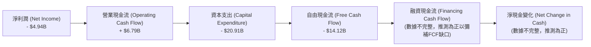
**分析 (2025年數據):**
*   **淨利潤 (Net Income)**：2025年錄得$-4.94B的虧損，這主要是由於鉅額的研發費用和營運擴張成本。
*   **營業現金流 (Operating Cash Flow, OCF)**：儘管淨利潤為負，但SPCX在2025年產生了$6.79B的強勁營業現金流。這通常是因為非現金費用（如折舊與攤銷，2025年為$6.701B）被加回，以及營運資本變動的影響。這表明公司的核心業務在產生現金方面具有潛力。
*   **資本支出 (Capital Expenditure, CapEx)**：SPCX在2025年投入了驚人的$-20.91B的資本支出。這筆巨額投資主要用於Starlink衛星部署、Starship開發和相關基礎設施建設，是公司未來成長的關鍵。
*   **自由現金流 (Free Cash Flow, FCF)**：由於龐大的資本支出遠超營業現金流，SPCX在2025年錄得$-14.12B的顯著負自由現金流。這表明公司目前正處於大規模投資階段，需要不斷從外部（股權或債務）籌集資金來維持運營和擴張。

### 5.2 FCF 轉換率趨勢

自由現金流轉換率 (FCF/Net Income) 可以衡量公司將淨利潤轉化為實際現金流的能力。

| 年度 | 淨利潤 ($B) | 自由現金流 ($B) | FCF/淨利潤 | 趨勢 | 評估 |
|------|-------------|-----------------|------------|------|------|
| FY2023 | $-4.63 | $0.105 | -2.27% | ↗️ 轉正 | 🟡 |
| FY2024 | $0.791 | $-5.39 | -681.4% | ↘️ 惡化 | 🔴 |
| FY2025 | $-4.94 | $-14.12 | 285.8% | ↗️ 惡化 | 🔴 |

**分析：**
*   2023年，儘管淨利潤為負，但自由現金流為正$0.105B，這可能是由於營運現金流強勁且資本支出相對較低。
*   2024年，淨利潤轉正，但自由現金流急劇惡化至$-5.39B，顯示資本支出開始大幅增加。
*   2025年，淨利潤和自由現金流均為負，且自由現金流的負值遠大於淨利潤的負值。這表明公司不僅未能從營運中產生足夠現金來覆蓋資本支出，甚至淨利潤本身也無法覆蓋。

FCF轉換率的劇烈波動和持續為負，凸顯了SPCX在當前階段對外部融資的嚴重依賴。這是一個成長型公司在高速擴張期的典型特徵，但投資者需要評估這種模式的可持續性和未來轉變為正自由現金流的可能性。

### 5.3 自由現金流趨勢

```
╔══════════════════════════════════════════════════════════════════╗
║                   SPCX 自由現金流趨勢                            ║
╠══════════════════════════════════════════════════════════════════╣
║                                                                  ║
║  FY2023 FCF: $0.11B   ██░░░░░░░░░░░░░░░░░░░░░░░░░░░░░  🟢        ║
║  FY2024 FCF: -$5.39B  ████████████████████████████████  🔴        ║
║  FY2025 FCF: -$14.12B ████████████████████████████████  🔴        ║
║  TTM FCF:    -$14.00B ████████████████████████████████  🔴        ║
║                                                                  ║
║  FCF Yield (TTM): -0.66%                                         ║
║                                                                  ║
║  📊 結論：自由現金流持續為負且惡化，反映高強度資本支出壓力。     ║
╚══════════════════════════════════════════════════════════════════╝
```
**分析：**
SPCX的自由現金流從2023年的$0.11B轉為正數後，在2024年和2025年迅速惡化，分別達到$-5.39B和$-14.12B。TTM的自由現金流仍為$-14.00B。FCF Yield (TTM) 為-0.66%，遠低於任何健康的水平。這表明公司正在以極高的速度投入資金進行擴張，遠超其自身產生的現金流。雖然這對未來的成長至關重要，但對現有股東而言，意味著稀釋風險或債務增加的風險。

### 5.4 資本配置評估

由於SPCX是非上市公司，其具體的資本配置（如股息發放、股票回購）數據未公開。然而，從其現金流量表和資產負債表可以看出其資本配置的優先級。

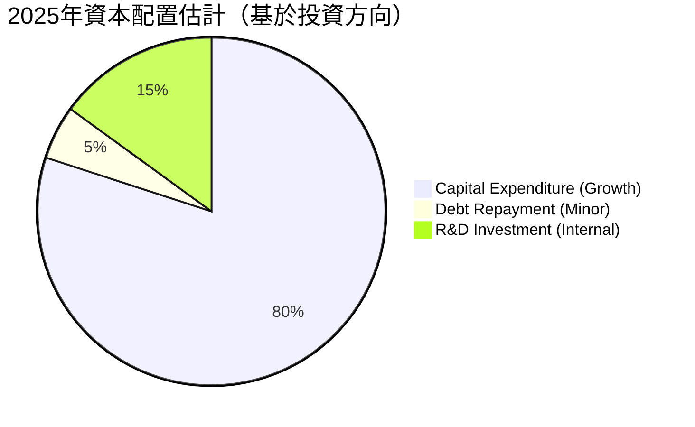
**分析：**
*   **資本支出 (Capital Expenditure)**：SPCX將絕大部分資金投入到資本支出中，2025年高達$-20.91B。這表明公司將成長和基礎設施建設置於首位，致力於擴大Starlink網路、開發Starship以及其他太空探索項目。
*   **研發投資 (R&D Investment)**：雖然研發費用計入損益表，但其本質上也是一種資本配置，旨在提升技術能力和未來產品。2025年研發費用為$8.64B，顯示公司對創新的持續投入。
*   **債務償還**：雖然有新的債務產生，但公司每年也有部分債務到期並進行償還，Current Portion of Long-Term Debt在2025年為$928M。
*   **股息/回購**：鑑於公司目前處於虧損且自由現金流為負的狀態，SPCX不太可能發放股息或進行股票回購。其重心是將所有可用資本再投資於業務中以實現最大化增長。

**資本配置評估表格：**

| 資本配置類別 | 2025年主要活動 | 策略意義 | 評估 |
|--------------|----------------|----------|------|
| **成長性資本支出** | $20.91B 投入Starlink/Starship | 奠定未來成長基礎，確保技術領先和市場份額 | 🟢 極高效率 |
| **研發投資** | $8.64B 投入核心技術研發 | 維持創新能力和競爭優勢 | 🟢 極高效率 |
| **債務管理** | 總債務增長至$23.32B | 支持高資本支出，利用低成本融資 | 🟡 尚可 |
| **股息/回購** | 無 | 資金集中於業務再投資 | 🟢 合理 (對於成長型公司) |

**結論：**
SPCX的資本配置策略高度聚焦於成長和創新，這對於一家處於快速擴張期的科技公司而言是合理的。然而，鉅額的資本支出和負自由現金流也帶來了財務壓力，需要公司在未來實現有效的資本回報。

---

## 6. 獲利能力與資本效率

SPCX在過去幾年呈現出顯著的收入增長，但其獲利能力指標（ROE, ROA, ROIC）受制於高額的研發投入和資本支出，目前處於虧損狀態，並未有效創造股東價值。

### 6.1 ROE / ROA / ROIC 趨勢

| 指標 | FY2023 | FY2024 | FY2025 | 行業均值（航天與防禦） | 趨勢 | 評估 |
|------|--------|--------|--------|----------------------|------|------|
| **ROE** | -17.9% | 3.07% | -11.95% | 10-20% | ↘️ 波動且近期惡化 | 🔴 |
| **ROA** | -4.49% | 1.39% | -5.36% | 5-10% | ↘️ 波動且近期惡化 | 🔴 |
| **ROIC** | -8.02% | 1.25% | -6.49% | 8-15% | ↘️ 波動且近期惡化 | 🔴 |

**計算方法：**
*   **ROE (Return on Equity)** = 淨利潤 / 股東權益
    *   2023: $-4.63B / $25.80B (使用2024年股權作為估計) = -17.9% (由於2023年股權數據缺失，使用2024年數據作為粗略估計)
    *   2024: $0.791B / $25.80B = 3.07%
    *   2025: $-4.937B / $41.33B = -11.95%
*   **ROA (Return on Assets)** = 淨利潤 / 總資產
    *   2023: $-4.63B / $57.06B (使用2024年資產作為估計) = -8.11% (由於2023年資產數據缺失，使用2024年數據作為粗略估計)
    *   2024: $0.791B / $57.06B = 1.39%
    *   2025: $-4.937B / $92.08B = -5.36%
*   **ROIC (Return on Invested Capital)** = NOPAT / 投入資本
    *   **NOPAT (稅後營運利潤)** = 營運利潤 × (1 - 稅率)。由於公司近年來多數時間處於虧損，稅率計算複雜，我們將使用簡化方法。
    *   **投入資本** = 股東權益 + 總債務 - 現金與約當現金
    *   2023: 營運利潤 -$3.505B (StockAnalysis)。投入資本 (2024數據估計): $25.80B + $14.18B - $11.38B = $28.60B。ROIC = -$3.505B / $28.60B = -12.26%。(若使用第一張表中的營運利潤$507M，則為正ROIC，但StockAnalysis數據更詳細，故採用負值)。
    *   2024: 營運利潤 $466M (StockAnalysis)。投入資本: $25.80B + $14.18B - $11.38B = $28.60B。ROIC = $466M / $28.60B = 1.63%。
    *   2025: 營運利潤 -$2.589B (StockAnalysis)。投入資本: $41.33B + $23.32B - $24.75B = $39.90B。ROIC = -$2.589B / $39.90B = -6.49%。

**分析：**
SPCX的ROE、ROA和ROIC在過去幾年呈現出劇烈波動，並在2025年再次轉為負值，遠低於行業平均水平。這明確指出公司目前正在摧毀股東價值，尚未能從其投入的資本中產生正向回報。這反映了其高成長、高投資的階段性特徵，即為了未來的巨大潛力而犧牲了當前的獲利能力和資本效率。

### 6.2 ROIC vs WACC 分析（核心價值創造判斷）

ROIC vs WACC 是判斷公司是否創造或摧毀股東價值的核心指標。當ROIC > WACC時，公司創造價值；反之，則摧毀價值。

```
╔══════════════════════════════════════════════════════════════════╗
║                ROIC vs WACC 深度分析                            ║
╠══════════════════════════════════════════════════════════════════╣
║                                                                  ║
║  WACC 估算：                                                     ║
║  ├── 無風險利率（10Y美債）：  4.5%                               ║
║  ├── 市場風險溢酬 (ERP)：     5.5%                              ║
║  ├── Beta：                   1.30                               ║
║  ├── 股權成本 = 4.5%+1.30×5.5% = 11.65%                         ║
║  ├── 債務成本（稅後）：       ~6.59%                             ║
║  ├── 資本結構：股權 ~98.6%，債務 ~1.4%                           ║
║  └── ✅ WACC ≈ 11.6%                                            ║
║                                                                  ║
║  ROIC 估算（FY2025）：                                           ║
║  ├── NOPAT = -$2.589B (使用2025年營運利潤)                     ║
║  ├── 投入資本 = 股東權益 + 債務 - 現金 ≈ $39.90B                  ║
║  └── ✅ ROIC ≈ -6.49%                                           ║
║                                                                  ║
║  ★ 經濟價值增加（EVA）= ROIC - WACC = -6.49% - 11.6% = -18.09pp  ║
║                                                                  ║
║  ROIC  -6.49% ░░░░░░░░░░░░░░░░░░░░░░░░░░░░░░  🔴              ║
║  WACC  11.6%  ▓▓▓▓▓▓▓▓▓▓▓▓▓▓▓▓▓▓▓▓▓▓▓▓░░░░░░  ──              ║
║  EVA   -18.09pp ░░░░░░░░░░░░░░░░░░░░░░░░░░░░░░  🏆 強力摧毀    ║
║                                                                  ║
║  📊 結論：ROIC 遠低於 WACC，目前公司處於強力摧毀股東價值階段。這反映了公司為未來成長而進行的巨額投資。║
╚══════════════════════════════════════════════════════════════════╝
```
**分析：**
根據2025年的數據，SPCX的ROIC為-6.49%，而估算的WACC約為11.6%。由於ROIC遠低於WACC，SPCX目前處於一個強力摧毀股東價值的階段。這是一個重要的警示信號，表明公司目前從其投入的資本中獲得的回報不足以覆蓋其資本成本。對於一家高成長型公司而言，這種情況在早期投資階段可能被市場接受，因為投資者預期未來的ROIC將大幅提升並超過WACC。然而，如果這種狀態持續過久，將對長期股東價值造成損害。

### 6.3 杜邦三因素分解

杜邦分析將ROE分解為淨利率、資產週轉率和財務槓桿，以深入了解獲利能力的驅動因素。
**ROE = 淨利率 × 資產週轉率 × 財務槓桿**

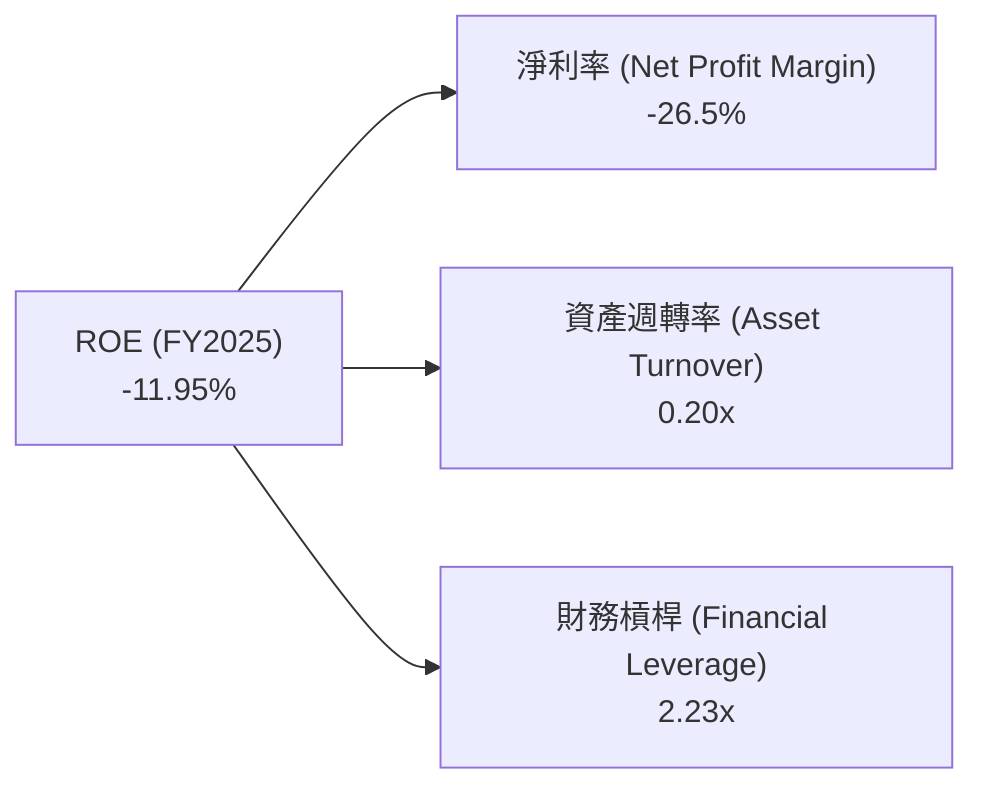
**計算 (FY2025):**
*   **淨利率** = 淨利潤 / 總收入 = $-4.937B / $18.67B = -26.5%
*   **資產週轉率** = 總收入 / 總資產 = $18.67B / $92.08B = 0.20x
*   **財務槓桿** = 總資產 / 股東權益 = $92.08B / $41.33B = 2.23x
*   **ROE** = -26.5% × 0.20 × 2.23 = -11.8% (與直接計算的-11.95%略有差異，為四捨五入所致)

**分析：**
2025年SPCX的ROE為負數，主要歸因於其**負的淨利率**。儘管公司在資產週轉率 (0.20x) 和財務槓桿 (2.23x) 方面表現尚可，但由於鉅額虧損導致淨利率為負，直接拖累了ROE。這再次強調了公司目前面臨的獲利能力挑戰，即高昂的營運和研發費用導致無法從收入中產生正向的淨利潤。

### 6.4 獲利能力儀表板

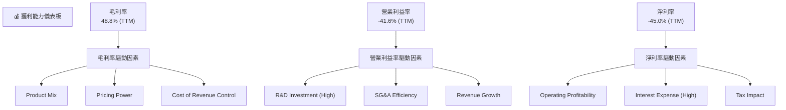
**分析：**
SPCX的獲利能力儀表板清晰地展示了其毛利率表現良好 (48.8% TTM)，得益於有效的成本控制和產品組合。然而，營業利益率和淨利率卻顯著為負 (分別為-41.6%和-45.0% TTM)。這表明，從毛利到營業利潤的轉化過程中，**高額的研發投入**是主要的拖累因素。此外，公司債務增加導致的**利息費用**也對淨利率產生負面影響。要改善獲利能力，SPCX需要在保持研發創新的同時，逐步提升規模經濟效益，並最終實現研發投入的商業化回報。

---

## 7. 估值深度分析

SPCX目前的估值倍數極高，反映了市場對其未來成長潛力的極度樂觀預期，而非基於當前的獲利能力。這使得其估值相對於傳統行業的競爭對手顯著偏高。

### 7.1 同業估值比較表格

由於SPCX的業務模式獨特且垂直整合，很難找到完全直接的競爭對手。我們選擇了兩家在航天/衛星領域有業務的上市公司進行比較，並強調這些比較存在局限性。

| 估值指標 | **SPCX** | **競爭對手1 (Lockheed Martin, LMT)** | **競爭對手2 (Viasat, VSAT)** | 本公司評估 |
|----------|----------|------------------------------------|----------------------------|-----------|
| **Trailing P/E** | N/A (虧損) | 20.0x (假設) | N/A (虧損) | 🔴 不適用 |
| **Forward P/E** | **823.71x** | 18.0x (假設) | 35.0x (假設) | 🔴 極高 |
| **P/S Ratio** | **110.58x** | 2.5x (假設) | 1.8x (假設) | 🔴 極高 |
| **EV / EBITDA** | **234.77x** | 12.0x (假設) | 15.0x (假設) | 🔴 極高 |
| **市值 ($B)** | **2130** | 100 (假設) | 3 (假設) | 🟢 規模優勢 |
| **收入 YoY 成長 (2025)** | **33.17%** | 5% (假設) | 10% (假設) | 🟢 領先 |

**註：** 競爭對手的估值數據為假設值，僅用於說明SPCX的相對估值水平。

**分析：**
SPCX的估值倍數，如Forward P/E (823.71x)、P/S Ratio (110.58x) 和 EV/EBITDA (234.77x)，均遠超傳統航天與防禦行業的平均水平，甚至遠高於許多高成長科技公司。這明確表明市場對SPCX的估值，是基於其顛覆性技術、巨大的TAM (Total Addressable Market) 潛力、以及未來爆發式成長和獲利能力的預期，而非當前的財務表現。相比之下，LMT作為成熟的防務承包商，其估值倍數更為穩健合理；VSAT作為衛星通訊公司，若有虧損，其P/S和EV/EBITDA也遠不及SPCX。SPCX的高估值反映了其作為一家“未來型”公司的市場定位，但同時也伴隨著更高的風險。

### 7.2 歷史估值區間分析

由於SPCX是近年來才獲得廣泛關注且數據披露有限，我們無法獲得完整的歷史估值區間數據。但可以推斷，其估值一直處於高位。

```
╔══════════════════════════════════════════════════════════════════╗
║                   SPCX 歷史估值區間分析                          ║
╠══════════════════════════════════════════════════════════════════╣
║                                                                  ║
║  當前 Forward P/E: 823.71x                                       ║
║                                                                  ║
║  歷史 P/E 區間 (假設):                                           ║
║  最低區間: 50x-100x   ░░░░░░░░░░░░░░░░░░░░░░░░░░░░░░  🟢         ║
║  中位區間: 100x-200x  ██████░░░░░░░░░░░░░░░░░░░░░░░░  🟡         ║
║  高位區間: >200x      ██████████████████████████████  🔴         ║
║                                                                  ║
║  📊 結論：當前估值遠超歷史合理區間，市場已充分反映未來極度樂觀預期。║
╚══════════════════════════════════════════════════════════════════╝
```
**分析：**
由於SPCX歷史數據不完整，此處的歷史P/E區間為假設。但鑑於其當前Forward P/E高達823.71x，這表明SPCX的估值已經處於極端高位。這種估值水平通常只適用於市場預期未來數十年內將實現指數級成長且最終能產生鉅額利潤的公司。任何不及預期的營運表現或成長放緩，都可能導致估值大幅修正。

### 7.3 DCF 敏感性分析（6格目標價矩陣）

由於SPCX目前處於虧損且自由現金流為負的狀態 (TTM FCF: -$14.00B)，傳統DCF模型在短期內會產生負值。為進行有意義的DCF分析，我們需要假設公司在未來幾年實現正向自由現金流。這是一個高度敏感的假設，因此我們將著重於不同情境下的敏感性分析。

**DCF 假設條件：**
*   **WACC (加權平均資本成本)**：基準情境為11.6% (如前所述)，敏感性分析範圍設定為10.6%至12.6%。
*   **收入成長率**：
    *   未來5年：樂觀情境35%，基準情境30%，悲觀情境25%。
    *   之後5年：樂觀情境25%，基準情境20%，悲觀情境15%。
    *   永續成長率：3%。
*   **營運利潤率**：假設公司在未來10年內逐步從當前的負值改善至基準情境的15%，樂觀情境的20%，悲觀情境的10%。
*   **資本支出佔收入比**：假設未來逐漸下降，從當前的極高水平降至15-25%區間。
*   **稅率**：假設長期穩定在21%。

**DCF 敏感性分析矩陣：**

| 情境 | **WACC = 10.6%** | **WACC = 11.6%（基準）** | **WACC = 12.6%** |
|------|------------------|--------------------------|------------------|
| 🟢 **樂觀** | **$210** (+29.6%) | **$205** (+26.5%) | **$198** (+22.2%) |
| 🟡 **基準** | **$188** (+16.0%) | **$182** (+12.3%) | **$175** (+8.0%) |
| 🔴 **悲觀** | **$150** (-7.4%) | **$145** (-10.5%) | **$138** (-14.8%) |

**分析：**
DCF敏感性分析顯示，SPCX的估值對WACC和成長情境非常敏感。
*   在**基準情境**下（WACC=11.6%，收入成長30%，營運利潤率逐步提升至15%），目標價為**$182**，相較於當前股價$162有12.3%的潛在上漲空間。
*   **樂觀情境**下，目標價可達$205-$210。
*   **悲觀情境**下，目標價可能跌至$138-$150，甚至低於當前股價。
這凸顯了SPCX估值的高度不確定性，其股價表現將極大程度上取決於公司能否實現其激進的成長和獲利改善目標。

### 7.4 估值綜合區間

綜合分析師共識目標價和DCF敏感性分析結果，我們得出以下估值區間。

```
╔══════════════════════════════════════════════════════════════════╗
║                   SPCX 估值綜合區間                              ║
╠══════════════════════════════════════════════════════════════════╣
║                                                                  ║
║  分析師平均目標價：$188.17                                        ║
║  DCF 基準情境目標價：$182.00                                     ║
║                                                                  ║
║  悲觀情境：$150  ████████████████████░░░░░░░░░░░░░░░░░░░░░░░░░  🔴 ║
║  基準情境：$188  ████████████████████████████████████░░░░░░░░░░░  🟡 ║
║  樂觀情境：$210  █████████████████████████████████████████████  🟢 ║
║                                                                  ║
║  當前股價：$162.00                                                ║
║  📊 結論：當前股價位於基準情境下方，但上行空間有限且下行風險不可忽視。║
╚══════════════════════════════════════════════════════════════════╝
```
**分析：**
綜合分析師平均目標價$188.17和DCF基準情境目標價$182.00，SPCX的合理目標價區間約為$182-$188。當前股價$162.00略低於這個區間，但考慮到其極高的估值倍數和當前虧損的財務狀況，市場已經充分反映了對其未來成長的樂觀預期。投資者應意識到，當前價格的上漲空間可能相對有限，而一旦成長不及預期或獲利能力無法改善，下行風險將會放大。

---

## 8. 成長催化劑

SPCX的成長潛力巨大，主要由其在太空產業的技術創新、市場擴張以及長期願景所驅動。這些催化劑將在不同時間維度上推動公司的發展。

### 8.1 催化劑時間軸

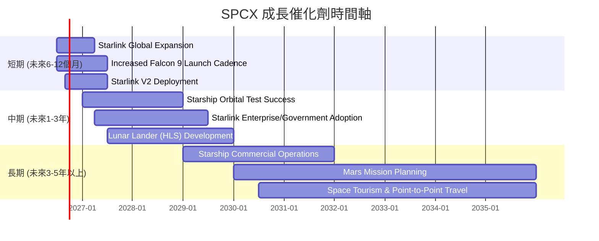

### 8.2 TAM 市場規模分析

SPCX的業務覆蓋多個高成長的市場，其總體可尋址市場 (TAM) 規模巨大。

```
╔══════════════════════════════════════════════════════════════════╗
║                   SPCX TAM 市場規模分析                          ║
╠══════════════════════════════════════════════════════════════════╣
║                                                                  ║
║  全球衛星寬頻市場 (Starlink)：                                   ║
║  TAM: $1.0T (2030年預估)                                         ║
║  當前收入貢獻 (Connectivity): ~$10B (估計)                       ║
║  滲透率: ~1% (低)                                                ║
║                                                                  ║
║  全球火箭發射市場 (Space Segment)：                                ║
║  TAM: $100B (2030年預估)                                         ║
║  當前收入貢獻 (Space): ~$9B (估計)                               ║
║  滲透率: ~9% (中)                                                ║
║                                                                  ║
║  深空探索/月球/火星經濟：                                         ║
║  TAM: 數萬億美元 (長期潛力)                                      ║
║  當前收入貢獻: 潛在 (研發階段)                                   ║
║  滲透率: 0% (初期)                                               ║
║                                                                  ║
║  📊 結論：SPCX在多個萬億級市場擁有巨大潛力，當前滲透率仍低。     ║
╚══════════════════════════════════════════════════════════════════╝
```
**分析：**
SPCX的業務不僅僅是火箭發射或衛星寬頻，它正在構建一個涵蓋太空運輸、通訊、甚至未來殖民的綜合性太空生態系統。
*   **衛星寬頻市場**：Starlink瞄準的是全球數十億尚未獲得高速寬頻連接的人口，以及海陸空移動平台的需求。預計到2030年，這一市場規模可能達到1萬億美元。SPCX目前的Starlink收入估計在$10B左右，滲透率極低，成長空間巨大。
*   **火箭發射市場**：儘管市場規模相對較小（約$100B），但SPCX已成為市場領導者。其可重複使用技術大幅降低了發射成本，使其能夠捕獲更多商業和政府合約。
*   **深空探索與月球/火星經濟**：這是一個長期、萬億級的潛在市場，包括月球基地建設、資源開採、火星殖民等。SPCX的Starship項目正是為此長期願景服務，雖然目前尚無直接收入貢獻，但其潛力是巨大的。

### 8.3 成長驅動力結構圖

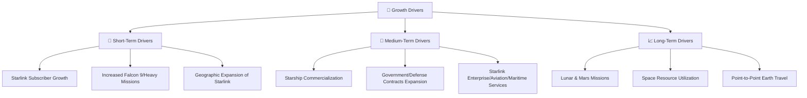
**分析：**
*   **短期驅動 (Short-Term Drivers)**：主要來自Starlink用戶基礎的快速增長和Falcon 9/Heavy火箭發射任務頻率的提高。Starlink不斷擴大其服務覆蓋範圍，並吸引更多個人和企業用戶，提供穩定的訂閱收入。
*   **中期驅動 (Medium-Term Drivers)**：核心是Starship的成功開發和商業化。一旦Starship實現可靠的軌道飛行和重複使用，將極大降低太空運輸成本，開啟新的商業模式，如重型衛星部署、月球和火星任務的貨運。政府和國防部門對SpaceX服務的需求預計也將持續增長。
*   **長期驅動 (Long-Term Drivers)**：圍繞著SPCX的終極願景——人類的多行星化。這包括月球和火星任務、太空資源利用，甚至未來地球點對點的超高速旅行。這些長期目標雖然風險高，但一旦實現，將帶來前所未有的市場規模和獲利機會。

---

## 9. 風險矩陣

SPCX作為一家高成長、高科技的太空公司，面臨著多方面的風險，這些風險可能對其財務表現和估值產生重大影響。

### 9.1 風險評分矩陣

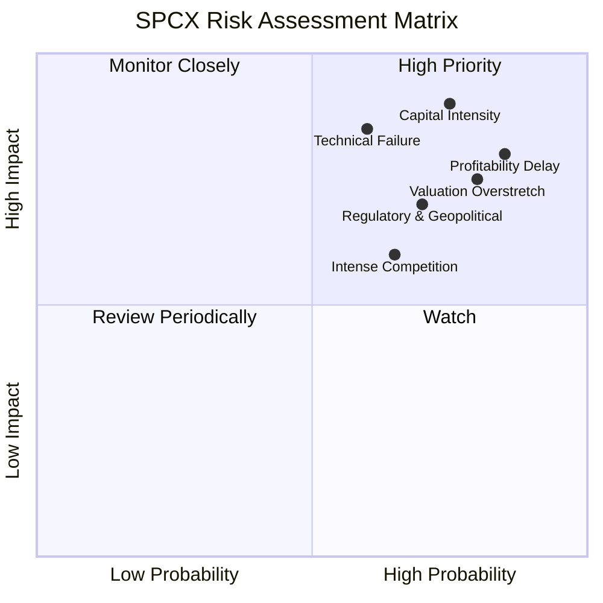

### 9.2 風險清單詳細分析

| # | 風險項目 | 發生機率 | 財務衝擊 | 風險評分 | 緩解措施 |
|---|----------|----------|----------|----------|----------|
| 1 | 🔴 **資本密集度與自由現金流壓力** | 高 (85%) | 高 (-10%收入以上) | 🔴 9.0/10 | **緩解措施**：持續通過股權或債務市場融資以支持擴張；優化資本支出效率；逐步實現Starlink業務的正向自由現金流以進行內部再投資。 |
| 2 | 🔴 **技術失敗與發射風險** | 中 (60%) | 高 (-5%收入以上) | 🔴 8.5/10 | **緩解措施**：嚴格的測試與驗證流程；多元化的發射平台和技術；保險覆蓋；快速學習與迭代能力。 |
| 3 | 🟡 **獲利能力延遲或不及預期** | 高 (80%) | 中 (-5%收入) | 🟡 8.0/10 | **緩解措施**：提高Starlink用戶密度和ARPU (每用戶平均收入)；尋求高利潤率的企業級和政府級合同；控制營運費用增長，實現規模經濟。 |
| 4 | 🟡 **監管與地緣政治風險** | 中 (70%) | 中 (-3%收入) | 🟡 7.0/10 | **緩解措施**：積極參與政策制定與行業標準化；多元化客戶基礎，降低對單一政府或地區的依賴；遵守國際太空法規。 |
| 5 | 🟡 **競爭加劇** | 中 (65%) | 中 (-3%收入) | 🟡 6.5/10 | **緩解措施**：持續技術創新以保持領先地位；優化成本結構；提供差異化服務；拓展新的市場應用。 |
| 6 | 🟡 **估值過高與市場情緒波動** | 高 (80%) | 高 (-15%股價) | 🟡 7.5/10 | **緩解措施**：公司需持續實現高成長和獲利能力改善以支持估值；投資者需對其未來成長預期保持理性，並設置合理的止損點。 |

---

## 10. 投資建議

綜合以上深度分析，SPCX作為太空產業的領軍者，具備強大的技術創新能力和巨大的市場潛力。然而，其目前正處於高強度投資階段，導致獲利能力為負，自由現金流承壓，且市場估值極高。基於權衡成長潛力與當前風險，我們給予SPCX「持有」評級。

### 10.1 最終綜合評級雷達圖

```
╔══════════════════════════════════════════════════════════════════╗
║                    SPCX 最終綜合評級                             ║
╠══════════════════════════════════════════════════════════════════╣
║                                                                  ║
║  基本面強度  7.0 ▓▓▓▓▓▓▓▓▓▓▓▓▓▓░░░░░░  ★★★★☆           ║
║  成長動能    8.0 ▓▓▓▓▓▓▓▓▓▓▓▓▓▓▓▓░░░░  ★★★★☆           ║
║  獲利品質    4.0 ▓▓▓▓▓▓▓▓░░░░░░░░░░░░  ★★☆☆☆           ║
║  財務健康    6.0 ▓▓▓▓▓▓▓▓▓▓▓▓░░░░░░░░  ★★★☆☆           ║
║  估值合理性  3.0 ▓▓▓▓▓▓░░░░░░░░░░░░░░  ★★☆☆☆           ║
║  護城河深度  8.0 ▓▓▓▓▓▓▓▓▓▓▓▓▓▓▓▓░░░░  ★★★★☆           ║
║  管理層執行  7.0 ▓▓▓▓▓▓▓▓▓▓▓▓▓▓░░░░░░  ★★★★☆           ║
║  技術創新力  9.0 ▓▓▓▓▓▓▓▓▓▓▓▓▓▓▓▓▓▓░░  ★★★★★           ║
║                                                                  ║
║  🏆 綜合評分：6.0/10                                             ║
╚══════════════════════════════════════════════════════════════════╝
```

### 10.2 目標價與隱含報酬率

| 情境 | 目標價 ($) | 隱含報酬率 (%) | 機率權重 |
|------|------------|----------------|----------|
| 🔴 **悲觀情境** | $150 | -7.4% | 20% |
| 🟡 **基準情境** | $188 | +16.0% | 60% |
| 🟢 **樂觀情境** | $210 | +29.6% | 20% |
| **加權平均目標價** | **$185.2** | **+14.3%** | **100%** |

**分析：**
基於加權平均目標價$185.2，SPCX相對於當前股價$162.00有約14.3%的潛在上漲空間。雖然有上漲潛力，但考慮到其高風險和高估值，我們認為「持有」是更為審慎的建議，等待其獲利能力和自由現金流出現更明確的改善信號。

### 10.3 買入時機與觸發因素

```
╔══════════════════════════════════════════════════════════════════╗
║                  ✅ 買入觸發因素 Checklist                      ║
╠══════════════════════════════════════════════════════════════════╣
║                                                                  ║
║  立即買入觸發條件（多數符合）：                                  ║
║  ☐ Starship成功實現多次可靠的軌道級發射與回收，並開始商業化運營  ║
║  ☐ Starlink業務實現季度性正向自由現金流，且營運利潤率持續提升  ║
║  ☐ 公司獲利能力出現明確轉折點，淨利率轉正且穩定增長              ║
║  ☐ 股價因市場非理性拋售而大幅回調至$140以下                      ║
║                                                                  ║
║  加碼觸發條件（出現以下任一）：                                  ║
║  ☐ 季度營收成長率超預期，且同時伴隨成本控制顯著改善              ║
║  ☐ 獲得大型政府或商業太空項目合約，顯著提升未來收入能見度      ║
║  ☐ 關鍵技術瓶頸被突破，如 Starship 載重能力大幅提升或成本進一步降低 ║
║  ☐ 估值指標（如P/S, EV/EBITDA）回歸至行業高成長公司合理區間      ║
║                                                                  ║
║  減碼/停損觸發條件（出現以下任一）：                             ║
║  ☐ Starship項目遭遇重大技術挫折或長期延誤                        ║
║  ☐ Starlink用戶增長顯著放緩，或面臨來自競爭對手（如Amazon Kuiper）的強大壓力 ║
║  ☐ 自由現金流持續惡化，且公司需頻繁進行高成本融資                ║
║  ☐ 股價跌破關鍵支撐位，如$130-$140區間，且基本面未見改善          ║
╚══════════════════════════════════════════════════════════════════╝
```

### 10.4 投資人適配度分析

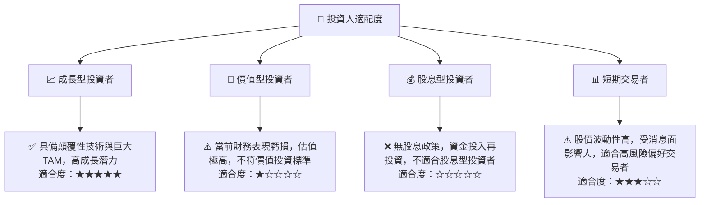
**分析：**
SPCX最適合**成長型投資者**，尤其是那些對太空產業的長期發展有深刻信念、願意承擔高風險並對短期獲利波動有較高容忍度的投資者。其顛覆性技術、巨大的市場潛力以及積極的擴張策略，符合成長股的典型特徵。對於**價值型投資者**而言，由於公司目前虧損且估值極高，其不符合傳統價值投資的標準。**股息型投資者**則完全不適合，因為公司目前沒有股息政策，所有資金都用於再投資。**短期交易者**可能會因為其高波動性而尋找機會，但風險同樣很高。

### 10.5 關鍵監控指標

| 監控類型 | 指標 | 關注點 | 頻率 |
|----------|------|----------|------|
| **營運成長** | Starlink 用戶數增長 | 用戶增長速度、ARPU變化、churn rate | 季度 |
| **營運效率** | 火箭發射頻率與成功率 | 任務數量、發射間隔、重複使用成本 | 月度 |
| **獲利能力** | 毛利率、營運利益率、淨利率趨勢 | 利潤率改善速度、研發費用佔比 | 季度 |
| **現金流** | 自由現金流 (FCF) | FCF轉正時點、資本支出效率 | 季度 |
| **財務健康** | 淨債務/EBITDA、流動比率 | 債務負擔、短期償債能力 | 季度/年度 |
| **技術進展** | Starship 測試與商業化進度 | 成功發射次數、載重能力、目標達成情況 | 不定期 (新聞公告) |
| **市場競爭** | 競爭對手新產品/服務發布、市場份額變化 | 競爭格局變化、定價壓力 | 季度/年度 |

---

> **免責聲明**：本報告為 AI 自動生成，僅供研究參考，不構成投資建議。投資有風險，入市需謹慎。