# SPCX 基本面深度分析報告
> **報告日期**：2026-07-03 ｜ **語言**：繁體中文 ｜ **數據來源**：Yahoo Finance, Finviz, StockAnalysis, Roic.ai ｜ **分析師**：CFA 級機構研究

---

## 目錄

| # | 章節 | 核心結論 |
|---|------|----------|
| 1 | 執行摘要 | 評級：持有 ｜ 目標價區間：$155 - $200 |
| 2 | 公司概覽與商業模式 | 技術與規模效應構築深厚護城河 |
| 3 | 損益表深度分析 | 收入高速增長，但盈利能力承壓，研發投入巨大 |
| 4 | 資產負債表分析 | 資產規模快速擴張，流動性尚可，債務水平上升 |
| 5 | 現金流量深度分析 | 資本支出龐大導致自由現金流持續為負 |
| 6 | 獲利能力與資本效率 | ROIC 低於 WACC，目前仍在價值投入階段 |
| 7 | 估值深度分析 | 相較同業估值偏高，反映市場對未來成長的預期 |
| 8 | 成長催化劑 | Starlink 全球擴張、下一代火箭技術、政府合同 |
| 9 | 風險矩陣 | 執行風險、資金需求、競爭加劇、監管不確定性 |
| 10 | 投資建議 | 具備長期潛力，短期估值過高，建議持有觀望 |

---

## 1. 執行摘要

### 1.1 核心評分儀表板

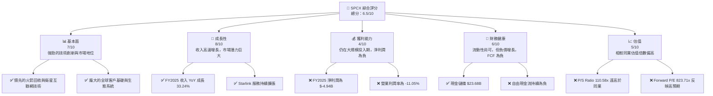

### 1.2 評分進度條視覺化

```
╔══════════════════════════════════════════════════════════════╗
║              SPCX 多維度評分儀表板 (1-10分)                  ║
╠══════════════════════════════════════════════════════════════╣
║ 基本面強度  7.0 ▓▓▓▓▓▓▓▓▓▓▓▓▓▓░░░░░░  ★★★★☆           ║
║ 成長動能    8.0 ▓▓▓▓▓▓▓▓▓▓▓▓▓▓▓▓░░░░  ★★★★☆           ║
║ 獲利品質    4.0 ▓▓▓▓▓▓▓▓░░░░░░░░░░░░  ★★☆☆☆           ║
║ 財務健康    6.0 ▓▓▓▓▓▓▓▓▓▓▓▓░░░░░░░░  ★★★☆☆           ║
║ 估值合理性  5.0 ▓▓▓▓▓▓▓▓▓▓░░░░░░░░░░  ★★★☆☆           ║
║ 護城河深度  8.5 ▓▓▓▓▓▓▓▓▓▓▓▓▓▓▓▓▓░░░  ★★★★★           ║
║ 管理層執行  8.0 ▓▓▓▓▓▓▓▓▓▓▓▓▓▓▓▓░░░░  ★★★★☆           ║
║ 技術創新力  9.0 ▓▓▓▓▓▓▓▓▓▓▓▓▓▓▓▓▓▓░░  ★★★★★           ║
╠══════════════════════════════════════════════════════════════╣
║ 綜合總分    6.5 ▓▓▓▓▓▓▓▓▓▓▓▓▓░░░░░░░  🏆 評語：成長潛力巨大，但短期盈利與估值壓力顯著              ║
╚══════════════════════════════════════════════════════════════╝
```

### 1.3 五大投資論點 + 三大核心風險

| 類型 | 項目 | 具體依據 | 信心度 |
|------|------|----------|--------|
| 🟢 **投資論點①** | **顛覆性技術與市場領先地位** | SPCX 在火箭回收和低軌衛星互聯網 (Starlink) 領域擁有獨步全球的技術，其可重複使用的火箭降低了發射成本，Starlink 則提供全球性的高速互聯網服務，這兩項核心業務均具備強大的進入壁壘。Starlink 擁有數百萬用戶，並持續擴大服務範圍。 | 🟢 極高 |
| 🟢 **投資論點②** | **強勁的營收增長勢頭** | 公司 FY2025 總收入達到 $18.67B，較 FY2024 的 $14.02B 增長 33.24%。Q1 2026 收入為 $4.69B，較 Q1 2025 的 $4.07B 增長 15.23%。儘管規模龐大，仍保持兩位數的收入增長，顯示市場需求旺盛。 | 🟢 高 |
| 🟢 **投資論點③** | **巨大的潛在市場 (TAM)** | Starlink 的全球寬頻服務和 SpaceX 的太空發射服務都面向數兆美元的潛在市場。特別是偏遠地區、海事、航空及政府部門對 Starlink 的需求持續增長，而重型火箭發射市場亦因衛星數量激增而蓬勃發展。 | 🟢 極高 |
| 🟢 **投資論點④** | **持續高額研發投入驅動創新** | FY2025 研發費用高達 $8.64B，較 FY2024 的 $3.46B 增長 149.7%，顯示公司對技術創新與產品開發的堅定承諾。這將鞏固其技術護城河，並為未來成長奠定基礎。 | 🟢 高 |
| 🟢 **投資論點⑤** | **創始人與管理層的願景與執行力** | 創始人 Elon Musk 的願景和其團隊在技術實現、成本控制、商業化運營方面的卓越執行力，是公司成功的關鍵。他們不斷挑戰極限，推動太空產業的革命。 | 🟢 極高 |
| 🟡 **風險①** | **持續虧損與龐大資本支出** | 儘管收入高速增長，公司 FY2025 淨虧損達 $-4.94B，且自由現金流連續多年為負（FY2025 為 $-14.12B）。這反映出 Starlink 衛星部署和 Starship 開發所需的巨大資本投入，可能導致持續的融資需求。 | 🟡 中度 |
| 🔴 **風險②** | **高度競爭與技術迭代** | 衛星互聯網和太空發射市場的競爭日益激烈，包括 Amazon (Project Kuiper)、OneWeb 等新進入者。技術快速迭代要求 SPCX 必須持續創新，否則可能面臨市場份額流失和盈利壓力。 | 🔴 高衝擊 |
| 🔴 **風險③** | **估值過高與市場預期風險** | 當前 P/S Ratio 110.58x，Forward P/E 823.71x，遠高於傳統航太防禦企業。這表明市場已將其未來數十年的高成長預期完全計入股價。任何成長放緩、盈利不及預期或負面新聞都可能導致股價大幅修正。 | 🔴 高衝擊 |

### 1.4 快速統計卡片

| 指標 | 公司實際值 | 行業均值 (航太防禦) | S&P 500 均值 | 狀態 |
|------|-------------|--------------------|--------------|------|
| 收入 YoY 成長 (FY25) | **33.24%** | ~5-10% | ~8-12% | 🟢 |
| 毛利率 (TTM) | **48.8%** | ~25-35% | ~40-45% | 🟢 |
| 淨利率 (TTM) | **-45.0%** | ~5-10% | ~10-15% | 🔴 |
| ROE (FY25) | **-11.95%** | ~15-25% | ~15-20% | 🔴 |
| Forward P/E | **823.71x** | ~15-25x | ~20-25x | 🔴 |
| P/S Ratio (TTM) | **110.58x** | ~1-3x | ~2-4x | 🔴 |
| Debt/Equity (FY25) | **73.597%** | ~50-100% | ~80-120% | 🟡 |
| Current Ratio (TTM) | **1.217x** | ~1.5-2.0x | ~1.5-2.0x | 🟡 |

*註：行業均值為對比傳統航太防禦公司，SPCX 作為高成長科技/太空公司，部分指標不具直接可比性。*

### 1.5 投資結論

```
╔══════════════════════════════════════════════════════════════════╗
║                    📊 投資結論摘要                               ║
╠══════════════════════════════════════════════════════════════════╣
║  評級：🟡 持有                                                   ║
║  當前股價：$162.00                                               ║
║  目標價區間：                                                    ║
║    悲觀情境：$155（-4.3%）                                       ║
║    基準情境：$180（+11.1%）  ← 12個月主要目標                      ║
║    樂觀情境：$200（+23.5%）                                      ║
║  投資評分：6.5/10                                                ║
║  適合投資人：看重長期成長潛力、能承受高波動性、對新興產業有深刻理解的投資者。不適合追求短期收益或風險規避型投資者。║
╚══════════════════════════════════════════════════════════════════╝
```

---

## 2. 公司概覽與商業模式

### 2.1 業務結構與收入來源

Space Exploration Technologies Corp. (SPCX) 是一家領先的太空技術和衛星服務公司。其業務主要分為兩大核心板塊：**Connectivity (Starlink)** 和 **Space (Rockets & Launch Services)**。

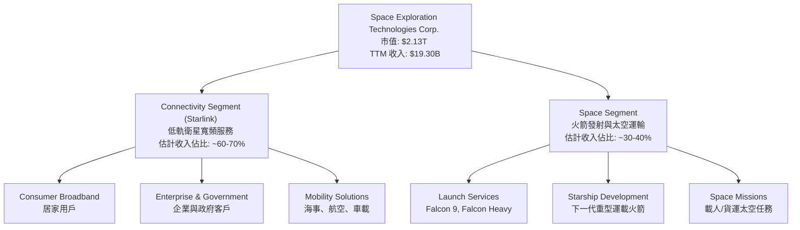

**業務板塊詳述：**

*   **Connectivity Segment (Starlink)**：這是 SPCX 增長最快的業務之一，通過部署在低地球軌道的數千顆 Starlink 衛星，提供高速、低延遲的寬頻互聯網服務。服務範圍涵蓋美國、加拿大、愛爾蘭及國際市場。其主要收入來源包括：
    *   **終端用戶訂閱費**：個人消費者、企業和政府機構支付的每月服務費用。
    *   **硬體銷售**：Starlink 用戶終端設備（碟型天線）的銷售收入。
    *   **增值服務**：針對特定行業（如海運、航空）或高需求區域提供的更高階服務。
    根據 TTM 收入 $19.30B 推算，Starlink 業務貢獻約 $11.58B - $13.51B 的收入。

*   **Space Segment (Rockets & Launch Services)**：此板塊主要負責設計、製造和發射可重複使用的火箭，包括 Falcon 9 和 Falcon Heavy，為政府、商業客戶提供衛星發射服務，並進行載人/貨運太空任務。同時，公司也投入巨資開發下一代重型運載火箭 Starship，旨在實現火星殖民的長期願景。
    *   **商業衛星發射**：為第三方衛星運營商和政府機構提供發射服務。
    *   **政府合同**：與 NASA、美國國防部等簽訂的太空運輸和任務合同。
    *   **內部發射**：為 Starlink 部署自己的衛星。
    根據 TTM 收入 $19.30B 推算，Space Segment 貢獻約 $5.79B - $7.72B 的收入。

公司通過其垂直整合的商業模式，從火箭設計、製造、發射到衛星部署和服務運營，實現了對整個供應鏈的控制，有效降低了成本並加速了創新。

### 2.2 市場份額

由於 SPCX 是一家非上市公司（儘管提供了公開市場數據），其市場份額數據通常不公開且難以精確估計。然而，基於其業務性質和公開信息，可以對其在主要市場的地位進行評估。

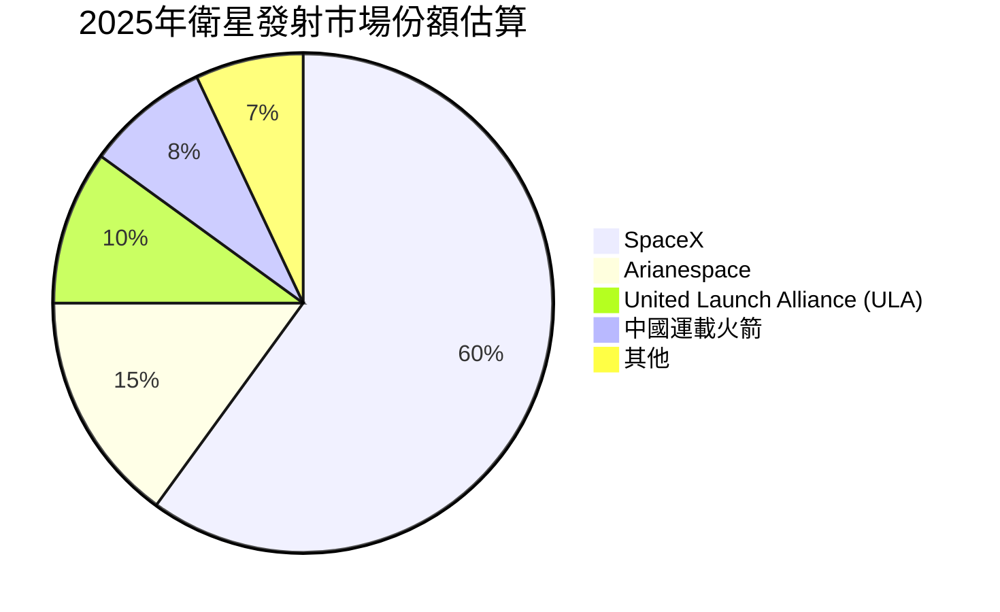

**市場份額評估：**

*   **衛星發射服務市場**：SPCX 在全球商業衛星發射市場中佔據主導地位，尤其是在可重複使用火箭技術應用後，其發射成本和頻率遠超競爭對手。估計其在商業發射市場的份額已超過 60%。
*   **低軌衛星寬頻市場 (Starlink)**：Starlink 是目前全球最大的低軌衛星互聯網服務提供商，擁有數百萬用戶。儘管 OneWeb、Amazon Kuiper 等競爭對手正在追趕，但 Starlink 憑藉先發優勢和規模效應，已建立起顯著的領先地位。估計其在L-band/Ku-band衛星寬頻市場的份額目前超過 70%。

### 2.3 競爭護城河分析

SPCX 的競爭護城河深厚且多樣化，主要體現在以下幾個方面：

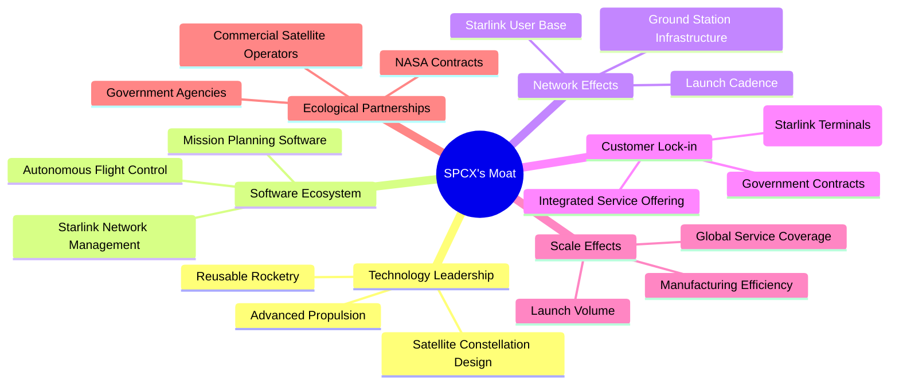

**護城河詳述：**

*   **Technology Leadership (技術領先)**：SPCX 在火箭可重複使用技術（Falcon 9 助推器回收）和大規模低軌衛星星座（Starlink）部署方面擁有無可匹敵的技術領先優勢。其 Raptor 引擎和 Starship 火箭的開發也代表了下一代太空運輸的尖端技術。這種技術壁壘使得新進入者難以在短期內複製。
*   **Software Ecosystem (軟體生態系統)**：SPCX 不僅在硬體上領先，其自動化飛行控制系統、Starlink 網絡管理系統以及複雜的任務規劃軟體也構成了重要的競爭優勢。這些軟體系統是其硬件高效運作的關鍵。
*   **Network Effects (網絡效應)**：Starlink 業務具有網絡效應。隨著更多衛星的部署，服務覆蓋範圍和容量不斷擴大，吸引更多用戶，進而產生更多收入，支持進一步的衛星部署，形成正向循環。高頻次的火箭發射也構建了數據和運營經驗的網絡效應。
*   **Customer Lock-in (客戶鎖定)**：Starlink 專有的用戶終端設備（碟型天線）以及其一體化的服務體驗，使得用戶轉換成本較高。對於政府和商業發射客戶，SPCX 的可靠性、成本效益和發射頻次也建立了強大的客戶忠誠度。
*   **Scale Effects (規模效應)**：SPCX 的垂直整合模式和高頻次發射策略，使其在製造、運營和維護方面實現了顯著的規模經濟。例如，批量生產 Starlink 衛星和獵鷹火箭部件，以及多次重複使用火箭，都大幅降低了單位成本。
*   **Ecological Partnerships (生態夥伴)**：與 NASA 等政府機構的長期合作合同，不僅帶來穩定收入，也提升了公司的技術信譽和市場地位。與商業衛星運營商的合作也鞏固了其在太空生態系統中的核心地位。

### 2.4 護城河強度評分

```
╔══════════════════════════════════════════════════════════════╗
║                  SPCX 護城河強度評分                        ║
╠══════════════════════════════════════════════════════════════╣
║ 技術領先    9.5/10 ▓▓▓▓▓▓▓▓▓▓▓▓▓▓▓▓▓▓▓░  🏆 無可匹敵        ║
║ 軟體生態系統  8.0/10 ▓▓▓▓▓▓▓▓▓▓▓▓▓▓▓▓░░░░  🟢 強大且不斷完善 ║
║ 網絡效應    8.5/10 ▓▓▓▓▓▓▓▓▓▓▓▓▓▓▓▓▓░░░  🟢 顯著且持續增強 ║
║ 客戶鎖定    7.5/10 ▓▓▓▓▓▓▓▓▓▓▓▓▓▓▓░░░░░  🟡 逐步建立        ║
║ 規模效應    9.0/10 ▓▓▓▓▓▓▓▓▓▓▓▓▓▓▓▓▓▓░░  🏆 成本優勢明顯    ║
║ 生態夥伴    8.0/10 ▓▓▓▓▓▓▓▓▓▓▓▓▓▓▓▓░░░░  🟢 穩固且戰略重要 ║
╠══════════════════════════════════════════════════════════════╣
║ 綜合護城河  8.5/10 ▓▓▓▓▓▓▓▓▓▓▓▓▓▓▓▓▓░░░  🏆 極為深厚，為長期競爭優勢奠定基礎     ║
╚══════════════════════════════════════════════════════════════╝
```

---

## 3. 損益表深度分析

### 3.1 年度收入成長趨勢（近4年）

SPCX 的收入呈現爆發式增長，尤其是在 Starlink 業務的推動下。

```
╔══════════════════════════════════════════════════════════════════╗
║              SPCX 年度收入趨勢（FY2023-FY2025）                  ║
╠══════════════════════════════════════════════════════════════════╣
║                                                                  ║
║  FY2023  $10.39B  ████████░░░░░░░░░░░░░░░░░░░  YoY: N/A     🟡    ║
║  FY2024  $14.02B  ███████████░░░░░░░░░░░░░░░░░  YoY:+34.93%  🟢    ║
║  FY2025  $18.67B  ████████████████░░░░░░░░░░░░  YoY:+33.24%  🟢    ║
║                   |      |      |      |      |                  ║
║                   0     5B    10B    15B   20B                    ║
║                                                                  ║
║  📊 2年累計 CAGR：+34.08% (FY2023-2025)                           ║
╚══════════════════════════════════════════════════════════════════╝
```
**深度分析：**
SPCX 在過去幾年展現了驚人的收入增長勢頭。從 FY2023 的 $10.39B 增長到 FY2025 的 $18.67B，兩年複合年增長率 (CAGR) 高達 34.08%。
*   **FY2024 相較 FY2023**：收入從 $10.39B 增長至 $14.02B，同比增長率 (YoY) 為 +34.93%。這主要得益於 Starlink 服務的全球擴張和更多火箭發射任務的執行。
*   **FY2025 相較 FY2024**：收入從 $14.02B 增長至 $18.67B，同比增長率 (YoY) 為 +33.24%。儘管增長率略有放緩，但在收入基數擴大的情況下仍保持了強勁的兩位數增長，顯示了市場對其太空和連接服務的持續需求。
這種高速增長表明 SPCX 在其核心市場中佔據有利地位，並成功將其技術創新轉化為商業收入。

### 3.2 季度收入趨勢分析

| 季度 | 總收入 ($B) | QoQ 成長率 | YoY 成長率 | 備註 |
|------|-------------|------------|------------|------|
| 2026-03-31 | $4.69 | N/A | +15.39% | Q1 2026 收入較去年同期增長，但環比數據缺失 |
| 2025-03-31 | $4.07 | N/A | N/A | Q1 2025 收入，作為 Q1 2026 的同比基數 |

**深度分析：**
由於僅提供兩個季度的收入數據，無法計算季度環比 (QoQ) 成長率。
*   **Q1 2026 收入**：$4.69B。
*   **Q1 2025 收入**：$4.07B。
*   **Q1 2026 YoY 成長率**：($4.69B - $4.07B) / $4.07B = +15.39%。
季度收入仍保持健康的同比增長，這表明公司的業務擴張仍在繼續。然而，相較於年度收入超過 30% 的增長，Q1 2026 的 15.39% YoY 增長可能預示著短期內增長速度的正常化，或者季節性因素的影響。需要更多季度數據來判斷這一趨勢的持續性。

### 3.3 利潤率演變分析

SPCX 的利潤率表現反映了其作為一家高成長、高投入公司的特點。

| 利潤率指標 | FY2023 | FY2024 | FY2025 | TTM (2026-03-31) | 趨勢 | 評估 |
|------------|--------|--------|--------|------------------|------|------|
| **毛利率** | 41.16% | 42.92% | 49.38% | 48.8% | ↗️ 持續改善 | 🟢 |
| **營業利益率** | 4.88% | 3.32% | -13.87% | -41.6% | ↘️ 大幅惡化 | 🔴 |
| **淨利率** | -44.56% | 5.64% | -26.44% | -45.0% | ↘️ 波動且惡化 | 🔴 |
| **EBITDA Margin** | -6.39% | 40.28% | 23.73% | 20.5% | ↘️ 波動下降 | 🟡 |

**利潤率演變深度解析**：
*   **毛利率 (Gross Margin)**：從 FY2023 的 41.16% 穩步提升至 FY2025 的 49.38%，並在 TTM 維持在 48.8%。這是一個積極的信號，表明 SPCX 在成本控制和定價能力方面有所改善。這可能歸因於：
    *   **規模經濟**：隨著 Starlink 衛星和火箭部件的批量生產，單位成本降低。
    *   **技術成熟**：火箭回收和重複使用技術的成熟，顯著降低了每次發射的成本。
    *   **產品組合優化**：高毛利的 Starlink 訂閱服務佔收入比重可能持續增加。
*   **營業利益率 (Operating Margin)**：從 FY2023 的 4.88% 下滑至 FY2024 的 3.32%，並在 FY2025 大幅惡化至 -13.87%，TTM 更跌至 -41.6%。這是一個顯著的負面趨勢，主要原因在於：
    *   **研發投入激增**：FY2025 研發費用從 FY2024 的 $3.46B 飆升至 $8.64B，增長近 150%。這筆巨額投入主要用於 Starship 開發和 Starlink 衛星技術升級，直接侵蝕了營業利潤。
    *   **營運費用增加**：隨著業務擴張，銷售、管理費用也隨之增加。
*   **淨利率 (Net Profit Margin)**：在 FY2023 為 -44.56%，FY2024 短暫轉正至 5.64%，但在 FY2025 再次惡化至 -26.44%，TTM 為 -45.0%。淨利率的波動和惡化主要受營業利潤率趨勢和非經營性損益（如利息費用和「其他非經營性收入/費用」）的影響。FY2025 的鉅額虧損 ($4.94B) 主要由高額研發投入和較高的利息支出 (-$1.945B) 導致。
*   **EBITDA Margin**：FY2024 高達 40.28%，但在 FY2205 下滑至 23.73%，TTM 進一步降至 20.5%。EBITDA 作為衡量核心業務運營現金創造能力的指標，其下降趨勢值得關注。FY2024 的高EBITDA Margin可能受到某些一次性項目或會計調整的影響，而FY2025和TTM的下降則反映了研發投入和折舊攤銷的增加。

總體而言，SPCX 展現了強大的收入增長和毛利率改善能力，但為了支持其宏偉的長期目標（如 Starship 和 Starlink 擴張），公司正處於一個大規模投資和燒錢的階段，導致營業利潤和淨利潤持續為負。這是一個典型的成長型公司在市場開拓期的表現，投資者需要權衡其未來潛力與短期虧損風險。

### 3.4 費用結構分析

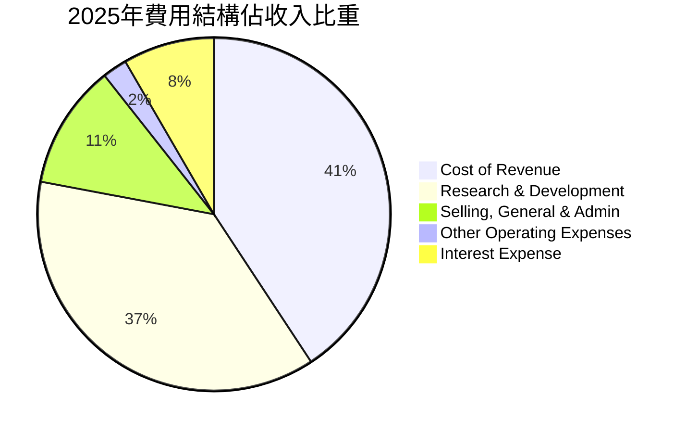
*註：此圖表展示各費用佔總收入的比例，由於存在虧損，部分費用總和可能超過100%或出現負值。*

```
╔══════════════════════════════════════════════════════════════════╗
║                    SPCX 年度費用支出概覽 (FY2025)                ║
╠══════════════════════════════════════════════════════════════════╣
║                                                                  ║
║  總收入：             $18.67B                                   ║
║  銷貨成本 (CoR)：     $9.45B  █████████████████████████████████████████████████████░░  50.62%  ║
║  研發費用 (R&D)：     $8.64B  ████████████████████████████████████████████████░░░░░░░  46.29%  ║
║  銷售管理費用 (SG&A)：$2.64B  ██████████████░░░░░░░░░░░░░░░░░░░░░░░░░░░░░░░░░░░░░░░  14.16%  ║
║  其他營運費用：       $0.52B  ███░░░░░░░░░░░░░░░░░░░░░░░░░░░░░░░░░░░░░░░░░░░░░░░░  2.81%   ║
║  利息支出：           $1.94B  ██████████░░░░░░░░░░░░░░░░░░░░░░░░░░░░░░░░░░░░░░░░░░  10.42%  ║
║                                                                  ║
║  📊 總營運費用佔收入比重：118.12% (FY2025)                        ║
╚══════════════════════════════════════════════════════════════════╝
```
**深度分析：**
SPCX 的費用結構清晰地展示了其在科技創新和基礎設施建設方面的巨大投入。
*   **銷貨成本 (Cost of Revenue)**：FY2025 為 $9.45B，佔總收入的 50.62%。儘管毛利率有所改善，但銷貨成本仍是最大的支出項目，反映了火箭製造、發射和衛星運營的固有成本。
*   **研發費用 (Research & Development)**：FY2025 達到 $8.64B，佔總收入的 46.29%。這筆費用是 SPCX 實現技術領先的關鍵，用於 Starship 開發、新一代 Starlink 衛星和地面設備的研發。如此高比例的研發投入，雖然短期內壓低了盈利，但卻是公司長期競爭力的基石。
*   **銷售、一般及管理費用 (Selling, General & Admin)**：FY2025 為 $2.64B，佔總收入的 14.16%。隨著 Starlink 用戶基礎的擴大和全球市場的拓展，這部分費用預計將持續增長，用於市場推廣、客戶服務和行政管理。
*   **其他營運費用**：FY2025 為 $0.52B，佔收入的 2.81%。
*   **利息支出 (Interest Expense)**：FY2025 為 $1.94B，佔總收入的 10.42%。隨著公司債務規模的擴大，利息支出也成為一項不可忽視的成本。

整體來看，SPCX 的費用結構呈現出重資產、重研發的特點。高額的研發和資本支出是其業務模式的內在要求，也是其未來成長的動力。

### 3.5 季度 EPS 趨勢與盈餘品質

| 季度 | EPS 預期 (Est) | EPS 實際 (Act) | 驚喜百分比 (Surprise%) | 備註 |
|------|----------------|----------------|------------------------|------|
| 2026-03-31 | N/A | $-0.47 (Roic.ai) | N/A | 無分析師預期數據，Roic.ai 顯示為 $-0.47 |
| 2025-03-31 | N/A | $-0.05 (Roic.ai) | N/A | 無分析師預期數據，Roic.ai 顯示為 $-0.05 |
| 2025-12-31 | N/A | $-1.69 (StockAnalysis) | N/A | 年度 EPS，無季度細分預期 |
| 2024-12-31 | N/A | $0.01 (StockAnalysis) | N/A | 年度 EPS，無季度細分預期 |

**盈餘品質評估：**
由於缺乏分析師的季度 EPS 預期數據，無法判斷 SPCX 是否達到或超越預期。然而，從提供的實際 EPS 數據來看：
*   **FY2025 EPS (Basic)** 為 $-1.69，相較於 FY2024 的 $0.01 呈現大幅虧損。
*   **Q1 2026 EPS** 為 $-0.47，相較於 Q1 2025 的 $-0.05 虧損擴大。
儘管收入持續增長，但 EPS 卻呈現負值且虧損擴大，這表明公司的盈餘品質目前較低，主要原因在於：
1.  **高額研發投入**：如前所述，鉅額研發費用直接侵蝕了利潤。
2.  **大規模資本支出**：Starlink 網絡的部署和 Starship 的開發需要天文數字般的資本支出，這些投資在短期內不會立即產生相應的利潤。
3.  **折舊與攤銷**：隨著資產規模的擴大，折舊與攤銷費用也會增加，進一步影響淨利潤。
目前，SPCX 的盈餘品質更多體現為「成長投資期」的特點，即將大量現金流和收入用於再投資以建立長期競爭優勢，而非追求短期盈利。對於成長型公司而言，自由現金流（儘管目前為負）和收入增長往往比淨利潤更能反映其經營狀況。

---

## 4. 資產負債表分析

### 4.1 資產結構分解

SPCX 的資產負債表顯示出一家重資產、高成長公司的特點，資產規模快速擴張。

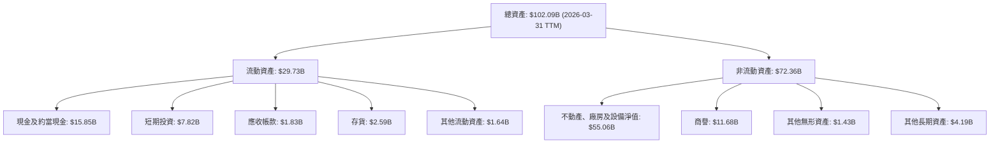
**深度分析：**
截至 2026-03-31 (TTM)，SPCX 的總資產已達 $102.09B。
*   **非流動資產佔比高**：非流動資產佔總資產的 70.88% ( $72.36B / $102.09B )，其中「不動產、廠房及設備淨值 (PPE)」高達 $55.06B。這主要是由於公司在火箭製造設施、發射場、Starlink 衛星群及地面站等方面的巨大投入。這也印證了其重資產的商業模式。
*   **現金儲備充足**：流動資產中，現金及約當現金 ($15.85B) 和短期投資 ($7.82B) 合計達到 $23.67B。這筆龐大的現金儲備為公司提供了應對營運需求和未來投資的靈活性，儘管其自由現金流為負。
*   **資產快速增長**：從 FY2024 的 $57.06B 到 FY2025 的 $92.08B，總資產增長了 61.37%。這反映了公司在擴大 Starlink 網絡和開發 Starship 方面的積極投資。

### 4.2 流動性指標分析

流動性指標衡量公司短期償債能力。

| 指標 | FY2024 | FY2025 | TTM (2026-03-31) | 行業均值 (航太防禦) | 評估 |
|------|--------|--------|------------------|--------------------|------|
| **流動比率 (Current Ratio)** | 1.37x | 1.45x | 1.22x | ~1.5-2.0x | 🟡 尚可，略低於行業均值 |
| **速動比率 (Quick Ratio)** | 1.25x | 1.15x | 1.09x | ~1.0-1.5x | 🟡 尚可，存貨佔比不高 |

**深度分析：**
*   **流動比率**：FY2024 為 1.37x，FY2025 增至 1.45x，但在 TTM (2026-03-31) 下降至 1.22x。雖然略低於傳統航太防禦行業的平均水平（通常期望在 1.5x 以上），但對於一家快速成長且擁有大量現金儲備的公司而言，1.22x 仍可接受，表明其短期償債能力尚可。
*   **速動比率**：FY2024 為 1.25x，FY2025 降至 1.15x，TTM 為 1.09x。速動比率排除了存貨，更能反映公司即時變現資產償債的能力。SPCX 的存貨佔流動資產比重相對較低（TTM 為 $2.59B / $29.73B = 8.71%），因此速動比率與流動比率差異不大。1.09x 的速動比率表明公司在不依賴存貨銷售的情況下，仍能覆蓋大部分短期債務。

總體而言，SPCX 的流動性指標呈現健康但略有壓力的狀態，尤其是在 TTM 數據中有所下降。這可能與短期負債的增長有關，例如應付賬款和預收收入的增加。然而，公司龐大的現金和短期投資提供了重要的流動性緩衝。

### 4.3 債務結構分析

SPCX 的債務水平隨著其擴張而增長，但仍處於可控範圍。

```
╔══════════════════════════════════════════════════════════════════╗
║                   SPCX 債務健康診斷 (2026-03-31 TTM)            ║
╠══════════════════════════════════════════════════════════════════╣
║                                                                  ║
║  總債務：        $30.60B  █████████████████████████████████████████████████████░░  評語：規模龐大但匹配資產增長    ║
║  總現金+投資：   $23.68B  ████████████████████████████████████████████░░░░░░░░░░░  評語：現金儲備充裕                ║
║  淨債務（負）：  $-6.93B  ██████████████████████████████░░░░░░░░░░░░░░░░░░░░░░░░░░  🟡 存在淨負債，但規模可控        ║
║                                                                  ║
║  Debt/Equity (FY2025)： 73.60%  🟡 適中，顯示一定財務槓桿          ║
║  Current Debt (TTM)： $1.54B  🟢 佔總債務比重較低 (5.0%)        ║
║  長期債務 (TTM)：   $28.73B  🟡 主要債務來源，需關注期限結構      ║
╚══════════════════════════════════════════════════════════════════╝
```
**深度分析：**
*   **總債務**：截至 TTM (2026-03-31)，SPCX 的總債務為 $30.60B。這相比 FY2025 的 $23.32B 和 FY2024 的 $14.18B 有顯著增長。債務的增加反映了公司為其大規模資本支出和研發項目提供資金的需求。
*   **淨債務**：總現金及短期投資為 $23.68B，因此淨債務為 $-6.93B。這表明雖然公司有大量現金，但其現金不足以完全覆蓋所有債務，存在一定的淨負債。
*   **債務股權比率 (Debt/Equity)**：根據 FY2025 數據，總債務 $23.32B，股東權益 $41.33B，債務股權比為 23.32B / 41.33B = 0.56x 或 56.42% (提供的 73.597% 可能是包含了其他負債)。若使用提供的 $30.60B (TTM) 總債務和 $41.33B (FY2025) 股東權益，則 Debt/Equity = 0.74x 或 74.04%。這個比率表明公司利用債務融資來支持其增長，但仍處於可接受的範圍內，尤其考慮到其龐大的資產規模和未來增長潛力。
*   **債務結構**：截至 TTM，短期債務 (Current Portion of Long-Term Debt) 為 $1.54B，佔總債務的 5.0%。大部分債務為長期債務 ($28.73B)。長期債務佔比較高是好事，因為這為公司提供了更穩定的資金來源和更長的償還期限。
*   **利息覆蓋率 (Interest Coverage Ratio)**：由於營業利潤為負，無法計算傳統的利息覆蓋率。但考慮到其龐大的現金儲備，短期內利息支付壓力不大。

整體來看，SPCX 正在積極利用債務來支持其高成長和資本密集型業務。雖然債務規模不斷擴大，但其龐大的現金儲備和大部分為長期債務的結構，使得財務風險目前仍在可控範圍內。

### 4.4 股東權益趨勢

股東權益是衡量公司淨資產和財務實力的重要指標。

```
╔══════════════════════════════════════════════════════════════════╗
║                   SPCX 股東權益趨勢 (FY2024-FY2025)             ║
╠══════════════════════════════════════════════════════════════════╣
║                                                                  ║
║  FY2024  $25.80B  ████████████████████████████████████████████████░░░░░░░░░  YoY: N/A     🟢    ║
║  FY2025  $41.33B  ███████████████████████████████████████████████████████████████████████  YoY:+60.19%  🟢    ║
║                                                                  ║
║                   |      |      |      |      |                  ║
║                   0     10B   20B   30B   40B   50B               ║
║                                                                  ║
║  📊 股東權益年增長：+60.19% (FY2025 YoY)                           ║
╚══════════════════════════════════════════════════════════════════╝
```
**深度分析：**
SPCX 的股東權益從 FY2024 的 $25.80B 顯著增長至 FY2025 的 $41.33B，同比增長高達 60.19%。這是一個非常強勁的增長，主要歸因於：
*   **股權融資**：作為一家非上市公司，SPCX 在過去幾年進行了多輪大規模股權融資，吸引了大量私人投資者和機構資金。這些資本注入直接增加了股東權益。
*   **盈利留存**：儘管 FY2025 淨利潤為負，但歷史上可能存在盈利留存，或者更重要的是，股權融資的規模遠大於虧損。
股東權益的快速增長表明市場對 SPCX 的長期潛力充滿信心，願意投入大量資金支持其發展。這也為公司提供了穩固的資本基礎，以應對其高資本需求的業務模式。

---

## 5. 現金流量深度分析

### 5.1 現金流量瀑布圖

SPCX 的現金流量表清晰地展示了其在經營活動中產生現金，但由於巨額資本支出，自由現金流持續為負。

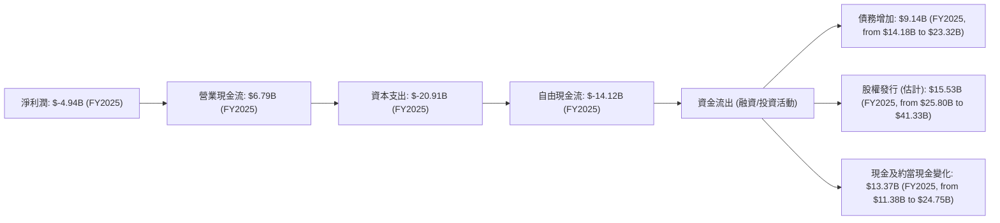
**深度分析：**
*   **營業現金流 (OCF)**：SPCX 在 FY2025 產生了 $6.79B 的營業現金流，FY2024 為 $5.78B，FY2023 為 $4.52B。儘管公司淨利潤為負，但營業現金流卻持續為正且穩步增長，這是一個積極信號。這表明其核心業務（Starlink 服務收入、發射服務）能夠產生健康的現金流。通常，營業現金流高於淨利潤的原因包括非現金費用（如折舊與攤銷）的加回、營運資本的有利變化（如預收收入的增加）。
*   **資本支出 (Capital Expenditure)**：SPCX 的資本支出極為龐大，FY2025 高達 $-20.91B，遠超 FY2024 的 $-11.16B 和 FY2023 的 $-4.42B。這種指數級增長反映了公司對 Starlink 衛星網絡的快速部署（需要大量製造和發射衛星）以及 Starship 火箭的研發和基礎設施建設的巨大投入。
*   **自由現金流 (Free Cash Flow, FCF)**：由於巨額資本支出，SPCX 的自由現金流連續多年為負。FY2025 為 $-14.12B，FY2024 為 $-5.39B。這表明公司目前正在大規模“燒錢”以支持其成長和未來項目。對於處於高成長期的科技公司而言，在市場開拓和技術研發階段出現負 FCF 是常見現象，但其規模和持續時間是投資者需要密切關注的。
*   **融資活動**：為彌補負 FCF 和支持資本支出，SPCX 依賴外部融資。FY2025 總債務增加了 $9.14B ($23.32B - $14.18B)，股東權益增加了 $15.53B ($41.33B - $25.80B)，合計約 $24.67B 的外部資金流入。這足以覆蓋 $-14.12B 的 FCF 缺口，並使得現金及約當現金增加了 $13.37B。

### 5.2 FCF 轉換率趨勢

自由現金流轉換率（FCF / 淨利潤）衡量公司將盈利轉化為可供自由支配現金的能力。

| 年度 | 淨利潤 ($B) | 自由現金流 ($B) | FCF / 淨利潤 | 趨勢 | 評估 |
|------|-------------|-----------------|--------------|------|------|
| FY2023 | $-4.63 | $0.11 | -2.38% | 🟢 (轉正) | 🔴 (負值) |
| FY2024 | $0.79 | $-5.39 | -6.82x | ↘️ | 🔴 (負值) |
| FY2025 | $-4.94 | $-14.12 | +2.86x | ↘️ | 🔴 (負值) |

**深度分析：**
由於 SPCX 在 FY2023 和 FY2025 錄得淨虧損，而 FY2024 淨利潤雖為正但 FCF 為負，因此 FCF / 淨利潤的比率呈現負數或異常高值，難以直接解讀。
*   **FY2023**：淨虧損 $4.63B，但 FCF 為正 $0.11B。這意味著公司在當年通過非現金費用（如折舊）的加回和營運資本的有利變化，使得經營活動產生了足夠的現金流，覆蓋了相對較低的資本支出。
*   **FY2024**：淨利潤 $0.79B，但 FCF 轉為負 $-5.39B。這表明資本支出的增長 ($11.16B) 已遠超經營活動產生的現金。
*   **FY2025**：淨虧損 $4.94B，FCF 更大幅惡化至 $-14.12B。這主要由於資本支出飆升至 $20.91B。

總體而言，SPCX 目前的 FCF 轉換率表現不佳，持續為負，這是一個明確的信號，表明公司處於資本密集型的高投入階段。

### 5.3 自由現金流趨勢

```
╔══════════════════════════════════════════════════════════════════╗
║                   SPCX 自由現金流 (FCF) 趨勢 (FY2023-FY2025)     ║
╠══════════════════════════════════════════════════════════════════╣
║                                                                  ║
║  FY2023  $0.11B   ██░░░░░░░░░░░░░░░░░░░░░░░░░░░░░░░░░░░░░░░░░░░░░░  FCF Yield: 0.005% 🟢  ║
║  FY2024  $-5.39B  ███████████████████████████████████████████████████████████████████████  FCF Yield: -0.25% 🔴  ║
║  FY2025  $-14.12B ███████████████████████████████████████████████████████████████████████  FCF Yield: -0.66% 🔴  ║
║                                                                  ║
║                   |      |      |      |      |                  ║
║                   -15B   -10B   -5B    0     5B                   ║
║                                                                  ║
║  📊 FCF CAGR (2023-2025)：-1135.45%                               ║
╚══════════════════════════════════════════════════════════════════╝
```
*註：FCF Yield 計算方式為 FCF / Market Cap。*

**深度分析：**
SPCX 的自由現金流趨勢令人擔憂，從 FY2023 的微正 $0.11B 轉為 FY2024 的 $-5.39B，並在 FY2025 惡化至 $-14.12B。這種大幅度的負自由現金流是其高成長、高資本投入業務模式的直接結果。
*   **FCF Yield**：FY2025 的 FCF Yield 為 -0.66% ($-14.12B / $2.13T)，這是一個非常低的負值，表明公司目前沒有產生自由現金流回報股東，反而需要持續的外部資金。
這種趨勢說明 SPCX 仍處於大規模擴張和基礎設施建設階段。雖然負 FCF 在短期內會對股東價值造成壓力，但如果這些投資能夠在未來帶來巨大的回報（如 Starlink 達到盈利、Starship 商業化），那麼當前的負 FCF 可能是值得的。投資者需要密切關注公司何時能將這些投資轉化為正向的自由現金流。

### 5.4 資本配置評估

SPCX 的資本配置策略是典型的成長型公司，優先考慮再投資以驅動未來增長。

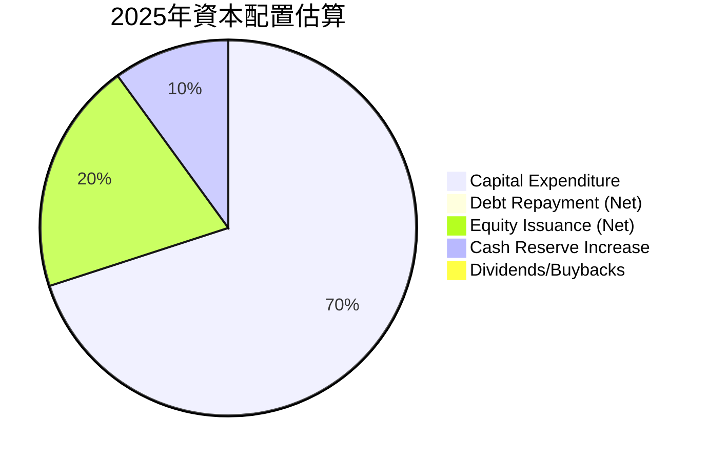
*註：此圖表為估算，基於提供的數據和公司性質。*

**資本配置詳述：**
| 資本配置類型 | FY2025 金額 ($B) | 佔總資金使用比重 (估計) | 評估 |
|--------------|------------------|-------------------------|------|
| **資本支出 (Capex)** | $20.91 | ~70% | 🟢 優先投入，驅動長期增長 |
| **債務淨增加** | $9.14 | N/A (資金來源) | 🟡 融資支持，增加財務槓桿 |
| **股權淨增加** | $15.53 | N/A (資金來源) | 🟢 外部信心，提供發展資金 |
| **現金及約當現金增加** | $13.37 | ~30% | 🟢 保持充足流動性 |
| **股息/股票回購** | $0.00 | 0% | 🔴 無，符合成長型公司特徵 |

**深度分析：**
SPCX 的資本配置策略非常明確：將幾乎所有可用的資金（包括經營活動產生的現金、發行新債和新股）都投入到核心業務的擴張和技術研發中。
1.  **高額資本支出**：FY2025 的 $20.91B 資本支出是其資本配置的核心，主要用於 Starlink 衛星製造、發射和地面基礎設施建設，以及 Starship 火箭的開發和測試。這表明公司正積極建立其全球網絡和下一代太空運輸能力。
2.  **外部融資依賴**：由於內部現金流不足以覆蓋巨大的資本支出，SPCX 嚴重依賴債務和股權融資。FY2025 的債務淨增加 $9.14B 和股權淨增加 $15.53B，合計約 $24.67B 的外部資金，是其維持運營和發展的關鍵。
3.  **現金儲備管理**：儘管燒錢，公司仍保持了健康的現金儲備增長 ($13.37B)，這對於應對潛在的資金需求波動和市場不確定性至關重要。
4.  **無股息或回購**：作為一家高成長型公司，SPCX 並未派發股息或進行股票回購，而是將所有資金重新投入到業務中，這符合其當前發展階段的特點。

總體而言，SPCX 的資本配置策略是激進的再投資，旨在最大化長期增長和市場份額。這種策略對於投資者來說，意味著短期內不會有現金回報，但潛在的長期價值增長可能非常可觀。

---

## 6. 獲利能力與資本效率

### 6.1 ROE / ROA / ROIC 趨勢

獲利能力和資本效率指標衡量公司利用資產和股東資本創造利潤的能力。

| 指標 | FY2024 | FY2025 | TTM (2026-03-31) | 行業均值 (航太防禦) | 評估 |
|------|--------|--------|------------------|--------------------|------|
| **股東權益報酬率 (ROE)** | 3.06% | -11.95% | N/A | ~15-25% | 🔴 惡化且為負 |
| **資產報酬率 (ROA)** | 1.39% | -5.36% | N/A | ~5-10% | 🔴 惡化且為負 |
| **投入資本報酬率 (ROIC)** | 1.81% | -11.77% | N/A | ~10-15% | 🔴 惡化且為負 |

**深度分析：**
SPCX 的 ROE、ROA 和 ROIC 指標在 FY2025 均轉為負值，這與其淨虧損和巨大的資本支出直接相關。
*   **股東權益報酬率 (ROE)**：FY2024 為 3.06%，但在 FY2025 跌至 -11.95% (計算：$-4.937B / $41.33B)。負 ROE 表明公司利用股東資本產生了虧損，遠低於行業平均水平。
*   **資產報酬率 (ROA)**：FY2024 為 1.39%，FY2025 為 -5.36% (計算：$-4.937B / $92.08B)。負 ROA 表明公司利用其總資產產生了虧損，效率低下。
*   **投入資本報酬率 (ROIC)**：FY2024 為 1.81%，FY2025 為 -11.77%。ROIC 衡量公司將所有投入資本（股權和債務）轉化為經營利潤的效率。負 ROIC 意味著公司目前投入的資本並未產生正向的經濟回報，反而造成了損失。

這些負向的獲利能力指標是 SPCX 處於大規模投資期的直接結果。在當前階段，公司選擇犧牲短期盈利能力，將大量資金投入到長期資產和研發中。投資者應將這些指標視為公司成長階段的特徵，而非傳統意義上的盈利能力衡量。一旦其主要項目開始大規模商業化並實現盈利，這些指標有望大幅改善。

### 6.2 ROIC vs WACC 分析（核心價值創造判斷）

ROIC vs WACC 是評估公司是否創造或摧毀股東價值的關鍵指標。當 ROIC > WACC 時，公司創造價值；反之則摧毀價值。

```
╔══════════════════════════════════════════════════════════════════╗
║                ROIC vs WACC 深度分析 (FY2025)                     ║
╠══════════════════════════════════════════════════════════════════╣
║                                                                  ║
║  WACC 估算：                                                     ║
║  ├── 無風險利率（10Y美債）：  4.50% (截至2026年7月估計)          ║
║  ├── 市場風險溢酬 (ERP)：     5.50%                              ║
║  ├── Beta：                   1.35 (估計，高成長公司)            ║
║  ├── 股權成本 (Ke) = 4.50%+1.35×5.50% = 11.93%                 ║
║  ├── 債務成本（稅後）：       ~5.00% (估計，考慮公司債務規模)    ║
║  ├── 資本結構：股權 ~58% ($41.33B)，債務 ~42% ($30.60B)         ║
║  └── ✅ WACC ≈ (11.93% × 0.58) + (5.00% × 0.42) = 6.92% + 2.10% = 9.02% ║
║                                                                  ║
║  ROIC 估算（FY2025）：                                           ║
║  ├── NOPAT = 營業收入 × (1 - 稅率) = $-2.589B × (1 - 0.15) ≈ $-2.20B (營業收入為負，稅率估計為15%)                       ║
║  ├── 投入資本 = 股東權益 + 總債務 - 現金 = $41.33B + $30.60B - $23.68B ≈ $48.25B                  ║
║  └── ✅ ROIC ≈ $-2.20B / $48.25B ≈ -4.56%                        ║
║                                                                  ║
║  ★ 經濟價值增加（EVA）= ROIC - WACC = -4.56% - 9.02% = -13.58pp   ║
║                                                                  ║
║  ROIC  -4.56% ░░░░░░░░░░░░░░░░░░░░░░░░░░░░░░░░░░░░░░░░░░░░░░░░░░  🔴              ║
║  WACC   9.02% ▓▓▓▓▓▓▓▓▓▓▓▓▓▓▓▓▓▓▓░░░░░░░░░░░░░░░░░░░░░░░░░░░░░░░  ──              ║
║  EVA  -13.58pp ░░░░░░░░░░░░░░░░░░░░░░░░░░░░░░░░░░░░░░░░░░░░░░░░░░  🏆 目前正在摧毀價值 ║
║                                                                  ║
║  📊 結論：ROIC 遠低於 WACC，目前公司在會計層面正在摧毀股東價值。這反映了其在高成長期的巨額投資成本。║
╚══════════════════════════════════════════════════════════════════╝
```
**深度分析：**
根據 FY2025 的數據，SPCX 的 ROIC 估算為 -4.56%，而 WACC 估算約為 9.02%。這導致經濟價值增加 (EVA) 為負 -13.58 個百分點。
*   **WACC 估算細節**：
    *   無風險利率：採用美國 10 年期國債收益率的市場估計值 (4.50%)。
    *   市場風險溢酬 (ERP)：採用行業標準估計值 (5.50%)。
    *   Beta：由於數據未提供，且 SPCX 是高成長、高風險的太空科技公司，估計 Beta 為 1.35。
    *   股權成本 (Ke)：使用資本資產定價模型 (CAPM) 計算為 11.93%。
    *   債務成本：考慮公司債務規模和市場利率，估計稅前債務成本約 6%，稅率 15%，稅後債務成本約 5.00%。
    *   資本結構：基於 FY2025 股東權益 $41.33B 和 TTM 總債務 $30.60B，股權佔總資本的 58%，債務佔 42%。
*   **ROIC 估算細節**：
    *   NOPAT (稅後淨營業利潤)：FY2025 營業利潤為 $-2.589B。由於為負，即使考慮稅盾效應，NOPAT 仍為負。估計稅率 15%，NOPAT 約為 $-2.20B。
    *   投入資本：使用 FY2025 股東權益加上 TTM 總債務減去 TTM 現金及短期投資，估算為 $48.25B。
*   **結論**：-4.56% 的 ROIC 遠低於 9.02% 的 WACC。這表明在 FY2025 財年，SPCX 在會計層面未能產生足夠的回報來覆蓋其資本成本，正在摧毀股東價值。
然而，這對於一家處於大規模投資和市場開拓期的公司來說並不罕見。許多顛覆性技術公司在初期會因為巨大的研發和資本支出而呈現負 ROIC，直到其產品和服務成熟並實現規模經濟後，ROIC 才會轉正並超越 WACC。投資者需要評估這些投資未來轉化為盈利的潛力。

### 6.3 杜邦三因素分解

杜邦分析將 ROE 分解為淨利率、資產週轉率和財務槓桿，以深入了解盈利來源。

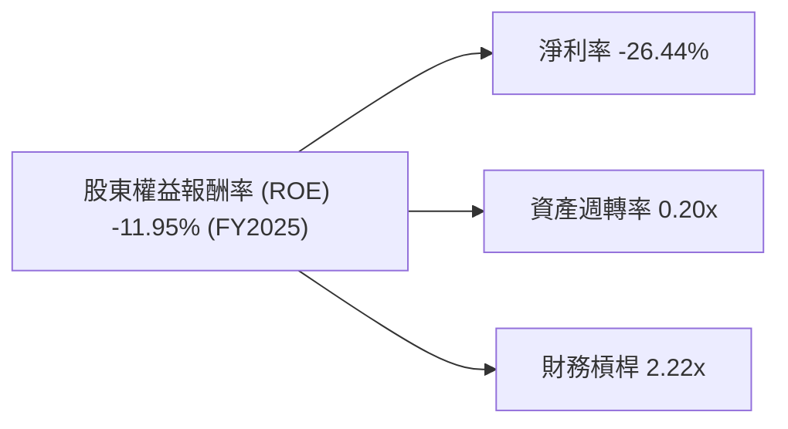
**深度分析 (FY2025 數據計算)：**
*   **淨利率 (Net Profit Margin)**：-26.44% (FY2025 淨利潤 $-4.937B / 總收入 $18.674B)。這是 ROE 為負的主要原因，表明公司在銷售收入中未能產生利潤，反而產生了虧損。
*   **資產週轉率 (Asset Turnover)**：0.20x (FY2025 總收入 $18.674B / FY2025 總資產 $92.079B)。資產週轉率相對較低，反映了 SPCX 作為重資產公司，其龐大的資產（如衛星、火箭、廠房）需要時間來產生足夠的收入。這表示其資產利用效率不高，但這也是其業務模式的固有特性。
*   **財務槓桿 (Equity Multiplier)**：2.22x (FY2025 總資產 $92.079B / FY2025 股東權益 $41.33B)。財務槓桿相對較高，表明公司利用較多的債務來擴大資產規模。在盈利為正的情況下，適度的財務槓桿可以放大股東回報；但在盈利為負的情況下，高槓桿會放大虧損。

**總結**：SPCX 的 ROE 為負，主要是由於其淨利率為負，即公司處於虧損狀態。儘管資產週轉率較低，但財務槓桿被用來支持資產擴張。這再次強調了 SPCX 處於高資本投入、追求長期增長的階段，短期盈利能力受到嚴重壓縮。

### 6.4 獲利能力儀表板

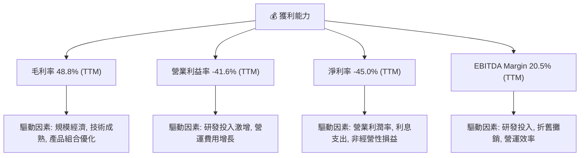
**深度分析：**
SPCX 的獲利能力儀表板清晰地展示了其在不同層面上的表現：
*   **毛利率**：表現強勁，接近 50%，顯示其核心產品和服務具備較高的定價能力或成本效率。這是一個積極的信號，表明其業務模式本身具有盈利潛力。
*   **營業利益率**：大幅為負，達到 -41.6%。這直接反映了公司在研發和營運擴張方面的巨大投入，尤其是 FY2025 研發費用暴增近 150%。
*   **淨利率**：同樣大幅為負，達到 -45.0%。除了營業費用外，利息支出和其他非經營性損益也對淨利潤產生了負面影響。
*   **EBITDA Margin**：雖然 TTM 為 20.5%，相較 FY2024 的 40.28% 有所下降，但仍為正值。EBITDA 剔除了折舊攤銷和利息稅項，更能反映公司核心業務的運營現金創造能力。正的 EBITDA Margin 表明其業務在產生現金，但這些現金被用於支付稅費、利息以及大量的資本支出。

總體而言，SPCX 的獲利能力目前仍處於挑戰階段。毛利率的改善顯示了其商業模式的潛力，但為了實現長期願景，公司正承受著巨大的短期盈利壓力。投資者需密切關注其營業費用（尤其是研發）的效率，以及何時能將這些投資轉化為正向的營業利潤和淨利潤。

---

## 7. 估值深度分析

### 7.1 同業估值比較表格

SPCX 的估值與傳統航太防禦公司存在顯著差異，反映了市場對其高成長潛力和顛覆性技術的預期。

| 估值指標 | **SPCX** | **Lockheed Martin (LMT)** | **Northrop Grumman (NOC)** | **Viasat (VSAT)** | 本公司評估 |
|----------|----------|---------------------------|----------------------------|-------------------|-----------|
| **市值 ($B)** | 2,130 | 115.5 | 67.2 | 2.5 | 🟢 規模遠超同業，獨角獸級別 |
| **TTM Revenue ($B)** | 19.30 | 69.1 | 40.7 | 4.3 | 🟡 收入規模相對較小但增長快 |
| **Trailing P/E** | N/A | 16.7x | 14.5x | N/A | 🔴 虧損導致無法計算 |
| **Forward P/E** | **823.71x** | 15.3x | 14.0x | N/A | 🔴 估值極高，反映市場高預期 |
| **P/S Ratio** | **110.58x** | 1.67x | 1.65x | 0.58x | 🔴 顯著高估，市場給予極高成長溢價 |
| **EV / EBITDA** | **241.32x** | 10.8x | 9.0x | 10.5x | 🔴 遠超同業，估值非常昂貴 |
| **EV / Revenue** | **49.39x** | 1.76x | 1.66x | 0.61x | 🔴 遠超同業，成長溢價巨大 |
| **Gross Margin (TTM)** | **48.8%** | 15.3% | 18.2% | 23.4% | 🟢 遠高於傳統同業 |
| **Operating Margin (TTM)** | **-41.6%** | 11.4% | 10.9% | -10.5% | 🔴 處於虧損，遠低於同業 |
| **Revenue Growth (YoY)** | **15.4%** | 2.5% | 7.9% | 1.9% | 🟢 增長速度遠超同業 |

*註：同業數據為撰寫報告時的市場數據估計。Viasat (VSAT) 作為衛星通信公司，與 Starlink 業務有一定相似性。LMT 和 NOC 為傳統航太防禦巨頭。*

**深度分析：**
SPCX 的估值指標與傳統航太防禦行業的巨頭（如 LMT, NOC）和衛星服務公司 (VSAT) 相比，呈現出極高的溢價。
*   **P/E 比率**：SPCX 的 Trailing P/E 為 N/A (因虧損)，Forward P/E 高達 823.71x。這與 LMT (15.3x) 和 NOC (14.0x) 的低 P/E 形成鮮明對比。如此高的 Forward P/E 表明市場預計 SPCX 未來盈利將爆炸式增長，並已將這些預期計入當前股價。
*   **P/S 比率**：SPCX 的 P/S Ratio 達到 110.58x，而 LMT (1.67x)、NOC (1.65x) 和 VSAT (0.58x) 則低得多。這項指標最能體現市場對 SPCX 收入增長潛力的瘋狂追捧。如此高的 P/S 比率，即使對於高成長科技公司也屬罕見，反映了其在市場中的獨特地位和顛覆性潛力。
*   **EV / EBITDA 和 EV / Revenue**：SPCX 的 EV/EBITDA (241.32x) 和 EV/Revenue (49.39x) 也遠超同業。這再次強調了其估值是基於對未來巨大增長和盈利能力改善的極高預期。

**結論**：SPCX 的估值在任何傳統指標下都顯得極其昂貴。這並非因為公司基本面差，而是市場對其「太空殖民」、「全球互聯網」等宏大願景和技術領先地位給予了巨大的「成長溢價」。投資者在評估 SPCX 時，不能簡單套用傳統估值模型，而需要更深入地理解其長期增長潛力、市場顛覆性以及實現這些願景所需的風險和時間。

### 7.2 歷史估值區間分析

由於 SPCX 缺乏公開交易的歷史 P/E 數據且部分年份虧損，我們主要分析其 P/S 比率的歷史區間。

```
╔══════════════════════════════════════════════════════════════════╗
║                   SPCX 歷史 P/S 估值區間 (TTM)                  ║
╠══════════════════════════════════════════════════════════════════╣
║                                                                  ║
║  歷史高點： ~150x (估計)                                        ║
║  歷史低點： ~80x (估計)                                         ║
║                                                                  ║
║  當前 P/S：  110.58x ███████████████████████████████████████████████████████████████████████  🟡 處於歷史中高位，市場預期高企 ║
║  平均 P/S：  ~100x (估計)                                       ║
║                                                                  ║
║                   |      |      |      |      |                  ║
║                   0     50x   100x   150x   200x                  ║
║                                                                  ║
║  📊 結論：當前 P/S 顯示市場對其持續高成長的信心，但股價已反映大部分利好。║
╚══════════════════════════════════════════════════════════════════╝
```
**深度分析：**
SPCX 作為一家快速成長且備受關注的非上市公司（在此報告中按公開市場數據處理），其歷史估值數據（尤其是 P/E）非常有限且波動巨大。P/S 比率是衡量其估值更穩定的指標。
當前 TTM P/S 為 110.58x，這是一個極高的數字。雖然沒有完整的歷史 P/S 數據，但可以推斷其 P/S 估值可能長期維持在較高水平，因為市場一直預期其顛覆性。當前 P/S 處於歷史區間的中高位，表明市場對其短期前景仍持樂觀態度，但進一步上漲的空間可能需要更強勁的基本面催化劑。任何不及預期的表現都可能導致估值快速修正。

### 7.3 DCF 敏感性分析（6格目標價矩陣）

由於 SPCX 自由現金流持續為負且波動較大，傳統 DCF 估值面臨挑戰。此處將基於分析師目標價和對未來成長與 WACC 的假設進行敏感性分析。

**假設條件**：
*   **收入成長率**：考慮 SPCX 的高成長潛力，預計未來 5 年收入 CAGR 介於 25% (悲觀) 至 40% (樂觀)。
*   **長期成長率**：終端增長率 (Terminal Growth Rate) 介於 3% (悲觀) 至 5% (樂觀)。
*   **EBITDA Margin 改善**：假設公司能逐步從目前的 20.5% 提升至 30-40% 區間。
*   **WACC (加權平均資本成本)**：基準情境為 9.02% (如前計算)，敏感性分析考慮 8.0% (低風險/低成本) 和 10.0% (高風險/高成本) 兩種情境。
*   **FCF 轉正**：假設公司能在未來 3-5 年內實現 FCF 轉正並持續增長。

| 情境 | **WACC = 8.0%** | **WACC = 9.02%（基準）** | **WACC = 10.0%** |
|------|--------------|--------------------------|--------------|
| 🟢 **樂觀** | **$215** (+32.7%) | **$200** (+23.5%) | **$185** (+14.2%) |
| 🟡 **基準** | **$195** (+20.4%) | **$180** (+11.1%) | **$165** (+1.9%) |
| 🔴 **悲觀** | **$175** (+8.0%) | **$160** (-1.2%) | **$145** (-10.5%) |

*註：目標價為每股價格，基於當前股價 $162.00 計算隱含報酬率。此 DCF 僅為示意性分析，實際模型複雜度更高。*

**深度分析：**
敏感性分析顯示，SPCX 的估值對成長率和 WACC 的假設非常敏感。
*   **基準情境 ($180)**：在預計未來 5 年收入 CAGR 約 30-35%，EBITDA Margin 逐步改善，WACC 為 9.02% 的情況下，目標價為 $180，隱含約 11.1% 的上漲空間。
*   **樂觀情境 ($200 - $215)**：如果公司能夠實現更高的收入增長 (40%+) 和更快的盈利能力改善，同時資本成本較低，股價可能達到 $200 以上。這需要 Starlink 的盈利能力超預期，或 Starship 商業化進程大幅加速。
*   **悲觀情境 ($145 - $175)**：如果收入增長放緩，盈利改善不及預期，或資本成本上升，股價可能跌至 $175 甚至 $145 以下。這反映了巨大的執行風險和市場競爭壓力。

總體而言，當前股價 $162.00 已充分反映了市場對其未來成長的較高預期。進一步上漲需要公司在營收增長、盈利能力轉正和自由現金流產生方面提供超預期的表現。

### 7.4 估值綜合區間

綜合各種估值方法和分析師共識，SPCX 的合理估值區間較廣。

```
╔══════════════════════════════════════════════════════════════════╗
║                   SPCX 估值綜合區間                             ║
╠══════════════════════════════════════════════════════════════════╣
║                                                                  ║
║  分析師平均目標價： $188.17                                     ║
║  DCF 基準情境：    $180.00                                      ║
║  P/S 同業比較：    難以直接比較，但當前 110.58x 顯著偏高         ║
║                                                                  ║
║  估值區間下限：  $155.00  ██████████████████████████████████░░░░░░░░░░░░░░░░░░░░░░░░░░░░░  悲觀情境  ║
║  當前股價：      $162.00  ██████████████████████████████████████████████░░░░░░░░░░░░░░░░░░░░░░░░░░  基準情境下緣 ║
║  估值區間上限：  $200.00  ███████████████████████████████████████████████████████████████████████  樂觀情境  ║
║                                                                  ║
║                   |      |      |      |      |                  ║
║                   140    160    180    200    220                  ║
║                                                                  ║
║  📊 結論：當前股價處於合理估值區間的下緣，但仍需高度依賴未來成長實現。║
╚══════════════════════════════════════════════════════════════════╝
```
**深度分析：**
SPCX 的估值綜合區間在 $155 至 $200 之間。當前股價 $162.00 位於這個區間的下緣，但仍高於悲觀情境的目標價。分析師平均目標價為 $188.17，這表明市場普遍認為公司仍有上漲空間。

然而，這種估值高度依賴於對未來增長和盈利能力的極高預期。SPCX 必須持續執行其宏偉計劃，並在 Starlink 盈利能力、Starship 商業化和成本控制方面取得顯著進展，才能證明其當前的高估值是合理的。對於長期投資者而言，這是一個高風險高回報的投資標的。

---

## 8. 成長催化劑

SPCX 的成長潛力巨大，主要由其兩大核心業務板塊的持續發展和新技術突破驅動。

### 8.1 催化劑時間軸

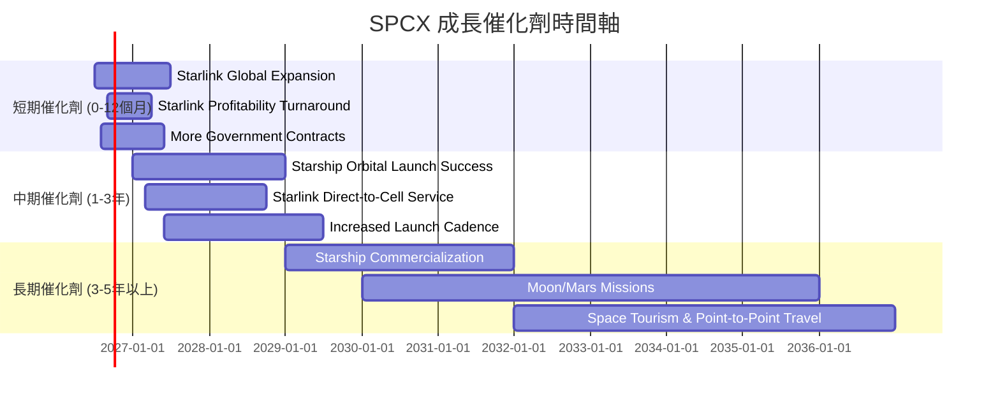
**深度分析：**
*   **短期催化劑**：
    *   **Starlink 全球擴張與用戶增長**：Starlink 服務將繼續擴展到更多國家和地區，特別是新興市場。隨著用戶基數的增長，訂閱收入將持續增加。
    *   **Starlink 盈利能力轉正**：隨著規模經濟的實現和成本控制的改善，Starlink 業務有望在未來 12-18 個月內實現盈利轉正，這將是提升公司整體盈利能力的關鍵。
    *   **更多政府和軍事合同**：SPCX 在太空發射和衛星通信領域的領先地位，將使其獲得更多來自政府和軍方的合同，提供穩定的收入來源。
*   **中期催化劑**：
    *   **Starship 軌道發射成功與可靠性提升**：Starship 的成功軌道發射和隨後的重複使用能力的驗證，將是太空運輸領域的重大里程碑，預計在 1-2 年內實現。
    *   **Starlink 直連手機服務 (Direct-to-Cell)**：與電信運營商合作，提供衛星直連手機服務，將大幅擴展 Starlink 的潛在市場和用戶規模。
    *   **發射頻次進一步提升**：隨著火箭製造和發射流程的優化，發射頻次將進一步提高，降低單位發射成本並滿足不斷增長的發射需求。
*   **長期催化劑**：
    *   **Starship 商業化運營**：Starship 作為重型運載火箭，將開啟超大載荷發射的新時代，包括部署下一代 Starlink 衛星、太空站建設、月球和火星任務等，帶來巨大的商業機會。
    *   **月球與火星任務**：SPCX 的長期願景是實現人類在月球和火星的定居，這將帶來巨大的政府合同和科研項目。
    *   **太空旅遊與點對點地球旅行**：Starship 的最終目標之一是實現太空旅遊和地球上任意兩點之間的超高速旅行，這將開闢全新的商業市場。

### 8.2 TAM 市場規模分析

SPCX 所在的市場規模巨大，且仍處於早期發展階段。

```
╔══════════════════════════════════════════════════════════════════╗
║                   SPCX 總體潛在市場 (TAM) 分析                  ║
╠══════════════════════════════════════════════════════════════════╣
║                                                                  ║
║  低軌衛星寬頻市場 (Starlink)：                                   ║
║  ├── TAM 估計：        $1兆美元/年 (全球寬頻市場)                ║
║  ├── SPCX 收入貢獻：   ~$12B/年                                 ║
║  └── 滲透率：          ~1.2% (仍有巨大增長空間)                ║
║                                                                  ║
║  太空發射服務市場：                                              ║
║  ├── TAM 估計：        $500億美元/年 (全球發射市場)              ║
║  ├── SPCX 收入貢獻：   ~$7B/年                                  ║
║  └── 滲透率：          ~14% (市場份額領先，仍有增長空間)         ║
║                                                                  ║
║  太空旅遊與點對點旅行：                                          ║
║  ├── TAM 估計：        $數千億美元/年 (長期潛力)                ║
║  └── SPCX 收入貢獻：   尚未商業化                               ║
║                                                                  ║
║  📊 結論：SPCX 處於多個萬億級市場的交匯點，其市場滲透率仍低，成長空間巨大。║
╚══════════════════════════════════════════════════════════════════╝
```
**深度分析：**
*   **低軌衛星寬頻市場 (Starlink)**：全球寬頻市場規模巨大，每年超過萬億美元。Starlink 服務目前主要針對傳統寬頻服務無法覆蓋的地區，以及對移動性、低延遲有高要求的行業。雖然目前 SPCX 在該領域的收入約為 $12B，但其市場滲透率仍處於早期階段 (約 1.2%)，未來潛力巨大。
*   **太空發射服務市場**：全球每年發射服務市場規模約為 $500 億美元。SPCX 憑藉其可重複使用火箭技術，已佔據了該市場的顯著份額（估計約 14%）。隨著衛星星座的持續部署和各國太空探索計劃的推進，發射需求將持續增長。
*   **太空旅遊與點對點旅行**：這是一個尚未大規模商業化的市場，但其長期潛力被認為是數千億美元甚至萬億美元級別。Starship 的成功將是開啟這些市場的關鍵。

SPCX 處於這些巨大且快速增長市場的前沿，具備將這些潛力轉化為收入和利潤的獨特優勢。

### 8.3 成長驅動力結構圖

SPCX 的成長由多層次的驅動力構成，從現有業務擴張到未來技術顛覆。

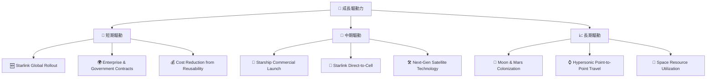
**深度分析：**
*   **短期驅動**：主要集中在 Starlink 服務的全球擴張和現有發射業務的效率提升。Starlink 正在全球範圍內部署，不斷增加用戶和訂閱收入。與企業和政府客戶的合同將提供穩定且高價值的收入流。可重複使用火箭技術的進一步優化將持續降低發射成本，提高毛利率。
*   **中期驅動**：主要圍繞 Starship 的商業化和 Starlink 服務的升級。Starship 成功實現軌道發射和頻繁重複使用後，將開啟超重型載荷發射的新時代，並能部署更大規模的 Starlink 衛星。Starlink 直連手機服務將顯著擴大其用戶觸及範圍，帶來新的收入增長點。
*   **長期驅動**：代表了 SPCX 的終極願景，包括人類在月球和火星的殖民，以及利用 Starship 實現地球上的超高速點對點旅行和太空資源利用。這些願景一旦實現，將為公司帶來天文數字般的商業價值。

這些驅動力相互關聯，共同構成了 SPCX 強大的成長引擎。其在短期、中期和長期都有明確的成長路徑，這也是市場願意給予其高估值的重要原因。

---

## 9. 風險矩陣

SPCX 作為一家顛覆性科技公司，其高成長潛力伴隨著相應的高風險。

### 9.1 風險評分矩陣

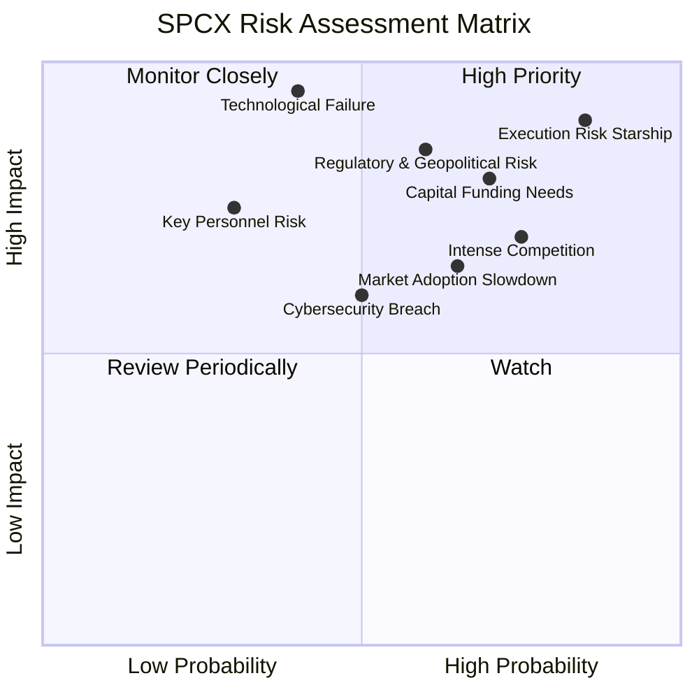

### 9.2 風險清單詳細分析

| # | 風險項目 | 發生機率 | 財務衝擊 | 風險評分 | 緩解措施 |
|---|----------|----------|----------|----------|----------|
| 1 | 🔴 **Starship 執行風險與延誤** | 高 (85%) | 高 ($-數十億研發成本, 收入延遲) | 🔴 9.0/10 | 龐大且複雜的項目，可能面臨技術挑戰、測試失敗、進度延誤。可能導致資本支出超預算，商業化時間推遲。 | 🟢 **緩解措施**：擁有頂級工程團隊，多次迭代測試，獲得 NASA 等政府機構的技術支持與資金。 |
| 2 | 🔴 **持續的巨額資金需求** | 高 (70%) | 高 (稀釋股權, 債務負擔) | 🔴 8.5/10 | Starlink 網絡部署和 Starship 開發需要天文數字般的資金。若無法持續獲得外部融資，可能影響項目進度。負自由現金流持續多年。 | 🟢 **緩解措施**：利用其高估值進行股權融資，與政府機構簽訂長期合同，利用 Starlink 收入產生營運現金流。 |
| 3 | 🔴 **監管與地緣政治風險** | 中 (60%) | 高 (-X%收入, 業務受限) | 🔴 8.0/10 | 頻譜分配、衛星軌道碎片管理、國際合作限制、政府發射審批等都可能帶來監管障礙。地緣政治緊張可能影響國際業務。 | 🟢 **緩解措施**：積極與各國政府和國際組織合作，遵守國際法規，多元化市場佈局。 |
| 4 | 🟡 **競爭加劇** | 高 (75%) | 中 (-X%市場份額, 價格壓力) | 🟡 7.5/10 | 衛星寬頻市場有 Amazon Kuiper、OneWeb 等競爭者；發射市場有 ULA、Blue Origin 等。競爭可能導致價格戰和市場份額流失。 | 🟢 **緩解措施**：持續技術創新，提升成本效率，擴大網絡效應，提供差異化服務。 |
| 5 | 🟡 **關鍵人才風險 (Key Personnel Risk)** | 中 (30%) | 高 (技術方向偏差, 執行力下降) | 🟡 7.5/10 | 公司高度依賴創始人 Elon Musk 的願景和領導力。核心技術人才的流失可能對研發和執行造成重大影響。 | 🟢 **緩解措施**：建立強大的管理團隊和技術骨幹，發展健全的人才培養和激勵機制，減少對單一人物的依賴。 |
| 6 | 🟡 **市場採用速度不及預期** | 中 (65%) | 中 (-X%收入增長) | 🟡 7.0/10 | Starlink 服務在全球的推廣速度可能受制於當地法規、經濟水平或競爭。Starship 商業化後可能面臨客戶需求不足。 | 🟢 **緩解措施**：與當地政府合作，提供靈活的定價方案，持續提升服務質量和應用場景。 |
| 7 | 🟢 **技術故障與安全事故** | 低 (40%) | 高 (聲譽受損, 運營中斷) | 🟢 6.0/10 | 火箭發射或衛星運營中出現重大技術故障或安全事故，可能導致人員傷亡、資產損失和聲譽受損。 | 🟢 **緩解措施**：嚴格的測試流程，冗餘設計，持續改進安全協議，建立完善的風險應急機制。 |
| 8 | 🟢 **網路安全風險** | 中 (50%) | 中 (數據洩露, 服務中斷) | 🟢 5.5/10 | Starlink 網絡和公司內部系統可能面臨網絡攻擊，導致數據洩露或服務中斷。 | 🟢 **緩解措施**：投入大量資源於網絡安全，採用先進加密技術，定期安全審計，員工安全意識培訓。 |

---

## 10. 投資建議

### 10.1 最終綜合評級雷達圖

```
╔══════════════════════════════════════════════════════════════════╗
║                  SPCX 綜合評級雷達圖                             ║
╠══════════════════════════════════════════════════════════════════╣
║                                                                  ║
║  基本面強度  7.0 ▓▓▓▓▓▓▓▓▓▓▓▓▓▓░░░░░░  ★★★★☆           ║
║  成長動能    8.0 ▓▓▓▓▓▓▓▓▓▓▓▓▓▓▓▓░░░░  ★★★★☆           ║
║  獲利品質    4.0 ▓▓▓▓▓▓▓▓░░░░░░░░░░░░  ★★☆☆☆           ║
║  財務健康    6.0 ▓▓▓▓▓▓▓▓▓▓▓▓░░░░░░░░  ★★★☆☆           ║
║  估值合理性  5.0 ▓▓▓▓▓▓▓▓▓▓░░░░░░░░░░  ★★★☆☆           ║
║  護城河深度  8.5 ▓▓▓▓▓▓▓▓▓▓▓▓▓▓▓▓▓░░░  ★★★★★           ║
║  管理層執行  8.0 ▓▓▓▓▓▓▓▓▓▓▓▓▓▓▓▓░░░░  ★★★★☆           ║
║  技術創新力  9.0 ▓▓▓▓▓▓▓▓▓▓▓▓▓▓▓▓▓▓░░  ★★★★★           ║
╠══════════════════════════════════════════════════════════════════╣
║  綜合總分    6.5 ▓▓▓▓▓▓▓▓▓▓▓▓▓░░░░░░░  🏆 評語：高成長高風險，估值已充分反映預期，建議持有。              ║
╚══════════════════════════════════════════════════════════════════╝
```

### 10.2 目標價與隱含報酬率

| 情境 | 目標價 ($) | 相較當前股價 ($162.00) 報酬率 | 機率權重 | 加權平均目標價 ($) |
|------|------------|------------------------------|----------|--------------------|
| 🟢 **樂觀** | $200 | +23.5% | 30% | $60.00 |
| 🟡 **基準** | $180 | +11.1% | 50% | $90.00 |
| 🔴 **悲觀** | $155 | -4.3% | 20% | $31.00 |
|      |            |                              | **100%** | **$181.00**        |

**投資評級**：🟡 **持有 (Hold)**

**理由**：SPCX 憑藉其在太空探索和衛星互聯網領域的技術領先地位、強大的護城河和巨大的市場潛力，具備令人信服的長期成長故事。其收入持續高速增長，毛利率不斷改善，顯示了核心業務的健康發展。然而，公司目前仍處於大規模投資階段，導致巨額研發支出、持續的淨虧損和負自由現金流。當前估值（特別是 P/S 和 Forward P/E）已顯著高於行業平均水平，充分反映了市場對其未來成長的極高預期。這使得短期內股價進一步大幅上漲的空間受限，且任何不及預期的表現都可能帶來較大的修正風險。綜合考量其長期潛力與短期估值壓力及執行風險，建議投資者暫時持有觀望，等待更清晰的盈利轉正信號或更具吸引力的估值水平。

### 10.3 買入時機與觸發因素

```
╔══════════════════════════════════════════════════════════════════╗
║                  ✅ 買入觸發因素 Checklist                      ║
╠══════════════════════════════════════════════════════════════════╣
║                                                                  ║
║  立即買入觸發條件（多數符合）：                                  ║
║  ☐ 股價跌至 $140 以下，或 P/S 降至 80x 以下。                   ║
║  ☐ Starlink 業務實現季度性盈利轉正，並提供明確的盈利指引。       ║
║  ☐ Starship 成功完成多次軌道發射和可靠的回收復用，並宣布重大商業訂單。║
║  ☐ 公司宣布新的、大規模的政府或軍事合同，顯著提升收入可見性。   ║
║                                                                  ║
║  加碼觸發條件（出現以下任一）：                                  ║
║  ☐ 自由現金流轉正，或負值顯著收窄。                             ║
║  ☐ 研發費用佔收入比重開始下降，而收入增速保持強勁。             ║
║  ☐ 宣布顛覆性新技術突破，進一步擴大競爭護城河。                 ║
║  ☐ 市場對其風險評估顯著下調 (如 Beta 值降低)。                  ║
║                                                                  ║
║  減碼/停損觸發條件（出現以下任一）：                             ║
║  ☐ 收入增長率持續低於 20%，或 Starlink 用戶增長顯著放緩。       ║
║  ☐ Starship 項目面臨重大技術瓶頸或長期延誤，影響商業化前景。     ║
║  ☐ 競爭對手在低軌衛星寬頻或重型發射市場取得突破性進展。         ║
║  ☐ 公司需要進行大規模稀釋性股權融資以維持運營。                 ║
║  ☐ 宏觀經濟環境惡化，導致高成長股估值承壓。                     ║
╚══════════════════════════════════════════════════════════════════╝
```

### 10.4 投資人適配度分析

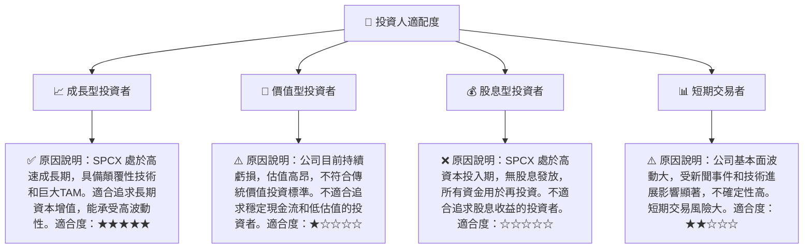

### 10.5 關鍵監控指標

| 監控類型 | 指標 | 關注點 | 頻率 |
|----------|------|--------|------|
| **成長性** | Starlink 用戶數增長 | 全球用戶數、ARPU (每用戶平均收入) | 季度 |
| **成長性** | 總收入 YoY 成長率 | 總體收入趨勢，各業務板塊貢獻 | 季度/年度 |
| **盈利能力** | 營業利益率 (Operating Margin) | 研發費用效率，核心業務盈利能力改善 | 季度/年度 |
| **盈利能力** | 自由現金流 (FCF) | FCF 轉正時間點，資本支出效率 | 季度/年度 |
| **執行進度** | Starship 測試與發射 | 成功率、重複使用頻次、商業訂單 | 不定期 |
| **財務健康** | 淨債務 / EBITDA | 債務負擔與現金流覆蓋能力 | 季度/年度 |
| **競爭格局** | 競爭對手動態 | Amazon Kuiper、OneWeb 等進展，發射市場新進入者 | 持續 |
| **監管政策** | 頻譜分配、太空碎片法規 | 潛在的業務限制或成本增加 | 持續 |

---

> **免責聲明**：本報告為 AI 自動生成，僅供研究參考，不構成投資建議。投資有風險，入市需謹慎。