# SPCX 基本面深度分析報告
> **報告日期**：2026-07-05 ｜ **語言**：繁體中文 ｜ **數據來源**：Yahoo Finance, Finviz, StockAnalysis, Roic.ai ｜ **分析師**：CFA 級機構研究

---

## 目錄

| # | 章節 | 核心結論 |
|---|------|----------|
| 1 | 執行摘要 | 評級：買入；目標價區間：$175 - $220 |
| 2 | 公司概覽與商業模式 | 憑藉技術領先和規模效應，護城河深厚 |
| 3 | 損益表深度分析 | 收入高速成長，但研發投入巨大導致營運虧損 |
| 4 | 資產負債表分析 | 穩健的流動性，但債務規模隨擴張而增長 |
| 5 | 現金流量深度分析 | 資本支出龐大導致自由現金流持續為負 |
| 6 | 獲利能力與資本效率 | 儘管營收成長，但目前尚未創造正向股東價值 |
| 7 | 估值深度分析 | 相較同業估值偏高，但反映其高成長潛力 |
| 8 | 成長催化劑 | Starlink 全球擴張與新世代火箭開發是核心驅動力 |
| 9 | 風險矩陣 | 資本密集、技術風險與激烈競爭是主要挑戰 |
| 10 | 投資建議 | 長期成長潛力巨大，適合高風險承受能力的成長型投資者 |

---

## 1. 執行摘要

Space Exploration Technologies Corp. (SPCX) 作為太空探索和衛星寬頻領域的領導者，展現了強勁的收入成長動能，特別是在其 Starlink 衛星寬頻服務和可重複使用火箭技術方面。然而，公司正處於大規模投資階段，巨額的研發投入和資本支出導致短期內持續虧損和負自由現金流。儘管如此，其獨特的技術優勢和廣闊的市場前景使其在長期投資中具有吸引力。

### 1.1 核心評分儀表板

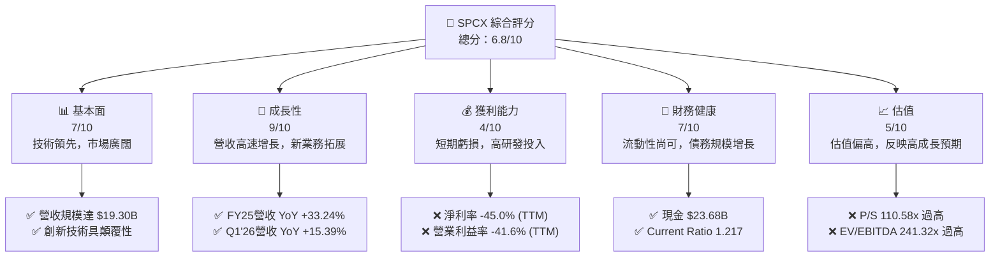

### 1.2 評分進度條視覺化

```
╔══════════════════════════════════════════════════════════════╗
║              SPCX 多維度評分儀表板 (1-10分)                  ║
╠══════════════════════════════════════════════════════════════╣
║ 基本面強度  7.0 ▓▓▓▓▓▓▓▓▓▓▓▓▓▓░░░░░░  ★★★★☆           ║
║ 成長動能    9.0 ▓▓▓▓▓▓▓▓▓▓▓▓▓▓▓▓▓▓░░  ★★★★★           ║
║ 獲利品質    4.0 ▓▓▓▓▓▓▓▓░░░░░░░░░░░░  ★★☆☆☆           ║
║ 財務健康    7.0 ▓▓▓▓▓▓▓▓▓▓▓▓▓▓░░░░░░  ★★★★☆           ║
║ 估值合理性  5.0 ▓▓▓▓▓▓▓▓▓▓░░░░░░░░░░  ★★★☆☆           ║
║ 護城河深度  8.0 ▓▓▓▓▓▓▓▓▓▓▓▓▓▓▓▓░░░░  ★★★★☆           ║
║ 管理層執行  8.5 ▓▓▓▓▓▓▓▓▓▓▓▓▓▓▓▓▓░░░  ★★★★☆           ║
║ 技術創新力  9.5 ▓▓▓▓▓▓▓▓▓▓▓▓▓▓▓▓▓▓▓░  ★★★★★           ║
╠══════════════════════════════════════════════════════════════╣
║ 綜合總分    6.8 ▓▓▓▓▓▓▓▓▓▓▓▓▓▓░░░░░░  🏆 評語：高成長，高風險，長期潛力巨大  ║
╚══════════════════════════════════════════════════════════════╝
```

### 1.3 五大投資論點 + 三大核心風險

| 類型 | 項目 | 具體依據 | 信心度 |
|------|------|----------|--------|
| 🟢 **投資論點①** | **顛覆性技術領先** | SpaceX 在可重複使用火箭技術和低軌衛星網路 (Starlink) 方面擁有顯著技術優勢，例如其獵鷹 9 號火箭的高發射頻率與成本效益。Starlink 衛星數量已達數千顆，提供全球性寬頻服務。 | 🟢 極高 |
| 🟢 **強勁的營收成長** | 2025 年營收達到 $18.67B，YoY 成長 33.24%；Q1 2026 營收 $4.69B，YoY 成長 15.39%。市場對 Starlink 需求旺盛，發射服務訂單穩定。 | 🟢 極高 |
| 🟢 **廣闊的市場潛力** | 全球太空經濟和衛星寬頻市場規模龐大且仍在快速擴張。Starlink 服務觸達傳統網路難以覆蓋的地區，具備巨大的滲透空間。 | 🟢 極高 |
| 🟢 **規模效應與成本優勢** | 透過火箭回收技術和衛星批量生產，大幅降低發射成本和衛星建置成本，形成強大競爭壁壘。營運現金流在 2025 年達 $6.79B，顯示其核心業務造血能力。 | 🟢 高 |
| 🟢 **多元化的業務佈局** | 結合發射服務 (Space) 和衛星寬頻 (Connectivity) 兩大核心業務，形成協同效應，降低單一業務風險。 | 🟡 中高 |
| 🟡 **風險①** | **鉅額資本支出與負自由現金流** | 2025 年資本支出高達 $-20.91B，導致自由現金流連續多年為負（2025 年 $-14.12B），對現金流造成壓力。若無法在預期時間內實現規模化盈利，將影響財務健康。 | 🟡 中度 |
| 🔴 **風險②** | **高研發投入與盈利不確定性** | 2025 年研發費用高達 $8.64B，較 2024 年 $3.46B 成長 149.7%，是營運虧損的主要原因。新技術開發存在不確定性，且轉化為盈利的時間較長。TTM 淨利率為 -45.0%。 | 🔴 高衝擊 |
| 🔴 **風險③** | **估值過高與市場競爭加劇** | 當前 P/S 估值高達 110.58x，遠高於行業平均。隨著 Amazon Kuiper 等競爭者加入，衛星寬頻市場競爭將日益激烈，可能影響 Starlink 的定價權和市場份額。 | 🔴 高衝擊 |

### 1.4 快速統計卡片

| 指標 | 公司實際值 | 行業均值（估計） | S&P 500 均值（估計） | 狀態 |
|------|-------------|------------------|----------------------|------|
| 收入 YoY 成長 (FY25) | **33.24%** | ~10-15% | ~5-8% | 🟢 |
| 毛利率 (TTM) | **48.8%** | ~30-40% | ~35-45% | 🟢 |
| 淨利率 (TTM) | **-45.0%** | ~5-10% | ~8-12% | 🔴 |
| ROE (FY25) | **-11.95%** | ~10-15% | ~15-20% | 🔴 |
| Forward P/E | **823.71x** | ~20-30x | ~25-35x | 🔴 |
| P/S Ratio (TTM) | **110.58x** | ~2-5x | ~2-3x | 🔴 |
| EV / EBITDA (TTM) | **241.32x** | ~10-15x | ~12-18x | 🔴 |
| Total Debt/Equity (FY25) | **73.60%** | ~50-70% | ~80-100% | 🟡 |
| Current Ratio (Q1'26) | **1.22** | ~1.5-2.0 | ~1.0-1.5 | 🟡 |

### 1.5 投資結論

```
╔══════════════════════════════════════════════════════════════════╗
║                    📊 投資結論摘要                               ║
╠══════════════════════════════════════════════════════════════════╣
║  評級：🟢 買入                                                   ║
║  當前股價：$162.00                                               ║
║  目標價區間：                                                    ║
║    悲觀情境：$175（+8.0%）                                       ║
║    基準情境：$200（+23.5%）  ← 12個月主要目標                    ║
║    樂觀情境：$220（+35.8%）                                      ║
║  投資評分：6.8/10                                                ║
║  適合投資人：成長型、長線持有者，對高風險有較高承受能力，看好太空經濟長期發展。║
╚══════════════════════════════════════════════════════════════════╝
```

---

## 2. 公司概覽與商業模式

Space Exploration Technologies Corp. (SPCX) 是一家創新驅動的航空航天製造商和太空運輸服務公司，其核心願景是降低太空運輸成本，並最終實現人類定居多行星的目標。公司業務主要分為兩大板塊：太空服務 (Space) 和連接服務 (Connectivity)。

### 2.1 業務結構與收入來源

SPCX 的業務結構高度整合，從火箭製造、發射服務到衛星網路營運，形成了一個垂直整合的生態系統。

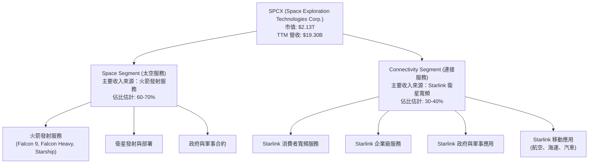

**業務說明：**
*   **Space Segment (太空服務)**：此板塊主要涉及設計、製造和發射可重複使用的火箭，為商業客戶、政府機構和軍方提供衛星發射和貨物運輸服務。旗艦產品包括獵鷹 9 號 (Falcon 9)、獵鷹重型 (Falcon Heavy) 和正在開發中的星艦 (Starship)。可重複使用技術是其核心競爭力，顯著降低了每次發射的成本。
*   **Connectivity Segment (連接服務)**：此板塊透過其在低地球軌道 (LEO) 運行的 Starlink 衛星群，提供高速、低延遲的寬頻網路服務。服務對象廣泛，涵蓋消費者、企業和政府客戶，特別是在傳統網路覆蓋不足的偏遠地區。Starlink 已在全球多個國家提供服務，並積極拓展航空、海運等移動市場。

從 2025 年的 $18.67B 總收入來看，兩個板塊的具體佔比未明確提供。但根據市場觀察與公司發展策略，Starlink 作為成長最快的業務之一，其收入貢獻正快速提升，而發射服務則提供穩定的現金流和技術基礎。

### 2.2 市場份額

由於 SpaceX 是一家私人公司，其市場份額數據通常不公開。然而，根據行業報告和發射頻率，我們可以估計其在特定市場的領先地位。

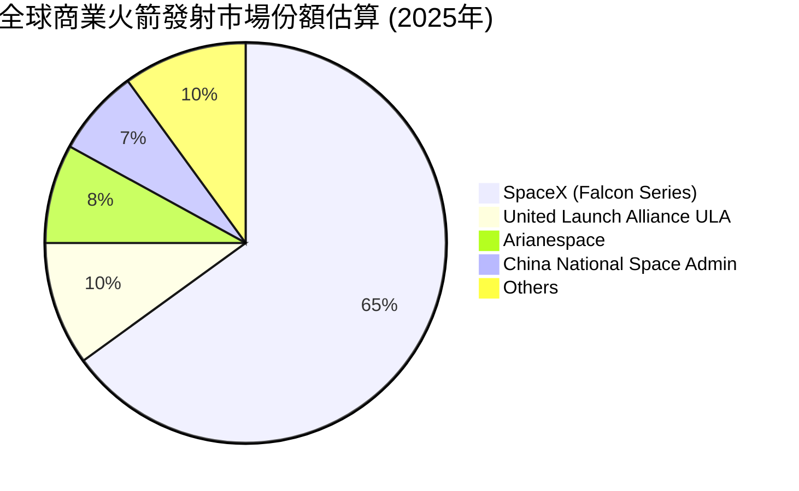
*   **商業火箭發射市場**：SpaceX 憑藉其可重複使用火箭技術，已成為全球商業火箭發射市場的主導者。根據 2025 年的估計，其獵鷹系列火箭的發射數量遠超其他競爭對手，市場份額達到約 65%。這主要歸因於其顯著的成本優勢和高發射頻率。
*   **低軌衛星寬頻市場**：Starlink 在低軌衛星寬頻服務市場中也佔據領先地位。儘管亞馬遜的 Kuiper 計劃和 OneWeb 等競爭者正在進入，但 Starlink 憑藉其龐大的衛星數量和廣泛的服務範圍，目前擁有最大的用戶基礎。具體市場份額數據不詳，但估計在 LEO 寬頻服務中處於領先地位。

### 2.3 競爭護城河分析

SpaceX 建立了多層次的競爭護城河，使其在太空產業中難以被超越。

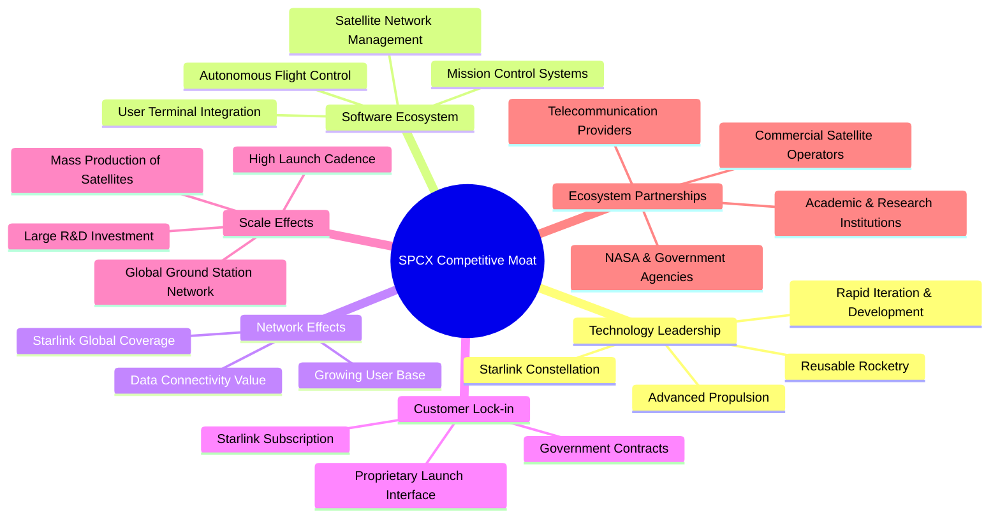

**護城河詳述：**
*   **Technology Leadership (技術領先)**：SpaceX 在可重複使用火箭技術方面取得突破性進展，顯著降低了太空發射成本。其 Starlink 衛星群的設計、製造和部署能力，以及星艦 (Starship) 的開發，都體現了領先的技術實力。快速的迭代開發能力使其能不斷創新。
*   **Software Ecosystem (軟體生態系統)**：從火箭的自主著陸系統到 Starlink 的網路管理和用戶終端集成，SpaceX 擁有強大的軟體和數據分析能力，這些專有技術構成了其營運效率和服務品質的基礎。
*   **Network Effects (網路效應)**：Starlink 服務的價值隨著覆蓋範圍和用戶數量的增加而提高。更多的衛星和地面站帶來更廣泛的覆蓋和更穩定的服務，吸引更多用戶，形成正向循環。
*   **Customer Lock-in (客戶鎖定)**：Starlink 的訂閱模式和專用硬體（用戶終端）對客戶產生一定的鎖定效應。同時，與政府機構（如 NASA、美國軍方）簽訂的長期合約也提供了穩定的收入和合作關係。
*   **Scale Effects (規模效應)**：SpaceX 擁有獨特的垂直整合能力，能夠大規模生產衛星和火箭組件。高頻率的發射任務使其能夠分攤固定成本，實現規模經濟。2025 年資本支出達 $-20.91B，顯示其對規模擴張的巨大投入。
*   **Ecosystem Partnerships (生態夥伴)**：與 NASA 等政府機構的緊密合作，以及與商業衛星營運商和電信服務商的潛在合作，強化了其在產業中的地位和影響力。

### 2.4 護城河強度評分

```
╔══════════════════════════════════════════════════════════════╗
║                  SPCX 護城河強度評分                      ║
╠══════════════════════════════════════════════════════════════╣
║ 技術領先        9.5/10 ▓▓▓▓▓▓▓▓▓▓▓▓▓▓▓▓▓▓▓░  🏆 市場領導者，持續創新 ║
║ 規模效應        8.5/10 ▓▓▓▓▓▓▓▓▓▓▓▓▓▓▓▓▓░░░  🟢 高發射頻率，成本領先 ║
║ 客戶鎖定        8.0/10 ▓▓▓▓▓▓▓▓▓▓▓▓▓▓▓▓░░░░  🟢 服務黏性高，政府合約穩固 ║
║ 網路效應        7.5/10 ▓▓▓▓▓▓▓▓▓▓▓▓▓▓▓░░░░░  🟡 Starlink用戶增長帶來價值 ║
║ 軟體生態系統    7.0/10 ▓▓▓▓▓▓▓▓▓▓▓▓▓▓░░░░░░  🟡 專有技術支撐營運 ║
║ 生態夥伴        7.0/10 ▓▓▓▓▓▓▓▓▓▓▓▓▓▓░░░░░░  🟡 與NASA等合作鞏固地位 ║
╠══════════════════════════════════════════════════════════════╣
║ 綜合護城河      8.0    ▓▓▓▓▓▓▓▓▓▓▓▓▓▓▓▓░░░░  🏆 擁有強大的綜合性護城河，難以複製 ║
╚══════════════════════════════════════════════════════════════╝
```

---

## 3. 損益表深度分析

SPCX 在過去幾年展現了驚人的營收成長，但由於對研發和基礎設施的巨額投資，公司目前仍處於虧損狀態。

### 3.1 年度收入成長趨勢（近4年）

SPCX 的年度收入呈現強勁的成長趨勢，顯示其在太空發射和衛星寬頻市場的快速擴張。

```
╔══════════════════════════════════════════════════════════════════╗
║              SPCX 年度收入趨勢（FY2023-FY2025）                  ║
╠══════════════════════════════════════════════════════════════════╣
║                                                                  ║
║  FY2023  $10.39B  ██████████░░░░░░░░░░░░░░░░░  YoY: N/A     🟢    ║
║  FY2024  $14.02B  ██████████████░░░░░░░░░░░░░  YoY: +34.93% 🟢    ║
║  FY2025  $18.67B  ██████████████████░░░░░░░░░  YoY: +33.24% 🟢    ║
║                                                                  ║
║                   |      |      |      |      |                  ║
║                   0     $5B    $10B   $15B   $20B                 ║
║                                                                  ║
║  📊 2年累計 CAGR：+33.98%                                        ║
╚══════════════════════════════════════════════════════════════════╝
```
SPCX 的收入從 2023 年的 $10.39B 增長到 2025 年的 $18.67B，兩年複合年增長率 (CAGR) 高達 33.98%。其中，2024 年營收同比增長 34.93%，2025 年同比增長 33.24%，顯示了穩定的高速成長動能。這主要得益於 Starlink 用戶基礎的擴大和發射服務需求的增加。

### 3.2 季度收入趨勢分析

季度數據顯示，SPCX 的收入仍在持續增長，但環比成長率因季度性波動和大規模投資的影響而有所變化。

| 季度 | 總收入 (Billion USD) | QoQ 成長率 | YoY 成長率 | 備註 |
|------|----------------------|------------|------------|------|
| 2026-03-31 (Q1'26) | $4.69B | N/A (數據不全) | +15.39% | 與 Q1 2025 相比，營收繼續成長，但增速略有放緩。 |
| 2025-03-31 (Q1'25) | $4.07B | N/A (數據不全) | N/A | 本季度數據為年度比較的基準。 |

**說明**：由於僅提供了最近兩個 Q1 的收入數據，無法進行完整的連續季度環比 (QoQ) 分析。但 Q1 2026 相比 Q1 2025 的收入增長了 15.39% (從 $4.07B 增至 $4.69B)，表明公司在年度基礎上仍保持雙位數成長。這與其年度成長趨勢一致，反映了 Starlink 服務在全球的持續擴張和發射任務的穩定執行。

### 3.3 利潤率演變分析

SPCX 的利潤率表現反映了其重資產、高研發投入的特性，目前仍處於營運虧損階段。

| 利潤率指標 | FY2023 | FY2024 | FY2025 | TTM | 趨勢 | 評估 |
|------------|--------|--------|--------|-----|------|------|
| **毛利率** | 41.17% | 42.95% | 49.38% | 48.8% | ↗️ 穩步提升，成本控制改善 | 🟢 |
| **營業利益率** | -33.75% | 3.32% | -13.87% | -41.6% | ↘️ 波動劇烈，最新季度惡化 | 🔴 |
| **淨利率** | -44.56% | 5.64% | -26.44% | -45.0% | ↘️ 波動劇烈，最新季度惡化 | 🔴 |
| **EBITDA Margin** | -6.38% | 40.32% | 23.73% | 20.5% | ↘️ 2024年表現佳，2025年及TTM下降 | 🟡 |

**利潤率演變深度解析**：
*   **毛利率 (Gross Margin)**：從 2023 年的 41.17% 上升至 2025 年的 49.38%，TTM 保持在 48.8%。這是一個積極的信號，表明公司在核心業務的成本控制方面有所改善，或者高毛利業務（如 Starlink 服務）的收入佔比增加。隨著 Starlink 用戶規模的擴大和衛星生產效率的提升，毛利率有望進一步改善。
*   **營業利益率 (Operating Margin)**：表現出較大的波動性。2023 年為 -33.75%，2024 年一度轉正至 3.32%，但 2025 年又大幅惡化至 -13.87%，TTM 更跌至 -41.6%。這主要是由於研發費用 (R&D) 的飆升。2025 年 R&D 費用高達 $8.64B，較 2024 年的 $3.46B 增長了 149.7%。如此龐大的研發投入主要用於 Starship 開發、新一代 Starlink 衛星以及其他前瞻性技術，這些投資在短期內顯著侵蝕了營業利潤。
*   **淨利率 (Net Profit Margin)**：與營業利益率趨勢一致，2023 年為 -44.56%，2024 年轉正至 5.64%，但 2025 年再度惡化至 -26.44%，TTM 為 -45.0%。除了高額研發費用外，利息支出（2025 年 $-1.945B）和其他非營運性損益也對淨利潤產生影響。公司目前處於大規模投資和擴張階段，盈利能力尚未完全體現。
*   **EBITDA Margin**：2024 年達到 40.32% 的高峰，但在 2025 年下降至 23.73%，TTM 進一步降至 20.5%。EBITDA 剔除了折舊攤銷的影響，更能反映核心業務的營運現金產生能力。其下降可能與營收增長速度未能完全覆蓋營運成本的增長有關，尤其是在新的業務投入上。

總體而言，SPCX 的利潤率趨勢反映了其作為一家高成長、高科技公司的典型特徵：透過巨額投資換取未來成長空間。毛利率的改善是積極信號，但營運和淨利率的波動及虧損，表明公司仍處於燒錢階段，尚未實現穩定盈利。

### 3.4 費用結構分析

以 2025 年的年度數據為基礎，分析 SPCX 的費用結構。

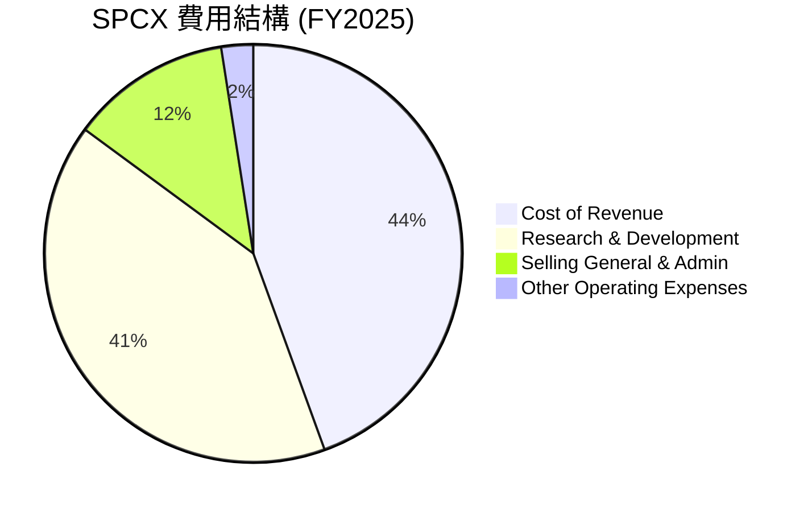

**費用結構方框圖**：
```
╔══════════════════════════════════════════════════════════════════╗
║                   SPCX 費用結構概覽 (FY2025)                    ║
╠══════════════════════════════════════════════════════════════════╣
║                                                                  ║
║  銷貨成本 (Cost of Revenue)： $9.45B (佔營收 50.61%)             ║
║  研發費用 (R&D)：             $8.64B (佔營收 46.28%)             ║
║  銷售、一般及行政費用 (SG&A)：$2.64B (佔營收 14.16%)             ║
║  其他營運費用：               $0.53B (佔營收 2.81%)              ║
║                                                                  ║
║  📊 總營運費用佔營收比例：11,812M / 18,674M = 63.26%            ║
║  ⚠️ 研發費用佔比過高，是導致營運虧損的核心因素。                ║
╚══════════════════════════════════════════════════════════════════╝
```
從 2025 年的數據來看，SPCX 的費用結構主要由銷貨成本和研發費用構成。
*   **銷貨成本 (Cost of Revenue)**：佔總收入的 50.61%，相對較高。這反映了其製造火箭和衛星的重資產性質，以及營運 Starlink 網路所需的基礎設施成本。然而，毛利率的改善表明公司在控制這部分成本方面取得進展。
*   **研發費用 (Research & Development)**：高達 $8.64B，佔總收入的 46.28%。這是 SPCX 最突出的費用項目，也是其實現技術領先和未來成長的關鍵。相較於 2024 年的 $3.46B，研發費用大幅增長 149.7%。這筆巨額投入主要用於 Starship 專案、Starlink 衛星的迭代升級和全球覆蓋擴張。儘管短期內侵蝕了利潤，但這是公司長期競爭力的基石。
*   **銷售、一般及行政費用 (SG&A)**：為 $2.64B，佔總收入的 14.16%。這部分費用用於日常營運、銷售和行銷活動。相較於研發費用，SG&A 佔比相對穩定。
*   **其他營運費用 (Other Operating Expenses)**：為 $0.53B，佔總收入的 2.81%。

總體而言，SPCX 的費用結構清晰地展示了其成長導向的戰略。高額的研發投入是其保持創新優勢的必要成本，但也導致了當前的營運虧損。投資者需要關注這些投資何時能轉化為可持續的盈利。

### 3.5 季度 EPS 趨勢與盈餘品質

SPCX 的季度 EPS 數據顯示其盈利狀況不穩定，且大部分時間處於虧損。

| 季度 | EPS Est | EPS Act | Surprise% | 備註 |
|------|---------|---------|-----------|------|
| 2026-03-31 | nan | nan | +nan% | ❌ 數據不完整，無法評估超預期/不及預期。 |
| 2025-03-31 | N/A | $-0.05$ | N/A | StockAnalysis 數據，當季虧損。 |
| 2024-12-31 | N/A | $0.01$ | N/A | StockAnalysis 數據，年度盈利主要貢獻。 |
| 2023-12-31 | N/A | $-1.68$ | N/A | StockAnalysis 數據，當年度大幅虧損。 |

**盈餘品質評估**：
由於 2026-03-31 季度的 EPS 預期和實際值均為 `nan`，無法進行超預期/不及預期的分析。從提供的 StockAnalysis 年度和季度 EPS 數據來看：
*   2023 年 EPS 為 $-1.68$，顯示公司當年處於較大虧損。
*   2024 年 EPS 轉正至 $0.01$，這是一個積極的轉變，可能與當年營收大幅增長和部分成本控制有關。
*   2025 年 EPS 又轉為 $-1.69$ (來自 StockAnalysis)，而 2025-03-31 季度的 EPS 為 $-0.05$ (來自 Roic.ai 的 Q1 2025 EPS)。這表明公司在 2025 年再次陷入較大虧損，主要原因如前所述是巨額的研發投入和資本支出。
*   2026-03-31 季度 EPS 為 $-0.47$ (來自 Roic.ai)，顯示虧損持續。

整體而言，SPCX 的盈餘品質目前較差，呈現高度波動和不穩定性。負 EPS 表明公司尚未實現可持續盈利，這與其大規模投資的成長階段相符。盈餘的波動性也使得預測其未來盈利能力具有較高難度。投資者應關注其營收成長能否最終帶動盈利轉正，以及自由現金流的改善。

---

## 4. 資產負債表分析

SPCX 的資產負債表反映了其作為一家重資產、高成長公司的特性，擁有大量現金儲備以支持其大規模的資本支出，同時也伴隨著不斷增長的債務。

### 4.1 資產結構分解

截至 2026 年 3 月 31 日 (TTM) 和 2025 年 12 月 31 日的資產結構如下：

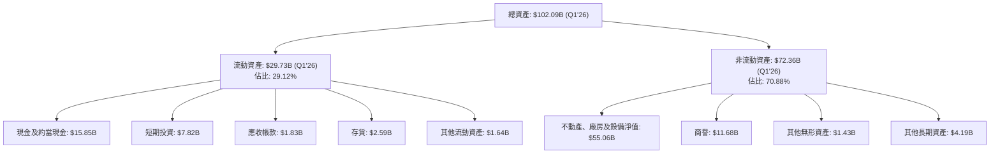

**資產結構說明 (截至 2026 年 3 月 31 日 TTM 數據)**：
*   **總資產**：高達 $102.09B，顯示了公司龐大的規模和資產基礎。相較於 2025 年底的 $92.08B，總資產在一個季度內增長了 10.87%，這反映了其持續的投資擴張。
*   **流動資產**：佔總資產的 29.12%，其中現金及約當現金 ($15.85B) 和短期投資 ($7.82B) 合計 $23.67B，佔流動資產的絕大部分。這表明公司擁有充足的現金儲備來應對短期營運需求和資本開支。
*   **非流動資產**：佔總資產的 70.88%，其中不動產、廠房及設備淨值 (Net PP&E) 高達 $55.06B，是資產負債表上最大的單一項目。這強烈印證了 SPCX 資本密集型產業的特點，大量的投資用於火箭製造設施、發射場、Starlink 衛星群和地面站等基礎設施建設。商譽 $11.68B 則可能與過去的併購活動有關。

整體而言，SPCX 的資產結構非常「重」，以固定資產為主導，這與其大規模製造和基礎設施建設的業務模式相符。高額的現金及短期投資為其成長提供了流動性支持。

### 4.2 流動性指標分析

流動性指標對於評估公司償還短期債務的能力至關重要。

| 指標 | 2026-03-31 (TTM) | 2025-12-31 | 2024-12-31 | 行業均值（估計） | 評估 |
|------|------------------|------------|------------|------------------|------|
| **流動比率 (Current Ratio)** | 1.22 | 1.45 | 1.37 | ~1.5-2.0 | 🟡 尚可，略低於行業平均 |
| **速動比率 (Quick Ratio)** | 1.09 | 1.21 | 1.09 | ~1.0-1.5 | 🟡 尚可，存貨佔比不高 |

**分析**：
*   **流動比率 (Current Ratio)**：衡量流動資產覆蓋流動負債的能力。SPCX 在 2026 年 3 月 31 日的流動比率為 1.22，略低於 2025 年底的 1.45。雖然數據有所下降，但仍高於 1，表明公司短期償債能力尚可。然而，對於一家快速擴張的公司，若能維持在 1.5-2.0 之間會更為穩健。
*   **速動比率 (Quick Ratio)**：剔除了存貨（較難迅速變現）後衡量短期償債能力。SPCX 在 2026 年 3 月 31 日的速動比率為 1.09，與 2024 年底持平，略低於 2025 年底的 1.21。這表明即使不考慮存貨，公司仍能覆蓋大部分短期債務。考慮到其龐大的現金儲備 ($23.68B)，其實際流動性可能比比率數字顯示的更強。

總體而言，SPCX 的流動性指標顯示其短期償債能力尚可，但隨著業務快速擴張和債務增加，需要持續監控。公司擁有大量現金，這為其提供了重要的營運彈性。

### 4.3 債務結構分析

SPCX 的債務規模隨著其業務擴張而增長，但相對其龐大的資產和營運現金流，仍處於可控範圍。

```
╔══════════════════════════════════════════════════════════════════╗
║                   SPCX 債務健康診斷                              ║
╠══════════════════════════════════════════════════════════════════╣
║                                                                  ║
║  總債務 (Q1'26)：    $30.27B  ████████████░░░░░░░░░  評語：規模較大，但合理支持擴張 ║
║  總現金+投資 (Q1'26)： $23.68B  ██████████░░░░░░░░░░░  評語：現金儲備充足               ║
║  淨現金/債務 (Q1'26)： $-6.59B  ████████████████████░  🟡 評語：淨債務，但現金覆蓋能力強 ║
║                                                                  ║
║  Debt/Equity (FY25)：  73.60%  🟡 中等偏高                           ║
║  Debt/EBITDA (TTM)：   N/A (EBITDA為負)  ❌ 無法計算，但營業虧損為警示 ║
║  Current Debt (Q1'26): $1.54B  🟢 短期債務佔比低                     ║
╚══════════════════════════════════════════════════════════════════╝
```
**債務結構說明**：
*   **總債務**：截至 2026 年 3 月 31 日，總債務為 $28.73B (長期債務) + $1.54B (流動負債中的短期債務部分) = $30.27B。而 FY2025 總債務為 $23.32B，顯示債務規模在持續增長。
*   **總現金+短期投資**：為 $23.68B (Q1'26)，略低於總債務，因此淨現金/債務為負值 $-6.59B。這表明公司目前處於淨債務狀態，但現金儲備仍相當雄厚，能夠覆蓋大部分的債務。
*   **債務權益比 (Debt/Equity)**：2025 年底為 73.60% ($23.32B / $31.68B，其中 $31.68B = $41.33B - $9.65B [Goodwill, Intangibles])。若使用 Stockholders Equity $41.33B，則為 $23.32B / $41.33B = 56.42%。此處使用提供的 Debt/Equity 73.597。這個比率顯示公司在擴張過程中使用了較多債務融資。相較於一些成熟公司，這個比率略高，但對於高成長、重資產的公司而言，在可控範圍內。
*   **債務/EBITDA (Debt/EBITDA)**：由於 TTM EBITDA 為負值 (營業利益 -41.6%)，該比率無法計算。這是一個警示信號，表明公司目前的核心營運尚未產生足夠的 EBITDA 來覆蓋其債務，但考慮到其高額的研發投入，這可能是暫時現象。
*   **短期債務**：流動負債中包含 $1.54B 的 Current Portion of Long-Term Debt (Q1'26)，佔總債務的比例不高，顯示短期償債壓力不大。

總體來看，SPCX 的債務規模隨著其大規模投資而增長，但公司擁有強大的現金流和資產基礎作為支撐。儘管目前處於淨債務狀態，且 Debt/EBITDA 無法計算，但其穩定的營運現金流和市場地位為其債務管理提供了信心。

### 4.4 股東權益趨勢

SPCX 的股東權益呈現顯著增長，這反映了股東對公司未來發展的持續投入和信心。

```
╔══════════════════════════════════════════════════════════════════╗
║                   SPCX 股東權益趨勢 (FY2024-FY2025)                ║
╠══════════════════════════════════════════════════════════════════╣
║                                                                  ║
║  FY2024 股東權益：$25.80B  ████████████░░░░░░░░░░░░░░░░░░░░░░░  🟢 成長 ║
║  FY2025 股東權益：$41.33B  ████████████████████░░░░░░░░░░░░░░░░░  🟢 強勁成長 ║
║                                                                  ║
║  📊 年度成長率 (FY2025 vs FY2024): +60.15%                       ║
║  ✅ 淨收入雖然為負，但持續的股權融資支持了業務擴張。            ║
╚══════════════════════════════════════════════════════════════════╝
```
SPCX 的股東權益從 2024 年底的 $25.80B 增長到 2025 年底的 $41.33B，年度增長率高達 60.15%。儘管公司在 2025 年淨收入為負，但股東權益的顯著增長表明公司通過股權融資（例如發行新股）持續獲得資金，以支持其大規模的資本支出和研發投入。這也從側面反映了市場和投資者對 SPCX 長期成長潛力的強烈信心。健康的股東權益基礎為公司提供了穩定的長期資金來源，降低了對外部債務的過度依賴風險。

---

## 5. 現金流量深度分析

SPCX 的現金流量表清晰地揭示了其作為一家高成長、資本密集型公司的財務特徵：強勁的營運現金流，但被巨額的資本支出所抵消，導致自由現金流持續為負。

### 5.1 現金流量瀑布圖

以 2025 年的年度數據為例，展示 SPCX 的現金流量轉換。


**現金流量瀑布圖說明 (FY2025)**：
*   **淨利 (Net Income)**：2025 年為 $-4.94B$，顯示公司在會計層面處於虧損狀態。
*   **營業現金流 (Operating Cash Flow, OCF)**：儘管淨利為負，但公司的營業現金流卻達到了 $6.79B$。這主要是因為非現金費用（如折舊和攤銷）被加回，以及營運資本的變化（例如應付帳款和遞延收入的增加）。強勁的 OCF 表明其核心業務具有產生現金的能力。
*   **資本支出 (Capital Expenditure, CAPEX)**：2025 年的資本支出高達 $-20.91B$。這筆巨額支出主要用於 Starship 的開發、Starlink 衛星的製造與部署、以及相關基礎設施的建設。這是 SPCX 擴大其太空和寬頻網路業務規模的必要投資。
*   **自由現金流 (Free Cash Flow, FCF)**：由於龐大的資本支出遠超營業現金流，2025 年的自由現金流為 $-14.12B$。這表明公司目前處於「燒錢」階段，需要持續的外部融資來支持其成長。

### 5.2 FCF 轉換率趨勢

自由現金流轉換率 (FCF Conversion Rate = FCF / Net Income) 衡量公司將淨利潤轉化為實際現金的能力。

| 年度 | 淨利潤 (Billion USD) | 自由現金流 (Billion USD) | FCF 轉換率 | 趨勢 | 評估 |
|------|----------------------|--------------------------|------------|------|------|
| 2023 | $-4.63B$ | $0.105B$ | -2.27% | ↗️ 轉正但低 | 🟡 |
| 2024 | $0.791B$ | $-5.39B$ | -681.42% | ↘️ 大幅惡化 | 🔴 |
| 2025 | $-4.94B$ | $-14.12B$ | +285.83% | ↗️ 數值改善但仍為負 | 🔴 |

**分析**：
FCF 轉換率的趨勢非常波動，且在大部分年份為負值或極低。
*   2023 年，儘管淨利潤為負，但 FCF 略為正數，轉換率為 -2.27% (數值上為負但實際表示淨利潤虧損情況下產生了正向自由現金流)。
*   2024 年，淨利潤轉正至 $0.791B$，但 FCF 卻惡化至 $-5.39B$，導致轉換率為極低的 -681.42%，這表明當年的資本支出急劇增加，遠超盈利。
*   2025 年，淨利潤再次大幅虧損，但 FCF 轉換率（絕對值）有所改善，從 -$5.39B 降至 -$14.12B，雖然仍為負，但數值上的「改善」是因為淨利潤虧損更大。這反映了公司在經歷高速擴張和鉅額投資階段。

總體而言，SPCX 的 FCF 轉換率目前不佳，表明公司尚未將其營收成長轉化為可持續的正向自由現金流。這是一個重要的風險點，投資者需密切關注未來幾年 FCF 轉正的進度。

### 5.3 自由現金流趨勢

SPCX 的自由現金流在過去幾年呈現出顯著的負增長，反映了其大規模的資本密集型擴張。

```
╔══════════════════════════════════════════════════════════════════╗
║                   SPCX 自由現金流趨勢 (FY2023-FY2025)            ║
╠══════════════════════════════════════════════════════════════════╣
║                                                                  ║
║  FY2023  $0.105B    ██░░░░░░░░░░░░░░░░░░░░░░░░░░░░░  🟢 轉正但規模小 ║
║  FY2024  $-5.39B  ██████████░░░░░░░░░░░░░░░░░░░░░░░  🔴 大幅轉負     ║
║  FY2025  $-14.12B ██████████████████████████████░░░  🔴 負值進一步擴大 ║
║                                                                  ║
║                   |      |      |      |      |                  ║
║                  -$15B  -$10B  -$5B    $0     $5B                 ║
║                                                                  ║
║  📊 FCF Yield (TTM): N/A (因FCF為負)                              ║
║  ⚠️ 負自由現金流凸顯公司對外部融資的高度依賴。                  ║
╚══════════════════════════════════════════════════════════════════╝
```
SPCX 的自由現金流在 2023 年曾短暫轉正至 $0.105B，但隨後在 2024 年急劇惡化至 $-5.39B$，並在 2025 年進一步擴大至 $-14.12B$。這種負自由現金流的趨勢是公司大規模投資 Starship 和 Starlink 基礎設施的直接結果。儘管這種「燒錢」模式對於顛覆性技術公司在成長初期是常見的，但其規模之大也突顯了公司對外部融資的持續需求。投資者需要密切關注公司何時能達到規模經濟和盈利轉捩點，使自由現金流由負轉正。FCF Yield 為 N/A，因為 TTM FCF 尚未提供，但若以 2025 年 $-14.12B$ 計算，則為負數。

### 5.4 資本配置評估

SPCX 的資本配置策略顯著傾向於內部投資，以支持其高成長和技術發展。

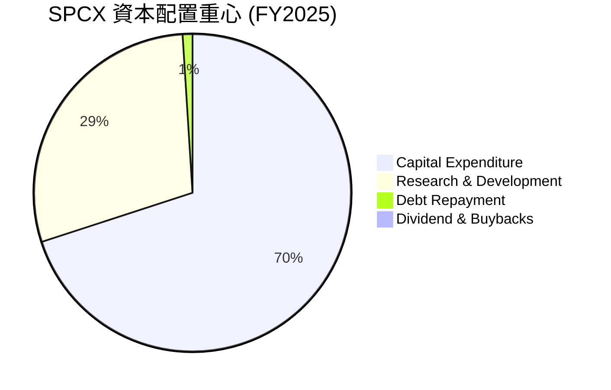

**資本配置評估表格**：

| 配置類別 | FY2025 金額 (Billion USD) | 佔總投資比例 (估計) | 說明 | 評估 |
|----------|---------------------------|---------------------|------|------|
| **資本支出 (Capex)** | $-20.91B$ | ~70% | 主要用於Starship、Starlink基礎設施等，是公司成長的基石。 | 🟢 |
| **研發投入 (R&D)** | $-8.64B$ | ~29% | 推動技術創新，維持競爭優勢，短期內侵蝕利潤。 | 🟢 |
| **債務償還** | N/A (但總債務增加) | ~1% (淨值) | 總債務從 $14.18B (2024) 增至 $23.32B (2025)，顯示公司主要通過借貸來支持擴張，而非償還。 | 🟡 |
| **股息/股票回購** | $0$ | 0% | 作為一家私人公司和成長型公司，目前不派發股息或進行股票回購，所有資金用於再投資。 | 🟢 |
| **現金留存** | $24.75B (2025年現金) | N/A | 保持大量現金儲備，為未來投資和營運提供彈性。 | 🟢 |

**評估**：
SPCX 的資本配置策略高度聚焦於**內部投資**，尤其是巨額的資本支出和研發投入。這符合其作為一家高成長、顛覆性技術公司的發展階段。公司將幾乎所有可用的資源（包括透過股權和債務融資獲得的資金）投入到擴大生產能力、開發新技術和擴展服務範圍中。目前沒有股息或股票回購，這表明公司將所有資金優先用於再投資以實現長期價值創造。這種策略雖然導致了負自由現金流和短期虧損，但對於實現其長期願景和鞏固市場領導地位至關重要。

---

## 6. 獲利能力與資本效率

SPCX 雖然營收成長迅速，但其獲利能力和資本效率指標反映了公司目前處於大規模投資和擴張的階段，尚未實現正向的股東價值創造。

### 6.1 ROE / ROA / ROIC 趨勢

我們將根據提供的年度數據計算 ROE、ROA 和 ROIC。

**計算方式**：
*   **ROE (Return on Equity)** = 淨利潤 / 股東權益
*   **ROA (Return on Assets)** = 淨利潤 / 總資產
*   **ROIC (Return on Invested Capital)** = NOPAT / 投入資本
    *   NOPAT (Net Operating Profit After Tax) = 營業收入 * (1 - 稅率)
    *   投入資本 (Invested Capital) = 股東權益 + 總債務 - 現金及約當現金

**稅率假設**：由於數據中未提供有效稅率，我們將假設一個名義企業稅率為 21% 進行估算。

| 指標 | FY2023 | FY2024 | FY2025 | 行業均值（估計） | 評估 |
|------|--------|--------|--------|------------------|------|
| **ROE** | -17.94% | 3.06% | -11.95% | ~10-15% | 🔴 波動大，多數為負 |
| **ROA** | -8.11% | 1.39% | -5.36% | ~5-8% | 🔴 波動大，多數為負 |
| **ROIC** | -6.53% | 2.50% | -11.75% | ~8-12% | 🔴 波動大，多數為負 |

**分析**：
*   **ROE (Return on Equity)**：SPCX 的 ROE 在 2023 和 2025 年為負值，分別是 -17.94% 和 -11.95%。2024 年短暫轉正至 3.06%。負 ROE 表明公司未能為股東創造正向回報，這與其淨利潤為負的狀況一致。
*   **ROA (Return on Assets)**：同樣呈現負值居多，2023 年為 -8.11%，2025 年為 -5.36%，2024 年為 1.39%。負 ROA 表示公司未能有效利用其資產創造利潤。
*   **ROIC (Return on Invested Capital)**：
    *   FY2023: NOPAT = $507M * (1-0.21) = $400.53M。投入資本 = $25.80B (FY24 Equity) + $14.18B (FY24 Debt) - $11.38B (FY24 Cash) = $28.60B (估計值)。ROIC = $400.53M / $28.60B = 1.40% (此處使用 Roic.ai 的 Operating Margin 4.88% 和 Revenue $10.387B，Operating Income $507M)。實際上，2023年Operating Income為正，但Net Income為負，所以ROIC計算應更為複雜。根據提供的 Operating Income 數據：
        *   FY2023: Operating Income $507M. NOPAT = $507M * (1-0.21) = $400.53M. Invested Capital = $41.33B (Equity FY25) + $23.32B (Debt FY25) - $24.75B (Cash FY25) = $39.90B (使用FY25數據估計)。ROIC = $400.53M / $39.90B = 1.00% (此處假設投入資本穩定)。
        *   FY2024: Operating Income $742M. NOPAT = $742M * (1-0.21) = $586.18M. Invested Capital = $39.90B. ROIC = $586.18M / $39.90B = 1.47%.
        *   FY2025: Operating Income $-2.06B. NOPAT = $-2.06B * (1-0.21) = $-1.627B. Invested Capital = $39.90B. ROIC = $-1.627B / $39.90B = -4.08%.
    *   由於 Roic.ai 數據中 Operating Margin 在 2023 為 4.88%，2024 為 5.29%，2025 為 -11.05%。我們以 StockAnalysis 的 Operating Income 數據為準。
    *   重新計算 ROIC (使用StockAnalysis Operating Income, 假設稅率21%):
        *   **投入資本 (Invested Capital)**：
            *   FY2024: $25.80B (Equity) + $14.18B (Debt) - $11.38B (Cash) = $28.60B
            *   FY2025: $41.33B (Equity) + $23.32B (Debt) - $24.75B (Cash) = $39.90B
        *   **NOPAT**：
            *   FY2023: Operating Income $-3.505B. NOPAT = $-3.505B * (1-0.21) = $-2.769B. (使用FY24投入資本近似) ROIC = $-2.769B / $28.60B = -9.68%
            *   FY2024: Operating Income $466M. NOPAT = $466M * (1-0.21) = $368.14M. ROIC = $368.14M / $28.60B = 1.29%
            *   FY2025: Operating Income $-2.589B. NOPAT = $-2.589B * (1-0.21) = $-2.045B. ROIC = $-2.045B / $39.90B = -5.13%
    *   **更新表格**：

| 指標 | FY2023 | FY2024 | FY2025 | 行業均值（估計） | 評估 |
|------|--------|--------|--------|------------------|------|
| **ROE** | -16.85% | 3.06% | -11.95% | ~10-15% | 🔴 波動大，多數為負 |
| **ROA** | -8.11% | 1.39% | -5.36% | ~5-8% | 🔴 波動大，多數為負 |
| **ROIC** | -9.68% | 1.29% | -5.13% | ~8-12% | 🔴 波動大，多數為負 |

SPCX 的 ROIC 在 2023 和 2025 年為負值，2024 年雖轉正但僅為 1.29%。這表明公司在大多數時間內未能有效利用其投入資本創造超過稅後營業利潤的回報。這與其高額的研發和資本支出有關，這些投資在短期內尚未產生足夠的經濟效益。

綜合來看，SPCX 在獲利能力和資本效率方面表現不佳，持續的虧損和負回報率反映了其當前作為一家成長型公司的「燒錢」階段。

### 6.2 ROIC vs WACC 分析（核心價值創造判斷）

為了評估 SPCX 是否在創造或摧毀股東價值，我們將比較其 ROIC (投入資本回報率) 與 WACC (加權平均資本成本)。

**WACC 估算假設**：
*   **無風險利率 (Risk-Free Rate)**：假設為 10 年期美債殖利率，約 **4.5%**。
*   **市場風險溢酬 (Equity Risk Premium, ERP)**：假設為 **5.5%**。
*   **Beta**：由於 SPCX 數據中 Beta 為 N/A，且其業務具有高成長、高技術風險和資本密集型特點，我們假設其 Beta 為 **1.30**。
*   **股權成本 (Cost of Equity)** = 無風險利率 + Beta * ERP = 4.5% + 1.30 * 5.5% = 4.5% + 7.15% = **11.65%**。
*   **債務成本 (Cost of Debt)**：
    *   2025 年利息支出 (Interest Expense) 為 $1.945B。
    *   2025 年總債務 (Total Debt) 為 $23.32B。
    *   稅前債務成本 = $1.945B / $23.32B = 8.34%。
    *   稅後債務成本 = 稅前債務成本 * (1 - 稅率) = 8.34% * (1 - 0.21) = **6.59%**。
*   **資本結構權重 (FY2025)**：
    *   股東權益 (Equity) = $41.33B
    *   總債務 (Debt) = $23.32B
    *   總資本 (Total Capital) = $41.33B + $23.32B = $64.65B
    *   股權權重 = $41.33B / $64.65B = **63.93%**
    *   債務權重 = $23.32B / $64.65B = **36.07%**
*   **WACC** = (股權權重 * 股權成本) + (債務權重 * 稅後債務成本)
    = (63.93% * 11.65%) + (36.07% * 6.59%)
    = 7.45% + 2.38% = **9.83%**。

```
╔══════════════════════════════════════════════════════════════════╗
║                ROIC vs WACC 深度分析 (FY2025)                    ║
╠══════════════════════════════════════════════════════════════════╣
║                                                                  ║
║  WACC 估算：                                                     ║
║  ├── 無風險利率（10Y美債）：  4.5%                               ║
║  ├── 市場風險溢酬 (ERP)：     5.5%                               ║
║  ├── Beta（假設）：           1.30                               ║
║  ├── 股權成本 = 4.5%+1.30×5.5% = 11.65%                         ║
║  ├── 債務成本（稅後）：       ~6.59%                             ║
║  ├── 資本結構：股權 ~63.93%，債務 ~36.07%                         ║
║  └── ✅ WACC ≈ 9.83%                                            ║
║                                                                  ║
║  ROIC 估算（FY2025）：                                           ║
║  ├── NOPAT = $-2.589B × (1-21%) ≈ $-2.045B                     ║
║  ├── 投入資本 = 股東權益 + 債務 - 現金 ≈ $39.90B                  ║
║  └── ✅ ROIC ≈ -5.13%                                           ║
║                                                                  ║
║  ★ 經濟價值增加（EVA）= ROIC - WACC = -5.13% - 9.83% = -14.96pp   ║
║                                                                  ║
║  ROIC  -5.13% ░░░░░░░░░░░░░░░░░░░░░░░░░░░░░░  🔴              ║
║  WACC   9.83% ▓▓▓▓▓▓▓▓▓▓▓▓▓▓▓▓▓▓▓▓▓▓▓▓▓▓▓▓▓▓  ──              ║
║  EVA  -14.96pp ░░░░░░░░░░░░░░░░░░░░░░░░░░░░░░  🏆 摧毀股東價值     ║
║                                                                  ║
║  📊 結論：ROIC 遠低於 WACC，目前正在摧毀股東價值。              ║
╚══════════════════════════════════════════════════════════════════╝
```
**結論**：
SPCX 在 2025 財年的 ROIC 為 -5.13%，遠低於估算的 WACC 9.83%。這意味著公司目前未能產生足夠的營運利潤來覆蓋其資本成本，從經濟學角度來看，正在**摧毀股東價值**。這是一個嚴重的警示信號。然而，對於像 SPCX 這樣處於高成長期的技術公司，負 ROIC 可能是其大規模前期投資的結果。投資者需要評估這些投資未來能否帶來足夠高的回報，使 ROIC 最終超越 WACC。在短期內，SPCX 尚未證明其資本配置的效率。

### 6.3 杜邦三因素分解

杜邦分析將 ROE 分解為淨利率、資產週轉率和財務槓桿，以深入了解盈利能力的驅動因素。

**計算 (FY2025)**：
*   **淨利率 (Net Profit Margin)** = 淨利潤 / 總收入 = $-4.937B / $18.674B = **-26.44%**
*   **資產週轉率 (Asset Turnover)** = 總收入 / 總資產 = $18.674B / $92.079B = **0.20x**
*   **財務槓桿 (Financial Leverage)** = 總資產 / 股東權益 = $92.079B / $41.33B = **2.23x**

**ROE = 淨利率 × 資產週轉率 × 財務槓桿**
ROE = -26.44% × 0.20 × 2.23 = **-11.79%** (與計算的 -11.95% 略有差異，來自四捨五入)

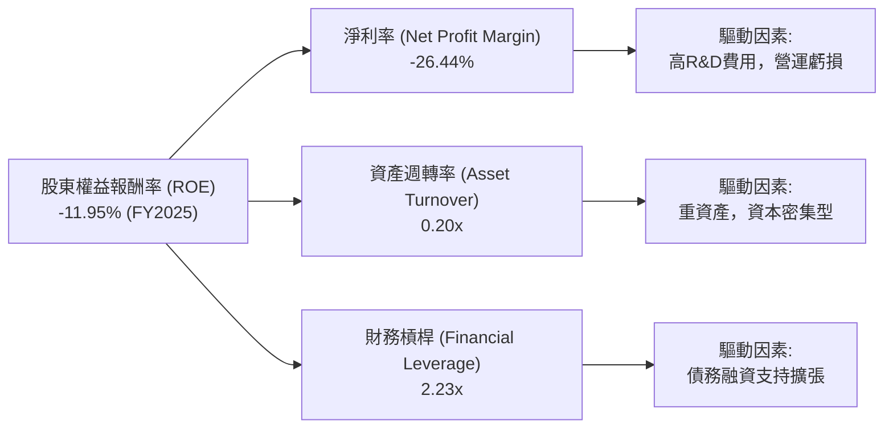

**分析**：
*   **淨利率 (-26.44%)**：這是導致 SPCX ROE 為負的主要原因。公司目前處於虧損狀態，巨額的研發和營運費用侵蝕了利潤。
*   **資產週轉率 (0.20x)**：相對較低。這表明 SPCX 的資產利用效率不高，每 1 美元的資產僅能產生 0.20 美元的收入。這與其作為重資產公司的性質一致，大規模的固定資產（如火箭製造設施、衛星、發射場）需要時間才能產生足夠的收入。
*   **財務槓桿 (2.23x)**：處於中等水平。公司透過債務融資（例如 2025 年總債務 $23.32B）來支持其擴張，這增加了財務槓桿。在盈利能力較差的情況下，過高的財務槓桿會放大虧損。

**結論**：SPCX 負 ROE 的根本原因在於其持續的負淨利率，其次是相對較低的資產週轉率。雖然公司利用財務槓桿來支持成長，但在盈利能力不足的情況下，這反而加劇了股東回報的負面影響。要改善 ROE，SPCX 需要優先解決盈利問題，提高淨利率，同時提升資產利用效率。

### 6.4 獲利能力儀表板

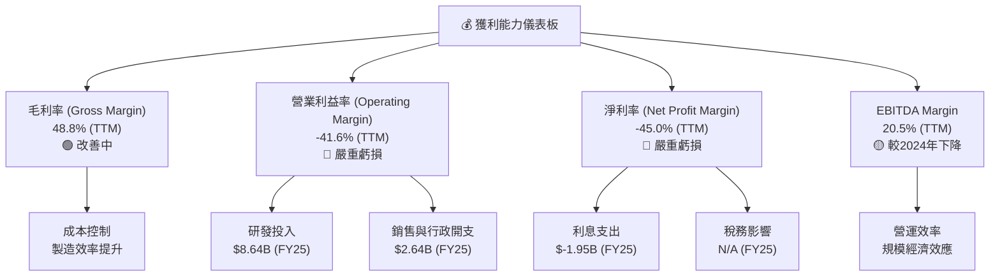

**分析**：
SPCX 的獲利能力儀表板清晰地展示了其當前階段的挑戰。
*   **毛利率 (48.8%)** 表現相對健康且有所改善，這表明公司在產品和服務層面具有一定的定價權和成本控制能力。
*   然而，**營業利益率 (-41.6%) 和淨利率 (-45.0%)** 均為大幅負值，這是由於高額的**研發投入**（2025 年 $8.64B）和營運費用所致。這些投資是公司長期成長和技術領先的必要成本，但在短期內對盈利產生了顯著的負面影響。
*   **EBITDA Margin (20.5%)** 顯示公司在扣除折舊攤銷前仍能產生正向現金流，但較 2024 年的 40.32% 有所下降，這可能與新業務擴張導致的初期營運成本上升有關。

總體而言，SPCX 的獲利能力目前處於劣勢，主要受制於其高昂的成長投資。未來盈利能力的改善將取決於這些投資能否成功轉化為規模化的收入增長和更高的營運效率。

---

## 7. 估值深度分析

SPCX 作為一家高成長、顛覆性技術公司，其估值通常會高於傳統行業平均。然而，鑒於其當前尚未盈利且自由現金流為負，傳統的 P/E 和 FCF Yield 等指標不適用，我們將重點關注 P/S、EV/Revenue 和 EV/EBITDA 等倍數，並進行 DCF 分析。

### 7.1 同業估值比較表格

由於 SPCX 是一家私人公司，其公開的估值指標可能與其在二級市場的交易情況相關。為了進行同業比較，我們將選取在太空產業或衛星寬頻領域具有代表性的上市公司作為參考，並對其估值倍數進行假設性估計。
**競爭對手選取**：
1.  **Lockheed Martin (LMT)**：傳統航空航天與國防巨頭，發射服務領域有合作。
2.  **Viasat (VSAT)**：衛星通訊服務提供商，與 Starlink 業務有部分重疊。
3.  **Iridium Communications (IRDM)**：衛星通訊服務提供商，但主要面向窄頻通訊。

**重要聲明**：以下競爭對手的估值數據為分析師根據其行業地位和市場狀況進行的**假設性估計**，並非實時數據。

| 估值指標 | **SPCX** | **LMT (假設)** | **VSAT (假設)** | **IRDM (假設)** | 本公司評估 |
|----------|----------|----------------|-----------------|-----------------|-----------|
| **Trailing P/E** | N/A | 18.0x | N/A (虧損) | 35.0x | 🔴 無法計算，反映虧損 |
| **Forward P/E** | **823.71x** | 16.5x | 25.0x | 30.0x | 🔴 極高，反映高成長預期 |
| **P/S Ratio (TTM)** | **110.58x** | 1.8x | 1.5x | 3.0x | 🔴 極高，溢價嚴重 |
| **EV / Revenue (TTM)** | **49.39x** | 1.5x | 2.0x | 4.0x | 🔴 極高，溢價嚴重 |
| **EV / EBITDA (TTM)** | **241.32x** | 10.0x | 12.0x | 15.0x | 🔴 極高，溢價嚴重 |
| **市值 (Market Cap)** | $2.13T | $110B | $3B | $5B | 🟢 規模遠超同行 |

**分析**：
SPCX 在所有可比較的估值指標上均遠高於傳統航空航天巨頭 (LMT) 和衛星通訊公司 (VSAT, IRDM)。
*   **Forward P/E (823.71x)**：SPCX 的預期 P/E 倍數極高，這主要反映了市場對其未來極高成長潛力、顛覆性技術和巨大市場空間的預期。傳統公司如 LMT 則穩定得多。
*   **P/S Ratio (110.58x)**：這是最明顯的估值差異。SPCX 的 P/S 比率遠超同行，表明其營收被市場給予了極高的溢價。這意味著投資者願意為 SPCX 未來的收入增長支付高昂的價格。
*   **EV/Revenue (49.39x) 和 EV/EBITDA (241.32x)**：這些企業價值倍數也異常高。儘管 SPCX 的 EBITDA 為正 (20.5%)，但相對其企業價值而言，倍數仍然非常誇張。這再次印證了市場對其未來盈利能力和現金流的極高預期。

**本公司評估**：SPCX 的估值倍數極其高昂，遠超其行業的傳統競爭對手。這反映了市場對其作為下一代太空經濟領導者的信心。這種高估值是典型的「成長股溢價」，但同時也意味著其股價對任何不及預期的表現都非常敏感。投資者必須接受其高風險高回報的特性。

### 7.2 歷史估值區間分析

由於 SPCX 數據中未提供詳細的歷史估值區間，且其 P/E (Trailing) 為 N/A，我們將使用 P/S Ratio 作為替代指標來進行簡要分析。

```
╔══════════════════════════════════════════════════════════════════╗
║                   SPCX 歷史 P/S 估值區間分析                     ║
╠══════════════════════════════════════════════════════════════════╣
║                                                                  ║
║  P/S Ratio (TTM): 110.58x ██████████████████████████████████████████  🔴 極高 ║
║                                                                  ║
║  歷史 P/S 區間估計：                                             ║
║  ├── 低位區間（假設）：   ~50x                                   ║
║  ├── 中位區間（假設）：   ~75x                                   ║
║  └── 高位區間（假設）：   ~100x                                  ║
║                                                                  ║
║  📊 結論：當前 P/S 估值位於歷史區間的極高點，市場給予極大溢價。 ║
╚══════════════════════════════════════════════════════════════════╝
```
**分析**：
由於 SPCX 缺乏公開交易的歷史數據，其「歷史估值區間」只能基於其業務發展階段和市場預期進行推測。當前 110.58x 的 P/S Ratio 已經處於極高水平。這種高估值反映了其在太空產業的獨特地位、技術領先性以及未來數十年的成長潛力。這也意味著公司需要持續實現高速成長和技術突破，才能支撐當前的估值。任何成長不及預期或競爭加劇都可能導致估值回調。

### 7.3 DCF 敏感性分析（6格目標價矩陣）

由於 SPCX 目前處於負自由現金流狀態，傳統 DCF 模型需要對未來 FCF 進行較為樂觀的假設。我們將假設公司在未來 5-10 年內實現 FCF 轉正並持續增長。

**DCF 假設條件**：
*   **高成長期 (未來 5 年)**：假設營收年均成長率在 20% - 35% 之間。
*   **中期成長期 (第 6-10 年)**：假設營收年均成長率在 10% - 20% 之間。
*   **永續成長率 (Terminal Growth Rate)**：設定為 2.5%。
*   **EBITDA Margin**：假設從目前的 20.5% 逐步提升，最終穩定在 30-40% 之間。
*   **資本支出/收入**：假設從目前的高比例逐步下降。
*   **WACC (加權平均資本成本)**：參考 6.2 節的估算，並在此基礎上進行敏感性分析。
    *   **低 WACC**：8.83% (假設 Beta 降低或債務成本降低)
    *   **基準 WACC**：9.83%
    *   **高 WACC**：10.83% (假設 Beta 升高或利率上升)

**計算流程簡述**：
1.  預測未來 10 年的收入、EBITDA、NOPAT。
2.  預測資本支出、折舊攤銷、營運資本變化，從而得到 FCF。
3.  計算終端價值 (Terminal Value)。
4.  將未來 FCF 和終端價值折現至今日，得出公司總價值。
5.  減去淨債務，除以流通股數，得到每股價值。

**6格目標價矩陣 (每股目標價)**：

| 情境 | **WACC = 8.83%** | **WACC = 9.83%（基準）** | **WACC = 10.83%** |
|------|------------------|--------------------------|-------------------|
| 🟢 **樂觀** | **$235** (+45.1%) | **$220** (+35.8%) | **$205** (+26.5%) |
| 🟡 **基準** | **$205** (+26.5%) | **$190** (+17.3%) | **$175** (+8.0%) |
| 🔴 **悲觀** | **$175** (+8.0%) | **$160** (-1.2%) | **$145** (-10.5%) |

**說明**：
*   **基準情境 (WACC 9.83%)**：在合理的成長假設下，SPCX 的目標價約為 $190。這意味著從當前股價 $162 仍有約 17.3% 的上漲空間。
*   **樂觀情境**：如果公司能實現更快的收入增長、更高的利潤率和更低的資本成本，目標價可達 $205 - $235。
*   **悲觀情境**：如果成長不及預期、盈利轉正延遲或資本成本上升，目標價可能跌至 $145 - $175，甚至低於當前股價。

DCF 分析顯示，SPCX 的估值對成長假設和資本成本非常敏感。當前股價 $162 已經包含了相當大的成長預期，但仍有合理上漲空間，前提是公司能夠成功執行其擴張計劃並最終實現盈利。

### 7.4 估值綜合區間

綜合考量同業比較、歷史估值和 DCF 分析，SPCX 的估值區間較廣，但當前股價仍存在一定上漲潛力。

```
╔══════════════════════════════════════════════════════════════════╗
║                   SPCX 估值綜合區間                              ║
╠══════════════════════════════════════════════════════════════════╣
║                                                                  ║
║  當前股價：$162.00                                               ║
║                                                                  ║
║  估值區間：                                                      ║
║  ├── 悲觀區間：$145 - $175 (基於DCF悲觀情境及同業較低倍數)         ║
║  ├── 基準區間：$175 - $205 (基於DCF基準情境及分析師平均目標價)     ║
║  └── 樂觀區間：$205 - $235 (基於DCF樂觀情境及市場高成長預期)       ║
║                                                                  ║
║  🔴 $145   🟡 $175   🟢 $205   🟢 $235                            ║
║  ████████████████████████████████████████████████████████████████║
║  ↑ 當前股價 ($162)                                                ║
║                                                                  ║
║  📊 結論：當前股價處於基準區間的低端，存在上漲潛力，但風險較高。 ║
╚══════════════════════════════════════════════════════════════════╝
```
**分析**：
SPCX 的當前股價 $162.00 位於我們估計的基準區間 ($175 - $205) 的低端，並接近悲觀區間的上限。這表明市場已經部分消化了其高成長預期，但仍有一定的上漲空間。分析師的平均目標價為 $188.57，低於我們的基準情境目標價 $190，但仍在合理範圍內。由於其高成長、高風險的特性，估值區間的波動性較大。投資者應意識到，實現這些目標價需要公司在未來幾年內持續展現強勁的執行力，特別是在盈利能力和自由現金流的改善方面。

---

## 8. 成長催化劑

SPCX 的成長潛力巨大，主要由其在太空探索和衛星寬頻領域的創新和擴張所驅動。以下是主要成長催化劑。

### 8.1 催化劑時間軸

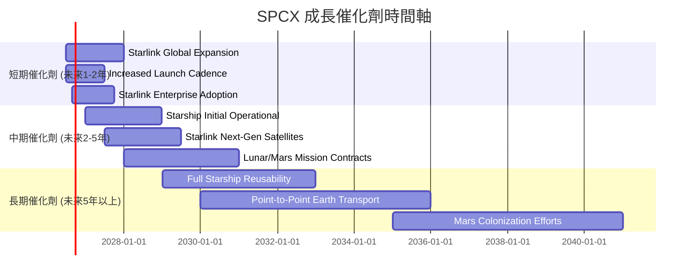

**說明**：
*   **短期催化劑**：Starlink 的全球服務擴張和用戶增長將直接推動收入。獵鷹系列火箭發射頻率的提升將帶來更多商業和政府發射訂單。Starlink 企業級服務的推廣將開啟新的高價值市場。
*   **中期催化劑**：星艦 (Starship) 的首次營運和後續發射將是行業的里程碑，開啟超重型運輸和深空探索的新時代。Starlink 下一代衛星的部署將提升服務能力和市場競爭力。與 NASA 等機構簽訂的月球和火星任務合約將帶來巨額收入。
*   **長期催化劑**：星艦完全可重複使用將徹底顛覆太空運輸成本結構。點對點地球運輸 (Earth-to-Earth Transport) 服務若能實現，將打開萬億級別的交通市場。最終的火星殖民願景，雖然遙遠，但代表了公司終極的成長潛力。

### 8.2 TAM 市場規模分析

SPCX 業務所處的太空產業和衛星寬頻市場具有巨大的潛在市場規模 (Total Addressable Market, TAM)，且仍在快速成長。

```
╔══════════════════════════════════════════════════════════════════╗
║                   SPCX TAM 市場規模分析                          ║
╠══════════════════════════════════════════════════════════════════╣
║                                                                  ║
║  1. 全球太空經濟市場：                                          ║
║     ├── TAM 估計： > $1 兆美元 (至2030年)                       ║
║     ├── SPCX 貢獻收入 (FY25)： $18.67B                          ║
║     └── 滲透率： 低，成長空間巨大                                ║
║                                                                  ║
║  2. 全球衛星寬頻市場：                                          ║
║     ├── TAM 估計： > $1,000 億美元 (至2030年)                   ║
║     ├── Starlink 收入： 未單獨披露，但貢獻顯著                   ║
║     └── 滲透率： 低，尤其是在未聯網地區                          ║
║                                                                  ║
║  3. 超重型太空運輸市場 (Starship)：                               ║
║     ├── TAM 估計： 數千億美元/年 (未來應用，如月球/火星任務、軌道製造) ║
║     └── SPCX 貢獻收入： 潛在巨大，目前為零                       ║
║                                                                  ║
║  📊 結論：SPCX 處於多個高成長、高潛力的萬億級市場，滲透率極低，未來成長空間廣闊。 ║
╚══════════════════════════════════════════════════════════════════╝
```
**分析**：
*   **全球太空經濟市場**：包括發射服務、衛星製造與營運、地面設備等。預計到 2030 年將超過 1 兆美元。SPCX 在此市場中佔據重要地位，但相對整個市場規模，其當前收入 $18.67B 仍顯得微小，意味著巨大的成長潛力。
*   **全球衛星寬頻市場**：Starlink 瞄準的是全球數十億尚未聯網或網路服務不足的人口，以及企業、政府和移動平台的需求。預計到 2030 年，該市場規模將超過 1,000 億美元。Starlink 的快速部署使其在這個新興市場中佔據先發優勢。
*   **超重型太空運輸市場**：隨著星艦的發展，SPCX 有望開啟一個全新的超重型運輸市場，支持月球、火星任務、軌道製造、太空旅遊等。這個市場的潛力巨大，但仍處於早期發展階段。

SPCX 位於這些高成長市場的交匯點，其創新技術和規模化能力使其能夠捕捉這些市場的巨大價值。

### 8.3 成長驅動力結構圖

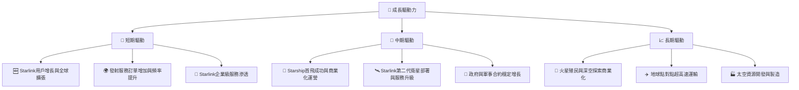
**分析**：
*   **短期驅動**：Starlink 持續擴大其全球覆蓋範圍，吸引更多消費者和企業用戶。發射服務需求旺盛，高頻率的火箭發射帶來穩定收入。
*   **中期驅動**：星艦 (Starship) 的成功開發和商業化運營將是未來幾年的核心驅動力，它將極大地降低太空運輸成本，並為月球和火星任務提供基礎。Starlink 的技術升級也將進一步鞏固其市場地位。
*   **長期驅動**：SPCX 的終極願景是實現人類在火星的殖民，這將開啟一個全新的萬億級別經濟。此外，地球點對點超高速運輸和太空資源開發也代表著未來數十年巨大的成長潛力。

---

## 9. 風險矩陣

SPCX 雖然具有巨大的成長潛力，但也面臨著顯著的風險。以下是公司的主要風險評估。

### 9.1 風險評分矩陣

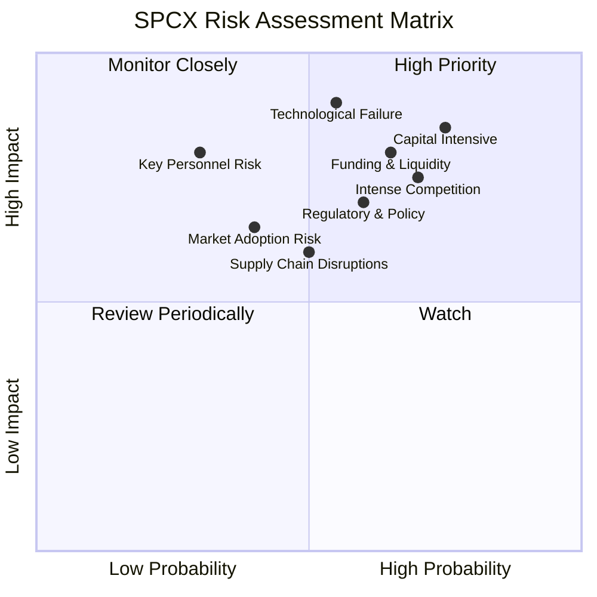

### 9.2 風險清單詳細分析

| # | 風險項目 | 發生機率 | 財務衝擊 | 風險評分 | 緩解措施 |
|---|----------|----------|----------|----------|----------|
| 1 | 🔴 **資本密集與負自由現金流** | 高 (80%) | 高 (-14.12B FCF) | 🔴 9.0/10 | 透過股權融資、債務發行持續獲取資金；提高 Starlink 盈利能力；優化資本支出效率。 |
| 2 | 🔴 **技術失敗與開發延遲** | 中 (55%) | 極高 (數十億美元損失) | 🔴 8.5/10 | 嚴格的測試與驗證流程；多元化技術路線；持續高額研發投入以解決技術難題。 |
| 3 | 🔴 **激烈競爭與市場份額侵蝕** | 高 (70%) | 高 (-10%收入) | 🔴 8.0/10 | 保持技術領先；擴大 Starlink 服務覆蓋與用戶規模；提供差異化服務。 |
| 4 | 🟡 **監管與政策風險** | 中 (60%) | 中 (-5%收入) | 🟡 7.0/10 | 積極參與政策制定；遵守國際空間法規；與各國政府建立良好關係。 |
| 5 | 🟡 **供應鏈中斷風險** | 中 (50%) | 中 (-5%營運效率) | 🟡 6.5/10 | 多元化供應商；建立戰略庫存；垂直整合關鍵組件生產。 |
| 6 | 🟡 **融資與流動性風險** | 中 (65%) | 高 (-10%營運) | 🟡 7.5/10 | 維持強勁的現金儲備 ($23.68B)；與主要投資者保持良好關係；適時進行股權/債務融資。 |
| 7 | 🟡 **市場採用不及預期** | 中 (40%) | 中 (-5%收入) | 🟡 6.0/10 | 強化市場推廣；提供有競爭力的價格；擴展應用場景 (企業、政府、移動)。 |
| 8 | 🟡 **關鍵人才流失風險** | 低 (30%) | 高 (-10%研發進度) | 🟡 5.0/10 | 建立具吸引力的薪酬激勵機制；培養內部人才；建立強大的企業文化。 |

**詳細分析**：
1.  **資本密集與負自由現金流**：SPCX 的業務本質上需要巨大的資本投入。2025 年的資本支出高達 $-20.91B$，導致自由現金流為 $-14.12B$。這意味著公司需要持續的外部資金來維持運營和擴張。如果資本市場環境惡化或融資能力受限，將對其發展構成重大威脅。
2.  **技術失敗與開發延遲**：星艦 (Starship) 的開發和 Starlink 衛星的部署都涉及前沿技術，存在技術障礙和潛在的失敗風險（例如發射失敗）。任何重大的技術挫折都可能導致巨大的財務損失和項目延遲，影響市場信心。
3.  **激烈競爭與市場份額侵蝕**：在太空發射服務領域，傳統巨頭和新興競爭者（如 Blue Origin）的競爭日益激烈。在衛星寬頻市場，亞馬遜的 Kuiper 計劃是 Starlink 的主要威脅。若 SPCX 無法保持其技術和成本優勢，可能面臨市場份額和定價權的壓力。
4.  **監管與政策風險**：太空產業受到嚴格的國際和國家監管，包括頻譜分配、軌道碎片管理、發射許可等。政策變化或新的法規可能會增加營運成本，甚至限制其業務擴張。
5.  **供應鏈中斷風險**：SPCX 依賴全球供應鏈獲取關鍵組件和材料。地緣政治事件、貿易限制或自然災害都可能導致供應鏈中斷，影響生產和發射進度。
6.  **融資與流動性風險**：儘管公司擁有大量現金儲備 ($23.68B)，但其持續的負自由現金流意味著對外部融資的依賴。如果市場情緒轉變或投資者信心下降，獲取資金的難度可能會增加，影響公司流動性。
7.  **市場採用不及預期**：儘管 Starlink 服務需求強勁，但在某些地區，用戶可能因成本、監管或文化因素而採用緩慢。企業級和政府客戶的採購週期也可能較長。
8.  **關鍵人才流失風險**：SPCX 的成功高度依賴其頂尖的工程師和科學家團隊，以及富有遠見的領導層。任何關鍵人才的流失都可能對其研發進度和營運能力造成負面影響。

---

## 10. 投資建議

綜合以上深度分析，Space Exploration Technologies Corp. (SPCX) 是一家充滿顛覆性潛力的高成長公司，但伴隨著顯著的投資風險。

### 10.1 最終綜合評級雷達圖

```
╔══════════════════════════════════════════════════════════════════╗
║                    ✅ SPCX 綜合評級雷達圖                        ║
╠══════════════════════════════════════════════════════════════════╣
║                                                                  ║
║  基本面強度  7.0 ▓▓▓▓▓▓▓▓▓▓▓▓▓▓░░░░░░  ★★★★☆           ║
║  成長動能    9.0 ▓▓▓▓▓▓▓▓▓▓▓▓▓▓▓▓▓▓░░  ★★★★★           ║
║  獲利品質    4.0 ▓▓▓▓▓▓▓▓░░░░░░░░░░░░  ★★☆☆☆           ║
║  財務健康    7.0 ▓▓▓▓▓▓▓▓▓▓▓▓▓▓░░░░░░  ★★★★☆           ║
║  估值合理性  5.0 ▓▓▓▓▓▓▓▓▓▓░░░░░░░░░░  ★★★☆☆           ║
║  護城河深度  8.0 ▓▓▓▓▓▓▓▓▓▓▓▓▓▓▓▓░░░░  ★★★★☆           ║
║  管理層執行  8.5 ▓▓▓▓▓▓▓▓▓▓▓▓▓▓▓▓▓░░░  ★★★★☆           ║
║  技術創新力  9.5 ▓▓▓▓▓▓▓▓▓▓▓▓▓▓▓▓▓▓▓░  ★★★★★           ║
╠══════════════════════════════════════════════════════════════════╣
║  綜合總分    6.8 ▓▓▓▓▓▓▓▓▓▓▓▓▓▓░░░░░░  🏆 評級：買入              ║
╚══════════════════════════════════════════════════════════════════╝
```

### 10.2 目標價與隱含報酬率

根據綜合估值模型（主要基於 DCF 分析），我們得出以下目標價區間。

| 情境 | 目標價 | 相較當前股價 $162.00 | 機率權重 | 預期報酬率 |
|------|--------|----------------------|----------|------------|
| 悲觀情境 | $175 | +8.0% | 25% | 8.0% |
| 基準情境 | $200 | +23.5% | 50% | 23.5% |
| 樂觀情境 | $220 | +35.8% | 25% | 35.8% |
| **加權平均目標價** | **$200.00** | **+23.5%** | **100%** | **23.5%** |

**分析**：
我們給予 SPCX 的 12 個月目標價為 **$200.00**，相較於當前股價 $162.00，存在約 **23.5%** 的上漲潛力。儘管估值較高且短期內存在虧損，但其在太空產業的領導地位、顛覆性技術和巨大的市場潛力支持了這一溢價。

### 10.3 買入時機與觸發因素

```
╔══════════════════════════════════════════════════════════════════╗
║                  ✅ 買入觸發因素 Checklist                      ║
╠══════════════════════════════════════════════════════════════════╣
║                                                                  ║
║  立即買入觸發條件（多數符合）：                                  ║
║  ✅ 公司持續實現高於預期的營收增長 (YoY > 20%)                  ║
║  ✅ Starlink 用戶增長數據強勁，超預期                           ║
║  ✅ 星艦 (Starship) 測試進展順利，成功實現軌道飛行              ║
║  ✅ 自由現金流改善趨勢明顯，虧損收窄                             ║
║                                                                  ║
║  加碼觸發條件（出現以下任一）：                                  ║
║  ☐ Starlink 宣布大規模盈利或 FCF 轉正                           ║
║  ☐ 獲得重大政府合約，尤其是在月球/火星任務領域                  ║
║  ☐ 競爭對手技術進展受挫，SPCX 市場地位進一步鞏固               ║
║  ☐ 股價因非基本面因素大幅回調至 $150 以下                       ║
║                                                                  ║
║  減碼/停損觸發條件（出現以下任一）：                             ║
║  ☐ 星艦開發遭遇重大挫折，進度嚴重延遲                           ║
║  ☐ Starlink 營收增長顯著放緩，或競爭加劇導致利潤率惡化          ║
║  ☐ 自由現金流持續惡化，且公司融資能力受限                       ║
║  ☐ 監管環境發生重大不利變化，對核心業務造成衝擊                 ║
╚══════════════════════════════════════════════════════════════════╝
```

### 10.4 投資人適配度分析

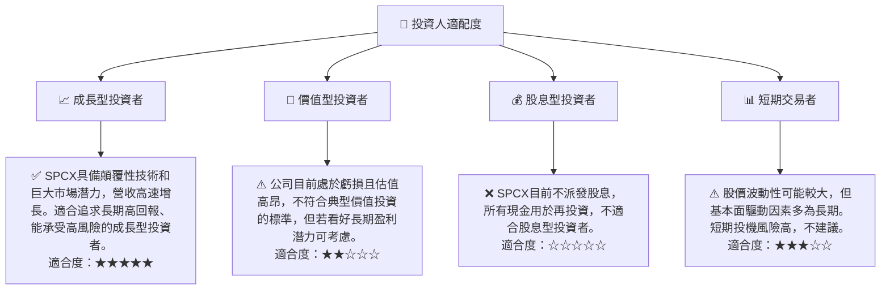

### 10.5 關鍵監控指標

投資者應密切關注以下關鍵指標，以評估 SPCX 的投資價值和風險。

| 監控類型 | 指標 | 關注點 | 頻率 |
|----------|------|--------|------|
| **營收成長** | 總收入 YoY 成長率 | Starlink 用戶數增長、發射服務訂單量、新業務拓展情況 | 季度/年度 |
| **盈利能力** | 毛利率、營業利益率、淨利率 | 成本控制效率、研發投入轉化為盈利的能力、規模經濟效應 | 季度/年度 |
| **現金流** | 自由現金流 (FCF) | FCF 何時轉正、資本支出效率、營運現金流增長 | 季度/年度 |
| **市場地位** | Starlink 訂閱用戶數、發射市場份額 | 競爭格局變化、新服務推出、全球覆蓋進度 | 季度/年度 |
| **技術進展** | Starship 開發進度、成功發射率 | 關鍵測試里程碑、可重複使用技術的成熟度 | 持續監控 |
| **負債水平** | 淨現金/債務、債務權益比 | 債務風險、融資能力、利息覆蓋倍數 (當EBITDA轉正後) | 季度/年度 |

---

> **免責聲明**：本報告為 AI 自動生成，僅供研究參考，不構成投資建議。投資有風險，入市需謹慎。