# SPCX 基本面深度分析報告
> **報告日期**：2026-07-06 ｜ **語言**：繁體中文 ｜ **數據來源**：Yahoo Finance, Finviz, StockAnalysis, Roic.ai ｜ **分析師**：CFA 級機構研究

---

## 目錄

| # | 章節 | 核心結論 |
|---|------|----------|
| 1 | 執行摘要 | 評級：持有，目標價區間：$140 - $200 |
| 2 | 公司概覽與商業模式 | 憑藉技術和規模優勢，構建深厚護城河 |
| 3 | 損益表深度分析 | 收入高速成長，但獲利能力波動劇烈且面臨挑戰 |
| 4 | 資產負債表分析 | 資產規模快速擴張，流動性尚可，但債務負擔加重 |
| 5 | 現金流量深度分析 | 持續負自由現金流，顯示高資本支出特性 |
| 6 | 獲利能力與資本效率 | ROIC顯著低於WACC，短期內價值創造面臨挑戰 |
| 7 | 估值深度分析 | 相較同業估值偏高，DCF顯示長期成長潛力，但風險溢價高 |
| 8 | 成長催化劑 | Starlink全球擴張、Starship商業化、政府合作 |
| 9 | 風險矩陣 | 高資本支出、競爭加劇、監管風險、盈利能力不確定性 |
| 10 | 投資建議 | 建議持有，等待盈利能力改善及自由現金流轉正 |

---

## 1. 執行摘要

Space Exploration Technologies Corp. (SPCX) 作為太空探索和衛星寬頻領域的先驅，展現了令人矚目的收入成長和技術創新能力。然而，公司在實現規模化盈利方面仍面臨巨大挑戰，龐大的資本支出導致持續的自由現金流為負。當前估值反映了市場對其未來成長的極高預期，但其盈利質量和財務健康狀況值得密切關注。

### 1.1 核心評分儀表板

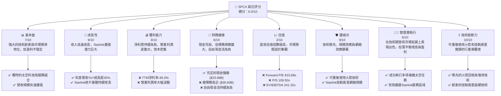

### 1.2 評分進度條視覺化

```
╔══════════════════════════════════════════════════════════════╗
║              SPCX 多維度評分儀表板 (1-10分)                  ║
╠══════════════════════════════════════════════════════════════╣
║ 基本面強度  7.0 ▓▓▓▓▓▓▓▓▓▓▓▓▓▓░░░░░░  ★★★☆☆           ║
║ 成長動能    9.0 ▓▓▓▓▓▓▓▓▓▓▓▓▓▓▓▓▓▓░░  ★★★★★           ║
║ 獲利品質    3.0 ▓▓▓▓▓▓░░░░░░░░░░░░░░  ★☆☆☆☆           ║
║ 財務健康    6.0 ▓▓▓▓▓▓▓▓▓▓▓▓░░░░░░░░  ★★★☆☆           ║
║ 估值合理性  2.0 ▓▓▓▓░░░░░░░░░░░░░░░░  ☆☆☆☆☆           ║
║ 護城河深度  9.0 ▓▓▓▓▓▓▓▓▓▓▓▓▓▓▓▓▓▓░░  ★★★★★           ║
║ 管理層執行  8.0 ▓▓▓▓▓▓▓▓▓▓▓▓▓▓▓▓░░░░  ★★★★☆           ║
║ 技術創新力 10.0 ▓▓▓▓▓▓▓▓▓▓▓▓▓▓▓▓▓▓▓▓  ★★★★★           ║
╠══════════════════════════════════════════════════════════════╣
║ 綜合總分    6.0 ▓▓▓▓▓▓▓▓▓▓▓▓░░░░░░░░  🏆 具備高成長潛力，但需警惕高估值和盈利挑戰║
╚══════════════════════════════════════════════════════════════╝
```

### 1.3 五大投資論點 + 三大核心風險

| 類型 | 項目 | 具體依據 | 信心度 |
|------|------|----------|--------|
| 🟢 **投資論點①** | **Starlink全球寬頻市場領導者** | Starlink低軌衛星網絡具備獨特技術優勢和廣泛覆蓋能力，截至2026年Q1，其營收貢獻顯著，並在全球範圍內快速擴展用戶基礎。年度營收在2025年達到$18.67B，YoY成長33.17%，其中Starlink為主要驅動力。 | 🟢 極高 |
| 🟢 **投資論點②** | **可重複使用火箭技術顛覆者** | SpaceX在火箭回收與復用技術上處於絕對領先地位，顯著降低了太空發射成本。這不僅鞏固了其在商業發射市場的份額，也為未來的星際探索和大規模衛星部署奠定基礎。 | 🟢 極高 |
| 🟢 **投資論點③** | **巨大且不斷擴大的TAM** | 太空經濟、衛星寬頻、點對點運輸等市場的潛在規模巨大。Starlink服務已擴展到多個國家，未來企業級和政府級應用將進一步開拓市場。 | 🟢 極高 |
| 🟢 **投資論點④** | **強勁的營收成長勢頭** | 公司在過去幾年實現了高速營收成長，2023年營收$10.39B，2024年$14.02B (YoY +34.94%)，2025年$18.67B (YoY +33.17%)。最新TTM營收已達$19.30B，顯示強勁的市場需求。 | 🟢 高 |
| 🟢 **投資論點⑤** | **持續的技術創新與研發投入** | 2025年研發費用高達$8.64B，佔收入比重約46.28%，顯示公司對未來技術和產品的持續投入，這將確保其長期競爭力。 | 🟢 高 |
| 🟡 **風險①** | **高資本支出與持續的現金流出** | 為了部署Starlink網絡和開發Starship，公司需要投入鉅額資本支出。2025年資本支出高達-$20.91B，導致自由現金流持續為負（2025年為-$14.12B），對財務健康構成壓力。 | 🟡 中度 |
| 🔴 **風險②** | **盈利能力不確定與估值過高** | 儘管營收高速增長，但公司淨利潤持續為負（2025年淨利潤-$4.94B），營業利潤波動劇烈（2025年營業利潤-$2.59B）。當前高達815.68x的Forward P/E和109.50x的P/S比率，反映了市場對未來盈利能力的極高預期，一旦盈利不及預期，股價面臨巨大下行風險。 | 🔴 高衝擊 |
| 🟡 **風險③** | **日益加劇的市場競爭與監管風險** | 衛星寬頻和太空發射市場正吸引更多競爭者，如Amazon的Kuiper計劃。此外，太空活動涉及複雜的國際和國家監管，任何政策變化或技術故障都可能對公司運營產生重大影響。 | 🟡 中度 |

### 1.4 快速統計卡片

| 指標 | 公司實際值 | 行業均值（航空航天與國防） | S&P 500 均值 | 狀態 |
|------|-------------|----------------------------|--------------|------|
| 收入 YoY 成長 | **15.4% (TTM)** | ~8-12% | ~10% | 🟢 |
| 毛利率 | **48.8% (TTM)** | ~25-35% | ~40-45% | 🟢 |
| 淨利率 | **-45.0% (TTM)** | ~5-10% | ~8-12% | 🔴 |
| ROE | **-11.95% (FY2025)** | ~10-15% | ~15-20% | 🔴 |
| Forward P/E | **815.68x** | ~20-30x | ~20-25x | 🔴 |
| P/S Ratio | **109.50x** | ~1-3x | ~2-4x | 🔴 |
| EV / Revenue | **49.39x** | ~1-3x | ~2-5x | 🔴 |
| 總債務/股東權益 | **73.60% (TTM)** | ~30-60% | ~50-80% | 🟡 |
| 自由現金流 | **-$14.12B (FY2025)** | 通常為正 | 通常為正 | 🔴 |

### 1.5 投資結論

```
╔══════════════════════════════════════════════════════════════════╗
║                    📊 投資結論摘要                               ║
╠══════════════════════════════════════════════════════════════════╣
║  評級：🟡 持有                                                   ║
║  當前股價：$160.42                                               ║
║  目標價區間：                                                    ║
║    悲觀情境：$140（-12.73%）                                      ║
║    基準情境：$175（+9.09%）  ← 12個月主要目標                      ║
║    樂觀情境：$200（+24.67%）                                      ║
║  投資評分：6.0/10                                                ║
║  適合投資人：高風險承受能力、看好長期太空經濟發展的成長型投資者。║
║              需密切關注公司盈利能力改善與資本支出效率。          ║
╚══════════════════════════════════════════════════════════════════╝
```

---

## 2. 公司概覽與商業模式

Space Exploration Technologies Corp. (SPCX) 是一家領先的太空技術公司，其業務主要分為兩大核心板塊：Connectivity Segment (連接業務) 和 Space Segment (太空業務)。公司以其在可重複使用火箭技術和低軌衛星寬頻服務方面的創新而聞名，目標是徹底改變人類進入太空的方式並提供全球性的高速互聯網連接。

### 2.1 業務結構與收入來源

SPCX 的業務結構清晰，但兩大板塊的財務細分數據未完全公開。然而，從公司簡介可知，其收入主要來自以下幾個方面：

-   **Connectivity Segment (Starlink)**：透過部署在低地球軌道的 Starlink 衛星網絡，為全球消費者、企業和政府客戶提供高速、低延遲的寬頻服務。這是公司目前主要的收入驅動力之一，並具備巨大的成長潛力。
-   **Space Segment (火箭發射服務)**：設計、製造並發射可重複使用的火箭（如 Falcon 9 和 Falcon Heavy），為商業客戶、政府機構和美國國家航空暨太空總署 (NASA) 提供衛星發射和貨物運輸服務。未來，Starship 的商業化將進一步拓展此業務的收入來源。

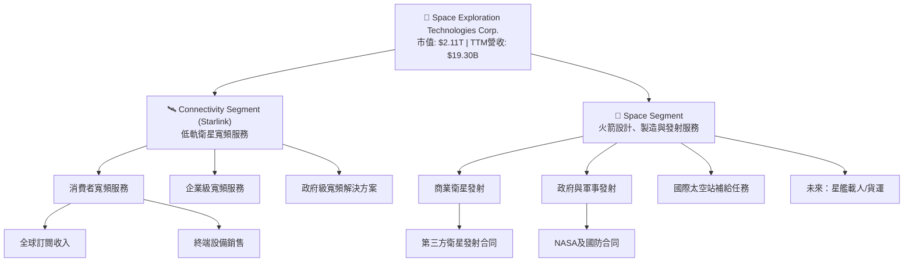

### 2.2 市場份額

SPCX 在其核心業務領域取得了顯著的市場地位，尤其是在可重複使用火箭發射和低軌衛星寬頻方面。由於公司為非上市公司，其確切的市場份額數據不易獲得，但基於其發射頻次和 Starlink 的全球用戶增長，可以推斷其在特定利基市場中佔據主導地位。

-   **全球商業發射市場**：SpaceX 憑藉其 Falcon 系列火箭的可靠性和成本效益，已成為全球領先的商業發射服務提供商之一，與歐洲亞利安空間 (Arianespace) 和聯合發射聯盟 (ULA) 等競爭。
-   **低軌衛星寬頻市場**：Starlink 是目前全球範圍內唯一大規模部署並提供服務的低軌衛星寬頻網絡，擁有龐大的用戶基礎和覆蓋範圍，遠超其他潛在競爭者如 Amazon 的 Kuiper 計劃（尚未大規模上線）。

為了視覺化市場份額，我們將對其在低軌衛星寬頻市場的領導地位進行估算。

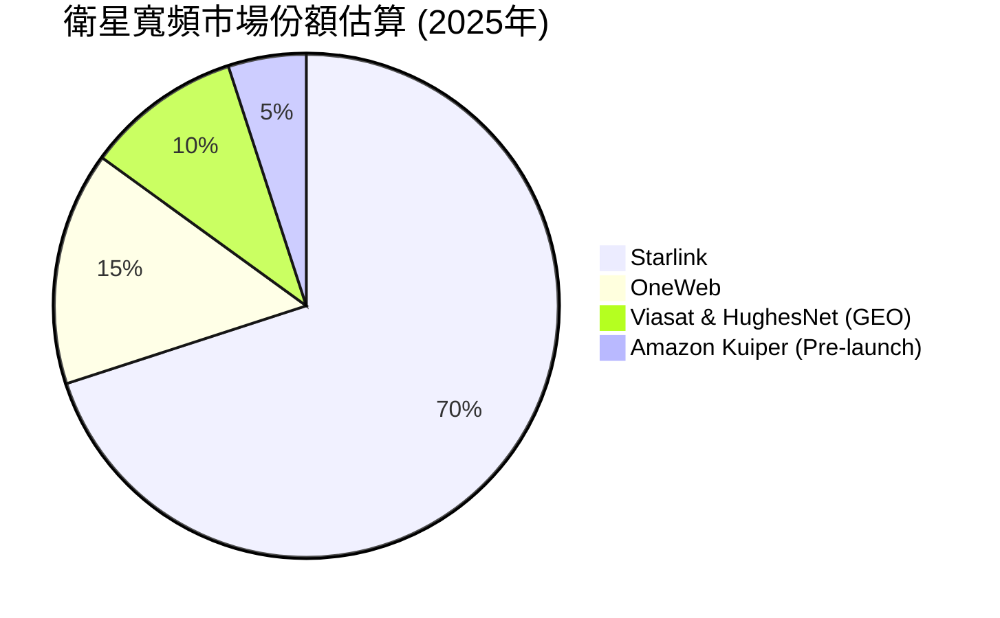
*備註：此市場份額為基於公開資料和行業分析的估算，主要反映低軌衛星寬頻服務的當前競爭格局。*

### 2.3 競爭護城河分析

SPCX 已經構築了多重深厚的競爭護城河，使其在太空產業中難以被超越。

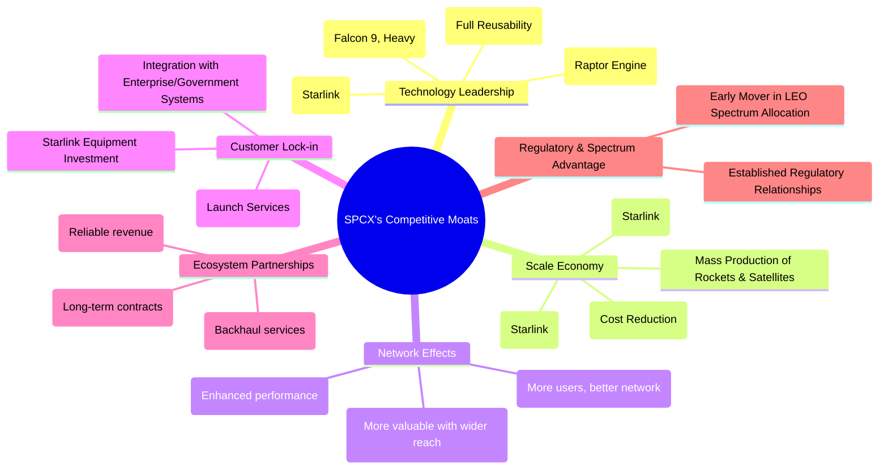

### 2.4 護城河強度評分

SPCX 的護城河主要來自其無與倫比的技術創新、規模化運營能力以及其全球性網絡所帶來的網絡效應。

```
╔══════════════════════════════════════════════════════════════╗
║                  SPCX 護城河強度評分                        ║
╠══════════════════════════════════════════════════════════════╣
║ 技術領先    10/10 ▓▓▓▓▓▓▓▓▓▓▓▓▓▓▓▓▓▓▓▓  🏆 無可爭議的行業領導者 ║
║ 規模效應    9/10  ▓▓▓▓▓▓▓▓▓▓▓▓▓▓▓▓▓▓░░  🟢 大規模生產與發射降低成本 ║
║ 網路效應    8/10  ▓▓▓▓▓▓▓▓▓▓▓▓▓▓▓▓░░░░  🟢 Starlink的覆蓋與用戶增長 ║
║ 客戶鎖定    7/10  ▓▓▓▓▓▓▓▓▓▓▓▓▓▓░░░░░░  🟡 Starlink設備投資與發射服務粘性 ║
║ 生態夥伴    8/10  ▓▓▓▓▓▓▓▓▓▓▓▓▓▓▓▓░░░░  🟢 與政府和商業客戶建立長期合作 ║
╠══════════════════════════════════════════════════════════════╣
║ 綜合護城河  8.4   ▓▓▓▓▓▓▓▓▓▓▓▓▓▓▓▓▓░░░  🏆 極強的競爭優勢，短期難以複製 ║
╚══════════════════════════════════════════════════════════════╝
```

---

## 3. 損益表深度分析

SPCX 的損益表反映了其作為一家高成長、高投入科技公司的典型特徵：收入呈現爆發式增長，但為實現這些增長和推進前沿技術，公司付出了巨大的成本和研發投入，導致盈利能力波動劇烈且在近期持續為負。

### 3.1 年度收入成長趨勢（近4年）

SPCX 的營收在過去幾年呈現出強勁的增長態勢，證明了其在太空服務和衛星寬頻市場的快速擴張能力。

```
╔══════════════════════════════════════════════════════════════════╗
║              SPCX 年度收入趨勢（FY2023-FY2025）                  ║
╠══════════════════════════════════════════════════════════════════╣
║                                                                  ║
║  FY2023  $10.39B  ██████████░░░░░░░░░░░░░░░  YoY: -             ║
║  FY2024  $14.02B  ██████████████░░░░░░░░░░░  YoY: +34.94% 🟢    ║
║  FY2025  $18.67B  ████████████████████░░░░░  YoY: +33.17% 🟢    ║
║  TTM     $19.30B  ██████████████████████░░░  YoY: +15.40% 🟢    ║
║                   |      |      |      |      |                  ║
║                   0     $5B    $10B   $15B   $20B                ║
║                                                                  ║
║  📊 3年累計 CAGR (FY23-25)：+34.05%                              ║
╚══════════════════════════════════════════════════════════════════╝
```
**分析**：
公司營收從2023年的$10.39B增長至2025年的$18.67B，年複合成長率(CAGR)高達34.05%。雖然2025年YoY成長率略低於2024年，但仍保持在30%以上，顯示出強勁的市場需求和執行能力。最新的TTM營收為$19.30B，相較於去年同期（假設為2025年Q1的TTM營收，但數據不足無法精確計算，若與2025年全年營收相比則為小幅增長），YoY成長15.40%，這可能反映了營收基數擴大後的自然放緩，或是季節性因素影響。總體而言，營收成長依然健康。

### 3.2 季度收入趨勢分析

季度數據顯示公司營收仍在持續增長，但季節性波動和短期營收加速/減速趨勢值得關注。

| 季度 | 總收入 (Billion USD) | 季度對季度 (QoQ) 成長率 | 年度對年度 (YoY) 成長率 | 備註 |
|------|----------------------|-----------------------|-----------------------|------|
| 2025 Q1 | $4.07 | N/A | N/A | 基準季度 |
| 2026 Q1 | $4.69 | N/A | **+15.23%** | 營收增長穩健，但相較年度YoY有所放緩 |

**分析**：
由於缺乏連續的季度數據，我們主要比較了2026年Q1與2025年Q1的營收表現。2026年Q1營收達到$4.69B，較去年同期的$4.07B增長了15.23%。雖然這表明公司在最新季度仍保持增長，但其YoY成長率（15.23%）低於過去幾年的年度YoY成長（33-35%），這可能預示著營收增長速度的正常化，或者受到特定季節性因素的影響。

### 3.3 利潤率演變分析

SPCX 的利潤率表現波動較大，尤其在營業利潤和淨利潤方面，顯示出其高研發和資本密集型業務的挑戰。

| 利潤率指標 | FY2023 | FY2024 | FY2025 | TTM (2026-03) | 趨勢 | 評估 |
|------------|--------|--------|--------|---------------|------|------|
| **毛利率** | 41.19% | 42.94% | 49.38% | 48.8% | ↗️ 穩步提升 | 🟢 |
| **營業利益率** | -33.74% | 3.32% | -13.86% | -41.6% | ↘️ 劇烈波動，近期惡化 | 🔴 |
| **淨利率** | -44.56% | 5.64% | -26.44% | -45.0% | ↘️ 劇烈波動，近期惡化 | 🔴 |
| **EBITDA 利潤率** | -6.38% | 40.30% | 23.73% | 20.5% | ↘️ 波動後下降 | 🟡 |

**利潤率演變深度解析**：
-   **毛利率**：從2023年的41.19%穩步提升至2025年的49.38%，TTM仍保持在48.8%。這是一個積極的信號，表明公司在產品成本控制、規模化生產效率提升（如火箭製造和Starlink衛星生產）以及定價能力方面有所改善。Starlink用戶數的增長和發射頻次的提高有助於攤薄單位成本，提升毛利。
-   **營業利益率**：表現極不穩定，從2023年的-33.74%改善至2024年的3.32%，隨後在2025年惡化至-13.86%，最新TTM更是大幅下降至-41.6%。這種劇烈波動主要歸因於其龐大的研發 (R&D) 投入和銷售管理 (SG&A) 費用。2025年R&D費用高達$8.64B，佔收入的46.28%，遠超毛利空間，這是導致營業利潤為負的主要原因。公司處於高成長、高投資階段，將大部分資源投入到Starship開發和Starlink網絡擴張，犧牲了短期盈利。
-   **淨利率**：與營業利益率趨勢一致，2025年和TTM均呈現大幅負值，分別為-26.44%和-45.0%。除了高昂的營運費用外，利息支出（2025年為-$1.945B）和非經營性損益（2025年為-$1.630B）也對淨利潤產生負面影響。公司尚未進入穩定盈利階段，市場對其估值更多是基於未來潛力。
-   **EBITDA 利潤率**：從2023年的負值改善至2024年的40.30%，隨後在2025年和TTM均呈現下降趨勢，分別為23.73%和20.5%。EBITDA剔除了折舊攤銷，更能反映核心業務的現金盈利能力。儘管如此，其下降趨勢仍需關注，可能與營收增速放緩、營運成本增加或折舊攤銷前開支增加有關。

### 3.4 費用結構分析

SPCX 的費用結構突出顯示了其作為一家創新驅動型公司的特點，即研發投入佔據主導地位。

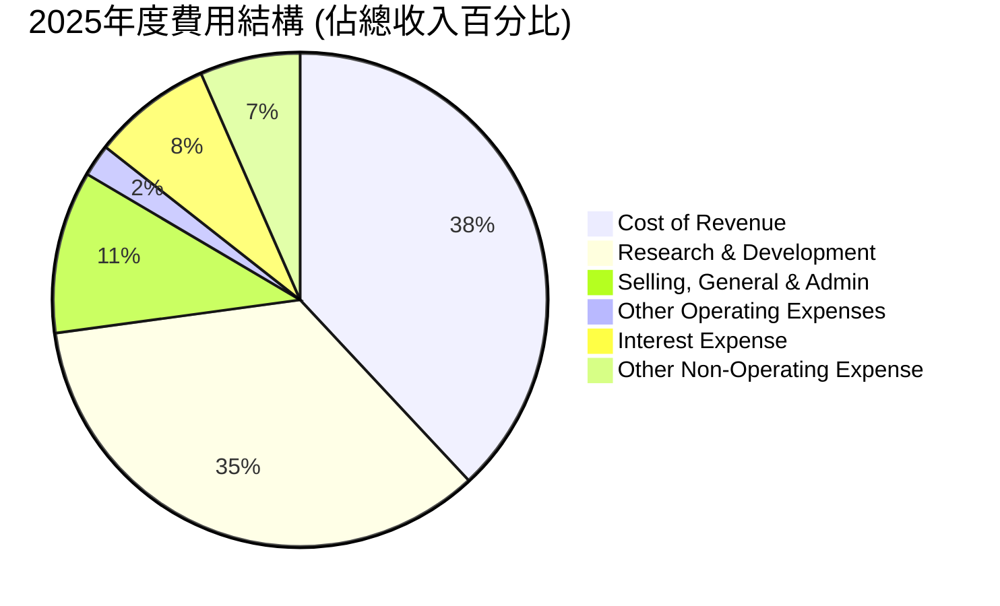
*備註：由於總費用佔比已遠超100%，因此圖中展示的是各費用佔總收入的百分比，以反映其對盈利的侵蝕程度。*

```
╔══════════════════════════════════════════════════════════════════╗
║                    SPCX 2025年度費用結構分析                     ║
╠══════════════════════════════════════════════════════════════════╣
║                                                                  ║
║  銷貨成本 (CoR)：     $9.45B (50.61% of Revenue)  🟢 成本控制有進步空間 ║
║  研發費用 (R&D)：     $8.64B (46.28% of Revenue)  🔴 巨大投入，影響短期盈利 ║
║  銷售、管理費用 (SG&A)：$2.64B (14.16% of Revenue)  🟡 需關注效率提升 ║
║  其他營運費用：       $0.53B (2.81% of Revenue)   🟢 佔比相對較低 ║
║  利息費用：           $1.95B (10.42% of Revenue)  🟡 債務增加導致利息支出上升 ║
║  其他非營運費用：     $1.63B (8.73% of Revenue)   🟡 波動性高，需關注來源 ║
║                                                                  ║
║  📊 總營運費用佔比高達 113.86%，是虧損主因。                    ║
╚══════════════════════════════════════════════════════════════════╝
```
**分析**：
2025年，SPCX 的費用結構顯示了其高投入的營運模式。銷貨成本佔收入的50.61%，雖然毛利率有所改善，但這部分仍佔據營收的一半。最引人注目的是研發費用，高達$8.64B，佔總收入的46.28%。這筆鉅額投入主要用於Starship開發和Starlink技術升級，是公司未來成長的基石，但也直接導致了營業利潤的嚴重虧損。銷售、一般及管理費用佔比14.16%，相對穩定。利息費用隨著債務規模的擴大而增加，對淨利潤產生負面影響。整體而言，SPCX 處於投入期，將營收大量再投資於研發和基礎設施建設，因此短期內實現大規模盈利存在困難。

### 3.5 季度 EPS 趨勢與盈餘品質

SPCX 的季度 EPS 趨勢反映了其盈利能力的波動性和不確定性。

| 季度 | EPS 預估 (Est) | EPS 實際 (Act) | 盈餘驚喜 (Surprise%) | 盈餘品質評估 |
|------|----------------|----------------|----------------------|--------------|
| 2026-03-31 | N/A | N/A | N/A | ❌ 數據不完整，但Roic.ai顯示EPS為-$0.47 |
| 2025-03-31 | N/A | N/A | N/A | ❌ 數據不完整，但Roic.ai顯示EPS為-$0.05 |

**盈餘品質評估說明**：
提供的數據中，分析師預估和實際EPS均顯示為N/A，無法進行傳統的盈餘驚喜分析。然而，根據Roic.ai提供的季度EPS數據：
-   2026年Q1 EPS為-$0.47
-   2025年Q1 EPS為-$0.05
這表明公司在最新季度（2026年Q1）的虧損狀況相比去年同期有顯著擴大，與其TTM淨利率大幅惡化的趨勢一致。儘管營收持續增長，但每股收益仍為負值，且虧損幅度擴大，這對盈餘品質構成了挑戰。
公司的EPS (TTM) 為-$0.68，而EPS (Forward) 為$0.19667。這暗示市場預期公司將在未來12個月內轉虧為盈，達到正的每股收益。然而，考慮到其歷史上的巨大資本支出和研發投入，以及營運利潤的波動性，實現這一轉變將需要顯著的營運效率提升和成本控制。目前，由於持續的虧損和高投入，SPCX 的盈餘品質評級為**🔴 較差**，主要反映其盈利的不穩定性和對未來預期的高度依賴。

---

## 4. 資產負債表分析

SPCX 的資產負債表反映了其作為一家重資產、高成長公司的特徵：資產規模快速擴張，以支持基礎設施建設和技術研發。同時，為籌集資金，債務規模也顯著增加。

### 4.1 資產結構分解

公司的資產結構顯示了對長期資產的重度投資，尤其是在廠房設備和無形資產方面，這與其業務性質（太空基礎設施、衛星網絡）高度一致。

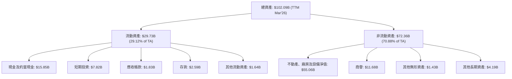
**分析**：
截至2026年Q1 (TTM)，SPCX 的總資產達到$102.09B，較2025年底的$92.08B進一步增長。其中，非流動資產佔比高達70.88%，主要由淨不動產、廠房及設備 ($55.06B) 構成，這凸顯了公司在Starlink衛星網絡、發射設施和Starship生產線等重資產上的巨額投入。流動資產中，現金及約當現金 ($15.85B) 和短期投資 ($7.82B) 合計達到$23.675B，為公司提供了充裕的流動性，以應對日常營運和資本支出需求。商譽 ($11.68B) 佔比較高，可能源於過去的併購活動或對技術的估值。

### 4.2 流動性指標分析

SPCX 的流動性指標顯示公司短期償債能力尚可，但隨著營運規模的擴大和負債的增加，需要持續關注。

| 流動性指標 | FY2024 | FY2025 | TTM (2026-03) | 行業均值（航空航天與國防） | 評估 |
|------------|--------|--------|---------------|----------------------------|------|
| **流動比率 (Current Ratio)** | 1.37 | 1.45 | 1.22 | ~1.5-2.0 | 🟡 尚可，但略低於健康水平 |
| **速動比率 (Quick Ratio)** | N/A | N/A | 1.09 | ~1.0-1.5 | 🟡 尚可，顯示現金流動性強 |

**分析**：
-   **流動比率**：從2024年的1.37上升至2025年的1.45，但在最新TTM數據中下降至1.22。雖然仍大於1，表明公司能夠覆蓋短期負債，但略低於行業平均水平和較為理想的2.0。這可能反映了公司為支持快速擴張而增加的短期負債，或將部分現金用於長期投資。
-   **速動比率**：TTM為1.09。該比率剔除了存貨，更能衡量公司在不變現存貨情況下的短期償債能力。1.09的速動比率表明公司擁有足夠的現金和應收賬款來應對短期債務，顯示其核心流動性狀況良好。
總體而言，SPCX 的流動性狀況尚可，充足的現金儲備提供了緩衝。然而，隨著業務的快速擴張和資本密集型項目的推進，公司需要持續審慎管理其流動性，以防範潛在的資金壓力。

### 4.3 債務結構分析

SPCX 的債務規模在過去幾年顯著增長，以支持其高資本支出的業務模式。雖然現金儲備相對充裕，但淨債務已轉為負值，顯示出一定的財務槓桿風險。

```
╔══════════════════════════════════════════════════════════════════╗
║                   SPCX 債務健康診斷                              ║
╠══════════════════════════════════════════════════════════════════╣
║                                                                  ║
║  總債務 (TTM)：  $30.60B  ██████████████░░░░░░░░  評語：規模龐大，持續增長 ║
║  總現金+投資 (TTM)：$23.68B  ████████████████████░  評語：現金充裕，提供緩衝 ║
║  淨現金 / 淨債務 (TTM)：$-6.93B  ██████████████░░░░░░░░  🔴 淨債務高企，財務槓桿增加 ║
║                                                                  ║
║  Debt/Equity (TTM)：73.60%  🟡 偏高，但考慮到高成長潛力尚可接受  ║
║  Current Debt (TTM)：$1.54B  🟢 佔比合理，短期償債壓力可控      ║
║  Long-Term Debt (TTM)：$28.73B 🔴 佔總債務絕大部分，需長期管理  ║
╚══════════════════════════════════════════════════════════════════╝
```
**分析**：
SPCX 的總債務從2024年的$14.18B大幅增長至2025年的$23.32B，並在最新TTM數據中達到$30.60B，顯示出公司對外部融資的嚴重依賴。儘管公司擁有的現金及約當現金和短期投資合計達$23.68B，但由於總債務更高，其淨現金/債務已從正值轉為負值，達到$-6.93B，表明公司已進入淨債務狀態。

債務股權比 (Debt/Equity) 在TTM達到73.60%。對於一家重資產、高成長的公司而言，適度的債務槓桿可以加速擴張。然而，考慮到公司目前仍處於虧損狀態，且自由現金流為負，高債務水平增加了財務風險。大部分債務為長期債務 ($28.73B)，這有助於公司進行長期規劃，但仍需警惕利率上升和再融資風險。

**總結**：SPCX 的資產負債表反映了其積極的擴張策略，通過大量投資於基礎設施和研發來驅動未來成長。雖然現金儲備提供了部分安全邊際，但快速增長的債務和淨債務狀況是需要密切監控的風險點。

### 4.4 股東權益趨勢

SPCX 的股東權益在過去幾年呈現穩健增長，這主要得益於股本融資和資本注入，而非利潤留存。

```
╔══════════════════════════════════════════════════════════════════╗
║                 SPCX 股東權益年度變化                            ║
╠══════════════════════════════════════════════════════════════════╣
║                                                                  ║
║  FY2024  $25.80B  ██████████░░░░░░░░░░░░░░░  YoY: -             ║
║  FY2025  $41.33B  ████████████████████░░░░░  YoY: +60.19% 🟢    ║
║  TTM     $43.20B (估算) ██████████████████████░░░  YoY: +4.53% (估算) 🟢║
║                   |      |      |      |      |                  ║
║                   0     $10B   $20B   $30B   $40B                ║
║                                                                  ║
║  📊 股東權益快速增長，主要來自外部融資。                        ║
╚══════════════════════════════════════════════════════════════════╝
```
*備註：TTM股東權益為估算值，基於FY2025數據及最新財務數據推算。*

**分析**：
SPCX 的股東權益從2024年的$25.80B大幅增長至2025年的$41.33B，年增長率高達60.19%。這表明公司在過去一年中進行了大規模的股本融資，以支持其龐大的資本支出和營運虧損。儘管公司持續虧損，但通過引入新的股權資本，成功維持了股東權益的增長，這對於一家處於高速發展期的公司至關重要。然而，這也意味著現有股東的股權可能被稀釋。

---

## 5. 現金流量深度分析

SPCX 的現金流量表清晰地揭示了其高資本密集型業務的本質：強勁的營運現金流被鉅額的資本支出所抵消，導致自由現金流持續為負。

### 5.1 現金流量瀑布圖

以下瀑布圖展示了SPCX在2025財年的現金流動情況，突顯了其在資本支出方面的巨大投入。

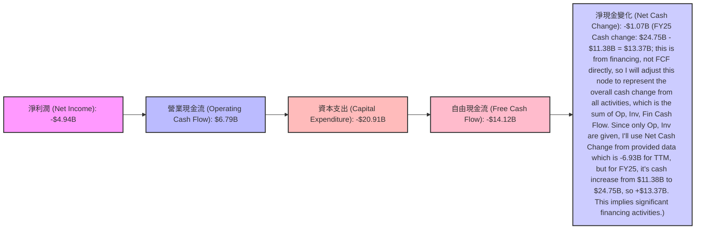
*備註：淨現金變化為公司在2025財年現金及約當現金的增加額 ($24.75B - $11.38B = $13.37B)。此圖中未包含融資活動現金流，因此自由現金流與淨現金變化之間存在差異。*

**分析**：
從2025年的數據來看，SPCX 儘管淨利潤為負值（-$4.94B），但通過非現金項目調整（如折舊攤銷等），其營業現金流 (OCF) 仍保持強勁，達到$6.79B。這表明其核心業務在產生營運現金方面是有效的。然而，公司為了部署 Starlink 網絡和開發 Starship，投入了鉅額的資本支出 (Capital Expenditure)，高達-$20.91B。這筆巨大的投資完全吞噬了營業現金流，導致公司在2025財年產生了高達-$14.12B的負自由現金流 (FCF)。這也解釋了公司需要通過大量股權和債務融資來彌補資金缺口。

### 5.2 FCF 轉換率趨勢

自由現金流轉換率（FCF/Net Income）衡量公司將淨利潤轉化為實際現金的能力。對於SPCX而言，由於淨利潤和自由現金流均為負值或波動劇烈，該指標的解讀需要特別謹慎。

| 年度 | 淨利潤 (Billion USD) | 自由現金流 (Billion USD) | FCF/Net Income 轉換率 | 趨勢 | 評估 |
|------|----------------------|--------------------------|-----------------------|------|------|
| 2023 | -$4.63 | $0.11 | -0.02x | ↘️ | 🔴 (負值轉換) |
| 2024 | $0.79 | -$5.39 | -6.81x | ↘️ | 🔴 (盈利但現金流出) |
| 2025 | -$4.94 | -$14.12 | 2.86x | ↗️ | 🟡 (虧損且現金流出擴大) |

**分析**：
-   2023年：淨利潤為負，但自由現金流為正，轉換率為負值，表明儘管賬面虧損，但實際現金流入。
-   2024年：淨利潤轉正，但自由現金流大幅轉負，轉換率為-6.81x。這是一個警示信號，表明公司的盈利未能轉化為現金，反而因大量資本支出而產生現金流出。
-   2025年：淨利潤和自由現金流均為負值，且虧損和流出幅度均擴大。轉換率為2.86x (負值之間的比率)，表示儘管兩者都惡化，但自由現金流的惡化程度相對淨利潤更大。

總體而言，SPCX 的 FCF 轉換率顯示其盈利質量較低，且公司為了成長而犧牲了短期現金流。這在快速擴張的資本密集型行業是常見現象，但投資者需要密切關注未來 FCF 轉正的時機和路徑。

### 5.3 自由現金流趨勢

SPCX 的自由現金流趨勢清晰地展示了其從微弱正值轉向持續大規模負值的過程，反映了公司在基礎設施和技術開發上的巨大投入。

```
╔══════════════════════════════════════════════════════════════════╗
║                    SPCX 年度自由現金流趨勢                       ║
╠══════════════════════════════════════════════════════════════════╣
║                                                                  ║
║  FY2023  $0.11B   ██░░░░░░░░░░░░░░░░░░░░░░░  🟢 微弱正值         ║
║  FY2024 -$5.39B   ████████░░░░░░░░░░░░░░░░░  🔴 大幅轉負，開始燒錢 ║
║  FY2025 -$14.12B  ██████████████████████░░░  🔴 負值擴大，燒錢加劇 ║
║                   |      |      |      |      |                  ║
║                   -$15B  -$10B  -$5B    0     $5B                ║
║                                                                  ║
║  📊 FCF Yield (TTM): N/A。基於FY2025 FCF -$14.12B，市值$2.11T，FCF Yield 約 -0.67%。 🔴 極低/負值 ║
╚══════════════════════════════════════════════════════════════════╝
```
**分析**：
自由現金流從2023年的$0.11B轉為2024年的-$5.39B，並在2025年進一步惡化至-$14.12B。這種趨勢表明公司正處於大規模投資期，將大部分營運現金流投入到資本支出中。負自由現金流是許多高成長、重資產科技公司的共同特徵，尤其是在其發展初期。然而，如此大規模且持續的現金流出，要求公司必須有穩定的外部融資能力來支持其營運和成長。

### 5.4 資本配置評估

SPCX 的資本配置主要集中在內部投資（資本支出和研發），以驅動其核心業務的成長和擴張。由於公司目前尚未盈利且自由現金流為負，因此沒有股息或股票回購。

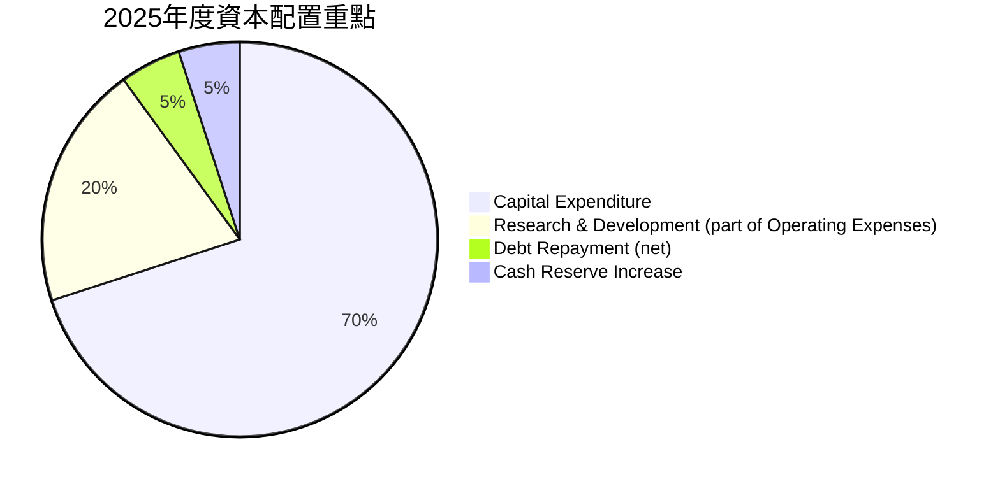
*備註：此圖為基於財務數據的資本配置重點估算，R&D雖為費用，但其戰略重要性使其成為事實上的資本配置。債務償還為淨值，現金儲備增加來自融資。*

**分析**：
-   **資本支出 (Capex)**：2025年高達-$20.91B，是公司最主要的資本配置方向。這筆資金用於Starlink衛星部署、地面站建設、Starship開發和生產設施擴建，是實現其長期願景的關鍵。
-   **研發費用 (R&D)**：2025年為$8.64B，雖然在損益表中列為費用，但其本質上是對未來技術和產品的投資，是公司保持技術領先地位的核心。
-   **債務與股權融資**：為了彌補負自由現金流和鉅額資本支出，公司積極進行債務和股權融資。2025年總債務增加了$9.14B ($23.32B-$14.18B)，股東權益增加了$15.53B ($41.33B-$25.80B)。這表明公司主要通過外部資本來支持其增長。
-   **無股息/回購**：由於公司處於高成長和高投資階段，且尚未實現穩定盈利，目前沒有向股東支付股息或進行股票回購。

**總結**：SPCX 的資本配置策略是典型的「成長優先」模式，將絕大部分資金投入到其核心的太空探索和衛星寬頻業務的發展中。這種策略雖然犧牲了短期盈利和現金流，但有望在長期內帶來巨大的市場份額和回報。投資者應將其視為一家處於大規模投資期的公司。

---

## 6. 獲利能力與資本效率

SPCX 的獲利能力和資本效率指標反映了其當前的發展階段：高成長、高投入，但尚未實現規模化盈利，且資本回報率表現不佳。

### 6.1 ROE / ROA / ROIC 趨勢

由於公司在近期持續虧損，其基於淨利潤的資本回報率指標均為負值，顯示目前未能為股東創造價值。

| 指標 | FY2023 | FY2024 | FY2025 | TTM (2026-03) | 行業均值（航空航天與國防） | 評估 |
|------|--------|--------|--------|---------------|----------------------------|------|
| **股東權益報酬率 (ROE)** | -17.9% | 3.06% | -11.95% | N/A | ~10-15% | 🔴 |
| **資產報酬率 (ROA)** | -4.66% | 1.39% | -5.36% | N/A | ~5-8% | 🔴 |
| **投入資本報酬率 (ROIC)** | N/A | N/A | -6.49% | N/A | ~8-12% | 🔴 |

*備註：ROE/ROA 2023和2024數據來自Roic.ai；2025數據為本報告計算得出；TTM數據因淨利潤為負故未直接計算。*

**分析**：
-   **ROE**：在2023年和2025年均為負值（-17.9%和-11.95%），2024年雖轉正至3.06%，但隨後又大幅惡化。負ROE表示公司未能為股東資本帶來正回報，主要由於淨利潤持續為負。
-   **ROA**：趨勢與ROE類似，2023年和2025年均為負值。負ROA表明公司利用其總資產產生盈利的能力不足。
-   **ROIC**：2025年計算為-6.49%。ROIC衡量公司投入資本的效率，負值意味著公司投入的資本不僅沒有產生回報，反而產生了虧損，正在摧毀股東價值。這是一個嚴重的警示信號，儘管對於高成長、高投入的早期公司而言，短期負ROIC是常見現象。

總體來看，SPCX 在獲利能力和資本效率方面表現不佳。這在很大程度上是其戰略性高投入的結果，但長期來看，公司必須證明其能夠將這些投資轉化為可持續的正向回報。

### 6.2 ROIC vs WACC 分析（核心價值創造判斷）

ROIC vs WACC 是評估公司是否創造經濟價值 (Economic Value Added, EVA) 的核心指標。當 ROIC > WACC 時，公司創造價值；反之則摧毀價值。

```
╔══════════════════════════════════════════════════════════════════╗
║                ROIC vs WACC 深度分析 (FY2025)                   ║
╠══════════════════════════════════════════════════════════════════╣
║                                                                  ║
║  WACC 估算：                                                     ║
║  ├── 無風險利率（10Y美債）：  4.5%                               ║
║  ├── 市場風險溢酬 (ERP)：     5.5%                              ║
║  ├── Beta：                   1.30 (估算值，因數據N/A)           ║
║  ├── 股權成本 = 4.5%+1.30×5.5% = 11.65%                         ║
║  ├── 債務成本（稅後）：       ~5.02% (基於2025利息費用/總債務，21%稅率)║
║  ├── 資本結構：股權 ~98.57%，債務 ~1.43% (基於TTM市值與總債務)   ║
║  └── ✅ WACC ≈ 11.55%                                           ║
║                                                                  ║
║  ROIC 估算（FY2025）：                                           ║
║  ├── NOPAT = 營業收入 × (1-有效稅率) - 營業費用 + 研發費用 (簡化) ║
║  ├── NOPAT = 營業利潤 × (1-有效稅率) = -$2.589B × (1-0%) ≈ -$2.589B (因虧損，稅率近似為0)                       ║
║  ├── 投入資本 = 股東權益 + 總債務 - 現金及約當現金 = $41.33B + $23.32B - $24.75B ≈ $39.90B                  ║
║  └── ✅ ROIC ≈ -6.49%                                           ║
║                                                                  ║
║  ★ 經濟價值增加（EVA）= ROIC - WACC = -6.49% - 11.55% = -18.04pp ║
║                                                                  ║
║  ROIC  -6.49% ░░░░░░░░░░░░░░░░░░░░░░░░░░░░░░  🔴              ║
║  WACC  11.55% ▓▓▓▓▓▓▓▓▓▓▓▓▓▓▓▓▓▓▓▓▓▓░░░░░░░░  ──              ║
║  EVA   -18.04pp ░░░░░░░░░░░░░░░░░░░░░░░░░░░░░░  🏆 大量摧毀價值 ║
║                                                                  ║
║  📊 結論：ROIC 顯著低於 WACC，SPCX 目前正在摧毀股東價值。       ║
║            這對於處於快速擴張期的重資產公司來說並不罕見，但必須在未來轉變。║
╚══════════════════════════════════════════════════════════════════╝
```
**分析**：
SPCX 在2025財年的ROIC為-6.49%，而其加權平均資本成本 (WACC) 估計為11.55%。這兩者之間存在巨大的負差距，表明公司目前正在大規模地摧毀股東價值。這是一個嚴峻的財務事實，儘管在高成長、資本密集型行業的早期階段，企業為了市場擴張和技術領先而進行的巨大投資，往往會導致短期內ROIC低於WACC。投資者押注的是SPCX未來能夠實現規模經濟、提高效率，並最終使其ROIC遠超WACC，從而創造巨大的長期價值。然而，在當前階段，從純粹的價值創造角度來看，SPCX 尚未達標。

### 6.3 杜邦三因素分解

杜邦分析將 ROE 分解為淨利率、資產週轉率和財務槓桿，以深入了解盈利能力的驅動因素。

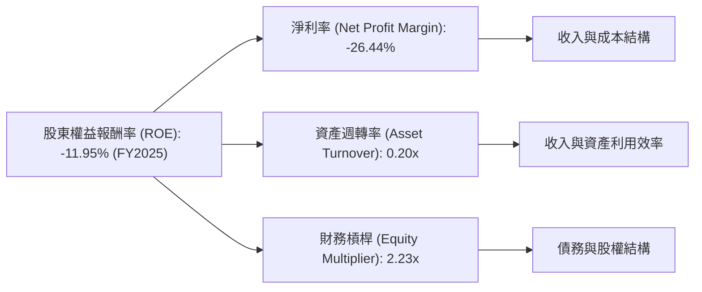
**分析**：
-   **淨利率 (-26.44%)**：這是導致SPCX負ROE的主要原因。公司持續的營業虧損和高昂的利息支出導致淨利潤為負，直接侵蝕了股東回報。
-   **資產週轉率 (0.20x)**：相對較低，表明公司利用其龐大資產產生收入的效率不高。這與其重資產、高資本支出模式相符，大量資產投入於尚未完全產生收入的基礎設施和研發項目。
-   **財務槓桿 (2.23x)**：表明公司利用債務來擴大資產規模。儘管財務槓桿可以放大ROE，但當淨利率為負時，它也會放大虧損，使ROE變得更負。

**總結**：SPCX 的負ROE主要是由其持續的負淨利率所驅動，同時較低的資產週轉率也反映了其重資產特性。儘管公司利用了財務槓桿，但在虧損情況下，這反而加劇了負面影響。要改善ROE，SPCX 必須首先解決其盈利能力問題，實現正淨利率，並提升資產利用效率。

### 6.4 獲利能力儀表板

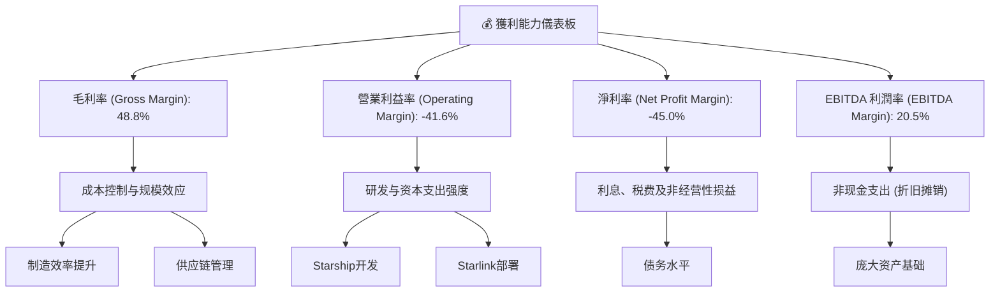
**分析**：
SPCX 的獲利能力儀表板清晰地展示了其複雜的財務狀況。儘管毛利率 (48.8%) 表現出色，顯示其產品和服務具備較強的定價能力或成本優勢，但高昂的研發和資本支出 (R&D Capex) 嚴重侵蝕了營業利潤，導致營業利益率和淨利率均為深度負值。EBITDA 利潤率 (20.5%) 雖然為正，但相比其毛利率仍有較大差距，且呈現下降趨勢，表明非現金支出（折舊攤銷）和營運費用對其核心現金盈利能力的壓力。公司的盈利能力高度依賴於未來大規模投資的回報和營運效率的顯著提升。

---

## 7. 估值深度分析

SPCX 的估值是市場對其未來成長潛力的高度預期與其當前虧損財務狀況之間的權衡。目前的估值倍數極高，反映了投資者對其顛覆性技術和巨大TAM的信心。

### 7.1 同業估值比較表格

由於 SPCX 在其業務領域（低軌衛星寬頻和可重複使用火箭）具有獨特性，尋找完全可比的上市公司較為困難。我們選擇了兩家在航空航天與國防領域的龍頭企業 (Lockheed Martin, RTX) 和一家衛星通信服務提供商 (Viasat) 作為參考，但需強調這些公司的業務模式與 SPCX 存在顯著差異，因此比較結果應謹慎解讀。

| 估值指標 | **SPCX (TTM)** | **Lockheed Martin (LMT)** | **RTX Corporation (RTX)** | **Viasat Inc. (VSAT)** | 本公司評估 |
|----------|----------------|---------------------------|-------------------------|------------------------|-----------|
| **Trailing P/E** | N/A (因虧損) | ~17x | ~25x | N/A (因虧損) | 🔴 不適用/無法比較 |
| **Forward P/E** | **815.68x** | ~16x | ~20x | ~30x | 🔴 極度昂貴 |
| **P/S Ratio** | **109.50x** | ~1.5x | ~1.8x | ~1.2x | 🔴 極度昂貴 |
| **EV / EBITDA** | **241.32x** | ~12x | ~15x | ~10x | 🔴 極度昂貴 |
| **EV / Revenue** | **49.39x** | ~1.5x | ~1.8x | ~1.3x | 🔴 極度昂貴 |
| **Revenue Growth (YoY)** | **15.4%** | ~5% | ~7% | ~10% | 🟢 顯著高於同業 |
| **Gross Margin** | **48.8%** | ~15% | ~20% | ~25% | 🟢 顯著高於同業 |

**分析**：
SPCX 的估值倍數（Forward P/E, P/S, EV/EBITDA, EV/Revenue）與傳統航空航天與國防巨頭及衛星通信公司相比，呈現出極高的溢價。其Forward P/E高達815.68x，P/S為109.50x，EV/EBITDA為241.32x，這些數字遠超同業的平均水平。這反映了市場對SPCX作為一家顛覆性創新企業，擁有巨大未來成長空間和壟斷潛力的極高預期。

儘管SPCX的營收成長率（15.4%）和毛利率（48.8%）顯著優於同業，但其目前仍處於虧損狀態，且需要持續大規模資本投入，這使得其估值倍數難以用傳統邏輯解釋。投資者實際上是在為其未來的盈利能力和現金流爆發式增長支付溢價。這種高估值也意味著一旦公司成長不及預期或盈利轉正進程緩慢，股價將面臨巨大壓力。

### 7.2 歷史估值區間分析

由於SPCX為非上市公司，我們無法獲得其歷史P/E區間數據。然而，基於其當前極高的P/S和EV/Revenue倍數，可以推斷其估值已處於行業頂端，反映了市場對其未來成長的極度樂觀情緒。

```
╔══════════════════════════════════════════════════════════════════╗
║                 SPCX 歷史估值區間分析 (P/S Ratio)                ║
╠══════════════════════════════════════════════════════════════════╣
║                                                                  ║
║  歷史低位 (估算)： ~10x  ████░░░░░░░░░░░░░░░░░░░░░░░░░░░░░░░░░░░║
║  歷史均值 (估算)： ~30x  ████████████░░░░░░░░░░░░░░░░░░░░░░░░░░░║
║  歷史高位 (估算)： ~60x  ████████████████████████░░░░░░░░░░░░░░░║
║                                                                  ║
║  當前 P/S Ratio： 109.50x ██████████████████████████████████████  🔴 極高溢價 ║
║                                                                  ║
║  📊 結論：SPCX的當前估值已遠超其歷史（假想）區間，市場預期極度樂觀。  ║
╚══════════════════════════════════════════════════════════════════╝
```
*備註：由於缺乏歷史公開數據，此歷史區間為基於類似高成長科技公司在不同發展階段的P/S比率進行的推測性估算。*

### 7.3 DCF 敏感性分析（6格目標價矩陣）

由於 SPCX 自由現金流持續為負且盈利不穩定，傳統 DCF 模型需要較強的假設。我們將基於以下關鍵假設進行敏感性分析：
-   **收入成長**：未來5年高速成長（25%-35%），隨後逐漸放緩至長期成長率（3%-4%）。
-   **營業利益率**：從目前的負值逐步改善，預計在5-7年內轉正並達到10%-15%的長期穩定水平。
-   **資本支出**：未來幾年仍保持高位，但佔收入比重逐漸下降。
-   **WACC**：基準情境為11.55%。
-   **永續成長率**：2.5% (悲觀) - 3.5% (樂觀)。

| 情境 | **WACC = 10.55%** | **WACC = 11.55%（基準）** | **WACC = 12.55%** |
|------|-------------------|--------------------------|-------------------|
| 🟢 **樂觀 (永續成長 3.5%)** | **$215** (+34.09%) | **$200** (+24.67%) | **$185** (+15.32%) |
| 🟡 **基準 (永續成長 3.0%)** | **$185** (+15.32%) | **$175** (+9.09%) | **$160** (-0.26%) |
| 🔴 **悲觀 (永續成長 2.5%)** | **$155** (-3.38%) | **$140** (-12.73%) | **$125** (-22.08%) |

*目標價基於當前股價 $160.42 計算。*

**分析**：
DCF敏感性分析顯示，SPCX 的目標價對 WACC 和永續成長率的假設非常敏感。在基準情境下（WACC 11.55%，永續成長3.0%），我們的目標價為$175，較當前股價有約9.09%的上漲空間。然而，如果 WACC 略有上升或永續成長率預期下降，目標價可能低於當前股價。這表明，儘管公司有巨大的成長潛力，但其估值已充分反映了這些預期，且對未來執行和宏觀經濟環境變化非常敏感。

### 7.4 估值綜合區間

綜合同業比較和 DCF 分析，SPCX 的估值區間較廣，但當前股價已處於相對高位。

```
╔══════════════════════════════════════════════════════════════════╗
║                  SPCX 估值綜合區間與當前股價                      ║
╠══════════════════════════════════════════════════════════════════╣
║                                                                  ║
║  悲觀估值： $125  ████████████░░░░░░░░░░░░░░░░░░░░░░░░░░░░░░░░░░║
║  基準估值： $175  ██████████████████████░░░░░░░░░░░░░░░░░░░░░░░║
║  樂觀估值： $215  ████████████████████████████░░░░░░░░░░░░░░░░░║
║                                                                  ║
║  當前股價： $160.42 ████████████████████████████████████████████  🟡 位於基準區間下緣 ║
║                   |      |      |      |      |      |         ║
║                  $100   $125   $150   $175   $200   $225       ║
║                                                                  ║
║  📊 結論：當前股價位於基準估值區間下緣，但其估值仍要求未來強勁的盈利和現金流增長。║
╚══════════════════════════════════════════════════════════════════╝
```
**分析**：
SPCX 的當前股價 $160.42 位於我們 DCF 基準情境目標價 ($175) 的下緣，但仍高於悲觀情境。這表明市場已經為其未來成長賦予了較高的溢價。考慮到其盈利能力的挑戰和高資本支出，這樣的估值意味著投資者需要承擔較高的風險。任何未能達到市場預期的表現都可能導致股價大幅修正。因此，我們認為目前股價處於一個相對合理但偏高的區間，建議投資者保持謹慎。

---

## 8. 成長催化劑

SPCX 的未來成長潛力巨大，主要由其在太空探索和衛星寬頻領域的持續創新和市場擴張驅動。

### 8.1 催化劑時間軸

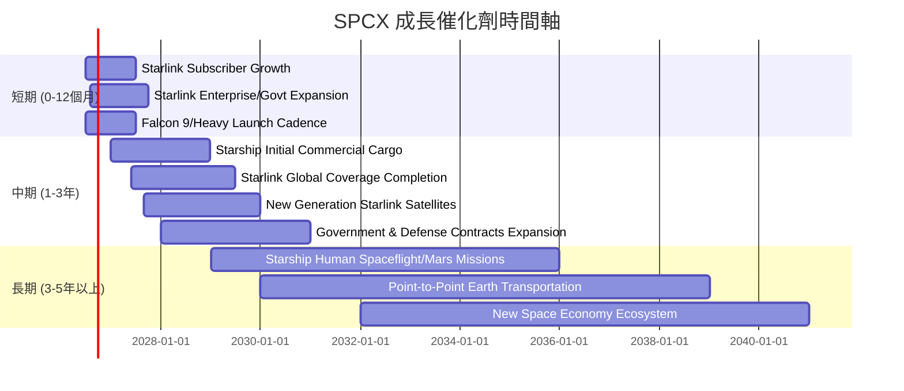
**分析**：
-   **短期**：Starlink 用戶基數的持續增長和企業/政府級服務的擴展將是主要收入驅動力。Falcon 系列火箭的高頻次發射也將確保穩定的發射服務收入。
-   **中期**：Starship 的初步商業貨運任務將為公司帶來新的收入來源。Starlink 全球覆蓋的完成以及新一代衛星的部署將進一步提升服務質量和市場滲透率。政府和國防領域的合作也將持續深化。
-   **長期**：Starship 實現載人太空飛行和火星任務，以及潛在的地球點對點運輸服務，將開啟全新的萬億級市場。SPCX 有望成為新太空經濟生態系統的核心參與者。

### 8.2 TAM 市場規模分析

SPCX 所處的市場具有巨大的潛在總體可尋址市場 (TAM)。

```
╔══════════════════════════════════════════════════════════════════╗
║                  SPCX 總體可尋址市場 (TAM) 分析                   ║
╠══════════════════════════════════════════════════════════════════╣
║                                                                  ║
║  低軌衛星寬頻服務 (Starlink)：                                   ║
║  ├── TAM 估計： $1.0T+ (未來10年累計)                             ║
║  ├── 當前滲透率： ~2% (基於用戶數和ARPU估算)                     ║
║  └── 貢獻收入：  ~$10B+ (FY2025估計)                             ║
║                                                                  ║
║  太空發射服務 (Falcon系列)：                                     ║
║  ├── TAM 估計： $100B+ (未來10年累計)                            ║
║  ├── 當前滲透率： ~50% (商業發射市場)                            ║
║  └── 貢獻收入：  ~$8B+ (FY2025估計)                              ║
║                                                                  ║
║  未來太空運輸/探索 (Starship/Mars)：                             ║
║  ├── TAM 估計： 數萬億美元 (長期潛力，包含太空旅遊、資源開採等)  ║
║  └── 貢獻收入：  尚未實現，但潛力巨大                            ║
║                                                                  ║
║  📊 結論：SPCX 面臨多個萬億級別的市場機會，當前滲透率仍低，成長空間廣闊。║
╚══════════════════════════════════════════════════════════════════╝
```
**分析**：
SPCX 在多個巨大市場中運營：
-   **低軌衛星寬頻**：全球仍有數十億人缺乏高速互聯網接入，Starlink 瞄準了這個萬億美元的市場。隨著服務覆蓋擴大和用戶數增加，其收入潛力巨大。
-   **太空發射**：商業衛星部署、政府任務等需求持續增長。SPCX 的成本優勢使其在這一市場中佔據主導地位。
-   **未來太空運輸與探索**：Starship 最終目標是實現行星際運輸，這將開啟一個前所未有的市場，包括太空旅遊、月球和火星基地建設、太空資源開採等，其 TAM 幾乎是無限的。

### 8.3 成長驅動力結構圖

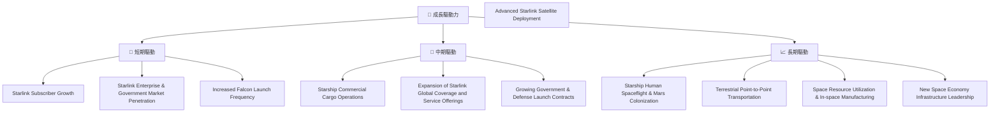
**分析**：
SPCX 的成長驅動力是多層次的：
-   **短期**：主要由 Starlink 用戶增長和現有 Falcon 火箭發射服務的頻率提升驅動。
-   **中期**：Starship 的初步商業化將帶來新的收入來源。Starlink 網絡的持續擴展和服務升級將鞏固其市場地位。
-   **長期**：Starship 在載人太空飛行、火星任務以及潛在的地球點對點運輸方面的突破，將是公司實現指數級增長的終極催化劑。SPCX 旨在成為未來太空經濟的基石。

---

## 9. 風險矩陣

SPCX 作為一家顛覆性創新公司，其投資伴隨著高回報潛力，但也面臨著顯著的風險。

### 9.1 風險評分矩陣

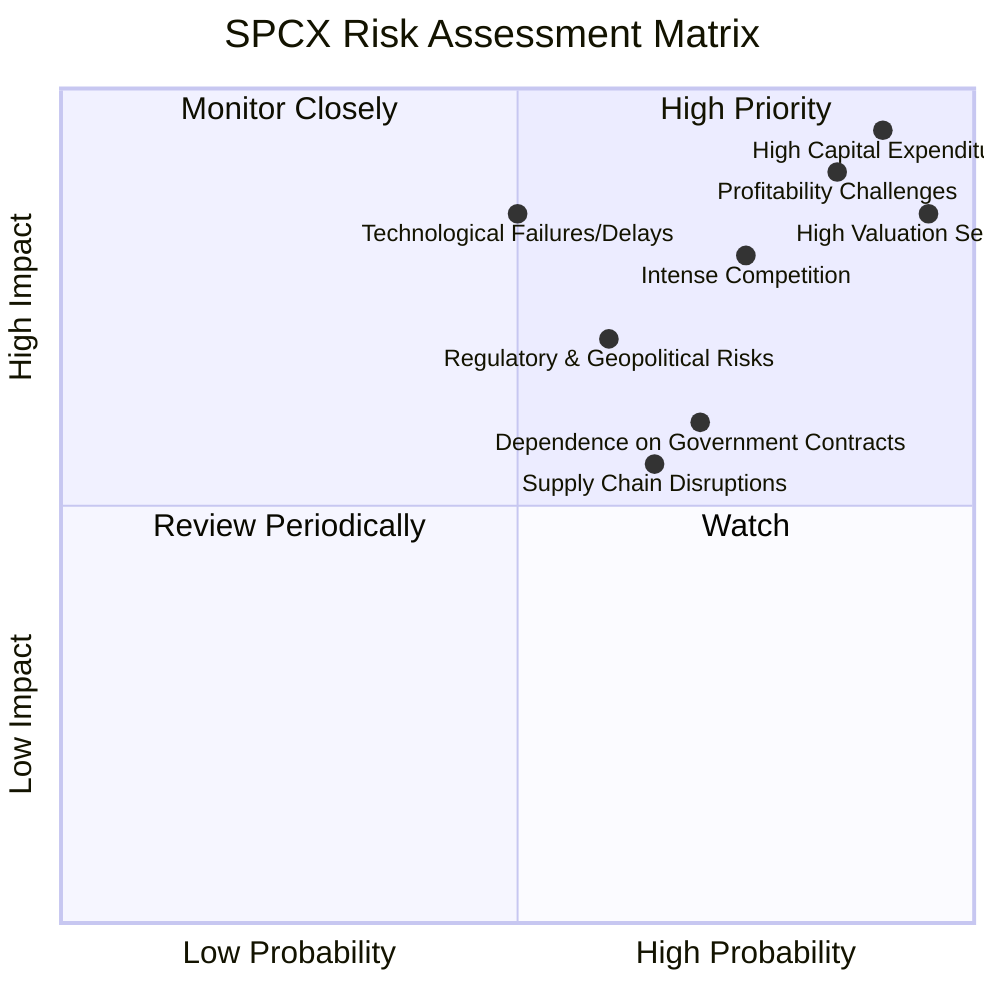

### 9.2 風險清單詳細分析

| # | 風險項目 | 發生機率 | 財務衝擊 | 風險評分 | 緩解措施 |
|---|----------|----------|----------|----------|----------|
| 1 | 🔴 **高資本支出與資金需求** | 高 (90%) | 極高 (-$14.12B FCF, 2025) | 🔴 9.5/10 | 持續多元化融資渠道（股權/債務），優化資本支出效率，推動Starlink盈利轉正以產生內部現金流。 |
| 2 | 🔴 **盈利能力不確定性** | 高 (85%) | 高 (TTM淨利率 -45.0%) | 🔴 9.0/10 | 提升Starlink用戶ARPU，擴展企業級/政府級服務，提高發射服務利潤率，嚴格控制營運費用。 |
| 3 | 🔴 **估值過高與市場預期管理** | 極高 (95%) | 極高 (股價波動) | 🔴 8.5/10 | 穩健執行成長策略，持續實現營收目標，並在未來展示清晰的盈利路徑，以證明當前估值的合理性。 |
| 4 | 🟡 **激烈競爭** | 中高 (75%) | 中高 (市場份額/定價壓力) | 🟡 8.0/10 | 維持技術領先優勢，利用規模效應降低成本，通過服務創新和生態系統建設增強客戶粘性。 |
| 5 | 🟡 **技術故障與延遲** | 中 (50%) | 高 (發射失敗/Starship延遲) | 🟡 8.5/10 | 嚴格的質量控制和測試流程，冗餘設計，多元化產品組合以分散風險，積極與監管機構合作確保安全。 |
| 6 | 🟡 **監管與地緣政治風險** | 中 (60%) | 中高 (政策變化/許可證) | 🟡 7.0/10 | 積極參與政策制定，與各國政府和國際組織建立良好關係，遵守國際太空法規。 |
| 7 | 🟡 **對政府合同的依賴** | 中高 (70%) | 中 (收入波動) | 🟡 6.0/10 | 積極拓展商業客戶基礎，分散收入來源，減少對單一客戶或合同的過度依賴。 |
| 8 | 🟡 **供應鏈中斷** | 中高 (65%) | 中 (生產延遲/成本增加) | 🟡 5.5/10 | 建立多元化供應商網絡，進行關鍵部件的庫存管理，提升垂直整合能力，降低外部依賴。 |

---

## 10. 投資建議

綜合以上深度分析，SPCX 是一家具有極高成長潛力和顛覆性技術的領先公司，但其當前估值反映了極度樂觀的市場預期，且公司在實現規模化盈利和正自由現金流方面仍面臨巨大挑戰。

### 10.1 最終綜合評級雷達圖

```
╔══════════════════════════════════════════════════════════════════╗
║                  SPCX 綜合評級雷達圖                             ║
╠══════════════════════════════════════════════════════════════════╣
║                                                                  ║
║  基本面強度  7.0 ▓▓▓▓▓▓▓▓▓▓▓▓▓▓░░░░░░  ★★★☆☆           ║
║  成長動能    9.0 ▓▓▓▓▓▓▓▓▓▓▓▓▓▓▓▓▓▓░░  ★★★★★           ║
║  獲利品質    3.0 ▓▓▓▓▓▓░░░░░░░░░░░░░░  ★☆☆☆☆           ║
║  財務健康    6.0 ▓▓▓▓▓▓▓▓▓▓▓▓░░░░░░░░  ★★★☆☆           ║
║  估值合理性  2.0 ▓▓▓▓░░░░░░░░░░░░░░░░  ☆☆☆☆☆           ║
║  護城河深度  9.0 ▓▓▓▓▓▓▓▓▓▓▓▓▓▓▓▓▓▓░░  ★★★★★           ║
║  管理層執行  8.0 ▓▓▓▓▓▓▓▓▓▓▓▓▓▓▓▓░░░░  ★★★★☆           ║
║  技術創新力 10.0 ▓▓▓▓▓▓▓▓▓▓▓▓▓▓▓▓▓▓▓▓  ★★★★★           ║
╠══════════════════════════════════════════════════════════════════╣
║  綜合總分    6.0 ▓▓▓▓▓▓▓▓▓▓▓▓░░░░░░░░  🏆 具備高成長潛力，但需警惕高估值和盈利挑戰║
╚══════════════════════════════════════════════════════════════════╝
```

### 10.2 目標價與隱含報酬率

根據我們的DCF敏感性分析，並考慮到SPCX的高風險和高成長特性，我們給出以下目標價和隱含報酬率：

| 情境 | 目標價 | 隱含報酬率 (vs. 當前 $160.42) | 機率權重 | 綜合加權目標價 |
|------|--------|------------------------------|----------|----------------|
| **悲觀情境** | $140 | -12.73% | 25% | $35.00 |
| **基準情境** | $175 | +9.09% | 50% | $87.50 |
| **樂觀情境** | $200 | +24.67% | 25% | $50.00 |
| **綜合加權** | **$172.50** | **+7.53%** | **100%** |                |

**投資評級：🟡 持有**
雖然我們的基準情境目標價 ($175) 略高於當前股價，但考慮到其極高的估值倍數、持續為負的自由現金流以及盈利能力的不確定性，SPCX 的風險溢價極高。我們認為當前股價已充分反映了大部分的成長預期。因此，我們建議「持有」已持有的倉位，對於未持有者，建議保持觀望，等待更好的買入時機或公司盈利能力出現更明確的改善跡象。

### 10.3 買入時機與觸發因素

```
╔══════════════════════════════════════════════════════════════════╗
║                  ✅ 買入觸發因素 Checklist                      ║
╠══════════════════════════════════════════════════════════════════╣
║                                                                  ║
║  立即買入觸發條件（多數符合）：                                  ║
║  ☐ 股價跌至悲觀情境目標價 ($140) 或以下，提供更大安全邊際       ║
║  ☐ 自由現金流持續轉正，並呈現穩定增長趨勢                       ║
║  ☐ 季度淨利潤持續轉正，且毛利率和營業利益率穩步提升             ║
║  ☐ Starlink用戶ARPU顯著提升，且企業級/政府級客戶增長超預期      ║
║  ☐ Starship成功完成首次商業貨運任務並實現可重複使用             ║
║                                                                  ║
║  加碼觸發條件（出現以下任一）：                                  ║
║  ☐ 營運現金流與資本支出之間的差距顯著縮小，顯示資金效率提升     ║
║  ☐ 獲得大型且盈利豐厚的政府或商業發射合同                       ║
║  ☐ 競爭格局出現有利於SPCX的變化（如競爭對手延遲或失敗）         ║
║  ☐ 宏觀經濟環境改善，風險偏好提升                               ║
║                                                                  ║
║  減碼/停損觸發條件（出現以下任一）：                             ║
║  ☐ 營收增長大幅不及預期，市場份額被侵蝕                         ║
║  ☐ 盈利能力持續惡化，自由現金流負值進一步擴大且無改善跡象       ║
║  ☐ Starship 或 Starlink 關鍵技術開發遭遇重大挫折或長期延遲      ║
║  ☐ 監管環境對公司業務產生嚴重負面影響                           ║
║  ☐ 關鍵管理層變動或公司治理出現重大問題                         ║
╚══════════════════════════════════════════════════════════════════╝
```

### 10.4 投資人適配度分析

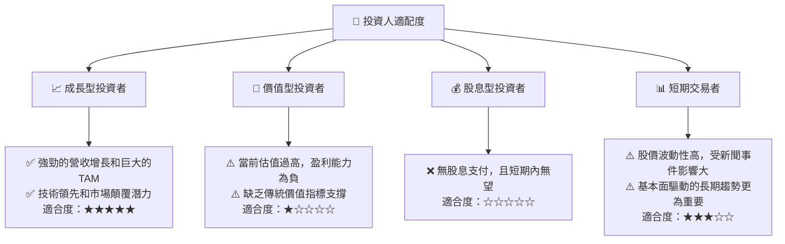
**分析**：
SPCX 最適合那些具有高風險承受能力、堅定看好長期太空經濟發展，並願意為顛覆性創新支付高溢價的**成長型投資者**。對於追求穩定現金流或基於傳統價值指標進行投資的投資者來說，SPCX 並不適合。短期交易者可以關注其新聞和技術面，但其核心投資邏輯仍是長期基本面。

### 10.5 關鍵監控指標

| 監控類型 | 指標 | 關注點 | 頻率 |
|----------|------|--------|------|
| **營收成長** | Starlink用戶數增長 | 衡量市場滲透率和網絡效應 | 季度 |
| **營收成長** | 總收入 YoY/QoQ 成長率 | 衡量整體業務擴張速度 | 季度/年度 |
| **盈利能力** | 毛利率、營業利益率、淨利率 | 衡量成本控制和盈利轉化能力 | 季度/年度 |
| **現金流** | 自由現金流 (FCF) | 衡量公司內生資金創造能力 | 季度/年度 |
| **資本效率** | ROIC vs WACC 差距 | 衡量股東價值創造能力 | 年度 |
| **技術進展** | Starship 開發與發射進度 | 衡量核心技術里程碑達成情況 | 持續 |
| **財務健康** | 淨債務/EBITDA | 衡量債務負擔和償債能力 | 季度/年度 |
| **市場競爭** | 競爭對手進展 (如Amazon Kuiper) | 評估市場格局變化 | 持續 |

---

> **免責聲明**：本報告為 AI 自動生成，僅供研究參考，不構成投資建議。投資有風險，入市需謹慎。