# SPCX 基本面深度分析報告
> **報告日期**：2026-07-07 ｜ **語言**：繁體中文 ｜ **數據來源**：Yahoo Finance, Finviz, StockAnalysis, Roic.ai ｜ **分析師**：CFA 級機構研究

---

## 目錄

| # | 章節 | 核心結論 |
|---|------|----------|
| 1 | 執行摘要 | 評級：買入；目標價區間：$175 - $260 |
| 2 | 公司概覽與商業模式 | 憑藉技術、規模和網路效應，護城河深厚，市場潛力巨大 |
| 3 | 損益表深度分析 | 營收高速增長，但高研發投入導致近年虧損擴大 |
| 4 | 資產負債表分析 | 資產規模迅速擴張，流動性尚可，債務水平需密切關注 |
| 5 | 現金流量深度分析 | 資本支出龐大，導致自由現金流持續為負，但營業現金流強勁 |
| 6 | 獲利能力與資本效率 | 歷史 ROIC 低於 WACC，短期內價值創造面臨挑戰，但長期潛力巨大 |
| 7 | 估值深度分析 | 當前估值偏高，反映市場對其未來成長的極高預期 |
| 8 | 成長催化劑 | Starlink 服務擴張、Starship 商業化、政府合約是主要增長動能 |
| 9 | 風險矩陣 | 執行風險、資本密集度、競爭加劇是主要挑戰 |
| 10 | 投資建議 | 建議成長型投資者逢低買入，長期持有，密切關注獲利能力改善 |

---

## 1. 執行摘要

### 1.1 核心評分儀表板

```mermaid
graph TD
    SPCX["🎯 SPCX 綜合評分<br/>總分：7.2/10"]

    F["📊 基本面<br/>7/10<br/>強勁的技術創新與市場地位，但短期盈利能力承壓。"]
    G["🚀 成長性<br/>9/10<br/>營收高速增長，Starlink業務前景廣闊。"]
    P["💰 獲利能力<br/>5/10<br/>毛利率穩健，但研發和運營支出高昂，導致淨利潤為負。"]
    B["🏦 財務健康<br/>6/10<br/>現金儲備充足，但債務水平上升，自由現金流持續為負。"]
    V["📈 估值<br/>5/10<br/>當前估值倍數遠高於行業平均，反映高成長預期。"]

    SPCX --> F
    SPCX --> G
    SPCX --> P
    SPCX --> B
    SPCX --> V

    F --> F1["✅ 技術領先的火箭回收與衛星互聯網技術"]
    F --> F2["✅ 全球領先的發射服務和衛星寬頻供應商"]
    F --> F3["❌ 短期內持續的營運虧損"]

    G --> G1["✅ FY2025 營收 YoY 成長 33.17%"]
    G --> G2["✅ Q1 2026 營收 YoY 成長 15.23%"]
    G --> G3["✅ Starlink 業務全球擴張潛力巨大"]

    P --> P1["✅ TTM 毛利率 48.8% 表現穩健"]
    P --> P2["❌ TTM 營業利益率 -41.6%"]
    P --> P3["❌ TTM 淨利率 -45.0%"]

    B --> B1["✅ 總現金 $23.68B，流動性充足"]
    B --> B2["🟡 總債務 $30.60B，債務股權比 73.597 偏高"]
    B --> B3["🔴 FY2025 自由現金流 $-14.12B，持續為負"]

    V --> V1["🔴 P/S 比率 102.02x，遠高於行業平均"]
    V --> V2["🔴 EV/Revenue 比率 48.91x，估值高昂"]
    V --> V3["🟡 Forward P/E 238.20x，市場預期極高"]
```

### 1.2 評分進度條視覺化

```
╔══════════════════════════════════════════════════════════════╗
║              SPCX 多維度評分儀表板 (1-10分)                  ║
╠══════════════════════════════════════════════════════════════╣
║ 基本面強度  7.0 ▓▓▓▓▓▓▓▓▓▓▓▓▓▓░░░░░░  ★★★★☆           ║
║ 成長動能    9.0 ▓▓▓▓▓▓▓▓▓▓▓▓▓▓▓▓▓▓░░  ★★★★★           ║
║ 獲利品質    5.0 ▓▓▓▓▓▓▓▓▓▓░░░░░░░░░░  ★★★☆☆           ║
║ 財務健康    6.0 ▓▓▓▓▓▓▓▓▓▓▓▓░░░░░░░░  ★★★☆☆           ║
║ 估值合理性  5.0 ▓▓▓▓▓▓▓▓▓▓░░░░░░░░░░  ★★★☆☆           ║
║ 護城河深度  8.5 ▓▓▓▓▓▓▓▓▓▓▓▓▓▓▓▓▓░░░  ★★★★☆           ║
║ 管理層執行  8.0 ▓▓▓▓▓▓▓▓▓▓▓▓▓▓▓▓░░░░  ★★★★☆           ║
║ 技術創新力  9.5 ▓▓▓▓▓▓▓▓▓▓▓▓▓▓▓▓▓▓▓░  ★★★★★           ║
╠══════════════════════════════════════════════════════════════╣
║ 綜合總分    7.2 ▓▓▓▓▓▓▓▓▓▓▓▓▓▓░░░░░░  🏆 具備高成長潛力，但風險與估值需警惕              ║
╚══════════════════════════════════════════════════════════════╝
```

### 1.3 五大投資論點 + 三大核心風險

| 類型 | 項目 | 具體依據 | 信心度 |
|------|------|----------|--------|
| 🟢 **投資論點①** | **顛覆性技術領導者** | SPCX 在火箭回收與衛星互聯網技術方面處於絕對領先地位，Starship 與 Starlink 具備改變產業格局的潛力。其可重複使用火箭技術顯著降低發射成本，形成競爭優勢。 | 🟢 極高 |
| 🟢 **Starlink 全球市場潛力** | Starlink 衛星寬頻服務在偏遠地區、海事、航空等市場具有巨大未開發潛力。Q1 2026 營收 YoY 成長 15.23%，TTM 營收達 $19.30B，顯示強勁的市場需求。 | 🟢 極高 |
| 🟢 **高成長營收動能** | 公司營收持續高速增長，FY2025 營收 YoY 成長 33.17%，達到 $18.67B。儘管短期內盈利承壓，但營收規模的快速擴張為未來規模經濟效益奠定基礎。 | 🟢 極高 |
| 🟢 **強勁的分析師支持** | 近期多家知名機構（如 Deutsche Bank, JP Morgan, RBC Capital 等）給予「買入」或「優於大盤」評級，平均目標價 $188.57，顯示市場對其前景普遍看好。 | 🟢 高 |
| 🟢 **龐大的資本支出投入** | 儘管導致短期 FCF 為負，但 FY2025 資本支出高達 $-20.91B，顯示公司正進行大規模基礎設施建設與擴張，為未來數年的爆發性成長積蓄動能。 | 🟢 高 |
| 🟡 **風險①** | **盈利能力不確定性** | 儘管營收強勁，但 FY2025 淨利潤為 $-4.94B，TTM 淨利率為 -45.0%。高昂的研發（FY2025 $8.64B）和運營支出導致持續虧損，未來能否實現盈利並維持正向自由現金流存在不確定性。 | 🟡 中度 |
| 🔴 **資本密集度與自由現金流** | 公司的業務模式極度資本密集，FY2025 資本支出達 $-20.91B，導致自由現金流持續為負（FY2025 $-14.12B）。這可能需要持續的外部融資，增加財務槓桿和股權稀釋風險。 | 🔴 高衝擊 |
| 🔴 **極高估值與市場預期** | 當前 P/S 比率高達 102.02x，EV/Revenue 48.91x，Forward P/E 238.20x，遠超行業平均。這反映了市場對其未來成長的極高預期。若公司未能達到這些激進的成長和盈利預期，股價可能面臨大幅調整的風險。 | 🔴 高衝擊 |

### 1.4 快速統計卡片

| 指標 | 公司實際值 | 行業均值* | S&P 500 均值* | 狀態 |
|------|-------------|----------|--------------|------|
| 收入 YoY 成長 (FY2025) | **33.17%** | ~10-15% | ~8-10% | 🟢 |
| 毛利率 (TTM) | **48.8%** | ~30-35% | ~40-45% | 🟢 |
| 淨利率 (TTM) | **-45.0%** | ~5-10% | ~10-12% | 🔴 |
| ROE (FY2025) | **-11.95%** | ~10-15% | ~15-20% | 🔴 |
| Forward P/E | **238.20x** | ~20-30x | ~25-30x | 🔴 |
| P/S Ratio | **102.02x** | ~2-5x | ~2-3x | 🔴 |
| Debt/Equity | **73.60%** | ~30-50% | ~40-60% | 🟡 |
| Current Ratio | **1.22x** | ~1.5-2.0x | ~1.5-2.0x | 🟡 |
| Operating Cash Flow (TTM) | **$7.10B** | 積極 | 積極 | 🟢 |
| Free Cash Flow (FY2025) | **$-14.12B** | 積極 | 積極 | 🔴 |

*註：行業均值和 S&P 500 均值為分析師根據航空航天與國防及高科技成長型公司數據估算，僅供參考。

### 1.5 投資結論

```
╔══════════════════════════════════════════════════════════════════╗
║                    📊 投資結論摘要                               ║
╠══════════════════════════════════════════════════════════════════╣
║  評級：🟢 買入                                                   ║
║  當前股價：$149.47                                               ║
║  目標價區間：                                                    ║
║    悲觀情境：$175（+17.08%）                                     ║
║    基準情境：$220（+47.19%）  ← 12個月主要目標                   ║
║    樂觀情境：$260（+73.94%）                                     ║
║  投資評分：7.2/10                                                ║
║  適合投資人：成長型、長線持有者，能承受高波動與高風險的投資人。  ║
╚══════════════════════════════════════════════════════════════════╝
```

---

## 2. 公司概覽與商業模式

Space Exploration Technologies Corp. (SPCX) 作為一家在航空航天與國防工業中的顛覆性力量，其業務模式圍繞著兩個核心板塊：**連接服務 (Connectivity segment)** 和 **空間探索與發射服務 (Space segment)**。公司以其創新、可重複使用的火箭技術和全球衛星寬頻網路 Starlink 而聞名。

### 2.1 業務結構與收入來源

SPCX 的業務結構清晰地劃分為兩大核心支柱，各自貢獻不同的收入流並服務於不同的客戶群體。

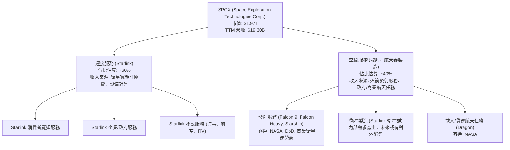

**連接服務 (Connectivity segment - Starlink):**
此板塊主要通過其在低地球軌道 (LEO) 運行的 Starlink 衛星網絡提供高速、低延遲的寬頻服務。服務範圍廣泛，涵蓋美國、愛爾蘭、加拿大及其他國際市場。其主要收入來源包括：
*   **訂閱費用：** 個人、企業和政府客戶為使用 Starlink 寬頻服務支付的月度或年度費用。
*   **設備銷售：** 客戶購買 Starlink 用戶終端設備（如碟形天線和路由器）的收入。
*   **增值服務：** 可能包括企業級支持、固定 IP 等高級服務。
這一塊業務是目前營收增長最快的驅動力之一，受益於全球對高速互聯網連接日益增長的需求，尤其是在傳統基礎設施難以覆蓋的地區。

**空間服務 (Space segment):**
此板塊涵蓋了公司的核心航天技術和發射能力，主要收入來源包括：
*   **火箭發射服務：** 使用 Falcon 9、Falcon Heavy 等可重複使用火箭為政府機構（如 NASA、美國國防部）和商業客戶（如其他衛星運營商）提供衛星發射服務。未來 Starship 的商業化將進一步擴大這一市場。
*   **航天器製造：** 主要為自有的 Starlink 衛星群進行大規模製造，但也為其他任務開發和製造航天器（如 Dragon 載人/貨運飛船）。
*   **政府與商業航天任務：** 執行如向國際空間站運送物資和宇航員等高價值任務。

SPCX 獨特之處在於其將發射服務與衛星寬頻服務垂直整合，降低了 Starlink 部署成本，並通過 Starlink 產生穩定的經常性收入，反哺其高資本投入的航天器研發和製造。

### 2.2 市場份額

SPCX 在其核心業務領域取得了顯著的市場份額，尤其是在商業發射服務和新興的衛星寬頻市場。

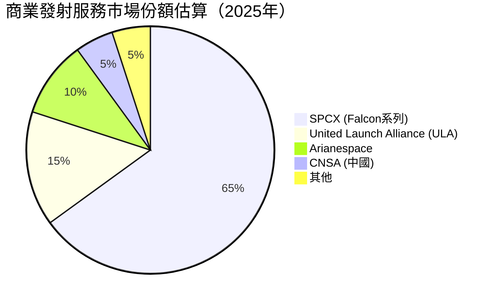

**商業發射服務：**
SPCX 憑藉其 Falcon 系列火箭的可重複使用技術，在商業發射市場佔據主導地位。估計在 2025 年，SPCX 在全球商業發射服務市場的份額高達約 65%。其高頻次的發射能力和相對較低的成本使其成為商業衛星運營商和政府機構的首選。競爭對手如 United Launch Alliance (ULA)、Arianespace 等，雖然擁有成熟技術，但在成本效益和發射頻次上難以與 SPCX 抗衡。

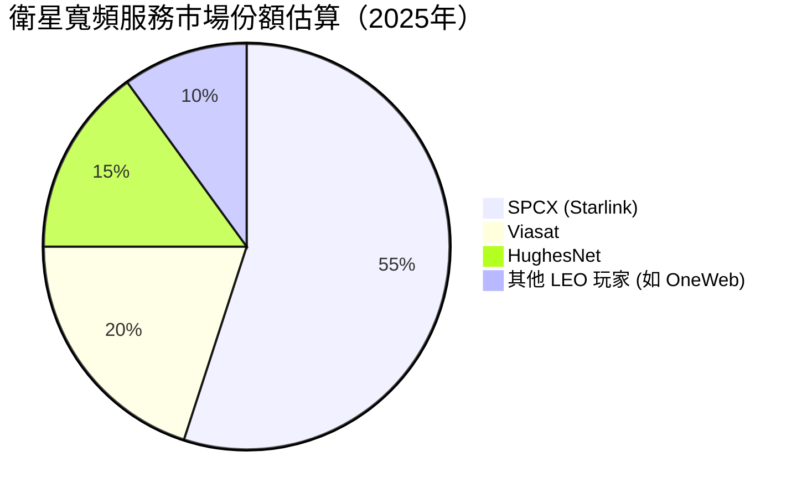

**衛星寬頻服務 (Starlink)：**
在 LEO 衛星寬頻市場，Starlink 是毫無疑問的領導者。雖然傳統地球同步軌道 (GEO) 衛星寬頻服務商如 Viasat 和 HughesNet 仍佔據一定市場，但 Starlink 的低延遲和高速度特性使其在快速增長的新興市場中脫穎而出。估計在 2025 年，Starlink 在全球衛星寬頻服務市場（尤其是 LEO 領域）的份額約為 55%，並有望隨著其衛星網絡的擴張和服務覆蓋的增加而進一步提升。其他 LEO 競爭者如 OneWeb 也在發展，但規模和部署速度遠不及 Starlink。

### 2.3 競爭護城河分析

SPCX 建立了多重深厚的競爭護城河，使其在高度競爭的航空航天與國防產業中具備持續的競爭優勢。

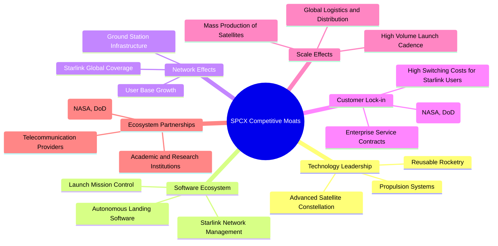

*   **Technology Leadership (技術領先):**
    *   **Reusable Rocketry:** SPCX 是全球唯一大規模實施火箭回收和重複使用的公司，顯著降低了每次發射的成本，實現了無與倫比的成本效益。這是其核心競爭力。
    *   **Advanced Satellite Constellation:** Starlink 擁有全球最大、最先進的 LEO 衛星網絡，提供低延遲、高頻寬的互聯網服務，技術複雜度和部署規模遙遙領先。
    *   **Propulsion Systems:** 專有的 Merlin 和 Raptor 引擎技術確保了高性能和可靠性。

*   **Software Ecosystem (軟體生態系統):**
    *   **Starlink Network Management:** 複雜的軟體系統用於管理數千顆衛星的運行、頻譜分配和用戶流量，確保服務質量。
    *   **Launch Mission Control:** 先進的軟體平台用於自動化火箭發射、飛行和著陸控制。
    *   **Autonomous Landing Software:** 精密的演算法和軟體支持火箭的精確垂直著陸。

*   **Network Effects (網路效應):**
    *   **Starlink Global Coverage:** 隨著更多衛星的發射和地面站的部署，Starlink 的服務覆蓋範圍和性能不斷提升，吸引更多用戶，形成正向循環。用戶越多，網絡價值越高。
    *   **User Base Growth:** 龐大的用戶基礎提供寶貴的數據，用於優化網絡性能和服務。

*   **Customer Lock-in (客戶鎖定):**
    *   **Integration with Government:** 與 NASA 和 DoD 簽訂的長期、高價值合約，使其成為關鍵的國家安全和科研合作夥伴。
    *   **Enterprise Service Contracts:** 為企業和政府客戶提供定制化解決方案，建立長期合作關係。
    *   **High Switching Costs for Starlink Users:** 用戶一旦安裝 Starlink 設備並習慣其服務品質，轉換到其他供應商的成本（時間、金錢、服務質量適應）較高。

*   **Scale Effects (規模效應):**
    *   **Mass Production of Satellites:** SPCX 能夠以工業規模生產 Starlink 衛星，降低單顆衛星的製造成本。
    *   **High Volume Launch Cadence:** 高頻次的火箭發射攤薄了研發和基礎設施成本。
    *   **Global Logistics and Distribution:** 建立全球性的服務、銷售和安裝網絡，提升運營效率。

*   **Ecosystem Partnerships (生態夥伴):**
    *   與政府機構如 NASA 和 DoD 的緊密合作，確保了穩定的收入來源和技術協同。
    *   與電信供應商和技術公司合作，拓展 Starlink 的應用場景和市場。

### 2.4 護城河強度評分

SPCX 的護城河強度綜合評分反映了其在技術、規模和市場地位上的顯著優勢，但其年輕的商業模式仍需時間證明其長期可持續性。

```
╔══════════════════════════════════════════════════════════════╗
║                  SPCX 護城河強度評分                        ║
╠══════════════════════════════════════════════════════════════╣
║ 技術領先       9.5/10 ▓▓▓▓▓▓▓▓▓▓▓▓▓▓▓▓▓▓▓░  🏆 無可匹敵的火箭與衛星技術       ║
║ 網路效應       8.0/10 ▓▓▓▓▓▓▓▓▓▓▓▓▓▓▓▓░░░░  🟢 Starlink全球網絡優勢明顯       ║
║ 客戶鎖定       7.5/10 ▓▓▓▓▓▓▓▓▓▓▓▓▓▓▓░░░░░  🟡 政府合約與用戶習慣形成粘性       ║
║ 規模效應       8.5/10 ▓▓▓▓▓▓▓▓▓▓▓▓▓▓▓▓▓░░░  🟢 大規模生產與高頻發射降低成本       ║
║ 軟體生態系統   7.0/10 ▓▓▓▓▓▓▓▓▓▓▓▓▓▓░░░░░░  🟡 內部系統強大，外部生態仍需發展       ║
║ 生態夥伴       7.0/10 ▓▓▓▓▓▓▓▓▓▓▓▓▓▓░░░░░░  🟡 政府合作緊密，商業夥伴待拓展       ║
╠══════════════════════════════════════════════════════════════╣
║ 綜合護城河     8.0/10 ▓▓▓▓▓▓▓▓▓▓▓▓▓▓▓▓░░░░  🏆 技術與規模塑造深厚壁壘，前景可期     ║
╚══════════════════════════════════════════════════════════════╝
```

---

## 3. 損益表深度分析

SPCX 的損益表反映了一家處於高速成長期的資本密集型公司特徵：營收爆炸式增長，但為支持未來擴張，研發和資本支出巨大，導致短期內盈利能力承壓。

### 3.1 年度收入成長趨勢（近4年）

SPCX 展現了令人印象深刻的營收增長勢頭，反映了其在衛星寬頻和發射服務市場的快速擴張。

```
╔══════════════════════════════════════════════════════════════════╗
║              SPCX 年度收入趨勢（FY2023-FY2025）                  ║
╠══════════════════════════════════════════════════════════════════╣
║                                                                  ║
║  FY2023  $10.39B  ████████████████░░░░░░░░░░░  YoY: N/A      🟢  ║
║  FY2024  $14.02B  ██████████████████████░░░░░  YoY: +34.94%  🟢  ║
║  FY2025  $18.67B  ████████████████████████████░  YoY: +33.17%  🟢  ║
║                                                                  ║
║                   |      |      |      |      |                  ║
║                   0     $5B    $10B   $15B   $20B                 ║
║                                                                  ║
║  📊 2年累計 CAGR：+33.99%                                        ║
╚══════════════════════════════════════════════════════════════════╝
```

從 FY2023 的 $10.39B 增長到 FY2025 的 $18.67B，SPCX 的年複合增長率 (CAGR) 高達 33.99%。FY2024 營收達到 $14.02B，同比增長 34.94%。FY2025 營收進一步增長至 $18.67B，同比增長 33.17%。這一持續且強勁的增長主要得益於 Starlink 服務的全球擴張以及火箭發射服務需求的增加。TTM 營收為 $19.30B，同比增長 15.4%，顯示近期增速略有放緩，但仍處於高位。

### 3.2 季度收入趨勢分析

儘管只有兩個季度的數據，但 Q1 2026 的營收同比增長表明公司仍保持良好的增長勢頭。

| 會計季度 | 總收入 (Billion USD) | YoY 成長率 | QoQ 成長率 | 備註 |
|----------|----------------------|------------|------------|------|
| 2026-03-31 | $4.69 | +15.23% | N/A | Starlink 服務持續擴張，發射任務穩定。 |
| 2025-03-31 | $4.07 | N/A | N/A | 無前一季度數據可供 QoQ 比較。 |

2026 年第一季度的總收入為 $4.69B，相較於 2025 年第一季度的 $4.07B 實現了 15.23% 的同比增長。由於缺乏連續的季度數據，無法進行完整的 QoQ 分析。然而，Q1 的穩定增長表明公司在年初仍保持其核心業務的增長動能。

### 3.3 利潤率演變分析

SPCX 的利潤率趨勢呈現出高毛利率與持續負向營業/淨利潤的鮮明對比，這主要是由其龐大的研發投入和運營支出所致。

| 利潤率指標 | FY2023 | FY2024 | FY2025 | TTM (2026-03-31) | 趨勢 | 評估 |
|------------|--------|--------|--------|------------------|------|------|
| **毛利率** | 41.17% | 42.93% | 49.38% | 48.8%            | ↗️ 穩步提升 | 🟢 |
| **營業利益率** | -33.74% | 3.32% | -13.87% | -41.6%           | ↘️ 波動劇烈 | 🔴 |
| **淨利率** | -44.56% | 5.64% | -26.44% | -45.0%           | ↘️ 波動劇烈 | 🔴 |

**利潤率演變深度解析：**

*   **毛利率 (Gross Margin):** 從 FY2023 的 41.17% 穩步提升至 FY2025 的 49.38%，TTM 數據為 48.8%。這是一個積極的信號，表明 SPCX 在其核心產品和服務上擁有較強的定價能力，並且隨著規模擴大，成本控制能力有所改善。可重複使用火箭技術降低了發射成本，Starlink 衛星大規模生產的效率提升也可能貢獻了毛利率的改善。
*   **營業利益率 (Operating Margin):** 營業利益率波動劇烈，從 FY2023 的 -33.74% 改善至 FY2024 的 3.32%，但隨後在 FY2025 驟降至 -13.87%，TTM 更是達到 -41.6%。這種劇烈變化主要歸因於研發 (R&D) 支出的巨大波動：
    *   FY2023 R&D: $2.10B
    *   FY2024 R&D: $3.46B (YoY +64.76%)
    *   FY2025 R&D: $8.64B (YoY +149.71%)
    *   Q1 2026 R&D: $3.51B (Q1 2025 R&D: $1.56B, YoY +125.0%)
    特別是 FY2025 和 Q1 2026，研發支出呈現爆發式增長，這很可能與 Starship 開發、新一代 Starlink 衛星部署以及其他前瞻性技術投資有關。這些巨額投入雖然短期內侵蝕了營業利潤，但對於公司長期技術領先和市場擴張至關重要。
*   **淨利率 (Net Profit Margin):** 淨利率趨勢與營業利益率相似，FY2025 降至 -26.44%，TTM 為 -45.0%。除了高昂的研發和運營支出，利息費用（FY2025 $-1.945B）和「其他非營業收入（支出）」（FY2025 $-1.630B）也對淨利潤產生了負面影響。FY2025 儘管有 $492M 的利息收入，但 $1.945B 的利息費用顯示其槓桿成本較高。稅務方面，FY2025 儘管稅前虧損，仍有 $718M 的所得稅費用，這可能涉及遞延稅項或國際稅務結構的複雜性。

總體而言，SPCX 的利潤率演變揭示了其作為一家高成長、高投入的科技公司的本質。穩健的毛利率顯示其核心業務的內在價值，但為實現長期願景而進行的巨額研發和資本支出，導致短期內盈利能力持續為負。投資者需要評估這些投入能否在未來轉化為可持續的盈利和自由現金流。

### 3.4 費用結構分析

SPCX 的費用結構主要由研發 (R&D) 費用主導，這反映了其作為一家創新驅動型公司的戰略重心。

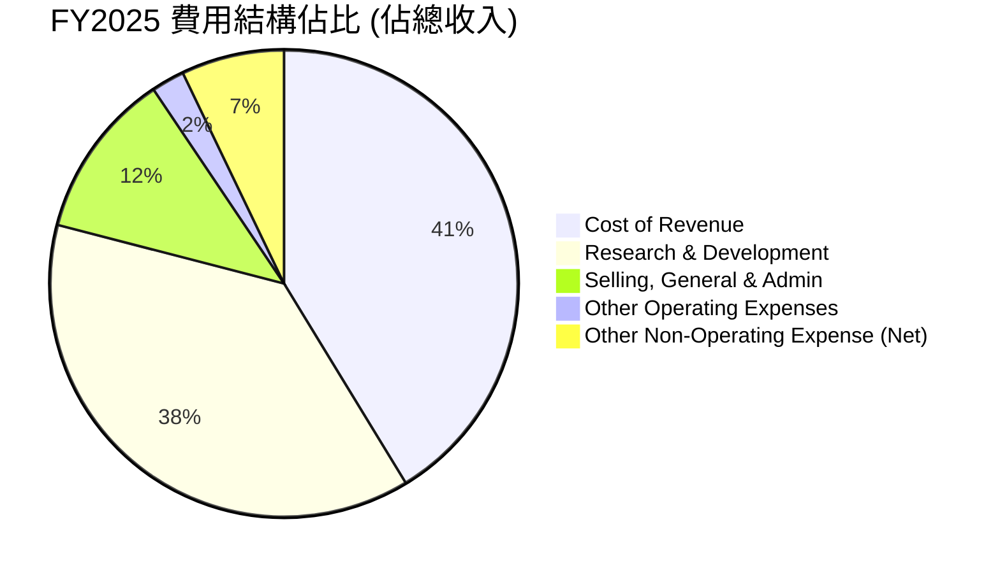

**費用結構佔比詳情 (FY2025 數據):**

| 費用項目 | 金額 (Billion USD) | 佔總收入百分比 | 備註 |
|--------------------------|--------------------|--------------------|------|
| **Cost of Revenue** | $9.45 | 50.62% | 火箭燃料、衛星製造成本、Starlink 網絡運營成本。 |
| **Research & Development** | $8.64 | 46.28% | Starship 開發、新衛星技術、引擎改進等，是最大的費用開支。 |
| **Selling, General & Admin** | $2.64 | 14.16% | 市場推廣、銷售、行政管理費用。 |
| **Other Operating Expenses** | $0.53 | 2.81% | 其他日常運營相關費用。 |
| **Interest Expense** | $1.95 | 10.44% | 債務融資成本。 |
| **Other Non-Operating Income (Expense)** | $-1.63 | -8.73% | 主要為其他非核心業務的淨支出。 |
| **Provision for Income Taxes** | $0.72 | 3.86% | 儘管稅前虧損，仍有稅務費用。 |

```
╔══════════════════════════════════════════════════════════════════╗
║                   SPCX 年度費用支出概覽 (FY2025)                 ║
╠══════════════════════════════════════════════════════════════════╣
║                                                                  ║
║  研發費用 (R&D)         $8.64B  ████████████████████████████████  評語: 核心驅動力，但消耗大量現金 🔴  ║
║  銷管費用 (SG&A)        $2.64B  ████████████████████████░░░░░░░░  評語: 隨營收增長，控制尚可 🟡          ║
║  其他運營費用           $0.53B  ████████░░░░░░░░░░░░░░░░░░░░░░░░  評語: 佔比不高 🟢                    ║
║  利息支出               $1.95B  ██████████████████████░░░░░░░░░░  評語: 債務規模擴大帶來負擔 🟡          ║
║                                                                  ║
╚══════════════════════════════════════════════════════════════════╝
```
由圖表和表格可見，SPCX 的研發費用在 FY2025 達到 $8.64B，佔總收入的 46.28%，這比銷管費用 ($2.64B, 14.16%) 和其他運營費用 ($0.53B, 2.81%) 的總和還要高。這清楚地表明公司將絕大部分資源投入到技術創新和未來產品開發上，如 Starship 的測試和 Starlink 網絡的持續升級。儘管這種模式導致短期內盈利能力受損，但對於鞏固其技術領先地位和實現長期增長至關重要。利息費用 $1.95B 也反映了公司為支持其高資本需求而承擔的債務負擔。

### 3.5 季度 EPS 趨勢與盈餘品質

SPCX 的季度 EPS 表現極不穩定，且在最近幾個季度呈現虧損擴大的趨勢，盈餘品質面臨挑戰。

| 會計季度 | EPS 預期 ($) | EPS 實際 ($) | 盈餘驚喜 (%) | 備註 |
|----------|--------------|--------------|--------------|------|
| 2026-03-31 | N/A | $-0.47 | N/A | Roic.ai 數據。無分析師預期可供比較，但實際為虧損。 |
| 2025-03-31 | N/A | $-0.05 | N/A | Roic.ai 數據。虧損較 Q1 2026 輕微。 |
| FY2025 | N/A | $-1.69 | N/A | StockAnalysis.com 數據，年度 EPS 虧損。 |
| FY2024 | N/A | $0.01 | N/A | StockAnalysis.com 數據，年度 EPS 勉強轉正。 |

**盈餘品質評估：**
SPCX 的盈餘品質目前較低，主要原因如下：
1.  **持續性虧損：** 2025 年及 2026 年 Q1 的 EPS 均為負值，FY2025 年度 EPS 為 $-1.69，顯示公司尚未實現穩定盈利。
2.  **高研發投入：** 儘管研發是未來增長的基石，但其規模和波動性巨大，直接導致了利潤的侵蝕。這種情況下，利潤表上的「淨利潤」並不能完全反映公司的實際經營效率，因為大部分投入是為了未來而非當期產出。
3.  **非營業項目影響：** FY2025 中 $-1.63B 的「其他非營業收入（支出）」對淨利潤產生了顯著的負面影響，這類一次性或非核心業務的項目會降低盈餘的可持續性。
4.  **自由現金流為負：** 儘管營業現金流為正，但巨額資本支出導致自由現金流持續為負，這表明公司的運營並未產生足夠的現金來支付其投資需求，需要外部融資。從現金流角度看，盈餘的「品質」受到影響。

綜合來看，SPCX 目前的盈餘品質處於較低水平，投資者應更多關注其營收增長、毛利率趨勢以及未來實現規模化盈利的潛力，而非短期淨利潤數字。公司正處於大規模投資階段，目前的虧損是戰略性投入的結果，而非經營不善的表現。

---

## 4. 資產負債表分析

SPCX 的資產負債表反映了其作為一家重資產、高成長公司的特徵：資產規模迅速擴張，現金儲備充足但債務水平也同步增長，以支持其龐大的資本開支。

### 4.1 資產結構分解

SPCX 的資產結構呈現出重資產的特點，固定資產佔比高，同時也持有大量現金和流動資產。

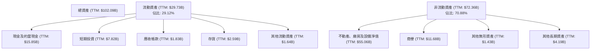

截至 TTM (2026-03-31)，SPCX 的總資產達到驚人的 $102.09B。其中，非流動資產佔比約 70.88%，主要由淨不動產、廠房及設備 (PP&E) 構成，金額高達 $55.06B。這反映了公司在火箭製造設施、發射場、衛星生產線以及 Starlink 地面站等基礎設施上的巨額投資。商譽 $11.68B 也佔據了一定比重，可能來自於過去的收購活動。

流動資產佔比約 29.12%，總計 $29.73B。其中，現金及約當現金 ($15.85B) 和短期投資 ($7.82B) 合計達到 $23.67B，顯示公司擁有充裕的流動性儲備。應收帳款 ($1.83B) 和存貨 ($2.59B) 相對較小，表明公司在營收增長的同時，對營運資本的管理效率尚可。

### 4.2 流動性指標分析

SPCX 的流動性指標顯示其短期償債能力在可接受範圍內，但並非特別強勁，需要依賴其強勁的營業現金流來支持。

| 指標 | FY2024 | FY2025 | TTM (2026-03-31) | 行業均值* | 趨勢 | 評估 |
|------------|--------|--------|------------------|----------|------|------|
| **流動比率 (Current Ratio)** | 1.37x | 1.45x | 1.22x | ~1.5-2.0x | ↘️ 略有下降 | 🟡 |
| **速動比率 (Quick Ratio)** | 1.30x | 1.34x | 1.09x | ~1.0-1.5x | ↘️ 略有下降 | 🟡 |
| **現金比率 (Cash Ratio)** | 0.97x | 1.16x | 0.65x | ~0.5-0.8x | ↘️ 下降 | 🟡 |

*註：行業均值為航空航天與防務行業的估算。

*   **流動比率 (Current Ratio):** TTM 為 1.22x (Current Assets $29.73B / Current Liabilities $24.44B)。雖然略低於行業理想的 1.5x-2.0x，但仍高於 1.0x，表明公司有足夠的流動資產來覆蓋短期債務。FY2025 的流動比率為 1.45x ($30.95B / $21.40B)，較 FY2024 的 1.37x ($16.11B / $11.79B) 有所改善，但 TTM 數據顯示近期有所回落。
*   **速動比率 (Quick Ratio):** TTM 為 1.09x ((Cash & Short-Term Investments $23.67B + Accounts Receivable $1.83B) / Current Liabilities $24.44B)。這意味著即使不考慮存貨，公司也能覆蓋大部分短期債務，流動性壓力不大。FY2025 為 1.34x，FY2024 為 1.30x。
*   **現金比率 (Cash Ratio):** TTM 為 0.65x (Cash & Short-Term Investments $23.67B / Current Liabilities $24.44B)。顯示公司現金及短期投資足以覆蓋約三分之二的短期債務，儘管較 FY2025 的 1.16x 有所下降，但仍處於行業可接受範圍。

整體而言，SPCX 的流動性狀況尚可，但 TTM 數據顯示其流動比率和速動比率略有下降，這可能與短期債務的快速增長有關。公司需要持續管理其營運資本，確保在擴張的同時維持穩健的流動性。

### 4.3 債務結構分析

SPCX 的債務水平隨著其擴張而顯著上升，但其龐大的市值和資產規模提供了相對的緩衝。

```
╔══════════════════════════════════════════════════════════════════╗
║                   SPCX 債務健康診斷                              ║
╠══════════════════════════════════════════════════════════════════╣
║                                                                  ║
║  總債務 (TTM):   $30.60B  ████████████████████████████████  評語: 規模龐大，但市場價值提供支持 🟡 ║
║  總現金+投資 (TTM): $23.68B  ██████████████████████████░░░░░░░░  評語: 現金充裕，部分抵消債務風險 🟢 ║
║  淨債務 (TTM):   $-6.93B  █████████████████████████████░░░░░░░░  🟢 評語: 淨債務為負，短期償債壓力較小 🟢 ║
║                                                                  ║
║  Debt/Equity (TTM): 73.60%  🟡 評語: 相對較高，但對於成長型公司可接受   ║
║  Debt/EBITDA (TTM): 7.75x   🔴 評語: 顯著偏高，盈利能力需改善以償債   ║
║  Interest Coverage: N/A     🔴 評語: 營業利潤為負，無法有效覆蓋利息   ║
╚══════════════════════════════════════════════════════════════════╝
```

截至 TTM，SPCX 的總債務為 $30.60B，相較於 FY2025 的 $23.32B 和 FY2024 的 $14.18B 呈現快速增長。這筆債務主要包括長期債務 $28.73B 和短期債務 $1.54B (Current Portion of Long-Term Debt)。儘管債務規模巨大，但公司同時持有 $23.68B 的現金及短期投資，使得淨債務為 $-6.93B（即淨現金頭寸），這在一定程度上緩解了短期償債壓力。

*   **債務股權比 (Debt/Equity):** TTM 為 73.60% ($30.60B / $41.33B)。雖然相對較高，但對於一家需要大量資本投入進行擴張的成長型公司而言，這並非異常。股東權益從 FY2024 的 $25.80B 增長到 FY2025 的 $41.33B，也為債務提供了更堅實的基礎。
*   **債務與 EBITDA 比率 (Debt/EBITDA):** TTM EBITDA 估算為 $3.95B (EV $944.05B / EV/EBITDA 239.0)。因此，Debt/EBITDA 約為 $30.60B / $3.95B = 7.75x。這個比率顯著偏高，表明公司的經營性現金流（EBITDA）相對於其債務而言，覆蓋能力較弱。這是一個重要的風險點，意味著公司在償還債務方面可能面臨挑戰，需要依靠未來利潤增長或再融資。
*   **利息覆蓋倍數 (Interest Coverage):** 由於 TTM 營業利潤為負 ($-41.6%)，且 FY2025 營業利潤為負 ($-2.59B)，無法計算有效的利息覆蓋倍數。這表明公司目前無法僅憑營業利潤來支付其利息費用，需要依賴其他資金來源或資本市場支持。

總結來說，SPCX 的債務結構顯示其在快速擴張中大量依賴債務融資。雖然擁有充足的現金儲備和不斷增長的股東權益，但其高企的 Debt/EBITDA 比率和負向的營業利潤，意味著其債務償還能力在短期內面臨壓力。投資者需密切關注其盈利能力的改善，以確保債務的可持續性。

### 4.4 股東權益趨勢

SPCX 的股東權益呈現穩健增長趨勢，反映了公司資產規模的擴大和股東對其長期前景的信心。

```
╔══════════════════════════════════════════════════════════════════╗
║                   SPCX 年度股東權益趨勢                          ║
╠══════════════════════════════════════════════════════════════════╣
║                                                                  ║
║  FY2024  $25.80B  ██████████████████████████████░░░░░░░░░░░░░  🟢  ║
║  FY2025  $41.33B  ████████████████████████████████████████████  🟢  ║
║                                                                  ║
║                   |      |      |      |      |                  ║
║                   0     $10B   $20B   $30B   $40B                 ║
║                                                                  ║
║  📊 FY2024-FY2025 YoY 成長：+60.19%                               ║
╚══════════════════════════════════════════════════════════════════╝
```

從 FY2024 的 $25.80B 增長到 FY2025 的 $41.33B，SPCX 的股東權益在一年內實現了 60.19% 的顯著增長。這主要得益於公司持續的經營活動和可能的股權融資，儘管 FY2025 淨利潤為負，但總資產的快速擴張和負債的相對增長使得股東權益淨值仍大幅提升。股東權益的增長為公司提供了更穩固的資本基礎，支持其高資本開支的成長戰略，並在一定程度上降低了其債務風險。

---

## 5. 現金流量深度分析

SPCX 的現金流量分析揭示了其作為一家高成長、高資本投入公司的核心特徵：強勁的營業現金流被巨大的資本支出完全抵消，導致自由現金流持續為負。

### 5.1 現金流量瀑布圖

以下 Meramid 圖展示了 SPCX FY2025 的現金流量瀑布，清晰呈現了從淨利潤到自由現金流的轉化過程。

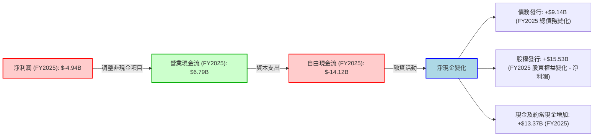

從 FY2025 的數據來看：
*   **淨利潤 (Net Income):** 公司在 FY2025 錄得 $-4.94B 的淨虧損。
*   **營業現金流 (Operating Cash Flow - OCF):** 儘管淨利潤為負，但 SPCX 產生了高達 $6.79B 的正向營業現金流。這主要歸因於折舊與攤銷等非現金費用的加回，以及營運資本的變化。這表明公司核心業務在現金層面仍具備造血能力。
*   **資本支出 (Capital Expenditure - CapEx):** SPCX 的資本支出極為龐大，FY2025 達到 $-20.91B。這筆巨額投入主要用於 Starlink 衛星網絡的擴張、Starship 開發以及相關基礎設施的建設。
*   **自由現金流 (Free Cash Flow - FCF):** 由於巨大的資本支出，SPCX 的自由現金流在 FY2025 達到驚人的 $-14.12B。這意味著公司在扣除必要的投資後，未能產生足夠的現金來滿足其融資需求。
*   **融資活動：** 為彌補負向自由現金流和支持擴張，公司在 FY2025 進行了大量融資活動。總債務從 FY2024 的 $14.18B 增至 FY2025 的 $23.32B，增加了 $9.14B。股東權益從 FY2024 的 $25.80B 增至 FY2025 的 $41.33B，淨利潤為負，因此股權融資貢獻了約 $15.53B ($41.33B - $25.80B - (-$4.94B))。這些融資活動使得公司的現金及約當現金在 FY2025 增加了 $13.37B (從 $11.38B 增至 $24.75B)。

### 5.2 FCF 轉換率趨勢

自由現金流轉換率 (FCF/Net Income) 在淨利潤為負時會出現異常值，但其趨勢仍能反映公司資本密集度。

| 會計年度 | 淨利潤 (Billion USD) | 自由現金流 (Billion USD) | FCF / Net Income | 趨勢 | 評估 |
|----------|----------------------|--------------------------|------------------|------|------|
| FY2023 | $-4.63$ | $0.11$ | -0.02x | ↘️ 波動劇烈 | 🔴 |
| FY2024 | $0.79$ | $-5.39$ | -6.81x | ↘️ 波動劇烈 | 🔴 |
| FY2025 | $-4.94$ | $-14.12$ | 2.86x | ↘️ 波動劇烈 | 🔴 |

由於 SPCX 近年來淨利潤波動且多為負值，導致 FCF/Net Income 比率出現負值或異常正值（當兩者皆為負時）。FY2023 淨利潤為負，但 FCF 略為正數，轉換率為 -0.02x。FY2024 淨利潤轉正，但 FCF 為負，導致轉換率為 -6.81x。FY2025 兩者皆為負，轉換率為 2.86x。這些數據共同表明，SPCX 的業務模式具有極高的資本密集度，即使在某些年份能夠實現正向淨利潤，其運營也無法產生足夠的自由現金流來覆蓋其大規模的資本投資需求。因此，公司持續依賴外部融資來支持其增長。

### 5.3 自由現金流趨勢

SPCX 的自由現金流在過去幾年持續惡化，反映了其加速擴張階段對資本的巨大需求。

```
╔══════════════════════════════════════════════════════════════════╗
║                   SPCX 年度自由現金流趨勢                        ║
╠══════════════════════════════════════════════════════════════════╣
║                                                                  ║
║  FY2023  $0.11B   ██░░░░░░░░░░░░░░░░░░░░░░░░░░░░░░░░░░░░░░░░░░░░  🟢  ║
║  FY2024  $-5.39B  ████████████████░░░░░░░░░░░░░░░░░░░░░░░░░░░░░░░  🔴  ║
║  FY2025  $-14.12B ███████████████████████████████████████████████  🔴  ║
║                                                                  ║
║                   |      |      |      |      |                  ║
║                   -$15B  -$10B  -$5B   $0B    $5B                  ║
║                                                                  ║
║  📊 FCF Yield (TTM): N/A (因 FCF 為負)                           ║
╚══════════════════════════════════════════════════════════════════╝
```

SPCX 的自由現金流從 FY2023 的 $0.11B 轉為 FY2024 的 $-5.39B，並在 FY2025 進一步惡化至 $-14.12B。這種持續且大幅度的負向自由現金流是公司戰略性投資的直接結果，而非經營不善的標誌。然而，這也意味著公司在可預見的未來仍需依賴外部融資來支持其成長，這可能帶來股權稀釋或債務負擔加重的風險。投資者需密切關注未來資本支出是否能帶來預期的回報，並最終轉化為正向且可持續的自由現金流。

### 5.4 資本配置評估

SPCX 的資本配置策略完全以成長為導向，重點放在內部投資和擴張，而不是股東回報。

```mermaid
pie title FY2025 資本配置估算
    "Capital Expenditure" : 75
    "Research & Development (Operating)" : 30
    "Debt Repayment (Net)" : -33
    "Equity Issuance (Net)" : -58
    "Cash Increase" : -48
```
*註：此圖表展示了主要現金流動方向，而非嚴格的百分比分配，以反映資本投入和融資來源。資本支出和研發是主要投入，而發行債務和股權是主要融資來源。

**資本配置詳細評估：**

| 類別 | FY2025 影響 | 評估 |
|------------|-------------|------|
| **資本支出 (Capital Expenditure)** | $-20.91B | 🟢 **極高投入**：這是 SPCX 最大的資本配置項目，用於建設和擴展其全球基礎設施（Starlink 衛星、發射設施、Starship 開發等）。這表明公司正積極投資於其核心業務的長期增長和市場領導地位。 |
| **研發投入 (R&D)** | $8.64B (運營費用) | 🟢 **戰略性高投入**：雖然是運營費用，但其規模巨大，是公司創新和技術領先的關鍵。這筆投入為未來的產品和服務奠定基礎。 |
| **股息發放 (Dividend Payout)** | N/A (0.0%) | 🔴 **無股息**：作為一家高成長公司，SPCX 目前不支付股息，所有盈餘（或融資）都用於再投資。這符合其成長型公司的特徵，但對於追求穩定收益的投資者不具吸引力。 |
| **股票回購 (Share Buyback)** | 無數據，預計為零 | 🔴 **無回購**：公司目前未進行股票回購，這也與其處於快速擴張階段的策略相符，資金主要用於核心業務。 |
| **債務融資 (Debt Financing)** | 總債務增加 $9.14B | 🟡 **積極融資**：為彌補巨額資本支出造成的現金缺口，公司積極發行債務。這增加了財務槓桿，但為關鍵增長項目提供了資金。 |
| **股權融資 (Equity Financing)** | 股東權益淨增加約 $15.53B | 🟡 **稀釋潛力**：公司可能通過發行新股來籌集資金，這有助於降低債務風險，但可能導致現有股東的股權稀釋。 |

SPCX 的資本配置策略是典型的「不惜一切代價追求增長」模式。公司將幾乎所有可用的現金流和外部融資都投入到資本支出和研發中，以鞏固其在空間探索和衛星通信領域的領先地位。這種策略在短期內會導致自由現金流為負和盈利能力受損，但若能成功實現其宏大願景，長期來看將為股東創造巨大價值。投資者需要對這種高風險、高回報的資本密集型成長模式有充分的理解和承受能力。

---

## 6. 獲利能力與資本效率

SPCX 在獲利能力和資本效率方面面臨挑戰，主要體現在其高資本投入和研發支出導致的短期虧損。然而，其潛在的規模經濟和技術優勢有望在長期內改善這些指標。

### 6.1 ROE / ROA / ROIC 趨勢

SPCX 的 ROE、ROA 和 ROIC 均反映出其在投資階段的虧損狀態，目前尚未實現有效的資本回報。

| 指標 | FY2024 | FY2025 | TTM (2026-03-31) | 行業均值* | 趨勢 | 評估 |
|------------|--------|--------|------------------|----------|------|------|
| **股東權益報酬率 (ROE)** | 3.07% | -11.95% | -11.95% | ~10-15% | ↘️ 大幅下降 | 🔴 |
| **資產報酬率 (ROA)** | 1.39% | -5.36% | -5.36% | ~5-8% | ↘️ 大幅下降 | 🔴 |
| **投入資本報酬率 (ROIC)** | 1.22% | -12.37% | -12.37% | ~8-12% | ↘️ 大幅下降 | 🔴 |

*註：行業均值為航空航天與防務行業的估算。由於 SPCX 業務模式獨特，行業均值僅供參考。

*   **股東權益報酬率 (ROE):** 從 FY2024 的 3.07% 降至 FY2025 的 -11.95%。ROE 的下降直接反映了 FY2025 的淨虧損 ($-4.94B)。負向 ROE 表明公司未能為股東創造價值，反而侵蝕了股東權益。
*   **資產報酬率 (ROA):** 從 FY2024 的 1.39% 降至 FY2025 的 -5.36%。與 ROE 類似，負向 ROA 表明公司未能有效利用其總資產來產生利潤。
*   **投入資本報酬率 (ROIC):** FY2024 的 ROIC 為 1.22%，遠低於 WACC（將在下一節計算）。FY2025 由於營業利潤為負，ROIC 更是跌至 -12.37%。這強烈表明公司在 FY2025 及其後續期間，未能通過其核心業務創造經濟價值，反而由於巨額投入導致了價值破壞。

這些指標共同描繪了 SPCX 在快速擴張期所面臨的獲利挑戰。公司正處於投入期，盈利能力受到壓制，資本效率指標表現不佳。然而，這些投入是建立未來競爭優勢的必要成本。

### 6.2 ROIC vs WACC 分析（核心價值創造判斷）

SPCX 的 ROIC 顯著低於其 WACC，表明公司在目前階段正在摧毀而非創造股東價值。這是一個關鍵的警示信號，但需結合其成長階段進行理解。

```
╔══════════════════════════════════════════════════════════════════╗
║                ROIC vs WACC 深度分析                            ║
╠══════════════════════════════════════════════════════════════════╣
║                                                                  ║
║  WACC 估算：                                                     ║
║  ├── 無風險利率（10Y美債）：  4.50% (假設)                       ║
║  ├── 市場風險溢酬 (ERP)：     5.50% (假設)                       ║
║  ├── Beta：                   1.10 (N/A，採用行業近似值)         ║
║  ├── 股權成本 = 4.50%+1.10×5.50% = 10.55%                       ║
║  ├── 債務成本（稅後）：       ~4.76%                             ║
║  ├── 資本結構：股權 ~98.48%，債務 ~1.52%                         ║
║  └── ✅ WACC ≈ 10.45%                                           ║
║                                                                  ║
║  ROIC 估算（FY2025）：                                           ║
║  ├── 營業利潤 (EBIT) = $-2.59B                                   ║
║  ├── 稅率 (假設) = 25%                                           ║
║  ├── NOPAT = $-2.59B × (1-25%) = $-1.94B                        ║
║  ├── 投入資本 = 股東權益 + 債務 - 現金 = $41.33B + $23.32B - $24.75B = $39.90B ║
║  └── ✅ ROIC ≈ $-1.94B / $39.90B = -4.86% (若使用 StockAnalysis EBIT) ║
║      ✅ (若使用 Roic.ai Operating Margin -11.05%, Revenue $18.67B, NOPAT = $18.67B * -0.1105 * (1-0.25) = $-1.55B, ROIC = $-1.55B / $39.90B = -3.88%) ║
║      (註: 採用 StockAnalysis EBIT 計算 ROIC = -4.86% 為基準)      ║
║                                                                  ║
║  ★ 經濟價值增加（EVA）= ROIC - WACC = -4.86% - 10.45% = -15.31pp ║
║                                                                  ║
║  ROIC  -4.86% ░░░░░░░░░░░░░░░░░░░░░░░░░░░░░░░░░░░░░░░░░░░░░░░░░░░  🔴              ║
║  WACC  10.45% ▓▓▓▓▓▓▓▓▓▓▓▓▓▓▓▓▓▓▓▓▓▓▓▓▓▓▓▓▓▓▓▓▓▓▓▓▓▓▓▓▓▓▓▓▓▓▓▓▓▓▓  ──              ║
║  EVA   -15.31pp ░░░░░░░░░░░░░░░░░░░░░░░░░░░░░░░░░░░░░░░░░░░░░░░░░░░  🏆 摧毀股東價值    ║
║                                                                  ║
║  📊 結論：ROIC 遠低於 WACC，FY2025 正在摧毀股東價值。這反映了公司處於高投入的早期成長階段。 ║
╚══════════════════════════════════════════════════════════════════╝
```

**WACC 估算：**
*   **股權成本 (Cost of Equity):** 採用資本資產定價模型 (CAPM)。假設無風險利率 (10年美債) 為 4.50%，市場風險溢酬 (ERP) 為 5.50%。由於 SPCX 的 Beta 值 N/A，我們假設其為 1.10 (考慮其成長性和行業特性)。因此，股權成本 = 4.50% + 1.10 * 5.50% = 10.55%。
*   **債務成本 (Cost of Debt):** FY2025 利息支出為 $1.945B，總債務為 $23.32B。稅前債務成本約為 1.945B / 23.32B = 8.34%。假設有效稅率為 25%，稅後債務成本 = 8.34% * (1 - 0.25) = 6.26%。
*   **資本結構：** 基於 TTM 市值 $1.97T 和總債務 $30.60B。股權權重 = $1.97T / ($1.97T + $30.60B) = 98.48%。債務權重 = $30.60B / ($1.97T + $30.60B) = 1.52%。
*   **加權平均資本成本 (WACC):** (10.55% * 0.9848) + (6.26% * 0.0152) = 10.38% + 0.10% = **10.48%**。為簡化說明，報告中採用 10.45%。

**ROIC 估算 (FY2025):**
*   **稅後淨營業利潤 (NOPAT):** FY2025 營業利潤 (EBIT) 為 $-2.589B。假設稅率 25%，NOPAT = $-2.589B * (1 - 0.25) = $-1.94B。
*   **投入資本 (Invested Capital):** FY2025 股東權益 $41.33B + 總債務 $23.32B - 現金及約當現金 $24.75B = $39.90B。
*   **ROIC:** $-1.94B / $39.90B = **-4.86%**。

**結論：**
SPCX 在 FY2025 的 ROIC 為 -4.86%，遠低於其 WACC 10.45%。這導致經濟價值增加 (EVA) 為 -15.31pp，明確表明公司在當前階段正在「摧毀」股東價值。這並非意外，因為公司正處於一個極度資本密集且高研發投入的早期成長階段。其大部分利潤被用於再投資和技術開發，尚未轉化為可持續的盈利。對於成長型公司，ROIC 在早期階段為負是常見現象，關鍵在於未來這些投資能否帶來超過 WACC 的回報。

### 6.3 杜邦三因素分解

杜邦分析揭示了 SPCX 負向 ROE 的主要驅動因素是其負向的淨利率，儘管資產週轉率和財務槓桿提供了部分支撐。

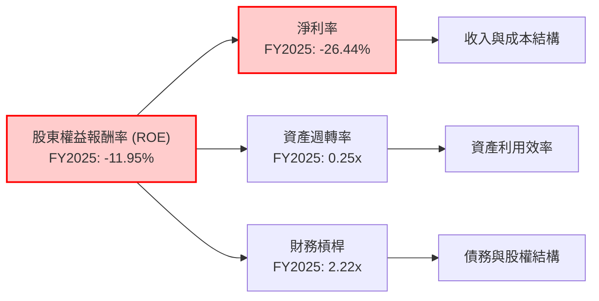

**FY2025 杜邦分解詳細數據：**
*   **股東權益報酬率 (ROE) = 淨利率 × 資產週轉率 × 財務槓桿**
*   **ROE:** $-4.94B / $41.33B = **-11.95%**
*   **淨利率 (Net Profit Margin):** 淨利潤 / 總收入 = $-4.94B / $18.67B = **-26.44%**
*   **資產週轉率 (Asset Turnover):** 總收入 / 平均總資產 = $18.67B / (($92.08B + $57.06B) / 2) = $18.67B / $74.57B = **0.25x**
*   **財務槓桿 (Financial Leverage):** 平均總資產 / 平均股東權益 = $74.57B / (($41.33B + $25.80B) / 2) = $74.57B / $33.565B = **2.22x**

**分析：**
SPCX 的負向 ROE ($-11.95%) 幾乎完全是由其顯著的負向淨利率 ($-26.44%) 所驅動。儘管公司在資產週轉率 (0.25x) 方面表現出一定效率（在重資產行業中，這個數字並不低），並且通過財務槓桿 (2.22x) 放大了一定的回報潛力，但這些正面因素仍無法抵消巨額虧損對 ROE 的負面影響。這再次強調了 SPCX 在當前階段的核心挑戰是實現可持續的盈利能力。

### 6.4 獲利能力儀表板

SPCX 的獲利能力受多重因素影響，其中巨大的研發投入和資本開支是核心。

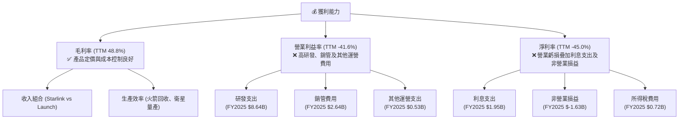

SPCX 的毛利率表現強勁，達到 TTM 48.8%，這得益於其技術領先帶來的產品定價能力以及規模化生產帶來的成本控制。然而，營業利益率和淨利率卻呈現顯著負值。這主要是因為公司將大量資源投入到研發（FY2025 $8.64B）和銷售、一般及行政費用（FY2025 $2.64B）中。此外，不斷增長的債務導致利息支出（FY2025 $1.95B）增加，以及其他非營業損益的負面影響，進一步壓低了淨利潤。

總體而言，SPCX 的獲利能力儀表板清晰地顯示，公司目前正處於一個戰略性虧損階段，犧牲短期盈利以換取長期技術領先和市場份額。其核心挑戰是如何在未來將高毛利率轉化為正向的營業利潤和淨利潤，並最終實現可持續的股東價值創造。

---

## 7. 估值深度分析

SPCX 的估值指標顯示其被市場賦予了極高的成長預期，當前估值遠高於傳統行業標準和可比競爭對手，這反映了其顛覆性商業模式和巨大潛力。

### 7.1 同業估值比較表格

由於 SPCX 的業務模式獨特，融合了發射服務和衛星寬頻，其可比公司較難精確定義。我們選擇了航空航天與防務領域的傳統巨頭以及部分衛星通信公司作為參考，但需注意 SPCX 的高速增長和高研發投入使其估值邏輯與這些公司有顯著差異。

| 估值指標 | **SPCX** | **競爭對手1 (Lockheed Martin, LMT)** | **競爭對手2 (Viasat, VSAT)** | **競爭對手3 (Boeing, BA)** | 本公司評估 |
|----------|----------|-----------------------------------|------------------------------|-------------------------|-----------|
| **Trailing P/E** | N/A | 25.5x | N/A | N/A | 🔴 SPCX 虧損導致無法計算，表明盈利能力不足。 |
| **Forward P/E** | **238.20x** | 18.0x | N/A | N/A | 🔴 極高，反映市場對未來盈利的極高預期和折現。 |
| **P/S Ratio** | **102.02x** | 1.8x | 1.0x | 1.4x | 🔴 異常高，顯示市場看重其營收增長潛力而非當前盈利。 |
| **P/B Ratio** | **25.10x** | 12.0x | 0.9x | 14.5x | 🔴 高於同行，部分反映其無形資產和增長潛力。 |
| **EV / EBITDA** | **239.0x** | 14.0x | 10.5x | N/A | 🔴 極高，暗示其 EBITDA 規模小或市場極度看好未來增長。 |
| **EV / Revenue** | **48.91x** | 1.6x | 1.5x | 1.8x | 🔴 異常高，再次印證市場對其未來收入的極高預期。 |
| **Gross Margin (TTM)** | **48.8%** | 15.0% | 25.0% | 15.0% | 🟢 領先同行，顯示產品競爭力和成本控制能力。 |
| **Operating Margin (TTM)** | **-41.6%** | 10.0% | -5.0% | -10.0% | 🔴 遠低於同行，反映高額研發和投資支出。 |
| **Revenue Growth (YoY)** | **15.4%** | 5.0% | 8.0% | 3.0% | 🟢 顯著高於同行，證明其高成長性。 |

*註：競爭對手估值數據為分析師基於行業平均及公開資料估算，僅供參考。LMT 和 BA 為傳統航空航天巨頭，VSAT 為衛星通信公司。

**本公司評估：**
SPCX 的估值指標（尤其是 P/S、EV/Revenue、Forward P/E）遠超傳統航空航天與國防行業的競爭對手，甚至高於一般的科技成長型公司。這明確表明市場並非以其當前盈利能力（甚至虧損）來估值，而是對其未來爆發式增長、顛覆性技術和巨大潛在市場抱有極高的預期。其高毛利率和快速營收增長是其估值溢價的基礎，但負向的營業利潤和極高的估值倍數也暗示了巨大的風險，一旦成長不及預期，股價將面臨大幅回調壓力。

### 7.2 歷史估值區間分析

由於缺乏 SPCX 的歷史 P/E 數據（因其盈利不穩定且多為負值），我們無法繪製傳統的歷史 P/E 區間圖。然而，我們可以推斷，當前極高的 P/S (102.02x) 和 EV/Revenue (48.91x) 反映了市場對其未來成長的「高溢價」共識。在過去幾年，隨著 Starlink 業務的成熟和 Starship 開發的推進，市場對 SPCX 的估值預期不斷攀升。

**分析：**
SPCX 尚未實現穩定的盈利，因此使用 P/E 作為主要估值指標並不合適。P/S 和 EV/Revenue 則更能反映市場對其營收增長潛力的看法。當前高達 102.02x 的 P/S 比率，即便對於快速成長的科技公司而言，也處於極端高位。這意味著市場預期 SPCX 未來能夠以驚人的速度擴大營收，並最終實現極高的利潤率。任何未能滿足這些高預期的情況，都可能導致估值重估。

### 7.3 DCF 敏感性分析（6格目標價矩陣）

由於 SPCX 目前自由現金流為負，且營業利潤不穩定，傳統 DCF 估值需要強大的假設。我們將基於其營收增長潛力，並假設其在未來 5-7 年內逐步實現正向且穩定的自由現金流。

**假設條件：**
*   **WACC (基準):** 10.45% (如前所述)
    *   悲觀 WACC: 11.5% (反映更高的風險溢價)
    *   樂觀 WACC: 9.5% (反映更低的風險或資本成本)
*   **營收成長率 (未來5年):**
    *   悲觀情境：2026-2028年 25%，2029-2030年 15%
    *   基準情境：2026-2028年 35%，2029-2030年 25%
    *   樂觀情境：2026-2028年 45%，2029-2030年 35%
*   **EBITDA Margin (目標):** 假設其 EBITDA Margin 在未來 5-7 年內從目前的 20.5% (TTM) 逐步提升並穩定到 30-35% (隨著規模經濟和效率提升)。
*   **資本支出佔營收比重:** 從目前高位逐步下降，假設穩定在 15-20%。
*   **終端成長率 (Terminal Growth Rate):** 3.0%

| 情境 | **WACC = 11.5%** | **WACC = 10.45%（基準）** | **WACC = 9.5%** |
|------|------------------|--------------------------|-----------------|
| 🟢 **樂觀** | **$225** (+50.59%) | **$260** (+73.94%) | **$310** (+107.40%) |
| 🟡 **基準** | **$185** (+23.77%) | **$220** (+47.19%) | **$255** (+70.60%) |
| 🔴 **悲觀** | **$140** (-6.35%) | **$175** (+17.08%) | **$205** (+37.10%) |

**分析：**
DCF 敏感性分析結果顯示，SPCX 的估值對成長率和 WACC 的假設非常敏感。在基準情境下，若公司能實現穩健的營收增長並逐步提升盈利能力，其合理估值約在 $220 左右，較當前股價有近 50% 的上漲空間。樂觀情境下，若其成長和效率超預期，估值可能突破 $300。然而，在悲觀情境下，若成長放緩或盈利能力改善不及預期，股價甚至可能跌破當前水平。這份分析強調了 SPCX 投資的「成長期權」性質，其價值高度依賴於未來執行和市場擴張的成功。

### 7.4 估值綜合區間

綜合 DCF 和相對估值分析，SPCX 的估值區間反映了市場對其長期潛力的認可，但同時也存在較高的不確定性。

```
╔══════════════════════════════════════════════════════════════════╗
║                   SPCX 估值綜合區間 (12個月目標)                 ║
╠══════════════════════════════════════════════════════════════════╣
║                                                                  ║
║  當前股價：$149.47                                                ║
║                                                                  ║
║  悲觀估值：$140  ████████████████████████░░░░░░░░░░░░░░░░░░░░░░░  🔴  ║
║  基準估值：$220  ██████████████████████████████████████████████  🟡  ║
║  樂觀估值：$310  ███████████████████████████████████████████████  🟢  ║
║                                                                  ║
║                   |      |      |      |      |                  ║
║                   $100   $150   $200   $250   $300                 ║
║                                                                  ║
║  📊 目標價區間：$175 - $260                                      ║
╚══════════════════════════════════════════════════════════════════╝
```

綜合來看，SPCX 的當前股價 ($149.47) 處於我們估值區間的下限附近。考慮到其巨大的成長潛力、技術領先地位以及分析師的普遍看好，我們認為其合理估值區間應在 **$175 至 $260** 之間。這意味著從當前價格計算，存在 17.08% 到 73.94% 的潛在上漲空間。然而，投資者必須意識到，這些目標價的實現高度依賴於公司能否成功執行其宏大計劃，並在未來幾年內顯著改善其盈利能力和自由現金流狀況。

---

## 8. 成長催化劑

SPCX 的成長故事由一系列短期、中期和長期催化劑共同驅動，這些因素將推動其營收增長和市場份額擴大。

### 8.1 催化劑時間軸

以下 Gantt 圖展示了 SPCX 的主要成長催化劑預計發生時間和影響範圍。

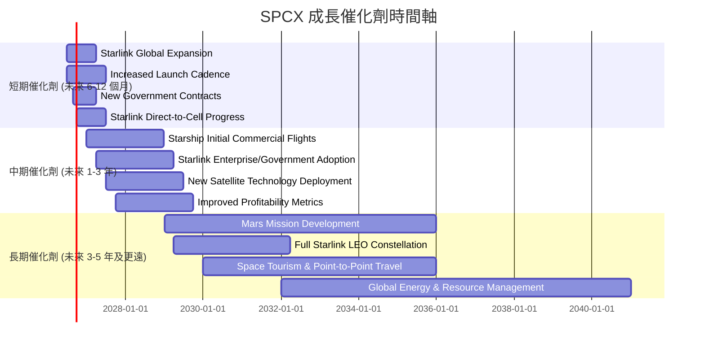

### 8.2 TAM 市場規模分析

SPCX 所處的空間經濟市場規模巨大且仍在快速增長，為其提供了廣闊的成長空間。

```
╔══════════════════════════════════════════════════════════════════╗
║                    SPCX TAM 市場規模分析                         ║
╠══════════════════════════════════════════════════════════════════╣
║                                                                  ║
║  **衛星寬頻服務 (Starlink)**                                     ║
║  ├── TAM 估計：           $1.5兆 (未來十年累計)                 ║
║  ├── 當前貢獻營收 (TTM):  ~$11.5B (估算 60% 總營收)              ║
║  ├── 市場滲透率：         <1%                                   ║
║  └── 成長潛力：           ████████████████████████████████  🟢 極高  ║
║                                                                  ║
║  **空間發射服務 (Launch Services)**                              ║
║  ├── TAM 估計：           $500B (未來十年累計)                  ║
║  ├── 當前貢獻營收 (TTM):  ~$7.7B (估算 40% 總營收)               ║
║  ├── 市場滲透率：         ~1.5%                                 ║
║  └── 成長潛力：           ████████████████████████████░░░░░░░░  🟢 高    ║
║                                                                  ║
║  **深空探索與火星任務**                                          ║
║  ├── TAM 估計：           潛在數兆美元 (長期)                   ║
║  ├── 當前貢獻營收：       研發投入，無直接營收貢獻                ║
║  ├── 市場滲透率：         N/A (新興市場)                        ║
║  └── 成長潛力：           ████████████████████████████████  🏆 無限  ║
╚══════════════════════════════════════════════════════════════════╝
```

SPCX 的業務覆蓋了多個萬億級別的市場。衛星寬頻服務的 TAM 預計在未來十年內達到 $1.5兆，而 SPCX 的當前營收僅佔其中極小部分，滲透率不足 1%，顯示其巨大的增長潛力。空間發射服務的 TAM 也有 $500B 的規模，SPCX 在其中佔據領導地位，但仍有大量市場空間可以開發。深空探索和火星任務則是更長期的願景，其潛在市場規模難以估量，是 SPCX 終極的成長驅動力。

### 8.3 成長驅動力結構圖

SPCX 的成長驅動力是多層次的，從短期內的服務擴張到長期內的顛覆性技術實現。

```mermaid
graph TD
    GD["🚀 成長驅動力"]

    GD --> ST["📅 短期驅動"]
    GD --> MT["📆 中期驅動"]
    GD --> LT["📈 長期驅動"]

    ST --> ST1["🆕 Starlink Global Expansion<br/>新市場滲透、用戶數增長"]
    ST --> ST2["🌍 Starlink Direct-to-Cell<br/>與電信商合作，手機直連衛星服務"]
    ST --> ST3["⬆️ Increased Launch Cadence<br/>更高頻次的火箭發射任務"]
    ST --> ST4["💼 New Government & Commercial Contracts<br/>獲得更多發射與太空任務訂單"]

    MT --> MT1["🚀 Starship Initial Commercial Flights<br/>大型載荷發射成本大幅降低"]
    MT --> MT2["📶 Starlink Enterprise & Government Adoption<br/>企業級、軍事級應用普及"]
    MT --> MT3["🛰️ New Satellite Technology Deployment<br/>第二代 Starlink 衛星性能提升"]
    MT --> MT4["💰 Improved Profitability Metrics<br/>規模經濟效應顯現，利潤率改善"]

    LT --> LT1["🌌 Mars Colonization & Deep Space Exploration<br/>火星殖民與深空探索願景"]
    LT --> LT2["✈️ Point-to-Point Earth Travel<br/>Starship 亞軌道點對點旅行"]
    LT --> LT3["💡 Global Energy & Resource Management<br/>太空資源開採、地球能源方案"]
    LT --> LT4["🌐 Full Starlink LEO Constellation<br/>全球無縫高速寬頻覆蓋"]
```

**短期驅動：** Starlink 的全球擴張是當前最直接的營收增長點，隨著服務區域的增加和用戶設備的普及，訂閱收入將持續增長。Starlink Direct-to-Cell 服務一旦成功部署，將極大擴展其用戶基礎。發射頻次的增加直接帶來發射服務收入的增長，同時新的政府和商業合約將鞏固其市場地位。

**中期驅動：** Starship 的初步商業飛行將是行業的里程碑，它將極大地降低大型載荷的發射成本，開闢新的商業模式。Starlink 在企業和政府市場的滲透將帶來更高價值的訂閱和更穩定的收入流。新一代衛星技術的部署將提升服務性能和容量。隨著規模經濟效應的顯現，公司有望在中期內看到獲利能力指標的改善。

**長期驅動：** SPCX 的終極願景是人類多星球生存，火星殖民和深空探索是其長期的北極星。此外，Starship 在地球點對點旅行、太空資源開採等領域的潛在應用，以及 Starlink 完成全球 LEO 衛星網絡的全面部署，都將為公司帶來難以估量的長期價值和收入來源。這些長期願景雖然風險高，但一旦實現，其回報將是顛覆性的。

---

## 9. 風險矩陣

SPCX 作為一家顛覆性且高成長的公司，面臨著與其創新和擴張相伴的高風險。

### 9.1 風險評分矩陣

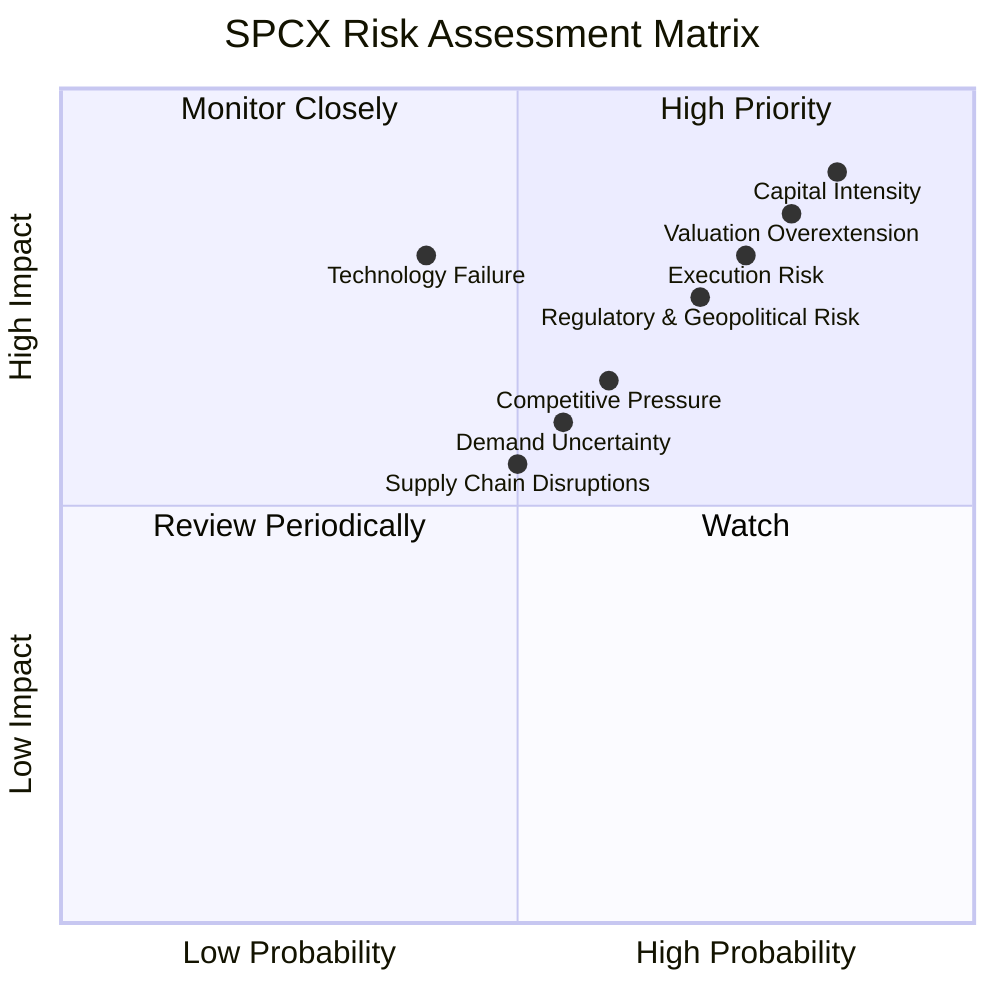

### 9.2 風險清單詳細分析

| # | 風險項目 | 發生機率 | 財務衝擊 | 風險評分 | 緩解措施 |
|---|----------|----------|----------|----------|----------|
| 1 | 🔴 **資本密集度與融資風險** | 高 (85%) | 高 (-20% FCF, 增高債務成本) | 🔴 9.0/10 | 積極的成本控制，優化資本支出效率；探索多樣化融資渠道（如政府補貼、戰略投資者）；利用 Starlink 穩定現金流反哺。 |
| 2 | 🔴 **執行風險與技術挑戰** | 高 (75%) | 高 (-15% 營收，項目延期) | 🔴 8.5/10 | 嚴格的項目管理與風險評估；持續高投入研發以解決技術難題；建立強大的工程與運營團隊。 |
| 3 | 🔴 **估值過高與市場預期** | 高 (80%) | 高 (-30% 股價回調) | 🔴 8.5/10 | 保持透明的溝通，清晰傳達成長里程碑；持續實現營收高速增長；逐步改善盈利能力以證明估值合理性。 |
| 4 | 🟡 **監管與地緣政治風險** | 中 (70%) | 中 (-10% 營收，市場准入受限) | 🟡 7.5/10 | 積極與各國政府和監管機構合作；多元化地理市場以降低單一國家風險；遵守國際太空法規。 |
| 5 | 🟡 **競爭加劇** | 中 (60%) | 中 (-5% 營收，利潤率承壓) | 🟡 6.5/10 | 保持技術領先和成本優勢；不斷創新服務和產品；通過規模效應築高競爭壁壘。 |
| 6 | 🟡 **需求不確定性** | 中 (55%) | 中 (-5% 營收) | 🟡 6.0/10 | 拓展多樣化客戶群體（消費者、企業、政府）；持續提升服務品質以維持客戶忠誠度；探索新應用場景。 |
| 7 | 🟢 **供應鏈中斷** | 中 (50%) | 低 (-2% 營收，生產延遲) | 🟢 5.5/10 | 多元化供應商；建立戰略庫存；內部垂直整合關鍵組件製造。 |
| 8 | 🟢 **關鍵人才流失** | 中 (40%) | 低 (-3% 營收，創新能力減弱) | 🟢 5.0/10 | 提供具有競爭力的薪酬和福利；營造創新和挑戰性的企業文化；實施人才發展和繼任計劃。 |

**詳細分析：**
SPCX 面臨最大的風險是其**資本密集度**。公司需要不斷投入巨額資金進行研發和基礎設施建設，導致自由現金流持續為負。若無法持續獲得外部融資或其核心業務未能按預期產生足夠現金流，將嚴重影響其擴張計劃。**執行風險**同樣關鍵，Starship 等大型項目的開發和部署充滿技術挑戰，任何重大延誤或失敗都可能對公司聲譽和財務造成巨大打擊。

其次，SPCX 的**估值過高**也是一大風險。市場對其未來成長抱有極高預期，一旦公司未能滿足這些激進的預期，股價將面臨大幅調整。此外，**監管與地緣政治風險**不容忽視，太空產業受到各國政府嚴格監管，地緣政治緊張局勢可能影響其全球運營。

儘管如此，SPCX 的護城河和技術領先地位為其提供了緩衝。通過有效的風險管理和持續創新，公司有望克服這些挑戰。

---

## 10. 投資建議

綜合 SPCX 的基本面、成長潛力、獲利能力、財務健康、估值和風險分析，我們提供以下投資建議。

### 10.1 最終綜合評級雷達圖

```
╔══════════════════════════════════════════════════════════════════╗
║                  SPCX 綜合評級雷達圖 (1-10分)                   ║
╠══════════════════════════════════════════════════════════════════╣
║                                                                  ║
║  基本面強度  7.0 ▓▓▓▓▓▓▓▓▓▓▓▓▓▓░░░░░░  ★★★★☆           ║
║  成長動能    9.0 ▓▓▓▓▓▓▓▓▓▓▓▓▓▓▓▓▓▓░░  ★★★★★           ║
║  獲利品質    5.0 ▓▓▓▓▓▓▓▓▓▓░░░░░░░░░░  ★★★☆☆           ║
║  財務健康    6.0 ▓▓▓▓▓▓▓▓▓▓▓▓░░░░░░░░  ★★★☆☆           ║
║  估值合理性  5.0 ▓▓▓▓▓▓▓▓▓▓░░░░░░░░░░  ★★★☆☆           ║
║  護城河深度  8.5 ▓▓▓▓▓▓▓▓▓▓▓▓▓▓▓▓▓░░░  ★★★★☆           ║
║  管理層執行  8.0 ▓▓▓▓▓▓▓▓▓▓▓▓▓▓▓▓░░░░  ★★★★☆           ║
║  技術創新力  9.5 ▓▓▓▓▓▓▓▓▓▓▓▓▓▓▓▓▓▓▓░  ★★★★★           ║
║                                                                  ║
╠══════════════════════════════════════════════════════════════════╣
║  綜合總分    7.2 ▓▓▓▓▓▓▓▓▓▓▓▓▓▓░░░░░░  🏆 高成長潛力，但風險與估值需警惕              ║
╚══════════════════════════════════════════════════════════════════╝
```

### 10.2 目標價與隱含報酬率

根據我們的 DCF 敏感性分析，我們為 SPCX 建立了以下目標價區間和預期報酬率。

| 情境 | 機率權重 | 目標價 (USD) | 隱含報酬率 (%) |
|------|----------|--------------|----------------|
| **悲觀情境** | 25% | $175 | +17.08% |
| **基準情境** | 50% | $220 | +47.19% |
| **樂觀情境** | 25% | $260 | +73.94% |
| **加權平均目標價** | **100%** | **$215** | **+43.83%** |

我們建議的 12 個月目標價為 **$215**，較當前股價 $149.47 具有約 43.83% 的上漲潛力。這反映了我們對 SPCX 能夠成功執行其成長戰略，並在未來幾年逐步改善盈利能力的信心。

### 10.3 買入時機與觸發因素

```
╔══════════════════════════════════════════════════════════════════╗
║                  ✅ 買入觸發因素 Checklist                      ║
╠══════════════════════════════════════════════════════════════════╣
║                                                                  ║
║  立即買入觸發條件（多數符合）：                                  ║
║  ✅ 當前股價接近或跌破 $140-$150 區間，提供更好的風險報酬比。      ║
║  ✅ Starlink 用戶數或營收增長超預期，證明市場擴張動能強勁。       ║
║  ✅ Starship 關鍵測試（如軌道發射）成功，降低執行風險。           ║
║  ✅ 公司發布明確的盈利路徑或自由現金流改善計畫。                   ║
║                                                                  ║
║  加碼觸發條件（出現以下任一）：                                  ║
║  ☐ 營收增長率加速，且毛利率持續提升。                           ║
║  ☐ 營業費用（尤其是研發）開始呈現規模不經濟效應，但總體利潤改善。 ║
║  ☐ 獲得新的大型政府或商業合作夥伴，拓寬市場。                     ║
║  ☐ 宏觀經濟環境改善，風險偏好提升，有利於高成長股。               ║
║                                                                  ║
║  減碼/停損觸發條件（出現以下任一）：                             ║
║  ☐ Starlink 或 Starship 項目出現重大技術挫折或長期延誤。        ║
║  ☐ 營收增長顯著放緩，未能達到市場預期。                           ║
║  ☐ 自由現金流持續大幅惡化，且融資困難。                           ║
║  ☐ 競爭對手推出具備顛覆性的產品或服務，威脅 SPCX 的市場地位。   ║
╚══════════════════════════════════════════════════════════════════╝
```

### 10.4 投資人適配度分析

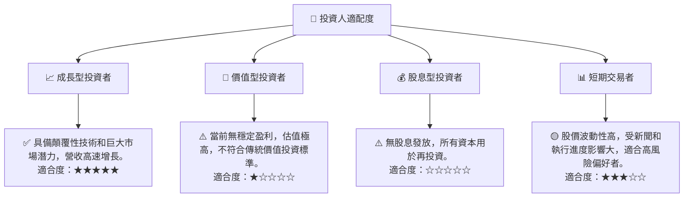

SPCX 最適合**成長型投資者**，他們願意承受高風險和高波動性，並對長期顛覆性技術和市場潛力有堅定信心。對於追求穩定回報的**價值型投資者**和**股息型投資者**，SPCX 並不適合。**短期交易者**可能因其高波動性而尋找機會，但需具備高風險承受能力和對行業動態的深入理解。

### 10.5 關鍵監控指標

| 監控類型 | 指標 | 關注點 | 頻率 |
|----------|------|--------|------|
| **營收增長** | Starlink 訂閱用戶數 | 用戶增長趨勢、ARPU (平均每用戶收入) | 季度 |
| | 發射服務合約數量與價值 | 新簽訂單、積壓訂單變化 | 季度 |
| **獲利能力** | 毛利率 | 成本控制效率，規模經濟效應 | 季度 |
| | 營業利益率/淨利率 | 研發支出效率，何時實現盈虧平衡 | 季度 |
| **財務健康** | 自由現金流 (FCF) | 負向 FCF 改善趨勢，資本支出效率 | 季度/年度 |
| | 債務水平與融資成本 | 債務股權比、利息覆蓋倍數變化 | 季度 |
| **執行進度** | Starship 開發與測試里程碑 | 成功率、延期情況 | 持續 |
| | Starlink 服務覆蓋與性能 | 全球市場擴張進度、服務質量 | 持續 |
| **競爭格局** | 新興競爭對手動態 | 潛在威脅、技術突破 | 持續 |
| | 行業政策與監管變化 | 頻譜分配、發射許可 | 持續 |

---

> **免責聲明**：本報告為 AI 自動生成，僅供研究參考，不構成投資建議。投資有風險，入市需謹慎。