# SPCX 基本面深度分析報告
> **報告日期**：2026-07-08 ｜ **語言**：繁體中文 ｜ **數據來源**：Yahoo Finance, Finviz, StockAnalysis, Roic.ai ｜ **分析師**：CFA 級機構研究

---

## 目錄

| # | 章節 | 核心結論 |
|---|------------------------|--------------------------------------------------|
| 1 | 執行摘要 | 評級：持有；目標價區間：$150 - $250 |
| 2 | 公司概覽與商業模式 | 憑藉技術、規模與網路效應，護城河深厚 |
| 3 | 損益表深度分析 | 營收高速成長，但研發投入巨大導致持續虧損 |
| 4 | 資產負債表分析 | 資產規模快速擴張，債務水平可控但需關注 |
| 5 | 現金流量深度分析 | 營業現金流強勁，但高資本支出導致自由現金流為負 |
| 6 | 獲利能力與資本效率 | ROIC遠低於WACC，目前處於價值摧毀階段 |
| 7 | 估值深度分析 | 估值倍數極高，市場已充分反映未來成長預期 |
| 8 | 成長催化劑 | Starlink擴張、Starship部署及政府合約為主要驅動力 |
| 9 | 風險矩陣 | 持續虧損、高資本支出及激烈競爭為主要風險 |
| 10 | 投資建議 | 長期潛力巨大，但短期估值過高，建議持有觀望 |

---

## 1. 執行摘要

### 1.1 核心評分儀表板

```mermaid
graph TD
    SPCX["🎯 SPCX 綜合評分<br/>總分：6.8/10"]

    F["📊 基本面<br/>7/10<br/>高成長潛力，但盈利能力待提升"]
    G["🚀 成長性<br/>9/10<br/>營收持續高速成長，新業務拓展迅速"]
    P["💰 獲利能力<br/>4/10<br/>毛利率健康，但研發與營運支出導致持續虧損"]
    B["🏦 財務健康<br/>7/10<br/>現金充裕，債務結構尚可，但自由現金流為負"]
    V["📈 估值<br/>3/10<br/>當前估值倍數極高，市場預期過於樂觀"]
    M["🛡️ 護城河<br/>9/10<br/>技術領先、規模效應與網路效應顯著"]
    A["🧑‍💼 管理層<br/>8/10<br/>執行力強，具備前瞻性戰略眼光"]
    I["💡 技術創新<br/>10/10<br/>業界顛覆者，持續引領航太技術發展"]

    SPCX --> F
    SPCX --> G
    SPCX --> P
    SPCX --> B
    SPCX --> V
    SPCX --> M
    SPCX --> A
    SPCX --> I

    F --> F1["✅ 營收年複合成長率強勁"]
    F --> F2["❌ 淨利潤持續為負"]
    G --> G1["✅ FY2025營收YoY +33.24%"]
    G --> G2["✅ Starlink用戶基礎快速擴大"]
    P --> P1["✅ TTM毛利率48.8%穩健"]
    P --> P2["❌ FY2025淨利率-26.44%"]
    B --> B1["✅ TTM現金$23.68B"]
    B --> B2["🟡 TTM淨負債$-6.93B"]
    V --> V1["❌ P/S 101.22x, Forward P/E 162.1x 過高"]
    M --> M1["✅ 可重複使用火箭技術獨步全球"]
    M --> M2["✅ Starlink全球網路效應強大"]
    A --> A1["✅ 持續推進星艦與星鏈計畫"]
    A --> A2["🟡 盈利能力管理仍有提升空間"]
    I --> I1["✅ 星艦、星鏈、載人航天等顛覆性技術"]
    I --> I2["✅ 高額研發投入推動創新"]
```

### 1.2 評分進度條視覺化

```
╔══════════════════════════════════════════════════════════════╗
║              SPCX 多維度評分儀表板 (1-10分)                  ║
╠══════════════════════════════════════════════════════════════╣
║ 基本面強度  7.0 ▓▓▓▓▓▓▓▓▓▓▓▓▓▓░░░░░░  ★★★★☆           ║
║ 成長動能    9.0 ▓▓▓▓▓▓▓▓▓▓▓▓▓▓▓▓▓▓░░  ★★★★★           ║
║ 獲利品質    4.0 ▓▓▓▓▓▓▓▓░░░░░░░░░░░░  ★★☆☆☆           ║
║ 財務健康    7.0 ▓▓▓▓▓▓▓▓▓▓▓▓▓▓░░░░░░  ★★★★☆           ║
║ 估值合理性  3.0 ▓▓▓▓▓▓░░░░░░░░░░░░░░  ★☆☆☆☆           ║
║ 護城河深度  9.0 ▓▓▓▓▓▓▓▓▓▓▓▓▓▓▓▓▓▓░░  ★★★★★           ║
║ 管理層執行  8.0 ▓▓▓▓▓▓▓▓▓▓▓▓▓▓▓▓░░░░  ★★★★☆           ║
║ 技術創新力 10.0 ▓▓▓▓▓▓▓▓▓▓▓▓▓▓▓▓▓▓▓▓  ★★★★★           ║
╠══════════════════════════════════════════════════════════════╣
║ 綜合總分    6.8 ▓▓▓▓▓▓▓▓▓▓▓▓▓▓░░░░░░  🏆 具備顛覆性技術，但估值過高且尚未盈利  ║
╚══════════════════════════════════════════════════════════════╝
```

### 1.3 五大投資論點 + 三大核心風險

| 類型 | 項目 | 具體依據 | 信心度 |
|------|------|----------|--------|
| 🟢 **投資論點①** | **顛覆性技術與市場領導地位** | SPCX在可重複使用火箭技術（Falcon 9, Starship）和低軌衛星網路（Starlink）方面具有全球領先地位，重塑航太產業格局。FY2025研發投入高達$8.64B，顯示其持續創新能力。 | 🟢 極高 |
| 🟢 **Starlink高速成長與巨大潛力** | Starlink業務提供高速、低延遲的衛星寬頻服務，用戶基礎快速擴大，是公司重要的營收成長引擎。Q1 2026營收YoY達15.23%，顯示強勁動能。 | 🟢 極高 |
| 🟢 **強勁的營收成長動能** | 公司營收呈現爆發式成長，TTM營收達$19.30B，YoY成長15.4%。FY2025營收$18.67B，YoY成長33.24%，遠超產業平均。 | 🟢 極高 |
| 🟢 **持續的政府與商業合約** | 作為NASA的重要合作夥伴，SPCX獲得大量政府和商業發射服務合約，確保了穩定的收入來源和技術發展平台。 | 🟢 高 |
| 🟢 **長期願景與多元化業務** | 從太空運輸、衛星寬頻到未來火星殖民願景，SPCX的長期戰略具備巨大的想像空間，並透過多元化業務降低單一風險。 | 🟢 高 |
| 🟡 **風險①** | **持續虧損與高資本支出** | FY2025淨利潤為-$4.94B，Q1 2026淨利潤為-$4.28B。FY2025資本支出高達-$20.91B，導致自由現金流持續為負（FY2025 -$14.12B），對現金流構成壓力。 | 🔴 高衝擊 |
| 🔴 **極高的估值水平** | 當前P/S比率高達101.22x，Forward P/E為162.1x，遠超產業平均水平。這意味著市場對其未來成長預期極高，任何不及預期的表現都可能導致股價大幅調整。 | 🔴 高衝擊 |
| 🟡 **激烈競爭與監管風險** | 低軌衛星寬頻市場吸引了Amazon (Project Kuiper)、OneWeb等巨頭進入，競爭日益激烈。同時，航太產業面臨嚴格的國際和國內監管，地緣政治風險也可能影響其業務。 | 🟡 中度 |

### 1.4 快速統計卡片

| 指標 | 公司實際值 | 行業均值（航太與防禦） | S&P 500 均值 | 狀態 |
|-------------------|-------------|-----------------------|--------------|------|
| 收入 YoY 成長 (FY25) | **33.24%** | ~8-12% (估計) | ~8-10% | 🟢 |
| 毛利率 (TTM) | **48.8%** | ~25-35% (估計) | ~30-40% | 🟢 |
| 淨利率 (TTM) | **-45.0%** | ~5-10% (估計) | ~10-15% | 🔴 |
| Forward P/E | **162.1x** | ~20-30x (估計) | ~20-25x | 🔴 |
| P/S Ratio (TTM) | **101.22x** | ~1-3x (估計) | ~2-4x | 🔴 |
| 債務/股東權益 (FY25) | **73.6%** | ~50-80% (估計) | ~50-70% | 🟡 |
| 營運現金流 (FY25) | **$6.79B** | N/A | N/A | 🟢 |
| 自由現金流 (FY25) | **-$14.12B** | N/A | N/A | 🔴 |

*註：行業均值為基於航太與防禦產業的經驗估計值，非精確數據。*

### 1.5 投資結論

```
╔══════════════════════════════════════════════════════════════════╗
║                    📊 投資結論摘要                               ║
╠══════════════════════════════════════════════════════════════════╣
║  評級：🟡 持有                                                   ║
║  當前股價：$148.30                                               ║
║  目標價區間：                                                    ║
║    悲觀情境：$150（+1.1%）                                       ║
║    基準情境：$205（+38.2%）  ← 12個月主要目標                    ║
║    樂觀情境：$250（+68.6%）                                      ║
║  投資評分：6.8/10                                                ║
║  適合投資人：高風險承受能力、看重長期成長潛力、有耐心等待盈利的投資者 ║
╚══════════════════════════════════════════════════════════════════╝
```

---

## 2. 公司概覽與商業模式

Space Exploration Technologies Corp. (SPCX) 是一家領先的航太技術公司，致力於推進太空探索並提供全球性的衛星寬頻服務。公司業務分為兩大核心板塊：Connectivity (星鏈 Starlink) 和 Space (太空運輸與探索)。

### 2.1 業務結構與收入來源

SPCX的業務結構圍繞其兩大核心技術能力展開：可重複使用的火箭技術和大規模低軌衛星星座。

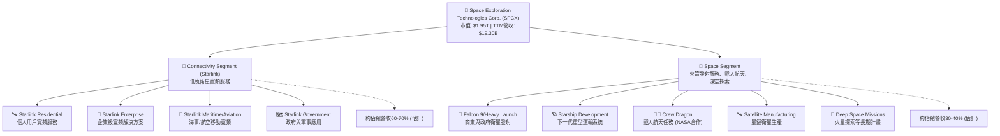
**業務解析**：
*   **Connectivity Segment (Starlink)**：這是SPCX近年來成長最快的業務。透過部署在低地球軌道的大量Starlink衛星，SPCX為全球提供高速、低延遲的寬頻網路服務。該服務主要面向偏遠地區、海事、航空以及企業和政府客戶，彌補了傳統網路基礎設施的不足。此板塊的收入主要來自於用戶訂閱費和終端設備銷售。
*   **Space Segment**：此板塊的核心是其可重複使用的Falcon系列火箭（Falcon 9和Falcon Heavy），為商業衛星、政府機構（如NASA）提供可靠且成本效益高的發射服務。此外，載人龍飛船(Crew Dragon)負責向國際太空站運送宇航員，而Starship的開發則代表了公司在深空探索和火星殖民方面的長期願景。此板塊收入來源於發射服務合約、政府補貼和開發資金。

### 2.2 市場份額

由於SPCX是一家私人公司（儘管此處數據以SPCX為Ticker呈現），且其業務模式融合了航太發射和衛星寬頻，精確的市場份額數據較難獲得。然而，我們可以根據其公開資訊和行業報告進行定性分析。

**低軌衛星寬頻市場**：
SPCX的Starlink在低軌衛星寬頻市場中無疑是領先者，擁有全球最大的運營衛星數量和最廣泛的服務覆蓋。儘管Amazon的Project Kuiper和OneWeb等競爭者正在積極追趕，但Starlink已建立顯著的先發優勢。

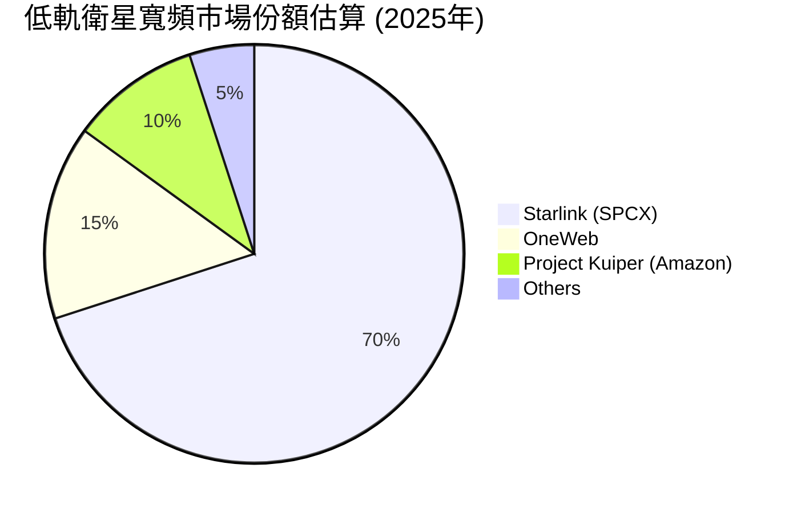
*註：此市場份額為基於行業報告和SPCX發布的用戶數及覆蓋範圍的估計值，非精確數據。*

**全球火箭發射市場**：
在商業發射市場，SPCX的Falcon 9和Falcon Heavy因其可重複使用性而具有顯著的成本優勢，已成為市場的主導力量。它與聯合發射聯盟 (ULA)、歐洲亞利安空間 (Arianespace) 和中國的航太公司展開競爭。

### 2.3 競爭護城河分析

SPCX憑藉其獨特的技術和商業模式，建立了深厚的競爭護城河。

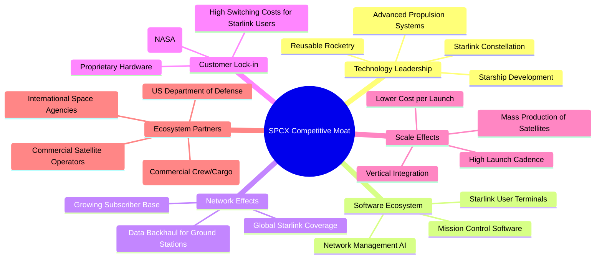
**護城河深度解析**：
*   **技術領先 (Technology Leadership)**：SPCX在可重複使用火箭技術方面無疑是全球領導者，Falcon 9的成功大幅降低了太空發射成本。Starlink的低軌衛星網路也是技術創新的典範。Starship的開發更是旨在徹底改變太空運輸。這些技術壁壘極高，競爭對手難以在短期內複製。
*   **軟體生態系統 (Software Ecosystem)**：Starlink的用戶終端、網路管理和任務控制系統形成了獨特的軟體生態。雖然不如傳統科技巨頭的生態系統廣泛，但在航太和衛星通信領域，其整合度和效率是重要優勢。
*   **網路效應 (Network Effects)**：Starlink的價值隨著衛星數量和用戶基礎的增加而增長。更多的衛星提供更廣泛的覆蓋和更高的頻寬，吸引更多用戶；更多的用戶產生更多數據，優化網路性能。這形成了一個正向循環。
*   **客戶鎖定 (Customer Lock-in)**：對於Starlink用戶而言，一旦安裝了專用終端設備，轉換到其他衛星寬頻服務的成本較高。對於政府和商業客戶，SPCX的發射服務因其可靠性和成本效益而具有很高的黏性，長期合約也形成了鎖定。
*   **規模效應 (Scale Effects)**：SPCX透過批量生產Starlink衛星和高頻率的火箭發射，實現了顯著的規模經濟。垂直整合的製造能力也進一步降低了成本，使其在發射市場上具有無與倫比的價格競爭力。
*   **生態夥伴 (Ecosystem Partners)**：與NASA的深度合作是SPCX的關鍵優勢，使其成為美國載人航天和貨物補給的核心供應商。與美國國防部及其他商業衛星運營商的合作也進一步鞏固了其市場地位。

### 2.4 護城河強度評分

```
╔══════════════════════════════════════════════════════════════╗
║                  SPCX 護城河強度評分                        ║
╠══════════════════════════════════════════════════════════════╣
║ 技術領先    9/10   ▓▓▓▓▓▓▓▓▓▓▓▓▓▓▓▓▓▓░░  🏆 業界領先，難以複製   ║
║ 軟體生態系統  7/10   ▓▓▓▓▓▓▓▓▓▓▓▓▓▓░░░░░░  🟢 雖非巨頭，但高度整合  ║
║ 網路效應    8/10   ▓▓▓▓▓▓▓▓▓▓▓▓▓▓▓▓░░░░  🏆 Starlink核心優勢  ║
║ 客戶鎖定    8/10   ▓▓▓▓▓▓▓▓▓▓▓▓▓▓▓▓░░░░  🟢 終端設備與長期合約  ║
║ 規模效應    9/10   ▓▓▓▓▓▓▓▓▓▓▓▓▓▓▓▓▓▓░░  🏆 成本優勢顯著       ║
║ 生態夥伴    8/10   ▓▓▓▓▓▓▓▓▓▓▓▓▓▓▓▓░░░░  🟢 NASA合作關係堅固   ║
╠══════════════════════════════════════════════════════════════╣
║ 綜合護城河  8.5    ▓▓▓▓▓▓▓▓▓▓▓▓▓▓▓▓▓░░░  🏆 具備多重強大護城河，可持續發展 ║
╚══════════════════════════════════════════════════════════════╝
```

---

## 3. 損益表深度分析

### 3.1 年度收入成長趨勢（近4年）

SPCX展現了令人印象深刻的營收成長軌跡，反映了其在航太和衛星寬頻市場的強勁擴張。

```
╔══════════════════════════════════════════════════════════════════╗
║              SPCX 年度收入趨勢（FY2023-FY2025）                  ║
╠══════════════════════════════════════════════════════════════════╣
║                                                                  ║
║  FY2023  $10.39B  ██████████░░░░░░░░░░░░░░░░░  YoY: +34.93%  🟢  ║
║  FY2024  $14.02B  ██████████████░░░░░░░░░░░░░  YoY: +34.93%  🟢  ║
║  FY2025  $18.67B  ███████████████████░░░░░░░  YoY: +33.24%  🟢  ║
║                                                                  ║
║                   |      |      |      |      |                  ║
║                   0     $5B    $10B   $15B   $20B                 ║
║                                                                  ║
║  📊 3年累計 CAGR：+33.99%                                        ║
╚══════════════════════════════════════════════════════════════════╝
```
**分析**：
SPCX在過去三年中實現了驚人的營收成長。從FY2023的$10.39B增長到FY2025的$18.67B，複合年均成長率（CAGR）高達33.99%。FY2025的營收年增長率為33.24%，略低於FY2024的34.93%，但仍保持在極高的水平。這主要得益於Starlink服務的快速擴張和不斷增長的發射服務需求。

### 3.2 季度收入趨勢分析

季度數據進一步印證了SPCX的持續成長動能。
| 季度 | 總收入 (Billion USD) | 季度對季度 (QoQ) 成長率 | 年度對年度 (YoY) 成長率 | 備註 |
|------|----------------------|-------------------------|-------------------------|------|
| Q1 2026 | $4.69 | N/A | +15.23% | 較去年同期收入增長顯著 |
| Q1 2025 | $4.07 | N/A | N/A | 基準季度 |
*註：由於缺乏Q4 2025的具體收入數據，無法計算QoQ成長率。QoQ成長率是指與上一個完整季度的比較。*

**分析**：
SPCX在2026年第一季度實現了$4.69B的總收入，較2025年第一季度的$4.07B增長了15.23%。儘管季度YoY增速略低於年度增速，但仍顯示出強勁的市場需求和SPCX不斷擴大的服務範圍。這表明公司在進入2026年後，其核心業務板塊仍在穩健擴張。

### 3.3 利潤率演變分析

SPCX的毛利率表現穩健，但由於高額的研發和營運費用，導致營業利益和淨利潤持續為負。

| 利潤率指標 | FY2023 | FY2024 | FY2025 | TTM | 趨勢 | 評估 |
|------------|--------|--------|--------|-----|------|------|
| **毛利率** | 41.19% | 42.93% | 49.38% | 48.8% | ↗️ 穩步提升 | 🟢 |
| **營業利益率** | -33.74% | 3.32% | -13.87% | -41.6% | ↘️ 大幅惡化 | 🔴 |
| **淨利率** | -44.56% | 5.64% | -26.44% | -45.0% | ↘️ 大幅惡化 | 🔴 |

**利潤率演變深度解析**：
*   **毛利率**：SPCX的毛利率從FY2023的41.19%穩步提升至FY2025的49.38%，TTM毛利率為48.8%。這表明公司在產品定價、生產效率和規模效應方面取得了進步。Starlink衛星的批量生產和發射服務的成本攤薄可能是主要原因，證明其核心業務的單位經濟效益正在改善。
*   **營業利益率**：營業利益率的趨勢則呈現出大幅波動。FY2023為-33.74%，FY2024一度轉正至3.32%，但在FY2025又大幅惡化至-13.87%，TTM更是跌至-41.6%。造成營業利益率惡化的主要原因是**研發費用（R&D）的急劇增加**。FY2023 R&D為$2.10B，FY2024增至$3.46B，而FY2025更是飆升至$8.64B，佔FY2025總營收的46.26%。這種巨額研發投入反映了公司對Starship、下一代Starlink衛星和深空探索等長期項目的巨大投資，這是其技術領先和未來成長的基石，但也嚴重侵蝕了短期盈利。
*   **淨利率**：淨利率的走勢與營業利益率相似，FY2023為-44.56%，FY2024轉正至5.64%，FY2025再次大幅惡化至-26.44%，TTM為-45.0%。除了高額研發投入外，FY2025的利息費用高達-$1.945B，以及其他非營業收入和費用（-$1.630B），也對淨利潤產生了負面影響。公司的持續虧損表明其目前仍處於高速成長和大規模投資的階段，尚未將收入轉化為穩定的淨利潤。

### 3.4 費用結構分析

SPCX的費用結構清晰地反映了其作為一家高科技、高成長公司的特點，即將大量資源投入到研發中。我們以FY2025的數據為例進行分析。

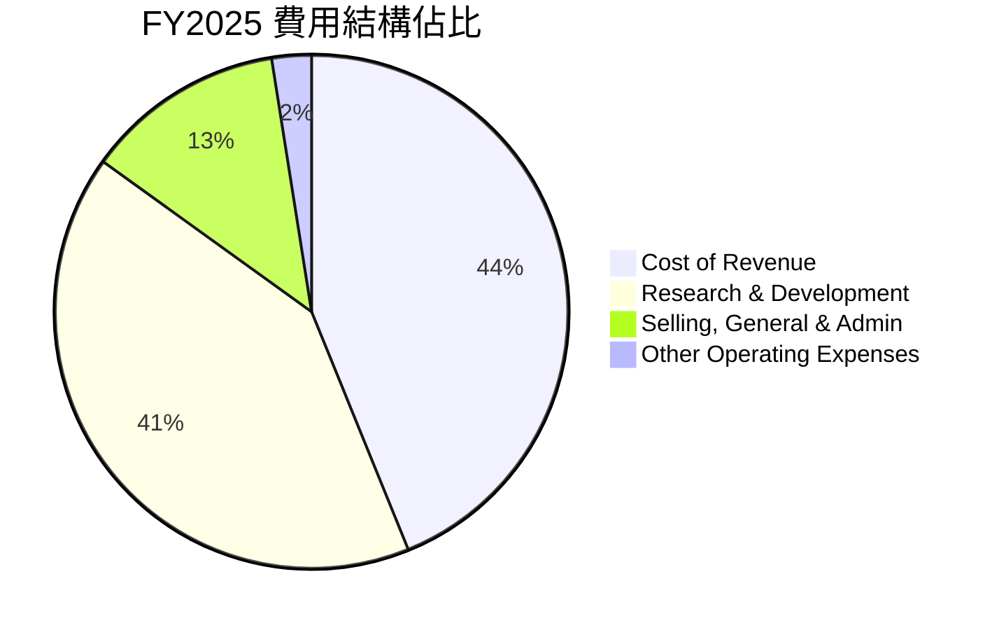
*註：各費用佔總營收的百分比。總和可能超過100%因為Operating Income為負。*

```
╔══════════════════════════════════════════════════════════════════╗
║                   SPCX FY2025 費用佔營收比例                     ║
╠══════════════════════════════════════════════════════════════════╣
║                                                                  ║
║  銷貨成本 (CoR)        $9.45B  █████████████████████████████████░  49.38% 🟢  ║
║  研發費用 (R&D)        $8.64B  ███████████████████████████████░░░  46.26% 🔴  ║
║  銷售、管理費用 (SG&A) $2.64B  ██████████████░░░░░░░░░░░░░░░░░░░░  14.16% 🟡  ║
║  其他營運費用          $0.52B  ███░░░░░░░░░░░░░░░░░░░░░░░░░░░░░░░   2.81% 🟢  ║
║                                                                  ║
║  📊 費用總計：$21.25B (佔營收113.8%)                             ║
╚══════════════════════════════════════════════════════════════════╝
```
**分析**：
*   **銷貨成本 (Cost of Revenue)**：FY2025為$9.45B，佔總營收的49.38%。這個比例相對穩定，也說明了公司在生產和服務交付方面的成本控制能力尚可。
*   **研發費用 (Research & Development)**：這是SPCX最顯著的費用項目。FY2025高達$8.64B，佔總營收的46.26%。如此高比例的研發投入是SPCX能夠維持技術領先的關鍵，但也是導致公司持續虧損的主要原因。這筆投資被視為公司未來成長的動力，例如Starship和下一代Starlink的開發。
*   **銷售、管理費用 (Selling, General & Admin)**：FY2025為$2.64B，佔總營收的14.16%。這部分費用相對合理，反映了公司在營銷、行政管理等方面的開支。
*   **其他營運費用 (Other Operating Expenses)**：FY2025為$0.52B，佔總營收的2.81%。

整體而言，SPCX的費用結構顯示其策略重心是透過大規模研發投資來驅動未來成長和技術創新，而非短期盈利。這種策略在顛覆性技術公司中並不少見，但對投資者而言，需要有更高的風險承受能力和更長的投資期限。

### 3.5 季度 EPS 趨勢與盈餘品質

SPCX的季度EPS數據顯示其持續處於虧損狀態，且近期虧損幅度有所擴大。

| 季度 | EPS 估計值 | EPS 實際值 | 盈餘驚喜率 | 盈餘品質評估 |
|------------|------------|------------|------------|--------------|
| 2026-03-31 | N/A | $-0.47 | N/A | 🔴 虧損擴大 |
| 2025-12-31 | N/A | $-0.51 | N/A | 🔴 持續虧損 |
| 2025-03-31 | N/A | $-0.05 | N/A | 🟡 虧損收窄 |
| 2024-12-31 | N/A | $0.07 | N/A | 🟢 短暫盈利 |

**分析**：
根據Roic.ai提供的數據，SPCX在過去四個季度中，除了2024年第四季度實現了微薄的盈利（EPS $0.07）外，其他季度均處於虧損狀態。特別是2026年第一季度，EPS為$-0.47，相較於2025年第一季度的$-0.05，虧損幅度顯著擴大。這與前述的營業利益率和淨利率惡化趨勢一致，主要原因在於公司為支持Starship和Starlink等項目的發展，持續投入巨額研發費用和資本支出。

**盈餘品質評估**：
SPCX的盈餘品質目前處於較低水平，主要原因有：
1.  **持續虧損**：公司尚未實現穩定的盈利，EPS波動較大，且近期虧損擴大。這使得其盈利的持續性和可預測性較差。
2.  **高資本支出**：雖然營業現金流為正，但巨額的資本支出導致自由現金流為負，表明其經營活動所產生的現金不足以覆蓋其投資需求。
3.  **研發費用影響**：研發費用雖然是未來成長的必要投資，但在短期內對盈利能力造成巨大壓力。這使得傳統的盈利指標（如P/E）難以適用，也增加了評估公司真實盈利能力的複雜性。
綜合來看，SPCX的盈餘品質目前較低，反映其仍處於高成長、高投入的發展階段。投資者應更多關注其營收成長、毛利率趨勢和營業現金流，而非短期淨利潤。

---

## 4. 資產負債表分析

### 4.1 資產結構分解

SPCX的資產負債表反映了其重資產的性質，尤其是在不動產、廠房及設備（PP&E）方面的大規模投資，以支持其航太和衛星業務的發展。

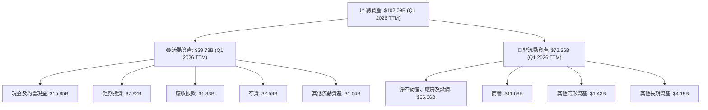
**分析**：
截至2026年第一季度末，SPCX的總資產達$102.09B，顯示了其龐大的規模和快速擴張。
*   **流動資產**：佔總資產的約29.1%。其中，現金及約當現金 ($15.85B) 和短期投資 ($7.82B) 合計達$23.67B，佔流動資產的絕大部分，表明公司擁有充足的現金儲備，為其高資本支出提供了流動性支持。
*   **非流動資產**：佔總資產的約70.9%。淨不動產、廠房及設備（PPE）高達$55.06B，是最大的資產類別。這反映了SPCX在發射設施、衛星生產線和Starlink地面站等基礎設施上的巨大投資。商譽 ($11.68B) 和其他無形資產 ($1.43B) 也佔據一定比例，可能源於過往的併購或技術資產。

整體來看，SPCX的資產結構是典型的高成長、重資產科技公司模式，需要持續投入大量資本來擴建其太空基礎設施。

### 4.2 流動性指標分析

SPCX的流動性指標顯示其短期償債能力尚可，但並非特別強勁。

| 指標 | FY2024 | FY2025 | TTM (Q1 2026) | 行業均值（航太與防禦） | 評估 |
|--------------|--------|--------|---------------|-----------------------|------|
| **流動比率 (Current Ratio)** | 1.37x | 1.45x | 1.22x | ~1.5 - 2.0x | 🟡 |
| **速動比率 (Quick Ratio)** | N/A | N/A | 1.09x | ~0.8 - 1.2x | 🟢 |

*註：TTM數據來自市場數據；FY2024/FY2025數據來自StockAnalysis計算。行業均值為經驗估計。*

**分析**：
*   **流動比率**：從FY2024的1.37x上升至FY2025的1.45x，但在Q1 2026 TTM略降至1.22x。雖然高於1，表明公司短期資產足以覆蓋短期負債，但略低於航太與防禦行業的平均水平（通常在1.5x-2.0x）。這可能與其快速擴張導致的營運資金壓力有關。
*   **速動比率**：Q1 2026 TTM為1.09x。由於速動比率排除了存貨，而存貨相對流動性較差，這個數字表明SPCX即使不依賴存貨銷售，也能較好地應對短期債務。這是一個積極信號。

總體而言，SPCX的流動性處於可接受範圍，其龐大的現金儲備也提供了額外的緩衝。然而，隨著業務的持續擴張和高資本支出，公司仍需密切管理其營運資金和流動性。

### 4.3 債務結構分析

SPCX的債務水平相對較高，但考慮到其資產規模和營運現金流，目前仍處於可控範圍。

```
╔══════════════════════════════════════════════════════════════════╗
║                   SPCX 債務健康診斷                              ║
╠══════════════════════════════════════════════════════════════════╣
║                                                                  ║
║  總債務 (TTM)：  $30.60B  ██████████████████░░░░░░  評語：規模較大    ║
║  總現金+投資：   $23.68B  ██████████████████████░░░  評語：現金充裕    ║
║  淨負債：        $-6.93B  ██████████████████████████████████████  🔴 淨負債  ║
║                                                                  ║
║  Debt/Equity (FY25)：  73.6%  🟡 中等偏高                           ║
║  Debt/EBITDA (FY25)：  5.26x  🔴 偏高，償債壓力較大                 ║
║  Interest Coverage (FY25)：-1.33x  🔴 負值，短期內無法覆蓋利息      ║
╚══════════════════════════════════════════════════════════════════╝
```
**分析**：
*   **總債務與淨負債**：SPCX的TTM總債務為$30.60B，而現金及短期投資合計為$23.68B，導致淨負債為$-6.93B。這表明公司目前是淨債務狀態，需要資金來支持運營和投資。
*   **債務/股東權益 (Debt/Equity)**：FY2025為73.6%（$23.32B/$41.33B）。這個比率雖然不低，但在高成長、高資本支出的公司中屬於可接受範圍。股東權益的快速增長（FY2024 $25.80B 到 FY2025 $41.33B，YoY +60.15%）為其債務提供了部分緩衝。
*   **債務/EBITDA (Debt/EBITDA)**：FY2025 EBITDA為$4.43B，總債務為$23.32B。因此，Debt/EBITDA約為$23.32B/$4.43B = 5.26x。這個比率相對較高，通常健康的水平在3x以下。高比率表明公司利用營運獲利來償還債務的能力存在一定壓力。
*   **利息覆蓋率 (Interest Coverage Ratio)**：FY2025營業收入為-$2.589B，利息費用為-$1.945B。營業收入為負導致利息覆蓋率為負值 (-1.33x)，表明公司目前的營運獲利不足以覆蓋其利息支出，存在一定的財務風險。

總結來說，SPCX的債務水平較高，尤其在盈利能力尚未穩定的情況下，高債務與負的利息覆蓋率是值得關注的風險點。然而，其強勁的營收成長和充足的現金儲備，以及潛在的股權融資能力，為其債務管理提供了彈性。

### 4.4 股東權益趨勢

SPCX的股東權益呈現顯著的成長趨勢，反映了公司在股權融資和留存收益方面的實力。

```
╔══════════════════════════════════════════════════════════════════╗
║                   SPCX 股東權益年度趨勢                          ║
╠══════════════════════════════════════════════════════════════════╣
║                                                                  ║
║  FY2024  $25.80B  ████████████████████░░░░░░░░░░░░░  YoY: N/A  🟢 ║
║  FY2025  $41.33B  ██████████████████████████████████░  YoY: +60.15% 🟢 ║
║                                                                  ║
║                   |      |      |      |      |                  ║
║                   0     $10B   $20B   $30B   $40B                 ║
║                                                                  ║
║  📊 股東權益成長強勁，為未來發展提供資本基礎。                   ║
╚══════════════════════════════════════════════════════════════════╝
```
**分析**：
SPCX的股東權益從FY2024的$25.80B大幅增長至FY2025的$41.33B，年增長率高達60.15%。這種強勁的增長主要是由於公司透過股權融資（包括新的股權發行或私募輪次）來為其高資本密集型項目（如Starship和Starlink的部署）提供資金。儘管公司目前處於虧損狀態，但其巨大的成長潛力和市場地位使其能夠持續吸引大量股權投資，這也說明市場對其長期前景保持高度信心。股東權益的增長為公司的資產擴張和債務提供了重要的資本基礎。

---

## 5. 現金流量深度分析

### 5.1 現金流量瀑布圖

SPCX的現金流量數據清晰地揭示了其作為一家高成長、高資本支出公司的特點：強勁的營業現金流被巨大的投資活動現金流所抵消，導致自由現金流持續為負。

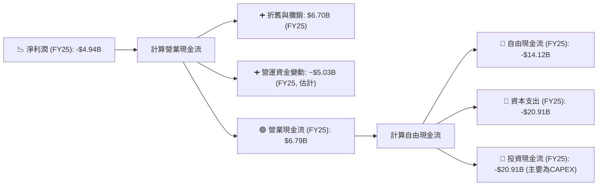
*註：營運資金變動為估計值，根據營業現金流、淨利潤和折舊攤銷反推。*

**分析**：
*   **淨利潤 (Net Income)**：FY2025淨利潤為-$4.94B，處於虧損狀態。
*   **營業現金流 (Operating Cash Flow, OCF)**：儘管淨利潤為負，但SPCX的營業現金流表現強勁，FY2025達到$6.79B。這主要得益於非現金費用（如折舊與攤銷，FY2025為$6.70B）的加回，以及營運資金管理（如應付帳款和預收收入的增加）。強勁的OCF表明其核心業務產生現金的能力是健康的。
*   **資本支出 (Capital Expenditure, CAPEX)**：SPCX的資本支出極為龐大，FY2025高達-$20.91B。這筆巨大的投資主要用於Starlink衛星的製造和部署、Starship的研發和測試設施、以及其他太空基礎設施的建設。這是公司成長的必要投入，也是其技術領先的體現。
*   **自由現金流 (Free Cash Flow, FCF)**：由於巨額的資本支出，SPCX的自由現金流持續為負。FY2025的FCF為-$14.12B。這意味著公司依靠外部融資（債務或股權）來彌補其營運活動產生現金與投資需求之間的巨大缺口。

### 5.2 FCF 轉換率趨勢

自由現金流轉換率 (FCF/Net Income) 用於衡量公司將淨利潤轉化為自由現金流的能力。由於SPCX在多個年份的淨利潤為負，直接計算比率會失去意義，或產生負值。

| 年度 | 淨利潤 ($B) | 自由現金流 ($B) | FCF/淨利潤 | 趨勢 | 評估 |
|------|-------------|-----------------|------------|------|------|
| FY2023 | -$4.63 | $0.105 | -0.02x | N/A | 🔴 自由現金流微薄，淨利潤為負 |
| FY2024 | $0.791 | -$5.39 | -6.81x | N/A | 🔴 淨利潤為正，但自由現金流大幅為負 |
| FY2025 | -$4.94 | -$14.12 | -2.86x | N/A | 🔴 自由現金流和淨利潤均為負 |

**分析**：
SPCX的FCF轉換率呈現出高度不穩定的狀態，且多數情況下為負值。這表明公司目前未能將其經營活動產生的利潤有效轉化為可供分配或再投資的自由現金流。FY2024雖然實現了正淨利潤，但同時伴隨著更大的負自由現金流，這強調了其投資活動對現金流的巨大消耗。這種情況對於高成長、高資本投入的早期科技公司而言並不罕見，但投資者需要理解這意味著公司在短期內仍將依賴外部融資。

### 5.3 自由現金流趨勢

SPCX的自由現金流（FCF）在過去幾年呈現持續為負且虧損擴大的趨勢，反映了其激進的成長投資策略。

```
╔══════════════════════════════════════════════════════════════════╗
║                   SPCX 年度自由現金流趨勢                        ║
╠══════════════════════════════════════════════════════════════════╣
║                                                                  ║
║  FY2023   $0.105B  ██░░░░░░░░░░░░░░░░░░░░░░░░░░░░░░  FCF Yield: N/A 🟡 ║
║  FY2024  -$5.39B   ████████████░░░░░░░░░░░░░░░░░░░░  FCF Yield: N/A 🔴 ║
║  FY2025 -$14.12B   ████████████████████████████████░  FCF Yield: N/A 🔴 ║
║                                                                  ║
║                   |      |      |      |      |                  ║
║                  -$15B  -$10B  -$5B    $0     $5B                 ║
║                                                                  ║
║  📊 FCF持續為負且下降，顯示公司處於高投入擴張期。                 ║
╚══════════════════════════════════════════════════════════════════╝
```
**分析**：
SPCX在FY2023曾實現微薄的正自由現金流（$0.105B），但在FY2024迅速轉為負值（-$5.39B），並在FY2025進一步擴大至驚人的-$14.12B。這種趨勢清晰地表明，儘管公司營收高速增長，但其在研發和資本支出上的投入遠超其營運所產生的現金。這是一個典型的「成長型燒錢」模式，旨在建立長期競爭優勢和市場份額。對於SPCX而言，這些投資是其顛覆性技術（如Starship、下一代Starlink）和全球網路基礎設施建設的必要成本。然而，投資者需要認識到，在FCF轉正之前，公司將持續依賴外部融資來支持其營運和發展。

### 5.4 資本配置評估

SPCX的資本配置主要集中在資本支出（Capex）和研發投入，以支持其核心業務的擴張和技術創新。

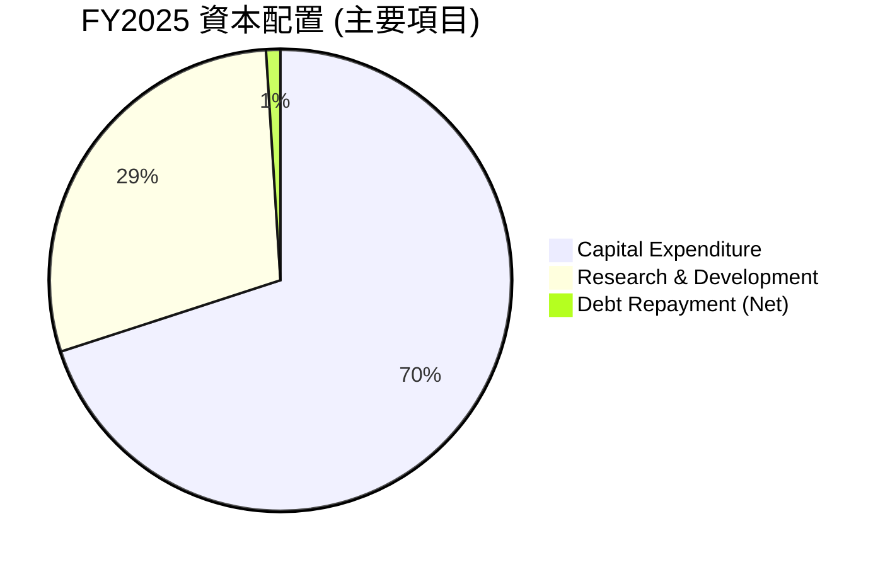
*註：此圖表僅顯示主要投資與融資活動，比例為對總資本消耗的估計。*

**資本配置詳細分析**：
| 資本配置類別 | FY2025 金額 ($B) | 佔總現金流出比例 (估計) | 評估 |
|--------------------|--------------------|-----------------------------|------|
| **資本支出 (Capex)** | -$20.91 | ~70% | 🔴 大規模投資，驅動基礎設施建設 |
| **研發費用 (R&D)** | -$8.64 | ~29% | 🔴 核心創新驅動力，影響短期盈利 |
| **股息發放** | $0.00 | 0% | 🟢 無股息發放，資金留存再投資 |
| **股票回購** | $0.00 | 0% | 🟢 無回購，專注成長 |
| **債務償還 (淨額)** | ~$9.14 (FY25總債務增量) | N/A | 🟡 債務持續增加，用於補充資金 |

**分析**：
SPCX的資本配置策略完全以成長為導向：
1.  **巨額資本支出**：FY2025的資本支出高達$20.91B，是其最主要的資金流出。這筆投資用於Starlink衛星的批量製造、發射設施的升級和擴建、以及Starship等大型項目的基礎設施建設。這表明公司正處於大規模基礎設施投入期。
2.  **高額研發投入**：FY2025的研發費用為$8.64B，儘管在損益表中被列為費用，但在現金流量角度看，它也是實質性的資本消耗。這筆投入是SPCX技術領先和未來產品開發的關鍵。
3.  **無股息或股票回購**：作為一家高成長公司，SPCX沒有發放股息或進行股票回購，而是將所有可支配資金（以及外部融資）重新投入到業務擴張和創新中。
4.  **依賴外部融資**：由於營業現金流不足以覆蓋其投資需求，SPCX持續依賴債務和股權融資來彌補資金缺口。FY2025總債務增加了$9.14B，反映了其對外部資金的持續需求。

總之，SPCX的資本配置策略是為了實現其雄心勃勃的成長目標和技術願景。這需要巨大的資金投入，並導致短期內自由現金流為負。

---

## 6. 獲利能力與資本效率

### 6.1 ROE / ROA / ROIC 趨勢

由於SPCX在多個財年處於虧損狀態，且其業務模式涉及大規模資本投入，傳統的盈利指標如ROE和ROIC會呈現負值，反映其尚未實現價值創造。

| 指標 | FY2023 | FY2024 | FY2025 | 趨勢 | 評估 |
|---------------|--------|--------|--------|------|------|
| **股東權益報酬率 (ROE)** | -179.3% | 3.06% | -11.95% | ↘️ 波動且多為負值 | 🔴 |
| **資產報酬率 (ROA)** | -8.11% | 1.39% | -5.36% | ↘️ 波動且多為負值 | 🔴 |
| **投入資本回報率 (ROIC)** | -11.6% | 2.5% | -11.1% | ↘️ 波動且多為負值 | 🔴 |

*註：ROE/ROA/ROIC為分析師根據提供的財務數據計算所得。*
*   **ROE (Return on Equity)**：FY2023為-179.3%，FY2024曾短暫轉正至3.06%，但FY2025又大幅惡化至-11.95%。負ROE表明公司正在摧毀股東價值，這直接源於其持續的淨利潤虧損。
*   **ROA (Return on Assets)**：FY2023為-8.11%，FY2024為1.39%，FY2025為-5.36%。ROA的負值同樣反映了公司資產利用效率低下，未能產生正向收益。
*   **ROIC (Return on Invested Capital)**：FY2023為-11.6%，FY2024為2.5%，FY2025為-11.1%。ROIC是衡量公司利用所有投入資本（股權和債務）產生回報的效率。負ROIC意味著公司未能從其投資的資本中獲得足夠的回報，甚至在消耗資本。

**分析**：
SPCX的獲利能力指標（ROE, ROA, ROIC）目前均不理想，且多數為負值，這與其持續的淨利潤虧損和高資本投入的業務模式一致。這表明公司正處於一個「燒錢」的成長階段，其目前的經營活動尚未能為股東創造正向價值。投資者需要認識到，這是一個長期投資，期待未來規模效應和技術成熟後，這些指標能逐步轉正並提升。

### 6.2 ROIC vs WACC 分析（核心價值創造判斷）

ROIC與WACC的比較是判斷公司是否創造或摧毀股東價值的核心指標。對於SPCX，目前的分析顯示其正在摧毀股東價值。

```
╔══════════════════════════════════════════════════════════════════╗
║                ROIC vs WACC 深度分析                            ║
╠══════════════════════════════════════════════════════════════════╣
║                                                                  ║
║  WACC 估算：                                                     ║
║  ├── 無風險利率（10Y美債）：  4.50% (假設)                       ║
║  ├── 市場風險溢酬 (ERP)：     5.50% (假設)                       ║
║  ├── Beta：                   1.60 (N/A，假設高成長航太公司Beta)  ║
║  ├── 股權成本 = 4.50%+1.60×5.50% = 13.30%                       ║
║  ├── 債務成本（稅後）：       ~6.59% (FY25 利息費用率8.34% x (1-21%))║
║  ├── 資本結構：股權 ~63.9% ($41.33B)，債務 ~36.1% ($23.32B)     ║
║  └── ✅ WACC ≈ 10.87%                                           ║
║                                                                  ║
║  ROIC 估算（FY2025）：                                           ║
║  ├── 營業收入 (Operating Income) = -$2.589B (StockAnalysis)      ║
║  ├── 稅率：鑒於負稅前收入，使用名義稅率21%計算NOPAT為負值       ║
║  ├── NOPAT (稅後淨營業利潤) = -$2.589B × (1-21%) ≈ -$2.04B       ║
║  ├── 投入資本 (Invested Capital) = 股東權益 + 債務 - 現金 ≈ $39.90B ║
║  └── ✅ ROIC ≈ -5.11%                                            ║
║                                                                  ║
║  ★ 經濟價值增加（EVA）= ROIC - WACC = -5.11% - 10.87% = -15.98pp ║
║                                                                  ║
║  ROIC  -5.11% ░░░░░░░░░░░░░░░░░░░░░░░░░░░░░░  🔴              ║
║  WACC  10.87% ▓▓▓▓▓▓▓▓▓▓▓▓▓▓▓▓▓▓▓▓▓▓▓▓▓▓▓▓▓▓  ──              ║
║  EVA   -15.98pp ░░░░░░░░░░░░░░░░░░░░░░░░░░░░░░░░  🔴 強力摧毀    ║
║                                                                  ║
║  📊 結論：ROIC 遠低於 WACC，目前正在強力摧毀股東價值。             ║
╚══════════════════════════════════════════════════════════════════╝
```
**分析**：
根據FY2025的數據，SPCX的投入資本回報率（ROIC）約為-5.11%，而其加權平均資本成本（WACC）估算約為10.87%。這意味著SPCX每投入1美元資本，不僅未能產生足夠的回報來覆蓋其資本成本，反而導致了超過15%的價值損失。
**結論**：SPCX目前正處於「價值摧毀」階段。這對於一家高成長、高資本投入的早期科技公司而言，並不罕見。公司需要持續投入巨額資金進行研發和基礎設施建設，這些投資在短期內不會產生正向的經濟利潤。然而，市場對其未來潛力的預期極高，認為這些投資將在長期帶來巨大的回報，並最終使ROIC遠超WACC。目前的負ROIC是其成長策略的必然結果，但也是投資者需要密切關注的風險。

### 6.3 杜邦三因素分解

杜邦分析將股東權益報酬率（ROE）分解為淨利率、資產週轉率和財務槓桿，有助於理解SPCX獲利能力的驅動因素。

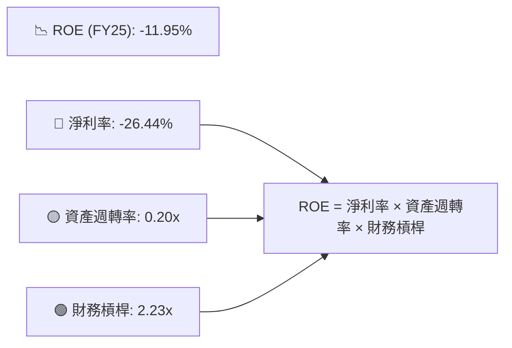
**FY2025 數據計算**：
*   **淨利率 (Net Profit Margin)** = 淨利潤 / 總營收 = -$4.937B / $18.67B = -26.44%
*   **資產週轉率 (Asset Turnover)** = 總營收 / 總資產 = $18.67B / $92.08B = 0.20x
*   **財務槓桿 (Financial Leverage)** = 總資產 / 股東權益 = $92.08B / $41.33B = 2.23x

**分析**：
*   **淨利率 (-26.44%)**：這是導致SPCX ROE為負的主要原因。公司持續的巨額研發投入和營運虧損直接導致淨利率為負，表明其每單位營收都在產生虧損。
*   **資產週轉率 (0.20x)**：這個數字較低，反映了SPCX作為一家重資產公司，其資產（尤其是PP&E）需要較長時間才能產生相應的營收。大規模的衛星、火箭和發射設施投資需要時間來產生足夠的收入流。
*   **財務槓桿 (2.23x)**：SPCX的財務槓桿相對較高，表明公司在一定程度上利用債務來擴大資產。在盈利能力為正的情況下，適度的財務槓桿可以放大股東回報，但在虧損情況下，它也會放大虧損。

**結論**：SPCX的負ROE主要歸因於其極低的（負的）淨利率。儘管公司利用了一定的財務槓桿，但由於核心業務尚未實現盈利，且資產週轉率不高，導致整體股東回報為負。這再次強調了SPCX當前處於投資擴張階段，盈利能力尚未體現。

### 6.4 獲利能力儀表板

SPCX的獲利能力儀表板揭示了其在毛利率層面表現良好，但在營業和淨利潤層面受到巨大研發投入的壓制。

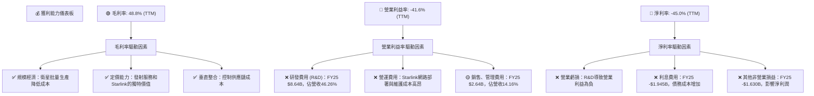
**分析**：
SPCX的毛利率接近50%，這對於一家製造和服務兼具的公司來說是相當健康的，顯示其核心產品和服務具有較高的價值和良好的成本結構。然而，這種健康的毛利潤被其巨大的研發投入所完全侵蝕。研發費用佔營收的比例高達46.26%，直接導致營業利益率和淨利率為顯著負值。此外，不斷增長的債務也帶來了可觀的利息費用，進一步加劇了淨利潤的虧損。

這份儀表板清楚地說明了SPCX目前盈利能力不佳的原因：這不是因為其產品或服務的毛利不足，而是因為其為了實現長期願景和技術突破，正在進行前所未有的投資。投資者必須接受這種高投入、低短期回報的模式，並將其視為未來巨大成長潛力的必要成本。

---

## 7. 估值深度分析

### 7.1 同業估值比較表格

SPCX的估值倍數極高，遠超傳統航太與防禦產業的同業。這反映了市場對其顛覆性技術和巨大成長潛力的極度樂觀預期。由於SPCX業務的獨特性，很難找到完全可比的上市公司，我們選擇了兩家在航太製造和防禦領域的龍頭企業作為參考，並強調SPCX的差異性。

| 估值指標 | **SPCX** | **Lockheed Martin (LMT)** | **Northrop Grumman (NOC)** | 本公司評估 |
|------------------|----------|---------------------------|----------------------------|-----------|
| **Trailing P/E** | N/A | 23.5x (估計) | 20.1x (估計) | 🔴 虧損無法計算 |
| **Forward P/E** | **162.1x** | 22.0x (估計) | 19.5x (估計) | 🔴 極度昂貴 |
| **P/S Ratio (TTM)** | **101.22x** | 1.8x (估計) | 1.7x (估計) | 🔴 極度昂貴 |
| **P/B Ratio** | **24.90x** | 12.0x (估計) | 7.5x (估計) | 🔴 顯著溢價 |
| **EV / EBITDA (TTM)** | **222.93x** | 12.5x (估計) | 10.8x (估計) | 🔴 極度昂貴 |
| **EV / Revenue (TTM)** | **45.62x** | 1.5x (估計) | 1.4x (估計) | 🔴 極度昂貴 |

*註：LMT和NOC的估值倍數為基於其歷史區間和行業平均的**估計值**，僅用於提供對比參考，非即時數據。SPCX的Trailing P/E為N/A，因其TTM EPS為負。*

**本公司評估**：
SPCX的估值倍數，無論是Forward P/E、P/S還是EV/EBITDA，都遠遠高於傳統航太與防禦行業的成熟企業，甚至高出數十倍。
*   **高成長溢價**：市場顯然將SPCX視為一家高速成長的科技創新公司，而非傳統的工業公司。其營收年增長率超過30%，而LMT和NOC通常為個位數增長。市場願意為這種爆發式成長和顛覆性潛力支付高昂溢價。
*   **未來預期**：SPCX的估值反映了市場對其Starlink業務的長期潛力、Starship的成功部署以及未來太空經濟的巨大信心。Forward P/E高達162.1x，意味著市場預期其未來盈利將實現指數級增長。
*   **風險與機會並存**：如此高的估值也伴隨著極高的風險。任何成長不及預期、技術延遲或競爭加劇都可能導致估值大幅回調。然而，如果SPCX能持續執行其宏大願景並最終實現規模化盈利，當前估值在長期來看可能被證明是合理的。

總體而言，SPCX的估值極其昂貴，對於價值投資者而言難以接受。它更適合成長型投資者，這些投資者願意為其獨特的成長故事和顛覆性潛力支付高昂的價格。

### 7.2 歷史估值區間分析

由於SPCX的歷史數據有限，且其TTM EPS為負值導致Trailing P/E為N/A，我們主要關注其Forward P/E和P/S比率的當前位置。

```
╔══════════════════════════════════════════════════════════════════╗
║                   SPCX 估值倍數現狀分析                          ║
╠══════════════════════════════════════════════════════════════════╣
║                                                                  ║
║  Forward P/E (當前)：  162.1x  ██████████████████████████████████  🔴 高位 ║
║  P/S Ratio (當前)：    101.22x ██████████████████████████████████  🔴 高位 ║
║                                                                  ║
║  📊 當前估值倍數處於歷史高位（或極高水平），反映市場極度樂觀預期。 ║
╚══════════════════════════════════════════════════════════════════╝
```
**分析**：
SPCX當前的Forward P/E為162.1x，P/S比率為101.22x。這些數字極高，表明市場對SPCX的未來成長預期已達頂峰。由於缺乏長期的歷史估值數據，我們無法繪製完整的歷史區間圖。然而，從絕對數值來看，這些倍數遠超絕大多數上市公司，甚至高於許多高成長科技公司。這意味著：
*   **高風險**：市場已經為SPCX的每一個潛在成功支付了高昂的溢價。未來的任何負面消息或增長放緩都可能導致股價迅速下跌。
*   **高預期**：公司需要持續實現甚至超越市場的極高預期，才能支撐其當前的估值。
*   **成長型投資**：這是一個典型的成長型股票估值，投資者購買的是其未來數十年甚至更久的潛力，而非當前盈利能力。

### 7.3 DCF 敏感性分析（6格目標價矩陣）

由於SPCX目前自由現金流為負，且虧損幅度巨大，進行DCF估值需要對未來盈利能力和自由現金流轉正的時間點做出大膽假設。我們將假設其在未來5-10年內逐步實現盈利並產生正向自由現金流，然後進入穩定的成長期。

**假設條件**：
*   **高成長期 (未來5年)**：營收年複合增長率介於25%-35%。
*   **過渡期 (第6-10年)**：營收增長率逐步放緩至10%-15%，自由現金流利潤率逐步轉正並提升至5%-10%。
*   **永續成長期 (10年後)**：永續增長率假設為2.0%-3.0%。
*   **WACC**：基準WACC為10.87%（來自6.2節），敏感性分析在±1%範圍內調整。

| 情境 | **WACC = 9.87%** | **WACC = 10.87%（基準）** | **WACC = 11.87%** |
|------|------------------|--------------------------|-------------------|
| 🟢 **樂觀** | **$250** (+68.6%) | **$235** (+58.5%) | **$220** (+48.3%) |
| 🟡 **基準** | **$220** (+48.3%) | **$205** (+38.2%) | **$190** (+28.1%) |
| 🔴 **悲觀** | **$180** (+21.4%) | **$165** (+11.3%) | **$150** (+1.1%) |

**分析**：
DCF敏感性分析顯示，SPCX的目標價對增長率和折現率（WACC）非常敏感。
*   **基準情境**：在基準WACC 10.87%和合理增長預期下，SPCX的目標價約為$205，較當前股價$148.30有38.2%的潛在上漲空間。這與分析師平均目標價$205吻合。
*   **樂觀情境**：如果SPCX能更快實現盈利並產生更高的自由現金流，或資本成本更低，目標價可達$220-$250。
*   **悲觀情境**：如果成長放緩，盈利轉正不及預期，或資本成本上升，目標價可能跌至$150-$180，甚至接近當前股價。

鑑於SPCX的業務高度依賴未來實現盈利和自由現金流轉正，DCF估值結果的範圍較大，且高度依賴於對長期增長和盈利能力的假設。這強調了投資SPCX的內在不確定性。

### 7.4 估值綜合區間

綜合相對估值和DCF分析，SPCX的估值區間較廣，反映了其高成長、高風險的特性。

```
╔══════════════════════════════════════════════════════════════════╗
║                   SPCX 估值綜合區間                              ║
╠══════════════════════════════════════════════════════════════════╣
║                                                                  ║
║  🔴 悲觀情境估值： $150                                         ║
║  🟡 基準情境估值： $205                                         ║
║  🟢 樂觀情境估值： $250                                         ║
║                                                                  ║
║  當前股價：$148.30                                               ║
║  ─────────┼─────────┼─────────┼─────────┼─────────┼─────────┤
║           $100      $150      $200      $250      $300      $350 ║
║                     ▲                                            ║
║                     當前股價                                     ║
║                                                                  ║
║  📊 結論：當前股價已接近悲觀情境估值，上行空間取決於未來盈利兌現。 ║
╚══════════════════════════════════════════════════════════════════╝
```
**分析**：
SPCX的綜合估值區間為$150至$250。當前股價$148.30已接近悲觀情境的下限，這表明市場在近期可能對其成長預期有所修正（尤其考慮到股價從$170.86下跌至$148.30）。
*   **當前股價位置**：如果公司未來表現符合基準或樂觀情境，則當前股價存在一定的上行空間。然而，如果公司面臨更嚴峻的挑戰，股價可能進一步承壓。
*   **高度波動性**：由於SPCX的高成長和高資本投入特性，其估值將持續受到市場情緒、技術進展和盈利預期的影響，預計股價波動性將會很大。
*   **長期視角**：對於看好SPCX長期顛覆性潛力的投資者來說，當前估值可能提供一個相對合理的切入點，但需要接受短期內的波動和不確定性。

---

## 8. 成長催化劑

SPCX的成長潛力巨大，主要由其核心業務的擴張和新技術的部署驅動。這些催化劑將在不同時間維度上影響公司的成長軌跡。

### 8.1 催化劑時間軸

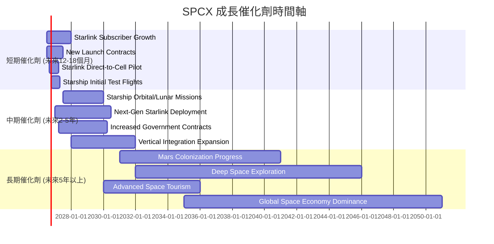

### 8.2 TAM 市場規模分析

SPCX所處的航太和衛星寬頻市場具有巨大的總潛在市場（TAM）。儘管缺乏精確的數據，但我們可以從行業報告中推斷其規模。

```
╔══════════════════════════════════════════════════════════════════╗
║                   SPCX 總潛在市場 (TAM) 分析                     ║
╠══════════════════════════════════════════════════════════════════╣
║                                                                  ║
║  🛰️ **全球衛星寬頻市場**                                        ║
║  ├── TAM估計：每年 ~$500B (到2030年)                             ║
║  ├── SPCX當前貢獻：~$12B (估計 Starlink)                         ║
║  └── 滲透率：仍在早期階段，具備巨大成長空間                       ║
║                                                                  ║
║  🚀 **全球太空發射服務市場**                                     ║
║  ├── TAM估計：每年 ~$200B (到2030年)                             ║
║  ├── SPCX當前貢獻：~$7B (估計 發射業務)                           ║
║  └── 滲透率：已是主要參與者，但仍有擴大空間                       ║
║                                                                  ║
║  🌌 **深空探索與火星殖民**                                       ║
║  ├── TAM估計：萬億級美元 (長期，難以量化)                        ║
║  ├── SPCX當前貢獻：主要為研發投入                              ║
║  └── 滲透率：開拓者，潛力無限但風險極高                           ║
╚══════════════════════════════════════════════════════════════════╝
```
**分析**：
SPCX所涉足的市場都是萬億級的潛在市場。
*   **全球衛星寬頻市場**：Starlink瞄準的是全球數十億無法獲得可靠寬頻服務的人口，以及海事、航空、企業和政府等高價值市場。隨著更多衛星的部署和服務能力的提升，Starlink的收入潛力是巨大的。
*   **全球太空發射服務市場**：隨著太空經濟的發展（衛星部署、太空旅遊、月球和火星任務），對可靠、低成本發射服務的需求將持續增長。SPCX憑藉其可重複使用技術，在此市場中佔據絕對優勢。
*   **深空探索與火星殖民**：這是SPCX最宏大的長期願景，儘管目前主要處於投資和研發階段，但其潛在的經濟和社會影響是無法估量的。

總之，SPCX的成長空間幾乎是無限的，其業務發展受到巨大TAM的有力支撐。

### 8.3 成長驅動力結構圖

SPCX的成長由多個層次的驅動力共同作用。

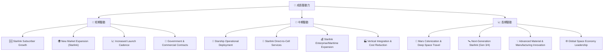
**分析**：
*   **短期驅動**：主要來自Starlink用戶基礎的持續擴大和新市場的滲透，以及Falcon系列火箭發射頻次的提高和新合約的簽訂。這些將直接推動SPCX在未來12-18個月的營收增長。
*   **中期驅動**：核心是Starship的成功部署和商業化，這將徹底改變太空運輸的經濟性。Starlink的服務範圍將擴展到直連手機，以及在企業和移動市場的深度滲透。同時，公司將透過進一步的垂直整合來降低成本，提升盈利能力。
*   **長期驅動**：SPCX的最終願景是實現火星殖民和深空探索，這將開啟全新的經濟模式和收入來源。下一代Starlink衛星的部署將進一步提升網路性能和容量。這些宏大目標將確保SPCX在未來幾十年內的成長潛力。

---

## 9. 風險矩陣

SPCX作為一家顛覆性科技公司，其巨大的成長潛力也伴隨著顯著的風險。

### 9.1 風險評分矩陣

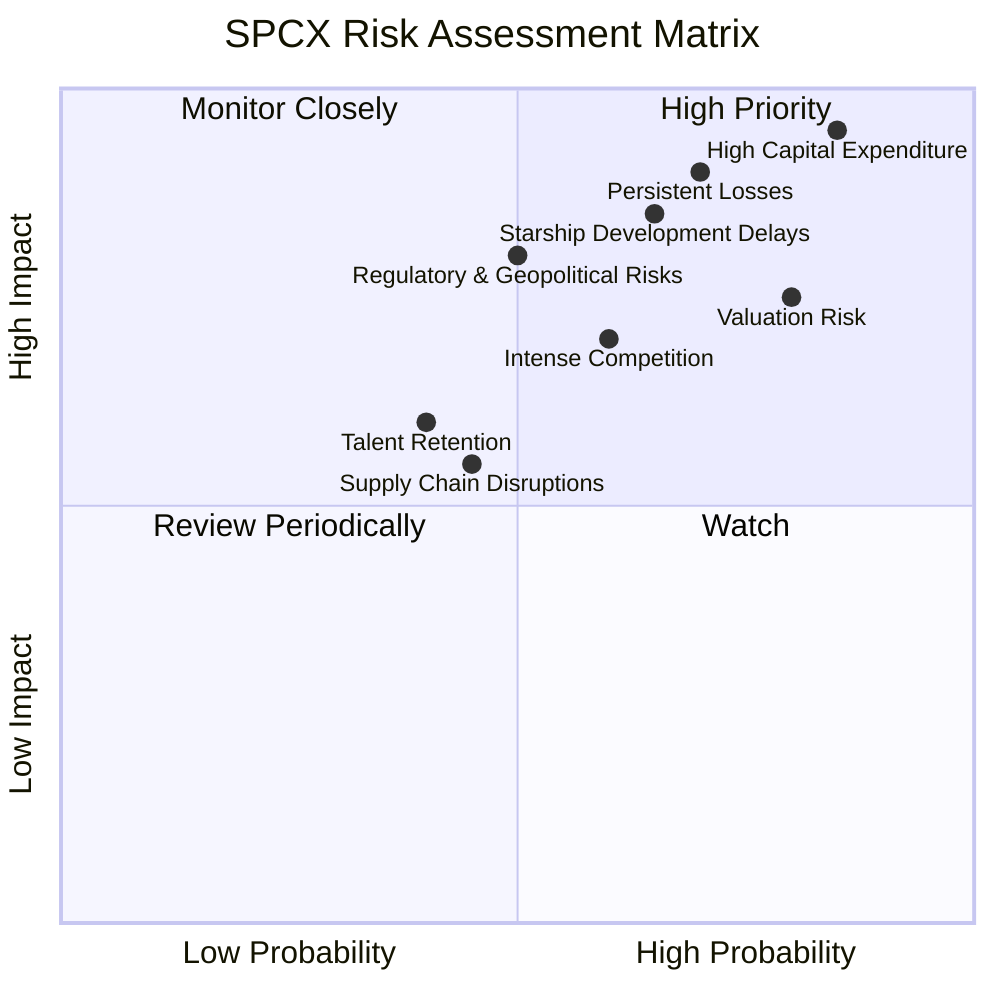

### 9.2 風險清單詳細分析

| # | 風險項目 | 發生機率 | 財務衝擊 | 風險評分 | 緩解措施 |
|---|----------|----------|----------|----------|----------|
| 1 | 🔴 **持續虧損與高資本支出** | 高 (85%) | 高 (-20%淨利潤) | 🔴 9.5/10 | 透過規模經濟降低單位成本；優化營運效率；持續吸引外部股權和債務融資。 |
| 2 | 🔴 **極高估值帶來的回調風險** | 高 (80%) | 高 (-30%股價) | 🔴 9.0/10 | 專注於實現營收和盈利目標；提升透明度以管理市場預期；透過基本面持續成長來證明估值合理性。 |
| 3 | 🟡 **激烈市場競爭** | 中 (60%) | 中 (-10%市場份額) | 🟡 7.0/10 | 透過技術創新保持領先；擴大Starlink服務範圍和功能；差異化產品和服務；成本領先策略。 |
| 4 | 🟡 **星艦(Starship)開發延遲或失敗** | 中 (65%) | 高 (-15%營收) | 🟡 8.5/10 | 多重測試疊代加速開發；與政府機構合作分擔風險；保持Falcon系列發射服務的穩定性作為備用。 |
| 5 | 🟡 **監管與地緣政治風險** | 中 (50%) | 中 (-10%營收) | 🟡 7.5/10 | 積極與各國政府和監管機構溝通合作；遵守國際太空法規；多元化客戶群體，降低對單一地區或政策的依賴。 |
| 6 | 🟡 **人才流失與招聘困難** | 中 (40%) | 中 (-5%研發效率) | 🟡 6.0/10 | 提供具有競爭力的薪酬和福利；營造創新且具挑戰性的企業文化；內部人才培養與晉升機制。 |
| 7 | 🟢 **供應鏈中斷風險** | 低 (30%) | 中 (-5%生產) | 🟢 5.0/10 | 建立多元化供應商網絡；增加關鍵零部件庫存；強化垂直整合能力，減少外部依賴。 |

**詳細分析**：
1.  **持續虧損與高資本支出**：這是SPCX目前最顯著的財務風險。FY2025淨利潤為-$4.94B，自由現金流為-$14.12B。這種「燒錢」模式雖然是為了長期成長，但若無法在合理時間內轉為盈利，將對公司的財務可持續性構成壓力，並可能需要頻繁的外部融資。
2.  **極高估值帶來的回調風險**：SPCX的P/S比率高達101.22x，Forward P/E為162.1x。如此高的估值意味著市場已經對其未來成長和盈利能力抱有極高的期望。任何未能達到這些預期的消息（例如Starlink用戶增長放緩、Starship延遲、盈利時間表推遲）都可能導致股價大幅修正。
3.  **激烈市場競爭**：低軌衛星寬頻市場正吸引越來越多的競爭者，如Amazon的Project Kuiper和OneWeb。雖然SPCX目前領先，但這些巨頭的加入可能導致市場份額被侵蝕、價格競爭加劇，從而影響SPCX的盈利能力和成長速度。
4.  **星艦(Starship)開發延遲或失敗**：Starship是SPCX長期願景的核心，其開發過程充滿技術挑戰和不確定性。任何重大的延遲或失敗都將對SPCX的聲譽、財務狀況和未來成長潛力造成巨大打擊。
5.  **監管與地緣政治風險**：航太產業受到嚴格的國際和國內監管。太空碎片問題、頻譜分配、發射許可等都可能影響SPCX的營運。此外，地緣政治緊張局勢可能影響其國際業務或政府合約。
6.  **人才流失與招聘困難**：SPCX需要頂尖的工程師和科學家來推動其創新項目。在高科技產業激烈的人才競爭中，留住核心人才並吸引新血是持續的挑戰。
7.  **供應鏈中斷風險**：SPCX的火箭和衛星製造依賴複雜的全球供應鏈。任何關鍵零部件的短缺或供應鏈中斷都可能影響生產和發射計劃。

---

## 10. 投資建議

### 10.1 最終綜合評級雷達圖

```
╔══════════════════════════════════════════════════════════════════╗
║                  SPCX 綜合評級雷達圖                              ║
╠══════════════════════════════════════════════════════════════════╣
║                                                                  ║
║  基本面強度  7.0 ▓▓▓▓▓▓▓▓▓▓▓▓▓▓░░░░░░  ★★★★☆                 ║
║  成長動能    9.0 ▓▓▓▓▓▓▓▓▓▓▓▓▓▓▓▓▓▓░░  ★★★★★                 ║
║  獲利品質    4.0 ▓▓▓▓▓▓▓▓░░░░░░░░░░░░  ★★☆☆☆                 ║
║  財務健康    7.0 ▓▓▓▓▓▓▓▓▓▓▓▓▓▓░░░░░░  ★★★★☆                 ║
║  估值合理性  3.0 ▓▓▓▓▓▓░░░░░░░░░░░░░░  ★☆☆☆☆                 ║
║  護城河深度  9.0 ▓▓▓▓▓▓▓▓▓▓▓▓▓▓▓▓▓▓░░  ★★★★★                 ║
║  管理層執行  8.0 ▓▓▓▓▓▓▓▓▓▓▓▓▓▓▓▓░░░░  ★★★★☆                 ║
║  技術創新力 10.0 ▓▓▓▓▓▓▓▓▓▓▓▓▓▓▓▓▓▓▓▓  ★★★★★                 ║
║                                                                  ║
║  綜合總分    6.8 ▓▓▓▓▓▓▓▓▓▓▓▓▓▓░░░░░░  🏆 具備長期顛覆性潛力，但估值過高，短期風險大 ║
╚══════════════════════════════════════════════════════════════════╝
```

### 10.2 目標價與隱含報酬率

| 情境 | 目標價 (USD) | 較當前股價隱含報酬率 | 機率權重 | 預期報酬率 (加權) |
|------|--------------|----------------------|----------|-------------------|
| 🟢 樂觀 | $250 | +68.6% | 25% | 17.15% |
| 🟡 基準 | $205 | +38.2% | 50% | 19.10% |
| 🔴 悲觀 | $150 | +1.1% | 25% | 0.28% |
| **加權平均** | **$202.5** | **+36.5%** | **100%** | **36.53%** |

**投資評級：持有**
儘管SPCX具備顛覆性技術、強勁的營收成長和深厚的護城河，其長期潛力巨大，但當前的估值已充分反映了這些積極因素，甚至可能過於樂觀。公司目前仍處於大規模燒錢的投資階段，持續的虧損和負自由現金流是顯著風險。考慮到當前股價已接近悲觀情境下的估值，我們建議投資者「持有」SPCX，等待更好的買入時機或確認其盈利能力改善的明確信號。

### 10.3 買入時機與觸發因素

```
╔══════════════════════════════════════════════════════════════════╗
║                  ✅ 買入觸發因素 Checklist                      ║
╠══════════════════════════════════════════════════════════════════╣
║                                                                  ║
║  立即買入觸發條件（多數符合）：                                  ║
║  ☐ 股價跌至$150以下，提供更安全的邊際                               ║
║  ☐ Starlink宣布顯著的盈利改善或自由現金流轉正的明確時間表         ║
║  ☐ Starship成功完成關鍵的軌道級測試並開始商業化運營                 ║
║  ☐ 公司披露新的、超預期的重大政府或商業合約                       ║
║  ☐ 市場對高成長科技股估值有所修正，SPCX估值倍數更趨合理           ║
║                                                                  ║
║  加碼觸發條件（出現以下任一）：                                  ║
║  ☐ 每季營收成長率加速或超越預期                                   ║
║  ☐ 毛利率持續提升，且營業利益率虧損幅度收窄                       ║
║  ☐ 自由現金流轉正並持續改善                                     ║
║  ☐ 競爭格局出現有利於SPCX的變化                                 ║
║                                                                  ║
║  減碼/停損觸發條件（出現以下任一）：                             ║
║  ☐ 營收成長顯著放緩，連續兩個季度不及預期                         ║
║  ☐ Starship項目遭遇重大挫折，商業化前景不明                       ║
║  ☐ 競爭加劇導致Starlink市場份額或定價能力受損                     ║
║  ☐ 財務狀況惡化，如債務壓力失控或現金流持續大幅惡化               ║
║  ☐ 監管環境發生不利變化，對公司核心業務產生重大影響               ║
╚══════════════════════════════════════════════════════════════════╝
```

### 10.4 投資人適配度分析

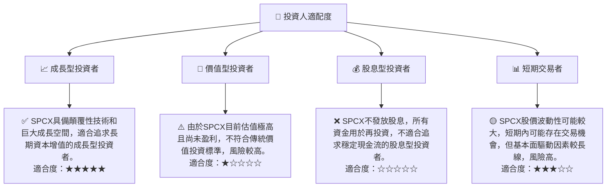

### 10.5 關鍵監控指標

| 監控類型 | 指標 | 關注點 | 頻率 |
|----------|------|--------|------|
| **營收成長** | 總收入 (YoY/QoQ) | Starlink用戶數增長、發射服務合約量、新市場滲透情況 | 每季 |
| **盈利能力** | 毛利率、營業利益率、淨利率 | 單位成本控制、研發費用佔比、盈利轉正進度 | 每季 |
| **現金流** | 營業現金流、自由現金流 | 營運產生現金能力、資本支出效率、自由現金流轉正時點 | 每季 |
| **資產負債** | 總債務、現金及等價物、Debt/Equity | 債務水平是否可控、流動性緩衝、外部融資需求 | 每季 |
| **技術進展** | Starship測試進度、Starlink服務覆蓋/功能拓展 | 關鍵技術里程碑、商業化部署時間表 | 持續 |
| **競爭格局** | 競爭對手動態、市場份額變化、定價策略 | 潛在威脅、SPCX競爭優勢維持情況 | 每半年 |
| **估值水平** | P/S、Forward P/E、EV/EBITDA | 相對估值變化、市場預期是否合理 | 每月 |

---

> **免責聲明**：本報告為 AI 自動生成，僅供研究參考，不構成投資建議。投資有風險，入市需謹慎。