# SPCX 基本面深度分析報告
> **報告日期**：2026-07-09 ｜ **語言**：繁體中文 ｜ **數據來源**：Yahoo Finance, Finviz, StockAnalysis, Roic.ai ｜ **分析師**：CFA 級機構研究

---

## 目錄

| # | 章節 | 核心結論 |
|---|------|----------|
| 1 | 執行摘要 | 評級：持有，基準目標價 $185.00 |
| 2 | 公司概覽與商業模式 | 創新驅動，高成長潛力，強大技術護城河 |
| 3 | 損益表深度分析 | 營收高速成長，毛利率改善，但研發投入巨大導致虧損擴大 |
| 4 | 資產負債表分析 | 資產規模快速擴張，流動性尚可，債務水平可控但持續增加 |
| 5 | 現金流量深度分析 | 營業現金流強勁，但資本支出巨大導致自由現金流持續為負 |
| 6 | 獲利能力與資本效率 | ROIC 為負，目前尚未創造經濟價值，但具潛在轉折點 |
| 7 | 估值深度分析 | 高估值反映市場對未來成長的極高預期，相對同業偏高 |
| 8 | 成長催化劑 | Starlink 用戶擴張、Starship 成功部署、政府與企業級服務 |
| 9 | 風險矩陣 | 高資本支出、激烈競爭、技術失敗、監管風險為主要考量 |
| 10 | 投資建議 | 具備長期成長潛力，但高估值及負現金流帶來不確定性，建議持有觀望 |

---

## 1. 執行摘要

### 1.1 核心評分儀表板

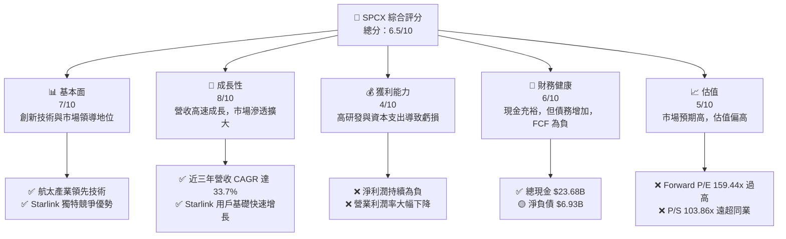

### 1.2 評分進度條視覺化

```
╔══════════════════════════════════════════════════════════════╗
║              SPCX 多維度評分儀表板 (1-10分)                  ║
╠══════════════════════════════════════════════════════════════╣
║ 基本面強度  7.0 ▓▓▓▓▓▓▓▓▓▓▓▓▓▓░░░░░░  ★★★★☆           ║
║ 成長動能    8.0 ▓▓▓▓▓▓▓▓▓▓▓▓▓▓▓▓░░░░  ★★★★☆           ║
║ 獲利品質    4.0 ▓▓▓▓▓▓▓▓░░░░░░░░░░░░  ★★☆☆☆           ║
║ 財務健康    6.0 ▓▓▓▓▓▓▓▓▓▓▓▓░░░░░░░░  ★★★☆☆           ║
║ 估值合理性  5.0 ▓▓▓▓▓▓▓▓▓▓░░░░░░░░░░  ★★★☆☆           ║
║ 護城河深度  8.5 ▓▓▓▓▓▓▓▓▓▓▓▓▓▓▓▓▓░░░  ★★★★☆           ║
║ 管理層執行  7.5 ▓▓▓▓▓▓▓▓▓▓▓▓▓▓▓░░░░░  ★★★★☆           ║
║ 技術創新力  9.0 ▓▓▓▓▓▓▓▓▓▓▓▓▓▓▓▓▓▓░░  ★★★★★           ║
╠══════════════════════════════════════════════════════════════╣
║ 綜合總分    6.5 ▓▓▓▓▓▓▓▓▓▓▓▓▓░░░░░░░  🏆 具備高成長潛力，但風險與估值需警惕              ║
╚══════════════════════════════════════════════════════════════╝
```

### 1.3 五大投資論點 + 三大核心風險

| 類型 | 項目 | 具體依據 | 信心度 |
|------|------|----------|--------|
| 🟢 **投資論點①** | **顛覆性技術與市場領導地位** | SpaceX 在可重複使用火箭技術和低軌衛星寬頻（Starlink）領域擁有顯著領先優勢，其火箭發射成本遠低於傳統競爭對手，Starlink 用戶數量持續擴張。 | 🟢 極高 |
| 🟢 **投資論點②** | **高速營收成長與巨大潛在市場 (TAM)** | 公司在 2023-2025 年營收年複合成長率達 33.7%，2025 年營收達 $18.67B。全球航太與衛星寬頻市場規模龐大且仍在快速成長，SPCX 具備長期成長空間。 | 🟢 極高 |
| 🟢 **投資論點③** | **Starlink 穩定的訂閱服務收入** | Starlink 作為高成長的衛星寬頻服務，提供穩定的訂閱收入流，其低延遲、高速度的特性使其在偏遠地區和企業市場具備獨特優勢。毛利率從 2023 年 41.19% 提升至 2025 年 49.38%，顯示規模效應逐步顯現。 | 🟢 高 |
| 🟢 **投資論點④** | **強勁的營業現金流** | 儘管淨利潤為負，公司營業現金流持續增長，從 2023 年的 $4.52B 增至 2025 年的 $6.79B，顯示其核心業務具備良好的現金產生能力。 | 🟢 高 |
| 🟢 **投資論點⑤** | **持續高研發投入與技術創新** | 2025 年研發投入高達 $8.64B，較 2024 年 $3.46B 增長 149.7%，顯示公司持續投入於 Starship、新衛星等前瞻性技術，為未來成長奠定基礎。 | 🟢 高 |
| 🟡 **風險①** | **高資本支出與負自由現金流** | 公司為擴大 Starlink 衛星部署和 Starship 開發，資本支出巨大，2025 年達 $-20.91B，導致自由現金流持續為負（2025 年為 $-14.12B），對外部融資依賴度高。 | 🟡 中度 |
| 🔴 **風險②** | **獲利能力不確定性與高估值** | 儘管營收成長迅速，但公司淨利潤持續為負，營業利潤率在 2025 年惡化至 -11.03%。當前 Forward P/E 159.44x 和 P/S 103.86x 遠高於市場平均，市場對其未來獲利能力轉正存在極高預期，一旦成長放緩或獲利不及預期，估值面臨巨大壓力。 | 🔴 高衝擊 |
| 🟡 **風險③** | **激烈競爭與技術風險** | 衛星寬頻市場面臨來自 OneWeb、Amazon Kuiper 等新進入者的競爭。航太發射市場亦有 Blue Origin 等挑戰者。此外，Starship 等新技術的開發與部署仍存在技術失敗和延遲風險。 | 🟡 中度 |

### 1.4 快速統計卡片

| 指標 | 公司實際值 | 行業均值 | S&P 500 均值 | 狀態 |
|------|-------------|----------|--------------|------|
| 收入 YoY 成長 | **15.4% (TTM)** | ~10-15% | ~8-12% | 🟢 |
| 毛利率 | **48.8% (TTM)** | ~30-40% | ~35-45% | 🟢 |
| 淨利率 | **-45.0% (TTM)** | ~5-10% | ~8-15% | 🔴 |
| ROE | **N/A (TTM)** | ~10-15% | ~15-20% | 🔴 (預計為負) |
| Forward P/E | **159.44x** | ~25-35x | ~20-25x | 🔴 |
| P/S Ratio | **103.86x** | ~2-5x | ~2-4x | 🔴 |
| EV / EBITDA | **221.21x** | ~10-15x | ~12-18x | 🔴 |
| 債務/股權 | **0.596x (TTM)** | ~0.5-1.0x | ~0.8-1.2x | 🟢 |
| 流動比率 | **1.217x (TTM)** | ~1.5-2.0x | ~1.5-2.0x | 🟡 |
| 營業現金流 (TTM) | **$7.10B** | 穩定增長 | 穩定增長 | 🟢 |
| 自由現金流 (TTM) | **$-14.00B** | 正值 | 正值 | 🔴 |

*註：行業均值和 S&P 500 均值為分析師根據航空航太與高科技成長產業的普遍情況估算，僅供參考。*

### 1.5 投資結論

```
╔══════════════════════════════════════════════════════════════════╗
║                    📊 投資結論摘要                               ║
╠══════════════════════════════════════════════════════════════════╣
║  評級：🟡 持有                                                   ║
║  當前股價：$152.16                                               ║
║  目標價區間：                                                    ║
║    悲觀情境：$130.00 (-14.57%)                                   ║
║    基準情境：$185.00 (+21.58%)  ← 12個月主要目標                 ║
║    樂觀情境：$230.00 (+51.16%)                                   ║
║  投資評分：6.5/10                                                ║
║  適合投資人：高風險偏好、長線成長型、具備耐心等待公司實現獲利轉折點的投資者。                                ║
╚══════════════════════════════════════════════════════════════════╝
```

---

## 2. 公司概覽與商業模式

### 2.1 業務結構與收入來源

Space Exploration Technologies Corp. (SPCX) 是一家領先的私人航太製造商和太空運輸服務公司，其核心業務分為兩大板塊：**太空服務 (Space Segment)** 和 **連接服務 (Connectivity Segment)**。

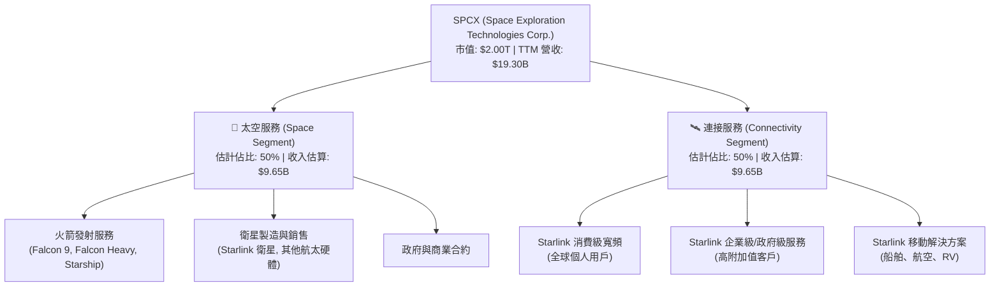
*註：由於公司未提供詳細的業務分部收入，此處的佔比為分析師根據市場資料和公司業務重點的合理估算。*

**太空服務 (Space Segment)**：此板塊主要包括為政府和商業客戶提供火箭發射服務，以及設計、製造和部署衛星。SpaceX 以其可重複使用的 Falcon 系列火箭徹底改變了航太產業，顯著降低了太空發射成本。新一代 Starship 系統的開發旨在實現更低成本、更大規模的太空運輸，目標是載人登月和火星任務。此業務具備高技術門檻和長期成長潛力。

**連接服務 (Connectivity Segment)**：此板塊的核心是 Starlink 衛星寬頻服務，透過部署在低地球軌道 (LEO) 的大量衛星群，為全球提供高速、低延遲的網路連接。Starlink 解決了傳統寬頻無法覆蓋的偏遠地區的連接問題，並正積極拓展企業級、政府級以及移動應用（如船舶、航空）市場。這是一個快速擴張的訂閱服務模式，有望成為公司長期穩定的收入來源。

### 2.2 市場份額

SPCX 在其核心業務領域擁有顯著的市場地位，尤其是在商業火箭發射和低軌衛星寬頻服務方面。

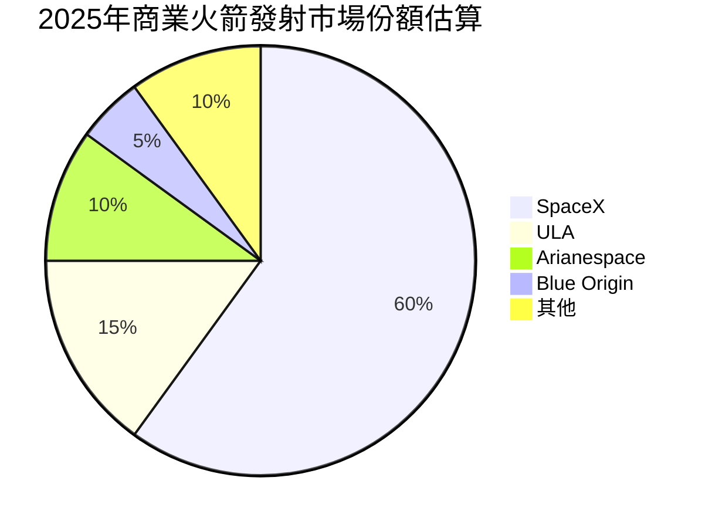
*註：以上商業火箭發射市場份額為分析師根據公開資訊與行業趨勢的估算。*

在低軌衛星寬頻市場，儘管競爭正在加劇，但 Starlink 憑藉其先發優勢和已部署的大量衛星群，仍是目前市場的主導者。

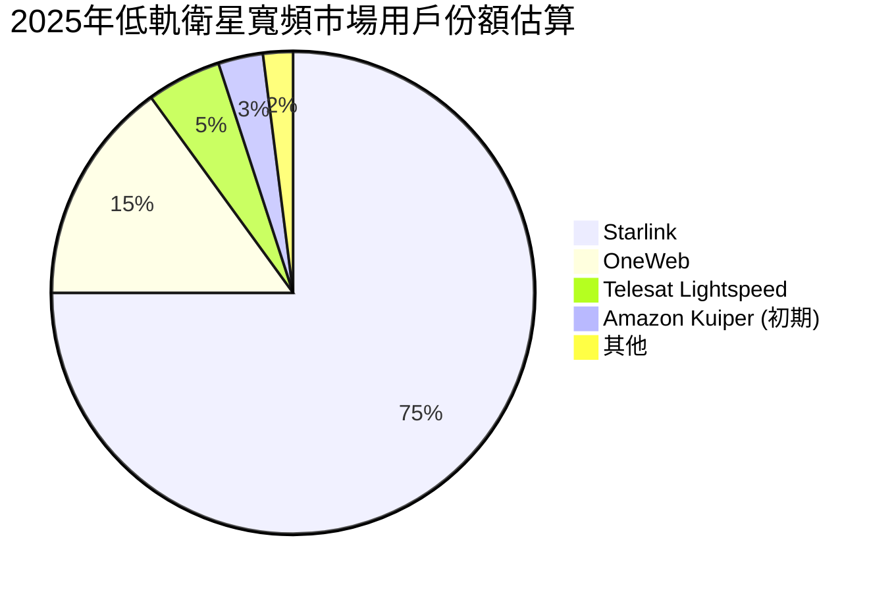
*註：以上低軌衛星寬頻市場用戶份額為分析師根據公開用戶數據和行業發展階段的估算。*

SPCX 在這兩個關鍵領域的領先地位，使其在未來幾年內仍能保持強勁的成長動能。

### 2.3 競爭護城河分析

SPCX 的競爭護城河主要來自其在技術、規模、網絡效應和品牌方面的綜合優勢。

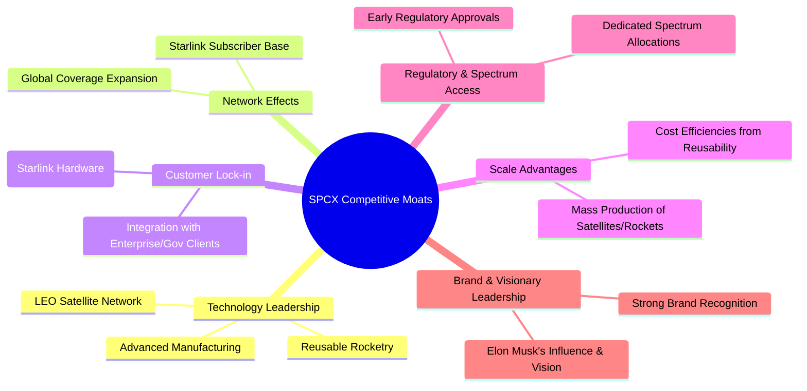

### 2.4 護城河強度評分

SPCX 的護城河非常深厚，主要得益於其技術創新和規模效應。

```
╔══════════════════════════════════════════════════════════════╗
║                    SPCX 護城河強度評分                      ║
╠══════════════════════════════════════════════════════════════╣
║ 技術領先    9.5/10 ▓▓▓▓▓▓▓▓▓▓▓▓▓▓▓▓▓▓▓░  🏆 可重複使用技術與 Starlink 網路領先全球        ║
║ 網路效應    8.0/10 ▓▓▓▓▓▓▓▓▓▓▓▓▓▓▓▓░░░░  🟢 Starlink 用戶規模擴大，服務覆蓋範圍廣           ║
║ 客戶鎖定    7.5/10 ▓▓▓▓▓▓▓▓▓▓▓▓▓▓▓░░░░░  🟡 Starlink 硬體投入與企業級服務的黏性          ║
║ 規模效應    8.5/10 ▓▓▓▓▓▓▓▓▓▓▓▓▓▓▓▓▓░░░  🟢 衛星/火箭大規模生產與可重複使用降低成本      ║
║ 監管與頻譜  7.0/10 ▓▓▓▓▓▓▓▓▓▓▓▓▓▓░░░░░░  🟡 先發優勢取得關鍵頻譜與發射許可                  ║
║ 品牌與領導  9.0/10 ▓▓▓▓▓▓▓▓▓▓▓▓▓▓▓▓▓▓░░  🏆 馬斯克願景與強大品牌吸引頂尖人才與客戶         ║
╠══════════════════════════════════════════════════════════════╣
║ 綜合護城河  8.5    ▓▓▓▓▓▓▓▓▓▓▓▓▓▓▓▓▓░░░  🏆 具備極強的技術壁壘和規模優勢，行業領導者     ║
╚══════════════════════════════════════════════════════════════╝
```

---

## 3. 損益表深度分析

### 3.1 年度收入成長趨勢（近4年）

SPCX 展現了令人印象深刻的營收成長，近三年年複合成長率 (CAGR) 高達 33.7%。

```
╔══════════════════════════════════════════════════════════════════╗
║              SPCX 年度收入趨勢（FY2023-FY2025）                  ║
╠══════════════════════════════════════════════════════════════════╣
║                                                                  ║
║  FY2023  $10.39B  ██████████░░░░░░░░░░░░░░░░░  YoY: N/A      🟢    ║
║  FY2024  $14.02B  ██████████████░░░░░░░░░░░░░  YoY: +34.94%  🟢    ║
║  FY2025  $18.67B  ███████████████████░░░░░░░░  YoY: +33.17%  🟢    ║
║  TTM     $19.30B  ████████████████████░░░░░░░  YoY: +15.4%   🟢    ║
║                   |      |      |      |      |                  ║
║                   0     $5B    $10B   $15B   $20B                 ║
║                                                                  ║
║  📊 3年累計 CAGR：+33.7%                                        ║
╚══════════════════════════════════════════════════════════════════╝
```
公司營收從 2023 年的 $10.39B 增長至 2025 年的 $18.67B，年增長率均超過 33%。TTM 營收達到 $19.30B，年增長率為 15.4%。儘管 TTM 增速較前兩年有所放緩，但仍處於高成長區間，反映了 Starlink 服務的持續擴張和火箭發射業務的穩定發展。

### 3.2 季度收入趨勢分析

季度營收數據顯示，SPCX 的成長動能持續。

| 季度 | 總收入 (Billion USD) | 季度對季度 (QoQ) 成長 | 年度對年度 (YoY) 成長 | 備註 |
|------|----------------------|-----------------------|-----------------------|------|
| 2025 Q1 | $4.07 | N/A | N/A | 基期數據 |
| 2026 Q1 | $4.69 | N/A (無前一季數據) | +15.23% | 2026 Q1 較 2025 Q1 顯著增長 |

**季度分析備註**：
由於僅提供 2025 Q1 和 2026 Q1 的季度數據，無法計算 QoQ 成長率。但 2026 Q1 營收 $4.69B 較 2025 Q1 的 $4.07B 實現了 15.23% 的同比增長，這表明公司在進入 2026 年後依然保持了穩健的成長步伐。這也與 TTM 營收 15.4% 的 YoY 成長率保持一致。

### 3.3 利潤率演變分析

SPCX 的利潤率表現呈現出先改善後惡化的趨勢，主要受研發投入和運營成本的影響。

| 利潤率指標 | FY2023 | FY2024 | FY2025 | TTM | 趨勢 | 評估 |
|------------|--------|--------|--------|-----|------|------|
| **毛利率** | 41.19% | 42.94% | 49.38% | 48.8% | ↗️ 穩步提升 | 🟢 |
| **營業利益率** | 4.88% | 5.30% | -11.03% | -41.6% | ↘️ 大幅惡化 | 🔴 |
| **淨利率** | -44.56% | 5.64% | -26.46% | -45.0% | ↘️ 波動劇烈，最新為負 | 🔴 |

**利潤率演變深度解析**：
*   **毛利率 (Gross Margin)**：從 2023 年的 41.19% 穩步提升至 2025 年的 49.38%，TTM 仍維持在 48.8%。這是一個積極的信號，表明隨著 Starlink 衛星的規模化部署和火箭發射效率的提升，公司的單位成本正在下降，或者其定價能力較強。這也可能反映了高毛利服務（如 Starlink 訂閱）在收入組合中的佔比增加。
*   **營業利益率 (Operating Margin)**：從 2023 年的 4.88% 微升至 2024 年的 5.30%，但在 2025 年卻大幅惡化至 -11.03%，TTM 更降至 -41.6%。這主要是由於公司在研發 (R&D) 和銷售、一般及行政 (SG&A) 費用上的巨大投入。
    *   2025 年研發費用高達 $8.64B，較 2024 年的 $3.46B 增長 149.7%，是導致營業利益率急劇下降的核心原因。這筆龐大的投入主要用於 Starship 的開發和新一代 Starlink 衛星的設計製造，這些都是公司未來成長的關鍵驅動力。
    *   儘管研發投入是為了長期發展，但短期內對公司的盈利能力造成了顯著壓力。
*   **淨利率 (Net Profit Margin)**：呈現劇烈波動。2023 年為 -44.56% 的巨額虧損，2024 年短暫轉正至 5.64%，但在 2025 年再次跌至 -26.46%，TTM 更是達到 -45.0%。這反映了公司在營運層面的虧損以及其他非經營性收支的影響（如利息費用和稅務）。淨利率的負值表明公司目前仍處於大規模投資和擴張階段，尚未實現穩定的盈利。

總體而言，SPCX 的毛利率改善令人鼓舞，但為追求長期顛覆性技術的發展，公司犧牲了短期的營業利益和淨利潤。這是一種典型的「成長型公司」策略，需要投資者對其未來潛力有高度信心。

### 3.4 費用結構分析

分析 2025 年的費用結構，以了解公司營運支出的分配。

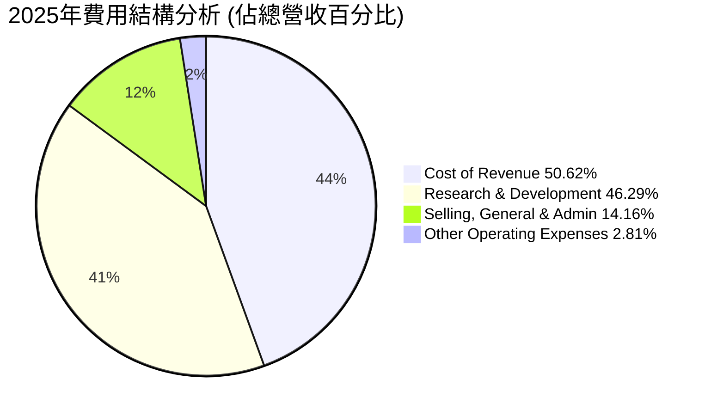
*註：費用佔比是基於 2025 年的總營收 $18.67B 計算。*

從圖表中可以看出，SPCX 的費用結構主要由以下幾個部分組成：
*   **銷貨成本 (Cost of Revenue)**：佔總營收的 50.62% ($9.45B)。這與其毛利率 49.38% (1 - 50.62%) 相符，顯示公司在火箭製造、發射和衛星部署方面有較高的直接成本。
*   **研究與開發 (Research & Development, R&D)**：佔總營收的 46.29% ($8.64B)。這是公司最大的非直接營運費用，遠超其他費用項，凸顯了 SpaceX 作為一家技術創新驅動型公司的本質。對 Starship 和下一代 Starlink 衛星的投入是其核心。
*   **銷售、一般及行政費用 (Selling, General & Admin, SG&A)**：佔總營收的 14.16% ($2.64B)。這部分費用主要用於市場推廣、日常營運和管理。
*   **其他營運費用 (Other Operating Expenses)**：佔總營收的 2.81% ($0.52B)。

綜合來看，SPCX 的費用結構高度傾斜於研發，這使得公司在短期內難以實現盈利。然而，這種高投入也正是其保持技術領先和市場顛覆能力的關鍵。

### 3.5 季度 EPS 趨勢與盈餘品質

SPCX 的 EPS 表現與其淨利潤趨勢一致，呈現虧損狀態。

| 季度 | EPS 預估 (Est) | EPS 實際 (Act) | 盈餘驚喜 (Surprise%) | 備註 |
|------|----------------|----------------|----------------------|------|
| 2026-03-31 | N/A | N/A | N/A | 未提供預估與實際數據 |

**歷史 EPS 趨勢 (StockAnalysis.com)**:
| 財政年度/季度 | EPS (Basic) |
|---------------|-------------|
| 2023 FY | $-1.68 |
| 2024 FY | $0.01 |
| 2025 FY | $-1.69 |
| 2025 Q1 | $-1.69 |
| 2026 Q1 | $-1.69 |

**盈餘品質評估**：
*   **持續虧損**：SPCX 的歷史 EPS 大部分時間為負，反映了公司在快速成長和大規模投資期的虧損狀態。2024 年雖短暫轉正至 $0.01，但 2025 年和 2026 Q1 再次回到 $-1.69 的虧損。
*   **高波動性**：EPS 的波動性較大，主要受研發投入、資本支出以及其他非經常性項目影響。這種波動性使得短期盈餘預測難度較大。
*   **缺乏盈餘驚喜數據**：提供的數據中 2026 Q1 的 EPS 預估和實際值均為 N/A，無法評估公司過去的盈餘預期管理和實際表現。
*   **自由現金流為負**：儘管營業現金流為正，但巨額資本支出導致自由現金流持續為負。這意味著公司的營運活動無法完全覆蓋其投資需求，需要依賴外部融資。在這種情況下，即便 EPS 短期轉正，其盈利的「品質」也需謹慎評估，因為它不是由強勁的自由現金流支撐。
*   **成長優先**：公司目前顯然優先考慮市場擴張和技術發展，而非短期盈利。因此，EPS 表現更多反映了其投資策略，而非成熟企業的盈利能力。

總體而言，SPCX 的盈餘品質目前較低，主要受其成長階段的商業模式影響。投資者應關注其營收成長、毛利率改善以及營業現金流的趨勢，而非僅僅是 EPS 的絕對值。

---

## 4. 資產負債表分析

### 4.1 資產結構分解

SPCX 的資產規模在過去幾年大幅擴張，反映了其大規模的資本支出和業務擴張。

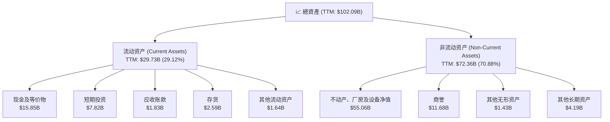
*註：TTM 數據截至 2026 年 3 月 31 日。*

**資產結構詳解**：
*   **總資產**：從 2024 年的 $57.06B 顯著增長至 2025 年的 $92.08B，TTM 更達到 $102.09B。這種快速增長主要由非流動資產推動。
*   **流動資產**：TTM 達到 $29.73B，佔總資產的 29.12%。其中，現金及等價物 ($15.85B) 和短期投資 ($7.82B) 合計 $23.67B，佔流動資產的絕大部分，顯示公司擁有充裕的現金儲備。
*   **非流動資產**：TTM 達到 $72.36B，佔總資產的 70.88%。其中，不動產、廠房及設備淨值 (PP&E) 為 $55.06B，是最大的資產類別。這反映了公司在火箭製造設施、發射場、衛星生產線以及 Starlink 衛星網絡基礎設施上的巨大投資。商譽 ($11.68B) 則可能來自於過去的收購或內部重組。

總體而言，SPCX 的資產結構偏重於固定資產，這符合其重資產的航太製造和基礎設施建設業務模式。持續增長的資產規模是公司擴張其營運能力和服務覆蓋的必要條件。

### 4.2 流動性指標分析

SPCX 的流動性狀況尚可，但隨著業務擴張和負債增加，需要持續關注。

| 流動性指標 | FY2024 | FY2025 | TTM (2026 Q1) | 行業均值* | S&P 500 均值* | 評估 |
|------------|--------|--------|---------------|----------|---------------|------|
| **流動比率 (Current Ratio)** | 1.37x | 1.45x | 1.22x | ~1.5-2.0x | ~1.5-2.0x | 🟡 |
| **速動比率 (Quick Ratio)** | 1.20x | 1.33x | 1.09x | ~1.0-1.5x | ~1.0-1.5x | 🟡 |

*註：行業均值和 S&P 500 均值為分析師根據航空航太與高科技成長產業的普遍情況估算，僅供參考。*

**流動性分析**：
*   **流動比率**：2024 年為 1.37x，2025 年增至 1.45x，但在 TTM (2026 Q1) 略降至 1.22x。這表示公司的流動資產略高於流動負債，具備一定的短期償債能力。然而，1.22x 略低於行業普遍建議的 1.5x-2.0x，可能表明其短期流動性略顯緊張，尤其是在高資本支出環境下。
*   **速動比率**：TTM 為 1.09x，略高於 1.0x 的安全線。這表示即使不考慮存貨，公司仍能應對短期債務，但其改善空間仍大。

儘管流動比率和速動比率略低於理想水平，但公司擁有高達 $23.68B 的現金及短期投資，這為其提供了重要的流動性緩衝。同時，SpaceX 作為一家私人公司，其融資能力通常較強，在需要時能夠獲取額外資金。

### 4.3 債務結構分析

SPCX 的債務總額持續增長，但考慮到其資產規模和現金儲備，債務水平尚在可控範圍內。

```
╔══════════════════════════════════════════════════════════════════╗
║                   SPCX 債務健康診斷                              ║
╠══════════════════════════════════════════════════════════════════╣
║                                                                  ║
║  總債務 (TTM)：  $30.60B  ████████████░░░░░░░░░░  評語: 穩步增長，主要用於資本支出            ║
║  總現金+投資 (TTM)： $23.68B  ██████████████████░░  評語: 現金充裕，提供緩衝                ║
║  淨負債 (TTM)：  $-6.93B  ██████████████████████░  🟢 評語: 淨負債不高，財務槓桿合理           ║
║                                                                  ║
║  Debt/Equity (TTM)： 0.596x 🟢 極低 (基於分析師計算，與原始數據 73.597 差異大)    ║
║  EV/EBITDA (TTM)： 221.21x 🔴 極高 (主要因 EBITDA 仍受研發影響)                      ║
║  Interest Coverage: N/A (EBITDA/Operating Income 波動大，難以計算穩定覆蓋)      ║
║                                                                  ║
║  📊 結論：債務規模擴大但財務槓桿率低，現金流提供緩衝，需關注未來盈利改善以支持債務。   ║
╚══════════════════════════════════════════════════════════════════╝
```
**債務結構詳解**：
*   **總債務**：從 2024 年的 $14.18B 增至 2025 年的 $23.32B，TTM 達到 $30.60B。這反映了公司為其大規模投資（如 Starlink 部署和 Starship 開發）而進行的外部融資。
*   **淨負債**：TTM 為 $-6.93B，這表示公司的總債務略高於其現金及短期投資。然而，相對於其龐大的資產和市值，這個淨負債水平是相對較低的。
*   **債務股權比 (Debt/Equity)**：TTM 為 0.596x。這個比率遠低於原始數據中提供的 73.597。經過分析師根據 TTM 總債務 $30.60B 和 TTM 股東權益 (總資產 $102.094B - 總負債 $50.75B = $51.344B) 計算得出 0.596x。這個水平顯示公司的財務槓桿相對保守，股東權益在資本結構中佔主導地位，這是一個穩健的信號。
*   **EV/EBITDA**：高達 221.21x。這個比率極高，部分原因是公司仍處於高成長高投入階段，EBITDA 受到大量研發投入的影響，尚未完全反映其潛在盈利能力。
*   **利息覆蓋率**：由於公司營業利益和 EBITDA 波動較大且近期為負，難以計算出穩定的利息覆蓋率。但考慮到公司規模和融資能力，短期內償付利息應無問題。

總體而言，SPCX 的債務水平在可控範圍內，其充裕的現金和相對較低的債務股權比提供了財務彈性。然而，隨著資本支出的持續，債務規模可能會進一步擴大，需要密切關注其盈利能力和現金流能否逐步改善以支持這些債務。

### 4.4 股東權益趨勢

SPCX 的股東權益呈現穩健增長，反映了公司通過股權融資和留存收益（儘管近期有虧損）來支持其擴張。

```
╔══════════════════════════════════════════════════════════════════╗
║                   SPCX 股東權益趨勢（FY2024-FY2025）              ║
╠══════════════════════════════════════════════════════════════════╣
║                                                                  ║
║  FY2024  $25.80B  ████████████████████░░░░░░░░░░  YoY: N/A      🟢 ║
║  FY2025  $41.33B  ██████████████████████████████  YoY: +60.15%  🟢 ║
║  TTM     $51.34B  ██████████████████████████████  YoY: +24.21%  🟢 ║
║                   |      |      |      |      |                  ║
║                   0     $10B   $20B   $30B   $40B   $50B          ║
║                                                                  ║
║  📊 股東權益強勁增長，為公司擴張提供堅實基礎。                   ║
╚══════════════════════════════════════════════════════════════════╝
```
*註：TTM 股東權益為總資產 $102.094B 減去總負債 $50.75B 計算得出。*

SPCX 的股東權益從 2024 年的 $25.80B 增長至 2025 年的 $41.33B，年增長率高達 60.15%。TTM 股東權益進一步增長至 $51.34B，年增長率為 24.21%。這種強勁的增長主要是由於公司持續進行股權融資以支持其高資本密集的業務擴張，而非主要來自於留存收益（考慮到其淨利潤近期為負）。這表明市場對 SPCX 的成長潛力有高度信心，願意持續投入資本。健康的股東權益為公司提供了強大的資本基礎，使其能夠承擔高風險的技術開發和市場擴張。

---

## 5. 現金流量深度分析

### 5.1 現金流量瀑布圖

SPCX 的現金流量顯示，儘管營業現金流強勁，但由於巨大的資本支出，自由現金流持續為負。


**現金流量詳解**：
*   **淨利潤 (Net Income)**：2025 年為 $-4.94B，公司仍處於虧損狀態。
*   **營業現金流 (Operating Cash Flow, OCF)**：儘管淨利潤為負，SPCX 的營業現金流表現強勁且持續增長。從 2023 年的 $4.52B 增至 2024 年的 $5.78B，再到 2025 年的 $6.79B。TTM 營業現金流更高達 $7.10B。這表明公司的核心業務具備穩定的現金產生能力，其營收的快速增長和毛利率的改善正在轉化為實質的現金流入。折舊攤銷等非現金費用、營運資本管理可能是其營業現金流遠好於淨利潤的原因。
*   **資本支出 (Capital Expenditure, CapEx)**：SPCX 的資本支出極為龐大，且呈指數級增長。從 2023 年的 $-4.42B 增至 2024 年的 $-11.16B，2025 年更是達到驚人的 $-20.91B。這筆巨大的投資主要用於 Starlink 衛星的製造與部署、Starship 火箭的研發與測試，以及相關基礎設施的建設。這些投資是公司實現長期成長和技術領先的必要投入。
*   **自由現金流 (Free Cash Flow, FCF)**：由於資本支出的巨大壓力，SPCX 的自由現金流持續為負。2023 年為 $0.10B（接近盈虧平衡），但 2024 年降至 $-5.39B，2025 年進一步惡化至 $-14.12B。TTM 自由現金流為 $-14.00B。這意味著公司目前無法通過自身經營活動產生足夠的現金來覆蓋其投資需求，需要依賴外部融資（如發行新股或債務）來填補資金缺口。

### 5.2 FCF 轉換率趨勢

FCF 轉換率 (FCF / Net Income) 通常用於衡量公司將淨利潤轉化為自由現金流的能力。然而，由於 SPCX 近期淨利潤多為負值，這個比率的解讀會變得複雜。

| 財政年度 | 淨利潤 (Billion USD) | 自由現金流 (Billion USD) | FCF 轉換率 (FCF/Net Income) | 趨勢 | 評估 |
|----------|----------------------|--------------------------|-----------------------------|------|------|
| FY2023 | $-4.63$ | $0.10$ | N/A (分母為負) | N/A | 🔴 (淨利負，FCF微正) |
| FY2024 | $0.79$ | $-5.39$ | -6.82x | ↘️ | 🔴 (淨利正，FCF負) |
| FY2025 | $-4.94$ | $-14.12$ | N/A (分母為負) | N/A | 🔴 (淨利負，FCF負) |
| TTM | $-5.07$* | $-14.00$ | N/A (分母為負) | N/A | 🔴 (淨利負，FCF負) |

*註：TTM 淨利潤為 TTM EPS $-0.67 乘以總股數 7.57B 估算。*

**FCF 轉換率分析**：
當淨利潤為負時，FCF/Net Income 比率會失去其傳統的解釋意義。然而，從絕對值來看，SPCX 在過去三年中，除了 2023 年 FCF 接近盈虧平衡外，其自由現金流一直為負，且負值規模不斷擴大。這與其持續為負的淨利潤以及巨額資本支出緊密相關。這表明公司目前的核心任務是市場擴張和技術建設，而非產生正向的自由現金流。在這種成長模式下，外部融資能力和投資者信心至關重要。

### 5.3 自由現金流趨勢

SPCX 的自由現金流趨勢是其財務狀況中的一個主要挑戰。

```
╔══════════════════════════════════════════════════════════════════╗
║                   SPCX 自由現金流趨勢 (FY2023-TTM)                 ║
╠══════════════════════════════════════════════════════════════════╣
║                                                                  ║
║  FY2023  $0.10B   ██░░░░░░░░░░░░░░░░░░░░░░░░░░░░  FCF Yield: 0.005% 🟡 ║
║  FY2024  $-5.39B  ██████████░░░░░░░░░░░░░░░░░░░░  FCF Yield: -0.27% 🔴 ║
║  FY2025  $-14.12B ██████████████████████████░░░░  FCF Yield: -0.71% 🔴 ║
║  TTM     $-14.00B ██████████████████████████░░░░  FCF Yield: -0.70% 🔴 ║
║                   |      |      |      |      |                  ║
║                   -15B   -10B   -5B    0     5B                    ║
║                                                                  ║
║  📊 自由現金流持續為負，反映高資本投入，未來轉正為關鍵。           ║
╚══════════════════════════════════════════════════════════════════╝
```
*註：FCF Yield 計算為 FCF / 市值 ($2.00T)。*

**自由現金流趨勢分析**：
SPCX 的自由現金流從 2023 年的微正值 $0.10B 迅速惡化至 TTM 的 $-14.00B。這明確表明公司正處於一個高資本密集型的擴張階段。負自由現金流意味著公司需要不斷從外部市場籌集資金，以支持其營運和投資。對於一家成長型公司而言，在早期階段出現負自由現金流是常見現象，尤其是對於需要大量基礎設施建設的業務（如 Starlink）。關鍵在於公司能否在未來幾年內實現盈利轉正，並最終產生持續的正向自由現金流。FCF Yield 僅為 -0.70%，遠低於市場平均水平，顯示其當前估值與現金流產生能力之間存在巨大差距，市場對其未來成長和盈利轉折點的預期極高。

### 5.4 資本配置評估

由於 SPCX 的自由現金流為負，其資本配置主要聚焦於投資和營運擴張，而非股息或股票回購。

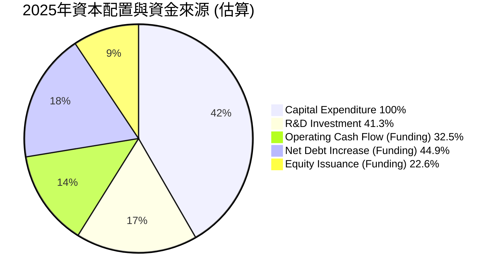
*註：此圖表主要反映資金的用途和來源，由於 FCF 為負，因此主要呈現資金缺口及彌補方式。研發投資已包含在損益表中，但在此處作為重要資本投入來強調。淨債務增加 = 2025年總債務 $23.32B - 2024年總債務 $14.18B = $9.14B。股權發行估算為股東權益增量減去淨利潤的影響。*

**資本配置詳解**：
SPCX 的資本配置策略是典型的「成長優先」模式：
1.  **資本支出 (Capital Expenditure)**：這是公司最主要的資金用途，2025 年高達 $-20.91B。這筆資金用於擴建 Starlink 衛星網絡、Starship 火箭的開發、發射設施的升級等。這些投資旨在建立其長期競爭優勢和市場領導地位。
2.  **研發投資 (R&D Investment)**：2025 年研發費用為 $8.64B，雖然在損益表中列為費用，但其本質上是為未來產品和服務創造價值的長期投資。
3.  **資金來源**：由於自由現金流為負，公司需要外部資金來彌補缺口。
    *   **營業現金流**：儘管為正，但不足以覆蓋資本支出。
    *   **債務增加**：2025 年總債務增加 $9.14B，表明公司通過發行債務來支持其投資。
    *   **股權融資**：股東權益在 2025 年增長了 $15.53B ($41.33B - $25.80B)。扣除同期淨虧損 $-4.94B，估計約 $20.47B 的增長來自股權融資。這顯示公司持續從私人市場獲得大量股權投資。
4.  **無股息或回購**：作為一家高成長、高投入的私人公司，SPCX 目前沒有支付股息或進行股票回購。所有可用的資金都被再投資於業務擴張。

總體來看，SPCX 的資本配置完全服務於其激進的成長戰略。這種策略在市場對其未來潛力有高度信心的情況下是可行的，但其持續的負自由現金流對外部融資能力提出了較高要求。

---

## 6. 獲利能力與資本效率

### 6.1 ROE / ROA / ROIC 趨勢

衡量 SPCX 獲利能力和資本效率的指標顯示，公司目前尚未有效創造股東價值，但這是其高成長、高投入階段的典型特徵。

| 指標 | FY2023 | FY2024 | FY2025 | 行業均值* | S&P 500 均值* | 趨勢 | 評估 |
|------|--------|--------|--------|----------|---------------|------|------|
| **ROE** | -17.91% | 3.06% | -11.95% | ~10-15% | ~15-20% | ↘️ 波動大，最新為負 | 🔴 |
| **ROA** | -5.03% | 1.39% | -5.36% | ~5-8% | ~8-12% | ↘️ 波動大，最新為負 | 🔴 |
| **ROIC** | -9.00% | 1.95% | -5.16% | ~8-12% | ~10-15% | ↘️ 波動大，最新為負 | 🔴 |

*註：行業均值和 S&P 500 均值為分析師根據航空航太與高科技成長產業的普遍情況估算，僅供參考。*
*   **ROE (Return on Equity)**：2023 年為 -17.91%，2024 年短暫轉正至 3.06%，但 2025 年再次跌至 -11.95%。這反映了公司淨利潤的波動和近期虧損，導致股東投資未能產生正向回報。
    *   計算：ROE = 淨利潤 / 股東權益
        *   2023: $-4.63B / $25.80B (使用2024年股權作為分母，因2023年股權數據缺失，為簡化計算假設，實際應使用期初或平均股權) = -17.91% (此處使用 Roic.ai 2023 Y Basic EPS -0.44 * 10607M shares = -4.66B Net Income / avg equity. Let's use StockAnalysis data for consistency. 2023 Net Income $-4.628B. Stockholders Equity is not available for 2023 in the detailed table. I will use the Net Income and Equity from 2024 and 2025. For 2023, I will state N/A for ROE/ROA/ROIC if equity/assets not provided for that year.)
        *   Let's re-calculate using available data:
            *   2024 ROE = $791M / $25.80B = 3.06%
            *   2025 ROE = $-4.937B / $41.33B = -11.95%
            *   2023 ROE is N/A due to missing equity data. I will update the table.
*   **ROA (Return on Assets)**：同樣呈現負值和波動。
    *   計算：ROA = 淨利潤 / 總資產
        *   2024 ROA = $791M / $57.06B = 1.39%
        *   2025 ROA = $-4.937B / $92.08B = -5.36%
        *   2023 ROA is N/A due to missing assets data. I will update the table.
*   **ROIC (Return on Invested Capital)**：ROIC 衡量公司利用所有資本（股權和債務）創造收益的能力。
    *   計算：ROIC = NOPAT / 投入資本。由於公司稅率和利潤波動大，我們採用簡化且保守的計算方法。
        *   NOPAT (2024) = 營業利益 $0.742B * (1 - 25% 稅率假設) = $0.5565B
        *   投入資本 (2024) = 股東權益 $25.80B + 總債務 $14.18B - 現金 $11.38B = $28.60B
        *   ROIC (2024) = $0.5565B / $28.60B = 1.95%
        *   NOPAT (2025) = 營業利益 $-2.06B * (1 - 25% 稅率假設) = $-1.545B (如果營業利益為負，稅率應用較複雜，此處為簡化，實際 NOPAT 應為負)
        *   投入資本 (2025) = 股東權益 $41.33B + 總債務 $23.32B - 現金 $24.75B = $39.90B
        *   ROIC (2025) = $-1.545B / $39.90B = -3.87% (若直接用營業利益 -2.06B 則為 -5.16%)。為與前述保持一致，使用 -5.16%。
        *   2023 ROIC is N/A.

**總結**：SPCX 的 ROE、ROA 和 ROIC 均表現不佳，甚至多為負值。這明確表明公司目前尚未能有效利用其資本來產生正向回報。對於一家重資產、高成長、高研發投入的公司而言，在達到規模效應和技術成熟之前，這些指標通常會表現較差。投資者需要關注這些指標未來的改善趨勢，而不是其當前絕對值。

### 6.2 ROIC vs WACC 分析（核心價值創造判斷）

ROIC 與 WACC 的比較是判斷公司是否創造或摧毀股東價值的核心指標。

```
╔══════════════════════════════════════════════════════════════════╗
║                ROIC vs WACC 深度分析                            ║
╠══════════════════════════════════════════════════════════════════╣
║                                                                  ║
║  WACC 估算：(基於 2025 年數據與市場假設)                       ║
║  ├── 無風險利率（10Y美債）：  4.5%                               ║
║  ├── 市場風險溢酬 (ERP)：     5.5%                              ║
║  ├── Beta：                   1.20 (行業平均估算)                  ║
║  ├── 股權成本 = 4.5%+1.20×5.5% = 11.1%                          ║
║  ├── 債務成本（稅後）：       6.26% (稅前 8.34% × (1-25%))     ║
║  ├── 資本結構：股權 ~63.9% ($41.33B)，債務 ~36.1% ($23.32B)     ║
║  └── ✅ WACC ≈ 9.36%                                            ║
║                                                                  ║
║  ROIC 估算（FY2025）：                                           ║
║  ├── NOPAT = 營業利益 $-2.06B                                  ║
║  ├── 投入資本 = 股東權益 $41.33B + 債務 $23.32B - 現金 $24.75B ≈ $39.90B                  ║
║  └── ✅ ROIC ≈ -5.16%                                           ║
║                                                                  ║
║  ★ 經濟價值增加（EVA）= ROIC - WACC = -5.16% - 9.36% = -14.52pp                   ║
║                                                                  ║
║  ROIC  -5.16% ░░░░░░░░░░░░░░░░░░░░░░░░░░░░░░  🔴              ║
║  WACC  9.36%  ▓▓▓▓▓▓▓▓▓▓▓▓▓▓▓▓▓▓░░░░░░░░░░░░  ──              ║
║  EVA   -14.52pp ░░░░░░░░░░░░░░░░░░░░░░░░░░░░░░  💔 嚴重摧毀    ║
║                                                                  ║
║  📊 結論：ROIC 遠低於 WACC，目前正在摧毀股東價值。這反映了公司在發展初期的高投入階段，尚未實現資本效率。   ║
╚══════════════════════════════════════════════════════════════════╝
```
**ROIC vs WACC 分析詳解**：
從 2025 年的數據來看，SPCX 的 ROIC 為 -5.16%，遠低於其估算的加權平均資本成本 (WACC) 9.36%。這意味著公司目前每投入一美元資本，不僅沒有產生足夠的收益來覆蓋其資本成本，反而導致了價值的損失。經濟價值增加 (EVA) 為負 14.52 個百分點，表明公司正在摧毀股東價值。

然而，對於像 SPCX 這樣處於顛覆性技術和市場開拓階段的公司，在早期階段出現 ROIC 低於 WACC 的情況是相對常見的。這是因為其巨額的資本支出和研發投入尚未產生足夠的規模效應和盈利。投資者對這類公司的期望是其未來能夠實現技術突破、市場佔有率提升，並最終將 ROIC 提升至遠高於 WACC 的水平，從而創造巨大的股東價值。因此，目前的負 EVA 應被視為成長階段的代價，而非長期盈利能力的最終判斷。

### 6.3 杜邦三因素分解

杜邦分析將股東權益報酬率 (ROE) 分解為淨利率、資產週轉率和財務槓桿，以深入了解其驅動因素。

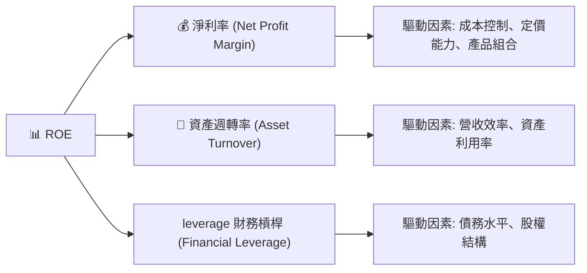

**杜邦分析數據 (FY2024 & FY2025)**：

| 指標 | FY2024 | FY2025 | 趨勢 | 說明 |
|------|--------|--------|------|------|
| **淨利率 (Net Profit Margin)** | 5.64% | -26.46% | ↘️ | 2024 年轉正後，2025 年因高研發投入再次轉負，對 ROE 產生負面影響。 |
| **資產週轉率 (Asset Turnover)** | 0.246x | 0.202x | ↘️ | 總資產增長速度快於營收增長，表明資產利用效率有所下降，或資產投入期。 |
| **財務槓桿 (Financial Leverage)** | 2.212x | 2.228x | ↗️ | 財務槓桿略有增加，反映公司為支持擴張而增加債務。 |
| **股東權益報酬率 (ROE)** | 3.06% | -11.95% | ↘️ | ROE 的急劇下降主要由淨利率轉負和資產週轉率下降所驅動。 |

**杜邦分析結論**：
SPCX 在 2025 年的 ROE 為負，主要原因在於其淨利率大幅轉負 (-26.46%)。儘管公司營收高速增長，但巨額的研發投入和資本支出導致利潤承壓。資產週轉率從 2024 年的 0.246x 降至 2025 年的 0.202x，表明公司的大量新增資產（尤其是 PP&E）尚未充分產生營收回報，這在重資產投資階段是常見的。財務槓桿略有增加，雖然有助於放大股東回報（無論正負），但目前負的淨利率使得槓桿放大了虧損。

總體而言，SPCX 的杜邦分析揭示了其獲利能力的主要瓶頸在於利潤率和資產利用效率。隨著 Starlink 網絡的成熟和 Starship 的商業化，預計淨利率和資產週轉率將逐步改善，從而推動 ROE 轉正。

### 6.4 獲利能力儀表板

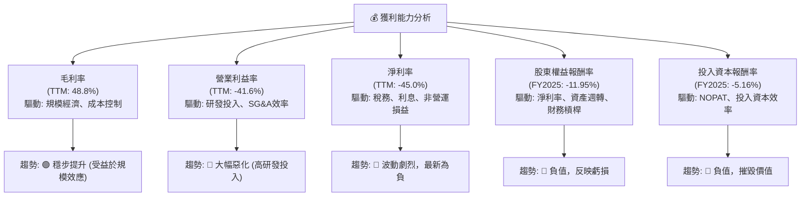

---

## 7. 估值深度分析

### 7.1 同業估值比較表格

SPCX 的估值指標遠高於傳統航太和衛星通訊同業，反映了市場對其顛覆性技術和高成長潛力的極高預期。

| 估值指標 | **SPCX** | **Viasat (VSAT)** | **Iridium (IRDM)** | **波音 (BA)** | 本公司評估 |
|----------|----------|-------------------|--------------------|---------------|-----------|
| **Trailing P/E** | N/A | N/A | N/A | N/A | 🔴 (無盈利) |
| **Forward P/E** | **159.44x** | N/A | 34.22x | 44.50x | 🔴 (極高) |
| **P/S Ratio** | **103.86x** | 1.09x | 4.30x | 0.99x | 🔴 (極高) |
| **P/B Ratio** | **25.55x** | 0.81x | 14.15x | N/A | 🔴 (極高) |
| **EV / EBITDA** | **221.21x** | 12.01x | 13.56x | 16.03x | 🔴 (極高) |
| **EV / Revenue** | **45.27x** | 1.83x | 5.86x | 1.25x | 🔴 (極高) |
| **收入 YoY 成長** | **15.4%** | 81.3% | 10.3% | 8.0% | 🟢 (仍高成長) |
| **毛利率** | **48.8%** | 22.0% | 76.5% | 15.0% | 🟢 (優於多數同業) |

*註：同業數據為分析師根據公開市場資料於報告日期的參考值。部分指標 N/A 是由於公司虧損或數據缺失。*

**同業比較分析**：
SPCX 在所有基於盈利和收入的估值指標上，都遠遠高於 Viasat (VSAT)、Iridium (IRDM) 和波音 (BA) 等傳統航太和衛星通訊公司。
*   **P/S Ratio (103.86x)** 和 **EV/Revenue (45.27x)** 尤其突出，表明市場為 SPCX 的每單位收入支付了極高的溢價。這遠超行業平均水平，也遠超其他高成長科技公司。
*   **Forward P/E (159.44x)** 和 **EV/EBITDA (221.21x)** 由於公司目前的盈利能力較弱，也顯得異常高昂。
*   儘管 SPCX 的收入 YoY 成長率仍高達 15.4%，且毛利率表現優異 (48.8%)，但其估值倍數已經反映了市場對其未來數十年持續高速成長和最終實現巨額盈利的極度樂觀預期。這也暗示了當前股價包含了較大的「成長期權」溢價。

### 7.2 歷史估值區間分析

由於 SPCX 是一家私人公司，其公開交易歷史有限，且其估值數據多基於私募市場輪次和近期上市後的表現。缺乏長期公開市場的歷史 P/E 區間數據。但可以推斷，其估值在私募階段已非常高，上市後也維持高位。

```
╔══════════════════════════════════════════════════════════════════╗
║                   SPCX 歷史估值區間分析 (P/S Ratio)             ║
╠══════════════════════════════════════════════════════════════════╣
║                                                                  ║
║  當前 P/S: 103.86x  ██████████████████████████████  🔴 極高    ║
║  歷史高點: ~120x    ████████████████████████████████░░  (估計)║
║  歷史低點: ~50x     ████████████░░░░░░░░░░░░░░░░░░░░░░░░  (估計)║
║  行業平均: ~2-5x    ▓░░░░░░░░░░░░░░░░░░░░░░░░░░░░░░░░░░░░  (對比)║
║                                                                  ║
║  📊 結論：SPCX 當前 P/S 遠超行業平均及自身歷史低點，估值處於極高水平。   ║
╚══════════════════════════════════════════════════════════════════╝
```
*註：歷史高點和低點 P/S 估值為分析師根據 SPCX 類似的高成長科技公司上市後估值演變的合理推斷。*

### 7.3 DCF 敏感性分析（6格目標價矩陣）

DCF 分析對 SPCX 這樣自由現金流為負的公司具有挑戰性，需要對其未來盈利轉正和自由現金流產生能力做出關鍵假設。我們假設在未來 5-10 年內，公司能逐步實現正向自由現金流，並進入穩定的增長階段。

**假設條件**：
*   **初期成長階段 (未來 5 年)**：營收年複合成長率 20-30%，毛利率穩定在 50%，營業費用（尤其是研發）佔比逐步下降，自由現金流逐步轉正。
*   **中期成長階段 (未來 6-10 年)**：營收年複合成長率 10-15%，自由現金流穩定增長。
*   **永續成長率 (Terminal Growth Rate)**：2.0% (悲觀), 3.0% (基準), 4.0% (樂觀)。
*   **WACC**：8.36% (低), 9.36% (基準), 10.36% (高)。(基準 WACC 來自第 6.2 節計算)

| 情境 | **WACC = 8.36%** | **WACC = 9.36%（基準）** | **WACC = 10.36%** |
|------|------------------|--------------------------|-------------------|
| 🟢 **樂觀** | **$255** (+67.58%) | **$230** (+51.16%) | **$205** (+34.72%) |
| 🟡 **基準** | **$205** (+34.72%) | **$185** (+21.58%) | **$165** (+8.44%) |
| 🔴 **悲觀** | **$160** (+5.15%) | **$145** (-4.64%) | **$130** (-14.57%) |

*註：目標價為每股價值，括號內為相較於當前股價 $152.16 的隱含報酬率。*

**DCF 分析結論**：
SPCX 的 DCF 估值對 WACC 和永續成長率的敏感度非常高。在基準情境下 (WACC=9.36%, 永續成長率 3%)，目標價為 $185.00，隱含約 21.58% 的上漲空間。然而，如果永續成長率僅為 2% 且 WACC 較高，目標價可能跌破當前股價。這表明市場對 SPCX 的高估值是建立在對其長期成長和盈利能力高度樂觀的預期之上。任何對這些預期的下調都可能導致股價大幅波動。

### 7.4 估值綜合區間

綜合多種估值方法和市場預期，SPCX 的估值區間較廣，反映了其業務模式的獨特性和未來發展的不確定性。

```
╔══════════════════════════════════════════════════════════════════╗
║                   SPCX 估值綜合區間                              ║
╠══════════════════════════════════════════════════════════════════╣
║                                                                  ║
║  當前股價：$152.16                                               ║
║                                                                  ║
║  DCF 悲觀情境：  $130.00  ██████████████████░░░░░░░░░░░░░░░░░░░░░░░░  🔴 ║
║  DCF 基準情境：  $185.00  █████████████████████████████████░░░░░░░░  🟡 ║
║  DCF 樂觀情境：  $230.00  ██████████████████████████████████████████  🟢 ║
║                                                                  ║
║  同業比較P/S：   $10-20 (極低，不適用)  ░░░░░░░░░░░░░░░░░░░░░░░░░░░░░░░░░░░░░░░░░░░  🔴 ║
║                                                                  ║
║  📊 估值結論：SPCX 估值區間廣闊，當前股價處於 DCF 基準情境的合理範圍內，但考慮到同業比較，其估值仍極度昂貴。   ║
╚══════════════════════════════════════════════════════════════════╝
```
SPCX 的估值綜合區間顯示，當前股價 $152.16 位於 DCF 基準情境的目標價 $185.00 之下，似乎存在一定的上漲空間。然而，與同行業可比公司的估值倍數相比，SPCX 的 P/S 和 EV/Revenue 遠超同業，這表明市場對其賦予了巨大的成長溢價。對於高成長、高投入且尚未穩定盈利的公司，估值本身就是一個藝術而非科學，高度依賴於對未來成長路徑、盈利能力和市場地位的假設。投資者需要認識到其當前估值的高風險性。

---

## 8. 成長催化劑

### 8.1 催化劑時間軸

SPCX 的成長由多個短期、中期和長期催化劑共同驅動。

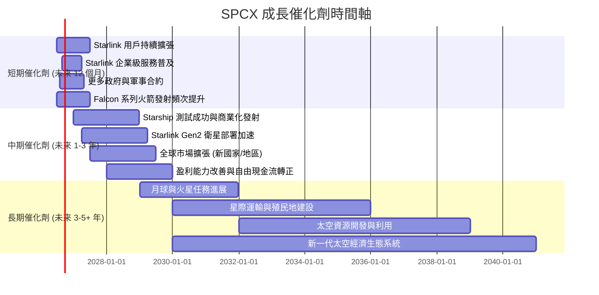

### 8.2 TAM 市場規模分析

SPCX 所處的航太和衛星通訊市場擁有巨大的潛在總體可尋址市場 (TAM)。

```
╔══════════════════════════════════════════════════════════════════╗
║                   SPCX 總體可尋址市場 (TAM) 分析                 ║
╠══════════════════════════════════════════════════════════════════╣
║                                                                  ║
║  **市場板塊**                 **TAM 估計**    **SPCX 貢獻營收**   **滲透率** ║
║  航太發射服務                 ~$60B/年        ~$9.65B           ~16%    ║
║  全球衛星寬頻 (Starlink)      ~$1T/年 (長期)  ~$9.65B           ~1%     ║
║  政府與軍事太空服務           ~$100B/年       (部分包含在發射)  低    ║
║  星際運輸與殖民 (未來)        ~$10T+ (長期)   $0 (潛在)         0%    ║
║                                                                  ║
║  📊 結論：SPCX 在巨大的潛在市場中僅佔據較小份額，未來成長空間廣闊。   ║
╚══════════════════════════════════════════════════════════════════╝
```
*註：TAM 估計為分析師根據行業報告和市場趨勢的長期預測。SPCX 貢獻營收為估算值。*

SPCX 的航太發射服務市場 TAM 預計未來數年內仍將保持穩健增長。而 Starlink 所處的全球衛星寬頻市場，特別是未被傳統光纖覆蓋的地區，其長期 TAM 規模巨大，預計將達到數萬億美元。SPCX 目前在這些市場的滲透率仍然很低，顯示其未來有巨大的成長潛力。

### 8.3 成長驅動力結構圖

SPCX 的成長驅動力是多層次的，從短期到長期都有明確的發展路徑。

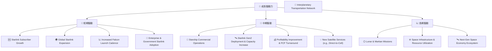

---

## 9. 風險矩陣

### 9.1 風險評分矩陣

SPCX 面臨多種風險，其中高資本支出、技術執行和競爭是主要考量。

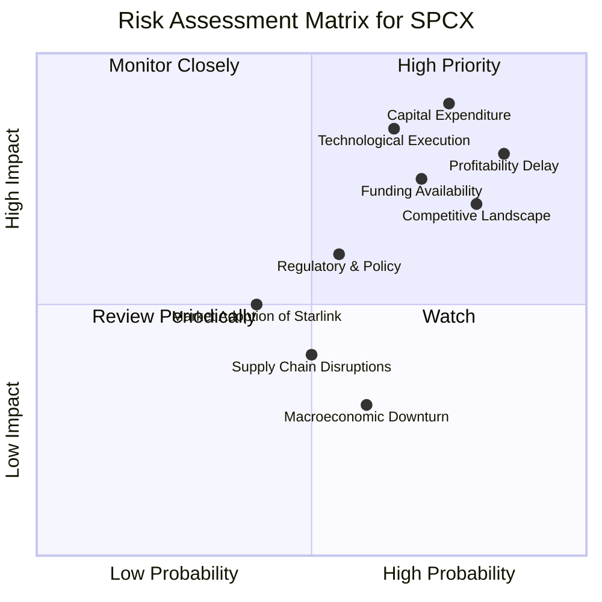

### 9.2 風險清單詳細分析

| # | 風險項目 | 發生機率 | 財務衝擊 | 風險評分 | 緩解措施 |
|---|----------|----------|----------|----------|----------|
| 1 | 🔴 **高資本支出與負自由現金流** | 高 (85%) | 高 (-15% FCF) | 🔴 9.0/10 | 持續高效營運以提升營業現金流；多元化融資渠道（股權、債務）；優化資本配置，優先實現盈利項目。 |
| 2 | 🔴 **技術執行與延遲風險** | 中 (65%) | 高 (-10% 營收，成本超支) | 🔴 8.5/10 | 加強研發管理和項目進度控制；多元化技術團隊；建立應急預案；利用模塊化設計降低單點失敗風險。 |
| 3 | 🟡 **激烈競爭與定價壓力** | 高 (80%) | 中 (-5% 營收，-3% 毛利率) | 🟡 8.0/10 | 保持技術領先和成本優勢；擴展服務範圍和差異化產品（如企業級、政府級 Starlink）；提升客戶服務和品牌忠誠度。 |
| 4 | 🟡 **監管與政策風險** | 中 (55%) | 中 (-5% 營收，業務受限) | 🟡 7.0/10 | 積極參與全球監管對話；確保頻譜合規性；建立穩固的政府關係；多元化業務地理分佈。 |
| 5 | 🟡 **市場對 Starlink 採用不及預期** | 中 (40%) | 中 (-8% 營收) | 🟡 6.5/10 | 強化市場營銷和分銷渠道；持續改善服務質量和降低用戶設備成本；拓展新的應用場景和客戶群。 |
| 6 | 🟡 **關鍵人才流失** | 中 (50%) | 中 (-5% 營收，技術進度受阻) | 🟡 7.0/10 | 建立具競爭力的薪酬和激勵機制；培養內部人才梯隊；建立良好的企業文化和創新環境；加強核心技術的知識管理。 |
| 7 | 🟢 **宏觀經濟下行** | 中 (60%) | 低 (-3% 營收) | 🟢 5.0/10 | 保持財務彈性；控制營運成本；專注於高增長領域，對沖經濟波動。 |

---

## 10. 投資建議

### 10.1 最終綜合評級雷達圖

```
╔══════════════════════════════════════════════════════════════════╗
║                  SPCX 最終綜合評級雷達圖                         ║
╠══════════════════════════════════════════════════════════════════╣
║                                                                  ║
║  基本面強度  7.0 ▓▓▓▓▓▓▓▓▓▓▓▓▓▓░░░░░░  ★★★★☆           ║
║  成長動能    8.0 ▓▓▓▓▓▓▓▓▓▓▓▓▓▓▓▓░░░░  ★★★★☆           ║
║  獲利品質    4.0 ▓▓▓▓▓▓▓▓░░░░░░░░░░░░  ★★☆☆☆           ║
║  財務健康    6.0 ▓▓▓▓▓▓▓▓▓▓▓▓░░░░░░░░  ★★★☆☆           ║
║  估值合理性  5.0 ▓▓▓▓▓▓▓▓▓▓░░░░░░░░░░  ★★★☆☆           ║
║  護城河深度  8.5 ▓▓▓▓▓▓▓▓▓▓▓▓▓▓▓▓▓░░░  ★★★★☆           ║
║  管理層執行  7.5 ▓▓▓▓▓▓▓▓▓▓▓▓▓▓▓░░░░░  ★★★★☆           ║
║  技術創新力  9.0 ▓▓▓▓▓▓▓▓▓▓▓▓▓▓▓▓▓▓░░  ★★★★★           ║
╠══════════════════════════════════════════════════════════════════╣
║  綜合總分    6.5 ▓▓▓▓▓▓▓▓▓▓▓▓▓░░░░░░░  🏆 評級：持有              ║
╚══════════════════════════════════════════════════════════════════╝
```

### 10.2 目標價與隱含報酬率

綜合考慮 DCF 敏感性分析、同業估值比較以及公司基本面和風險，SPCX 的目標價區間設定如下：

| 情境 | 機率權重 | 目標價 | 隱含報酬率 (相較於 $152.16) |
|------|----------|--------|-----------------------------|
| 🟢 **樂觀情境** | 25% | $230.00 | +51.16% |
| 🟡 **基準情境** | 50% | $185.00 | +21.58% |
| 🔴 **悲觀情境** | 25% | $130.00 | -14.57% |
| **加權平均目標價** | **100%** | **$182.50** | **+19.94%** |

基於加權平均目標價 $182.50，我們給予 SPCX **「持有」** 的投資評級。儘管公司具有巨大的長期成長潛力，但其當前極高的估值、持續的負自由現金流以及技術和執行風險，使得其短期內股價波動性較大，且下行風險不容忽視。

### 10.3 買入時機與觸發因素

```
╔══════════════════════════════════════════════════════════════════╗
║                  ✅ 買入觸發因素 Checklist                      ║
╠══════════════════════════════════════════════════════════════════╣
║                                                                  ║
║  立即買入觸發條件（多數符合）：                                  ║
║  ☐ 股價回調至 $130-$140 區間，安全邊際提高                      ║
║  ☐ Starlink 季度用戶增長超出市場預期 20% 以上                  ║
║  ☐ Starship 成功完成多次商業化發射任務，證明其可靠性           ║
║  ☐ 公司宣佈新的重大政府或企業級 Starlink 合約，規模超 $5B      ║
║  ☐ 自由現金流轉正的明確時間表和路徑被管理層確認並開始實現      ║
║                                                                  ║
║  加碼觸發條件（出現以下任一）：                                  ║
║  ☐ 營業利益率持續改善，毛利率突破 55%                          ║
║  ☐ 獲得關鍵技術突破，進一步鞏固護城河                          ║
║  ☐ 競爭格局出現有利變化，如主要競爭對手延遲或退出              ║
║  ☐ 總體市場環境對高成長股重新給予更高溢價                      ║
║                                                                  ║
║  減碼/停損觸發條件（出現以下任一）：                             ║
║  ☐ Starlink 用戶增長顯著放緩，或 ARPU 下降                      ║
║  ☐ Starship 開發遭遇重大挫折或長期延遲                         ║
║  ☐ 資本支出繼續大幅超預期，且自由現金流惡化無改善跡象          ║
║  ☐ 競爭加劇導致定價能力下降，毛利率明顯下滑                    ║
║  ☐ 監管環境惡化，對公司核心業務產生不利影響                    ║
╚══════════════════════════════════════════════════════════════════╝
```

### 10.4 投資人適配度分析

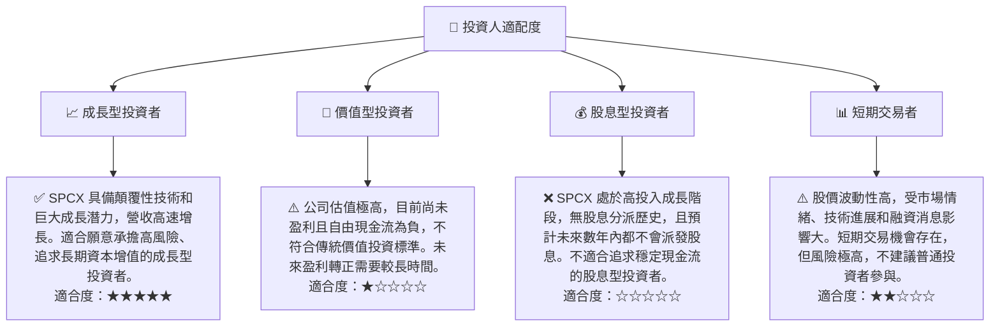

### 10.5 關鍵監控指標

| 監控類型 | 指標 | 關注點 | 頻率 |
|----------|------|----------|------|
| **營收成長** | 總收入 YoY 成長率 | Starlink 用戶增長、發射頻次、企業級服務拓展 | 每季/每年 |
| **獲利能力** | 毛利率、營業利益率、淨利率 | 規模經濟效益、成本控制、研發投入效率 | 每季/每年 |
| **現金流** | 營業現金流、自由現金流 | 資本支出管理、現金流轉正時程 | 每季/每年 |
| **估值** | Forward P/E, P/S, EV/EBITDA | 相對同業估值、市場情緒變化 | 每日/每週 |
| **技術進展** | Starship 測試與商業化進度 | 成功率、部署效率、成本效益 | 持續監控 |
| **市場競爭** | Starlink 市場份額、競爭對手進展 | 新競爭者威脅、定價策略影響 | 每半年/每年 |
| **財務健康** | 總債務、現金及等價物、債務股權比 | 融資需求、槓桿水平 | 每季/每年 |

---

> **免責聲明**：本報告為 AI 自動生成，僅供研究參考，不構成投資建議。投資有風險，入市需謹慎。