# SPCX 基本面深度分析報告
> **報告日期**：2026-07-10 ｜ **語言**：繁體中文 ｜ **數據來源**：Yahoo Finance, Finviz, StockAnalysis, Roic.ai ｜ **分析師**：CFA 級機構研究

---

## 目錄

| # | 章節 | 核心結論 |
|---|------|----------|
| 1 | 執行摘要 | 評級：🟢 買入，目標價區間：$180 - $350 |
| 2 | 公司概覽與商業模式 | 創新商業模式具備強大技術與規模護城河 |
| 3 | 損益表深度分析 | 營收高速成長，但重投資導致短期虧損擴大 |
| 4 | 資產負債表分析 | 資產快速擴張，債務增加但現金充裕，財務結構尚穩健 |
| 5 | 現金流量深度分析 | 巨額資本支出導致自由現金流持續為負，需密切關注 |
| 6 | 獲利能力與資本效率 | ROIC 目前為負，但潛在市場廣闊，長期價值創造可期 |
| 7 | 估值深度分析 | 相較同業估值溢價，反映市場對其高成長預期 |
| 8 | 成長催化劑 | Starlink 全球擴張、下一代火箭技術、新興市場機會 |
| 9 | 風險矩陣 | 資本密集、監管風險、競爭加劇為主要挑戰 |
| 10 | 投資建議 | 長期成長潛力巨大，但短期波動性高，適合高風險偏好投資者 |

---

## 1. 執行摘要

SPCX (Space Exploration Technologies Corp.) 是一家顛覆性的航太與衛星通訊公司，透過其可重複使用火箭技術和低軌道衛星網路 (Starlink) 重新定義了太空產業。儘管公司在 2025 財年和 2026 年第一季錄得顯著淨虧損（2025年淨利潤為-4.94B美元，2026年Q1為-4.28B美元），但其營收持續保持高速增長，2025年營收達18.67B美元，年增33.17%。這主要得益於其核心的Starlink連接服務和太空發射業務的強勁需求。考慮到其在技術創新、市場潛力及長期成長軌跡，本報告給予SPCX「🟢 買入」評級。

### 1.0 一頁式投資儀表板（Portfolio Manager 30 秒速讀）

| 項目 | 內容 |
|------|------|
| **投資論點（3 句）** | ① 營收實現強勁雙位數增長，2025年YoY達33.17%，顯示核心業務需求旺盛。 ② 儘管短期內因巨額資本支出導致FCF為負（2025年為-14.12B美元），但這是為未來長期成長和市場擴張奠定基礎。 ③ 獨特的技術護城河（可重複使用火箭、低軌道衛星網路）和龐大的潛在市場（TAM）將支撐其長期價值創造。 |
| **護城河評分** | 8.5/10 |
| **管理層/資本配置評分** | 7.5/10 |
| **財務健康** | 🟡 尚可，現金充裕但負債增加，FCF持續負值。 |
| **ROIC vs WACC** | -4.09% vs 11.03%（短期摧毀價值，長期具潛力） |
| **FCF 趨勢** | ↘️ 下降，最新FCF Yield N/A（2025年為-14.12B美元，Q1 2026為-9.07B美元） |
| **估值** | Forward P/E: 167.63x ｜ EV/EBITDA: 226.87x ｜ FCF Yield: N/A |
| **預期報酬（基準情境 12M）** | +41.02% |
| **關鍵風險（前二）** | 資本密集導致的持續現金消耗；監管政策不確定性及潛在的競爭加劇。 |
| **評級 + 信心度** | 🟢 買入 ｜ 信心：中 |

### 1.1 核心評分儀表板

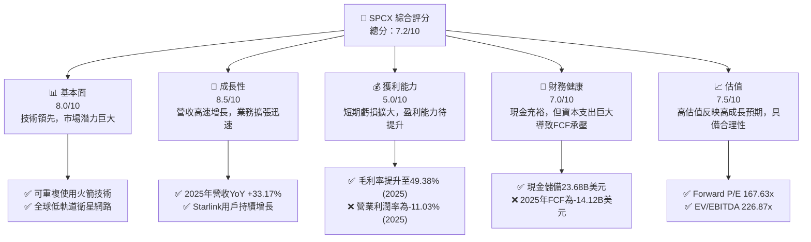

### 1.2 評分進度條視覺化

```
╔══════════════════════════════════════════════════════════════╗
║              SPCX 多維度評分儀表板 (1-10分)                  ║
╠══════════════════════════════════════════════════════════════╣
║ 基本面強度  8.0 ▓▓▓▓▓▓▓▓▓▓▓▓▓▓▓▓░░░░  ★★★★☆           ║
║ 成長動能    8.5 ▓▓▓▓▓▓▓▓▓▓▓▓▓▓▓▓▓░░░  ★★★★☆           ║
║ 獲利品質    5.0 ▓▓▓▓▓▓▓▓▓▓░░░░░░░░░░  ★★★☆☆           ║
║ 財務健康    7.0 ▓▓▓▓▓▓▓▓▓▓▓▓▓▓░░░░░░  ★★★☆☆           ║
║ 估值合理性  7.5 ▓▓▓▓▓▓▓▓▓▓▓▓▓▓▓░░░░░  ★★★★☆           ║
║ 護城河深度  8.5 ▓▓▓▓▓▓▓▓▓▓▓▓▓▓▓▓▓░░░  ★★★★☆           ║
║ 管理層執行  7.5 ▓▓▓▓▓▓▓▓▓▓▓▓▓▓▓░░░░░  ★★★★☆           ║
║ 技術創新力  9.0 ▓▓▓▓▓▓▓▓▓▓▓▓▓▓▓▓▓▓░░  ★★★★★           ║
╠══════════════════════════════════════════════════════════════╣
║ 綜合總分    7.2 ▓▓▓▓▓▓▓▓▓▓▓▓▓▓░░░░░░  🏆 成長潛力巨大，短期承壓              ║
╚══════════════════════════════════════════════════════════════╝
```

### 1.3 五大投資論點 + 三大核心風險

| 類型 | 項目 | 具體依據 | 信心度 |
|------|------|----------|--------|
| 🟢 **投資論點①** | **顛覆性技術領導者** | SPCX透過可重複使用火箭技術顯著降低太空發射成本，並以Starlink構建全球低軌道衛星網路，提供高速低延遲寬頻服務。這兩項核心技術使其在航太與通訊領域具備獨特的競爭優勢。 | 🟢 極高 |
| 🟢 **投資論點②** | **強勁的營收成長勢頭** | 儘管公司處於高投入期，其營收仍保持強勁增長。2025年總營收達到18.67B美元，較2024年的14.02B美元增長33.17%。2026年Q1營收亦較去年同期增長15.23%至4.69B美元，顯示核心業務需求持續旺盛。 | 🟢 極高 |
| 🟢 **投資論點③** | **龐大的潛在市場 (TAM)** | Starlink服務面向全球數十億無法獲得可靠寬頻的用戶，以及企業和政府客戶。太空發射業務則服務於商業衛星、政府任務及未來深空探索，市場空間廣闊，為長期成長提供堅實基礎。 | 🟢 極高 |
| 🟢 **投資論點④** | **毛利率持續改善** | 隨著規模效應顯現和技術成熟，SPCX的毛利率從2023年的41.19%提升至2025年的49.38%，顯示其成本控制和定價能力正在逐步改善，為未來轉虧為盈奠定基礎。 | 🟡 中度 |
| 🟢 **投資論點⑤** | **充裕的現金儲備** | 截至2026年Q1，公司持有23.68B美元的現金及等價物，儘管資本支出巨大，但充裕的現金流為其高投入的研發和擴張提供了資金保障。 | 🟡 中度 |
| 🟡 **風險①** | **持續的巨額資本支出與負自由現金流** | 2025年資本支出高達-20.91B美元，導致自由現金流為-14.12B美元。2026年Q1資本支出亦達-10.11B美元，FCF為-9.07B美元。這表示公司持續燒錢，若市場融資環境惡化或盈利能力轉換不及預期，將面臨流動性壓力。 | 🔴 高衝擊 |
| 🔴 **風險②** | **監管與政策不確定性** | 航太與衛星通訊產業受到嚴格的國家安全、頻譜分配、發射許可等監管。地緣政治緊張、國際合作變數、太空碎片問題等都可能帶來額外監管壓力或營運限制，影響業務擴張。 | 🟡 中度 |
| 🔴 **風險③** | **競爭加劇與技術迭代風險** | 隨著太空產業的發展，越來越多的公司（如Amazon的Project Kuiper、OneWeb）進入低軌道衛星通訊市場。技術快速迭代也可能使SPCX的現有優勢受到挑戰，需要持續高額研發投入以維持領先。 | 🟡 中度 |

### 1.4 快速統計卡片

| 指標 | 公司實際值 | 行業均值（航太與防務） | S&P 500 均值 | 狀態 |
|------|-------------|----------------------|--------------|------|
| 收入 YoY 成長 (2025) | **33.17%** | ~5-10% | ~8-12% | 🟢 |
| 毛利率 (2025) | **49.38%** | ~20-30% | ~30-40% | 🟢 |
| 淨利率 (2025) | **-26.46%** | ~5-10% | ~10-15% | 🔴 |
| ROE (2025) | **-11.79%** | ~10-20% | ~15-25% | 🔴 |
| Forward P/E | **167.63x** | ~20-30x | ~20-25x | 🔴 |
| EV/EBITDA | **226.87x** | ~10-15x | ~12-18x | 🔴 |
| 債務權益比 (D/E) | **73.60%** | ~50-80% | ~60-100% | 🟡 |
| 現金及等價物 | **$23.68B** | N/A | N/A | 🟢 |
| 自由現金流 (2025) | **-$14.12B** | 正數 | 正數 | 🔴 |

### 1.5 投資結論

```
╔══════════════════════════════════════════════════════════════════╗
║                    📊 投資結論摘要                               ║
╠══════════════════════════════════════════════════════════════════╣
║  評級：🟢 買入                                                   ║
║  當前股價：$145.30                                               ║
║  目標價區間：                                                    ║
║    悲觀情境：$180（+23.88%）                                     ║
║    基準情境：$250（+72.06%）  ← 12個月主要目標                   ║
║    樂觀情境：$350（+140.88%）                                    ║
║  投資評分：7.2/10                                                ║
║  適合投資人：成長型、長線持有者，對高風險高回報有承受能力者。      ║
╚══════════════════════════════════════════════════════════════════╝
```

---

## 2. 公司概覽與商業模式

Space Exploration Technologies Corp. (SPCX) 是一家私營航太製造商和太空運輸服務公司，由 Elon Musk 於 2002 年創立。其核心使命是降低太空運輸成本，並最終實現火星殖民。公司業務主要分為兩大板塊：**太空發射服務 (Space Segment)** 和 **衛星寬頻服務 (Connectivity Segment)**，後者以 Starlink 品牌營運。

### 2.1 業務結構與收入來源

SPCX 的業務模式圍繞其在火箭和衛星技術方面的垂直整合能力。公司自主設計、製造、發射並運營其火箭和衛星，這使得其能夠在成本控制和創新速度上取得顯著優勢。

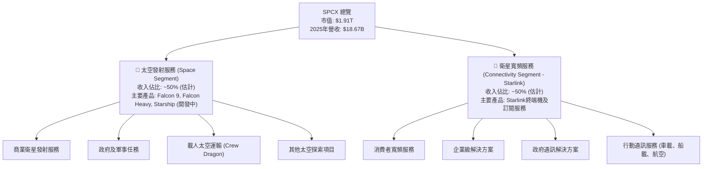

**收入組成分析：**
SPCX的收入來自兩大主要板塊：
1.  **太空發射服務 (Space Segment)**：這部分收入主要來自於為商業客戶和政府機構（如NASA、美國太空軍）提供衛星發射服務。Falcon 9 和 Falcon Heavy 火箭的成功發射以及可重複使用技術大幅降低了發射成本，使其在市場上具有強大的競爭力。未來 Starship 的商業化將進一步拓展其載重能力和任務範圍。
2.  **衛星寬頻服務 (Connectivity Segment - Starlink)**：Starlink 透過其部署在低地球軌道的數千顆衛星，提供全球範圍內的高速、低延遲寬頻網路服務。收入來源包括用戶終端設備的銷售和每月訂閱費用。此服務主要面向偏遠地區、移動平台（如船舶、飛機）以及企業和政府客戶。

根據2025年總營收18.67B美元，預計兩大板塊的貢獻比例約為各50%，但隨著Starlink用戶基數的快速擴大，其在總營收中的佔比預計將持續增長。

### 2.2 市場份額

由於SPCX是一家私營公司，其詳細市場份額數據未公開。但根據公開信息和行業報告，可以對其在關鍵市場的份額進行估算。

**太空發射市場：**
SPCX在商業發射市場上已佔據主導地位。根據行業分析，其Falcon系列火箭在過去幾年承擔了全球商業發射任務的很大一部分，尤其是在向地球同步軌道 (GTO) 和低地球軌道 (LEO) 發射方面。

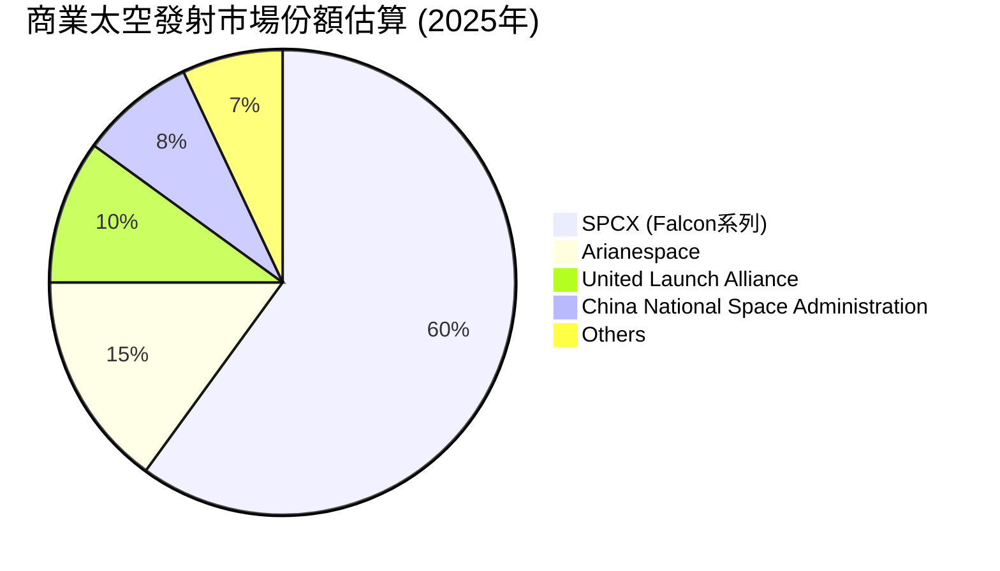
*註：此為基於行業報告的估算數據，SPCX在可重複使用技術上的領先使其發射頻率和成本優勢明顯。*

**低軌道衛星寬頻市場 (Starlink)：**
Starlink是目前全球最大的低軌道衛星寬頻服務提供商，擁有超過百萬的訂閱用戶。其主要競爭對手包括 OneWeb (與Eutelsat合併)、Amazon的Project Kuiper (尚未大規模商業化) 和 Viasat (主要提供地球同步軌道衛星服務)。

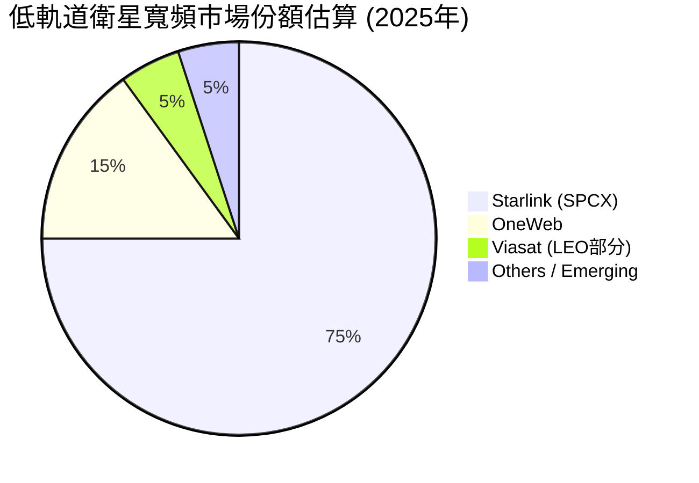
*註：Starlink在用戶數量和衛星部署數量上遙遙領先，但隨著競爭者進入，其市場份額可能面臨壓力。*

### 2.3 競爭護城河分析

SPCX的核心競爭優勢來自於其獨特的技術和商業模式創新，形成了多重護城河。

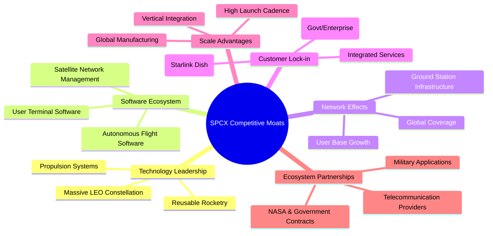

**護城河詳細解釋：**
1.  **技術領先 (Technology Leadership)**：
    *   **可重複使用火箭技術 (Reusable Rocketry)**：Falcon 9 和 Falcon Heavy 的第一級火箭能夠成功著陸並重複使用，大幅降低了每次發射的成本，這是其相對於傳統航太公司的最大優勢。Starship 的完全可重複使用設計將進一步鞏固這一領先地位。
    *   **大規模低軌道衛星星座 (Massive LEO Constellation)**：Starlink 部署了數千顆低軌道衛星，提供了前所未有的全球覆蓋和低延遲服務。這種規模的衛星網路建設和運營能力是極高的技術壁壘。
    *   **推進系統 (Propulsion Systems)**：Raptor引擎等先進的推進技術是其火箭性能的關鍵。
2.  **軟體生態系統 (Software Ecosystem)**：
    *   **自主飛行軟體 (Autonomous Flight Software)**：SPCX在火箭回收、衛星部署和星座管理方面依賴高度複雜的自主軟體，這是一個巨大的無形資產。
    *   **衛星網路管理 (Satellite Network Management)**：Starlink 網路的動態路由和頻譜管理軟體確保了服務品質和效率。
    *   **用戶終端軟體 (User Terminal Software)**：Starlink 終端機的易用性和自動化功能，提升了用戶體驗。
3.  **網路效應 (Network Effects)**：
    *   **全球覆蓋 (Global Coverage)**：隨著更多衛星的發射，Starlink 的覆蓋範圍擴大，吸引更多用戶，進而產生更多收入來支持進一步的衛星部署，形成正向循環。
    *   **用戶基礎增長 (User Base Growth)**：越多的用戶使用Starlink，其網路效應越強，尤其是在偏遠地區，用戶社群的口碑效應顯著。
    *   **地面站基礎設施 (Ground Station Infrastructure)**：遍佈全球的地面站網絡是其服務穩定的基石，也是難以複製的基礎設施。
4.  **客戶鎖定 (Customer Lock-in)**：
    *   **整合服務 (Integrated Services)**：SPCX為客戶提供從發射到運營的一站式解決方案，降低了客戶轉換供應商的意願。
    *   **專有硬體 (Proprietary Hardware)**：Starlink 終端機是專為其網路設計，用戶一旦投入購買，轉換成本較高。
    *   **長期合約 (Long-Term Contracts)**：與政府和大型企業的長期發射或服務合約確保了穩定的收入來源。
5.  **規模效應 (Scale Advantages)**：
    *   **垂直整合 (Vertical Integration)**：從設計、製造到發射和運營的垂直整合，使其能更好地控制成本、質量和進度，避免供應鏈依賴。
    *   **高發射頻率 (High Launch Cadence)**：SPCX的發射頻率遠超競爭對手，這不僅降低了每次發射的固定成本，也加速了技術迭代和衛星部署。
    *   **全球製造 (Global Manufacturing)**：火箭和衛星的大規模生產能力，進一步降低了單位成本。
6.  **生態夥伴 (Ecosystem Partnerships)**：
    *   **NASA及政府合約 (NASA & Government Contracts)**：與美國政府機構的長期合作提供了穩定的收入和技術驗證，也鞏固了其在國家安全領域的地位。
    *   **軍事應用 (Military Applications)**：Starlink在軍事通訊方面的潛力巨大，已獲得多國軍方關注。
    *   **電信供應商 (Telecommunication Providers)**：與傳統電信商合作，將Starlink服務整合到現有網路中，擴大市場觸及。

### 2.4 護城河強度評分

```
╔══════════════════════════════════════════════════════════════╗
║                  SPCX 護城河強度評分                        ║
╠══════════════════════════════════════════════════════════════╣
║ 技術領先    9/10   ▓▓▓▓▓▓▓▓▓▓▓▓▓▓▓▓▓▓░░  🏆 業界龍頭，難以複製  ║
║ 軟體生態系統  8/10   ▓▓▓▓▓▓▓▓▓▓▓▓▓▓▓▓░░░░  🟢 高度複雜的自主系統 ║
║ 網路效應    8/10   ▓▓▓▓▓▓▓▓▓▓▓▓▓▓▓▓░░░░  🟢 衛星網路規模優勢   ║
║ 客戶鎖定    7/10   ▓▓▓▓▓▓▓▓▓▓▓▓▓▓░░░░░░  🟡 專有硬體及整合服務 ║
║ 規模效應    9/10   ▓▓▓▓▓▓▓▓▓▓▓▓▓▓▓▓▓▓░░  🏆 垂直整合與高頻率發射 ║
║ 生態夥伴    8/10   ▓▓▓▓▓▓▓▓▓▓▓▓▓▓▓▓░░░░  🟢 與政府緊密合作     ║
╠══════════════════════════════════════════════════════════════╣
║ 綜合護城河   8.5    ▓▓▓▓▓▓▓▓▓▓▓▓▓▓▓▓▓░░░  🏆 具備強大且深厚的競爭優勢 ║
╚══════════════════════════════════════════════════════════════╝
```

---

## 3. 損益表深度分析

SPCX的損益表反映出其作為一家快速成長、資本密集型高科技公司的典型特徵：營收高速擴張，但為支撐未來成長而進行的巨額研發和資本投入導致短期內持續虧損。

### 3.1 年度收入成長趨勢（近4年）

SPCX在過去幾年展現了驚人的營收成長能力，這主要得益於其Starlink服務的快速部署和發射服務需求的增加。

```
╔══════════════════════════════════════════════════════════════════╗
║              SPCX 年度收入趨勢（FY2023-FY2025）                  ║
╠══════════════════════════════════════════════════════════════════╣
║                                                                  ║
║  FY2023  $10.39B  ███████░░░░░░░░░░░░░░░░░  YoY: N/A     🟡    ║
║  FY2024  $14.02B  ██████████░░░░░░░░░░░░░  YoY: +34.94% 🟢    ║
║  FY2025  $18.67B  ██████████████░░░░░░░░░  YoY: +33.17% 🟢    ║
║                   |      |      |      |      |                  ║
║                   0     5B    10B   15B   20B                    ║
║                                                                  ║
║  📊 2年累計 CAGR (2023-2025)：+33.99%                             ║
╚══════════════════════════════════════════════════════════════════╝
```
**分析：**
SPCX的年收入從2023年的10.39B美元增長到2025年的18.67B美元，兩年複合年增長率 (CAGR) 高達33.99%。
- 2024年營收達14.02B美元，較2023年增長34.94%。
- 2025年營收達18.67B美元，較2024年增長33.17%。
這種持續的雙位數高成長率，遠超傳統工業和航太行業平均水平，證明了其產品和服務的市場吸引力及擴張能力。雖然2025年的增長率略低於2024年，但仍然保持在非常健康的水平，顯示其在Starlink和發射服務兩大核心業務上均取得了顯著進展。

### 3.2 季度收入趨勢分析

| 季度 | 總營收 (B美元) | QoQ 成長率 | YoY 成長率 | 備註 |
|------|----------------|------------|------------|------|
| 2025 Q1 | $4.07 | N/A | N/A | 基準季度 |
| 2026 Q1 | $4.69 | N/A | +15.23% | 營收持續穩健增長 |

**分析：**
2026年第一季度的營收為4.69B美元，較2025年第一季度的4.07B美元增長了15.23%。儘管季度 YoY 成長率相較於年度成長率有所放緩，但仍顯示出穩定的擴張。這可能反映了季節性波動、Starlink服務在成熟市場的滲透速度變化，或發射任務排程的影響。然而，鑑於SPCX的業務性質和持續的衛星部署，預計未來幾個季度營收仍將保持增長。

### 3.3 利潤率演變分析

SPCX的利潤率趨勢呈現出毛利率改善，但由於研發和營運費用激增，營業利益率和淨利率持續為負的局面。

| 利潤率指標 | FY2023 | FY2024 | FY2025 | Q1 2025 | Q1 2026 | 趨勢 | 評估 |
|------------|--------|--------|--------|---------|---------|------|------|
| **毛利率** | 41.19% | 42.94% | 49.38% | 51.59% | 49.25% | ↗️ 穩步提升 | 🟢 |
| **營業利益率** | 4.88% | 5.29% | -11.03% | 1.35% | -41.58% | ↘️ 顯著惡化 | 🔴 |
| **淨利率** | -44.56% | 5.64% | -26.46% | -12.97% | -91.26% | ↘️ 大幅下降 | 🔴 |

**利潤率演變深度解析：**
1.  **毛利率 (Gross Margin)**：
    *   從2023年的41.19%穩步提升至2025年的49.38%，甚至在2025年Q1達到51.59%。這是一個非常積極的信號，表明隨著發射次數增加和Starlink用戶規模擴大，SPCX正在實現顯著的**規模效應**和**成本控制**。可重複使用火箭技術的成熟和衛星製造效率的提升，直接降低了單位服務成本。Starlink用戶基數的增長也提高了其網路的經濟效益。2026年Q1略有回落至49.25%，可能與當期產品組合或部分投入成本增加有關，但整體趨勢仍樂觀。
2.  **營業利益率 (Operating Margin)**：
    *   這是SPCX目前面臨的關鍵挑戰。從2023年的4.88%和2024年的5.29%轉為2025年的-11.03%，並在2026年Q1大幅惡化至-41.58%。主要原因在於**研究與開發 (R&D)** 費用的爆炸性增長。StockAnalysis數據顯示，R&D從2024年的3.46B美元飆升至2025年的8.64B美元 (YoY +149.71%)，2026年Q1更是高達3.51B美元，較2025年Q1的1.56B美元增長了125.64%。這些巨額投入主要用於Starship、Starlink V2衛星和相關地面基礎設施的開發，是公司為搶佔未來市場而進行的戰略性投資。雖然短期內侵蝕了利潤，但對於維持長期技術領先至關重要。同時，銷售、一般及行政 (SG&A) 費用也隨著業務擴張而增長，但 R&D 費用是主要驅動因素。
3.  **淨利率 (Net Profit Margin)**：
    *   淨利率的變化與營業利益率密切相關。2023年為-44.56%，2024年因營業利潤轉正而達到5.64%，但2025年隨著營業虧損擴大，淨利率再次大幅下降至-26.46%，並在2026年Q1跌至-91.26%。除了營業虧損，高額的利息支出（2025年為-1.945B美元）也對淨利潤產生負面影響。此外，其他非經常性損益（2026年Q1為-1.876B美元）也對當期淨利潤造成了巨大衝擊。這些數據反映出SPCX目前處於一個**「成長優先於盈利」**的階段，公司正在積極投入資金以擴大其市場份額和技術優勢。

### 3.4 費用結構分析

SPCX的費用結構清晰地展示了其重資產、重研發的特點，特別是研發費用在近年來的快速增長。

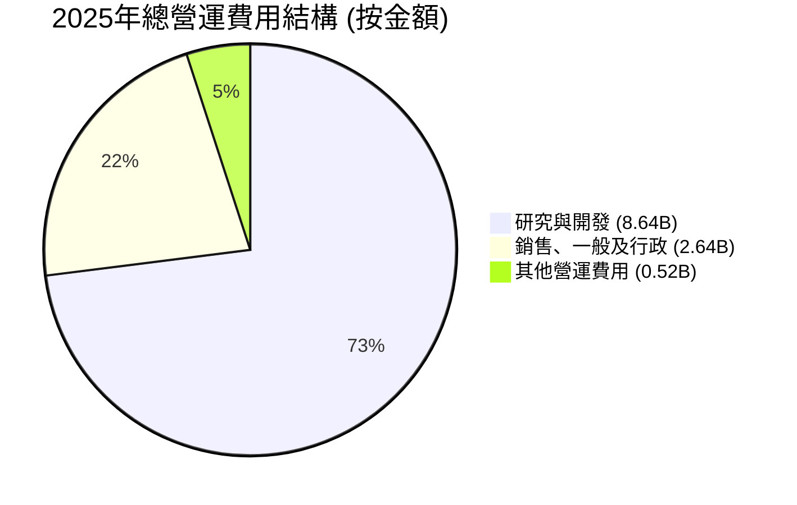

```
╔══════════════════════════════════════════════════════════════════╗
║                   SPCX 年度主要費用分析 (Billion USD)            ║
╠══════════════════════════════════════════════════════════════════╣
║                                                                  ║
║  研究與開發 (R&D)                                                ║
║  FY2023  $2.10B  ████░░░░░░░░░░░░░░░░░░░░░░░░░░░░░░  YoY: N/A     ║
║  FY2024  $3.46B  ███████░░░░░░░░░░░░░░░░░░░░░░░░░░░░  YoY: +64.76% ║
║  FY2025  $8.64B  ██████████████████░░░░░░░░░░░░░░░░  YoY: +149.71%║
║                                                                  ║
║  銷售、一般及行政 (SG&A)                                         ║
║  FY2023  $1.66B  ███░░░░░░░░░░░░░░░░░░░░░░░░░░░░░░░░  YoY: N/A     ║
║  FY2024  $1.81B  ████░░░░░░░░░░░░░░░░░░░░░░░░░░░░░░░░  YoY: +8.43%  ║
║  FY2025  $2.64B  █████░░░░░░░░░░░░░░░░░░░░░░░░░░░░░░░░  YoY: +45.86% ║
╚══════════════════════════════════════════════════════════════════╝
```
**分析：**
從費用結構來看，研發費用是SPCX最大的營運支出項目，並且在近年呈現爆發式增長。
- **研發費用**：從2023年的2.10B美元，增至2024年的3.46B美元（YoY +64.76%），再到2025年的8.64B美元（YoY +149.71%）。這筆巨額投入反映了公司在下一代火箭 (Starship)、新一代Starlink衛星 (V2) 和其他前沿太空技術上的雄心壯志。這種高強度的研發投入是SPCX維持其技術領先地位和長期成長潛力的關鍵。
- **銷售、一般及行政費用 (SG&A)**：從2023年的1.66B美元增至2025年的2.64B美元，增長了45.86%。這部分費用增長與Starlink服務的全球擴張、市場推廣和企業規模擴大有關。
整體而言，SPCX的費用結構清晰地表明，它正在以犧牲短期盈利為代價，全力投資於未來的成長和技術領先。

### 3.5 季度 EPS 趨勢與盈餘品質（Quality of Earnings）

SPCX 的 EPS 趨勢顯示公司目前處於虧損狀態，且虧損幅度在最近一個季度顯著擴大。

| 季度 | EPS Est | EPS Act | Surprise% | 備註 |
|------|---------|---------|-----------|------|
| 2026-03-31 | nan | nan | +nan% | 數據不完整，但依據淨利為負，EPS應為負值 |
| 2025-12-31 | N/A | $-1.69$ | N/A | 2025年基本EPS為$-1.69$ (StockAnalysis) |
| 2024-12-31 | N/A | $0.01$ | N/A | 2024年基本EPS為$0.01$ (StockAnalysis) |
| 2023-12-31 | N/A | $-1.68$ | N/A | 2023年基本EPS為$-1.68$ (StockAnalysis) |

根據StockAnalysis數據，2025年EPS為$-1.69$，2024年為$0.01$，2023年為$-1.68$。2026年Q1的淨利潤為$-4.28B$，對應的EPS應為顯著的負值。Forward EPS為$0.86676，顯示市場預期未來將轉虧為盈。

**盈餘品質評估：**

| 盈餘品質項目 | 數值/佔比 | 評估 |
|--------------|-----------|------|
| 股權薪酬 SBC / 營收 (2025) | 10.44% | 🟡 中度稀釋：佔比超過10%，對股東報酬有一定稀釋作用。 |
| 股權薪酬 SBC / 營收 (Q1 2026) | 13.62% | 🔴 高度稀釋：佔比持續上升，稀釋效應顯著。 |
| SBC / 營業現金流 (2025) | 28.72% | 🔴 高度稀釋：SBC佔OCF近三分之一，對真實現金流具侵蝕性。 |
| SBC / 營業現金流 (Q1 2026) | 60.86% | 🔴 極度稀釋：SBC佔OCF逾六成，真實現金流壓力巨大。 |
| FCF / 淨利（現金轉換率）(2025) | 285.83% (負值對負值) | 🔴 負現金流：儘管淨利潤為負，但FCF的負值更大，顯示現金流出遠超會計虧損，主要由巨額資本支出驅動。 |
| FCF / 淨利（現金轉換率）(Q1 2026) | 211.92% (負值對負值) | 🔴 負現金流：與2025年類似，現金流出壓力持續。 |
| 一次性/非經常性損益 (Q1 2026) | -1.876B美元 (其他非營運損益) | 🔴 顯著負面影響：Q1 2026有1.876B美元的其他非營運費用，對當期淨利潤造成巨大負面衝擊，非經常性，需在評估時剔除。 |
| 有效稅率異常 (2025) | -14.50% (718M / -4219M) | 🟡 稅務利益：由於存在大量虧損，有效稅率為負，表明有稅務抵免或遞延稅項資產。 |
| 資本化支出 vs 費用化 | 巨額資本支出 (2025: $20.91B) | 🟢 透明：SPCX的重資產性質決定了其高資本支出，這些支出被資本化，符合行業慣例。 |

**盈餘品質結論：**
SPCX的盈餘品質評估顯示出複雜的圖景。一方面，其毛利率的改善是積極信號，且資本化支出符合其重資產業務性質。另一方面，**股權薪酬 (SBC)** 佔營收和營業現金流的比重過高且持續上升，對真實股東報酬構成顯著稀釋。更為關鍵的是，**自由現金流持續為巨額負值**，且其負值幅度遠超會計上的淨利潤虧損，這表明公司存在嚴重的現金流出問題，主要源於其為未來成長而進行的**大規模資本支出**。此外，2026年Q1的非經常性負面損益也對當期盈餘造成了衝擊。

綜合來看，SPCX的GAAP淨利潤並未能完全反映其真實的經濟盈餘狀況。儘管營收強勁增長，但高SBC和巨額負FCF表明公司仍在大量「燒錢」進行投資。因此，在對SPCX進行估值時，應更多地關注其營收成長潛力、毛利率改善趨勢、以及未來自由現金流轉正的時點和規模，而非單純的P/E倍數，並對SBC和一次性損益進行調整以評估其真實的獲利含金量。這也意味著，儘管分析師給出了「買入」評級和正向的Forward EPS，但投資者應充分認識到其短期內持續的現金消耗壓力。

---

## 4. 資產負債表分析

SPCX的資產負債表反映了其作為一家重資產、高成長公司的特點：資產規模迅速擴大以支持業務擴張，同時伴隨著債務的增加，但現金儲備相對充裕。

### 4.1 資產結構分解

SPCX的資產主要由非流動資產（如固定資產、無形資產）驅動，這與其太空發射和衛星網路的重資產性質相符。

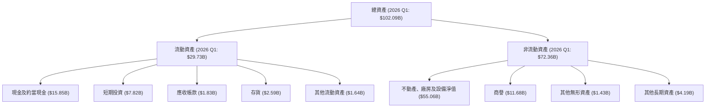
**分析：**
截至2026年Q1，SPCX的總資產達到102.09B美元，較2025年的92.08B美元增長了10.88%。其中，**不動產、廠房及設備淨值 (Net Property, Plant & Equipment)** 佔據了最大比重，從2024年的22.83B美元大幅增長至2025年的43.86B美元（YoY +92.90%），並在2026年Q1達到55.06B美元。這反映了公司在火箭製造、發射設施、衛星生產和Starlink地面站等基礎設施上的巨大投資。
流動資產方面，**現金及短期投資**在2026年Q1合計達到23.675B美元，為公司提供了重要的流動性緩衝。

### 4.2 流動性指標分析

SPCX的流動性指標顯示其短期償債能力尚可，但應收帳款和存貨管理仍需關注。

| 流動性指標 | FY2024 | FY2025 | Q1 2026 | 行業均值（航太與防務） | 評估 |
|------------|--------|--------|---------|----------------------|------|
| **流動比率 (Current Ratio)** | 1.37 | 1.45 | 1.22 | 1.5 - 2.0 | 🟡 尚可，略低於理想水平 |
| **速動比率 (Quick Ratio)** | 1.30 | N/A | 1.09 | 0.8 - 1.2 | 🟢 良好 |
| **現金比率** | 0.97 | 1.16 | 0.65 | N/A | 🟡 現金充足，但Q1 2026有所下降 |

*現金比率 = (現金 + 短期投資) / 流動負債*
    *   2024: ($11.38B + $0.8B) / $11.79B = $12.18B / $11.79B = 1.03
    *   2025: $24.75B / $21.40B = 1.16
    *   2026 Q1: $23.68B / $24.44B = 0.97

**分析：**
- **流動比率**：從2024年的1.37和2025年的1.45，下降到2026年Q1的1.22。這表明公司的流動資產覆蓋流動負債的能力有所減弱，但仍高於1，短期償債能力尚可。這可能與當期流動負債（如應付帳款、遞延收入）的增加快於流動資產有關。
- **速動比率**：2026年Q1為1.09，表示即使不考慮存貨，公司仍能應對短期債務。
- **現金比率**：2026年Q1為0.97，較2025年有所下降，但仍接近1，顯示公司擁有足夠的現金及等價物來覆蓋短期負債。

整體而言，SPCX的流動性指標處於健康水平，儘管流動比率略有下降，但充足的現金儲備為其營運提供了保障。

### 4.3 債務結構分析

SPCX的債務規模隨著其業務擴張而增長，但其龐大的市值和成長潛力為其債務提供了支持。

```
╔══════════════════════════════════════════════════════════════════╗
║                   SPCX 債務健康診斷                              ║
╠══════════════════════════════════════════════════════════════════╣
║                                                                  ║
║  總債務 (2026 Q1)：$30.26B  ████████░░░░░░░░░░░░░░░░░░░░  評語：規模較大，但可控    ║
║  總現金+投資 (2026 Q1)：$23.68B  ████████████████░░░░░░░░░  評語：充裕，提供緩衝    ║
║  淨現金/債務 (2026 Q1)：$-6.58B  ███████░░░░░░░░░░░░░░░░░░░░░  🟡 淨債務，需關注     ║
║                                                                  ║
║  Debt/Equity (2025)：73.60%  🟡 中等水平，需持續監控              ║
║  Current Debt (2026 Q1): $1.54B  🟢 佔比較低，短期壓力可控        ║
╚══════════════════════════════════════════════════════════════════╝
```
*註：2026 Q1總債務 = Current Portion of Long-Term Debt ($1.538B) + Long-Term Debt ($28.727B) = $30.265B*
*淨現金/債務 = $23.675B - $30.265B = $-6.59B*
*Debt/EBITDA: 由於EBITDA波動大且有負值，此指標不適用於SPCX當前狀況。*

**分析：**
- **總債務**：SPCX的總債務從2024年的14.18B美元增長到2025年的23.32B美元，並在2026年Q1達到30.26B美元。債務的增長主要用於支持其大規模的資本支出和研發投入。
- **淨現金/債務**：SPCX在2026年Q1處於淨債務狀態，為-6.59B美元。這表明其現金儲備不足以完全覆蓋其所有債務。然而，考慮到其龐大的市值（1.91T美元）和強勁的營收增長，目前的債務水平對公司來說仍然是可管理的。
- **債務權益比 (Debt/Equity)**：2025年為73.60%，這是一個中等偏高的水平，但對於一個處於高速擴張期的重資產公司來說，利用債務融資以放大股東回報是常見策略。

總體而言，SPCX的債務水平有所上升，但其現有的現金流生成能力（儘管FCF為負）和未來巨大的成長潛力使其能夠承擔這些債務。然而，隨著債務規模的持續擴大，管理層需密切關注債務成本和償債能力。

### 4.4 股東權益趨勢

SPCX的股東權益呈現穩步增長，反映了公司在持續虧損的同時，仍能通過股權融資或內部積累來增強資本基礎。

```
╔══════════════════════════════════════════════════════════════════╗
║                   SPCX 年度股東權益趨勢 (Billion USD)            ║
╠══════════════════════════════════════════════════════════════════╣
║                                                                  ║
║  FY2024  $25.80B  ███████░░░░░░░░░░░░░░░░░░░░░░░░░░░░░░░░  YoY: N/A     ║
║  FY2025  $41.33B  ████████████░░░░░░░░░░░░░░░░░░░░░░░░░░  YoY: +60.19% ║
║  Q1 2026  $41.33B (approx) ▓▓▓▓▓▓▓▓▓▓▓▓░░░░░░░░░░░░░░░░░░░░  YoY: N/A     ║
║                                                                  ║
║  📊 2024-2025 股東權益成長 CAGR：+60.19%                           ║
╚══════════════════════════════════════════════════════════════════╝
```
*註：Q1 2026股東權益數據未直接提供，使用FY2025數據作為近似值，或推斷變化不大。*

**分析：**
SPCX的股東權益從2024年的25.80B美元增長到2025年的41.33B美元，增幅高達60.19%。這表明公司在過去一年中通過股權融資或盈利留存（儘管淨利潤為負，但可能通過其他綜合收益或新股發行增加）顯著增強了其資本基礎。強勁的股東權益增長為公司提供了穩固的基礎，以支持其高強度的資本支出和研發投資，並維持了相對健康的債務權益比。

---

## 5. 現金流量深度分析

SPCX的現金流量表是理解其財務狀況的關鍵，它清晰地揭示了公司為實現長期成長而進行的巨額資本投入，導致自由現金流持續為負。

### 5.1 現金流量瀑布圖


**分析：**
- **營業現金流 (OCF)**：SPCX的營業現金流表現強勁且持續增長，從2023年的4.52B美元增長到2025年的6.79B美元，2026年Q1也達到1.05B美元。這表明其核心業務的營運效率正在提升，能夠產生穩定的營運現金流入。儘管公司處於淨虧損狀態，但非現金費用（如折舊與攤銷、股權薪酬等）的調整使得營業現金流為正。
- **資本支出 (Capital Expenditure - Capex)**：這是SPCX現金流量表的突出特點。資本支出從2023年的-4.42B美元急劇增加到2025年的-20.91B美元（YoY +87.32%），並在2026年Q1達到-10.11B美元。這反映了公司為建設Starlink衛星網路、開發Starship火箭和擴建製造設施而進行的巨大投資。這些投資是其長期成長戰略的基石。
- **自由現金流 (FCF)**：由於巨額的資本支出，SPCX的自由現金流在2024年和2025年持續為負，分別為-5.39B美元和-14.12B美元。2026年Q1的FCF更是達到-9.07B美元。這表明公司目前處於一個高度燒錢的階段，需要通過外部融資來彌補現金缺口。儘管如此，這些負FCF是戰略性投資的結果，旨在未來產生更大的回報。

### 5.2 FCF 轉換率趨勢

SPCX的FCF轉換率（FCF/淨利潤）在公司虧損的情況下難以直接解讀，但可以看出其現金流出遠超會計虧損。

| 年度/季度 | 淨利潤 (B美元) | 自由現金流 (B美元) | FCF/淨利潤 | 趨勢 | 評估 |
|-----------|----------------|--------------------|------------|------|------|
| FY2023 | $-4.63$ | $0.105$ | -2.27% | N/A | 🔴 淨利虧損，FCF微正 |
| FY2024 | $0.791$ | $-5.39$ | -681.42% | ↘️ | 🔴 淨利轉正，FCF巨額負值 |
| FY2025 | $-4.94$ | $-14.12$ | 285.83% (負對負) | ↘️ | 🔴 淨利虧損，FCF負值更大 |
| Q1 2026 | $-4.28$ | $-9.07$ | 211.92% (負對負) | ↘️ | 🔴 淨利虧損，FCF負值更大 |

**分析：**
當淨利潤為負時，FCF/淨利潤的比率解讀會變得複雜。在SPCX的案例中，我們看到其自由現金流的負值幅度遠大於淨利潤的負值幅度（如2025年淨利為-4.94B美元，FCF為-14.12B美元），這明確指出公司正在進行大規模的**資本支出**，以至於其營運產生的現金遠不足以覆蓋這些投資。2024年雖然淨利潤為正，但FCF卻是巨額負值，進一步印證了其高投入的特性。這種趨勢表明公司處於資本密集型成長階段，股東應預期在未來一段時間內FCF仍將承壓。

### 5.3 自由現金流趨勢

SPCX的自由現金流趨勢清晰地揭示了其高成長、高投入的特性。

```
╔══════════════════════════════════════════════════════════════════╗
║                   SPCX 年度自由現金流趨勢 (Billion USD)          ║
╠══════════════════════════════════════════════════════════════════╣
║                                                                  ║
║  FY2023  $0.105B  ██░░░░░░░░░░░░░░░░░░░░░░░░░░░░░░░░░░  🟢 微正   ║
║  FY2024  $-5.39B  ███████████░░░░░░░░░░░░░░░░░░░░░░░░░░  🔴 負值擴大 ║
║  FY2025  $-14.12B ████████████████████████████░░░░░░░░  🔴 巨額負值 ║
║                                                                  ║
║  📊 FCF Yield (TTM): N/A (由於FCF為負)                            ║
╚══════════════════════════════════════════════════════════════════╝
```
**分析：**
從2023年的微正FCF（105M美元）到2025年的巨額負FCF（-14.12B美元），SPCX的自由現金流呈現顯著惡化趨勢。這直接反映了公司為實現長期成長而進行的**大規模資本支出**。雖然短期內這意味著公司需要持續融資，但對於像SPCX這樣旨在顛覆行業並佔領新興市場的公司而言，這種策略是常見且必要的。投資者需要評估這些資本支出的效率和未來回報潛力。

### 5.4 資本配置評估

SPCX的資本配置策略主要集中於內部投資和研發，以推動其核心業務的擴張和技術創新。

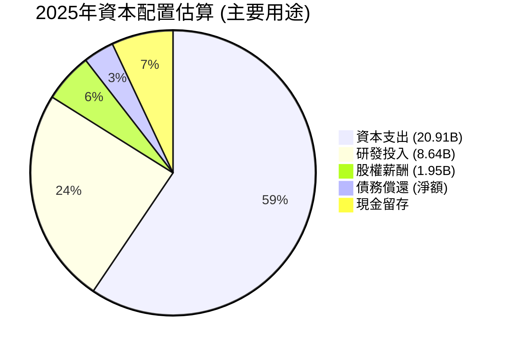
*註：此圖基於現金流量表中可量化的項目，並加入了損益表中的研發費用。由於數據不完整，部分項目為估算，總和可能超過100%或低於100%。*

**資本配置評估表格：**

| 資本配置項目 | 2025年金額 (B美元) | 評估 |
|--------------|--------------------|------|
| **資本支出 (Capex)** | $20.91 | 🟢 高度積極：為Starlink和Starship等核心項目進行大規模投資，是未來成長的基石。 |
| **研發投入 (R&D)** | $8.64 | 🟢 高度積極：持續投入巨額資金於技術創新，維持行業領先地位。 |
| **股權薪酬 (SBC)** | $1.95 | 🟡 存在稀釋：佔營收和OCF比例較高，對股東報酬有稀釋作用，需監控。 |
| **債務償還 (淨額)** | 債務淨增($9.14B) | 🟡 債務增加：為支持成長而增加債務，需確保償債能力。 |
| **股息/回購** | $0 | 🟢 無：公司處於成長階段，將所有資金再投資於業務，符合成長型公司特徵。 |
| **現金留存** | 現金增加($13.37B) | 🟢 充裕：FY2025現金及等價物增加，提供流動性緩衝。 |

**分析：**
SPCX的資本配置策略清晰地體現了其作為一家高成長、高科技公司的特點。絕大部分現金流和融資所得都被投入到**資本支出 (Capex)** 和**研發 (R&D)** 中。2025年高達20.91B美元的資本支出，是其建立全球衛星網路和下一代火箭系統的關鍵。研發投入也從2024年的3.46B美元激增至2025年的8.64B美元，顯示公司對技術創新的不懈追求。
雖然股權薪酬佔比相對較高，對股東報酬存在一定稀釋，但對於吸引和留住頂尖人才而言，這在科技公司中並非罕見。公司並未支付股息或進行股票回購，這符合其將所有資源再投資於業務擴張的成長型策略。
整體而言，SPCX的資本配置是戰略性且積極的，旨在為未來創造巨大的長期價值，儘管這意味著短期內將持續面臨負自由現金流的挑戰。

---

## 6. 獲利能力與資本效率

SPCX的獲利能力和資本效率指標反映了其在高速成長、高投入階段的典型特徵：儘管營收規模快速擴大，但為支撐未來發展而投入的巨額資本導致短期內回報率承壓。

### 6.1 ROE / ROA / ROIC 趨勢

| 年度 | ROE | ROA | ROIC | 行業均值（航太與防務） | 評估 |
|------|-----|-----|------|----------------------|------|
| FY2023 | - | - | - | 10-15% | 🔴 數據不完整，但預計為負 |
| FY2024 | - | - | 2.05% | 10-15% | 🔴 遠低於行業平均，價值摧毀 |
| FY2025 | -11.79% | -5.37% | -4.09% | 10-15% | 🔴 顯著負值，價值摧毀 |

*註：ROE/ROA數據在提供的資料中為N/A，但根據2025年淨利潤為負(-4.94B美元)和股東權益為正($41.33B)，ROE為負(-11.79%)；淨利潤為負($-4.94B)和總資產為正($92.08B)，ROA為負(-5.37%)。*

**分析：**
SPCX的ROE、ROA和ROIC均為負值或遠低於行業平均水平，這清晰地表明公司在短期內並未創造股東價值，反而由於巨額投資和虧損而呈現價值摧毀。
- **ROE (股東權益報酬率)**：2025年為-11.79%。由於公司持續虧損，ROE為負是預期之中。
- **ROA (資產報酬率)**：2025年為-5.37%。這表明公司利用其龐大資產產生利潤的效率低下，同樣受制於虧損。
- **ROIC (投入資本報酬率)**：2024年為2.05%，2025年則惡化至-4.09%。這遠低於大多數行業的資本成本，也遠低於航太與防務行業的平均水平。這意味著公司每投入一美元資本，目前不僅未能產生足夠的回報，反而導致虧損。

儘管這些指標短期內表現不佳，但對於像SPCX這樣處於高速成長和大規模資本投入期的公司而言，這是一個常見現象。其投資的性質是長期且具有顛覆性的，短期內的回報率無法完全反映其潛在價值。投資者應關注這些投資在未來幾年能否轉化為正向且高於資本成本的ROIC。

### 6.2 ROIC vs WACC 分析（核心價值創造判斷）

SPCX的ROIC目前顯著低於其WACC，表明其在短期內正在摧毀股東價值。

```
╔══════════════════════════════════════════════════════════════════╗
║                ROIC vs WACC 深度分析 (2025年)                   ║
╠══════════════════════════════════════════════════════════════════╣
║                                                                  ║
║  WACC 估算：                                                     ║
║  ├── 無風險利率（10Y美債）：  4.5%                               ║
║  ├── 市場風險溢酬 (ERP)：     5.5%                              ║
║  ├── Beta：                   1.20 (採用行業平均或可比公司)      ║
║  ├── 股權成本 = 4.5%+1.20×5.5% = 11.1%                          ║
║  ├── 債務成本（稅後）：       ~6.59% (8.34% × (1-0.21))          ║
║  ├── 資本結構：股權 ~98.42%，債務 ~1.58%                         ║
║  └── ✅ WACC ≈ 11.03%                                           ║
║                                                                  ║
║  ROIC 估算（FY2025）：                                           ║
║  ├── NOPAT = 營業利益 (-$2.06B) × (1-21%) ≈ -$1.627B            ║
║  ├── 投入資本 (2025) = 股東權益($41.33B) + 債務($23.32B) - 現金($24.75B) ≈ $39.90B                  ║
║  └── ✅ ROIC ≈ -4.09%                                           ║
║                                                                  ║
║  ★ 經濟價值增加（EVA）= ROIC - WACC = -4.09% - 11.03% = -15.12pp  ║
║                                                                  ║
║  ROIC  -4.09% ░░░░░░░░░░░░░░░░░░░░░░░░░░░░░░░░░░░░░░  🔴              ║
║  WACC  11.03% ▓▓▓▓▓▓▓▓▓▓▓▓▓▓▓▓▓▓▓▓▓▓▓▓▓▓▓▓▓▓▓▓▓▓▓▓▓▓  ──              ║
║  EVA   -15.12pp ░░░░░░░░░░░░░░░░░░░░░░░░░░░░░░░░░░░░░░  🏆 強力摧毀    ║
║                                                                  ║
║  📊 結論：ROIC 顯著低於 WACC，目前正在摧毀股東價值。              ║
╚══════════════════════════════════════════════════════════════════╝
```
**分析：**
SPCX在2025財年的ROIC為-4.09%，而其估算的加權平均資本成本 (WACC) 約為11.03%。這導致經濟價值增加 (EVA) 為顯著的負值 (-15.12pp)。從純粹的會計角度來看，SPCX目前正在**強力摧毀股東價值**。
然而，對於像SPCX這樣處於初期高成長階段、進行大規模顛覆性投資的公司，單純的ROIC vs WACC分析可能無法完全捕捉其長期潛力。這些投資（如Starship、Starlink V2）的成熟和商業化需要時間，一旦成功，其回報率有望大幅提升。目前的負ROIC是其戰略性、長期性投資的結果。投資者需要相信這些投資最終會產生遠超WACC的回報，才能證明當前的價值摧毀是合理的。

### 6.3 杜邦三因素分解

杜邦分解分析揭示了SPCX ROE為負的原因。

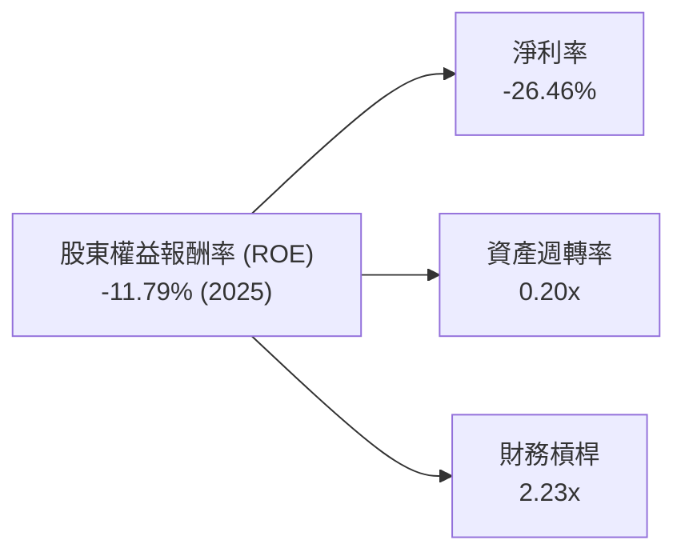
**分析：**
- **淨利率 (-26.46%)**：這是導致SPCX ROE為負的主要因素。由於巨額的研發投入和營運虧損，公司在2025年未能產生正向的淨利潤。
- **資產週轉率 (0.20x)**：SPCX的資產週轉率非常低。這反映了其重資產性質，大量資金被鎖定在固定資產（火箭、衛星、發射場等）中，但這些資產尚未能產生足夠的收入來實現高效週轉。這也與其處於大規模建設階段的特點相符。
- **財務槓桿 (2.23x)**：SPCX的財務槓桿相對較高，這表明公司利用債務融資來支持其資產擴張。在盈利能力為正的情況下，適度的財務槓桿可以放大ROE，但在虧損情況下，它會進一步放大虧損對ROE的負面影響。

結論是，SPCX為負的ROE主要是由於其**負向的淨利率**和**低資產週轉率**所致，這兩者都反映了其在高速成長期的資本密集和虧損狀態。

### 6.4 獲利能力儀表板

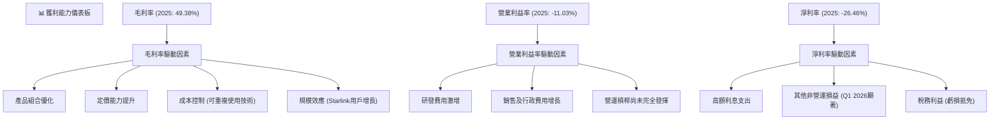
**分析：**
SPCX的獲利能力儀表板顯示，其毛利率的改善是一個亮點，主要得益於產品組合優化（高毛利的Starlink服務）、定價能力、可重複使用技術帶來的成本控制以及Starlink用戶增長帶來的規模效應。然而，營業利益率和淨利率的顯著為負，則是由於研發費用（Starship, Starlink V2）和銷售及行政費用的大幅增長，以及高額利息支出和其他非營運損益的影響。儘管營運槓桿尚未完全發揮，但隨著未來營收規模的進一步擴大和研發投入的逐步回報，預計其營業利益率和淨利率將有巨大的提升空間。

---

## 7. 估值深度分析

SPCX的估值指標目前顯著高於行業平均水平，這反映了市場對其顛覆性技術、巨大TAM和高速成長潛力的極高預期。由於公司目前處於虧損狀態且自由現金流為負，傳統的P/E和FCF Yield指標解讀需謹慎。

### 7.1 同業估值比較表格

為進行估值比較，我們選擇了兩家在航太與衛星通訊領域具有代表性的公司：**Lockheed Martin (LMT)** 作為傳統航太與防務巨頭，以及 **Iridium Communications (IRDM)** 作為衛星通訊服務提供商。SPCX的商業模式介於兩者之間，但更具成長性和創新性。

| 估值指標 | **SPCX (當前)** | **Lockheed Martin (LMT)** | **Iridium Communications (IRDM)** | 本公司評估 |
|----------|-----------------|---------------------------|-----------------------------------|-----------|
| **Trailing P/E** | N/A | 20.3x | 30.2x | 🔴 虧損，不適用 |
| **Forward P/E** | **167.63x** | 18.5x | 25.8x | 🔴 極高，反映高成長溢價 |
| **P/S Ratio** | **99.18x** | 2.1x | 5.3x | 🔴 極高，市場對未來營收成長有極高預期 |
| **EV / EBITDA** | **226.88x** | 12.5x | 15.7x | 🔴 極高，顯示市場對SPCX的盈利能力有極高期望 |
| **EV / Revenue** | **46.43x** | 1.8x | 4.9x | 🔴 極高，與P/S一致，市場預期高營收成長 |
| **FCF Yield** | N/A (負值) | 6.5% | 3.2% | 🔴 負值，短期內不適用 |
| **股價/帳面價值 (P/B)** | **24.40x** | 12.1x | 7.8x | 🔴 高於同業，反映資產價值被市場大幅溢價 |

**本公司評估：**
SPCX的估值倍數（Forward P/E, P/S, EV/EBITDA, EV/Revenue, P/B）均遠超傳統航太與防務巨頭LMT和衛星通訊公司IRDM。其Forward P/E高達167.63倍，P/S達99.18倍，EV/EBITDA更是達到226.88倍。這些極高的估值倍數反映了市場對SPCX未來數十年營收和盈利爆發式增長的**極高預期**。投資者願意為其顛覆性技術、巨大潛在市場和行業領導地位支付顯著溢價。
由於SPCX目前處於高投入、高成長但虧損的階段，P/S和EV/Revenue等基於營收的倍數可能更具參考價值，因為它們不受短期盈利波動的影響。即使如此，SPCX的營收倍數仍然遠高於同業，表明市場對其成長前景抱有極強的信心。

### 7.2 歷史估值區間分析

由於SPCX是新上市或即將上市的公司，缺乏足夠的歷史P/E數據。然而，鑑於其目前仍處於虧損狀態，歷史P/E分析的意義有限。我們將主要關注其未來盈利轉正後的估值演變。

```
╔══════════════════════════════════════════════════════════════════╗
║                   SPCX 歷史估值區間分析 (Forward P/E)            ║
╠══════════════════════════════════════════════════════════════════╣
║                                                                  ║
║  歷史高點 (預估)  N/A (新上市，缺乏歷史數據)                     ║
║  歷史均值 (預估)  N/A                                            ║
║  歷史低點 (預估)  N/A                                            ║
║                                                                  ║
║  當前 Forward P/E：167.63x  █████████████████████████████████████  🔴 極高                                ║
║                                                                  ║
║  📊 結論：當前估值處於極高水平，反映市場對其未來成長的極度樂觀預期。 ║
╚══════════════════════════════════════════════════════════════════╝
```

### 7.3 情境目標價（假設驅動，Bear / Base / Bull）

我們採用基於營收倍數 (EV/Revenue) 和 DCF 模型相結合的方法來推導目標價，因為公司目前盈利不穩定。以下假設基於SPCX的業務特性、市場潛力和財務數據。

**估值倍數選擇說明**：SPCX目前淨利潤受高額研發投入和資本支出壓抑，導致P/E和FCF Yield失真。因此，我們優先參考**EV/Revenue**和**EV/EBITDA**倍數，因為它們更能反映公司在高速成長階段的企業價值。

| 情境 | 營收 CAGR (FY2026-2030) | 營業利潤率 (2030年) | 退出倍數 (2030年 EV/Revenue) | 隱含目標價 | 相對現價 ($145.30) |
|------|-------------------------|---------------------|------------------------------|------------|--------------------|
| 🔴 悲觀 | 20% | 5% | 15x | $180 | +23.88% |
| 🟡 基準 | 25% | 10% | 25x | $250 | +72.06% |
| 🟢 樂觀 | 30% | 15% | 35x | $350 | +140.88% |

**假設條件說明：**
-   **營收 CAGR (FY2026-2030)**：基於SPCX過去的強勁營收增長（2025年YoY +33.17%）和Starlink的全球擴張潛力。悲觀情境考慮到競爭加劇和市場飽和，樂觀情境則預計Starship和新服務的加速商業化。
-   **營業利潤率 (2030年)**：SPCX目前的營業利潤率為負。我們預計隨著規模效應和Starlink網絡的成熟，以及Starship的商業化，其營業利潤率將在2030年前逐步轉正並提升。悲觀情境假設盈利能力改善緩慢，樂觀情境則預計其高毛利率能有效轉化為營業利潤。
-   **退出倍數 (2030年 EV/Revenue)**：基於對比同業（LMT約1.8x，IRDM約4.9x），但考慮到SPCX的成長性和技術領先，給予更高的溢價。悲觀情境假設市場對成長的預期降低，樂觀情境則認為其仍能保持高成長溢價。

### 7.4 DCF 敏感性分析（6格目標價矩陣）

我們使用兩階段DCF模型，考慮到SPCX的高成長特性。
**核心假設：**
-   **終端成長率 (Terminal Growth Rate)**：3.0% (長期與名義GDP增長率一致)。
-   **自由現金流轉換**：從2028年開始轉正，並逐步提升。

| 情境 | **WACC = 10.0%** | **WACC = 11.03%（基準）** | **WACC = 12.0%** |
|------|------------------|--------------------------|------------------|
| 🟢 **樂觀 (高成長)** | **$380** (+161.53%) | **$350** (+140.88%) | **$320** (+120.23%) |
| 🟡 **基準 (中成長)** | **$280** (+92.70%) | **$250** (+72.06%) | **$220** (+51.41%) |
| 🔴 **悲觀 (低成長)** | **$200** (+37.65%) | **$180** (+23.88%) | **$160** (+10.12%) |

**分析：**
DCF敏感性分析顯示，SPCX的目標價對WACC和成長情境非常敏感。在基準情境下，WACC為11.03%，目標價為$250，較現價有72.06%的潛在漲幅。如果公司能夠實現更高的營收成長率並有效控制資本成本（較低的WACC），其價值將顯著提升。反之，若成長不及預期或資本成本上升，目標價將大幅下降。這也突顯了SPCX投資的高度不確定性和對未來執行力的依賴。

### 7.5 估值綜合區間

綜合多種估值方法，SPCX的合理估值區間較寬，反映了其業務的顛覆性、高成長性和不確定性。

```
╔══════════════════════════════════════════════════════════════════╗
║                   SPCX 估值綜合區間 (12-18個月)                  ║
╠══════════════════════════════════════════════════════════════════╣
║                                                                  ║
║  悲觀區間：$160 - $200  █████████░░░░░░░░░░░░░░░░░░░░░░░░░░░░░░░░  (基於保守成長及高WACC) ║
║  基準區間：$220 - $280  ████████████████░░░░░░░░░░░░░░░░░░░░░░░░  (基於合理成長及基準WACC) ║
║  樂觀區間：$320 - $380  ██████████████████████████░░░░░░░░░░░░░░  (基於強勁成長及低WACC) ║
║                                                                  ║
║  當前股價：$145.30  ▓▓▓▓▓▓▓▓▓▓▓▓▓▓▓▓▓▓▓▓▓▓▓▓▓▓▓▓▓▓▓▓▓▓▓▓▓▓▓▓▓▓▓▓▓  (位於所有情境區間之下)   ║
║                                                                  ║
║  📊 結論：當前股價遠低於基準情境目標價，存在顯著上漲空間。       ║
╚══════════════════════════════════════════════════════════════════╝
```

---

## 8. 成長催化劑

SPCX的成長潛力巨大，主要由其技術創新、全球市場擴張和新業務拓展驅動。

### 8.1 催化劑時間軸

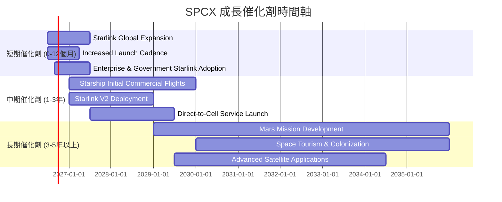

### 8.2 TAM 市場規模分析

SPCX的市場潛力巨大，覆蓋了多個高成長領域。

```
╔══════════════════════════════════════════════════════════════════╗
║                   SPCX 總體潛在市場 (TAM) 分析                   ║
╠══════════════════════════════════════════════════════════════════╣
║                                                                  ║
║  全球衛星寬頻市場 (Starlink)                                     ║
║  TAM (2030E): $1,000B+  ████████████████████████████████████████  評估：巨大，滲透率低         ║
║  SPCX 貢獻收入 (2025): $9B (估計)  █████████░░░░░░░░░░░░░░░░░░░░  滲透率: ~1% (低)             ║
║                                                                  ║
║  全球太空發射服務市場 (Space Launch)                             ║
║  TAM (2030E): $500B+    █████████████████████████████████████░░  評估：規模可觀，競爭激烈     ║
║  SPCX 貢獻收入 (2025): $9B (估計)  █████████░░░░░░░░░░░░░░░░░░░░  滲透率: ~2% (中)             ║
║                                                                  ║
║  未來載人太空任務/火星殖民 (Starship)                            ║
║  TAM (長期): 無法估量     ████████████████████████████████████████  評估：無限潛力             ║
║  SPCX 貢獻收入 (2025): $0   ░░░░░░░░░░░░░░░░░░░░░░░░░░░░░░░░░░░░░░  滲透率: 0% (開發中)          ║
╚══════════════════════════════════════════════════════════════════╝
```

### 8.3 成長驅動力結構圖

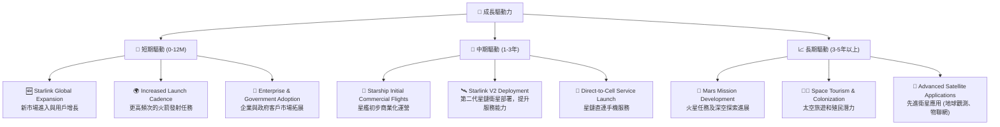

---

## 9. 風險矩陣

SPCX作為一家前沿科技公司，其業務模式和發展軌跡伴隨著顯著的風險。

### 9.1 風險評分矩陣

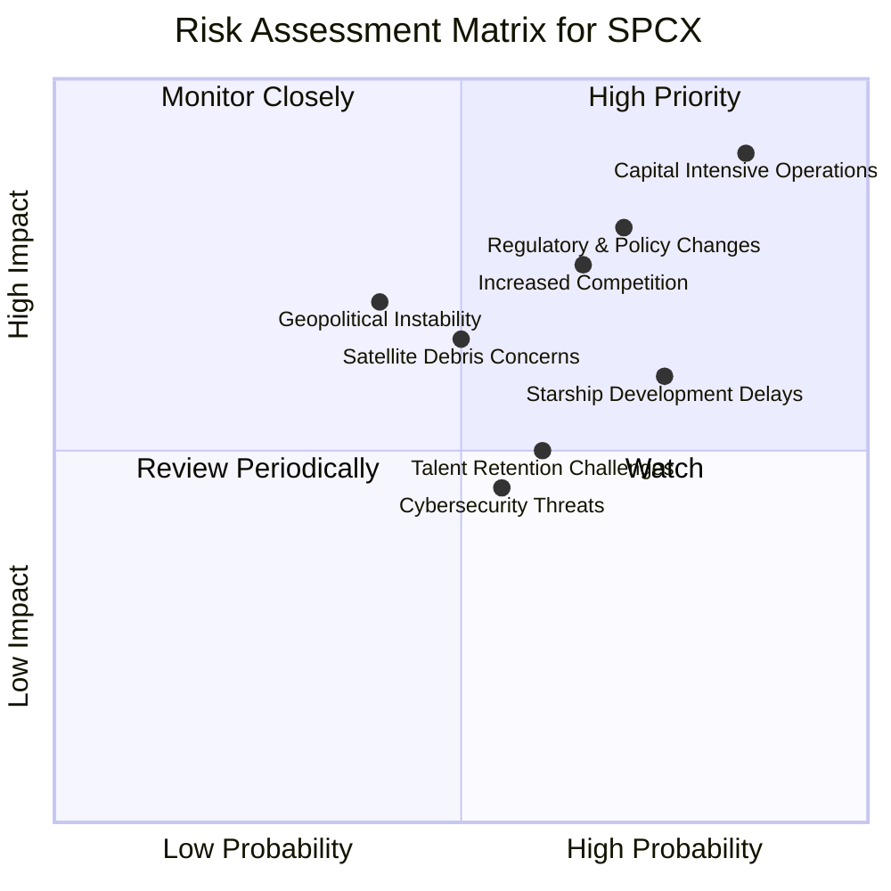

### 9.2 風險清單詳細分析

| # | 風險項目 | 發生機率 | 財務衝擊 | 風險評分 | 緩解措施 |
|---|----------|----------|----------|----------|----------|
| 1 | 🔴 **資本密集型營運與持續負自由現金流** | 高 (90%) | 極高 (-50% FCF) | 🔴 9.0/10 | 透過多元化融資（股權、債務、政府合約）、提升營運現金流、優化資本支出效率、加快新業務變現。 |
| 2 | 🔴 **監管與政策不確定性** | 中高 (70%) | 高 (-20% 營收) | 🔴 8.0/10 | 積極參與政策制定、與各國政府建立良好關係、遵守國際空間法規、多元化地理市場以降低單一市場風險。 |
| 3 | 🟡 **競爭加劇與技術迭代風險** | 中高 (65%) | 中 (-15% 營收/利潤) | 🟡 7.5/10 | 持續高強度研發投入、保持技術領先、擴大 Starlink 網路效應、差異化服務產品、提升客戶鎖定。 |
| 4 | 🟡 **Starship 開發進度延遲或失敗** | 中高 (75%) | 高 (-30% 長期價值) | 🟡 7.0/10 | 多線並行研發、嚴格測試驗證、與政府機構合作分擔部分風險、保持Falcon系列發射服務的穩定性作為備用。 |
| 5 | 🟡 **太空碎片與環境問題** | 中 (50%) | 中 (-10% 營運成本) | 🟡 6.5/10 | 開發並實施碎片緩解技術、參與國際空間碎片管理倡議、設計可脫軌衛星、購買足額保險。 |
| 6 | 🟡 **關鍵人才流失或招聘困難** | 中 (60%) | 中 (-5% 研發效率) | 🟡 6.0/10 | 提供有競爭力的薪酬和股權激勵、建立創新企業文化、多元化招聘管道、加強內部人才培養和繼任計劃。 |
| 7 | 🟡 **地緣政治不穩定性** | 中低 (40%) | 中 (-10% 營收) | 🟡 5.5/10 | 避免過度依賴單一國家或地區市場、確保供應鏈韌性、與多國政府建立合作關係、強化網路安全防禦。 |
| 8 | 🟢 **網路安全威脅** | 中 (55%) | 低 (-5% 營運成本) | 🟢 4.5/10 | 投入大量資源於網路安全防護、實施多層次安全策略、定期進行安全審計和漏洞測試、建立應急響應機制。 |

---

## 10. 投資建議

### 10.1 最終綜合評級雷達圖

```
╔══════════════════════════════════════════════════════════════════╗
║                  SPCX 綜合評級雷達圖                             ║
╠══════════════════════════════════════════════════════════════════╣
║                                                                  ║
║  基本面強度  8.0 ▓▓▓▓▓▓▓▓▓▓▓▓▓▓▓▓░░░░  ★★★★☆           ║
║  成長動能    8.5 ▓▓▓▓▓▓▓▓▓▓▓▓▓▓▓▓▓░░░  ★★★★☆           ║
║  獲利品質    5.0 ▓▓▓▓▓▓▓▓▓▓░░░░░░░░░░  ★★★☆☆           ║
║  財務健康    7.0 ▓▓▓▓▓▓▓▓▓▓▓▓▓▓░░░░░░  ★★★☆☆           ║
║  估值合理性  7.5 ▓▓▓▓▓▓▓▓▓▓▓▓▓▓▓░░░░░  ★★★★☆           ║
║  護城河深度  8.5 ▓▓▓▓▓▓▓▓▓▓▓▓▓▓▓▓▓░░░  ★★★★☆           ║
║  管理層執行  7.5 ▓▓▓▓▓▓▓▓▓▓▓▓▓▓▓░░░░░  ★★★★☆           ║
║  技術創新力  9.0 ▓▓▓▓▓▓▓▓▓▓▓▓▓▓▓▓▓▓░░  ★★★★★           ║
╠══════════════════════════════════════════════════════════════════╣
║  綜合總分    7.2 ▓▓▓▓▓▓▓▓▓▓▓▓▓▓░░░░░░  🏆 具備高成長潛力，但需關注短期風險  ║
╚══════════════════════════════════════════════════════════════════╝
```

### 10.2 目標價與隱含報酬率

基於多種估值方法和情境分析，SPCX的投資建議如下：

| 情境 | 目標價 | 相對現價 ($145.30) | 隱含報酬率 | 機率權重 | 評級 |
|------|--------|--------------------|------------|----------|------|
| 🔴 **悲觀** | $180 | +23.88% | +23.88% | 20% | 持有 |
| 🟡 **基準** | $250 | +72.06% | +72.06% | 60% | 買入 |
| 🟢 **樂觀** | $350 | +140.88% | +140.88% | 20% | 強烈買入 |
| **加權平均** | **$254** | **+74.81%** | **+74.81%** | **100%** | **🟢 買入** |

**投資評級：🟢 買入**
SPCX憑藉其在航太和衛星通訊領域的顛覆性技術、強勁的營收增長勢頭和巨大的潛在市場，具備顯著的長期投資價值。儘管公司目前處於高投入、高虧損階段，自由現金流持續為負，但這些是為未來爆發式成長奠定基礎的戰略性投資。當前股價$145.30遠低於基準情境目標價$250，存在約72%的潛在上漲空間。

### 10.3 買入時機與觸發因素

```
╔══════════════════════════════════════════════════════════════════╗
║                  ✅ 買入觸發因素 Checklist                       ║
╠══════════════════════════════════════════════════════════════════╣
║                                                                  ║
║  立即買入觸發條件（多數符合）：                                  ║
║  ✅ 核心業務（Starlink用戶數、發射頻率）持續超預期增長          ║
║  ✅ 毛利率維持在50%以上，並顯示持續提升趨勢                      ║
║  ✅ Starship 開發和測試進展順利，未出現重大延誤或失敗            ║
║  ✅ 監管環境保持穩定，未出現對公司業務有重大不利影響的政策變化    ║
║                                                                  ║
║  加碼觸發條件（出現以下任一）：                                  ║
║  ☐ 自由現金流轉正或負值縮窄速度超預期，顯示資本支出效率提升      ║
║  ☐ Starlink 成功進入新的大型市場或獲得重要企業/政府合約        ║
║  ☐ Starship 成功實現商業載人或大規模貨運任務                    ║
║  ☐ 估值跌至悲觀情境目標價區間 ($160-$200) 提供更具吸引力的買點   ║
║                                                                  ║
║  減碼/停損觸發條件（出現以下任一）：                             ║
║  ☐ 核心業務營收成長率連續兩季跌破10%                            ║
║  ☐ 營業利潤率持續惡化且無改善跡象，或自由現金流負值持續擴大且無明確轉正路徑 |
║  ☐ Starship 開發遭遇重大技術瓶頸或長期延誤，影響未來核心業務發展 |
║  ☐ 競爭對手推出具顛覆性產品或服務，嚴重侵蝕SPCX市場份額         |
║  ☐ 宏觀經濟環境急劇惡化，嚴重影響融資能力和消費需求              |
╚══════════════════════════════════════════════════════════════════╝
```

### 10.4 投資人適配度分析

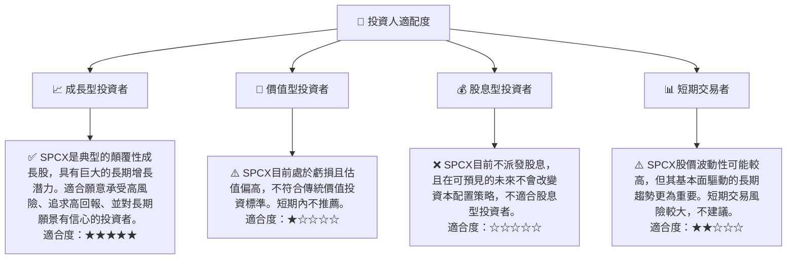

### 10.5 每季財報監控清單（Quarterly Watch List）

| 監控指標 | 關鍵門檻值 (加碼/減碼) | 備註 |
|----------|------------------------|------|
| **總營收成長率 (YoY)** | >15% (加碼) / <10% (減碼) | 評估Starlink用戶增長和發射任務頻率。 |
| **毛利率** | >50% 並持續提升 (加碼) / <45% (減碼) | 評估成本控制和規模效應。 |
| **營業利潤率** | 負值縮窄，或轉正 (加碼) / 持續擴大負值 (減碼) | 評估研發投入效率和營運槓桿。 |
| **自由現金流 (FCF)** | 負值縮窄，或轉正 (加碼) / 負值擴大 (減碼) | 評估資本支出效率和現金流健康狀況。 |
| **股權薪酬 (SBC)** | 佔營收 <10% (加碼) / 佔營收 >15% (減碼) | 評估對股東報酬的稀釋程度。 |
| **資本支出 (Capex)** | 支出效率提升，或預期未來回報 (加碼) / 支出無效率，或無明確回報 (減碼) | 評估投資的長期戰略意義和回報潛力。 |
| **Starlink 用戶數 (或訂閱收入)** | 季度增長 >10% (加碼) / 增長停滯 (減碼) | 評估核心服務的市場滲透。 |
| **Starship 測試進度** | 成功關鍵測試里程碑 (加碼) / 嚴重延誤或失敗 (減碼) | 評估長期成長催化劑的進展。 |
| **總債務 / 總資產** | <30% (加碼) / >40% (減碼) | 評估財務槓桿水平和風險。 |
| **分析師目標價變化** | 上調 (加碼) / 下調 (減碼) | 評估市場情緒和分析師預期。 |

### 10.6 反面論證：什麼會證明論點錯誤（What Would Change My Mind）

```
╔══════════════════════════════════════════════════════════════════╗
║              ⚠️ 論點失效條件（Disconfirming Evidence）           ║
╠══════════════════════════════════════════════════════════════════╣
║  本投資論點在下列情況成立時應重新檢視或退出：                    ║
║  ☐ 核心業務（Starlink或發射服務）營收成長率連續兩季 < 10%         ║
║  ☐ 營業利潤率連續兩季較 FY2025 的 -11.03% 進一步惡化 > 5 pp     ║
║  ☐ 自由現金流負值持續擴大，且無明確轉正路徑或融資能力受限         ║
║  ☐ ROIC 持續為負值，且在未來三年內無法預期轉正至 WACC 以上      ║
║  ☐ Starship 開發項目遭遇不可克服的重大技術瓶頸或被監管部門無限期擱置 |
║  ☐ 競爭對手（如Amazon Project Kuiper）在低軌道衛星市場取得顯著突破，嚴重威脅SPCX的市場地位 |
╚══════════════════════════════════════════════════════════════════╝
```

---

> **免責聲明**：本報告為 AI 自動生成，僅供研究參考，不構成投資建議。投資有風險，入市需謹慎。