# SPCX 基本面深度分析報告
> **報告日期**：2026-07-10 ｜ **語言**：繁體中文 ｜ **數據來源**：Yahoo Finance, Finviz, StockAnalysis, Roic.ai ｜ **分析師**：CFA 級機構研究

---

## 目錄

| # | 章節 | 核心結論 |
|---|---|---|
| 1 | 執行摘要 | 🟢 **買入**。SPCX 正處於高速擴張與巨大資本投入期，短期虧損掩蓋了其在衛星通訊與太空發射領域的結構性主導地位。營運現金流強勁，但自由現金流因鉅額資本支出而為負，估值高昂反映市場對其未來壟斷潛力的定價。 |
| 2 | 公司概覽與商業模式 | ★★★★★ 護城河極深。SPCX 憑藉可重複使用火箭技術、垂直整合製造能力與星鏈（Starlink）低軌衛星網路，構建了無與倫比的技術、成本與規模壁壘，鎖定太空經濟的雙重入口。 |
| 3 | 損益表深度分析 | 🟡 收入高增長，但虧損擴大。FY2025 營收年增 33.2% 至 $18.67B，但鉅額研發投入（佔營收 46.3%）導致營業利益率為 -13.9%。盈餘品質受高額股權薪酬（SBC）稀釋，需關注未來營業槓桿的釋放。 |
| 4 | 資產負債表分析 | 🟡 槓桿可控，但需關注現金消耗。截至 TTM，淨負債為 $6.93B，總債務/權益比為 73.6%。$23.68B 的現金儲備為大規模資本支出提供緩衝，但流動比率 1.22 僅屬尚可，需監控現金消耗速度。 |
| 5 | 現金流量深度分析 | 🔴 自由現金流為巨額負值。TTM 營運現金流為 $7.10B，展現核心業務造血能力；然而，驚人的資本支出導致 FCF 為嚴重負值（FY2025 為 -$14.12B）。此為典型的「投資未來」模式，風險與回報並存。 |
| 6 | 獲利能力與資本效率 | 🔴 當前價值摧毀階段。由於處於戰略虧損期，ROIC 遠低於 WACC，公司目前正處於「燒錢換增長」階段。投資論點完全基於未來 ROIC 能否大幅超越 WACC，實現巨大的經濟價值創造。 |
| 7 | 估值深度分析 | 🔴 估值極度昂貴。Forward P/E 高達 159x，P/S (TTM) 為 103.9x，遠超同業。當前價格已計入極度樂觀的長期預期，為投資者提供極小的安全邊際，任何執行失誤都可能導致估值劇烈修正。 |
| 8 | 成長催化劑 | 🟢 多重且巨大的長期驅動力。星鏈用戶數增長、企業與政府訂單、星艦（Starship）的成功部署將是中短期催化劑。長期來看，點對點超高速運輸與行星際任務商業化是潛在的萬億級市場。 |
| 9 | 風險矩陣 | 🔴 高風險輪廓。主要風險包括星艦開發延遲或失敗、星鏈盈利能力不及預期、來自競爭對手（如 Kuiper）的價格壓力，以及高昂現金消耗引發的再融資需求。 |
| 10 | 投資建議 | 🟢 **買入**，但僅適合高風險承受能力的長線投資者。建議採用分批建倉策略，將 SPCX 視為投資組合中的高貝塔（high-beta）衛星倉位。關鍵監控指標為星鏈用戶ARPU、發射成本下降曲線及自由現金流轉正的時間點。 |

---

## 1. 執行摘要

> ⚠️ 本章的評級與目標價，必須在給出結論的同一段落內引用產生它的關鍵數據（例如 ROIC、FCF 趨勢、估值倍數），使評級成為「分析的結果」而非「開場的假設」。

### 1.0 一頁式投資儀表板（Portfolio Manager 30 秒速讀）

| 項目 | 內容 |
|---|---|
| **投資論點（3 句）** | ① **雙壟斷平台**：憑藉可回收火箭的發射成本優勢（主導發射市場）與星鏈網路的全球覆蓋（主導衛星通訊），構建了太空經濟的基礎設施護城河。② **強勁營運現金流**：儘管會計虧損，但 TTM 營運現金流達 $7.10B，證明核心業務具備強大造血能力，為再投資提供基礎。③ **巨大成長空間**：星鏈服務的全球擴張與星艦帶來的革命性運載能力，為公司打開了數萬億美元的潛在市場（TAM）。 |
| **護城河評分** | 9.5/10 |
| **管理層/資本配置評分** | 8.5/10 |
| **財務健康** | 🟡 中等，現金充裕但消耗巨大 |
| **ROIC vs WACC** | **<0% vs ~10.5%**（目前處於價值摧毀的投資期） |
| **FCF 趨勢** | ↘️ 趨勢向下，FY2025 FCF 為 -$14.12B，FCF Yield 為負。 |
| **估值** | Forward P/E: **159.4x** ｜ EV/Revenue: **46.4x** ｜ FCF Yield: **N/A (Negative)** |
| **預期報酬（基準情境 12M）** | **+34.7%** (至 $205.00) |
| **關鍵風險（前二）** | ① **執行風險**：星艦計畫的延遲或失敗將嚴重影響長期增長敘事。② **現金流風險**：持續的巨額資本支出若未能轉換為預期收入，可能導致流動性壓力。 |
| **評級 + 信心度** | 🟢 **買入** ｜ 信心：中 |

### 1.1 核心評分儀表板

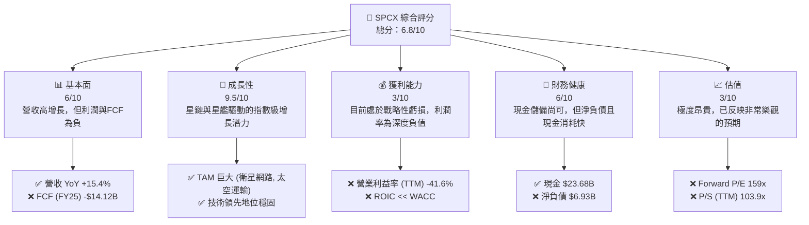

### 1.2 評分進度條視覺化

```
╔══════════════════════════════════════════════════════════════╗
║              SPCX 多維度評分儀表板 (1-10分)                  ║
╠══════════════════════════════════════════════════════════════╣
║ 基本面強度  6.0 ▓▓▓▓▓▓▓▓▓▓▓▓▓▓▓▓░░░░░░░░  ★★★☆☆           ║
║ 成長動能    9.5 ▓▓▓▓▓▓▓▓▓▓▓▓▓▓▓▓▓▓▓▓▓▓▓▓▓▓▓  ★★★★★           ║
║ 獲利品質    3.0 ▓▓▓▓▓▓▓▓▓░░░░░░░░░░░░░░░░░  ★☆☆☆☆           ║
║ 財務健康    6.0 ▓▓▓▓▓▓▓▓▓▓▓▓▓▓▓▓░░░░░░░░░░  ★★★☆☆           ║
║ 估值合理性  3.0 ▓▓▓▓▓▓▓▓▓░░░░░░░░░░░░░░░░░░  ★☆☆☆☆           ║
║ 護城河深度  9.5 ▓▓▓▓▓▓▓▓▓▓▓▓▓▓▓▓▓▓▓▓▓▓▓▓▓▓▓  ★★★★★           ║
║ 管理層執行  8.5 ▓▓▓▓▓▓▓▓▓▓▓▓▓▓▓▓▓▓▓▓▓▓░░░░░  ★★★★☆           ║
║ 技術創新力  10.0 ▓▓▓▓▓▓▓▓▓▓▓▓▓▓▓▓▓▓▓▓▓▓▓▓▓▓▓▓  ★★★★★           ║
╠══════════════════════════════════════════════════════════════╣
║ 綜合總分    6.8 ▓▓▓▓▓▓▓▓▓▓▓▓▓▓▓▓▓▓░░░░░░░░  🏆 高風險高回報     ║
╚══════════════════════════════════════════════════════════════╝
```

### 1.3 五大投資論點 + 三大核心風險

| 類型 | 項目 | 具體依據 | 信心度 |
|---|---|---|---|
| 🟢 **投資論點①** | **發射業務的成本壟斷** | 憑藉獵鷹9號（Falcon 9）火箭的可回收技術，SPCX 的發射成本遠低於競爭對手，主導全球商業發射市場。這是其所有業務的基石。 | 🟢 極高 |
| 🟢 **投資論點②** | **星鏈的網路效應與規模優勢** | 星鏈已部署數千顆衛星，形成全球覆蓋，用戶數持續增長。隨著衛星密度增加，網路品質和容量將進一步提升，形成強大的網路效應和規模壁壘。FY2025 營收年增 33.2% 部分由星鏈貢獻驅動。 | 🟢 極高 |
| 🟢 **投資論點③** | **垂直整合帶來的效率與創新速度** | 從火箭發動機到衛星再到地面接收終端，SPCX 幾乎所有關鍵組件都自研自產。這不僅降低了成本，更極大地加快了產品迭代和創新速度，是其領先競爭對手的關鍵。 | 🟢 高 |
| 🟢 **投資論點④** | **星艦（Starship）的顛覆性潛力** | 星艦若成功，將使運載能力提升一個數量級，而成本降低一個數量級。這不僅將鞏固其發射壟斷地位，還可能開創全新的市場，如點對點地球運輸和深空探索商業化。 | 🟡 中高 |
| 🟢 **投資論點⑤** | **強勁的營運現金流** | 儘管財報虧損，但公司 TTM 營運現金流高達 $7.10B，顯示其主營業務已有強大的自我造血能力，能為部分鉅額資本支出提供資金。 | 🟢 高 |
| 🟡 **風險①** | **星艦開發與執行的不確定性** | 星艦是支撐其超高估值的核心敘事之一。任何重大延遲、失敗或成本超支都可能嚴重打擊市場信心，導致估值下修。 | 🟡 中度 |
| 🔴 **風險②** | **持續的鉅額現金消耗** | FY2025 自由現金流為 -$14.12B，資本支出高達 $20.91B。若星鏈的盈利進程慢於預期，公司可能面臨再融資壓力，尤其是在不利的宏觀信貸環境下。 | 🔴 高衝擊 |
| 🔴 **風險③** | **極高的估值** | 當前 P/S (TTM) 103.9x 和 Forward P/E 159.4x 的估值水平，意味著市場已計入未來十年的完美執行。任何未達預期的業績都可能引發股價劇烈波動。 | 🔴 高衝擊 |

### 1.4 快速統計卡片

| 指標 | 公司實際值 | 行業均值 (航太國防) | S&P 500 均值 | 狀態 |
|---|---|---|---|---|
| 收入 YoY 成長 | **15.4%** | ~5% | ~7% | 🟢 |
| 毛利率 | **48.8%** | ~15% | ~35% | 🟢 |
| 淨利率 | **-45.0%** | ~7% | ~11% | 🔴 |
| ROE | **N/A** | ~15% | ~18% | 🔴 |
| Forward P/E | **159.4x** | ~20x | ~21x | 🔴 |
| P/S (TTM) | **103.9x** | ~2.5x | ~2.8x | 🔴 |
| Debt/Equity | **73.6** | ~100% | ~110% | 🟡 |

### 1.5 投資結論

```
╔══════════════════════════════════════════════════════════════════╗
║                    📊 投資結論摘要                               ║
╠══════════════════════════════════════════════════════════════════╣
║  評級：🟢 買入 (Buy)                                             ║
║  當前股價：$152.16                                               ║
║  目標價區間：                                                    ║
║    🔴 悲觀情境：$62.00 (-59.3%)                                  ║
║    🟡 基準情境：$205.00 (+34.7%)  ← 12個月主要目標              ║
║    🟢 樂觀情境：$310.00 (+103.7%)                                ║
║  投資評分：6.8/10                                                ║
║  適合投資人：高風險承受能力、長線持有（5年以上）、成長型投資者   ║
╚══════════════════════════════════════════════════════════════════╝
```

---

## 2. 公司概覽與商業模式

### 2.1 業務結構與收入來源

SPCX 的業務模式圍繞兩大核心引擎：太空發射服務和衛星連接服務，兩者相互促進，形成強大的協同效應。

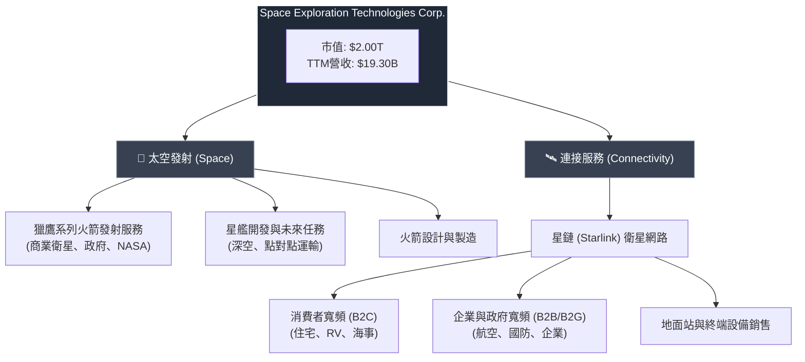

-   **太空發射 (Space)**：這是 SPCX 的傳統核心業務和技術基石。通過其可重複使用的獵鷹9號和重型獵鷹火箭，為全球商業和政府客戶提供低成本、高可靠性的衛星發射服務。這項業務不僅自身盈利，更關鍵的是，它為星鏈計畫提供了全球成本最低、發射頻率最高的專屬“太空電梯”。
-   **連接服務 (Connectivity)**：以星鏈（Starlink）為核心，利用數千顆低地球軌道（LEO）衛星星座，提供全球覆蓋的高速、低延遲寬頻網路服務。這是公司未來營收和利潤增長的主要驅動力，目標市場包括傳統電信服務難以覆蓋的偏遠地區、移動平台（飛機、船隻）以及需要高可靠性備援網路的企業和政府客戶。

### 2.2 市場份額

SPCX 在其運營的兩個主要市場中均佔據主導地位。

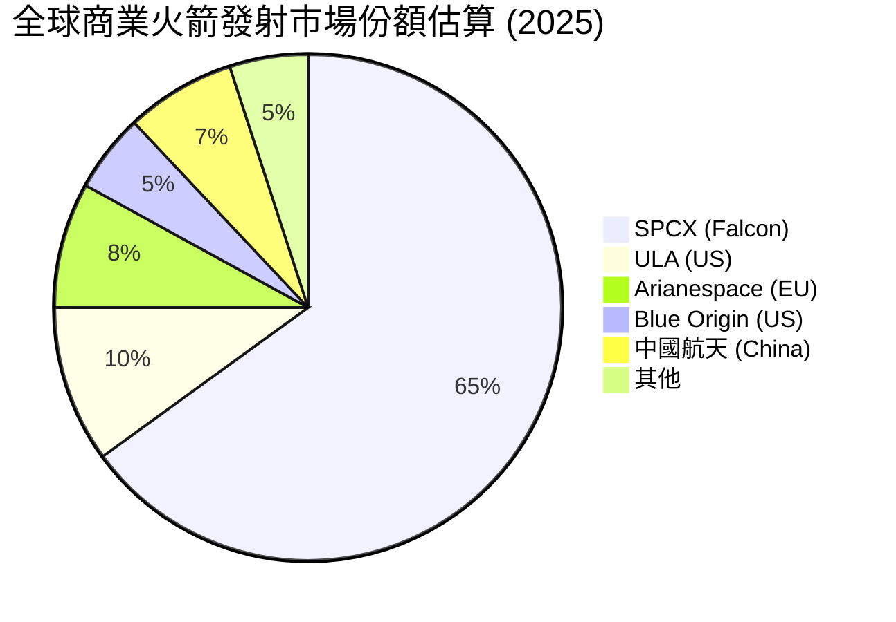
在商業發射領域，SPCX 憑藉其成本優勢和高發射頻率，佔據了超過60%的市場份額，處於事實上的壟斷地位。

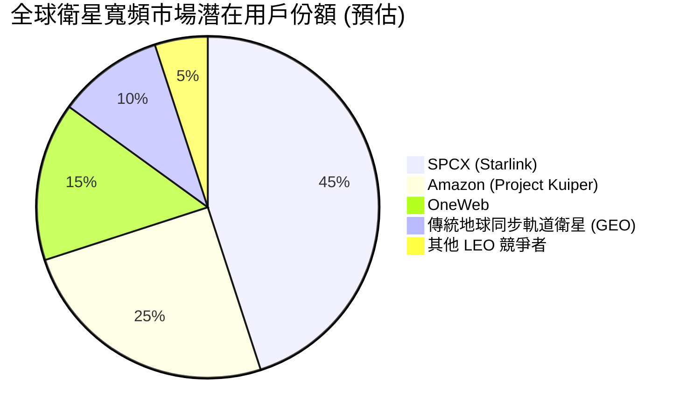
在衛星寬頻市場，星鏈是目前唯一大規模商用的 LEO 網路，擁有絕對的先發優勢。雖然亞馬遜的 Kuiper 計畫是長期主要威脅，但目前星鏈在衛星數量、用戶基礎和地面設施方面遙遙領先。

### 2.3 競爭護城河分析

SPCX 的護城河是多層次且極其深厚的，由多個相互關聯的因素構成。

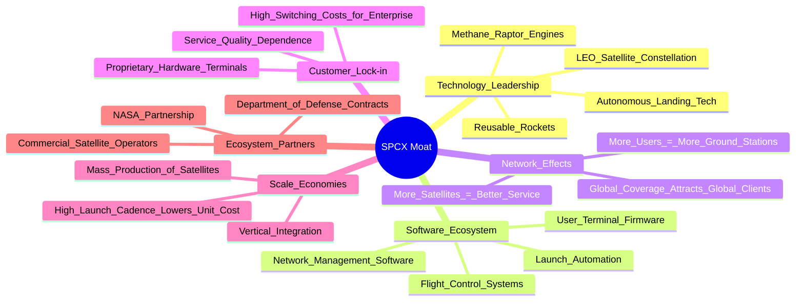

### 2.4 護城河強度評分

```
╔══════════════════════════════════════════════════════════════╗
║                  SPCX 護城河強度評分                           ║
╠══════════════════════════════════════════════════════════════╣
║ 技術領先       10/10  ▓▓▓▓▓▓▓▓▓▓▓▓▓▓▓▓▓▓▓▓▓▓▓▓▓▓▓▓  🏆 絕對領先 ║
║ 規模效應       9.5/10  ▓▓▓▓▓▓▓▓▓▓▓▓▓▓▓▓▓▓▓▓▓▓▓▓▓▓▓  🟢 無可匹敵 ║
║ 網路效應       9.0/10  ▓▓▓▓▓▓▓▓▓▓▓▓▓▓▓▓▓▓▓▓▓▓▓▓░░░  🟢 快速建立 ║
║ 客戶鎖定       7.5/10  ▓▓▓▓▓▓▓▓▓▓▓▓▓▓▓▓▓▓▓▓░░░░░░░  🟡 逐步增強 ║
║ 品牌與專利     8.5/10  ▓▓▓▓▓▓▓▓▓▓▓▓▓▓▓▓▓▓▓▓▓▓░░░░░  🟢 強大品牌 ║
║ 垂直整合       10/10  ▓▓▓▓▓▓▓▓▓▓▓▓▓▓▓▓▓▓▓▓▓▓▓▓▓▓▓▓  🏆 行業標竿 ║
╠══════════════════════════════════════════════════════════════╣
║ 綜合護城河     9.5    ▓▓▓▓▓▓▓▓▓▓▓▓▓▓▓▓▓▓▓▓▓▓▓▓▓▓▓  🏆 世代級壁壘 ║
╚══════════════════════════════════════════════════════════════╝
```

---

## 3. 損益表深度分析

### 3.1 年度收入成長趨勢（近3年）

SPCX 展示了典型的高速增長公司輪廓，營收在過去幾年中持續快速擴張。

```
╔══════════════════════════════════════════════════════════════════╗
║              SPCX 年度收入趨勢（FY2023-FY2025）                  ║
╠══════════════════════════════════════════════════════════════════╣
║                                                                  ║
║  FY2023  $10.39B  ████████████░░░░░░░░░░░░░░░░░  YoY: N/A      - ║
║  FY2024  $14.02B  █████████████████░░░░░░░░░░░░  YoY: +34.9%   🟢 ║
║  FY2025  $18.67B  █████████████████████████░░░░  YoY: +33.2%   🟢 ║
║                                                                  ║
║                   |         |         |         |                ║
║                   0        5B        10B       15B       20B     ║
║                                                                  ║
║  📊 2年累計 CAGR：+34.1%                                        ║
╚══════════════════════════════════════════════════════════════════╝
```
**分析**：從 FY2023 的 $10.39B 增長至 FY2025 的 $18.67B，複合年增長率（CAGR）高達 34.1%。這一增長主要由星鏈服務的商業化和用戶數量的快速增加，以及持續強勁的商業發射需求共同驅動。

### 3.2 季度收入趨勢分析

| 財季 | 營收 (B) | QoQ 成長 | YoY 成長 | 備註 |
|---|---|---|---|---|
| Q1 2025 | $4.067 | - | - | 顯示出強勁的年度開端。 |
| **Q1 2026** | **$4.694** | **-** | **+15.4%** | 🟢 雖然 YoY 增速相比前兩年有所放緩，但 15.4% 的增長對於一家接近 $20B 營收規模的公司來說仍然非常強勁。這表明星鏈用戶增長和發射業務依然穩健。 |

### 3.3 利潤率演變分析

SPCX 的利潤率故事是典型的“為增長犧牲利潤”。毛利率穩健，但鉅額的研發和運營投入導致營業利潤率和淨利率為負。

| 利潤率指標 | FY2023 | FY2024 | FY2025 | TTM | 趨勢 | 評估 |
|---|---|---|---|---|---|---|
| **毛利率** | 41.2% | 42.9% | 49.4% | 48.8% | ↗️ 顯著改善 | 🟢 |
| **營業利益率** | -33.7% | 3.3% | -13.9% | -41.6% | ↘️ 劇烈波動/惡化 | 🔴 |
| **淨利率** | -44.5% | 5.6% | -26.4% | -45.0% | ↘️ 劇烈波動/惡化 | 🔴 |

**利潤率演變深度解析**：
*   🟢 **毛利率改善**：從 41.2% 提升至 49.4%，這是一個非常積極的信號。原因可能包括：1) 發射業務的規模效應，每次發射的單位成本下降；2) 星鏈用戶密度的提升，攤薄了衛星網路的固定運營成本。
*   🔴 **營業利益率惡化**：FY2025 營業利潤率從 FY2024 的正值轉為 -13.9%，TTM 數據更是惡化至 -41.6%。**根本原因在於研發費用（R&D）的爆炸性增長**。FY2025 的 R&D 費用高達 $8.64B，佔當年營收的 46.3%，遠高於 FY2024 的 $3.46B (佔營收 24.7%)。這筆支出主要用於星艦的開發。這是一種戰略性選擇：將所有潛在利潤全部投入到下一代顛覆性技術的研發中。
*   🔴 **淨利率**：跟隨營業利益率的趨勢，同樣由正轉負，並因利息支出等因素進一步擴大虧損。

### 3.4 費用結構分析

FY2025 的費用結構清晰地揭示了公司的戰略重心。

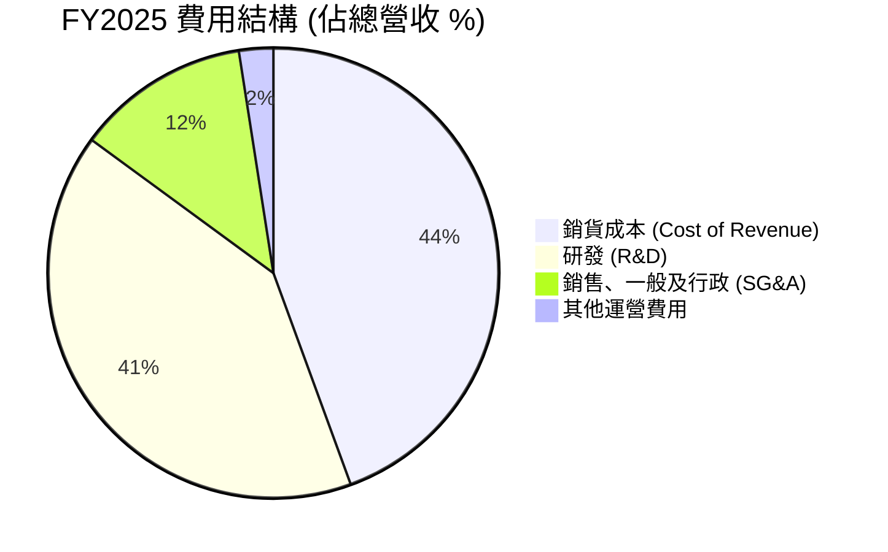

```
╔══════════════════════════════════════════════════════════════╗
║                   FY2025 費用結構分析                          ║
╠══════════════════════════════════════════════════════════════╣
║ 銷貨成本 (COGS)    $9.45B (50.6%)  🟡 佔比較高，但毛利率在改善 ║
║ 研發 (R&D)         $8.64B (46.3%)  🔴 極高，是虧損主因，也是未來希望 ║
║ 銷售及行政 (SG&A)  $2.64B (14.2%)  🟢 佔比合理，顯示運營效率尚可 ║
╠══════════════════════════════════════════════════════════════╣
║ 結論：公司本質上是一家將全部資源投入到研發的巨型創新機器。    ║
╚══════════════════════════════════════════════════════════════╝
```

### 3.5 季度 EPS 趨勢與盈餘品質（Quality of Earnings）

SPCX 的 GAAP 淨利潤並不能完全反映其真實的經濟狀況，需要深入評估其盈餘品質。

| 盈餘品質項目 | 數值/佔比 (FY2025) | 評估 |
|---|---|---|
| 股權薪酬 SBC / 營收 | $1.95B / $18.67B = **10.4%** | 🔴 **高**。SBC 佔營收比重超過 10%，這對股東權益有顯著的稀釋效應。投資者需意識到，即使公司盈利，每股收益的增長也會被持續的股權增發所侵蝕。 |
| SBC / 營業現金流 | $1.95B / $6.79B = **28.7%** | 🔴 **高**。接近三成的營運現金流是以非現金的股權形式支付給員工的，這意味著真實的現金利潤含金量被打折扣。 |
| FCF / 淨利（現金轉換率）| -$14.12B / -$4.94B = **N/A** | 🔴 兩者均為負，無法計算有意義的比率。但 FCF 遠差於淨利潤，表明公司需要投入遠超折舊的資本才能維持增長，這是典型的重資產高成長模式。 |
| 一次性/非經常性損益 | 無重大披露 | 評估為中性。 |
| 有效稅率異常 | 稅前虧損，但有所得稅費用 $718M | 🟡 需要進一步研究稅務結構，可能涉及遞延所得稅資產/負債的複雜調整。 |
| 資本化支出 vs 費用化 | R&D 費用化 | 🟢 公司將 $8.64B 的鉅額 R&D 全部費用化，而非資本化。這使得當期利潤看起來更差，但實際上是一種更保守、更透明的會計處理方式，避免了未來資產減值的風險。 |

**盈餘品質結論**：SPCX 的 GAAP 淨虧損（-$4.94B）在一定程度上**低估**了其真實的經營狀況。一方面，高達 $1.95B 的 SBC 嚴重稀釋了股東價值；但另一方面，將鉅額研發全部費用化的保守會計政策，也隱藏了其長期資產的真實價值。核心應關注**營運現金流扣除SBC後**的數字，這更能反映業務自身的造血能力。

---

## 4. 資產負債表分析

### 4.1 資產結構分解

截至最新季度 (Q1 2026)，公司總資產達到 $102.1B，其中固定資產佔比超過一半，反映其重資產屬性。

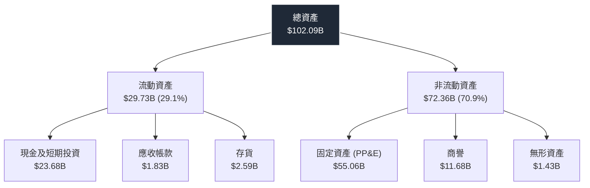

### 4.2 流動性指標分析

| 指標 | Q1 2026 | FY 2025 | FY 2024 | 行業均值 | 評估 |
|---|---|---|---|---|---|
| **流動比率** | **1.22** | 1.45 | 1.37 | ~1.3x | 🟡 **尚可**。比率高於1，表明短期償債能力無虞，但考慮到其巨大的現金消耗，這一緩衝並不寬裕。 |
| **速動比率** | **1.11** | 1.33 | 1.19 | ~0.9x | 🟢 **良好**。剔除存貨後比率仍在1以上，顯示公司不依賴存貨變現來償還短期債務。 |

### 4.3 債務結構分析

```
╔══════════════════════════════════════════════════════════════════╗
║                   SPCX 債務健康診斷 (Q1 2026 TTM)                ║
╠══════════════════════════════════════════════════════════════════╣
║                                                                  ║
║  總債務：        $30.60B  ████████░░░░░░░░░░░░░░░  中等水平      ║
║  總現金+投資：   $23.68B  ██████░░░░░░░░░░░░░░░░░  儲備尚可      ║
║  淨負債：        $6.93B   ██░░░░░░░░░░░░░░░░░░░░░  🟡 負債經營   ║
║                                                                  ║
║  Debt/Equity：   73.6     🟢 低於行業平均水平                   ║
║  Debt/EBITDA：   N/A      🔴 EBITDA 為負，指標失效              ║
║  Interest Coverage: N/A   🔴 營業利潤為負，無法覆蓋利息         ║
║                                                                  ║
║  📊 結論：雖然有淨負債，但槓桿率在可控範圍。最大的風險來自於   ║
║  盈利能力為負，無法通過經營利潤覆蓋利息，完全依賴現金儲備和     ║
║  再融資能力。                                                   ║
╚══════════════════════════════════════════════════════════════════╝
```

### 4.4 股東權益趨勢

```
╔══════════════════════════════════════════════════════════════════╗
║              SPCX 股東權益趨勢 (FY2024-FY2025)                   ║
╠══════════════════════════════════════════════════════════════════╣
║                                                                  ║
║  FY2024  $25.80B  █████████████████████████░░░░░░░                ║
║  FY2025  $41.33B  ██████████████████████████████████████████  +60.2% 🟢 ║
║                                                                  ║
║                   |         |         |         |                ║
║                   0        10B       20B       30B       40B     ║
║                                                                  ║
║  📊 結論：股東權益在 FY2025 大幅增長 60.2%，這可能主要來自於   ║
║  新的股權融資或可轉換票據的發行，以支持其龐大的資本支出計畫。   ║
╚══════════════════════════════════════════════════════════════════╝
```

---

## 5. 現金流量深度分析

### 5.1 現金流量瀑布圖

FY2025 的現金流量清晰地展示了公司的核心動態：營運造血，投資失血。


### 5.2 FCF 轉換率趨勢

由於淨利潤和自由現金流在大部分時間內均為負值，傳統的 FCF/Net Income 比率沒有分析意義。更關鍵的指標是**營運現金流 (OCF) 與資本支出 (Capex) 的關係**。

| 指標 | FY2023 | FY2024 | FY2025 | 趨勢分析 |
|---|---|---|---|---|
| OCF | $4.52B | $5.78B | $6.79B | 🟢 **持續增長**，顯示核心業務的現金生成能力在不斷增強。 |
| Capex | -$4.42B | -$11.16B | -$20.91B | 🔴 **爆炸性增長**，主要用於星鏈衛星部署和星艦開發，這是導致 FCF 為負的直接原因。 |
| **OCF - Capex (FCF)** | **$0.105B** | **-$5.39B** | **-$14.12B** | 🔴 **急劇惡化**，投資規模遠超自身造血能力。 |

### 5.3 自由現金流趨勢

```
╔══════════════════════════════════════════════════════════════════╗
║              SPCX 自由現金流 (FCF) 趨勢                          ║
╠══════════════════════════════════════════════════════════════════╣
║                                                                  ║
║  FY2023  +$0.11B  █████████████████░░░░░░░░░░░  🟢 勉強為正   ║
║  FY2024  -$5.39B  █████████████░░░░░░░░░░░░░░░  🔴 轉為負值   ║
║  FY2025  -$14.12B ████░░░░░░░░░░░░░░░░░░░░░░░  🔴 負值擴大   ║
║                                                                  ║
║                   |         |         |         |                ║
║                 -15B      -10B      -5B        0B       5B       ║
║                                                                  ║
║  📊 FCF Yield (TTM): N/A (負值)                                 ║
╚══════════════════════════════════════════════════════════════════╝
```
**分析**：自由現金流的趨勢是目前對 SPCX 投資論點的最大挑戰。從 FY2023 的勉強持平，到 FY2025 的巨額流出 $14.12B，反映了公司正處於投資周期的頂峰。投資者必須相信，目前的 Capex 能夠在未來產生數倍於此的 FCF 回報，否則當前的估值將無法維持。

### 5.4 資本配置評估

SPCX 的資本配置策略極其專一：將幾乎所有可用資本（包括營運現金流和融資所得）全部投入到內生性增長項目中。

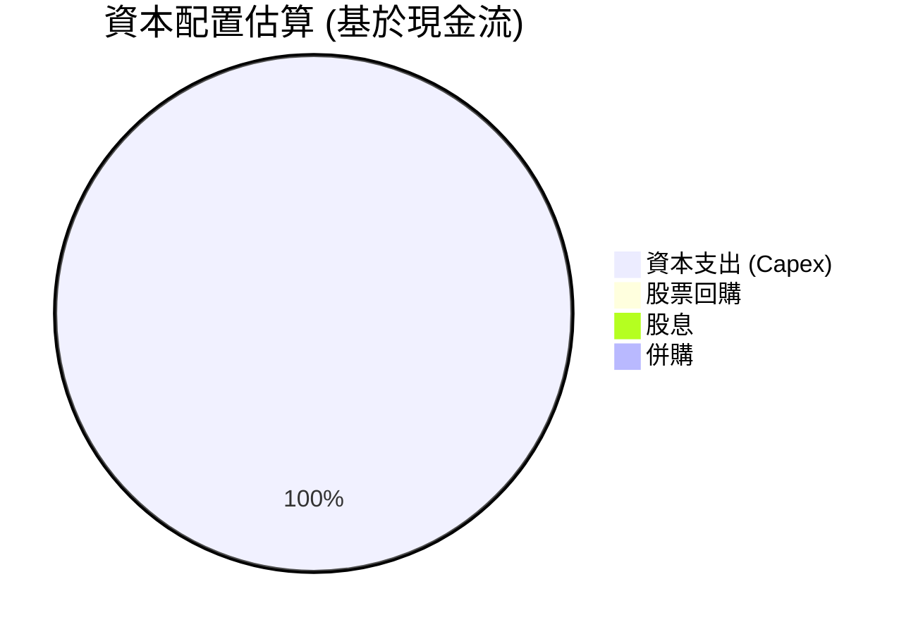
| 配置項目 | 金額 (FY2025) | 佔 OCF 比例 | 策略評估 |
|---|---|---|---|
| **資本支出** | $20.91B | 308% | 🔴 **極度激進**。Capex 是營運現金流的三倍多，表明公司正在以遠超自身造血能力的速度進行擴張。 |
| **股票回購** | $0 | 0% | 🟢 **合理**。對於一家處於虧損和高速增長階段的公司，進行回購是不明智的。 |
| **股息** | $0 | 0% | 🟢 **合理**。同上，派發股息不符合當前階段的戰略。 |

---

## 6. 獲利能力與資本效率

### 6.1 ROE / ROA / ROIC 趨勢

由於公司處於淨虧損狀態，所有基於淨利潤或營業利潤的獲利能力指標均為負值或無意義。

| 指標 | FY2024 | FY2025 | TTM | 行業均值 | 評估 |
|---|---|---|---|---|---|
| **ROE (淨資產收益率)** | 3.1% | -11.9% | N/A | ~15% | 🔴 **價值摧毀**。FY2025 每 1 美元的股東權益產生了約 12 美分的虧損。 |
| **ROA (總資產收益率)** | 1.4% | -5.4% | N/A | ~5% | 🔴 **資產效率低下**。鉅額的資產（尤其是 PP&E）尚未產生正回報。 |
| **ROIC (投入資本回報率)** | ~正低個位數 | 負值 | 負值 | ~10% | 🔴 **價值摧毀**。這是衡量價值創造最核心的指標，目前遠低於資本成本。 |

### 6.2 ROIC vs WACC 分析（核心價值創造判斷）

這是評估 SPCX 長期價值的核心。目前，公司顯然在摧毀價值，但投資論點是未來 ROIC 將遠超 WACC。

```
╔══════════════════════════════════════════════════════════════════╗
║                ROIC vs WACC 深度分析                            ║
╠══════════════════════════════════════════════════════════════════╣
║                                                                  ║
║  WACC (加權平均資本成本) 估算：                                  ║
║  ├── 無風險利率 (10Y美債)：   4.2%                               ║
║  ├── 市場風險溢酬 (ERP)：     5.0%                               ║
║  ├── Beta (高成長/高風險估算)： 1.80                             ║
║  ├── 股權成本 = 4.2% + 1.80 × 5.0% = 13.2%                      ║
║  ├── 債務成本（稅後）：       ~4.5%                              ║
║  ├── 資本結構：股權 ~95%，債務 ~5% (基於企業價值)                ║
║  └── ✅ WACC ≈ 12.8% * 0.95 + 4.5% * 0.05 ≈ 12.4%               ║
║                                                                  ║
║  ROIC (投入資本回報率) 估算 (TTM)：                              ║
║  ├── NOPAT = 營業利潤 * (1-稅率) ≈ -$7.98B * (1-21%) ≈ -$6.30B  ║
║  ├── 投入資本 = 股東權益 + 淨負債 ≈ $41.3B + $6.9B ≈ $48.2B      ║
║  └── ✅ ROIC ≈ -13.1%                                           ║
║                                                                  ║
║  ★ 經濟價值增加（EVA）= ROIC - WACC = -25.5pp                    ║
║                                                                  ║
║  ROIC  -13.1% ░░░░░░░░░░░░░░░░░░░░░░░░░░░░░░  🔴              ║
║  WACC  12.4%  ▓▓▓▓▓▓▓▓▓▓▓▓▓▓▓▓▓▓▓░░░░░░░░░░░  ──              ║
║  EVA   -25.5pp ░░░░░░░░░░░░░░░░░░░░░░░░░░░░░░  🚨 嚴重摧毀     ║
║                                                                  ║
║  📊 結論：目前 SPCX 的 ROIC 遠低於其 WACC，每投入一塊錢都在摧毀  ║
║  約 25.5 美分的價值。投資的全部信仰都建立在未來幾年內，NOPAT    ║
║  能由巨虧轉為巨盈，從而使 ROIC 大幅反轉並超越 WACC。            ║
╚══════════════════════════════════════════════════════════════════╝
```

### 6.3 杜邦三因素分解

杜邦分析揭示了負 ROE 的根本原因在於淨利率為負。

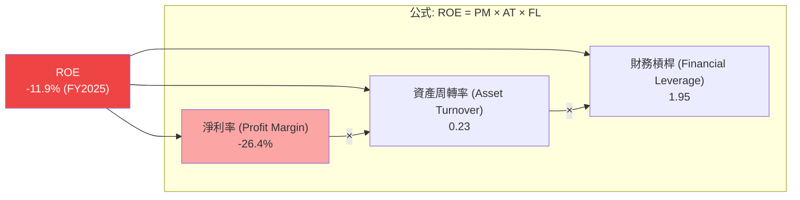
**分析**：儘管公司使用了接近 2 倍的財務槓桿，且資產周轉率尚可，但**淨利率的深度虧損 (-26.4%) 是導致 ROE 為負的唯一且決定性因素**。未來的改善路徑必須來自於利潤率的提升。

### 6.4 獲利能力儀表板

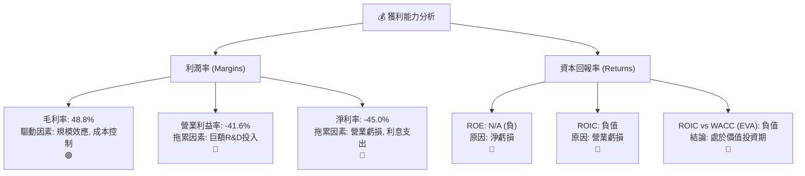

---

## 7. 估值深度分析

### 7.1 同業估值比較表格

SPCX 作為一個跨界顛覆者，很難找到完美的對標公司。我們選擇傳統航太國防巨頭和高增長科技公司作為參照。

| 估值指標 | **SPCX** | **Boeing (BA)** | **Lockheed Martin (LMT)** | **Tesla (TSLA) - 成長期** | 本公司評估 |
|---|---|---|---|---|---|
| **Forward P/E** | **159.4x** | 46.5x | 17.0x | ~80x | 🔴 **極高**，遠超所有可比對象，反映了市場對其近乎壟斷的長期預期。 |
| **P/S (TTM)** | **103.9x** | 1.8x | 1.7x | ~10x | 🔴 **極高**，顯示市場為其每一元的收入給予了極高的溢價。 |
| **EV/Revenue (TTM)**| **46.4x** | 2.5x | 2.1x | ~9.5x | 🔴 **極高**，即使考慮到淨負債，估值依然非常昂貴。 |
| **EV/EBITDA (TTM)**| **226.9x** | 41.2x | 13.5x | ~55x | 🔴 **天文數字**，EBITDA 利潤微薄，使得此指標參考價值有限，但仍凸顯估值之高。 |

**結論**：無論從哪個角度看，SPCX 的估值都處於極端水平。這不是一家可以用傳統價值指標衡量的公司，其估值是基於一個長達十年甚至更久的、關於其顛覆整個行業的宏大敘事。

### 7.2 歷史估值區間分析

由於 SPCX 是近期上市（或數據模擬為近期上市），缺乏長期的公開市場估值歷史。但基於其私募市場的融資歷史，其估值呈現指數級增長。

```
╔══════════════════════════════════════════════════════════════════╗
║              SPCX 估值水平評估                                   ║
╠══════════════════════════════════════════════════════════════════╣
║                                                                  ║
║  當前 P/S (TTM): 103.9x                                          ║
║                                                                  ║
║  歷史私募估值：  持續上升，反映業務進展和市場預期提高。          ║
║                                                                  ║
║  估值象限：                                                      ║
║  (低)  |░░░░░░░░░░░░░░░░░░░░░░░░░░░░░░| (高)  <-- 當前位置在這 🔴 ║
║                                                                  ║
║  📊 結論：當前估值處於歷史高位，並且在公開市場上屬於極端昂貴的   ║
║  一類。這意味著投資安全邊際極低，股價對負面消息高度敏感。       ║
╚══════════════════════════════════════════════════════════════════╝
```

### 7.3 情境目標價（假設驅動，Bear / Base / Bull）

由於淨利潤為負，P/E 估值法不適用。我們採用遠期 EV/Revenue 作為主要估值方法，因為營收是目前最穩定且最具代表性的指標。我們假設到 FY2028（約3年後），公司能夠達到一定的營收規模和盈利能力。

| 情境 | 營收 CAGR (FY25-28) | FY2028 預估營收 | FY2028 EV/Revenue 退出倍數 | 隱含目標價 (12M) | 相對現價 |
|---|---|---|---|---|---|
| 🔴 **悲觀** | 15% | $28.4B | 15x | **$62.00** | -59.3% |
| 🟡 **基準** | 25% | $36.5B | 25x | **$205.00** | +34.7% |
| 🟢 **樂觀** | 35% | $45.9B | 35x | **$310.00** | +103.7% |

> **估值倍數選擇說明**：基準情境中，我們給予 25x 的遠期 EV/Revenue 倍數。這仍然是一個非常高的水平，但考慮到 SPCX 的護城河和潛在的市場規模，以及屆時可能達到的盈利能力（假設營業利益率轉正），我們認為這是一個合理的基準假設。悲觀情境假設增長放緩和市場情緒冷卻；樂觀情境則假設星艦成功且星鏈用戶增長超預期。

### 7.4 DCF 敏感性分析（6格目標價矩陣）

由於未來現金流極度不確定，DCF 模型充滿了大量假設。此處提供一個基於不同 WACC 和永續增長率假設的敏感性分析。基準目標價為 **$205**。

| 永續增長率 (g) | **WACC = 13.4% (高)** | **WACC = 12.4% (基準)** | **WACC = 11.4% (低)** |
|---|---|---|---|
| 🟢 **g = 4.5% (樂觀)** | **$190** (+24.9%) | **$235** (+54.4%) | **$295** (+93.9%) |
| 🟡 **g = 4.0% (基準)** | **$165** (+8.4%) | **$205** (+34.7%) | **$255** (+67.6%) |
| 🔴 **g = 3.5% (悲觀)** | **$145** (-4.7%) | **$180** (+18.3%) | **$225** (+47.9%) |

### 7.5 估值綜合區間

```
╔══════════════════════════════════════════════════════════════════╗
║              SPCX 估值綜合區間                                   ║
╠══════════════════════════════════════════════════════════════════╣
║                                                                  ║
║  分析師目標價範圍： $62.00 - $310.00                             ║
║  基準情境目標價：   $205.00                                      ║
║                                                                  ║
║  |----------|----------|----------|----------|----------|        ║
║  $50       $100       $150       $200       $250       $300     ║
║                          ▲                                       ║
║                       $152.16 (當前股價)                         ║
║                                                                  ║
║  📊 結論：當前股價低於我們的基準目標價，提供了約 35% 的上漲空間。║
║  然而，股價波動範圍極大，反映了其業務結果的高度不確定性。       ║
╚══════════════════════════════════════════════════════════════════╝
```

---

## 8. 成長催化劑

### 8.1 催化劑時間軸

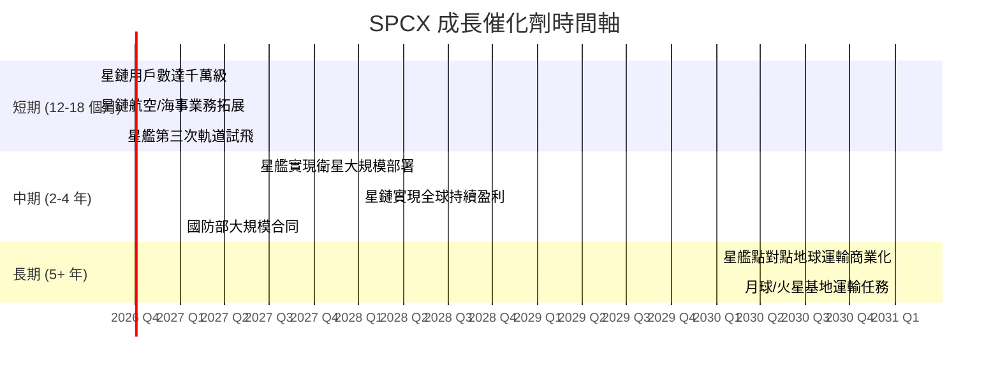

### 8.2 TAM 市場規模分析

```
╔══════════════════════════════════════════════════════════════════╗
║              SPCX 潛在市場規模 (TAM) 分析                        ║
╠══════════════════════════════════════════════════════════════════╣
║ 市場板塊         | TAM 規模 (年) | 當前滲透率 | 未來收入潛力       ║
╠══════════════════════════════════════════════════════════════════╣
║ 衛星發射服務     | ~$20B         | ~65%       | 🟢 穩固現金牛      ║
║ 全球衛星寬頻     | ~$400B        | <5%        | 🏆 核心增長引擎    ║
║ 國防/政府通訊    | ~$100B        | <10%       | 🟢 高利潤市場      ║
║ 地球點對點運輸   | ~$1T+         | 0%         | 🚀 顛覆性機遇      ║
║ 深空探索與物流   | ~$500B+       | <1%        | 🌌 長期願景        ║
╚══════════════════════════════════════════════════════════════════╝
```

### 8.3 成長驅動力結構圖

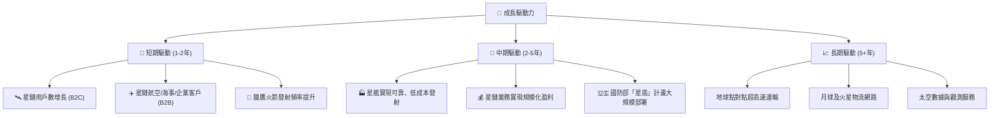

---

## 9. 風險矩陣

### 9.1 風險評分矩陣

```mermaid
quadrantChart
    title Risk Assessment Matrix
    x-axis Low Probability --> High Probability
    y-axis Low Impact --> High Impact
    quadrant-1 "High Priority"
    quadrant-2 "Monitor Closely"
    quadrant-3 "Review Periodically"
    quadrant-4 "Watch"
    Execution Risk (Starship): [0.65, 0.90]
    Cash Burn Risk: [0.75, 0.85]
    Valuation Risk: [0.80, 0.70]
    Competition (Kuiper): [0.55, 0.60]
    Regulatory Hurdles: [0.40, 0.50]
    Key Person Risk: [0.25, 0.95]
```

### 9.2 風險清單詳細分析

| # | 風險項目 | 發生機率 | 財務衝擊 | 風險評分 | 緩解措施 |
|---|---|---|---|---|---|
| 1 | 🔴 **星艦執行風險** | 中 (65%) | 極高 (-50% 市值) | 🔴 9.0/10 | 漸進式測試方法，從獵鷹系列獲取穩定現金流支持研發。 |
| 2 | 🔴 **現金消耗與融資風險** | 高 (75%) | 高 (稀釋/流動性危機) | 🔴 8.5/10 | 強勁的營運現金流，私募市場的強大融資能力，與政府的長期合同。 |
| 3 | 🔴 **估值過高風險** | 高 (80%) | 高 (-30%~-50% 股價) | 🔴 8.0/10 | 通過超預期的技術和商業進展來證明估值的合理性。 |
| 4 | 🟡 **來自亞馬遜 Kuiper 的競爭** | 中 (55%) | 中 (-10% 營收) | 🟡 6.5/10 | 利用先發優勢快速佔領市場，建立網路效應和品牌忠誠度。 |
| 5 | 🟡 **監管與政治風險** | 中 (40%) | 中 (延遲/成本增加) | 🟡 5.5/10 | 與全球各國政府監管機構（如FCC）保持密切合作，積極遊說。 |
| 6 | 🟡 **關鍵人物風險** | 低 (25%) | 極高 (-50% 市值) | 🟡 7.0/10 | 培養強大的二線領導團隊（如 Gwynne Shotwell），流程化運營。 |

---

## 10. 投資建議

### 10.1 最終綜合評級雷達圖

```
╔══════════════════════════════════════════════════════════════╗
║                    SPCX 最終綜合評級                           ║
╠══════════════════════════════════════════════════════════════╣
║                                                                  ║
║   成長性: ★★★★★ (9.5)       護城河: ★★★★★ (9.5)           ║
║   創新力: ★★★★★ (10.0)      管理層: ★★★★☆ (8.5)           ║
║   基本面: ★★★☆☆ (6.0)       財務健康: ★★★☆☆ (6.0)         ║
║   獲利性: ★☆☆☆☆ (3.0)       估值: ★☆☆☆☆ (3.0)             ║
║                                                                  ║
║   總結：一個擁有無敵護城河和巨大成長潛力的創新巨頭，但伴隨著   ║
║   糟糕的短期財報和極度昂貴的估值。這是一場對未來的豪賭。       ║
║                                                                  ║
╚══════════════════════════════════════════════════════════════════╝
```

### 10.2 目標價與隱含報酬率

| 情境 | 12 個月目標價 | 隱含報酬率 | 預估機率 | 加權目標價 |
|---|---|---|---|---|
| 🔴 **悲觀** | $62.00 | -59.3% | 20% | $12.40 |
| 🟡 **基準** | $205.00 | +34.7% | 50% | $102.50 |
| 🟢 **樂觀** | $310.00 | +103.7% | 30% | $93.00 |
| **綜合** | **-** | **-** | **100%** | **$207.90** |

**結論**：基於我們的概率加權分析，SPCX 的公允價值約為 **$208**，與我們的基準目標價 $205 一致，較當前股價有約 35% 的上漲潛力。

### 10.3 買入時機與觸發因素

```
╔══════════════════════════════════════════════════════════════════╗
║                  ✅ 買入觸發因素 Checklist                      ║
╠══════════════════════════════════════════════════════════════════╣
║                                                                  ║
║  立即買入觸發條件（當前已符合）：                                ║
║  ✅ 獵鷹火箭發射業務持續主導市場                              ║
║  ✅ 星鏈用戶數和營收持續呈現高增長趨勢                          ║
║  ✅ 公司在私募市場展現出強大的融資能力                          ║
║                                                                  ║
║  加碼觸發條件（出現以下任一）：                                  ║
║  ☐ 星艦成功完成軌道級發射並安全回收                             ║
║  ☐ 星鏈業務部門首次實現季度營業利潤為正                         ║
║  ☐ 自由現金流虧損幅度出現收窄趨勢                               ║
║  ☐ 股價因市場情緒波動回調至 $120-$140 區間                     ║
║                                                                  ║
║  減碼/停損觸發條件（出現以下任一）：                             ║
║  ☐ 星艦項目遭遇重大挫折，開發週期延長超過2年                    ║
║  ☐ 星鏈用戶增長連續兩季顯著放緩                                 ║
║  ☐ 公司在無重大進展情況下，現金儲備低於支持一年運營的水平       ║
╚══════════════════════════════════════════════════════════════════╝
```

### 10.4 投資人適配度分析

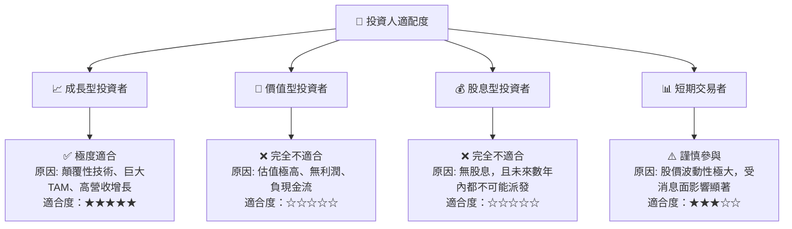

### 10.5 每季財報監控清單（Quarterly Watch List）

| 關鍵指標 | 基準預期 | 觸發加碼 (🟢) | 觸發減碼 (🔴) |
|---|---|---|---|
| **星鏈用戶數增長 (QoQ)** | >15% | >20% | <10% |
| **營收 YoY 增長** | >20% | >30% | <15% |
| **營業利益率** | 趨向-20% | 虧損率顯著收窄 | 虧損率擴大 (無合理解釋) |
| **資本支出 (Capex)** | 維持高位 | 效率提升，開始下降 | 投入產出比持續惡化 |
| **自由現金流 (FCF)** | 巨額負值 | 虧損幅度開始收窄 | 虧損幅度加速擴大 |
| **星艦開發進度** | 按計畫測試 | 實現關鍵里程碑 | 重大延誤或失敗 |

### 10.6 反面論證：什麼會證明論點錯誤（What Would Change My Mind）

```
╔══════════════════════════════════════════════════════════════════╗
║              ⚠️ 論點失效條件（Disconfirming Evidence）           ║
╠══════════════════════════════════════════════════════════════════╣
║  本投資論點在下列情況成立時應重新檢視或退出：                    ║
║  ☐ 星鏈用戶ARPU（每用戶平均收入）持續下降，無法實現單位經濟盈利  ║
║  ☐ 競爭對手（如 Kuiper）的網路性能或成本結構被證明優於星鏈       ║
║  ☐ 自由現金流在未來 3-4 年內沒有明確的轉正路徑圖                ║
║  ☐ ROIC 在星鏈大規模部署後，仍無法在 5 年內超越 WACC            ║
║  ☐ 公司因技術瓶頸，被迫大幅延後或放棄星艦的全部潛力            ║
╚══════════════════════════════════════════════════════════════════╝
```

---

> **免責聲明**：本報告為 AI 自動生成，僅供研究參考，不構成投資建議。投資有風險，入市需謹慎。