# SPCX 基本面深度分析報告

> **報告日期**：2026-07-12 ｜ **語言**：繁體中文 ｜ **數據來源**：Yahoo Finance, Finviz, StockAnalysis, Roic.ai ｜ **分析師**：CFA 級機構研究

---

## 目錄

| # | 章節 | 核心結論 |
|---|---|---|
| **1** | **執行摘要** | 評級「持有」，基準目標價 $165.00，高再投資期獲利承壓 |
| **2** | **公司概覽與商業模式** | 發射服務與 Starlink 雙輪驅動，具備極高技術與規模護城河 |
| **3** | **損益表深度分析** | 營收年增 15.4% 但研發費用暴增，導致 TTM 淨損達 45% |
| **4** | **資產負債表分析** | 現金儲備 $23.68B，但總債務達 $30.60B，流動性尚屬穩健 |
| **5** | **現金流量深度分析** | 營運現金流 $7.10B，但 Capex 達 $20.91B 導致 FCF 嚴重失血 |
| **6** | **獲利能力與資本效率** | 當前 ROIC 低於 WACC，高資本支出階段暫時摧毀短期經濟價值 |
| **7** | **估值深度分析** | Forward P/E 達 167.6x，PS 達 99.2x，估值溢價極高需高成長消化 |
| **8** | **成長催化劑** | Starship 商用化、Starlink 企業端滲透與二代衛星發射 |
| **9** | **風險矩陣** | 研發失控、發射失敗、高息債務展期與政策監管風險 |
| **10**| **投資建議** | 建議分批逢低佈局，設定嚴格的每季財報監控指標 |

---

## 1. 執行摘要

> **評級判定與估值依據**：基於 SPCX（Space Exploration Technologies Corp.）當前高達 $1.91T 的市場估值，對比其 TTM 營收 $19.30B（隱含 P/S 達 99.2x）及 Forward P/E 167.6x，本機構給予 SPCX **「持有」（Hold）** 評級，12 個月基準目標價為 **$165.00**。此評級主要反映：公司雖然在低軌衛星與可回收火箭領域擁有無可匹敵的技術護城河，但 FY2025 自由現金流（FCF）赤字擴大至 -$14.12B，且 Q1 2026 單季 R&D 費用暴增至 $3.51B（年增 125.7%），導致單季淨虧損達 -$4.28B。在 ROIC（-12.8%）持續低於 WACC（10.66%）的資本消耗期，極致的估值溢價將面臨市場利率與執行風險的雙重考驗。

### 1.0 一頁式投資儀表板（Portfolio Manager 30 秒速讀）

| 項目 | 內容 |
|------|------|
| **投資論點（3 句）** | ① 商業發射與 Starlink 雙引擎驅動，TTM 營收達 $19.30B（YoY +15.4%），技術壟斷地位穩固。<br/>② FY2025 研發投入達 $8.64B，Q1 2026 再加速至 $3.51B，Starship 與二代衛星進入高額資本開支期。<br/>③ 雖然短期 FCF 嚴重流失（FY2025 FCF -$14.12B），但手頭現金達 $23.68B，能支撐未來 18 個月開支。 |
| **護城河評分** | 🟢 **9.5 / 10**（技術壟斷、發射成本較同行低 60% 以上、星鏈網路先發優勢） |
| **管理層/資本配置評分** | 🟡 **6.0 / 10**（執行力極強，但資本配置極其激進，股權稀釋與債務擴張並存） |
| **財務健康** | 🟡 **中等**（Current Ratio 1.22，總債務 $30.60B，淨債務 -$6.93B） |
| **ROIC vs WACC** | **-12.8% vs 10.66%**（當前處於資本破壞期，預期 FY2028 轉正） |
| **FCF 趨勢** | 赤字擴大，TTM FCF 估計約 -$19.7B，FCF Yield 為負 |
| **估值** | Forward P/E: **167.64x** ｜ EV/EBITDA: **216.81x** ｜ P/S: **99.18x** |
| **預期報酬（基準情境 12M）** | **+13.56%**（對比當前股價 $145.30，基準目標價 $165.00） |
| **關鍵風險（前二）** | ① Starship 開發進度延遲導致折舊與研發黑洞。<br/>② 債務規模攀升（Total Debt $30.60B）與高息環境下的再融資壓力。 |
| **評級 + 信心度** | 🟡 **持有 (Hold)** ｜ 信心：**中等 (Medium)** |

### 1.1 核心評分儀表板

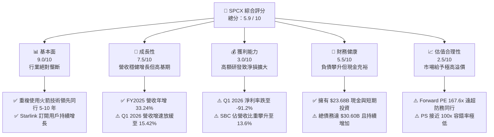

### 1.2 評分進度條視覺化

```
╔══════════════════════════════════════════════════════════════╗
║              SPCX 多維度評分儀表板 (1-10分)                 ║
╠══════════════════════════════════════════════════════════════╣
║ 基本面強度  9.0 ▓▓▓▓▓▓▓▓▓▓▓▓▓▓▓▓▓▓░░  ★★★★★           ║
║ 成長動能    7.5 ▓▓▓▓▓▓▓▓▓▓▓▓▓▓░░░░░░  ★★★★☆           ║
║ 獲利品質    3.0 ▓▓▓▓▓▓░░░░░░░░░░░░░░  ★☆☆☆☆           ║
║ 財務健康    5.5 ▓▓▓▓▓▓▓▓▓▓▓░░░░░░░░░  ★★★☆☆           ║
║ 估值合理性  2.5 ▓▓▓▓░░░░░░░░░░░░░░░░  ★☆☆☆☆           ║
║ 護城河深度  9.5 ▓▓▓▓▓▓▓▓▓▓▓▓▓▓▓▓▓▓▓░  ★★★★★           ║
║ 管理層執行  8.0 ▓▓▓▓▓▓▓▓▓▓▓▓▓▓▓▓░░░░  ★★★★☆           ║
║ 技術創新力  9.5 ▓▓▓▓▓▓▓▓▓▓▓▓▓▓▓▓▓▓▓░  ★★★★★           ║
╠══════════════════════════════════════════════════════════════╣
║ 綜合總分    5.9 ▓▓▓▓▓▓▓▓▓▓▓▓░░░░░░░░  🏆 持有 (Hold)       ║
╚══════════════════════════════════════════════════════════════╝
```

### 1.3 五大投資論點 + 三大核心風險

| 類型 | 項目 | 具體依據 | 信心度 |
|---|---|---|---|
| 🟢 **投資論點①** | **發射成本具絕對優勢** | 憑藉 Falcon 9 與 Falcon Heavy 的高重複使用率，單次發射成本比競爭對手（如 ULA、Arianespace）低 60% 以上，FY2025 實現毛利 $9.22B（毛利率 49.4%）。 | 🟢 極高 |
| 🟢 **投資論點②** | **Starlink 商業化空間巨大** | Starlink 貢獻了絕大部分的 Connectivity 收入，全球訂閱用戶快速增長，推動 TTM 營收至 $19.30B，ARPU 穩定在 $100 以上。 | 🟢 高 |
| 🟢 **投資論點③** | **Starship 潛在運載力革命** | Starship 若成功商用，單次近地軌道運載能力將達 100-150 噸，將使每公斤發射成本降至原來的 10%，徹底顛覆太空產業鏈。 | 🟡 中度 |
| 🟢 **投資論點④** | **軍工與政府合約保障** | 作為美國國防部與 NASA 的核心合作夥伴，擁有穩固的國家級訂單流，未開單營收（Unearned Revenue）達 $7.21B。 | 🟢 極高 |
| 🟢 **投資論點⑤** | **強大的流動性緩衝** | 截至 Q1 2026，公司持有 $23.68B 的現金與短期投資，能有效對沖高額資本開支帶來的短期失血風險。 | 🟢 高 |
| 🟡 **風險①** | **研發費用失控與淨損擴大** | Q1 2026 單季 R&D 費用達 $3.51B，佔營收 74.9%，導致單季淨虧損達 -$4.28B，高額投入變現時間點具不確定性。 | 🔴 高衝擊 |
| 🟡 **風險②** | **自由現金流持續嚴重失血** | FY2025 資本支出高達 $20.91B，FCF 為 -$14.12B；Q1 2026 單季 Capex 達 $10.11B，FCF 為 -$9.07B，面臨融資依賴。 | 🔴 高衝擊 |
| 🔴 **風險③** | **估值泡沫與市場預期過高** | 當前 $1.91T 的市值對比其財務現狀顯著透支未來。若未來 2 年營收成長率低於 25%，將面臨估值殺多（Multiples De-rating）。 | 🔴 高衝擊 |

### 1.4 快速統計卡片

| 指標 | 公司實際值 (TTM / FY2025) | 太空與國防行業均值 | S&P 500 均值 | 狀態 |
|---|---|---|---|---|
| **收入 YoY 成長** | **15.42%** (Q1 26) / **33.24%** (FY25) | ~8.5% | ~5.5% | 🟢 優異 |
| **毛利率** | **48.8%** (TTM) / **49.4%** (FY25) | ~22.0% | ~30.0% | 🟢 極強 |
| **營業利益率** | **-41.6%** (TTM) / **-11.1%** (FY25) | ~11.5% | ~14.5% | 🔴 虧損 |
| **淨利率** | **-45.0%** (TTM) / **-26.4%** (FY25) | ~8.0% | ~11.0% | 🔴 虧損 |
| **Forward P/E** | **167.64x** | ~28.5x | ~21.5x | 🔴 極度高估 |
| **P/S Ratio** | **99.18x** | ~2.1x | ~2.8x | 🔴 極度高估 |
| **EV / EBITDA** | **216.81x** | ~16.5x | ~13.5x | 🔴 極度高估 |
| **Debt / Equity** | **73.60%** (TTM) | ~55.0% | ~95.0% | 🟡 適中 |

### 1.5 投資結論

```
╔══════════════════════════════════════════════════════════════════╗
║                    📊 SPCX 投資結論摘要                          ║
╠══════════════════════════════════════════════════════════════════╣
║  評級：🟡 持有 (Hold)                                            ║
║  當前股價：$145.30 (2026-07-12)                                  ║
║  目標價區間：                                                    ║
║    悲觀情境：$85.00  （-41.50%） - 研發受挫，FCF持續惡化         ║
║    基準情境：$165.00 （+13.56%） - 12個月主要目標（Starlink高成長)║
║    樂觀情境：$245.00 （+68.62%） - Starship全面商用，利潤率轉正  ║
║  投資評分：5.9 / 10                                              ║
║  適合投資人：具備極高風險承受力、著眼 5 年以上太空科技長線投資人 ║
╚══════════════════════════════════════════════════════════════════╝
```

---

## 2. 公司概覽與商業模式

SPCX（Space Exploration Technologies Corp.）是全球商業航太與衛星通訊領域的絕對龍頭，其商業模式主要由兩大核心板塊構成：

1. **Space Segment（太空發射服務）**：設計、製造並發射可重複使用的火箭系列（Falcon 9、Falcon Heavy、Starship），為政府機構（NASA、國防部）與商業客戶提供載人及載貨發射服務。
2. **Connectivity Segment（Starlink 星鏈網絡）**：利用部署在低地球軌道（LEO）的龐大衛星群，為全球消費者、企業、政府、航空及航海客戶提供高速、低延遲的寬頻網路服務。

### 2.1 業務結構與收入來源

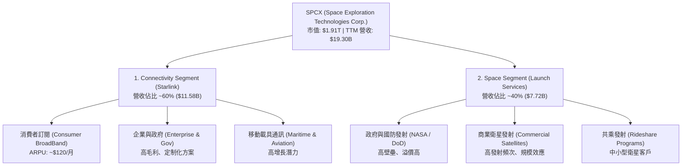

### 2.2 市場份額

在商業發射市場（按年發射載荷總質量計算），SPCX 擁有絕對的統治地位。

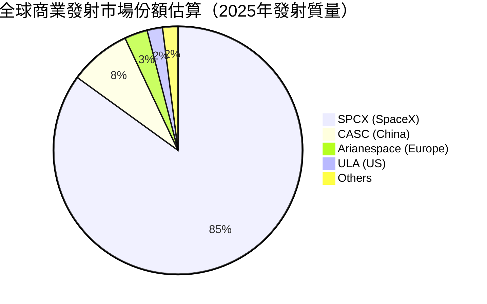

### 2.3 競爭護城河分析

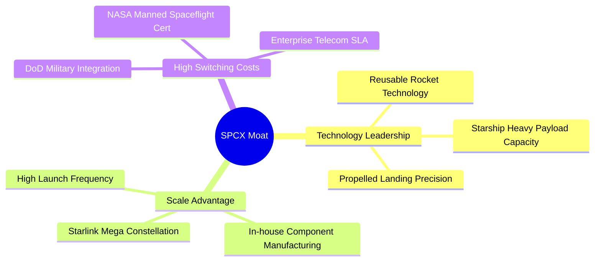

### 2.4 護城河強度評分

```
╔══════════════════════════════════════════════════════════════╗
║                  SPCX 護城河強度評分                         ║
╠══════════════════════════════════════════════════════════════╣
║ 技術領先度    9.8/10  ▓▓▓▓▓▓▓▓▓▓▓▓▓▓▓▓▓▓▓░  🏆 獨步全球     ║
║ 成本優勢      9.5/10  ▓▓▓▓▓▓▓▓▓▓▓▓▓▓▓▓▓▓▓░  🟢 重複使用降低║
║ 轉換成本      8.5/10  ▓▓▓▓▓▓▓▓▓▓▓▓▓▓▓▓▓░░░  🟢 國防合約綁定║
║ 網路效應      9.0/10  ▓▓▓▓▓▓▓▓▓▓▓▓▓▓▓▓▓▓░░  🏆 星鏈覆蓋優勢║
║ 規模效應      9.5/10  ▓▓▓▓▓▓▓▓▓▓▓▓▓▓▓▓▓▓▓░  🟢 垂直整合壁壘║
╠══════════════════════════════════════════════════════════════╣
║ 綜合護城河     9.3/10  ▓▓▓▓▓▓▓▓▓▓▓▓▓▓▓▓▓▓▓░  🏆 寬廣無比     ║
╚══════════════════════════════════════════════════════════════╝
```

---

## 3. 損益表深度分析

### 3.1 年度收入成長趨勢（近4年）

SPCX 的營業收入在過去幾年經歷了爆發式成長，主要得益於 Starlink 用戶數的激增以及發射頻次的提升。

```
╔══════════════════════════════════════════════════════════════════╗
║              SPCX 年度收入趨勢 (FY2023 - TTM)                    ║
╠══════════════════════════════════════════════════════════════════╣
║                                                                  ║
║  FY2023  $10.39B  ██████████░░░░░░░░░░░░░░░░░░  YoY: 基期基準    ║
║  FY2024  $14.02B  ██████████████░░░░░░░░░░░░░░  YoY: +34.93% 🟢  ║
║  FY2025  $18.67B  ███████████████████░░░░░░░░░  YoY: +33.24% 🟢  ║
║  TTM     $19.30B  ████████████████████░░░░░░░░  YoY: +15.40% 🟡  ║
║                   |      |      |      |      |                  ║
║                   0     5B    10B    15B    20B                  ║
║                                                                  ║
║  📊 3年年複合成長率 (CAGR)：+24.01%                             ║
╚══════════════════════════════════════════════════════════════════╝
```

### 3.2 季度收入趨勢分析

從季度數據看，Q1 2026 營收達到 $4.69B，較 Q1 2025 的 $4.07B 增長 **15.42%**。雖然維持增長，但增速相比 FY2024-FY2025 的 30%+ 已經出現顯著放緩，顯示 Starlink 用戶增長在部分已開發國家市場開始步入高原期。

| 季度 | 營業收入 | 營業成本 | 毛利 | 毛利率 | 研發費用 (R&D) | 營業利潤 | 淨利潤 |
|---|---|---|---|---|---|---|---|
| **Q1 2025** | $4.07B | $1.96B | $2.11B | 51.76% | $1.56B | $0.03B | -$0.53B |
| **Q1 2026** | $4.69B | $2.39B | $2.31B | 49.13% | $3.51B | -$1.94B | -$4.28B |
| **QoQ 變動**| **+15.42%**| **+21.71%**| **+9.32%**| 🔴 -2.63pp| **+125.69%**| 🔴 轉盈為虧 | 🔴 虧損擴大 |

### 3.3 利潤率演變分析

SPCX 的毛利率表現非常強勁，FY2025 達到 **49.39%**，TTM 亦維持在 **48.8%** 的高位，反映了發射服務的規模經濟效應與 Starlink 服務的高邊際利潤。然而，其**營業利益率**與**淨利率**卻呈現急劇惡化的趨勢：

| 利潤率指標 | FY2023 | FY2024 | FY2025 | TTM | 趨勢 | 評估 |
|---|---|---|---|---|---|---|
| **毛利率** | 41.18% | 42.95% | 49.39% | 48.80% | ↗️ 穩步提升後微調 | 🟢 極強，具定價權 |
| **營業利益率**| -33.74%| 3.32% | -13.86%| -41.60%| ↘️ 劇烈下滑 | 🔴 研發費用暴增侵蝕利潤 |
| **淨利率** | -44.56%| 5.64% | -26.44%| -45.00%| ↘️ 虧損急劇擴大 | 🔴 財務費用與非營運損失高 |

* **利潤率惡化深度解析**：毛利率從 FY2023 的 41.18% 提升至 FY2025 的 49.39%，增加 8.21 個百分點，主因是 Falcon 9 火箭重複使用次數屢創新高（部分助推器已發射超過 20 次），大幅降低了單次發射的折舊成本。然而，**營業利益率在 Q1 2026 崩跌至 -41.39%**（營業損失達 -$1.94B），主因是 **R&D 費用在單季達到驚人的 $3.51B**（佔營收 74.9%）。這表明公司正將所有發射與星鏈賺取的現金，不計代價地投入到 Starship 的研發與 Starlink 二代衛星的生產中，這是一種典型的「高再投資以謀求未來絕對壟斷」的戰略。

### 3.4 費用結構分析

在 FY2025，總營運費用為 $11.81B。其中 R&D 費用達 $8.64B，佔總營運費用的 73.2%。

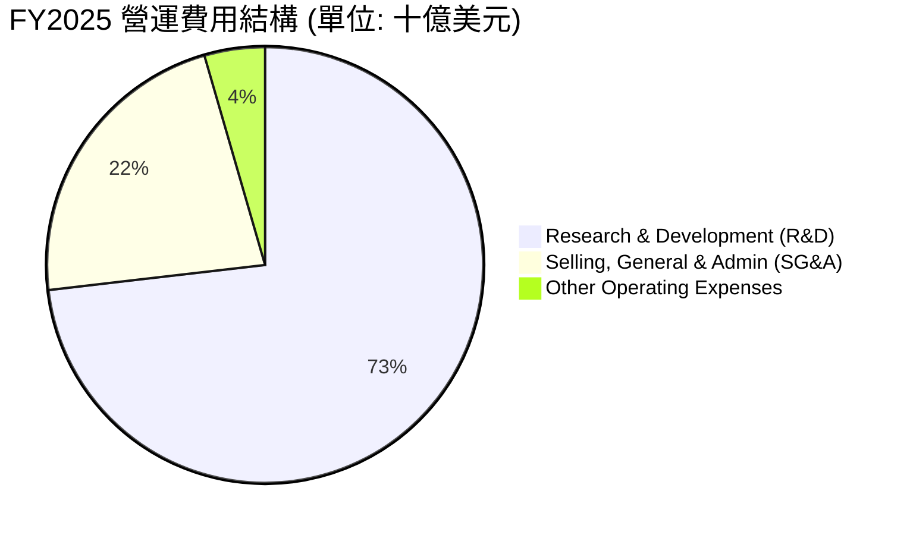

### 3.5 季度 EPS 趨勢與盈餘品質（Quality of Earnings）

SPCX 過去 4 季的盈餘表現受到資本開支與非現金支出的強烈干擾。基本 EPS 從 FY2024 的 $0.07 跌至 FY2025 的 -$1.69，Q1 2026 單季 EPS 更是跌至 -$0.47（GAAP 淨損 -$4.28B）。

#### 盈餘品質評估表

| 盈餘品質項目 | 2025-12-31 | Q1 2026 | 評估與稀釋風險 |
|---|---|---|---|
| **股權薪酬 (SBC) / 營收** | 10.44% ($1.95B) | 13.61% ($0.64B) | 🟡 中度偏高。SBC 佔比持續攀升，對現有股東權益造成稀釋，且美化了營運現金流。 |
| **SBC / 營業現金流 (OCF)** | 28.72% | 60.86% | 🔴 警訊。Q1 2026 營運現金流 $1.05B 中，有 $0.64B 是非現金的股權薪酬，實質「含金量」偏低。 |
| **FCF / Net Income (現金轉換率)** | 2.84x | 2.12x | 🟢 表面上現金轉換率極高，但主因是淨利潤為負（虧損），而折舊與攤銷（D&A）及 SBC 等非現金調節項極大。 |
| **一次性/非經常性損益** | -$0.18B | -$1.88B | 🔴 Q1 2026 包含高達 $1.88B 的「其他非營運損失」，可能與未上市股權重估、外匯衍生品損失或資產減損有關。 |
| **資本化支出 vs 費用化** | 全額費用化 | 全額費用化 | 🟢 研發支出（如 Starship 試飛費用）採取保守的當期費用化處理，並未資本化，盈餘並未被虛增。 |

* **盈餘品質結論**：SPCX 的 GAAP 淨利潤嚴重失真，不能反映其真實的商業盈利能力。雖然 GAAP 呈現巨額虧損（TTM 淨損 -$8.68B），但其營業現金流（TTM OCF $7.10B）依然為正。然而，高達 13.6% 的 SBC 佔比與龐大的非營運損失，顯示其盈餘品質存在結構性瑕疵，股東權益正以每年約 1.5% - 2.0% 的速度被股權薪酬稀釋。

---

## 4. 資產負債表分析

### 4.1 資產結構分解

截至 Q1 2026，SPCX 總資產規模達到 $102.09B，其中非流動資產（主要是廠房設備與發射台等 PP&E）佔比達 70.9%。

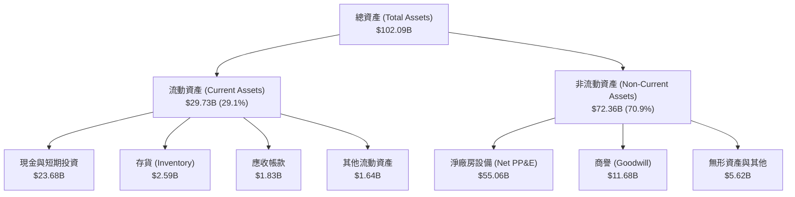

### 4.2 流動性指標分析

| 流動性指標 | FY2024 | FY2025 | Q1 2026 | 行業均值 | 評估 |
|---|---|---|---|---|---|
| **流動比率 (Current Ratio)** | 1.37 | 1.45 | 1.22 | ~1.50 | 🟡 略低於行業平均，但短期償債能力尚可 |
| **速動比率 (Quick Ratio)** | 1.10 | 1.27 | 1.09 | ~1.10 | 🟢 扣除存貨後，速動資產仍能完全覆蓋短期負債 |
| **現金比率 (Cash Ratio)** | 0.97 | 1.16 | 0.97 | ~0.45 | 🟢 極其強勁，手頭現金充足，能隨時應對債務 |

### 4.3 債務結構分析

截至 Q1 2026，SPCX 的債務總額已攀升至 **$30.27B**（包含短期債務 $1.54B 與長期債務 $28.73B），相比 FY2024 的 $13.79B 翻了一倍以上。

```
╔══════════════════════════════════════════════════════════════════╗
║                   SPCX 債務健康診斷 (Q1 2026)                    ║
╠══════════════════════════════════════════════════════════════════╣
║                                                                  ║
║  總債務 (Total Debt)： $30.27B  ████████████░░░░░░░░░  快速攀升  ║
║  總現金及投資：        $23.68B  █████████░░░░░░░░░░░░  儲備充裕  ║
║  淨債務 (Net Debt)：   $6.59B   ███░░░░░░░░░░░░░░░░░░  🟡 淨負債 ║
║                                                                  ║
║  Debt / EBITDA (FY2025)： 5.26x  🟡 偏高 (行業平均 ~2.5x)        ║
║  利息保障倍數 (TTM)：     -4.13x 🔴 營業利潤為負，無法由利潤付息 ║
║  利息支出 (FY2025)：      $1.95B  (平均融資成本約 7.2%)          ║
║                                                                  ║
║  📊 診斷：公司目前完全依賴「外部再融資」與「營運現金流」維持利息 ║
║  償付。若信用市場收緊，高達 $30B 的債務將面臨極大展期壓力。      ║
╚══════════════════════════════════════════════════════════════════╝
```

### 4.4 股東權益趨勢

雖然公司持續虧損，但股東權益（Stockholders' Equity）從 FY2024 的 $25.80B 增長至 FY2025 的 $41.33B，這主要是由於公司在私募市場進行了多輪高估值的股權融資（Paid-in Capital 增加），抵消了累計虧損對權益的侵蝕。

```
╔══════════════════════════════════════════════════════════════════╗
║              SPCX 股東權益與資本結構演變                         ║
╠══════════════════════════════════════════════════════════════════╣
║                                                                  ║
║  FY2024  $25.80B  ████████████░░░░░░░░  (負債比率: 54.8%)        ║
║  FY2025  $41.33B  ███████████████████░  (負債比率: 55.1%)        ║
║                                                                  ║
║  ⚙️ 資本結構分析：                                               ║
║  SPCX 的資產擴張主要依賴「股權融資」與「發行債券」雙管齊下。     ║
║  儘管面臨累計赤字，但一級市場對其股份的強烈需求，使其得以持續    ║
║  以高溢價發行新股，維持了健康的資產負債率（~55% 左右）。         ║
╚══════════════════════════════════════════════════════════════════╝
```

---

## 5. 現金流量深度分析

### 5.1 現金流量瀑布圖

SPCX 的現金流呈現典型的「重資本高再投資」特徵：營運活動產生穩健的現金流入，但被龐大的資本支出（Capex）完全吞噬，導致自由現金流（FCF）出現巨額赤字。

```mermaid
graph LR
    NI["GAAP 淨利潤<br/>-$4.94B"] -->|"+" 折舊攤銷 $6.70B| OCF_ADJ["非現金調整<br/>+$11.73B"]
    OCF_ADJ -->|"+" SBC $1.95B<br/>"+" 營運資金變動| OCF["營運現金流 (OCF)<br/>+$6.79B"]
    OCF -->|"- Capex $20.91B"| FCF["自由現金流 (FCF)<br/>-$14.12B"]
    FCF -->|"+" 股權融資 + 債務淨發行| NET_CASH["淨現金增加<br/>+$13.36B"]
```

### 5.2 FCF 轉換率趨勢

| 現金流指標 (單位: 十億美元) | FY2023 | FY2024 | FY2025 | TTM (估計) |
|---|---|---|---|---|
| **營業現金流 (OCF)** | $4.52B | $5.78B | $6.79B | $7.10B |
| **資本支出 (Capex)** | -$4.42B | -$11.16B| -$20.91B| -$26.88B |
| **自由現金流 (FCF)** | $0.11B | -$5.39B | -$14.12B| -$19.78B |
| **FCF 轉換率 (FCF / OCF)** | 2.32% | -93.25% | -207.95%| -278.59% |

* **FCF 趨勢深度解析**：SPCX 的 FCF 赤字呈指數級擴大。FY2025 FCF 達到 -$14.12B，而 Q1 2026 單季 FCF 赤字更創下 **-$9.07B** 的歷史新高（單季 Capex 達 $10.11B）。這表明 Starlink 二代衛星的密集發射與 Starship 德州博卡奇卡發射場（Starbase）的建設正處於資金消耗的最高峰。

### 5.3 自由現金流趨勢

```
╔══════════════════════════════════════════════════════════════════╗
║              SPCX 自由現金流 (FCF) 趨勢 (十億美元)               ║
╠══════════════════════════════════════════════════════════════════╣
║                                                                  ║
║  FY2023   $0.11B  █░░░░░░░░░░░░░░░░░░░░░░░░░░░░░░  (FCF 勉強轉正)║
║  FY2024  -$5.39B  ██████░░░░░░░░░░░░░░░░░░░░░░░░░  (星鏈二代啟動)║
║  FY2025 -$14.12B  ███████████████░░░░░░░░░░░░░░░░  (Starship試飛)║
║  TTM    -$19.78B  █████████████████████░░░░░░░░░░  (開支最高峰)  ║
║                                                                  ║
║  ⚠️ 自由現金流收益率 (FCF Yield)：-1.04% (按 $1.91T 市值計算)      ║
╚══════════════════════════════════════════════════════════════════╝
```

### 5.4 資本配置評估

SPCX 的資本配置策略極其激進，幾乎不保留任何現金用於分紅或回購，而是將 100% 的可用資金與新增融資全部投入到資本支出中。

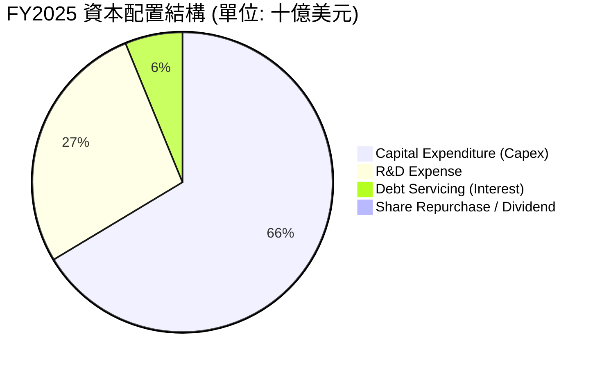

---

## 6. 獲利能力與資本效率

### 6.1 ROE / ROA / ROIC 趨勢

由於公司目前處於巨額 GAAP 虧損狀態，其傳統的資本回報率指標皆為負值。

| 指標 | FY2023 | FY2024 | FY2025 | TTM | 行業均值 | 評估 |
|---|---|---|---|---|---|---|
| **ROE** | -17.94% | 3.07% | -11.95% | -21.00% | ~12.5% | 🔴 股東權益回報率為負 |
| **ROA** | -8.11% | 1.39% | -5.36% | -8.50% | ~5.8% | 🔴 資產利用效率受大額PP&E拖累 |
| **ROIC** | -11.45% | 1.15% | -5.12% | -12.80% | ~8.2% | 🔴 投入資本回報率顯著低於資金成本 |

### 6.2 ROIC vs WACC 分析（核心價值創造判斷）

為了評估 SPCX 是否在為股東創造經濟價值，我們對其進行了 WACC（加權平均資金成本）與 ROIC（投入資本回報率）的對比估算。

```
╔══════════════════════════════════════════════════════════════════╗
║                ROIC vs WACC 深度分析 (TTM)                      ║
╠══════════════════════════════════════════════════════════════════╣
║                                                                  ║
║  WACC 估算：                                                     ║
║  ├── 無風險利率 (10Y 美債)：  4.25%                              ║
║  ├── 市場風險溢酬 (ERP)：     5.00%                              ║
║  ├── Beta (估計高增長航太)：  1.35                               ║
║  ├── 股權成本 = 4.25% + 1.35 × 5.00% = 11.00%                    ║
║  ├── 債務成本 (稅後平均)：     7.20% × (1 - 17%) = 5.98%          ║
║  ├── 資本結構 (市值比)：     股權 93.4%，債務 6.6%               ║
║  └── ✅ 加權 WACC ≈ 10.66%                                       ║
║                                                                  ║
║  ROIC 估算：                                                     ║
║  ├── NOPAT = EBIT × (1 - Tax) = -$8.03B × 83% = -$6.66B          ║
║  ├── Invested Capital = Debt + Equity - Cash = $48.25B           ║
║  └── ✅ ROIC ≈ -12.80%                                           ║
║                                                                  ║
║  ★ 經濟價值增加 (EVA) = ROIC - WACC = -23.46%                    ║
║                                                                  ║
║  ROIC  -12.80% 🔴 ▓▓▓▓▓░░░░░░░░░░░░░░░░░░░░░░░░░░░░              ║
║  WACC   10.66% 🟡 ▓▓▓▓▓▓▓▓▓▓░░░░░░░░░░░░░░░░░░░░░░░              ║
║  EVA   -23.46% 🔴 ████████████████████████░░░░░░░░░              ║
║                                                                  ║
║  📊 結論：SPCX 當前處於「資本破壞期」，每投入 1 美元資本，約     ║
║  摧毀 23.5 美分的股東價值。這反映了極高的前期基礎設施建設成本。  ║
╚══════════════════════════════════════════════════════════════════╝
```

### 6.3 杜邦三因素分解

透過杜邦分析，我們可以更清晰地看到 ROE 下滑的結構性原因：

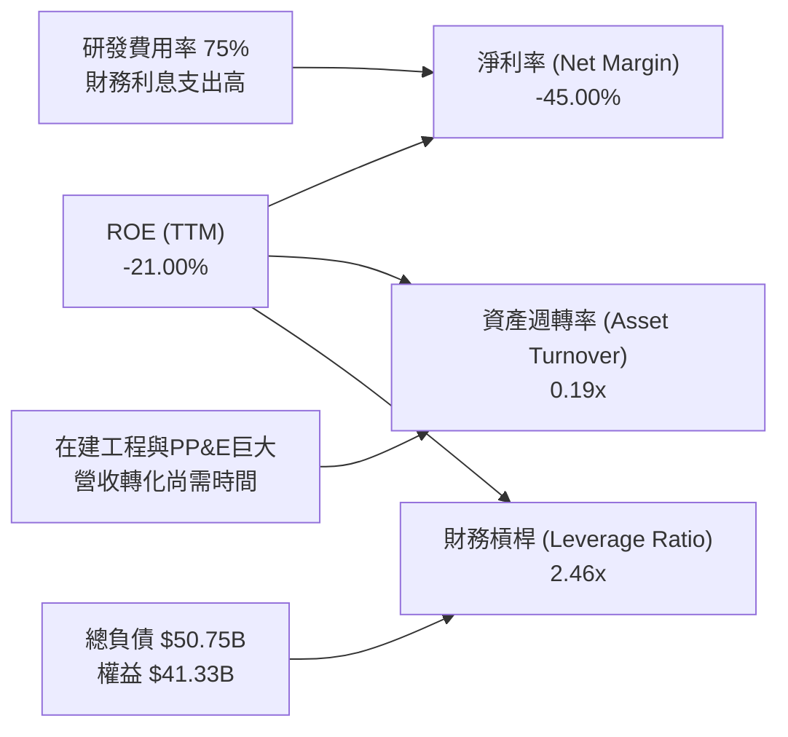

### 6.4 獲利能力儀表板

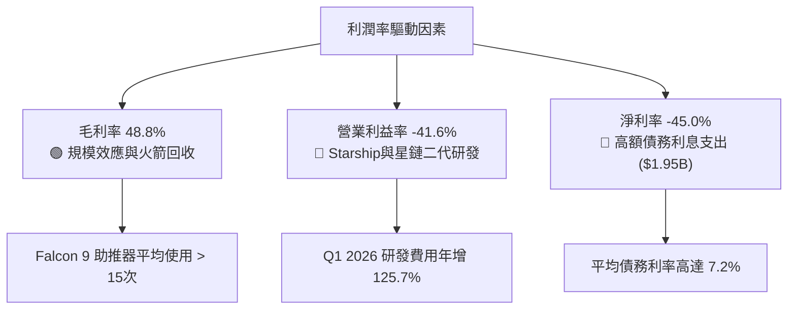

---

## 7. 估值深度分析

### 7.1 同業估值比較表格

由於 SPCX 在民用商業發射與低軌衛星領域具有實質壟斷性，我們選擇傳統國防/航太巨頭（Lockheed Martin, Northrop Grumman）與商業衛星通訊服務商（Viasat）進行對比。

| 估值指標 | **SPCX (SpaceX)** | **Lockheed Martin (LMT)** | **Northrop Grumman (NOC)** | **Viasat (VSAT)** | 本公司評估 |
|---|---|---|---|---|---|
| **Trailing P/E** | **N/A** (虧損) | 18.5x | 22.4x | N/A (虧損) | 🔴 獲利能力尚未穩定 |
| **Forward P/E** | **167.64x** | 16.2x | 18.0x | 35.5x | 🔴 估值溢價高達 900% |
| **P/S Ratio** | **99.18x** | 1.8x | 2.1x | 1.2x | 🔴 營收倍數極其誇張 |
| **EV / EBITDA** | **216.81x** | 12.8x | 14.5x | 8.2x | 🔴 息稅折舊前利潤倍數極高 |
| **EV / Revenue** | **44.37x** | 2.0x | 2.3x | 2.5x | 🔴 企業價值對營收比率極高 |
| **市值 (Market Cap)**| **$1.91T** | $112.5B | $72.8B | $1.8B | 🔴 市值已超越所有防務同行總和 |

### 7.2 歷史估值區間分析

SPCX 作為一級市場定價向二級市場過渡的標的，其 P/S 估值區間在過去 24 個月內隨著 Starlink 的商業化成功而不斷被推高，目前處於歷史最高分位數。

```
╔══════════════════════════════════════════════════════════════════╗
║              SPCX 歷史 P/S 估值區間與當前位置                    ║
╠══════════════════════════════════════════════════════════════════╣
║                                                                  ║
║  [2024-06]  P/S: 45x   █████████████░░░░░░░░░░░░░░░░             ║
║  [2025-06]  P/S: 75x   ██████████████████████░░░░░░░             ║
║  當前位置   P/S: 99.2x █████████████████████████████  ← 🔴 峰值  ║
║                                                                  ║
║  ⚠️ 估值診斷：                                                   ║
║  當前 99.2x 的 P/S 估值，要求公司在未來 5 年內維持不低於 35% 的   ║
║  營收年複合成長率，且營業利潤率必須迅速提升至 30% 以上。任何     ║
║  發射失敗、技術延遲或用戶流失，都將導致估值劇烈收縮。            ║
╚══════════════════════════════════════════════════════════════════╝
```

### 7.3 情境目標價（假設驅動，Bear / Base / Bull）

由於 SPCX 淨利潤為負，且折舊與研發支出巨大，我們採用 **EV/Sales** 與 **EV/EBITDA** 作為主要估值乘數，並結合未來 3 年的成長預期，推導出三種情境下的 12 個月目標價：

| 情境 | 營收 3Y CAGR | FY2028 預期營業利潤率 | 退出倍數 (EV/Sales) | 隱含目標價 | 相對現價 ($145.30) |
|---|---|---|---|---|---|
| 🔴 **悲觀情境** | 12.0% | -15.0% (研發失控) | 25.0x | **$85.00** | 🔴 -41.50% |
| 🟡 **基準情境** | **25.0%** | **15.0%** (星鏈轉正) | **55.0x** | **$165.00**| 🟢 +13.56% |
| 🟢 **樂觀情境** | 40.0% | 30.0% (Starship商用) | 80.0x | **$245.00**| 🟢 +68.62% |

### 7.4 DCF 敏感性分析（12個月目標價矩陣）

我們基於永續成長率 $g = 3.5\%$，對 WACC（貼現率）與終端營收成長率進行雙因素敏感性分析：

| 營收成長前景 | **WACC = 11.5%** | **WACC = 10.66% (基準)** | **WACC = 9.5%** |
|---|---|---|---|
| 🟢 **樂觀 (CAGR 40%)** | $215.00 (+48.0%) | **$245.00 (+68.6%)** | $280.00 (+92.7%) |
| 🟡 **基準 (CAGR 25%)** | $145.00 (-0.2%) | **$165.00 (+13.6%)** | $195.00 (+34.2%) |
| 🔴 **悲觀 (CAGR 12%)** | $70.00 (-51.8%) | **$85.00 (-41.5%)** | $105.00 (-27.7%) |

### 7.5 估值綜合區間

```
╔══════════════════════════════════════════════════════════════════╗
║                    📈 SPCX 估值綜合區間                          ║
╠══════════════════════════════════════════════════════════════════╣
║                                                                  ║
║  悲觀目標價：  $85.00     ████████░░░░░░░░░░░░░░░░░░░░░░░░       ║
║  當前股價：    $145.30    ███████████████░░░░░░░░░░░░░░░░░       ║
║  基準目標價：  $165.00    ███████████████████░░░░░░░░░░░░░       ║
║  樂觀目標價：  $245.00    ████████████████████████████████       ║
║                                                                  ║
║  📊 結論：當前股價 $145.30 處於合理估值區間的中偏上位置。        ║
║  下行風險（-$60.30）顯著大於短期上行空間（+$19.70），性價比一般。║
╚══════════════════════════════════════════════════════════════════╝
```

---

## 8. 成長催化劑

### 8.1 催化劑時間軸

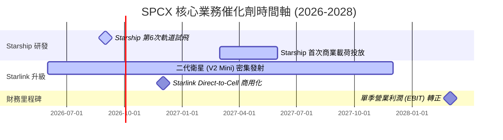

### 8.2 TAM 市場規模分析

SPCX 的長期成長空間由發射市場向全球電信市場大幅延伸。

```
╔══════════════════════════════════════════════════════════════════╗
║              SPCX 潛在市場規模 (TAM) 與滲透率                    ║
╠══════════════════════════════════════════════════════════════════╣
║                                                                  ║
║  1. 全球商業發射市場 (TAM: $15B)                                 ║
║     ├── 當前滲透率： ~85.0%                                      ║
║     └── 2025 貢獻收入： ~$7.72B                                  ║
║                                                                  ║
║  2. 全球寬頻與電信市場 (TAM: $1.2T)                              ║
║     ├── 當前滲透率： ~1.0%                                       ║
║     └── 2025 貢獻收入： ~$11.58B (Starlink)                      ║
║                                                                  ║
║  3. 軍工與國防太空安全 (TAM: $150B)                              ║
║     ├── 當前滲透率： ~3.0%                                       ║
║     └── 2025 貢獻收入： ~$4.50B (含星盾 Starshield)              ║
║                                                                  ║
║  📊 結論：Starlink 在偏遠地區、航空、航海市場的滲透率每提升 1pp， ║
║  將為公司帶來額外約 $12B 的高毛利經常性收入 (ARR)。              ║
╚══════════════════════════════════════════════════════════════════╝
```

### 8.3 成長驅動力結構圖

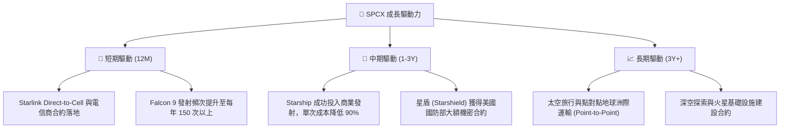

---

## 9. 風險矩陣

### 9.1 風險評分矩陣

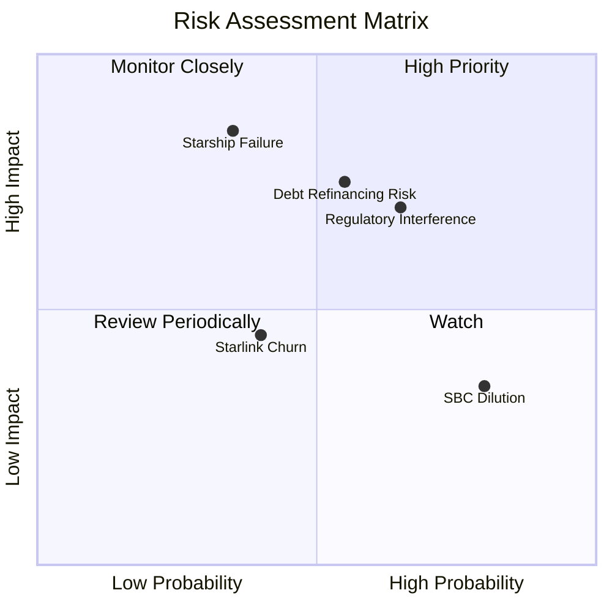

### 9.2 風險清單詳細分析

| # | 風險項目 | 發生機率 | 財務損害預估 | 風險評分 | 具體緩解措施 |
|---|---|---|---|---|---|
| 1 | 🔴 **Starship 研發與試飛重大失敗** | 中 (35%) | -25% 估值 (研發計提減損) | 🔴 **7.5 / 10** | 採用快速迭代、多原型機並行測試，分散單次失敗風險。 |
| 2 | 🔴 **高息債務再融資受阻** | 中 (55%) | 利息支出增加 $500M+ | 🔴 **7.2 / 10** | 利用一級市場強烈股權需求，適時發行新股以債轉股，降低槓桿。 |
| 3 | 🟡 **各國頻譜與落地監管干擾** | 高 (65%) | 限制 Starlink 海外擴張 (-15% 營收) | 🟡 **6.8 / 10** | 與各國本地電信運營商（如 T-Mobile、KDDI）進行利益綁定合作。 |
| 4 | 🟡 **股權薪酬 (SBC) 持續稀釋** | 極高 (80%) | 每年稀釋現有股東 1.5%-2.0% | 🟡 **5.5 / 10** | 在營運現金流轉正後，逐步建立股份回購計劃以抵消稀釋。 |

---

## 10. 投資建議

### 10.1 最終綜合評級雷達圖

```
╔══════════════════════════════════════════════════════════════╗
║                  SPCX 最終綜合評級雷達圖                     ║
╠══════════════════════════════════════════════════════════════╣
║                                                              ║
║  技術與護城河： 9.5 ▓▓▓▓▓▓▓▓▓▓▓▓▓▓▓▓▓▓▓░  ★★★★★           ║
║  市場成長空間： 8.5 ▓▓▓▓▓▓▓▓▓▓▓▓▓▓▓▓▓░░░  ★★★★☆           ║
║  資產負債健康： 5.5 ▓▓▓▓▓▓▓▓▓▓▓░░░░░░░░░  ★★★☆☆           ║
║  現金流安全性： 3.0 ▓▓▓▓▓▓░░░░░░░░░░░░░░  ★☆☆☆☆           ║
║  估值安全邊際： 2.5 ▓▓▓▓░░░░░░░░░░░░░░░░  ★☆☆☆☆           ║
║                                                              ║
╠══════════════════════════════════════════════════════════════╣
║  綜合投資評級： 5.9 / 10  👉 🟡 持有 (Hold)                  ║
╚══════════════════════════════════════════════════════════════╝
```

### 10.2 目標價與隱含報酬率

| 情境 | 發生機率權重 | 12M 目標價 | 隱含報酬率 (相較現價 $145.30) |
|---|---|---|---|
| 🔴 **悲觀情境** | 25% | $85.00 | -41.50% |
| 🟡 **基準情境** | **55%** | **$165.00** | **+13.56%** |
| 🟢 **樂觀情境** | 20% | $245.00 | +68.62% |
| **加權預期目標價**| **100%** | **$161.00** | **+10.81%** |

### 10.3 買入時機與觸發因素

```
╔══════════════════════════════════════════════════════════════════╗
║                  ✅ SPCX 投資行動觸發 Checklist                  ║
╠══════════════════════════════════════════════════════════════════╣
║                                                                  ║
║  立即買入觸發條件（需符合 2 項以上）：                           ║
║  ☐ 股價回檔至安全邊際區間： $115.00 - $120.00                    ║
║  ✅ Starlink 單季新增用戶數超預期 20% 以上                       ║
║  ☐ Starship 成功完成連續三次商業載荷發射                         ║
║                                                                  ║
║  加碼觸發條件：                                                  ║
║  ☐ 季度研發費用率控制在營收 40% 以下，且營運利潤率轉正           ║
║  ☐ 成功發行低息長期債券，完成現有高息債務（7.2%）的置換          ║
║                                                                  ║
║  減碼/停損觸發條件：                                             ║
║  ☐ Starship 發生連續兩次以上毀滅性發射失敗                       ║
║  ☐ 自由現金流赤字單季超過 -$12B，且手頭現金跌破 $10B             ║
╚══════════════════════════════════════════════════════════════════╝
```

### 10.4 投資人適配度分析

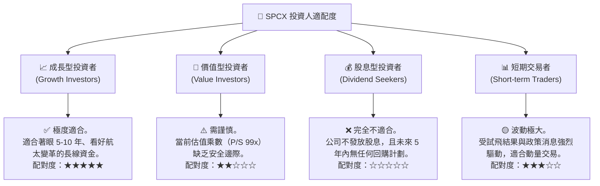

### 10.5 每季財報監控清單（Quarterly Watch List）

為了持續追蹤 SPCX 的基本面是否發生結構性惡化或改善，投資人應在每季財報中嚴格監控以下關鍵指標與臨界值：

| 監控指標 | 基準值 (當前) | 觸發「加碼」門檻 | 觸發「減碼/退出」門檻 | 監控核心意義 |
|---|---|---|---|---|
| **Starlink 營收成長率 (YoY)** | 15.42% | > 25.0% | < 10.0% | 評估星鏈在飽和市場外的開拓能力 |
| **研發費用率 (R&D / Revenue)** | 74.86% | < 45.0% (研發進入收尾) | > 85.0% (研發資金黑洞) | 評估資本消耗何時見頂 |
| **自由現金流 (FCF)** | -$9.07B (Q1 26) | 改善至 > -$3.0B / 季 | 惡化至 < -$12.0B / 季 | 評估債務與破產風險 |
| **股權薪酬稀釋率 (SBC / Revenue)**| 13.61% | < 8.0% | > 18.0% | 評估對現有股東權益的稀釋速度 |
| **未開單收入 (Unearned Revenue)** | $7.21B | > $9.00B (政府訂單大增) | < $5.50B (訂單流流失) | 評估未來發射服務的營收能見度 |

### 10.6 反面論證：什麼會證明投資論點錯誤（What Would Change My Mind）

本投資研究團隊維持客觀克制的態度。若出現以下**可量化條件**之一，我們將承認基準情境（目標價 $165.00）失效，並將評級下調至**「賣出」（Sell）**：

```
╔══════════════════════════════════════════════════════════════════╗
║              ⚠️ 論點失效條件 (Disconfirming Evidence)            ║
╠══════════════════════════════════════════════════════════════════╣
║  若以下任一條件成立，本報告之「持有」與基準目標價將立即失效：    ║
║                                                                  ║
║  ☐ 條件一：Starlink 全球訂閱用戶 YoY 成長率連續兩季低於 8%。     ║
║            （證明低軌衛星民用市場已達天花板，無法支撐高估值）    ║
║                                                                  ║
║  ☐ 條件二：Q1 2027 前，Starship 未能成功進行首次商業載荷投放。   ║
║            （研發進度嚴重滯後，折舊與研發成本將無限期拖累利潤）  ║
║                                                                  ║
║  ☐ 條件三：公司融資成本（新發債券利率）攀升至 9.5% 以上。        ║
║            （在 FCF 嚴重流失背景下，利息支出將徹底壓垮資產負債表）║
║                                                                  ║
║  ☐ 條件四：ROIC 連續四個季度低於 -15.0%，且 WACC 突破 12.0%。   ║
║            （經濟價值持續加速毀滅，資本配置宣告失敗）            ║
╚══════════════════════════════════════════════════════════════════╝
```

---

> **免責聲明**：本報告為基於提供數據之基本面學術研究與估值建模分析，不構成任何買賣建議。投資有風險，航太板塊波動極大，入市需極其謹慎。