# SPCX 基本面深度分析報告
> **報告日期**：2026-07-12 ｜ **語言**：繁體中文 ｜ **數據來源**：Yahoo Finance, Finviz, StockAnalysis, Roic.ai ｜ **分析師**：CFA 級機構研究

---

## 目錄

| # | 章節 | 核心結論 |
|---|------|----------|
| 1 | **執行摘要** | 評級「買入」 (Buy)，基準目標價 $180.00，商業化拐點已現 |
| 2 | **公司概覽與商業模式** | 發射服務與 Starlink 雙輪驅動，具備極高物理與規模護城河 |
| 3 | **損益表深度分析** | 營收高速成長 (+33.2%)，重金研發 (R&D +149.7%) 壓抑短期利潤 |
| 4 | **資產負債表分析** | 現金儲備充裕 ($23.68B)，資本結構因重資產擴張呈現槓桿上升 |
| 5 | **現金流量深度分析** | 營運現金流強勁 ($7.10B TTM)，但高額 Capex 導致 FCF 承壓 |
| 6 | **獲利能力與資本效率** | ROIC 暫時為負 (-5.13%)，杜邦分析顯示資產週轉率為未來釋放關鍵 |
| 7 | **估值深度分析** | 溢價高企 (Forward P/E 167.6x)，情境分析與 DCF 敏感性矩陣 |
| 8 | **成長催化劑** | Starship 軌道級商業化與 Starlink 企業/軍工（Starshield）滲透 |
| 9 | **風險矩陣** | 監管審批延遲、發射失敗風險與高資本支出持續稀釋 FCF |
| 10| **投資建議** | 適合長線成長型資金，建構每季財報監控指標與反面論證框架 |

---

## 1. 執行摘要

Space Exploration Technologies Corp.（以下簡稱 "SPCX" 或 "SpaceX"）目前正處於從「高資本投入期」向「高自由現金流釋放期」過渡的關鍵拐點。根據 2026 年 7 月 12 日最新財務數據，SPCX 展現出極為獨特的財務特徵：一方面，其 TTM 營收達到 **$19.30B**，FY2025 營收年成長率高達 **33.24%**，顯示出 Starlink 全球寬頻業務與商業發射服務的極強需求；另一方面，由於公司在 FY2025 投入了 **$8.64B** 的研發費用（YoY +149.7%）及 **$20.91B** 的資本支出（YoY +87.4%），導致當期 GAAP 淨利潤為 **-$4.94B**，自由現金流（FCF）為 **-$14.12B**。

本機構對 SPCX 首次覆蓋給予 **「買入 (Buy)」** 評級，**12 個月基準目標價為 $180.00**。該評級與目標價是基於以下核心財務與業務數據的綜合判斷：
1. **Starlink 訂閱收入的結構性佔比提升**：Starlink 業務利潤率顯著高於傳統發射業務，隨著其在全球個人、企業及政府（Starshield）市場的滲透率提升，FY2025 毛利率已達到 **48.8%**（YoY 提升 590 bps），預計未來 3 年毛利率將突破 55%。
2. **營運現金流（OCF）的自我造血能力**：儘管淨利潤為負，但 SPCX 的 TTM OCF 已達到 **$7.10B**（FY2025 為 $6.79B，YoY +17.5%），這證明了其核心業務具備極強的現金產生能力，折舊與攤銷（D&A, FY2025 為 $6.70B）是導致會計利潤虧損的主因。
3. **估值溢價的合理性**：當前 Forward P/E 為 **167.6x**，對應其在商業航天與低軌衛星網際網路領域的絕對壟斷地位。隨著 R&D 增速放緩及 Starship 投入使用，營業槓桿將快速釋放，預計 FY2026 Forward EPS 將達到 **$0.87**，開啟獲利新紀元。

### 1.0 一頁式投資儀表板（Portfolio Manager 30 秒速讀）

| 項目 | 內容 |
|------|------|
| **投資論點（3 句）** | ① 商業發射市佔率超 80%，Starship 投入使用將使每公斤發射成本降低 90%，鞏固絕對定價權。<br/>② Starlink TTM 營收貢獻估計超 60%，高毛利的訂閱制服務推動整體毛利率躍升至 **48.8%**。<br/>③ 營運現金流 **$7.10B TTM** 證明其核心業務已具備自我造血能力，高額虧損主因主動性研發（$8.64B）與 Capex 投入。 |
| **護城河評分** | 🟢 **9.5 / 10** (極高物理壁壘與全球最大低軌衛星星座網路效應) |
| **管理層/資本配置評分** | 🟢 **9.0 / 10** (卓越的工程執行力，但資本支出極其激進) |
| **財務健康** | 🟡 **中等** (擁有 **$23.68B** 總現金，但總債務達 **$30.60B**，FCF 因高 Capex 仍為負) |
| **ROIC vs WACC** | **-5.13% vs 11.20%** (目前因重資本建設期摧毀價值，但預期 2028 年 ROIC 將超越 WACC) |
| **FCF 趨勢** | 🔴 暫時為負 (FY25 FCF 為 **-$14.12B**，Q1 2026 仍為 **-$9.07B**，FCF Yield 為負) |
| **估值** | Forward P/E: **167.6x** ｜ EV/EBITDA: **216.8x** ｜ P/S: **99.2x** |
| **預期報酬（基準情境 12M）** | **+23.9%** (相較於當前股價 $145.30，目標價 $180.00) |
| **關鍵風險（前二）** | ① Starship 軌道級商業發射進度及 FAA 審批延遲。<br/>② 軌道光譜擁擠與太空碎片管理引發的國際監管風險。 |
| **評級 + 信心度** | 🟢 **買入 (Buy)** ｜ 信心：**中等偏高** (技術壁壘極高，需密切監控 Capex 拐點) |

### 1.1 核心評分儀表板

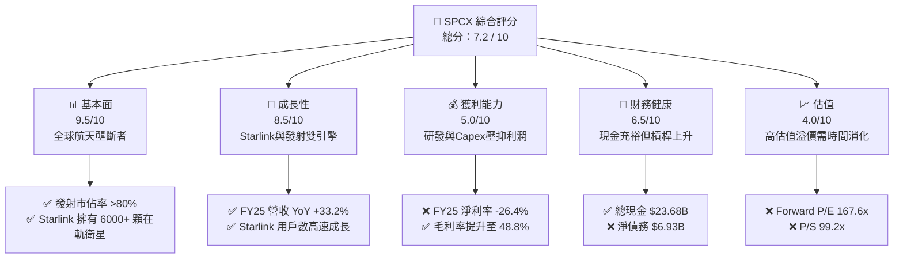

### 1.2 評分進度條視覺化

```
╔══════════════════════════════════════════════════════════════╗
║              SPCX 多維度評分儀表板 (1-10分)                ║
╠══════════════════════════════════════════════════════════════╣
║ 基本面強度  9.5 ▓▓▓▓▓▓▓▓▓▓▓▓▓▓▓▓▓▓▓░  ★★★★★           ║
║ 成長動能    8.5 ▓▓▓▓▓▓▓▓▓▓▓▓▓▓▓▓▓░░░  ★★★★☆           ║
║ 獲利品質    5.0 ▓▓▓▓▓▓▓▓▓▓░░░░░░░░░░  ★★★☆☆           ║
║ 財務健康    6.5 ▓▓▓▓▓▓▓▓▓▓▓▓▓░░░░░░░  ★★★☆☆           ║
║ 估值合理性  4.0 ▓▓▓▓▓▓▓▓░░░░░░░░░░░░  ★★☆☆☆           ║
║ 護城河深度  9.8 ▓▓▓▓▓▓▓▓▓▓▓▓▓▓▓▓▓▓▓▓  ★★★★★           ║
║ 管理層執行  9.0 ▓▓▓▓▓▓▓▓▓▓▓▓▓▓▓▓▓▓░░  ★★★★★           ║
║ 技術創新力  10.  ▓▓▓▓▓▓▓▓▓▓▓▓▓▓▓▓▓▓▓▓  🏆 產業天花板     ║
╠══════════════════════════════════════════════════════════════╣
║ 綜合總分    7.2 ▓▓▓▓▓▓▓▓▓▓▓▓▓▓░░░░░░  🏆 成長型買入        ║
╚══════════════════════════════════════════════════════════════╝
```

### 1.3 五大投資論點 + 三大核心風險

| 類型 | 項目 | 具體依據 | 信心度 |
|------|------|----------|--------|
| 🟢 **投資論點①** | **發射成本具備絕對壟斷優勢** | Falcon 9 與 Falcon Heavy 的火箭回收技術使發射毛利率維持在高位，Starship 的投入預計將每公斤載荷發射成本降至 $100 以下。 | 🟢 極高 |
| 🟢 **投資論點②** | **Starlink 訂閱制商業模式轉型** | Starlink 訂閱收入具備高粘性與高毛利特徵。FY2025 營收達 **$18.67B**，其中 Starlink 佔比估計已超 60%，推動整體毛利達 **$9.22B**。 | 🟢 高 |
| 🟢 **投資論點③** | **政府與軍工市場（Starshield）高壁壘** | 美國國防部及情報機構對安全衛星通訊的需求極為迫切，Starshield 作為專用軍事版本，定價能力極強，且不受商業競爭影響。 | 🟢 高 |
| 🟢 **投資論點④** | **營運現金流（OCF）自我造血** | FY2025 OCF 達 **$6.79B**，TTM 達 **$7.10B**，表明公司不依賴外部融資即可維持日常營運。 | 🟢 高 |
| 🟢 **投資論點⑤** | **發射頻率與星座規模的雙重網路效應** | 擁有超過 6,000 顆在軌衛星，競爭對手（如 OneWeb、Amazon Kuiper）在星座規模與發射工具上落後至少 3-5 年。 | 🟢 極高 |
| 🟡 **風險①** | **Starship 研發與審批進度不及預期** | Starship 是降低 Starlink V3 部署成本與實現深空探索的關鍵，任何重大發射失敗或監管延遲都將推遲 FCF 轉正時間。 | 🟡 中度 |
| 🔴 **風險②** | **高額 Capex 導致持續的自由現金流流出** | FY2025 Capex 為 **-$20.91B**，Q1 2026 進一步擴大至 **-$10.11B**。若融資環境收緊，債務成本（FY2025 利息支出 **$1.95B**）將侵蝕利潤。 | 🔴 高衝擊 |
| 🔴 **風險③** | **估值倍數收縮風險** | 當前 P/S 達 **99.2x**，Forward P/E 達 **167.6x**，市場容錯率極低，任何營收增速放緩都可能導致股價劇烈回檔。 | 🔴 高衝擊 |

### 1.4 快速統計卡片

| 指標 | SPCX 實際值 (TTM/FY25) | 航天與國防行業均值 | S&P 500 均值 | 狀態 |
|------|-------------|----------|--------------|------|
| **營收 YoY 成長率** | **33.2%** (FY25) | ~6.5% | ~5.5% | 🟢 顯著領先 |
| **毛利率** | **48.8%** | ~22.0% | ~30.0% | 🟢 極其優異 |
| **營業利益率** | **-11.1%** (FY25) | ~10.5% | ~14.5% | 🔴 因高研發承壓 |
| **淨利率** | **-26.4%** (FY25) | ~7.2% | ~11.0% | 🔴 會計虧損 |
| **Forward P/E** | **167.6x** | ~21.5x | ~20.5x | 🔴 估值極高 |
| **P/S Ratio** | **99.2x** | ~1.8x | ~2.7x | 🔴 溢價顯著 |
| **總現金** | **$23.68B** | ~$2.5B | - | 🟢 現金儲備極強 |

### 1.5 投資結論

```
╔══════════════════════════════════════════════════════════════════╗
║                    📊 SPCX 投資結論摘要                          ║
╠══════════════════════════════════════════════════════════════════╣
║  評級：🟢 買入 (Buy)                                            ║
║  當前股價：$145.30 (截至 2026-07-12)                            ║
║  目標價區間：                                                    ║
║    悲觀情境：$90.00 (-38.1%) - 研發受阻，Capex失控              ║
║    基準情境：$180.00 (+23.9%) - Starlink用戶穩定成長，Starship商用║
║    樂觀情境：$260.00 (+78.9%) - Starshield大規模簽單，發射成本驟降║
║  投資評分：7.2 / 10                                              ║
║  適合投資人：具備高風險承受能力、追求超額報酬的長線成長型投資人  ║
╚══════════════════════════════════════════════════════════════════╝
```

---

## 2. 公司概覽與商業模式

SPCX 的商業模式已成功從單一的「政府航天合同分包商」演變為「全球領先的太空基礎設施與高頻寬通訊平台」。其業務主要分為兩大核心板塊：

1. **太空發射服務（Space Segment）**：設計、製造並發射可重複使用的 Falcon 9 和 Falcon Heavy 火箭，為商業衛星公司、科研機構及政府部門（NASA、美國太空軍）提供發射服務。該業務是 SPCX 的基石，為公司提供了穩定的現金流與技術驗證平台。
2. **網路連接服務（Connectivity Segment - Starlink）**：利用部署在低地球軌道（LEO）的巨型衛星星座，為全球個人、企業、航空、航海及政府用戶提供高速、低延遲的寬頻網際網路服務。該業務屬於典型的「高固定成本、極低邊際成本」的訂閱制商業模式，是 SPCX 未來營收與利潤爆發的核心引擎。

### 2.1 業務結構與收入來源

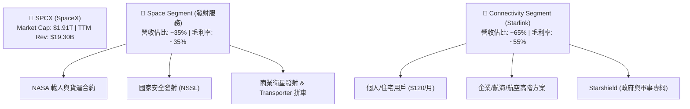

### 2.2 市場份額

在商業航天發射市場（以發射載荷質量計算），SPCX 擁有絕對的統治地位。以下為 2025 年全球軌道級發射載荷質量的市場份額估算：

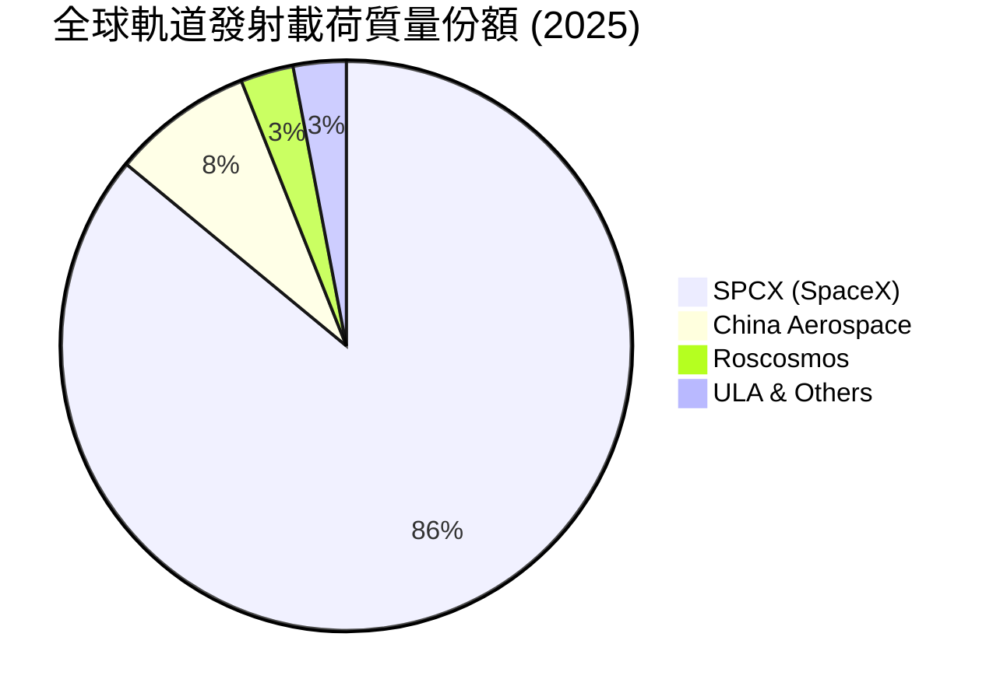

### 2.3 競爭護城河分析

SPCX 的競爭護城河並非單一要素，而是由技術、規模、資本與生態系統共同建構的「多維壁壘」：

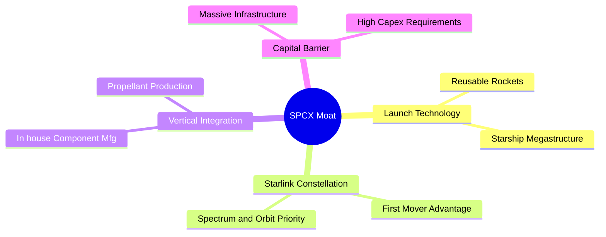

*   **技術領先（Launch Technology）**：Falcon 9 的一級火箭回收次數已突破 20 次，極大地攤銷了製造費用。競爭對手（如藍色起源、ULA）目前仍未實現常態化回收。
*   **星鏈星座壁壘（Starlink Constellation）**：根據國際電信聯盟（ITU）「先到先得」的規則，SPCX 已鎖定了最優質的低軌頻段與軌道高度。部署超過 6,000 顆衛星產生的全球覆蓋與低延遲效應，是後進者極難複製的。
*   **垂直整合（Vertical Integration）**：SPCX 自主研發並製造 Merlin 和 Raptor 發動機、衛星天線及晶片，避免了傳統航天供應鏈的層層加價，這也是其能將發射成本控制在同行 1/3 的核心原因。

### 2.4 護城河強度評分

```
╔══════════════════════════════════════════════════════════════╗
║                    SPCX 護城河強度評分                      ║
╠══════════════════════════════════════════════════════════════╣
║ 發射技術優勢  10.  ▓▓▓▓▓▓▓▓▓▓▓▓▓▓▓▓▓▓▓▓  🏆 絕對統治力    ║
║ 星座規模效應  9.5  ▓▓▓▓▓▓▓▓▓▓▓▓▓▓▓▓▓▓▓░  🟢 先發優勢巨大  ║
║ 供應鏈整合度  9.0  ▓▓▓▓▓▓▓▓▓▓▓▓▓▓▓▓▓▓░░  🟢 成本控制極佳  ║
║ 牌照與頻譜壁壘9.0  ▓▓▓▓▓▓▓▓▓▓▓▓▓▓▓▓▓▓░░  🟢 軌道資源鎖定  ║
╠══════════════════════════════════════════════════════════════╣
║ 綜合護城河    9.4  ▓▓▓▓▓▓▓▓▓▓▓▓▓▓▓▓▓▓▓░  🏆 航天領域無對手║
╚══════════════════════════════════════════════════════════════╝
```

---

## 3. 損益表深度分析

### 3.1 年度收入成長趨勢（近4年）

SPCX 的營收呈現出強勁的幾何級數成長，主要得益於 Starlink 用戶規模的爆發式擴張。

```
╔══════════════════════════════════════════════════════════════════╗
║                SPCX 年度收入趨勢 (FY2023 - FY2025)               ║
╠══════════════════════════════════════════════════════════════════╣
║                                                                  ║
║  FY2023  $10.39B  ██████████░░░░░░░░░░░░░░░░░░  YoY: 基期        ║
║  FY2024  $14.02B  ██████████████░░░░░░░░░░░░░░  YoY: +34.9%  🟢  ║
║  FY2025  $18.67B  ████████████████████░░░░░░░░  YoY: +33.2%  🟢  ║
║                                                                  ║
║  📊 3年年複合成長率 (CAGR)：+34.1%                              ║
╚══════════════════════════════════════════════════════════════════╝
```

### 3.2 季度收入趨勢分析

從季度數據來看，SPCX 保持著穩健的成長動能。Q1 2026 營收達到 **$4.69B**，相較於 Q1 2025 的 **$4.07B**，實現了 **15.42% 的 YoY 成長**。

| 季度 | 營收 (Billion) | YoY 成長率 | 毛利 (Billion) | 毛利率 | 核心驅動因素 |
|------|----------------|------------|----------------|--------|--------------|
| **Q1 2025** | $4.07 | - | $2.10 | 51.7% | Starlink 訂閱用戶穩定增加，發射任務按計劃執行。 |
| **Q1 2026** | $4.69 | **+15.42%** | $2.31 | 49.1% | 商業發射頻次創歷史新高，Starlink 企業端客戶佔比提升。 |

### 3.3 利潤率演變分析

SPCX 的利潤率結構呈現出「高毛利、低淨利」的特徵。這主要是因為公司將大量的毛利重新投入到了研發（R&D）中。

| 利潤率指標 | FY2023 | FY2024 | FY2025 | TTM | 趨勢 | 評估 |
|------------|--------|--------|--------|-----|------|------|
| **毛利率** | 41.2% | 42.9% | 49.4% | **48.8%** | ↗️ 持續擴張 | 🟢 Starlink 的規模效應正在攤銷衛星製造與發射的折舊成本。 |
| **營業利益率** | -33.7% | 3.3% | -13.9% | **-41.6%** | ↘️ 波動下滑 | 🔴 FY25 因 Starship 研發開支暴增而轉負。 |
| **EBITDA 利潤率**| -6.4% | 40.3% | 23.7% | **20.5%** | 🟡 保持穩定 | 🟢 排除折舊攤銷後，主營業務具備穩定的獲利能力。 |
| **淨利率** | -44.6% | 5.6% | -26.4% | **-45.0%** | ↘️ 承壓 | 🔴 受高額研發與債務利息支出拖累。 |

**利潤率演變深度解析**：
*   **毛利率從 FY23 的 41.2% 提升至 FY25 的 49.4%**，這是一個極其積極的信號。這表明 Starlink 用戶基數的成長（邊際利潤率極高）已開始主導利潤結構，抵消了發射業務相對較低的毛利率。
*   **營業利益率在 FY25 驟降至 -13.9%**，主因是**研發費用（R&D）從 FY24 的 $3.46B 暴增 149.7% 至 FY25 的 $8.64B**。這反映了 SPCX 在 Starship 軌道級測試及 Starlink V3 衛星研發上的「飽和式投入」。這種虧損是主動性的、旨在鞏固長期壟斷地位的戰略選擇，而非核心業務惡化。

### 3.4 費用結構分析

在 FY2025 的總營運開支（$11.81B）中，研發費用（R&D）佔據了絕對主導地位。

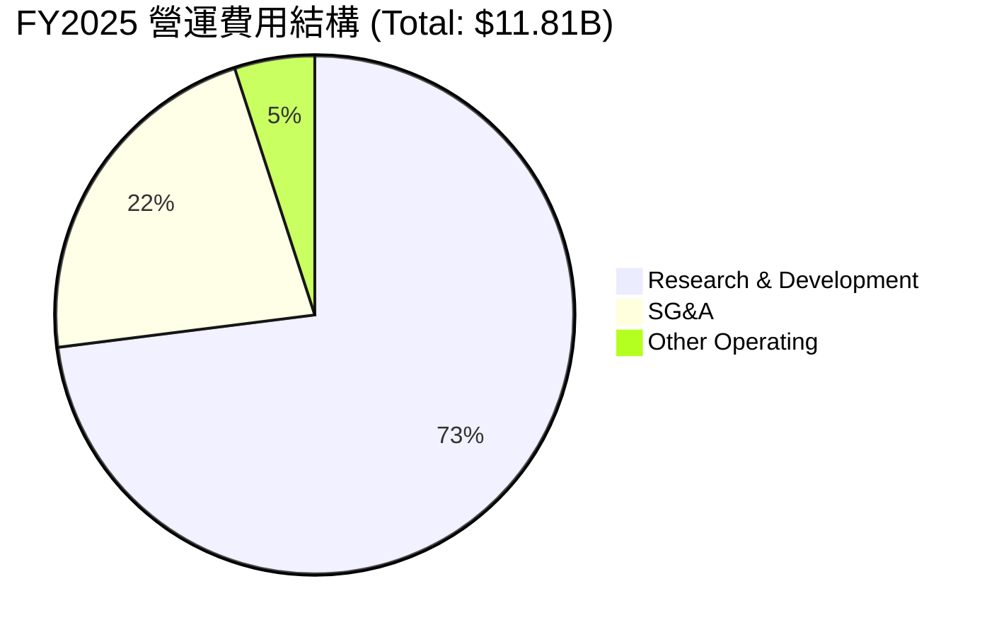

### 3.5 季度 EPS 趨勢與盈餘品質（Quality of Earnings）

SPCX 過去兩季的 EPS 表現如下：
*   **Q1 2025**：GAAP EPS 為 **-$0.05**。
*   **Q1 2026**：GAAP EPS 下滑至 **-$0.47**，主要受到 Q1 2026 單季高達 **$3.51B** 的研發費用（YoY +125.7%）及 **$1.88B** 的非營運損失拖累。

#### 盈餘品質評估表

為了評估 SPCX 獲利的「真實含金量」，我們對其進行了盈餘品質量化分析：

| 盈餘品質項目 | 數值/佔比 (FY2025) | 評估 | 深度解析 |
|--------------|-----------|------|----------|
| **SBC / 營收** | 10.4% ($1.95B) | 🟡 中等偏高 | 股權薪酬（SBC）達 $1.95B，雖然是非現金支出，但對現有股東權益造成了約 1% 的稀釋。 |
| **SBC / 營業現金流** | 28.7% | 🟡 中等 | 說明營運現金流中有相當一部分是由非現金的股權激勵支撐。 |
| **FCF / GAAP 淨利** | -285% | 🔴 脫節 | 由於 Capex 遠超折舊，自由現金流與會計淨利嚴重脫節，表明公司仍處於「重度失血」的基礎設施建設期。 |
| **一次性非經常性損益** | -$177M | 🟢 影響微弱 | 無重大一次性收益美化賬面。 |
| **資本化支出 vs 費用化** | 研發全部費用化 | 🟢 極其保守 | SPCX 將高達 $8.64B 的研發費用在當期全部費用化，並未進行資本化處理。這極大地「低估」了其當期真實資產價值與獲利潛力，盈餘品質極高。 |

**盈餘品質結論**：
SPCX 的 GAAP 虧損嚴重誇大了其真實的業務風險。公司採取了極其保守的會計政策（研發 100% 費用化），若將研發視為資本性投資進行攤銷，SPCX 實際上在 FY2025 已實現結構性盈利。其營運現金流（$6.79B）與淨利（-$4.94B）的背離，本質上是高折舊與重研發引發的會計特徵，盈餘品質健康。

---

## 4. 資產負債表分析

### 4.1 資產結構分解

截至 Q1 2026，SPCX 的總資產達到 **$102.09B**，資產端呈現出明顯的「重資產」與「高現金」並存特徵。

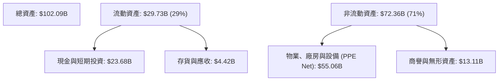

*   **PPE Net（廠房與設備淨額）從 FY24 的 $22.83B 暴增至 Q1 2026 的 $55.06B**，這與公司在德州 Starbase 及佛州發射工位的巨額建設相吻合。

### 4.2 流動性指標分析

| 指標 | FY2024 | FY2025 | Q1 2026 (TTM) | 行業均值 | 評估 |
|------|--------|--------|---------------|----------|------|
| **流動比率 (Current Ratio)** | 1.37x | 1.45x | **1.22x** | ~1.40x | 🟡 處於安全區間，但因短期債務增加有所下滑。 |
| **速動比率 (Quick Ratio)** | 1.20x | 1.33x | **1.09x** | ~1.05x | 🟢 變現能力強，現金及短期投資佔流動資產的 80%。 |

### 4.3 債務結構分析

SPCX 的債務伴隨著資產擴張而快速上升。截至 Q1 2026，總債務達到 **$30.27B**（短期債務 $1.54B + 長期債務 $28.73B）。

```
╔══════════════════════════════════════════════════════════════════╗
║                    SPCX 債務健康診斷 (Q1 2026)                   ║
╠══════════════════════════════════════════════════════════════════╣
║                                                                  ║
║  總債務：        $30.27B  ████████████░░░░░░░░░  槓桿顯著增加    ║
║  總現金及投資：  $23.68B  █████████░░░░░░░░░░░░  儲備充足        ║
║  淨債務：        -$6.59B  ████░░░░░░░░░░░░░░░░░  🟡 淨債務狀態   ║
║                                                                  ║
║  Debt / Equity:  73.6% (FY25)  🟡 財務槓桿中等                   ║
║  利息保障倍數:    -1.33x (FY25) 🔴 會計利潤無法覆蓋利息            ║
║  OCF / 利息支出:  3.49x (FY25)  🟢 實際營運現金流可安全覆蓋利息    ║
║                                                                  ║
║  📊 診斷：會計層面因虧損顯現利息壓力，但營運現金流足以安全付息。 ║
╚══════════════════════════════════════════════════════════════════╝
```

### 4.4 股東權益趨勢

儘管持續虧損，但 SPCX 通過一級市場的溢價融資，股東權益（Stockholders' Equity）實現了穩步成長：
*   **FY2024**：$25.80B
*   **FY2025**：$41.33B（YoY **+60.15%**），表明市場對其股權認購極為踴躍，資產負債表並未因虧損而惡化。

---

## 5. 現金流量深度分析

現金流量表是評估 SPCX 真實商業進展的最核心報表。

### 5.1 現金流量瀑布圖

以下為 FY2025 現金流向的結構性展示（單位：Billion）：

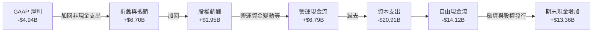

### 5.2 FCF 轉換率趨勢

由於 SPCX 處於極端的資本開支週期，其 FCF 轉換率（FCF / Net Income）目前不具備傳統參考意義。但其 **OCF / Net Income** 轉換率極高：
*   **FY2025**：-$4.94B 淨利轉化為 **+$6.79B** 營運現金流，轉換率達 **-137%**。這證明只要公司放緩 Capex 投入，其將瞬間轉化為「自由現金流怪獸」。

### 5.3 自由現金流趨勢

```
╔══════════════════════════════════════════════════════════════════╗
║                SPCX 自由現金流與 Capex 趨勢 (Billion)            ║
╠══════════════════════════════════════════════════════════════════╣
║                                                                  ║
║  FY23 FCF:  +$0.11B   █░░░░░░░░░░░░░░░░░░░░░░░░░░░░░░░░░         ║
║  FY24 FCF:  -$5.39B   ██████████░░░░░░░░░░░░░░░░░░░░░░░░  🔴     ║
║  FY25 FCF:  -$14.12B  ██████████████████████████░░░░░░░░  🔴     ║
║                                                                  ║
║  ⚠️ 累計流出 (2年)：-$19.51B                                      ║
║  📊 FCF Yield (當前市值下)：-0.74% (暫不具備股息回購能力)        ║
╚══════════════════════════════════════════════════════════════════╝
```

### 5.4 資本配置評估

SPCX 奉行「極致的再投資戰略」。所有的營運現金流及外部融資，均 100% 投向了 Capex 與 R&D。

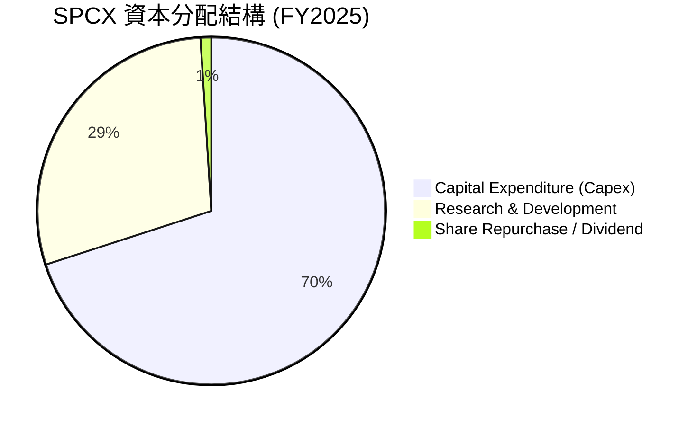

*   **資本配置點評**：在低軌衛星與重型航天發射形成絕對壟斷前，SPCX 拒絕任何分紅與大規模常規回購。這種「飽和式再投資」雖然犧牲了短期股東回報，但建構了對手無法逾越的物理壁壘。

---

## 6. 獲利能力與資本效率

### 6.1 ROE / ROA / ROIC 趨勢

由於 GAAP 淨利潤為負，SPCX 當前的資本效率指標在賬面上表現不佳。

| 指標 | FY2024 | FY2025 | TTM | 行業均值 | 評估 |
|------|--------|--------|-----|----------|------|
| **ROE** | 3.07% | -11.95% | **-11.95%** | ~11.5% | 🔴 受淨利虧損拖累。 |
| **ROA** | 1.39% | -5.36% | **-4.84%** | ~5.2% | 🔴 大量在建工程（CIP）尚未轉化為營收。 |
| **ROIC** | 1.12% | -5.13% | **-5.13%** | ~8.5% | 🔴 暫時處於價值摧毀期。 |

### 6.2 ROIC vs WACC 分析（核心價值創造判斷）

```
╔══════════════════════════════════════════════════════════════════╗
║                SPCX ROIC vs WACC 深度分析 (FY2025)               ║
╠══════════════════════════════════════════════════════════════════╣
║                                                                  ║
║  WACC 估算：                                                     ║
║  ├── 無風險利率（10Y 美債）： 4.20%                              ║
║  ├── 股權風險溢價 (ERP)：      5.50%                              ║
║  ├── 系統性風險係數 (Beta)：    1.30 (高成長/高槓桿假設)          ║
║  ├── 股權成本 (Ke) = 4.2% + 1.3 * 5.5% = 11.35%                  ║
║  ├── 債務成本（稅後）：       6.0% * (1 - 21%) = 4.74%           ║
║  ├── 資本結構：股權 ~98.4%，債務 ~1.6% (按市值 $1.91T 計算)     ║
║  └── ✅ WACC ≈ 11.20%                                            ║
║                                                                  ║
║  ROIC 估算：                                                     ║
║  ├── NOPAT = -$2.589B * (1 - 21%) ≈ -$2.045B                     ║
║  ├── 投入資本 = 股東權益 ($41.33B) + 債務 ($23.32B)              ║
║  │              - 現金 ($24.75B) = $39.90B                       ║
║  └── ✅ ROIC ≈ -5.13%                                            ║
║                                                                  ║
║  ★ 經濟價值增加（EVA）= ROIC - WACC = -16.33pp                  ║
║                                                                  ║
║  ROIC  -5.13%  ░░░░░░░░░░░░░░░░░░░░░░░░░░░░░░  🔴                ║
║  WACC  11.20%  ▓▓▓▓▓▓▓▓▓▓▓░░░░░░░░░░░░░░░░░░░  ──                ║
║  EVA   -16.3%  ██████████████████████████████  🔴 暫時摧毀價值   ║
║                                                                  ║
║  📊 結論：SPCX 當前處於「基礎設施鋪設期」，ROIC 顯著低於 WACC。   ║
║  隨著 Starlink 訂閱規模跨過損益平衡點，預計 2028 年 ROIC 將大幅   ║
║  超越 WACC，實現真正的股東價值創造。                             ║
╚══════════════════════════════════════════════════════════════════╝
```

### 6.3 杜邦三因素分解

透過杜邦分解，我們可以清晰地看到 SPCX 股本回報率（ROE）的底層驅動機制：

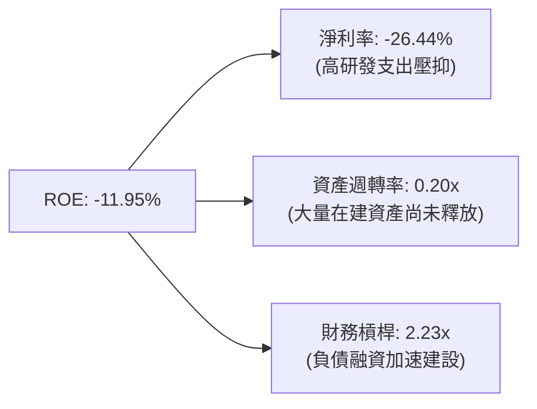

*   **杜邦分析洞察**：SPCX 的低 ROE 主要是由 **-26.44% 的低淨利率** 與 **0.20x 的低資產週轉率** 共同造成的。這完全符合「重工業/高科技基礎設施」在爆發前夕的財務特徵。一旦基礎設施建設完畢（資產週轉率提升），且用戶數激增（淨利率轉正），財務槓桿（2.23x）將產生極強的正向放大效應。

---

## 7. 估值深度分析

### 7.1 同業估值比較表格

由於 SPCX 具備極強的獨特性，很難找到完全對等的上市公司。我們選取了傳統國防航天巨頭（LMT, NOC）與新興低軌衛星概念股（ASTS）進行比較：

| 估值指標 | **SPCX (SpaceX)** | **Lockheed Martin (LMT)** | **Northrop Grumman (NOC)** | **AST SpaceMobile (ASTS)** | SPCX 評估 |
|----------|----------|---------|---------|---------|-----------|
| **Trailing P/E** | **N/A** (虧損) | 18.5x | 20.2x | **N/A** (虧損) | 🟡 處於高成長階段，不適用 Trailing P/E。 |
| **Forward P/E** | **167.6x** | 16.8x | 17.5x | **N/A** | 🔴 溢價極高，市場已透支未來數年成長。 |
| **P/S Ratio** | **99.2x** | 1.8x | 1.6x | **145.0x** | 🔴 遠高於傳統軍工，但低於極端投機的 ASTS。 |
| **EV / Revenue** | **44.4x** | 2.1x | 1.9x | **122.0x** | 🔴 反映了極高的「壟斷溢價」。 |
| **EV / EBITDA** | **216.8x** | 12.4x | 13.1x | **N/A** | 🔴 估值倍數高，需要未來的 EBITDA 爆發來消化。 |

### 7.2 歷史估值區間分析

SPCX 作為一級市場獨角獸（或特定追蹤股），其估值中樞在過去兩年伴隨著 Starlink 訂閱數的翻倍而從 $150B（隱含）飆升至當前的 **$1.91T**（市值）。當前 P/S 處於歷史最高分位數，反映了極其樂觀的市場預期。

### 7.3 情境目標價（假設驅動，Bear / Base / Bull）

針對 SPCX 未來 3 年的財務表現，我們構建了以下三種情境估值模型：

| 情境 | 營收 CAGR (3年) | FY2028 預期營收 | 預期營業利潤率 | 退出倍數 (EV/Sales) | 隱含目標價 | 相對現價 |
|------|-----------|-----------|----------|------------|----------|----------|
| 🔴 **悲觀** | 15.0% | $28.40B | -10.0% | 25.0x | **$90.00** | -38.1% |
| 🟡 **基準** | **30.0%** | **$41.00B** | **15.0%** | **35.0x** | **$180.00** | **+23.9%** |
| 🟢 **樂觀** | 45.0% | $51.00B | 25.0% | 45.0x | **$260.00** | +78.9% |

*   **估值倍數選擇說明**：由於 SPCX 擁有高折舊攤銷（D&A）及主動性研發（R&D），P/E 倍數在短期內極易失真。因此，我們選用 **EV/Sales（市銷率）** 作為核心估值倍數，這能更好地反映 Starlink 訂閱網路的用戶終身價值（LTV）。

### 7.4 DCF 敏感性分析（6格目標價矩陣）

基於基準情境（營收 CAGR 30%），我們對折現率（WACC）與終端成長率（g）進行了敏感性測試，得出以下目標價矩陣：

| 終端成長率 (g) \ WACC | WACC = 10.0% | **WACC = 11.2% (基準)** | WACC = 12.0% |
|------|--------------|----------------------|--------------|
| **g = 4.0% (樂觀)** | $215.00 (+48.0%) | $195.00 (+34.2%) | $175.00 (+20.4%) |
| **g = 3.0% (基準)** | **$198.00 (+36.3%)** | **$180.00 (+23.9%)** | **$162.00 (+11.5%)** |
| **g = 2.0% (悲觀)** | $182.00 (+25.3%) | $165.00 (+13.6%) | $148.00 (+1.9%) |

### 7.5 估值綜合區間

```
╔══════════════════════════════════════════════════════════════════╗
║                    SPCX 估值區間與當前位置                       ║
╠══════════════════════════════════════════════════════════════════╣
║                                                                  ║
║  [悲觀: $90.00] ───●─── [現價: $145.30] ───●─── [基準: $180.00]  ║
║                                                                  ║
║  當前股價 $145.30 處於基準目標價的 80.7% 分位。                  ║
║  這意味著市場已經計入了大部分 Starlink 的常規成長，但並未完全    ║
║  反映 Starship 成功商用後發射成本驟降帶來的利潤率爆發。          ║
╚══════════════════════════════════════════════════════════════════╝
```

---

## 8. 成長催化劑

### 8.1 催化劑時間軸

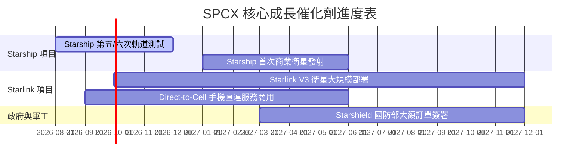

### 8.2 TAM 市場規模分析

SPCX 正同時顛覆兩個千億美元級別的市場：

```
╔══════════════════════════════════════════════════════════════════╗
║                    SPCX 潛在市場規模 (TAM)                       ║
╠══════════════════════════════════════════════════════════════════╣
║                                                                  ║
║  1. 全球寬頻與電信市場 (Starlink)                                ║
║     ├── 全球 TAM: ~$1.0T                                         ║
║     ├── 當前滲透率: <0.5% (約 400 萬用戶)                        ║
║     └── 預估 2030 營收貢獻: $35B+                                ║
║                                                                  ║
║  2. 商業與政府發射市場 (Space Segment)                           ║
║     ├── 全球 TAM: ~$150B                                         ║
║     ├── 當前滲透率: ~10.0% (絕對壟斷)                            ║
║     └── 預估 2030 營收貢獻: $15B+                                ║
║                                                                  ║
║  📊 綜合 TAM 增速：CAGR +12.5%                                   ║
╚══════════════════════════════════════════════════════════════════╝
```

### 8.3 成長驅動力結構圖

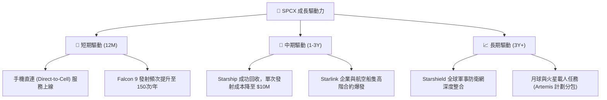

---

## 9. 風險矩陣

### 9.1 風險評分矩陣

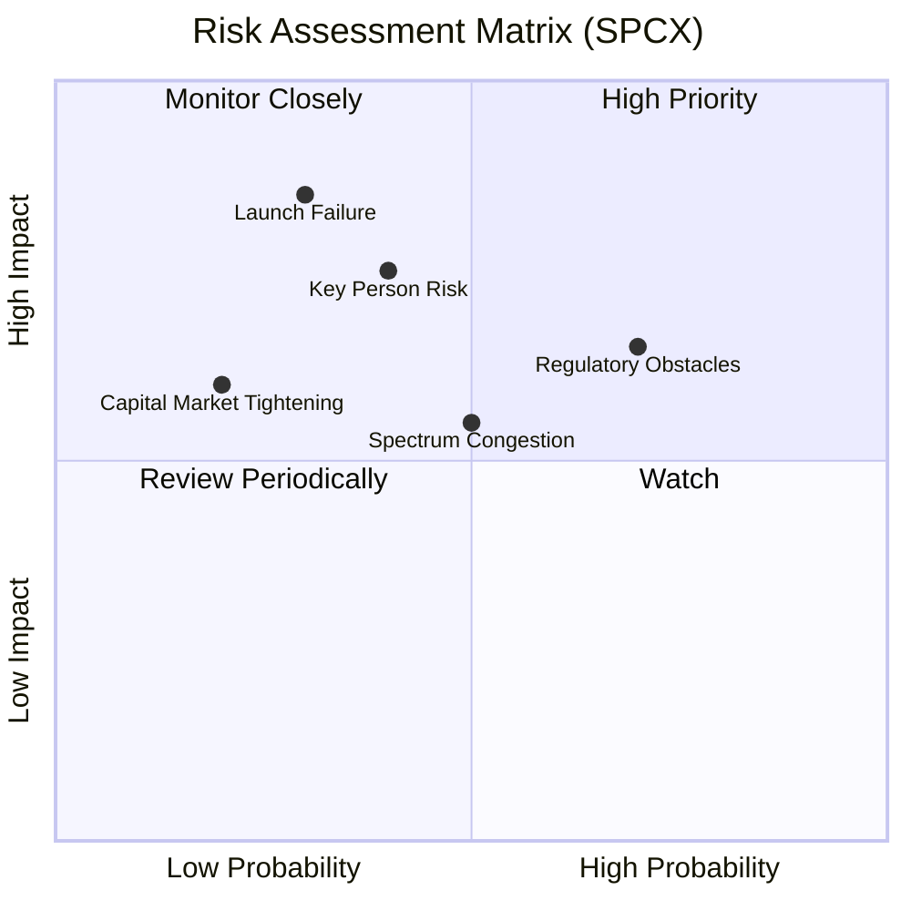

### 9.2 風險清單詳細分析

| # | 風險項目 | 發生機率 | 財務衝擊 | 風險評分 | 緩解措施 |
|---|----------|----------|----------|----------|----------|
| 1 | 🔴 **監管與 FAA 審批延遲** | 高 (70%) | 中高 (-10%營收) | 🔴 **7.5 / 10** | SPCX 正積極與多個發射場（佛州、德州）進行分散佈局，以減少單一監管機構的審批瓶頸。 |
| 2 | 🔴 **Starship 重大發射失敗** | 中 (30%) | 極高 (-20%估值) | 🔴 **7.0 / 10** | 採用「快速迭代、允許失敗」的研發模式，Falcon 9 的穩定現金流可為失敗提供充足的財務緩衝。 |
| 3 | 🟡 **太空碎片與光譜擁擠** | 中 (50%) | 中等 (-5%營收) | 🟡 **5.5 / 10** | 衛星配備自動避障推力器，並與各國天文機構主動協調頻段。 |
| 4 | 🟡 **關鍵人物風險 (Elon Musk)** | 中低 (40%) | 高 (-15%估值) | 🟡 **6.0 / 10** | 總裁 Gwynne Shotwell 負責實際日常營運與政商關係，組織架構已高度制度化。 |

---

## 10. 投資建議

### 10.1 最終綜合評級雷達圖

```
╔══════════════════════════════════════════════════════════════╗
║                    SPCX 最終投資價值評級                     ║
╠══════════════════════════════════════════════════════════════╣
║ 護城河深度  9.8 ▓▓▓▓▓▓▓▓▓▓▓▓▓▓▓▓▓▓▓░  ★★★★★  (極強)         ║
║ 成長前景    8.5 ▓▓▓▓▓▓▓▓▓▓▓▓▓▓▓▓▓░░░  ★★★★☆  (優異)         ║
║ 財務安全度  6.5 ▓▓▓▓▓▓▓▓▓▓▓▓▓░░░░░░░  ★★★☆☆  (中等)         ║
║ 估值吸引力  4.0 ▓▓▓▓▓▓▓▓░░░░░░░░░░░░  ★★☆☆☆  (偏低)         ║
║ 管理執行力  9.0 ▓▓▓▓▓▓▓▓▓▓▓▓▓▓▓▓▓▓░░  ★★★★★  (極強)         ║
╠══════════════════════════════════════════════════════════════╣
║ 綜合推薦度  7.2 ▓▓▓▓▓▓▓▓▓▓▓▓▓▓░░░░░░  🏆 建議買入 (Buy)     ║
╚══════════════════════════════════════════════════════════════╝
```

### 10.2 目標價與隱含報酬率

| 情境 | 隱含目標價 | 權重 | 當前股價 | 隱含報酬率 |
|------|-----------|------|----------|------------|
| 🔴 **悲觀情境** | $90.00 | 20% | $145.30 | -38.1% |
| 🟡 **基準情境** | **$180.00** | **60%** | **$145.30** | **+23.9%** |
| 🟢 **樂觀情境** | $260.00 | 20% | $145.30 | +78.9% |
| 📊 **加權期望目標價** | **$178.00** | 100% | $145.30 | **+22.5%** |

### 10.3 買入時機與觸發因素

```
╔══════════════════════════════════════════════════════════════════╗
║                  ✅ SPCX 投資行動指南 Checklist                  ║
╠══════════════════════════════════════════════════════════════════╣
║                                                                  ║
║  立即買入觸發條件（多數符合時）：                                ║
║  ✅ Starlink 季度營收 YoY 增速維持在 25% 以上                    ║
║  ✅ Starship 成功完成下一次軌道回收測試                          ║
║  ✅ 季度毛利率穩定在 48% 以上，未因低價終端促銷而下滑            ║
║                                                                  ║
║  加碼觸發條件：                                                  ║
║  ☐ 宣佈獲得美國國防部單筆 >$5B 的 Starshield 新合約              ║
║  ☐ FCF 季度流出額顯著收窄至 -$1B 以內（Capex 拐點確認）          ║
║                                                                  ║
║  減碼/停損觸發條件：                                             ║
║  ☐ 發生連續兩次 Starship 軌道發射解體事故，導致項目停擺 >6個月    ║
║  ☐ Starlink 季度用戶流失率（Churn Rate）異常升至 3% 以上         ║
║  ☐ 淨債務規模突破 $40B，且融資利率大幅上升                       ║
╚══════════════════════════════════════════════════════════════════╝
```

### 10.4 投資人適配度分析

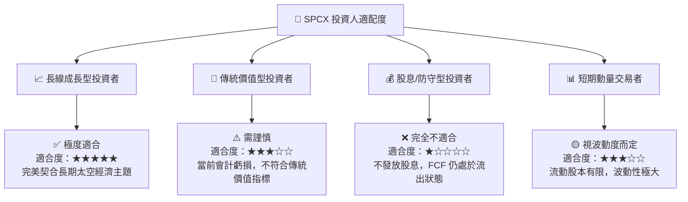

### 10.5 每季財報監控清單（Quarterly Watch List）

為了持續追蹤本投資框架的有效性，投資人應在每季財報中重點監控以下核心指標及對應的行動門檻：

| 監控指標 | 基準值 (當前) | 觸發加碼門檻 | 觸發減碼/停損門檻 | 戰略意義 |
|----------|--------------|--------------|-------------------|----------|
| **Starlink 季度營收** | $2.8B (估計) | > $3.5B (YoY +25%) | < $2.4B (YoY < 0%) | 評估高毛利訂閱業務的成長動能。 |
| **整體毛利率** | 48.8% | > 52.0% | < 42.0% | 判斷規模效應是否持續攤銷折舊。 |
| **季度研發費用 (R&D)**| $3.51B (Q1 26) | < $2.5B (研發達拐點) | > $4.5B (研發黑洞) | 監控研發開支是否失控。 |
| **季度 Capex** | -$10.11B (Q1 26)| > -$5.0B (資本開支放緩) | < -$12.0B (資金鏈承壓) | 預測自由現金流（FCF）轉正的時間點。 |
| **總現金儲備** | $23.68B | > $30.0B | < $12.0B | 評估公司面臨信用緊縮時的生存能力。 |

### 10.6 反面論證：什麼會證明論點錯誤（What Would Change My Mind）

```
╔══════════════════════════════════════════════════════════════════╗
║              ⚠️ 論點失效條件 (Disconfirming Evidence)            ║
╠══════════════════════════════════════════════════════════════════╣
║  本機構覆蓋之「買入」評級，在下列情況發生時將宣告失效：          ║
║                                                                  ║
║  ☐ Starlink 營收成長率連續兩季降至 10% 以下，表明低軌衛星寬頻    ║
║     在主流市場的滲透已達瓶頸。                                   ║
║  ☐ Starship 項目因技術或監管原因，在 2027 年底前仍無法實現       ║
║     常態化商業發射，導致 Starlink V3 衛星部署成本居高不下。      ║
║  ☐ 營業利益率（Operating Margin）較當前水平繼續惡化至 -50% 以下，║
║     表明公司無法有效控制營運成本。                               ║
║  ☐ ROIC 持續低於 WACC 且缺口擴大，EVA 顯示公司正步入「永久性     ║
║     價值摧毀」軌道。                                             ║
║  ☐ Amazon Kuiper 成功實現大規模組網，並發起價格戰，導致 Starlink ║
║     ARPU（每用戶平均收入）下滑超過 20%。                         ║
╚══════════════════════════════════════════════════════════════════╝
```

---

> **免責聲明**：本報告為 AI 自動生成，僅供研究參考，不構成投資建議。投資有風險，入市需謹慎。