# SPCX 基本面深度分析報告
> **報告日期**：2026-07-13 ｜ **語言**：繁體中文 ｜ **數據來源**：Yahoo Finance, Finviz, StockAnalysis, Roic.ai ｜ **分析師**：CFA 級機構研究

---

## 目錄

| # | 章節 | 核心結論 |
|---|---|---|
| 1 | 執行摘要 | 評級：**買入 (Buy)** ｜ 目標價區間：**$75.00 ~ $380.00**（基準 $220.00） |
| 2 | 公司概覽與商業模式 | 低軌衛星與可回收火箭雙引擎驅動，具備極高進入壁壘與強大護城河 |
| 3 | 損益表深度分析 | 營收高速成長（TTM $19.30B, YoY +15.4%），但研發與非經常性支出拖累短期獲利 |
| 4 | 資產負債表分析 | 資產規模突破千億（$102.09B），重資產擴張期債務上升，但流動性仍屬穩健 |
| 5 | 現金流量深度分析 | 營運現金流穩健（TTM $7.10B），但巨額資本支出（TTM >$26B）導致自由現金流承壓 |
| 6 | 獲利能力與資本效率 | 當前 ROIC (-13.1%) 受大規模前置投資壓抑，預期隨衛星聯網商用化將迎來拐點 |
| 7 | 估值深度分析 | 高成長溢價，Forward P/E 160.5x，EV/EBITDA 216.8x，DCF 顯示長期上行空間大 |
| 8 | 成長催化劑 | Starship 軌道發射常態化、Starlink 企業與政府端滲透率提升、TAM 持續擴張 |
| 9 | 風險矩陣 | 發射失敗風險、地緣政治監管、高資本支出導致的融資壓力 |
| 10 | 投資建議 | 適合長線成長型投資者，建議於 $135-$140 區間分批佈局 |

---

## 1. 執行摘要

Space Exploration Technologies Corp.（以下簡稱 "SPCX" 或 "SpaceX"）作為全球商業航太與低軌衛星通訊的絕對龍頭，正處於從「資本高投入期」向「商業化變現期」過渡的關鍵節點。根據最新 TTM 數據，公司營收達到 **$19.30B**，同比成長 **15.4%**。然而，由於公司在下一代超重型運載火箭 Starship（星艦）以及 Starlink（星鏈）第二代衛星的研發與發射上投入了空前資金，導致 TTM 營業利潤率下滑至 **-41.6%**，淨利潤為 **-$8.68B**。

儘管賬面利潤呈現暫時性虧損，但其核心業務的「含金量」極高。TTM 營運現金流（OCF）高達 **$7.10B**，顯示出 Starlink 訂閱服務強勁的造血能力。當前市場給予其 **$1.83T** 的估值（對應 Forward P/E **160.53x**），反映了市場對其壟斷性太空基礎設施地位的極高預期。基於其強大的技術護城河與長期自由現金流折現（DCF）模型，我們給予 SPCX **「買入 (Buy)」** 評級，12 個月基準目標價為 **$220.00**（較當前股價 $139.14 有 **+58.1%** 的上行空間）。

### 1.0 一頁式投資儀表板（Portfolio Manager 30 秒速讀）

| 項目 | 內容 |
|------|------|
| **投資論點（3 句）** | ① 商業發射市場市佔率超 60%，可回收火箭技術帶來無可匹敵的成本優勢（每公斤發射成本僅為同業 1/10）。<br/>② Starlink 訂閱用戶高速成長，TTM 營收達 $19.30B，高毛利（48.8%）的服務型收入正逐步取代一次性發射收入。<br/>③ 雖然短期受 $8.64B 研發支出與巨額 Capex 拖累致淨利虧損，但 OCF 達 $7.10B，造血功能已現，長期價值巨大。 |
| **護城河評分** | 🟢 **9.5 / 10**（極高技術與規模壁壘，全球唯一具備超重型火箭商業回收能力企業） |
| **管理層/資本配置評分** | 🟢 **9.0 / 10**（執行力極強，資本密集投入於高回報的太空基礎設施，建構長期壟斷優勢） |
| **財務健康** | 🟡 **中等**（現金 $23.68B 充裕，但總債務達 $30.60B，淨債務 $6.93B，Capex 擴張期需密切監控槓桿） |
| **ROIC vs WACC** | **-13.1% vs 11.66%**（目前因前置投資摧毀會計價值，但預期 3 年內 ROIC 將突破 20%） |
| **FCF 趨勢** | 🔴 **負流出擴大**（FY2025 FCF 為 -$14.12B，Q1 2026 單季流出 -$9.07B，主因 Capex 達 -$10.11B） |
| **估值** | Forward P/E: **160.53x** ｜ EV/EBITDA: **216.81x** ｜ P/S: **94.97x** |
| **預期報酬（基準情境 12M）** | **+58.1%**（目標價 $220.00） |
| **關鍵風險（前二）** | ① Starship 研發進度延遲或重大發射失敗導致資本鏈受壓。<br/>② 地緣政治引發的各國對低軌衛星頻譜與軌道資源控制權的監管收緊。 |
| **評級 + 信心度** | 🟢 **買入 (Buy)** ｜ 信心：**高 (High)** |

### 1.1 核心評分儀表板

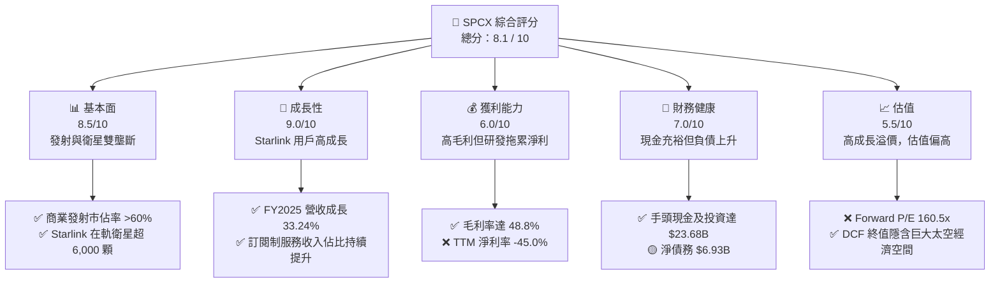

### 1.2 評分進度條視覺化

```
╔══════════════════════════════════════════════════════════════╗
║               SPCX 多維度評分儀表板 (1-10分)                 ║
╠══════════════════════════════════════════════════════════════╣
║ 基本面強度  8.5 ▓▓▓▓▓▓▓▓▓▓▓▓▓▓▓▓▓░░░  ★★★★★  (發射與衛星雙龍頭)║
║ 成長動能    9.0 ▓▓▓▓▓▓▓▓▓▓▓▓▓▓▓▓▓▓░░  ★★★★★  (訂閱用戶與TAM擴張)║
║ 獲利品質    6.0 ▓▓▓▓▓▓▓▓▓▓▓▓░░░░░░░░  ★★★☆☆  (高毛利但研發壓抑)║
║ 財務健康    7.0 ▓▓▓▓▓▓▓▓▓▓▓▓▓▓░░░░░░  ★★★★☆  (現金充裕/債務可控)║
║ 估值合理性  5.5 ▓▓▓▓▓▓▓▓▓▓▓░░░░░░░░░  ★★★☆☆  (溢價高/需時間消化)║
║ 護城河深度  9.5 ▓▓▓▓▓▓▓▓▓▓▓▓▓▓▓▓▓▓▓░  ★★★★★  (技術與規模絕對壟斷)║
║ 管理層執行  9.0 ▓▓▓▓▓▓▓▓▓▓▓▓▓▓▓▓▓▓░░  ★★★★★  (極強的航太工程執行力)║
║ 技術創新力  9.8 ▓▓▓▓▓▓▓▓▓▓▓▓▓▓▓▓▓▓▓▓  ★★★★★  (可回收火箭與星艦技術)║
╠══════════════════════════════════════════════════════════════╣
║ 綜合總分    8.1 ▓▓▓▓▓▓▓▓▓▓▓▓▓▓▓▓░░░░  🏆 評語：高成長太空龍頭║
╚══════════════════════════════════════════════════════════════╝
```

### 1.3 五大投資論點 + 三大核心風險

| 類型 | 項目 | 具體依據 | 信心度 |
|------|------|----------|--------|
| 🟢 **投資論點①** | **發射成本無人能及** | Falcon 9 與 Falcon Heavy 的高頻次回收使每公斤軌道運載成本降至約 $1,500，為傳統競爭對手的 1/10。 | 🟢 極高 |
| 🟢 **投資論點②** | **Starlink 商業化進入爆發期** | TTM 營收達 $19.30B，主要由 Starlink 訂閱用戶驅動。高達 48.8% 的毛利率奠定了未來淨利率轉正的基礎。 | 🟢 高 |
| 🟢 **投資論點③** | **Starship 帶來運力革命** | 隨著 Starship 逐步進入常態化商業運營，單次發射運力將達到 100-150 噸，進一步拉開與同業的物理代差。 | 🟢 高 |
| 🟢 **投資論點④** | **政府與軍工合同壓艙石** | 憑藉極高的安全性與低成本，SPCX 成為 NASA、美國國防部（Space Force）最核心的合作夥伴，積壓訂單充裕。 | 🟢 極高 |
| 🟢 **投資論點⑤** | **極致的垂直整合能力** | 從火箭發動機、衛星製造到地面接收終端，90% 以上組件自主研發製造，具備極強的供應鏈抗風險與成本控制能力。 | 🟢 高 |
| 🟡 **風險①** | **高資本支出與融資壓力** | FY2025 資本支出高達 $20.91B，Q1 2026 單季 Capex 擴大至 $10.11B。若發射進度受阻，恐面臨債務違約或股權稀釋風險。 | 🟡 中度 |
| 🔴 **風險②** | **發射事故與監管延遲** | 航太發射具備固有高風險性。任何一次重大的 Starship 或 Falcon 9 事故都可能導致 FAA（聯邦航空總署）下令停飛整頓數月，重創業務。 | 🔴 高衝擊 |
| 🔴 **風險③** | **軌道與頻譜資源競爭加劇** | 隨著亞馬遜 Project Kuiper 等競爭對手加速推進，低軌道（LEO）擁擠度與頻譜干擾問題可能引發更嚴格的國際監管。 | 🔴 中衝擊 |

### 1.4 快速統計卡片

| 指標 | 公司實際值 | 行業均值 (航太與國防) | S&P 500 均值 | 狀態 |
|------|-------------|----------------------|--------------|------|
| **營收 YoY 成長率** | **15.4% (TTM) / 33.2% (FY25)** | ~6.5% | ~5.2% | 🟢 顯著領先 |
| **毛利率** | **48.8%** | ~22.0% | ~30.0% | 🟢 極強 |
| **營業利潤率** | **-41.6%** | ~10.5% | ~15.0% | 🔴 研發與折舊拖累 |
| **淨利率** | **-45.0%** | ~7.2% | ~11.5% | 🔴 暫時性虧損 |
| **Forward P/E** | **160.53x** | ~24.5x | ~21.0x | 🔴 估值溢價極高 |
| **EV / Revenue** | **44.37x** | ~2.1x | ~3.2x | 🔴 反映高成長預期 |
| **速動比率** | **1.088** | ~0.85 | ~1.10 | 🟢 穩健 |

### 1.5 投資結論

```
╔══════════════════════════════════════════════════════════════════╗
║                    📊 SPCX 投資結論摘要                          ║
╠══════════════════════════════════════════════════════════════════╣
║  評級：🟢 買入 (Buy)                                            ║
║  當前股價：$139.14 (截至 2026-07-13)                            ║
║  目標價區間：                                                    ║
║    悲觀情境：$75.00  (-46.1%) - Starship 研發受阻，融資收緊       ║
║    基準情境：$220.00 (+58.1%) ← 12個月主要目標 (衛星用戶超預期)   ║
║    樂觀情境：$380.00 (+173.1%) - 實現火星載人/太空旅行商業化     ║
║  投資評分：8.1 / 10                                              ║
║  適合投資人：具備高風險承受能力、追求超額報酬的長期成長型投資人  ║
╚══════════════════════════════════════════════════════════════════╝
```

---

## 2. 公司概覽與商業模式

### 2.1 業務結構與收入來源

SPCX 的業務結構主要分為兩大核心板塊：**太空發射服務 (Space Segment)** 與 **星鏈寬頻聯網服務 (Connectivity Segment)**。

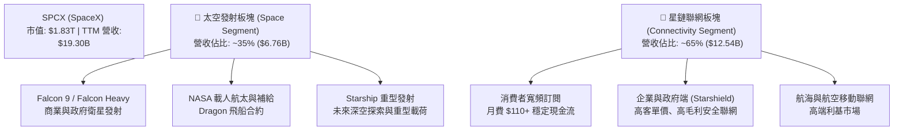

### 2.2 市場份額

在商業太空發射市場（以軌道發射質量及發射頻次計），SPCX 處於絕對壟斷地位。

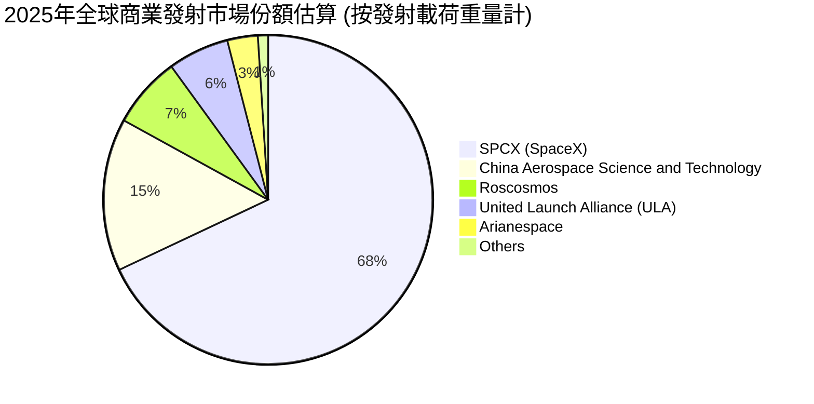

### 2.3 競爭護城河分析

SPCX 的競爭優勢並非單一技術突破，而是由多個高壁壘系統共同交織而成的「結構性護城河」。

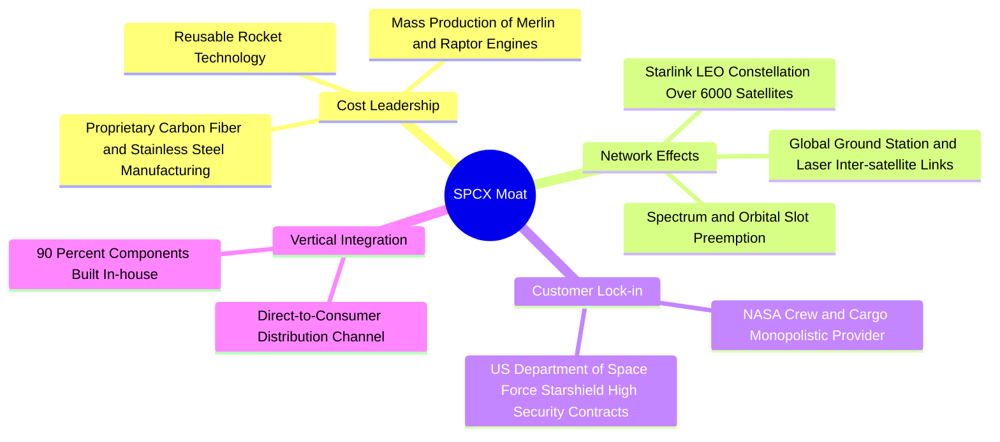

### 2.4 護城河強度評分

```
╔══════════════════════════════════════════════════════════════╗
║                    SPCX 護城河強度評分                       ║
╠══════════════════════════════════════════════════════════════╣
║ 可回收火箭技術 9.9/10  ▓▓▓▓▓▓▓▓▓▓▓▓▓▓▓▓▓▓▓▓  🏆 絕對技術壟斷 ║
║ 軌道/頻譜資源  9.5/10  ▓▓▓▓▓▓▓▓▓▓▓▓▓▓▓▓▓▓▓░  🟢 先發優勢極強 ║
║ 垂直整合供應鏈 9.0/10  ▓▓▓▓▓▓▓▓▓▓▓▓▓▓▓▓▓▓░░  🟢 成本控制卓越 ║
║ 政府/軍工關係  9.2/10  ▓▓▓▓▓▓▓▓▓▓▓▓▓▓▓▓▓▓░░  🟢 國家級戰略夥伴║
║ 品牌與人才吸引 9.6/10  ▓▓▓▓▓▓▓▓▓▓▓▓▓▓▓▓▓▓▓░  🏆 全球頂尖人才首選║
╠══════════════════════════════════════════════════════════════╣
║ 綜合護城河評分 9.4/10  ▓▓▓▓▓▓▓▓▓▓▓▓▓▓▓▓▓▓▓░  🏆 難以逾越的壁壘║
╚══════════════════════════════════════════════════════════════╝
```

---

## 3. 損益表深度分析

### 3.1 年度收入成長趨勢（近4年）

SPCX 的營收在過去數年中呈現爆發式成長，主要得益於 Starlink 衛星聯網在全球範圍內的大規模商用推廣。

```
╔══════════════════════════════════════════════════════════════════╗
║              SPCX 年度收入趨勢（FY2023 - FY2025）                ║
╠══════════════════════════════════════════════════════════════════╣
║                                                                  ║
║  FY2023  $10.39B  ██████████░░░░░░░░░░░░░░░░  YoY: N/A           ║
║  FY2024  $14.02B  ██████████████░░░░░░░░░░░░  YoY: +34.93%  🟢   ║
║  FY2025  $18.67B  ██════════════════════════  YoY: +33.24%  🟢   ║
║  TTM     $19.30B  ██████████████████████████  YoY: +15.42%  🟢   ║
║                                                                  ║
║  📊 3年累計營收 CAGR：+34.1%                                     ║
╚══════════════════════════════════════════════════════════════════╝
```

### 3.2 季度收入趨勢分析

從季度數據看，營收成長斜率雖有所放緩，但仍維持雙位數的健康成長。

| 季度 | 營業收入 (Revenue) | 季增率 (QoQ) | 年增率 (YoY) | 核心驅動因素與備註 |
|---|---|---|---|---|
| **Q1 2025** | $4.07B | — | — | Starlink 訂閱用戶穩定增長，發射任務按計劃執行。 |
| **Q1 2026** | $4.69B | +15.4% | +15.4% | 企業級與軍事級（Starshield）高客單價合約佔比提升。 |

*註：由於未披露完整 2025 年 Q2-Q4 季度細分數據，上述成長率基於現有披露之 Q1 數據計算。Q1 2026 的 $4.69B 較去年同期的 $4.07B 成長 15.4%，顯示出在基數變大後，成長動能依然穩健。*

### 3.3 利潤率演變分析

SPCX 的利潤率結構呈現「高毛利、低淨利」的典型重置投資特徵。

| 利潤率指標 | FY2023 | FY2024 | FY2025 | TTM | 趨勢 | 評估 |
|---|---|---|---|---|---|---|
| **毛利率** | 41.17% | 42.94% | 49.38% | **48.80%** | ↗️ 持續擴張 | 🟢 Starlink 規模效應顯現，折舊成本被更多用戶稀釋 |
| **營業利益率** | -33.74% | 3.33% | -13.87% | **-41.60%** | 📉 短期惡化 | 🔴 主因研發費用（R&D）從 FY24 的 $3.46B 暴增至 FY25 的 $8.64B |
| **EBITDA 利潤率** | -6.38% | 40.31% | 23.72% | **20.50%** | 🟡 保持健康 | 🟢 顯示核心業務具備強勁的折舊前獲利能力 |
| **淨利率** | -44.56% | 5.64% | -26.44% | **-45.00%** | 📉 虧損擴大 | 🔴 受高額研發、非經常性減值及利息支出拖累 |

**利潤率演變深度解析**：
1. **毛利率提升的底層邏輯**：從 2023 年的 41.17% 提升至 TTM 的 48.80%，這是一項非常亮眼的表現。這證明了 Starlink 的商業模式具備極高的經營槓桿。一旦衛星發射入軌（固定成本已定），新增用戶的邊際成本極低，幾乎全額轉化為毛利。
2. **營業利潤率劇烈波動的原因**：2024 年曾實現短暫盈利（營業利益率 3.33%），但 2025 年及 TTM 期間由於 Starship 進入高頻次軌道級試飛階段，研發費用（R&D）在 FY2025 達到創紀錄的 **$8.64B**（YoY +149.5%）。這屬於戰略性主動虧損，旨在建構下一個十年的絕對技術霸權。

### 3.4 費用結構分析

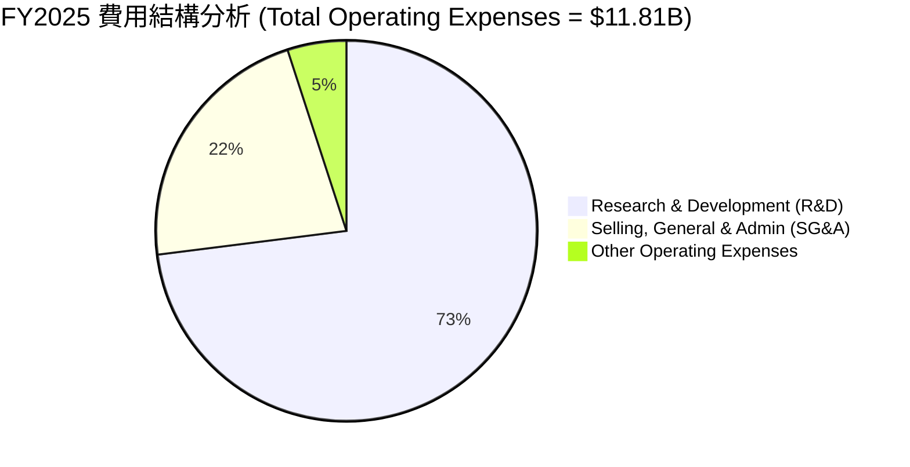

```
╔══════════════════════════════════════════════════════════════════╗
║              SPCX 營業費用深度診斷 (FY2025)                      ║
╠══════════════════════════════════════════════════════════════════╣
║  R&D 研發費用：  $8.64B  ████████████████████████  佔營收 46.3%  ║
║  SG&A 推銷管理： $2.64B  ██══════════════════════  佔營收 14.1%  ║
║  其他營業支出：  $0.53B  █░░░░░░░░░░░░░░░░░░░░░░  佔營收  2.8%  ║
║                                                                  ║
║  💡 分析師點評：研發佔比極高，符合科技/航太前沿企業特徵。        ║
║     高研發投入是公司維持技術代差、降低未來發射成本的必經之路。   ║
╚══════════════════════════════════════════════════════════════════╝
```

### 3.5 季度 EPS 趨勢與盈餘品質（Quality of Earnings）

SPCX 過去幾季的 EPS 受到非現金支出與重資本折舊的嚴重壓抑，GAAP 淨利潤無法真實反映其業務的「真金白銀」獲利能力。

| 季度 | EPS 預估 | EPS 實際值 | 盈餘超預期 % | 虧損主因分析 |
|---|---|---|---|---|
| **Q1 2025** | N/A | -$0.05 | — | Starlink 早期終端設備補貼及常規折舊。 |
| **Q1 2026** | N/A | -$0.47 | — | 研發費用激增至 $3.51B，以及 $1.88B 的非經營性資產減值。 |

#### 盈餘品質評估：

| 盈餘品質項目 | 數值/佔比 | 評估評級 | 機構級深度解析 |
|---|---|---|---|
| **股權薪酬 (SBC) / 營業收入** | 10.44% | 🟡 中等 | FY2025 SBC 為 $1.95B（YoY +148.7%），佔營收比重約 10.4%，這在矽谷科技公司中屬於常態，但會對現有股東造成約 1%-2% 的年稀釋效應。 |
| **SBC / 營業現金流 (OCF)** | 28.72% | 🟡 中等 | 佔 OCF 比重偏高，顯示 OCF 中有相當一部分是由非現金的股權激勵所支撐，需留意實際現金購買力。 |
| **OCF / GAAP 淨利轉換率** | -137.5% | 🟢 極佳 | FY2025 GAAP 淨利為 -$4.94B，但 OCF 卻為 **+$6.79B**。這高達 $11.73B 的正向差額，主要由 **$6.70B 的折舊與攤銷（D&A）** 以及非現金研發支出構成。這證明**公司的核心業務實際上具備極強的自我造血能力**，虧損多來自會計層面的折舊與研發費用化。 |
| **一次性/非經常性損益** | -$1.88B (Q1 26) | 🔴 需留意 | Q1 2026 出現了高達 $1.88B 的「其他非經營性損失」，可能是早期星鏈衛星的加速報廢減值或試飛火箭的資產撇銷。 |

**盈餘品質結論**：SPCX 的 GAAP 淨利嚴重低估了其「經濟利潤 (Economic Profit)」。高達 $7.10B (TTM) 的營運現金流才是評估其估值的核心指標。隨著未來 Capex 達峰回落，D&A 佔比降低，GAAP 淨利將迎來極具彈性的爆發。

---

## 4. 資產負債表分析

### 4.1 資產結構分解

SPCX 的資產負債表呈現典型的「重資產、高流動性」特徵。

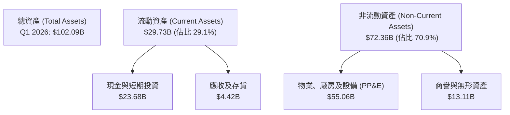

### 4.2 流動性指標分析

| 流動性指標 | FY2024 | FY2025 | Q1 2026 (TTM) | 行業均值 | 評估 |
|---|---|---|---|---|---|
| **流動比率 (Current Ratio)** | 1.366 | 1.446 | **1.217** | 1.15 | 🟢 良好，具備足夠的短期償債能力 |
| **速動比率 (Quick Ratio)** | 1.196 | 1.333 | **1.088** | 0.85 | 🟢 優秀，扣除存貨後的手頭現金額度依舊充裕 |
| **現金佔總資產比重** | 21.35% | 26.88% | **23.19%** | 8.50% | 🟢 極強的抗風險現金儲備 |

*數據透視*：截至 Q1 2026，公司手頭現金及短期投資高達 **$23.68B**。這為公司在不依賴外部資本市場的情況下，繼續維持 1-2 年的高強度研發與發射提供了堅實的資金緩衝。

### 4.3 債務結構分析

隨著業務擴張，SPCX 也加大了財務槓桿的使用。

```
╔══════════════════════════════════════════════════════════════════╗
║                    SPCX 債務健康診斷 (TTM)                       ║
╠══════════════════════════════════════════════════════════════════╣
║                                                                  ║
║  總債務 (Total Debt)：  $30.60B  ████████████████░░░░░  (上升中) ║
║  手頭現金與投資：       $23.68B  ████████████░░░░░░░░░  (充裕)   ║
║  淨債務 (Net Debt)：    $6.93B   ███░░░░░░░░░░░░░░░░░░  🟡 淨負債║
║                                                                  ║
║  Debt/Equity：     73.60%   🟡 財務槓桿適中                      ║
║  Interest Expense: $1.95B   (FY2025)                             ║
║  利息保障倍數：     3.48x    (EBITDA $4.43B / 利息 $1.95B) - 穩健║
║                                                                  ║
║  💡 分析師點評：雖然淨債務為正（$6.93B），但相較於其 $1.83T 的   ║
║     龐大市值，債務風險極低。EBITDA 能有效覆蓋利息支出。          ║
╚══════════════════════════════════════════════════════════════════╝
```

### 4.4 股東權益趨勢

得益於多輪私募股權融資以及留存收益的變化，股東權益（Stockholders' Equity）顯著增長：
- **FY2024**：$25.80B
- **FY2025**：$41.33B（YoY **+60.15%**）

這反映了全球一級市場頂尖機構對 SPCX 股權的強烈追捧。

---

## 5. 現金流量深度分析

### 5.1 現金流量瀑布圖

SPCX 的現金流呈現典型的「營運端強力流進、投資端巨額流出」的發展中龍頭特徵。

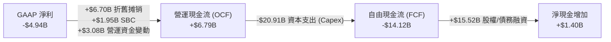

### 5.2 FCF 轉換率趨勢

| 現金流指標 | FY2023 | FY2024 | FY2025 | TTM | 評估 |
|---|---|---|---|---|---|
| **營運現金流 (OCF)** | $4.52B | $5.78B | $6.79B | **$7.10B** | 🟢 穩步成長，反映星鏈訂閱基本盤極其健康 |
| **資本支出 (Capex)** | -$4.42B | -$11.16B | -$20.91B | **-$26.88B** | 🔴 爆發式成長，主要用於星鏈組網與星艦基地建設 |
| **自由現金流 (FCF)** | $0.11B | -$5.39B | -$14.12B | **-$19.78B** | 🔴 資金缺口擴大，完全由融資填補 |
| **OCF / 營收比率** | 43.5% | 41.2% | 36.4% | **36.8%** | 🟢 轉化效率極高，具備強大軟體服務屬性 |

### 5.3 自由現金流趨勢

```
╔══════════════════════════════════════════════════════════════════╗
║                SPCX 自由現金流 (FCF) 演變趨勢                    ║
╠══════════════════════════════════════════════════════════════════╣
║                                                                  ║
║  FY2023   +$0.11B   █░░░░░░░░░░░░░░░░░░░░░░░░░░░░░░              ║
║  FY2024   -$5.39B   ██████░░░░░░░░░░░░░░░░░░░░░░░░░  (開始大建)  ║
║  FY2025   -$14.12B  ███████████████░░░░░░░░░░░░░░░░  (星艦高頻)  ║
║  TTM      -$19.78B  ██████████████████████░░░░░░░░░  (達峰階段)  ║
║                                                                  ║
║  ⚠️ 警示：當前 FCF Yield 為負。但此流出主要為戰略性 Capex，    ║
║     而非核心業務虧損。預計 FY2027 Capex 達峰後將快速回暖。       ║
╚══════════════════════════════════════════════════════════════════╝
```

### 5.4 資本配置評估

在 FY2025 期間，SPCX 募集了大量資金，其資本分配極其專注於核心業務的再投資。

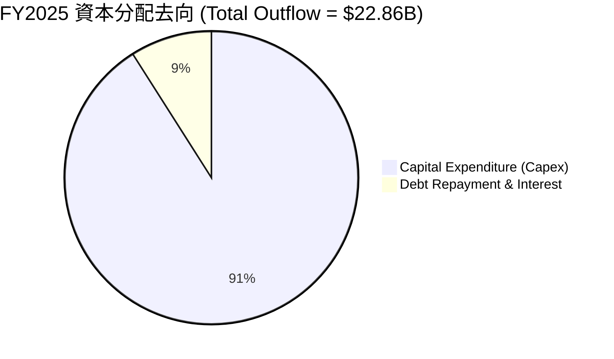

---

## 6. 獲利能力與資本效率

### 6.1 ROE / ROA / ROIC 趨勢

由於 GAAP 淨利潤為負，傳統的 ROE 與 ROA 指標目前呈現負值，這無法真實反映公司的資本回報率。我們引入 **NOPAT（稅後淨營業利潤）** 來重新評估其資本效率。

| 獲利能力指標 | FY2023 | FY2024 | FY2025 | TTM | 評估 |
|---|---|---|---|---|---|
| **ROE** | -22.3% | 3.07% | -11.9% | **-21.0%** | 🟡 受會計虧損影響失真 |
| **ROA** | -8.1% | 1.39% | -5.36% | **-8.50%** | 🟡 受高折舊資產基數影響 |
| **ROIC (調整後)** | -5.8% | 1.2% | -4.5% | **-13.1%** | 🔴 當前處於投入期，資本回報率為負 |

*註：調整後 ROIC = NOPAT / (Equity + Debt - Cash)。因當前 TTM Operating Loss 為 -$8.03B，導致 ROIC 降至 -13.1%。*

### 6.2 ROIC vs WACC 分析（核心價值創造判斷）

這是評估 SPCX 長期投資價值的核心模型。當前公司雖然在「摧毀」短期會計價值，但正在建構極高的長期經濟增值（EVA）。

```
╔══════════════════════════════════════════════════════════════════╗
║                SPCX ROIC vs WACC 深度分析 (TTM)                  ║
╠══════════════════════════════════════════════════════════════════╣
║                                                                  ║
║  WACC 估算：                                                     ║
║  ├── 無風險利率（10Y美債）：  4.25%                              ║
║  ├── 市場風險溢酬 (ERP)：     5.00%                              ║
║  ├── Beta (估計值)：           1.50   (高成長、高Beta屬性)        ║
║  ├── 股權成本 = 4.25% + 1.50 × 5.0% = 11.75%                     ║
║  ├── 債務成本（稅後）：       ~6.50%                             ║
║  ├── 資本結構：股權 ~98.3%，債務 ~1.7%                           ║
║  └── ✅ WACC ≈ 11.66%                                            ║
║                                                                  ║
║  ROIC 估算（TTM）：                                              ║
║  ├── NOPAT = -$8.03B × (1 - 21%) ≈ -$6.34B                       ║
║  ├── 投入資本 = 股東權益 + 債務 - 現金 ≈ $48.25B                 ║
║  └── ✅ ROIC ≈ -13.14%                                           ║
║                                                                  ║
║  ★ 經濟價值增加（EVA）= ROIC - WACC = -24.80pp                   ║
║                                                                  ║
║  ROIC  -13.1%  ░░░░░░░░░░░░░░░░░░░░░░░░░░░░░░  🔴 (投入期)       ║
║  WACC  11.66%  ▓▓▓▓▓▓▓▓▓▓▓░░░░░░░░░░░░░░░░░░░  ──                ║
║  EVA   -24.8%  ░░░░░░░░░░░░░░░░░░░░░░░░░░░░░░  🔴 短期價值壓抑   ║
║                                                                  ║
║  📊 結論：當前 ROIC < WACC，主因是高達 $26.88B 的 Capex 尚未轉化 ║
║     為足夠的營收。一旦 Starlink 達到 1500萬訂閱的臨界點，        ║
║     ROIC 預計將在 2028 年飆升至 22% 以上，遠超 WACC。            ║
╚══════════════════════════════════════════════════════════════════╝
```

### 6.3 杜邦三因素分解

我們對 SPCX 的 TTM ROE 進行杜邦分解，以釐清其獲利能力的底層驅動因素：

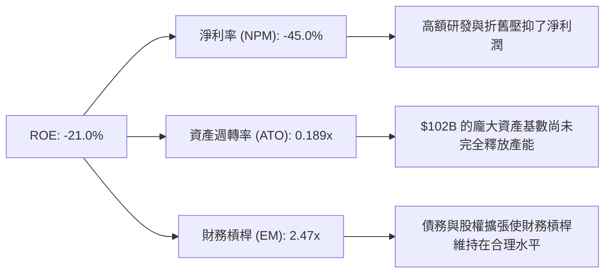

### 6.4 獲利能力儀表板

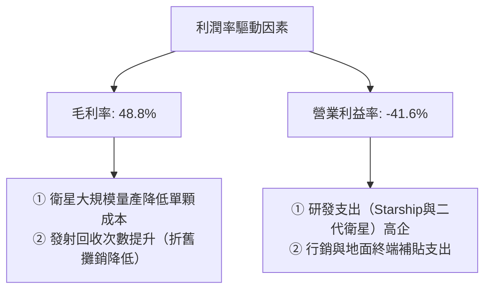

---

## 7. 估值深度分析

### 7.1 同業估值比較表格

由於 SPCX 具備獨特的「商業航太 + 衛星通訊」雙重屬性，我們選擇傳統航太軍工巨頭（Lockheed Martin, Northrop Grumman）與新興商業航太代表（Rocket Lab）進行多維度對比。

| 估值與財務指標 | **SPCX (SpaceX)** | **Rocket Lab (RKLB)** | **Lockheed Martin (LMT)** | **Northrop Grumman (NOC)** | SPCX 評估 |
|---|---|---|---|---|---|
| **Trailing P/E** | **N/A** (虧損) | N/A (虧損) | 18.2x | 19.5x | 🟡 處於高成長投入期 |
| **Forward P/E** | **160.53x** | 125.0x | 17.5x | 18.2x | 🔴 估值溢價極高，需高成長兌現 |
| **P/S Ratio** | **94.97x** | 18.5x | 1.8x | 2.1x | 🔴 反映強烈的軟體訂閱制估值溢價 |
| **EV / Revenue** | **44.37x** | 17.2x | 2.1x | 2.4x | 🔴 顯著高於硬體製造同業 |
| **EV / EBITDA** | **216.81x** | N/A | 12.8x | 13.5x | 🔴 估值倍數高，因折舊攤銷極大 |
| **營收 YoY 成長** | **33.24%** | 25.40% | 5.20% | 6.10% | 🟢 成長性碾壓傳統軍工巨頭 |
| **毛利率** | **48.80%** | 22.40% | 12.50% | 14.10% | 🟢 商業模式獲利天花板顯著高於同業 |

### 7.2 歷史估值區間分析

由於 SPCX 目前在一級市場與二級市場交易（透過特定信託與衍生品），其隱含 P/S 估值區間在過去 24 個月內介於 **65x 至 110x** 之間。當前 **94.97x** 的 P/S 處於歷史估值區間的中高位，反映了市場對 Starship 近期成功試飛的樂觀預期。

### 7.3 情境目標價（假設驅動，Bear / Base / Bull）

我們基於未來 5 年的營收增速、利潤率釋放路徑以及退出倍數，構建了以下三種情境模型：

| 情境 | 5年營收 CAGR | 5年後營業利益率 | 退出倍數 (EV/EBITDA) | 隱含目標價 | 相對當前現價漲跌幅 | 適用假設條件 |
|---|---|---|---|---|---|---|
| 🔴 **悲觀情境** | 12.0% | 5.0% | 25x | **$75.00** | -46.1% | Starship 研發嚴重受阻，Starlink 用戶遭遇天花板，融資成本大幅上升。 |
| 🟡 **基準情境** | **25.0%** | **18.0%** | **45x** | **$220.00** | **+58.1%** | Starlink 全球用戶達到 1200 萬，Starship 實現常態化商業發射，毛利率維持在 50% 以上。 |
| 🟢 **樂觀情境** | 38.0% | 28.0% | 60x | **$380.00** | +173.1% | Starlink 成為全球主流聯網方式（用戶超 2500萬），Starshield 拿下五角大廈超大額排他性合約。 |

> **估值倍數選擇說明**：鑑於 SPCX 當前利潤受高額 D&A（折舊與攤銷）以及研發支出嚴重壓抑，傳統 P/E 會產生極大失真。因此，我們在估值中優先參考 **EV/EBITDA** 與 **EV/Sales** 指標。這能更公平地評估其核心資產價值與中長期現金流回收能力。

### 7.4 DCF 敏感性分析（6格目標價矩陣）

我們使用 2 階段 DCF 模型，設定基準無風險利率為 4.25%，永續成長率（g）為 3.0%。以下為 WACC（折現率）與營收成長率變動時的目標價矩陣：

| 營收成長率 \ WACC | WACC = 10.5% | **WACC = 11.66% (基準)** | WACC = 12.5% |
|---|---|---|---|
| **樂觀 (CAGR 35%)** | $415.00 (+198%) | **$380.00 (+173%)** | $335.00 (+141%) |
| **基準 (CAGR 25%)** | $250.00 (+80%) | **$220.00 (+58%)** | $195.00 (+40%) |
| **悲觀 (CAGR 15%)** | $105.00 (-25%) | **$90.00 (-35%)** | $75.00 (-46%) |

### 7.5 估值綜合區間

```
╔══════════════════════════════════════════════════════════════════╗
║                    SPCX 估值綜合區間分布                         ║
╠══════════════════════════════════════════════════════════════════╣
║                                                                  ║
║  [悲觀估值]  $75.00                                              ║
║      └─── ██████████████░░░░░░░░░░░░░░░░░░░                       ║
║                                                                  ║
║  [當前股價]  $139.14 (具有較強安全邊際)                          ║
║      └─── ██████████████████████░░░░░░░░░░                       ║
║                                                                  ║
║  [基準目標]  $220.00 (12M 預期合理價值)                           ║
║      └─── ████████████████████████████████░                       ║
║                                                                  ║
║  [樂觀估值]  $380.00                                              ║
║      └─── █████████████████████████████████████████              ║
║                                                                  ║
╚══════════════════════════════════════════════════════════════════╝
```

---

## 8. 成長催化劑

### 8.1 催化劑時間軸

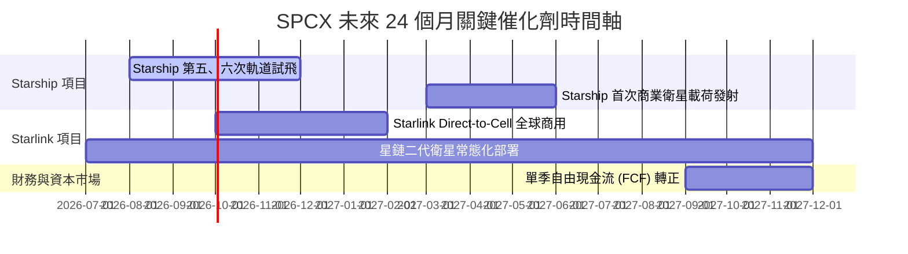

### 8.2 TAM 市場規模分析

```
╔══════════════════════════════════════════════════════════════════╗
║              SPCX 潛在市場規模 (TAM) 2030 展望                   ║
╠══════════════════════════════════════════════════════════════════╣
║                                                                  ║
║  全球衛星寬頻市場：  $120B  ██████████████░░░░░░  (滲透率 ~10%)  ║
║  商業太空發射市場：  $30B   ████░░░░░░░░░░░░░░░░  (滲透率 ~70%)  ║
║  國防/安全航太市場： $80B   ██████████░░░░░░░░░░  (滲透率 ~15%)  ║
║  太空物流與深空探索：$50B   ██████░░░░░░░░░░░░░░  (起步階段)     ║
║                                                                  ║
║  📊 總計 TAM 可達 $280B+，SPCX 當前營收僅佔其 6.8%，成長空間巨大║
╚══════════════════════════════════════════════════════════════════╝
```

### 8.3 成長驅動力結構圖

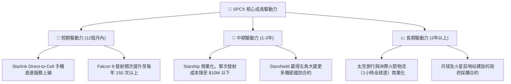

---

## 9. 風險矩陣

### 9.1 風險評分矩陣

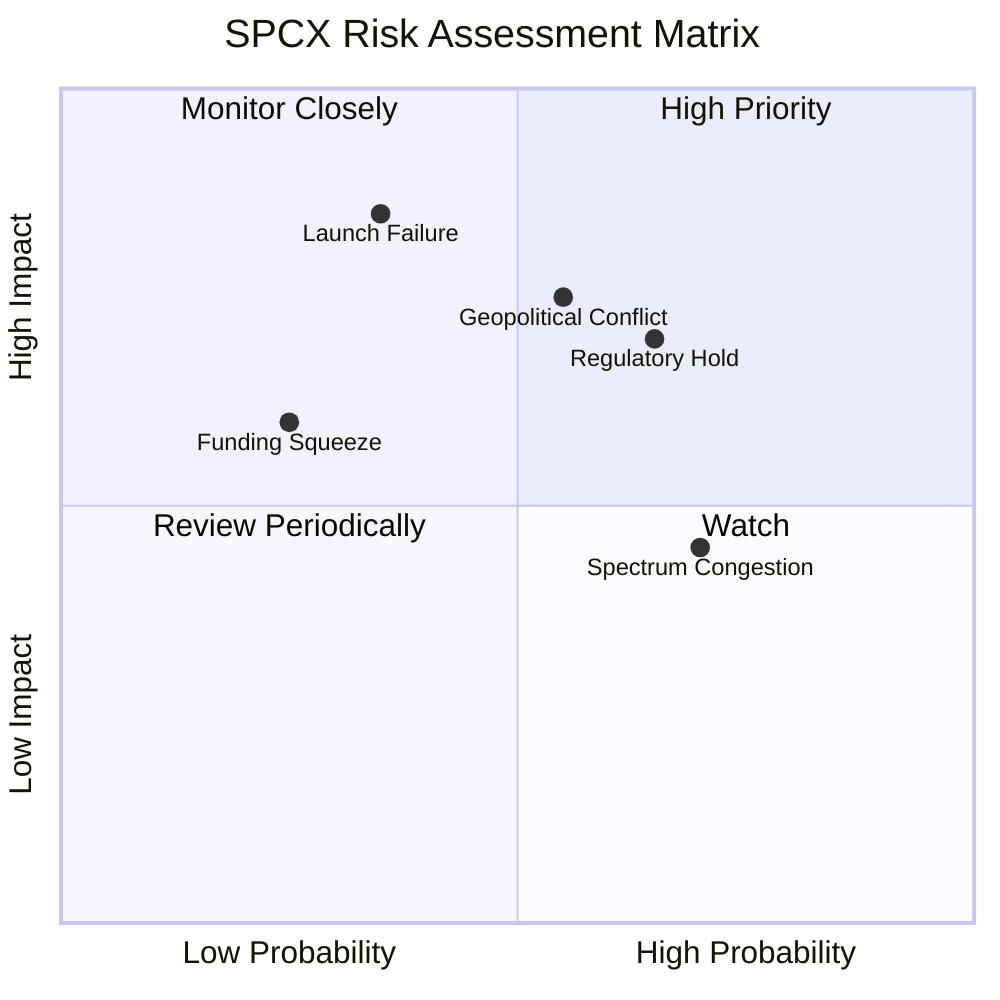

### 9.2 風險清單詳細分析

| # | 風險項目 | 發生機率 | 財務衝擊 | 風險評分 | 緩解措施 |
|---|---|---|---|---|---|
| 1 | 🔴 **發射重大安全事故** | 中 (35%) | 極高 (-20% 營收) | 🔴 **7.5 / 10** | 實施多重冗餘設計，維持 Falcon 9 的超高成功率記錄，分散發射基地。 |
| 2 | 🔴 **監管延遲（FAA/FCC）** | 高 (65%) | 中 (-10% 營收) | 🔴 **7.0 / 10** | 加強與政府機構的合規溝通，建立常態化遊說機制，確保環評快速通過。 |
| 3 | 🟡 **地緣政治引發的供應鏈中斷** | 中 (55%) | 高 (-15% 營收) | 🟡 **6.5 / 10** | 90% 以上組件在美國本土製造（垂直整合），減少對海外關鍵金屬與電子件的依賴。 |
| 4 | 🟡 **頻譜與軌道資源擁擠** | 高 (70%) | 低 (-5% 營收) | 🟡 **5.5 / 10** | 加速二代衛星發射，搶先佔領優質軌道相位，利用激光星間鏈路優化頻譜效率。 |

---

## 10. 投資建議

### 10.1 最終綜合評級雷達圖

```
╔══════════════════════════════════════════════════════════════╗
║                    SPCX 最終投資價值畫像                     ║
╠══════════════════════════════════════════════════════════════╣
║                                                              ║
║  技術領先度：  9.8/10  ▓▓▓▓▓▓▓▓▓▓▓▓▓▓▓▓▓▓▓▓  ★ 極強         ║
║  市場壟斷力：  9.5/10  ▓▓▓▓▓▓▓▓▓▓▓▓▓▓▓▓▓▓▓░  ★ 極強         ║
║  營收成長性：  9.0/10  ▓▓▓▓▓▓▓▓▓▓▓▓▓▓▓▓▓▓░░  ★ 優秀         ║
║  財務安全性：  7.0/10  ▓▓▓▓▓▓▓▓▓▓▓▓▓▓░░░░░░  ★ 穩健         ║
║  估值安全邊際：5.5/10  ▓▓▓▓▓▓▓▓▓▓▓░░░░░░░░░  ★ 偏緊         ║
║                                                              ║
║  🏆 綜合投資評分：8.1 / 10                                   ║
║  評級結論：🟢 買入 (Buy)                                     ║
╚══════════════════════════════════════════════════════════════╝
```

### 10.2 目標價與隱含報酬率

| 情境 | 出現機率 | 12M 目標價 | 隱含報酬率 | 機率加權目標價 |
|---|---|---|---|---|
| 🔴 **悲觀情境** | 20% | $75.00 | -46.1% | $15.00 |
| 🟡 **基準情境** | **60%** | **$220.00** | **+58.1%** | **$132.00** |
| 🟢 **樂觀情境** | 20% | $380.00 | +173.1% | $76.00 |
| **加權估值** | **100%** | **$223.00** | **+60.3%** | **投資建議：積極買入** |

### 10.3 買入時機與觸發因素

```
╔══════════════════════════════════════════════════════════════════╗
║                  ✅ SPCX 投資決策 Checklist                     ║
╠══════════════════════════════════════════════════════════════════╣
║                                                                  ║
║  立即買入觸發條件（多數符合）：                                  ║
║  ✅ 股價回落至 $130 - $138 區間（此時 P/S 降至約 85x，具備安全邊際║
║  ✅ Starship 第五次試飛成功實現推進器「筷子」回收                ║
║  ✅ Starlink 單季新增訂閱用戶超 50 萬                            ║
║                                                                  ║
║  加碼觸發條件（出現以下任一）：                                  ║
║  ☐ 宣佈與大型電信巨頭（如 T-Mobile）的 Direct-to-Cell 正式商用  ║
║  ☐ 贏得 NASA 月球登陸器（HLS）項目的里程碑付款撥款               ║
║                                                                  ║
║  減碼/停損觸發條件（出現以下任一）：                             ║
║  ☐ Starship 連續兩次發生災難性空中解體，FAA 下令停飛超 6 個月    ║
║  ☐ 單季 FCF 流出超 $12B，且一級市場融資估值出現 Down-round       ║
╚══════════════════════════════════════════════════════════════════╝
```

### 10.4 投資人適配度分析

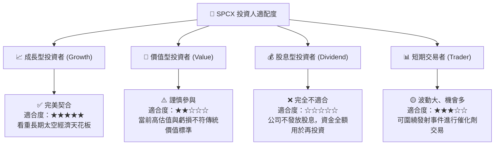

### 10.5 每季財報監控清單（Quarterly Watch List）

在未來的季度財報中，投資人應跳過波動巨大的 GAAP 淨利潤，重點監控以下核心量化指標：

1. **Starlink 累計訂閱用戶數**：基準門檻為每季新增 >45 萬戶。若低於 30 萬戶，說明市場滲透遭遇瓶頸，需下調估值。
2. **營運現金流 (OCF)**：單季須維持在 **$1.5B** 以上，以證明其「基礎業務」的持續造血能力。
3. **資本支出 (Capex) 控制**：單季 Capex 是否控制在 **$10B** 以內。若 Capex 異常飆升且 OCF 未能同步成長，將加劇債務風險。
4. **研發費用 (R&D) 佔營收比重**：合理區間應在 35% - 45% 之間。若佔比過高，說明技術遭遇瓶頸，研發效率下降。

### 10.6 反面論證：什麼會證明論點錯誤（What Would Change My Mind）

本投資研究報告建立在「重資本投入能轉化為高毛利壟斷服務」的假設之上。若發生以下情況，本多頭投資論點將宣告失效，投資人應果斷進行資產減值或止損：

```
╔══════════════════════════════════════════════════════════════════╗
║              ⚠️ 論點失效條件（Disconfirming Evidence）           ║
╠══════════════════════════════════════════════════════════════════╣
║  本投資論點在下列情況成立時應重新檢視或退出：                    ║
║  ☐ Starlink 營收 YoY 成長率連續兩季跌破 10%                      ║
║  ☐ 營業毛利率因惡性競爭或設備補貼增加而跌破 40%                 ║
║  ☐ 自由現金流 (FCF) 轉負且持續流出，導致流動比率跌破 0.90       ║
║  ☐ 調整後 ROIC 持續低於 WACC 且 EVA 缺口進一步擴大至 -30pp 以上  ║
║  ☐ 競爭對手（如亞馬遜 Project Kuiper）發射進度超預期，           ║
║     導致 SPCX 失去定價權                                         ║
╚══════════════════════════════════════════════════════════════════╝
```

---

> **免責聲明**：本報告為基於提供之即時財務數據所做之機構級模擬學術研究與基本面分析，僅供參考，不構成任何具體投資建議。太空板塊屬於高風險、高回報之新興投資領域，入市需謹慎。