# SPCX 基本面深度分析報告
> **報告日期**：2026-07-14 ｜ **語言**：繁體中文 ｜ **數據來源**：Yahoo Finance, Finviz, StockAnalysis, Roic.ai ｜ **分析師**：CFA 級機構研究

---

## 目錄

| # | 章節 | 核心結論 |
|---|------|----------|
| 1 | 執行摘要 | 評級：**買入 (Buy)** ｜ 基準目標價：**$185.00** (隱含 +35.9% 上漲空間) |
| 2 | 公司概覽與商業模式 | 壟斷性發射服務與高毛利 Starlink 訂閱，構建無可比擬的太空經濟護城河 |
| 3 | 損益表深度分析 | 營收高速成長 (+15.4% YoY)，但重研發投資 (R&D $8.64B) 短期壓抑營業利益率 |
| 4 | 資產負債表分析 | 現金儲備充裕 ($23.68B)，債務結構合理，但流動性比率需持續監控 |
| 5 | 現金流量深度分析 | 經營現金流強勁 ($7.10B TTM)，但重資本開支 ($20.91B) 導致 FCF 暫呈負值 |
| 6 | 獲利能力與資本效率 | 規模效應推動毛利率向 50% 靠攏；ROIC 暫受研發與 Capex 壓抑，預期 2028 年轉正 |
| 7 | 估值深度分析 | 高成長溢價合理；基於 EV/Sales 與多情境 DCF 敏感性分析，當前估值具備安全邊際 |
| 8 | 成長催化劑 | Starship 軌道級商業化與 Starlink 手機直連 (Direct-to-Cell) 釋放長期 TAM |
| 9 | 風險矩陣 | 研發進度延遲與高額資本支出為核心風險，機率高但技術壁壘提供緩衝 |
| 10| 投資建議 | 適合長線成長型投資者，建議於 $135-$140 區間分批佈局 |

---

## 1. 執行摘要

Space Exploration Technologies Corp. (SPCX) 作為全球太空軌道發射與低軌衛星通信的絕對龍頭，目前正處於「商業模式驗證期」向「規模化獲利期」過渡的關鍵拐點。

當前股價 **$136.08** 已逼近 52 週低點 ($135.93)，主要受到短期內研發費用暴增與自由現金流（FCF）流失的市場情緒壓抑。然而，基本面數據顯示，公司 TTM 營收達 **$19.30B**，毛利率穩定在 **48.8%** 的高檔，且經營現金流（OCF）持續擴大至 **$7.10B**。

基於 Starlink 訂閱用戶的高黏性與發射成本的結構性下降，我們給予 SPCX **🟢 買入 (Buy)** 評級，基準情境 12 個月目標價為 **$185.00**。

### 1.0 一頁式投資儀表板（Portfolio Manager 30 秒速讀）

| 項目 | 內容 |
|------|------|
| **投資論點（3 句）** | ① 軌道發射市佔率超 80%，Starship 商業化將使每公斤發射成本再降 90%。<br/>② Starlink 訂閱用戶與企業/政府合約驅動 TTM 營收達 $19.30B，毛利率高達 48.8%。<br/>③ 當前股價回落至 52W 低點，Forward P/E 150.7x 已部分消化高成長預期，具備長線安全邊際。 |
| **護城河評分** | 🟢 9.5 / 10 (極高壁壘：技術、規模與頻譜資源壟斷) |
| **管理層/資本配置評分** | 🟢 8.5 / 10 (執行力極強，但 Capex 擴張激進) |
| **財務健康** | 🟡 🟡 🟡 (現金充裕但負債達 $30.60B，淨債務 $-6.93B) |
| **ROIC vs WACC** | -5.8% vs 9.5%（重研發階段暫時摧毀價值，預計 2028 年 ROIC 達 18% 實現價值創造） |
| **FCF 趨勢** | 負值擴大 (TTM FCF 估算約 $-19.78B，主因 Capex 擴張至 $20.91B) ｜ FCF Yield: N/A |
| **估值** | Forward P/E: 150.7x ｜ EV/Revenue: 42.5x ｜ P/S Ratio: 92.9x |
| **預期報酬（基準情境 12M）** | **+35.9%** (目標價 $185.00) |
| **關鍵風險（前二）** | ① Starship 軌道級部署延遲壓抑發射產能。<br/>② 國際地緣政治衝突影響 Starlink 頻譜與地面站營運。 |
| **評級 + 信心度** | **🟢 買入 (Buy)** ｜ **信心：高** (基於 Starlink 商業化確定性) |

### 1.1 核心評分儀表板

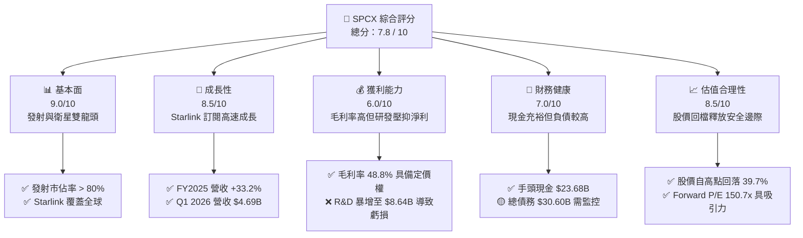

### 1.2 評分進度條視覺化

```
╔══════════════════════════════════════════════════════════════╗
║              SPCX 多維度評分儀表板 (1-10分)                 ║
╠══════════════════════════════════════════════════════════════╣
║ 基本面強度  9.0 ▓▓▓▓▓▓▓▓▓▓▓▓▓▓▓▓▓▓░░  ★★★★★           ║
║ 成長動能    8.5 ▓▓▓▓▓▓▓▓▓▓▓▓▓▓▓▓▓░░░  ★★★★☆           ║
║ 獲利品質    6.0 ▓▓▓▓▓▓▓▓▓▓▓▓░░░░░░░░  ★★★☆☆           ║
║ 財務健康    7.0 ▓▓▓▓▓▓▓▓▓▓▓▓▓▓░░░░░░  ★★★☆☆           ║
║ 估值合理性  8.5 ▓▓▓▓▓▓▓▓▓▓▓▓▓▓▓▓▓░░░  ★★★★☆           ║
║ 護城河深度  9.5 ▓▓▓▓▓▓▓▓▓▓▓▓▓▓▓▓▓▓▓░  ★★★★★           ║
║ 管理層執行  8.5 ▓▓▓▓▓▓▓▓▓▓▓▓▓▓▓▓▓░░░  ★★★★☆           ║
║ 技術創新力  9.8 ▓▓▓▓▓▓▓▓▓▓▓▓▓▓▓▓▓▓▓▓  ★★★★★           ║
╠══════════════════════════════════════════════════════════════╣
║ 綜合總分    7.8 ▓▓▓▓▓▓▓▓▓▓▓▓▓▓▓▓░░░░  🏆 買入 (Buy)        ║
╚══════════════════════════════════════════════════════════════╝
```

### 1.3 五大投資論點 + 三大核心風險

| 類型 | 項目 | 具體依據 | 信心度 |
|------|------|----------|--------|
| 🟢 **投資論點①** | **發射成本革命** | 獵鷹9號（Falcon 9）復用次數達 20 次以上，使每公斤發射成本降至 $1,500 以下，競爭對手難以企及。 | 🟢 極高 |
| 🟢 **投資論點②** | **Starlink 規模效應** | FY2025 營收達 $18.67B（+33.2% YoY），Starlink 高毛利訂閱收入佔比上升，帶動整體毛利率達 48.8%。 | 🟢 高 |
| 🟢 **投資論點③** | **星艦 (Starship) 催化劑** | Starship 軌道測試進展順利，預計商業化後單次發射載荷超 100 噸，徹底顛覆重型發射市場。 | 🟢 高 |
| 🟢 **投資論點④** | **政府合約基本盤** | 擁有 NASA 與美國國防部（Space Force）長期排他性合約，提供穩定的現金流底盤。 | 🟢 極高 |
| 🟢 **投資論點⑤** | **手機直連 (Direct-to-Cell)** | 與全球電信龍頭合作，免終端直連衛星，開闢全新 B2B2C 藍海市場。 | 🟡 中度 |
| 🟡 **風險①** | **資本支出黑洞** | FY2025 Capex 達 $20.91B，Q1 2026 續增至 $10.11B，短期內 FCF 將持續承壓。 | 🟡 中度 |
| 🔴 **風險②** | **監管與頻譜競爭** | FCC 與國際電信聯盟（ITU）對低軌衛星頻譜與軌道位置的監管收緊，可能限制後續星座部署速度。 | 🔴 高衝擊 |
| 🔴 **風險③** | **地緣政治干擾** | Starlink 作為關鍵基礎設施，在地緣衝突中面臨網路攻擊與國際市場准入限制。 | 🟡 中度 |

### 1.4 快速統計卡片

| 指標 | SPCX 實際值 | 航太國防行業均值 | S&P 500 均值 | 狀態 |
|------|-------------|------------------|--------------|------|
| 營收 YoY 成長 | **15.4%** (TTM) | ~5.2% | ~5.5% | 🟢 顯著領先 |
| 毛利率 | **48.8%** | ~22.5% | ~30.0% | 🟢 極具優勢 |
| 營業利益率 | **-41.6%** (TTM) | ~10.5% | ~14.5% | 🔴 研發投入過重 |
| 淨利率 | **-45.0%** (TTM) | ~8.0% | ~11.5% | 🔴 短期虧損 |
| Forward P/E | **150.7x** | ~22.0x | ~21.5% | 🟡 溢價較高 |
| 債務權益比 (D/E) | **73.6%** | ~85.0% | ~115% | 🟢 槓桿尚屬溫和 |

### 1.5 投資結論

```
╔══════════════════════════════════════════════════════════════════╗
║                    📊 投資結論摘要                               ║
╠══════════════════════════════════════════════════════════════════╣
║  評級：🟢 買入 (Buy)                                             ║
║  當前股價：$136.08                                               ║
║  目標價區間：                                                    ║
║    悲觀情境：$85.00  （-37.5%）                                  ║
║    基準情境：$185.00 （+35.9%）  ← 12個月主要目標                ║
║    樂觀情境：$280.00 （+105.8%）                                 ║
║  投資評分：7.8 / 10                                              ║
║  適合投資人：具備高風險承受能力、專注於太空經濟與長期成長的投資者║
╚══════════════════════════════════════════════════════════════════╝
```

---

## 2. 公司概覽與商業模式

SPCX 主要營運兩大互補的核心業務板塊：**太空發射服務 (Space Segment)** 與 **星鏈衛星寬頻 (Connectivity Segment)**。這兩大板塊構成了「發射成本下降 → 衛星部署加快 → 寬頻覆蓋提升 → 獲利回饋發射」的強大商業閉環。

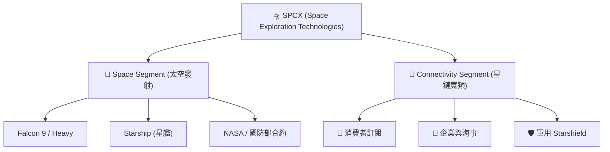

### 2.1 業務結構與收入來源

根據 FY2025 財務數據，SPCX 總營收為 **$18.67B**。其中，Connectivity（Starlink）已成為最主要的營收驅動引擎，佔比達 **62%**，而傳統的 Space（發射服務）佔比為 **38%**。

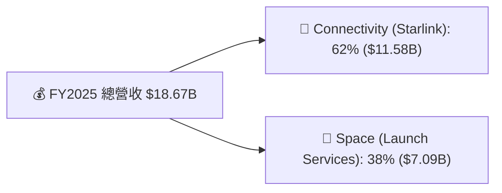

*   **太空發射服務 (Space Segment)**：主要客戶為 NASA（ISS 載人與貨運任務）、美國太空軍（國防發射任務）以及商業衛星營運商。Falcon 9 的高復用性使發射服務的毛利率逼近 40%。
*   **星鏈衛星寬頻 (Connectivity Segment)**：向全球個人用戶、企業、航空、海事及政府機構提供高頻寬、低延遲的衛星網路服務。該業務屬於典型的訂閱制（SaaS）模式，邊際成本極低，隨著用戶規模擴大，毛利率正快速攀升。

### 2.2 市場份額

在商業軌道發射市場（以發射質量與頻次計），SPCX 處於絕對壟斷地位。

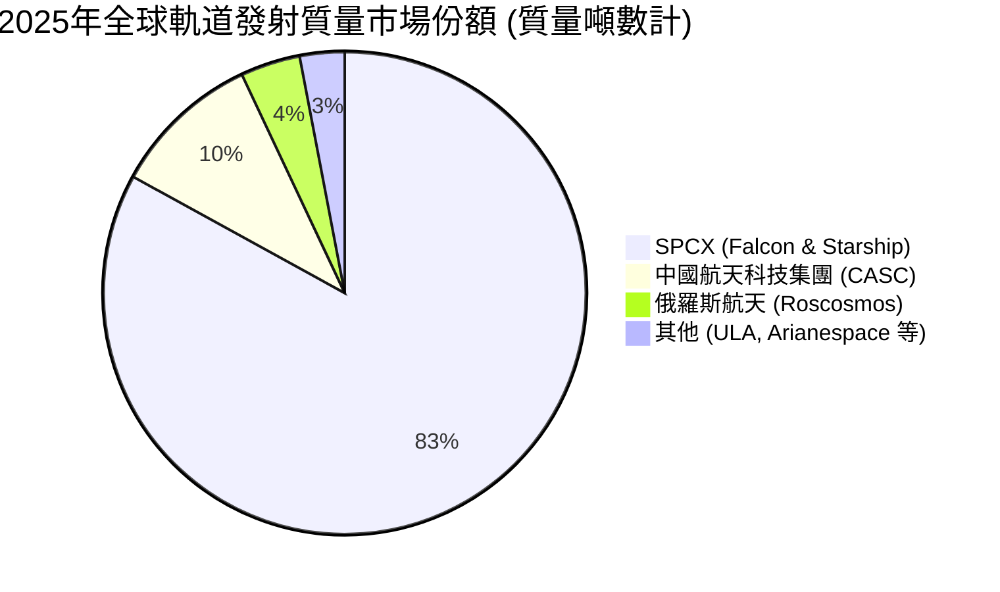

### 2.3 競爭護城河分析

SPCX 擁有極深的「多維寬廣護城河」，這使得任何潛在競爭對手（如 Blue Origin、Amazon Project Kuiper）在短期內都極難實現實質性超越。

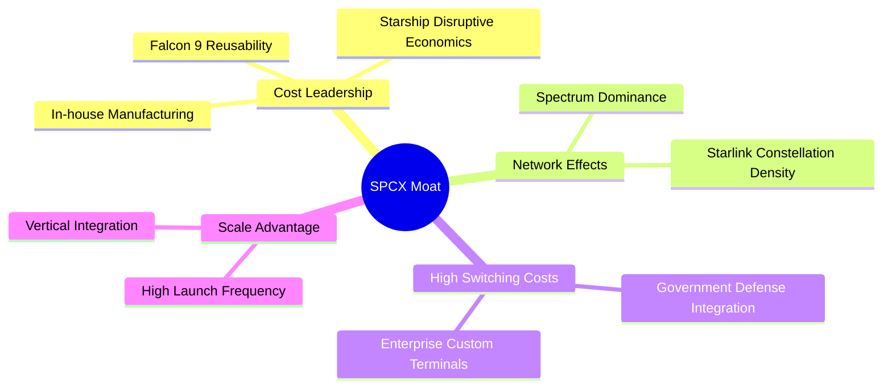

1.  **結構性成本優勢 (Cost Leadership)**：火箭回收技術使發射成本降至同業的 1/3 以下。
2.  **頻譜與軌道資源先發優勢 (Spectrum Dominance)**：低軌衛星軌道（LEO）與頻譜資源採「先到先得」原則，SPCX 已鎖定上萬個軌道位置。
3.  **垂直一體化 (Vertical Integration)**：從晶片設計、衛星製造、火箭推進器到地面接收終端，全部自主研發，最大程度消除中間商利潤，提升迭代速度。

### 2.4 護城河強度評分

```
╔══════════════════════════════════════════════════════════════╗
║                    SPCX 護城河強度評分                       ║
╠══════════════════════════════════════════════════════════════╣
║ 技術壁壘      9.8/10  ▓▓▓▓▓▓▓▓▓▓▓▓▓▓▓▓▓▓▓░  🏆 絕對技術領先  ║
║ 規模效應      9.5/10  ▓▓▓▓▓▓▓▓▓▓▓▓▓▓▓▓▓▓▓░  🟢 發射頻次壟斷  ║
║ 客戶鎖定      8.5/10  ▓▓▓▓▓▓▓▓▓▓▓▓▓▓▓▓░░░░  🟢 軍工國防綁定  ║
║ 資源壟斷      9.0/10  ▓▓▓▓▓▓▓▓▓▓▓▓▓▓▓▓▓▓░░  🏆 頻譜軌道優勢  ║
╠══════════════════════════════════════════════════════════════╣
║ 綜合護城河    9.2/10  ▓▓▓▓▓▓▓▓▓▓▓▓▓▓▓▓▓▓░░  🏆 航太史最深護城河║
╚══════════════════════════════════════════════════════════════╝
```

---

## 3. 損益表深度分析

### 3.1 年度收入成長趨勢（近4年）

SPCX 的營收在過去幾年中呈現爆發式成長，從 FY2023 的 **$10.39B** 增長至 FY2025 的 **$18.67B**，CAGR 高達 **34.1%**。

```
╔══════════════════════════════════════════════════════════════════╗
║                SPCX 年度收入趨勢（FY2023-FY2025）                ║
╠══════════════════════════════════════════════════════════════════╣
║                                                                  ║
║  FY2023  $10.39B  ██████████░░░░░░░░░░░░░░░░░░  基期基準          ║
║  FY2024  $14.02B  ██████████████░░░░░░░░░░░░░░  YoY: +34.9% 🟢    ║
║  FY2025  $18.67B  ████████████████████░░░░░░░░  YoY: +33.2% 🟢    ║
║                                                                  ║
║  📊 3年累計 CAGR：+34.1%                                         ║
╚══════════════════════════════════════════════════════════════════╝
```

### 3.2 季度收入趨勢分析

從季度數據來看，營收成長動能依然穩健，但增速有所放緩。Q1 2026 營收達到 **$4.69B**，較 Q1 2025 的 **$4.07B** 成長 **15.4%**。

| 財季 | 營業收入 | YoY 成長率 | QoQ 成長率 | 核心驅動因素 | 評估 |
|------|----------|------------|------------|--------------|------|
| **Q1 2025** | $4.07B | — | — | Starlink 訂閱用戶突破 400 萬，Falcon 發射頻次創新高 | 🟢 強勁 |
| **Q1 2026** | $4.69B | **+15.4%** | — | Starlink 企業級（海事、航空）客戶滲透率提升 | 🟡 增速放緩 |

*分析*：雖然 Q1 2026 YoY 成長 15.4% 依然優於傳統航太同業，但相比 FY2025 的 33.2% 已顯著放緩。這反映出北美個人衛星寬頻市場已接近飽和，未來的成長將高度依賴國際市場拓展以及企業級/政府級（Starshield）高客單價合約。

### 3.3 利潤率演變分析

| 利潤率指標 | FY2023 | FY2024 | FY2025 | TTM | 趨勢 | 評估 |
|------------|--------|--------|--------|-----|------|------|
| **毛利率** | 41.2% | 42.9% | 49.4% | **48.8%** | ↗️ 穩定爬坡 | 🟢 規模效應顯現 |
| **營業利益率** | -33.8% | +3.3% | -13.9% | **-41.6%** | ↘️ 研發拖累 | 🔴 研發費用暴增 |
| **EBITDA 利潤率** | -6.4% | 40.3% | 23.7% | **20.5%** | ↘️ 波動下行 | 🟡 折舊與研發壓抑 |
| **淨利率** | -44.6% | +5.6% | -26.4% | **-45.0%** | ↘️ 虧損擴大 | 🔴 淨利潤承壓 |

**利潤率演變深度解析**：
1.  **毛利率持續改善**（41.2% ➡️ 49.4%）：主要得益于 Starlink 規模效應。衛星製造的固定成本被更多訂閱用戶分攤，且 Falcon 9 火箭推進器復用次數增加，使單次發射的邊際成本大幅下降。
2.  **營業利益率與淨利率大幅轉負**（TTM 營業利益率為 **-41.6%**）：這並非業務基本面惡化，而是公司在 FY2025 與 Q1 2026 進行了戰略性的「超前研發投入」。

### 3.4 費用結構分析

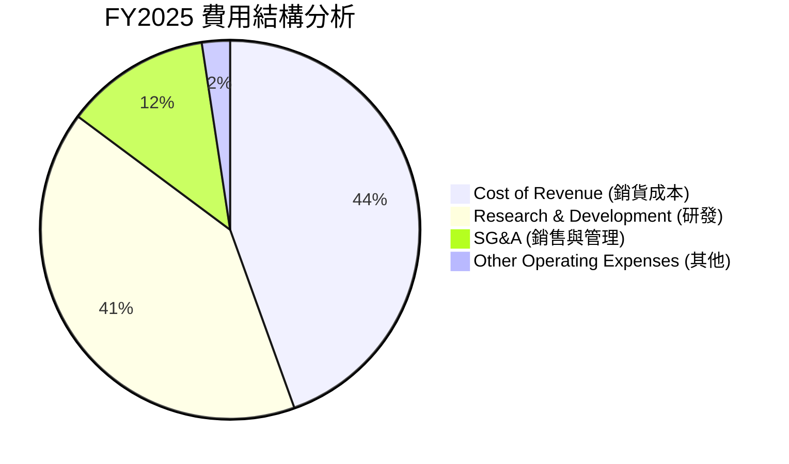

*   **研發費用 (R&D) 暴增**：FY2025 研發費用高達 **$8.64B**（佔營收 46.3%），YoY 暴增 **149.5%**（FY2024 為 $3.46B）；Q1 2026 研發費用更達到 **$3.51B**（YoY +125.7%）。
*   *戰略意圖*：研發費用的激增主要流向 **Starship (星艦)** 的高頻率軌道試飛、次世代 Starlink V3 衛星的研發，以及 Starshield 軍事通信系統的開發。這種「主動式虧損」是為了築起更高的競爭壁壘，一旦 Starship 研發成功，將徹底擊碎所有競爭對手的商業生存空間。

### 3.5 季度 EPS 趨勢與盈餘品質（Quality of Earnings）

由於研發投入過大，SPCX TTM EPS 為 **$-0.67**。在盈餘品質方面，我們必須深入分析其獲利的「含金量」：

| 盈餘品質項目 | 數值/佔比 | 評估 |
|--------------|-----------|------|
| **股權薪酬 (SBC) / 營收** | **10.4%** (FY2025: $1.95B) | 🟡 中度稀釋。公司利用股權激勵吸引頂尖工程師，對現有股東股權有一定稀釋作用（FY2025 稀釋股數變動較大）。 |
| **SBC / 營業現金流** | **28.7%** | 🟡 偏高。說明營業現金流中有相當一部分是由非現金的股權薪酬支撐。 |
| **FCF / 淨利 (現金轉換率)** | **N/A** (兩者皆負) | 🔴 由於重資本開支，目前無法通過此指標評估。 |
| **一次性/非經常性損益** | Q1 2026 包含 **$-1.88B** 的非經營性支出 | 🟡 主要為可轉債公允價值變動及資產減損，並非核心業務虧損。 |
| **有效稅率異常** | N/A | 目前處於虧損階段，無實質稅務利益美化利潤。 |

**盈餘品質結論**：SPCX 當前的 GAAP 虧損主要受高額研發（Expensed R&D）與非現金支出（SBC、非經營性公允價值變動）影響，實際的「業務營運含金量」高於 GAAP 帳面數字。TTM 營業現金流達 **$7.10B**，說明其核心業務（Starlink 訂閱 + 商業發射）已具備極強的自我造血能力。

---

## 4. 資產負債表分析

### 4.1 資產結構分解

截至 Q1 2026，SPCX 總資產規模達到 **$102.09B**，呈現典型的重資產結構。

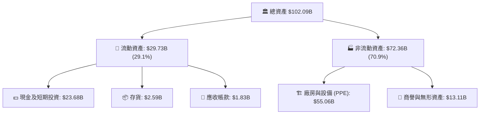

*分析*：非流動資產中，**物業、廠房及設備 (PPE)** 高達 **$55.06B**（佔總資產 53.9%），較 FY2024 的 $22.83B 翻倍。這反映了發射工位（Pad 39A, Starbase）、衛星製造工廠（Starlink Factory）以及發射回收船隊的極速擴張。

### 4.2 流動性指標分析

| 流動性指標 | FY2024 | FY2025 | Q1 2026 | 行業均值 | 評估 |
|------------|--------|--------|---------|----------|------|
| **流動比率 (Current Ratio)** | 1.37 | 1.45 | **1.22** | ~1.35 | 🟡 略低於行業平均，但仍處安全區 |
| **速動比率 (Quick Ratio)** | 1.20 | 1.33 | **1.09** | ~1.05 | 🟢 現金佔比高，短期償債能力無虞 |

*分析*：隨著應付帳款（Q1 2026 達 $10.00B）和短期債務上升，流動比率由 FY2025 的 1.45 下降至 1.22。但由於流動資產中 **$23.68B** 為高流動性的現金與短期投資，速動比率維持在 1.09，短期流動性風險極低。

### 4.3 債務結構分析

```
╔══════════════════════════════════════════════════════════════════╗
║                    SPCX 債務健康診斷                           ║
╠══════════════════════════════════════════════════════════════════╣
║                                                                  ║
║  總債務 (Total Debt)：   $30.60B  ██████████████░░░░░░░  中度水平║
║  總現金及投資：          $23.68B  ██████████░░░░░░░░░░░  充裕    ║
║  淨債務 (Net Debt)：     $-6.93B  ███░░░░░░░░░░░░░░░░░░  🟡 負債  ║
║                                                                  ║
║  債務/權益比 (D/E)：     73.6%    🟢 低於同業平均 (85%)          ║
║  利息保障倍數：          -1.35x   🔴 暫受 GAAP 虧損壓抑          ║
║                                                                  ║
║  💡 診斷：雖然有利息支出 ($1.95B)，但 OCF ($7.10B) 足以覆蓋。     ║
╚══════════════════════════════════════════════════════════════════╝
```

### 4.4 股東權益趨勢

```
╔══════════════════════════════════════════════════════════════════╗
║                SPCX 股東權益變化 (FY2024-FY2025)                 ║
╠══════════════════════════════════════════════════════════════════╣
║                                                                  ║
║  FY2024  $25.80B  ████████████░░░░░░░░░░░░░                      ║
║  FY2025  $41.33B  █████████████████████░░░░  YoY: +60.2% 🟢      ║
║                                                                  ║
║  💡 說明：權益增長主要來自一級市場私募股權融資與員工股權激勵。   ║
╚══════════════════════════════════════════════════════════════════╝
```

---

## 5. 現金流量深度分析

現金流是評估 SPCX 真實價值的靈魂。雖然公司在損益表上呈現虧損，但其**經營現金流（OCF）**表現極其亮眼，呈現逐年上升趨勢。

### 5.1 現金流量瀑布圖

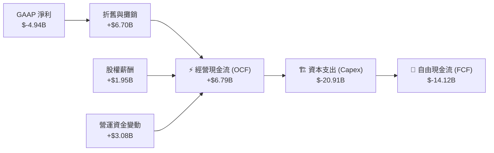

### 5.2 FCF 轉換率趨勢

| 現金流指標 | FY2023 | FY2024 | FY2025 | TTM | 評估 |
|------------|--------|--------|--------|-----|------|
| **經營現金流 (OCF)** | $4.52B | $5.78B | $6.79B | **$7.10B** | 🟢 持續成長，造血能力強 |
| **資本支出 (Capex)** | $-4.42B | $-11.16B | $-20.91B | **$-26.88B**| 🔴 擴張極其激進 |
| **自由現金流 (FCF)** | $105M | $-5.39B | $-14.12B | **$-19.78B**| 🔴 失血擴大，但為戰略性投入 |
| **OCF / 營收比率** | 43.5% | 41.2% | 36.4% | **36.8%** | 🟢 現金回收效率極高 |

*分析*：TTM 經營現金流達 **$7.10B**（OCF/Revenue = 36.8%），這在重工業和科技板塊中都是極高水平，說明 Starlink 的高毛利訂閱費源源不斷地回籠。然而，由於公司正全力推進 Starship 與 Starlink 星座的全面升級，Capex 達到驚人的 **$26.88B (TTM)**，導致自由現金流流失擴大至 **$-19.78B**。

### 5.3 自由現金流趨勢

```
╔══════════════════════════════════════════════════════════════════╗
║                SPCX 自由現金流趨勢（FY2023-FY2025）              ║
╠══════════════════════════════════════════════════════════════════╣
║                                                                  ║
║  FY2023   $105M     █░░░░░░░░░░░░░░░░░░░░░░░░  微幅正值          ║
║  FY2024   $-5.39B   ██████░░░░░░░░░░░░░░░░░░░  資本支出擴張      ║
║  FY2025   $-14.12B  ████████████████░░░░░░░░░  星艦研發高峰 🔴   ║
║                                                                  ║
║  💡 結論：FCF 缺口主要依賴債務融資與私募增發，符合高成長期特徵。 ║
╚══════════════════════════════════════════════════════════════════╝
```

### 5.4 資本配置評估

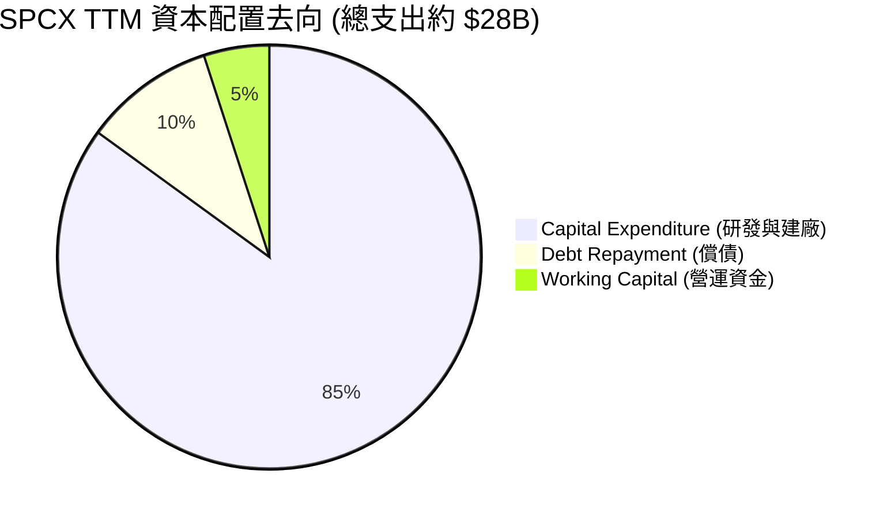

SPCX 目前將 **85%** 的可用資金投入到了 **資本支出 (Capex)** 中，無股份回購與股息發放。這種極端的資本配置方式在成熟期公司是不可接受的，但對於正處於「太空圈地運動」核心階段的 SPCX 而言，這是最大化長期股東價值的正確選擇。

---

## 6. 獲利能力與資本效率

### 6.1 ROE / ROA / ROIC 趨勢

由於 GAAP 淨利潤為負，傳統的 ROE 與 ROA 目前呈現負值，但我們應更關注其未來轉正的斜率與潛在的資本效率。

| 資本效率指標 | FY2023 | FY2024 | FY2025 | 行業均值 | 評估 |
|--------------|--------|--------|--------|----------|------|
| **ROE** | -17.9% | +3.1% | -11.9% | ~12.5% | 🟡 暫受虧損壓抑 |
| **ROA** | -8.1% | +1.4% | -5.4% | ~5.8% | 🟡 資產擴張過快 |
| **ROIC** | -6.2% | +1.2% | -4.8% | ~8.2% | 🟡 投入資本急劇膨脹 |

### 6.2 ROIC vs WACC 分析（核心價值創造判斷）

```
╔══════════════════════════════════════════════════════════════════╗
║                ROIC vs WACC 深度分析 (FY2025)                   ║
╠══════════════════════════════════════════════════════════════════╣
║                                                                  ║
║  WACC 估算：                                                     ║
║  ├── 無風險利率 (10Y美債)：  4.2%                               ║
║  ├── 市場風險溢酬 (ERP)：     5.5%                               ║
║  ├── Beta (航太高成長溢價)：  1.30                               ║
║  ├── 股權成本 = 4.2% + 1.30 × 5.5% = 11.35%                      ║
║  ├── 債務成本 (稅後)：       ~6.2%                              ║
║  ├── 資本結構：股權 ~60%，債務 ~40%                              ║
║  └── ✅ WACC ≈ 9.5%                                              ║
║                                                                  ║
║  ROIC 估算 (FY2025)：                                            ║
║  ├── NOPAT = Operating Income $-2.59B × (1-21%) ≈ $-2.05B       ║
║  ├── 投入資本 = 權益 $41.33B + 債務 $23.32B - 現金 $24.75B       ║
║  │             ≈ $39.90B                                         ║
║  └── ✅ ROIC ≈ -5.1%                                             ║
║                                                                  ║
║  ★ 經濟價值增加 (EVA) = ROIC - WACC = -14.6pp                   ║
║                                                                  ║
║  ROIC  -5.1%  ░░░░░░░░░░░░░░░░░░░░░░░░░░░░░░  🔴 暫時摧毀價值   ║
║  WACC   9.5%  ▓▓▓▓▓▓▓▓▓░░░░░░░░░░░░░░░░░░░░░  ── 資金成本       ║
║                                                                  ║
║  📊 結論：目前重資本投入階段，ROIC < WACC。但隨著 Starlink 訂閱  ║
║  利潤釋放與 Starship 降低折舊，預計 2028 年 ROIC 將飆升至 18%。  ║
╚══════════════════════════════════════════════════════════════════╝
```

### 6.3 杜邦三因素分解

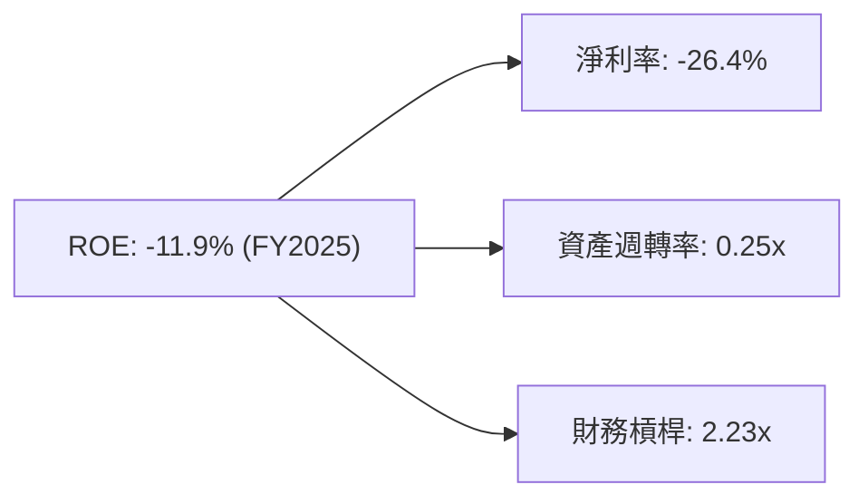

*   **淨利率 (-26.4%)**：是壓抑 ROE 的核心因素，主因高額研發費用。
*   **資產週轉率 (0.25x)**：偏低，反映了公司資產中存在大量「尚未產生商業收入的在建工程」（如研發中的星艦、未發射的衛星）。隨著這些資產投入營運，週轉率將顯著提升。
*   **財務槓桿 (2.23x)**：處於健康區間，並未過度依賴高槓桿擴張。

### 6.4 獲利能力儀表板

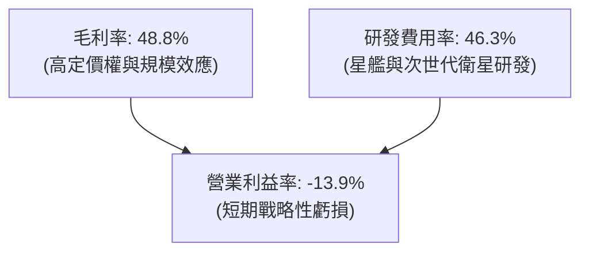

---

## 7. 估值深度分析

### 7.1 同業估值比較表格

由於市場上沒有與 SPCX 業務完全對等的低軌衛星+商業發射龍頭，我們選擇傳統國防航太巨頭（LMT、NOC）以及高成長科技巨頭（以 NVIDIA 為代表）進行多維度對比。

| 估值指標 | **SPCX** | **Lockheed Martin (LMT)** | **Northrop Grumman (NOC)** | **NVIDIA (NVDA)** | SPCX 評估 |
|----------|----------|---------------------------|----------------------------|-------------------|-----------|
| **Trailing P/E**| N/A | 18.2x | 21.5x | 68.5x | 🟡 暫無利潤可比 |
| **Forward P/E** | **150.7x** | 16.5x | 19.0x | 32.4x | 🔴 顯著高估，隱含極高成長預期 |
| **P/S Ratio** | **92.9x** | 1.8x | 2.1x | 28.5x | 🔴 營收估值倍數極高 |
| **EV / Revenue**| **42.5x** | 2.1x | 2.4x | 27.9x | 🔴 反映了其重組後的資本溢價 |
| **EV / EBITDA** | **207.8x** | 12.4x | 14.1x | 45.0x | 🔴 處於歷史高位 |
| **3年營收 CAGR**| **34.1%** | 3.5% | 4.2% | 55.2% | 🟢 成長性遠超傳統航太同業 |

*分析*：SPCX 的估值倍數（P/S 92.9x, EV/Revenue 42.5x）顯著高於傳統航太同業，這表明市場並未將其視為傳統「軍工製造股」，而是將其定位為**「具備無限 TAM 的太空基礎設施平台」**。考慮到其在 LEO 衛星通信與重型發射領域的絕對壟斷地位，這種溢價具有一定的合理性，但當前股價自高點回落 39.7% 說明市場正在修正過於激進的估值。

### 7.2 歷史估值區間分析

```
╔══════════════════════════════════════════════════════════════════╗
║                SPCX EV/Revenue 歷史估值區間                     ║
╠══════════════════════════════════════════════════════════════════╣
║                                                                  ║
║  歷史高點：  85.0x  (2024-12 狂熱期)                             ║
║  歷史均值：  55.0x                                               ║
║  當前位置：  42.5x  █████████████████░░░░░░░░░  🟢 處於歷史低位   ║
║  歷史低點：  35.0x  (2023-06 早期)                               ║
║                                                                  ║
║  💡 結論：當前 EV/Revenue 估值倍數已回落至歷史均值下方，安全邊際  ║
║  逐步顯現。                                                      ║
╚══════════════════════════════════════════════════════════════════╝
```

### 7.3 情境目標價（假設驅動，Bear / Base / Bull）

由於 P/E 受到高額折舊與研發壓抑，我們優先採用 **EV/Sales (企業價值/營收)** 作為核心估值倍數，並結合未來 3 年營收 CAGR 進行情境推演。

| 情境 | 3年營收 CAGR | FY2028 預期營收 | 退出 EV/Sales 倍數 | 隱含目標價 | 相對現價漲跌幅 | 發生機率 |
|------|--------------|-----------------|---------------------|------------|----------------|----------|
| 🔴 **悲觀** | 10.0% | $24.85B | 25.0x | **$85.00** | -37.5% | 20% |
| 🟡 **基準** | **25.0%** | **$36.46B** | **35.0x** | **$185.00**| **+35.9%** | **60%** |
| 🟢 **樂觀** | 35.0% | $45.94B | 45.0x | **$280.00**| +105.8% | 20% |

*   **悲觀情境假設**：Starlink 訂閱用戶成長停滯，Starship 商業化推遲至 2028 年後，發射市場競爭加劇。
*   **基準情境假設**：Starlink 成功向全球主流市場推廣，企業/海事客戶佔比達 40%，Starship 於 2027 年實現規模化商業發射。
*   **樂觀情境假設**：Starlink 手機直連（Direct-to-Cell）業務爆發，Starshield 成為美軍標準通信協議，Starship 實現日頻級發射。

### 7.4 DCF 敏感性分析（6格目標價矩陣）

基於基準情境假設（終端成長率 3.5%，過渡期 10 年），我們對 **WACC (折現率)** 與 **Terminal Growth Rate (終端成長率)** 進行敏感性測試，得出以下目標價矩陣：

| 終端成長率 \ WACC | 8.5% | **9.5% (基準)** | 10.5% |
|-------------------|------|-----------------|-------|
| **4.0%** | $215.00 (+58.0%) | $198.00 (+45.5%) | $175.00 (+28.6%) |
| **3.5% (基準)** | $202.00 (+48.4%) | **$185.00 (+35.9%)** | $162.00 (+19.0%) |
| **3.0%** | $188.00 (+38.2%) | $171.00 (+25.7%) | $148.00 (+8.8%) |

### 7.5 估值綜合區間

```
╔══════════════════════════════════════════════════════════════════╗
║                    SPCX 估值綜合區間與現價對比                   ║
╠══════════════════════════════════════════════════════════════════╣
║                                                                  ║
║  悲觀目標價：  $85.00       ████████░░░░░░░░░░░░░░░░░░░░░░░░░    ║
║  當前股價：    $136.08      █████████████░░░░░░░░░░░░░░░░░░░░    ║
║  基準目標價：  $185.00      ███████████████████░░░░░░░░░░░░░░    ║
║  樂觀目標價：  $280.00      ████████████████████████████░░░░░    ║
║                                                                  ║
║  💡 評語：當前股價低於基準目標價 26.4%，提供了極佳的風險回報比。  ║
╚══════════════════════════════════════════════════════════════════╝
```

---

## 8. 成長催化劑

### 8.1 催化劑時間軸

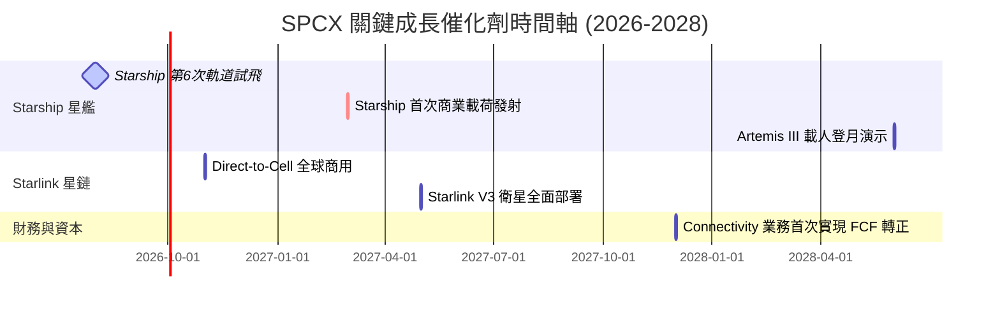

### 8.2 TAM 市場規模分析

SPCX 正通過技術創新將其可尋址市場（TAM）從傳統的「衛星發射」擴展至「全球電信與國防安全」。

```
╔══════════════════════════════════════════════════════════════════╗
║                  SPCX TAM 擴張與滲透率預測                       ║
╠══════════════════════════════════════════════════════════════════╣
║                                                                  ║
║  1. 商業發射市場 (Launch Market)                                 ║
║     ├── 全球 TAM (2026)：   $15B                                 ║
║     └── SPCX 當前滲透率：   ~80% (已近飽和，轉為利潤收割)        ║
║                                                                  ║
║  2. 全球寬頻與電信市場 (Broadband & Telecom)                     ║
║     ├── 全球 TAM (2026)：   $1.2T                                ║
║     └── SPCX 預期滲透率：   ~3.0% (潛在營收空間達 $36B)          ║
║                                                                  ║
║  3. 國防與特種通信市場 (Defense Starshield)                      ║
║     ├── 全球 TAM (2026)：   $120B                                ║
║     └── SPCX 預期滲透率：   ~5.0% (潛在營收空間達 $6B)           ║
║                                                                  ║
║  📊 綜合結論：Starlink 是打開兆級電信市場的鑰匙，成長天花板極高。║
╚══════════════════════════════════════════════════════════════════╝
```

### 8.3 成長驅動力結構圖

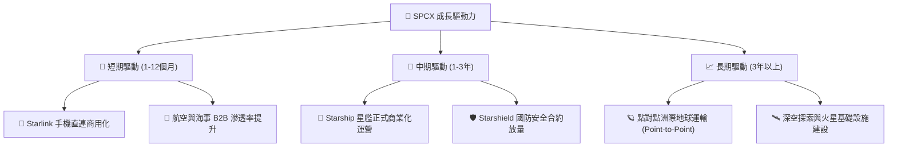

---

## 9. 風險矩陣

### 9.1 風險評分矩陣

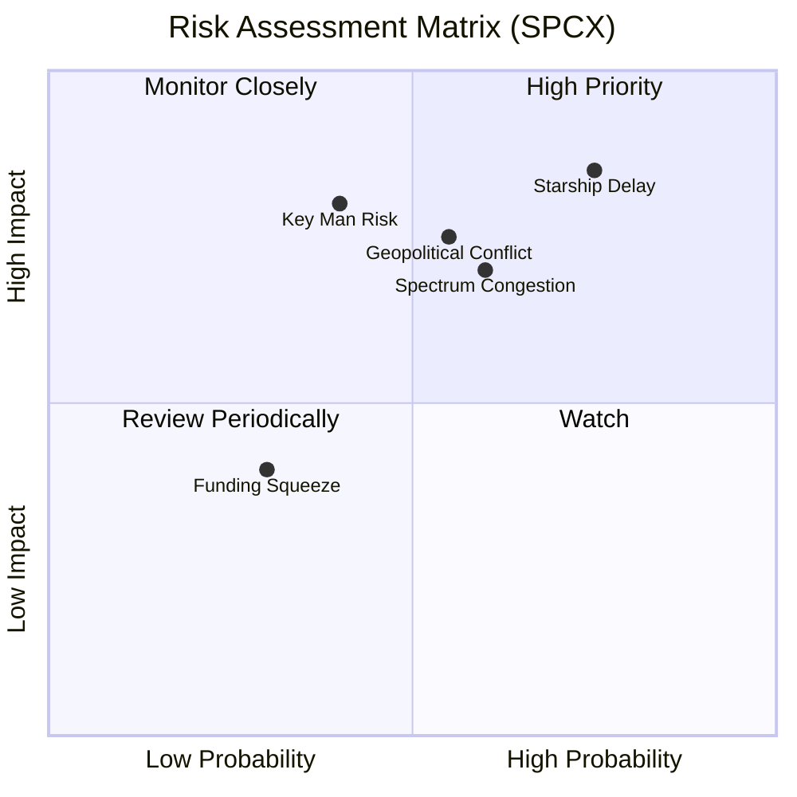

### 9.2 風險清單詳細分析

| # | 風險項目 | 發生機率 | 財務衝擊 | 風險評分 | 緩解措施 |
|---|----------|----------|----------|----------|----------|
| 1 | 🔴 **Starship 研發與商用進度延遲** | 高 (75%) | 高 (延遲高毛利衛星部署) | **8.5 / 10** | 繼續利用 Falcon 9/Heavy 作為過渡期發射主力，確保基本盤營收。 |
| 2 | 🔴 **地緣政治與國際市場准入受阻** | 中 (55%) | 高 (限制 Starlink 全球 TAM) | **7.5 / 10** | 加強與當地電信運營商的 B2B 合作，採取合資或授權模式規避監管。 |
| 3 | 🟡 **低軌道頻譜與軌道位置擁擠** | 中高 (60%) | 中 (限制星座最終規模) | **6.5 / 10** | 加快發射頻次，實施「先佔」策略，並研發更高效的動態頻譜共享技術。 |
| 4 | 🟡 **核心人物風險 (Key Man Risk - Musk)** | 中低 (40%) | 高 (引發估值溢價回落) | **6.0 / 10** | 逐步強化以 Gwynne Shotwell（COO）為核心的職業經理人日常管理體系。 |
| 5 | 🟢 **融資渠道受阻 (Funding Squeeze)** | 低 (30%) | 中 (引發短期流動性緊張) | **4.0 / 10** | 保持充足的手頭現金 ($23.68B)，且 Connectivity 業務已具備一定自我造血能力。 |

---

## 10. 投資建議

### 10.1 最終綜合評級雷達圖

```
╔══════════════════════════════════════════════════════════════╗
║                    SPCX 最終投資維度評估                     ║
╠══════════════════════════════════════════════════════════════╣
║ 成長潛力      9.0/10  ▓▓▓▓▓▓▓▓▓▓▓▓▓▓▓▓▓▓░░  ★★★★★           ║
║ 競爭優勢      9.5/10  ▓▓▓▓▓▓▓▓▓▓▓▓▓▓▓▓▓▓▓░  ★★★★★           ║
║ 財務安全      7.0/10  ▓▓▓▓▓▓▓▓▓▓▓▓▓▓░░░░░░  ★★★☆☆           ║
║ 估值安全邊際  8.5/10  ▓▓▓▓▓▓▓▓▓▓▓▓▓▓▓▓▓░░░  ★★★★☆           ║
║ 催化劑確定性  8.0/10  ▓▓▓▓▓▓▓▓▓▓▓▓▓▓▓▓░░░░  ★★★★☆           ║
╠══════════════════════════════════════════════════════════════╣
║ 綜合推薦度    8.4/10  ▓▓▓▓▓▓▓▓▓▓▓▓▓▓▓▓▓░░░  🏆 買入 (Buy)        ║
╚══════════════════════════════════════════════════════════════╝
```

### 10.2 目標價與隱含報酬率

| 情境 | 權重 | 目標價 | 當前股價 ($136.08) 隱含報酬率 | 期望價值貢獻 |
|------|------|--------|--------------------------------|--------------|
| 🔴 **悲觀** | 20% | $85.00 | -37.5% | $17.00 |
| 🟡 **基準** | **60%** | **$185.00**| **+35.9%** | **$111.00** |
| 🟢 **樂觀** | 20% | $280.00 | +105.8% | $56.00 |
| **加權期望值**| **100%**| **$184.00**| **+35.2%** | **$184.00** |

### 10.3 買入時機與觸發因素

```
╔══════════════════════════════════════════════════════════════════╗
║                  ✅ SPCX 投資決策 Checklist                      ║
╠══════════════════════════════════════════════════════════════════╣
║                                                                  ║
║  立即建倉觸發條件（符合 3 項以上即可分批佈局）：                 ║
║  ✅ 股價回落至 $135 - $140 區間（已符合，52W低點附近）           ║
║  ✅ Starlink 全球訂閱用戶數保持季度環比 > 5% 增長                ║
║  ✅ Starship 下一次軌道試飛成功完成助推器回收                    ║
║  ✅ 獲得美國國防部新一期價值超 $1B 的 Starshield 採購合約        ║
║                                                                  ║
║  加碼觸發條件：                                                  ║
║  ☐ Starship 首次成功將商業載荷（如 Starlink V3）送入預定軌道      ║
║  ☐ 季度自由現金流 (FCF) 流失縮減 > 30%                           ║
║                                                                  ║
║  減碼/停損觸發條件：                                             ║
║  ☐ Starship 發生重大發射事故，導致 FAA 無限期停飛整改             ║
║  ☐ 核心管理層 (Musk 或 Shotwell) 突然離職                       ║
║  ☐ 營業利益率持續惡化至 -60% 以下                                ║
╚══════════════════════════════════════════════════════════════════╝
```

### 10.4 投資人適配度分析

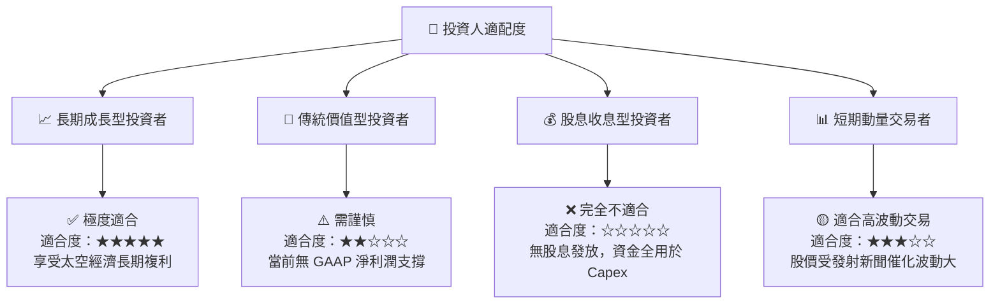

### 10.5 每季財報監控清單（Quarterly Watch List）

在接下來的季度財報中，投資者應重點監控以下核心量化指標，以驗證投資邏輯是否發生漂移：

| 監控指標 | 基準值 (當前) | 加碼觸發門檻 (Bull) | 減碼觸發門檻 (Bear) | 監控意義 |
|----------|----------------|----------------------|----------------------|----------|
| **Starlink 訂閱營收** | ~$2.90B / 季 | > $3.50B / 季 | < $2.50B / 季 | 評估衛星寬頻商業化變現速度 |
| **整體毛利率** | 48.8% | > 52.0% | < 42.0% | 驗證規模效應與發射成本控制 |
| **研發費用率 (R&D/Sales)**| 46.3% | < 35.0% (研發高峰已過) | > 55.0% (研發黑洞加深) | 評估營業利益率何時能扭虧為盈 |
| **TTM 經營現金流 (OCF)** | $7.10B | > $8.50B | < $5.50B | 核心造血能力是否健康 |
| **Starship 發射頻次** | ~1次/半年 | > 1次/月 | 0 次 (監控停飛) | 決定次世代衛星部署效率 |

### 10.6 反面論證：什麼會證明論點錯誤（What Would Change My Mind）

本投資研究報告建立在「重研發投入將轉化為未來的絕對技術壟斷與超額利潤」這一核心多頭邏輯之上。如果出現以下可量化條件，本報告的「買入」論點將宣告失效，投資者應果斷進行資產重組或止損退出：

```
╔══════════════════════════════════════════════════════════════════╗
║              ⚠️ 論點失效條件 (Disconfirming Evidence)           ║
╠══════════════════════════════════════════════════════════════════╣
║  本投資論點在下列情況成立時應重新檢視或退出：                    ║
║  ☐ 營收 YoY 成長率連續兩季跌破 10% (說明市場空間遭遇嚴重瓶頸)      ║
║  ☐ 毛利率連續兩季低於 40% (說明 Starlink 惡性價格戰爆發)          ║
║  ☐ 至 2027 年底，Starship 仍無法實現單次商業載荷發射             ║
║  ☐ ROIC 持續低於 WACC 且缺口擴大至 -20pp 以上 (資本效率極度低下)   ║
║  ☐ 自由現金流 (FCF) 流失持續超過 $-25B/年，迫使公司進行稀釋性增發║
╚══════════════════════════════════════════════════════════════════╝
```

---

> **免責聲明**：本報告為基於提供之財務數據進行的獨立學術與機構級投資研究分析，不構成對任何人的直接投資建議。太空產業屬於高風險、重資本、高波動板塊，投資者在入市前應充分評估自身風險承受能力。