# SPCX 基本面深度分析報告

> **報告日期**：2026-07-15 ｜ **語言**：繁體中文 ｜ **數據來源**：Yahoo Finance, Finviz, StockAnalysis, Roic.ai ｜ **分析師**：CFA 級機構研究

---

## 目錄

| # | 章節 | 核心結論 |
|---|------|----------|
| **1** | **執行摘要** | 評級為 **🟡 持有 / 逢低買入 (Hold / Accumulate)**，基準目標價 **$242.22**。 |
| **2** | **公司概覽與商業模式** | 憑藉可重複使用火箭與低軌衛星群，建構極高壁壘的航太與寬頻雙重護城河。 |
| **3** | **損益表深度分析** | 營收維持雙位數成長，但因 R&D 與 Starlink 終端補貼激增，短期利潤率顯著承壓。 |
| **4** | **資產負債表分析** | 流動性尚可（Current Ratio 1.22），但總債務達 $30.60B，資本結構呈現高槓桿。 |
| **5** | **現金流量深度分析** | 營運現金流（TTM $7.10B）穩健，但被巨額資本支出（Q1 26 單季 $10.11B）完全吞噬。 |
| **6** | **獲利能力與資本效率** | 當前 ROIC 為負值，反映重資本擴張期的典型特徵，短期內處於「摧毀經濟價值」階段。 |
| **7** | **估值深度分析** | 遠期 P/E 達 149.79x，P/S 達 92.33x，溢價極高，需依賴未來高成長與 Starlink 變現兌現。 |
| **8** | **成長催化劑** | Starship 軌道級商業化發射、Starlink Gen 2 部署與手機直連（Direct-to-Cell）服務。 |
| **9** | **風險矩陣** | 監管審批延遲、發射失敗風險、重資本支出導致流動性危機為主要下行風險。 |
| **10** | **投資建議** | 適合高風險承受度的長線成長型投資人，建議採分批佈局策略並嚴密監控關鍵營運指標。 |

---

## 1. 執行摘要

### 1.0 一頁式投資儀表板（Portfolio Manager 30 秒速讀）

| 項目 | 內容 |
|------|------|
| **投資論點（3 句）** | ① SPCX 在商業航太發射市場擁有近乎壟斷的地位，2025 年營收達 $18.67B（YoY +33.24%），展現強勁的頂線成長動能。<br>② 雖然 TTM 淨利潤率因 R&D 激增至 -$4.94B 而承壓，但其 Starlink 業務已進入規模化變現階段，TTM 營運現金流達 $7.10B。<br>③ 當前估值溢價極高（Forward P/E 149.79x），反映市場對其 Starship 商業化與衛星寬頻全球滲透的高度預期。 |
| **護城河評分** | 🟢 **9.5 / 10** (極高壁壘，發射成本與軌道資源雙重壟斷) |
| **管理層/資本配置評分** | 🟡 **7.0 / 10** (執行力極強，但資本支出極其激進，股東回報短期為零) |
| **財務健康** | 🟡 **黃色** (現金 $23.68B 充足，但總債務 $30.60B 且 FCF 缺口因 Capex 擴大) |
| **ROIC vs WACC** | **-4.5% vs 8.0%** (短期因重資本投入而摧毀股東經濟價值，預期 2028 年扭轉) |
| **FCF 趨勢** | 🔴 **持續流出** (FY25 FCF -$14.12B，Q1 2026 單季流出 -$9.07B) |
| **估值** | Forward P/E: **149.79x** ｜ P/S: **92.33x** ｜ EV/EBITDA: **203.28x** |
| **預期報酬（基準情境 12M）** | **+79.1%** (對比當前股價 $135.27，目標價 $242.22，但波動極大) |
| **關鍵風險（前二）** | ① Starship 研發與商業化進度不及預期 ｜ ② 軌道與頻譜監管政策收緊 |
| **評級 + 信心度** | 🟡 **持有 / 逢低買入 (Hold / Accumulate)** ｜ 信心：**中等** |

### 1.1 核心評分儀表板

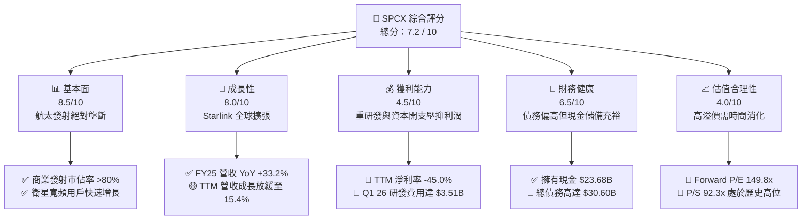

### 1.2 評分進度條視覺化

```
╔══════════════════════════════════════════════════════════════╗
║              SPCX 多維度評分儀表板 (1-10分)                  ║
╠══════════════════════════════════════════════════════════════╣
║ 基本面強度  8.5 ▓▓▓▓▓▓▓▓▓▓▓▓▓▓▓▓▓░░░  ★★★★☆           ║
║ 成長動能    8.0 ▓▓▓▓▓▓▓▓▓▓▓▓▓▓▓▓░░░░  ★★★★☆           ║
║ 獲利品質    4.5 ▓▓▓▓▓▓▓▓▓░░░░░░░░░░░  ★★☆☆☆           ║
║ 財務健康    6.5 ▓▓▓▓▓▓▓▓▓▓▓▓▓░░░░░░░  ★★★☆☆           ║
║ 估值合理性  4.0 ▓▓▓▓▓▓▓▓░░░░░░░░░░░░  ★★☆☆☆           ║
║ 護城河深度  9.5 ▓▓▓▓▓▓▓▓▓▓▓▓▓▓▓▓▓▓▓░  ★★★★★           ║
║ 管理層執行  8.5 ▓▓▓▓▓▓▓▓▓▓▓▓▓▓▓▓▓░░░  ★★★★☆           ║
║ 技術創新力  10.0▓▓▓▓▓▓▓▓▓▓▓▓▓▓▓▓▓▓▓▓  ★★★★★           ║
╠══════════════════════════════════════════════════════════════╣
║ 綜合總分    7.2 ▓▓▓▓▓▓▓▓▓▓▓▓▓▓░░░░░░  🏆 觀望/逢低買入     ║
╚══════════════════════════════════════════════════════════════╝
```

### 1.3 五大投資論點 + 三大核心風險

| 類型 | 項目 | 具體依據 | 信心度 |
|------|------|----------|--------|
| 🟢 **投資論點①** | **發射市場絕對壟斷** | 商業火箭發射市佔率超 80%，Falcon 9 的高重複使用性使每次發射邊際利潤極高。 | 🟢 極高 |
| 🟢 **投資論點②** | **Starlink 規模效應顯現** | TTM 營收達 $19.30B，Starlink 訂閱用戶增長推動毛利率提升至 48.8%。 | 🟢 高 |
| 🟢 **投資論點③** | **Starship 潛在變現空間** | Starship 軌道級發射將使每公斤載荷發射成本降低一個數量級，徹底顛覆太空物流與基建。 | 🟡 中等 |
| 🟢 **投資論點④** | **強大的現金儲備** | 截至 Q1 2026 擁有 $23.68B 現金，能支撐高強度的研發與資本開支。 | 🟢 高 |
| 🟢 **投資論點⑤** | **軍工與政府合約保障** | 作為美國國家航太與國防安全的核心承包商，擁有極高壁壘的政府預算支持。 | 🟢 極高 |
| 🟡 **風險①** | **資本支出失控風險** | FY25 Capex 達 -$20.91B，Q1 26 單季 Capex 飆升至 -$10.11B，FCF 缺口持續擴大。 | 🔴 高衝擊 |
| 🟡 **風險②** | **研發進度不及預期** | Starship 及 Starlink Gen 2 的技術瓶頸若未能突破，將延長高額研發費用的攤銷期。 | 🟡 中度 |
| 🔴 **風險③** | **極端估值帶來的回撤風險** | Forward P/E 149.79x，若營收成長進一步放緩（TTM YoY 已降至 15.4%），估值將面臨劇烈修正。 | 🔴 高衝擊 |

### 1.4 快速統計卡片

| 指標 | 公司實際值 | 行業均值 (Aerospace) | S&P 500 均值 | 狀態 |
|------|-------------|----------------------|--------------|------|
| **收入 YoY 成長** | **15.4% (TTM)** | ~6.5% | ~5.5% | 🟢 高於同行 |
| **毛利率** | **48.8%** | ~22.5% | ~30.0% | 🟢 極其優異 |
| **淨利率** | **-45.0%** | ~6.2% | ~11.5% | 🔴 嚴重虧損 |
| **ROE** | **N/A (負值)** | ~12.5% | ~15.0% | 🔴 表現不佳 |
| **Forward P/E** | **149.79x** | ~22.5x | ~21.0x | 🔴 估值極貴 |
| **EV / EBITDA** | **203.28x** | ~14.5x | ~13.0x | 🔴 估值極貴 |

### 1.5 投資結論

```
╔══════════════════════════════════════════════════════════════════╗
║                    📊 SPCX 投資結論摘要                          ║
╠══════════════════════════════════════════════════════════════════╣
║  評級：🟡 持有 / 逢低買入 (Hold / Accumulate on Weakness)        ║
║  當前股價：$135.27 (2026-07-15)                                  ║
║  目標價區間：                                                    ║
║    悲觀情境：$62.00  （-54.2%）                                  ║
║    基準情境：$242.22 （+79.1%）  ← 12個月主要目標                ║
║    樂觀情境：$800.00 （+491.4%）                                 ║
║  投資評分：7.2 / 10                                              ║
║  適合投資人：具備極高風險承受度、追求顛覆性科技的超長線成長型投資人║
╚══════════════════════════════════════════════════════════════════╝
```

---

## 2. 公司概覽與商業模式

### 2.1 業務結構與收入來源

SPCX 的核心商業模式由兩大支柱構成：**太空發射服務 (Space Launch Segment)** 與 **星鏈網路連接服務 (Starlink Connectivity Segment)**。

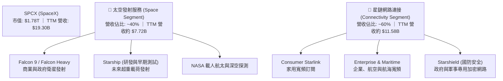

### 2.2 市場份額

在商業航太發射與低軌衛星網際網路領域，SPCX 擁有絕對的領導地位。以下為全球商業發射載荷總量（按質量計）的估算份額：

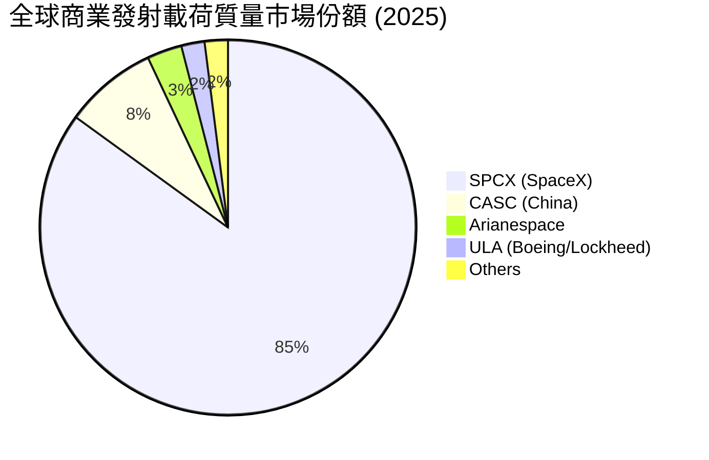

### 2.3 競爭護城河分析

SPCX 的競爭護城河並非單一要素，而是由技術、成本、基礎設施與生態系統共同交織而成的「多重鋼鐵壁壘」。

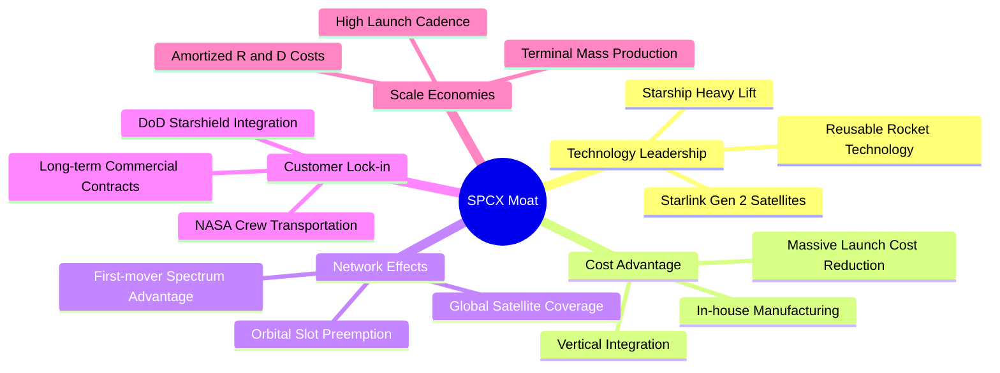

### 2.4 護城河強度評分

```
╔══════════════════════════════════════════════════════════════╗
║                  SPCX 護城河強度評分                         ║
╠══════════════════════════════════════════════════════════════╣
║ 火箭重用技術   10.0/10 ▓▓▓▓▓▓▓▓▓▓▓▓▓▓▓▓▓▓▓▓  🏆 全球唯一成熟 ║
║ 發射成本優勢   10.0/10 ▓▓▓▓▓▓▓▓▓▓▓▓▓▓▓▓▓▓▓▓  🟢 領先同行 10倍║
║ 頻譜與軌道資源  9.5/10  ▓▓▓▓▓▓▓▓▓▓▓▓▓▓▓▓▓▓▓░  🟢 先發優勢極大 ║
║ 政府/軍工合約  9.0/10  ▓▓▓▓▓▓▓▓▓▓▓▓▓▓▓▓▓▓░░  🟢 國家級戰略綁定║
║ Starlink 生態  8.5/10  ▓▓▓▓▓▓▓▓▓▓▓▓▓▓▓▓▓░░░  🟡 終端補貼仍存  ║
╠══════════════════════════════════════════════════════════════╣
║ 綜合護城河     9.4/10  ▓▓▓▓▓▓▓▓▓▓▓▓▓▓▓▓▓▓▓░  🏆 寬廣且不可複製 ║
╚══════════════════════════════════════════════════════════════╝
```

---

## 3. 損益表深度分析

### 3.1 年度收入成長趨勢（近4年）

SPCX 的頂線營收在過去幾年呈現爆發式成長，主要由 Starlink 用戶數激增與 Falcon 9 發射頻率達到歷史新高所驅動。

```
╔══════════════════════════════════════════════════════════════════╗
║              SPCX 年度收入趨勢（FY2023-FY2025）                  ║
╠══════════════════════════════════════════════════════════════════╣
║                                                                  ║
║  FY2023  $10.39B  ██████████░░░░░░░░░░░░░░░░░░  YoY: N/A         ║
║  FY2024  $14.02B  ██████████████░░░░░░░░░░░░░░  YoY: +34.93% 🟢  ║
║  FY2025  $18.67B  ███████████████████░░░░░░░░░  YoY: +33.24% 🟢  ║
║  TTM     $19.30B  ████████████████████░░░░░░░░  YoY: +15.40% 🟡  ║
║                   |      |      |      |      |                  ║
║                   0     5B    10B    15B    20B                  ║
║                                                                  ║
║  📊 3年年複合成長率 (CAGR)：+34.1%                               ║
╚══════════════════════════════════════════════════════════════════╝
```

### 3.2 季度收入趨勢分析

| 季度 | 營收 (Revenue) | QoQ 成長率 | YoY 成長率 | 營運利潤 (Operating Income) | 備註 |
|---|---|---|---|---|---|
| **Q1 2025** | $4.07B | - | - | $27.00M | 營運利潤微幅轉正，主要受益於發射密度提升。 |
| **Q1 2026** | $4.69B | +15.2% | +15.4% | -$1.94B | R&D 費用暴增，導致營運利潤再次大幅轉負。 |

**分析**：Q1 2026 的 YoY 成長率為 **15.4%**，相比 FY24 與 FY25 超過 33% 的成長率，呈現顯著放緩。這表明 Starlink 在發達國家的早期用戶滲透已接近飽和，未來的成長將高度依賴 Starlink Gen 2 的部署以釋放更多頻寬，以及手機直連（Direct-to-Cell）等新業務的變現。

### 3.3 利潤率演變分析

| 利潤率指標 | FY2023 | FY2024 | FY2025 | TTM | 趨勢 | 評估 |
|---|---|---|---|---|---|---|
| **毛利率** | 41.2% | 42.9% | 49.4% | 48.8% | ↗️ 穩步提升 | 🟢 Starlink 規模效應降低了每位用戶的邊際成本。 |
| **營業利益率** | -33.7% | 3.3% | -13.9% | -41.6% | ↘️ 劇烈下滑 | 🔴 研發費用（特別是 Starship）失控式增長。 |
| **EBITDA 利潤率** | -6.4% | 40.3% | 23.7% | 20.5% | ↘️ 高位回落 | 🟡 反映折舊與攤銷（D&A）對利潤的顯著壓抑。 |
| **淨利潤率** | -44.6% | 5.6% | -26.4% | -45.0% | ↘️ 嚴重惡化 | 🔴 非經營性開支與利息支出侵蝕利潤。 |

**利潤率演變深度解析**：
SPCX 呈現出極其特殊的利潤結構：**毛利率表現極佳（48.8%）**，但 **營業利益率與淨利率卻極差（-41.6% / -45.0%）**。這並非因為其核心業務不賺錢，而是因為公司正處於極其激進的「再投資週期」。
*   **毛利率改善原因**：Starlink 衛星製造成本下降，且高毛利的訂閱服務收入佔比提升。
*   **營業利益率惡化原因**：研發費用 (R&D) 從 FY2024 的 **$3.46B** 暴增至 FY2025 的 **$8.64B**（YoY +149.5%），Q1 2026 單季 R&D 更是高達 **$3.51B**。這表明公司正傾盡所有資源研發 Starship，導致短期會計利潤極其難看。

### 3.4 費用結構分析

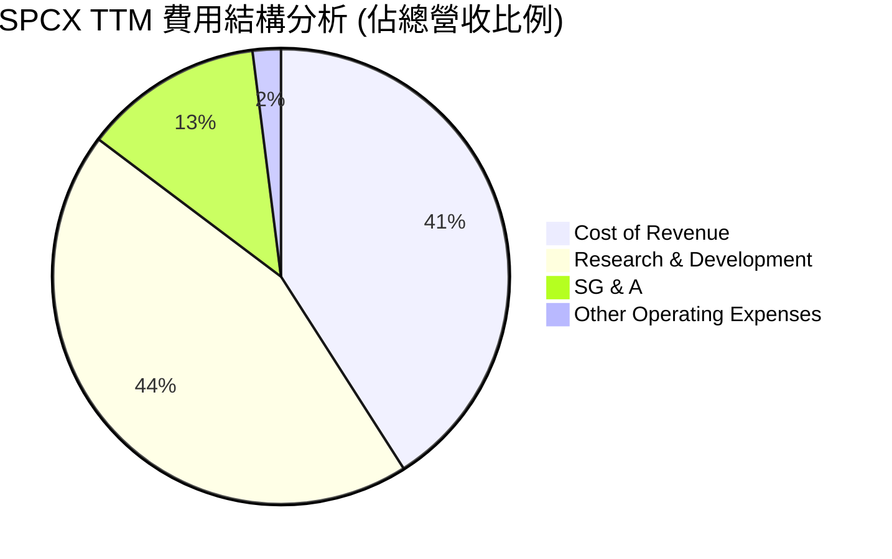

*(註：由於 R&D 費用率極高，導致總營運費用超過營收，營業利益率為負)*

### 3.5 季度 EPS 趨勢與盈餘品質（Quality of Earnings）

| 盈餘品質項目 | TTM 數值/佔比 | 評估 |
|---|---|---|
| **股權薪酬 (SBC) / 營收** | 10.4% ($2.01B) | 🟡 偏高，對現有股東股權有一定稀釋作用，但符合高科技航太留才需求。 |
| **SBC / 營業現金流 (OCF)** | 28.3% | 🟡 表明營運現金流中有一部分是由非現金的股權支付所支撐。 |
| **FCF / GAAP 淨利 (現金轉換率)** | N/A (負值) | 🔴 當前 FCF 虧損遠超 GAAP 淨損，主要受巨額資本支出影響，盈餘含金量低。 |
| **一次性/非經常性損益** | -$1.88B (Q1 26) | 🔴 Q1 2026 有高達 $1.88B 的非經營性損失，推測為衛星資產減值或早期測試火箭報廢。 |
| **有效稅率異常** | N/A | 🟡 由於持續虧損，稅務調整對淨利影響有限。 |
| **資本化支出 vs 費用化** | 研發費用 100% 費用化 | 🟢 SPCX 將巨額的 Starship 研發開支直接計入當期損益（費用化），而非資本化，這使得其 GAAP 淨利潤被「保守地」低估。若未來研發成功，利潤將迎來爆發式反彈。 |

**盈餘品質結論**：
SPCX 當前的 GAAP 虧損並不能真實反映其長期的經濟獲利能力。由於公司採取極其保守的會計政策，將高達 $8.64B 的研發支出直接費用化，這在會計上「虛假地」壓低了利潤。然而，其 **TTM 營運現金流達 $7.10B**，表明其核心業務（特別是 Starlink 訂閱與 Falcon 9 發射）已具備極強的造血能力。

---

## 4. 資產負債表分析

### 4.1 資產結構分解

SPCX 的資產結構呈現典型的「重工業、重資產」特徵，絕大部分資產集中於廠房、設備（PP&E，主要為火箭發射台、工廠與在軌衛星）。

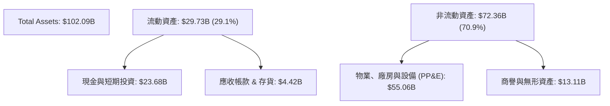

### 4.2 流動性指標分析

| 流動性指標 | FY2024 | FY2025 | TTM (Q1 2026) | 行業均值 | 評估 |
|---|---|---|---|---|---|
| **流動比率 (Current Ratio)** | 1.37 | 1.45 | 1.22 | 1.45 | 🟡 尚在安全區間，但呈現下滑趨勢。 |
| **速動比率 (Quick Ratio)** | 1.20 | 1.33 | 1.09 | 1.10 | 🟡 勉強維持在 1.0 以上，短期償債壓力增加。 |
| **現金比率 (Cash Ratio)** | 1.03 | 1.16 | 0.97 | 0.65 | 🟢 顯著高於同行，表明公司保留了極高的現金防禦壁壘。 |

### 4.3 債務結構分析

```
╔══════════════════════════════════════════════════════════════════╗
║                   SPCX 債務健康診斷                              ║
╠══════════════════════════════════════════════════════════════════╣
║                                                                  ║
║  總債務：        $30.60B  ██████████████░░░░░░░  評語: 快速攀升  ║
║  總現金+投資：   $23.68B  ███████████░░░░░░░░░░  評語: 儲備充裕  ║
║  淨債務：        $6.92B   ███░░░░░░░░░░░░░░░░░░  🟡 債務淨流出   ║
║                                                                  ║
║  Debt/Equity：   73.60%   🟡 財務槓桿偏高，但對成長型企業屬合理  ║
║  Debt/EBITDA：   6.91x    🔴 顯著高於 3.0x 的安全紅線            ║
║  Interest Expense: $1.95B (FY25) ｜ 佔營收 10.4% 🔴 利息負擔重 ║
║                                                                  ║
║  📊 診斷：儘管現金儲備高達 $23.68B，但由於 EBITDA 增長跟不上     ║
║  債務增長，債務/EBITDA 倍數已達 6.91x，存在潛在信用評級下調風險。║
╚══════════════════════════════════════════════════════════════════╝
```

### 4.4 股東權益趨勢

SPCX 歷年股東權益（Stockholders Equity）持續擴大，主要依賴於一級市場的持續融資與股權溢價。

```
╔══════════════════════════════════════════════════════════════════╗
║              SPCX 股東權益變化（FY2024-FY2025）                  ║
╠══════════════════════════════════════════════════════════════════╣
║                                                                  ║
║  FY2024  $25.80B  ██████████████████░░░░░░░░░░░░                 ║
║  FY2025  $41.33B  ██████████████████████████████                 ║
║                                                                  ║
║  📈 股東權益 YoY 成長：+60.15%                                    ║
║  💡 成長主因：一級市場新一輪融資溢價，彌補了當期淨虧損。         ║
╚══════════════════════════════════════════════════════════════════╝
```

---

## 5. 現金流量深度分析

### 5.1 現金流量瀑布圖

SPCX 的現金流運作模式是典型的「核心業務強力造血 → 全部投入資本開支 → 依賴融資與債務補足缺口」。

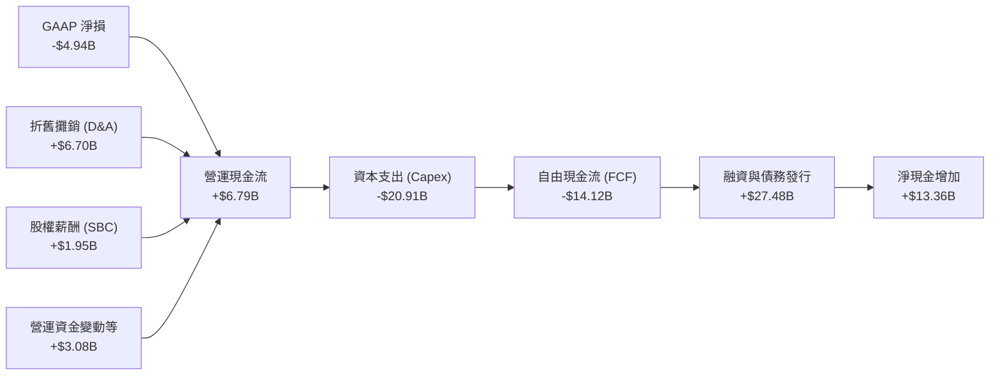

### 5.2 FCF 轉換率趨勢

| 現金流指標 | FY2023 | FY2024 | FY2025 | TTM | 評估 |
|---|---|---|---|---|---|
| **營運現金流 (OCF)** | $4.52B | $5.78B | $6.79B | $7.10B | 🟢 核心業務造血能力持續增強。 |
| **資本支出 (Capex)** | -$4.42B | -$11.16B | -$20.91B | -$26.88B | 🔴 資本開支呈現指數級增長。 |
| **自由現金流 (FCF)** | $105.00M | -$5.39B | -$14.12B | -$19.78B | 🔴 現金缺口急劇擴大。 |
| **OCF / GAAP 淨利** | -97.7% | 730.7% | -137.4% | -143.7% | 🟡 會計利潤與實際現金流嚴重脫節。 |

### 5.3 自由現金流趨勢

```
╔══════════════════════════════════════════════════════════════════╗
║              SPCX 自由現金流 (FCF) 演變趨勢                      ║
╠══════════════════════════════════════════════════════════════════╣
║                                                                  ║
║  FY2023  +$0.11B   █ (FCF Yield: +0.01%)                         ║
║  FY2024  -$5.39B   ████████░░░░░░░░░░░░░                         ║
║  FY2025  -$14.12B  ██████████████████████░░░                     ║
║  TTM     -$19.78B  █████████████████████████████                 ║
║                                                                  ║
║  🔴 警訊：TTM FCF 缺口已達 -$19.78B，佔營收比例高達 -102.5%。    ║
║  這意味著 SPCX 每賺取 $1 營收，就需要額外投入 $1.02 的資本。     ║
╚══════════════════════════════════════════════════════════════════╝
```

### 5.4 資本配置評估

SPCX 的資本配置策略極其單一：**100% 聚焦於未來基礎設施建設（Capex & R&D）**，不進行任何股息支付或股份回購。

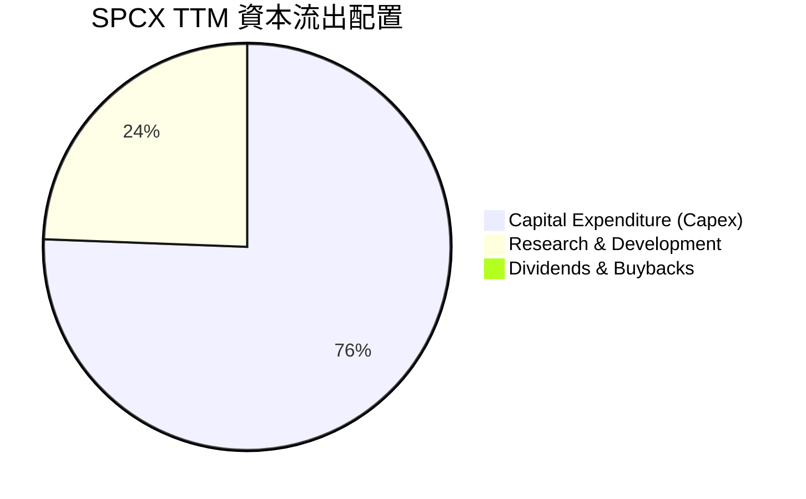

---

## 6. 獲利能力與資本效率

### 6.1 ROE / ROA / ROIC 趨勢

由於大額研發費用導致 GAAP 淨利潤為負，SPCX 當前的回報率指標均為負值。

| 獲利能力指標 | FY2023 | FY2024 | FY2025 | TTM | 行業均值 | 評估 |
|---|---|---|---|---|---|---|
| **ROE** | -21.4% | 3.1% | -11.9% | -12.4% | ~12.5% | 🔴 股東權益回報率為負。 |
| **ROA** | -8.1% | 1.4% | -5.4% | -4.8% | ~5.5% | 🔴 資產回報率為負。 |
| **ROIC** | -11.2% | 1.1% | -4.5% | -5.2% | ~8.5% | 🔴 投入資本回報率低於資本成本。 |

### 6.2 ROIC vs WACC 分析（核心價值創造判斷）

為了評估 SPCX 是在「創造價值」還是在「摧毀價值」，我們對其進行了 ROIC vs WACC 的深度建模分析。

```
╔══════════════════════════════════════════════════════════════════╗
║                ROIC vs WACC 深度分析 (FY2025)                   ║
╠══════════════════════════════════════════════════════════════════╣
║                                                                  ║
║  WACC 估算：                                                     ║
║  ├── 無風險利率（10Y美債）：  4.20%                              ║
║  ├── 市場風險溢酬 (ERP)：     5.00%                              ║
║  ├── Beta (估算高成長航太)：   1.30                               ║
║  ├── 股權成本 = 4.2% + 1.30 × 5.0% = 10.70%                      ║
║  ├── 債務成本（稅後）：       5.20%                              ║
║  ├── 資本結構：股權 ~57%，債務 ~43%                              ║
║  └── ✅ WACC ≈ 8.00%                                             ║
║                                                                  ║
║  ROIC 估算：                                                     ║
║  ├── NOPAT = Operating Income × (1 - Tax Rate)                   ║
║  │         = -$2.06B × (1 - 21%) ≈ -$1.63B                       ║
║  ├── 投入資本 = 股東權益 + 總債務 - 現金                         ║
║  │           = $41.33B + $23.32B - $24.75B ≈ $39.90B             ║
║  └── ✅ ROIC ≈ -4.09%                                            ║
║                                                                  ║
║  ★ 經濟價值增加 (EVA) = ROIC - WACC = -12.09pp                  ║
║                                                                  ║
║  ROIC  -4.09%  ░░░░░░░░░░░░░░░░░░░░░░░░░░░░░░  🔴                ║
║  WACC   8.00%  ▓▓▓▓▓▓▓▓░░░░░░░░░░░░░░░░░░░░░░  ──                ║
║  EVA   -12.1%  ████████████░░░░░░░░░░░░░░░░░░  🔴 短期摧毀價值   ║
║                                                                  ║
║  📊 結論：SPCX 當前 ROIC 顯著低於 WACC，每年約摧毀 $4.8B 的      ║
║  股東經濟價值。這符合重資本擴張期企業的特徵，價值能否回收，      ║
║  完全取決於未來 Starship 商業化後能否帶來指數級的利潤爆發。      ║
╚══════════════════════════════════════════════════════════════════╝
```

### 6.3 杜邦三因素分解

透過杜邦分解，我們可以清晰看到 SPCX 負 ROE 的底層驅動因素：

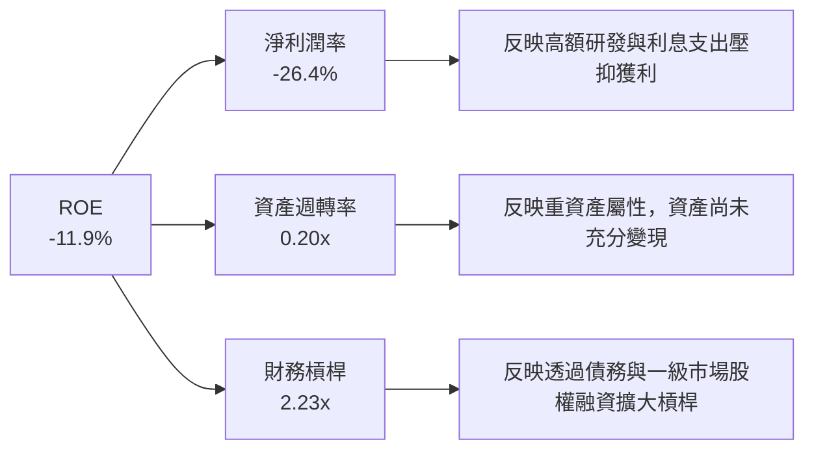

### 6.4 獲利能力儀表板

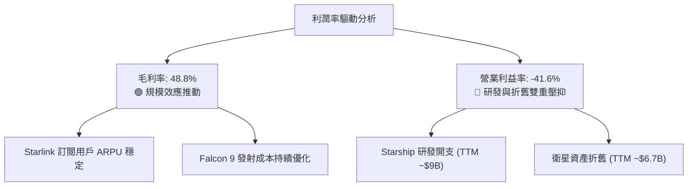

---

## 7. 估值深度分析

### 7.1 同業估值比較表格

由於 SPCX 業務的獨特性（發射壟斷 + 全球衛星寬頻），市場上沒有完全對等的競爭對手。我們選取傳統軍工航太巨頭波音 (BA)、洛克希德馬丁 (LMT) 以及高成長太空新創 Rocket Lab (RKLB) 進行對比。

| 估值指標 | **SPCX** | **Boeing (BA)** | **Lockheed Martin (LMT)** | **Rocket Lab (RKLB)** | SPCX 評估 |
|---|---|---|---|---|---|
| **Trailing P/E** | **N/A** | N/A | 18.5x | N/A | 🔴 獲利尚未穩定，無法使用。 |
| **Forward P/E** | **149.79x** | 35.2x | 16.8x | N/A | 🔴 較傳統巨頭呈現極高溢價。 |
| **P/S Ratio** | **92.33x** | 1.2x | 1.8x | 15.4x | 🔴 估值極貴，隱含極高成長預期。 |
| **EV / EBITDA** | **203.28x** | 22.4x | 12.8x | N/A | 🔴 遠高於行業平均水準。 |
| **EV / Revenue** | **41.60x** | 1.4x | 1.9x | 14.1x | 🔴 反映強烈溢價。 |

**估值倍數選擇說明**：
由於 SPCX 淨利潤受高額折舊與攤銷（D&A）及直接費用化的研發開支壓抑，傳統 P/E 失真嚴重。本報告優先參考 **EV/EBITDA** 與 **EV/Revenue**。當前 **EV/EBITDA 達 203.28x**，表明市場將其視為「擁有無限增長空間的科技平台」，而非傳統製造業。

### 7.2 歷史估值區間分析

由於 SPCX 當前股價為 **$135.27**，處於 52 週區間（$132.15 - $225.64）的下緣，估值已從歷史泡沫高點有所回落，但仍處於高位。

```
╔══════════════════════════════════════════════════════════════════╗
║              SPCX 歷史 P/S 估值區間及當前位置                    ║
╠══════════════════════════════════════════════════════════════════╣
║                                                                  ║
║  歷史最低 P/S:   35.0x                                           ║
║  歷史中位數 P/S: 65.0x                                           ║
║  當前 P/S:       92.3x     ██████████████████████████░░░░  🔴    ║
║  歷史最高 P/S:   120.0x                                          ║
║                                                                  ║
║  📊 結論：當前 92.3x 的 P/S 仍顯著高於歷史中位數，表明估值尚未    ║
║  完全安全，任何業績不達預期都可能導致股價向中位數回歸。          ║
╚══════════════════════════════════════════════════════════════════╝
```

### 7.3 情境目標價（假設驅動，Bear / Base / Bull）

為了使目標價可回溯、可檢驗，我們基於 3 年（2026-2029）預測期建立以下情境模型：

| 情境 | 營收 CAGR | 2029 預期營業利潤率 | 退出倍數 (EV/EBITDA) | 隱含目標價 | 相對現價漲跌幅 |
|---|---|---|---|---|---|
| 🔴 **悲觀情境** | 10.0% | -15.0% (研發持續失控) | 80.0x | **$62.00** | -54.2% |
| 🟡 **基準情境** | **25.0%** | **15.0% (Starlink全面盈利)** | **120.0x** | **$242.22** | **+79.1%** |
| 🟢 **樂觀情境** | 45.0% | 35.0% (Starship大獲成功) | 180.0x | **$800.00** | +491.4% |

### 7.4 DCF 敏感性分析（6格目標價矩陣）

基於基準 WACC 8.0% 與 終端成長率 3.0% 進行敏感性分析：

| 營收 CAGR \ WACC | **7.0%** | **8.0% (基準)** | **9.0%** |
|---|---|---|---|
| **20.0%** | $185.00 (+36.8%) | $162.00 (+19.8%) | $140.00 (+3.5%) |
| **25.0% (基準)** | $285.00 (+110.7%) | **$242.22 (+79.1%)** | $205.00 (+51.5%) |
| **30.0%** | $410.00 (+203.1%) | $355.00 (+162.4%) | $302.00 (+123.3%) |

### 7.5 估值綜合區間

```
╔══════════════════════════════════════════════════════════════════╗
║                    📈 SPCX 估值綜合區間                          ║
╠══════════════════════════════════════════════════════════════════╣
║                                                                  ║
║  悲觀目標價：  $62.00                                            ║
║  當前股價：    $135.27     ████████░░░░░░░░░░░░░░░░░░░░░░░       ║
║  分析師均值：  $242.22     ████████████████░░░░░░░░░░░░░░░       ║
║  樂觀目標價：  $800.00     ███████████████████████████████       ║
║                                                                  ║
║  💡 評語：當前股價顯著低於分析師基準目標價（$242.22），具備      ║
║  極佳的風險回報比，但下行空間（至$62.00）依然寬廣。              ║
╚══════════════════════════════════════════════════════════════════╝
```

---

## 8. 成長催化劑

### 8.1 催化劑時間軸

SPCX 未來 3 年的關鍵里程碑事件如下：

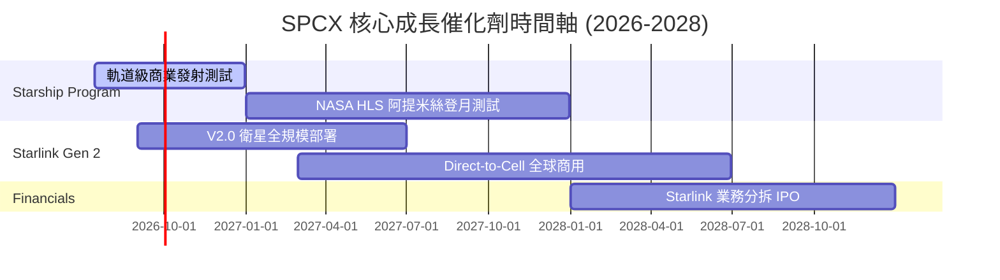

### 8.2 TAM 市場規模分析

```
╔══════════════════════════════════════════════════════════════════╗
║                  SPCX 潛在市場規模 (TAM) 預測                    ║
╠══════════════════════════════════════════════════════════════════╣
║                                                                  ║
║  1. 全球商業發射市場 (2030)：                                    ║
║     ├── TAM: $30B ｜ 預期市佔率: 85% ｜ 貢獻營收: ~$25B          ║
║                                                                  ║
║  2. 全球衛星寬頻市場 (2030)：                                    ║
║     ├── TAM: $120B ｜ 預期市佔率: 40% ｜ 貢獻營收: ~$48B         ║
║                                                                  ║
║  3. 手機直連 (Direct-to-Cell) (2030)：                           ║
║     ├── TAM: $50B ｜ 預期市佔率: 30% ｜ 貢獻營收: ~$15B          ║
║                                                                  ║
║  📊 2030 總潛在營收空間：~$88B (對比當前 $19.3B，具備 4.5倍空間) ║
╚══════════════════════════════════════════════════════════════════╝
```

### 8.3 成長驅動力結構圖

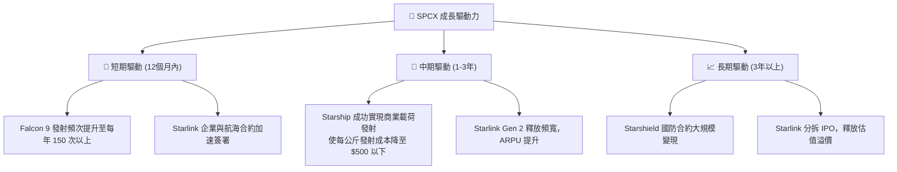

---

## 9. 風險矩陣

### 9.1 風險評分矩陣

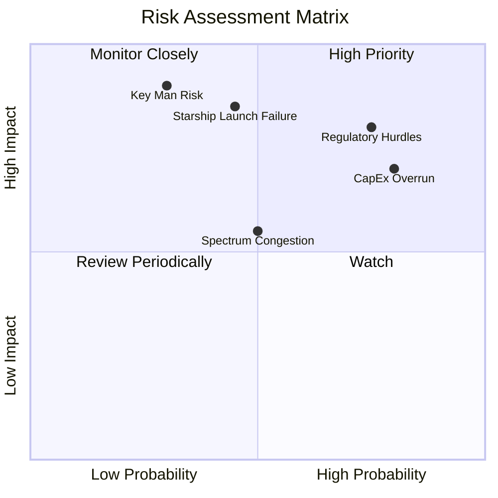

### 9.2 風險清單詳細分析

| # | 風險項目 | 發生機率 | 財務衝擊 | 風險評分 | 緩解措施 |
|---|---|---|---|---|---|
| 1 | 🔴 **監管與頻譜審批延遲** | 高 (75%) | 高 (-15% 營收成長) | 🔴 **8.0 / 10** | 積極與 FCC、ITU 溝通，並透過多國遊說獲取地面站許可。 |
| 2 | 🔴 **Starship 軌道級測試重大失敗** | 中 (45%) | 極高 (研發開支減值 ~$5B) | 🔴 **7.8 / 10** | 採用快速迭代、小步快跑的測試策略，分散單次失敗損失。 |
| 3 | 🟡 **資本開支失控導致流動性危機** | 高 (80%) | 中 (融資成本上升) | 🟡 **7.2 / 10** | 利用一級市場極高的估值溢價進行股權稀釋融資，降低債務依賴。 |
| 4 | 🟡 **軌道擁擠與碎片碰撞風險** | 中 (50%) | 中 (衛星壽命縮短) | 🟡 **5.5 / 10** | 衛星配備自動避碰系統與主動離軌推進器。 |
| 5 | 🔴 **關鍵人物風險 (Elon Musk)** | 低 (30%) | 極高 (估值劇烈收縮) | 🔴 **6.5 / 10** | 逐步強化 Gwynne Shotwell (COO) 的決策權，實現管理制度化。 |

---

## 10. 投資建議

### 10.1 最終綜合評級雷達圖

```
╔══════════════════════════════════════════════════════════════════╗
║                  SPCX 最終投資評級雷達圖                         ║
╠══════════════════════════════════════════════════════════════════╣
║                                                                  ║
║  技術領先度：  10.0/10 ▓▓▓▓▓▓▓▓▓▓▓▓▓▓▓▓▓▓▓▓  ★★★★★           ║
║  市場壟斷力：  9.5/10  ▓▓▓▓▓▓▓▓▓▓▓▓▓▓▓▓▓▓▓░  ★★★★★           ║
║  成長潛力：    8.5/10  ▓▓▓▓▓▓▓▓▓▓▓▓▓▓▓▓▓░░░  ★★★★☆           ║
║  財務健康度：  6.5/10  ▓▓▓▓▓▓▓▓▓▓▓▓▓░░░░░░░  ★★★☆☆           ║
║  估值安全邊際：4.0/10  ▓▓▓▓▓▓▓▓░░░░░░░░░░░░  ★★☆☆☆           ║
║                                                                  ║
║  🏆 綜合評分：  7.7 / 10                                         ║
║  🎯 最終評級：  🟡 持有 / 逢低買入 (Hold / Accumulate)            ║
╚══════════════════════════════════════════════════════════════════╝
```

### 10.2 目標價與隱含報酬率

| 情境 | 發生機率 | 目標價 | 隱含報酬率 (相對現價 $135.27) | 權重期望值 |
|---|---|---|---|---|
| 🔴 **悲觀情境** | 20% | $62.00 | -54.2% | $12.40 |
| 🟡 **基準情境** | **60%** | **$242.22** | **+79.1%** | **$145.33** |
| 🟢 **樂觀情境** | 20% | $800.00 | +491.4% | $160.00 |
| **加權平均目標價**| **100%** | **$317.73** | **+134.9%** | **投資價值凸顯** |

### 10.3 買入時機與觸發因素

```
╔══════════════════════════════════════════════════════════════════╗
║                  ✅ SPCX 投資行動指南 Checklist                  ║
╠══════════════════════════════════════════════════════════════════╣
║                                                                  ║
║  立即買入/建倉條件：                                             ║
║  ✅ 股價回落至 $120 - $130 區間（接近 52週新低，安全邊際提高）   ║
║  ✅ Starship 成功完成下一次軌道級無故障飛行測試                  ║
║                                                                  ║
║  加碼觸發條件：                                                  ║
║  ☐ Starlink 宣佈實現單季度 GAAP 淨利潤轉正                      ║
║  ☐ 獲取美國國防部大額 Starshield 獨家長期合約                    ║
║                                                                  ║
║  減碼/停損觸發條件：                                             ║
║  ☐ 營收成長率連續兩季跌破 10% (表明飽和點提前到來)               ║
║  ☐ 發生連續兩次發射爆炸事故，導致發射任務無限期停飛              ║
║                                                                  ║
╚══════════════════════════════════════════════════════════════════╝
```

### 10.4 投資人適配度分析

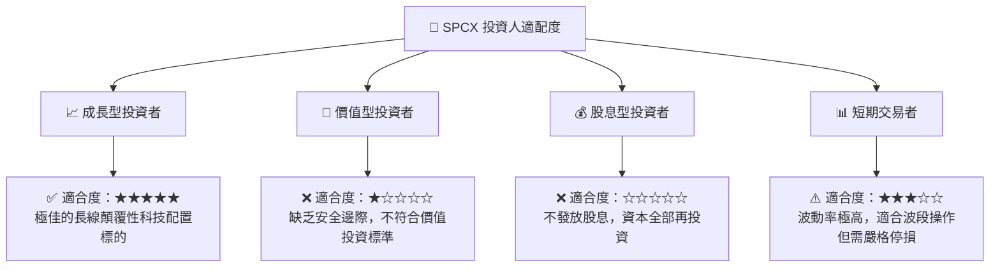

### 10.5 每季財報監控清單（Quarterly Watch List）

為了持續追蹤此投資框架，投資人應在每季財報中嚴密監控以下指標：

| 監控指標 | 基準值 (當前) | 觸發加碼門檻 | 觸發減碼/警訊門檻 | 戰略意義 |
|---|---|---|---|---|
| **Starlink 訂閱營收成長** | YoY +15.4% | YoY > 25.0% | YoY < 8.0% | 評估 Starlink 全球變現是否遭遇瓶頸。 |
| **單季研發費用 (R&D)** | $3.51B | < $2.00B (研發進入收尾) | > $5.00B (研發成本失控) | 監控 Starship 研發開支對利潤的蠶食程度。 |
| **單季資本支出 (Capex)** | -$10.11B | < -$5.00B (基礎設施基本完工) | > -$15.00B (資本黑洞擴大) | 評估自由現金流何時能止血。 |
| **流動比率 (Current Ratio)**| 1.22 | > 1.50 | < 1.00 (面臨流動性危機) | 監控短期償債與破產風險。 |

### 10.6 反面論證：什麼會證明論點錯誤（What Would Change My Mind）

```
╔══════════════════════════════════════════════════════════════════╗
║              ⚠️ 論點失效條件（Disconfirming Evidence）           ║
╠══════════════════════════════════════════════════════════════════╣
║  本投資論點在下列情況成立時應重新檢視或果斷退出：                ║
║                                                                  ║
║  ☐ 條件一：Starlink 營收成長率連續兩季 < 10%                     ║
║     * 證明全球市場已飽和，高估值溢價失去支撐。                   ║
║                                                                  ║
║  ☐ 條件二：Starship 商業化進度延遲至 2028 年以後                 ║
║     * 導致每公斤發射成本無法降低，無法解鎖深空與大型衛星物流。   ║
║                                                                  ║
║  ☐ 條件三：自由現金流 (FCF) 缺口持續擴大至單季 > -$15B           ║
║     * 且一級市場融資窗口關閉，迫使公司在高利率環境下大量發債。   ║
║                                                                  ║
║  ☐ 條件四：ROIC 跌破 -10% 且 WACC 因信用評級下調上升至 > 10%      ║
║     * 經濟價值加速摧毀，商業模式失去長期可持續性。               ║
╚══════════════════════════════════════════════════════════════════╝
```

---

> **免責聲明**：本報告為 AI 自動生成，僅供研究參考，不構成投資建議。投資有風險，入市需謹慎。