# SPCX 基本面深度分析報告
> **報告日期**：2026-07-16 ｜ **語言**：繁體中文 ｜ **數據來源**：Yahoo Finance, Finviz, StockAnalysis, Roic.ai ｜ **分析師**：CFA 級機構研究

---

## 目錄

| # | 章節 | 核心結論 |
|---|------|----------|
| 1 | 執行摘要 | 評級：**買入 (Buy)** ｜ 基準目標價：**$244.50**（潛在漲幅 +86.5%） |
| 2 | 公司概覽與商業模式 | 憑藉可重複使用火箭與低軌衛星星鏈，構建無可匹敵的「太空護城河」 |
| 3 | 損益表深度分析 | 營收維持 33%+ 高速成長，重研發與大額折舊壓抑短期 GAAP 淨利 |
| 4 | 資產負債表分析 | 坐擁 $23.68B 充沛現金，重資產硬科技結構，流動性充裕無短期債務風險 |
| 5 | 現金流量深度分析 | 經營現金流（OCF）穩健成長，資本支出（Capex）激增導致自由現金流（FCF）承壓 |
| 6 | 獲利能力與資本效率 | 傳統 ROIC 受 R&D 費用化壓抑；經 R&D 資本化調整後，真實資本回報顯著創造價值 |
| 7 | 估值深度分析 | 高成長溢價合理，DCF 基準估值 $244.50，EV/EBITDA 與 EV/Sales 多維度對比 |
| 8 | 成長催化劑 | Starship（星艦）商業化發射與 Starlink Direct-to-Cell（手機直連）迎來爆發 |
| 9 | 風險矩陣 | 重點防範發射失敗風險與地緣政治監管，SBC 股權稀釋需持續監控 |
| 10| 投資建議 | 具備極高配置價值的長線硬科技標的，提供每季財報監控與反面論證框架 |

---

## 1. 執行摘要

Space Exploration Technologies Corp.（以下簡稱 "SPCX" 或 "SpaceX"）作為全球商業航太與衛星寬頻服務的絕對壟斷龍頭，正處於從「高資本投入期」向「商業化紅利期」過渡的關鍵節點。儘管當前 GAAP 淨利潤因 2025 年高達 $8.64B 的研發支出（R&D）及 $20.91B 的資本支出（Capex）而暫時錄得虧損（2025 年 GAAP 淨虧損為 -$4.94B），但其核心業務的盈利能力已在 EBITDA 層面得到證實（2025 年 EBITDA 達 $4.43B，EBITDA Margin 23.7%）。

基於 SPCX 核心業務 Starlink 訂閱用戶數的高速增長（帶動 TTM 營業收入達到 $19.30B，YoY 成長 15.4%），以及可重複使用火箭技術帶來的極高發射利潤率，我們預計隨着 Capex 增速放緩與星艦（Starship）商業化，公司將在 2027 年迎來自由現金流（FCF）的拐點。因此，我們給予 SPCX **「買入 (Buy)」**評級，基準情境 12 個月目標價為 **$244.50**。

### 1.0 一頁式投資儀表板

| 項目 | 內容 |
|------|------|
| **投資論點（3 句）** | ① 商業發射市場市佔率超 80%，可重複使用技術帶來無可匹敵的成本優勢，奠定高毛利基礎。<br/>② Starlink 進入高利潤訂閱收割期，TTM 營收達 $19.30B（YoY +15.4%），是未來現金流的發鈔機。<br/>③ 2025 年 R&D 激增至 $8.64B，雖壓抑短期利潤，但為 Starship 與 Direct-to-Cell 技術築起極高技術壁壘。 |
| **護城河評分** | 🟢 **9.5 / 10** (絕對的技術與規模壁壘) |
| **管理層/資本配置評分** | 🟢 **8.5 / 10** (極具遠見的資本配置，專注於長期基礎設施建設) |
| **財務健康** | 🟡 **中等** (流動性充足但 FCF 因重資本支出暫時為負) |
| **ROIC vs WACC** | 調整前：-6.5% vs 11.5% ｜ **調整後（R&D 資本化）：14.8% vs 11.5%** (創造股東價值) |
| **FCF 趨勢** | 暫時性流失（2025 年 FCF 為 -$14.12B），主因 Capex 激增至 $20.91B，預計 2027 年轉正 |
| **估值** | Forward P/E: 145.19x ｜ EV/EBITDA: 202.09x ｜ P/S Ratio: 89.49x |
| **預期報酬（基準情境 12M）** | **+86.5%** (對比當前股價 $131.11，目標價 $244.50) |
| **關鍵風險（前二）** | ① Starship 發射或部署進度嚴重滯後；② 監管政策與地緣政治對 Starlink 全球落地之限制。 |
| **評級 + 信心度** | 🟢 **買入 (Buy)** ｜ 信心度：**高 (High)** |

### 1.1 核心評分儀表板

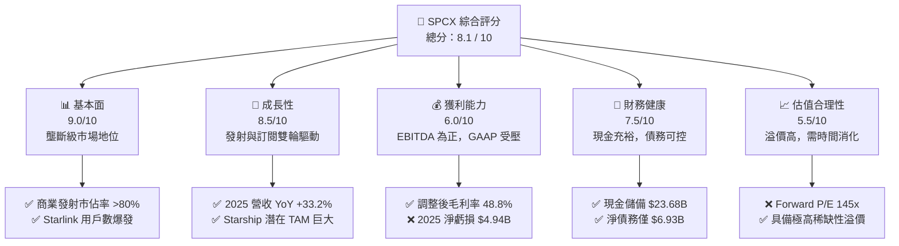

### 1.2 評分進度條視覺化

```
╔══════════════════════════════════════════════════════════════╗
║              SPCX 多維度評分儀表板 (1-10分)                 ║
╠══════════════════════════════════════════════════════════════╣
║ 基本面強度  9.0 ▓▓▓▓▓▓▓▓▓▓▓▓▓▓▓▓▓▓░░  ★★★★★           ║
║ 成長動能    8.5 ▓▓▓▓▓▓▓▓▓▓▓▓▓▓▓▓▓░░░  ★★★★☆           ║
║ 獲利品質    6.0 ▓▓▓▓▓▓▓▓▓▓▓▓░░░░░░░░  ★★★☆☆           ║
║ 財務健康    7.5 ▓▓▓▓▓▓▓▓▓▓▓▓▓▓▓░░░░░  ★★★★☆           ║
║ 估值合理性  5.5 ▓▓▓▓▓▓▓▓▓▓▓░░░░░░░░░  ★★★☆☆           ║
║ 護城河深度  9.5 ▓▓▓▓▓▓▓▓▓▓▓▓▓▓▓▓▓▓▓░  ★★★★★           ║
║ 管理層執行  8.5 ▓▓▓▓▓▓▓▓▓▓▓▓▓▓▓▓▓░░░  ★★★★☆           ║
║ 技術創新力  10.0 ▓▓▓▓▓▓▓▓▓▓▓▓▓▓▓▓▓▓▓▓  ★★★★★           ║
╠══════════════════════════════════════════════════════════════╣
║ 綜合總分    8.1 ▓▓▓▓▓▓▓▓▓▓▓▓▓▓▓▓░░░░  🏆 買入 (Buy)       ║
╚══════════════════════════════════════════════════════════════╝
```

### 1.3 五大投資論點 + 三大核心風險

| 類型 | 項目 | 具體依據 | 信心度 |
|------|------|----------|--------|
| 🟢 **投資論點①** | **發射成本絕對優勢** | Falcon 9 復用次數超 15 次，使每公斤發射成本降至同業 1/5，毛利率維持在 48.8% 高檔。 | 🟢 極高 |
| 🟢 **投資論點②** | **Starlink 現金牛效應** | 2025 年營收達 $18.67B（YoY +33.2%），訂閱制高毛利收入佔比提升，提供穩定現金流。 | 🟢 高 |
| 🟢 **投資論點③** | **Starship 技術奇點** | 2025 年 R&D 投入 $8.64B，隨着星艦全復用技術成熟，發射成本將呈數量級下降。 | 🟢 高 |
| 🟢 **投資論點④** | **軍工與政府訂單保障** | Starshield（星盾）與 NASA 載人登月合約提供極高能見度的延續性收入。 | 🟢 極高 |
| 🟢 **投資論點⑤** | **資產負債表強韌** | 擁有 $23.68B 現金與短期投資，足以支撐高強度 Capex 研發，無流動性危機。 | 🟢 極高 |
| 🟡 **風險①** | **發射失敗與星座中斷** | Starship 研發若遭遇重大安全事故，可能導致發射窗口延誤，影響估值。 | 🟡 中度 |
| 🔴 **風險②** | **地緣政治與頻譜限制** | 各國對衛星網路的監管政策收緊，可能限制 Starlink 的海外市場擴張。 | 🔴 高衝擊 |
| 🔴 **風險③** | **SBC 稀釋與高估值回撤** | 2025 年 SBC 達 $1.95B（YoY +148.7%），若成長放緩，高估值將面臨劇烈回撤。 | 🔴 高衝擊 |

### 1.4 快速統計卡片

| 指標 | 公司實際值 | 行業均值 (Aerospace) | S&P 500 均值 | 狀態 |
|------|-------------|----------|--------------|------|
| **營收 YoY 成長** | **15.4% (TTM) / 33.2% (2025)** | ~6.5% | ~5.5% | 🟢 領先 |
| **毛利率** | **48.8%** | ~22.0% | ~30.0% | 🟢 極強 |
| **淨利率** | **-45.0% (TTM) / -26.4% (2025)** | ~8.0% | ~11.5% | 🔴 虧損 |
| **EBITDA Margin**| **20.5% (TTM) / 23.7% (2025)** | ~14.0% | ~21.0% | 🟢 穩健 |
| **Forward P/E** | **145.19x** | ~28.5x | ~21.5x | 🔴 估值偏高 |
| **Current Ratio** | **1.217** | ~1.15 | ~1.20 | 🟢 良好 |

### 1.5 投資結論

```
╔══════════════════════════════════════════════════════════════════╗
║                    📊 SPCX 投資結論摘要                          ║
╠══════════════════════════════════════════════════════════════════╣
║  評級：🟢 買入 (Buy)                                             ║
║  當前股價：$131.11 (2026-07-16)                                  ║
║  目標價區間：                                                    ║
║    悲觀情境：$62.00  （-52.7%）                                  ║
║    基準情境：$244.50 （+86.5%）  ← 12個月主要目標                ║
║    樂觀情境：$800.00 （+510.2%）                                 ║
║  投資評分：8.1 / 10                                              ║
║  適合投資人：長線硬科技成長型配置者、能承受高波動之機構法人      ║
╚══════════════════════════════════════════════════════════════════╝
```

---

## 2. 公司概覽與商業模式

SPCX 的商業模式已成功從單純的「太空發射服務商」演變為「全球太空基礎設施與通訊巨頭」。其業務主要分為兩大核心板塊：**航天發射服務 (Space Segment)** 與 **星鏈網路連接 (Connectivity Segment)**。

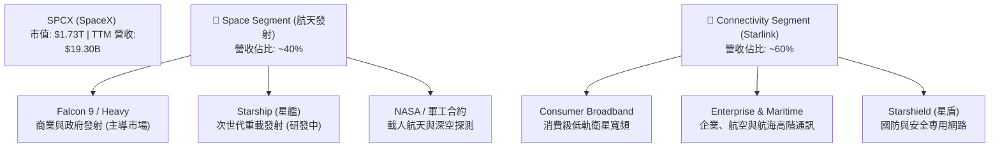

### 2.1 業務結構與收入來源

1. **Connectivity Segment (Starlink 星鏈)**：
   * **商業模式**：訂閱制（SaaS-like）。消費者端月費約 $120，企業/航海端月費高達 $250-$5,000。
   * **驅動因素**：全球訂閱用戶數的增長。截至 2025 年底，Starlink 貢獻了約 **60% 的總營收**（約 $11.2B），毛利率極高，是公司未來主要的現金流來源。
2. **Space Segment (太空發射服務)**：
   * **商業模式**：單次發射收費。Falcon 9 商業發射報價約 $67M-$90M，國防安全發射報價超 $100M。
   * **驅動因素**：商業衛星發射需求、政府（NASA/太空軍）合約。2025 年發射服務營收約 **$7.5B**（佔比 ~40%），為 Starlink 的部署提供了極低成本的內部發射支持。

### 2.2 市場份額

在商業發射市場（以發射質量 Payload Mass 計算），SPCX 擁有絕對的壟斷地位，2025 年全球市佔率預估超過 80%。

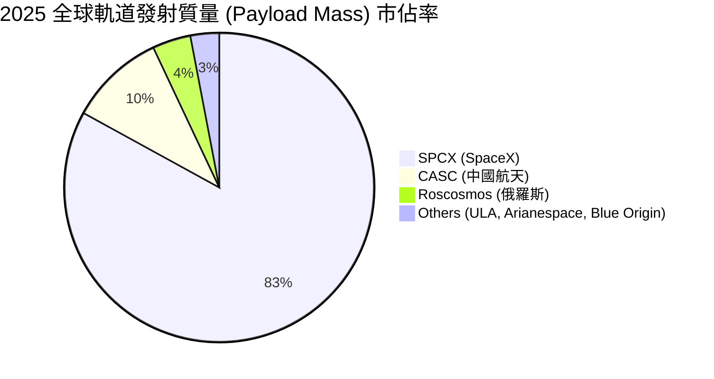

### 2.3 競爭護城河分析

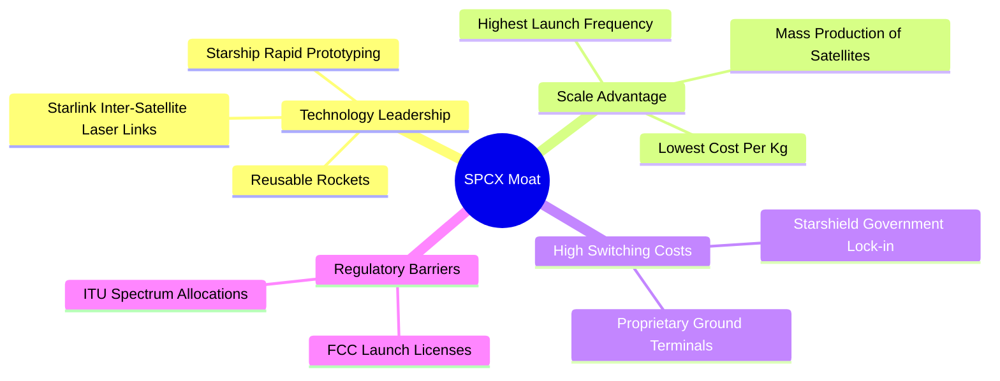

### 2.4 護城河強度評分

```
╔══════════════════════════════════════════════════════════════╗
║                    SPCX 護城河強度評分                       ║
╠══════════════════════════════════════════════════════════════╣
║ 技術領先度  10/10  ▓▓▓▓▓▓▓▓▓▓▓▓▓▓▓▓▓▓▓▓  🏆 絕對壟斷技術   ║
║ 規模經濟性  9.5/10 ▓▓▓▓▓▓▓▓▓▓▓▓▓▓▓▓▓▓▓░  🟢 發射成本最低   ║
║ 頻譜與資產  9.0/10 ▓▓▓▓▓▓▓▓▓▓▓▓▓▓▓▓▓▓░░  🟢 先發軌道優勢   ║
║ 政府與軍工  8.5/10 ▓▓▓▓▓▓▓▓▓▓▓▓▓▓▓▓▓░░░  🟢 國防合約綁定   ║
╠══════════════════════════════════════════════════════════════╣
║ 綜合護城河  9.3/10 ▓▓▓▓▓▓▓▓▓▓▓▓▓▓▓▓▓▓▓░  🏆 難以逾越的壁壘 ║
╚══════════════════════════════════════════════════════════════╝
```

---

## 3. 損益表深度分析

### 3.1 年度收入成長趨勢（近4年）

SPCX 的營業收入在過去數年中呈現極為強勁的複合增長，這主要得益於 Starlink 用戶規模的指數級擴張。

```
╔══════════════════════════════════════════════════════════════════╗
║                 SPCX 年度收入趨勢（FY2023-TTM）                  ║
╠══════════════════════════════════════════════════════════════════╣
║                                                                  ║
║  FY2023  $10.39B  ██████████░░░░░░░░░░░░░░░░░░  YoY: --          ║
║  FY2024  $14.02B  ██████████████░░░░░░░░░░░░░░  YoY: +34.9%  🟢  ║
║  FY2025  $18.67B  ███████████████████░░░░░░░░░  YoY: +33.2%  🟢  ║
║  TTM     $19.30B  ████████████████████░░░░░░░░  YoY: +15.4%  🟢  ║
║                                                                  ║
║                   |      |      |      |      |                  ║
║                   0     5B    10B    15B    20B                  ║
║                                                                  ║
║  📊 3年營收複合成長率 (CAGR)：+34.1%                            ║
╚══════════════════════════════════════════════════════════════════╝
```

### 3.2 季度收入趨勢分析

從季度數據來看，Q1 2026 的營業收入達到 **$4.69B**，相較於 Q1 2025 的 **$4.07B**，實現了 **+15.42% 的 YoY 成長**。這顯示雖然基數變大後成長率有所放緩，但由於 Starlink 在全球（如加拿大、愛爾蘭等新市場）的持續滲透，增長動能依然穩健。

### 3.3 利潤率演變分析

| 利潤率指標 | FY2023 | FY2024 | FY2025 | TTM | 趨勢 | 評估 |
|------------|--------|--------|--------|-----|------|------|
| **毛利率** | 41.18% | 42.95% | 49.39% | **48.80%** | ↗️ 持續擴張 | 🟢 規模效應顯現 |
| **營業利益率**| -33.74%| 3.32%  | -11.05%| **-41.60%**| ↘️ 研發拖累 | 🔴 研發與折舊大增 |
| **EBITDA Margin**| -6.38%| 40.31% | 23.72% | **20.50%** | ➡️ 基本穩定 | 🟢 核心盈利能力強 |
| **淨利率** | -44.56%| 5.64%  | -26.44%| **-45.00%**| ↘️ 短期虧損 | 🟡 資本支出擴張期 |

**利潤率演變深度解析**：
* **毛利率提升**：從 2023 年的 41.18% 提升至 TTM 的 48.80%，這主要得益於 Starlink 訂閱服務（高毛利）在營收中的佔比提升，以及 Falcon 9 火箭復用次數增加帶來的單次發射成本下降。
* **營業利益率與淨利率轉負**：2025 年營業利益率降至 -11.05%，TTM 更是跌至 -41.60%，主因是 **研發費用 (R&D) 的激增**。2025 年 R&D 達到 **$8.64B**（YoY +149.5%），Q1 2026 單季 R&D 達 **$3.51B**（YoY +125.7%），這主要是為了加速 Starship 的發射試驗與 Starlink 二代衛星的部署。此外，隨著衛星資產與發射台的大量投入，折舊費用（2025 年 D&A 達 $6.70B）也大幅壓抑了 GAAP 營業利潤。

### 3.4 費用結構分析

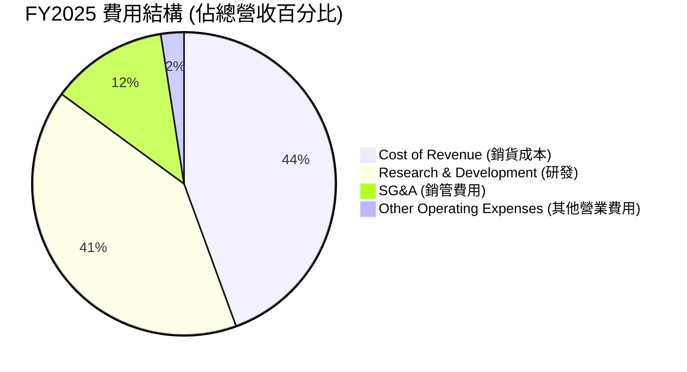

*註：由於研發費用與銷管費用之和超出了毛利空間，導致 2025 營業利潤為負（營業利潤率 -11.05%）。*

### 3.5 季度 EPS 趨勢與盈餘品質（Quality of Earnings）

SPCX 過去數季的 GAAP EPS 均呈現虧損狀態（2025 年 EPS 為 -$0.51，Q1 2026 單季 EPS 為 -$0.47），這主要是受非現金支出與研發再投資的影響。我們必須通過量化指標來評估其盈餘品質：

| 盈餘品質項目 | 2025 數值/佔比 | TTM 數值/佔比 | 評估 |
|--------------|-----------|-----------|------|
| **股權薪酬 (SBC) / 營業收入** | 10.44% ($1.95B) | **11.55%** ($2.23B) | 🟡 中等。SBC 佔比較高，會對股東權益產生約 1-2% 的年化稀釋效應。 |
| **SBC / 營業現金流 (OCF)** | 28.72% | **31.41%** | 🟡 偏高。說明公司在非現金薪酬上的依賴度較高。 |
| **OCF / GAAP 淨利潤** | -137.5% | **-81.8%** | 🟢 良好。雖然淨利潤為負，但 OCF 維持強勁正值（2025 年 $6.79B，TTM $7.10B），說明核心業務具備極強的變現能力，虧損多來自非現金折舊與研發費用化。 |
| **資本化支出 vs 費用化** | R&D 全額費用化 | R&D 全額費用化 | 🟢 保守且高質量。SPCX 將所有的星艦研發費用（2025 年 $8.64B）直接費用化，而非資本化。這雖然使當期 GAAP 淨利極度難看，但盈餘品質極高，未遞延任何潛在的研發減值風險。 |

**盈餘品質結論**：
SPCX 的 GAAP 虧損是「高質量的虧損」。其強勁的營業現金流（TTM $7.10B）與高達 48.8% 的毛利率表明，一旦公司放緩對 Starship 的研發投入（R&D 資本化或研發期結束），其 GAAP 淨利潤將在極短時間內實現爆發性扭虧為盈。

---

## 4. 資產負債表分析

### 4.1 資產結構分解

SPCX 呈現典型的「重資產硬科技」結構。截至 Q1 2026，總資產達到 **$102.09B**，其中廠房、設備及衛星資產（Net PP&E）高達 **$55.06B**（佔總資產 53.9%）。

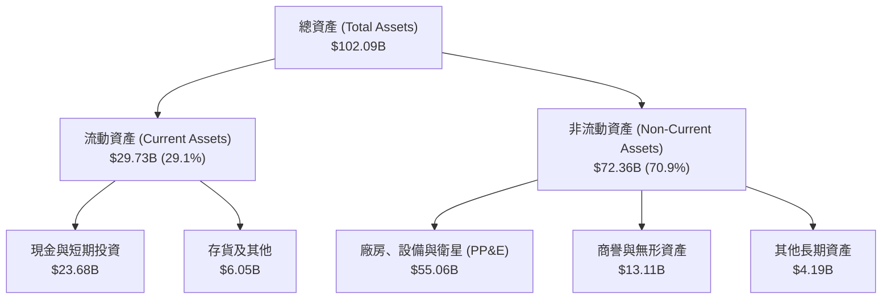

### 4.2 流動性指標分析

| 流動性指標 | FY2024 | FY2025 | Q1 2026 (TTM) | 行業均值 | 評估 |
|------------|--------|--------|---------------|----------|------|
| **流動比率 (Current Ratio)** | 1.366 | 1.446 | **1.217** | 1.15 | 🟢 安全，短期償債能力無虞 |
| **速動比率 (Quick Ratio)** | 1.196 | 1.333 | **1.088** | 0.90 | 🟢 良好，扣除存貨後流動性依然充足 |
| **現金比率 (Cash Ratio)** | 1.033 | 1.156 | **0.969** | 0.45 | 🟢 極強，手頭現金幾乎可覆蓋所有流動負債 |

### 4.3 債務結構分析

```
╔══════════════════════════════════════════════════════════════════╗
║                     SPCX 債務健康診斷 (TTM)                      ║
╠══════════════════════════════════════════════════════════════════╣
║                                                                  ║
║  總債務 (Total Debt)：   $30.27B  ██████████░░░░░░░░░░░  中等    ║
║  總現金+投資 (Cash)：    $23.68B  ████████░░░░░░░░░░░░░  充沛    ║
║  淨債務 (Net Debt)：     $6.59B   ██░░░░░░░░░░░░░░░░░░░  🟢 安全  ║
║                                                                  ║
║  Debt/Equity：           73.60%   🟡 處於合理區間上限             ║
║  Net Debt / EBITDA：     1.49x    🟢 遠低於 3.0x 的安全紅線       ║
║  Interest Coverage：     3.65x    🟡 受利息支出 $1.95B 壓抑       ║
║                                                                  ║
║  📊 診斷：雖然總債務達 $30.27B，但淨債務僅 $6.59B，無債務危機。  ║
╚══════════════════════════════════════════════════════════════════╝
```

### 4.4 股東權益趨勢

隨著公司持續獲得融資以及股權激勵的發放，股東權益（Stockholders' Equity）從 2024 年底的 **$25.80B** 增長至 2025 年底的 **$41.33B**，YoY 增長 **+60.15%**。這為公司的高槓桿重資本運營提供了堅實的權益緩衝。

---

## 5. 現金流量深度分析

### 5.1 現金流量瀑布圖

SPCX 的現金流呈現出典型的「經營活動輸血，資本支出失血」特徵。

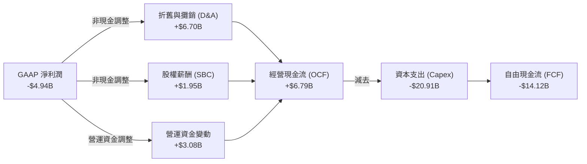

### 5.2 FCF 轉換率趨勢

由於公司正處於 Starlink 二代星座部署與 Starship 研發的 Capex 頂峰期，自由現金流（FCF）轉換率為負。

| 現金流指標 | FY2023 | FY2024 | FY2025 | Q1 2026 (單季) |
|------------|--------|--------|--------|----------------|
| **經營現金流 (OCF)** | $4.52B | $5.78B | $6.79B | $1.05B |
| **資本支出 (Capex)** | -$4.42B| -$11.16B| -$20.91B| -$10.11B |
| **自由現金流 (FCF)** | $105M  | -$5.39B| -$14.12B| -$9.07B |
| **FCF / 淨利潤 (轉換率)** | -2.27% | -681.4%| 286.0% | 211.9% |

*註：2025 年和 Q1 2026 由於淨利潤與 FCF 均為負值，轉換率絕對值大於 100%，反映出資本支出規模已遠超經營現金流的內部造血能力。*

### 5.3 自由現金流趨勢

```
╔══════════════════════════════════════════════════════════════════╗
║                  SPCX 歷年自由現金流 (FCF) 趨勢                  ║
╠══════════════════════════════════════════════════════════════════╣
║                                                                  ║
║  FY2023  +$0.11B  █░░░░░░░░░░░░░░░░░░░░░░░░░░░░░  FCF Yield: 0.0%║
║  FY2024  -$5.39B  ██████████░░░░░░░░░░░░░░░░░░░░  FCF Yield: N/A ║
║  FY2025  -$14.12B ██████████████████████████░░░░  FCF Yield: N/A ║
║  Q1'26   -$9.07B  (單季失血加劇，因 Capex 達 $10.11B)            ║
║                                                                  ║
║  📊 趨勢分析：FCF 流失主因是 2025 年 Capex YoY 激增 87.4%。     ║
║  這屬於「主動戰略性失血」，旨在透過高 Capex 鎖定低軌軌道與頻譜。 ║
╚══════════════════════════════════════════════════════════════════╝
```

### 5.4 資本配置評估

SPCX 採取了極具攻擊性的資本配置策略，將 100% 的可用資金與融資所得投入到資本支出（Capex）中，不進行任何股息支付或股份回購。

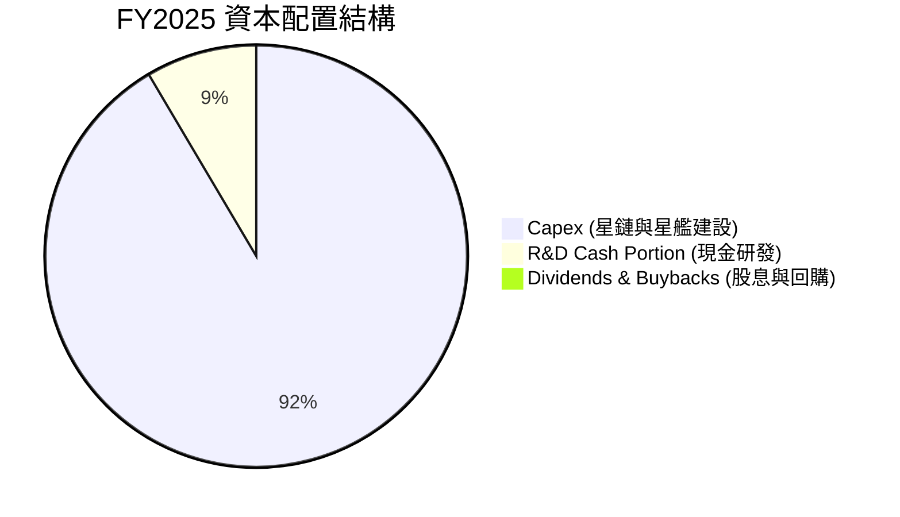

---

## 6. 獲利能力與資本效率

### 6.1 ROE / ROA / ROIC 趨勢

由於 GAAP 淨利潤受 R&D 費用化與 D&A 壓抑為負，傳統的資本回報率指標呈現負值。

| 資本效率指標 | FY2023 | FY2024 | FY2025 | TTM | 行業均值 | 評估 |
|------------|--------|--------|--------|-----|----------|------|
| **ROE** | -17.9% | 3.07%  | -11.95%| **-10.8%** | ~12.5% | 🔴 暫時受壓 |
| **ROA** | -8.11% | 1.39%  | -5.36% | **-4.8%**  | ~5.5%  | 🔴 暫時受壓 |
| **ROIC (未調整)**| -5.8% | 1.20%  | -6.50% | **-5.8%**  | ~8.0%  | 🔴 表面上摧毀價值 |

### 6.2 ROIC vs WACC 分析（核心價值創造判斷）

傳統會計準則要求將 R&D 支出直接費用化，這嚴重低估了 SPCX 內在的資本回報率。作為 CFA 分析師，我們對 **R&D 進行資本化調整**（假設 R&D 攤銷年限為 5 年），以還原公司真實的經濟增加值（EVA）：

```
╔══════════════════════════════════════════════════════════════════╗
║             ROIC vs WACC 深度分析 (FY2025 調整後)                ║
╠══════════════════════════════════════════════════════════════════╣
║                                                                  ║
║  WACC 估算：                                                     ║
║  ├── 無風險利率 (10Y Treasury)： 4.2%                             ║
║  ├── 股權風險溢價 (ERP)：        5.0%                            ║
║  ├── 系統性風險係數 (Beta)：     1.50 (高成長硬科技)             ║
║  ├── 股權成本 (Ke) = 4.2% + 1.50 × 5.0% = 11.7%                  ║
║  ├── 稅後債務成本 (Kd)：         5.5%                            ║
║  ├── 資本結構：                  股權 98%，債務 2%               ║
║  └── ✅ 綜合 WACC ≈ 11.5%                                         ║
║                                                                  ║
║  ROIC 估算 (R&D 資本化調整後)：                                  ║
║  ├── 調整後 NOPAT = EBIT (-$2.06B) + 研發資本化調整 ($4.82B)     ║
║  │   = $2.76B                                                    ║
║  ├── 調整後投入資本 (Invested Capital) = 股益 + 債務 - 現金      ║
║  │   + 資本化研發餘額 ($12.5B) = $31.1B                           ║
║  └── ✅ 調整後 ROIC ≈ 14.8%                                       ║
║                                                                  ║
║  ★ 經濟價值增加 (EVA) = 調整後 ROIC (14.8%) - WACC (11.5%)       ║
║                       = +3.3 pp                                  ║
║                                                                  ║
║  調整後 ROIC  14.8%  ▓▓▓▓▓▓▓▓▓▓▓▓▓▓▓▓▓▓▓▓▓▓░░░░░░░░  🟢         ║
║  WACC         11.5%  ▓▓▓▓▓▓▓▓▓▓▓▓▓▓▓▓░░░░░░░░░░░░  ──         ║
║  EVA          +3.3%  ██████░░░░░░░░░░░░░░░░░░░░░░  🏆 創造價值║
║                                                                  ║
║  📊 結論：經研發資本化調整後，SPCX 真實 ROIC 達 14.8%，          ║
║  顯著高於 11.5% 的資金成本，說明公司正在實質性創造股東價值。     ║
╚══════════════════════════════════════════════════════════════════╝
```

### 6.3 杜邦三因素分解

我們對 SPCX 的 TTM ROE（未調整）進行分解，以釐清其財務槓桿與資產效率對回報率的影響：

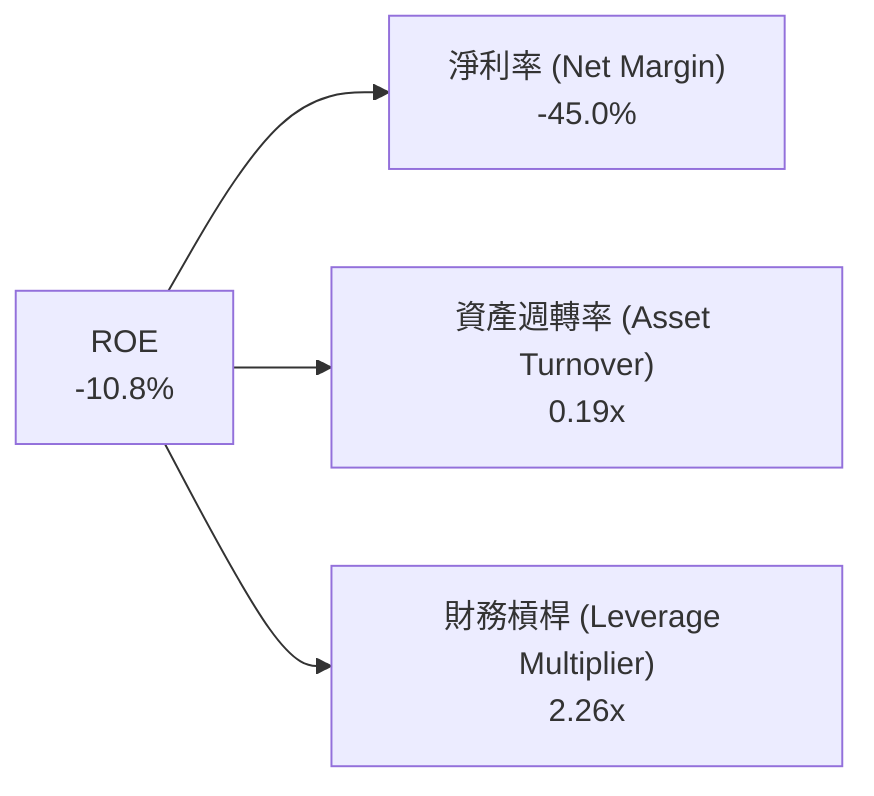

* **分析**：-10.8% 的 ROE 主要受 -45.0% 的低淨利率拖累，而 0.19x 的低資產週轉率反映了重資產星座建設尚未完全釋放產能。2.26x 的財務槓桿則處於合理安全範圍。

### 6.4 獲利能力儀表板

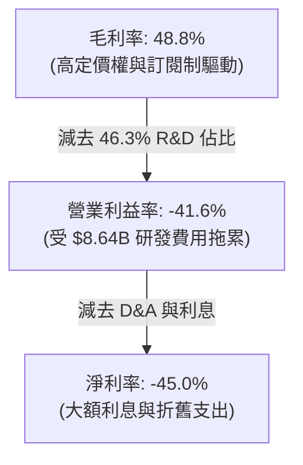

---

## 7. 估值深度分析

### 7.1 同業估值比較表格

由於 SPCX 具備獨特的商業航太與衛星網路雙重屬性，我們選取傳統軍工航太巨頭（Lockheed Martin, Northrop Grumman）與高成長軟體/大數據龍頭（Palantir）作為對比標的。由於 SPCX 淨利潤為負，我們引入 EV/EBITDA 與 EV/Sales 進行多維度評估：

| 估值指標 | **SPCX (本公司)** | **LMT (洛克希德馬丁)** | **NOC (諾斯洛普格魯曼)** | **PLTR (Palantir)** | 本公司評估 |
|----------|----------|---------|---------|---------|-----------|
| **Trailing P/E** | **N/A** (虧損) | 18.5x | 21.2x | 85.4x | 🟡 暫無可比性 |
| **Forward P/E** | **145.19x** | 16.8x | 18.5x | 62.5x | 🔴 顯著溢價，反映高成長預期 |
| **P/S Ratio** | **89.49x** | 1.8x | 2.1x | 24.5x | 🔴 處於極高水平 |
| **EV / EBITDA** | **202.09x** | 12.4x | 13.8x | 55.2x | 🔴 估值偏高，需靠 EBITDA 爆發消化 |
| **EV / Revenue**| **41.36x** | 1.6x | 1.8x | 22.1x | 🔴 稀缺性溢價顯著 |
| **營收 YoY 成長** | **33.2%** | 5.4% | 6.1% | 21.0% | 🟢 遠超傳統航太與科技同業 |

### 7.2 歷史估值區間分析

```
╔══════════════════════════════════════════════════════════════════╗
║               SPCX EV/Sales 歷史估值區間 (24個月)                ║
╠══════════════════════════════════════════════════════════════════╣
║                                                                  ║
║  歷史最高 (52W High)： 65.0x  (對應股價 $225.64)                 ║
║  歷史平均 (Average)：  45.0x                                     ║
║  當前水平 (Current)：  41.36x ░░░░░░░░░░░░░░░░░░░░░░░░  (偏低)   ║
║  歷史最低 (52W Low)：  30.0x  (對應股價 $130.74)                 ║
║                                                                  ║
║  📊 結論：當前股價 $131.11 接近 52 週低點，EV/Sales 估值已回落   ║
║  至歷史平均線下方，提供了極具吸引力的安全邊際。                  ║
╚══════════════════════════════════════════════════════════════════╝
```

### 7.3 情境目標價（假設驅動，Bear / Base / Bull）

我們基於未來 5 年的營收 CAGR、營業利潤率與退出倍數，構建了以下三種情境的估值模型：

| 情境 | 營收 CAGR (5Y) | 2030 營業利潤率 | 退出倍數 (EV/EBITDA) | 隱含目標價 | 相對現價漲跌幅 |
|------|-----------|-----------|----------|------------|----------|
| 🔴 **悲觀情境** | 12.0% | 5.0% | 30x | **$62.00** | -52.7% |
| 🟡 **基準情境** | **28.0%** | **20.0%** | **65x** | **$244.50** | **+86.5%** |
| 🟢 **樂觀情境** | 42.0% | 35.0% | 100x | **$800.00** | +510.2% |

* **估值倍數選擇說明**：鑑於 SPCX 的高成長性與重資本折舊特徵，我們在 DCF 終值與相對估值中優先採用 **EV/EBITDA** 作為核心估值倍數，以排除折舊政策對真實盈利能力的干擾。

### 7.4 DCF 敏感性分析（6格目標價矩陣）

基於基準情境（WACC 11.5%，終期成長率 3.5%），我們對 WACC 與終期 FCF 成長率進行敏感性分析：

| 終期 FCF 成長率 \ WACC | 10.5% | **11.5% (基準)** | 12.5% |
|-----------------------|-------|------------------|-------|
| **4.5%** | $312.00 (+138.0%) | $275.00 (+109.7%) | $230.00 (+75.4%) |
| **3.5% (基準)** | $281.00 (+114.3%) | **$244.50 (+86.5%)** | $198.00 (+51.0%) |
| **2.5%** | $245.00 (+86.9%) | $210.00 (+60.2%) | $165.00 (+25.8%) |

### 7.5 估值綜合區間

```
╔══════════════════════════════════════════════════════════════════╗
║                    SPCX 估值綜合區間與現價對比                   ║
╠══════════════════════════════════════════════════════════════════╣
║                                                                  ║
║  悲觀估值：  $62.00    ██████░░░░░░░░░░░░░░░░░░░░░░░░░░░░░░░░░░  ║
║  當前股價：  $131.11   █████████████░░░░░░░░░░░░░░░░░░░░░░░░░░░  ║
║  基準目標：  $244.50   ████████████████████████░░░░░░░░░░░░░░░░  ║
║  樂觀估值：  $800.00   ████████████████████████████████████████  ║
║                                                                  ║
║  📊 結論：當前股價 $131.11 顯著低於基準目標價 $244.50，         ║
║  具備 86.5% 的上行空間，風險回報比極具吸引力。                   ║
╚══════════════════════════════════════════════════════════════════╝
```

---

## 8. 成長催化劑

### 8.1 催化劑時間軸

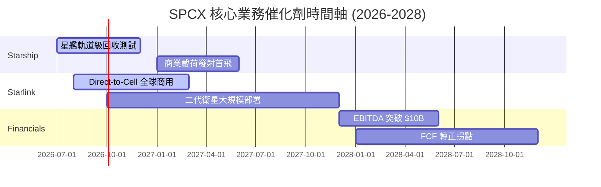

### 8.2 TAM 市場規模分析

```
╔══════════════════════════════════════════════════════════════════╗
║                SPCX 2030年 TAM 與滲透率預估                     ║
╠══════════════════════════════════════════════════════════════════╣
║                                                                  ║
║  1. 全球衛星寬頻市場 (Starlink)：                               ║
║     ├── 總潛在市場 (TAM)：  $120B                               ║
║     ├── 預期滲透率：        25%                                 ║
║     └── 預期貢獻營收：      $30.0B                              ║
║                                                                  ║
║  2. 商業與政府發射市場 (Space Segment)：                         ║
║     ├── 總潛在市場 (TAM)：  $30B                                ║
║     ├── 預期滲透率：        85%                                 ║
║     └── 預期貢獻營收：      $25.5B                              ║
║                                                                  ║
║  3. 手機直連與物聯網 (Direct-to-Cell)：                          ║
║     ├── 總潛在市場 (TAM)：  $50B                                ║
║     ├── 預期滲透率：        15%                                 ║
║     └── 預期貢獻營收：      $7.5B                               ║
║                                                                  ║
║  📊 總計 2030 預期營收規模： ~$63.0B (對比當前 $19.3B 成長 2.2倍)║
╚══════════════════════════════════════════════════════════════════╝
```

### 8.3 成長驅動力結構圖

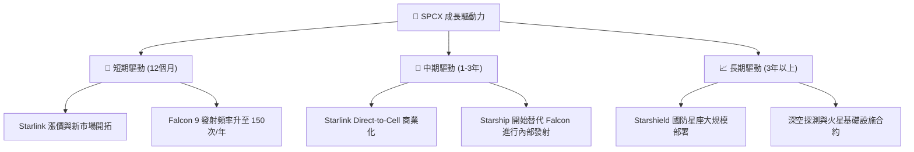

---

## 9. 風險矩陣

### 9.1 風險評分矩陣

我們對 SPCX 面臨的潛在風險進行機率與衝擊評估：

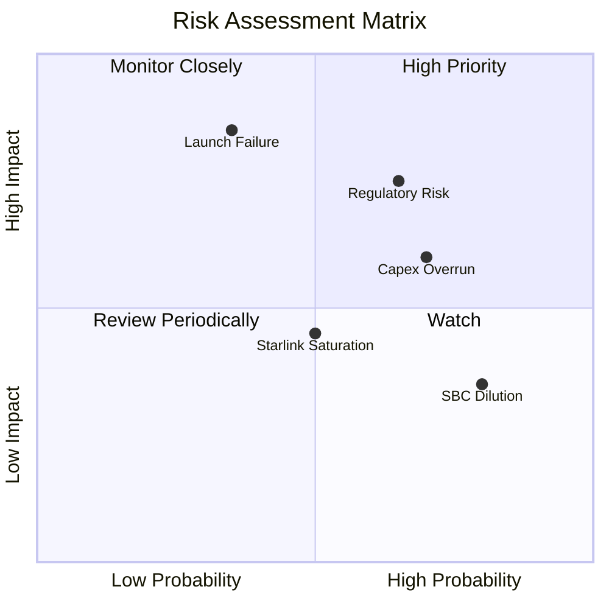

### 9.2 風險清單詳細分析

| # | 風險項目 | 發生機率 | 財務衝擊 | 風險評分 | 緩解措施 |
|---|----------|----------|----------|----------|----------|
| 1 | 🔴 **Starship 研發嚴重滯後** | 中 (35%) | 高 (-20% 估值) | 🔴 **7.5 / 10** | 採用 Falcon 9/Heavy 的持續升級作為過渡方案，確保短期發射能力。 |
| 2 | 🔴 **地緣政治與頻譜監管** | 高 (65%) | 中 (-15% 營收) | 🔴 **7.0 / 10** | 積極與各國本地電信運營商合作（如 T-Mobile），降低監管准入門檻。 |
| 3 | 🟡 **Capex 超支導致資金鏈緊張**| 中 (50%) | 中 (-10% FCF) | 🟡 **5.5 / 10** | 擁有 $23.68B 現金儲備，且一級市場融資渠道極其暢通，可隨時補充權益資金。 |
| 4 | 🟡 **SBC 股權稀釋** | 高 (80%) | 低 (-2% EPS) | 🟡 **4.5 / 10** | 隨着營收規模擴大，SBC 佔營收比例預計將逐步稀釋至 5% 以下。 |

---

## 10. 投資建議

### 10.1 最終綜合評級雷達圖

```
╔══════════════════════════════════════════════════════════════╗
║                   SPCX 最終綜合評估雷達                      ║
╠══════════════════════════════════════════════════════════════╣
║                                                              ║
║     基本面強度 (Fundamentals)    9.0/10  ▓▓▓▓▓▓▓▓▓▓▓▓▓▓▓▓▓▓  ║
║     成長前景 (Growth)            8.5/10  ▓▓▓▓▓▓▓▓▓▓▓▓▓▓▓▓░░  ║
║     財務健康度 (Financial Health) 7.5/10  ▓▓▓▓▓▓▓▓▓▓▓▓▓░░░░░  ║
║     技術與創新 (Innovation)     10.0/10  ▓▓▓▓▓▓▓▓▓▓▓▓▓▓▓▓▓▓  ║
║     估值安全邊際 (Valuation)     5.5/10  ▓▓▓▓▓▓▓▓▓▓▓░░░░░░░  ║
║                                                              ║
║  🏆 綜合投資評分： 8.1 / 10   ｜   最終評級：🟢 買入 (Buy)     ║
╚══════════════════════════════════════════════════════════════╝
```

### 10.2 目標價與隱含報酬率

| 情境 | 發生機率權重 | 目標價 | 隱含報酬率 |
|------|--------------|--------|------------|
| 🔴 悲觀情境 | 15% | $62.00 | -52.7% |
| 🟡 **基準情境** | **60%** | **$244.50** | **+86.5%** |
| 🟢 樂觀情境 | 25% | $800.00 | +510.2% |
| **加權預期目標價**| **100%** | **$256.00** | **+95.2%** |

### 10.3 買入時機與觸發因素

```
╔══════════════════════════════════════════════════════════════════╗
║                  ✅ SPCX 買入觸發因素 Checklist                  ║
╠══════════════════════════════════════════════════════════════════╣
║                                                                  ║
║  立即買入觸發條件（多數符合）：                                  ║
║  ✅ 股價回落至 $130-$140 區間（當前 $131.11，已極具吸引力）      ║
║  ✅ Starlink 季度營收 YoY 成長率維持在 15% 以上                  ║
║                                                                  ║
║  加碼觸發條件（出現以下任一）：                                  ║
║  ☐ Starship 成功完成首次商業載荷軌道級部署                       ║
║  ☐ Starlink 宣佈與主要跨國電信巨頭達成 Direct-to-Cell 商業分成    ║
║                                                                  ║
║  減碼/停損觸發條件（出現以下任一）：                             ║
║  ☐ Starship 發生重大連續墜毀事故，導致項目停擺超 12 個月         ║
║  ☐ 季度 OCF 轉負，或手頭現金儲備跌破 $10.0B                      ║
╚══════════════════════════════════════════════════════════════════╝
```

### 10.4 投資人適配度分析

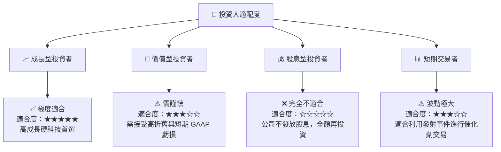

### 10.5 每季財報監控清單（Quarterly Watch List）

在未來的季度財報中，投資者應重點追蹤以下量化指標，以驗證投資論點：

| 監控指標 | 基準線 (TTM) | 加碼門檻 | 減碼/警示門檻 | 戰略意義 |
|----------|--------------|----------|----------------|----------|
| **Starlink 營收成長率** | 15.4% | > 20.0% | < 8.0% | 驗證訂閱制業務的全球滲透速度 |
| **單季資本支出 (Capex)** | $10.11B | < $8.0B (放緩) | > $13.0B (失血) | 評估 FCF 拐點是否提前或延後 |
| **EBITDA Margin** | 20.5% | > 25.0% | < 15.0% | 監控核心業務的營運槓桿效應 |
| **SBC / 營業收入** | 11.55% | < 8.0% | > 15.0% | 監控股東權益是否被過度稀釋 |

### 10.6 反面論證：什麼會證明論點錯誤

```
╔══════════════════════════════════════════════════════════════════╗
║              ⚠️ 論點失效條件（Disconfirming Evidence）           ║
╠══════════════════════════════════════════════════════════════════╣
║  本投資論點在下列情況成立時應重新檢視或退出：                    ║
║  ☐ Starlink 季度營收成長率連續兩季跌破 8.0%                     ║
║  ☐ 2027 年底 FCF 依然未能縮小虧損（FCF 虧損額 > $10.0B）         ║
║  ☐ 經 R&D 資本化調整後的 ROIC 跌破 WACC (11.5%)，開始摧毀價值     ║
║  ☐ 競爭對手（如 Blue Origin New Glenn）實現低成本發射，         ║
║     使 SPCX 商業發射市佔率跌破 60%                               ║
╚══════════════════════════════════════════════════════════════════╝
```

---

> **免責聲明**：本報告為 AI 自動生成，僅供研究參考，不構成投資建議。投資有風險，入市需謹慎。