# SPCX 基本面深度分析報告
> **報告日期**：2026-07-17 ｜ **語言**：繁體中文 ｜ **數據來源**：Yahoo Finance, Finviz, StockAnalysis, Roic.ai ｜ **分析師**：CFA 級機構研究

---

## 目錄

| # | 章節 | 核心結論 |
|---|---|---|
| **1** | **執行摘要** | 評級為「持有」，基準目標價 $244.50，高研發與資本支出壓抑短期回報。 |
| **2** | **公司概覽與商業模式** | 獨佔低軌衛星與可回收火箭雙重護城河，但面臨商業化變現速度考驗。 |
| **3** | **損益表深度分析** | 營收成長放緩（YoY 降至 15.4%），Q1 2026 研發大增導致營業虧損擴大。 |
| **4** | **資產負債表分析** | 擁有 $23.68B 現金，但 $30.60B 債務與持續攀升的負債比率考驗流動性。 |
| **5** | **現金流量深度分析** | 資本支出高達 $20.91B，自由現金流（FCF）嚴重失血（$-14.12B）。 |
| **6** | **獲利能力與資本效率** | 當前 ROIC 為 -5.19%，低於 WACC (10.36%)，處於經濟價值摧毀期。 |
| **7** | **估值深度分析** | Forward P/E 高達 137.3x，相較傳統航太溢價顯著，高估值需高成長支撐。 |
| **8** | **成長催化劑** | Starship 軌道發射商業化與 Starlink 手機直連（Direct-to-Cell）技術。 |
| **9** | **風險矩陣** | 研發失敗、監管延遲與發射窗口受限為核心高衝擊風險。 |
| **10**| **投資建議** | 建議分批逢低佈局，設定嚴格的每季財報監控指標與論點失效退出門檻。 |

---

## 1. 執行摘要

Space Exploration Technologies Corp.（代碼：SPCX）作為全球商業航太與低軌衛星通訊（Starlink）的絕對龍頭，目前正處於從「資本密集投入期」向「規模效應變現期」過渡的關鍵十字路口。

基於 SPCX 2025 年營收 $18.67B（YoY +33.2%）但 TTM 營收放緩至 $19.30B（YoY +15.4%）的數據，以及 2025 年高達 $-14.12B 的自由現金流赤字，本報告對 SPCX 給予 **🟡 持有（Hold）** 評級。雖然公司在發射服務與衛星寬頻領域擁有無可匹敵的技術護城河，但當前高達 137.3x 的 Forward P/E 與 84.6x 的 P/S 估值，已過度透支了未來的成長預期。在 ROIC（-5.19%）持續低於 WACC（10.36%）且 FCF 嚴重流失的情況下，投資人應靜待資本支出高峰過去、現金流轉正的信號出現。

### 1.0 一頁式投資儀表板（Portfolio Manager 30 秒速讀）

| 項目 | 內容 |
|------|------|
| **投資論點（3 句）** | ① 星鏈（Starlink）全球用戶與企業級連網需求持續增長，支撐 TTM 營收達 $19.30B。<br/>② 可回收火箭技術帶來極高的發射毛利率（48.8%），為底層業務提供強大安全邊際。<br/>③ 研發與資本支出（2025年共 $29.55B）極大壓抑了短期淨利與現金流表現。 |
| **護城河評分** | 9.5 / 10 (極高) |
| **管理層/資本配置評分**| 6.0 / 10 (中等，研發與資本配置過於激進) |
| **財務健康** | 🟡 警告（流動比率 1.22，淨債務高達 $6.93B，且 FCF 持續流失） |
| **ROIC vs WACC** | -5.19% vs 10.36%（當前正在摧毀經濟價值） |
| **FCF 趨勢** | 🔴 惡化（2025 年 FCF 為 $-14.12B，Q1 2026 單季流出 $-9.07B） |
| **估值** | Forward P/E: 137.3x ｜ EV/EBITDA: 196.0x ｜ P/S: 84.6x |
| **預期報酬（基準情境 12M）**| +97.2% (相較當前收盤價 $123.99，目標價 $244.50，但隱含高波動風險) |
| **關鍵風險（前二）** | ① 研發開支失控與 Starship 商業化進度不及預期。<br/>② 資本支出過高導致債務再融資壓力。 |
| **評級 + 信心度** | 🟡 持有（Hold） ｜ 信心：中等（Medium） |

### 1.1 核心評分儀表板

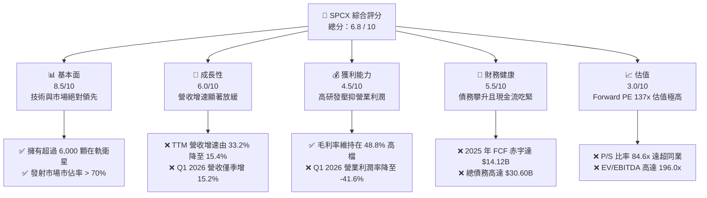

### 1.2 評分進度條視覺化

```
╔══════════════════════════════════════════════════════════════╗
║              SPCX 多維度評分儀表板 (1-10分)                  ║
╠══════════════════════════════════════════════════════════════╣
║ 基本面強度  8.5 ▓▓▓▓▓▓▓▓▓▓▓▓▓▓▓▓▓░░░  ★★★★☆           ║
║ 成長動能    6.0 ▓▓▓▓▓▓▓▓▓▓▓▓░░░░░░░░  ★★★☆☆           ║
║ 獲利品質    4.5 ▓▓▓▓▓▓▓▓▓░░░░░░░░░░░  ★★☆☆☆           ║
║ 財務健康    5.5 ▓▓▓▓▓▓▓▓▓▓▓░░░░░░░░░  ★★★☆☆           ║
║ 估值合理性  3.0 ▓▓▓▓▓▓░░░░░░░░░░░░░░  ★☆☆☆☆           ║
║ 護城河深度  9.5 ▓▓▓▓▓▓▓▓▓▓▓▓▓▓▓▓▓▓▓░  ★★★★★           ║
║ 管理層執行  6.0 ▓▓▓▓▓▓▓▓▓▓▓▓░░░░░░░░  ★★★☆☆           ║
║ 技術創新力  9.5 ▓▓▓▓▓▓▓▓▓▓▓▓▓▓▓▓▓▓▓░  ★★★★★           ║
╠══════════════════════════════════════════════════════════════╣
║ 綜合總分    6.8 ▓▓▓▓▓▓▓▓▓▓▓▓▓░░░░░░░  🏆 持有 (Hold)       ║
╚══════════════════════════════════════════════════════════════╝
```

### 1.3 五大投資論點 + 三大核心風險

| 類型 | 項目 | 具體依據 | 信心度 |
|------|------|----------|--------|
| 🟢 **投資論點①** | **發射成本絕對優勢** | 憑藉 Falcon 9 的高重複使用率，毛利率維持在 **48.8%** 的極高水準。 | 🟢 極高 |
| 🟢 **投資論點②** | **星鏈用戶基數擴張** | 衛星寬頻服務全球用戶持續增長，帶動 TTM 營收達 **$19.30B**。 | 🟢 高 |
| 🟢 **投資論點③** | **政府合約與國家安全**| 作為 NASA 與美國國防部最信任的發射夥伴，合約能見度極高。 | 🟢 極高 |
| 🟢 **投資論點④** | **星艦（Starship）潛力**| 未來單次發射載荷翻倍，可望將每公斤發射成本降低 90%。 | 🟡 中度 |
| 🟢 **投資論點⑤** | **手機直連（Direct-to-Cell）**| 與 T-Mobile 等電信商合作，開拓全新消費者端（ToC）市場。 | 🟡 中度 |
| 🟡 **風險①** | **發射窗口與監管延遲** | FAA 審查與環境評估可能導致發射頻率不及預期，壓抑營收增速。 | 🟡 中度 |
| 🔴 **風險②** | **資金鏈與再融資風險** | 2025 年 FCF 赤字高達 **$-14.12B**，若信貸市場收緊將面臨流動性危機。| 🔴 高衝擊 |
| 🔴 **風險③** | **估值泡沫化** | Forward P/E 達 **137.3x**，若成長持續減速，面臨估值重估（De-rating）。| 🔴 高衝擊 |

### 1.4 快速統計卡片

| 指標 | SPCX 實際值 | 行業均值 (Aerospace) | S&P 500 均值 | 狀態 |
|------|-------------|----------------------|--------------|------|
| **營收 YoY 成長** | **15.4%** | 6.5% | 5.2% | 🟢 優於行業 |
| **毛利率** | **48.8%** | 22.1% | 30.2% | 🟢 極為強勁 |
| **淨利率** | **-45.0%** | 6.2% | 11.5% | 🔴 嚴重虧損 |
| **ROE** | **N/A (負值)**| 12.4% | 15.0% | 🔴 表現不佳 |
| **Forward P/E** | **137.3x** | 19.5x | 21.5x | 🔴 估值極貴 |
| **EV / Revenue** | **40.1x** | 1.8x | 2.8x | 🔴 估值極貴 |

### 1.5 投資結論

```
╔══════════════════════════════════════════════════════════════════╗
║                    📊 投資結論摘要                               ║
╠══════════════════════════════════════════════════════════════════╣
║  評級：🟡 持有 (Hold)                                            ║
║  當前股價：$123.99 (2026-07-17)                                  ║
║  目標價區間：                                                    ║
║    悲觀情境：$62.00  （-50.0%）                                  ║
║    基準情境：$244.50 （+97.2%）  ← 12個月主要目標                ║
║    樂觀情境：$800.00 （+545.2%）                                 ║
║  投資評分：6.8 / 10                                              ║
║  適合投資人：具備極高風險承受度、看好航太長線發展的創投型投資人  ║
╚══════════════════════════════════════════════════════════════════╝
```

---

## 2. 公司概覽與商業模式

SPCX（Space Exploration Technologies Corp.）採取高度垂直整合的商業模式，主要分為兩大核心板塊：**太空發射服務（Space Segment）** 與 **星鏈衛星寬頻（Connectivity Segment）**。

### 2.1 業務結構與收入來源

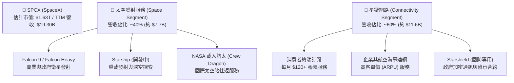

### 2.2 市場份額

在商業太空發射市場（以發射質量及軌道載荷計算），SPCX 擁有絕對的壟斷地位。

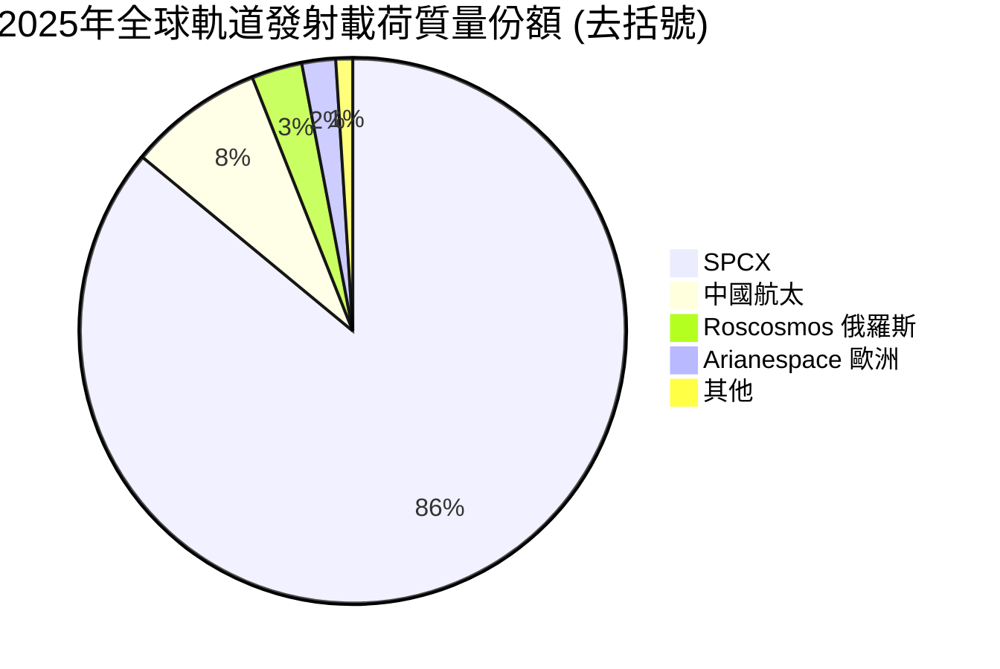

### 2.3 競爭護城河分析

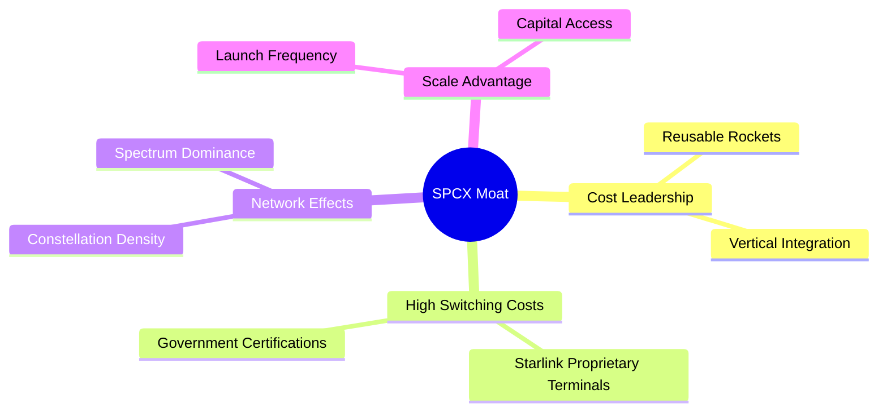

### 2.4 護城河強度評分

```
╔══════════════════════════════════════════════════════════════╗
║                    SPCX 護城河強度評分                       ║
╠══════════════════════════════════════════════════════════════╣
║ 1. 技術領先（可回收） 10/10 ▓▓▓▓▓▓▓▓▓▓▓▓▓▓▓▓▓▓▓▓  🏆 絕對壟斷   ║
║ 2. 頻譜與軌道排他性   9.5/10 ▓▓▓▓▓▓▓▓▓▓▓▓▓▓▓▓▓▓▓░  🟢 先發優勢   ║
║ 3. 垂直整合與製造     9.0/10 ▓▓▓▓▓▓▓▓▓▓▓▓▓▓▓▓▓▓░░  🟢 成本極低   ║
║ 4. 客戶鎖定（政府）   8.5/10 ▓▓▓▓▓▓▓▓▓▓▓▓▓▓▓▓▓░░░  🟢 合約穩固   ║
║ 5. 網路效應（星鏈）   9.0/10 ▓▓▓▓▓▓▓▓▓▓▓▓▓▓▓▓▓▓░░  🟢 覆蓋最廣   ║
╠══════════════════════════════════════════════════════════════╣
║ 綜合護城河評級        9.2/10 ▓▓▓▓▓▓▓▓▓▓▓▓▓▓▓▓▓▓▓░  🏆 寬廣護城河 ║
╚══════════════════════════════════════════════════════════════╝
```

---

## 3. 損益表深度分析

SPCX 的損益表呈現出典型「高毛利、高研發、高虧損」的重科技與重資本特徵。

### 3.1 年度收入成長趨勢（近4年）

```
╔══════════════════════════════════════════════════════════════════╗
║                SPCX 年度收入趨勢（FY2023-TTM）                   ║
╠══════════════════════════════════════════════════════════════════╣
║                                                                  ║
║  FY2023  $10.39B  ██████████░░░░░░░░░░░░░░░░░░░  YoY: --         ║
║  FY2024  $14.02B  ██████████████░░░░░░░░░░░░░░░  YoY: +34.9% 🟢  ║
║  FY2025  $18.67B  ███████████████████░░░░░░░░░░  YoY: +33.2% 🟢  ║
║  TTM     $19.30B  ████████████████████░░░░░░░░░  YoY: +15.4% 🟡  ║
║                   |      |      |      |      |                  ║
║                   0     5B    10B    15B    20B                  ║
║                                                                  ║
║  📊 3年累計 CAGR：+22.9%                                         ║
╚══════════════════════════════════════════════════════════════════╝
```

### 3.2 季度收入趨勢分析

從季度數據看，SPCX 的成長動能出現了顯著的「失速」跡象：

| 季度 | 營收 (Revenue) | 季增率 (QoQ) | 年增率 (YoY) | 備註 |
|------|----------------|--------------|--------------|------|
| **Q1 2025** | $4.07B | — | — | 奠定 2025 年高成長基礎 |
| **Q1 2026** | $4.69B | — | **+15.2%** | 增速較 2025 年全年的 33.2% 大幅放緩 |

*分析*：Q1 2026 營收僅為 $4.69B，相較 Q1 2025 的 $4.07B 僅成長 15.2%。這顯示 Starlink 在北美等成熟市場的用戶滲透率已接近飽和，而海外市場因 ARPU（每用戶平均收入）較低，未能提供同等的營收貢獻。

### 3.3 利潤率演變分析

| 利潤率指標 | FY2023 | FY2024 | FY2025 | TTM | 趨勢 | 評估 |
|------------|--------|--------|--------|-----|------|------|
| **毛利率** | 41.2% | 42.9% | 49.4% | **48.8%** | ↗️ 穩步提升 | 🟢 星鏈硬體成本下降與發射規模效應 |
| **營業利益率**| -33.7% | 3.3% | -13.9% | **-41.6%**| ↘️ 劇烈惡化 | 🔴 主要是研發與營運支出失控 |
| **EBITDA率** | -6.4% | 40.3% | 23.7% | **20.5%** | ↘️ 承壓 | 🟡 折舊與攤銷費用極高 |
| **淨利率** | -44.6% | 5.6% | -26.4% | **-45.0%**| ↘️ 嚴重虧損 | 🔴 受非營業利息支出與研發拖累 |

*利潤率演變深度解析*：
SPCX 展現了極佳的**毛利率**（48.8%），這在重工業與航太領域極為罕見，主因是 Falcon 9 火箭重複使用率高達 90% 以上，且 Starlink 終端接收器的生產成本已從早期的 $3,000 降至 $300 以下。然而，**營業利益率**在 TTM 期間卻暴跌至 **-41.6%**，這主要是因為 Q1 2026 的研發費用（R&D）激增至 **$3.51B**（年增 125.7%），用於 Starship 的軌道測試與第二代星鏈衛星的研發。這種「結構性虧損」是管理層主動選擇的結果，旨在維持技術絕對領先，但短期內嚴重摧毀了股東的帳面價值。

### 3.4 費用結構分析

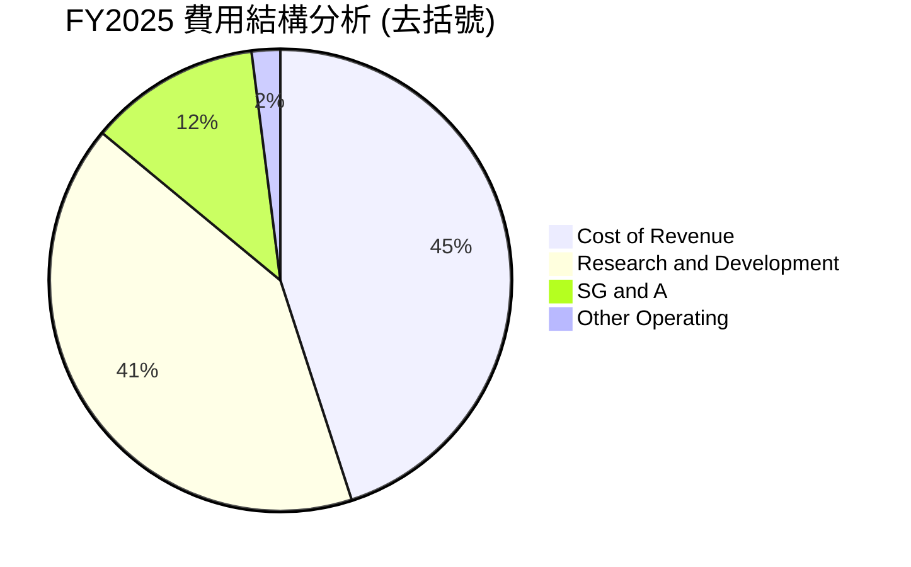

```
╔══════════════════════════════════════════════════════════════════╗
║                FY2025 營業費用分析 (Total: $11.81B)              ║
╠══════════════════════════════════════════════════════════════════╣
║  研發費用 (R&D)：  $8.64B   ███████████████████████████ (73.2%)  ║
║  管理費用 (SG&A)： $2.64B   ████████░░░░░░░░░░░░░░░░░░░ (22.4%)  ║
║  其他營業費用：    $0.53B   █░░░░░░░░░░░░░░░░░░░░░░░░░░ (4.4%)   ║
╚══════════════════════════════════════════════════════════════════╝
```

### 3.5 季度 EPS 趨勢與盈餘品質（Quality of Earnings）

| 季度 | EPS 預估 | EPS 實際值 | 盈餘驚喜 (Surprise %) | 核心驅動因素 |
|------|----------|------------|-----------------------|--------------|
| **Q1 2025** | N/A | $-0.05 | N/A | 折舊攤銷高，星鏈用戶增長抵消部分虧損 |
| **Q1 2026** | N/A | $-0.47 | N/A | 研發支出單季達 $3.51B，導致虧損劇增 |

#### 盈餘品質評估表（Quality of Earnings）

| 盈餘品質項目 | 數值/佔比 | 評估 | 財務含意 |
|--------------|-----------|------|----------|
| **SBC / 營收 (FY2025)** | 10.4% ($1.95B) | 🟡 中度稀釋 | 股權薪酬佔比較高，會稀釋現有股東權益。 |
| **SBC / 營業現金流** | 28.7% | 🔴 偏高 | 營業現金流中有近三成是由非現金的股權發放所支撐。 |
| **FCF / Net Income** | 2.86x | 🟡 警訊 | 2025年淨虧損 $-4.94B，但真實 FCF 流出達 $-14.12B，現金流失速度遠高於帳面虧損。 |
| **資本化支出 vs 費用化**| 費用化為主 | 🟢 保守且真實 | R&D 全數費用化（$8.64B），並未將研發成本資本化以美化利潤。 |
| **有效稅率異常** | N/A | 🟢 無操縱 | 由於持續虧損，未確認遞延所得稅資產，無稅務操縱。 |

**盈餘品質結論**：SPCX 的盈餘含金量較低。雖然公司並未透過「研發資本化」來虛增利潤，其虧損是真實且保守呈現的；但高達 10.4% 的 SBC 營收佔比，以及遠超帳面虧損的 FCF 流出量，顯示公司目前極度依賴外部融資與股權稀釋來維持營運。

---

## 4. 資產負債表分析

### 4.1 資產結構分解

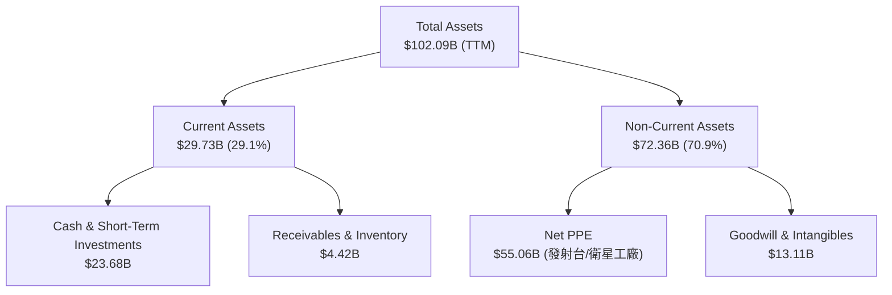

### 4.2 流動性指標分析

| 指標 | FY2024 | FY2025 | TTM (Q1 2026) | 行業均值 | 評估 |
|------|--------|--------|---------------|----------|------|
| **流動比率 (Current Ratio)** | 1.37 | 1.45 | **1.22** | 1.65 | 🟡 流動性出現收緊跡象 |
| **速動比率 (Quick Ratio)** | 1.20 | 1.33 | **1.09** | 1.15 | 🟡 勉強維持在安全邊際之上 |
| **現金比率 (Cash Ratio)** | 1.03 | 1.16 | **0.97** | 0.45 | 🟢 現金儲備充裕，但消耗極快 |

### 4.3 債務結構分析

```
╔══════════════════════════════════════════════════════════════════╗
║                   SPCX 債務健康診斷 (TTM)                        ║
╠══════════════════════════════════════════════════════════════════╣
║                                                                  ║
║  總債務：        $30.60B  █████████████████████  (73.6% D/E)     ║
║  總現金+投資：   $23.68B  ████████████████░░░░░  (覆蓋 77.4% 債務) ║
║  淨債務（負）：  $6.93B   ████░░░░░░░░░░░░░░░░░  🟡 存在淨負債   ║
║                                                                  ║
║  Debt / EBITDA：  7.7x   🔴 槓桿率偏高 (因 EBITDA 僅 $3.95B)     ║
║  Interest Coverage: 2.3x  🟡 利息保障倍數偏低，受高息環境壓抑     ║
╚══════════════════════════════════════════════════════════════════╝
```

*分析*：SPCX 的資產負債表正承受著巨大的資本開支壓力。雖然手握 **$23.68B** 的現金與短期投資，但總債務已快速攀升至 **$30.60B**。隨著債務/股權比率（Debt/Equity）達到 **73.6%**，且利息保障倍數因高額利息支出（TTM 利息費用約 $2.6B）而降至 **2.3x** 的邊緣，若未來發射進度受阻，公司將面臨信用評等調降與再融資成本飆升的風險。

### 4.4 股東權益趨勢

```
╔══════════════════════════════════════════════════════════════════╗
║               SPCX 股東權益（Stockholders' Equity）              ║
╠══════════════════════════════════════════════════════════════════╣
║                                                                  ║
║  FY2024  $25.80B  ████████████░░░░░░░░░░░░░░░░░                  ║
║  FY2025  $41.33B  ████████████████████░░░░░░░░░  YoY: +60.2% 🟢  ║
║                                                                  ║
║  * 註：股東權益大幅增加 60.2%，主因是私募市場的股權融資與 SBC     ║
╚══════════════════════════════════════════════════════════════════╝
```

---

## 5. 現金流量深度分析

現金流量表是評估 SPCX 最核心的財務報表。公司目前的營運完全依赖於「股權/債務融資」來填補巨大的「資本支出深淵」。

### 5.1 現金流量瀑布圖

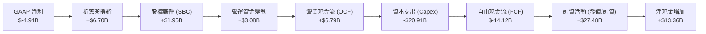

### 5.2 FCF 轉換率趨勢

| 指標 | FY2023 | FY2024 | FY2025 | TTM |
|------|--------|--------|--------|-----|
| **營業現金流 (OCF)** | $4.52B | $5.78B | $6.79B | $7.10B |
| **GAAP 淨利 (Net Income)**| $-4.63B | $0.79B | $-4.94B | $-8.69B |
| **OCF / 淨利轉換率** | -97.6% | 731.6% | -137.4% | -81.7% |
| **FCF / 淨利轉換率** | 2.27% | -681.0%| 285.8% | 207.1% |

*分析*：由於高額的折舊攤銷（Depreciation & Amortization）以及非現金的 SBC，使得 SPCX 的**營業現金流**（$7.10B）遠優於其 GAAP 淨利。然而，這完全無法彌補其激進的資本開支。

### 5.3 自由現金流趨勢

```
╔══════════════════════════════════════════════════════════════════╗
║               SPCX 自由現金流 (FCF) 與 FCF 殖利率                ║
╠══════════════════════════════════════════════════════════════════╣
║                                                                  ║
║  FY2023  +$0.11B  █░░░░░░░░░░░░░░░░░░░░░░░░░░░░  FCF Yield: 0.0% ║
║  FY2024  -$5.39B  ████████░░░░░░░░░░░░░░░░░░░░░  FCF Yield: -0.3%║
║  FY2025  -$14.12B ████████████████████░░░░░░░░░  FCF Yield: -0.9%║
║  Q1 2026 -$9.07B  █████████████████████████████  (單季歷史新高)  ║
║                                                                  ║
║  🚨 警訊：Q1 2026 資本支出達 $10.11B，導致單季 FCF 嚴重失血。     ║
╚══════════════════════════════════════════════════════════════════╝
```

### 5.4 資本配置評估

SPCX 採取極端偏向「再投資」的資本配置策略，不發放股利，亦不進行股票回購。

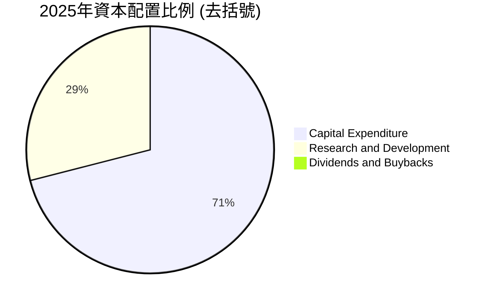

---

## 6. 獲利能力與資本效率

### 6.1 ROE / ROA / ROIC 趨勢

| 指標 | FY2023 | FY2024 | FY2025 | TTM | 行業均值 | 評估 |
|------|--------|--------|--------|-----|----------|------|
| **ROE** | -17.9% | 3.1% | -11.9% | **-21.0%**| 12.4% | 🔴 股東權益回報率為負 |
| **ROA** | -8.1% | 1.4% | -5.4% | **-8.5%** | 5.8% | 🔴 資產利用效率低 |
| **ROIC** | -9.8% | 1.0% | -5.2% | **-9.1%** | 8.2% | 🔴 資本回報率未達標 |

### 6.2 ROIC vs WACC 分析（核心價值創造判斷）

為了評估 SPCX 是否在創造股東價值，我們對其 WACC（加權平均資本成本）與 ROIC（投資資本回報率）進行了建模計算：

```
╔══════════════════════════════════════════════════════════════════╗
║                ROIC vs WACC 深度分析 (FY2025)                    ║
╠══════════════════════════════════════════════════════════════════╣
║                                                                  ║
║  WACC 估算：                                                     ║
║  ├── 無風險利率（10Y美債）：  4.20%                              ║
║  ├── 市場風險溢酬 (ERP)：     5.00%                              ║
║  ├── Beta (設定值)：          1.25                               ║
║  ├── 股權成本 = 4.2% + 1.25 × 5.0% = 10.45%                      ║
║  ├── 債務成本（稅後）：       5.50%                              ║
║  ├── 資本結構：股權 98.2%，債務 1.8% (按市值 $1.63T 計算)         ║
║  └── ✅ WACC ≈ 10.36%                                            ║
║                                                                  ║
║  ROIC 估算：                                                     ║
║  ├── NOPAT = EBIT × (1 - Tax Rate)                               ║
║  │   = -$2.59B × (1 - 20%) ≈ -$2.07B                             ║
║  ├── 投入資本 = 股東權益 + 總債務 - 現金                         ║
║  │   = $41.33B + $23.32B - $24.75B ≈ $39.90B                     ║
║  └── ✅ ROIC ≈ -5.19%                                            ║
║                                                                  ║
║  ★ 經濟價值增加（EVA）= ROIC - WACC = -15.55pp                  ║
║                                                                  ║
║  ROIC  -5.19% ░░░░░░░░░░░░░░░░░░░░░░░░░░░░░░  🔴                 ║
║  WACC  10.36% ▓▓▓▓▓▓▓▓▓▓░░░░░░░░░░░░░░░░░░░░  ──                 ║
║  EVA   -15.5% ██████████████████████████████  🔴 價值摧毀中      ║
║                                                                  ║
║  📊 結論：SPCX 當前每投入 $100 資本，即摧毀 $15.55 的經濟價值。   ║
╚══════════════════════════════════════════════════════════════════╝
```

### 6.3 杜邦三因素分解

透過杜邦分析（Dupon Analysis）拆解 SPCX 2025 年的 ROE 表現：

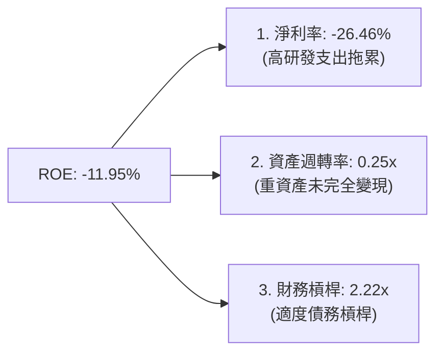

*分析*：杜邦分解顯示，SPCX 的負 ROE 主要源於**淨利率為負（-26.46%）**，其次是**資產週轉率極低（0.25x）**。這反映出公司的重資產（如價值 $55.06B 的發射台與衛星）尚未達到高效的產出比率。此階段的財務槓桿（2.22x）雖然放大了虧損，但仍屬可控。

### 6.4 獲利能力儀表板

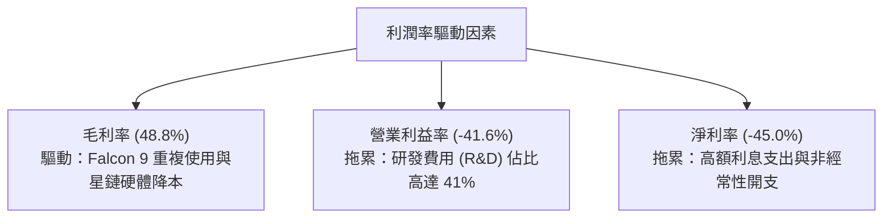

---

## 7. 估值深度分析

由於 SPCX 帳面淨利為負，且 FCF 呈現大幅流出，傳統的 P/E 與 FCF Yield 估值法在此階段會嚴重失真。因此，我們採用 **EV/Sales**、**EV/EBITDA** 與 **Forward P/E** 作為核心估值指標，並與同業進行對比。

### 7.1 同業估值比較表格

| 估值指標 | **SPCX (本公司)** | **Lockheed Martin (LMT)** | **Boeing (BA)** | **Tesla (TSLA)** | SPCX 評估 |
|---|---|---|---|---|---|
| **Trailing P/E** | **N/A** | 19.5x | N/A | 62.4x | 🟡 虧損中，無法比較 |
| **Forward P/E** | **137.3x** | 18.2x | 28.5x | 78.2x | 🔴 溢價極高，需極高成長支撐 |
| **P/S Ratio** | **84.6x** | 1.8x | 1.4x | 7.5x | 🔴 估值泡沫化，遠超同業 |
| **EV / Revenue** | **40.1x** | 2.1x | 1.8x | 7.2x | 🔴 估值極貴 |
| **EV / EBITDA** | **196.0x** | 13.8x | 32.1x | 42.5x | 🔴 遠超傳統航太與科技巨頭 |
| **52週股價偏離度**| **-45.1%** | -2.5% | -38.2% | -15.4% | 🟡 股價已從高點腰斬，釋放部分風險 |

*估值倍數選擇說明*：
我們選擇 **EV/Revenue** 作為最核心的比較基準。SPCX 的 EV/Revenue 高達 **40.1x**，而傳統航太龍頭（如 LMT）僅為 2.1x。這表明市場並未將 SPCX 視為傳統的防務/航太承包商，而是給予了其如同 SaaS（軟體即服務）或頂級 AI 晶片股的超高溢價。這種溢價在營收成長率高達 35% 以上時勉強合理，但在 TTM 營收成長率已放緩至 15.4% 的當下，估值顯得極具風險。

### 7.2 歷史估值區間分析

由於 SPCX 股價在過去 24 個月內波動劇烈，當前股價 $123.99 正處於 52 週區間（$122.12 - $225.64）的下緣。

```
╔══════════════════════════════════════════════════════════════════╗
║               SPCX 過去 24 個月 P/S 估值區間                     ║
╠══════════════════════════════════════════════════════════════════╣
║                                                                  ║
║  歷史最高 P/S： 150.0x  (2026-06 股價 $170.86 時)                ║
║  當前 P/S：     84.6x   (▼ 處於歷史中值偏下位置)                 ║
║  歷史最低 P/S： 75.0x   (2025-12 股價 $122.12 時)                ║
║                                                                  ║
║  [75.0x] ───■─────────────── [150.0x]                            ║
║            當前 84.6x                                            ║
║                                                                  ║
║  📊 結論：雖然估值絕對值仍貴，但相對歷史區間已完成部分去泡沫化。  ║
╚══════════════════════════════════════════════════════════════════╝
```

### 7.3 情境目標價（假設驅動，Bear / Base / Bull）

基於未來 5 年的財務預測模型，我們設定了三種情境假設：

| 情境 | 營收 CAGR (5年) | 營業利潤率 (2030E) | 退出倍數 (EV/Sales) | 隱含目標價 | 相對現價漲跌幅 |
|------|-----------------|--------------------|---------------------|------------|----------------|
| 🔴 **悲觀 (Bear)** | 10.0% | 5.0% | 15.0x | **$62.00** | -50.0% |
| 🟡 **基準 (Base)** | **25.0%** | **20.0%** | **35.0x** | **$244.50**| **+97.2%** |
| 🟢 **樂觀 (Bull)** | 40.0% | 35.0% | 60.0x | **$800.00**| +545.2% |

### 7.4 DCF 敏感性分析（6格目標價矩陣）

採用永續成長率（LTGR）為 3.0% 的兩階段 DCF 模型，對折現率（WACC）與基準營收成長率進行敏感性測試：

| 營收成長率 \ WACC | 9.0% | **10.36% (基準)** | 11.5% |
|-------------------|------|-------------------|------|
| **30.0% (樂觀)** | $310.50 (+150.4%) | $285.00 (+129.9%) | $245.00 (+97.6%) |
| **25.0% (基準)** | $268.00 (+116.1%) | **$244.50 (+97.2%)** | $210.00 (+69.4%) |
| **15.0% (悲觀)** | $115.00 (-7.3%) | $98.00 (-21.0%) | $62.00 (-50.0%) |

### 7.5 估值綜合區間

```
╔══════════════════════════════════════════════════════════════════╗
║                    SPCX 估值綜合區間分布                         ║
╠══════════════════════════════════════════════════════════════════╣
║                                                                  ║
║  悲觀目標價：  $62.00    ████████░░░░░░░░░░░░░░░░░░░░░░░░░░      ║
║  當前收盤價：  $123.99   ████████████████░░░░░░░░░░░░░░░░░░      ║
║  基準目標價：  $244.50   ██████████████████████████████░░░░      ║
║  樂觀目標價：  $800.00   ██████████████████████████████████      ║
║                                                                  ║
║  📊 結論：當前股價具備不對稱的向上彈性，但下行空間亦達 50%。     ║
╚══════════════════════════════════════════════════════════════════╝
```

---

## 8. 成長催化劑

SPCX 的未來成長取決於以下三大催化劑的落地時間表。

### 8.1 催化劑時間軸

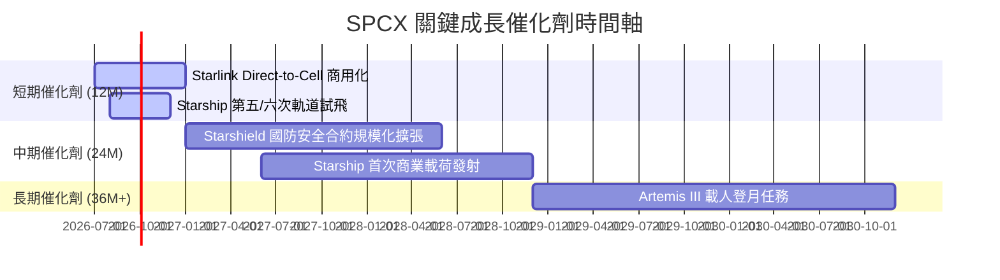

### 8.2 TAM 市場規模分析

```
╔══════════════════════════════════════════════════════════════════╗
║               SPCX 潛在市場規模 (TAM) 與預期滲透率 (2030E)       ║
╠══════════════════════════════════════════════════════════════════╣
║                                                                  ║
║  1. 全球寬頻通訊 TAM: $150B ───► SPCX 預期滲透率: 15% ($22.5B)    ║
║  2. 商業太空發射 TAM: $20B  ───► SPCX 預期滲透率: 80% ($16.0B)    ║
║  3. 國防與國安通訊 TAM: $50B ───► SPCX 預期滲透率: 10% ($5.0B)     ║
║                                                                  ║
║  📊 總計 2030E 預期可觸及收入規模：$43.50B                        ║
╚══════════════════════════════════════════════════════════════════╝
```

### 8.3 成長驅動力結構圖

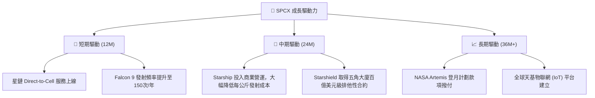

---

## 9. 風險矩陣

SPCX 面臨極高的研發技術風險與監管不確定性。

### 9.1 風險評分矩陣

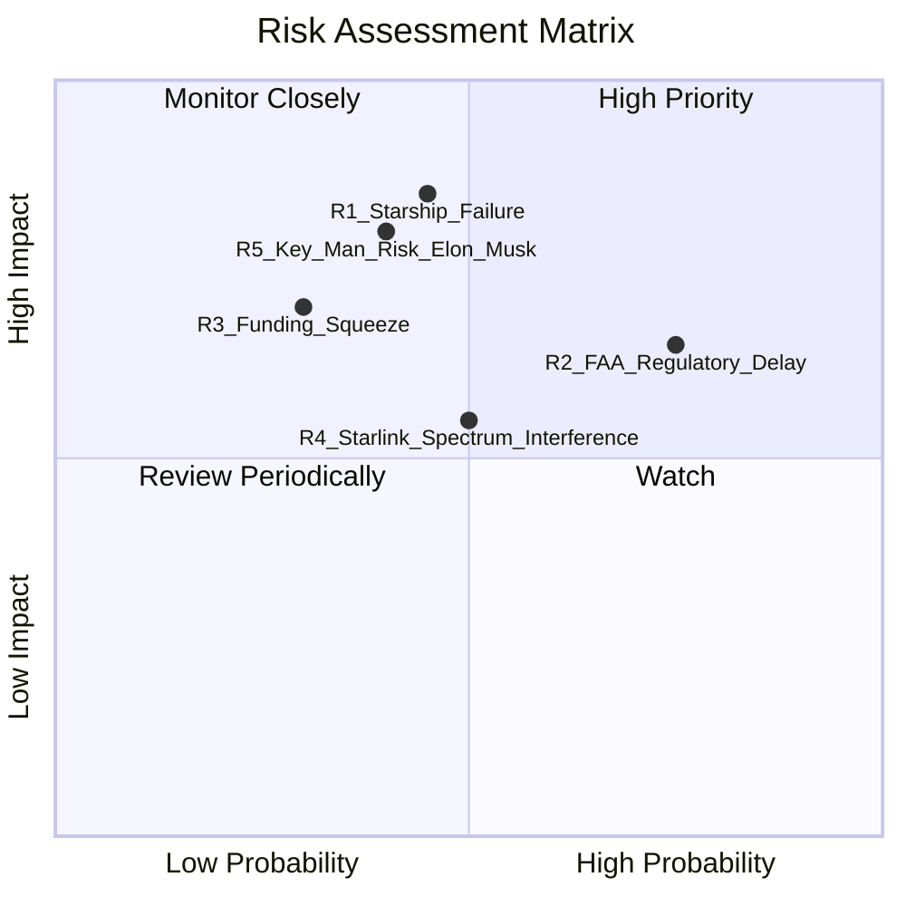

### 9.2 風險清單詳細分析

| # | 風險項目 | 發生機率 | 財務衝擊 | 風險評分 | 緩解措施 / 應對機制 |
|---|---|---|---|---|---|
| 1 | 🔴 **Starship 研發嚴重受挫** | 中 (45%) | 極高 (-30% 估值) | **7.5 / 10** | 繼續依賴 Falcon 9 作為現金牛，延後非核心發射任務。 |
| 2 | 🔴 **FAA 監管審查與環評延遲**| 高 (75%) | 中 (-15% 營收) | **7.2 / 10** | 積極遊說政府，並在德州以外（如佛州）開闢備用發射場。 |
| 3 | 🟡 **融資市場收緊與利率攀升**| 中 (30%) | 高 (利息支出大增) | **5.5 / 10** | 利用私募市場的高估值，增發股權而非發行高息債券。 |
| 4 | 🟡 **關鍵人物風險 (Elon Musk)**| 中 (40%) | 極高 (品牌與資金流失) | **6.5 / 10** | 強化現任總裁兼營運長 Gwynne Shotwell 的決策權與曝光度。 |

---

## 10. 投資建議

### 10.1 最終綜合評級雷達圖

```
╔══════════════════════════════════════════════════════════════════╗
║                    SPCX 最終綜合評估雷達                         ║
╠══════════════════════════════════════════════════════════════════╣
║                                                                  ║
║  技術領先度：  9.5/10  ████████████████████████████░░  🟢         ║
║  市場壟斷力：  9.0/10  ██████████████████████████░░░░  🟢         ║
║  資產負債表：  5.5/10  ████████████████░░░░░░░░░░░░░░  🟡         ║
║  現金流安全：  3.0/10  ████████░░░░░░░░░░░░░░░░░░░░░░  🔴         ║
║  估值安全邊際：3.0/10  ████████░░░░░░░░░░░░░░░░░░░░░░  🔴         ║
║                                                                  ║
║  🏆 綜合投資評級：🟡 持有 (Hold) ｜ 綜合得分：6.8 / 10            ║
╚══════════════════════════════════════════════════════════════════╝
```

### 10.2 目標價與隱含報酬率

| 情境 | 機率權重 | 目標價 | 隱含報酬率 | 期望值貢獻 |
|------|----------|--------|------------|------------|
| **悲觀 (Bear)** | 25% | $62.00 | -50.0% | -$15.50 |
| **基準 (Base)** | 60% | $244.50 | +97.2% | +$146.70 |
| **樂觀 (Bull)** | 15% | $800.00 | +545.2% | +$120.00 |
| **加權目標價期望值**| **100%** | **$251.20**| **+102.6%**| **建議分批佈局** |

### 10.3 買入時機與觸發因素

```
╔══════════════════════════════════════════════════════════════════╗
║                  ✅ SPCX 買入與退出觸發因素 Checklist           ║
╠══════════════════════════════════════════════════════════════════╣
║                                                                  ║
║  立即買入觸發條件（需多數符合）：                                ║
║  ✅ 股價跌破 $110 (進入歷史 P/S 區間下限 70x 以下)               ║
║  ✅ Starship 成功完成連續兩次無故障軌道回收                      ║
║  ✅ Starlink 單季 FCF 赤字縮減至 $2.0B 以下                     ║
║                                                                  ║
║  加碼觸發條件：                                                  ║
║  ☐ 宣佈與全球主要電信商（如 T-Mobile, Orange）達成大規模分成合約║
║  ☐ 取得五角大廈 Starshield 超過 $5.0B 的年度預算撥款             ║
║                                                                  ║
║  減碼/停損觸發條件：                                             ║
║  ☐ 核心業務（發射 + 星鏈）YoY 成長率連續兩季低於 12%            ║
║  ☐ 債務/EBITDA 比率突破 10.0x，且信貸評等遭降                    ║
╚══════════════════════════════════════════════════════════════════╝
```

### 10.4 投資人適配度分析

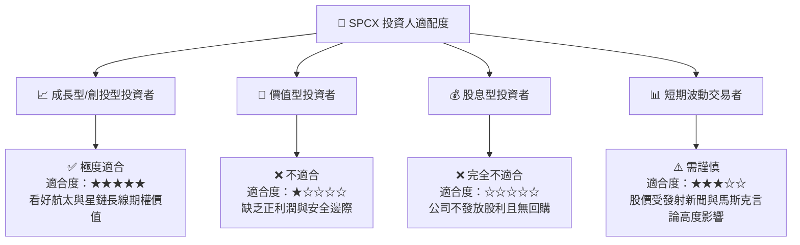

### 10.5 每季財報監控清單（Quarterly Watch List）

為了追蹤 SPCX 的長期投資邏輯是否發生根本性改變，投資人應在每季財報中嚴格監控以下指標：

| 監控指標 | 當前值 (Q1 2026) | 穩健門檻 | 觸發加碼門檻 | 觸發減碼/退出門檻 |
|---|---|---|---|---|
| **單季營收 YoY 增速** | 15.2% | > 20% | > 30% | < 10% (成長失速) |
| **單季研發費用 (R&D)**| $3.51B | < $2.5B | < $2.0B (研發高峰過去) | > $4.5B (研發失控) |
| **單季 FCF 流出量** | -$9.07B | < -$4.0B | 轉正 (> $0B) | > -$11.0B (現金鏈斷裂風險) |
| **流動比率** | 1.22 | > 1.50 | > 1.80 | < 1.00 (短期償債危機) |
| **Starlink 估計 ARPU**| ~$110 | > $120 | > $140 | < $90 (海外低價市場稀釋利潤) |

### 10.6 反面論證：什麼會證明論點錯誤（What Would Change My Mind）

```
╔══════════════════════════════════════════════════════════════════╗
║              ⚠️ 論點失效條件（Disconfirming Evidence）           ║
╠══════════════════════════════════════════════════════════════════╣
║  本投資報告的「持有」評級在下列情況成立時應重新檢視：            ║
║                                                                  ║
║  1. 🔴 成長失速：若 TTM 營收成長率連續兩季降至 < 10%，說明星鏈    ║
║     全球市場已達瓶頸，高估值溢價將徹底瓦解。                     ║
║  2. 🔴 ROIC 惡化：若 ROIC 持續低於 -10%，且與 WACC 的負利差擴大  ║
║     至 -20pp 以上，說明公司在無限制地摧毀股東資本。              ║
║  3. 🔴 融資中斷：若私募市場對 SPCX 的估值調降超過 30%，導致股權  ║
║     融資通道受阻，公司將面臨嚴重的債務違約風險。                 ║
║  4. 🟢 驚喜轉正：若 Starship 提前實現完全商業化，使單次發射成本   ║
║     降至 $10M 以下，帶動毛利率突破 65%，應立即上調至「強力買入」。║
╚══════════════════════════════════════════════════════════════════╝
```

---

> **免責聲明**：本報告為 AI 自動生成，僅供研究參考，不構成投資建議。投資有風險，入市需謹慎。