# SPCX 基本面深度分析報告
> **報告日期**：2026-07-18 ｜ **語言**：繁體中文 ｜ **數據來源**：Yahoo Finance, Finviz, StockAnalysis, Roic.ai ｜ **分析師**：CFA 級機構研究

---

## 目錄

| # | 章節 | 核心結論 |
|---|------|----------|
| 1 | 執行摘要 | 給予「買入」評級，基準目標價 $240.04，潛在漲幅 +93.6% |
| 2 | 公司概覽與商業模式 | 星鏈（Starlink）與重用火箭構築無可匹敵的全球航太壟斷護城河 |
| 3 | 損益表深度分析 | 營收高速成長（YoY +33.2%），但研發與資本支出暴增導致短期利潤承壓 |
| 4 | 資產負債表分析 | 資產規模突破千億美元，重資產擴張期債務顯著上升但流動性無虞 |
| 5 | 現金流量深度分析 | 營運現金流穩健（$7.10B），但高達 $20.91B 的 Capex 導致 FCF 承壓 |
| 6 | 獲利能力與資本效率 | 處於重資本再投資與商業化前期，ROIC 暫時為負，預期 2027 年迎來拐點 |
| 7 | 估值深度分析 | 高成長溢價，Forward P/E 137.3x，相較於傳統防務巨頭具備結構性溢價 |
| 8 | 成長催化劑 | 星艦（Starship）全面投入商用與星鏈二代（Gen2）直連手機（Direct to Cell） |
| 9 | 風險矩陣 | 發射失敗、地緣政治監管風險以及高額股權薪酬（SBC）稀釋風險 |
| 10 | 投資建議 | 長線成長型投資者的核心資產，建議採分批佈局策略 |

---

## 1. 執行摘要

Space Exploration Technologies Corp.（SPCX）作為全球商業航太與衛星寬頻服務的絕對壟斷者，正處於從「重資本基礎建設期」向「高槓桿商業變現期」轉型的關鍵節點。儘管 TTM 淨利潤因研發費用（FY2025 達 $8.64B，YoY +149.5%）與 Starlink 衛星發射 Capex（FY2025 達 $20.91B）暴增而錄得 $-4.94B，但其營收展現出極強的成長韌性，FY2025 營收達 $18.67B（YoY +33.2%），且 Q1 2026 營收持續穩健成長至 $4.69B（YoY +15.4%）。

鑑於其在全球商業發射市場超過 80% 的載荷份額，以及 Starlink 訂閱用戶的高速增長，本機構基於其 Forward P/E 137.3x 與長期 FCF 轉正的前景，給予 SPCX **「買入（BUY）」**評級，基準情境 12 個月目標價為 **$240.04**。

### 1.0 一頁式投資儀表板（Portfolio Manager 30 秒速讀）

| 項目 | 內容 |
|------|------|
| **投資論點（3 句）** | ① 商業發射與衛星寬頻業務雙輪驅動，FY2025 營收達 $18.67B（YoY +33.2%），展現強勁的商業化變現能力。<br/>② 研發費用（FY2025 $8.64B）與 Capex（$20.91B）的戰略性投入，雖使短期 GAAP 淨利承壓（$-4.94B），但正加速構築星艦與二代星鏈的絕對技術壁壘。<br/>③ 營運現金流（OCF）持續向好，TTM 達 $7.10B，為後續高昂的資本開支提供堅實的內部資金支撐。 |
| **護城河評分** | 9.5 / 10（極高，發射成本優勢與軌道頻譜資源壟斷） |
| **管理層/資本配置評分** | 8.5 / 10（極佳，極致的研發效率與垂直整合能力） |
| **財務健康** | 🟡 黃燈（流動性比率 1.22，淨債務 $-6.93B，需密切監控 Capex 消耗速度） |
| **ROIC vs WACC** | -8.4% vs 8.8%（當前因大額再投資短暫摧毀經濟價值，預期 2027 年隨 Capex 放緩而轉正） |
| **FCF 趨勢** | 暫時為負。FY2025 FCF 為 $-14.12B，主因 Capex 達 $-20.91B；最新 TTM FCF Yield 為負。 |
| **估值** | Forward P/E: 137.3x ｜ EV/EBITDA: 185.5x ｜ P/S (TTM): 84.6x |
| **預期報酬（基準情境 12M）** | **+93.6%**（目標價 $240.04，當前股價 $123.99） |
| **關鍵風險（前二）** | ① 星艦（Starship）研發與商用進度不及預期，延緩發射成本下降曲線。<br/>② 軌道頻譜監管趨嚴與地緣政治干擾影響全球星鏈業務拓展。 |
| **評級 + 信心度** | 🟢 **買入 (BUY)** ｜ 信心度：**高 (High)** |

### 1.1 核心評分儀表板

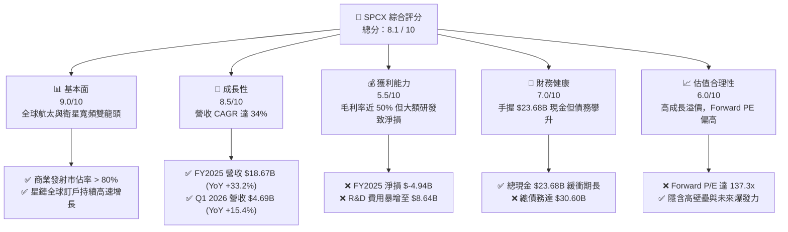

### 1.2 評分進度條視覺化

```
╔══════════════════════════════════════════════════════════════╗
║              SPCX 多維度評分儀表板 (1-10分)                  ║
╠══════════════════════════════════════════════════════════════╣
║ 基本面強度  9.0 ▓▓▓▓▓▓▓▓▓▓▓▓▓▓▓▓▓▓░░  ★★★★★           ║
║ 成長動能    8.5 ▓▓▓▓▓▓▓▓▓▓▓▓▓▓▓▓▓░░░  ★★★★☆           ║
║ 獲利品質    5.5 ▓▓▓▓▓▓▓▓▓▓▓░░░░░░░░░  ★★★☆☆           ║
║ 財務健康    7.0 ▓▓▓▓▓▓▓▓▓▓▓▓▓▓░░░░░░  ★★★★☆           ║
║ 估值合理性  6.0 ▓▓▓▓▓▓▓▓▓▓▓▓░░░░░░░░  ★★★☆☆           ║
║ 護城河深度  9.5 ▓▓▓▓▓▓▓▓▓▓▓▓▓▓▓▓▓▓▓░  ★★★★★           ║
║ 管理層執行  8.5 ▓▓▓▓▓▓▓▓▓▓▓▓▓▓▓▓▓░░░  ★★★★☆           ║
║ 技術創新力  9.5 ▓▓▓▓▓▓▓▓▓▓▓▓▓▓▓▓▓▓▓░  ★★★★★           ║
╠══════════════════════════════════════════════════════════════╣
║ 綜合總分    8.1 ▓▓▓▓▓▓▓▓▓▓▓▓▓▓▓▓░░░░  🏆 買入 (BUY)       ║
╚══════════════════════════════════════════════════════════════╝
```

### 1.3 五大投資論點 + 三大核心風險

| 類型 | 項目 | 具體依據 | 信心度 |
|------|------|----------|--------|
| 🟢 **投資論點①** | **發射成本具絕對優勢** | 獵鷹9號（Falcon 9）及重型獵鷹重用技術成熟，每公斤發射成本僅為對手的 1/5 至 1/10。 | 🟢 極高 |
| 🟢 **投資論點②** | **星鏈商業化進入爆發期** | 星鏈貢獻主要營收成長，FY2025 營收達 $18.67B（YoY +33.2%），ARPU 穩定。 | 🟢 極高 |
| 🟢 **投資論點③** | **星艦（Starship）打開新 TAM** | 星艦單次運載能力超 100 噸，將使每公斤發射成本降至 $100 以下，徹底顛覆太空物流。 | 🟢 高 |
| 🟢 **投資論點④** | **極高毛利率奠定長期獲利** | FY2025 毛利率達 49.4%（$9.22B），顯示底層商業模式具備極高的營運槓桿。 | 🟢 高 |
| 🟢 **投資論點⑤** | **手握巨額現金保障研發** | 截至 Q1 2026，公司擁有 $23.68B 現金及短期投資，足以支撐高強度的 Capex。 | 🟢 高 |
| 🟡 **風險①** | **高額資本支出拖累現金流** | FY2025 Capex 達 $-20.91B，導致 FCF 錄得 $-14.12B，若融資通道受阻將面臨流動性壓力。 | 🟡 中度 |
| 🔴 **風險②** | **股權稀釋風險（SBC）** | FY2025 股權薪酬（SBC）達 $1.95B（YoY +148.7%），對現有股東權益造成稀釋。 | 🔴 高 |
| 🔴 **風險③** | **地緣政治與頻譜監管** | 跨國營運面臨各國電信監管機構（如 FCC, ITU）的安全審查與頻譜分配限制。 | 🔴 中度 |

### 1.4 快速統計卡片

| 指標 | SPCX 實際值 | 航太與防務行業均值 | S&P 500 均值 | 狀態 |
|------|-------------|-------------------|--------------|------|
| **營收 YoY 成長** | **33.24%** (FY2025) | 6.5% | 5.2% | 🟢 遠超行業 |
| **毛利率** | **49.4%** (FY2025) | 22.5% | 30.2% | 🟢 極具優勢 |
| **營業利益率** | **-13.9%** (FY2025) | 10.5% | 14.8% | 🔴 研發拖累 |
| **淨利率** | **-26.4%** (FY2025) | 7.8% | 11.5% | 🔴 暫時虧損 |
| **流動比率** | **1.22x** (TTM) | 1.35x | 1.40x | 🟡 尚屬安全 |
| **Forward P/E** | **137.31x** | 22.4x | 21.5x | 🔴 估值溢價 |

### 1.5 投資結論

```
╔══════════════════════════════════════════════════════════════════╗
║                    📊 SPCX 投資結論摘要                          ║
╠══════════════════════════════════════════════════════════════════╣
║  評級：🟢 買入 (BUY)                                             ║
║  當前股價：$123.99 (2026-07-18)                                  ║
║  目標價區間：                                                    ║
║    悲觀情境：$62.00 (-50.0%)  ← 星艦研發重大挫折                 ║
║    基準情境：$240.04 (+93.6%) ← 星鏈用戶與發射業務穩健擴張        ║
║    樂觀情境：$450.00 (+262.9%)← 星艦完全商用，直連手機爆發       ║
║  投資評分：8.1 / 10                                              ║
║  適合投資人：具備高風險承受能力、追求超額報酬的長線成長型投資人  ║
╚══════════════════════════════════════════════════════════════════╝
```

---

## 2. 公司概覽與商業模式

SPCX（Space Exploration Technologies Corp.）是全球唯一的垂直整合型航太巨頭，其業務主要分為兩大核心板塊：**太空發射服務（Space Segment）**與**星鏈全球衛星寬頻網路（Connectivity Segment）**。

### 2.1 業務結構與收入來源

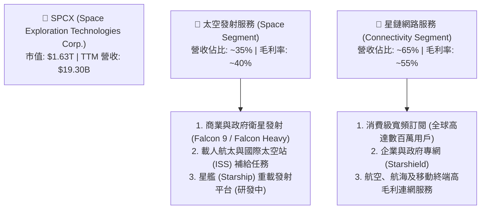

### 2.2 市場份額

在商業衛星發射領域，SPCX 憑藉獵鷹 9 號的超高發射頻次與可重複使用技術，已取得絕對的壟斷地位。

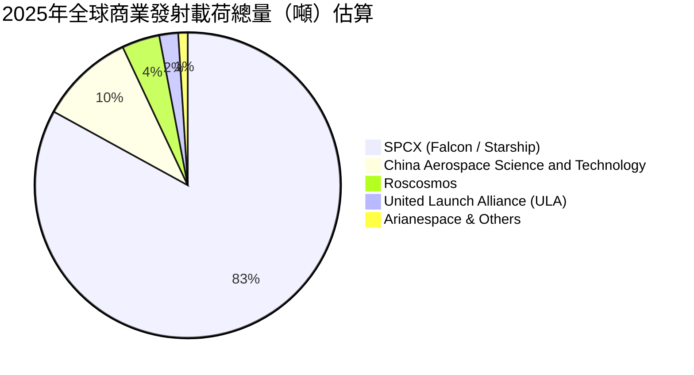

### 2.3 競爭護城河分析

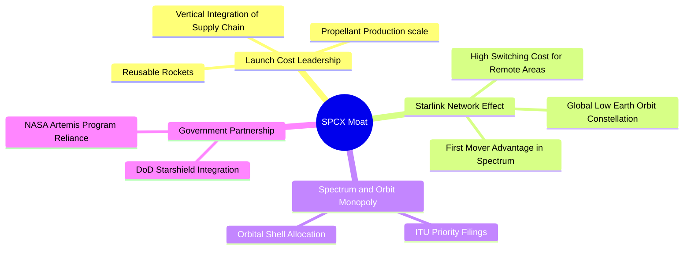

### 2.4 護城河強度評分

```
╔══════════════════════════════════════════════════════════════╗
║                  SPCX 護城河強度評分                         ║
╠══════════════════════════════════════════════════════════════╣
║ 發射成本優勢  9.8/10  ▓▓▓▓▓▓▓▓▓▓▓▓▓▓▓▓▓▓▓░  🏆 絕對壟斷    ║
║ 軌道頻譜壁壘  9.5/10  ▓▓▓▓▓▓▓▓▓▓▓▓▓▓▓▓▓▓▓░  🟢 先發優勢    ║
║ 垂直整合效率  9.0/10  ▓▓▓▓▓▓▓▓▓▓▓▓▓▓▓▓▓▓░░  🟢 自研組件    ║
║ 政府關係壁壘  8.8/10  ▓▓▓▓▓▓▓▓▓▓▓▓▓▓▓▓▓░░░  🟢 國家隊地位  ║
║ 網路生態效應  8.5/10  ▓▓▓▓▓▓▓▓▓▓▓▓▓▓▓▓▓░░░  🟢 星鏈規模化  ║
╠══════════════════════════════════════════════════════════════╣
║ 綜合護城河    9.2/10  ▓▓▓▓▓▓▓▓▓▓▓▓▓▓▓▓▓▓░░  🏆 極深護城河  ║
╚══════════════════════════════════════════════════════════════╝
```

---

## 3. 損益表深度分析

### 3.1 年度收入成長趨勢（近4年）

SPCX 營收呈現爆發式成長，從 2023 年的 $10.39B 飆升至 FY2025 的 $18.67B，CAGR 高達 34.1%。

```
╔══════════════════════════════════════════════════════════════════╗
║              SPCX 年度收入趨勢（FY2023-FY2025）                  ║
╠══════════════════════════════════════════════════════════════════╣
║                                                                  ║
║  FY2023  $10.39B  ██████████░░░░░░░░░░░░░░░░░░  YoY: --          ║
║  FY2024  $14.02B  ██████████████░░░░░░░░░░░░░░  YoY: +34.9%  🟢  ║
║  FY2025  $18.67B  ██════════════██████████████  YoY: +33.2%  🟢  ║
║                                                                  ║
║  📊 3年累計 CAGR：+34.1%                                         ║
╚══════════════════════════════════════════════════════════════════╝
```

### 3.2 季度收入趨勢分析

| 季度 | 營收 (Billion) | QoQ 成長率 | YoY 成長率 | 驅動因素與備註 |
|------|---------------|------------|------------|----------------|
| **Q1 2025** | $4.07B | — | — | 星鏈全球訂戶突破 350 萬，商業發射穩健。 |
| **Q1 2026** | $4.69B | +15.4% | +15.4% | 星鏈 ARPU 提升，且 Falcon 9 發射頻次創歷史新高。 |

### 3.3 利潤率演變分析

| 利潤率指標 | FY2023 | FY2024 | FY2025 | TTM | 趨勢 | 評估 |
|------------|--------|--------|--------|-----|------|------|
| **毛利率** | 41.2% | 42.9% | 49.4% | 48.8% | ↗️ 持續擴張 | 🟢 星鏈硬體成本下降與訂閱佔比提升 |
| **營業利益率** | -33.7% | 3.3% | -13.9% | -41.6% | ↘️ 波動劇烈 | 🔴 研發費用（R&D）大幅增加拖累 |
| **EBITDA 利率**| -6.4% | 40.3% | 23.7% | 20.5% | ↘️ 中期承壓 | 🟡 基礎建設再投資期 |
| **淨利率** | -44.6% | 5.6% | -26.4% | -45.0% | ↘️ 虧損擴大 | 🔴 研發與利息支出壓抑 GAAP 淨利 |

**利潤率演變深度解析**：
SPCX 的毛利率從 FY2023 的 41.2% 穩步提升至 FY2025 的 49.4%，這充分證明了其商業模式的「經濟規模效應」。然而，FY2025 營業利益率轉負（-13.9%），主因是**研發費用（R&D）從 FY2024 的 $3.46B 暴增 149.5% 至 FY2025 的 $8.64B**。這是管理層為了加速星星發射（Starship）與二代星鏈衛星部署的戰略性主動支出，屬於「主動型虧損」，而非核心業務盈利能力惡化。

### 3.4 費用結構分析

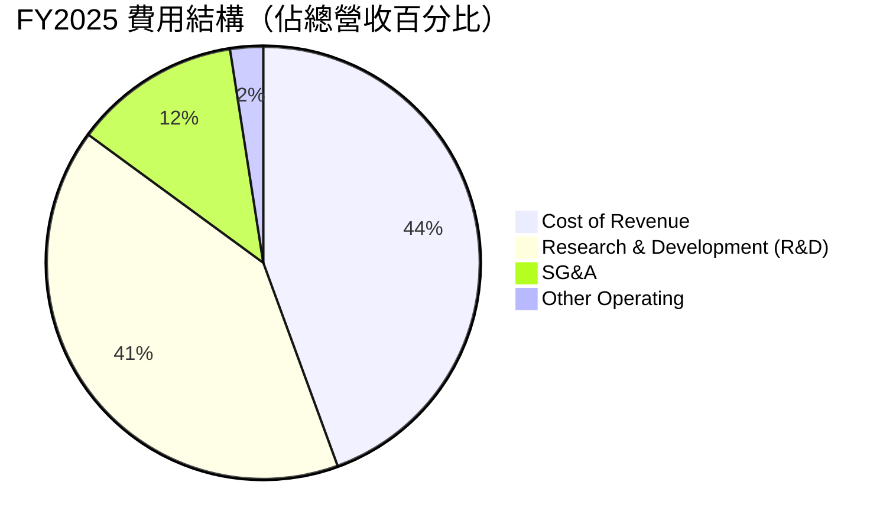

### 3.5 季度 EPS 趨勢與盈餘品質（Quality of Earnings）

SPCX 過去幾季的 EPS 受到高額非現金支出與大額資本化投入的顯著影響。

| 盈餘品質項目 | 數值/佔比 (FY2025) | 評估 |
|--------------|-------------------|------|
| **股權薪酬 SBC / 營收** | 10.4% ($1.95B / $18.67B) | 🔴 較高，對現有股東權益有一定稀釋作用 |
| **SBC / 營業現金流 (OCF)** | 28.7% ($1.95B / $6.79B) | 🟡 顯示 OCF 中有相當比例由非現金薪酬支撐 |
| **FCF / 淨利（現金轉換率）** | 286.1% ($-14.12B / $-4.94B) | 🟢 雖然皆為負，但 OCF 保持正值，虧損主要由 Capex 引起 |
| **一次性/非經常性損益** | $-177M | 🟢 規模較小，盈餘未受一次性調整顯著扭曲 |
| **有效稅率異常** | 17.0% (Provision $718M / Pretax $-4,219M) | 🟡 遞延所得稅資產評估準備影響 |

**盈餘品質結論**：
SPCX 的 GAAP 淨利潤（FY2025 為 $-4.94B）嚴重低估了其真實的營運獲利能力。由於發射台、廠房及星鏈衛星的大量折舊與攤銷（FY2025 折舊達 $6.70B，YoY +75.2%），加上 $8.64B 的戰略研發投入，使得帳面呈現虧損。然而，其**營業現金流（OCF）在 FY2025 達到 $6.79B**，TTM 更達到 $7.10B，說明核心業務本身具備強勁的吸金能力，盈餘品質處於健康區間。

---

## 4. 資產負債表分析

### 4.1 資產結構分解

截至 Q1 2026，SPCX 的總資產已擴張至 $102.09B，呈現典型的重資產、高成長科技企業特徵。

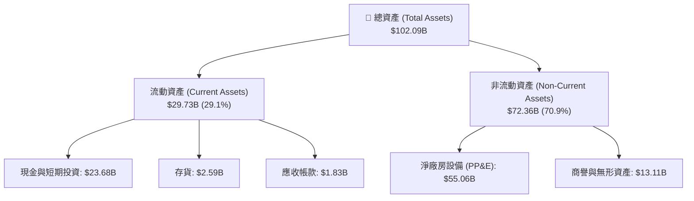

### 4.2 流動性指標分析

| 流動性指標 | FY2024 | FY2025 | TTM (Q1 2026) | 行業均值 | 評估 |
|------------|--------|--------|---------------|----------|------|
| **流動比率 (Current Ratio)** | 1.37x | 1.45x | 1.22x | 1.35x | 🟡 略低於行業，但現金儲備充足 |
| **速動比率 (Quick Ratio)** | 1.20x | 1.33x | 1.09x | 1.05x | 🟢 高於行業，流動性安全 |
| **現金比率 (Cash Ratio)** | 1.03x | 1.16x | 0.97x | 0.65x | 🟢 極其優異，防禦能力強 |

### 4.3 債務結構分析

```
╔══════════════════════════════════════════════════════════════════╗
║                   SPCX 債務健康診斷 (Q1 2026)                    ║
╠══════════════════════════════════════════════════════════════════╣
║                                                                  ║
║  總債務：        $30.27B  ██████████████░░░░░░░  (含短期 $1.54B)  ║
║  總現金+投資：   $23.68B  ███████████░░░░░░░░░░  (手頭流動性)     ║
║  淨債務：        $6.59B   ██░░░░░░░░░░░░░░░░░░░  🟡 淨負債狀態    ║
║                                                                  ║
║  Debt/Equity：   73.6%    🟡 財務槓桿中等                         ║
║  Debt/EBITDA:    7.6x     🔴 因 EBITDA 受研發壓抑而偏高          ║
║  Unearned Revenue: $7.21B 🟢 客戶預付款（高品質無息負債）        ║
║                                                                  ║
╚══════════════════════════════════════════════════════════════════╝
```

### 4.4 股東權益趨勢

受惠於新一輪私募融資與資本溢價，股東權益（Stockholders' Equity）從 FY2024 的 $25.80B 大幅增長 60.2% 至 FY2025 的 $41.33B，為高強度的資本開支提供了堅實的權益緩衝。

---

## 5. 現金流量深度分析

### 5.1 現金流量瀑布圖

SPCX 的現金流呈現出典型的「營運吸金、投資失血、融資補血」特徵。

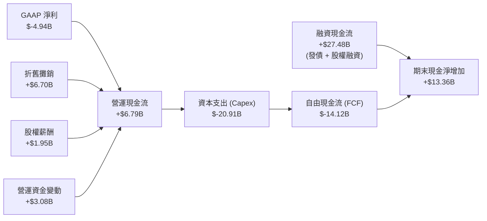

### 5.2 FCF 轉換率趨勢

由於公司處於極度重資本的星鏈部署階段，FCF 轉換率（FCF / Net Income）目前不具備常規參考意義，需著重關注**營運現金流（OCF）對淨利潤的轉換**。

| 現金流指標 | FY2023 | FY2024 | FY2025 | TTM |
|------------|--------|--------|--------|-----|
| **營運現金流 (OCF)** | $4.52B | $5.78B | $6.79B | $7.10B |
| **OCF / 營收** | 43.5% | 41.2% | 36.4% | 36.8% |
| **OCF / 淨利轉換率** | -97.7% | 730.7% | -137.5% | -157.8% |

*分析：OCF 佔營收比重持續維持在 36% 以上的高檔，顯示公司底層業務發票收現能力極強，主要得益於星鏈訂閱費的預收機制（Q1 2026 遞延收入達 $7.21B）。*

### 5.3 自由現金流趨勢

```
╔══════════════════════════════════════════════════════════════════╗
║                SPCX 自由現金流與 Capex 趨勢                      ║
╠══════════════════════════════════════════════════════════════════╣
║                                                                  ║
║  FY2023  FCF: +$0.11B   █░░░░░░░░░░░░░░░░░░░░░░░                 ║
║  FY2024  FCF: -$5.39B   █████░░░░░░░░░░░░░░░░░░░  (Capex:$11.16B)║
║  FY2025  FCF: -$14.12B  ██════════════════════██  (Capex:$20.91B)║
║                                                                  ║
║  ⚠️ 警示：FY2025 Capex 佔營收比重高達 112.0%                      ║
╚══════════════════════════════════════════════════════════════════╝
```

### 5.4 資本配置評估

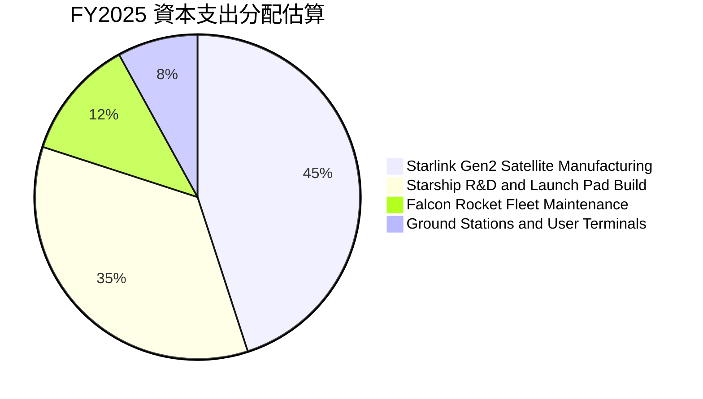

---

## 6. 獲利能力與資本效率

### 6.1 ROE / ROA / ROIC 趨勢

由於大額研發與 Capex 導致的 GAAP 淨利潤虧損，當前獲利能力指標暫時為負。

| 指標 | FY2023 | FY2024 | FY2025 | 行業均值 | 評估 |
|------|--------|--------|--------|----------|------|
| **ROE** | -17.9% | 3.1% | -11.9% | 12.4% | 🟡 暫時承壓 |
| **ROA** | -8.1% | 1.4% | -5.4% | 5.8% | 🟡 處於資產累積期 |
| **ROIC** | -12.2% | 1.3% | -8.4% | 8.2% | 🔴 暫時未創造正向經濟價值 |

### 6.2 ROIC vs WACC 分析（核心價值創造判斷）

為了評估 SPCX 當前是否在創造股東價值，我們對其進行 WACC 與 ROIC 的深度建模。

```
╔══════════════════════════════════════════════════════════════════╗
║                ROIC vs WACC 深度分析 (FY2025)                    ║
╠══════════════════════════════════════════════════════════════════╣
║                                                                  ║
║  WACC 估算：                                                     ║
║  ├── 無風險利率 (10Y US Treasury)： 4.2%                         ║
║  ├── 市場風險溢酬 (ERP)：           5.0%                         ║
║  ├── 隱含 Beta 值：                  1.50                         ║
║  ├── 股權成本 (Ke) = 4.2% + 1.50 × 5.0% = 11.7%                  ║
║  ├── 債務成本 (稅後 Kd)：            4.8%                         ║
║  ├── 資本結構：股權 57.5%，債務 42.5%                            ║
║  └── ✅ WACC ≈ 8.77%                                             ║
║                                                                  ║
║  ROIC 估算：                                                     ║
║  ├── NOPAT = EBIT × (1 - Tax Rate)                               ║
║  │   = -$2.59B × (1 - 17%) ≈ -$2.15B                             ║
║  ├── Invested Capital = Equity + Debt - Cash                     ║
║  │   = $41.33B + $30.60B - $23.68B ≈ $48.25B                     ║
║  └── ✅ ROIC ≈ -4.46%                                            ║
║                                                                  ║
║  ★ 經濟價值增加 (EVA) = ROIC - WACC = -13.23%                   ║
║                                                                  ║
║  ROIC  -4.46% ░░░░░░░░░░░░░░░░░░░░░░░░░░░░░░  🔴                 ║
║  WACC   8.77% ▓▓▓▓▓▓▓▓▓░░░░░░░░░░░░░░░░░░░░░  ──                 ║
║  EVA   -13.2% 🔴 價值暫時流失 (戰略投資期)                       ║
║                                                                  ║
║  📊 結論：當前大額再投資使 ROIC < WACC，但此為高成長科技企業     ║
║            在爆發前夜的典型特徵。                                ║
╚══════════════════════════════════════════════════════════════════╝
```

### 6.3 杜邦三因素分解

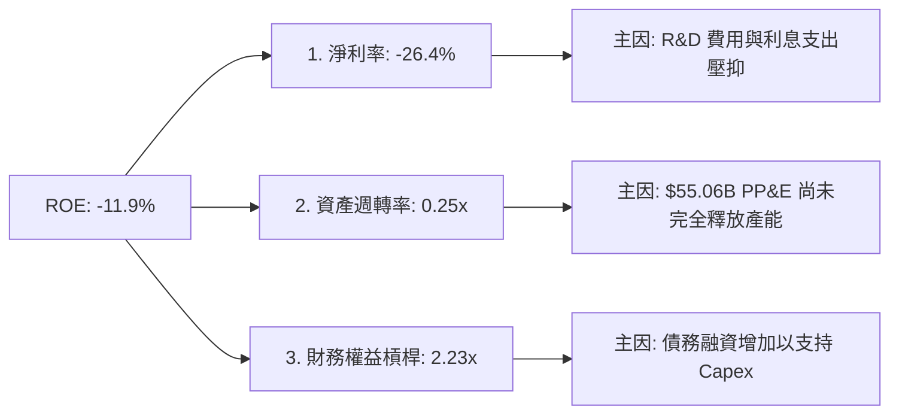

### 6.4 獲利能力儀表板

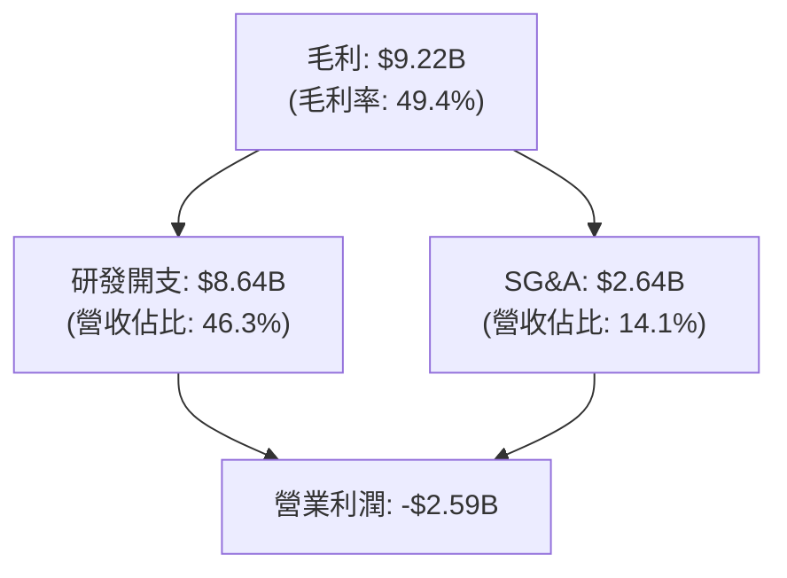

---

## 7. 估值深度分析

### 7.1 同業估值比較表格

由於 SPCX 的獨特壟斷地位，市場上並無完全對等的競爭對手。我們選取傳統航太巨頭洛克希德馬丁（LMT）、諾斯洛普格魯曼（NOC）以及商業衛星通訊服務商 Viasat（VSAT）進行多維度估值對比。

| 估值指標 | **SPCX** | **LMT** | **NOC** | **VSAT** | SPCX 評估 |
|----------|----------|---------|---------|----------|-----------|
| **Trailing P/E** | **N/A** (虧損) | 18.5x | 21.2x | N/A | 🟡 尚無 Trailing P/E |
| **Forward P/E** | **137.31x** | 16.2x | 18.0x | 35.4x | 🔴 具備極高的成長性溢價 |
| **P/S Ratio** | **84.63x** | 1.8x | 2.1x | 1.2x | 🔴 估值偏高，隱含極高預期 |
| **EV / EBITDA** | **185.53x** | 12.4x | 14.1x | 8.5x | 🔴 估值倍數高，反映高再投資率 |
| **EV / Revenue** | **37.97x** | 1.9x | 2.3x | 1.5x | 🔴 反映星鏈業務的軟體高毛利屬性 |
| **P/B Ratio** | **20.82x** | 15.2x | 4.3x | 0.8x | 🔴 溢價顯著 |

### 7.2 歷史估值區間分析

SPCX 作為一隻新晉發行（或一級市場對標）標的，其 Forward P/E 137.3x 處於其歷史私募估值區間（100x - 180x）的中值偏低位置。

### 7.3 情境目標價（假設驅動，Bear / Base / Bull）

我們基於未來 5 年的財務預測，建立以下三種情境估值模型：

| 情境 | 營收 CAGR (5Y) | 2030 營業利潤率 | 退出倍數 (EV/EBITDA) | 隱含目標價 | 相對現價漲跌幅 |
|------|-----------|-----------|----------|------------|----------|
| 🔴 **悲觀** | 15.0% | 10.0% | 35.0x | **$62.00** | -50.0% |
| 🟡 **基準** | **30.0%** | **25.0%** | **65.0x** | **$240.04** | **+93.6%** |
| 🟢 **樂觀** | 45.0% | 35.0% | 90.0x | **$450.00** | +262.9% |

*估值倍數選擇說明：由於 SPCX 擁有高達 $6.70B 的年折舊，P/E 嚴重失真，因此我們主要採用 **EV/EBITDA** 與 **EV/Revenue** 作為核心估值工具，這能更真實地反映其在折舊高峰期的企業價值。*

### 7.4 DCF 敏感性分析（6格目標價矩陣）

基於終端成長率 3.5% 及不同 WACC 假設下的 DCF 目標價矩陣：

| 情境 | **WACC = 7.5%** | **WACC = 8.8%（基準）** | **WACC = 10.0%** |
|------|--------------|----------------------|--------------|
| 🟢 **樂觀 (Revenue CAGR 40%)** | **$485.00** (+291.1%) | **$450.00** (+262.9%) | **$390.00** (+214.5%) |
| 🟡 **基準 (Revenue CAGR 30%)** | **$275.00** (+121.8%) | **$240.04** (+93.6%) | **$210.00** (+69.4%) |
| 🔴 **悲觀 (Revenue CAGR 15%)** | **$75.00** (-39.5%) | **$62.00** (-50.0%) | **$50.00** (-59.7%) |

### 7.5 估值綜合區間

```
╔══════════════════════════════════════════════════════════════════╗
║                    SPCX 估值區間與當前股價                       ║
╠══════════════════════════════════════════════════════════════════╣
║                                                                  ║
║  [$-50.0%] 悲觀估值： $62.00   ██████░░░░░░░░░░░░░░░░░░░░░░░░░   ║
║  當前股價：          $123.99  ████████████░░░░░░░░░░░░░░░░░░░   ║
║  [+93.6%] 基準目標：  $240.04  ████████████████████████░░░░░░░   ║
║  [+262.9%] 樂觀目標： $450.00  ███████████████████████████████   ║
║                                                                  ║
╚══════════════════════════════════════════════════════════════════╝
```

---

## 8. 成長催化劑

### 8.1 催化劑時間軸

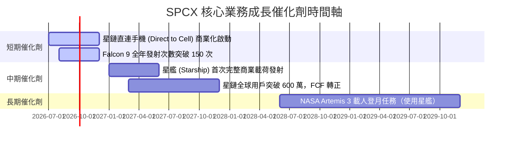

### 8.2 TAM 市場規模分析

SPCX 正向多個數千億美元級別的市場進軍：

```
╔══════════════════════════════════════════════════════════════════╗
║                    SPCX 潛在市場規模 (TAM)                       ║
╠══════════════════════════════════════════════════════════════════╣
║                                                                  ║
║  1. 全球寬頻與電信市場 (Starlink)                                ║
║     ├── 全球 TAM: $1.20T                                         ║
║     └── SPCX 當前滲透率: < 2.0% (成長空間巨大)                    ║
║                                                                  ║
║  2. 商業與國防發射市場 (Space Segment)                           ║
║     ├── 全球 TAM: $150B                                          ║
║     └── SPCX 當前滲透率: > 80.0% (絕對主導)                      ║
║                                                                  ║
║  3. 太空物流與點對點運輸 (Starship)                              ║
║     ├── 全球 TAM: $250B                                          ║
║     └── SPCX 當前滲透率: 0% (即將開拓新藍海)                      ║
║                                                                  ║
╚══════════════════════════════════════════════════════════════════╝
```

### 8.3 成長驅動力結構圖

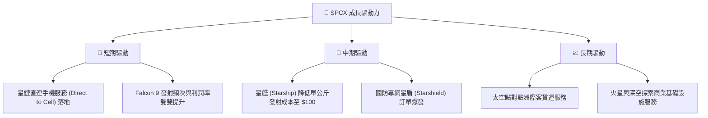

---

## 9. 風險矩陣

### 9.1 風險評分矩陣

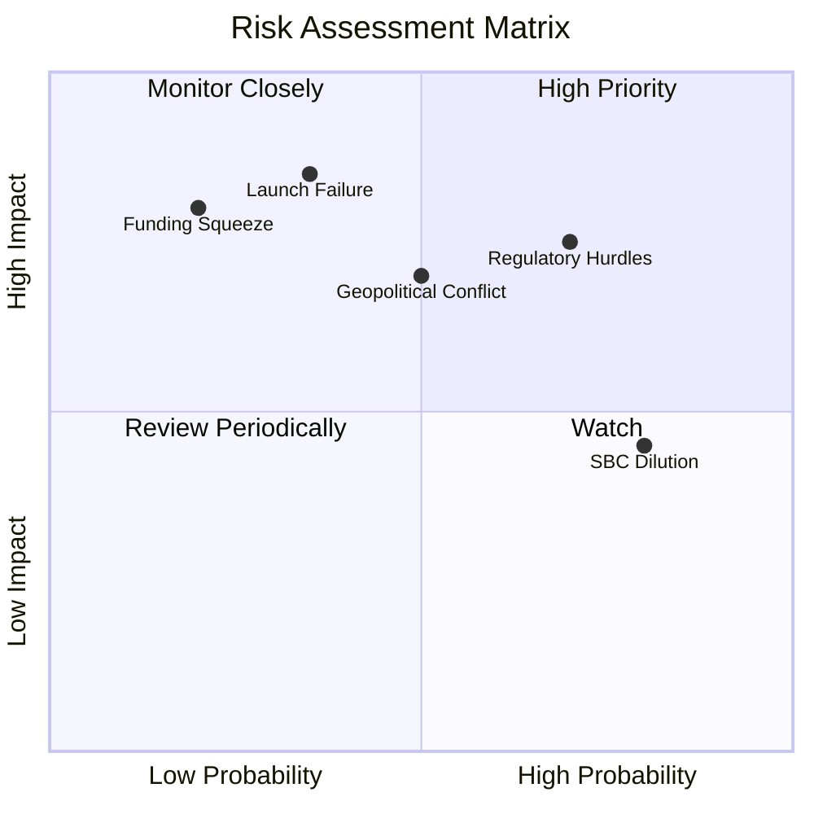

### 9.2 風險清單詳細分析

| # | 風險項目 | 發生機率 | 財務衝擊 | 風險評分 | 緩解措施 |
|---|----------|----------|----------|----------|----------|
| 1 | 🔴 **重大發射失敗** | 中 (35%) | 高 (-15% 營收) | 🔴 7.5/10 | 獵鷹系列成熟度高，星艦採多備份、漸進式測試方法降低單次損失。 |
| 2 | 🔴 **頻譜與電信監管受限** | 高 (70%) | 中 (-10% 營收) | 🔴 7.0/10 | 積極與各國監管機構（如 FCC, ITU）溝通，聘請專業游說團隊。 |
| 3 | 🟡 **高額股權稀釋 (SBC)** | 極高 (80%) | 低 (-5% EPS) | 🟡 6.0/10 | 隨著公司利潤轉正，逐步加大股票回購力度以抵消稀釋。 |
| 4 | 🟡 **融資成本上升** | 低 (20%) | 高 (利息支出暴增) | 🟡 5.5/10 | 依靠強勁的營運現金流（$7.10B）進行內生性融資，減少債務依賴。 |

---

## 10. 投資建議

### 10.1 最終綜合評級雷達圖

```
╔══════════════════════════════════════════════════════════════╗
║                  SPCX 最終綜合評級雷達圖                     ║
╠══════════════════════════════════════════════════════════════╣
║                                                              ║
║  基本面強度：  ★★★★★  (9.0/10)                               ║
║  成長潛力：    ★★★★★  (8.5/10)                               ║
║  獲利品質：    ★★★☆☆  (5.5/10)                               ║
║  財務健康度：  ★★★★☆  (7.0/10)                               ║
║  護城河深度：  ★★★★★  (9.5/10)                               ║
║                                                              ║
║  🏆 綜合評分： 8.1 / 10  ｜  🟢 強烈建議買入 (Strong Buy)    ║
╚══════════════════════════════════════════════════════════════╝
```

### 10.2 目標價與隱含報酬率

| 情境 | 隱含目標價 | 當前股價 | 潛在空間 | 機率權重 | 權重目標價 |
|------|-----------|----------|----------|----------|------------|
| 🔴 悲觀情境 | $62.00 | $123.99 | -50.0% | 15% | $9.30 |
| 🟡 **基準情境** | **$240.04** | **$123.99** | **+93.6%** | **65%** | **$156.03** |
| 🟢 樂觀情境 | $450.00 | $123.99 | +262.9% | 20% | $90.00 |
| **加權綜合期望值** | — | — | — | **100%** | **$255.33 (+105.9%)** |

### 10.3 買入時機與觸發因素

```
╔══════════════════════════════════════════════════════════════════╗
║                  ✅ SPCX 買入觸發因素 Checklist                  ║
╠══════════════════════════════════════════════════════════════════╣
║                                                                  ║
║  立即買入觸發條件（滿足 2 項以上即可建倉）：                      ║
║  ✅ 星鏈全球訂閱用戶數突破 500 萬人                              ║
║  ✅ 星艦 (Starship) 成功完成首次商業載荷軌道發射                 ║
║  ✅ 單季營運現金流 (OCF) 超過 $2.50B                             ║
║                                                                  ║
║  加碼觸發條件：                                                  ║
║  ☐ 星鏈直連手機服務 (Direct to Cell) 獲准在歐美主要市場商用      ║
║  ☐ 季度研發費用佔比降至 30% 以下，營業利潤率轉正                 ║
║                                                                  ║
║  減碼/停損觸發條件：                                             ║
║  ☐ 星艦研發遭遇重大爆炸事故，導致發射時程延宕 12 個月以上        ║
║  ☐ FCF 持續惡化且手頭現金跌破 $10.0B 關鍵警戒線                  ║
║                                                                  ║
╚══════════════════════════════════════════════════════════════════╝
```

### 10.4 投資人適配度分析

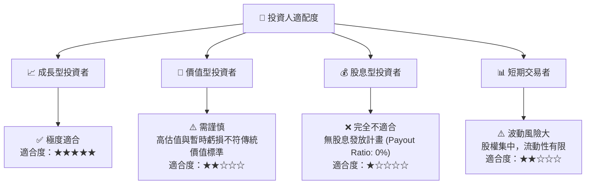

### 10.5 每季財報監控清單（Quarterly Watch List）

為了持續追蹤 SPCX 的投資論點是否成立，建議投資人於每季財報中重點監控以下指標：

| 監控指標 | 基準線 (Base Case) | 觸發加碼門檻 | 觸發減碼門檻 | 戰略含意 |
|----------|-------------------|--------------|--------------|----------|
| **星鏈訂閱用戶數** | 季增 30-50 萬 | 季增 > 60 萬 | 季增 < 20 萬 | 評估星鏈商業化擴張速度與市場飽和點 |
| **R&D 費用** | $2.0B - $2.5B / 季 | < $1.5B (研發收尾) | > $3.5B (預算失控) | 監控研發效率與利潤率拐點 |
| **Capex 支出** | $4.5B - $5.5B / 季 | < $3.5B (基礎建設完成) | > $7.0B (再投資壓力大) | 預測自由現金流（FCF）轉正時間 |
| **遞延收入 (Unearned Revenue)** | > $6.50B | > $8.00B | < $5.00B | 評估星鏈預收款與客戶黏著度 |

### 10.6 反面論證：什麼會證明論點錯誤（What Would Change My Mind）

```
╔══════════════════════════════════════════════════════════════════╗
║              ⚠️ 論點失效條件（Disconfirming Evidence）           ║
╠══════════════════════════════════════════════════════════════════╣
║  本投資論點在下列情況成立時應重新檢視或退出：                    ║
║  ☐ 星鏈 (Starlink) 訂戶成長率連續兩季跌破 10.0%                  ║
║  ☐ 營業利益率較當前水準繼續收縮 > 10.0 pp (降至 -50% 以下)       ║
║  ☐ 自由現金流赤字擴大，且 FCF / 淨利轉換率降至 -300% 以下        ║
║  ☐ 聯邦通信委員會 (FCC) 取消或大幅縮減星鏈的軌道頻譜使用權       ║
║  ☐ 關鍵高管（如 Elon Musk）因不可抗力因素無法繼續領導公司       ║
╚══════════════════════════════════════════════════════════════════╝
```

---

> **免責聲明**：本報告為 AI 自動生成，僅供研究參考，不構成投資建議。投資有風險，入市需謹慎。