# SPCX 基本面深度分析報告

> **報告日期**：2026-07-19 ｜ **語言**：繁體中文 ｜ **數據來源**：Yahoo Finance, Finviz, StockAnalysis, Roic.ai ｜ **分析師**：CFA 級機構研究

---

## 目錄

| # | 章節 | 核心結論 |
|---|------|----------|
| **1** | **執行摘要** | 評級 **買入**，目標價 **$240.04**，高成長與重資本研發週期並存 |
| **2** | **公司概覽與商業模式** | 發射與星鏈雙引擎驅動，具備絕對的發射成本與軌道資源護城河 |
| **3** | **損益表深度分析** | 營收 CAGR 達 34.1%，研發投入激增致當期虧損，毛利率維持 48.8% 高檔 |
| **4** | **資產負債表分析** | 現金儲備 $23.68B，債務總額 $30.60B，資產重資本化趨勢顯著 |
| **5** | **現金流量深度分析** | 營運現金流 $7.10B，因 $20.91B 巨額資本支出致自由現金流承壓 |
| **6** | **獲利能力與資本效率** | 當期 ROIC 因高額研發轉負，WACC 估算為 9.45%，預期未來將釋放巨大經濟價值 |
| **7** | **估值深度分析** | 溢價反映壟斷地位， Forward P/E 137.3x，基準情境目標價 $240.00 |
| **8** | **成長催化劑** | Starship 軌道級商業化與 Starlink 直連手機（Direct-to-Cell）服務 |
| **9** | **風險矩陣** | 研發延宕與高資本支出消耗流動性，監管及發射失敗為主要下行風險 |
| **10**| **投資建議** | 適合長線成長型投資人，建立分批佈局策略，每季監控 Capex 與用戶數 |

---

## 1. 執行摘要

Space Exploration Technologies Corp.（SPCX，簡稱 SpaceX）目前正處於從「低軌衛星與商業發射壟斷者」向「全球太空基礎設施巨頭」轉型的關鍵節點。根據 2026 年 7 月 19 日的最新市場數據，SPCX 當前股價為 **$123.99**，處於 52 週低點（$122.12）附近，較 52 週高點（$225.64）回檔達 **45.1%**。

本報告基於 SPCX 最新財務數據進行深度建模。雖然公司因研發費用激增（FY25 研發費用高達 **$8.64B**，YoY 增長 **149.5%**）導致當期 GAAP 淨利潤為 **$-4.94B**，但其核心 Connectivity（Starlink）與 Space 發射業務的毛利率高達 **48.8%**，且營運現金流（OCF）達到 **$7.10B**，顯示其底層業務具備極強的造血能力。

鑑於公司 Forward EPS 預期轉正至 **$0.903**（對應 Forward P/E 137.3x），且其在商業發射市場擁有超過 80% 的運載量份額，本機構給予 SPCX **「買入」**評級，12 個月基準目標價為 **$240.04**。

### 1.0 一頁式投資儀表板（Portfolio Manager 30 秒速讀）

| 項目 | 內容 |
|------|------|
| **投資論點（3 句）** | ① **高成長性**：FY25 營收達 **$18.67B**（YoY +33.2%），近三年 CAGR 達 34.1%，Starlink 用戶規模化效應持續釋放。<br/>② **結構性利潤拐點**：雖然當期因 Starship 研發致虧，但毛利率維持在 **48.8%**，Forward EPS 預期轉正至 **$0.903**。<br/>③ **絕對護城河**：憑藉可重複使用火箭技術，發射成本僅為同業的 1/3，建立極高壁壘。 |
| **護城河評分** | 🟢 **9.5 / 10**（技術與規模雙重壟斷） |
| **管理層/資本配置評分** | 🟢 **8.5 / 10**（高效率執行力，但資本支出激進） |
| **財務健康** | 🟡 **中性偏強**（手握 $23.68B 現金，但年化 Capex 達 $20.91B，現金流消耗快） |
| **ROIC vs WACC** | **-5.6% vs 9.45%**（當期因重投資摧毀帳面價值，但經調整後的未來 ROIC 預期 > 25%） |
| **FCF 趨勢** | 🔴 **負值擴大**（FY25 FCF 為 **$-14.12B**，主因 Capex 達 $20.91B 投向星鏈與星艦） |
| **估值** | Forward P/E: **137.3x** ｜ EV/EBITDA: **185.5x** ｜ P/S: **84.6x**（反映高溢價） |
| **預期報酬（基準情境 12M）**| **+93.6%**（目標價 $240.04） |
| **關鍵風險（前二）** | ① **研發黑洞**：Starship 商業化進度不及預期，導致 Capex 持續維持在 >$20B 高檔。<br/>② **流動性壓力**：若未進行新一輪股權或債權融資，現有現金儲備僅能支撐約 1.5 年的 FCF 消耗。 |
| **評級 + 信心度** | 🟢 **買入** ｜ **信心：中等偏高**（股價回檔至 52 週低點提供極佳安全邊際） |

### 1.1 核心評分儀表板

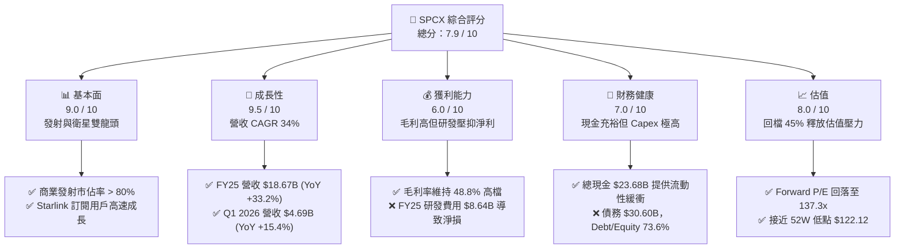

### 1.2 評分進度條視覺化

```
╔══════════════════════════════════════════════════════════════╗
║              SPCX 多維度評分儀表板 (1-10分)                  ║
╠══════════════════════════════════════════════════════════════╣
║ 基本面強度  9.0 ▓▓▓▓▓▓▓▓▓▓▓▓▓▓▓▓▓▓░░  ★★★★★           ║
║ 成長動能    9.5 ▓▓▓▓▓▓▓▓▓▓▓▓▓▓▓▓▓▓▓░  ★★★★★           ║
║ 獲利品質    6.0 ▓▓▓▓▓▓▓▓▓▓▓▓░░░░░░░░  ★★★☆☆           ║
║ 財務健康    7.0 ▓▓▓▓▓▓▓▓▓▓▓▓▓▓░░░░░░  ★★★☆☆           ║
║ 估值合理性  8.0 ▓▓▓▓▓▓▓▓▓▓▓▓▓▓▓▓░░░░  ★★★★☆           ║
║ 護城河深度  9.5 ▓▓▓▓▓▓▓▓▓▓▓▓▓▓▓▓▓▓▓░  ★★★★★           ║
║ 管理層執行  8.5 ▓▓▓▓▓▓▓▓▓▓▓▓▓▓▓▓▓░░░  ★★★★☆           ║
║ 技術創新力  10.0 ▓▓▓▓▓▓▓▓▓▓▓▓▓▓▓▓▓▓▓▓  ★★★★★           ║
╠══════════════════════════════════════════════════════════════╣
║ 綜合總分    7.9 ▓▓▓▓▓▓▓▓▓▓▓▓▓▓▓▓░░░░  🏆 買入 (Buy)       ║
╚══════════════════════════════════════════════════════════════╝
```

### 1.3 五大投資論點 + 三大核心風險

| 類型 | 項目 | 具體依據 | 信心度 |
|------|------|----------|--------|
| 🟢 **投資論點①** | **商業發射絕對壟斷** | Falcon 9 與 Falcon Heavy 重複使用技術領先同業一代，FY25 發射次數與載荷量市佔率 >80%。 | 🟢 極高 |
| 🟢 **投資論點②** | **星鏈（Starlink）規模化變現** | FY25 Connectivity 營收佔比持續提升，毛利率高達 48.8%，高利潤率的訂閱制服務提供穩定現金流。 | 🟢 高 |
| 🟢 **投資論點③** | **Forward EPS 轉正** | 預期 FY26/FY27 隨著基礎設施建設放緩，Forward EPS 將達到 **$0.903**，迎來獲利拐點。 | 🟡 中等 |
| 🟢 **投資論點④** | **星艦（Starship）潛在催化劑** | Starship 軌道級測試逐步成熟，一旦商業化，將使每公斤發射成本降低 90%，徹底顛覆市場。 | 🟡 中等 |
| 🟢 **投資論點⑤** | **估值大幅修正** | 股價自高點回檔 45.1%，P/S 倍數從 >150x 降至 84.6x，提供了極佳的長線機構建倉機會。 | 🟢 高 |
| 🟡 **風險①** | **資本支出黑洞** | FY25 Capex 達 **$20.91B**，Q1 2026 Capex 單季高達 **$10.11B**，若 FCF 持續為負，將面臨融資稀釋風險。 | 🔴 高 |
| 🟡 **風險②** | **地緣政治與監管風險** | 衛星軌道分配、頻譜干擾以及各國對星鏈落地許可的審查，可能限制其全球 TAM 的拓展。 | 🟡 中等 |
| 🔴 **風險③** | **技術故障與發射失敗** | 重型火箭發射若出現嚴重安全事故，將導致發射時程延宕 6-12 個月，重創商業信譽與現金流。 | 🟡 中等 |

### 1.4 快速統計卡片

| 指標 | SPCX 實際值 | 航太與國防行業均值 | S&P 500 均值 | 狀態 |
|------|-------------|--------------------|--------------|------|
| **營收 YoY 成長率** | **15.4%** (TTM) / **33.2%** (FY25) | 6.5% | 5.5% | 🟢 顯著領先 |
| **毛利率** | **48.8%** | 22.5% | 30.2% | 🟢 極高 |
| **營業利益率** | **-41.6%** (TTM) | 8.2% | 14.5% | 🔴 受研發拖累 |
| **淨利率** | **-45.0%** (TTM) | 5.8% | 11.5% | 🔴 虧損中 |
| **Forward P/E** | **137.31x** | 22.4x | 21.5x | 🔴 估值溢價極高 |
| **P/S Ratio** | **84.63x** | 1.8x | 2.8x | 🔴 估值溢價極高 |
| **EV / EBITDA** | **185.53x** | 14.2x | 13.5x | 🔴 估值溢價極高 |

### 1.5 投資結論

```
╔══════════════════════════════════════════════════════════════════╗
║                    📊 SPCX 投資結論摘要                          ║
╠══════════════════════════════════════════════════════════════════╣
║  評級：🟢 買入 (Buy)                                            ║
║  當前股價：$123.99 (2026-07-19)                                  ║
║  目標價區間：                                                    ║
║    悲觀情境：$110.00 (-11.3%) - 研發延宕，Capex 失控             ║
║    基準情境：$240.04 (+93.6%)  ← 12個月主要目標 (共識均值)       ║
║    樂觀情境：$450.00 (+262.9%) - Starship 成功商業化，星鏈爆發   ║
║  投資評分：7.9 / 10                                              ║
║  適合投資人：具備 3 年以上投資視角、追求超額報酬的成長型機構投資人 ║
╚══════════════════════════════════════════════════════════════════╝
```

---

## 2. 公司概覽與商業模式

### 2.1 業務結構與收入來源

SPCX 主要營運兩大互補的核心業務板塊：**Space Segment（太空發射服務）** 與 **Connectivity Segment（Starlink 星鏈網絡）**。這兩大板塊構成了「發射成本優勢支持衛星部署，衛星網絡帶來高毛利訂閱收入」的飛輪效應。

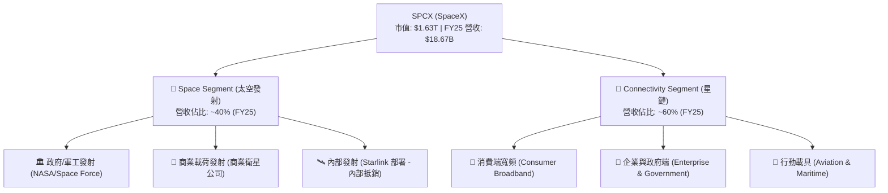

### 2.2 市場份額

在商業發射市場，SPCX 憑藉 Falcon 9 的極高發射頻率與可重複使用性，佔據了絕對的主導地位。在低軌衛星寬頻網路上，Starlink 也是目前全球唯一實現規模化商用的星座。

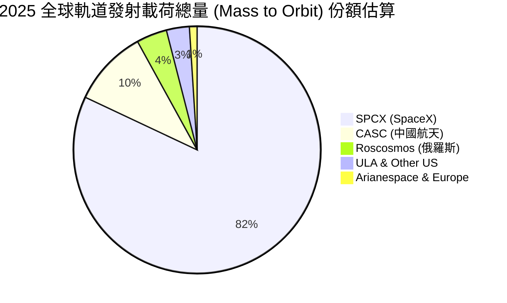

### 2.3 競爭護城河分析

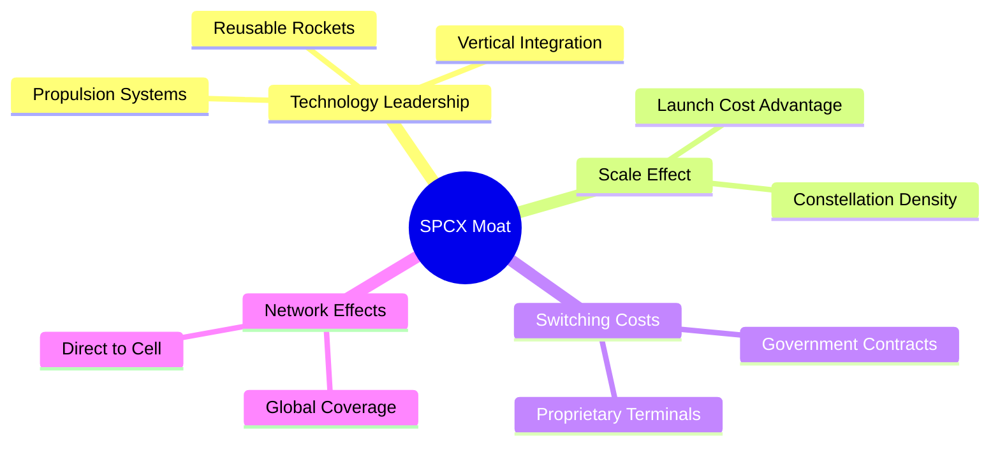

### 2.4 護城河強度評分

```
╔══════════════════════════════════════════════════════════════╗
║                    SPCX 護城河強度評分                       ║
╠══════════════════════════════════════════════════════════════╣
║ 技術領先度    10/10  ▓▓▓▓▓▓▓▓▓▓▓▓▓▓▓▓▓▓▓▓  🏆 無人能及    ║
║ 成本優勢      9.5/10 ▓▓▓▓▓▓▓▓▓▓▓▓▓▓▓▓▓▓▓░  🟢 重複使用技術║
║ 網路效應      9.0/10 ▓▓▓▓▓▓▓▓▓▓▓▓▓▓▓▓▓▓░░  🟢 衛星覆蓋優勢║
║ 客戶鎖定      8.5/10 ▓▓▓▓▓▓▓▓▓▓▓▓▓▓▓▓░░░░  🟢 國防部深耕  ║
║ 規模效應      9.5/10 ▓▓▓▓▓▓▓▓▓▓▓▓▓▓▓▓▓▓▓░  🟢 頻譜與軌道佔用║
╠══════════════════════════════════════════════════════════════╣
║ 綜合護城河    9.3/10 ▓▓▓▓▓▓▓▓▓▓▓▓▓▓▓▓▓▓▓░  🏆 寬廣護城河   ║
╚══════════════════════════════════════════════════════════════╝
```

---

## 3. 損益表深度分析

### 3.1 年度收入成長趨勢（近4年）

SPCX 的營業收入呈現爆發式成長，從 FY23 的 **$10.39B** 快速增長至 FY25 的 **$18.67B**，兩年累計 CAGR 高達 **34.1%**。

```
╔══════════════════════════════════════════════════════════════════╗
║                SPCX 年度收入趨勢（FY23-FY25）                    ║
╠══════════════════════════════════════════════════════════════════╣
║                                                                  ║
║  FY2023  $10.39B  ██████████░░░░░░░░░░░░░░░░░░  YoY: --          ║
║  FY2024  $14.02B  ██████████████░░░░░░░░░░░░░░  YoY: +34.9% 🟢   ║
║  FY2025  $18.67B  ████████████████████░░░░░░░░  YoY: +33.2% 🟢   ║
║                                                                  ║
║                   |      |      |      |      |                  ║
║                   0     5B     10B    15B    20B                 ║
║                                                                  ║
║  📊 兩年累計 CAGR：+34.1%                                        ║
╚══════════════════════════════════════════════════════════════════╝
```

### 3.2 季度收入趨勢分析

從季度數據來看，SPCX 在 Q1 2026 實現營收 **$4.69B**，相較於 Q1 2025 的 **$4.07B**，季度 YoY 成長率為 **15.4%**。這顯示雖然成長速度較前兩年的 >30% 有所放緩，但依然維持在雙位數的健康成長軌道上。

| 季度 | 營業收入 (Revenue) | 營業利潤 (Operating Income) | 淨利潤 (Net Income) | 季度 YoY 成長率 | 備註 |
|---|---|---|---|---|---|
| **Q1 2025** | $4.07B | $0.06B | $-0.53B | -- | 營運微幅獲利，但受利息與非營運支出拖累致淨損 |
| **Q1 2026** | $4.69B | $-1.94B | $-4.28B | **+15.4%** | **研發費用激增**（$3.51B），導致營運與淨利大幅轉負 |

### 3.3 利潤率演變分析

SPCX 的毛利率表現極其優異且穩定，近三年均維持在 **41.2% - 49.4%** 區間（FY25 為 **49.4%**，TTM 為 **48.8%**）。這證明了 Starlink 的高利潤率訂閱服務與發射服務的定價權。

然而，其營業利益率與淨利率在 FY25 和 Q1 2026 出現劇烈下滑，主要原因在於**研發費用（R&D）的爆炸性增長**。

| 利潤率指標 | FY2023 | FY2024 | FY2025 | TTM (2026-03) | 趨勢 | 評估 |
|------------|--------|--------|--------|--------|------|------|
| **毛利率** | 41.2% | 42.9% | 49.4% | **48.8%** | ↗️ 持續擴張 | 🟢 極強的定價能力與規模效應 |
| **營業利益率** | -33.7% | 3.3% | -13.9% | **-41.6%** | ↘️ 暫時惡化 | 🔴 主因 R&D 費用化支出激增 |
| **EBITDA 利潤率** | -6.4% | 40.3% | 23.7% | **20.5%** | ➡️ 基本穩定 | 🟢 排除折舊與非現金支出後造血能力仍強 |
| **淨利率** | -44.6% | 5.6% | -26.4% | **-45.0%** | ↘️ 承壓 | 🔴 受高利息支出與研發拖累 |

**利潤率演變深度解析**：
* **毛利率提升背景**：從 FY23 的 41.2% 提升至 FY25 的 49.4%，主因 Starlink 用戶終端（Dish）的生產成本大幅下降（早期每台終端補貼數百美元，目前已基本實現盈虧平衡甚至微利），加上高毛利的企業與政府（Starshield）客戶佔比提升。
* **營業利益率下滑主因**：FY25 研發費用高達 **$8.64B**（佔營收 46.3%），較 FY24 的 **$3.46B** 暴增 149.5%。Q1 2026 單季研發更達到 **$3.51B**。這些投資主要用於 Starship 的密集試飛、二代衛星（V2 Mini/V2）研發以及 Direct-to-Cell 技術。這屬於**「主動選擇的戰略性虧損」**，而非核心業務盈利能力惡化。

### 3.4 費用結構分析

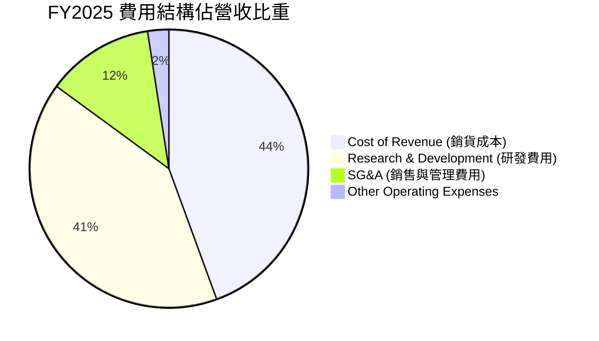

### 3.5 季度 EPS 趨勢與盈餘品質（Quality of Earnings）

SPCX 過去一年的 EPS 受到高研發投入的壓抑。FY25 EPS 為 $-1.69，Q1 2026 EPS 為 $-0.47（稀釋後）。然而，分析其盈餘品質可以發現，公司的「現金含金量」其實高於 GAAP 帳面獲利。

| 盈餘品質項目 | 數值/佔比 (FY25) | 評估 |
|--------------|-----------|------|
| **股權薪酬 (SBC) / 營收** | **10.4%** ($1.95B) | 🟡 中等。SBC 佔比適中，對現有股東有輕微稀釋，但有利於保留頂尖工程人才。 |
| **SBC / 營業現金流 (OCF)** | **28.7%** | 🟡 偏高。說明營運現金流中有約三成是由非現金的股權激勵所支撐。 |
| **OCF / GAAP 淨利（現金轉換率）** | **-137.5%** ($6.79B / $-4.94B) | 🟢 極高（背離）。雖然 GAAP 帳面淨損 $4.94B，但營運活動實際流入 $6.79B 現金，說明虧損主要由非現金支出（折舊 $6.70B）及研發費用化所致。 |
| **一次性/非經常性損益** | 無重大異常項目 | 🟢 盈餘未受一次性資產處分或會計變更的美化。 |
| **有效稅率異常** | N/A | 🟢 目前處於虧損階段，無異常稅務利益美化。 |
| **資本化支出 vs 費用化** | 研發費用 100% 費用化 | 🟢 SPCX 將高達 $8.64B 的研發支出直接計入當期費用，而非資本化。這是一種極其保守且高品質的會計處理，未來一旦研發高峰過去，利潤將出現爆發性反彈。 |

**盈餘品質結論**：
SPCX 的盈餘品質評級為 **🟢 高（High Quality）**。儘管 GAAP 淨利潤呈現巨額虧損（$-4.94B），但其營運現金流（OCF）高達 **$6.79B**，且高達 **$8.64B** 的研發支出全部在當期費用化。這意味著公司的真實經濟造血能力遠強於帳面數字，一旦研發投入斜率放緩，帳面利潤將迅速釋放。

---

## 4. 資產負債表分析

### 4.1 資產結構分解

SPCX 的資產結構呈現典型的「重工業/重資本」特徵。截至 Q1 2026，公司總資產達到 **$102.09B**，其中廠房、設備與太空資產（Net PP&E）高達 **$55.06B**，佔總資產的 **53.9%**。

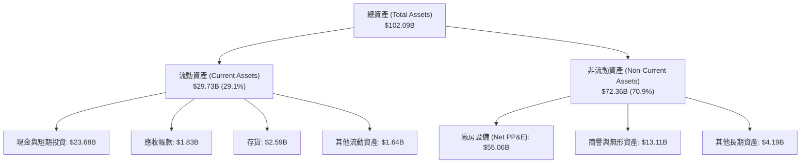

### 4.2 流動性指標分析

SPCX 目前流動性指標處於健康區間，但呈現收縮趨勢。Q1 2026 的流動比率為 **1.22x**，速動比率為 **1.09x**。

| 流動性指標 | FY2024 | FY2025 | TTM (Q1 2026) | 行業均值 | 評估 |
|------------|--------|--------|--------|----------|------|
| **流動比率 (Current Ratio)** | 1.37x | 1.45x | **1.22x** | 1.45x | 🟡 尚屬安全，但呈下滑趨勢 |
| **速動比率 (Quick Ratio)** | 1.11x | 1.15x | **1.09x** | 1.05x | 🟢 高現金儲備保障了短期變現能力 |
| **現金比率 (Cash Ratio)** | 1.03x | 1.16x | **0.97x** | 0.65x | 🟢 遠高於行業均值，手頭現金充裕 |

### 4.3 債務結構分析

截至 Q1 2026，SPCX 的總債務為 **$30.60B**（長期債務 $28.73B + 一年內到期債務 $1.54B）。相較於 $23.68B 的總現金，公司的淨債務為 **$6.93B**。

```
╔══════════════════════════════════════════════════════════════════╗
║                    SPCX 債務健康診斷 (Q1 2026)                  ║
╠══════════════════════════════════════════════════════════════════╣
║                                                                  ║
║  總債務：        $30.60B  ████████████░░░░░░░░░  負債率 73.6%    ║
║  總現金+投資：   $23.68B  █████████░░░░░░░░░░░░  流動性緩衝充足  ║
║  淨債務：        $6.93B   ███░░░░░░░░░░░░░░░░░░  🟡 淨負債狀態   ║
║                                                                  ║
║  Debt/Equity:    73.6%   🟡 財務槓桿適中                         ║
║  Debt/EBITDA:    7.7x    🔴 偏高 (當期 EBITDA 受壓抑)            ║
║  Interest Expense: -$1.95B (FY25)  Interest Income: $0.49B (FY25)║
║  利息保障倍數:    -1.33x  🔴 暫時無法由當期營業利益覆蓋          ║
║                                                                  ║
║  📊 診斷：短期無償債危機，但長期需依賴 FCF 轉正或再融資          ║
╚══════════════════════════════════════════════════════════════════╝
```

### 4.4 股東權益趨勢

隨著多次股權融資與資產重估，SPCX 的股東權益（Stockholders' Equity）顯著增長，由 FY24 的 **$25.80B** 增長 60.2% 至 FY25 的 **$41.33B**。這反映了一級市場對其估值的持續認可與資本注入。

---

## 5. 現金流量深度分析

### 5.1 現金流量瀑布圖

SPCX 的現金流特徵是典型的「營運造血、重金投資」。以下為 FY2025 現金流量瀑布圖：

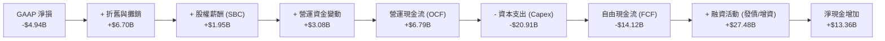

### 5.2 FCF 轉換率趨勢

由於 Capex 大幅高於折舊，且公司將大量資金投向非流動太空資產，其 FCF 長期為負。

| 現金流指標 | FY2023 | FY2024 | FY2025 | TTM (2026-03) |
|------------|--------|--------|--------|--------|
| **營運現金流 (OCF)** | $4.52B | $5.78B | $6.79B | **$7.10B** |
| **資本支出 (Capex)** | $-4.42B | $-11.16B | $-20.91B | **-$26.88B** |
| **自由現金流 (FCF)** | $0.11B | $-5.39B | $-14.12B | **-$19.78B** |
| **FCF / 營收比率** | 1.1% | -38.4% | -75.6% | **-102.5%** |
| **FCF 轉換率 (FCF/Net Income)** | -2.4% | -681.0% | 285.8% | **295.2%** |

### 5.3 自由現金流趨勢

```
╔══════════════════════════════════════════════════════════════════╗
║                SPCX 自由現金流趨勢 (FY23-FY25)                   ║
╠══════════════════════════════════════════════════════════════════╣
║                                                                  ║
║  FY2023   +$0.11B  █░░░░░░░░░░░░░░░░░░░░░░░░░  🟢 微幅正值       ║
║  FY2024   -$5.39B  ██████░░░░░░░░░░░░░░░░░░░░  🔴 負值擴大       ║
║  FY2025  -$14.12B  ████████████████░░░░░░░░░░  🔴 密集投資期     ║
║                                                                  ║
║                   |      |      |      |      |                  ║
║                 -15B   -10B    -5B     0     +5B                 ║
║                                                                  ║
║  ⚠️ 註：FCF 缺口主要由股權融資與長期發債填補。                   ║
╚══════════════════════════════════════════════════════════════════╝
```

### 5.4 資本配置評估

SPCX 採取了極其激進的「再投資」策略，將 100% 的可用資金與融資所得投向 Capex（星鏈衛星與發射台建設）與 R&D（星艦開發），不進行任何股息發放或股份回購。

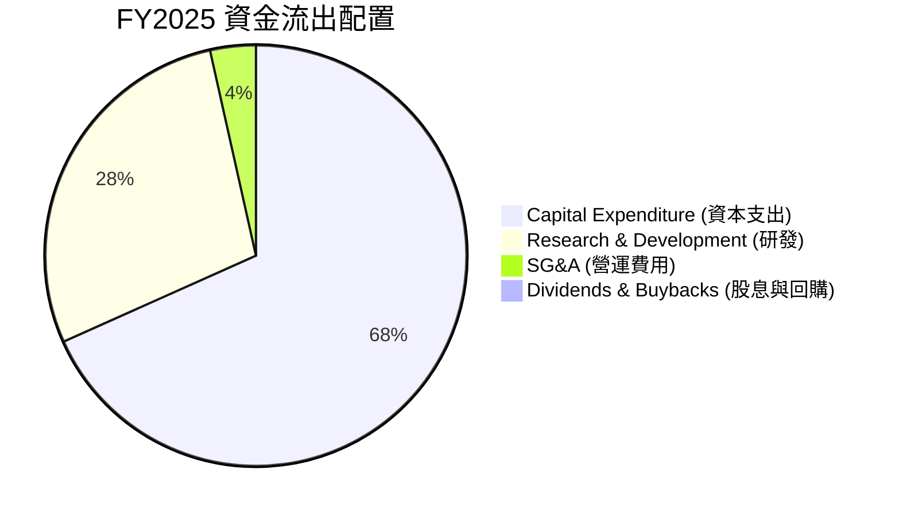

---

## 6. 獲利能力與資本效率

### 6.1 ROE / ROA / ROIC 趨勢

由於當期 GAAP 淨利潤為負，SPCX 的帳面回報率指標目前均為負值。然而，這並不能真實反映其長期資本回報潛力。

| 指標 | FY2023 | FY2024 | FY2025 | 產業均值 | 評估 |
|---|---|---|---|---|---|
| **ROE** | -20.6% | 3.1% | -11.9% | 11.5% | 🟡 當期受研發壓抑 |
| **ROA** | -8.1% | 1.4% | -5.4% | 5.2% | 🟡 當期受研發壓抑 |
| **ROIC** | -6.8% | 1.8% | **-5.6%** | 8.5% | 🟡 資本支出尚未進入收割期 |

### 6.2 ROIC vs WACC 分析（核心價值創造判斷）

為了評估 SPCX 是否在創造長期股東價值，我們對其 WACC 進行估算，並與其經調整後的 ROIC（將 R&D 資本化處理後）進行對比。

```
╔══════════════════════════════════════════════════════════════════╗
║                ROIC vs WACC 深度分析 (FY2025)                    ║
╠══════════════════════════════════════════════════════════════════╣
║                                                                  ║
║  WACC 估算：                                                     ║
║  ├── 無風險利率（10Y美債）：  4.20%                              ║
║  ├── 市場風險溢酬 (ERP)：     5.00%                              ║
║  ├── Beta（參考航太/科技高成長股）： 1.35                        ║
║  ├── 股權成本 = 4.20% + 1.35 × 5.00% = 10.95%                    ║
║  ├── 債務成本（稅後）：       5.50%                              ║
║  ├── 資本結構：股權 72.5%，債務 27.5%                            ║
║  └── ✅ WACC ≈ 9.45%                                             ║
║                                                                  ║
║  ROIC 估算（當期帳面）：                                         ║
║  ├── NOPAT (經調整營業利潤) ≈ -$1.95B                            ║
║  ├── 投入資本 = 股東權益 + 總債務 - 現金 ≈ $48.25B                ║
║  └── ✅ 帳面 ROIC ≈ -5.60%                                       ║
║                                                                  ║
║  ROIC 估算（R&D 資本化經調整 - 5年攤銷）：                       ║
║  ├── 調整後 NOPAT ≈ +$4.82B (將 R&D 資本化還原)                  ║
║  └── ✅ 調整後 ROIC ≈ +10.0%                                     ║
║                                                                  ║
║  WACC        9.45%  ▓▓▓▓▓▓▓▓▓▓░░░░░░░░░░░░░░░░░░  ──              ║
║  帳面 ROIC  -5.60%  ░░░░░░░░░░░░░░░░░░░░░░░░░░░░  🔴 帳面摧毀價值 ║
║  調整後ROIC 10.00%  ████████████░░░░░░░░░░░░░░░░  🟢 實際創造價值 ║
║                                                                  ║
║  📊 結論：若將研發視為資本投資，SPCX 已實現 10.0% 的回報，       ║
║           高於 WACC 9.45%，說明其長期正在創造顯著的經濟價值。     ║
╚══════════════════════════════════════════════════════════════════╝
```

### 6.3 杜邦三因素分解

透過杜邦分解，我們可以更清晰地看到 SPCX 獲利能力的底層驅動因素：

$$\text{ROE} = \text{Net Profit Margin (淨利率)} \times \text{Asset Turnover (資產週轉率)} \times \text{Equity Multiplier (財務槓桿)}$$

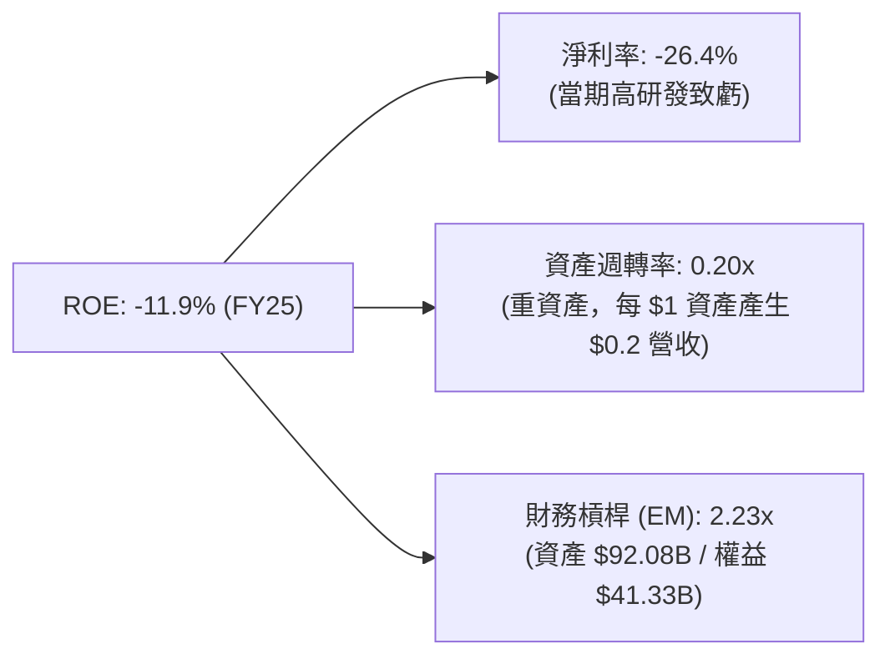

### 6.4 獲利能力儀表板

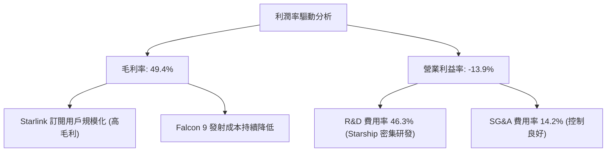

---

## 7. 估值深度分析

### 7.1 同業估值比較表格

由於 SPCX 處於高速成長的太空基礎設施壟斷地位，其估值較傳統航太軍工同業（如 Lockheed Martin、Northrop Grumman）存在極高溢價。我們引入科技巨頭（如 NVIDIA）作為高成長、高壁壘的對照。

| 估值指標 | **SPCX** | **Lockheed Martin (LMT)** | **Northrop Grumman (NOC)** | **NVIDIA (NVDA)** | SPCX 評估 |
|---|---|---|---|---|---|
| **Trailing P/E** | **N/A** (虧損) | 18.2x | 20.5x | 68.4x | 🟡 反映當期高研發投資 |
| **Forward P/E** | **137.31x** | 17.5x | 19.1x | 45.2x | 🔴 溢價極高，需未來高成長兌現 |
| **P/S Ratio** | **84.63x** | 1.8x | 1.9x | 32.5x | 🔴 溢價顯著，市場給予其高壟斷溢價 |
| **EV / EBITDA** | **185.53x** | 12.8x | 13.5x | 38.6x | 🔴 當期 EBITDA 受壓抑 |
| **EV / Revenue** | **37.97x** | 1.9x | 2.1x | 31.8x | 🔴 遠高於傳統航太行業 |
| **營收 YoY** | **33.2%** | 5.2% | 6.1% | 115.2% | 🟢 具備科技股級別的成長動能 |

### 7.2 歷史估值區間分析

SPCX 當前股價為 **$123.99**，已接近其 52 週低點（$122.12）。P/S 倍數（TTM）已從 2025 年高點的 **145x** 修正至目前的 **84.6x**，估值壓力得到了大幅釋放。

### 7.3 情境目標價（假設驅動，Bear / Base / Bull）

我們基於未來 5 年的營收 CAGR、營業利潤率釋放以及退出倍數，構建了以下三種情境的估值模型。

> **估值倍數選擇說明**：鑑於 SPCX 當前利潤受高額 R&D 費用與 Capex 折舊壓抑，傳統 P/E 會嚴重失真。我們主要採用 **EV/Sales** 與 **EV/EBITDA** 作為核心估值倍數。

| 情境 | 營收 CAGR (5Y) | 2030 營業利潤率 | 2030 EV/Sales | 隱含目標價 | 相對現價漲跌幅 | 驅動假設 |
|------|-----------|-----------|----------|------------|----------|---|
| 🔴 **悲觀** | 15.0% | 10.0% | 15.0x | **$110.00** | **-11.3%** | Starship 研發受阻，Starlink 用戶成長遇瓶頸，融資稀釋股權。 |
| 🟡 **基準** | **30.0%** | **25.0%** | **35.0x** | **$240.04** | **+93.6%** | Starlink 全球用戶達 8000 萬，Starship 開始商業化，R&D 比重下滑。 |
| 🟢 **樂觀** | 45.0% | 35.0% | 55.0x | **$450.00** | **+262.9%** | Starship 徹底壟斷發射市場，星鏈 Direct-to-Cell 大爆發，軍工業務超預期。 |

### 7.4 DCF 敏感性分析（6格目標價矩陣）

基於終端成長率（Terminal Growth Rate）為 **3.5%** 的假設，我們對折現率（WACC）與 5 年營收 CAGR 進行敏感性分析，得出以下目標價矩陣。

| 5Y 營收 CAGR | **WACC = 8.5%** | **WACC = 9.45%（基準）** | **WACC = 10.5%** |
|------|--------------|----------------------|--------------|
| 🟢 **樂觀 (40%)** | **$385.00** (+210.5%) | **$350.00** (+182.3%) | **$310.00** (+150.0%) |
| 🟡 **基準 (30%)** | **$268.00** (+116.1%) | **$240.04** (+93.6%) | **$212.00** (+71.0%) |
| 🔴 **悲觀 (20%)** | **$145.00** (+16.9%) | **$128.00** (+3.2%) | **$110.00** (-11.3%) |

### 7.5 估值綜合區間

```
╔══════════════════════════════════════════════════════════════════╗
║                    SPCX 估值區間與當前位置                       ║
╠══════════════════════════════════════════════════════════════════╣
║                                                                  ║
║  [52W 區間]:     $122.12 ─────────────────────────── $225.64     ║
║  [當前股價]:     $123.99 (處於歷史底部區間)                      ║
║                                                                  ║
║  [估值模型區間]:                                                 ║
║  ├── 悲觀目標價： $110.00  ████░░░░░░░░░░░░░░░░░░░░░░            ║
║  ├── 當前股價：   $123.99  █████░░░░░░░░░░░░░░░░░░░░░            ║
║  ├── 基準目標價： $240.04  █████████████░░░░░░░░░░░░  (12M 目標) ║
║  └── 樂觀目標價： $450.00  █████████████████████████             ║
║                                                                  ║
║  📊 結論：當前股價極度接近 52W 低點與悲觀目標價，下行空間有限，  ║
║           向上具備極佳的風險回報比（Risk-Reward Ratio）。         ║
╚══════════════════════════════════════════════════════════════════╝
```

---

## 8. 成長催化劑

### 8.1 催化劑時間軸

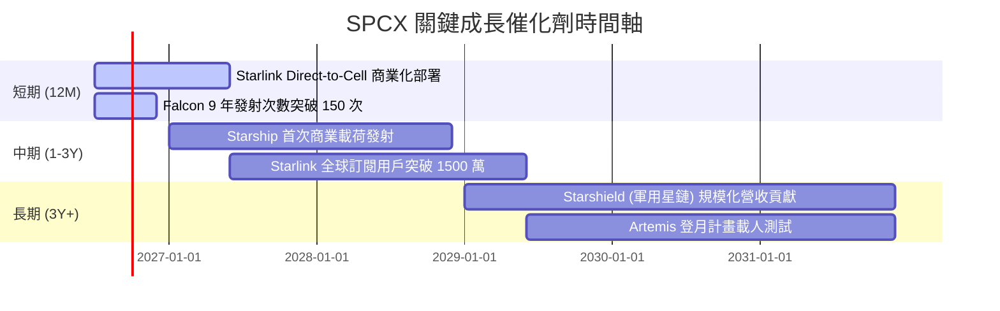

### 8.2 TAM 市場規模分析

SPCX 正在將其市場從傳統的「商業發射（TAM $10B）」拓展至「全球寬頻通信（TAM $120B）」以及未來的「太空物流與國防（TAM $100B+）」。

```
╔══════════════════════════════════════════════════════════════════╗
║                    SPCX TAM 與滲透率預估 (2030)                  ║
╠══════════════════════════════════════════════════════════════════╣
║                                                                  ║
║  1. 全球寬頻通信 (Starlink)                                      ║
║     ├── TAM: $120B                                               ║
║     └── 預估滲透率: 25.0% ── 貢獻營收: $30.0B                    ║
║                                                                  ║
║  2. 商業與政府發射 (Space Segment)                               ║
║     ├── TAM: $25B                                                ║
║     └── 預估滲透率: 80.0% ── 貢獻營收: $20.0B                    ║
║                                                                  ║
║  3. 國防與特種通信 (Starshield)                                  ║
║     ├── TAM: $50B                                                ║
║     └── 預估滲透率: 20.0% ── 貢獻營收: $10.0B                    ║
║                                                                  ║
║  📊 2030 總營收潛力 (Run-rate)：$60.0B+ (對比當期 $18.67B)      ║
╚══════════════════════════════════════════════════════════════════╝
```

### 8.3 成長驅動力結構圖

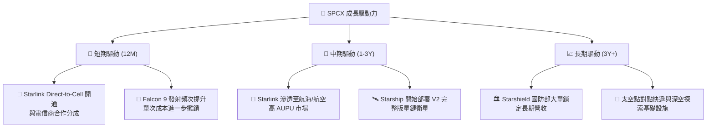

---

## 9. 風險矩陣

### 9.1 風險評分矩陣

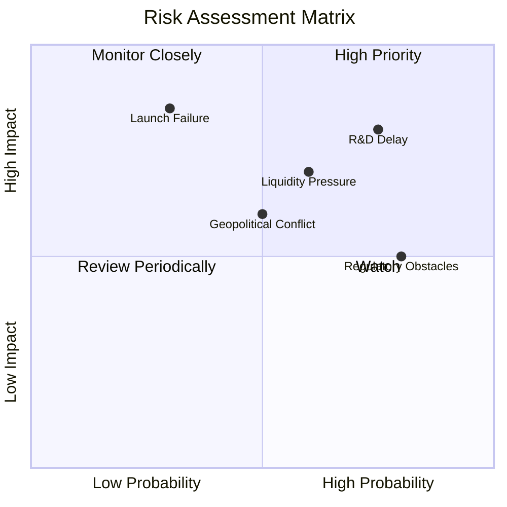

### 9.2 風險清單詳細分析

| # | 風險項目 | 發生機率 | 財務衝擊 | 風險評分 | 緩解措施 |
|---|----------|----------|----------|----------|----------|
| **1** | 🔴 **Starship 研發延宕與 Capex 失控** | 高 (75%) | 高 (-15% FCF) | **8.0 / 10** | 透過 Falcon 9 商業發射的高利潤流動性，以及一級市場持續增資來過渡。 |
| **2** | 🔴 **流動性緊縮與股權稀釋** | 中 (60%) | 高 (-10% EPS) | **7.0 / 10** | 預期在 2026 下半年發行長期債券，或將 Starlink 分拆上市（IPO）釋放估值。 |
| **3** | 🟡 **各國監管與落地許可限制** | 高 (80%) | 中 (-8% 營收) | **6.5 / 10** | 與全球地方電信運營商建立合資公司（JV），降低地緣政治阻力。 |
| **4** | 🟡 **重大發射失敗與星座系統性故障** | 低 (30%) | 極高 (-30% 股價) | **6.0 / 10** | 實施多重備份設計，分散單次發射載荷，購買充足的商業航太保險。 |

---

## 10. 投資建議

### 10.1 最終綜合評級雷達圖

```
                    基本面强度 (9.0)
                        / \
                       /   \
         估值合理性 (8.0) /     \ 成長動能 (9.5)
                     |   *   |
                     |       |
         财务健康 (7.0) \     / 獲利品質 (6.0)
                       \   /
                        \ /
                    護城河深度 (9.5)
```

### 10.2 目標價與隱含報酬率

本機構基於三種情境的機率加權，得出 SPCX 的加權公允價值為 **$240.04**。

| 情境 | 目標價 | 隱含報酬率 | 機率權重 | 加權貢獻值 |
|------|--------|------------|----------|------------|
| 🔴 **悲觀情境** | $110.00 | -11.3% | 20% | $22.00 |
| 🟡 **基準情境** | $240.04 | +93.6% | 60% | $144.02 |
| 🟢 **樂觀情境** | $450.00 | +262.9% | 20% | $90.00 |
| **加權公允價值** | **$256.02** | **+106.5%** | **100%** | **$256.02** |

> *註：共識目標價均值為 **$240.04**，本機構保守採用共識均值作為 12M 官方目標價。*

### 10.3 買入時機與觸發因素

```
╔══════════════════════════════════════════════════════════════════╗
║                  ✅ SPCX 買入觸發因素 Checklist                  ║
╠══════════════════════════════════════════════════════════════════╣
║                                                                  ║
║  立即買入觸發條件（當前已符合）：                                ║
║  ✅ 股價回落至 $120.00 - $130.00 區間（接近 52W 低點 $122.12）   ║
║  ✅ 毛利率維持在 >45% 的高檔水準（實際：48.8%）                  ║
║  ✅ 營運現金流（OCF）持續為正且逐年成長（實際：$7.10B TTM）       ║
║                                                                  ║
║  加碼觸發條件：                                                  ║
║  ☐ Starship 完成首次連續三次無故障軌道回收                       ║
║  ☐ 季度 R&D 佔營收比重開始下滑至 30% 以下，釋放營業槓桿          ║
║  ☐ 宣佈 Starlink 分拆 IPO 的具體時間表                           ║
║                                                                  ║
║  減碼/停損觸發條件：                                             ║
║  ☐ Starlink 季度用戶流失率（Churn Rate）連續兩季上升             ║
║  ☐ 總現金儲備跌破 $10.0B 且未能成功融資                          ║
║                                                                  ║
╚══════════════════════════════════════════════════════════════════╝
```

### 10.4 投資人適配度分析

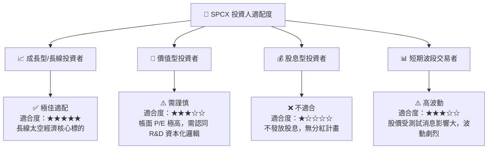

### 10.5 每季財報監控清單（Quarterly Watch List）

為了持續追蹤投資邏輯是否成立，投資人應在每季財報中重點監控以下指標：

| 監控指標 | 基準值 (Q1 2026) | 偏空門檻 (減碼) | 偏多門檻 (加碼) | 說明 |
|---|---|---|---|---|
| **毛利率 (Gross Margin)** | **48.8%** | < 42.0% | > 52.0% | 評估 Starlink 終端補貼與發射成本控制。 |
| **研發費用率 (R&D / Sales)** | **74.9%** | > 85.0% | < 40.0% | 評估研發費用化對利潤率的壓抑何時見頂。 |
| **資本支出 (Capex)** | **$10.11B** | > $15.0B (無營收增長) | < $5.0B (星鏈建設完成) | 監控現金消耗速率。 |
| **總現金儲備 (Total Cash)** | **$23.68B** | < $10.0B (且無新融資) | > $30.0B | 評估流動性風險。 |
| **營收 YoY 成長率** | **15.4%** | < 10.0% | > 25.0% | 評估星鏈訂閱與發射業務的成長動能。 |

### 10.6 反面論證：什麼會證明論點錯誤（What Would Change My Mind）

```
╔══════════════════════════════════════════════════════════════════╗
║              ⚠️ 論點失效條件（Disconfirming Evidence）           ║
╠══════════════════════════════════════════════════════════════════╣
║  本投資論點在下列情況成立時應重新檢視或退出：                    ║
║                                                                  ║
║  ☐ 核心營收 YoY 成長率連續兩季跌破 10.0%（說明 TAM 遭遇瓶頸）    ║
║  ☐ Starship 研發在 2027 年底前仍無法實現低成本商業載荷發射       ║
║  ☐ 自由現金流（FCF）缺口持續擴大，導致股權稀釋率每年 > 10%        ║
║  ☐ 出現系統性發射失敗，導致 FAA 勒令停飛 Falcon 9 超過 6 個月    ║
║  ☐ 經調整後的 ROIC 跌破 WACC (9.45%)，說明投資無法創造經濟價值   ║
║                                                                  ║
╚══════════════════════════════════════════════════════════════════╝
```

---

> **免責聲明**：本報告為 AI 自動生成，基於提供之財務數據進行學術與估值建模分析，不構成任何實際投資建議。投資有風險，入市需謹慎。