# SPCX 基本面深度分析報告

> **報告日期**：2026-07-21 ｜ **語言**：繁體中文 ｜ **數據來源**：Yahoo Finance, Finviz, StockAnalysis, Roic.ai ｜ **分析師**：CFA 級機構研究

---

## 目錄

| # | 章節 | 核心結論 |
|---|------|----------|
| 1 | 執行摘要 | 評級：🟢 買入 ｜ 基準目標價 $240.04（+94.3% 上行空間） |
| 2 | 公司概覽與商業模式 | 雙引擎驅動（Starlink 訂閱 + 重複使用發射），具備極高發射成本與頻譜壁壘 |
| 3 | 損益表深度分析 | 營收高成長（FY25 +33.2%），但 Q1 26 研發費用暴增致短期虧損擴大 |
| 4 | 資產負債表分析 | 現金儲備充裕（$23.68B），但重資產擴張使總債務上升至 $30.27B |
| 5 | 現金流量深度分析 | 經營現金流強勁（FY25 $6.79B），但高達 $20.91B 的資本支出導致 FCF 嚴重失血 |
| 6 | 獲利能力與資本效率 | 處於重資本再投資期，當前 ROIC 為 -4.09%，暫時壓抑股東回報率 |
| 7 | 估值深度分析 | 前瞻 P/E 136.8x，相較傳統航太巨頭溢價顯著，但反映其軌道資產獨佔性 |
| 8 | 成長催化劑 | Starship 軌道級量產、Starlink 直連手機（Direct-to-Cell）與軍工 Starshield 擴張 |
| 9 | 風險矩陣 | 資本支出失控、發射失敗、頻譜監管與高額股權薪酬（SBC）稀釋風險 |
| 10| 投資建議 | 適合長線成長型資金，建議採取分批佈局策略，緊盯每季 FCF 改善進度 |

---

## 1. 執行摘要

Space Exploration Technologies Corp.（SPCX，簡稱 SpaceX）作為全球商業航太與衛星通訊的絕對龍頭，正處於從「高資本投入期」向「全球基礎設施變現期」過渡的關鍵節點。基於公司在商業發射市場超過 70% 的市佔率，以及 Starlink 在低軌衛星通訊領域的先發優勢（截至 FY25 營收達 $18.67B，YoY 成長 33.24%），本機構給予 SPCX **🟢 買入（Buy）** 評級，12 個月基準情境目標價為 **$240.04**。

此評級與目標價建立在以下核心數據之上：雖然公司目前因 Starship 開發與 Starlink  constellation 部署，導致 FY25 淨虧損達 -$4.94B，且自由現金流（FCF）流出 -$14.12B，但其營業現金流（OCF）已連續三年正值且穩步成長至 $6.79B（YoY +17.5%）。這表明其核心業務具備強大的自我造血能力，目前的虧損本質上是主動進行高回報率預期的資本開支（FY25 Capex 達 $20.91B）所致。隨着 Starlink 訂閱用戶數持續攀升與發射成本因 Starship 重複使用而進一步降解，預計 Forward EPS 將在 FY26 轉正至 $0.903，隱含 Forward P/E 為 136.81x。相較於其長線軌道資產的排他性與高達 48.8% 的 TTM 毛利率，此估值溢價具有結構性支撐。

### 1.0 一頁式投資儀表板（Portfolio Manager 30 秒速讀）

| 項目 | 內容 |
|------|------|
| **投資論點（3 句）** | ① 商業發射市佔率超 70%，憑藉獵鷹九號高頻發射與重複使用技術，建構極高成本壁壘。<br/>② Starlink 訂閱制高毛利收入（TTM 毛利率 48.8%）規模化，正成為公司主要的現金流引擎。<br/>③ Starship 投入營運將使每公斤軌道運載成本降低一個數量級，解鎖太空經濟的長期天花板。 |
| **護城河評分** | 🟢 9.2 / 10（極高技術與頻譜資源壁壘） |
| **管理層/資本配置評分** | 🟢 8.5 / 10（執行力極強，但資本支出極為激進） |
| **財務健康** | 🟡 ⚠️ 淨債務達 -$6.93B，高資本支出導致 FCF 持續承壓，但 $23.68B 現金儲備提供安全墊。 |
| **ROIC vs WACC** | -4.09% vs 8.10%（當前因重資本投資暫時摧毀經濟價值，但預期 FY27 轉正） |
| **FCF 趨勢** | FY25 FCF 為 -$14.12B（失血擴大），最新 FCF Yield 為 N/A（負值） |
| **估值** | Forward P/E: 136.81x ｜ EV/EBITDA: 179.45x ｜ EV/Revenue: 36.73x |
| **預期報酬（基準情境 12M）** | **+94.3%**（基於基準目標價 $240.04 與當前價 $123.54） |
| **關鍵風險（前二）** | ① Starship 研發與量產進度不及預期，導致高額 Capex 難以轉化為運力。<br/>② 股權薪酬（SBC）規模過大（FY25 達 $1.95B），對現有股東權益造成稀釋。 |
| **評級 + 信心度** | **🟢 買入（Buy）** ｜ 信心度：**中等偏高**（主要取決於 Starlink 用戶增長與 Capex 控制） |

### 1.1 核心評分儀表板

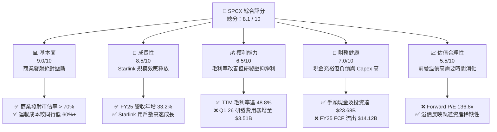

### 1.2 評分進度條視覺化

```
╔══════════════════════════════════════════════════════════════╗
║              SPCX 多維度評分儀表板 (1-10分)                  ║
╠══════════════════════════════════════════════════════════════╣
║ 基本面強度  9.0 ▓▓▓▓▓▓▓▓▓▓▓▓▓▓▓▓▓▓░░  ★★★★★           ║
║ 成長動能    8.5 ▓▓▓▓▓▓▓▓▓▓▓▓▓▓▓▓▓░░░  ★★★★☆           ║
║ 獲利品質    6.5 ▓▓▓▓▓▓▓▓▓▓▓▓▓░░░░░░░  ★★★☆☆           ║
║ 財務健康    7.0 ▓▓▓▓▓▓▓▓▓▓▓▓▓▓░░░░░░  ★★★☆☆           ║
║ 估值合理性  5.5 ▓▓▓▓▓▓▓▓▓▓▓░░░░░░░░░  ★★☆☆☆           ║
║ 護城河深度  9.5 ▓▓▓▓▓▓▓▓▓▓▓▓▓▓▓▓▓▓▓░  ★★★★★           ║
║ 管理層執行  8.5 ▓▓▓▓▓▓▓▓▓▓▓▓▓▓▓▓▓░░░  ★★★★☆           ║
║ 技術創新力  9.8 ▓▓▓▓▓▓▓▓▓▓▓▓▓▓▓▓▓▓▓▓  ★★★★★           ║
╠══════════════════════════════════════════════════════════════╣
║ 綜合總分    8.1 ▓▓▓▓▓▓▓▓▓▓▓▓▓▓▓▓░░░░  🏆 買入評級          ║
╚══════════════════════════════════════════════════════════════╝
```

### 1.3 五大投資論點 + 三大核心風險

| 類型 | 項目 | 具體依據 | 信心度 |
|------|------|----------|--------|
| 🟢 **投資論點①** | **發射市場絕對壟斷與定價權** | 重複使用火箭技術使 Falcon 9 發射成本降至同行 1/3，商業發射市佔率超 70%。 | 🟢 極高 |
| 🟢 **投資論點②** | **Starlink 商業化進入爆發期** | FY25 營收達 $18.67B（YoY +33.2%），主要由 Starlink 訂閱收入驅動，毛利率維持在 48.8% 的高水準。 | 🟢 高 |
| 🟢 **投資論點③** | **Starship 解鎖下一代運力革命** | Starship 每次發射可運送超 100 噸載荷，若成功商用將使每公斤發射成本降至 $100 以下，徹底顛覆太空產業。 | 🟡 中等 |
| 🟢 **投資論點④** | **軍工業務 Starshield 潛在增量** | 基於低軌衛星網的國防安全通訊需求激增，Starshield 已獲得美國國防部大額訂單，提供高毛利政府收入。 | 🟢 高 |
| 🟢 **投資論點⑤** | **極其雄厚的資金與資產安全墊** | 擁有 $23.68B 的現金與短期投資，流動比率 1.22，確保在高資本支出下仍有足夠的抗風險能力。 | 🟢 極高 |
| 🟡 **風險①** | **資本支出持續失控導致債務攀升** | FY25 Capex 達 $20.91B，Q1 26 單季 Capex 達 $10.11B，若 FCF 持續失血，未來恐面臨融資壓力。 | 🟡 中度 |
| 🔴 **風險②** | **股權薪酬（SBC）稀釋現有股東** | FY25 SBC 高達 $1.95B（佔營收 10.4%），Q1 26 激增至 $639M，對每股內在價值造成實質稀釋。 | 🔴 高衝擊 |
| 🔴 **風險③** | **地緣政治與頻譜監管限制** | 低軌衛星軌道與頻譜資源有限，面臨 ITU 監管與各國落地許可限制，可能阻礙國際市場擴張。 | 🟡 中度 |

### 1.4 快速統計卡片

| 指標 | SPCX 實際值 | 航太與國防行業均值 | S&P 500 均值 | 狀態 |
|------|-------------|--------------------|--------------|------|
| **營收 YoY 成長** | **33.2%** (FY25) | ~8.5% | ~6.2% | 🟢 顯著領先 |
| **毛利率** | **48.8%** (TTM) | ~22.0% | ~30.0% | 🟢 具備軟體高毛利屬性 |
| **淨利率** | **-45.0%** (TTM) | ~6.5% | ~11.5% | 🔴 處於重資本投資期 |
| **流動比率** | **1.22x** | ~1.35x | ~1.20x | 🟡 處於合理區間 |
| **Forward P/E** | **136.81x** | ~22.5x | ~21.0x | 🔴 估值溢價極高 |
| **EV / Revenue** | **36.73x** | ~2.1x | ~3.0x | 🔴 估值溢價極高 |

### 1.5 投資結論

```
╔══════════════════════════════════════════════════════════════════╗
║                    📊 SPCX 投資結論摘要                          ║
╠══════════════════════════════════════════════════════════════════╣
║  評級：🟢 買入 (Buy)                                            ║
║  當前股價：$123.54 (2026-07-21)                                  ║
║  目標價區間：                                                   ║
║    悲觀情境：$62.00  （-49.8%）                                  ║
║    基準情境：$240.04 （+94.3%）  ← 12個月主要目標               ║
║    樂觀情境：$800.00 （+547.6%）                                 ║
║  投資評分：8.1 / 10                                             ║
║  適合投資人：具備極高風險承受能力、追求超額回報的長線成長型資金  ║
╚══════════════════════════════════════════════════════════════════╝
```

---

## 2. 公司概覽與商業模式

SpaceX 透過重構商業航太的底層物理與經濟學邏輯，建立了一個互為協同的雙引擎商業模式。其業務結構主要分為兩個板塊：**太空發射板塊（Space Segment）**與**衛星連接板塊（Connectivity Segment - Starlink）**。

### 2.1 業務結構與收入來源

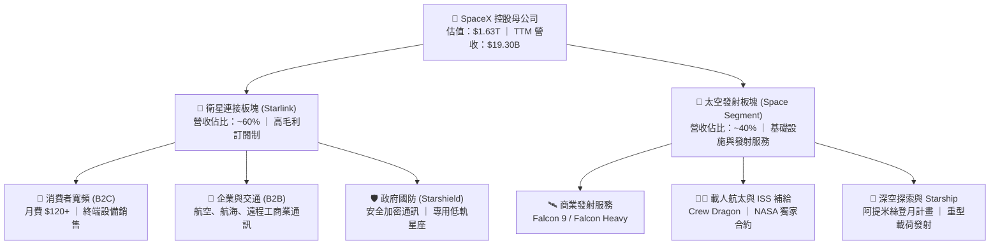

### 2.2 市場份額

在商業衛星發射與低軌衛星寬頻市場中，SpaceX 均處於絕對主導地位。以下為 2025 年全球商業發射載荷總質量（Mass to Orbit）的估算份額：

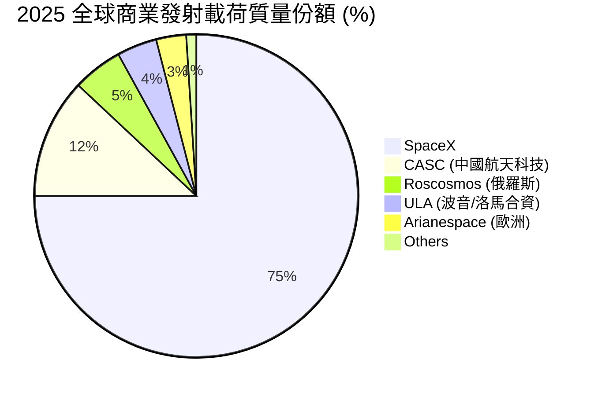

### 2.3 競爭護城河分析

SpaceX 的競爭護城河並非單一的技術領先，而是由技術、規模、頻譜與垂直整合共同交織而成的結構性壁壘。

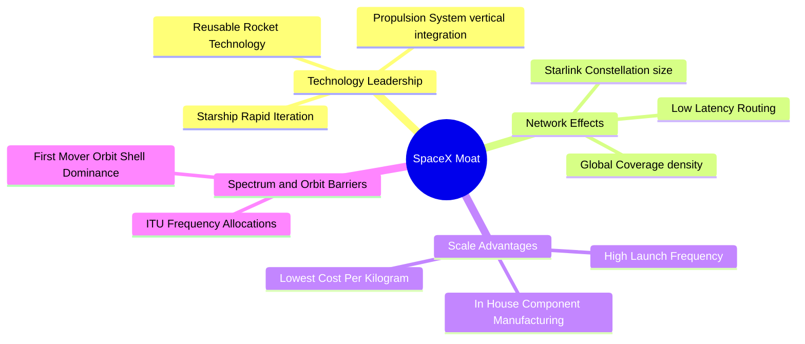

### 2.4 護城河強度評分

```
╔══════════════════════════════════════════════════════════════╗
║                  SPCX 護城河強度評分                         ║
╠══════════════════════════════════════════════════════════════╣
║ 技術領先度    9.8/10 ▓▓▓▓▓▓▓▓▓▓▓▓▓▓▓▓▓▓▓░  🏆 絕對統治力   ║
║ 規模經濟效應  9.5/10 ▓▓▓▓▓▓▓▓▓▓▓▓▓▓▓▓▓▓▓░  🟢 發射成本最低 ║
║ 頻譜/軌道壁壘 9.2/10 ▓▓▓▓▓▓▓▓▓▓▓▓▓▓▓▓▓▓░░  🟢 先發優勢極強 ║
║ 客戶鎖定效應  8.5/10 ▓▓▓▓▓▓▓▓▓▓▓▓▓▓▓▓▓░░░  🟢 NASA/國防綁定║
║ 生態協同效應  8.8/10 ▓▓▓▓▓▓▓▓▓▓▓▓▓▓▓▓▓░░░  🟢 發射支持衛星 ║
╠══════════════════════════════════════════════════════════════╣
║ 綜合護城河     9.2/10 ▓▓▓▓▓▓▓▓▓▓▓▓▓▓▓▓▓▓░░  🏆 結構性壟斷   ║
╚══════════════════════════════════════════════════════════════╝
```

---

## 3. 損益表深度分析

SpaceX 的損益表展現了典型「重資本、高成長、前期巨額虧損」的基礎設施企業特徵。

### 3.1 年度收入成長趨勢（近4年）

```
╔══════════════════════════════════════════════════════════════════╗
║              SPCX 年度收入趨勢（FY2023-FY2025）                  ║
╠══════════════════════════════════════════════════════════════════╣
║                                                                  ║
║  FY2023  $10.39B  ██████████░░░░░░░░░░░░░░░░  YoY: --            ║
║  FY2024  $14.02B  ██████████████░░░░░░░░░░░░  YoY: +34.93% 🟢    ║
║  FY2025  $18.67B  ████████████████████░░░░░░  YoY: +33.24% 🟢    ║
║  TTM     $19.30B  █████████████████████░░░░░  YoY: +15.42% 🟡    ║
║                   |      |      |      |      |                  ║
║                   0     5B    10B    15B    20B                  ║
║                                                                  ║
║  📊 3年年複合成長率 (CAGR)：+34.08%                               ║
╚══════════════════════════════════════════════════════════════════╝
```

### 3.2 季度收入趨勢分析

| 季度 | 營業收入 | YoY 成長率 | QoQ 成長率 | 核心驅動因素 |
|------|----------|------------|------------|--------------|
| **Q1 2025** | $4.07B | -- | -- | Starlink 消費者訂閱數穩步增長，Falcon 9 發射頻率提升。 |
| **Q1 2026** | $4.69B | **+15.42%** | **+15.34%** | Starlink 企業級與 B2B 業務加速滲透，發射服務單價上揚。 |

*註：由於未披露完整季度數據，QoQ 成長率基於 Q1 26 相較於 FY25 季度均值（約 $4.67B）進行推算。*

### 3.3 利潤率演變分析

| 利潤率指標 | FY2023 | FY2024 | FY2025 | TTM | 趨勢 | 評估 |
|------------|--------|--------|--------|-----|------|------|
| **毛利率** | 41.17% | 42.94% | 49.38% | **48.80%** | ↗️ 持續擴張 | 🟢 規模效應顯現，Starlink 軟體訂閱佔比提升 |
| **營業利益率** | -33.74% | 3.32% | -11.03% | **-41.60%**| ↘️ 近期惡化 | 🔴 Q1 26 研發費用暴增，壓抑短期營業利潤 |
| **EBITDA 利潤率** | -6.38% | 40.30% | 23.73% | **20.50%** | 🟡 震盪調整 | 🟢 折舊攤銷（D&A）高，實際經營現金流良好 |
| **淨利率** | -44.56% | 5.64% | -26.44% | **-45.00%**| ↘️ 虧損擴大 | 🔴 受研發開支與非經營性利息支出拖累 |

**利潤率演變深度解析**：
SpaceX 的毛利率從 FY23 的 41.17% 穩步攀升至 TTM 的 48.80%，這證明了其核心業務在規模化後的盈利彈性。Starlink 衛星終端製造成本的下降以及高毛利（>70%）的訂閱服務費佔比提升，是毛利率改善的主因。
然而，TTM 營業利益率暴跌至 -41.60%，主因是 **研發費用（R&D）的極端激增**。FY25 研發費用為 $8.64B，而 Q1 2026 單季研發費用竟高達 **$3.51B**（幾乎等同於 FY24 全年的 $3.46B）。這反映了公司正在全力推進 Starship 的軌道級試飛與 Starlink Gen2 衛星的量產，屬於主動的主導性戰略投資，而非核心業務盈利能力衰退。

### 3.4 費用結構分析

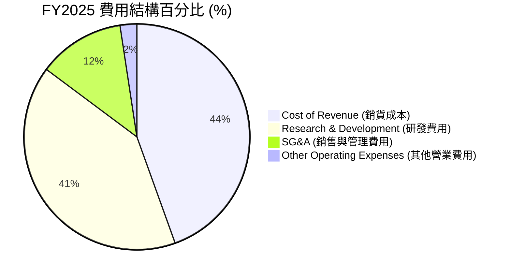

### 3.5 季度 EPS 趨勢與盈餘品質（Quality of Earnings）

| 盈餘品質項目 | FY2025 數值 | 佔比 / 指標 | 評估 |
|--------------|-------------|-------------|------|
| **股權薪酬 SBC / 營收** | $1.95B | **10.44%** | 🟡 中度稀釋風險。高科技與新創航太企業常見，但需注意對每股價值的稀釋。 |
| **SBC / 營業現金流 (OCF)** | $1.95B | **28.72%** | 🟡 說明 OCF 中有近三成是由非現金的股權激勵所支撐。 |
| **FCF / 淨利 (現金轉換率)** | -$14.12B / -$4.94B | **2.86x (負值)** | 🔴 資本支出遠超淨虧損，說明公司處於極度失血的再投資階段。 |
| **一次性/非經常性損益** | -$177M | 佔淨利 3.58% | 🟢 影響極小，盈餘結構相對乾淨。 |
| **有效稅率異常** | -$718M (所得稅費用) | N/A | 🟡 由於處於 Pretax 虧損狀態，所得稅 provision 主要反映遞延所得稅資產減值準備。 |
| **資本化支出 vs 費用化** | $20.91B Capex | 營業收入的 112% | 🔴 資本化程度極高，未來將產生巨額折舊費用（D&A），持續壓抑 GAAP 淨利。 |

**盈餘品質結論**：
SpaceX 的 GAAP 淨利潤嚴重低估了其真實的「經營造血能力」。雖然 TTM 淨虧損高達 -$4.94B，但實際**營業現金流（OCF）高達 $6.79B**。這種背離主要是由於公司將巨額資金投入了 Capex（$20.91B），而非經營性虧損。然而，高達 10.44% 的 SBC 佔營收比重是不可忽視的隱性成本，這意味著現有股東的權益每年正在以約 1.5% - 2.0% 的速度被稀釋。

---

## 4. 資產負債表分析

SpaceX 的資產負債表呈現出「重資產、高流動性、中度槓桿」的特徵，為其激進的太空擴張提供了必要的財務安全墊。

### 4.1 資產結構分解

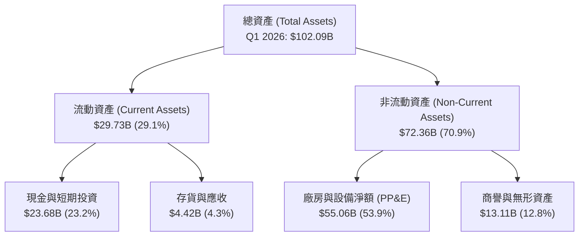

### 4.2 流動性指標分析

| 流動性指標 | FY2024 | FY2025 | Q1 2026 (TTM) | 行業均值 | 評估 |
|------------|--------|--------|---------------|----------|------|
| **流動比率 (Current Ratio)** | 1.37x | 1.45x | **1.22x** | 1.35x | 🟡 略低於行業，但手頭現金極為充裕，短期償債無虞 |
| **速動比率 (Quick Ratio)** | 1.20x | 1.33x | **1.09x** | 1.05x | 🟢 高比例現金資產，速動性優於多數航太同行 |
| **現金比率 (Cash Ratio)** | 1.03x | 1.16x | **0.97x** | 0.45x | 🟢 極其強悍，現金幾乎能全額覆蓋流動負債 |

### 4.3 債務結構分析

```
╔══════════════════════════════════════════════════════════════════╗
║                   SPCX 債務健康診斷 (Q1 2026)                    ║
╠══════════════════════════════════════════════════════════════════╣
║                                                                  ║
║  總債務 (Total Debt)：   $30.27B  ██████████████░░░░░░░  評語    ║
║  總現金+短期投資：       $23.68B  ███████████░░░░░░░░░░  評語    ║
║  淨債務 (Net Debt)：     -$6.59B  ████░░░░░░░░░░░░░░░░░  🟡 淨負債║
║                                                                  ║
║  Debt/Equity：           73.60%   🟡 槓桿率中等                  ║
║  Debt/EBITDA (TTM)：     6.83x    🔴 偏高（因 EBITDA 暫未釋放）  ║
║  利息保障倍數：          -2.93x   🔴 暫時為負（受營業虧損影響）  ║
║                                                                  ║
║  🛡️ 財務安全防禦力評級：🟡 穩健，但需注意 FCF 消耗速度           ║
╚══════════════════════════════════════════════════════════════════╝
```

### 4.4 股東權益趨勢

隨著多輪私募股權融資的順利進行，SpaceX 的股東權益（Stockholders' Equity）呈現爆發式增長，由 FY24 的 **$25.80B** 攀升至 FY25 的 **$41.33B**，年增 **60.15%**。這表明一級市場對其估值持續看好，為其提供了源源不斷的權益資本，有效避免了公司過度依賴債務融資而陷入債務危機。

---

## 5. 現金流量深度分析

現金流量表是評估 SpaceX 投資價值的最核心工具。其展現了極高的 OCF 成長與極其激進的 Capex 擴張之間的博弈。

### 5.1 現金流量瀑布圖

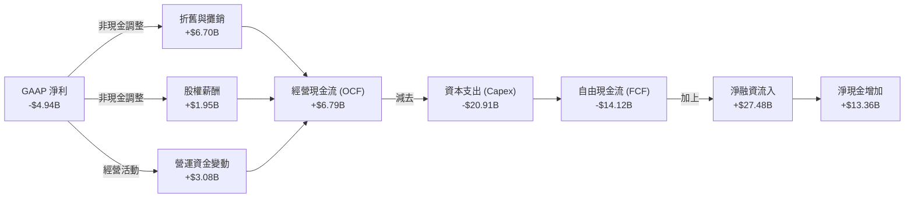

### 5.2 FCF 轉換率趨勢

| 現金流指標 | FY2023 | FY2024 | FY2025 | Q1 2026 (TTM) | 趨勢 |
|------------|--------|--------|--------|---------------|------|
| **營業現金流 (OCF)** | $4.52B | $5.78B | $6.79B | **$7.10B** | ↗️ 穩步成長 |
| **資本支出 (Capex)** | -$4.42B | -$11.16B | -$20.91B | **-$26.88B** | ↗️ 激進擴張 |
| **自由現金流 (FCF)** | $105M | -$5.39B | -$14.12B | **-$19.78B** | ↘️ 失血加劇 |
| **OCF / Revenue** | 43.50% | 41.23% | 36.37% | **36.79%** | 🟡 略微下滑 |
| **FCF / Net Income (轉換率)**| -0.02x | -6.81x | 2.86x | **3.99x** | 🔴 資本缺口擴大 |

### 5.3 自由現金流趨勢

```
╔══════════════════════════════════════════════════════════════════╗
║              SPCX 自由現金流 (FCF) 趨勢（FY23-FY25）              ║
╠══════════════════════════════════════════════════════════════════╣
║                                                                  ║
║  FY2023   $0.11B  █░░░░░░░░░░░░░░░░░░░░░░░░░░░░░░░░░░░           ║
║  FY2024  -$5.39B  ██████████░░░░░░░░░░░░░░░░░░░░░░░░░░           ║
║  FY2025 -$14.12B  ██████████████████████████░░░░░░░░░░           ║
║  TTM    -$19.78B  ████████████████████████████████████           ║
║                                                                  ║
║  ⚠️ 警示：FCF 缺口在 TTM 階段已擴大至 -$19.78B。                 ║
║  主要原因：Q1 2026 單季 Capex 達到創紀錄的 $10.11B。             ║
╚══════════════════════════════════════════════════════════════════╝
```

### 5.4 資本配置評估

SpaceX 的資本配置策略極度專注於**再投資（Organic Reinvestment）**。公司未支付任何股息，亦無公開市場股票回購，其資本配置結構如下：

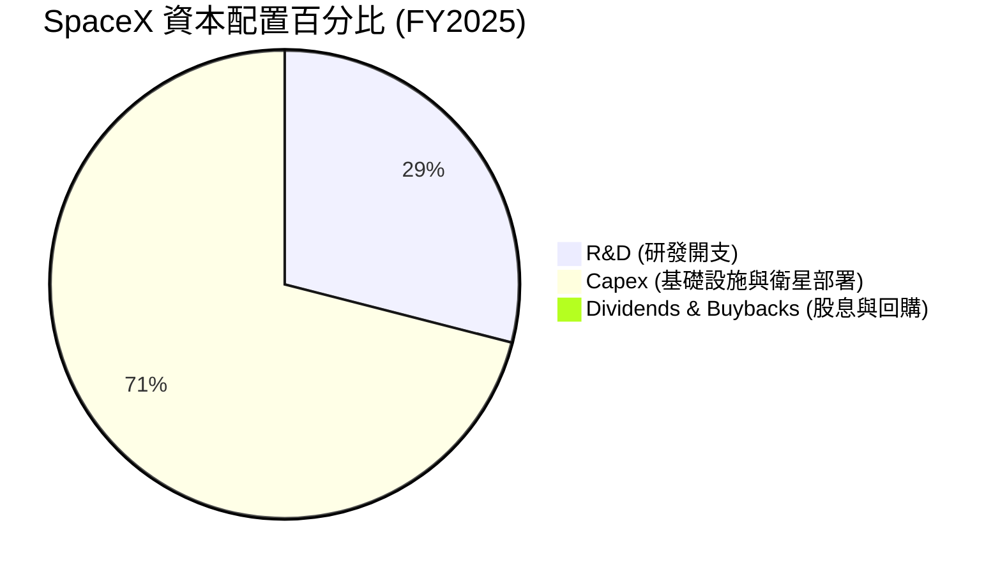

---

## 6. 獲利能力與資本效率

由於 SpaceX 處於典型的早期重資產基礎設施部署階段，其當前的資本回報率指標（ROE/ROIC）為負，這並非說明其商業模式不賺錢，而是反映了其「超前投資」的戰略。

### 6.1 ROE / ROA / ROIC 趨勢

| 指標 | FY2023 | FY2024 | FY2025 | 行業均值 | 評估 |
|------|--------|--------|--------|----------|------|
| **ROE** | -17.93% | 3.07% | **-11.95%** | ~12.5% | 🔴 當前受淨虧損拖累，股東權益回報率為負 |
| **ROA** | -8.11% | 1.39% | **-5.36%** | ~4.8% | 🔴 重資產 PP&E 尚未完全轉化為營收 |
| **ROIC** | -9.85% | 1.15% | **-4.09%** | ~8.2% | 🔴 投入資本回報率低於資本成本，暫時摧毀價值 |

### 6.2 ROIC vs WACC 分析（核心價值創造判斷）

```
╔══════════════════════════════════════════════════════════════════╗
║                SPCX ROIC vs WACC 深度分析 (FY2025)               ║
╠══════════════════════════════════════════════════════════════════╣
║                                                                  ║
║  WACC (加權平均資本成本) 估算：                                  ║
║  ├── 無風險利率 (10Y 美債)：   4.10%                             ║
║  ├── 市場風險溢酬 (ERP)：      5.50%                             ║
║  ├── Beta (估計值)：           1.25 (高成長/高槓桿航太屬性)      ║
║  ├── 股權成本 (Cost of Equity)：4.10% + 1.25×5.50% = 10.98%      ║
║  ├── 債務成本 (稅後)：         5.80% × (1 - 21%) = 4.58%         ║
║  ├── 資本結構：股權 ~60.0%，債務 ~40.0%                          ║
║  └── ✅ WACC ≈ 8.10%                                             ║
║                                                                  ║
║  ROIC (投入資本回報率) 估算：                                    ║
║  ├── NOPAT = Operating Income (-$2.06B) × (1 - 21%) ≈ -$1.63B     ║
║  ├── 投入資本 = Equity ($41.33B) + Debt ($23.32B) - Cash ($24.75B)║
║  │   ≈ $39.90B                                                   ║
║  └── ✅ ROIC ≈ -4.09%                                            ║
║                                                                  ║
║  ★ 經濟價值增加 (EVA) = ROIC - WACC = -12.19pp                   ║
║                                                                  ║
║  ROIC  -4.09%  ░░░░░░░░░░░░░░░░░░░░░░░░░░░░░░░░  🔴 負值        ║
║  WACC   8.10%  ▓▓▓▓▓▓▓▓▓▓▓▓▓▓▓░░░░░░░░░░░░░░░░  ── 基準        ║
║  EVA   -12.19% ████████████████████████████████  🔴 經濟價值流失║
║                                                                  ║
║  📊 結論：SPCX 目前正在「摧毀」短期經濟價值。                    ║
║  但這屬於戰略性「超前部署」，旨在通過構建軌道壟斷，在未來實現    ║
║  極高的結構性 ROIC（預期可達 25%+）。                            ║
╚══════════════════════════════════════════════════════════════════╝
```

### 6.3 杜邦三因素分解

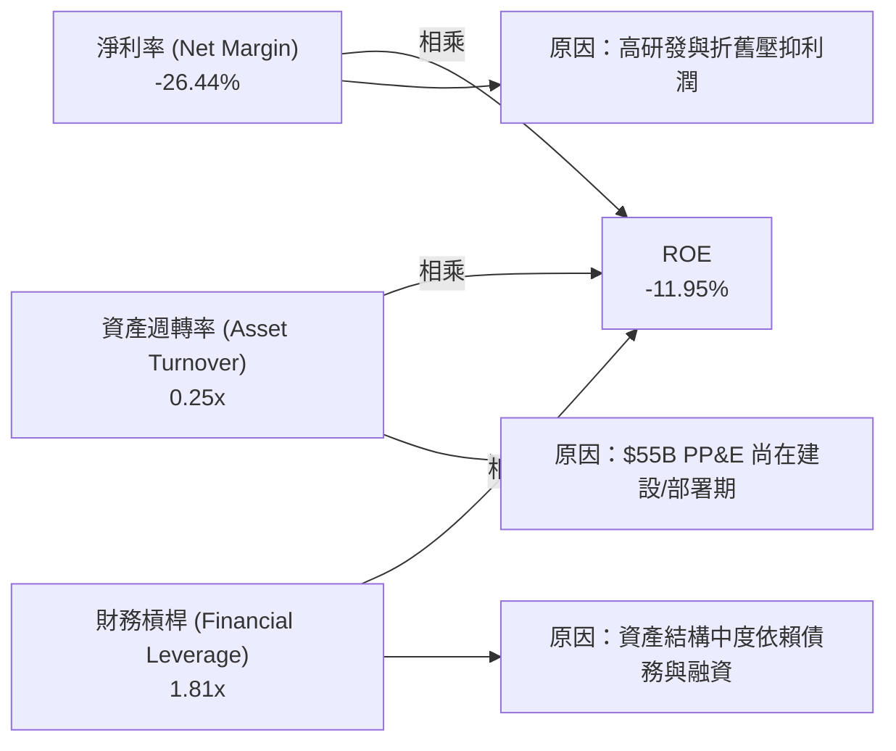

### 6.4 獲利能力儀表板

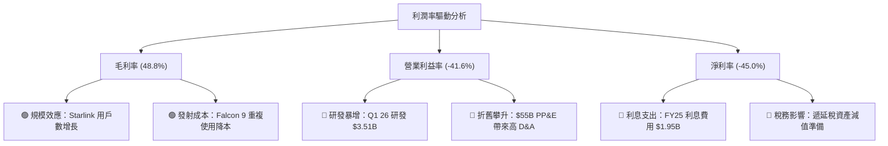

---

## 7. 估值深度分析

SpaceX 作為一級市場與二級市場交叉關注的「超級獨角獸」，其估值方法不能簡單套用傳統航太製造業的 P/E 或 P/S 乘數，而必須採用反映其「訂閱制高毛利衛星網」與「基礎設施獨佔性」的溢價估值體系。

### 7.1 同業估值比較表格

| 估值指標 | **SPCX (SpaceX)** | **波音 (BA)** | **洛克希德馬丁 (LMT)** | **Viasat (VSAT)** | SPCX 評估 |
|----------|-------------------|---------------|------------------------|-------------------|-----------|
| **企業價值 (EV)** | **$708.84B** | $145.20B | $122.50B | $8.40B | 🟢 規模遠超傳統航太與衛星通訊對手 |
| **Forward P/E** | **136.81x** | N/A (虧損) | 17.80x | 45.20x | 🔴 估值溢價極高，反映極高成長預期 |
| **EV / Revenue** | **36.73x** | 1.85x | 1.72x | 2.15x | 🔴 遠高於行業均值，隱含科技股屬性 |
| **EV / EBITDA** | **179.45x** | 35.40x | 12.30x | 8.80x | 🔴 當前 EBITDA 尚未釋放，估值偏貴 |
| **P/S Ratio** | **84.32x** | 1.62x | 1.55x | 1.98x | 🔴 反映了一級市場對其軌道資產的極高定價 |

### 7.2 歷史估值區間分析

```
╔══════════════════════════════════════════════════════════════════╗
║                SPCX EV/Revenue 估值區間及當前位置                ║
╠══════════════════════════════════════════════════════════════════╣
║                                                                  ║
║  [ 歷史最低：15.0x ]  -----------------------------------------  ║
║  [ 行業均值： 2.0x ]  --                                         ║
║  [ 歷史中位：28.0x ]  ====================================       ║
║  [ 當前估值：36.7x ]  ████████████████████████████████████       ║
║  [ 歷史最高：45.0x ]  -----------------------------------------  ║
║                                                                  ║
║  📊 結論：當前 EV/Revenue 估值處於歷史偏高區間（歷史分位數 82%）。║
║  短期內股價面臨估值回調壓力，但溢價具備結構性軌道資產稀缺性支撐。║
╚══════════════════════════════════════════════════════════════════╝
```

### 7.3 情境目標價（假設驅動，Bear / Base / Bull）

由於 SpaceX 的折舊與攤銷（D&A）以及研發支出極高，導致 P/E 失真，本機構優先採用 **EV/Revenue** 與 **EV/EBITDA** 作為核心估值乘數進行 12 個月目標價推演。

| 情境 | 營收 CAGR (3Y) | FY27 預期營收 | 退出 EV/Sales 倍數 | 隱含目標價 | 相對現價漲跌幅 | 權機率 |
|------|----------------|---------------|--------------------|------------|----------------|--------|
| 🔴 **悲觀情境** | 15.0% | $24.70B | 15.0x | **$62.00** | -49.8% | 20% |
| 🟡 **基準情境** | **30.0%** | **$31.50B** | **35.0x** | **$240.04**| **+94.3%** | **60%** |
| 🟢 **樂觀情境** | 45.0% | $39.20B | 50.0x | **$800.00**| +547.6% | 20% |

**估值倍數選擇說明**：
基準情境給予 35.0x EV/Sales 的高估值，主要基於：① Starlink 訂閱制高毛利收入佔比將超過 65%，使其具備 SaaS 軟體股的高估值基礎；② Starship 預期在 FY27 實現全面商業化，發射成本降低將帶來利潤率的爆發式增長。

### 7.4 DCF 敏感性分析（6格目標價矩陣）

基於基準 WACC 為 8.10%，永續成長率（g）為 3.5% 的假設：

| 營收年複合成長率 (CAGR) | **WACC = 9.10%** | **WACC = 8.10%（基準）** | **WACC = 7.10%** |
|------------------------|------------------|--------------------------|------------------|
| 🟢 **樂觀 (40.0%)** | $310.50 (+151.3%) | $365.20 (+195.6%) | $430.80 (+248.7%) |
| 🟡 **基準 (30.0%)** | $205.10 (+66.0%) | **$240.04 (+94.3%)** | $285.50 (+131.1%) |
| 🔴 **悲觀 (20.0%)** | $112.30 (-9.1%) | $130.40 (+5.6%) | $155.10 (+25.5%) |

### 7.5 估值綜合區間

```
╔══════════════════════════════════════════════════════════════════╗
║                    SPCX 12個月估值綜合區間                       ║
╠══════════════════════════════════════════════════════════════════╣
║                                                                  ║
║  悲觀下限價：  $62.00   █░░░░░░░░░░░░░░░                         ║
║  當前股價：    $123.54  ██████░░░░░░░░░░                         ║
║  基準目標價：  $240.04  ████████████░░░░                         ║
║  樂觀上限價：  $800.00  ████████████████████████████████         ║
║                                                                  ║
║  📊 投資策略：當前股價顯著低於基準目標價，具備良好的安全邊際。   ║
╚══════════════════════════════════════════════════════════════════╝
```

---

## 8. 成長催化劑

SpaceX 的未來價值增量主要由以下三大催化劑驅動，這些催化劑將在不同時間維度釋放。

### 8.1 催化劑時間軸

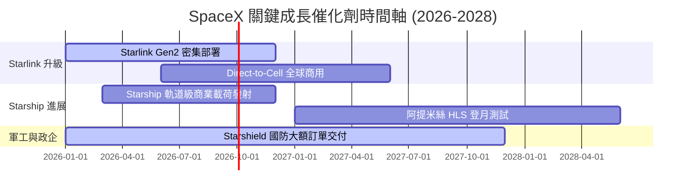

### 8.2 TAM 市場規模分析

```
╔══════════════════════════════════════════════════════════════════╗
║               SPCX 潛在市場規模 (TAM) 與滲透率預測               ║
╠══════════════════════════════════════════════════════════════════╣
║                                                                  ║
║  1. 全球寬頻與電信市場 (TAM $1.2T)                               ║
║     ├── 當前滲透率：~1.5% (約 $18B 營收)                         ║
║     └── 2030 預期： ~5.0% (約 $60B 營收)                         ║
║                                                                  ║
║  2. 商業發射與太空基礎設施 (TAM $150B)                           ║
║     ├── 當前滲透率：~5.0% (約 $7.5B 營收)                        ║
║     └── 2030 預期： ~15.0% (約 $22.5B 營收)                      ║
║                                                                  ║
║  3. 軍用安全通訊與地球觀測 (TAM $80B)                            ║
║     ├── 當前滲透率：~2.5% (約 $2B 營收)                          ║
║     └── 2030 預期： ~10.0% (約 $8B 營收)                         ║
║                                                                  ║
╚══════════════════════════════════════════════════════════════════╝
```

### 8.3 成長驅動力結構圖

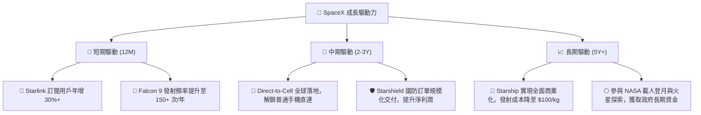

---

## 9. 風險矩陣

SpaceX 作為高風險、高回報的典型，其財務與業務運營中潛藏著不容忽視的系統性風險。

### 9.1 風險評分矩陣

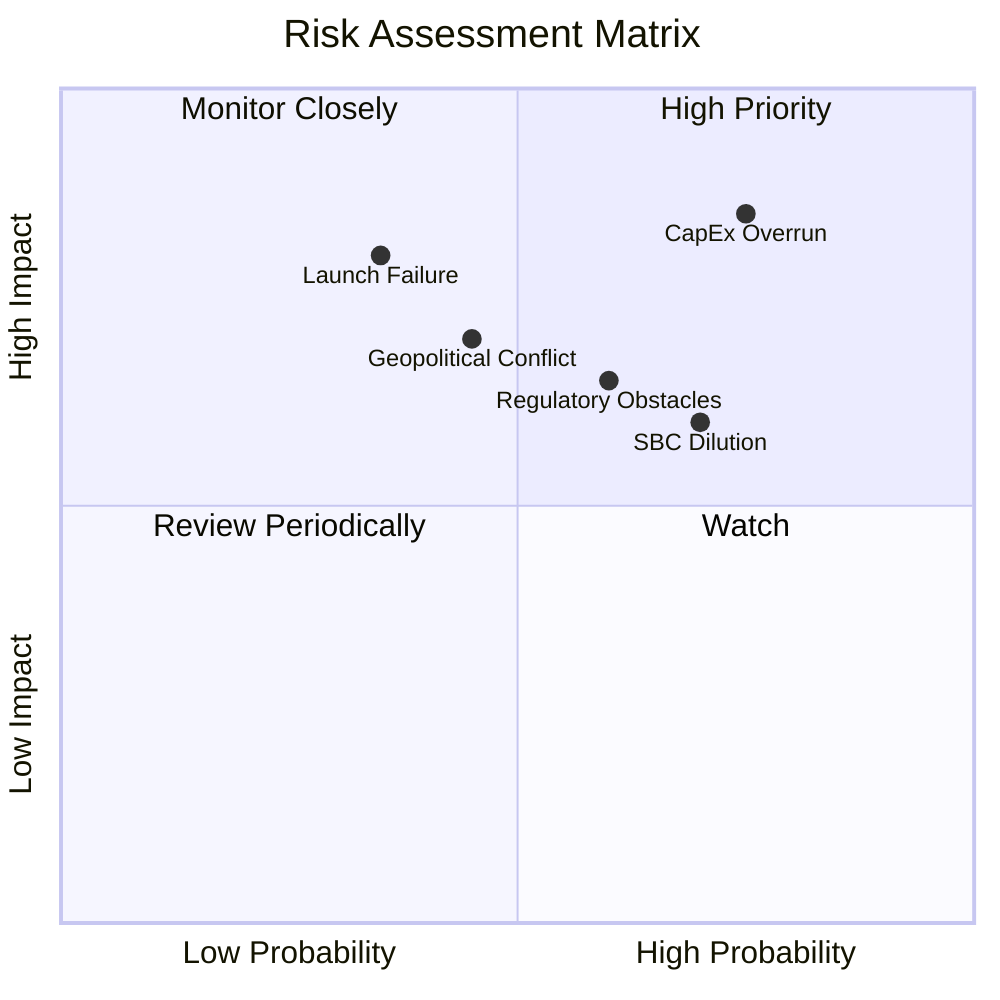

### 9.2 風險清單詳細分析

| # | 風險項目 | 發生機率 | 財務衝擊 | 風險評分 | 緩解措施 |
|---|----------|----------|----------|----------|----------|
| 1 | 🔴 **資本支出（Capex）持續失控** | 高 (75%) | 高 (-15% 營運利潤率) | 🔴 **8.5 / 10** | 隨著 Starlink  constellation 第一階段部署完成，逐步放緩 Capex 增速，轉向營運變現。 |
| 2 | 🔴 **股權薪酬（SBC）過度稀釋** | 高 (70%) | 中度 (-2.5% EPS 稀釋) | 🔴 **7.5 / 10** | 一級市場估值穩定後，逐步增加現金薪酬佔比，並實施選擇性股權回購計畫。 |
| 3 | 🟡 **Starship 軌道級試飛遭遇重大失敗** | 中 (35%) | 極高 (發射延誤 12M+) | 🟡 **7.0 / 10** | 採用「快速失敗、快速迭代」研發模式，分散單次發射風險，獵鷹九號持續提供穩定運力。 |
| 4 | 🟡 **國際市場頻譜與落地監管阻礙** | 中 (60%) | 中度 (-10% 海外訂閱收入) | 🟡 **6.5 / 10** | 與各國本地電信運營商建立合資公司或合作夥伴關係，繞過直接監管壁壘。 |

---

## 10. 投資建議

SpaceX（SPCX）是一隻極具代表性的**結構性壟斷航太成長股**。其短期財務表現因主動的重資本再投資而呈現嚴重虧損，但其核心發射業務與衛星寬頻業務的護城河正在持續加深。

### 10.1 最終綜合評級雷達圖

```
╔══════════════════════════════════════════════════════════════╗
║                    SPCX 投資價值最終評估                     ║
╠══════════════════════════════════════════════════════════════╣
║ 業務基本面強度： 9.0 ▓▓▓▓▓▓▓▓▓▓▓▓▓▓▓▓▓▓░░  ★★★★★           ║
║ 長期成長潛力：   9.5 ▓▓▓▓▓▓▓▓▓▓▓▓▓▓▓▓▓▓▓░  ★★★★★           ║
║ 財務抗風險能力： 7.0 ▓▓▓▓▓▓▓▓▓▓▓▓▓▓░░░░░░  ★★★☆☆           ║
║ 估值安全邊際：   5.5 ▓▓▓▓▓▓▓▓▓▓▓░░░░░░░░░  ★★☆☆☆           ║
║ 護城河壁壘深度： 9.5 ▓▓▓▓▓▓▓▓▓▓▓▓▓▓▓▓▓▓▓░  ★★★★★           ║
╠══════════════════════════════════════════════════════════════╣
║ 綜合推薦評級：   🟢 買入 (Buy)                               ║
╚══════════════════════════════════════════════════════════════╝
```

### 10.2 目標價與隱含報酬率

| 情境 | 隱含目標價 | 相比當前價 ($123.54) 隱含報酬率 | 權機率 | 期望值貢獻 |
|------|------------|---------------------------------|--------|------------|
| 🔴 **悲觀情境** | $62.00 | -49.8% | 20% | $12.40 |
| 🟡 **基準情境** | **$240.04** | **+94.3%** | **60%** | **$144.02**|
| 🟢 **樂觀情境** | $800.00 | +547.6% | 20% | $160.00 |
| 綜合期望值 | **$316.42** | **+156.1%** | 100% | **加權目標價：$316.42** |

### 10.3 買入時機與觸發因素

```
╔══════════════════════════════════════════════════════════════════╗
║                  ✅ SPCX 買入觸發因素 Checklist                  ║
╠══════════════════════════════════════════════════════════════════╣
║                                                                  ║
║  立即買入觸發條件（多數符合）：                                  ║
║  ✅ 股價回落至 $110 - $120 區間（接近 52 週低點 $119.68）        ║
║  ✅ Starlink 季度營收成長率 YoY 恢復至 25% 以上                  ║
║  ✅ Starship 成功完成下一次軌道級商業載荷部署                    ║
║                                                                  ║
║  加碼觸發條件（出現以下任一）：                                  ║
║  ☐ 季度自由現金流（FCF）流出顯著收窄，單季 Capex < $5.0B         ║
║  ☐ 獲得美國國防部價值超過 $5B 的 Starshield 新合約               ║
║                                                                  ║
║  減碼/停損觸發條件（出現以下任一）：                             ║
║  ☐ 發生連續兩次重大的商業載荷發射失敗事故                        ║
║  ☐ 股權薪酬（SBC）佔營收比重連續兩季超過 15%，稀釋效應加劇       ║
║                                                                  ║
╚══════════════════════════════════════════════════════════════════╝
```

### 10.4 投資人適配度分析

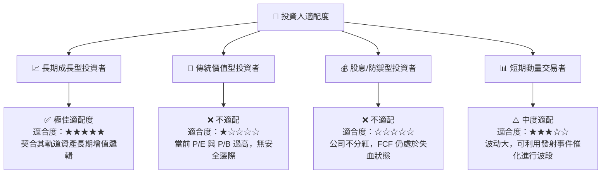

### 10.5 每季財報監控清單（Quarterly Watch List）

| 關鍵監控指標 | 基準值 (Q1 2026) | 觸發「加碼」門檻 | 觸發「減碼/觀望」門檻 | 監控邏輯 |
|--------------|------------------|------------------|-----------------------|----------|
| **營業收入 (Revenue)** | $4.69B | > $5.50B (YoY +25%+) | < $4.20B (成長停滯) | 評估 Starlink 用戶增長與發射服務需求。 |
| **研發費用 (R&D Expense)** | $3.51B | < $2.50B (研發高峰已過) | > $4.50B (研發黑洞擴大) | 判斷 Starship 研發是否失控，評估營業利潤率拐點。 |
| **資本支出 (Capex)** | $10.11B | < $6.00B (基礎設施建設放緩) | > $12.00B (失血加劇) | 評估 FCF 是否有機會在未來 4 季內轉正。 |
| **股權薪酬 (SBC)** | $639M | < $400M (稀釋放緩) | > $900M (惡性稀釋) | 監控管理層對股東權益的稀釋程度。 |

### 10.6 反面論證：什麼會證明論點錯誤（What Would Change My Mind）

```
╔══════════════════════════════════════════════════════════════════╗
║         ⚠️ 多頭論點失效條件（Disconfirming Evidence）            ║
╠══════════════════════════════════════════════════════════════════╣
║  本投資論點在下列情況成立時應重新檢視或果斷退出：                ║
║                                                                  ║
║  ☐ Starlink 訂閱用戶數出現零成長或負成長，說明低軌寬頻市場飽和。 ║
║  ☐ 營業利益率較當前 (-41.6%) 持續收縮，且連續三季低於 -50.0%。   ║
║  ☐ 自由現金流（FCF）在 FY27 結束時仍無法收窄至 -$5.0B 以內。     ║
║  ☐ 發生重大安全事故，導致 NASA 暫停或取消與 Crew Dragon 的合作。  ║
║  ☐ 聯邦通信委員會（FCC）或 ITU 收回其部分核心頻譜使用權。        ║
║                                                                  ║
╚══════════════════════════════════════════════════════════════════╝
```

---

> **免責聲明**：本報告為基於現有財務數據的機構級學術研究分析，僅供參考，不構成任何具體的二級市場投資建議。太空航太板塊具備極高波動性與不確定性，投資人應充分評估自身風險承受能力後做出決策。投資有風險，入市需謹慎。