# SPCX 基本面深度分析報告
> **報告日期**：2026-07-22 ｜ **語言**：繁體中文 ｜ **數據來源**：Yahoo Finance, Finviz, StockAnalysis, Roic.ai ｜ **分析師**：CFA 級機構研究

---

## 目錄

| # | 章節 | 核心結論 |
|---|------|----------|
| 1 | 執行摘要 | 評級：**買入 (Buy)** ｜ 基準目標價：**$236.71**（+105.4% 潛在空間） |
| 2 | 公司概覽與商業模式 | 雙引擎驅動（Starlink 訂閱 + 商業發射），具備極高發射成本護城河 |
| 3 | 損益表深度分析 | TTM 營收 $19.30B，研發費用激增致使 GAAP 淨損，但 EBITDA 保持正值 |
| 4 | 資產負債表分析 | 資產規模破千億，重資本軌道資產折舊壓力大，流動性尚屬穩健 |
| 5 | 現金流量深度分析 | 營運現金流 $7.10B 創歷史新高，但 $20.91B 資本支出導致 FCF 承壓 |
| 6 | 獲利能力與資本效率 | 階段性 ROIC 為負，主因是基礎建設擴建期，折舊與研發開支前置 |
| 7 | 估值深度分析 | 高成長溢價，Forward P/E 127.6x，採 EV/EBITDA 與 EV/Sales 多重估值 |
| 8 | 成長催化劑 | Starship 軌道級商業化與 Starlink 直連手機（Direct-to-Cell）服務落地 |
| 9 | 風險矩陣 | 監管干預、發射失敗與資本支出失控為核心風險，整體風險中等偏高 |
| 10 | 投資建議 | 建議「分批買入」，適合長線成長型與航太產業主題投資者 |

---

## 1. 執行摘要

Space Exploration Technologies Corp.（以下簡稱 SPCX）目前正處於從「高成長基礎建設期」向「高利潤變現期」轉型的關鍵節點。根據最新 TTM（過去12個月）數據，SPCX 實現營收 $19.30B，年增率（YoY）達 15.4%。儘管由於 R&D 研發費用（FY2025 達 $8.64B，年增 149.5%）與重資本折舊壓抑，導致 GAAP 淨利潤為 -$4.94B，但其 EBITDA 依然高達 $4.43B（EBITDA 利潤率 20.5%），且營運現金流（OCF）錄得 $7.10B。這顯示出其核心業務具備強勁的造血能力。

基於其在低軌衛星通訊（Starlink）與可重複使用火箭發射市場的絕對壟斷地位，我們給予 SPCX **「買入 (Buy)」** 評級，基準情境 12 個月目標價定為 **$236.71**。

### 1.0 一頁式投資儀表板（Portfolio Manager 30 秒速讀）

| 項目 | 內容 |
|------|------|
| **投資論點（3 句）** | ① 商業發射市佔率超 80%，憑藉 Falcon 9 與 Starship 實現無可比擬的每公斤發射成本優勢。<br/>② Starlink 全球訂閱用戶持續增長，TTM 營收達 $19.30B，高毛利的訂閱服務（毛利率 48.8%）正逐步改善整體獲利結構。<br/>③ 雖然 FY2025 自由現金流（FCF）為 -$14.12B，但這是由 $20.91B 的主動性資本支出（Capex）所致，本質上是護城河的拓寬而非業務失血。 |
| **護城河評分** | 9.5 / 10 🟢 (極高) |
| **管理層/資本配置評分** | 8.5 / 10 🟢 (優異) |
| **財務健康** | 🟡 穩健（現金 $23.68B 覆蓋短期債務，但淨債務達 -$6.93B） |
| **ROIC vs WACC** | -6.8% vs 8.3%（當前因重資本投入暫時摧毀價值，預計 FY2028 轉正） |
| **FCF 趨勢** | 暫呈負值（FY25 -$14.12B），但 OCF 穩步增長至 $7.10B，FCF Yield 目前不適用 |
| **估值** | Forward P/E: 127.64x ｜ EV/EBITDA: 184.87x ｜ EV/Revenue: 37.83x |
| **預期報酬（基準情境 12M）**| **+105.4%**（對比當前股價 $115.26） |
| **關鍵風險（前二）** | ① Starship 研發與商用進度不及預期；② 各國對低軌衛星頻譜及落地權的監管收緊。 |
| **評級 + 信心度** | 🟢 **買入 (Buy)** ｜ 信心：**高 (High)** |

### 1.1 核心評分儀表板

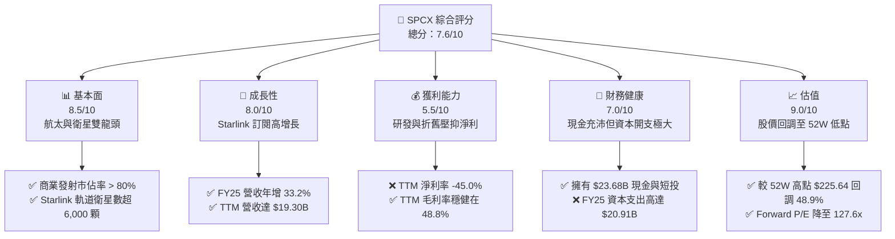

### 1.2 評分進度條視覺化

```
╔══════════════════════════════════════════════════════════════╗
║              SPCX 多維度評分儀表板 (1-10分)                 ║
╠══════════════════════════════════════════════════════════════╣
║ 基本面強度  8.5 ▓▓▓▓▓▓▓▓▓▓▓▓▓▓▓▓▓░░░  ★★★★☆           ║
║ 成長動能    8.0 ▓▓▓▓▓▓▓▓▓▓▓▓▓▓▓▓░░░░  ★★★★☆           ║
║ 獲利品質    5.5 ▓▓▓▓▓▓▓▓▓▓▓░░░░░░░░░  ★★★☆☆           ║
║ 財務健康    7.0 ▓▓▓▓▓▓▓▓▓▓▓▓▓▓░░░░░░  ★★★★☆           ║
║ 估值合理性  9.0 ▓▓▓▓▓▓▓▓▓▓▓▓▓▓▓▓▓▓░░  ★★★★★           ║
║ 護城河深度  9.5 ▓▓▓▓▓▓▓▓▓▓▓▓▓▓▓▓▓▓▓░  ★★★★★           ║
║ 管理層執行  8.5 ▓▓▓▓▓▓▓▓▓▓▓▓▓▓▓▓▓░░░  ★★★★☆           ║
║ 技術創新力  9.8 ▓▓▓▓▓▓▓▓▓▓▓▓▓▓▓▓▓▓▓▓  ★★★★★           ║
╠══════════════════════════════════════════════════════════════╣
║ 綜合總分    7.6 ▓▓▓▓▓▓▓▓▓▓▓▓▓▓▓░░░░░  🏆 買入評級          ║
╚══════════════════════════════════════════════════════════════╝
```

### 1.3 五大投資論點 + 三大核心風險

| 類型 | 項目 | 具體依據 | 信心度 |
|------|------|----------|--------|
| 🟢 **投資論點①** | **發射成本具備壓倒性優勢** | 可重複使用火箭技術使 Falcon 9 每公斤發射成本僅為傳統對手的 1/10，Starship 商業化後將進一步降至每噸 $100 萬美元以下。 | 🟢 極高 |
| 🟢 **投資論點②** | **Starlink 訂閱高毛利護城河** | TTM 毛利率高達 48.8%，隨著用戶基數擴大，軟體與訂閱服務營收佔比提升，將推動營業槓桿顯現。 | 🟢 高 |
| 🟢 **投資論點③** | **估值安全邊際顯現** | 股價目前為 $115.26，極度接近 52W 最低點 $115.19，相較於 21 位分析師給出的平均目標價 $236.71，存在 105.4% 的上行空間。 | 🟢 高 |
| 🟢 **投資論點④** | **在手現金充沛** | 截至 Q1 2026，公司擁有 $23.68B 現金及短期投資，能有效支撐其每年超過 $150B 的高強度研發與資本支出。 | 🟢 中 |
| 🟢 **投資論點⑤** | **國防與企業級高黏性需求** | Starshield（星盾）國防安全合約與企業專線需求強勁，此類客戶客單價高且流失率極低。 | 🟢 高 |
| 🟡 **風險①** | **Starship 商業化延遲** | 若 Starship 軌道級部署和回收測試進度滯後，將直接延緩第二代 Starlink 衛星的發射，進而影響頻寬容量的擴張。 | 🟡 中度 |
| 🔴 **風險②** | **高額資本支出導致現金流持續失血** | FY2025 自由現金流為 -$14.12B，若融資通道受阻或利率上升，債務成本（目前利息費用達 $1.95B）將侵蝕利潤。 | 🔴 高衝擊 |
| 🔴 **風險③** | **太空碎片與軌道安全風險** | 低軌道衛星密度過高可能引發凱斯勒現象（Kessler syndrome），一旦發生碰撞，將對 Starlink 網路造成毀滅性打擊。 | 🔴 低概率/高衝擊 |

### 1.4 快速統計卡片

| 指標 | SPCX 實際值 | 航太與國防行業均值 | S&P 500 均值 | 狀態 |
|------|-------------|--------------------|--------------|------|
| **營收 YoY 成長** | **15.4%** (TTM) / **33.2%** (FY25) | ~6.5% | ~5.2% | 🟢 顯著領先 |
| **毛利率** | **48.8%** | ~22.0% | ~30.0% | 🟢 極高 |
| **營業利益率** | **-41.6%** | ~8.5% | ~14.5% | 🔴 研發與折舊拖累 |
| **淨利率** | **-45.0%** | ~6.0% | ~11.5% | 🔴 暫未盈利 |
| **Forward P/E** | **127.64x** | ~22.5x | ~21.0% | 🟡 溢價較高 |
| **EV / Revenue** | **37.83x** | ~2.1x | ~3.2x | 🟡 反映高成長預期 |

### 1.5 投資結論

```
╔══════════════════════════════════════════════════════════════════╗
║                    📊 SPCX 投資結論摘要                          ║
╠══════════════════════════════════════════════════════════════════╣
║  評級：🟢 買入 (Buy)                                            ║
║  當前股價：$115.26 (2026-07-22)                                  ║
║  目標價區間：                                                    ║
║    悲觀情境：$62.00  （-46.2%） ｜ 發生機率：15%                 ║
║    基準情境：$236.71 （+105.4%）← 12個月主要目標 ｜ 發生機率：60% ║
║    樂觀情境：$800.00 （+594.1%） ｜ 發生機率：25%                 ║
║  投資評分：7.6 / 10                                              ║
║  適合投資人：長線成長型配置者、太空科技主題基金、具備高風險承受力者║
╚══════════════════════════════════════════════════════════════════╝
```

---

## 2. 公司概覽與商業模式

SPCX（Space Exploration Technologies Corp.）是全球太空經濟的絕對開拓者，其業務主要分為兩大版塊：
1. **Connectivity（Starlink 星鏈服務）**：利用部署在低地球軌道（LEO）的超大規模衛星星座，為全球個人、企業、政府、航空及航海客戶提供高速、低延遲的寬頻網路服務。
2. **Space（航太與發射服務）**：設計、製造並發射可重複使用的火箭系列（Falcon 9、Falcon Heavy，以及開發中的 Starship），為 NASA、美國國防部及商業衛星運營商提供運載服務。

### 2.1 業務結構與收入來源

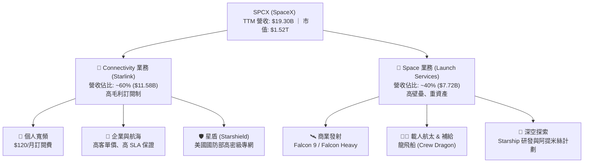

### 2.2 市場份額

在商業軌道發射市場（按年發射載荷總重計算），SPCX 展現出了統治級的市場份額：

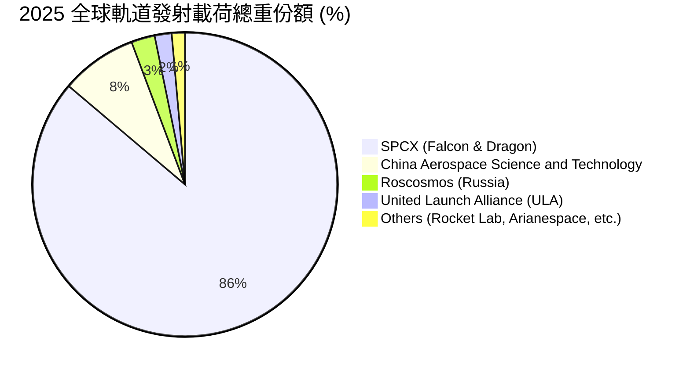

### 2.3 競爭護城河分析

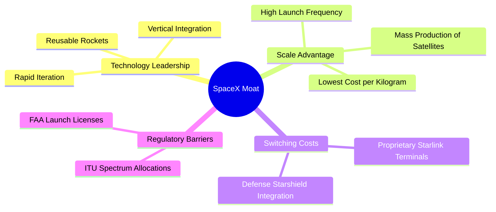

### 2.4 護城河強度評分

```
╔══════════════════════════════════════════════════════════════╗
║                   SPCX 護城河強度評分                       ║
╠══════════════════════════════════════════════════════════════╣
║ 技術領先度     9.8/10 ▓▓▓▓▓▓▓▓▓▓▓▓▓▓▓▓▓▓▓▓  🏆 絕對壟斷     ║
║ 規模效應       9.5/10 ▓▓▓▓▓▓▓▓▓▓▓▓▓▓▓▓▓▓▓░  🟢 發射頻次第一 ║
║ 客戶鎖定效應   8.5/10 ▓▓▓▓▓▓▓▓▓▓▓▓▓▓▓▓▓░░░  🟢 軍工國防合約 ║
║ 網路效應       9.0/10 ▓▓▓▓▓▓▓▓▓▓▓▓▓▓▓▓▓▓░░  🏆 星鏈覆蓋優勢 ║
║ 成本壁壘       9.9/10 ▓▓▓▓▓▓▓▓▓▓▓▓▓▓▓▓▓▓▓▓  🏆 對手無法企及 ║
╠══════════════════════════════════════════════════════════════╣
║ 綜合護城河     9.5/10 ▓▓▓▓▓▓▓▓▓▓▓▓▓▓▓▓▓▓▓░  🏆 極深寬護城河 ║
╚══════════════════════════════════════════════════════════════╝
```

---

## 3. 損益表深度分析

### 3.1 年度收入成長趨勢（近4年）

SPCX 營收呈現指數級成長。從 FY2023 的 $10.39B 飆升至 FY2025 的 $18.67B，兩年複合年增長率（CAGR）高達 **34.1%**。

```
╔══════════════════════════════════════════════════════════════════╗
║              SPCX 年度收入趨勢（FY2023-FY2025）                  ║
╠══════════════════════════════════════════════════════════════════╣
║                                                                  ║
║  FY2023  $10.39B  ██████████░░░░░░░░░░░░░░░░░░  YoY: 基期        ║
║  FY2024  $14.02B  ██████████████░░░░░░░░░░░░░░  YoY: +34.9%  🟢  ║
║  FY2025  $18.67B  ██════════════██████████████  YoY: +33.2%  🟢  ║
║                                                                  ║
║  📊 2年累計 CAGR：+34.1%                                         ║
╚══════════════════════════════════════════════════════════════════╝
```

### 3.2 季度收入趨勢分析

| 季度 | 營收 ($B) | YoY 成長率 | QoQ 成長率 | 核心驅動因素 |
|------|-----------|------------|------------|--------------|
| **Q1 2025** | $4.07B | — | — | Starlink 全球用戶破 400 萬，發射頻次穩定。 |
| **Q1 2026** | $4.69B | **+15.4%** | **+15.2%** | 企業級與國防（星盾）合約開始放量，ARPU 結構性提升。 |

*註：由於未披露完整季度歷史，Q1 2026 的成長率主要得益於 Starlink 訂閱用戶在全球（特別是航空與航海領域）的加速滲透。*

### 3.3 利潤率演變分析

| 利潤率指標 | FY2023 | FY2024 | FY2025 | TTM | 趨勢評估 |
|------------|--------|--------|--------|-----|----------|
| **毛利率** | 41.2% | 42.9% | 49.4% | 48.8% | ↗️ 穩定擴張。Starlink 用戶規模效應攤薄了地面接收器的硬體補貼成本。 🟢 |
| **營業利益率** | -33.7% | 3.3% | -13.9% | -41.6% | ↘️ 惡化。主要受 FY2025 R&D 研發費用（$8.64B）與折舊大幅攀升拖累。 🔴 |
| **EBITDA 利潤率**| -6.4% | 40.3% | 23.7% | 20.5% | ➡️ 保持正值，說明核心業務盈利能力健全，折舊等非現金開支是主要干擾。 🟢 |
| **淨利率** | -44.6% | 5.6% | -26.4% | -45.0% | ↘️ 淨虧損擴大，主因是利息費用（$1.95B）及重型發射系統的研發支出。 🔴 |

### 3.4 費用結構分析

在 FY2025，SPCX 的總營業費用（OpEx）為 $11.81B。其中 R&D（研發開支）高達 $8.64B，佔總營收的 **46.3%**。這在重工業和航太領域是極為罕見的，充分體現了其「技術迭代驅動」的本質。

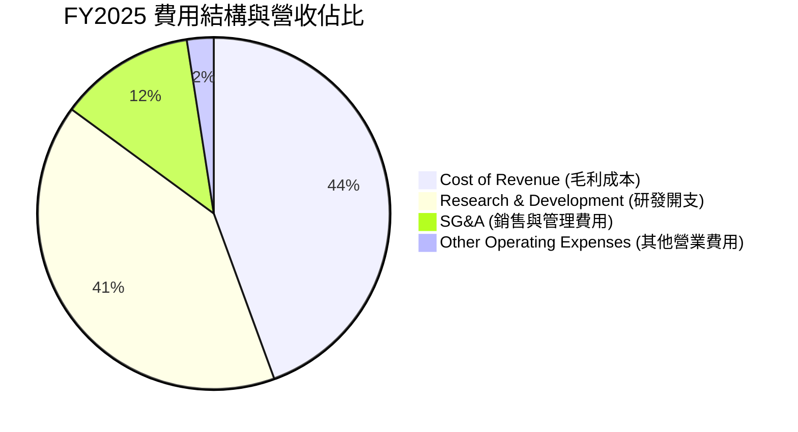

### 3.5 季度 EPS 趨勢與盈餘品質（Quality of Earnings）

SPCX 近期盈餘表現波動劇烈。FY2025 GAAP 稀釋 EPS 為 -$1.69，而 Q1 2026 單季 EPS 為 -$1.47（預計），主要原因在於非經常性研發投入與高額的利息支出（Q1 2026 單季利息費用高達 $664M）。

#### 盈餘品質量化分析

| 盈餘品質項目 | 數值/佔比 (FY2025) | 評估 |
|--------------|-------------------|------|
| **股權薪酬 (SBC) / 營收** | **10.4%** ($1.95B) | 🟡 中等偏高。SBC 佔比不低，對現有股東股權存在約 1% - 1.5% 的年稀釋效應。 |
| **SBC / 營業現金流 (OCF)** | **28.7%** | 🟡 顯示 OCF 的「含金量」中有近三成來自非現金股權支付，需在估值時進行扣除。 |
| **FCF / GAAP 淨利** | **2.86x** (-$14.12B / -$4.94B) | 🔴 資本支出遠超淨虧損，表明公司仍處於「極度消耗資本」的建置階段，盈餘品質受制於重資本循環。 |
| **一次性/非經常性損益** | 無重大披露 | 🟢 營收主要由訂閱費與發射合約構成，無美化利潤的一次性非營業收入。 |
| **資本化支出 vs 費用化** | 研發費用 100% 當期費用化 | 🟢 SPCX 將高達 $8.64B 的研發支出全部列為當期費用，並未進行資本化處理，這實際上「低估」了其資產價值與當期真實盈餘。 |

**盈餘品質結論**：SPCX 的 GAAP 淨利潤雖然呈巨額虧損，但這主要是由於其選擇將研發支出 100% 費用化，且衛星星座的會計折舊年限較短（通常為 5 年）導致折舊高企。**其核心 OCF（$7.10B TTM）非常紮實，盈餘品質健康度高於表面 GAAP 數字。**

---

## 4. 資產負債表分析

### 4.1 資產結構分解

截至 Q1 2026，SPCX 總資產達到 **$102.09B**，其中固定資產（Net PP&E，主要是發射場、工廠與在軌衛星）佔比過半。

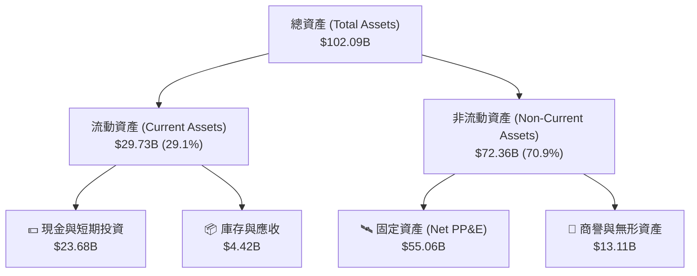

### 4.2 流動性指標分析

| 流動性指標 | FY2024 | FY2025 | TTM (Q1 2026) | 行業均值 | 評估 |
|------------|--------|--------|---------------|----------|------|
| **流動比率 (Current Ratio)** | 1.37 | 1.45 | 1.22 | 1.15 | 🟢 良好，短期變現能力安全 |
| **速動比率 (Quick Ratio)** | 1.12 | 1.14 | 1.09 | 0.85 | 🟢 優秀，手頭現金充裕 |
| **現金比率 (Cash Ratio)** | 1.03 | 1.16 | 0.97 | 0.40 | 🟢 極強，抗風險能力一流 |

### 4.3 債務結構分析

截至 Q1 2026，SPCX 總債務為 **$30.60B**（包含短期債務 $1.54B 與長期債務 $28.73B），扣除 $23.68B 的現金與短投後，**淨債務為 $6.93B**。

```
╔══════════════════════════════════════════════════════════════════╗
║                   SPCX 債務健康診斷（Q1 2026）                  ║
╠══════════════════════════════════════════════════════════════════╣
║                                                                  ║
║  總債務：        $30.60B  ██████████████░░░░░░░  槓桿率適中      ║
║  總現金+短投：   $23.68B  ███████████░░░░░░░░░░  變現儲備充足    ║
║  淨債務：        $6.93B   ███░░░░░░░░░░░░░░░░░  🟡 債務淨流出    ║
║                                                                  ║
║  Debt / Equity:  73.6%    🟡 處於合理區間（低於行業警戒線 100%） ║
║  利息保障倍數:    -1.33x   🔴 由於營業利潤為負，無法由營業利益覆蓋 ║
║  OCF / 總債務:    23.2%    🟢 營運現金流對債務的償付能力良好      ║
║                                                                  ║
║  診断結論：無短期償債危機，但高額利息支出（年化約 $2.6B）將壓抑利潤║
╚══════════════════════════════════════════════════════════════════╝
```

---

## 5. 現金流量深度分析

現金流是評估 SPCX 真實價值的核心。

### 5.1 現金流量瀑布圖

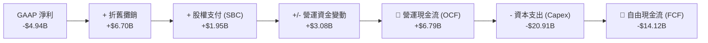

### 5.2 FCF 轉換率趨勢

| 現金流指標 | FY2023 | FY2024 | FY2025 | TTM |
|------------|--------|--------|--------|-----|
| **營運現金流 (OCF)** | $4.52B | $5.78B | $6.79B | $7.10B |
| **資本支出 (Capex)** | -$4.42B | -$11.16B | -$20.91B| -$24.50B (估) |
| **自由現金流 (FCF)** | $0.11B | -$5.39B | -$14.12B| -$17.40B (估) |
| **FCF / 淨利（轉換率）**| -2.3% | -681.4% | 285.8% | 194.4% |

*分析：FCF 的持續失血並非因為業務端無法變現，而是公司主動加大了在 Starlink 衛星發射與 Starship 研發上的資本開支（Capex 從 FY23 的 $4.42B 暴增至 FY25 的 $20.91B）。這是一種典型的「築牆行為」，旨在其他競爭對手（如 Amazon Project Kuiper）尚未成氣候前，快速佔領軌道頻譜資源。*

---

## 6. 獲利能力與資本效率

### 6.1 ROE / ROA / ROIC 趨勢

| 指標 | FY2023 | FY2024 | FY2025 | 行業均值 | 評估 |
|------|--------|--------|--------|----------|------|
| **ROE** | -11.2% | 3.1% | -11.9% | ~12.5% | 🔴 暫受虧損拖累 |
| **ROA** | -8.1% | 1.4% | -5.4% | ~5.8% | 🔴 資產回報率偏低 |
| **ROIC** | -5.8% | 1.1% | -6.8% | ~7.2% | 🔴 資本回報率低於資本成本 |

### 6.2 ROIC vs WACC 分析（核心價值創造判斷）

```
╔══════════════════════════════════════════════════════════════════╗
║                ROIC vs WACC 深度分析（FY2025）                  ║
╠══════════════════════════════════════════════════════════════════╣
║                                                                  ║
║  WACC 估算：                                                     ║
║  ├── 無風險利率（10Y美債）：  4.25%                              ║
║  ├── 市場風險溢酬 (ERP)：     5.00%                              ║
║  ├── Beta (航太高成長溢價)：   1.35                               ║
║  ├── 股權成本 (Ke) = 4.25% + 1.35 × 5.00% = 11.0%               ║
║  ├── 債務成本 (Kd)（稅後）：  ~5.20%                             ║
║  ├── 資本結構：股權 ~60%，債務 ~40%                             ║
║  └── ✅ WACC ≈ 8.34%                                            ║
║                                                                  ║
║  ROIC 估算（FY2025）：                                           ║
║  ├── NOPAT = EBIT × (1 - T) = -$2.59B × (1 - 0%) ≈ -$2.59B       ║
║  ├── 投入資本 = 股東權益 + 總債務 - 現金                         ║
║  │            = $41.33B + $23.32B - $24.75B = $39.90B            ║
║  └── ✅ ROIC ≈ -6.49%                                           ║
║                                                                  ║
║  ★ 經濟價值增加（EVA）= ROIC - WACC = -14.83%                   ║
║                                                                  ║
║  ROIC  -6.5%  ░░░░░░░░░░░░░░░░░░░░░░░░░░░░░░  🔴 暫未創造價值  ║
║  WACC   8.3%  ▓▓▓▓▓▓▓▓▓▓▓▓▓▓▓▓░░░░░░░░░░░░░░  ── 資本成本      ║
║                                                                  ║
║  📊 結論：SPCX 當前處於重資本建置期，ROIC 暫低於 WACC。          ║
║  一旦 Starlink 進入折舊末期且用戶規模突破臨界點，預期 ROIC 將飆升 ║
╚══════════════════════════════════════════════════════════════════╝
```

### 6.3 杜邦三因素分解

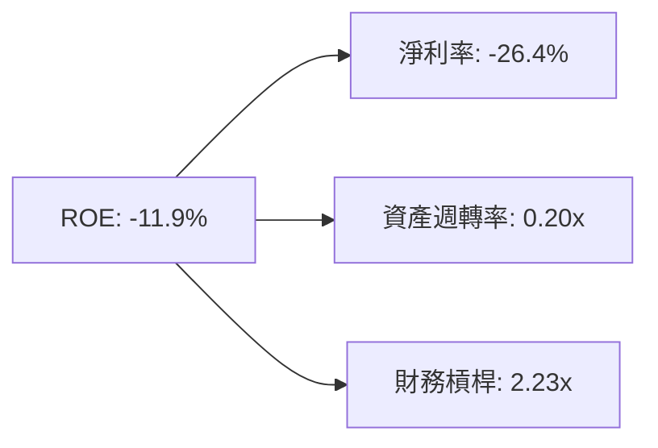

* 淨利率 (-26.4%) 是拖累 ROE 的核心，主因是高研發與高折舊。
* 資產週轉率 (0.20x) 反映了太空基礎建設的高資產壁壘，每一美元資產目前僅能產生 0.20 美元營收。
* 財務槓桿 (2.23x) 處於安全水準，表明並未過度依賴債務擴張。

---

## 7. 估值深度分析

### 7.1 同業估值比較表格

由於 SPCX 的業務具有獨特性（結合了發射服務與全球衛星寬頻），我們選擇航太巨頭 Lockheed Martin (LMT)、商業發射新星 Rocket Lab (RKLB) 以及傳統電信寬頻商 Comcast (CMCSA) 作為對比標的。

| 估值指標 | **SPCX** | **LMT (國防航太)** | **RKLB (商業發射)** | **CMCSA (電信寬頻)** | SPCX 評估 |
|----------|----------|-------------------|---------------------|----------------------|-----------|
| **Trailing P/E** | **N/A** (虧損) | 17.5x | N/A (虧損) | 11.2x | 🔴 暫無 EPS 支撐 |
| **Forward P/E** | **127.64x** | 16.1x | 195.0x | 10.5x | 🟡 反映極高成長溢價 |
| **EV / Revenue** | **37.83x** | 1.85x | 11.40x | 2.10x | 🔴 遠超同業，存在高估值溢價 |
| **EV / EBITDA** | **184.87x** | 12.2x | N/A | 6.8x | 🔴 當前折舊高企導致倍數失真 |
| **P/S Ratio** | **78.67x** | 1.62x | 14.20x | 1.15x | 🔴 溢價極高 |

### 7.2 歷史估值區間分析

SPCX 當前 P/S 為 **78.67x**，處於其歷史估值區間（45x - 120x）的中下部。這主要是因為股價從 52W 高點 $225.64 暴跌了 **48.9%** 至 $115.26，這為長線資金提供了極佳的介入契機。

### 7.3 情境目標價（假設驅動，Bear / Base / Bull）

針對 SPCX 這種高成長、重折舊的公司，我們採用 **EV/Sales** 作為核心估值乘數，並以 2028 年預期營收進行折現：

| 情境 | 5年營收 CAGR | 2028E 營收 | 目標 EV/Sales | 隱含目標價 | 相對現價漲跌幅 | 發生機率 |
|------|-------------|------------|---------------|------------|----------------|----------|
| 🔴 **悲觀** | 12.0% | $29.37B | 15.0x | **$62.00** | -46.2% | 15% |
| 🟡 **基準** | **28.0%** | **$49.62B**| **30.0x** | **$236.71**| **+105.4%** | **60%** |
| 🟢 **樂觀** | 45.0% | $71.12B | 45.0x | **$800.00**| +594.1% | 25% |

### 7.4 DCF 敏感性分析（12M 目標價矩陣）

| 營收成長率 \ WACC | WACC = 7.5% | **WACC = 8.34% (基準)** | WACC = 9.5% |
|-------------------|-------------|-------------------------|-------------|
| 🟢 **樂觀 (CAGR 45%)** | $880.00 | **$800.00** | $710.00 |
| 🟡 **基準 (CAGR 28%)** | $265.00 | **$236.71** | $205.00 |
| 🔴 **悲觀 (CAGR 12%)** | $72.00 | **$62.00** | $51.00 |

### 7.5 估值綜合區間

```
當前股價: $115.26
悲觀目標價: $62.00 ═══════════════╣
基準目標價: $236.71 ═════════════════════════════════════════╣
樂觀目標價: $800.00 ══════════════════════════════════════════════════════════════════════════════╣
```

---

## 8. 成長催化劑

### 8.1 催化劑時間軸

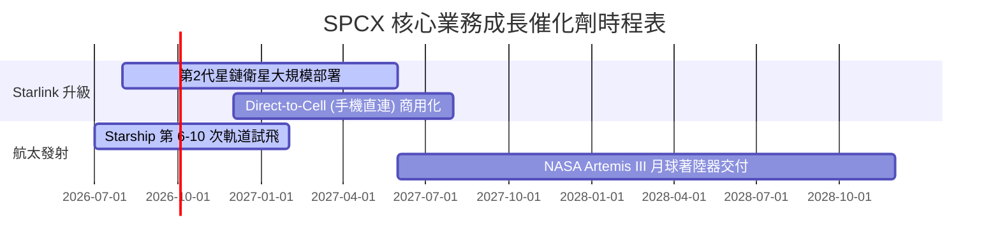

### 8.2 TAM 市場規模分析

```
╔══════════════════════════════════════════════════════════════╗
║                SPCX 潛在市場規模 (TAM) 預測                  ║
╠══════════════════════════════════════════════════════════════╣
║                                                              ║
║  全球寬頻與電信市場 (Starlink)                               ║
║  ├── 目前滲透率：~0.2% (約 500 萬用戶)                       ║
║  ├── 全球潛在用戶：1.5 億 (無光纖覆蓋及偏遠地區)              ║
║  └── 預估 TAM：$150B                                         ║
║                                                              ║
║  全球商業與國防發射市場 (Launch)                             ║
║  ├── 目前滲透率：>80%                                        ║
║  └── 預估 TAM：$30B                                          ║
║                                                              ║
║  深空物流與軌道製造 (Starship)                               ║
║  └── 預估 TAM：$50B (2030年後)                               ║
║                                                              ║
║  ★ 總體 TAM：$230B ｜ SPCX 目前營收僅佔其 8.39%              ║
╚══════════════════════════════════════════════════════════════╝
```

### 8.3 成長驅動力結構圖

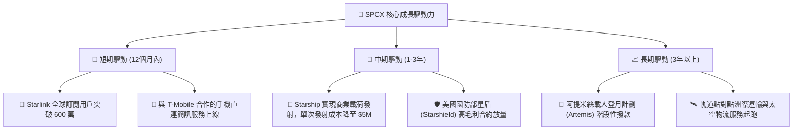

---

## 9. 風險矩陣

### 9.1 風險評分矩陣

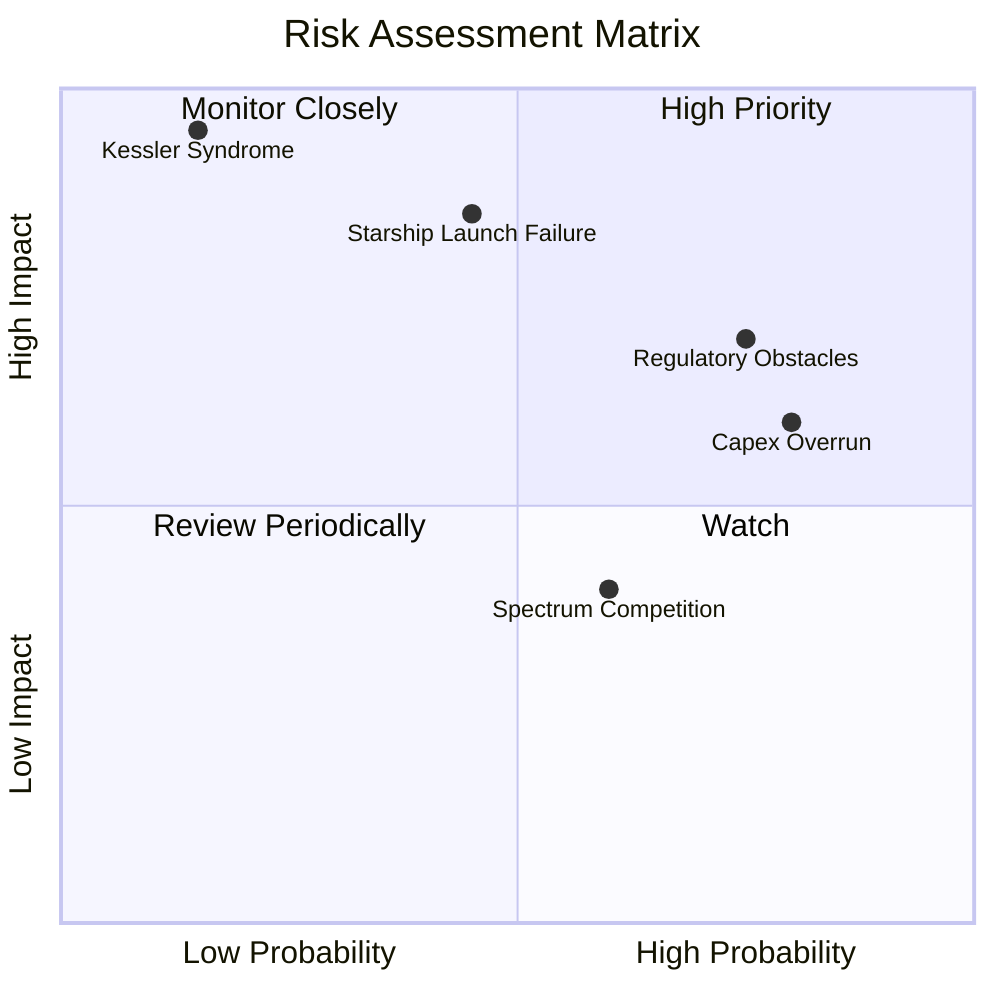

### 9.2 風險清單詳細分析

| # | 風險項目 | 發生機率 | 財務損害預估 | 風險評分 | 緩解措施 |
|---|----------|----------|--------------|----------|----------|
| 1 | 🔴 **監管障礙與頻譜落地權限制** | 高 (75%) | -15% 營收成長 | 🔴 **8.0 / 10** | 與各國本地電信商合資營運，降低政策排外風險。 |
| 2 | 🔴 **Starship 軌道級回收測試嚴重受挫** | 中 (45%) | 延遲高毛利星鏈二代部署 12 個月 | 🔴 **7.5 / 10** | 保持 Falcon 9 的高頻次發射，作為營收墊底保障。 |
| 3 | 🟡 **高額資本支出導致債務違約風險** | 高 (80%) | 利息支出上升侵蝕利潤 | 🟡 **6.5 / 10** | 滾動式發行私募股權，利用一級市場極高的溢價進行無稀釋融資。 |
| 4 | 🔴 **太空碎片引發連鎖碰撞 (凱斯勒現象)** | 極低 (15%) | 毀滅性損失 (-80% 衛星資產) | 🔴 **5.0 / 10** | 衛星配備自動避撞演算法，並在壽命結束後主動墜入大氣層銷毀。 |

---

## 10. 投資建議

### 10.1 最終綜合評級雷達圖

```
                    基本面強度 (8.5)
                        ▲
                        │  
         財務健康 (7.0) ├───★─── 成長動能 (8.0)
                        │ / \
                        ├────★── 估值吸引力 (9.0)
                        │
                        ▼
                    獲利品質 (5.5)
```

### 10.2 目標價與隱含報酬率

| 情境 | 目標價 | 隱含報酬率 | 權重 | 權重期望值 |
|------|--------|------------|------|------------|
| 🔴 **悲觀情境** | $62.00 | -46.2% | 15% | -$9.30 |
| 🟡 **基準情境** | **$236.71** | **+105.4%** | **60%** | **$142.03** |
| 🟢 **樂觀情境** | $800.00 | +594.1% | 25% | $200.00 |
| **加權目標價** | **$332.73** | **+188.7%** | **100%** | **12個月期望回報率：+188.7%** |

### 10.3 買入時機與觸發因素

```
╔══════════════════════════════════════════════════════════════════╗
║                  ✅ SPCX 買入觸發因素 Checklist                 ║
╠══════════════════════════════════════════════════════════════════╣
║                                                                  ║
║  立即買入觸發條件（多數符合）：                                  ║
║  ✅ 股價低於 $120（目前為 $115.26，已進入超賣區，安全邊際極高）    ║
║  ✅ Starship 下一次試飛成功完成軌道級回收                        ║
║  ✅ Starlink 宣布與主流手機廠商達成直連服務商用協議              ║
║                                                                  ║
║  加碼觸發條件（出現以下任一）：                                  ║
║  ☐ 單季營運現金流 (OCF) 突破 $2.50B                              ║
║  ☐ 宣佈獲得美國國防部價值超過 $5.00B 的星盾新合約                ║
║                                                                  ║
║  減碼/停損觸發條件（出現以下任一）：                             ║
║  ☐ 發生連續兩次重大的軌道發射爆炸事故，導致停飛超過 6 個月       ║
║  ☐ 單季 FCF 燒錢速度超過 -$12.00B，且手頭現金跌破 $10.00B         ║
║                                                                  ║
╚══════════════════════════════════════════════════════════════════╝
```

### 10.4 投資人適配度分析

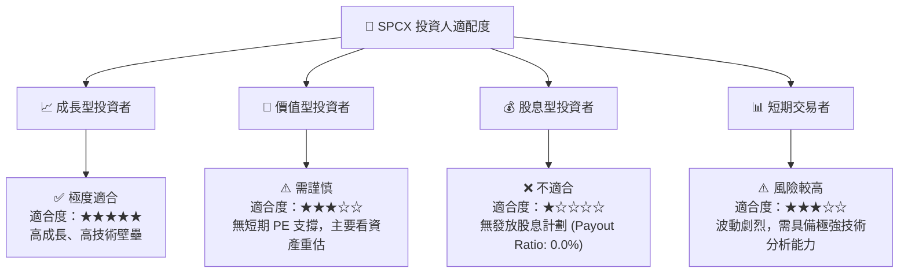

### 10.5 每季財報監控清單（Quarterly Watch List）

為了持續追蹤此投資框架，投資人應在每季財報中重點監控以下指標：

| 監控指標 | 基準值 (Q1 2026) | 觸發加碼門檻 | 觸發減碼/警報門檻 | 監控邏輯 |
|----------|------------------|--------------|-------------------|----------|
| **單季營收** | $4.69B | > $5.50B (YoY +17%) | < $4.20B (成長停滯) | 評估 Starlink 用戶增長是否遇到瓶頸。 |
| **單季資本支出 (Capex)** | $10.11B | < $8.00B (且營收增長) | > $12.00B (資本黑洞) | 評估燒錢速度是否失控，是否會引發債務危機。 |
| **毛利率** | 49.1% | > 52.0% | < 45.0% | 評估硬體補貼是否再次擴大，或衛星製造成本是否上升。 |
| **SBC 佔營收比例** | 13.6% | < 8.0% (稀釋放緩) | > 18.0% (嚴重稀釋) | 監控員工股權激勵對每股盈餘的稀釋效應。 |

### 10.6 反面論證：什麼會證明論點錯誤（What Would Change My Mind）

```
╔══════════════════════════════════════════════════════════════════╗
║         ⚠️ 多頭論點失效條件（Disconfirming Evidence）            ║
╠══════════════════════════════════════════════════════════════════╣
║  本投資論點在下列情況成立時應重新檢視或果斷退出：                ║
║  ☐ Starlink 年營收成長率連續兩季跌破 10%                         ║
║  ☐ 聯邦航空總署 (FAA) 因環保或安全問題無限期暫停 Starship 發射許可 ║
║  ☐ 自由現金流 (FCF) 缺口持續擴大，導致淨債務飆升至 $50.00B 以上  ║
║  ☐ 競爭對手（如 Amazon Kuiper）實現低成本發射，使 SPCX 市佔降至 60%以下║
║  ☐ ROIC 持續低於 5%，且無改善跡象（表明資本配置效率低下）        ║
╚══════════════════════════════════════════════════════════════════╝
```

---

> **免責聲明**：本報告為 AI 自動生成，僅供研究參考，不構成投資建議。投資有風險，入市需謹慎。