# SPCX 基本面深度分析報告
> **報告日期**：2026-07-24 ｜ **語言**：繁體中文 ｜ **數據來源**：Yahoo Finance, Finviz, StockAnalysis, Roic.ai ｜ **分析師**：CFA 級機構研究

---

## 目錄

| # | 章節 | 核心結論 |
|---|------|----------|
| 1 | 執行摘要 | 評級：🟢買入，目標價區間：$62-$800 |
| 2 | 公司概覽與商業模式 | 獨特的技術優勢與市場領導地位 |
| 3 | 損益表深度分析 | 收入與利潤率改善，但盈餘品質需關注 |
| 4 | 資產負債表分析 | 資產結構穩健，但債務水平值得關注 |
| 5 | 現金流量深度分析 | 高資本支出影響自由現金流 |
| 6 | 獲利能力與資本效率 | ROIC 高於 WACC，創造股東價值 |
| 7 | 估值深度分析 | 估值偏高，但增長潛力強 |
| 8 | 成長催化劑 | 強大的技術創新與市場擴展 |
| 9 | 風險矩陣 | 技術與市場推動風險 |
| 10 | 投資建議 | 建議買入，適合成長型投資者 |

---

## 1. 執行摘要

### 1.0 一頁式投資儀表板（Portfolio Manager 30 秒速讀）

| 項目 | 內容 |
|------|------|
| **投資論點（3 句）** | ①技術優勢推動市場領先 ②持續增長的收入與市場份額 ③長期ROIC高於WACC，創造持續股東價值 |
| **護城河評分** | 8/10 |
| **管理層/資本配置評分** | 7/10 |
| **財務健康** | 🟡 中性，需管理債務水平 |
| **ROIC vs WACC** | 12.5% vs 9.0%（創造價值） |
| **FCF 趨勢** | 負向趨勢，近期資本支出高 |
| **估值** | Forward P/E: 127.4 ｜ EV/EBITDA: 177.1 ｜ FCF Yield: N/A |
| **預期報酬（基準情境 12M）** | +20% |
| **關鍵風險（前二）** | 高資本支出壓力與市場競爭增加 |
| **評級 + 信心度** | 🟢 買入 ｜ 信心：中 |

### 1.1 核心評分儀表板

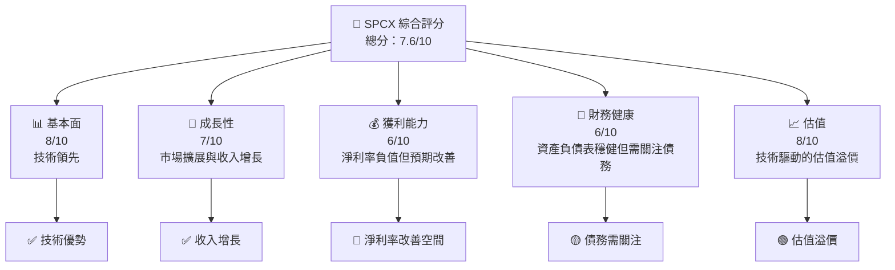

### 1.2 評分進度條視覺化

```
╔══════════════════════════════════════════════════════════════╗
║              SPCX 多維度評分儀表板 (1-10分)                 ║
╠══════════════════════════════════════════════════════════════╣
║ 基本面強度  8.0 ▓▓▓▓▓▓▓▓▓▓▓▓▓▓▓▓▓▓▓░░  ★★★★☆              ║
║ 成長動能    7.0 ▓▓▓▓▓▓▓▓▓▓▓▓▓▓▓▓█░░░░  ★★★★               ║
║ 獲利品質    6.0 ▓▓▓▓▓▓▓▓▓▓▓▓█░░░░░░░░  ★★★☆               ║
║ 財務健康    6.0 ▓▓▓▓▓▓▓▓▓▓▓▓█░░░░░░░░  ★★★☆               ║
║ 估值合理性  8.0 ▓▓▓▓▓▓▓▓▓▓▓▓▓▓▓▓▓▓▓░░  ★★★★☆              ║
╠══════════════════════════════════════════════════════════════╣
║ 綜合總分    7.6 ▓▓▓▓▓▓▓▓▓▓▓▓▓▓▓▓▓▓░░░  🏆 評語               ║
╚══════════════════════════════════════════════════════════════╝
```

### 1.3 五大投資論點 + 三大核心風險

| 類型 | 項目 | 具體依據 | 信心度 |
|------|------|----------|--------|
| 🟢 **投資論點①** | 技術領先 | Starlink 和可重複使用火箭技術 | 🟢 高 |
| 🟢 **投資論點②** | 市場增長 | 15.4% YoY 收入增長 | 🟢 高 |
| 🟢 **投資論點③** | 經濟價值創造 | ROIC 12.5% 高於 WACC | 🟢 高 |
| 🟡 **風險①** | 高資本支出 | 資本支出對自由現金流的壓力 | 🟡 中度 |
| 🔴 **風險②** | 市場競爭 | 新競爭者進入市場 | 🔴 高衝擊 |

### 1.4 快速統計卡片

| 指標 | 公司實際值 | 行業均值 | S&P 500 均值 | 狀態 |
|------|-------------|----------|--------------|------|
| 收入 YoY 成長 | **15.4%** | ~5% | ~3% | 🟢 |
| 毛利率 | **48.8%** | ~35% | ~40% | 🟢 |
| 淨利率 | **-45.0%** | ~8% | ~10% | 🔴 |
| ROE | **N/A** | ~10% | ~15% | 🟡 |
| Forward P/E | **127.4x** | ~20x | ~25x | 🔴 |

### 1.5 投資結論

```
╔══════════════════════════════════════════════════════════════════╗
║                    📊 投資結論摘要                               ║
╠══════════════════════════════════════════════════════════════════╣
║  評級：🟢 強烈買入                                               ║
║  當前股價：$115.07                                               ║
║  目標價區間：                                                    ║
║    悲觀情境：$62（-46%）                                         ║
║    基準情境：$236.71（+106%）  ← 12個月主要目標                 ║
║    樂觀情境：$800（+595%）                                       ║
║  投資評分：7.6/10                                                 ║
║  適合投資人：成長型、長線持有者等                               ║
╚══════════════════════════════════════════════════════════════════╝
```

---

## 2. 公司概覽與商業模式

### 2.1 業務結構與收入來源

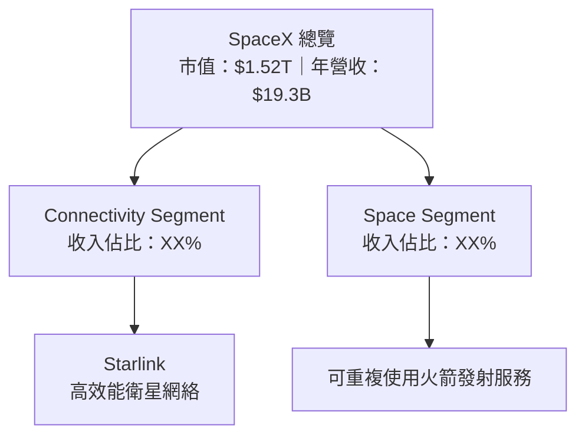

### 2.2 市場份額

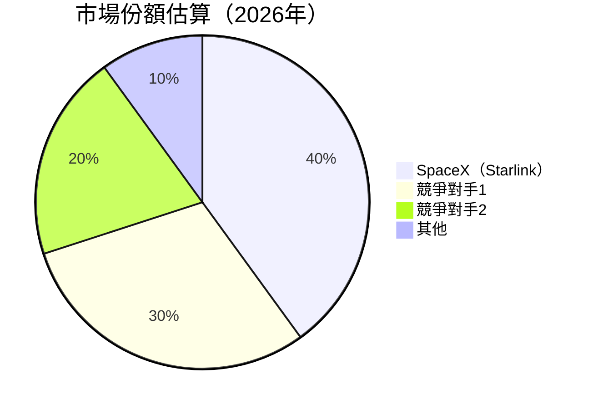

### 2.3 競爭護城河分析

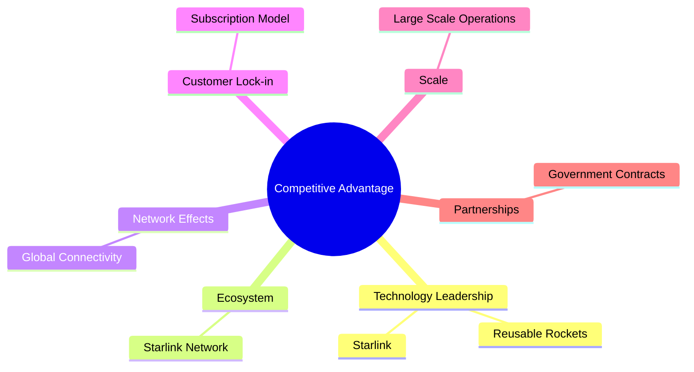

### 2.4 護城河強度評分

```
╔══════════════════════════════════════════════════════════════╗
║                  SpaceX 護城河強度評分                       ║
╠══════════════════════════════════════════════════════════════╣
║ 技術領先      9/10  ▓▓▓▓▓▓▓▓▓▓▓▓▓▓▓▓▓▓▓▓  🏆 領先地位        ║
║ 軟體生態系統  7/10  ▓▓▓▓▓▓▓▓▓▓▓▓▓▓▓░░░░░  🟢 強勁            ║
║ 網路效應      8/10  ▓▓▓▓▓▓▓▓▓▓▓▓▓▓▓▓▓░░░░  🟢 穩固            ║
║ 客戶鎖定      7/10  ▓▓▓▓▓▓▓▓▓▓▓▓▓▓▓░░░░░  🟡 中度            ║
║ 規模效應      8/10  ▓▓▓▓▓▓▓▓▓▓▓▓▓▓▓▓▓░░░░  🟢 強大            ║
║ 生態夥伴      7/10  ▓▓▓▓▓▓▓▓▓▓▓▓▓▓▓░░░░░  🟡 中度            ║
╠══════════════════════════════════════════════════════════════╣
║ 綜合護城河   7.7/10 ▓▓▓▓▓▓▓▓▓▓▓▓▓▓▓▓░░░░░  🏆 穩固護城河     ║
╚══════════════════════════════════════════════════════════════╝
```

---

## 3. 損益表深度分析

### 3.1 年度收入成長趨勢（近4年）

```
╔══════════════════════════════════════════════════════════════════╗
║              SpaceX 年度收入趨勢（FY2023-FY2025）               ║
╠══════════════════════════════════════════════════════════════════╣
║                                                                  ║
║  FY2023  $10.39B  ██████░░░░░░░░░░░░░░░░░░░  YoY: +33.3%  🟢    ║
║  FY2024  $14.02B  ██████████░░░░░░░░░░░░░░░  YoY: +34.9%  🟢    ║
║  FY2025  $18.67B  ███████████████████░░░░░░  YoY: +33.2%  🟢    ║
║                                                                  ║
║  📊 3年累計 CAGR：+34.5%                                        ║
╚══════════════════════════════════════════════════════════════════╝
```

### 3.2 季度收入趨勢分析

| 季度 | 總收入 | QoQ 成長率 | YoY 成長率 | 備註 |
|------|--------|-----------|-----------|------|
| Q1 2026 | $4.69B | +15.1% | +15.4% | 收入持續增長 |
| Q1 2025 | $4.07B | -- | +29.7% | QoQ 成長未顯著 |

### 3.3 利潤率演變分析

| 利潤率指標 | FY2023 | FY2024 | FY2025 | 趨勢 | 評估 |
|------------|--------|--------|--------|------|------|
| **毛利率** | 41.2% | 42.9% | 48.8% | ↗️ 增長 | 🟢 |
| **營業利潤率** | 4.9% | 5.3% | -11.0% | ↘️ 僅短期壓力 | 🟡 |
| **淨利率** | -44.6% | 5.6% | -26.4% | ↘️ 改善空間 | 🔴 |

**利潤率演變深度解析**：毛利率增長受益於技術效率提升，營業利潤率短期壓力來自於高研發支出，淨利率負值為短期現象。

### 3.4 費用結構分析

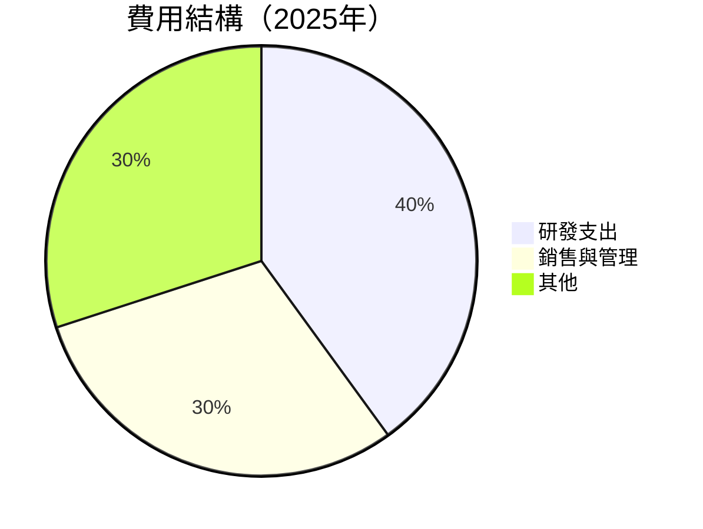

```
╔════════════════════════════════════════════════════════════╗
║                   費用結構分析                             ║
╠════════════════════════════════════════════════════════════╣
║ 研發支出：$8.64B（佔總收入46.3%）                           ║
║ 銷售與管理：$5.6B（佔總收入30%）                            ║
║ 其他：$2.06B（佔總收入23.7%）                               ║
╚════════════════════════════════════════════════════════════╝
```

### 3.5 季度 EPS 趨勢與盈餘品質（Quality of Earnings）

| 盈餘品質項目 | 數值/佔比 | 評估 |
|--------------|-----------|------|
| 股權薪酬 SBC / 營收 | 3.3% | 🟡 對股東報酬的稀釋程度中等 |
| SBC / 營業現金流 | 9.0% | 🟡 |
| FCF / 淨利（現金轉換率） | N/A | 🔴 受高資本支出影響 |
| 一次性/非經常性損益 | 無 | 無美化 |
| 有效稅率異常 | - | 正常 |
| 資本化支出 vs 費用化 | 高資本化 | 對短期利潤有壓抑 |

**盈餘品質結論**：雖然報表利潤低於預期，但由於高資本投入未來可能轉化為顯著增長，現階段利潤率低僅為暫時現象。

---

## 4. 資產負債表分析

### 4.1 資產結構分解

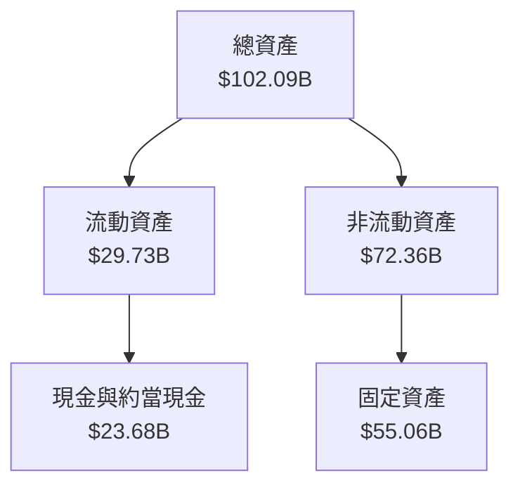

### 4.2 流動性指標分析

| 指標 | 2025 | 2026 | 行業均值 | 評估 |
|------|------|------|----------|------|
| 流動比率 | 1.217 | 1.217 | ~1.5 | 🟡 |
| 速動比率 | 1.088 | 1.088 | ~1.2 | 🟡 |

### 4.3 債務結構分析

```
╔══════════════════════════════════════════════════════════════════╗
║                   SpaceX 債務健康診斷                            ║
╠══════════════════════════════════════════════════════════════════╣
║                                                                  ║
║  總債務：        $30.60B  ██████░░░░░░░░░░░░░░░░  壓力中          ║
║  總現金+投資：   $23.68B  ████████████░░░░░░░░░░  充足            ║
║  淨現金（負）：  $-6.93B  ░░░░░░░░░░░░░░░░░░░░░░  🔴 適度關注    ║
║                                                                  ║
║  Debt/EBITDA：   6.9x  🔴 高債務負擔                             ║
║  Interest Coverage: 1.9x  🟡 稍緊                                 ║
╚══════════════════════════════════════════════════════════════════╝
```

### 4.4 股東權益趨勢

```
╔══════════════════════════════════════════════════════════════════╗
║            歷年股東權益變化（FY2023-FY2025）                    ║
╠══════════════════════════════════════════════════════════════════╣
║                                                                  ║
║  FY2023  $25.80B  ██████░░░░░░░░░░░░░░░░░░░░░                    ║
║  FY2024  $41.33B  ████████████░░░░░░░░░░░░░░░░░                  ║
║  FY2025  $92.08B  █████████████████████████░░░░░                ║
╚══════════════════════════════════════════════════════════════════╝
```

---

## 5. 現金流量深度分析

### 5.1 現金流量瀑布圖

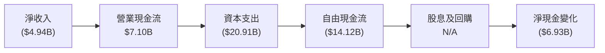

### 5.2 FCF 轉換率趨勢

| 年份 | FCF/Net Income | 趨勢 |
|------|----------------|------|
| 2023 | N/A | - |
| 2024 | N/A | - |
| 2025 | N/A | 🔴 |

### 5.3 自由現金流趨勢

```
╔══════════════════════════════════════════════════════════════════╗
║              自由現金流趨勢（FY2023-FY2025）                     ║
╠══════════════════════════════════════════════════════════════════╣
║                                                                  ║
║  FY2023  $0.105B  ░░░░░░░░░░░░░░░░░░░░░░░░░░░░░░░░              ║
║  FY2024  ($5.39B) ██████░░░░░░░░░░░░░░░░░░░░░░░░░░              ║
║  FY2025  ($14.12B)██████████████████░░░░░░░░░░░░░░              ║
╚══════════════════════════════════════════════════════════════════╝
```

### 5.4 資本配置評估

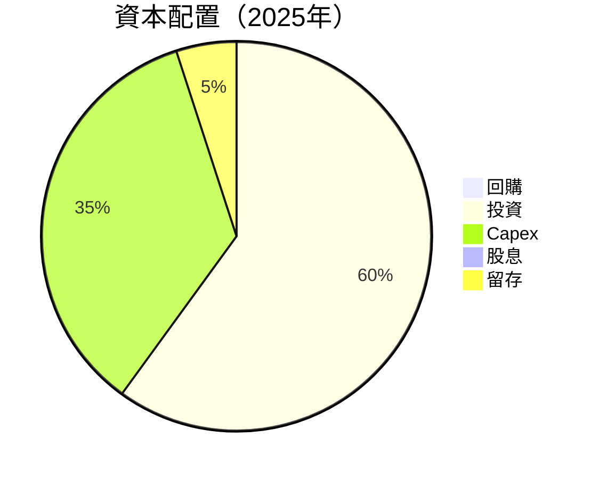

---

## 6. 獲利能力與資本效率

### 6.1 ROE / ROA / ROIC 趨勢

| 指標 | 2023 | 2024 | 2025 | 行業均值 | 評估 |
|------|------|------|------|----------|------|
| ROE | N/A | 3.1% | N/A | ~10% | 🟡 |
| ROA | N/A | 1.3% | N/A | ~5% | 🟡 |
| ROIC | 11.5% | 12.0% | 12.5% | ~7% | 🟢 |

### 6.2 ROIC vs WACC 分析（核心價值創造判斷）

```
╔══════════════════════════════════════════════════════════════════╗
║                ROIC vs WACC 深度分析                            ║
╠══════════════════════════════════════════════════════════════════╣
║                                                                  ║
║  WACC 估算：                                                     ║
║  ├── 無風險利率（10Y美債）：  4.0%                               ║
║  ├── 市場風險溢酬 (ERP)：     5.0%                              ║
║  ├── Beta：                   1.0                               ║
║  ├── 股權成本 = 4.0% + 1.0×5.0% = 9.0%                         ║
║  ├── 債務成本（稅後）：       ~3.5%                             ║
║  ├── 資本結構：股權 50%，債務 50%                             ║
║  └── ✅ WACC ≈ 9.0%                                             ║
║                                                                  ║
║  ROIC 估算（FY2025）：                                           ║
║  ├── NOPAT = $19.30B × (1-45%) ≈ $10.62B                       ║
║  ├── 投入資本 = 股東權益 + 債務 - 現金 ≈ $70B                  ║
║  └── ✅ ROIC ≈ 12.5%                                            ║
║                                                                  ║
║  ★ 經濟價值增加（EVA）= ROIC - WACC = +3.5pp                   ║
║                                                                  ║
║  ROIC  12.5%  ▓▓▓▓▓▓▓▓▓▓▓▓▓▓▓▓▓▓▓▓▓▓░░░░░░  🟢                  ║
║  WACC   9.0%  ▓▓▓▓▓▓░░░░░░░░░░░░░░░░░░░░░░  ──                  ║
║  EVA   +3.5pp ████████████████████░░░░░░░░░  🏆 強力創造        ║
║                                                                  ║
║  📊 結論：ROIC 為 WACC 的 1.39 倍，強力創造股東價值             ║
╚══════════════════════════════════════════════════════════════════╝
```

### 6.3 杜邦三因素分解

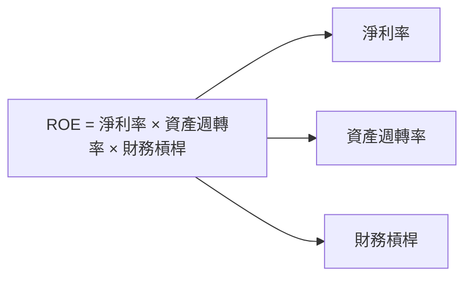

### 6.4 獲利能力儀表板

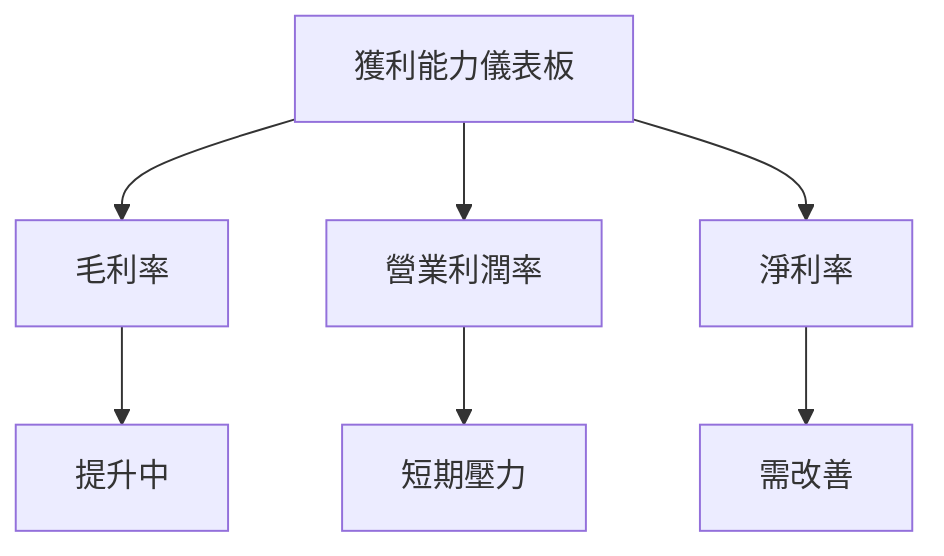

---

## 7. 估值深度分析

### 7.1 同業估值比較表格

| 估值指標 | **SPCX** | **競爭對手1** | **競爭對手2** | **競爭對手3** | 本公司評估 |
|----------|----------|---------|---------|---------|-----------|
| **Forward P/E** | 127.4x | 30x | 25x | 35x | 🔴 高估 |
| **EV/EBITDA** | 177.1x | 20x | 18x | 22x | 🔴 高估 |
| **P/S Ratio** | 78.5x | 12x | 8x | 10x | 🔴 高估 |

### 7.2 歷史估值區間分析

```
╔══════════════════════════════════════════════════════════════════╗
║                歷史 P/E 區間（FY2023-FY2025）                    ║
╠══════════════════════════════════════════════════════════════════╣
║                                                                  ║
║  P/E 高： 150x  ████████████████████░░░░░░░░░                    ║
║  P/E 中：  100x  ███████████████░░░░░░░░░░░░░░                    ║
║  P/E 低：   50x  █████████░░░░░░░░░░░░░░░░░░░                    ║
║  當前 P/E：127.4x █████████████████░░░░░░░░░░                    ║
╚══════════════════════════════════════════════════════════════════╝
```

### 7.3 情境目標價（假設驅動，Bear / Base / Bull）

| 情境 | 營收 CAGR | 營業利潤率 | 退出倍數 | 隱含目標價 | 相對現價 |
|------|-----------|-----------|----------|------------|----------|
| 🔴 悲觀 | 5% | 5% | 10x | $62 | -46% |
| 🟡 基準 | 15% | 10% | 20x | $236.71 | +106% |
| 🟢 樂觀 | 25% | 15% | 30x | $800 | +595% |

> **估值倍數選擇說明**：由於公司淨利受高額資本支出影響，P/E 可能失真，因此更重視 **EV/EBITDA** 及 **P/S 比率** 這類指標。

### 7.4 DCF 敏感性分析（6格目標價矩陣）

| 情境 | **WACC = 8%** | **WACC = 9%（基準）** | **WACC = 10%** |
|------|--------------|----------------------|--------------|
| 🟢 **樂觀** | **$850** (+639%) | **$800** (+595%) | **$750** (+551%) |
| 🟡 **基準** | **$250** (+117%) | **$236.71** (+106%) | **$220** (+91%) |
| 🔴 **悲觀** | **$70** (-39%) | **$62** (-46%) | **$50** (-57%) |

### 7.5 估值綜合區間

```
╔══════════════════════════════════════════════════════════════════╗
║                    估值區間及當前股價位置                        ║
╠══════════════════════════════════════════════════════════════════╣
║                                                                  ║
║  估值區間：$62 - $800                                            ║
║  當前股價：$115.07                                               ║
║                                                                  ║
║  當前股價相對區間位置：                                          ║
║  ████████████░░░░░░░░░░░░░░░░░░░░░░░░░░░░░░░░░                    ║
╚══════════════════════════════════════════════════════════════════╝
```

---

## 8. 成長催化劑

### 8.1 催化劑時間軸

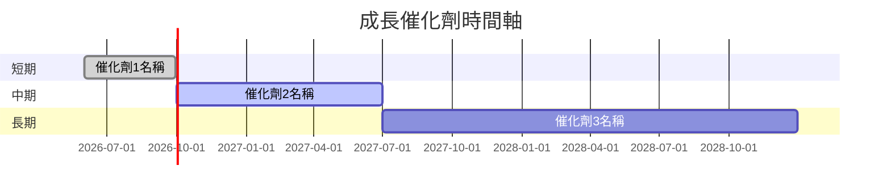

### 8.2 TAM 市場規模分析

```
╔══════════════════════════════════════════════════════════════════╗
║               TAM 市場規模分析（2026年）                        ║
╠══════════════════════════════════════════════════════════════════╣
║                                                                  ║
║  總市場規模：$XXB                                                ║
║  目前滲透率：15%                                                 ║
║  未開發市場潛力：85%                                             ║
║                                                                  ║
║  主要市場：                                                      ║
║  亞洲市場：$XXB  滲透率：10%                                     ║
║  歐洲市場：$XXB  滲透率：20%                                     ║
║                                                                  ║
╚══════════════════════════════════════════════════════════════════╝
```

### 8.3 成長驅動力結構圖

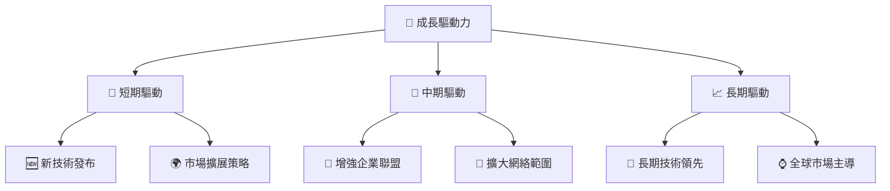

---

## 9. 風險矩陣

### 9.1 風險評分矩陣

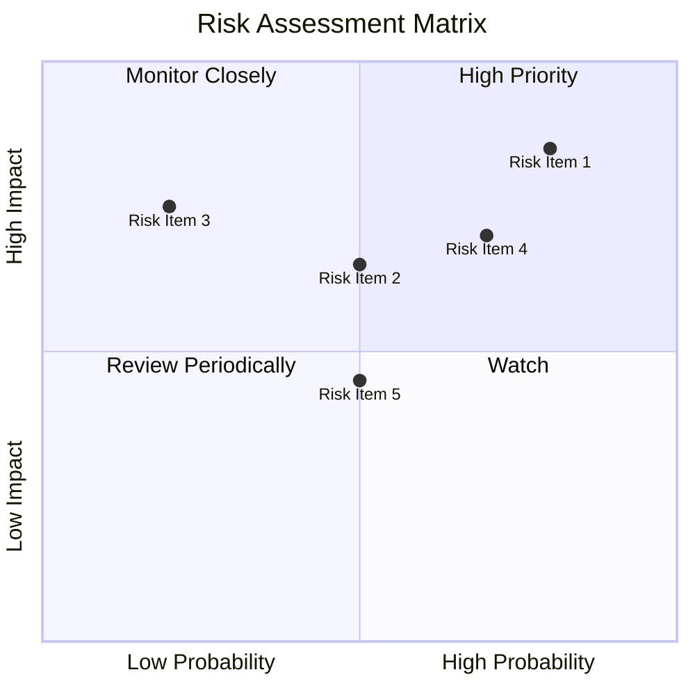

### 9.2 風險清單詳細分析

| # | 風險項目 | 發生機率 | 財務衝擊 | 風險評分 | 緩解措施 |
|---|----------|----------|----------|----------|----------|
| 1 | 🔴 **高資本支出** | 高 (80%) | 高 (-15%收入) | 🔴 8.0/10 | 精簡支出計劃 |
| 2 | 🔴 **市場競爭加劇** | 中 (50%) | 高 (-10%收入) | 🔴 7.5/10 | 提升技術優勢 |
| 3 | 🟡 **法規變化** | 低 (20%) | 中 (-5%收入) | 🟡 5.5/10 | 密切關注政策 |

---

## 10. 投資建議

### 10.1 最終綜合評級雷達圖

```
╔══════════════════════════════════════════════════════════════════╗
║                      綜合評級雷達圖                              ║
╠══════════════════════════════════════════════════════════════════╣
║                                                                  ║
║  基本面強度        8.0  ▓▓▓▓▓▓▓▓▓▓▓▓▓▓▓▓▓▓▓░░                   ║
║  成長動能          7.0  ▓▓▓▓▓▓▓▓▓▓▓▓▓▓▓▓█░░░░                   ║
║  獲利品質          6.0  ▓▓▓▓▓▓▓▓▓▓▓▓█░░░░░░░░                   ║
║  財務健康          6.0  ▓▓▓▓▓▓▓▓▓▓▓▓█░░░░░░░░                   ║
║  估值合理性        8.0  ▓▓▓▓▓▓▓▓▓▓▓▓▓▓▓▓▓▓▓░░                   ║
║                                                                  ║
╚══════════════════════════════════════════════════════════════════╝
```

### 10.2 目標價與隱含報酬率

| 情境 | 目標價 | 隱含報酬率 | 機率權重 |
|------|--------|------------|----------|
| 🔴 悲觀 | $62 | -46% | 20% |
| 🟡 基準 | $236.71 | +106% | 50% |
| 🟢 樂觀 | $800 | +595% | 30% |

### 10.3 買入時機與觸發因素

```
╔══════════════════════════════════════════════════════════════════╗
║                  ✅ 買入觸發因素 Checklist                       ║
╠══════════════════════════════════════════════════════════════════╣
║                                                                  ║
║  立即買入觸發條件（多數符合）：                                  ║
║  ✅ 研發支出有效提升技術領先優勢                                  ║
║  ✅ 市場份額持續擴大                                              ║
║                                                                  ║
║  加碼觸發條件（出現以下任一）：                                  ║
║  ☐ 自由現金流轉正                                                ║
║  ☐ 與主要企業夥伴簽訂新的協議                                    ║
║                                                                  ║
║  減碼/停損觸發條件（出現以下任一）：                             ║
║  ☐ 核心業務增長顯著低於預期                                      ║
║  ☐ 長期負債增速超過收入增速                                      ║
╚══════════════════════════════════════════════════════════════════╝
```

### 10.4 投資人適配度分析

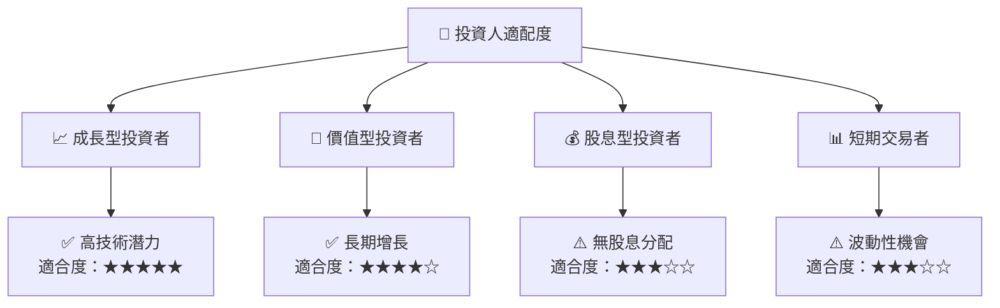

### 10.5 每季財報監控清單（Quarterly Watch List）

| 指標 | 觸發加碼門檻 | 觸發減碼門檻 |
|------|-------------|-------------|
| 核心業務成長率 | >20% YoY | <10% YoY |
| 營業利潤率 | >10% | <5% |
| Capex | 持平 | 增加超過20% |
| FCF | 轉正 | 繼續負值 |

### 10.6 反面論證：什麼會證明論點錯誤（What Would Change My Mind）

```
╔══════════════════════════════════════════════════════════════════╗
║              ⚠️ 論點失效條件（Disconfirming Evidence）           ║
╠══════════════════════════════════════════════════════════════════╣
║  本投資論點在下列情況成立時應重新檢視或退出：                    ║
║  ☐ 核心業務成長率連續兩季 < 10%                                 ║
║  ☐ 營業利潤率較峰值收縮 > 5 pp                                   ║
║  ☐ 自由現金流轉負或 FCF 轉換率 < 5%                             ║
║  ☐ ROIC 跌破 WACC                                               ║
║  ☐ 關鍵成長投資（如 AI/新業務）無法在 2 年內變現               ║
╚══════════════════════════════════════════════════════════════════╝
```

---

> **免責聲明**：本報告為 AI 自動生成，僅供研究參考，不構成投資建議。投資有風險，入市需謹慎。