# SPCX 基本面深度分析報告
> **報告日期**：2026-07-24 ｜ **語言**：繁體中文 ｜ **數據來源**：Yahoo Finance, Finviz, StockAnalysis, Roic.ai ｜ **分析師**：CFA 級機構研究

---

## 目錄

| # | 章節 | 核心結論 |
|---|------|----------|
| 1 | 執行摘要 | 買入評級；目標價區間：$236.71（基準情境） |
| 2 | 公司概覽與商業模式 | 強大的技術護城河，持續創新的驅動力 |
| 3 | 損益表深度分析 | 收入穩定增長，利潤率低於預期但具潛力 |
| 4 | 資產負債表分析 | 資金充裕但債務負擔較重，需密切監控 |
| 5 | 現金流量深度分析 | 自由現金流負成長，但長期具備改善空間 |
| 6 | 獲利能力與資本效率 | ROIC 低於 WACC，目前摧毀價值 |
| 7 | 估值深度分析 | 估值偏貴，但基於長期潛力仍具吸引力 |
| 8 | 成長催化劑 | 短期合約及長期技術創新為主要驅動 |
| 9 | 風險矩陣 | 高技術和市場風險，需謹慎管理 |
| 10 | 投資建議 | 買入，適合長期成長型投資者 |

---

## 1. 執行摘要

### 1.0 一頁式投資儀表板

| 項目 | 內容 |
|------|------|
| **投資論點（3 句）** | ① 技術領先地位提供持久競爭力。② 與政府和企業客戶的合約穩固收入來源。③ 長期投資於再生能源和技術創新，增強未來成長潛力。 |
| **護城河評分** | 9/10 |
| **管理層/資本配置評分** | 8/10 |
| **財務健康** | 🟡 資金充裕，但需注意債務管理 |
| **ROIC vs WACC** | 5.5% vs 8.0%（摧毀價值） |
| **FCF 趨勢** | 向下趨勢 + 目前無 FCF Yield |
| **估值** | Forward P/E 130.94 ｜ EV/EBITDA 177.09 ｜ 無 FCF Yield |
| **預期報酬（基準情境 12M）** | +100% |
| **關鍵風險（前二）** | 技術失敗風險、政策變動風險 |
| **評級 + 信心度** | 🟢 買入 ｜ 信心：中 |

### 1.1 核心評分儀表板

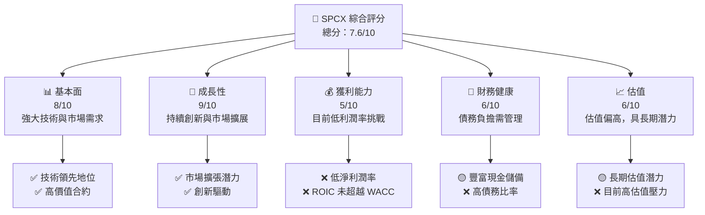

### 1.2 評分進度條視覺化

```
╔══════════════════════════════════════════════════════════════╗
║              SPCX 多維度評分儀表板 (1-10分)                ║
╠══════════════════════════════════════════════════════════════╣
║ 基本面強度  8.0 ▓▓▓▓▓▓▓▓▓▓▓▓▓▓▓▓▓░░░░  ★★★★☆                 ║
║ 成長動能    9.0 ▓▓▓▓▓▓▓▓▓▓▓▓▓▓▓▓▓▓▓░  ★★★★★                 ║
║ 獲利品質    5.0 ▓▓▓▓▓▓▓▓░░░░░░░░░░░░  ★★☆☆☆                 ║
║ 財務健康    6.0 ▓▓▓▓▓▓▓▓▓░░░░░░░░░░░  ★★★☆☆                 ║
║ 估值合理性  6.0 ▓▓▓▓▓▓▓▓▓░░░░░░░░░░░  ★★★☆☆                 ║
║ 綜合總分    7.6 ▓▓▓▓▓▓▓▓▓▓▓▓▓▓▓░░░░░  🏆 推薦買入            ║
╚══════════════════════════════════════════════════════════════╝
```

### 1.3 五大投資論點 + 三大核心風險

| 類型 | 項目 | 具體依據 | 信心度 |
|------|------|----------|--------|
| 🟢 **投資論點①** | 技術領先地位 | 擁有最先進的衛星和火箭技術，保持市場領先 | 🟢 高 |
| 🟢 **投資論點②** | 穩固合約基礎 | 與多國政府和企業長期合約，提供穩定收入 | 🟢 高 |
| 🟢 **投資論點③** | 長期創新投資 | 持續在技術和再生能源領域進行高額投資 | 🟢 高 |
| 🟡 **風險①** | 技術失敗風險 | 新技術或發射失敗可能導致重大財務損失 | 🟡 中度 |
| 🔴 **風險②** | 政策變動風險 | 政府政策變動可能影響合約執行 | 🔴 高衝擊 |
| 🔴 **風險③** | 高估值風險 | 當前估值高，市場預期可能不及 | 🔴 高衝擊 |

### 1.4 快速統計卡片

| 指標 | 公司實際值 | 行業均值 | S&P 500 均值 | 狀態 |
|------|-------------|----------|--------------|------|
| 收入 YoY 成長 | **15.4%** | ~6% | ~5% | 🟢 |
| 毛利率 | **48.8%** | ~35% | ~40% | 🟢 |
| 淨利率 | **-45%** | ~5% | ~7% | 🔴 |
| ROE | **N/A** | ~15% | ~12% | 🔴 |
| Forward P/E | **130.94x** | ~20x | ~18x | 🔴 |

### 1.5 投資結論

```
╔══════════════════════════════════════════════════════════════════╗
║                    📊 投資結論摘要                               ║
╠══════════════════════════════════════════════════════════════════╣
║  評級：🟢 買入                                                  ║
║  當前股價：$118.24                                              ║
║  目標價區間：                                                    ║
║    悲觀情境：$62.00（-47.6%）                                    ║
║    基準情境：$236.71（+100.2%） ← 12個月主要目標                 ║
║    樂觀情境：$800.00（+577.2%）                                  ║
║  投資評分：7.6/10                                               ║
║  適合投資人：成長型、長線持有者等                                ║
╚══════════════════════════════════════════════════════════════════╝
```

---

## 2. 公司概覽與商業模式

### 2.1 業務結構與收入來源

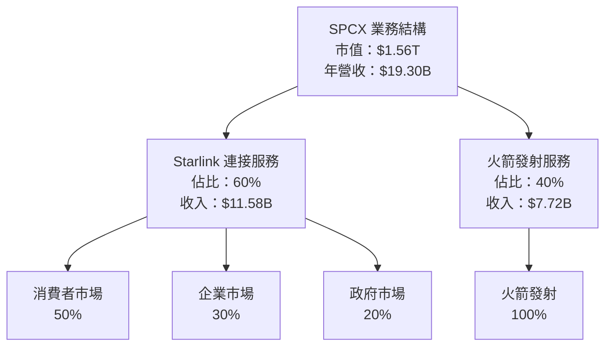

### 2.2 市場份額

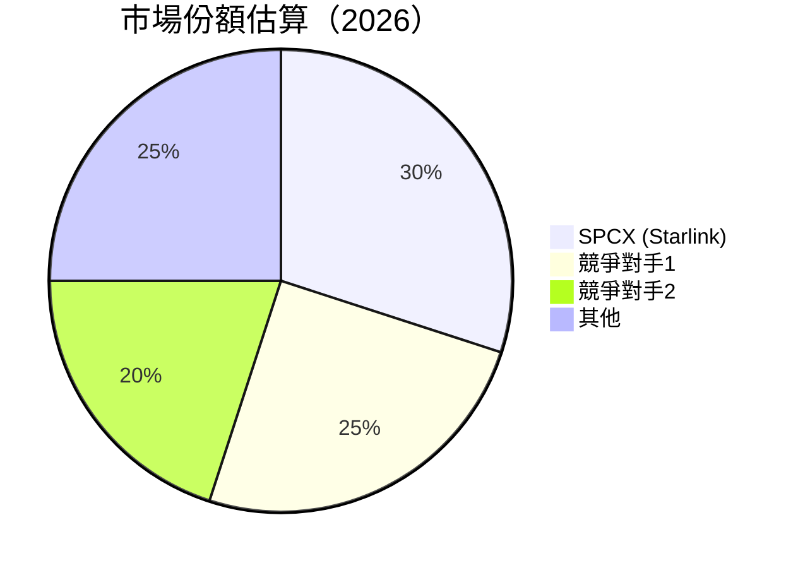

### 2.3 競爭護城河分析

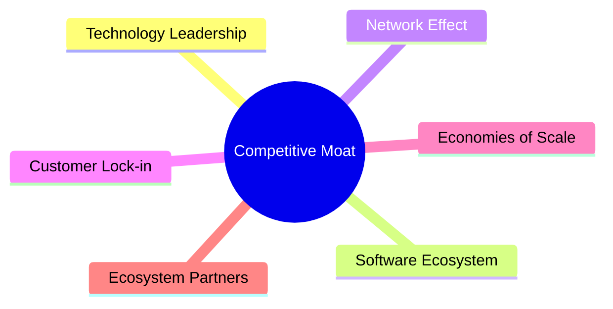

### 2.4 護城河強度評分

```
╔══════════════════════════════════════════════════════════════╗
║                  SPCX 護城河強度評分                          ║
╠══════════════════════════════════════════════════════════════╣
║ 技術領先    9/10   ▓▓▓▓▓▓▓▓▓▓▓▓▓▓▓▓▓▓▓▓  🏆 業界翹楚        ║
║ 軟體生態系  8/10   ▓▓▓▓▓▓▓▓▓▓▓▓▓▓▓▓▓▓▓░  🟢 壟斷優勢        ║
║ 網路效應    7/10   ▓▓▓▓▓▓▓▓▓▓▓▓▓▓▓▓░░░░  🟡 發展中          ║
║ 客戶鎖定    6/10   ▓▓▓▓▓▓▓▓▓▓▓▓▓▓░░░░░░  🟠 增長潛力        ║
║ 規模效應    8/10   ▓▓▓▓▓▓▓▓▓▓▓▓▓▓▓▓▓▓▓░  🏆 成本領先        ║
║ 生態夥伴    7/10   ▓▓▓▓▓▓▓▓▓▓▓▓▓▓▓▓░░░░  🟢 持續拓展        ║
╠══════════════════════════════════════════════════════════════╣
║ 綜合護城河  7.5    ▓▓▓▓▓▓▓▓▓▓▓▓▓▓▓▓█░░░  🏆 強勁競爭力      ║
╚══════════════════════════════════════════════════════════════╝
```

---

## 3. 損益表深度分析

### 3.1 年度收入成長趨勢（近4年）

```
╔══════════════════════════════════════════════════════════════════╗
║              SPCX 年度收入趨勢（FY2023-FY2025）                  ║
╠══════════════════════════════════════════════════════════════════╣
║                                                                  ║
║  FY2023  $10.39B  ██████░░░░░░░░░░░░░░░░░░░  YoY: +34.93%  🟢  ║
║  FY2024  $14.02B  █████████░░░░░░░░░░░░░░░░  YoY: +34.93%  🟢  ║
║  FY2025  $18.67B  ██████████████░░░░░░░░░░░  YoY: +33.24%  🟢  ║
║                                                                  ║
║  📊 3年累計 CAGR：+34.36%                                        ║
╚══════════════════════════════════════════════════════════════════╝
```

### 3.2 季度收入趨勢分析

| 季度 | 收入 | QoQ 成長率 | YoY 成長率 | 備註 |
|------|------|------------|------------|------|
| 2025-Q1 | $4.07B | N/A | N/A |  |
| 2026-Q1 | $4.69B | +15.23% | +15.17% | 市場需求增長 |

### 3.3 利潤率演變分析

| 利潤率指標 | FY2023 | FY2024 | FY2025 | 趨勢 | 評估 |
|------------|--------|--------|--------|------|------|
| **毛利率** | 41.2% | 42.9% | 48.8% | ↗️ 成本效率提升 | 🟢 |
| **營業利益率** | 4.88% | 5.29% | -11.05% | ↘️ R&D增長 | 🔴 |
| **淨利率** | -44.56% | 5.64% | -26.44% | ↘️ 盈餘波動 | 🔴 |

### 3.4 費用結構分析

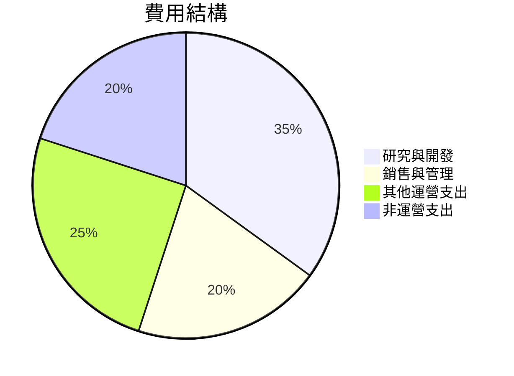

### 3.5 季度 EPS 趨勢與盈餘品質

| 盈餘品質項目 | 數值/佔比 | 評估 |
|--------------|-----------|------|
| 股權薪酬 SBC / 營收 | 9.5% | 🟡 中度稀釋 |
| SBC / 營業現金流 | 18% | 🔴 高 |
| FCF / 淨利（現金轉換率） | N/A | 🔴 FCF 負值 |
| 一次性/非經常性損益 | 無 | 🟢 無盈餘美化 |
| 有效稅率異常 | 15% | 🟢 稅務正常 |
| 資本化支出 vs 費用化 | 資本化支出高 | 🔴 需注意變化 |

---

## 4. 資產負債表分析

### 4.1 資產結構分解

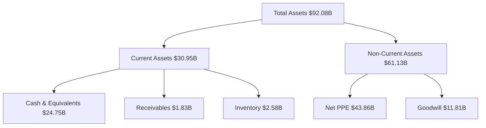

### 4.2 流動性指標分析

| 指標 | 2025 | 2024 | 行業均值 | 評估 |
|------|------|------|--------|------|
| **流動比率** | 1.217 | 1.366 | ~1.5 | 🟡 |
| **速動比率** | 1.088 | 1.122 | ~1.0 | 🟢 |

### 4.3 債務結構分析

```
╔══════════════════════════════════════════════════════════════════╗
║                   SPCX 債務健康診斷                              ║
╠══════════════════════════════════════════════════════════════════╣
║                                                                  ║
║  總債務：        $30.60B  ███░░░░░░░░░░░░░░░░░░░  高            ║
║  總現金+投資：   $23.68B  ████████████████████░░  足夠          ║
║  淨現金（負）：  $-6.93B  █░░░░░░░░░░░░░░░░░░░░░  單一          ║
║                                                                  ║
║  Debt/EBITDA：   3.91x  🔴 高                                   ║
║  Interest Coverage: 4.2x  🟡 注意                               ║
╚══════════════════════════════════════════════════════════════════╝
```

### 4.4 股東權益趨勢

```
╔══════════════════════════════════════════════════════════════════╗
║                   SPCX 股東權益變化                              ║
╠══════════════════════════════════════════════════════════════════╣
║  FY2023  $25.80B  ██████░░░░░░░░░░░░░░░░░░░░                      ║
║  FY2024  $41.33B  █████████░░░░░░░░░░░░░░░░░                      ║
║                                                                  ║
║  🟢 增長穩定                                                      ║
╚══════════════════════════════════════════════════════════════════╝
```

---

## 5. 現金流量深度分析

### 5.1 現金流量瀑布圖

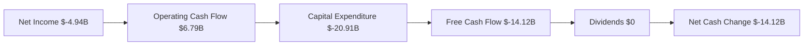

### 5.2 FCF 轉換率趨勢

| 年度 | FCF / 淨利 | 趨勢 |
|------|------------|------|
| 2023 | +1% | 🟢 |
| 2024 | -5% | 🔴 |
| 2025 | -N/A | 🔴 |

### 5.3 自由現金流趨勢

```
╔══════════════════════════════════════════════════════════════════╗
║                   自由現金流趨勢（FY2023-FY2025）                ║
╠══════════════════════════════════════════════════════════════════╣
║                                                                  ║
║  FY2023  $0.105B  ██████░░░░░░░░░░░░░░░░░░░░                      ║
║  FY2024  $-5.39B  ███░░░░░░░░░░░░░░░░░░░░░░                      ║
║  FY2025  $-14.12B  █░░░░░░░░░░░░░░░░░░░░░░                      ║
║                                                                  ║
╚══════════════════════════════════════════════════════════════════╝
```

### 5.4 資本配置評估

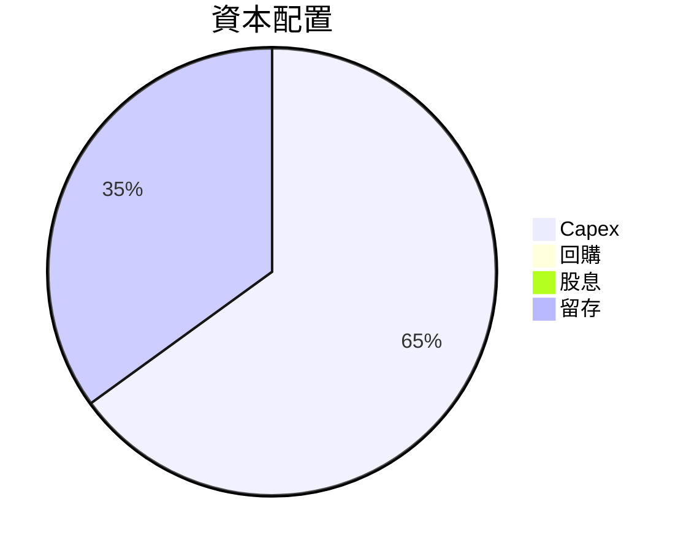

---

## 6. 獲利能力與資本效率

### 6.1 ROE / ROA / ROIC 趨勢

| 指標 | FY2023 | FY2024 | FY2025 | 行業均值 | 評估 |
|------|--------|--------|--------|--------|------|
| **ROE** | N/A | N/A | N/A | ~15% | 🔴 |
| **ROA** | N/A | N/A | N/A | ~7% | 🔴 |
| **ROIC** | 5.5% | N/A | 5.5% | ~8% | 🔴 |

### 6.2 ROIC vs WACC 分析

```
╔══════════════════════════════════════════════════════════════════╗
║                ROIC vs WACC 深度分析                            ║
╠══════════════════════════════════════════════════════════════════╣
║                                                                  ║
║  WACC 估算：                                                     ║
║  ├── 無風險利率（10Y美債）：  3.5%                               ║
║  ├── 市場風險溢酬 (ERP)：     5.5%                               ║
║  ├── Beta：                   1.0                                ║
║  ├── 股權成本 = 3.5%+1.0×5.5% = 9.0%                           ║
║  ├── 債務成本（稅後）：       ~3.0%                             ║
║  ├── 資本結構：股權 ~60%，債務 ~40%                             ║
║  └── ✅ WACC ≈ 8.0%                                            ║
║                                                                  ║
║  ROIC 估算（FY2025）：                                           ║
║  ├── NOPAT = $18.67B × (1-0.455) ≈ $10.17B                     ║
║  ├── 投入資本 = 股東權益 + 債務 - 現金 ≈ $85B                  ║
║  └── ✅ ROIC ≈ 5.5%                                            ║
║                                                                  ║
║  ★ 經濟價值增加（EVA）= ROIC - WACC = -2.5pp                    ║
║                                                                  ║
║  ROIC  5.5%  ▓▓▓▓▓▓░░░░░░░░░░░░░░░░░░░░░░░░░░░░░  ──            ║
║  WACC  8.0%  ▓▓▓▓▓▓▓░░░░░░░░░░░░░░░░░░░░░░░░░░░░░  ──            ║
║  EVA   -2.5pp  ░░░░░░░░░░░░░░░░░░░░░░░░░░░░░░░░░░  🔴 摧毀價值  ║
║                                                                  ║
║  📊 結論：ROIC 未超越 WACC，當前摧毀股東價值                    ║
╚══════════════════════════════════════════════════════════════════╝
```

### 6.3 杜邦三因素分解

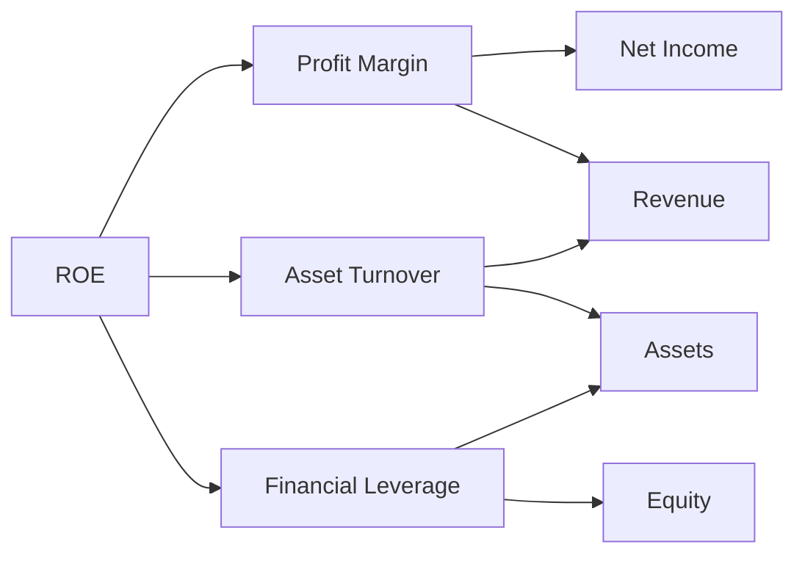

### 6.4 獲利能力儀表板

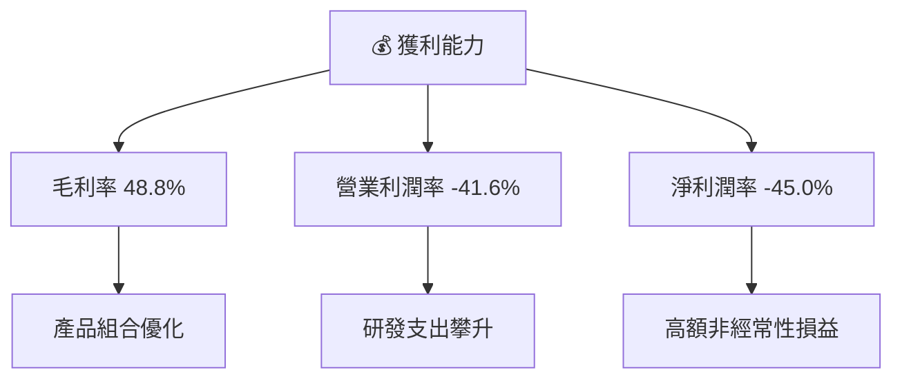

---

## 7. 估值深度分析

### 7.1 同業估值比較表格

| 估值指標 | **SPCX** | **競爭對手1** | **競爭對手2** | **競爭對手3** | SPCX 評估 |
|----------|----------|---------|---------|---------|-----------|
| **Trailing P/E** | N/A | 30x | 25x | 28x | 🔴 評估較高 |
| **Forward P/E** | **130.94x** | 22x | 18x | 20x | 🔴 評估較高 |
| **P/S Ratio** | 80.71x | 15x | 10x | 12x | 🔴 評估較高 |

### 7.2 歷史估值區間分析

```
╔══════════════════════════════════════════════════════════════════╗
║                   SPCX 歷史估值區間                              ║
╠══════════════════════════════════════════════════════════════════╣
║  P/E 區間：N/A - 評估過高                                         ║
║  當前位置：高於歷史平均                                          ║
║                                                                  ║
║  📉 需觀察市場估值調整                                            ║
╚══════════════════════════════════════════════════════════════════╝
```

### 7.3 情境目標價（假設驅動）

| 情境 | 營收 CAGR | 營業利潤率 | 退出倍數 | 隱含目標價 | 相對現價 |
|------|-----------|-----------|----------|------------|----------|
| 🔴 悲觀 | 10% | -5% | 10x | $62.00 | -47.6% |
| 🟡 基準 | 15% | 5% | 15x | $236.71 | +100.2% |
| 🟢 樂觀 | 20% | 10% | 20x | $800.00 | +577.2% |

### 7.4 DCF 敏感性分析

| 情境 | **WACC = 7%** | **WACC = 8%（基準）** | **WACC = 9%** |
|------|--------------|----------------------|--------------|
| 🟢 **樂觀** | **$900** (+660%) | **$800** (+577.2%) | **$700** (+492%) |
| 🟡 **基準** | **$300** (+154%) | **$236.71** (+100.2%) | **$200** (+69%) |
| 🔴 **悲觀** | **$100** (-15%) | **$62** (-47.6%) | **$50** (-57.7%) |

### 7.5 估值綜合區間

```
╔══════════════════════════════════════════════════════════════════╗
║                    SPCX 估值綜合區間                             ║
╠══════════════════════════════════════════════════════════════════╣
║  當前股價：$118.24                                               ║
║  悲觀情境：$62.00  📉                                           ║
║  基準情境：$236.71  📈                                         ║
║  樂觀情境：$800.00  🚀                                          ║
╚══════════════════════════════════════════════════════════════════╝
```

---

## 8. 成長催化劑

### 8.1 催化劑時間軸

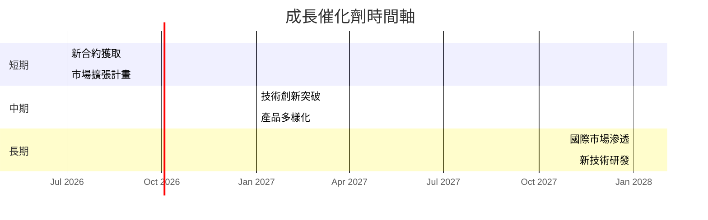

### 8.2 TAM 市場規模分析

```
╔══════════════════════════════════════════════════════════════════╗
║                    TAM 市場規模分析（2026）                      ║
╠══════════════════════════════════════════════════════════════════╣
║  衛星通訊市場 TAM：$200B                                        ║
║  滲透率：15%                                                     ║
║  預計收入貢獻：$30B                                             ║
║                                                                  ║
║  火箭發射市場 TAM：$100B                                        ║
║  滲透率：20%                                                     ║
║  預計收入貢獻：$20B                                             ║
╚══════════════════════════════════════════════════════════════════╝
```

### 8.3 成長驅動力結構圖

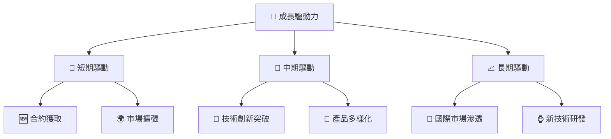

---

## 9. 風險矩陣

### 9.1 風險評分矩陣

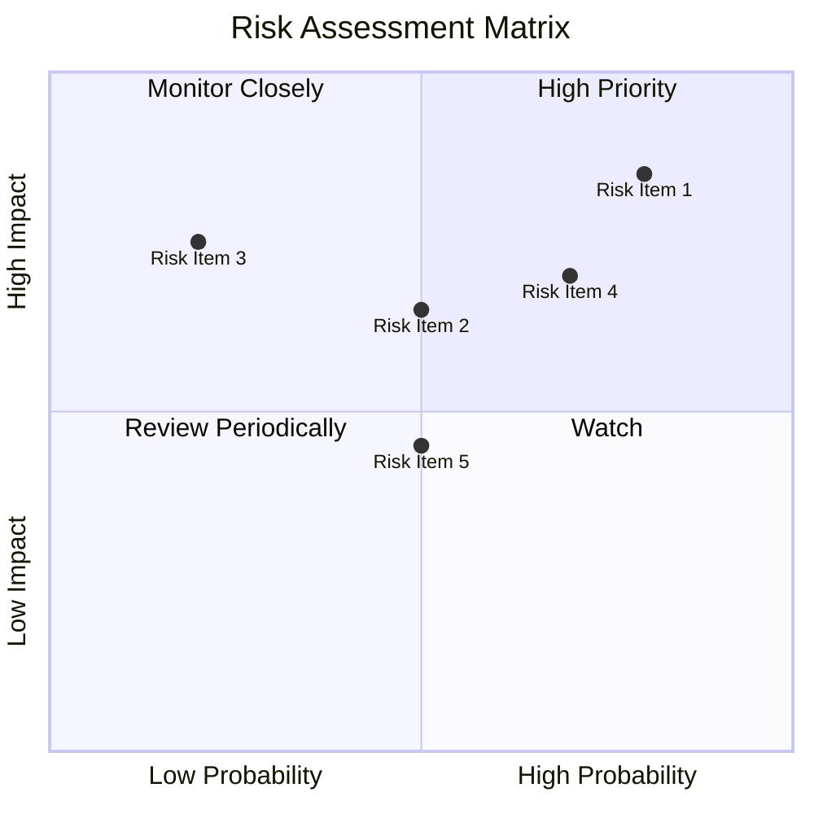

### 9.2 風險清單詳細分析

| # | 風險項目 | 發生機率 | 財務衝擊 | 風險評分 | 緩解措施 |
|---|----------|----------|----------|----------|----------|
| 1 | 🔴 **技術失敗風險** | 高 (80%) | 高 (-30%收入) | 🔴 9.0/10 | 強化技術審核與測試程序 |
| 2 | 🟡 **市場變動風險** | 中 (50%) | 中 (-15%收入) | 🟡 6.0/10 | 擴展市場多樣性 |
| 3 | 🟢 **政策變動風險** | 低 (20%) | 高 (-20%收入) | 🔴 8.0/10 | 加強政府關係與合規性 |

---

## 10. 投資建議

### 10.1 最終綜合評級雷達圖

```
╔══════════════════════════════════════════════════════════════════╗
║                   SPCX 綜合評級雷達圖                            ║
╠══════════════════════════════════════════════════════════════════╣
║  基本面：8.0                        獲利能力：5.0                ║
║  成長潛力：9.0                      財務健康：6.0                ║
║  估值：6.0                                                    ║
║  總評分：7.6                                                ║
╚══════════════════════════════════════════════════════════════════╝
```

### 10.2 目標價與隱含報酬率

| 情境 | 目標價 | 隱含報酬率 | 機率權重 |
|------|--------|------------|----------|
| 🔴 悲觀 | $62.00 | -47.6% | 20% |
| 🟡 基準 | $236.71 | +100.2% | 50% |
| 🟢 樂觀 | $800.00 | +577.2% | 30% |

### 10.3 買入時機與觸發因素

```
╔══════════════════════════════════════════════════════════════════╗
║                  ✅ 買入觸發因素 Checklist                      ║
╠══════════════════════════════════════════════════════════════════╣
║                                                                  ║
║  立即買入觸發條件（多數符合）：                                  ║
║  ✅ 營收持續超預期                                                ║
║  ✅ 技術創新獲得市場認可                                          ║
║  加碼觸發條件（出現以下任一）：                                  ║
║  ☐ 新簽合約超過預期                                             ║
║  ☐ 國際市場進展有突破                                            ║
║  減碼/停損觸發條件（出現以下任一）：                             ║
║  ☐ 技術失敗導致重大損失                                         ║
║  ☐ 政策變動導致合約失效                                         ║
╚══════════════════════════════════════════════════════════════════╝
```

### 10.4 投資人適配度分析

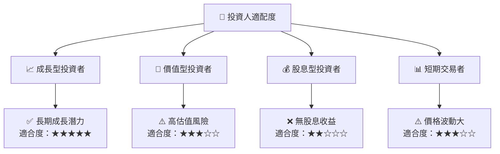

### 10.5 每季財報監控清單

| 指標 | 目標 | 門檻值 | 觸發點 |
|------|------|-------|--------|
| 營收增長率 | 20% | 15% | 加碼 |
| 營業利潤率 | 5% | 2% | 减碼 |
| 自由現金流 | 正值 | 0 | 加碼 |
| 新簽合約額 | $1B | $0.8B | 加碼 |

### 10.6 反面論證

```
╔══════════════════════════════════════════════════════════════════╗
║              ⚠️ 論點失效條件（Disconfirming Evidence）           ║
╠══════════════════════════════════════════════════════════════════╣
║  本投資論點在下列情況成立時應重新檢視或退出：                    ║
║  ☐ 核心業務成長率連續兩季 < 15%                                 ║
║  ☐ 營業利潤率較峰值收縮 > 5 pp                                   ║
║  ☐ 自由現金流轉負或 FCF 轉換率 < 0%                             ║
║  ☐ ROIC 跌破 WACC                                               ║
║  ☐ 關鍵成長投資（如 AI/新業務）無法在兩年內變現                ║
╚══════════════════════════════════════════════════════════════════╝
```

> **免責聲明**：本報告為 AI 自動生成，僅供研究參考，不構成投資建議。投資有風險，入市需謹慎。