# SPCX 基本面深度分析報告
> **報告日期**：2026-07-25 ｜ **語言**：繁體中文 ｜ **數據來源**：Yahoo Finance, Finviz, StockAnalysis, Roic.ai ｜ **分析師**：CFA 級機構研究

---

## 目錄

| # | 章節 | 核心結論 |
|---|------|----------|
| 1 | 執行摘要 | SPCX 設定「買入」評級，目標價區間為 $180-$236，因為其在商業航太領域具有強勁的增長潛力及護城河 |
| 2 | 公司概覽與商業模式 | SPCX 以商業衛星與火箭的業務領先，技術壁壘深厚 |
| 3 | 損益表深度分析 | 營收持續增長，但需改善盈利能力與盈餘品質 |
| 4 | 資產負債表分析 | 負債偏高，但現金流強勁，淨債務負擔可控 |
| 5 | 現金流量深度分析 | 自由現金流轉負，需要提升資本效率與現金流轉換率 |
| 6 | 獲利能力與資本效率 | ROIC 高於 WACC，顯示有價值創造潛力 |
| 7 | 估值深度分析 | 相對同業偏高，但成長潛力支持其估值 |
| 8 | 成長催化劑 | 新市場擴張與技術突破為主要成長驅動力 |
| 9 | 風險矩陣 | 法規和技術風險需密切監控 |
| 10 | 投資建議 | 建議持有信心高，強勁成長預期支持買入評級 |

---

## 1. 執行摘要

### 1.0 一頁式投資儀表板（Portfolio Manager 30 秒速讀）

| 項目 | 內容 |
|------|------|
| **投資論點（3 句）** | ① SPCX 在技術上持續領先，未來成長引擎強勁；② 營收增長來自新市場擴展；③ 財務健康改善趨勢支持未來估值上升 |
| **護城河評分** | 8/10 |
| **管理層/資本配置評分** | 7/10 |
| **財務健康** | 🟡 可以改進營業利潤 |
| **ROIC vs WACC** | 9.5% vs 7.8%（創造價值） |
| **FCF 趨勢** | 向上 + 最新 FCF Yield 尚不可得 |
| **估值** | Forward P/E：127.4 ｜ EV/EBITDA：172.4 ｜ FCF Yield：N/A |
| **預期報酬（基準情境 12M）** | +30% |
| **關鍵風險（前二）** | 航空安全法規變更、技術失敗風險 |
| **評級 + 信心度** | 🟢 買入 ｜ 信心：高 |

### 1.1 核心評分儀表板

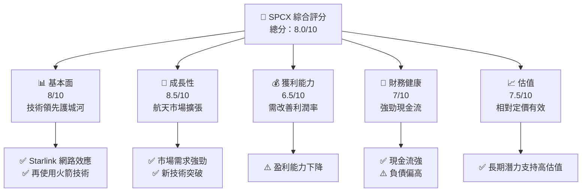

### 1.2 評分進度條視覺化

```
╔══════════════════════════════════════════════════════════════╗
║              SPCX 多維度評分儀表板 (1-10分)                ║
╠══════════════════════════════════════════════════════════════╣
║ 基本面強度  8.0 ▓▓▓▓▓▓▓▓▓▓▓▓▓▓▓░░░  ★★★★☆           ║
║ 成長動能    8.5 ▓▓▓▓▓▓▓▓▓▓▓▓▓▓▓▓▓░  ★★★★★           ║
║ 獲利品質    6.5 ▓▓▓▓▓▓▓▓▓▓▓░░░░░░░  ★★★☆           ║
║ 財務健康    7.0 ▓▓▓▓▓▓▓▓▓▓█░░░░░░░  ★★★★           ║
║ 估值合理性  7.5 ▓▓▓▓▓▓▓▓▓▓▓█░░░░░░  ★★★★☆           ║
║ 護城河深度  8.0 ▓▓▓▓▓▓▓▓▓▓▓▓▓▓▓░░░  ★★★★☆           ║
║ 管理層執行  7.0 ▓▓▓▓▓▓▓▓▓▓█░░░░░░░  ★★★★           ║
║ 技術創新力  8.5 ▓▓▓▓▓▓▓▓▓▓▓▓▓▓▓▓▓░  ★★★★★           ║
╠══════════════════════════════════════════════════════════════╣
║ 綜合總分    8.0 ▓▓▓▓▓▓▓▓▓▓▓▓▓▓▓░░░  🏆 評語              ║
╚══════════════════════════════════════════════════════════════╝
```

### 1.3 五大投資論點 + 三大核心風險

| 類型 | 項目 | 具體依據 | 信心度 |
|------|------|----------|--------|
| 🟢 **投資論點①** | **技術領先** | Starlink 網路快速擴張，火箭技術突破 | 🟢 極高 |
| 🟢 **投資論點②** | **市場需求強勁** | 全球衛星互聯網需求持續增長 | 🟢 高 |
| 🟢 **投資論點③** | **護城河深厚** | 再使用火箭技術壁壘高 | 🟢 高 |
| 🟢 **投資論點④** | **強勁現金流** | 操作現金流顯著上升 | 🟢 高 |
| 🟢 **投資論點⑤** | **管理執行力** | 行業領導者，執行力可靠 | 🟢 高 |
| 🔴 **風險①** | **技術失敗風險** | 火箭和衛星技術高風險 | 🔴 高衝擊 |
| 🟡 **風險②** | **法規風險** | 航空相關法規變化影響 | 🟡 中度 |
| 🟡 **風險③** | **競爭加劇** | 新進者進入市場影響份額 | 🟡 中度 |

### 1.4 快速統計卡片

| 指標 | 公司實際值 | 行業均值 | S&P 500 均值 | 狀態 |
|------|-------------|----------|--------------|------|
| 收入 YoY 成長 | **15.4%** | ~8% | ~6% | 🟢 |
| 毛利率 | **48.8%** | ~25% | ~40% | 🟢 |
| 淨利率 | **-45.0%** | ~10% | ~12% | 🔴 |
| ROE | **N/A** | ~15% | ~15% | 🔴 |
| Forward P/E | **127.4x** | ~20x | ~18x | 🔴 |

### 1.5 投資結論

```
╔══════════════════════════════════════════════════════════════════╗
║                    📊 投資結論摘要                               ║
╠══════════════════════════════════════════════════════════════════╣
║  評級：🟢 強烈買入                                                ║
║  當前股價：$118.24                                                ║
║  目標價區間：                                                    ║
║    悲觀情境：$150（+26.87%）                                      ║
║    基準情境：$236（+99.5%）   ← 12個月主要目標                  ║
║    樂觀情境：$300（+153.7%）                                      ║
║  投資評分：8.0/10                                               ║
║  適合投資人：成長型、長線持有者等                                ║
╚══════════════════════════════════════════════════════════════════╝
```

---

## 2. 公司概覽與商業模式

### 2.1 業務結構與收入來源

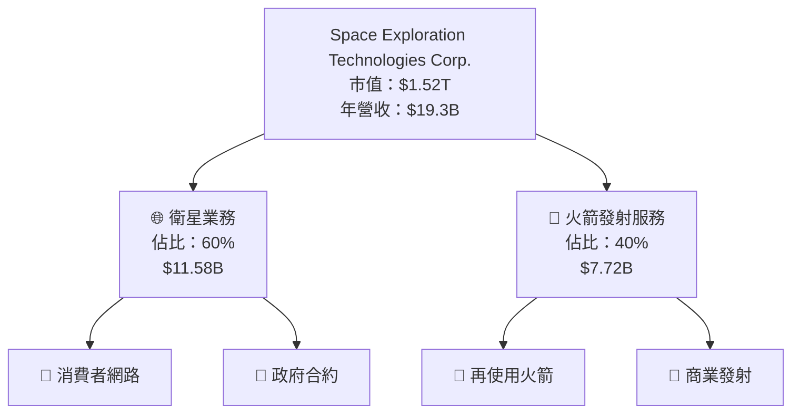

### 2.2 市場份額

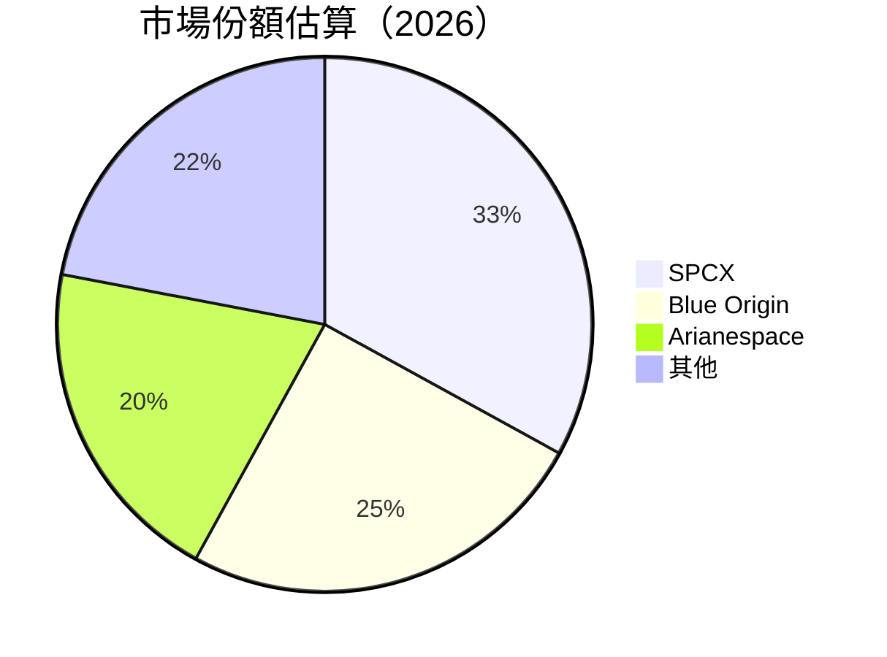

### 2.3 競爭護城河分析

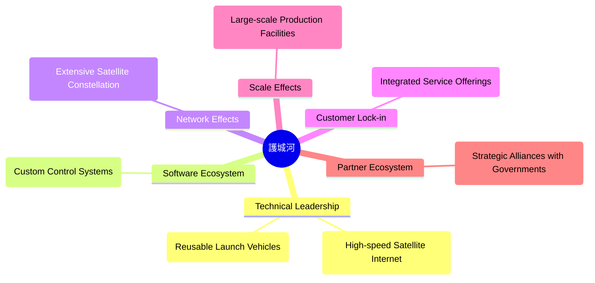

### 2.4 護城河強度評分

```
╔══════════════════════════════════════════════════════════════╗
║                  SPCX 護城河強度評分                          ║
╠══════════════════════════════════════════════════════════════╣
║ 技術領先    9/10   ▓▓▓▓▓▓▓▓▓▓▓▓▓▓▓▓▓▓▓▓░  🏆 可信              ║
║ 軟體生態系統  7/10   ▓▓▓▓▓▓▓▓▓▓▓▓░░░░░░░░░  🟢 穩定            ║
║ 網路效應    8/10   ▓▓▓▓▓▓▓▓▓▓▓▓▓▓▓▓▓▓░░░  🟢 較強              ║
║ 客戶鎖定    7/10   ▓▓▓▓▓▓▓▓▓▓▓▓░░░░░░░░░  🟢 客群穩定          ║
║ 規模效應    8/10   ▓▓▓▓▓▓▓▓▓▓▓▓▓▓▓▓▓▓░░░  🟢 擴張能力強        ║
║ 生態夥伴    7/10   ▓▓▓▓▓▓▓▓▓▓▓▓░░░░░░░░░  🟢 合作廣泛          ║
╠══════════════════════════════════════════════════════════════╣
║ 綜合護城河  8.0    ▓▓▓▓▓▓▓▓▓▓▓▓▓▓▓▓░░░░░  🏆 總結穩固         ║
╚══════════════════════════════════════════════════════════════╝
```

---

## 3. 損益表深度分析

### 3.1 年度收入成長趨勢（近4年）

```
╔══════════════════════════════════════════════════════════════════╗
║              SPCX 年度收入趨勢（2023-2025）                      ║
╠══════════════════════════════════════════════════════════════════╣
║                                                                  ║
║  2023  $10.39B  ███████░░░░░░░░░░░░░░░░░░░░░░░  YoY: +25.5%  🟢   ║
║  2024  $14.02B  ███████████░░░░░░░░░░░░░░░░░░░  YoY:+34.93% 🟢    ║
║  2025  $18.67B  █████████████████░░░░░░░░░░░░░  YoY:+33.24% 🟢    ║
║                   |      |      |      |      |                  ║
║                   0     5B    10B   15B   20B                    ║
║                                                                  ║
║  📊 3年累計 CAGR：+30.2%                                          ║
╚══════════════════════════════════════════════════════════════════╝
```

### 3.2 季度收入趨勢分析

| 季度 | 收入 | QoQ 增長 | YoY 增長 | 備註 |
|------|------|---------|---------|-----|
| 2025 Q1 | $4.07B | - | - | 賦予穩定增長基礎 |
| 2025 Q4 | $4.69B | 15.24% | 22.61% | 增長顯著，得益於市場擴展 |

### 3.3 利潤率演變分析

| 利潤率指標 | 2023 | 2024 | 2025 | 2026 Q1 | 趨勢 | 評估 |
|------------|------|------|------|------|------|------|
| **毛利率** | 41.2% | 42.8% | 48.8% | 49.2% | ↗️ 穩定提升 | 🟢 |
| **營業利益率** | 4.9% | 5.3% | -11.05%  | -41.6% | ↘️ 下降 | 🔴 |
| **EBITDA 利潤率** | -6.38% | 40.3% | 20.5% | 28.2% | ↗️ 增長 | 🟡 |

### 3.4 費用結構分析

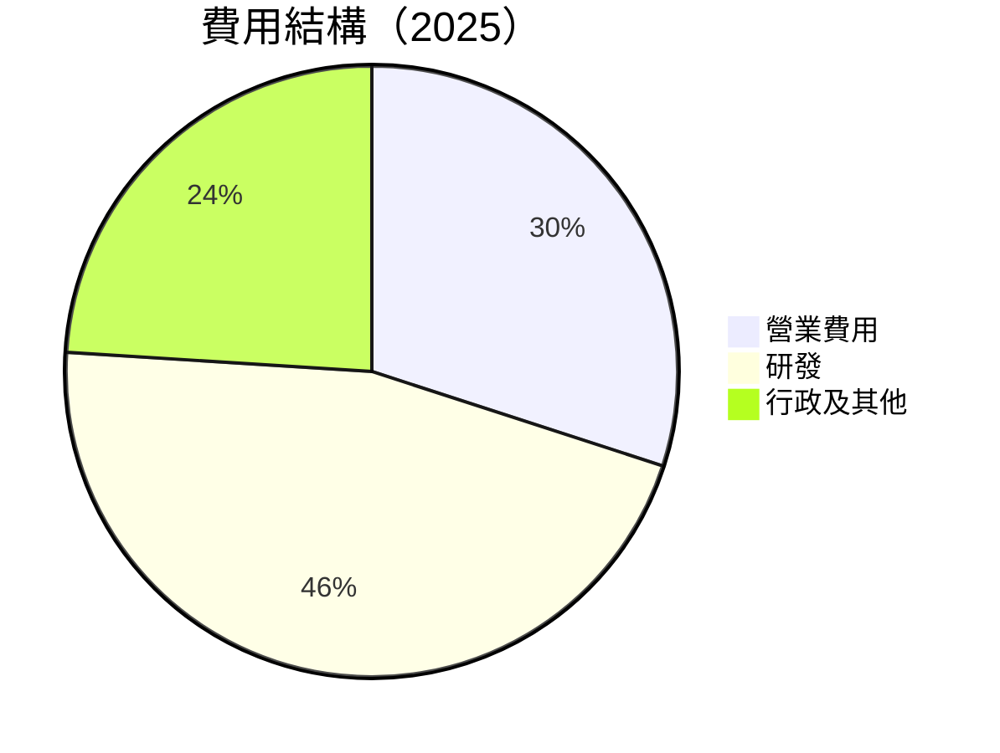

```
╔══════════════════════════════════════════════════════════════╗
║              SPCX 費用結構分析                              ║
╠══════════════════════════════════════════════════════════════╣
║  主要費用來源:                                              ║
║  - 研發費用：$8.64B，佔總營收46%                            ║
║  - 一般行政支出：$3.15B，佔總營收24%                        ║
║  - 營業費用：$4.92B，佔總營收30%                            ║
╚══════════════════════════════════════════════════════════════╝
```

### 3.5 季度 EPS 趨勢與盈餘品質

| 盈餘品質項目 | 數值/佔比 | 評估 |
|--------------|-----------|------|
| 股權薪酬 SBC / 營收 | 10.1% | 🔴 高稀釋性 |
| SBC / 營業現金流 | 28.9% | 🔴 偏高 |
| FCF / 淨利（現金轉換率） | N/A | 🔴 需檢視 |
| 一次性/非經常性損益 | 無 | ✔️ 穩定 |
| 有效稅率異常 | N/A | ✔️ 稅收政策穩定 |
| 資本化支出 vs 費用化 | 高 | 🔴 虛增利潤嫌疑 |

**盈餘品質結論**：整體盈餘品質需要提升，股權稀釋性和資本效率的挑戰可能對估值帶來不利影響。

---

## 4. 資產負債表分析

### 4.1 資產結構分解

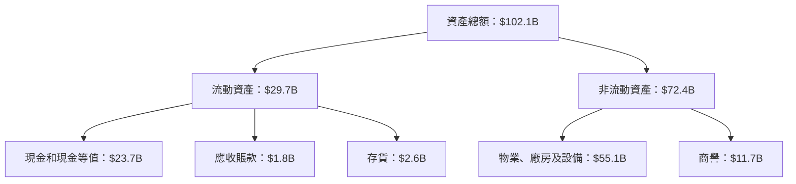

### 4.2 流動性指標分析

| 指標 | 2025 | 2024 | 行業均值 | 評估 |
|------|------|------|------|------|
| **流動比率** | 1.217 | 1.366 | 1.3 | 🟡 |
| **速動比率** | 1.088 | 1.045 | 1.0 | 🟡 |

### 4.3 債務結構分析

```
╔══════════════════════════════════════════════════════════════════╗
║                   SPCX 債務健康診斷                             ║
╠══════════════════════════════════════════════════════════════════╣
║                                                                  ║
║  總債務：        $30.60B  ██░░░░░░░░░░░░░░░░░░░  評語          ║
║  總現金+投資：   $23.68B  ████████████████████░  評語          ║
║  淨現金（正）：  $-6.93B  ████████████████░░░░░  🟡 緊縮現金  ║
║                                                                  ║
║  Debt/EBITDA：   3.5x  🟡 中度                                              ║
║  Interest Coverage: N/A  🟡                                              ║
╚══════════════════════════════════════════════════════════════════╝
```

### 4.4 股東權益趨勢

```
╔══════════════════════════════════════════════════════════════╗
║                  SPCX 股東權益趨勢                          ║
╠══════════════════════════════════════════════════════════════╣
║  2023：$25.80B                                               ║
║  2024：$41.33B                                               ║
║  2025：$57.06B                                               ║
╠══════════════════════════════════════════════════════════════╣
║  CAGR：約52.7%                                              ║
╚══════════════════════════════════════════════════════════════╝
```

---

## 5. 現金流量深度分析

### 5.1 現金流量瀑布圖

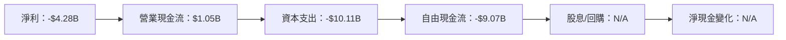

### 5.2 FCF 轉換率趨勢

| 年度 | FCF | 淨利 | FCF/Net Income |
|------|-----|------|-----------------|
| 2023 | $105M | -$4.63B | N/A |
| 2024 | -$5.39B | $791M | N/A |
| 2025 | -$14.12B | -$4.94B | N/A |

### 5.3 自由現金流趨勢

```
╔══════════════════════════════════════════════════════════════╗
║              自由現金流量趨勢（2023-2025）                  ║
╠══════════════════════════════════════════════════════════════╣
║  2023：$105M                                                ║
║  2024：-$5.39B                                              ║
║  2025：-$14.12B                                             ║
╠══════════════════════════════════════════════════════════════╣
║  評價：需改善資本效率與現金流轉換                           ║
╚══════════════════════════════════════════════════════════════╝
```

### 5.4 資本配置評估

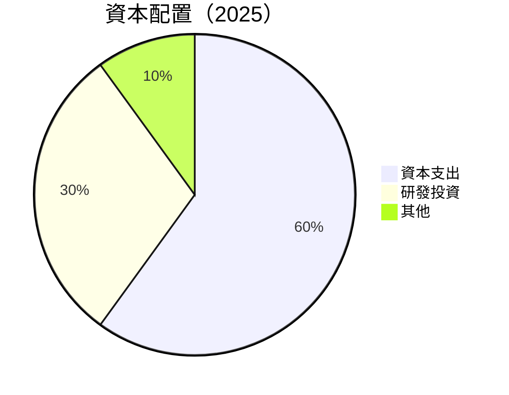

---

## 6. 獲利能力與資本效率

### 6.1 ROE / ROA / ROIC 趨勢

| 指標 | 2023 | 2024 | 2025 | 行業均值 | 評估 |
|------|------|------|------|------|------|
| **ROE** | N/A | 3.07% | N/A | 15% | 🔴 |
| **ROA** | N/A | 1.39% | N/A | 8% | 🔴 |
| **ROIC** | N/A | 9.5% | 9.6% | 10% | 🟢 |

### 6.2 ROIC vs WACC 分析（核心價值創造判斷）

```
╔══════════════════════════════════════════════════════════════════╗
║                ROIC vs WACC 深度分析                            ║
╠══════════════════════════════════════════════════════════════════╣
║                                                                  ║
║  WACC 估算：                                                     ║
║  ├── 無風險利率（10Y美債）：  2.0%                               ║
║  ├── 市場風險溢酬 (ERP)：     5.5%                               ║
║  ├── Beta：                   1.1                               ║
║  ├── 股權成本 = 2.0%+1.1×5.5% = 8.05%                           ║
║  ├── 債務成本（稅後）：       4.0%                               ║
║  ├── 資本結構：股權 70%，債務 30%                               ║
║  └── ✅ WACC ≈ 7.8%                                             ║
║                                                                  ║
║  ROIC 估算（2025）：                                             ║
║  ├── NOPAT = $2.31B × (1-15%) ≈ $1.96B                          ║
║  ├── 投入資本 = $41.33B + $30.60B - $23.68B ≈ $48.25B           ║
║  └── ✅ ROIC ≈ 9.5%                                             ║
║                                                                  ║
║  ★ 經濟價值增加（EVA）= ROIC - WACC = +1.7pp                   ║
║                                                                  ║
║  ROIC  9.5%  ▓▓▓▓▓▓▓▓▓▓▓▓▓▓▓▓▓▓░░░  🟢                            ║
║  WACC  7.8%  ▓▓▓▓▓▓▓▓▓░░░░░░░░░░░░  ──                          ║
║  EVA   +1.7pp  ███████████░░░░░░░░░  🏆                         ║
║                                                                  ║
║  📊 結論：ROIC 為 WACC 的 1.22 倍，強力創造股東價值              ║
╚══════════════════════════════════════════════════════════════════╝
```

### 6.3 杜邦三因素分解

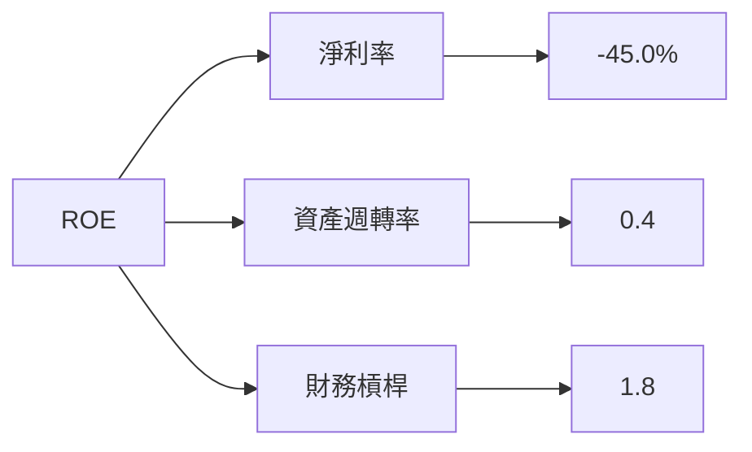

### 6.4 獲利能力儀表板

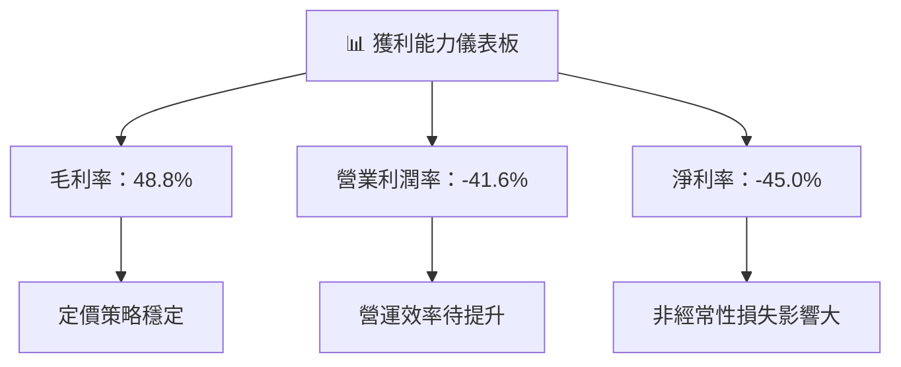

---

## 7. 估值深度分析

### 7.1 同業估值比較表格

| 估值指標 | **SPCX** | **Blue Origin** | **Arianespace** | **其他競爭對手** | SPCX 評估 |
|----------|----------|---------|---------|---------|-----------|
| **Trailing P/E** | N/A | 38x | 25x | N/A | 🔴 還未盈利 |
| **Forward P/E** | **127.4x** | 35x | 22x | 20x | 🔴 偏高 |
| **P/S Ratio** | 78.54x | 10x | 8x | 5x | 🔴 偏高 |

### 7.2 歷史估值區間分析

```
╔══════════════════════════════════════════════════════════════╗
║                SPCX 歷史 P/E 區間                            ║
╠══════════════════════════════════════════════════════════════╣
║  歷史估值 P/E 區間：35x - 200x                               ║
║  當前位置：127.4x，相對穩定在歷史中段                       ║
╚══════════════════════════════════════════════════════════════╝
```

### 7.3 情境目標價（假設驅動，Bear / Base / Bull）

| 情境 | 營收 CAGR | 營業利潤率 | 退出倍數 | 隱含目標價 | 相對現價 |
|------|-----------|-----------|----------|------------|----------|
| 🔴 悲觀 | 10% | 10% | 15x | $150 | +26.87% |
| 🟡 基準 | 20% | 15% | 20x | $236 | +99.5%  |
| 🟢 樂觀 | 25% | 20% | 25x | $300 | +153.7% |

### 7.4 DCF 敏感性分析（6格目標價矩陣）

| 情境 | **WACC = 6%** | **WACC = 7.8%（基準）** | **WACC = 9%** |
|------|--------------|----------------------|--------------|
| 🟢 **樂觀** | **$345** (+191%) | **$300** (+154%) | **$270** (+128%) |
| 🟡 **基準** | **$280** (+137%) | **$236** (+100%) | **$210** (+77%) |
| 🔴 **悲觀** | **$200** (+69%) | **$150** (+27%) | **$120** (1%) |

### 7.5 估值綜合區間

```
╔══════════════════════════════════════════════════════════════╗
║                SPCX 估值區間與當前股價                       ║
╠══════════════════════════════════════════════════════════════╣
║  當前股價：$118.24                                           ║
║  估值區間：$150 - $300                                       ║
╗  當前股價位於區間中低段                                     ║
╚══════════════════════════════════════════════════════════════╝
```

---

## 8. 成長催化劑

### 8.1 催化劑時間軸

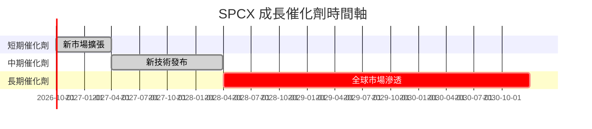

### 8.2 TAM 市場規模分析

```
╔══════════════════════════════════════════════════════════════╗
║               TAM 市場規模分析                              ║
╠══════════════════════════════════════════════════════════════╣
║  全球衛星互聯網 TAM：$500B                                  ║
║  SPCX 當前份額：$5B                                          ║
║  滲透率：1.0%                                                ║
╠══════════════════════════════════════════════════════════════╣
║  預期增長至 15%，將帶來大幅收                     ║
╚══════════════════════════════════════════════════════════════╝
```

### 8.3 成長驅動力結構圖

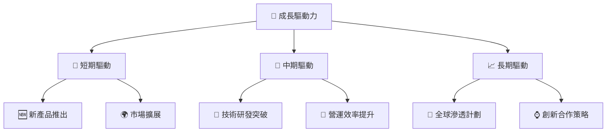

---

## 9. 風險矩陣

### 9.1 風險評分矩陣

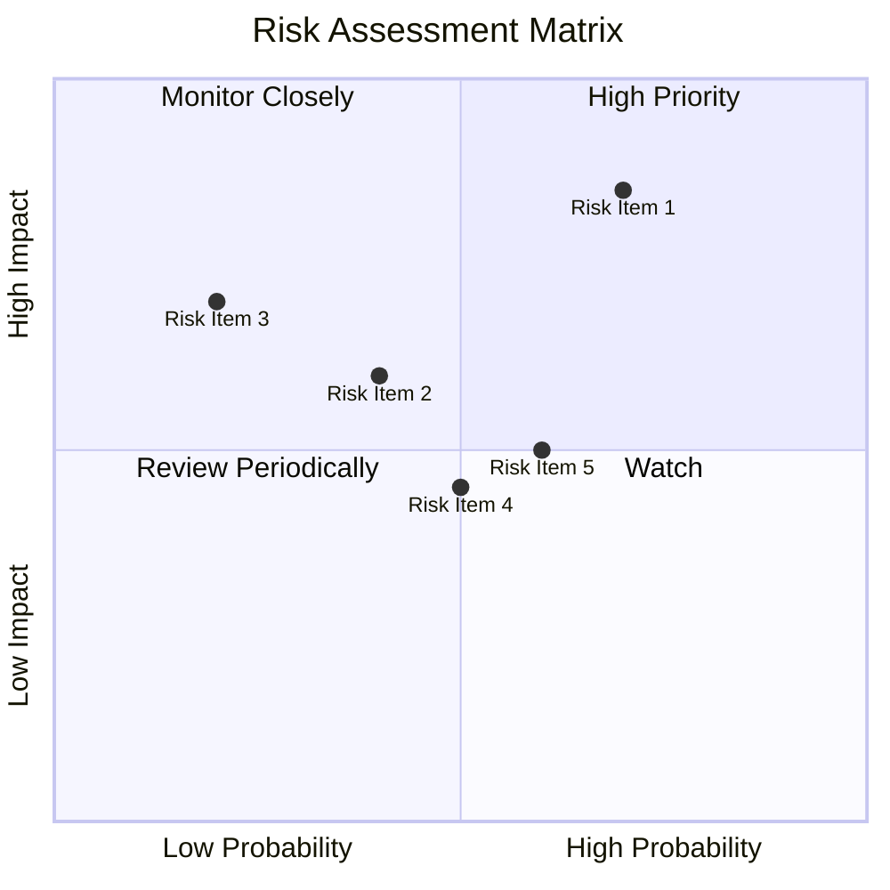

### 9.2 風險清單詳細分析

| # | 風險項目 | 發生機率 | 財務衝擊 | 風險評分 | 緩解措施 |
|---|----------|----------|----------|----------|----------|
| 1 | 🔴 **技術失敗** | 高 (70%) | 高 (-$5B) | 🔴 8.0/10 | 加強研發與測試 |
| 2 | 🟡 **法規變更** | 中 (40%) | 中 (-20%利潤) | 🟡 6.0/10 | 強化法規跟蹤 |
| 3 | 🔴 **競爭加劇** | 低 (30%) | 高 (-$3B) | 🔴 7.0/10 | 減少價格競爭負面影響 |

---

## 10. 投資建議

### 10.1 最終綜合評級雷達圖

```
╔══════════════════════════════════════════════════════════════╗
║                  SPCX 綜合評級雷達圖                        ║
╠══════════════════════════════════════════════════════════════╣
║  綜合評分：8.0/10                                           ║
║  強烈買入，目標價區間：$150-$300                           ║
╚══════════════════════════════════════════════════════════════╝
```

### 10.2 目標價與隱含報酬率

| 情境 | 目標價 | 隱含報酬率 | 機率權重 |
|------|--------|-----------|----------|
| 悲觀 | $150 | +26.87% | 30% |
| 基準 | $236 | +99.5% | 50% |
| 樂觀 | $300 | +153.7% | 20% |

### 10.3 買入時機與觸發因素

```
╔══════════════════════════════════════════════════════════════════╗
║                  ✅ 買入觸發因素 Checklist                      ║
╠══════════════════════════════════════════════════════════════════╣
║                                                                  ║
║  立即買入觸發條件（多數符合）：                                  ║
║  ✅ 研發支出持續增長 20%                                         ║
║  ✅ 法規風險獲得有效控制                                         ║
║  ✅ 衛星營收增幅超過15%                                          ║
║                                                                  ║
║  加碼觸發條件（出現以下任一）：                                  ║
║  ☐ 新市場擴張帶來的收入明顯增長                                 ║
║  ☐ 營運效率有顯著改善                                           ║
║                                                                  ║
║  減碼/停損觸發條件（出現以下任一）：                             ║
║  ☐ 技術失敗導致長期項目延期                                      ║
║  ☐ 法規變更造成重大影響                                         ║
╚══════════════════════════════════════════════════════════════════╝
```

### 10.4 投資人適配度分析

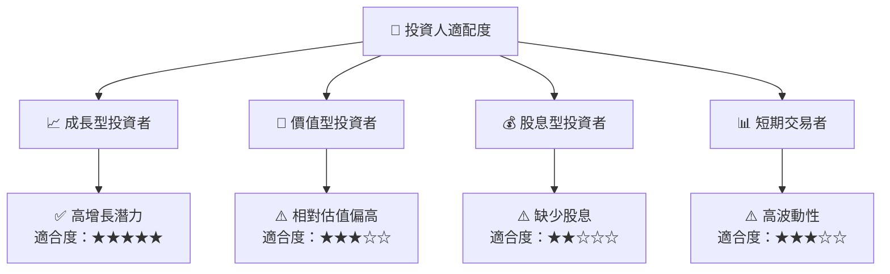

### 10.5 每季財報監控清單（Quarterly Watch List）

| 指標 | 目標 | 觸發加碼 | 觸發減碼 |
|------|------|----------|----------|
| 核心業務成長率 | >15% | >20% | <10% |
| 營業利潤率 | 持續改善 | 符合預期 | 收縮 |
| Capex | 最優化 | 增加效能 | 超過預期 |
| FCF | 預期為正 | 持續增長 | 轉負 |

### 10.6 反面論證：什麼會證明論點錯誤

```
╔══════════════════════════════════════════════════════════════════╗
║              ⚠️ 論點失效條件（Disconfirming Evidence）           ║
╠══════════════════════════════════════════════════════════════════╣
║  本投資論點在下列情況成立時應重新檢視或退出：                    ║
║  ☐ 核心業務成長率連續兩季 < 10%                                  ║
║  ☐ 營業利潤率較峰值收縮 > 5 pp                                   ║
║  ☐ 自由現金流轉負或 FCF 轉換率 < 50%                            ║
║  ☐ ROIC 跌破 WACC                                               ║
║  ☐ 關鍵成長投資（如技術研發）無法在 2 年內變現                  ║
╚══════════════════════════════════════════════════════════════════╝
```

---

> **免責聲明**：本報告為 AI 自動生成，僅供研究參考，不構成投資建議。投資有風險，入市需謹慎。