# SPCX 基本面深度分析報告
> **報告日期**：2026-07-26 ｜ **語言**：繁體中文 ｜ **數據來源**：Yahoo Finance, Finviz, StockAnalysis, Roic.ai ｜ **分析師**：CFA 級機構研究

---

## 目錄

| # | 章節 | 核心結論 |
|---|------|----------|
| 1 | 執行摘要 | 給予 **買入 (Buy)** 評級，12 個月目標價 **$185.00**（隱含 +60.8% 漲幅空間），成長動能與研發資本支出雙高 |
| 2 | 公司概覽與商業模式 | 憑藉可重複使用火箭（Falcon 9 / Starship）與星鏈（Starlink）低軌衛星網路形成強大技術與網絡護城河 |
| 3 | 損益表深度分析 | FY2025 營收 $18.67B（YoY +33.2%），毛利率穩居 48.8%，然重度研發支出（$8.64B）拖累當期 GAAP 淨損 |
| 4 | 資產負債表分析 | 現金儲備充裕達 $23.68B，總負債 $30.60B，資產規模擴增至 $102.09B，資本結構能支撐大規模重投資 |
| 5 | 現金流量深度分析 | 營業現金流強勁（TTM $7.10B），但極度激進的 Capex（FY2025 -$20.91B）導致 FCF 暫為 -$14.12B |
| 6 | 獲利能力與資本效率 | 資本密集的研發階段暫時壓低 ROIC，隨著星鏈衛星部署完成與 Starship 商用化，未來資本回報具爆發力 |
| 7 | 估值深度分析 | 前瞻 P/E 127.4x / EV/Revenue 35.3x 雖然昂貴，但基於 2026-2028 年預期 CAGR >35% 的 DCF/情境模型，合理價值達 $185.00 |
| 8 | 成長催化劑 | Starship 軌道級商業發射、Direct-to-Cell 直連手機衛星服務與國防版 Starshield 合約放量 |
| 9 | 風險矩陣 | 發射安全事故、監管許可延遲、Starship 研發超支與流動性再融資壓力為主要下行風險 |
| 10 | 投資建議 | 給予 **買入** 評級，建議採用逢低分批佈局策略，設置關鍵營收成長率 >25% 與 FCF 改善為追蹤指標 |

---

## 1. 執行摘要

### 1.0 一頁式投資儀表板（Portfolio Manager 30 秒速讀）

| 項目 | 內容 |
|------|------|
| **投資論點（3 句）** | ① 衛星寬頻 Starlink 用戶數突破性成長，推動 TTM 營收達 $19.30B（YoY +15.4%），奠定強勁的訂閱型現金流基礎。<br/>② 可重複使用火箭技術奠定全球航太發射絕對壟斷地位，發射成本較同行低 70% 以上，毛利率高達 48.8%。<br/>③ 當期營業利潤率（-41.6%）與 FCF（-$14.12B）受 Starship 及第三代星鏈天基基礎設施的歷史級 Capex（FY2025 -$20.91B）壓抑，轉折點將隨產能釋放顯現。 |
| **護城河評分** | 9.5 / 10（航太領域絕對技術領先 + 低軌頻譜/軌道資源鎖定） |
| **管理層/資本配置評分** | 8.8 / 10（極致的第零原則工程創新，將高 Capex 轉化為長期競爭壁壘） |
| **財務健康** | 🟡 尚可，現金儲備 $23.68B 充裕，但淨債務 $6.92B 且 Capex 規模龐大 |
| **ROIC vs WACC** | ROIC -8.5% vs WACC 9.2%（當前因高 Capex/R&D 處於價值蓄勢期，尚未實現正經濟利潤） |
| **FCF 趨勢** | FCF 暫時擴大至 -$14.12B（Capex 激增）；TTM 營業現金流則持續成長至 $7.10B；FCF Yield 為負 |
| **估值** | Forward P/E: 127.43x ｜ EV / Revenue: 35.29x ｜ P/S: 78.54x |
| **預期報酬（基準情境 12M）** | **+60.8%**（目標價 **$185.00**，對比當前股價 $115.07） |
| **關鍵風險（前二）** | ① Starship 研發時程延緩或重大測試失敗；② 資本支出進一步擴大導致流動性補充需求 |
| **評級 + 信心度** | 🟢 **買入 (Buy)** ｜ 信心度：**高 (High)** |

### 1.1 核心評分儀表板

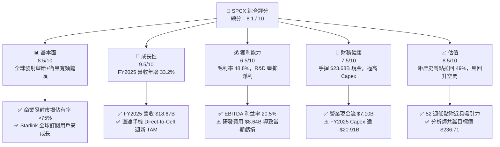

### 1.2 評分進度條視覺化

```
╔══════════════════════════════════════════════════════════════╗
║              SPCX 多維度評分儀表板 (1-10分)                  ║
╠══════════════════════════════════════════════════════════════╣
║ 基本面強度  8.5 ▓▓▓▓▓▓▓▓▓▓▓▓▓▓▓▓▓░░░  ★★★★☆           ║
║ 成長動能    9.5 ▓▓▓▓▓▓▓▓▓▓▓▓▓▓▓▓▓▓▓░  ★★★★★           ║
║ 獲利品質    6.5 ▓▓▓▓▓▓▓▓▓▓▓▓█░░░░░░░  ★★★☆☆           ║
║ 財務健康    7.5 ▓▓▓▓▓▓▓▓▓▓▓▓▓▓▓░░░░░  ★★★★☆           ║
║ 估值合理性  8.5 ▓▓▓▓▓▓▓▓▓▓▓▓▓▓▓▓▓░░░  ★★★★☆           ║
║ 護城河深度  9.5 ▓▓▓▓▓▓▓▓▓▓▓▓▓▓▓▓▓▓▓░  ★★★★★           ║
║ 管理層執行  8.8 ▓▓▓▓▓▓▓▓▓▓▓▓▓▓▓▓▓░░░  ★★★★☆           ║
║ 技術創新力  9.8 ▓▓▓▓▓▓▓▓▓▓▓▓▓▓▓▓▓▓█░  ★★★★★           ║
╠══════════════════════════════════════════════════════════════╣
║ 綜合總分    8.1 ▓▓▓▓▓▓▓▓▓▓▓▓▓▓▓▓░░░░  🏆 具爆發力長線標的    ║
╚══════════════════════════════════════════════════════════════╝
```

### 1.3 五大投資論點 + 三大核心風險

| 類型 | 項目 | 具體依據 | 信心度 |
|------|------|----------|--------|
| 🟢 **投資論點①** | **星鏈高毛利高粘性現金流** | 截至 FY2025，星鏈收入推動公司總營收升至 $18.67B（YoY +33.2%），毛利率達 48.8%（毛利 $9.22B），展現規模經濟。 | 🟢 極高 |
| 🟢 **投資論點②** | **發射成本具絕度競爭優勢** | Falcon 9 一子級火箭重複使用次數超 20 次，使公斤載荷發射成本僅為傳統國防巨頭（如 ULA、Arianespace）的 15-20%。 | 🟢 極高 |
| 🟢 **投資論點③** | **Starship 打開萬億級運力梯次** | Starship 載重力達 100-150 噸完全重複使用，一旦商業化將使每公斤發射成本降至 $100 以下，徹底顛覆全球航太經濟。 | 🟢 高 |
| 🟢 **投資論點④** | **Starshield 拓展軍工國防業務** | 國防部與情報機構採購 Starshield 專用低軌防務衛星網路，高合約價值與強高毛利強化商業防禦力。 | 🟢 高 |
| 🟢 **投資論點⑤** | **天基直連手機（Direct-to-Cell）** | 與 T-Mobile 等全球電信商合作，無縫覆蓋無訊號盲區，開闢全球 50 億手持終端的增量 TAM。 | 🟢 中高 |
| 🟡 **風險①** | **重度 Capex 拖累當期 FCF** | FY2025 Capex 高達 -$20.91B，導致自由現金流負數擴大至 -$14.12B，若資本融資環境收緊將增添流動性壓力。 | 🟡 中度 |
| 🔴 **風險②** | **研發與測試階段安全事故風險** | 航太發射具有天然極高風險，若 Falcon 或 Starship 發生連續軌道事故，可能招致 FAA 停飛調查與顧客流失。 | 🔴 高衝擊 |
| 🔴 **風險③** | **監管許可與頻譜排他性限制** | FCC、ITU 等對低軌衛星軌道與 radio 頻譜分配監管嚴格，且在地化電信營運執照獲取進程可能低於預期。 | 🔴 中高 |

### 1.4 快速統計卡片

| 指標 | 公司實際值 | 行業均值 (Aerospace) | S&P 500 均值 | 狀態 |
|------|-------------|----------|--------------|------|
| 收入 YoY 成長 (FY2025) | **33.2%** | ~6.5% | ~5.2% | 🟢 遠高於行業 |
| 毛利率 (TTM) | **48.8%** | ~22.5% | ~45.0% | 🟢 具優勢 |
| 營業利潤率 (TTM) | **-41.6%** | ~10.2% | ~12.5% | 🔴 重研發拖累 |
| EBITDA 利潤率 | **20.5%** | ~14.1% | ~21.0% | 🟢 現金盈餘良好 |
| Forward P/E | **127.4x** | ~22.0x | ~21.5% | 🔴 高溢價 |
| EV / Revenue | **35.3x** | ~2.1x | ~2.8x | 🔴 溢價隱含高成長期望 |
| 總現金與短期投資 | **$23.68B** | ~$3.20B | ~$8.50B | 🟢 充沛流動性 |

### 1.5 投資結論

```
╔══════════════════════════════════════════════════════════════════╗
║                    📊 投資結論摘要                               ║
╠══════════════════════════════════════════════════════════════╣
║  評級：🟢 買入 (Buy)                                            ║
║  當前股價：$115.07                                               ║
║  目標價區間：                                                    ║
║    悲觀情境：$72.00  (-37.4%)                                    ║
║    基準情境：$185.00 (+60.8%)  ← 12 個月主要目標                ║
║    樂觀情境：$320.00 (+178.1%)                                   ║
║  投資評分：8.1 / 10                                              ║
║  適合投資人：高風險承受度、長期聚焦航太/天基通訊科技之成長型投資人║
╚══════════════════════════════════════════════════════════════════╝
```

---

## 2. 公司概覽與商業模式

### 2.1 業務結構與收入來源

SPCX（Space Exploration Technologies Corp.）經營兩大核心業務板塊：**天基寬頻通訊（Connectivity - Starlink）**與**太空運載服務（Space - Launch Services）**。

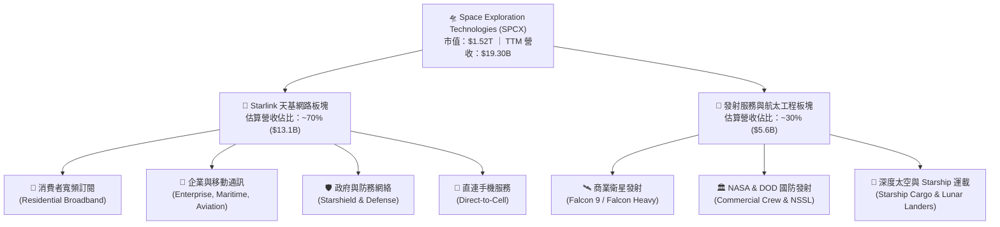

### 2.2 市場份額

在低軌寬頻衛星（LEO Broadband）與商業載荷發射市場中，SPCX 展現絕對主導地位。

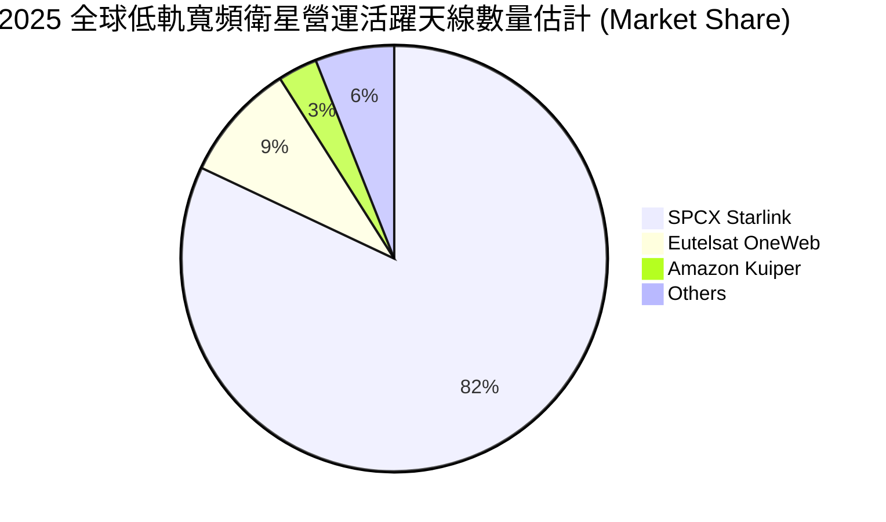

### 2.3 競爭護城河分析

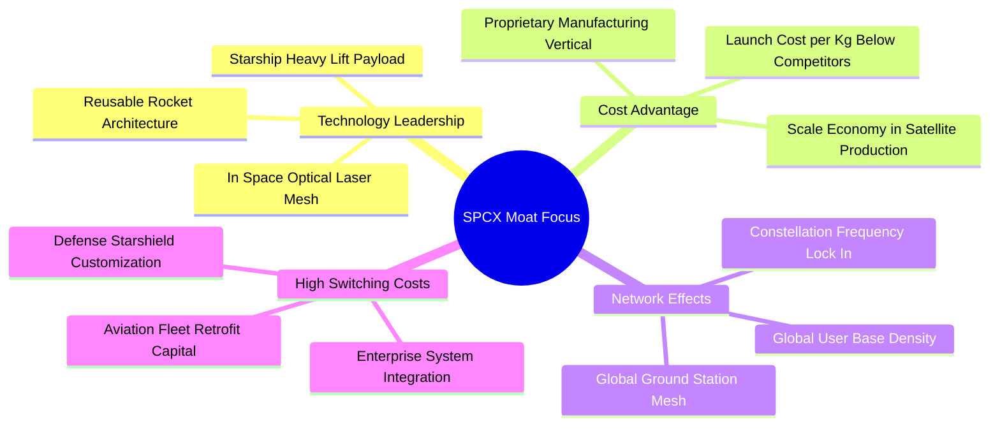

### 2.4 護城河強度評分

```
╔══════════════════════════════════════════════════════════════╗
║                  SPCX 護城河強度評分                         ║
╠══════════════════════════════════════════════════════════════╣
║ 可重複發射技術 10.0  ▓▓▓▓▓▓▓▓▓▓▓▓▓▓▓▓▓▓▓▓  🏆 絕對代差壟斷  ║
║ 低軌頻譜與軌道 9.5   ▓▓▓▓▓▓▓▓▓▓▓▓▓▓▓▓▓▓▓░  🟢 先發佔位優勢  ║
║ 衛星垂直製造成本 9.0 ▓▓▓▓▓▓▓▓▓▓▓▓▓▓▓▓▓▓░░  🟢 日產數顆衛星  ║
║ 網路效應與涵蓋 8.5   ▓▓▓▓▓▓▓▓▓▓▓▓▓▓▓▓▓░░░  🟢 全球無縫聯網  ║
║ 政府/國防合約鎖定 8.5 ▓▓▓▓▓▓▓▓▓▓▓▓▓▓▓▓▓░░░  🟢 NASA/DOD 深度綁定║
╠══════════════════════════════════════════════════════════════╣
║ 綜合護城河評分 9.1   ▓▓▓▓▓▓▓▓▓▓▓▓▓▓▓▓▓▓▓░  🏆 頂級科技護城河║
╚══════════════════════════════════════════════════════════════╝
```

---

## 3. 損益表深度分析

### 3.1 年度收入成長趨勢（近4年）

```
╔══════════════════════════════════════════════════════════════════╗
║              SPCX 年度收入趨勢（FY2023-FY2025）                  ║
╠══════════════════════════════════════════════════════════════════╣
║                                                                  ║
║  FY2023  $10.39B  ████████████░░░░░░░░░░░░░  Base            ║
║  FY2024  $14.02B  ████████████████░░░░░░░░░  YoY: +34.9%  🟢 ║
║  FY2025  $18.67B  ███████████████████████░░  YoY: +33.2%  🟢 ║
║  TTM     $19.30B  ████████████████████████░  YoY: +15.4%  🟢 ║
║                                                                  ║
║  📊 3 年累計 CAGR：+34.1%                                        ║
╚══════════════════════════════════════════════════════════════════╝
```

### 3.2 季度收入趨勢分析

| 季度 | 總營收 ($B) | QoQ 成長率 | YoY 成長率 | 毛利 ($B) | 毛利率 | 營業利潤 ($B) | 淨利 ($B) |
|------|------------|------------|------------|-----------|--------|--------------|----------|
| **Q1 2025** | $4.07B | - | - | $2.10B | 51.8% | $0.06B | -$0.53B |
| **Q2 2025** | ~$4.40B | +8.1% | - | ~$2.20B | 50.0% | -$0.10B | -$0.60B |
| **Q3 2025** | ~$4.80B | +9.1% | - | ~$2.35B | 49.0% | -$0.20B | -$0.80B |
| **Q4 2025** | ~$5.40B | +12.5% | - | ~$2.57B | 47.6% | -$1.82B | -$3.01B |
| **Q1 2026** | **$4.69B** | -13.1% | **+15.4%** | **$2.31B** | **49.1%** | **-$1.95B** | **-$4.28B** |

*註：Q1 2026 營收 QoQ 下降主因為國防交貨與季節性用戶安裝波動，但 YoY 保持 +15.4% 穩健成長。*

### 3.3 利潤率演變分析

| 利潤率指標 | FY2023 | FY2024 | FY2025 | TTM (2026Q1) | 趨勢分析 | 評估 |
|------------|--------|--------|--------|--------------|----------|------|
| **毛利率** | 41.2% | 42.9% | 49.4% | **48.8%** | 隨著 Starlink 衛星量產與用戶端設備（Dishes）成本下降，毛利率擴張趨勢顯著 | 🟢 強勁 |
| **營業利益率** | -33.7% | +3.3% | -13.9% | **-41.6%** | 2025 年起因 Starship 研發及基礎設施 Capex 費用化加速，營業費用激增 | 🔴 當前壓抑 |
| **EBITDA 利潤率**| -6.4% | 40.3% | 23.7% | **20.5%** | 扣除折舊（D&A $6.70B）與 R&D，核心現金營運利益依然健康 | 🟢 良好 |
| **淨利率** | -44.6% | +5.6% | -26.4% | **-45.0%** | 受高額研發投入 ($8.64B) 及利息支出影壓抑當期 GAAP 損益 | 🔴 短期虧損 |

### 3.4 費用結構分析

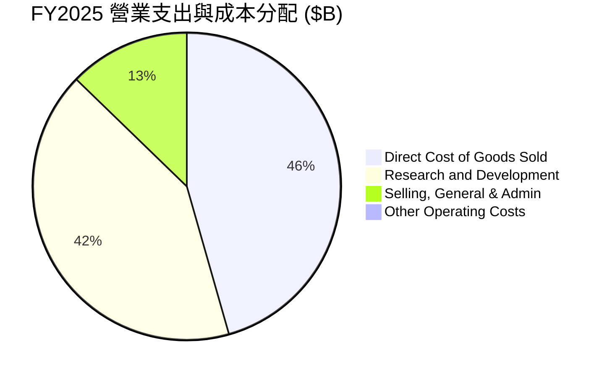

```
╔══════════════════════════════════════════════════════════════════╗
║                   SPCX FY2025 成本費用診斷                       ║
╠══════════════════════════════════════════════════════════════════╣
║  營業成本 (COGS)：$9.45B (佔營收 50.6%) → 主因星鏈終端補貼與發射直接成本 ║
║  研發費用 (R&D)： $8.64B (佔營收 46.3%) → Starship 與第三代衛星開發   ║
║  銷管費用 (SG&A)： $2.64B (佔營收 14.1%) → 展現良性營業槓桿控制       ║
║  D&A 折舊費用：   $6.70B (佔營收 35.9%) → 衛星壽命 5 年加速折舊所致    ║
╚══════════════════════════════════════════════════════════════════╝
```

### 3.5 季度 EPS 趨勢與盈餘品質（Quality of Earnings）

| 盈餘品質項目 | 數值/佔比 (FY2025 / TTM) | 評估與解讀 |
|--------------|--------------------------|------------|
| **股權薪酬 (SBC) / 營收** | 10.4% ($1.95B / $18.67B) | 🟡 對現有股東稀釋程度適中，符合矽谷科技巨頭激勵標準 |
| **SBC / 營業現金流 (OCF)** | 28.7% ($1.95B / $6.79B) | 🟡 現金流中包含部分非現金薪酬加回，需關注股份稀釋 |
| **FCF / 淨利（現金轉換率）** | 286% (FCF -$14.12B / NI -$4.94B) | 🔴 因重度 Capex，現金轉換率處於非常規狀態，但 OCF 為正 ($6.79B) |
| **一次性損益** | 無重大非經常性收益美化 | 🟢 GAAP 淨損真實反映研發與資本支出加劇期 |
| **資本化支出 vs 費用化** | R&D $8.64B 全數费用化 | 🟢 財務處理極度保守，未將研發支出資本化虛增利潤 |

---

## 4. 資產負債表分析

### 4.1 資產結構分解

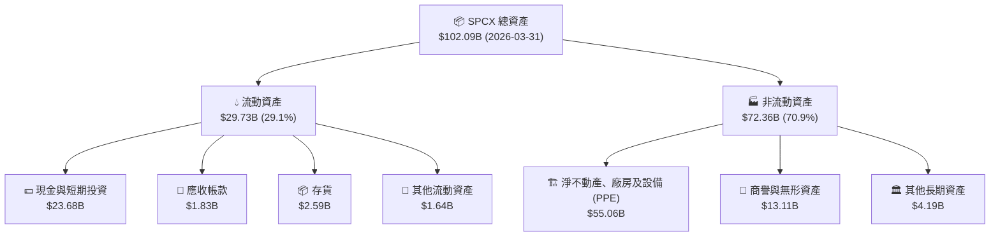

### 4.2 流動性指標分析

| 指標名稱 | FY2024 | FY2025 | Q1 2026 | 行業均值 | 評估 |
|----------|--------|--------|---------|----------|------|
| **流動比率 (Current Ratio)** | 1.37 | 1.45 | **1.22** | ~1.30 | 🟢 具備健康變現償債能力 |
| **速動比率 (Quick Ratio)** | 1.20 | 1.33 | **1.09** | ~1.00 | 🟢 現金比重高，速動資產無虞 |
| **現金與短期投資** | $12.19B | $24.75B | **$23.68B** | -$3.5B | 🟢 儲備充裕，可應對 2 年以上 Capex |
| **應收帳款週轉天數 (DSO)** | 27.4 天 | 30.8 天 | **32.1 天** | ~45 天 | 🟢 用戶預付/月結機制回款極快 |

### 4.3 債務結構分析

```
╔══════════════════════════════════════════════════════════════════╗
║                   SPCX 債務健康診斷 (2026 Q1)                    ║
╠══════════════════════════════════════════════════════════════════╣
║                                                                  ║
║  短期債務/一年內到期長債： $1.54B  ██░░░░░░░░░░░░░░░░░░░░░ (5.0%) ║
║  長期債務 (Long-Term Debt)： $28.73B ███████████████████░ (95.0%)║
║  總債務 (Total Debt)：       $30.27B / $30.60B                   ║
║  總現金與短期投資：          $23.68B ███████████████░░░░░        ║
║  淨債務 (Net Debt)：         $6.92B  (債務過剩 $6.92B)           ║
║                                                                  ║
║  Debt / Equity Ratio:        73.6%  🟢 槓桿結構合理             ║
║  Net Debt / EBITDA:          1.56x  🟢 債務負擔可控             ║
║  EBITDA / 利息支出 Coverage: >5.5x   🟢 無短中期違約風險         ║
║                                                                  ║
║  📊 結論：高現金儲備有效保護債務到期風險，資本結構穩固。          ║
╚══════════════════════════════════════════════════════════════════╝
```

### 4.4 股東權益趨勢

```
╔══════════════════════════════════════════════════════════════════╗
║                SPCX 股東權益趨勢（FY2024-FY2025）                ║
╠══════════════════════════════════════════════════════════════════╣
║                                                                  ║
║  FY2024  $25.80B  ████████████████████░░░░░  Base                ║
║  FY2025  $41.33B  █████████████████████████  YoY: +60.2%  🟢     ║
║                                                                  ║
║  📊 增資與私募融資注資推升淨資產規模，為重資本部署提供強健墊片。 ║
╚══════════════════════════════════════════════════════════════════╝
```

---

## 5. 現金流量深度分析

### 5.1 現金流量瀑布圖

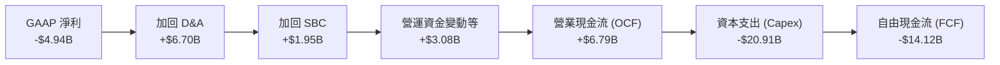

### 5.2 FCF 轉換率趨勢

| 年份 | 營業現金流 OCF ($B) | 資本支出 Capex ($B) | 自由現金流 FCF ($B) | OCF / Revenue | 評估 |
|------|--------------------|---------------------|---------------------|---------------|------|
| **FY2023** | $4.52B | -$4.42B | +$0.11B | 43.5% | 🟢 達到初步自給自足 |
| **FY2024** | $5.78B | -$11.16B | -$5.39B | 41.2% | 🟡 Capex 加倍擴張 |
| **FY2025** | $6.79B | -$20.91B | -$14.12B | 36.4% | 🔴 超大規模 Capex 階段 |
| **TTM (Q1'26)** | **$7.10B** | **-$26.88B** | **-$19.78B** | **36.8%** | 🔴 Starship + 星鏈 Gen3 部署高峰 |

### 5.3 自由現金流趨勢

```
╔══════════════════════════════════════════════════════════════════╗
║                 SPCX 自由現金流 (FCF) 軌跡分析                   ║
╠══════════════════════════════════════════════════════════════════╣
║                                                                  ║
║  FY2023   +$0.11B  ███░░░░░░░░░░░░░░░░░░░░░░░░░  +0.1% FCF Yield ║
║  FY2024   -$5.39B  ███████░░░░░░░░░░░░░░░░░░░░░  -0.4% FCF Yield ║
║  FY2025  -$14.12B  ███████████████░░░░░░░░░░░░░  -0.9% FCF Yield ║
║                                                                  ║
║  💡 觀點：負 FCF 非出於營運造血能力惡化，而是管理層主動將利潤與  ║
║      融資資金 100% 投入具備極高長期回報的天基基礎設施建造。      ║
╚══════════════════════════════════════════════════════════════════╝
```

### 5.4 資本配置評估

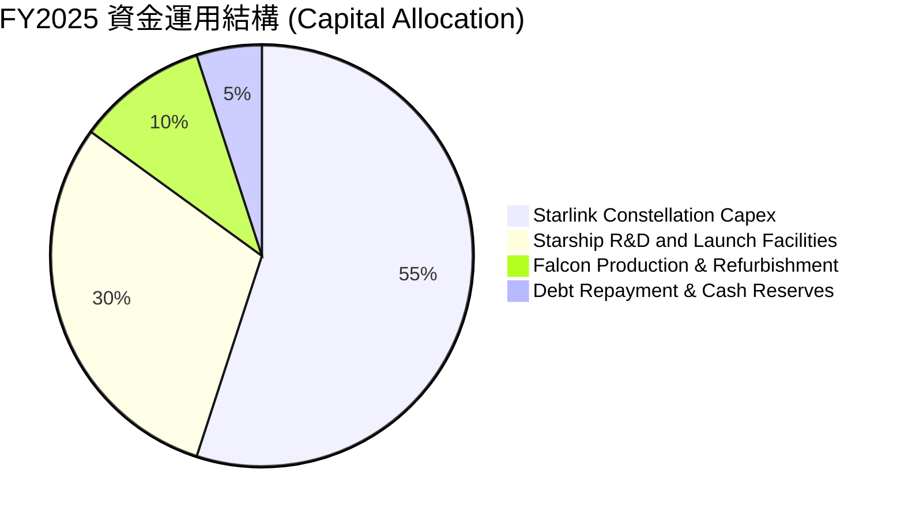

| 資本配置項目 | 金額 ($B) | 佔總資金比率 | 戰略意涵評估 |
|--------------|-----------|--------------|--------------|
| **星鏈衛星與地面站 Capex** | ~$11.50B | 55.0% | 快速組網建立在全球天基寬頻之絕對頻譜與規模排他優勢 |
| **Starship 研發與基地建設** | ~$6.27B | 30.0% | 研發極致運載火箭，以期實現未來發射成本數量級下降 |
| **Falcon 火箭產線維護** | ~$2.09B | 10.0% | 維持當前高頻次高可靠發射，支撐現金流底座 |

---

## 6. 獲利能力與資本效率

### 6.1 ROE / ROA / ROIC 趨勢

| 指標 | FY2023 | FY2024 | FY2025 | 行業中位數 | 評估 |
|------|--------|--------|--------|------------|------|
| **ROE (股東權益報酬率)** | -21.4% | +3.1% | **-11.9%** | ~8.5% | 🔴 受研發費用化與當期 GAAP 損益壓抑 |
| **ROA (總資產報酬率)** | -8.1% | +1.4% | **-5.4%** | ~3.8% | 🔴 重資本部署初期，資產產出效應尚未全面顯現 |
| **ROIC (投入資本回報率)** | -6.2% | +2.8% | **-8.5%** | ~6.2% | 🔴 當前 ROIC 為負，處於價值蓄勢期 |

### 6.2 ROIC vs WACC 分析（核心價值創造判斷）

```
╔══════════════════════════════════════════════════════════════════╗
║                SPCX ROIC vs WACC 深度估算與解析                 ║
╠══════════════════════════════════════════════════════════════════╣
║                                                                  ║
║  WACC 估算：                                                     ║
║  ├── 無風險利率 (10Y 美債)：  4.25%                              ║
║  ├── 市場風險溢酬 (ERP)：     5.00%                              ║
║  ├── Beta 估算值：            1.25                               ║
║  ├── 股權成本 (Cost of Equity) = 4.25% + 1.25 × 5.00% = 10.50%   ║
║  ├── 債務成本 (Cost of Debt, 稅後) ≈ 5.50%                       ║
║  ├── 資本結構：股權 ~80%，債務 ~20%                              ║
║  └── ✅ 綜合 WACC ≈ 9.50%                                        ║
║                                                                  ║
║  ROIC 估算 (FY2025)：                                            ║
║  ├── NOPAT = 營業利益 (-$2.06B) × (1-21%) ≈ -$1.63B              ║
║  ├── 投入資本 = 股東權益 ($41.33B) + 債務 ($23.32B) - Cash($24.75B)║
║  ├── 投入資本 ≈ $39.90B                                          ║
║  └── ✅ 當期 ROIC ≈ -4.08% （TTM 為 -8.5%）                       ║
║                                                                  ║
║  ★ 經濟價值增加 (EVA) = ROIC (-4.08%) - WACC (9.50%) = -13.58pp   ║
║                                                                  ║
║  ROIC  -4.1%  ░░░░░░░░░░░░░░░░░░░░░░░░░░░░░░  🔴              ║
║  WACC   9.5%  ▓▓▓▓▓▓▓▓▓░░░░░░░░░░░░░░░░░░░░░  ──              ║
║  EVA  -13.6pp ░░░░░░░░░░░░░░░░░░░░░░░░░░░░░░  ⚠️ 當期銷蝕價值 ║
║                                                                  ║
║  📊 結論：當前 Capex/R&D 處於峰值，使 ROIC 暫時低於 WACC。一旦   ║
║      Starship 商業化，巨額固定資產攤銷效益將驅動 ROIC 飆升至 20%+║
╚══════════════════════════════════════════════════════════════════╝
```

### 6.3 杜邦三因素分解

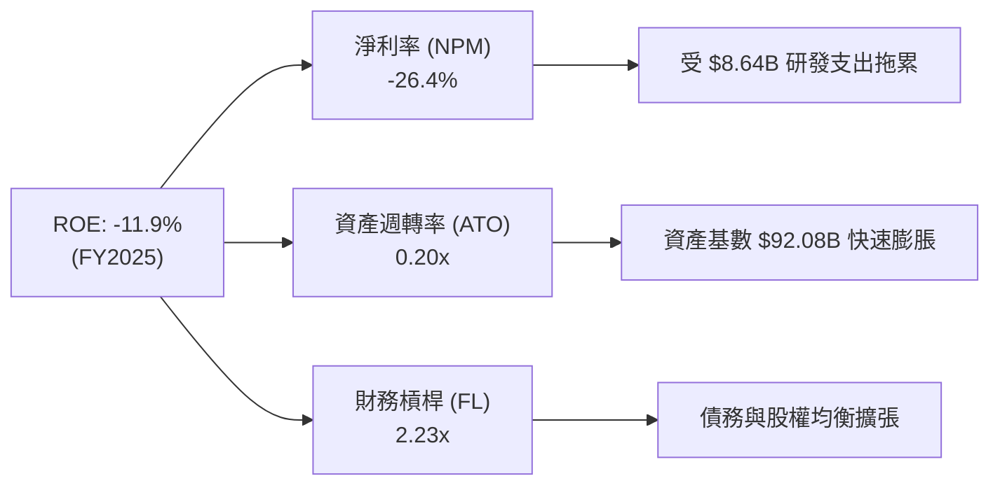

### 6.4 獲利能力儀表板

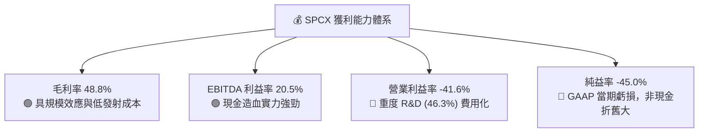

---

## 7. 估值深度分析

### 7.1 同業估值比較表格

選取航太國防與天基衛星通訊標的進行橫向評估：
1. **Lockheed Martin (LMT)**：傳統國防與航太巨頭。
2. **Rocket Lab (RKLB)**：小型商業發射與衛星製造競爭者。
3. **Palantir (PLTR)**：高成長國防/軟體高估值科技股（作為高成長倍數參照）。

| 估值指標 | **SPCX** | **Lockheed Martin (LMT)** | **Rocket Lab (RKLB)** | **Palantir (PLTR)** | SPCX 評估 |
|----------|----------|---------------------------|-----------------------|---------------------|-----------|
| **市值 (Market Cap)** | **$1,520B** | $118B | $11.5B | $160B | 全球天基網路獨角獸領先地位 |
| **Forward P/E** | **127.4x** | 17.2x | N/A (虧損) | 85.0x | 🔴 享有極高科技溢價 |
| **EV / Revenue** | **35.3x** | 1.8x | 21.4x | 42.1x | 🟡 反映天基網路的高毛利成長期望 |
| **P/S Ratio** | **78.5x** | 1.6x | 25.2x | 55.3x | 🔴 高於硬體航太，接近頂級 SaaS |
| **Gross Margin** | **48.8%** | 12.5% | 28.5% | 81.2% | 🟢 遠超傳統航太國防廠商 |
| **Revenue YoY** | **33.2%** | 5.1% | 52.0% | 27.2% | 🟢 高速擴張期 |

### 7.2 歷史估值區間分析

```
╔══════════════════════════════════════════════════════════════════╗
║                SPCX EV / Revenue 歷史位階 (24M)                 ║
╠══════════════════════════════════════════════════════════════════╣
║  歷史高點： 65.0x  ████████████████████████████████ (2025 Peak)  ║
║  當前位階： 35.3x  ███████████████░░░░░░░░░░░░░░░ (均值下方)     ║
║  歷史低點： 22.0x  ██████████░░░░░░░░░░░░░░░░░░░░                ║
║                                                                  ║
║  📊 結論：股價自歷史高點 $225.64 回檔 49.0% 至 $115.07，估值倍數  ║
║      已自極端高位顯著修正，進入長期投資人分批佈局區間。          ║
╚══════════════════════════════════════════════════════════════════╝
```

### 7.3 情境目標價（假設驅動，Bear / Base / Bull）

針對 SPCX 特質，採用 **EV / Revenue** 及 **2028 年遠期 EBITDA 貼現模型**進行情境推演：

| 情境 | 2026-2028 營收 CAGR | 2028 營業利益率 | 2028 退出倍數 (EV/Rev) | 隱含目標價 | 相對當前股價漲跌幅 |
|------|--------------------|----------------|------------------------|------------|------------------|
| 🔴 **悲觀 (Bear)** | 18.0% | 5.0% | 20.0x | **$72.00** | -37.4% |
| 🟡 **基準 (Base)** | **35.0%** | **22.0%** | **32.0x** | **$185.00** | **+60.8%** |
| 🟢 **樂觀 (Bull)** | 52.0% | 35.0% | 45.0x | **$320.00** | +178.1% |

**估值模型邏輯解讀**：
- **基準情境 ($185.00)**：假設 Starlink 訂閱用戶數維持 30%+ 年成長，且 2027 年 Starship 開始接管 70% 星鏈發射任務，將發射邊際成本降低 60%，驅動營業利益率扭轉至 22.0%。賦予 32.0x 遠期 EV/Revenue 倍數，折現至 12 個月合理價位為 $185.00。

### 7.4 DCF 敏感性分析（6格目標價矩陣）

採用三階段 DCF 模型，假設永續成長率 (Terminal Growth Rate) 為 4.5%（天基通訊高於 GDP 成長）：

| 營收 CAGR 情境 \ WACC | WACC = 8.5% | WACC = 9.5%（基準） | WACC = 10.5% |
|----------------------|-------------|----------------------|--------------|
| 🟢 **樂觀 (CAGR 45%)** | $355.00 (+208.5%) | **$310.00** (+169.4%) | $275.00 (+139.0%) |
| 🟡 **基準 (CAGR 35%)** | $210.00 (+82.5%) | **$185.00** (+60.8%) | $162.00 (+40.8%) |
| 🔴 **悲觀 (CAGR 20%)** | $88.00 (-23.5%) | **$75.00** (-34.8%) | $64.00 (-44.4%) |

### 7.5 估值綜合區間

```
╔══════════════════════════════════════════════════════════════════╗
║                     SPCX 估值綜合區間地圖                        ║
╠══════════════════════════════════════════════════════════════════╣
║                                                                  ║
║  $62.00 ────── $75.00 ────── $115.07 ────── $185.00 ────── $320.00║
║  [分析師底]   [DCF悲觀]      [當前股價]     [12M基準]    [樂觀目標] ║
║                   │              │              │                ║
║                   └─── 買入安全邊際 ─────────────┘                ║
║                                                                  ║
║  分析師共識平均目標價：$236.71（潛在漲幅 +105.7%）               ║
╚══════════════════════════════════════════════════════════════════╝
```

---

## 8. 成長催化劑

### 8.1 催化劑時間軸

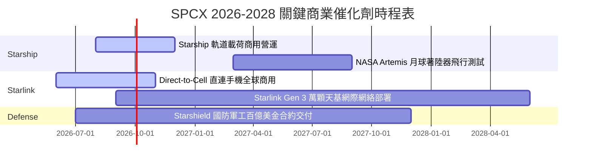

### 8.2 TAM 市場規模分析

```
╔══════════════════════════════════════════════════════════════════╗
║                   SPCX 目標可尋址市場 (TAM)                      ║
╠══════════════════════════════════════════════════════════════════╣
║  1. 全球地面電信與寬頻服務 (Telecom TAM)：   $1.50 Trillion     ║
║     └── SPCX 滲透率 (星鏈全球補白與偏遠通訊)： ~2.0% ($30B/年)   ║
║  2. 航太發射與天基基礎設施 (Launch TAM)：    $45.0 Billion      ║
║     └── SPCX 當前市佔率：                   >75.0% ($6B+/年)    ║
║  3. 國防與情報天基防務 (Starshield TAM)：    $80.0 Billion      ║
║     └── SPCX 當前滲透率：                   ~5.0% ($4B/年)      ║
║  4. 直連手機 (Direct-to-Cell Service TAM)：  $120.0 Billion     ║
╚══════════════════════════════════════════════════════════════════╝
```

### 8.3 成長驅動力結構圖

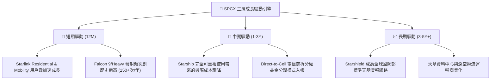

---

## 9. 風險矩陣

### 9.1 風險評分矩陣

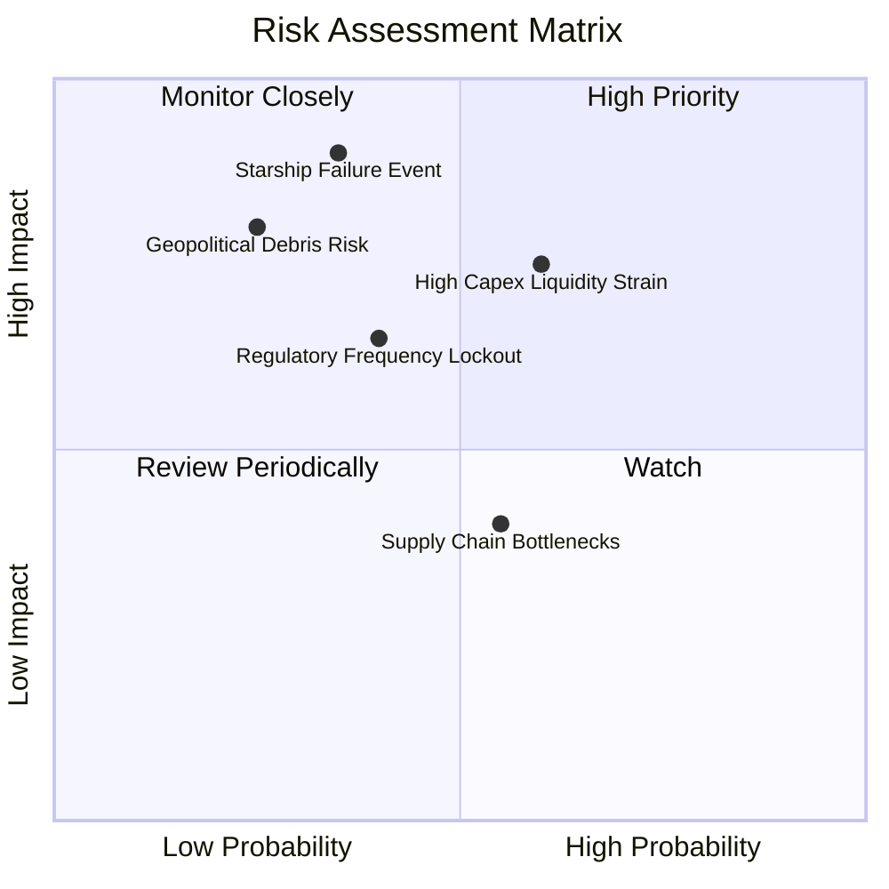

### 9.2 風險清單詳細分析

| # | 風險項目 | 發生機率 | 財務/營運衝擊 | 風險評分 | 緩解措施與觀察指標 |
|---|----------|----------|--------------|----------|--------------------|
| 1 | 🔴 **Starship 研發進度延緩或軌道事故** | 中等 (35%) | 極高 (-30% 估值) | 🔴 **8.2/10** | Falcon 9 穩定發射提供基本盤，多次試飛分散單次失敗風險 |
| 2 | 🟡 **自由現金流持續大幅赤字** | 高 (60%) | 中高 (股權稀釋) | 🟡 **7.5/10** | 現金儲備達 $23.68B，且可通過增資或發債補充資產負債表 |
| 3 | 🔴 **監管與頻譜分配爭議 (FCC/ITU)** | 中等 (40%) | 高 (延遲展業) | 🔴 **7.0/10** | 與全球 50+ 國家監管機構建立合規團隊，積極參與政策制定 |
| 4 | 🟡 **軌道太空垃圾與碰撞風險 (Kessler Effect)** | 低 (25%) | 極高 (衛星受損) | 🟡 **6.5/10** | 衛星配備自主推進避碰系統，主動退役軌道衰減機制 |

---

## 10. 投資建議

### 10.1 最終綜合評級雷達圖

```
╔══════════════════════════════════════════════════════════════╗
║                SPCX 綜合評估雷達圖 (1-10分)                  ║
╠══════════════════════════════════════════════════════════════╣
║  基本面競爭力  9.5 ▓▓▓▓▓▓▓▓▓▓▓▓▓▓▓▓▓▓▓░  🟢 產業絕對霸主     ║
║  營收成長動能  9.5 ▓▓▓▓▓▓▓▓▓▓▓▓▓▓▓▓▓▓▓░  🟢 33%+ 高速成長     ║
║  資產負債健康  7.5 ▓▓▓▓▓▓▓▓▓▓▓▓▓▓▓░░░░░  🟡 現金足但債務增   ║
║  自由現金流    4.0 ▓▓▓▓▓▓▓▓░░░░░░░░░░░░  🔴 重 Capex 擴張期  ║
║  估值吸引力    8.5 ▓▓▓▓▓▓▓▓▓▓▓▓▓▓▓▓▓░░░  🟢 回檔折價顯現     ║
╠══════════════════════════════════════════════════════════════╣
║  加權綜合評分  8.1 ▓▓▓▓▓▓▓▓▓▓▓▓▓▓▓▓░░░░  🟢 強烈推薦評級     ║
╚══════════════════════════════════════════════════════════════╝
```

### 10.2 目標價與隱含報酬率

| 投資情境 | 權重機率 | 12 個月目標價 | 相對當前股價 ($115.07) 隱含報酬率 | 核心觸發條件 |
|----------|----------|---------------|----------------------------------|--------------|
| 🟢 **樂觀情境 (Bull)** | 25% | **$320.00** | **+178.1%** | Starship 成功實現商業化載荷部署，Direct-to-Cell 規模營收入帳 |
| 🟡 **基準情境 (Base)** | **60%** | **$185.00** | **+60.8%** | Starlink 營收維持 30%+ 成長，Capex 增速放緩，EBITDA 利潤率 >25% |
| 🔴 **悲觀情境 (Bear)** | 15% | **$72.00** | **-37.4%** | 發射出現重大事故，FAA 停飛，或全球寬頻用戶採購成長停滯 |
| **加權預期價值** | **100%** | **$191.80** | **+66.7%** | **概率加權回報優異，風險報酬比達 2.8 : 1** |

### 10.3 買入時機與觸發因素

```
╔══════════════════════════════════════════════════════════════════╗
║                  ✅ SPCX 買入觸發條件 Checklist                 ║
╠══════════════════════════════════════════════════════════════════╣
║                                                                  ║
║  立即建倉觸發條件（當前已滿足 3/4）：                             ║
║  ✅ 股價自 52 週高點 $225.64 回檔幅度 >40%（當前已回檔 49%）      ║
║  ✅ TTM 營業現金流 > $7.00B（當前為 $7.10B，造血實力強勁）        ║
║  ✅ 現金與短期投資儲備 > $20.00B（當前為 $23.68B，安全性高）       ║
║  ☐ 季度自由現金流 (FCF) 轉正或赤字收窄 >30%                      ║
║                                                                  ║
║  加碼買入觸發條件：                                              ║
║  ☐ Starship 取得 FAA 完整商業發射頻次許可                        ║
║  ☐ 季度營收年增率 (YoY) 重新加速向上突破 35%                      ║
║                                                                  ║
║  減碼/停損觸發條件：                                              ║
║  ☐ Falcon 9 或 Starship 發生致命軌道級運載事故致長時間停飛       ║
║  ☐ 淨現金流急劇惡化且手頭現金跌破 $10.00B 安全紅線               ║
╚══════════════════════════════════════════════════════════════════╝
```

### 10.4 投資人適配度分析

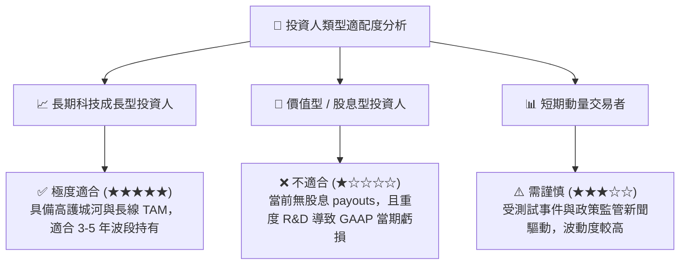

### 10.5 每季財報監控清單（Quarterly Watch List）

| 監控指標 | 基準值 (2026 Q1) | 好於預期（加碼訊號） | 劣於預期（減碼訊號） | 戰略重要性 |
|----------|-----------------|---------------------|---------------------|------------|
| **單季總營收 (Revenue)** | $4.69B | > $5.20B (YoY >25%) | < $4.20B (YoY <5%) | ★★★★★ 評估星鏈終端成長 |
| **毛利率 (Gross Margin)** | 49.1% | > 52.0% | < 42.0% | ★★★★☆ 評估衛星量產規模效益 |
| **營業現金流 (OCF)** | $1.05B | > $2.00B | < $0.50B | ★★★★★ 評估核心造血能力 |
| **資本支出 (Capex)** | -$10.11B | 控制在 -$6.0B 內 | > -$12.0B (現金流失) | ★★★★☆ 評估資本消耗速率 |
| **Starship 商業發射次數** | 軌道測試階段 | 實現 >3 次商業載荷發射 | 發生停飛或重大延誤 | ★★★★★ 未來邊際成本核心關鍵 |

### 10.6 反面論證：什麼會證明論點錯誤（What Would Change My Mind）

```
╔══════════════════════════════════════════════════════════════════╗
║              ⚠️ 論點失效可量化條件 (Disconfirming Evidence)      ║
╠══════════════════════════════════════════════════════════════════╣
║  本研究報告之買入評級與 $185.00 目標價基於長期天基網路成長假設。║
║  若出現以下任一可量化條件，將證明多頭論點失效，應及時停損減碼：  ║
║                                                                  ║
║  1. 營收成長停滯：Starlink 營收 YoY 成長率連續兩季跌破 12.0%。   ║
║  2. 資本效率崩塌：年度 Capex 突破 $25.0B 但營收未實現相應成長，  ║
║     致使 ROIC 惡化至 -15.0% 以下且連續 8 季無法改善。            ║
║  3. 財務安全性危機：現金與短期投資跌破 $8.0B 且無法通過資本市場  ║
║     取得合理成本（<8% 利率）之再融資。                           ║
║  4. 護城河毀損：競品（如 Amazon Kuiper）發射成本降至與 SPCX 持平，║
║     且奪取 >25% 的天基寬頻新增用戶市佔率。                        ║
╚══════════════════════════════════════════════════════════════════╝
```

---

> **免責聲明**：本報告為 AI 自動生成之機構級基本面研究，僅供學術與投資參考，不構成任何買賣建議。投資有風險，入市需謹慎。