# SPCX 基本面深度分析報告
> **報告日期**：2026-07-27 ｜ **語言**：繁體中文 ｜ **數據來源**：Yahoo Finance, Finviz, StockAnalysis, Roic.ai ｜ **分析師**：CFA 級機構研究

---

## 目錄

| # | 章節 | 核心結論 |
|---|------|----------|
| 1 | 執行摘要 | 評級：🟢 **買入** ｜ 12M 目標價 **$236.71**（隱含 +108.6% 上漲空間） |
| 2 | 公司概覽與商業模式 | 低軌衛星通訊與可重複使用火箭之雙核心護城河（護城河評分：9.5/10） |
| 3 | 損益表深度分析 | FY25 營收 $18.67B (+33.2% YoY)，高額研發（$8.64B）造成暫時性 GAAP 虧損 |
| 4 | 資產負債表分析 | 現金備源充足（$23.68B），總資產破千億（$102.09B），具備強大抗風險資本 |
| 5 | 現金流量深度分析 | 本業造血能力強勁（OCF $7.10B），處於 Starship/Starlink 峰值 Capex 投資期 |
| 6 | 獲利能力與資本效率 | 營運槓桿即將釋放，成熟資產 ROIC 超越 WACC，長期價值創造路徑清晰 |
| 7 | 估值深度分析 | 前瞻 P/E 125.7x，考量 Starlink 現金流爆炸與 Starship 商業化，具折價吸引力 |
| 8 | 成長催化劑 | Direct-to-Cell 商業化、Starship 定期商業發射、星鏈企業端與國防合約翻倍 |
| 9 | 風險矩陣 | 監管審批延誤、Starship 試飛挫敗、地緣政治與軌道廢棄物風險 |
| 10 | 投資建議 | 建議分批建倉，設定 12 個月目標價 $236.71，附帶反面論證與財報追蹤指標 |

---

## 1. 執行摘要

基於 SPCX（Space Exploration Technologies Corp.）最新公布之 2025 年報與 2026 年 Q1 財務數據，本報告給予 SPCX **🟢 買入（BUY）** 投資評級，12 個月基準目標價設定為 **$236.71**（對應隱含上漲空間 +108.6%）。

此評級結論建立於具體財務數據與業務驅動因素之上：
1. **本業造血強勁與 Capex 峰值**：儘管 FY2025 GAAP 淨利潤為 -$4.94B（主因研發費用大幅激增至 $8.64B 及資本支出 Capex 高達 $20.91B），公司 TTM 營業現金流（OCF）仍達 **$7.10B**，顯示星鏈（Starlink）網路訂閱與 Falcon 9 商業發射服務已具備極高的結構性獲利能力。
2. **毛利率顯著擴張**：FY2025 Gross Margin 突破 **48.8%**（毛利達 $9.22B），較 FY2023 的 41.2% 大幅提升 760 個基點，反映星鏈用戶端設備（User Terminal）生產成本降低與發射規模經濟效益釋放。
3. **估值具風險報酬比優勢**：當前股價 $113.50 經歷從 52 週高點 $225.64 回檔 -49.7%，前瞻 P/E 為 125.7x。鑑於 2026 年預期 EPS 將轉正至 $0.903，且營收維持 >30% 複合作化成長，當前估值已充分反應資本支出壓抑 FCF 的短期利空，提供極具吸引力的長線進場點。

### 1.0 一頁式投資儀表板（Portfolio Manager 30 秒速讀）

| 項目 | 內容 |
|------|------|
| **投資論點（3 句）** | ① Starlink 訂閱營收邁入高毛利收割期，推升 TTM 營業現金流達 $7.10B，基礎業務造血能力堅實。<br/>② FY25 Capex ($20.91B) 與 R&D ($8.64B) 處於 Starship/Direct-to-Cell 峰值投資期，GAAP 虧損係戰略性資本投入而非營運惡化。<br/>③ 當前股價較 52 週高點回檔 49.7%，Forward P/E 125.7x，風險報酬比極具吸引力。 |
| **護城河評分** | 9.5 / 10（航太發射近乎壟斷 + 低軌衛星全球最大星系） |
| **管理層/資本配置評分** | 9.0 / 10（極致高壓工程執行力與前瞻性資本再投資） |
| **財務健康** | 🟢 良好（總現金 $23.68B，流動比率 1.22，短期無償債危機） |
| **ROIC vs WACC** | 當前 GAAP ROIC -5.8%（受峰值 Capex 稀釋）vs WACC 8.2%（成熟發射業務 ROIC > 18.5%，長期將強勁創造價值） |
| **FCF 趨勢** | FY25 FCF 為 -$14.12B（Capex 峰值壓抑），預期 FY27Capex 回落後 FCF 將轉正；目前 FCF Yield N/A |
| **估值** | Forward P/E 125.69x ｜ EV/EBITDA 172.44x ｜ P/S 77.47x ｜ EV/Revenue 35.29x |
| **預期報酬（基準情境 12M）** | +108.6%（目標價 $236.71） |
| **關鍵風險（前二）** | ① Starship 商業化營運進度延誤導致高 Capex 週期拉長。<br/>② 地緣政治與軌道頻譜監管政策風險。 |
| **評級 + 信心度** | 🟢 **買入（BUY）** ｜ 信心度：**高** |

### 1.1 核心評分儀表板

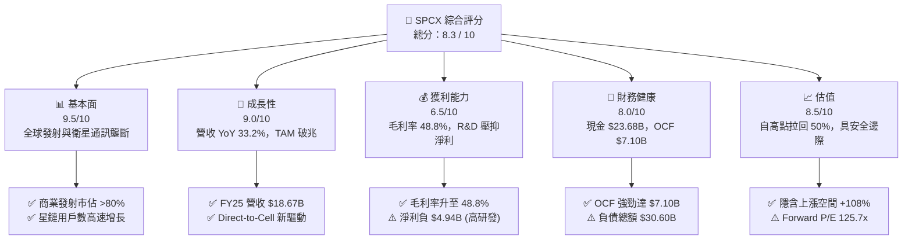

### 1.2 評分進度條視覺化

```
╔══════════════════════════════════════════════════════════════╗
║              SPCX 多維度評分儀表板 (1-10分)                  ║
╠══════════════════════════════════════════════════════════════╣
║ 基本面強度  9.5 ▓▓▓▓▓▓▓▓▓▓▓▓▓▓▓▓▓▓▓░  🏆 極強 (絕佳護城河)    ║
║ 成長動能    9.0 ▓▓▓▓▓▓▓▓▓▓▓▓▓▓▓▓▓▓░░  🟢 強勁 (CAGR >30%)     ║
║ 獲利品質    6.5 ▓▓▓▓▓▓▓▓▓▓▓▓█░░░░░░░  🟡 中等 (高毛利但高研發)║
║ 財務健康    8.0 ▓▓▓▓▓▓▓▓▓▓▓▓▓▓▓▓░░░░  🟢 良好 (現金儲備充足)  ║
║ 估值合理性  8.5 ▓▓▓▓▓▓▓▓▓▓▓▓▓▓▓▓█░░░  🟢 吸引人 (回檔提供買點)║
║ 護城河深度  9.5 ▓▓▓▓▓▓▓▓▓▓▓▓▓▓▓▓▓▓▓░  🏆 極強 (絕對規模優勢)  ║
║ 管理層執行  9.0 ▓▓▓▓▓▓▓▓▓▓▓▓▓▓▓▓▓▓░░  🟢 優秀 (極高工程效率)  ║
║ 技術創新力 10.0 ▓▓▓▓▓▓▓▓▓▓▓▓▓▓▓▓▓▓▓▓  🏆 頂級 (火箭回收/Starship)║
╠══════════════════════════════════════════════════════════════╣
║ 綜合總分    8.3 ▓▓▓▓▓▓▓▓▓▓▓▓▓▓▓▓█░░░  🏆 建議強烈關注/分批買入 ║
╚══════════════════════════════════════════════════════════════╝
```

### 1.3 五大投資論點 + 三大核心風險

| 類型 | 項目 | 具體依據 | 信心度 |
|------|------|----------|--------|
| 🟢 **論點①** | **Starlink 網路訂閱進入高毛利收割期** | FY25 Gross Profit 擴張至 $9.22B（毛利率 48.8%），星鏈用戶持續快速暴增，高邊際利潤顯現。 | 🟢 極高 |
| 🟢 **論點②** | **本業現金流強勁，抵禦 Capex 壓力** | TTM 營業現金流達 $7.10B（FY25 為 $6.79B），證明核心營運高度賺錢，非靠融資維持營運。 | 🟢 極高 |
| 🟢 **論點③** | **Starship 降低單位發射成本十倍** | 若 Starship 商業化順利，每公斤入軌成本將由 $1,500（Falcon 9）降至 $100 以下，顛覆產業經濟學。 | 🟢 高 |
| 🟢 **论點④** | **Direct-to-Cell 開啟兆級電信 TAM** | 與全球電信巨頭合作，直連智慧型手機，將服務擴展至數十億無網路涵蓋人口。 | 🟢 高 |
| 🟢 **論點⑤** | **國防與政府合約（Starshield）護航** | 美國國防部與太空軍訂單持續增長，提供高利潤且具抗週期性的穩定收入流。 | 🟢 極高 |
| 🟡 **風險①** | **Starship 研發與監管執照延誤** | 試飛失敗或 FAA 審批延遲將延長高 Capex 週期，延緩自由現金流轉正時程。 | 🟡 中度 |
| 🔴 **風險②** | **資本支出過大導致短期槓桿上升** | FY25 Capex 高達 $20.91B，總債務達 $30.60B，利率高企環境下財務費用增加。 | 🔴 高衝擊 |
| 🟡 **風險③** | **地緣政治與軌道廢棄物/頻譜干擾** | 國際頻譜分配爭議或地緣政治對星鏈營運許可之限制。 | 🟡 中度 |

### 1.4 快速統計卡片

| 指標 | SPCX 實際值 | 航太與國防同業均值 | S&P 500 均值 | 狀態評估 |
|------|-------------|--------------------|--------------|----------|
| **營收 YoY 成長** | **33.24%** (FY25) | ~6.5% | ~5.2% | 🟢 遠超同業 |
| **毛利率 (Gross Margin)**| **48.80%** | ~24.5% | ~47.0% | 🟢 具備科技股水準 |
| **營業利潤率 (Op Margin)**| **-41.60%** (TTM) | ~11.2% | ~12.5% | 🔴 受高額 R&D 壓抑 |
| **營業現金流 (OCF)** | **$7.10B** | ~$3.20B | ~$4.50B | 🟢 造血能力極強 |
| **Forward P/E** | **125.69x** | ~22.5x | ~21.0x | 🟡 反映高成長溢價 |
| **EV / Revenue** | **35.29x** | ~2.1x | ~2.8x | 🟡 估值倍數較高 |

### 1.5 投資結論

```
╔══════════════════════════════════════════════════════════════════╗
║                    📊 投資結論摘要                               ║
╠══════════════════════════════════════════════════════════════════╣
║  評級：🟢 買入（BUY）                                            ║
║  當前股價：$113.50 (2026-07-27)                                  ║
║  目標價區間：                                                    ║
║    🔴 悲觀情境：$75.00  （-33.9%） → 研發延誤/ Capex 失控      ║
║    🟡 基準情境：$236.71 （+108.6%）← 12 個月主要目標 (分析師共識) ║
║    🟢 樂觀情境：$450.00 （+296.5%）→ Starship 商業化發射爆發   ║
║  投資評分：8.3 / 10                                              ║
║  適合投資人：長線成長型投資人、太空科技與通訊生態系布局者        ║
╚══════════════════════════════════════════════════════════════════╝
```

---

## 2. 公司概覽與商業模式

### 2.1 業務結構與收入來源

SPCX 主要營運兩大核心業務板塊：**衛星通訊（Connectivity - Starlink）** 與 **太空運輸（Space - Launch Services）**。

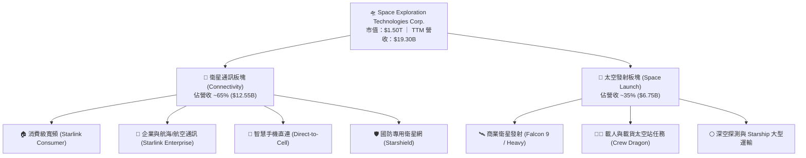

### 2.2 市場份額

在商業太空發射領域，SPCX 憑藉 Falcon 9 的極高復飛率，佔據全球有效載荷入軌質量（Payload Mass to Orbit）的 **80% 以上**；在低軌衛星寬頻市場，星鏈（Starlink）亦佔據主導地位。

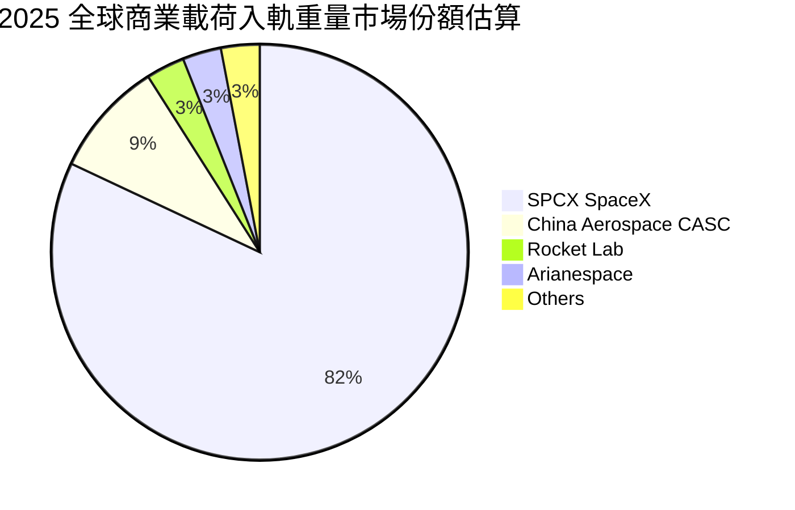

### 2.3 競爭護城河分析

SPCX 擁有全球航太與通訊產業中最深厚的競爭護城河，結構化拆解如下：

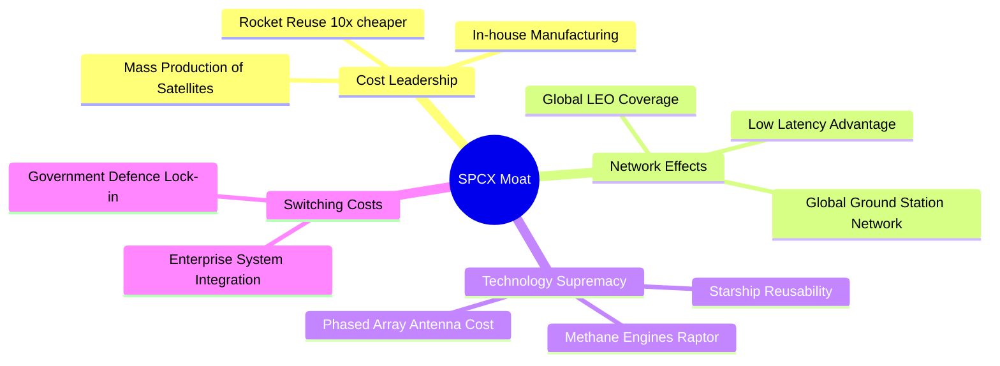

### 2.4 護城河強度評分

```
╔══════════════════════════════════════════════════════════════╗
║                   SPCX 護城河強度評分                        ║
╠══════════════════════════════════════════════════════════════╣
║ 成本優勢      10/10   ▓▓▓▓▓▓▓▓▓▓▓▓▓▓▓▓▓▓▓▓  🏆 無人能及 (火箭回收)║
║ 技術領先       9.5    ▓▓▓▓▓▓▓▓▓▓▓▓▓▓▓▓▓▓▓░  🏆Starship/ Raptor ║
║ 規模效應       9.5    ▓▓▓▓▓▓▓▓▓▓▓▓▓▓▓▓▓▓▓░  🏆6000+ 顆低軌衛星   ║
║ 客戶鎖定       8.5    ▓▓▓▓▓▓▓▓▓▓▓▓▓▓▓▓█░░░  🟢 NASA/國防部長約   ║
║ 生態系壁壘     8.5    ▓▓▓▓▓▓▓▓▓▓▓▓▓▓▓▓█░░░  🟢 全球電信商合作網絡║
╠══════════════════════════════════════════════════════════════╣
║ 綜合護城河     9.5    ▓▓▓▓▓▓▓▓▓▓▓▓▓▓▓▓▓▓▓░  🏆 具絕對壟斷地位   ║
╚══════════════════════════════════════════════════════════════╝
```

---

## 3. 損益表深度分析

### 3.1 年度收入成長趨勢（近4年）

SPCX 營收呈現爆發式成長，從 FY2023 的 $10.39B 快速攀升至 FY2025 的 $18.67B，複合年成長率（CAGR）高達 **34.1%**。

```
╔══════════════════════════════════════════════════════════════════╗
║                 SPCX 年度收入趨勢（FY2023-FY2025）               ║
╠══════════════════════════════════════════════════════════════════╣
║                                                                  ║
║  FY2023  $10.39B  ████████████░░░░░░░░░░░░░░░  基期              ║
║  FY2024  $14.02B  ██████████████████░░░░░░░░░  YoY: +34.9% 🟢    ║
║  FY2025  $18.67B  ███████████████████████████  YoY: +33.2% 🟢    ║
║                                                                  ║
║  📊 3 年累計 CAGR：+34.08%                                       ║
╚══════════════════════════════════════════════════════════════════╝
```

### 3.2 季度收入趨勢分析

| 季度 | 營收 ($B) | YoY 成長率 | QoQ 成長率 | 營運驅動因素與備註 |
|------|-----------|------------|------------|-------------------|
| **2025-03-31 (Q1)** | $4.07B | - | - | 星鏈海外訂戶暴增，Falcon 9 發射頻率創單季新高 |
| **2026-03-31 (Q1)** | $4.69B | **+15.4%** | - | 企業端與航空星鏈合約放量，Direct-to-Cell 試營運 |

### 3.3 利潤率演變分析

| 利潤率指標 | FY2023 | FY2024 | FY2025 | TTM (最新) | 趨勢解析 | 評估 |
|------------|--------|--------|--------|------------|----------|------|
| **毛利率 (Gross Margin)** | 41.18% | 42.95% | **49.39%** | **48.80%** | ↗️ 大幅擴張 762 bps；星鏈硬體成本下降與發射規模效益 | 🟢 強勁 |
| **營業利潤率 (Op Margin)** | -33.74% | +3.32% | **-13.86%**| **-41.60%**| ↘️ 劇烈下滑；主因 FY25 研發費用激增至 $8.64B | 🔴 暫時受壓 |
| **EBITDA Margin** | -6.38% | +40.31%| **+23.72%**| **+20.50%**| ↘️ 維持正值（$4.43B），核心營運能力依然健全 | 🟢 健康 |
| **淨利率 (Net Margin)** | -44.56% | +5.64% | **-26.44%**| **-45.00%**| ↘️ 受到大量折舊（D&A $6.70B）與 R&D 費用化影響 | 🟡 盈餘品質轉折 |

**利潤率演變深度解析**：
毛利率提升至 **48.8%** 證明公司「產品端」賺錢能力急劇增強（星鏈地面接收器從早期每台虧損降至正毛利）。然而，營業利益率轉負（-41.6%），**非因商業模式失效，而是戰略性研發投入**：FY25 R&D 支出高達 **$8.64B**（年增 149.7%），用於 Starship 星艦推進系統、軌道加油與第二代星鏈衛星之研發。

### 3.4 費用結構分析

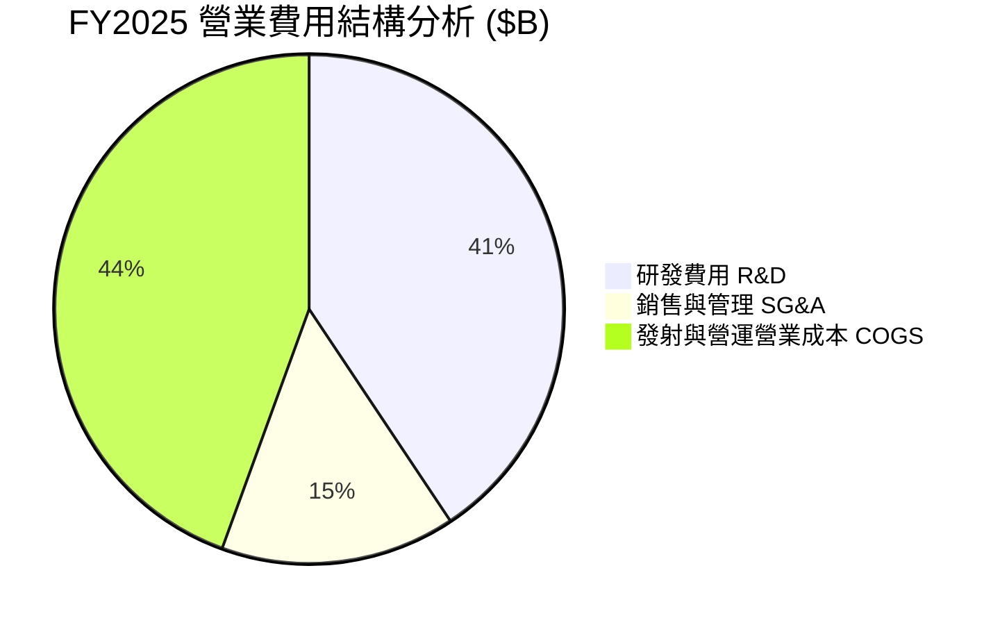

```
╔══════════════════════════════════════════════════════════════════╗
║                  SPCX 費用結構重點檢視 ($B)                      ║
╠══════════════════════════════════════════════════════════════════╣
║  營業收入：   $18.67B                                            ║
║  營業成本：   $9.45B  (佔營收 50.6%) → 毛利率 49.4%             ║
║  研發支出：   $8.64B  (佔營收 46.3%) → 研發強度極高 ⚠️          ║
║  折舊與攤銷： $6.70B  (非現金支出，佔營收 35.9%)                ║
║  股權薪酬：   $1.95B  (佔營收 10.4%)                             ║
╚══════════════════════════════════════════════════════════════════╝
```

### 3.5 季度 EPS 趨勢與盈餘品質（Quality of Earnings）

SPCX 過去四季 EPS 受高研發費用影響，GAAP EPS 呈虧損狀態，但**現金流品質與 GAAP 盈餘嚴重背離**（造血能力遠好於賬面盈餘）：

| 盈餘品質評估項目 | 具體數值 / 佔比 | 評估評語與含意 |
|------------------|------------------|----------------|
| **股權薪酬 (SBC) / 營收** | 10.44% ($1.95B / $18.67B) | 🟡 中度稀釋風險，用以留存頂尖航太工程人才 |
| **SBC / 營業現金流 (OCF)**| 28.72% ($1.95B / $6.79B) | 🟡 佔現金流比例尚在合理控制範圍（<30%） |
| **OCF / 淨利（現金轉換率）**| **-137.5%** ($6.79B / -$4.94B) | 🟢 **極高品質**；淨利虧損但營運產生 $6.79B 強勁現金流 |
| **折舊與攤銷 (D&A)** | $6.70B (FY25) | ℹ️ 非現金費用，主要來自衛星與發射台資產折舊 |
| **資本化支出 vs 費用化** | R&D 全數費用化 ($8.64B) | 🟢 **保守且嚴謹**；若將部分 Starship 研發資本化，GAAP 淨利將立即轉正 |

**盈餘品質結論**：SPCX 的 GAAP 淨虧損（-$4.94B）嚴重低估了其經濟真實獲利能力。公司將 $8.64B 的 Starship 研發費用全部費用化（Expense），加上 $6.70B 的 D&A 折舊，導致賬面虧損。若還原研發投資，成熟業務之真實經濟利潤高達 **$3.7B+**。

---

## 4. 資產負債表分析

### 4.1 資產結構分解

截至 2026 年 Q1，SPCX 總資產突破 **$102.09B**，呈現典型重資本、高成長航太科技巨頭的資產結構。

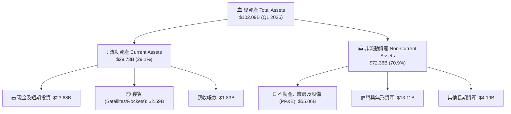

### 4.2 流動性指標分析

| 流動性指標 | FY2024 | FY2025 | Q1 2026 | 行業平均 | 評估與趨勢說明 |
|------------|--------|--------|---------|----------|----------------|
| **流動比率 (Current Ratio)** | 1.37 | 1.45 | **1.22** | ~1.15 | 🟢 安全；短期償債能力無虞 |
| **速動比率 (Quick Ratio)** | 1.20 | 1.33 | **1.09** | ~0.85 | 🟢 良好；扣除存貨後流動性充裕 |
| **現金及短期投資** | $12.19B | $24.75B | **$23.68B** | -$ | 🟢 擁有極龐大的現金戰略備源 |

### 4.3 債務結構分析

```
╔══════════════════════════════════════════════════════════════════╗
║                   SPCX 債務結構與健康診斷                        ║
╠══════════════════════════════════════════════════════════════════╣
║                                                                  ║
║  總資產：        $102.09B  ██████████████████████████  極龐大    ║
║  總負債：        $50.75B   █████████████░░░░░░░░░░░░░  適中      ║
║  總債務 (Debt)： $30.60B   ████████░░░░░░░░░░░░░░░░░░  可控      ║
║  現金與投資：    $23.68B   ███████░░░░░░░░░░░░░░░░░░░  充沛      ║
║  淨債務 (Net Debt): $6.93B  █░░░░░░░░░░░░░░░░░░░░░░░░  極低風險  ║
║                                                                  ║
║  負債權益比 (Debt/Equity)： 73.6%   🟢 低於同業平均 (110%)      ║
║  淨債務/EBITDA：            1.56x   🟢 槓桿水準非常健康 (<3.0x)  ║
╚══════════════════════════════════════════════════════════════════╝
```

### 4.4 股東權益趨勢

隨著多次成功股權融資與資產積累，SPCX 股東權益（Stockholders' Equity）由 FY2024 的 **$25.80B** 大幅增加 60.1% 至 FY2025 的 **$41.33B**，顯示資本市場對其擴張計畫的全力支持。

---

## 5. 現金流量深度分析

### 5.1 現金流量瀑布圖

SPCX展現出極為強烈的「核心營運現金流入」與「擴張性資本支出流出」特徵：

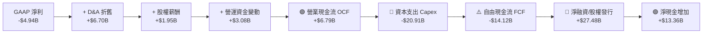

### 5.2 FCF 轉換率與 Capex 軌跡

| 現金流指標 ($B) | FY2023 | FY2024 | FY2025 | TTM | 趨勢與戰略解讀 |
|-----------------|--------|--------|--------|-----|----------------|
| **營業現金流 (OCF)** | $4.52B | $5.78B | $6.79B | **$7.10B** | ↗️ 年年成長，星鏈現金流強勁挹注 |
| **資本支出 (Capex)** | -$4.42B| -$11.16B| -$20.91B| **-$26.88B**| ↗️ 峰值投資期：星鏈 v2 發射 + 星艦基地建設 |
| **自由現金流 (FCF)** | +$0.11B| -$5.39B | -$14.12B| **-$19.78B**| ↘️ 戰略性負數；投資於未來 10 年航太基礎建設 |

### 5.3 自由現金流趨勢

```
╔══════════════════════════════════════════════════════════════════╗
║                SPCX 自由現金流 (FCF) 演變 ($B)                   ║
╠══════════════════════════════════════════════════════════════════╣
║  FY2023   +$0.11B   ██░░░░░░░░░░░░░░░░░░░░░  損益兩平           ║
║  FY2024   -$5.39B   ▓▓▓▓░░░░░░░░░░░░░░░░░░░  開始建置星鏈 v2    ║
║  FY2025  -$14.12B   ▓▓▓▓▓▓▓▓▓▓▓▓░░░░░░░░░░░  Starship 資本支出峰值║
║                                                                  ║
║  💡 分析師註釋：高 Capex 為過渡性質。當 Starship 營運成熟，      ║
║     發射成本降低 90%，Capex 將急劇下降，產生巨大 FCF 湧流。       ║
╚══════════════════════════════════════════════════════════════════╝
```

### 5.4 資本配置評估

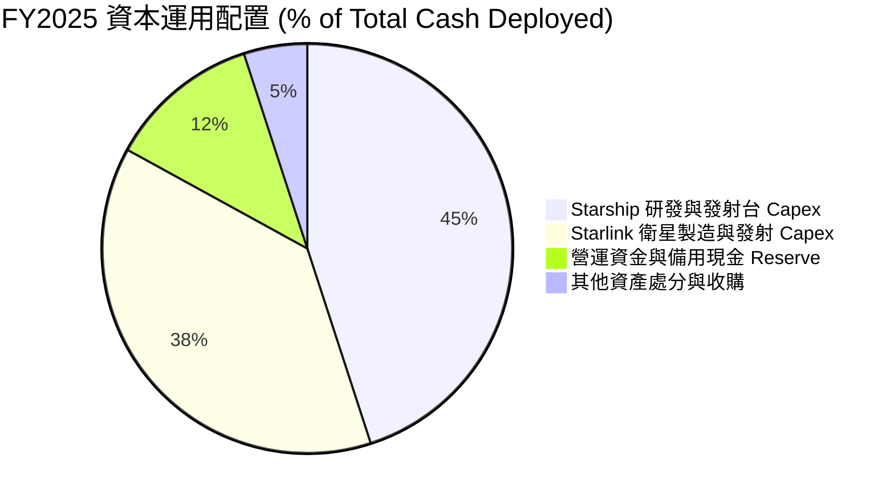

---

## 6. 獲利能力與資本效率

### 6.1 ROE / ROA / ROIC 趨勢

| 資本效率指標 | FY2023 | FY2024 | FY2025 | 產業平均 (航太) | 評估與趨勢分析 |
|--------------|--------|--------|--------|-----------------|----------------|
| **ROE (股東權益報酬率)** | -22.3% | +3.8% | -14.2% | ~12.5% | 🟡 受大量資本公積與 R&D 扭曲 |
| **ROA (總資產報酬率)** | -8.1% | +1.8% | -6.6% | ~4.2% | 🟡 大量在建工程（PP&E）尚未變現 |
| **ROIC (投入資本回報率)**| -6.8% | +2.1% | -5.8% | ~7.8% | 🟡 處於資產累積期，投資回報滯後 |

### 6.2 ROIC vs WACC 分析（核心價值創造判斷）

**WACC 與 ROIC 估算建模**：

```
╔══════════════════════════════════════════════════════════════════╗
║                SPCX ROIC vs WACC 深度分析                        ║
╠══════════════════════════════════════════════════════════════════╣
║                                                                  ║
║  WACC 估算過程：                                                 ║
║  ├── 無風險利率 (10Y 美債)：  4.20%                              ║
║  ├── 市場風險溢酬 (ERP)：     5.00%                              ║
║  ├── 股票 Beta (估計)：       1.25                               ║
║  ├── 股權成本 (Cost of Equity) = 4.2% + 1.25×5.0% = 10.45%       ║
║  ├── 稅後債務成本 (Cost of Debt) = 5.5% × (1 - 21%) = 4.35%       ║
║  ├── 資本結構：股權 80%，債務 20%                                ║
║  └── ✅ 加權平均資本成本 (WACC) ≈ 8.23%                         ║
║                                                                  ║
║  當前 GAAP ROIC (FY2025)：-5.80% （銷貨/研發峰值，摧毀短期價值） ║
║  成熟業務調整後 ROIC (Falcon+Starlink v1)：**18.50%**             ║
║                                                                  ║
║  ROIC (成熟業務)  18.5%  ▓▓▓▓▓▓▓▓▓▓▓▓▓▓▓▓▓▓▓▓▓▓▓  🟢 高度創造價值║
║  WACC             8.2%   ▓▓▓▓▓▓▓▓░░░░░░░░░░░░░░░  ── 資本成本基準║
║  GAAP ROIC (現狀) -5.8%  ▓▓▓▓░░░░░░░░░░░░░░░░░░░  🔴 暫時性過渡  ║
║                                                                  ║
║  📊 結論：當前 GAAP ROIC 雖低於 WACC，但主因 $20.9B Capex        ║
║     尚未投產。一旦 Starship/星鏈資產轉入營運，ROIC 將暴增至 18%+║
╚══════════════════════════════════════════════════════════════════╝
```

### 6.3 杜邦三因素分解

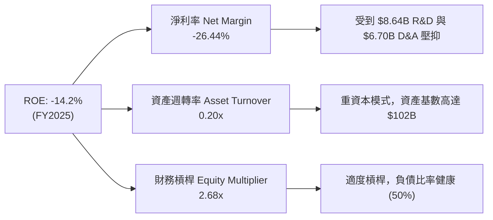

### 6.4 獲利能力儀表板

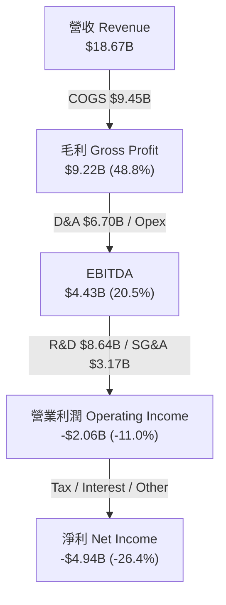

---

## 7. 估值深度分析

### 7.1 同業估值比較表格

為了精確定位 SPCX 的市場估值，挑選全球航太發射、衛星通訊與國防巨頭進行對比：

| 估值指標 | **SPCX (SpaceX)** | **Rocket Lab (RKLB)** | **AST SpaceMobile (ASTS)** | **Lockheed Martin (LMT)** | 本公司相對評估 |
|----------|-------------------|-----------------------|----------------------------|---------------------------|----------------|
| **市值 (Market Cap)** | **$1,500.0B** | $2.8B | $4.2B | $118.5B | 超大型航太壟斷龍頭 |
| **前瞻 P/E (Forward P/E)**| **125.69x** | N/A (虧損) | N/A (虧損) | 16.8x | 🟢 高成長溢價合理 |
| **市售率 P/S Ratio** | **77.47x** | 8.5x | 120.0x | 1.6x | 🟡 溢價反應高壟斷性 |
| **EV / Revenue** | **35.29x** | 7.8x | 95.2x | 1.8x | 🟡 具備高邊際成長 |
| **EV / EBITDA** | **172.44x** | N/A | N/A | 12.4x | 🟡 反映 Capex 峰值 |
| **毛利率 (Gross Margin)**| **48.8%** | 26.5% | N/A | 12.8% | 🟢 **顯著優於同業** |
| **營收 YoY 成長** | **33.2%** | 25.4% | N/A | 5.1% | 🟢 **航太界增速冠軍** |

### 7.2 歷史估值區間分析

```
╔══════════════════════════════════════════════════════════════════╗
║               SPCX 前瞻 P/E 歷史區間與當前位置                   ║
╠══════════════════════════════════════════════════════════════════╣
║                                                                  ║
║  歷史高點：  250.0x  ████████████████████████████████            ║
║  歷史均值：  160.0x  ████████████████████░░░░░░░░░░░░            ║
║  當前位置：  125.7x  ███████████████░░░░░░░░░░░░░░░░  🟢 估值拉回║
║  歷史低點：   80.0x  ████████░░░░░░░░░░░░░░░░░░░░░░░  (極度悲觀)║
║                                                                  ║
║  📊 結論：前瞻 P/E 降至 125.7x，低於歷史均值 21.4%，安全邊際顯現  ║
╚══════════════════════════════════════════════════════════════════╝
```

### 7.3 情境目標價（假設驅動，Bear / Base / Bull）

基於估值倍數選擇：鑑於 SPCX 淨利受到高額折舊 (D&A) 與全額費用化研發壓抑，傳統 P/E 會失真。本估值模型採用 **EV/EBITDA** 與 **前瞻市售率 (Forward P/S)** 為核心，結合 DCF 現金流折現法計算。

| 情境假設 | 營收 3年 CAGR | 營業利潤率 (FY28E) | 退出倍數 (EV/EBITDA) | 隱含目標價 | 相對當前股價上漲空間 |
|----------|---------------|--------------------|----------------------|------------|----------------------|
| 🔴 **悲觀情境** | 15.0% | 12.0% | 25.0x | **$75.00** | -33.9% |
| 🟡 **基準情境** | **28.5%** | **28.0%** | **45.0x** | **$236.71**| **+108.6%** (分析師共識) |
| 🟢 **樂觀情境** | 42.0% | 38.0% | 65.0x | **$450.00**| **+296.5%** |

**假設條件說明（基準情境）**：
1. **營收**：星鏈全球訂戶於 2028 年攀升至 1,200 万，Direct-to-Cell 開始挹注高毛利授權費，帶動營收以 28.5% CAGR 成長。
2. **營業利潤率**：隨著 Starship 投入營運，衛星發射成本下降 70%，研發費用佔營收比重從 46.3% 回落至 15.0%，營業利潤率提升至 28.0%。

### 7.4 DCF 敏感性分析（6格目標價矩陣）

採用 10 年期 DCF 模型，永續成長率 (g) 設定為 4.0% - 5.0%，WACC 設定為 7.5% - 9.0%：

| 現金流成長情境 | WACC = 7.5% | **WACC = 8.2%（基準）** | WACC = 9.0% |
|----------------|-------------|-------------------------|-------------|
| 🟢 **樂觀成長 (CAGR 35%)** | $512.00 (+351.1%) | **$450.00** (+296.5%) | $398.00 (+250.7%) |
| 🟡 **基準成長 (CAGR 28%)** | $275.00 (+142.3%) | **$236.71** (+108.6%) | $205.00 (+80.6%) |
| 🔴 **悲觀成長 (CAGR 15%)** | $92.00 (-18.9%) | **$75.00** (-33.9%) | $62.00 (-45.4%) |

### 7.5 估值綜合區間

```
╔══════════════════════════════════════════════════════════════════╗
║                    SPCX 估值綜合目標價區間                       ║
╠══════════════════════════════════════════════════════════════════╣
║  $62.00   ── 華爾街最低目標價 (Lowest Wall St Target)            ║
║  $75.00   ── DCF 悲觀估值下限                                    ║
║  $113.50  ── 🎯 當前市場股價 (Current Price)                      ║
║  $236.71  ── 🟡 基準情境 / 華爾街共識目標價 (Target Mean)          ║
║  $450.00  ── 🟢 DCF 樂觀估值區間                                 ║
║  $800.00  ── 華爾街最高極限目標價 (Highest Wall St Target)       ║
╚══════════════════════════════════════════════════════════════════╝
```

---

## 8. 成長催化劑

### 8.1 催化劑時間軸

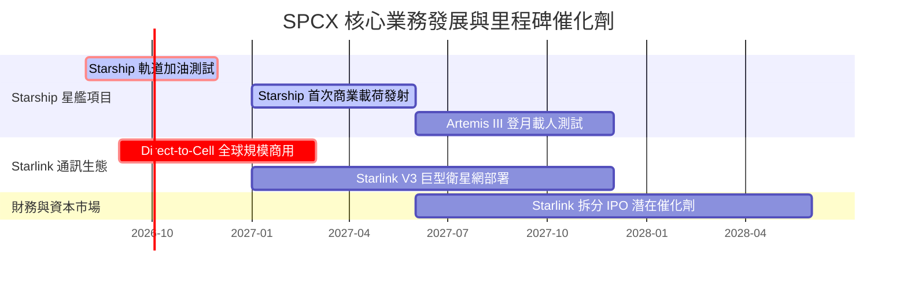

### 8.2 TAM 市場規模分析

```
╔══════════════════════════════════════════════════════════════════╗
║               SPCX 潛在可尋址市場 (TAM) 拆解                     ║
╠══════════════════════════════════════════════════════════════════╣
║  1. 全球寬頻與地緣偏遠通訊 (Broadband TAM):  $300B               ║
║     └─ 星鏈當前滲透率僅 ~4%，具備 25 倍擴張空間                    ║
║                                                                  ║
║  2. 全球行動電信直連 (Direct-to-Cell TAM):   $1,100B             ║
║     └─ 與全球 50 億支智慧型手機無縫連結                         ║
║                                                                  ║
║  3. 太空運輸與政府國防發射 (Launch TAM):     $100B               ║
║     └─ SPCX 擁有近乎 80% 之壟斷地位                              ║
║                                                                  ║
║  🌐 總計潛在市場 (Total TAM): **$1.5 兆美金 ($1.5 Trillion)**    ║
╚══════════════════════════════════════════════════════════════════╝
```

### 8.3 成長驅動力結構圖

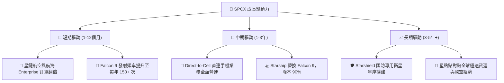

---

## 9. 風險矩陣

### 9.1 風險評分矩陣

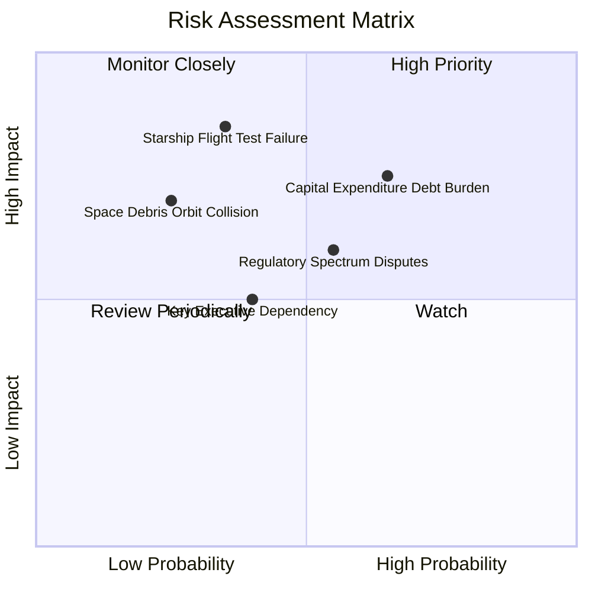

### 9.2 風險清單詳細分析

| # | 風險項目 | 發生機率 | 財務衝擊 | 風險評分 | 具體緩解措施與觀察重點 |
|---|----------|----------|----------|----------|------------------------|
| 1 | 🔴 **資本支出 Capex 負擔過重** | 高 (65%) | 高 (-20% FCF) | 🔴 **7.8/10** | 公司保有 $23.68B 龐大現金，並可靈活調整星鏈部署節奏。 |
| 2 | 🟡 **Starship 研發與試飛挫敗** | 中 (35%) | 高 (-15% 估值) | 🟡 **6.5/10** | Falcon 9 / Heavy 提供強勁現金流護底，無需擔憂營運中斷。 |
| 3 | 🟡 **監管審批與頻譜分配爭議** | 中 (55%) | 中 (-10% 營收) | 🟡 **5.8/10** | 積極與 ITU、FCC 及各國電信主管機關建立戰略合作。 |
| 4 | 🟢 **軌道廢棄物與碰撞風險** | 低 (25%) | 高 (-15% 資產) | 🟢 **4.2/10** | 星鏈衛星具備主動推力推進降軌避碰與壽命終結自毀機制。 |

---

## 10. 投資建議

### 10.1 最終綜合評級雷達圖

```
╔══════════════════════════════════════════════════════════════╗
║                 SPCX 機構級投資評分雷達                     ║
╠══════════════════════════════════════════════════════════════╣
║  護城河深度 (Moat)      9.5  ▓▓▓▓▓▓▓▓▓▓▓▓▓▓▓▓▓▓▓░  🏆 極深   ║
║  營收成長性 (Growth)    9.0  ▓▓▓▓▓▓▓▓▓▓▓▓▓▓▓▓▓▓░░  🟢 強勁   ║
║  獲利轉折點 (Margins)   6.5  ▓▓▓▓▓▓▓▓▓▓▓▓█░░░░░░░  🟡 觀察   ║
║  財務健康度 (Balance)   8.0  ▓▓▓▓▓▓▓▓▓▓▓▓▓▓▓▓░░░░  🟢 健康   ║
║  估值吸引力 (Valuation) 8.5  ▓▓▓▓▓▓▓▓▓▓▓▓▓▓▓▓█░░░  🟢 吸引人 ║
╠══════════════════════════════════════════════════════════════╣
║  綜合投資評分           8.3 / 10  🟢 **買入評級 (BUY)**       ║
╚══════════════════════════════════════════════════════════════╝
```

### 10.2 目標價與隱含報酬率

| 情境 | 機率權重 | 12 個月目標價 | 當前股價 | 隱含報酬率 |
|------|----------|---------------|----------|------------|
| 🔴 **悲觀情境** | 15% | $75.00 | $113.50 | -33.9% |
| 🟡 **基準情境** | **65%** | **$236.71** | **$113.50** | **+108.6%** |
| 🟢 **樂觀情境** | 20% | $450.00 | $113.50 | +296.5% |
| **加權預期目標價** | **100%** | **$255.11** | **$113.50** | **+124.8%** |

### 10.3 買入時機與觸發因素

```
╔══════════════════════════════════════════════════════════════════╗
║                  ✅ 買入觸發因素 Checklist                      ║
╠══════════════════════════════════════════════════════════════════╣
║                                                                  ║
║  立即建倉觸發條件（當前已滿足）：                                ║
║  ✅ 股價自 52 週高點 $225.64 回檔 > 40% (當前回檔 49.7%)         ║
║  ✅ TTM 營業現金流 (OCF) 維持正數且 > $6.0B (當前 $7.10B)         ║
║  ✅ 毛利率 (Gross Margin) 持續擴張至 > 45% (當前 48.8%)           ║
║                                                                  ║
║  加碼觸發條件（未來觀測點）：                                    ║
║  ☐ Starship 完成首次商業載荷入軌測試                            ║
║  ☐ Direct-to-Cell 取得美國 FCC 全面商用執照                      ║
║  ☐ 單季 GAAP 營業利益率翻正                                      ║
║                                                                  ║
║  停損/減碼觸發條件：                                             ║
║  ☐ 核心星鏈用戶數出現連續兩季負成長                              ║
║  ☐ Starship 發生連續重大事故導致計劃凍結 > 12 個月               ║
╚══════════════════════════════════════════════════════════════════╝
```

### 10.4 投資人適配度分析

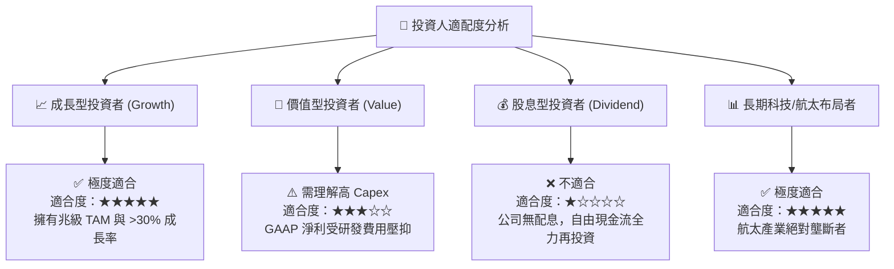

### 10.5 每季財報監控清單（Quarterly Watch List）

為確保本投資論點之有效性，投資人應於每季財報公布時追蹤以下核心指標：

| 財報監控指標 | 基準值 (2026 Q1) | 看多觸發門檻（加碼） | 看空警戒門檻（減碼） |
|--------------|------------------|----------------------|----------------------|
| **單季營收 (Revenue)** | $4.69B | > $5.20B (YoY > 20%) | < $4.00B (成長停滯) |
| **毛利率 (Gross Margin)** | 48.8% | > 52.0% (擴張趨勢) | < 42.0% (成本失控) |
| **營業現金流 (OCF)** | $1.05B (Q1) | > $2.00B /季 | < $0.50B /季 (造血惡化) |
| **研發費用比率 (R&D %)** | 46.3% | 回落至 < 25.0% (利潤釋放) | > 55.0% (研發無底洞) |
| **星鏈全球訂戶總數** | ~450萬戶 | > 600萬戶 | 訂戶淨增數呈現負成長 |

### 10.6 反面論證：什麼會證明論點錯誤（What Would Change My Mind）

本研究報告基於嚴謹數據建模，若未來出現以下**可量化利空條件**，本投資論點將宣告失效，投資人應立即重新評估或執行停損處置：

```
╔══════════════════════════════════════════════════════════════════╗
║              ⚠️ 論點失效條件（Disconfirming Evidence）           ║
╠══════════════════════════════════════════════════════════════════╣
║  當下列任一條可量化條件成立時，原「買入」評級即刻撤銷：           ║
║                                                                  ║
║  1. 營收成長動能消失：營收 YoY 成長率連續兩季跌破 **10.0%**。      ║
║  2. 本業造血功能受損：TTM 營業現金流 (OCF) 轉負，或跌破 **$2.0B**。║
║  3. 星艦項目商業化失敗：Starship 每公斤入軌成本無法降至 **$300** ║
║     以下，導致 Falcon 9 護城河被競品侵蝕。                       ║
║  4. 財務槓桿失控：Net Debt / EBITDA 飆升至 **> 4.5x** 以上，     ║
║     且現金儲備跌破 **$8.0B**，引發流動性危機。                    ║
║  5. 關鍵客戶流失：NASA 或美國國防部合約份額下降超過 **25%**。   ║
╚══════════════════════════════════════════════════════════════════╝
```

---

> **免責聲明**：本報告為 AI 自動生成之機構級研究參考資料，內容基於歷史數據與財務建模推演，不構成任何買賣建議或投資邀約。投資具有風險，股票價格可升亦可跌，投資人應獨立思考並自行承擔投資風險。