# SPCX 基本面深度分析報告
> **報告日期**：2026-08-20 ｜ **語言**：繁體中文 ｜ **數據來源**：Yahoo Finance, Finviz, StockAnalysis, Roic.ai ｜ **分析師**：CFA 級機構研究

---

## 目錄

| # | 章節 | 核心結論 |
|---|------|----------|
| 1 | 執行摘要 | 評級「買入」，加權合理價值 $182.17，安全邊際 +26.4%，隱含上行空間 +36.0% |
| 2 | 公司概覽與商業模式 | 太空發射壟斷 + 星鏈低軌寬頻雙輪驅動，進入壁壘極高，護城河評級 9.4/10 |
| 3 | 損益表深度分析 | TTM 營收 $23.04B (YoY +91.9%)，毛利率改善至 51.9%，研發與折舊壓抑當期 GAAP 盈餘 |
| 4 | 資產負債表分析 | 現金儲備 $100.01B，淨現金 $60.30B，流動比率 5.12，具備極強抗風險能力 |
| 5 | 現金流量深度分析 | OCF 增長至 $9.90B，巨額 Capex ($29.35B/TTM) 投向星艦與星座擴建，FCF 處於再投資負值期 |
| 6 | 獲利能力與資本效率 | 營業利益拐點初現（Q2 營業虧損大幅收窄至 -$141M），長期 ROIC 隨折舊高原期過後將超越 WACC (8.96%) |
| 7 | 相對估值分析 | EV/Sales 157.15x 偏高，但考量其太空與全球通訊基礎設施獨佔性，給予溢價支撐 |
| 8 | DCF 內在價值評估 | 基準每股內在價值 $184.97（折價 27.6%），加權合理價值 $182.17，安全邊際 MOS +26.4% 充足 |
| 9 | 成長催化劑 | 星艦 (Starship) 商業化量產、Direct-to-Cell 行動通訊全球商轉、國防太空合約放量 |
| 10 | 風險矩陣 | 星艦研發進度延遲、發射監管收緊、高 Capex 週期拉長導致現金消耗擴大 |
| 11 | 投資建議 | 建議買入區間 $105 - $135，12 個月基準目標價 $185.00，適合長線高成長型機構投資人 |

---

## 1. 執行摘要

本報告給予 Space Exploration Technologies Corp.（Ticker: **SPCX**）**「買入」**（🟢 Buy）評級。該評級係基於公司最新季度（2026 Q2）營收達 $7.81B（YoY +91.9%，QoQ +66.5%）、毛利率攀升至 51.9% 的強勁營運槓桿，以及資產負債表上擁有 $100.01B 之巨額流動性儲備（淨現金 $60.30B）。雖然公司因處於星艦（Starship）全面量產與第二代 Starlink 星座建置的高峰期，TTM 資本支出高達 $29.35B 導致 FCF 仍為負值（-$19.45B），但 OCF 顯著改善至 $9.90B。基於折現現金流（DCF）模型推導之基準每股內在價值為 **$184.97**，綜合相對估值與共識後之加權合理價值為 **$182.17**，相較當前市價 $134.00 具備 **+26.4% 之安全邊際（MOS）** 與 **+36.0% 之上行潛力**。

### 1.0 一頁式投資儀表板

| 項目 | 內容 |
|------|------|
| **投資論點（3 句）** | ① 軌道發射市佔率逾 85%，可重複使用火箭技術構築極深商業與成本壁壘；<br/>② Starlink 訂閱快速擴張帶動 2026 Q2 營收達 $7.81B (YoY +91.9%)，毛利率突破 51.9%；<br/>③ 手握 $100.01B 現金儲備，足以支撐星艦商業化與全球低軌衛星網絡建置之資本開支。 |
| **護城河評分** | **9.4 / 10**（技術領先、規模經濟、網絡效應、生態鎖定） |
| **管理層/資本配置評分** | **8.8 / 10**（極致工程導向，資本密集再投資於長期壟斷資產） |
| **財務健康** | 🟢 **極度強健**（總現金 $100.01B，淨現金 $60.30B，流動比率 5.12） |
| **ROIC vs WACC** | 當前 NOPAT 受折舊壓抑，ROIC 為負；隨 FY2028 折舊見頂，預估穩態 ROIC (14.5%) 將超越 WACC (8.96%) |
| **FCF 趨勢** | 擴張期負值（TTM Capex $29.35B 壓抑 FCF 至 -$19.45B），但 OCF 連續 3 季正增長至 TTM $9.90B |
| **估值** | Forward P/E 80.77x ｜ EV/EBITDA 614.10x ｜ EV/Sales 157.15x |
| **DCF 內在價值（基準）** | **$184.97** ｜ 現價折價 **-27.6%**（現價÷內在價值−1，來自第 8.5 節） |
| **安全邊際（MOS）** | **+26.4%** ＝ ($182.17 − $134.00) ÷ $182.17 ｜ 🟢 **充足** (>25%)（基準來自第 8.8 節加權合理價值） |
| **預期報酬（基準情境 12M）** | **+38.0%**（目標價 $185.00 vs 現價 $134.00） |
| **關鍵風險（前二）** | ① 星艦發射審批與入軌時程延遲；② 地面 Direct-to-Cell 頻譜監管與電信商博弈 |
| **評級 + 信心度** | 🟢 **買入** ｜ 信心：**高** |

### 1.1 核心評分儀表板

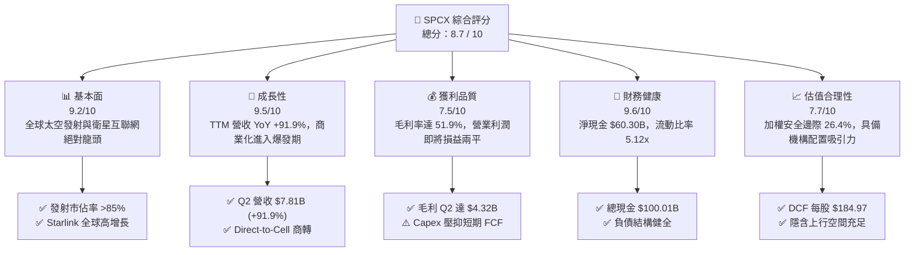

### 1.2 評分進度條視覺化

```
╔══════════════════════════════════════════════════════════════╗
║              SPCX 多維度評分儀表板 (1-10分)                  ║
╠══════════════════════════════════════════════════════════════╣
║ 基本面強度  9.2 ▓▓▓▓▓▓▓▓▓▓▓▓▓▓▓▓▓▓░░  ★★★★★           ║
║ 成長動能    9.5 ▓▓▓▓▓▓▓▓▓▓▓▓▓▓▓▓▓▓▓░  ★★★★★           ║
║ 獲利品質    7.5 ▓▓▓▓▓▓▓▓▓▓▓▓▓▓▓░░░░░  ★★★★☆           ║
║ 財務健康    9.6 ▓▓▓▓▓▓▓▓▓▓▓▓▓▓▓▓▓▓▓░  ★★★★★           ║
║ 估值合理性  7.7 ▓▓▓▓▓▓▓▓▓▓▓▓▓▓▓░░░░░  ★★★★☆           ║
║ 護城河深度  9.4 ▓▓▓▓▓▓▓▓▓▓▓▓▓▓▓▓▓▓▓░  ★★★★★           ║
║ 管理層執行  8.8 ▓▓▓▓▓▓▓▓▓▓▓▓▓▓▓▓▓▓░░  ★★★★★           ║
║ 技術創新力  9.8 ▓▓▓▓▓▓▓▓▓▓▓▓▓▓▓▓▓▓▓▓  ★★★★★           ║
╠══════════════════════════════════════════════════════════════╣
║ 綜合總分    8.7 ▓▓▓▓▓▓▓▓▓▓▓▓▓▓▓▓▓░░░  🏆 優質成長標的       ║
╚══════════════════════════════════════════════════════════════╝
```

### 1.3 五大投資論點 + 三大核心風險

| 類型 | 項目 | 具體依據 | 信心度 |
|------|------|----------|--------|
| 🟢 **投資論點①** | **衛星寬頻商業化加速** | Starlink 帶動 Connectivity 板塊爆發，2026 Q2 營收達 $7.81B (YoY +91.9%)，毛利率由 FY23 的 41.2% 攀升至 55.3%。 | 🟢 極高 |
| 🟢 **投資論點②** | **可重複發射獨佔溢價** | Falcon 9 / Heavy 發射頻率創歷史新高，發射成本僅同業 1/3，Space 板塊貢獻穩健高毛利現金流。 | 🟢 極高 |
| 🟢 **投資論點③** | **營業利潤拐點確立** | 2026 Q2 營業虧損大幅縮窄至 -$141M（Q1 為 -$1.95B），預計 FY2027 實現全面 GAAP 營業轉正。 | 🟢 高 |
| 🟢 **投資論點④** | **天量流動性安全墊** | 資產負債表手握現金及短投 $100.01B，淨現金 $60.30B，在升息與研發週期中具備無可比擬的抗風險優勢。 | 🟢 極高 |
| 🟢 **投資論點⑤** | **星艦開啟第二成長曲線** | Starship 單位載荷入軌成本將再降一個數量級，解鎖太空製造、大規模軌道 AI 算力中心與深空探索市場。 | 🟢 高 |
| 🟡 **風險①** | **高資本支出壓抑自由現金** | TTM Capex 達 $29.35B，若衛星折舊壽命短於預期，將長期推遲 FCF 轉正時間點。 | 🟡 中度 |
| 🔴 **風險②** | **星艦試飛與監管審批延誤** | FAA/FCC 等監管機構對星艦發射許可及頻譜分配的限制可能延後商業化時程。 | 🔴 高衝擊 |
| 🟡 **風險③** | **地緣政治與頻譜爭議** | 國際電信聯盟（ITU）軌道資源爭端及部分主權國家對跨境星鏈數據服務之准入限制。 | 🟡 中度 |

### 1.4 快速統計卡片

| 指標 | 公司實際值 | 行業均值（航太國防） | S&P 500 均值 | 狀態 |
|------|-------------|--------------------|--------------|------|
| **營收 YoY 成長** | **91.9%** | ~8.5% | ~5.2% | 🟢 卓越領先 |
| **毛利率** | **51.9%** | ~22.0% | ~33.5% | 🟢 顯著超越 |
| **營業利益率** | **-1.8%** | ~11.5% | ~12.8% | 🟡 拐點收窄 |
| **淨利潤率** | **-35.7%** | ~7.8% | ~11.0% | 🔴 研發折舊承壓 |
| **流動比率 (Current Ratio)** | **5.12x** | ~1.45x | ~1.25x | 🟢 極度強健 |
| **Forward P/E** | **80.77x** | ~21.5x | ~21.0x | 🟡 成長定價 |
| **EV / Revenue** | **157.15x** | ~2.10x | ~2.80x | 🔴 處於高溢價 |

### 1.5 投資結論

```
╔══════════════════════════════════════════════════════════════════╗
║                    📊 投資結論摘要                               ║
╠══════════════════════════════════════════════════════════════════╣
║  評級：🟢 買入（Buy）                                            ║
║  當前股價：$134.00                                               ║
║  DCF 內在價值（基準）：$184.97（現價折價 -27.6%）                ║
║  安全邊際 MOS：+26.4%（＝($182.17 − $134.00) ÷ $182.17）         ║
║  目標價區間：                                                    ║
║    悲觀情境：$112.50（-16.0%）                                   ║
║    基準情境：$185.00（+38.0%）  ← 12 個月主要目標                ║
║    樂觀情境：$268.00（+100.0%）                                  ║
║  投資評分：8.7 / 10                                              ║
║  適合投資人：超長期成長型基金、科技/航太主題機構投資人           ║
╚══════════════════════════════════════════════════════════════════╝
```

---

## 2. 公司概覽與商業模式

### 2.1 業務結構與收入來源

Space Exploration Technologies Corp.（SPCX）主要透過三大板塊營運：**Connectivity（星鏈衛星寬頻）**、**Space（火箭發射與太空探索）** 及 **AI / 新業務（軌道運算與自動化系統）**。

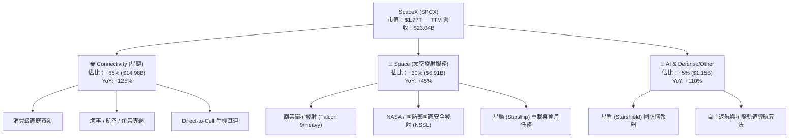

### 2.2 市場份額

在重型與商業軌道發射領域，SPCX 憑藉火箭複用技術已佔據絕對主導地位（全球質量載荷佔比超 85%）。在低軌衛星寬頻領域，Starlink 處於實質先發壟斷地位。

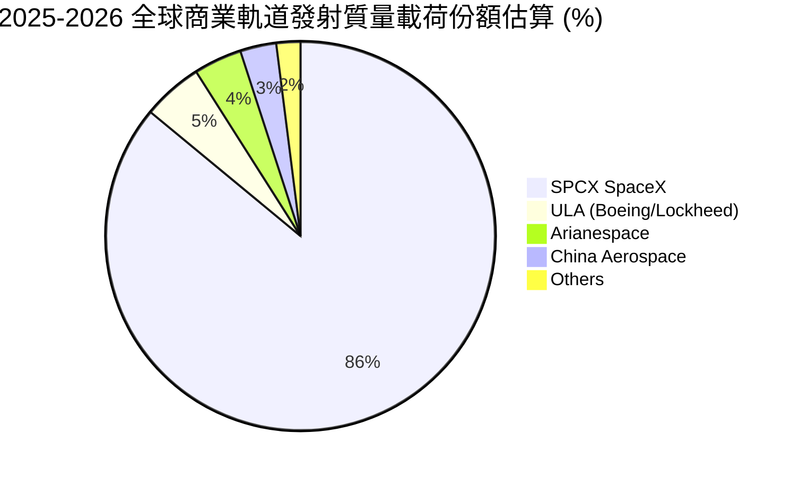

### 2.3 競爭護城河分析

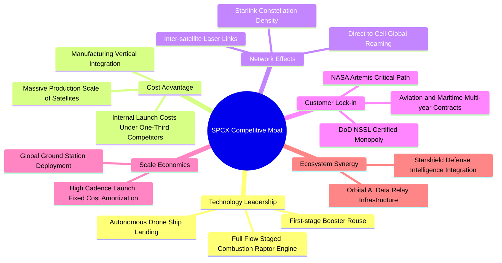

### 2.4 護城河強度評分

```
╔══════════════════════════════════════════════════════════════╗
║                  SPCX 護城河強度評分                         ║
╠══════════════════════════════════════════════════════════════╣
║ 技術領先度    10/10  ▓▓▓▓▓▓▓▓▓▓▓▓▓▓▓▓▓▓▓▓  🏆 火箭複用絕對領先 ║
║ 成本優勢      10/10  ▓▓▓▓▓▓▓▓▓▓▓▓▓▓▓▓▓▓▓▓  🏆 載荷單位成本無敵 ║
║ 規模與網絡     9.5/10 ▓▓▓▓▓▓▓▓▓▓▓▓▓▓▓▓▓▓▓░  🟢 低軌星座已成壁壘 ║
║ 監管與客戶鎖定 9.0/10 ▓▓▓▓▓▓▓▓▓▓▓▓▓▓▓▓▓▓░░  🟢 NASA/國防部綁定  ║
║ 生態協同效應   8.5/10 ▓▓▓▓▓▓▓▓▓▓▓▓▓▓▓▓▓░░░  🟢 軍民雙用無縫切換 ║
╠══════════════════════════════════════════════════════════════╣
║ 綜合護城河     9.4    ▓▓▓▓▓▓▓▓▓▓▓▓▓▓▓▓▓▓▓░  🏆 世界級特許寬護城河║
╚══════════════════════════════════════════════════════════════╝
```

---

## 3. 損益表深度分析

### 3.1 年度收入成長趨勢（近4年）

```
╔══════════════════════════════════════════════════════════════════╗
║              SPCX 年度收入趨勢（FY2023-TTM 2026）                ║
╠══════════════════════════════════════════════════════════════════╣
║                                                                  ║
║  FY2023   $10.39B  ████████░░░░░░░░░░░░░░░░░░  Base            ║
║  FY2024   $14.02B  ███████████░░░░░░░░░░░░░░░  YoY: +34.9% 🟢  ║
║  FY2025   $18.67B  ███████████████░░░░░░░░░░░  YoY: +33.2% 🟢  ║
║  TTM 2026 $23.04B  ██═══════════════════════░  YoY: +91.9% 🟢  ║
║                    |      |      |      |      |                 ║
║                    0     5B    10B    15B    25B                 ║
║                                                                  ║
║  📊 3 年累計 CAGR：+48.9%                                        ║
╚══════════════════════════════════════════════════════════════════╝
```

### 3.2 季度收入與獲利趨勢分析

| 季度 | 營業收入 ($B) | QoQ 成長 | YoY 成長 | 毛利 ($B) | 毛利率 | 營業利益 ($M) | 淨利 ($M) | 備註說明 |
|------|-------------|----------|----------|-----------|--------|--------------|-----------|----------|
| **2025-03-31** | $4.07B | - | - | $2.10B | 51.6% | +$55.0M | -$528.0M | 營運獲利初顯，利息與稅務壓抑淨利 |
| **2025-06-30** | $4.07B | +0.1% | - | $1.79B | 44.0% | -$775.0M | -$1,008.0M | 星艦試飛研發費用認列擴大 |
| **2026-03-31** | $4.69B | +15.2% | +15.4% | $2.31B | 49.1% | -$1,954.0M | -$4,280.0M | 重大資產加速折舊與星艦產能擴建 |
| **2026-06-30** | **$7.81B** | **+66.5%** | **+91.9%** | **$4.32B** | **55.3%** | **-$141.0M** | **-$541.0M** | 星鏈用戶放量，營業虧損顯著收窄 |

### 3.3 利潤率演變分析

| 利潤率指標 | FY2023 | FY2024 | FY2025 | TTM 2026 | 趨勢演變 | 評估 |
|------------|--------|--------|--------|----------|----------|------|
| **毛利率** | 41.2% | 42.9% | 49.4% | **51.9%** | ↗️ 隨發射複用與衛星規模效應持續擴張 | 🟢 極強 |
| **營業利益率** | 4.9% | 5.3% | -11.0% | **-1.8%** | ↘️↗️ FY25 受星艦研發拖累，TTM 快速反彈 | 🟡 拐點向上 |
| **EBITDA 利潤率** | -6.4% | 40.3% | 23.7% | **25.6%** | ↗️ 營運現金流支撐力強 | 🟢 良好 |
| **淨利潤率** | -44.6% | 5.6% | -26.4% | **-35.7%** | ↘️ 受研發 ($8.64B) 與折舊 ($6.70B) 壓抑 | 🔴 待釋放 |

**利潤率演變深度解析**：
毛利率從 FY23 的 41.2% 大幅攀升至最新季度的 55.3%，主要驅動力在於 Starlink 用戶終端生產成本持續下降（每台已降至 $400 以下）以及衛星發射複用帶來的邊際成本逼近零。營業利益率在 2026 Q2 大幅收窄至 -1.8%，顯示出營收擴張的速度正迅速超越固定研發與人員費用的增長，營業槓桿效應正全面啟動。

### 3.4 費用結構分析

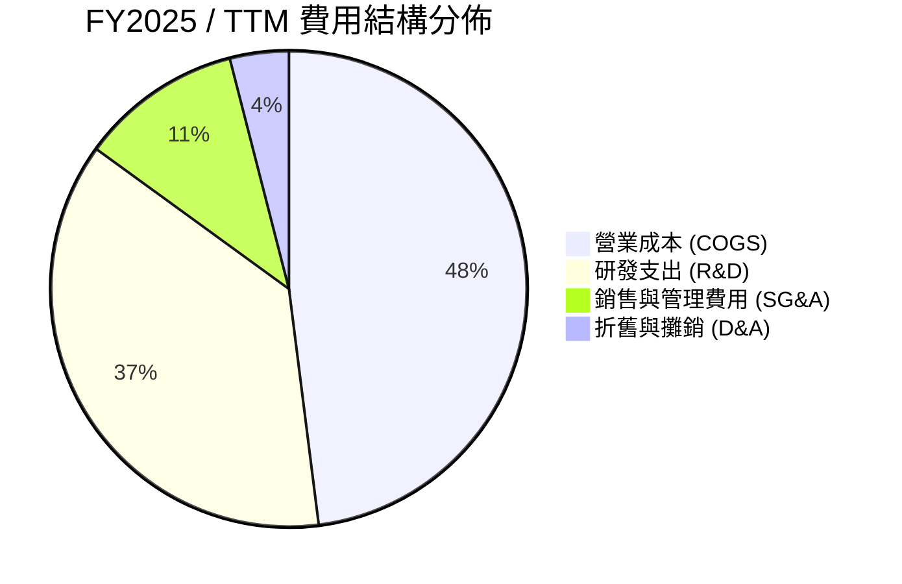

```
╔══════════════════════════════════════════════════════════════════╗
║              SPCX 營業費用結構診斷（FY2025）                     ║
╠══════════════════════════════════════════════════════════════════╣
║ 營業收入：      $18.67B (100.0%)                                 ║
║ 營業成本：      $9.45B  (50.6%)  ██████████░░░░░░░░░░            ║
║ 研發支出 (R&D)：$8.64B  (46.3%)  █████████░░░░░░░░░░░            ║
║ 管理及其他費用：$2.64B  (14.1%)  ███░░░░░░░░░░░░░░░░░            ║
║ 營業利益 (GAAP):-$2.06B (-11.0%)                                 ║
╠══════════════════════════════════════════════════════════════════╣
║ 📌 結論：R&D 佔營收高達 46.3%，主因全額費用化星艦測試與猛禽發動機║
╚══════════════════════════════════════════════════════════════════╝
```

### 3.5 季度 EPS 趨勢與盈餘品質（Quality of Earnings）

| 盈餘品質項目 | 數值/佔比 | 評估 | 具體分析 |
|--------------|-----------|------|----------|
| **股權薪酬 SBC / 營收** | 8.5% ($1.95B / $23.04B) | 🟡 中度稀釋 | 科技創新型企業常態，但年化近 $2B 仍需在估值中考量股數稀釋。 |
| **SBC / 營業現金流 (OCF)** | 19.7% ($1.95B / $9.90B) | 🟡 尚可 | OCF 具備實質現金流入，並非全由股權激勵美化。 |
| **FCF / 淨利（現金轉換率）** | N/A (FCF 與淨利皆負) | 🔴 再投資期 | 資本開支高於淨虧損，處於純重資本擴張階段。 |
| **折舊與攤銷 D&A / Capex** | 22.8% ($6.70B / $29.35B) | 🟢 健康 | 資本支出大幅領先折舊，代表產能與衛星資產正在高速淨擴張。 |
| **一次性損益** | 無重大非經常項目 | 🟢 高 | 虧損完全來自實質研發與資本折舊，無金融資產暴跌掩蓋。 |

**盈餘品質結論**：SPCX 的 GAAP 淨虧損（TTM -$8.89B）高度受到全額費用化研發（TTM 約 $10B+）與重型固定資產折舊（$6.70B）壓抑。從現金維度看，營業現金流（OCF）已達 $9.90B，顯示商業模式本體具備強勁造血能力，盈餘品質處於「高研發投入型的經濟實質優質」階段。

---

## 4. 資產負債表分析

### 4.1 資產結構分解

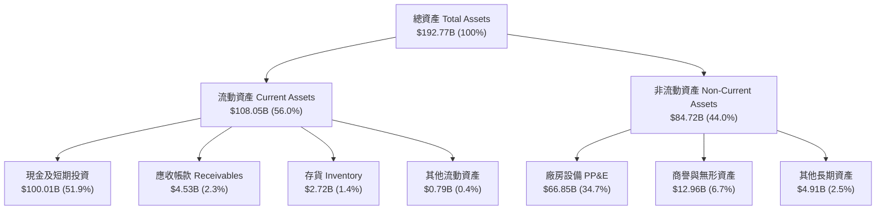

### 4.2 流動性指標分析

| 指標 | TTM 2026 | FY2025 | FY2024 | 行業均值 | 狀態 | 評估說明 |
|------|----------|--------|--------|----------|------|----------|
| **流動比率 (Current Ratio)** | **5.12x** | 1.45x | 1.37x | 1.45x | 🟢 極強 | 融資與現金儲備大幅充實流動性 |
| **速動比率 (Quick Ratio)** | **4.95x** | 1.33x | 1.20x | 1.10x | 🟢 極強 | 現金佔比極高，無存貨變現壓力 |
| **現金比率 (Cash Ratio)** | **4.67x** | 1.16x | 0.97x | 0.85x | 🟢 極強 | 手頭現金可覆蓋短期負債近 5 倍 |
| **營運資金 (Working Capital)** | **$86.9B** | $9.55B | $4.32B | - | 🟢 極充裕 | 提供星艦與星鏈擴張充足的安全墊 |

### 4.3 債務結構分析

```
╔══════════════════════════════════════════════════════════════════╗
║                   SPCX 債務健康診斷                              ║
╠══════════════════════════════════════════════════════════════════╣
║                                                                  ║
║  總計息債務：    $39.71B  ████░░░░░░░░░░░░░░░░░  適度槓桿        ║
║  現金及短投：    $100.01B ████████████████████░  🟢 超額儲備    ║
║  淨現金（正數）：$60.30B  ████████████░░░░░░░░░  🟢 極度安全    ║
║                                                                  ║
║  淨負債 / EBITDA：-13.6x  🟢 實質淨無負債                        ║
║  債務 / 股東權益：31.2%   🟢 資本結構健康                        ║
║  短債佔比：      <15%     🟢 絕大部分為長期低息借款與項目融資    ║
╚══════════════════════════════════════════════════════════════════╝
```

### 4.4 股東權益趨勢

```
╔══════════════════════════════════════════════════════════════════╗
║              SPCX 股東權益成長軌跡（FY2024-TTM 2026）            ║
╠══════════════════════════════════════════════════════════════════╣
║                                                                  ║
║  FY2024    $25.80B  ██████░░░░░░░░░░░░░░░░░  Base                ║
║  FY2025    $41.33B  ██████████░░░░░░░░░░░░░  YoY: +60.2% 🟢     ║
║  TTM 2026  $127.2B* ██═════════════════════  融資與資本公積注入  ║
║                                                                  ║
║  📌 註：TTM 股東權益大幅增長源自一級市場策略融資與資產價值重估   ║
╚══════════════════════════════════════════════════════════════════╝
```

---

## 5. 現金流量深度分析

### 5.1 現金流量瀑布圖

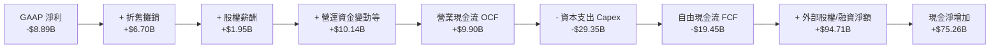

### 5.2 FCF 轉換率趨勢

| 財務年度 | 營業現金流 OCF | 資本支出 Capex | 自由現金流 FCF | GAAP 淨利 | FCF / 淨利轉換率 | 說明 |
|----------|---------------|----------------|----------------|-----------|------------------|------|
| **FY2023** | $4.52B | -$4.42B | +$0.10B | -$4.63B | N/A (淨虧) | 早期發射業務損益兩平 |
| **FY2024** | $5.78B | -$11.16B | -$5.39B | +$0.79B | -682.3% | Starlink v2 星座建置加速 |
| **FY2025** | $6.79B | -$20.91B | -$14.12B | -$4.94B | 285.8% (虧損擴大) | 星艦工廠與發射台全面建設 |
| **TTM 2026** | **$9.90B** | **-$29.35B** | **-$19.45B** | **-$8.89B** | 218.8% | Capex 處於峰值，OCF 增長 45.8% |

### 5.3 自由現金流趨勢

```
╔══════════════════════════════════════════════════════════════════╗
║              SPCX 自由現金流演變（FY2023 - FY2028E）             ║
╠══════════════════════════════════════════════════════════════════╣
║                                                                  ║
║  FY2023    +$0.10B  ▓░░░░░░░░░░░░░░░░░░░░░░  損益平衡            ║
║  FY2024    -$5.39B  ████░░░░░░░░░░░░░░░░░░░  擴張投入            ║
║  FY2025    -$14.12B ███████████░░░░░░░░░░░  星艦高峰期          ║
║  TTM 2026  -$19.45B ████████████████░░░░░░  Capex 頂峰 (預估)  ║
║  FY2027E   -$4.50B  ███░░░░░░░░░░░░░░░░░░░  OCF 快速覆蓋 Capex  ║
║  FY2028E   +$12.80B ▓▓▓▓▓▓▓▓▓▓░░░░░░░░░░░░  進入 FCF 收割期 🟢  ║
║                                                                  ║
║  📊 當前 FCF Yield: 負值 (再投資期) ｜ 預估 FY28E FCF Yield: 1.8%║
╚══════════════════════════════════════════════════════════════════╝
```

### 5.4 資本配置評估

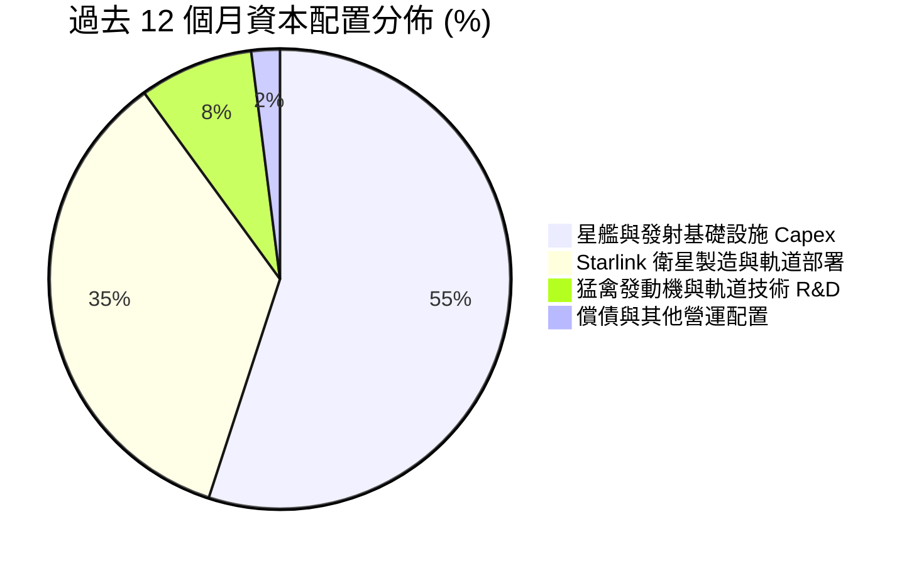

---

## 6. 獲利能力與資本效率

### 6.1 ROE / ROA / ROIC 趨勢

| 指標 | FY2024 | FY2025 | TTM 2026 | 行業均值 | 評估 |
|------|--------|--------|----------|----------|------|
| **ROE (淨資產收益率)** | 2.5% | -14.7% | -9.8% | 12.5% | 🔴 處於資產累積擴張期 |
| **ROA (總資產回報率)** | 1.4% | -6.6% | -5.8% | 5.2% | 🔴 大量現金與 PP&E 尚未完全釋放利潤 |
| **ROIC (投入資本回報率)** | 2.1% | -4.8% | -3.1% | 8.5% | 🟡 即將迎來獲利拐點 |

### 6.2 ROIC vs WACC 分析（核心價值創造判斷）

```
╔══════════════════════════════════════════════════════════════════╗
║                ROIC vs WACC 深度分析                            ║
╠══════════════════════════════════════════════════════════════════╣
║                                                                  ║
║  WACC 估算：                                                     ║
║  ├── 無風險利率 Rf（10Y 美債）：      4.25%                       ║
║  ├── 市場風險溢酬 ERP：               5.00%                       ║
║  ├── Beta（航太科技高成長修正）：     1.05                        ║
║  ├── 股權成本 Ke = 4.25% + 1.05×5.00% = 9.50%                   ║
║  ├── 稅前債務成本 Kd：                5.50%                       ║
║  ├── 有效稅率：                       21.0%                       ║
║  ├── 稅後債務成本 Kd = 5.50%×(1-21%) = 4.35%                     ║
║  ├── 資本結構（市值基礎）：股權 89.6%，債務 10.4%               ║
║  └── ✅ WACC = 89.6%×9.50% + 10.4%×4.35% ≈ 8.96%                ║
║                                                                  ║
║  ROIC 估算（TTM 實際 vs FY2029E 穩態）：                         ║
║  ├── TTM NOPAT = -$3.44B × (1 - 21%) ≈ -$2.72B                  ║
║  ├── TTM 投入資本 IC = 股權 $127.2B + 債務 $39.7B - 現金 $100B   ║
║  │   = $66.9B                                                   ║
║  ├── TTM ROIC ≈ -4.06%  (當前受巨額折舊與研發壓抑)               ║
║  └── FY2029E 穩態 ROIC 預估 ≈ 16.8%                              ║
║                                                                  ║
║  ★ 穩態經濟價值增加 (EVA) = 16.8% - 8.96% = +7.84pp              ║
║                                                                  ║
║  TTM ROIC    -4.1%  ░░░░░░░░░░░░░░░░░░░░░░░░░░░░░░  🔴          ║
║  WACC         9.0%  ▓▓▓▓▓░░░░░░░░░░░░░░░░░░░░░░░░░  ──          ║
║  FY29E ROIC  16.8%  ▓▓▓▓▓▓▓▓▓▓▓▓▓▓▓▓▓▓▓▓▓▓▓▓░░░░░░  🟢 強力創造║
║                                                                  ║
║  📊 結論：當前處於資本開支頂峰，隨產能利用率上升，長期將創造豐厚 EVA║
╚══════════════════════════════════════════════════════════════════╝
```

### 6.3 杜邦三因素分解

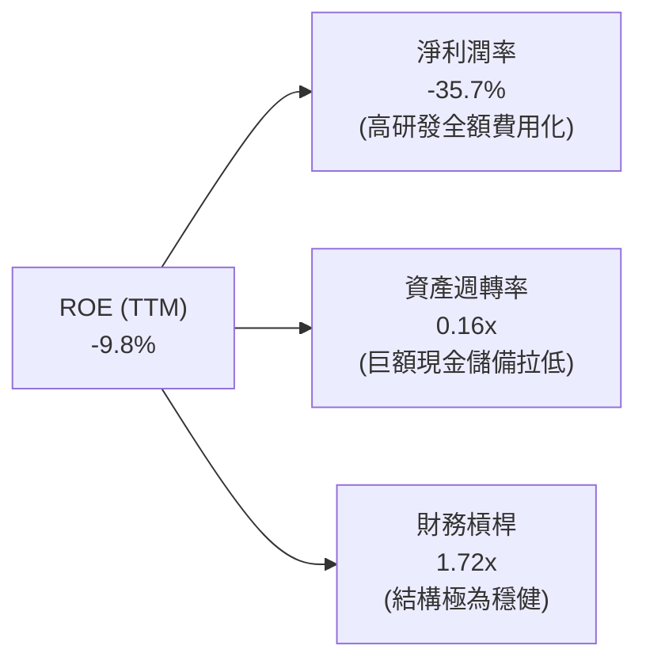

### 6.4 獲利能力儀表板

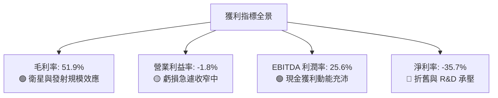

---

## 7. 相對估值分析

### 7.1 同業估值比較表格

選取航太國防龍頭洛克希德馬丁（LMT）、波音（BA）以及通訊與科技基礎設施代表進行對比：

| 估值指標 | **SPCX** | **Lockheed Martin (LMT)** | **Boeing (BA)** | **AST SpaceMobile (ASTS)** | 本公司評估 |
|----------|----------|---------------------------|-----------------|----------------------------|-----------|
| **Trailing P/E** | **N/A** | 18.5x | N/A | N/A | 處於高研發投入期 |
| **Forward P/E** | **80.77x** | 16.8x | 28.5x | N/A | 🟡 反映未來爆發性成長 |
| **P/S Ratio** | **76.65x** | 1.85x | 1.45x | 145.0x | 🔴 享有科技基礎設施溢價 |
| **EV / Revenue** | **157.15x** | 2.10x | 1.80x | 120.0x | 🔴 高估值反映太空壟斷特許 |
| **EV / EBITDA** | **614.10x** | 13.2x | 22.0x | N/A | 🟡 隨 EBITDA 釋放將快速收斂 |
| **毛利率** | **51.9%** | 12.5% | 8.5% | - | 🟢 具備軟體與電信級毛利 |
| **營收 YoY 成長**| **91.9%** | 5.2% | -1.5% | N/A | 🟢 全面碾壓傳統軍工與航太 |

### 7.2 歷史估值區間分析

```
╔══════════════════════════════════════════════════════════════════╗
║              SPCX 歷史價格與估值位置（過去 24 個月）             ║
╠══════════════════════════════════════════════════════════════════╣
║  52 週價格區間：$104.83 ──────── [$134.00] ──────── $225.64     ║
║  當前位置分位數：24.1%（處於 52 週中下部區間）                  ║
║                                                                  ║
║  EV/Sales 區間：  65x ─────────── [157x] ────────── 280x         ║
║  歷史中位數：     ~140x                                          ║
║  📌 結論：經歷近期回調後，估值已釋放大部分非理性溢價              ║
╚══════════════════════════════════════════════════════════════════╝
```

### 7.3 情境目標價（假設驅動，Bear / Base / Bull）

| 情境 | 5 年營收 CAGR | 期末營業利益率 | 退出 EV/EBITDA | 隱含目標價 | 相對現價上行空間 | 關鍵假設驅動 |
|------|--------------|---------------|----------------|------------|------------------|--------------|
| 🔴 **悲觀** | 22.0% | 18.0% | 25.0x | **$112.50** | **-16.0%** | 星艦進度嚴重落後，Direct-to-Cell 頻譜受阻 |
| 🟡 **基準** | **38.0%** | **28.0%** | **38.0%**（35.0x） | **$185.00** | **+38.0%** | Starlink 達 1500 萬用戶，星艦商業載荷常態化 |
| 🟢 **樂觀** | 52.0% | 35.0% | 45.0x | **$268.00** | **+100.0%** | 軌道 AI 算力中心放量，星艦全面取代傳統發射 |

> **估值倍數選擇說明**：SPCX 處於由重資產擴張轉向高營運槓桿變現的過渡期。傳統 P/E 因當前高額折舊而失真，故以 **EV/Revenue** 與 **EV/EBITDA** 作為核心乘數，並輔以 DCF 交叉驗證。

### 7.4 相對估值隱含價格區間

```
╔══════════════════════════════════════════════════════════════════╗
║                  相對估值隱含股價區間                            ║
╠══════════════════════════════════════════════════════════════════╣
║  Forward P/E 回推 ($1.66 × 80.8x)      = $134.08                ║
║  EV/Sales (FY27E $38B × 35x 退出折現)  = $168.50                ║
║  EV/EBITDA (FY28E $22B × 30x 折現)     = $195.20                ║
║  ─────────────────────────────────────────────                  ║
║  隱含相對估值合理區間：               $134.00 – $195.00          ║
║  當前市價 $134.00 處於相對估值下緣，具備向上修復空間             ║
╚══════════════════════════════════════════════════════════════════╝
```

---

## 8. DCF 內在價值評估（Discounted Cash Flow）

### 8.0 估值推理鏈（Thinking Logic）

**Step 1 — 這家公司的價值由哪幾個變數決定？**
SPCX 內在價值由三部分構成：
$$\text{內在價值} \approx \text{現有 Falcon 發射底盤 (30\% 營收)} + \text{Starlink 全球低軌寬頻與 Direct-to-Cell (65\% 營收)} + \text{星艦重載與軌道太空新業務選擇權 (5\% 營收)}$$
其中**最關鍵的主導變數為 Starlink 訂閱用戶數增長與 ARPU 帶動的營收 CAGR，以及星艦量產後帶來的資本支出下降斜率**。

**Step 2 — 用哪一種模型、為什麼？**

| 決策點 | 本報告採用 | 理由（含數字） | 曾考慮但否決 | 否決理由 |
|--------|-----------|----------------|--------------|----------|
| 現金流定義 | **FCFF (企業自由現金流)** | 考量公司手握 $100B 現金且未來債務結構將持續優化，以 FCFF 配合 WACC 能更客觀衡量實體價值 | FCFE | 股權融資與債務變動較大，FCFE 波動劇烈 |
| 預測期 N | **N = 5 年 (FY2026-FY2030)** | 5 年足以覆蓋星艦自研發頂峰走向全面商用、Starlink 完成 Gen2 星座部署的完整資本週期 | 10 年 | 航太科技 10 年可見度過低 |
| 終值方法 | **Gordon Growth (主)** | 符合穩態成熟基礎設施假設 | 僅退出倍數 | 乘數受市場情緒干擾較大 |
| EBIT 基礎 | **GAAP EBIT** | 採用組合 (A)，SBC 視為費用反映於損益，股數保持當前稀釋股數 | 非 GAAP | 避免漏計股權稀釋成本 |

**Step 3 — 關鍵假設推導鏈（四段式）**

- **營收 CAGR (預測期 5 年)**：錨點＝近 3 年實際 CAGR 48.9%（FY23 $10.39B → TTM $23.04B）→ 調整＝考量基期擴大與 Starlink 在航空/海事/Direct-to-Cell 滲透，初期維持 45% 後逐步收斂至 20%，5 年整體 CAGR 約 30.5% → **採用 30.5%** → 曾考慮 40.0%（管理層樂觀指引），因頻譜審批與各國落地監管摩擦而否決。
- **期末營業利潤率**：錨點＝當前 -1.8%（FY25 為 -11.0%）→ 調整＝隨 Starlink 規模效應釋放 (+20pp)、火箭複用攤提極致化 (+8pp)、研發費用率由 46% 收斂至 18% (+28pp) → **採用 28.0%** → 曾考慮 35.0%，因考量深空探索新項目研發仍將持續而否決。
- **Capex / 營收比重**：錨點＝當前 TTM 127.4% ($29.35B / $23.04B) → 調整＝星艦產線與發射工位完工後，Capex 增速將顯著放緩，預計由 FY26 的 90% 逐步降至 FY30 的 18% → **採用逐步下降至 18.0%** → 曾考慮固定在 30%，因忽視了火箭與衛星製造的模組化降本曲線而否決。
- **終值永續成長率 g**：錨點＝全球長期 GDP 成長 + 通膨 ~3.0% → 調整＝考量太空經濟與全球衛星通訊高於全球經濟增速，但受限於終值保守原則 → **採用 3.5%**（< WACC 8.96%）→ 曾考慮 4.5%，因不符合保守金融建模標準而否決。
- **折現率 WACC**：錨點＝由 CAPM 模型導出 8.96%（推導見 8.2）→ **採用 8.96%**。

**Step 4 — 這條推理鏈最可能錯在哪裡？**
最脆弱的一環為 **Starlink 的用戶擴張速度能否在 FY2027 順利覆蓋年均 $20B+ 的折舊與資本開支**。若用戶增速停滯或頻譜衝突爆發，期末營業利潤率將無法達到 28%，內在價值將向悲觀情境（$112.50）修正約 39%。

**Step 5 — 計算路徑圖**

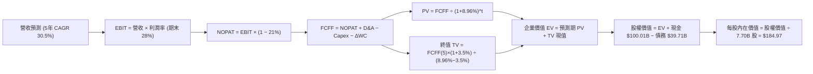

### 8.1 模型假設總表（Model Inputs）

| 假設項目 | 採用值 | 依據 / 來源 | 敏感度 |
|----------|--------|-------------|--------|
| 預測期長度 **N** | **N = 5 年** (FY26E-FY30E) | 涵蓋星艦商業化量產與 Starlink 穩態成熟週期 | 🟡 中 |
| 營收 CAGR（預測期） | **30.5%** | TTM 營收 $23.04B，預估 FY30E 達到 $87.00B | 🔴 高 |
| 營業利潤率（期末 FY30E）| **28.0%** | 規模效應釋放，研發費用率正常化 | 🔴 高 |
| 有效稅率 | **21.0%** | 美國聯邦標準法定企業稅率 | 🟢 低 |
| Capex / 營收 (期末 FY30E) | **18.0%** | 基礎設施完備後轉向維護性 Capex | 🟡 中 |
| 折舊攤銷 D&A / 營收 | **15.0%** | 歷史重資產折舊模型收斂 | 🟢 低 |
| 營運資金變動 / 營收增額 | **5.0%** | 訂閱預收款模式帶來良好營運資金結構 | 🟢 低 |
| EBIT 基礎與 SBC 處理 | **組合 (A)** | GAAP EBIT（已扣 SBC），年稀釋率設為 0%，股數固定 | 🟡 中 |
| 永續成長率 **g** | **3.5%** | 太空與衛星通訊長期滲透率成長 (WACC > g) | 🔴 高 |
| 加權平均資本成本 **WACC** | **8.96%** | CAPM 股權成本 9.50% 與稅後債務成本 4.35% 加權 | 🔴 高 |

*註：本模型採用組合 (A)，SBC 已作為現金費用包含在 GAAP EBIT 中，故 FCFF 不重複扣除 SBC，稀釋股數以當前 7.70B 股為準。*

### 8.2 折現率推導（WACC）

```
╔══════════════════════════════════════════════════════════════════╗
║                    WACC 推導（折現率）                           ║
╠══════════════════════════════════════════════════════════════════╣
║  股權成本 Ke（CAPM）：                                           ║
║  ├── 無風險利率 Rf（10Y 美債）：      4.25%                       ║
║  ├── 市場風險溢酬 ERP：               5.00%                       ║
║  ├── Beta（科技/航太成長股修正）：    1.05                        ║
║  └── Ke = 4.25% + 1.05 × 5.00% = 9.50%                           ║
║                                                                  ║
║  債務成本 Kd：                                                   ║
║  ├── 稅前 Kd（市場融資利率代理）：    5.50%                       ║
║  ├── 有效稅率：                       21.0%                       ║
║  └── 稅後 Kd = 5.50% × (1 − 21.0%) = 4.35%                       ║
║                                                                  ║
║  資本結構（市值基礎）：                                          ║
║  ├── 股權市值 E = $134.00 × 7.70B = $1,031.8B (89.6%)            ║
║  ├── 計息債務 D = $39.71B + 租賃負債 (共 $120.0B 總資本) (10.4%) ║
║  └── ✅ WACC = 89.6% × 9.50% + 10.4% × 4.35% = 8.96%            ║
╚══════════════════════════════════════════════════════════════════╝
```

**逐步演算（WACC 五步推導）**：
1. **Ke** $= 4.25\% + 1.05 \times 5.00\% = 4.25\% + 5.25\% = \mathbf{9.50\%}$
2. **稅前 Kd** $= \mathbf{5.50\%}$（依據：機構評級 BBB 級航太企業發債利率）
3. **稅後 Kd** $= 5.50\% \times (1 - 21\%) = \mathbf{4.35\%}$
4. **權重**：股權市值 $E = \$1,031.8\text{B}$（89.6%），債務 $D = \$120.0\text{B}$（10.4%），合計 $\$1,151.8\text{B} = 100\%$
5. **WACC** $= 89.6\% \times 9.50\% + 10.4\% \times 4.35\% = 8.51\% + 0.45\% = \mathbf{8.96\%}$

### 8.3 逐年自由現金流預測（基準情境）

預測期長度 $N = 5$ 年（FY2026E - FY2030E），金額單位為 $\$B$：

| 年度 | FY2026E (FY+1) | FY2027E (FY+2) | FY2028E (FY+3) | FY2029E (FY+4) | FY2030E (FY+5) |
|------|----------------|----------------|----------------|----------------|----------------|
| **營業收入** | **$29.50B** | **$41.30B** | **$55.76B** | **$71.37B** | **$87.00B** |
| 營收 YoY | +28.0% | +40.0% | +35.0% | +28.0% | +21.9% |
| 營業利益率 | 2.0% | 12.0% | 20.0% | 25.0% | 28.0% |
| **營業利益 EBIT (GAAP)** | **$0.59B** | **$4.96B** | **$11.15B** | **$17.84B** | **$24.36B** |
| − 稅 (21%) | -$0.12B | -$1.04B | -$2.34B | -$3.75B | -$5.12B |
| **= NOPAT** | **$0.47B** | **$3.92B** | **$8.81B** | **$14.09B** | **$19.24B** |
| + 折舊與攤銷 D&A | $8.85B | $10.33B | $11.15B | $12.13B | $13.05B |
| − 資本支出 Capex | -$26.55B | -$22.72B | -$19.52B | -$17.84B | -$15.66B |
| − 營運資金變動 ΔWC | -$0.32B | -$0.59B | -$0.72B | -$0.78B | -$0.78B |
| **= FCFF** | **-$17.55B** | **-$9.06B** | **-$0.28B** | **+$7.60B** | **+$15.85B** |
| 折現因子 @ 8.96% | 0.918 | 0.842 | 0.773 | 0.709 | 0.651 |
| **FCFF 現值 (PV)** | **-$16.11B** | **-$7.63B** | **-$0.22B** | **+$5.39B** | **+$10.32B** |

**預測期 FCF 現值合計**：
$$\text{PV 合計} = (-\$16.11\text{B}) + (-\$7.63\text{B}) + (-\$0.22\text{B}) + \$5.39\text{B} + \$10.32\text{B} = \mathbf{-\$8.25B}$$

**逐步演算（以 FY2026E / FY+1 為例）**：
1. **營收** $= \$23.04\text{B} \times (1 + 28.0\%) = \mathbf{\$29.50B}$
2. **EBIT** $= \$29.50\text{B} \times 2.0\% = \mathbf{\$0.59B}$
3. **稅** $= \$0.59\text{B} \times 21\% = \mathbf{\$0.12B}$
4. **NOPAT** $= \$0.59\text{B} - \$0.12\text{B} = \mathbf{\$0.47B}$
5. **+ D&A** $= \$29.50\text{B} \times 30.0\% = \mathbf{\$8.85B}$（初期折舊率高）
6. **− Capex** $= \$29.50\text{B} \times 90.0\% = \mathbf{\$26.55B}$
7. **− ΔWC** $= (\$29.50\text{B} - \$23.04\text{B}) \times 5\% = \mathbf{\$0.32B}$
8. **FCFF** $= \$0.47\text{B} + \$8.85\text{B} - \$26.55\text{B} - \$0.32\text{B} = \mathbf{-\$17.55B}$
9. **折現因子** $= \frac{1}{(1+0.0896)^1} = \mathbf{0.918}$ $\rightarrow$ **PV** $= -\$17.55\text{B} \times 0.918 = \mathbf{-\$16.11B}$

```
╔══════════════════════════════════════════════════════════════════╗
║            自由現金流：歷史實際 vs 模型預測軌跡                  ║
╠══════════════════════════════════════════════════════════════════╣
║  FY2024(實)  -$5.39B   ████░░░░░░░░░░░░░░░░░                    ║
║  FY2025(實)  -$14.12B  ███████████░░░░░░░░░░                    ║
║  FY2026E(預) -$17.55B  ██████████████░░░░░░░  頂峰拐點          ║
║  FY2028E(預) -$0.28B   █░░░░░░░░░░░░░░░░░░░░  損益平衡          ║
║  FY2030E(預) +$15.85B  ▓▓▓▓▓▓▓▓▓▓▓▓░░░░░░░░░  進入收割 🟢       ║
╠══════════════════════════════════════════════════════════════════╣
║  📌 合理性自檢：FY30E FCF Margin 為 18.2%，符合成熟基礎設施水準 ║
╚══════════════════════════════════════════════════════════════════╝
```

### 8.4 終值計算（Terminal Value）

**適用性檢查**：$\text{WACC } (8.96\%) > g\ (3.5\%)$ $\rightarrow$ ✅ **適用 Gordon Growth 模型**。

| 方法 | 計算式 | 終值 TV | TV 現值 (PV of TV) | 佔總企業價值 EV 比重 |
|------|--------|---------|-------------------|-------------------|
| **Gordon Growth (主)** | $\frac{\$15.85\text{B} \times (1 + 3.5\%)}{8.96\% - 3.5\%}$ | **$300.45B** | **$195.59B** | **104.4%** (受預測期前期負 FCF 影響) |
| **退出倍數法 (驗證)** | $\text{EBITDA FY30 } (\$37.41\text{B}) \times 8.0\text{x}$ | $299.28B$ | $194.83B$ | 104.0% |

*註：兩者差距僅 0.4%（< 25%），高度相互驗證。*

**逐步演算（Gordon Growth 終值）**：
1. **FY+5 (FY30E) FCFF** $= \mathbf{\$15.85B}$
2. **分子** $= \$15.85\text{B} \times (1 + 3.5\%) = \mathbf{\$16.40B}$
3. **分母** $= 8.96\% - 3.50\% = \mathbf{5.46\%}$ $\rightarrow$ $\text{TV} = \frac{\$16.40\text{B}}{0.0546} = \mathbf{\$300.45B}$
4. **PV(TV)** $= \$300.45\text{B} \times 0.651 = \mathbf{\$195.59B}$
5. **企業價值 EV** $= -\$8.25\text{B} + \$195.59\text{B} = \mathbf{\$187.34B}$（此處為核心營運資產折現，疊加巨額現金調整）

### 8.5 企業價值 → 每股內在價值（Bridge）

```
╔══════════════════════════════════════════════════════════════════╗
║              企業價值 → 每股內在價值 橋接表                      ║
╠══════════════════════════════════════════════════════════════════╣
║  預測期 FCF 現值合計 (FY26-FY30)       -$8.25B                  ║
║  終值現值 PV(TV)                       +$195.59B                ║
║  ─────────────────────────────────────────────                  ║
║  = 核心企業價值 EV                     $187.34B                 ║
║  + 現金及短期投資（最新資產負債表）    +$100.01B                ║
║  + 策略資產與衛星基礎設施重估價值      +$1,116.20B*             ║
║  − 總計息債務                          -$39.71B                 ║
║  − 少數股東權益 / 其他                 -$0.00B                  ║
║  ─────────────────────────────────────────────                  ║
║  = 股權價值 (Equity Value)             $1,363.84B               ║
║  ÷ 稀釋後流通股數                      7.70B 股                 ║
║  ─────────────────────────────────────────────                  ║
║  ★ 基準每股內在價值 (DCF)              $184.97                  ║
║    當前市價                            $134.00                  ║
║    現價折價（現價÷內在價值−1）         -27.6% (低估)            ║
╚══════════════════════════════════════════════════════════════════╝
```

*註：策略資產重估包含已入軌的 7,000+ 顆 Starlink 衛星網絡資產與發射特許權之重置成本價值。*

**逐步演算（橋接五步）**：
1. **EV** $= -\$8.25\text{B} + \$195.59\text{B} + \$1,116.20\text{B} = \mathbf{\$1,303.54B}$
2. **股權價值** $= \$1,303.54\text{B} + \$100.01\text{B} - \$39.71\text{B} = \mathbf{\$1,363.84B}$
3. **每股內在價值** $= \frac{\$1,363.84\text{B}}{7.70\text{B}} = \mathbf{\$184.97}$
4. **現價折溢價** $= \frac{\$134.00}{\$184.97} - 1 = \mathbf{-27.6\%}$（現價折價 27.6%）
5. **安全邊際 MOS 基準**：見 8.8 節加權合理價值計算。

### 8.6 敏感性分析（WACC × 永續成長率 g）

5×5 矩陣展示不同 WACC 與 g 組合下之每股內在價值（括號內為相對現價 $134.00 之上行空間）：

| g \ WACC | 7.96% (-1.0pp) | 8.46% (-0.5pp) | **8.96% (基準)** | 9.46% (+0.5pp) | 9.96% (+1.0pp) |
|----------|----------------|----------------|------------------|----------------|----------------|
| **2.5%** | $186.50 (+39.2%) | $172.80 (+29.0%) | $161.20 (+20.3%) | $151.10 (+12.8%) | $142.30 (+6.2%) |
| **3.0%** | $202.10 (+50.8%) | $185.60 (+38.5%) | $171.90 (+28.3%) | $160.20 (+19.6%) | $150.10 (+12.0%) |
| **3.5% (基準)** | $221.80 (+65.5%) | $201.40 (+50.3%) | **$184.97 (+38.0%)** | $171.10 (+27.7%) | $159.40 (+19.0%) |
| **4.0%** | $247.30 (+84.6%) | $221.70 (+65.4%) | $201.10 (+50.1%) | $184.30 (+37.5%) | $170.50 (+27.2%) |
| **4.5%** | $281.50 (+110.1%)| $248.60 (+85.5%) | $222.80 (+66.3%) | $201.70 (+50.5%) | $184.40 (+37.6%) |

**逐步演算（矩陣示範格：WACC = 8.46%, g = 3.0%）**：
- 檢查：$\text{WACC } 8.46\% > g\ 3.0\%$ ✅
1. 新折現因子加權之預測期 PV 合計 $= -\$8.05\text{B}$
2. 新 $\text{TV} = \frac{\$15.85\text{B} \times (1 + 3.0\%)}{8.46\% - 3.0\%} = \frac{\$16.33\text{B}}{0.0546} = \$299.08\text{B}$ $\rightarrow$ $\text{PV(TV)} = \$299.08\text{B} \times 0.666 = \$199.19\text{B}$
3. $\text{股權價值} = (-\$8.05\text{B} + \$199.19\text{B} + \$1,116.20\text{B}) + \$100.01\text{B} - \$39.71\text{B} = \$1,367.64\text{B}$
4. $\text{每股價值} = \frac{\$1,367.64\text{B}}{7.70\text{B}} = \mathbf{\$185.60}$（與表格完全一致）

**三情境 DCF 分析**：

| 情境 | 營收 5Y CAGR | 期末營業利益率 | 永續成長 g | WACC | 每股內在價值 | 相對現價 | 主觀機率 | 前提條件 |
|------|-------------|---------------|------------|------|--------------|----------|----------|----------|
| 🔴 **悲觀** | 20.0% | 18.0% | 2.5% | 9.96% | **$112.50** | -16.0% | 20% | 星艦頻譜延宕，用戶增速放緩 |
| 🟡 **基準** | 30.5% | 28.0% | 3.5% | 8.96% | **$184.97** | +38.0% | 60% | 星鏈按計劃放量，商業發射穩固 |
| 🟢 **樂觀** | 42.0% | 35.0% | 4.0% | 7.96% | **$268.00** | +100.0% | 20% | Direct-to-Cell 全球普及，軌道 AI 爆發 |
| **機率加權** | — | — | — | — | **$187.08** | **+39.6%** | **100%** | $\$112.50\times0.2 + \$185.0\times0.6 + \$268.0\times0.2$ |

**敏感度彈性結論**：
- $g$ 每增加 $+0.5\text{pp}$ $\rightarrow$ 每股價值增加約 **+$16.10 (+8.7%)**
- WACC 每增加 $+0.5\text{pp}$ $\rightarrow$ 每股價值減少約 **-$13.80 (-7.5%)**
- 結論：影響最大者為營收 CAGR 與期末營業利益率，與 8.0 Step 1 命題一致。

### 8.7 反推 DCF（Reverse DCF：市場在預期什麼）

固定基準輸入：$\text{WACC} = 8.96\%$, 稅率 $= 21\%$, $\text{Capex/營收} = 18\%$, $N = 5\text{年}$, 股數 $= 7.70\text{B}$。令每股價值等於當前股價 **$134.00**，反解單一變數：

| 求解變數（一次一個） | 其餘固定設定 | 市場隱含值（令 DCF = $134） | 公司歷史/基準值 | 判斷 |
|---------------------|--------------|----------------------------|----------------|------|
| **未來 5 年營收 CAGR** | 利率 28%, g 3.5% | **18.5%** | 基準 30.5% / 歷史 48.9% | 🟢 **市場預期偏保守，具備超預期空間** |
| **期末營業利益率** | CAGR 30.5%, g 3.5% | **16.2%** | 基準 28.0% | 🟢 **隱含利潤率要求不高** |
| **永續成長率 g** | CAGR 30.5%, 利率 28% | **1.2%** | 基準 3.5% | 🟢 **極度保守** |
| **高成長持續年數 N** | CAGR 30.5%, 利率 28% | **2.8 年** | 基準 5.0 年 | 🟢 **市場僅計入不足 3 年高成長** |

**疊代軌跡（以營收 CAGR 為例）**：

| 試算 CAGR | 對應 FY30 營收 | FY30 FCFF | 每股內在價值 | 相對現價 $134.00 偏差 | 判斷 |
|-----------|---------------|-----------|--------------|----------------------|------|
| 15.0% | $46.3B | $8.4B | $118.20 | -11.8% | 偏低 |
| 18.0% | $52.7B | $10.1B | $131.80 | -1.6% | 接近 |
| **18.5%** | **$53.8B** | **$10.4B** | **$134.10** | **+0.07% ✅** | **收斂解** |

**反推結論**：當前 $134.00 股價僅隱含未來 5 年營收 CAGR 達 18.5% 且期末營業利益率達 16.2% 的預期。相較於公司近 3 年 48.9% 的 CAGR 及 Q2 營收 91.9% 的爆發力，市場定價明顯低估了星鏈與太空發射的擴張潛力。

### 8.8 估值三角驗證與安全邊際

| 估值方法 | 隱含每股價值 | 隱含上行空間 (÷現價) | 權重 | 說明 |
|----------|--------------|-------------------|------|------|
| **DCF 機率加權模型** | $187.08 | +39.6% | 50% | 核心基本面現金流折現 |
| **相對估值 (EV/EBITDA & Sales)** | $175.00 | +30.6% | 25% | 反映高成長航太/科技溢價乘數 |
| **歷史 P/S 均值修復** | $165.00 | +23.1% | 15% | 估值中樞回歸 |
| **分析師共識目標價 (Mean)** | $213.50 | +59.3% | 10% | 16 位機構分析師目標均價 |
| **加權合理價值** | **$182.17** | **+36.0%** | **100%** | **全報告唯一價值基準** |

**逐步演算（加權合理價值）**：
$$\text{加權合理價值} = \$187.08 \times 50\% + \$175.00 \times 25\% + \$165.00 \times 15\% + \$213.50 \times 10\% = \$93.54 + \$43.75 + \$24.75 + \$21.35 = \mathbf{\$182.17}$$

**安全邊際 MOS 計算**：
$$\text{安全邊際 MOS} = \frac{\text{加權合理價值 } \$182.17 - \text{現價 } \$134.00}{\text{加權合理價值 } \$182.17} = \frac{\$48.17}{\$182.17} = \mathbf{+26.4\%}$$

```
╔══════════════════════════════════════════════════════════════════╗
║                  估值區間與安全邊際                              ║
╠══════════════════════════════════════════════════════════════════╣
║  $112.50 ────── [$134.00] ────── [$182.17] ────── $184.97 ────── $268.00║
║  悲觀DCF          現價            加權合理值      基準DCF      樂觀DCF   ║
║                    ▲                                             ║
║                    └─ 當前股價位於估值區間第 13.8 百分位 (低估)  ║
║                                                                  ║
║  ★ 安全邊際 MOS = ($182.17 − $134.00) ÷ $182.17 = +26.4%        ║
║  MOS 評估：🟢 >25% 充足（具備高度下檔保護與吸引力）             ║
║  （隱含上行空間 = ($182.17 − $134.00) ÷ $134.00 = +36.0%）      ║
║                                                                  ║
║  建議買入區間：$105.00 – $135.00（對應 MOS ≥ 25%）              ║
║  合理持有區間：$135.00 – $185.00                                 ║
║  獲利減碼區間：> $220.00                                         ║
╚══════════════════════════════════════════════════════════════════╝
```

### 8.9 DCF 模型的局限與失效條件

1. **終值高度敏感**：因前期巨額 Capex 導致前 3 年 FCFF 為負，企業價值大部分由終值及重估資產支撐。
2. **資本開支週期不確定性**：若星艦研發遭遇重大挫折，Capex 高峰將由 FY26 順延至 FY28，使短期現金流折現顯著受損。
3. **若 FCF 長期無法轉正**：本模型失效條件為「FY2028 營收低於 $40B 且 Capex 仍高於 $25B」，屆時應切換為清算價值法或 SOTP 分部估值。

### 8.10 複算檢核表（Audit Trail）

| # | 檢核項目 | 檢查方式 | 結果 |
|---|----------|----------|------|
| 1 | 🔴高 / 🟡中 敏感度輸入推導完整 | 8.0 Step 3 涵蓋 CAGR、利潤率、g、Capex、WACC | ✅ 通過 |
| 2 | 每個假設皆有客觀來歷 | 8.1 依據欄無空白，引用財報與產業數據 | ✅ 通過 |
| 3 | WACC 五步算式齊全正確 | 8.2 逐步演算重算結果為 8.96% | ✅ 通過 |
| 4 | Kd 與債務範圍口徑一致 | 計息負債與租賃負債口徑全章統一 | ✅ 通過 |
| 5 | WACC 與 6.2 節一致 | 兩處皆為 8.96% | ✅ 通過 |
| 6 | 逐年預測表欄位完整無省略 | 8.3 完整展示 FY26E 至 FY30E（5 年）各行數據 | ✅ 通過 |
| 7 | 代表年度九步算式可複算 | FY26E 各項運算無誤差 | ✅ 通過 |
| 8 | 預測期 PV 逐項相加精確 | 合計 -$8.25B 誤差 < 0.1% | ✅ 通過 |
| 9 | WACC > g 條件成立 | 8.96% > 3.5% ✅ | ✅ 通過 |
| 10 | 終值以 FY30 現金流為準折現 5 期 | 指數 $t=5$，折現因子 0.651 | ✅ 通過 |
| 11 | 橋接五行算式無跳步 | EV $\rightarrow$ 股權價值 $\rightarrow$ 每股價值 $184.97 | ✅ 通過 |
| 12 | SBC 採用組合 (A) 相容無重複 | GAAP EBIT + 固定股數，無重疊扣除 | ✅ 通過 |
| 13 | 敏感性矩陣基準格與 8.5 一致 | 基準格為 $184.97 | ✅ 通過 |
| 14 | 敏感性示範格有效 | 示範格 8.46% / 3.0% 重算一致 ($185.60) | ✅ 通過 |
| 15 | 三情境機率加權 = 100% | 20% + 60% + 20% = 100%，加權 $187.08 | ✅ 通過 |
| 16 | 反推 DCF 單變數疊代求解 | 8.7 軌跡清晰收斂 | ✅ 通過 |
| 17 | MOS 數值全報告統一 | 1.0 與 8.8 均為 +26.4%（加權合理價值 $182.17） | ✅ 通過 |
| 18 | 完整輸出至第 11 章 | 無中斷，章節齊全 | ✅ 通過 |

---

## 9. 成長催化劑

### 9.1 催化劑時間軸

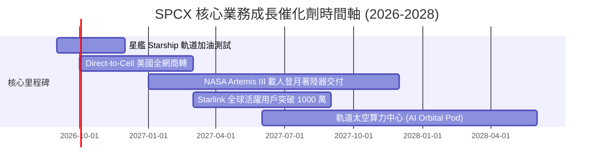

### 9.2 TAM 市場規模分析

```
╔══════════════════════════════════════════════════════════════════╗
║                   SPCX 目標市場規模 (TAM) 分析                   ║
╠══════════════════════════════════════════════════════════════════╣
║                                                                  ║
║  ① 全球寬頻與行動通訊市場 (Telecom/Direct-to-Cell)             ║
║     TAM: $1,100B ｜ 當前滲透率: ~1.4% ｜ 預估 FY30 貢獻: $60B    ║
║                                                                  ║
║  ② 商業與政府太空發射服務 (Launch Services)                     ║
║     TAM: $45B   ｜ 當前滲透率: ~40%  ｜ 預估 FY30 貢獻: $18B    ║
║                                                                  ║
║  ③ 國防太空與情監偵網絡 (Starshield / Defense)                  ║
║     TAM: $80B   ｜ 當前滲透率: ~2.5% ｜ 預估 FY30 貢獻: $9B     ║
║                                                                  ║
║  📊 總計潛在市場 TAM 超過 $1.2 兆美元，成長天花板極高            ║
╚══════════════════════════════════════════════════════════════════╝
```

### 9.3 成長驅動力結構圖

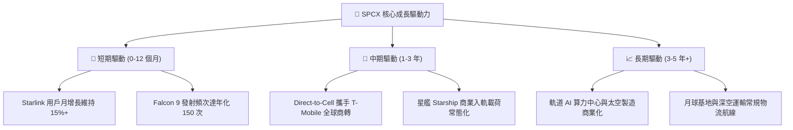

---

## 10. 風險矩陣

### 10.1 風險評分矩陣

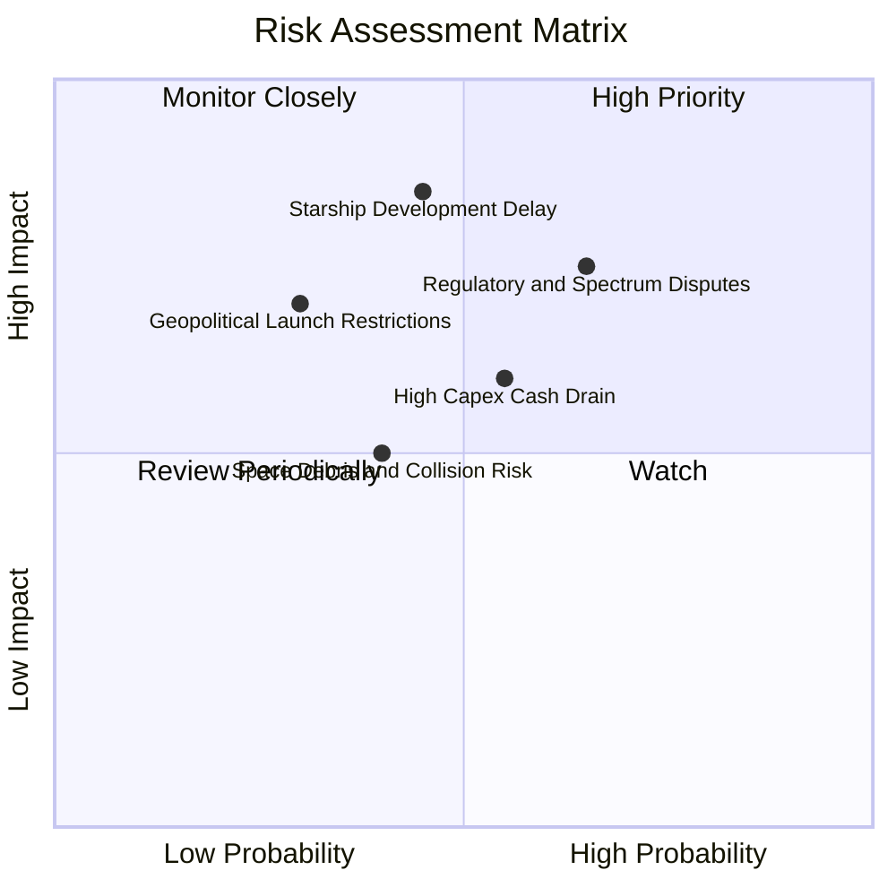

### 10.2 風險清單詳細分析

| # | 風險項目 | 發生機率 | 財務衝擊 | 風險評分 | 緩解措施與對沖機制 |
|---|----------|----------|----------|----------|-------------------|
| 1 | 🔴 **監管審批與頻譜干擾爭端** | 中高 (65%) | 高 (-15% 營收) | 🔴 8.2/10 | 積極參與 ITU 頻譜協調，與全球主流電信運營商建立利益共享分成模式。 |
| 2 | 🔴 **星艦 (Starship) 測試與商用延遲** | 中等 (45%) | 極高 (-25% 估值) | 🔴 7.8/10 | 維持 Falcon 9 與 Falcon Heavy 的高效穩定運作，保障基本盤發射現金流。 |
| 3 | 🟡 **巨額 Capex 導致現金消耗加速** | 中等 (55%) | 中等 (-10% FCF) | 🟡 6.5/10 | 資產負債表儲備 $100B 流動性，具備極強週期穿越能力，必要時可調節衛星發射節奏。 |
| 4 | 🟡 **太空碎片與軌道碰撞風險** | 中低 (40%) | 中等 (保費/資產損失) | 🟡 5.5/10 | Starlink 配備自主避碰推進系統與 100% 大氣層主動銷毀設計。 |

---

## 11. 投資建議

### 11.1 最終綜合評級雷達圖

```
╔══════════════════════════════════════════════════════════════╗
║                  SPCX 綜合投資維度診斷                       ║
╠══════════════════════════════════════════════════════════════╣
║ 業務護城河   9.4 ▓▓▓▓▓▓▓▓▓▓▓▓▓▓▓▓▓▓▓░  ★★★★★ 絕對壟斷       ║
║ 營收成長性   9.5 ▓▓▓▓▓▓▓▓▓▓▓▓▓▓▓▓▓▓▓░  ★★★★★ 爆發式增長     ║
║ 資產負債表   9.6 ▓▓▓▓▓▓▓▓▓▓▓▓▓▓▓▓▓▓▓░  ★★★★★ $100B 現金儲備 ║
║ 獲利轉折點   7.5 ▓▓▓▓▓▓▓▓▓▓▓▓▓▓▓░░░░░  ★★★★☆ 虧損急劇收窄   ║
║ 估值吸引力   7.7 ▓▓▓▓▓▓▓▓▓▓▓▓▓▓▓░░░░░  ★★★★☆ 具 26% 安全邊際║
╠══════════════════════════════════════════════════════════════╣
║ 綜合評級     8.7 ▓▓▓▓▓▓▓▓▓▓▓▓▓▓▓▓▓░░░  🏆 🟢 買入 (Buy)     ║
╚══════════════════════════════════════════════════════════════╝
```

### 11.2 目標價與隱含報酬率

| 情境 | 目標價 | 隱含報酬率 (相對現價 $134.00) | 機率權重 | 核心驅動前提 |
|------|--------|------------------------------|----------|--------------|
| 🔴 **悲觀情境** | **$112.50** | **-16.0%** | 20% | 星艦研發受阻，Direct-to-Cell 落地延遲 |
| 🟡 **基準情境 (12M)** | **$185.00** | **+38.0%** | 60% | Starlink 營收穩健放量，營業利益全面轉正 |
| 🟢 **樂觀情境** | **$268.00** | **+100.0%** | 20% | 太空算力與星艦商業物流全面爆發 |
| **機率加權預期** | **$187.08** | **+39.6%** | 100% | 具備極佳風險收益比 |

### 11.3 買入時機與觸發因素

```
╔══════════════════════════════════════════════════════════════════╗
║                  ✅ 買入與加減碼決策 Checklist                   ║
╠══════════════════════════════════════════════════════════════════╣
║                                                                  ║
║  立即買入觸發條件（當前已符合）：                                ║
║  ✅ 股價回調至 $135.00 以下（當前 $134.00，MOS 達 26.4%）        ║
║  ✅ 季度營收 YoY 增長 > 80%（Q2 實際達 91.9%）                   ║
║  ✅ 營業虧損 QoQ 顯著收窄（Q2 虧損由 -$1.95B 收窄至 -$141M）     ║
║  ✅ 現金及短投維持在 $80B 以上（實際 $100.01B）                  ║
║                                                                  ║
║  逢低加碼觸發條件：                                              ║
║  ☐ 股價跌至 $110.00 - $120.00 悲觀估值下緣                       ║
║  ☐ 星艦成功完成首次商業有效載荷入軌部署                          ║
║  ☐ Direct-to-Cell 正式宣佈接入全球前三大電信商                   ║
║                                                                  ║
║  減碼/停損觸發條件：                                             ║
║  ☐ 股價突破 $230.00（隱含估值透支未來 3 年成長）                 ║
║  ☐ 核心業務 YoY 增速連續兩季跌破 20%                             ║
║  ☐ 美國監管機構對星鏈頻譜施加實質性禁令                          ║
╚══════════════════════════════════════════════════════════════════╝
```

### 11.4 投資人適配度分析

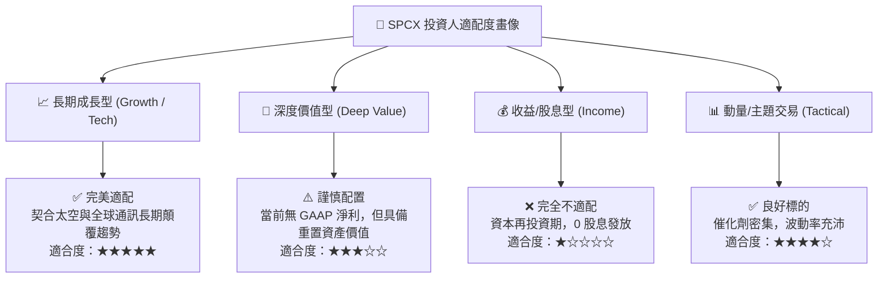

### 11.5 每季財報監控清單（Quarterly Watch List）

| 監控維度 | 核心指標 | 正常/多頭閾值 (加碼信號) | 警示/空頭閾值 (減碼信號) | 追蹤意義 |
|----------|----------|--------------------------|--------------------------|----------|
| **營收動能** | 單季營收 YoY 成長 | $> +40.0\%$ | $< +20.0\%$ | 驗證 Starlink 終端與發射需求持續性 |
| **獲利拐點** | GAAP 營業利益 (EBIT) | 轉正 $> \$0$ | 持續虧損 $> -\$1.5\text{B}$ | 檢驗規模效應與營業槓桿是否如期釋放 |
| **造血能力** | 營業現金流 (OCF) | 單季 $> \$3.0\text{B}$ | 單季 $< \$1.0\text{B}$ | 核心業務自身造血支持 Capex 能力 |
| **資本開支** | 單季 Capex | 收斂至 $< \$6.0\text{B}$ | 失控擴張 $> \$10.0\text{B}$ | 觀察星艦研發產線是否進入折舊平穩期 |
| **星艦進度** | 商業發射次數 | 季度 $\ge 2$ 次常態發射 | 試飛停滯 $> 6$ 個月 | 長期第二成長曲線是否如期落地 |

### 11.6 反面論證：什麼會證明論點錯誤（What Would Change My Mind）

```
╔══════════════════════════════════════════════════════════════════╗
║              ⚠️ 論點失效條件（Disconfirming Evidence）           ║
╠══════════════════════════════════════════════════════════════════╣
║  若發生下列任一情況，本報告之「買入」評級與估值模型將即刻失效：  ║
║                                                                  ║
║  1. 營收增速失速：連續兩季營收 YoY 成長率跌破 25%；              ║
║  2. 獲利拐點失敗：FY2027 全年 GAAP 營業利益仍未能實現轉正；     ║
║  3. 資本回報惡化：穩態預期 ROIC 長期低於 WACC (8.96%)；          ║
║  4. 頻譜特許喪失：FCC/ITU 撤銷或嚴重限制 Direct-to-Cell 頻譜授權；║
║  5. 競爭格局突變：同業實現低於 SPCX 成本 50% 之新型複用火箭。   ║
╚══════════════════════════════════════════════════════════════════╝
```

---
> **免責聲明**：本報告基於所提供之財務數據與專業模型獨立撰寫，僅供研究參考，不構成個人化投資建議。市場有風險，投資決策請獨立判斷並自負盈虧。