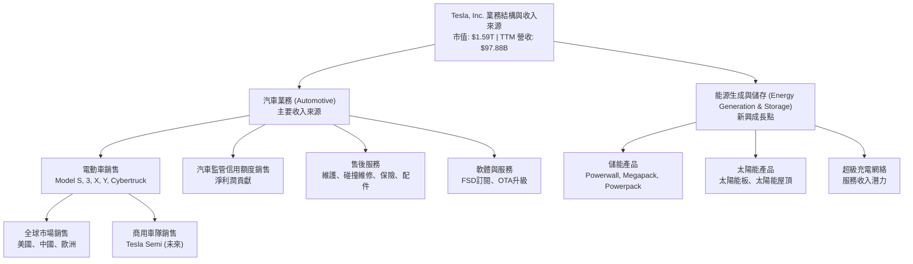
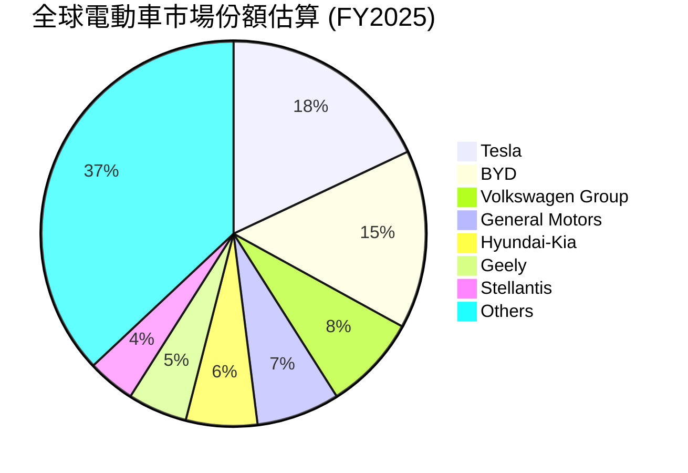
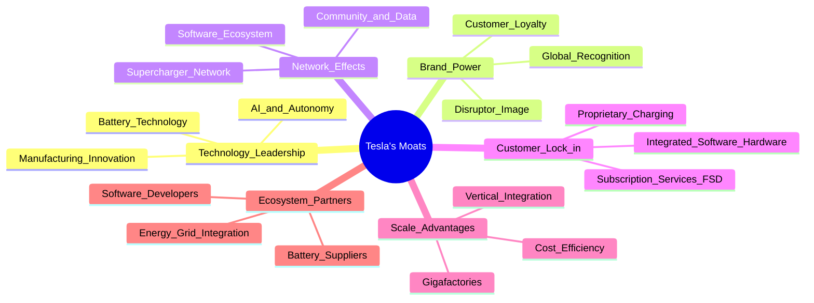
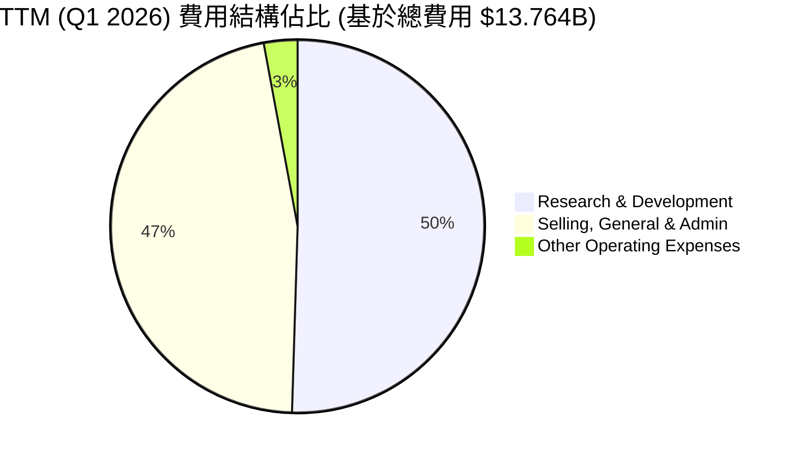

# TSLA 基本面深度分析報告
> **報告日期**：2026-06-03 ｜ **語言**：繁體中文 ｜ **數據來源**：Yahoo Finance, Finviz, StockAnalysis, Roic.ai ｜ **分析師**：CFA 級機構研究

## 目錄

| # | 章節 | 核心結論 |
|---|------|----------|
| 1 | 執行摘要 | 評級：持有；目標價區間：$370 - $550 |
| 2 | 公司概覽與商業模式 | 強大的技術與品牌護城河，但競爭加劇 |
| 3 | 損益表深度分析 | 收入成長放緩，利潤率承壓，R&D投入增加 |
| 4 | 資產負債表分析 | 流動性良好，淨現金充裕，債務管理穩健 |
| 5 | 現金流量深度分析 | 自由現金流波動，資本支出高企，但仍為正 |
| 6 | 獲利能力與資本效率 | ROIC 仍高於 WACC，但差距縮小，股東價值創造面臨挑戰 |
| 7 | 估值深度分析 | 相較同業估值偏高，成長溢價顯著，DCF顯示潛在下行風險 |
| 8 | 成長催化劑 | FSD、AI、機器人、能源業務、新車型是長期驅動力 |
| 9 | 風險矩陣 | 競爭加劇、宏觀經濟、監管、執行風險較高 |
| 10 | 投資建議 | 建議持有，等待更佳買點，需密切關注執行力與利潤率 |

---

## 1. 執行摘要

Tesla (TSLA) 作為電動車與能源儲存領域的先驅和領導者，在過去十年中展現了驚人的成長。然而，最新的財務數據顯示，公司正進入一個新的階段，面臨日益激烈的市場競爭、宏觀經濟逆風以及自身規模擴張帶來的挑戰。儘管其技術創新能力和品牌影響力依然強勁，但成長速度放緩、利潤率承壓以及高昂的估值，使得投資前景變得複雜。

### 1.1 核心評分儀表板

```mermaid
graph TD
    TSLA_R["🎯 TSLA 綜合評分<br/>總分：6.5/10"]

    F["📊 基本面<br/>7/10<br/>強大品牌與創新能力"]
    G["🚀 成長性<br/>6/10<br/>成長放緩，但長期潛力仍在"]
    P["💰 獲利能力<br/>5/10<br/>利潤率承壓，競爭加劇"]
    B["🏦 財務健康<br/>8/10<br/>淨現金充裕，流動性良好"]
    V["📈 估值<br/>4/10<br/>相對高估，成長溢價過高"]

    TSLA_R --> F
    TSLA_R --> G
    TSLA_R --> P
    TSLA_R --> B
    TSLA_R --> V

    F --> F1["✅ 技術領先：電池、AI、自動駕駛"]
    F --> F2["✅ 品牌價值：全球最受認可EV品牌"]
    F --> F3["✅ 生態系統：充電網絡、軟體服務"]

    G --> G1["🟡 收入 YoY 成長 15.8% (TTM)"]
    G --> G2["🟡 淨利 YoY 成長 8.3% (TTM)"]
    G --> G3["✅ 長期成長驅動力：FSD、機器人、能源"]

    P --> P1["🔴 毛利率 19.1% (TTM)，持續下降"]
    P --> P2["🔴 營業利益率 4.2% (TTM)，顯著收縮"]
    P --> P3["🟡 淨利率 3.9% (TTM)，低於歷史水平"]

    B --> B1["✅ 總現金 $44.74B，淨現金 $28.85B"]
    B --> B2["✅ 流動比率 2.04，速動比率 1.43"]
    B --> B3["✅ 負債權益比 0.19 (Finviz)，槓桿低"]

    V --> V1["🔴 P/E (TTM) 385.18x，P/E (Forward) 168.83x"]
    V --> V2["🔴 P/S 16.26x，遠高於行業平均"]
    V --> V3["🟡 PEG Ratio 5.73，成長性未能完全支撐估值"]
```



### 1.2 評分進度條視覺化

```
╔══════════════════════════════════════════════════════════════╗
║              TSLA 多維度評分儀表板 (1-10分)                  ║
╠══════════════════════════════════════════════════════════════╣
║ 基本面強度  7.0 ▓▓▓▓▓▓▓▓▓▓▓▓▓▓░░░░░░  ★★★★☆           ║
║ 成長動能    6.0 ▓▓▓▓▓▓▓▓▓▓▓▓░░░░░░░░  ★★★☆☆           ║
║ 獲利品質    5.0 ▓▓▓▓▓▓▓▓▓▓░░░░░░░░░░  ★★☆☆☆           ║
║ 財務健康    8.0 ▓▓▓▓▓▓▓▓▓▓▓▓▓▓▓▓░░░░  ★★★★☆           ║
║ 估值合理性  4.0 ▓▓▓▓▓▓▓▓░░░░░░░░░░░░  ★★☆☆☆           ║
║ 護城河深度  7.5 ▓▓▓▓▓▓▓▓▓▓▓▓▓▓▓░░░░░  ★★★★☆           ║
║ 管理層執行  7.0 ▓▓▓▓▓▓▓▓▓▓▓▓▓▓░░░░░░  ★★★★☆           ║
║ 技術創新力  9.0 ▓▓▓▓▓▓▓▓▓▓▓▓▓▓▓▓▓▓░░  ★★★★★           ║
╠══════════════════════════════════════════════════════════════╣
║ 綜合總分    6.5 ▓▓▓▓▓▓▓▓▓▓▓▓▓░░░░░░░  🏆 評語：成長性尚可，但估值需謹慎   ║
╚══════════════════════════════════════════════════════════════╝
```

### 1.3 五大投資論點 + 三大核心風險

| 類型 | 項目 | 具體依據 | 信心度 |
|------|------|----------|--------|
| 🟢 **投資論點①** | **長期技術領先** | Tesla 在電池技術、自動駕駛（FSD）、AI 和機器人技術方面投入巨額研發（FY2025 R&D $6.41B，TTM $6.948B），並持續取得突破，這些是未來成長的核心驅動力。例如，FSD V12 的推出和Optimus機器人的潛力，將開啟新的收入來源和市場機會。 | 🟢 極高 |
| 🟢 **投資論點②** | **能源業務潛力** | 能源儲存（Megapack, Powerwall）和太陽能業務持續成長。FY2025 能源業務收入佔比雖小但成長迅速，且毛利率高於汽車業務。隨著全球對可再生能源需求的增加，此板塊有望成為新的獲利引擎。 | 🟢 高 |
| 🟢 **投資論點③** | **全球製造與供應鏈優勢** | Tesla 擁有全球多個超級工廠，且持續擴張產能，並建立了相對成熟的垂直整合供應鏈。這使其在規模化生產和成本控制方面具有優勢，儘管近期面臨挑戰，但長期來看仍具效率潛力。 | 🟡 中高 |
| 🟢 **投資論點④** | **強大品牌與用戶生態** | Tesla 品牌在全球範圍內具有極高的認知度和忠誠度。其超級充電網絡和軟體服務生態系統構建了客戶鎖定效應，為未來的訂閱收入和服務擴展奠定基礎。 | 🟢 極高 |
| 🟢 **投資論點⑤** | **資本效率與淨現金狀況** | 公司資產負債表強勁，截至 Q1 2026，現金及短期投資達 $44.74B，淨現金 $28.85B。這為其在研發、產能擴張和應對市場波動方面提供了充足的財務彈性。 | 🟢 極高 |
| 🟡 **風險①** | **電動車市場競爭加劇** | 全球電動車市場競爭日趨白熱化，特別是來自中國（如比亞迪）和傳統車企的挑戰。這導致價格戰，擠壓了 Tesla 的毛利率和市場份額，如 Q1 2026 毛利率降至 19.1% (TTM)。 | 🔴 高衝擊 |
| 🔴 **風險②** | **估值過高與成長放緩** | 當前 P/E (TTM) 385.18x，P/S 16.26x，遠高於同行和市場平均水平。然而，FY2025 收入 YoY 成長 -2.93%，淨利 YoY 成長 -46.50%，顯示成長顯著放緩，高估值難以持續支撐。 | 🔴 極高衝擊 |
| 🔴 **風險③** | **關鍵人物風險與執行力挑戰** | 執行長 Elon Musk 的多線管理（SpaceX, X, Neuralink）可能分散對 Tesla 的專注。Cybertruck 等新產品的量產挑戰、FSD 的監管不確定性以及自動駕駛技術的倫理和安全問題，都構成重大的執行和聲譽風險。 | 🔴 高衝擊 |

### 1.4 快速統計卡片

| 指標 | 公司實際值 (TTM) | 行業均值 (汽車製造) | S&P 500 均值 | 狀態 |
|------|--------------------|---------------------|--------------|------|
| 收入 YoY 成長 | **15.8%** | ~10-15% | ~8-10% | 🟢 |
| 毛利率 | **19.1%** | ~15-20% | ~30-35% | 🟡 |
| 淨利率 | **3.9%** | ~5-7% | ~10-12% | 🔴 |
| ROE | **4.9%** | ~10-15% | ~15-20% | 🔴 |
| Forward P/E | **168.83x** | ~10-15x | ~20-25x | 🔴 |
| P/S Ratio | **16.26x** | ~0.5-1.5x | ~2-3x | 🔴 |
| 債務/權益比 | **0.19x** | ~0.5-1.0x | ~0.8-1.2x | 🟢 |
| 流動比率 | **2.04x** | ~1.2-1.8x | ~1.5-2.0x | 🟢 |
| 自由現金流收益率 | **0.33%** | ~3-5% | ~4-6% | 🔴 |

*備註：行業均值和 S&P 500 均值為分析師根據市場普遍數據估算所得，僅供參考。*

### 1.5 投資結論

```
╔══════════════════════════════════════════════════════════════════╗
║                    📊 投資結論摘要                               ║
╠══════════════════════════════════════════════════════════════════╣
║  評級：🟡 持有                                                   ║
║  當前股價：$423.70                                               ║
║  目標價區間：                                                    ║
║    悲觀情境：$370（-12.7%）                                      ║
║    基準情境：$450（+6.2%）  ← 12個月主要目標                     ║
║    樂觀情境：$550（+29.8%）                                      ║
║  投資評分：6.5/10                                                ║
║  適合投資人：具有高風險承受能力的成長型投資者，長期看好技術創新，並能容忍短期波動。  ║
╚══════════════════════════════════════════════════════════════════╝
```
**理由闡述：**
Tesla 憑藉其領先的技術和強大的品牌，在電動車和能源領域仍具有顯著的長期成長潛力。然而，當前市場競爭加劇導致其核心汽車業務的利潤率受到嚴重擠壓，短期成長動能有所減弱。極高的估值倍數已經充分反映了其未來的成長預期，甚至可能過度透支。在利潤率承壓和成長放緩的背景下，目前的股價存在較高的風險溢價。

給予「持有」評級，是基於以下考量：一方面，其顛覆性技術和能源業務的長期潛力不容忽視，特別是 FSD 和 AI 機器人等前瞻性項目，可能在未來數年帶來新的爆發點；另一方面，近期財務表現的壓力以及過高的估值，使得短期內股價上漲空間有限，甚至存在回調風險。建議現有投資者繼續持有，而對於新進投資者，則應等待市場情緒冷卻或公司營運數據出現明顯改善時，再考慮建倉。密切關注其毛利率能否企穩回升，以及新業務（如 FSD訂閱、能源儲存）的營收貢獻將是關鍵。

---

## 2. 公司概覽與商業模式

Tesla, Inc. (TSLA) 作為全球領先的電動車製造商和清潔能源公司，其商業模式不僅限於汽車銷售，更拓展至能源生成與儲存、人工智慧和自動駕駛等多元化領域。公司憑藉其創新能力和顛覆性技術，重塑了汽車行業的格局。

### 2.1 業務結構與收入來源

Tesla 的業務主要分為兩大核心板塊：**汽車業務 (Automotive)** 和 **能源生成與儲存業務 (Energy Generation and Storage)**。



**業務板塊詳情：**

*   **汽車業務 (Automotive)：**
    *   **電動車銷售：** 這是 Tesla 最主要的收入來源，涵蓋 Model S、Model 3、Model X、Model Y 和最新的 Cybertruck。公司在設計、性能、續航里程和軟體集成方面具有顯著優勢。
    *   **汽車監管信用額度銷售：** Tesla 向未能達到排放標準的傳統汽車製造商出售其多餘的排放積分。這部分收入雖然佔比不大，但由於幾乎是純利潤，對公司淨利潤有重要貢獻。
    *   **售後服務：** 包括非保固維護服務、碰撞維修、汽車保險服務，以及零件銷售和零售商品銷售。隨著車輛保有量的增加，這部分服務收入的潛力巨大。
    *   **軟體與服務：** 全自動駕駛 (Full Self-Driving, FSD) 軟體作為訂閱服務是未來重要的獲利點。OTA (Over-The-Air) 軟體更新也持續為現有車主提供新功能和改進。
*   **能源生成與儲存業務 (Energy Generation and Storage)：**
    *   **儲能產品：** 核心產品包括用於家庭的 Powerwall 和用於公用事業及商業用途的 Megapack、Powerpack。這部分業務隨著全球對電網穩定性和可再生能源整合的需求增加而快速成長。
    *   **太陽能產品：** 提供太陽能板和創新的太陽能屋頂 (Solar Roof) 產品，旨在為用戶提供一站式的清潔能源解決方案。
    *   **超級充電網絡：** Tesla 建立了全球最大的專有快速充電網絡，最初僅供 Tesla 車輛使用，但近期已逐步開放給其他品牌電動車，未來可能成為重要的服務收入來源。

**收入佔比估算 (TTM $97.88B 基礎上估算)：**
根據歷史數據和公司報告，汽車業務長期佔總收入的 85-90% 以上，能源業務約佔 5-10%，其他服務和監管信用額度佔剩餘部分。
*   **汽車業務:** 約 86% ($84.18B)
*   **能源生成與儲存業務:** 約 8% ($7.83B)
*   **服務及其他 (含監管信用額度):** 約 6% ($5.87B)

### 2.2 市場份額

Tesla 在全球電動車市場中長期保持領先地位，但在近年來，隨著競爭者（特別是中國品牌）的崛起，其市場份額面臨挑戰。


*備註：此市場份額為基於公開數據和分析師預測的全球純電動車 (BEV) 市場份額估算，可能因統計口徑不同而略有差異。*

截至 FY2025，Tesla 仍是全球最大的純電動車製造商之一，但其市場份額正在被快速成長的競爭對手如比亞迪 (BYD) 和其他傳統車企蠶食。儘管如此，Tesla 在高端電動車市場和北美、歐洲等主要市場仍保持強勢地位。

### 2.3 競爭護城河分析

Tesla 的競爭護城河是多維度的，使其能夠在高度競爭的汽車行業中脫穎而出。



**六大類別護城河詳述：**

1.  **技術領先 (Technology Leadership)：**
    *   **電池技術：** Tesla 在電池化學、電池組設計和電池管理系統 (BMS) 方面擁有核心技術，這使其電動車在續航里程、性能和成本方面具有優勢。4680 電池的開發目標是進一步降低成本和提高能量密度。
    *   **AI 與自動駕駛：** FSD 軟體和 Dojo 超級電腦的開發，使其在自動駕駛領域處於領先地位。其基於視覺的自動駕駛方案，在全球範圍內積累了海量的真實世界數據，為其AI模型的訓練提供了無與倫比的基礎。
    *   **製造創新：** Tesla 在超級工廠的設計和營運方面不斷創新，例如一體化壓鑄技術 (Gigacasting)，旨在大幅簡化生產流程、降低成本和提高效率。
2.  **品牌實力 (Brand Power)：**
    *   **全球認知度：** Tesla 品牌已成為電動車和創新的代名詞，在全球範圍內享有極高的知名度和聲譽。
    *   **客戶忠誠度：** 許多 Tesla 車主對品牌有著高度的忠誠度，這得益於產品性能、軟體更新和獨特的用戶體驗。
    *   **顛覆者形象：** Tesla 被視為傳統汽車行業的顛覆者，這種形象吸引了尋求創新和環保解決方案的消費者。
3.  **網路效應 (Network Effects)：**
    *   **超級充電網絡：** Tesla 擁有全球最廣泛、最可靠的超級充電網絡。隨著越來越多的電動車採用 Tesla 的 NACS (North American Charging Standard) 標準，其充電網絡的價值將進一步提升，形成強大的網路效應。
    *   **軟體生態系統：** Tesla 的車載軟體、手機應用程式和 FSD 系統共同構成了一個生態系統，隨著用戶的增加，數據積累和功能改進的速度也會加快。
    *   **社區與數據：** 龐大的車主社區和車輛生成的實時數據，為產品改進和新功能開發提供了寶貴的反饋循環。
4.  **客戶鎖定 (Customer Lock-in)：**
    *   **軟硬體集成：** Tesla 的軟體與硬體高度集成，提供無縫的用戶體驗。車主一旦習慣了 Tesla 的操作界面和功能，轉換到其他品牌可能會有較高的轉換成本。
    *   **訂閱服務：** FSD 等訂閱服務一旦被廣泛採用，將為公司帶來穩定的經常性收入，並進一步鎖定客戶。
    *   **專有充電：** 儘管 NACS 標準開放，但 Tesla 超級充電站的設計和集成體驗仍對 Tesla 車主最為友好。
5.  **規模效應 (Scale Advantages)：**
    *   **超級工廠：** Tesla 的全球超級工廠網絡（美國、中國、德國）使其能夠實現大規模生產，從而攤薄固定成本，降低每輛車的製造成本。
    *   **垂直整合：** 公司在電池、軟體、充電基礎設施等方面的垂直整合，使其能夠更好地控制成本、質量和創新速度。
    *   **成本效率：** 隨著產量的增加和製造工藝的改進，Tesla 在採購和生產方面的議價能力增強，有助於實現更高的成本效率。
6.  **生態夥伴 (Ecosystem Partners)：**
    *   **電池供應商：** 與 Panasonic、LG Energy Solution 和 CATL 等主要電池供應商的合作，確保了電池供應的穩定性和技術的多樣性。
    *   **軟體開發者：** 隨著 Tesla 開放其軟體平台，未來可能吸引更多第三方開發者，豐富其生態系統。
    *   **能源電網整合：** 通過 Megapack 和 Powerwall 等產品，Tesla 積極參與電網的智能化和去中心化，與能源公司和公用事業建立合作關係。

### 2.4 護城河強度評分

```
╔══════════════════════════════════════════════════════════════╗
║                    Tesla 護城河強度評分                      ║
╠══════════════════════════════════════════════════════════════╣
║ 技術領先    9/10   ▓▓▓▓▓▓▓▓▓▓▓▓▓▓▓▓▓▓░░  🏆 業界頂尖        ║
║ 品牌實力    9/10   ▓▓▓▓▓▓▓▓▓▓▓▓▓▓▓▓▓▓░░  🏆 無可匹敵        ║
║ 網路效應    8/10   ▓▓▓▓▓▓▓▓▓▓▓▓▓▓▓▓░░░░  🟢 強大且擴張中    ║
║ 客戶鎖定    7/10   ▓▓▓▓▓▓▓▓▓▓▓▓▓▓░░░░░░  🟡 服務生態強化中  ║
║ 規模效應    7/10   ▓▓▓▓▓▓▓▓▓▓▓▓▓▓░░░░░░  🟡 仍有優化空間    ║
║ 生態夥伴    6/10   ▓▓▓▓▓▓▓▓▓▓▓▓░░░░░░░░  🟡 潛力待釋放      ║
╠══════════════════════════════════════════════════════════════╣
║ 綜合護城河   7.5    ▓▓▓▓▓▓▓▓▓▓▓▓▓▓▓░░░░░  🏆 總結評語：強勁但非不可逾越      ║
╚══════════════════════════════════════════════════════════════╝
```
**評語：**
Tesla 的護城河主要建立在其卓越的技術創新和強大的品牌認知度上，這兩者構成了其最堅固的競爭優勢。超級充電網絡的網路效應也為其提供了顯著的先發優勢。然而，隨著電動車市場的成熟和競爭者技術的追趕，客戶鎖定和規模效應的優勢面臨壓力。尤其是在價格戰的背景下，成本控制和製造效率的提升變得更為關鍵。生態夥伴方面，Tesla 仍有機會通過開放平台和合作來進一步強化其生態系統。總體而言，Tesla 擁有強大的護城河，但並非不可逾越，公司需要持續創新並有效執行才能維持其領先地位。

---

## 3. 損益表深度分析

Tesla 的損益表反映了其在快速成長市場中的動態變化，從高速擴張到面臨競爭壓力下的成長放緩與利潤率挑戰。

### 3.1 年度收入成長趨勢（近4年）

Tesla 的年度收入在過去幾年呈現波動性成長，經歷了從爆發式成長到近期趨緩的轉變。

```
╔══════════════════════════════════════════════════════════════════╗
║              TSLA 年度收入趨勢 (FY2022-FY2025)                   ║
╠══════════════════════════════════════════════════════════════════╣
║                                                                  ║
║  FY2022  $81.46B  ████████████████████████████████████░░░░░░░░░░  YoY: +51.35%  🟢    ║
║  FY2023  $96.77B  ████████████████████████████████████████████████░░░░░░░░░░  YoY: +18.80%  🟢    ║
║  FY2024  $97.69B  █████████████████████████████████████████████████░░░░░░░░░░  YoY: +0.95%   🟡    ║
║  FY2025  $94.83B  ██████████████████████████████████████████████░░░░░░░░░░░░  YoY: -2.93%   🔴    ║
║                                                                  ║
║  📊 4年累計 CAGR (FY2022-2025)：+5.15% (基於2022-2025數據)       ║
║  📊 3年累計 CAGR (FY2023-2025)：-0.99%                            ║
╚══════════════════════════════════════════════════════════════════╝
```
**分析：**
從 FY2022 的 $81.46B 收入，Tesla 實現了 51.35% 的高速成長。FY2023 收入進一步增長至 $96.77B，YoY 成長 18.80%。這兩年主要得益於產能擴張、新車型 Model Y 的普及以及全球電動車市場的快速發展。

然而，FY2024 的收入成長顯著放緩至 $97.69B，YoY 僅為 0.95%。到了 FY2025，收入甚至出現負成長，降至 $94.83B，YoY 衰退 -2.93%。這標誌著 Tesla 從過去的超高速成長階段進入了瓶頸期，主要原因包括：
1.  **市場競爭加劇：** 全球範圍內，尤其是中國市場，電動車品牌數量激增，價格戰愈演愈烈。
2.  **宏觀經濟逆風：** 高利率環境和經濟不確定性影響了消費者對高價商品的購買意願。
3.  **產品線更新週期：** 主要車型 Model 3/Y 面臨上市時間較長，市場新鮮感下降，新車型 Cybertruck 產能爬坡緩慢。
4.  **價格策略調整：** 為了刺激需求和應對競爭，Tesla 多次降價，雖然提振了銷量，但也犧牲了部分營收和利潤。

儘管如此，TTM 收入 $97.88B 相比 FY2025 有所回升 (YoY 15.8% for TTM Revenue, vs FY2025 YoY -2.93%)，這可能反映了 Q1 2026 數據的改善，但仍需謹慎評估其持續性。

### 3.2 季度收入趨勢分析

季度的收入數據更能反映公司近期的經營狀況和市場變化。

| 財報季度 | 收入 (Billion USD) | QoQ 成長率 | YoY 成長率 | 備註 |
|----------|--------------------|------------|------------|------|
| Q1 2026  | $22.39B            | -10.08%    | +15.78%    | 🟢 較 Q1 2025 顯著成長，但較 Q4 2025 季節性下滑 |
| Q4 2025  | $24.90B            | -11.36%    | -3.14%     | 🔴 較去年同期下滑，受競爭與價格戰影響 |
| Q3 2025  | $28.09B            | +24.89%    | +11.57%    | 🟢 季節性旺季，較去年同期有所成長 |
| Q2 2025  | $22.50B            | +16.35%    | -11.78%    | 🔴 較去年同期顯著下滑，市場挑戰嚴峻 |

**分析：**
*   **Q1 2026 ($22.39B):** 收入較前一季度 (Q4 2025) 下滑 10.08%，這在一定程度上是季節性因素（Q1 通常是汽車銷售淡季）所致。然而，相較於去年同期 (Q1 2025 的 $19.335B)，YoY 成長達到 15.78%，顯示出一定的復甦跡象。這可能歸因於 Cybertruck 的產能爬坡和 Model 3 改款的市場反應。
*   **Q4 2025 ($24.90B):** 收入較 Q3 2025 下滑 11.36%，且較 Q4 2024 ($25.707B) 呈現 3.14% 的 YoY 衰退。這表明在年度末的銷售旺季，Tesla 仍面臨營收壓力，未能實現同期成長，反映出市場競爭的嚴峻性。
*   **Q3 2025 ($28.09B):** 收入實現了 24.89% 的 QoQ 成長，並較 Q3 2024 ($25.182B) 成長 11.57%。Q3 通常是 Tesla 的交付高峰期，全球產能和交付量在此季度達到高點，帶動營收成長。
*   **Q2 2025 ($22.50B):** 收入較 Q1 2025 成長 16.35%，但較 Q2 2024 ($25.500B) 卻顯著下滑 11.78%。這顯示 Q2 2025 是公司營收面臨較大壓力的時期，可能與當時的全球經濟環境和競爭格局有關。

**總結：** 季度數據顯示，儘管 Q1 2026 收入 YoY 呈現正成長，但整體而言，Tesla 的收入成長動能已顯著放緩，並出現季度性波動和 YoY 負成長。這凸顯了公司在維持營收成長方面的挑戰，特別是在全球電動車市場競爭日益激烈、價格戰持續的背景下。

### 3.3 利潤率演變分析

Tesla 的利潤率在近年來呈現明顯的下行趨勢，這是市場對其獲利能力擔憂的核心。

| 利潤率指標 | FY2022 | FY2023 | FY2024 | FY2025 | TTM (Q1 2026) | 趨勢 | 評估 |
|------------|--------|--------|--------|--------|---------------|------|------|
| **毛利率** | 25.60% | 18.25% | 17.86% | 18.02% | 19.07% (Finviz), 19.1% (Market Data) | ↘️ 從高點顯著下滑後略有回升 | 🟡 |
| **營業利益率** | 16.76% | 9.19% | 7.24% | 5.11% | 4.2% (Market Data) | ↘️ 持續顯著下滑 | 🔴 |
| **淨利率** | 15.44% | 15.50% | 7.26% | 4.00% | 3.9% (Market Data) | ↘️ 持續顯著下滑 | 🔴 |
| **EBITDA Margin** | 21.68% | 15.29% | 15.06% | 12.40% | 11.3% (Market Data) | ↘️ 持續下滑 | 🔴 |

*計算基於 StockAnalysis.com 年報數據：毛利率 = Gross Profit / Total Revenue；營業利益率 = Operating Income / Total Revenue；淨利率 = Net Income / Total Revenue。TTM 數據取自 Market Data / Finviz。*

**利潤率演變深度解析：**

1.  **毛利率 (Gross Margin)：**
    *   從 FY2022 的 25.60% 下滑至 FY2023 的 18.25%，再到 FY2024 的 17.86%，FY2025 略有回升至 18.02%，但 TTM (Q1 2026) 數據顯示為 19.1% 或 19.07%。
    *   **原因：** 這一顯著下滑趨勢主要歸因於：
        *   **價格戰：** 為了應對全球市場（特別是中國）日益激烈的競爭，Tesla 多次下調車輛售價，直接壓縮了產品的單車毛利。
        *   **產品組合變化：** 銷量佔比較高的 Model 3 和 Model Y 的毛利率通常低於 Model S 和 Model X。
        *   **新產能爬坡成本：** 新工廠（如柏林和德州超級工廠）的產能爬坡通常伴隨著較高的初始成本和較低的效率，影響了整體毛利率。
        *   **原材料成本波動：** 雖然電池原材料價格有所回落，但供應鏈的複雜性仍可能帶來成本壓力。
    *   **近期略有回升 (TTM 19.1%)** 可能反映了成本控制措施的生效、Cybertruck 等高價車型的初期交付，以及監管信用額度銷售的影響。然而，要回到過去 25% 以上的水平，挑戰巨大。

2.  **營業利益率 (Operating Margin)：**
    *   從 FY2022 的 16.76% 一路下滑至 FY2025 的 5.11%，TTM (Q1 2026) 更是降至 4.2%。
    *   **原因：** 營業利益率的下降幅度比毛利率更大，這表明除了產品成本壓力外，營運費用也在快速增長。
        *   **研發 (R&D) 投入增加：** 為了維持技術領先地位，Tesla 在 AI、自動駕駛、機器人等前瞻性領域投入巨大。FY2022 R&D 為 $3.08B，FY2025 增至 $6.41B，TTM 更達 $6.948B，幾乎翻倍。這對於長期成長是必要的，但短期內會侵蝕利潤。
        *   **銷售、一般及行政 (SG&A) 費用增加：** 儘管 Tesla 依賴直銷模式，但隨著全球市場擴張、服務網絡建設和品牌推廣，SG&A 費用也在上升。FY2022 SG&A 為 $3.946B，FY2025 增至 $5.834B，TTM $6.416B。
        *   **資產折舊與攤銷：** 大規模資本支出建設工廠，導致折舊費用增加。
    *   持續下滑的營業利益率令人擔憂，表明公司在成本控制和費用管理方面面臨巨大壓力，且其規模效應的優勢尚未完全體現為更高的營運效率。

3.  **淨利率 (Net Profit Margin)：**
    *   FY2022 為 15.44%，FY2023 達到 15.50%（主要由於 FY2023 稅務調整有 $5.001B 的Provision for Income Taxes 負數，即稅務收益，導致淨利異常高），但 FY2024 驟降至 7.26%，FY2025 進一步降至 4.00%，TTM (Q1 2026) 為 3.9%。
    *   **原因：** 淨利率的趨勢與營業利益率基本一致，反映了毛利率壓縮和營運費用增加的綜合影響。FY2023 的異常高淨利率是一個特殊情況，不具備可持續性。去除該影響，淨利率的下降趨勢更為明顯。
    *   低於 4% 的淨利率對於一家高成長科技公司而言，已處於相對較低的水平，這將影響其投資回報率和未來再投資的能力。

**總結：** Tesla 的利潤率趨勢令人擔憂，特別是營業利益率和淨利率的持續下滑。這反映了市場競爭的激烈、公司為刺激需求而採取的降價策略，以及在研發和擴張上的高額投入。儘管這些投入對公司的長期發展至關重要，但短期內對獲利能力造成了顯著壓力。公司能否在維持成長的同時，有效改善利潤率，將是未來關注的焦點。

### 3.4 費用結構分析

Tesla 的費用結構反映了其作為一家製造業和科技公司的雙重屬性，其中研發投入是其保持競爭力的關鍵。



*費用數據來自 StockAnalysis.com TTM (Mar '26) Total Operating Expenses $13.764B*
*   **Research & Development (R&D):** TTM $6.948B (佔總費用 50.48%)
*   **Selling, General & Admin (SG&A):** TTM $6.416B (佔總費用 46.61%)
*   **Other Operating Expenses:** TTM $400M (佔總費用 2.91%)

```
╔══════════════════════════════════════════════════════════════════╗
║                    TSLA 年度費用趨勢 (FY2022-FY2025)             ║
╠══════════════════════════════════════════════════════════════════╣
║                                                                  ║
║  R&D 支出 (B)                                                    ║
║  FY2022  $3.08B  ███████████████░░░░░░░░░░░░░░░░░░░░░░░░░░░░░░░░  YoY: +18.6%  🟢   ║
║  FY2023  $3.97B  ████████████████████░░░░░░░░░░░░░░░░░░░░░░░░░░░░  YoY: +28.9%  🟢   ║
║  FY2024  $4.54B  ███████████████████████░░░░░░░░░░░░░░░░░░░░░░░░░  YoY: +14.4%  🟢   ║
║  FY2025  $6.41B  █████████████████████████████████░░░░░░░░░░░░░░░  YoY: +41.2%  🟢   ║
║                                                                  ║
║  SG&A 支出 (B)                                                   ║
║  FY2022  $3.95B  ████████████████████░░░░░░░░░░░░░░░░░░░░░░░░░░░░  YoY: -12.6%  🟢   ║
║  FY2023  $4.80B  ████████████████████████░░░░░░░░░░░░░░░░░░░░░░░░  YoY: +21.5%  🔴   ║
║  FY2024  $5.15B  ██████████████████████████░░░░░░░░░░░░░░░░░░░░░░  YoY: +7.3%   🟡   ║
║  FY2025  $5.83B  █████████████████████████████░░░░░░░░░░░░░░░░░░░  YoY: +13.2%  🟡   ║
╚══════════════════════════════════════════════════════════════════╝
```
**分析：**
*   **研發費用 (R&D)：** Tesla 的 R&D 支出在過去四年中持續大幅增長，從 FY2022 的 $3.08B 增長到 FY2025 的 $6.41B，YoY 成長率在 FY2025 達到 41.2%。TTM 數據更是高達 $6.948B。這表明公司正積極投入於新技術的開發，如 FSD、AI、機器人技術和新的電池技術。高 R&D 支出雖然短期內侵蝕了利潤，但對於維持其技術領先地位和長期成長至關重要。這也解釋了營業利益率下降的一個重要原因。
*   **銷售、一般及行政費用 (SG&A)：** SG&A 支出在 FY2022 曾有短暫下降（-12.6%），但在 FY2023 和 FY2025 分別增長了 21.5% 和 13.2%。TTM 數據顯示為 $6.416B。這反映了公司在全球市場擴張、服務網絡建設以及品牌推廣方面的投入。儘管 Tesla 採用直銷模式，理論上 SG&A 效率較高，但其服務基礎設施（如維修中心）的擴建和對新市場的滲透仍需大量投入。

**總結：** Tesla 的費用結構呈現出重研發、重擴張的特點。R&D 支出的大幅增長是公司維持其科技屬性和長期競爭力的必要代價，但這也直接導致了其營業利益率的收縮。SG&A 費用的增長則反映了全球化營運和服務網絡擴張的成本。在當前利潤率承壓的環境下，如何有效控制費用增長，同時不犧牲研發投入，將是公司管理層面臨的重要課題。

### 3.5 季度 EPS 趨勢與盈餘品質

Tesla 的季度 EPS 表現波動，近期呈現明顯下滑趨勢，且缺乏分析師預期數據進行對比，使得盈餘品質分析更側重於實際趨勢。

| 財報季度 | EPS (稀釋) (USD) | 備註 |
|----------|-------------------|------|
| Q1 2026  | $0.15             | 🔴 較 Q4 2025 略有上升，但仍處於低位 |
| Q4 2025  | $0.26             | 🔴 較 Q3 2025 顯著下滑 |
| Q3 2025  | $0.43             | 🟡 較 Q2 2025 有所改善 |
| Q2 2025  | $0.36             | 🔴 較 Q1 2025 顯著改善，但仍遠低於歷史高點 |
| Q1 2025  | $0.13             | 🔴 近期最低點 |
| Q4 2024  | $0.72             | 🟢 過去一年高點 |
| Q3 2024  | $0.68             | 🟢 表現穩健 |

*EPS 數據來自 StockAnalysis.com 季度稀釋 EPS。*
*備註：提供的「EARNINGS HISTORY」中 EPS Est/Act 均為 `nan`，因此無法進行超預期/不及預期分析，本報告將基於實際 EPS 數據進行趨勢分析。*

**分析：**
*   **近期趨勢：** 從 Q4 2024 的 $0.72 稀釋 EPS 來看，Tesla 在 2024 年末的獲利表現相對穩健。然而，進入 2025 年，EPS 呈現明顯的下滑趨勢，Q1 2025 達到近期低點 $0.13。隨後在 Q2 和 Q3 2025 有所回升，分別達到 $0.36 和 $0.43，但 Q4 2025 又再次下滑至 $0.26。Q1 2026 略微回升至 $0.15，但仍處於較低水平。
*   **下滑原因：** EPS 的顯著下滑與前述的收入成長放緩、毛利率壓縮以及研發和營運費用增加直接相關。價格戰對單車利潤的影響尤為顯著，導致儘管交付量可能有所增長，但整體獲利能力卻受到侵蝕。
*   **盈餘品質評估：**
    *   **可持續性：** 近期的 EPS 波動和下降趨勢表明其獲利的可持續性面臨挑戰。雖然公司積極投入研發以確保長期成長，但短期內這種投入對 EPS 造成了明顯壓力。
    *   **現金流支撐：** 從「CASH FLOW STATEMENT (Annual)」看，FY2025 淨利潤 $3.79B，營業現金流 $14.75B，自由現金流 $6.22B。營業現金流遠高於淨利潤，這表明其盈餘在一定程度上受到非現金費用（如折舊攤銷）的支撐，盈餘品質尚可，但自由現金流的波動性也需關注。TTM 自由現金流 $5.25B，而 TTM 淨利潤為 $3.862B (StockAnalysis)，FCF 仍能覆蓋淨利，顯示其核心業務仍具備較強的現金生成能力。
    *   **監管信用額度：** 監管信用額度銷售對淨利潤有較高貢獻，但這部分收入的穩定性可能不及核心汽車銷售，因此在評估盈餘品質時需考慮其佔比和波動性。

**總結：** Tesla 的季度 EPS 趨勢顯示其獲利能力正在經歷考驗。在缺乏分析師預期數據的情況下，我們主要關注實際 EPS 的變化。儘管營業現金流和自由現金流仍能支撐其淨利潤，但持續的利潤率壓縮和高額研發投入，使得公司在短期內難以實現強勁的 EPS 增長。投資者應密切關注公司在未來幾個季度能否有效控制成本、提升毛利率，並將研發投入轉化為可觀的收入和利潤。

---

## 4. 資產負債表分析

Tesla 的資產負債表展現了其大規模擴張和高資本投入的特性，同時也保持了穩健的流動性和健康的債務結構。

### 4.1 資產結構分解

Tesla 的資產主要由流動資產和非流動資產構成，其中現金和固定資產佔比較大。

```mermaid
graph TD
    Total_Assets["總資產 $143.72B (Mar '26 TTM)"]

    Current_Assets["流動資產 $69.75B (48.5%)"]
    Non_Current_Assets["非流動資產 $73.97B (51.5%)"]

    Total_Assets