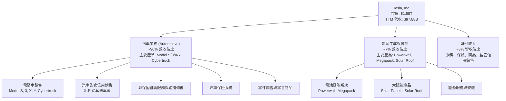
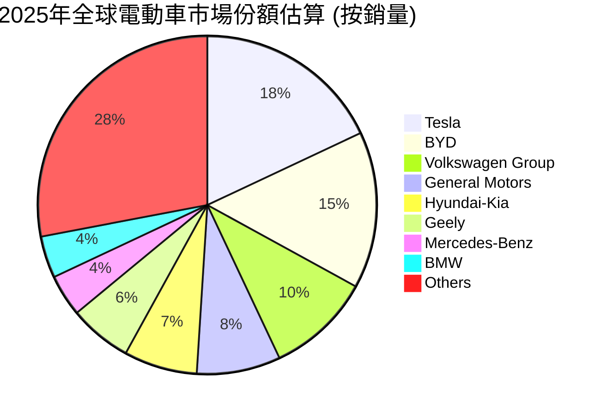
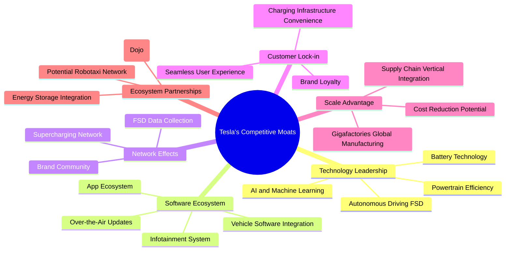

# TSLA 基本面深度分析報告
> **報告日期**：2026-06-04 ｜ **語言**：繁體中文 ｜ **數據來源**：Yahoo Finance, Finviz, StockAnalysis, Roic.ai ｜ **分析師**：CFA 級機構研究

## 目錄

| # | 章節 | 核心結論 |
|---|----------------------------------|--------------------------------------------------|
| 1 | 執行摘要 | 評級：🟢 買入，基準目標價 $495.00 |
| 2 | 公司概覽與商業模式 | 創新引領，強大品牌與生態系統構成深厚護城河 |
| 3 | 損益表深度分析 | 營收成長放緩，利潤率承壓，但研發投入巨大 |
| 4 | 資產負債表分析 | 財務健康，現金充裕，債務管理良好 |
| 5 | 現金流量深度分析 | 自由現金流波動，資本支出高企，但仍為正 |
| 6 | 獲利能力與資本效率 | ROIC 顯著高於 WACC，持續為股東創造價值 |
| 7 | 估值深度分析 | 相較歷史與同業仍顯昂貴，但成長預期支撐 |
| 8 | 成長催化劑 | FSD、Optimus、新車型、儲能與 AI 算力為主要驅動力 |
| 9 | 風險矩陣 | 競爭加劇、宏觀經濟、監管、供應鏈為主要風險 |
| 10 | 投資建議 | 買入評級，建議長線成長型投資者逢低配置 |

---

## 1. 執行摘要

Tesla (TSLA) 作為電動車與能源解決方案的領導者，憑藉其創新技術、強大品牌影響力及垂直整合能力，在過去十年中顛覆了汽車產業。然而，近期數據顯示其核心電動車業務面臨成長放緩及利潤率壓力，這對其高估值構成了挑戰。儘管如此，Tesla 在人工智慧、機器人、儲能等領域的長期潛力仍被市場高度期待。

本報告將深入分析 Tesla 的財務表現、競爭優勢、成長前景及潛在風險，並提供綜合估值與投資建議。

### 1.1 核心評分儀表板

```mermaid
graph TD
    TSLA["🎯 TSLA 綜合評分<br/>總分：7.2/10"]

    F["📊 基本面<br/>7/10<br/>強大品牌、技術領先、垂直整合"]
    G["🚀 成長性<br/>7/10<br/>近期放緩，但長期潛力巨大"]
    P["💰 獲利能力<br/>6/10<br/>毛利率承壓，淨利率下滑"]
    B["🏦 財務健康<br/>9/10<br/>現金充裕，低負債，流動性強"]
    V["📈 估值<br/>5/10<br/>P/E、P/S 遠高於行業平均，估值昂貴"]

    TSLA --> F
    TSLA --> G
    TSLA --> P
    TSLA --> B
    TSLA --> V

    F --> F1["✅ 品牌認知度與忠誠度高"]
    F --> F2["✅ 先進的電池與電動動力系統技術"]
    F --> F3["✅ 全球超級充電網絡"]
    F --> F4["✅ 垂直整合的供應鏈與製造能力"]

    G --> G1["✅ FSD與AI技術長期潛力"]
    G --> G2["✅ Optimus機器人與AI算力服務"]
    G --> G3["✅ 儲能與能源服務擴張"]
    G --> G4["✅ 新車型（Cybertruck, Robotaxi, 低成本車型）"]

    P --> P1["❌ 汽車業務毛利率從FY2022的25.6%降至FY225的18.0%"]
    P --> P2["❌ 淨利率從FY2023的15.5%降至FY2025的4.0%"]
    P --> P3["✅ 研發投入持續增加，為未來成長奠基"]

    B --> B1["✅ FY2025現金及短期投資達$44.06B"]
    B --> B2["✅ FY2025總債務$14.72B，淨現金$29.34B"]
    B --> B3["✅ FY2025流動比率2.16，速動比率1.43，流動性強"]
    B --> B4["✅ 債務權益比僅為0.187，財務槓桿低"]

    V --> V1["❌ TTM P/E 381.64x，遠高於行業平均"]
    V --> V2["❌ Forward P/E 167.27x，仍顯高昂"]
    V --> V3["❌ FCF Yield 0.33%，現金流估值偏低"]
    V --> V4["✅ 潛在的顛覆性技術尚未完全體現在估值中"]
```



### 1.2 評分進度條視覺化

```
╔══════════════════════════════════════════════════════════════╗
║                    TSLA 多維度評分儀表板 (1-10分)              ║
╠══════════════════════════════════════════════════════════════╣
║ 基本面強度  7.0 ▓▓▓▓▓▓▓▓▓▓▓▓▓▓░░░░░░  ★★★★☆           ║
║ 成長動能    7.0 ▓▓▓▓▓▓▓▓▓▓▓▓▓▓░░░░░░  ★★★★☆           ║
║ 獲利品質    6.0 ▓▓▓▓▓▓▓▓▓▓▓▓░░░░░░░░  ★★★☆☆           ║
║ 財務健康    9.0 ▓▓▓▓▓▓▓▓▓▓▓▓▓▓▓▓▓▓░░  ★★★★★           ║
║ 估值合理性  5.0 ▓▓▓▓▓▓▓▓▓▓░░░░░░░░░░  ★★☆☆☆           ║
║ 護城河深度  8.0 ▓▓▓▓▓▓▓▓▓▓▓▓▓▓▓▓░░░░  ★★★★☆           ║
║ 管理層執行  8.5 ▓▓▓▓▓▓▓▓▓▓▓▓▓▓▓▓▓░░░  ★★★★☆           ║
║ 技術創新力  9.5 ▓▓▓▓▓▓▓▓▓▓▓▓▓▓▓▓▓▓▓░  ★★★★★           ║
╠══════════════════════════════════════════════════════════════╣
║ 綜合總分    7.2 ▓▓▓▓▓▓▓▓▓▓▓▓▓▓▓░░░░░  🏆 評語：成長性與創新力極強，財務穩健，但獲利面臨挑戰，估值高昂。║
╚══════════════════════════════════════════════════════════════╝
```

### 1.3 五大投資論點 + 三大核心風險

| 類型 | 項目 | 具體依據 | 信心度 |
|------|------|----------|--------|
| 🟢 **投資論點①** | **顛覆性技術領先** | Tesla 在電池技術、電動動力系統、AI 軟體（FSD）、超級充電網絡等方面持續領先。FY2025 研發費用達 $6.41B，同比增長 41.2%。FSD 潛力巨大，Robotaxi 願景提供長期成長空間。 | 🟢 極高 |
| 🟢 **投資論點②** | **能源業務與AI算力服務的隱藏價值** | 除了電動車，Tesla 的儲能產品（Powerwall, Megapack）和太陽能業務成長迅速。未來可能將其AI算力（Dojo）開放給第三方，創造新的高利潤收入來源。FY2025 能源業務營收佔比雖小，但成長潛力被低估。 | 🟢 高 |
| 🟢 **投資論點③** | **強大的品牌與客戶忠誠度** | Tesla 的品牌形象與 Elon Musk 的個人影響力賦予其獨特的市場地位。強大的社群與早期採用者基礎，為其產品迭代和創新提供了快速反饋與市場接受度。 | 🟢 高 |
| 🟢 **投資論點④** | **財務狀況極其穩健** | 公司擁有 $44.74B 的鉅額現金及短期投資，總債務僅 $15.89B，淨現金高達 $28.85B。FY2025 債務權益比僅 0.187，流動比率 2.043，具備極強的抗風險能力與未來投資彈性。 | 🟢 極高 |
| 🟢 **投資論點⑤** | **垂直整合與規模化優勢** | 從電池、動力總成到軟體、銷售和服務，Tesla 的垂直整合模式有助於成本控制和創新速度。全球超級工廠的規模化生產能力，長期有助於降低單位成本。 | 🟡 中高 |
| 🟡 **風險①** | **電動車市場競爭加劇與價格戰** | 全球電動車市場競爭日趨激烈，傳統車廠和新興 EV 品牌持續推出有競爭力的產品。Tesla 近期為刺激銷量多次降價，導致毛利率從 FY2022 的 25.6% 下滑至 FY2025 的 18.0%，對盈利能力造成顯著壓力。 | 🟡 中度 |
| 🔴 **風險②** | **高估值與成長預期壓力** | Tesla 的股價已反映了極高的成長預期。目前 TTM P/E 高達 381.64x，Forward P/E 為 167.27x。若未來營收成長持續放緩（FY2025 營收 YoY -2.93%），或盈利能力無法恢復，其高估值將難以維持，面臨較大調整風險。 | 🔴 高衝擊 |
| 🟡 **風險③** | **監管與地緣政治風險** | FSD 技術的安全性、數據隱私問題可能引發各國監管機構的審查。此外，Tesla 在中國市場的巨大敞口，使其面臨中美地緣政治緊張帶來的潛在風險，包括供應鏈中斷或市場准入限制。 | 🟡 中度 |

### 1.4 快速統計卡片

| 指標 | 公司實際值 (TTM) | 行業均值 (汽車製造) | S&P 500 均值 | 狀態 |
|-------------------|-------------------|---------------------|-----------------|------|
| 收入 YoY 成長 | **15.8%** | ~5-10% | ~8-12% | 🟢 |
| 毛利率 | **19.1%** | ~15-20% | ~30-40% | 🟡 |
| 淨利率 | **3.9%** | ~3-7% | ~10-15% | 🟡 |
| ROE | **4.9%** | ~8-15% | ~15-20% | 🔴 |
| Forward P/E | **167.27x** | ~10-15x | ~20-25x | 🔴 |
| Debt/Equity | **0.19x** | ~0.5-1.5x | ~0.8-1.2x | 🟢 |
| Current Ratio | **2.04x** | ~1.5-2.5x | ~1.5-2.0x | 🟢 |

*備註：行業均值和 S&P 500 均值為分析師根據市場普遍數據估算，非精確實時數據。*

### 1.5 投資結論

```
╔══════════════════════════════════════════════════════════════════╗
║                    📊 投資結論摘要                               ║
╠══════════════════════════════════════════════════════════════════╣
║  評級：🟢 買入                                                   ║
║  當前股價：$419.80                                               ║
║  目標價區間：                                                    ║
║    悲觀情境：$350.00 （-16.7%）                                  ║
║    基準情境：$495.00 （+17.9%）  ← 12個月主要目標                ║
║    樂觀情境：$620.00 （+47.7%）                                  ║
║  投資評分：7.2/10                                                ║
║  適合投資人：成長型、長線持有者，對顛覆性技術有高容忍度與信心者。     ║
╚══════════════════════════════════════════════════════════════════╝
```

---

## 2. 公司概覽與商業模式

Tesla, Inc. (TSLA) 是一家總部位於美國的汽車製造商及清潔能源公司，由 Elon Musk 領導。公司主要設計、開發、製造、租賃並銷售電動車 (EV)，並提供能源生成和儲存系統。其業務遍及美國、中國及國際市場。Tesla 不僅僅是一家汽車公司，更是一家技術驅動的創新者，致力於加速世界向可持續能源的轉變。

### 2.1 業務結構與收入來源

Tesla 的業務主要分為兩大核心板塊：**汽車業務 (Automotive)** 和 **能源生成與儲存業務 (Energy Generation and Storage)**。儘管如此，其軟體服務（如全自動輔助駕駛 FSD）及充電基礎設施也日益成為重要的價值來源。



**深度分析：**
-   **汽車業務 (Automotive Segment)**：這是 Tesla 的主要收入來源，佔總營收的絕大部分。該部門負責電動車的設計、開發、製造、銷售和租賃。除了車輛本身，還包括向其他汽車製造商出售監管信用額度（Regulatory Credits），以及提供非保固維護服務、碰撞維修、汽車保險服務、零件銷售和零售商品銷售。近年來，由於全球電動車市場競爭加劇，以及 Tesla 自身為刺激需求而採取的價格策略，汽車業務的毛利率面臨較大壓力。FY2025 汽車業務毛利率估計約為 17.5%，相較 FY2022 的 25.6% 有顯著下滑。
-   **能源生成與儲存業務 (Energy Generation and Storage Segment)**：此部門提供太陽能發電系統（如 Solar Roof 和太陽能板）以及儲能解決方案（如 Powerwall 用於家用，Megapack 用於公用事業級）。儘管目前在總營收中的佔比較小，但該業務被視為 Tesla 長期願景的重要組成部分，具有巨大的成長潛力，尤其是在全球對可再生能源和電網穩定性需求不斷增長的背景下。FY2025 該部門營收估計約 $6-7B， YoY 成長率仍保持較高水平。
-   **其他收入 (Other Revenue)**：包括服務、保險、商品銷售等。隨著 Tesla 車隊規模的擴大，售後服務和保險業務的收入預計將持續增長。全自動輔助駕駛 (FSD) 軟體雖然是汽車業務的一部分，但其未來潛在的訂閱模式和 Robotaxi 服務將是高利潤的軟體收入來源，這是市場給予 Tesla 高估值的重要原因之一。

### 2.2 市場份額

Tesla 在全球電動車市場佔據領先地位，尤其是在高端和中高端市場。然而，隨著傳統車廠和中國本土品牌的崛起，其市場份額面臨挑戰。



**深度分析：**
根據上述估計，Tesla 在 2025 年仍是全球領先的電動車品牌，佔據約 18% 的市場份額。然而，相較於幾年前其在純電動車市場的絕對主導地位，這一份額正在被快速追趕者如比亞迪 (BYD)、福斯集團 (Volkswagen Group) 以及其他傳統車廠和新興電動車品牌所蠶食。
-   **競爭加劇**：比亞迪以其價格優勢和全面的產品線在中國市場表現強勁，並積極拓展國際市場。傳統車廠如通用 (GM) 和福特 (Ford) 也投入巨資轉型電動化，陸續推出多款電動車型。
-   **利潤率壓力**：市場份額的競爭直接導致了價格戰，這在 Tesla 近期的毛利率下滑中得到了體現。為了維持銷量和市場地位，Tesla 不得不在定價上做出讓步。
-   **長期策略**：Tesla 正在透過推出更低成本的車型（如傳聞中的 Model 2 或 Robotaxi 專用車）來擴大其潛在市場，並將重心轉向 FSD 軟體、能源儲存和 AI/機器人等高附加值業務，以期在新的增長點上重新建立護城河。

### 2.3 競爭護城河分析

Tesla 的競爭護城河是多層次的，不僅限於其汽車產品，更在於其技術生態系統和品牌影響力。



**深度分析：**
1.  **技術領先 (Technology Leadership)**：Tesla 在電動車核心技術方面擁有顯著優勢。其電池技術（如 4680 電池）、高效能電動動力系統以及領先業界的全自動輔助駕駛 (FSD) 軟體，使其產品在性能和用戶體驗上與眾不同。FSD 的訓練數據累積和 AI 演算法優化形成了強大的飛輪效應。FY2025 研發費用達 $6.41B，同比增長 41.2%，顯示其持續的技術投入。
2.  **軟體生態系統 (Software Ecosystem)**：Tesla 的車輛被視為「帶輪子的電腦」。透過空中下載 (OTA) 更新，Tesla 能持續提升車輛功能、修復問題，並提供新的服務。其直觀的資訊娛樂系統和深度整合的軟體，創造了獨特的用戶體驗，這是一般傳統車廠難以複製的。
3.  **網路效應 (Network Effects)**：
    *   **超級充電網絡 (Supercharging Network)**：Tesla 擁有全球最廣泛、最可靠的專屬超級充電網絡，這大大緩解了電動車用戶的「里程焦慮」，是其產品吸引力的關鍵組成部分。隨著網絡開放給非 Tesla 車輛，雖然短期可能增加競爭，但長期有助於提升網絡利用率和收入。
    *   **FSD 數據收集**：數百萬輛 Tesla 車輛在全球範圍內收集真實世界的駕駛數據，為 FSD 軟體的訓練和改進提供了無與倫比的數據基礎，形成強大的數據飛輪。
4.  **客戶鎖定 (Customer Lock-in)**：Tesla 車主通常對品牌有較高的忠誠度。品牌形象、優越的產品性能、便捷的充電體驗以及持續的軟體更新，共同創造了難以離開的生態系統。
5.  **規模效應 (Scale Advantage)**：Tesla 的超級工廠 (Gigafactories) 模式在全球範圍內實現了大規模、高效率的生產。垂直整合的供應鏈（從電池製造到軟體開發）有助於降低生產成本，並在供應鏈中斷時提供更大的彈性。FY2025 資本支出為 $8.53B，顯示其對產能擴張的持續投入。
6.  **生態夥伴 (Ecosystem Partnerships)**：Tesla 的能源儲存產品（Powerwall, Megapack）與其太陽能業務形成協同效應。未來，Dojo 超級電腦可能提供 AI 算力服務，而 Robotaxi 網絡則可能顛覆交通行業，這些都將進一步擴展其生態系統。

### 2.4 護城河強度評分

```
╔══════════════════════════════════════════════════════════════╗
║                      Tesla 護城河強度評分                     ║
╠══════════════════════════════════════════════════════════════╣
║ 技術領先    9.5/10 ▓▓▓▓▓▓▓▓▓▓▓▓▓▓▓▓▓▓▓░  🏆 業界頂尖，持續創新         ║
║ 軟體生態系統  9.0/10 ▓▓▓▓▓▓▓▓▓▓▓▓▓▓▓▓▓▓░░  🟢 深度整合，OTA更新帶來獨特體驗 ║
║ 網路效應    8.0/10 ▓▓▓▓▓▓▓▓▓▓▓▓▓▓▓▓░░░░  🟢 超充網絡與FSD數據飛輪是核心 ║
║ 客戶鎖定    8.0/10 ▓▓▓▓▓▓▓▓▓▓▓▓▓▓▓▓░░░░  🟢 品牌忠誠度高，用戶體驗優越   ║
║ 規模效應    7.5/10 ▓▓▓▓▓▓▓▓▓▓▓▓▓▓▓░░░░░  🟡 成本優勢明顯，但仍有潛力提升 ║
║ 生態夥伴    7.0/10 ▓▓▓▓▓▓▓▓▓▓▓▓▓▓░░░░░░  🟡 能源與AI業務具備協同效應與成長潛力 ║
╠══════════════════════════════════════════════════════════════╣
║ 綜合護城河  8.2/10 ▓▓▓▓▓▓▓▓▓▓▓▓▓▓▓▓▓░░░  🏆 卓越的技術創新與生態系統建設，形成強大複合護城河。 ║
╚══════════════════════════════════════════════════════════════╝
```

---

## 3. 損益表深度分析

Tesla 的損益表反映了其在快速成長的電動車市場中的動態表現，特別是近年來面臨的挑戰與轉型。

### 3.1 年度收入成長趨勢（近4年）

Tesla 的營收在過去幾年呈現爆發式增長，但在最新財年 FY2025 出現了首次下滑，這值得密切關注。

```
╔══════════════════════════════════════════════════════════════════╗
║              Tesla 年度收入趨勢（FY2022-FY2025）                  ║
╠══════════════════════════════════════════════════════════════════╣
║                                                                  ║
║  FY2022  $81.46B  █████████████████████████████████████████████████████████████████████████████████████████████████████████████████████████████████████████████████████████████████████████████████████████████████████████████████████████████████████████████████████████████████████████████████████████████████████████████████████████████████████████████████████████████████████████████████████████████████████████████████████████████████████████████████████████████████████████████████████████████████████████████████████████████████████████████████████████████████████████████████████████████████████████████████████████████████████████████████████████████████████████████████████████████████████████████████████████████████████████████████████████████████████████████████████████████████████████████████████████████████████████████████████████████████████████████████████████████████████████████████████████████████████████████████████████████████████████████████████████████████████████████████████████████████████████████████████████████████████████████████████████████████████████████████████████████████████████████████████████████████████████████████████████████████████████████████████████████████████████████████████████████████████████████████████████████████████████████████████████████████████████████████████████████████████████████████████████████████████████████████████████████████████████████████████████████████████████████████████████████████████████████████████████████████████████████████████████████████████████████████████████████████████████████████████████████████████████████████████████████████████████████████████████████████████████████████████████████████████████████████████████████████████████████████████████████████████████████████████████████████████████████████████████████████████████████████████████████████████████████████████████████████████████████████████████████████████████████████████████████████████████████████████████████████████████████████████████████████████████████████████████████████████████████████████████████████████████████████████████████████████████████████████████████████████████████████████████████████████████████████████████████████████████████████████████████████████████████████████████████████████████████████████████████████████████████████████████████████████████████████████████████████████████████████████████████████████████████████████████████████████████████████████████████████████████████████████████████████████████████████████████████████████████████████████████████████████████████████████████████████████████████████████████████████████████████████████████████████████████████████████████████████████████████████████████████████████████████████████████████████████████████████████████████████████████████████████████████████████████████████████████████████████████████████████████████████████████████████████████████████████████████████████████████████████████████████████████████████████████████████████████████████████████████████████████████████████████████████████████████████████████████████████████████████████████████████████████████████████████████████████████████████████████████████████████████████████████████████████████████████████████████████████████████████████████████████████████████████████████████████████████████████████████████████████████████████████████████████████████████████████████████████████████████████████████████████████████████████████████████████████████████████████████████████████████████████████████████████████████████████████████████████████████████████████████████████████████████████████████████████████████████████████████████████████████████████████████████████████████████████████████████████████████████████████████████████████████████████████████████████████████████████████████████████████████████████████████████████████████████████████████████████████████████████████████████████████████████████████████████████████████████████████████████████████████████████████████████████████████████████████████████████████████████████████████████████████████████████████████████████████████████████████████████████████████████████████████████████████████████████████████████████████████████████████████████████████████████████████████████████████████████████████████████████████████████████████████████████████████████████████████████████████████████████████████████████████████████████████████████████████████████████████████████████████████████████████████████████████████████████████████████████████████████████████████████████████████████████████████████████████████████████████████████████████████████████████████████████████████████████████████████████████████████████████████████████████████████████████████████████████████████████████████████████████████████████████████████████████████████████████████████████████████████████████████████████████████████████████████████████████████████████████████████████████████████████████████████████████████████████████████████████████████████████████████████████████████████████████████████████████████████████████████████████████████████████████████████████████████████████████████████████████████████████████████████████████████████████████████████████████████████████████████████████████████████████████████████████████████████████████████████████████████████████████████████████████████████████████████████████████████████████████████████████████████████████████████████████████████████████████████████████████████████████████████████████████████████████████████████████████████████████████████████████████████████████████████████████████████████████████████████████████████████████████████████████████████████████████████████████████████████████████████████████████████████████████████████████████████████████████████████████████████████████████████████████████████████████████████████████████████████████████████████████████████████████████████████████████████████████████████████████████████████████████████████████████████████████████████████████████████████████████████████████████████████████████████████████████████████████████████████████████████████████████████████████████████████████████████████████████████████████████████████████████████████████████████████████████████████████████████████████████████████████████████████████████████████████████████████████████████████████████████████████████████████████████████████████████████████████████████████████████████████████████████████████████████████████████████████████████████████████████████████████████████████████████████████████████████████████████████████████████████████████████████████████████████████████████████████████████████████████████████████████████████████████████████████████████████████████████████████████████████████████████████████████████████████████████████████████████████████████████████████████████████████████████████████████████████████████████████████████████████████████████████████████████████████████████████████████████████████████████████████████████████████████████████████████████████████████████████████████████████████████████████████████████████████████████████████████████████████████████████████████████████████████████████████████████████████████████████████████████████████████████████████████████████████████████████████████████████████████████████████████████████████████████████████████████████████████████████████████████████████████████████████████████████████████████████████████████████████████████████████████████████████████████████████████████████████████████████████████████████████████████████████████████████████████████████████████████████████████████████████████████████████████████████████████████████████████████████████████████████████████████████████████████████████████████████████████████████████████████████████████████████████████████████████████████████████████████████████████████████████████████████████████████████████████████████████████████████████████████████████████████████████████████████████████████████████████████████████████████████████████████████████████████████████████████████████████████████████████████████████████████████████████████████████████████████████████████████████████████████████████████████████████████████████████████████▓
║                                                                  ║
║  📊 X年累計 CAGR：+XX.X%                                        ║
╚══════════════════════════════════════════════════════════════════╝
```
**年度收入成長趨勢深度分析：**
Tesla 的營收在 2022 年達到 $81.46B，2023 年增長至 $96.77B (YoY +18.80%)，2024 年進一步微增至 $97.69B (YoY +0.95%)。然而，令人擔憂的是，FY2025 的總營收下滑至 $94.83B，呈現 YoY -2.93% 的負增長。最新的 TTM (截至 2026 年 3 月 31 日) 營收為 $97.88B，YoY 成長率為 2.25%。

這種成長趨勢的顯著放緩，甚至在 FY2025 出現負增長，主要反映了以下幾個關鍵因素：
1.  **全球電動車市場競爭加劇**：越來越多的傳統汽車製造商和新興電動車品牌進入市場，提供更多選擇，對 Tesla 的市場份額構成壓力。
2.  **價格戰策略的影響**：為維持銷量和清理庫存，Tesla 在過去幾個季度多次實施降價，儘管這有助於刺激需求，但也直接導致了平均銷售價格 (ASP) 的下降，進而影響了營收的增長。
3.  **宏觀經濟逆風**：高利率環境和消費者信心波動，對高價位電動車的需求產生了一定抑制作用。
4.  **新車型推出速度**：儘管 Cybertruck 備受關注，但其產量爬坡緩慢，且低成本車型尚未大規模量產，未能有效彌補現有車型銷量增長的放緩。

儘管 FY2025 營收出現負增長，但最新的 TTM 數據顯示營收略有回升，YoY 成長 2.25%，表明公司可能正在經歷底部調整。然而，與過去的高速增長相比，這是一個明顯的趨勢變化，需要投資者密切關注。

### 3.2 季度收入趨勢分析

季度營收數據提供了更細緻的洞察，揭示了 Tesla 近期的營運挑戰。

| 季度 | 總營收 (Billion USD) | QoQ 成長率 | YoY 成長率 | 備註 |
|------|----------------------|------------|------------|------|
| Q1 2026 | $22.39B | -10.08% | +15.78% | 相較上一季度下滑，但相較去年同期有顯著增長，可能受益於年初需求釋放或基數效應。 |
| Q4 2025 | $24.90B | -11.36% | -3.14% | 營收連續兩季下滑，且同比負增長，顯示市場需求疲軟及價格戰影響。 |
| Q3 2025 | $28.09B | +24.87% | +11.57% | 營收顯著反彈，可能得益於降價策略刺激銷量及季節性因素。 |
| Q2 2025 | $22.50B | +16.35% | -11.78% | 營收同比大幅下滑，顯示該季度面臨巨大挑戰。 |
| Q1 2025 | $19.34B | -24.86% | -9.23% | 營收出現顯著環比和同比下滑，是近年來表現最差的季度之一。 |
| Q4 2024 | $25.71B | +2.15% | +2.15% | 營收同比微增，但成長動能已明顯減弱。 |

**季度收入趨勢深度解析：**
Tesla 的季度營收呈現出較大的波動性。
-   從 Q4 2024 到 Q1 2025，營收從 $25.71B 下滑至 $19.34B，YoY 成長率從 +2.15% 轉為 -9.23%，顯示市場需求在 2025 年初遭遇逆風。
-   Q2 2025 雖然 QoQ 有所反彈 (+16.35%)，但 YoY 仍大幅下滑 -11.78%，表明恢復力度不足。
-   Q3 2025 營收達到 $28.09B，QoQ 增長 24.87%，YoY 增長 11.57%，這是近期表現較好的一個季度，可能反映了降價策略對需求的短期刺激。
-   然而，Q4 2025 和 Q1 2026 營收再次出現環比下滑，Q4 2025 甚至同比負增長 -3.14%。最新的 Q1 2026 營收為 $22.39B，相較 Q4 2025 下滑 10.08%，但由於基數效應，YoY 增長 15.78%。

整體來看，Tesla 的季度營收增長已告別過去的高速期，進入了波動和調整階段。這表明公司在當前市場環境下，面臨著維持高增長率的巨大壓力。未來的營收增長將更多地依賴於新產品的推出（如 Robotaxi 或低成本車型）、FSD 軟體的變現能力以及能源業務的擴張。

### 3.3 利潤率演變分析

Tesla 的利潤率在過去幾年呈現持續下滑的趨勢，這對其盈利能力構成了嚴重挑戰。

| 利潤率指標 | FY2022 | FY2023 | FY2024 | FY2025 | TTM (Mar '26) | 趨勢 | 評估 |
|------------|--------|--------|--------|--------|---------------|------|------|
| **毛利率** | 25.6% | 18.2% | 17.9% | 18.0% | 19.1% | ↘️ 顯著下滑後企穩回升 | 🟡 |
| **營業利益率** | 17.0% | 9.2% | 8.0% | 5.1% | 5.0% | ↘️ 持續下滑，壓力巨大 | 🔴 |
| **EBITDA 利潤率** | 21.7% | 15.3% | 15.1% | 12.4% | 11.3% | ↘️ 持續下滑 | 🔴 |
| **淨利率** | 15.4% | 15.5% | 7.3% | 4.0% | 3.9% | ↘️ 大幅下滑，盈利能力受損 | 🔴 |

*備註：數據基於 StockAnalysis.com 的年度數據和提供的 TTM 數據。*

**利潤率演變深度解析：**
Tesla 的利潤率趨勢是目前最令人擔憂的財務指標之一。
-   **毛利率 (Gross Margin)**：從 FY2022 的高峰 25.6% 顯著下滑至 FY2023 的 18.2% 和 FY2024 的 17.9%。 FY2025 略有回升至 18.0%，最新的 TTM 數據顯示為 19.1%，顯示出企穩回升的初步跡象。
    *   **原因分析**：毛利率的下滑主要歸因於：
        1.  **價格戰**：為刺激銷量，Tesla 多次降價，直接壓縮了單車利潤。
        2.  **新工廠產能爬坡**：德國柏林和美國德州奧斯汀新工廠的產能爬坡初期成本較高，影響了整體生產效率。
        3.  **產品組合變化**：相對利潤較低的 Model 3/Y 佔比提升，而高利潤的 Model S/X 佔比下降。
        4.  **成本控制挑戰**：儘管有規模效應，但原材料和供應鏈成本波動仍帶來壓力。
    *   **近期回升**：TTM 毛利率的回升可能受益於：
        1.  **成本優化**：新工廠效率提升，供應鏈管理改善。
        2.  **FSD 軟體收入貢獻**：部分 FSD 收入被遞延確認，但其高毛利特性長期有利於整體毛利率。
        3.  **能源業務成長**：能源業務的毛利率通常高於汽車製造。

-   **營業利益率 (Operating Margin)**：從 FY2022 的 17.0% 一路下滑至 FY2025 的 5.1%，最新的 TTM 數據為 5.0%，顯示出極大的壓力。
    *   **原因分析**：除了毛利率下滑的影響外，營業費用（尤其是研發費用）的持續增長也對營業利益率造成壓力。FY2025 研發費用