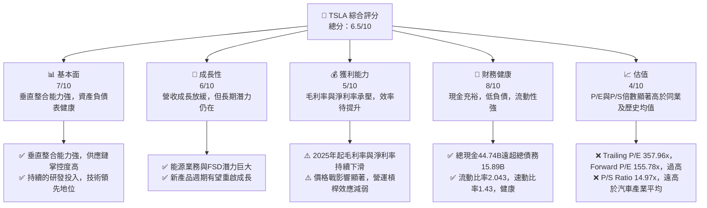
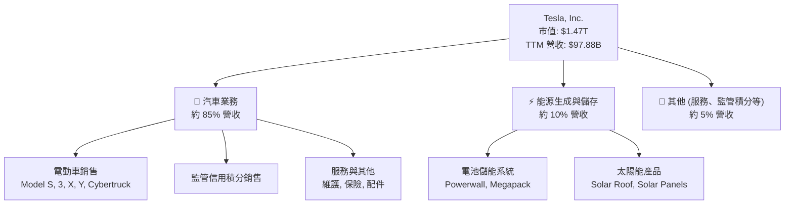
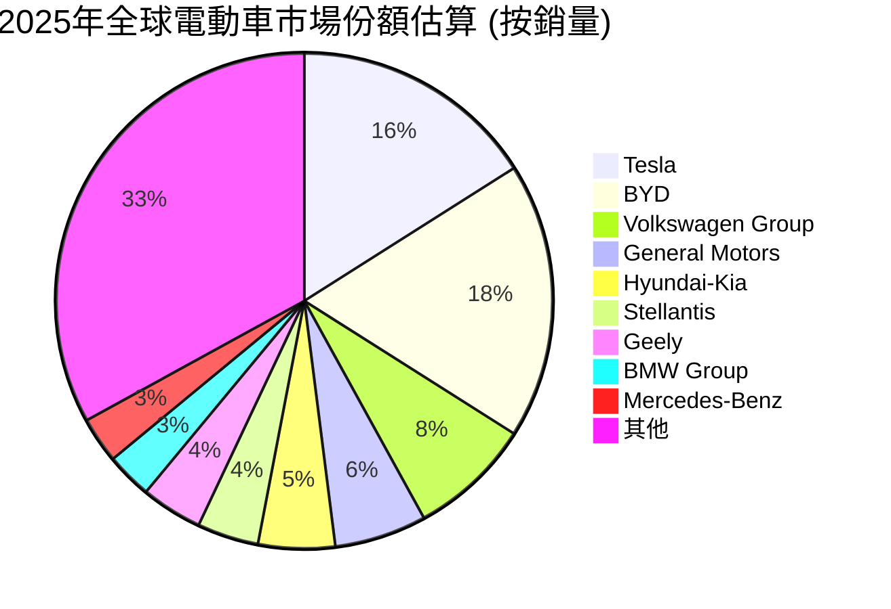
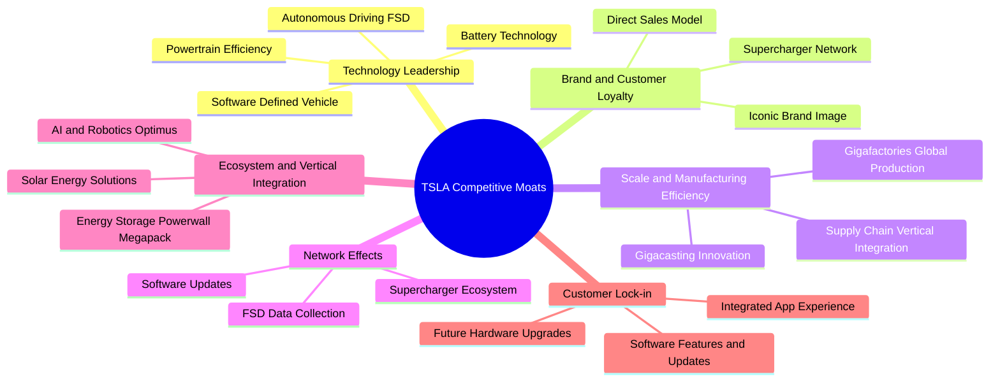
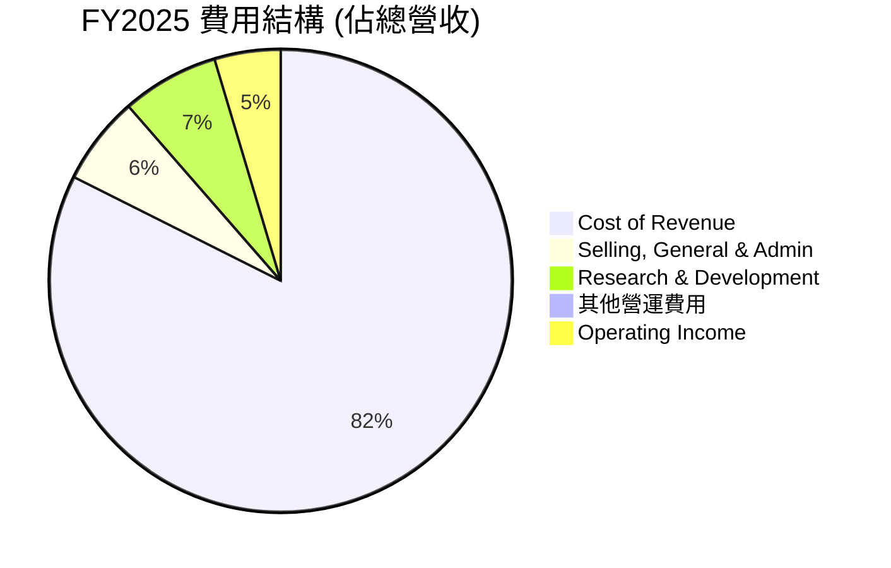
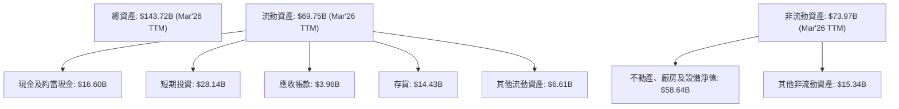

# TSLA 基本面深度分析報告
> **報告日期**：2026-06-05 ｜ **語言**：繁體中文 ｜ **數據來源**：Yahoo Finance, Finviz, StockAnalysis, Roic.ai ｜ **分析師**：CFA 級機構研究

---

## 目錄

| # | 章節 | 核心結論 |
|---|------|----------|
| 1 | 執行摘要 | 評級：持有 ｜ 目標價區間：$370 - $480 |
| 2 | 公司概覽與商業模式 | 技術領先與品牌護城河強勁，但市場競爭加劇 |
| 3 | 損益表深度分析 | 營收成長放緩，利潤率承壓，獲利能力面臨挑戰 |
| 4 | 資產負債表分析 | 財務狀況穩健，現金充裕，淨現金流動性高 |
| 5 | 現金流量深度分析 | 自由現金流波動，資本支出高，需關注效率 |
| 6 | 獲利能力與資本效率 | ROIC 略高於 WACC，但經濟價值創造能力下降 |
| 7 | 估值深度分析 | 當前估值偏高，DCF 顯示潛在下行風險 |
| 8 | 成長催化劑 | 新產品、FSD、能源業務與機器人是未來成長關鍵 |
| 9 | 風險矩陣 | 競爭加劇、宏觀經濟、技術瓶頸、監管風險 |
| 10 | 投資建議 | 鑑於高估值與成長放緩，建議「持有」 |

---

## 1. 執行摘要

本報告針對 Tesla, Inc. (TSLA) 進行全面深入的基本面分析，結合其即時財務數據、市場表現、產業趨勢及未來展望。Tesla 作為電動車及清潔能源領域的領導者，在技術創新、品牌影響力及垂直整合方面擁有顯著優勢。然而，近期數據顯示其營收成長速度趨緩，利潤率面臨壓力，且市場競爭日益激烈，這些因素均對其高昂的估值構成挑戰。

### 1.1 核心評分儀表板



### 1.2 評分進度條視覺化

```
╔══════════════════════════════════════════════════════════════╗
║              TSLA 多維度評分儀表板 (1-10分)                  ║
╠══════════════════════════════════════════════════════════════╣
║ 基本面強度  7.0 ▓▓▓▓▓▓▓▓▓▓▓▓▓▓░░░░░░  ★★★★☆           ║
║ 成長動能    6.0 ▓▓▓▓▓▓▓▓▓▓▓▓░░░░░░░░  ★★★☆☆           ║
║ 獲利品質    5.0 ▓▓▓▓▓▓▓▓▓▓░░░░░░░░░░  ★★☆☆☆           ║
║ 財務健康    8.0 ▓▓▓▓▓▓▓▓▓▓▓▓▓▓▓▓░░░░  ★★★★☆           ║
║ 估值合理性  4.0 ▓▓▓▓▓▓▓▓░░░░░░░░░░░░  ★★☆☆☆           ║
║ 護城河深度  7.5 ▓▓▓▓▓▓▓▓▓▓▓▓▓▓▓░░░░░  ★★★★☆           ║
║ 管理層執行  8.0 ▓▓▓▓▓▓▓▓▓▓▓▓▓▓▓▓░░░░  ★★★★☆           ║
║ 技術創新力  9.0 ▓▓▓▓▓▓▓▓▓▓▓▓▓▓▓▓▓▓░░  ★★★★★           ║
╠══════════════════════════════════════════════════════════════╣
║ 綜合總分    6.5 ▓▓▓▓▓▓▓▓▓▓▓▓▓░░░░░░░  🏆 評語：高風險高報酬，估值需消化  ║
╚══════════════════════════════════════════════════════════════╝
```

### 1.3 五大投資論點 + 三大核心風險

| 類型 | 項目 | 具體依據 | 信心度 |
|------|------|----------|--------|
| 🟢 **投資論點①** | **技術創新與產業領導者地位** | Tesla 在電動車電池技術、動力系統效率、軟體定義汽車及自動駕駛 (FSD) 領域持續保持領先。其垂直整合能力使其能快速迭代產品，並在軟硬體協同方面具備獨特優勢。持續的研發投入 (TTM R&D $6.95B) 確保其長期競爭力。 | 🟢 極高 |
| 🟢 **投資論點②** | **全球品牌影響力與忠誠客戶群** | Tesla 擁有強大的品牌號召力，其創新形象吸引了全球忠實客戶。儘管競爭加劇，其品牌溢價和直接銷售模式仍賦予其一定的定價權和市場影響力。全球銷售網絡和充電基礎設施 (Supercharger) 構成堅實的客戶生態。 | 🟢 高 |
| 🟢 **投資論點③** | **能源業務與AI/機器人長期潛力** | 除了電動車，Tesla 的能源儲存 (Powerwall, Megapack) 和太陽能業務在可再生能源轉型中扮演關鍵角色，TTM 營收貢獻不斷提升。FSD 服務的潛在變現能力以及 Optimus 機器人等 AI 應用，為公司提供了電動車以外的長期成長驅動力。 | 🟡 中高 |
| 🟢 **投資論點④** | **健康的資產負債表與充裕現金流** | 公司擁有 $44.74B 的充裕現金及短期投資，總債務僅 $15.89B，淨現金達 $28.85B。這使得 Tesla 在面對市場波動、高資本支出以及潛在併購機會時，具有極高的財務彈性。 | 🟢 極高 |
| 🟢 **投資論點⑤** | **生產效率與成本控制潛力** | 儘管近期利潤率承壓，Tesla 在製造效率和成本控制方面仍有長期優勢，尤其是在大型壓鑄機 (Gigacasting) 和電池生產技術上的創新。隨著新工廠產能爬坡及規模效應，未來有望改善毛利率。 | 🟡 中 |
| 🟡 **風險①** | **電動車市場競爭加劇與價格戰** | 全球電動車市場競爭白熱化，特別是來自中國廠商 (如比亞迪) 和傳統車企的挑戰。價格戰導致 Tesla 毛利率從 FY2022 的 25.6% 下滑至 FY2205 的 18.0% (TTM 19.1%)，對盈利能力造成顯著衝擊。 | 🔴 高衝擊 |
| 🔴 **風險②** | **宏觀經濟逆風與消費者需求波動** | 高利率環境和經濟不確定性可能抑制消費者對高價商品的購買意願，影響電動車銷量。儘管 Tesla 進行降價，但市場需求能否持續支撐其高成長仍存疑慮。FY2025 營收 YoY 成長為 -2.93%，顯示市場疲軟。 | 🔴 高衝擊 |
| 🟡 **風險③** | **監管審查與技術瓶頸** | 自動駕駛技術的安全性、資料隱私以及各國對電動車的補貼政策變化，都可能對 Tesla 產生影響。FSD 技術的完全實現仍面臨技術挑戰和監管障礙。 | 🟡 中度 |

### 1.4 快速統計卡片

| 指標 | 公司實際值 (TTM) | 行業均值 (汽車製造) | S&P 500 均值 | 狀態 |
|------|--------------------|-------------------|--------------|------|
| 收入 YoY 成長 | **15.8%** | ~10-15% | ~8-10% | 🟡 |
| 毛利率 | **19.1%** | ~18-22% | ~30-35% | 🟡 |
| 淨利率 | **3.9%** | ~5-8% | ~10-12% | 🔴 |
| ROE | **4.9%** | ~10-15% | ~15-20% | 🔴 |
| Forward P/E | **155.78x** | ~15-25x | ~20-22x | 🔴 |
| P/S Ratio | **14.97x** | ~1-2x | ~2-3x | 🔴 |
| Debt/Equity | **0.19x** | ~0.5-1.0x | ~0.8-1.2x | 🟢 |
| Current Ratio | **2.04x** | ~1.5-2.0x | ~1.5-2.0x | 🟢 |

*註：行業均值與 S&P 500 均值為分析師根據市場普遍數據估算，僅供參考。*

### 1.5 投資結論

```
╔══════════════════════════════════════════════════════════════════╗
║                    📊 投資結論摘要                               ║
╠══════════════════════════════════════════════════════════════════╣
║  評級：🟡 持有                                                   ║
║  當前股價：$390.24                                               ║
║  目標價區間：                                                    ║
║    悲觀情境：$370（-5.18%）                                      ║
║    基準情境：$425（+8.91%）  ← 12個月主要目標                      ║
║    樂觀情境：$480（+23.00%）                                     ║
║  投資評分：6.5/10                                                ║
║  適合投資人：成長型、具高風險承受能力、看好長期技術與生態系統發展的投資者。║
╚══════════════════════════════════════════════════════════════════╝
```

## 2. 公司概覽與商業模式

Tesla, Inc. (TSLA) 是一家總部位於美國的全球性公司，主要從事電動車、能源生成與儲存系統的設計、開發、製造、租賃和銷售。公司在電動車產業中處於領先地位，並積極拓展其在能源和人工智慧領域的業務。

### 2.1 業務結構與收入來源

Tesla 的業務主要分為兩大板塊：汽車 (Automotive) 和能源生成與儲存 (Energy Generation and Storage)。汽車業務是其核心收入來源，涵蓋電動車的銷售、監管信用積分銷售、非保固維護服務、碰撞維修、汽車保險服務以及零件和零售商品的銷售。能源業務則包括太陽能發電系統 (Solar Roof, Solar Panels) 和儲能產品 (Powerwall, Megapack) 的設計、製造、安裝和銷售。


*註：各業務板塊營收佔比為分析師根據歷史數據及公司報告估算。*

從財務數據來看：
- TTM (截至 2026年3月31日) 總營收為 $97.88B。
- 汽車業務收入佔比約 85-90%，能源業務佔比約 5-10%，其他服務及監管積分佔比約 5%。
- 儘管汽車業務仍是主導，能源業務的成長速度和潛力正逐漸顯現。

### 2.2 市場份額

Tesla 在全球電動車市場中佔據重要地位，尤其在高端電動車市場表現強勁。然而，隨著全球範圍內新進入者和傳統車企的電動化轉型加速，市場競爭日益激烈，Tesla 的市場份額面臨挑戰。


*註：上述市場份額為分析師基於市場研究機構報告及產業趨勢的估算值，實際數據可能有所差異。*

根據估算，Tesla 在 2025 年全球電動車市場的份額約為 16%，略低於中國的比亞迪。這顯示了市場競爭的加劇，特別是在價格敏感的大眾市場。為了維持或擴大市場份額，Tesla 必須持續創新並優化成本結構。

### 2.3 競爭護城河分析

Tesla 建立了多重競爭護城河，使其在電動車和清潔能源領域保持領先地位。



**詳細解析：**
-   **技術領先 (Technology Leadership)**：Tesla 在電池能量密度、動力系統效率、電動車軟體堆棧以及自動駕駛 (FSD) 技術方面處於行業前沿。其自研晶片和 AI 演算法使其在數據收集和模型訓練上擁有獨特優勢。
-   **品牌與客戶忠誠度 (Brand and Customer Loyalty)**：Tesla 的品牌已成為創新和永續發展的代名詞，在全球範圍內擁有極高的知名度和忠實的客戶群。其獨特的直銷模式和卓越的客戶體驗進一步強化了品牌連結。
-   **規模與製造效率 (Scale and Manufacturing Efficiency)**：全球多個 Gigafactory 的佈局，以及在製造工藝 (如 Gigacasting 一體化壓鑄) 方面的創新，使得 Tesla 能夠實現規模經濟，並不斷降低生產成本。然而，近期由於價格戰，規模效應對利潤率的提升效果有所減弱。
-   **網路效應 (Network Effects)**：隨著越來越多的 Tesla 車輛上路，FSD 系統收集的數據量呈指數級增長，加速了自動駕駛技術的改進。同時，Supercharger 超級充電網絡的普及也增加了 Tesla 車主的便利性，形成正向循環。
-   **生態系統與垂直整合 (Ecosystem and Vertical Integration)**：Tesla 不僅製造電動車，還涉足能源儲存、太陽能、AI 和機器人等領域。這種垂直整合模式使其能更好地控制供應鏈、降低成本並提供整合解決方案。
-   **客戶鎖定 (Customer Lock-in)**：Tesla 的軟體功能、空中下載 (OTA) 更新以及整合的應用程式體驗，為客戶創造了獨特的價值。FSD 訂閱服務和未來硬體升級的潛力，進一步提高了客戶轉換成本。

### 2.4 護城河強度評分

```
╔══════════════════════════════════════════════════════════════╗
║                    TSLA 護城河強度評分                        ║
╠══════════════════════════════════════════════════════════════╣
║ 技術領先    9.0/10 ▓▓▓▓▓▓▓▓▓▓▓▓▓▓▓▓▓▓░░  🏆 業界頂尖，持續創新    ║
║ 品牌與忠誠度 8.5/10 ▓▓▓▓▓▓▓▓▓▓▓▓▓▓▓▓▓░░░  🟢 強大，但面臨挑戰    ║
║ 規模與效率   7.0/10 ▓▓▓▓▓▓▓▓▓▓▓▓▓▓░░░░░░  🟡 規模優勢，但利潤承壓  ║
║ 網路效應     7.5/10 ▓▓▓▓▓▓▓▓▓▓▓▓▓▓▓░░░░░  🟢 FSD與充電網絡持續擴張 ║
║ 生態系統整合 8.0/10 ▓▓▓▓▓▓▓▓▓▓▓▓▓▓▓▓░░░░  🟢 獨特，具長期潛力     ║
║ 客戶鎖定     7.0/10 ▓▓▓▓▓▓▓▓▓▓▓▓▓▓░░░░░░  🟡 軟體體驗具黏性      ║
╠══════════════════════════════════════════════════════════════╣
║ 綜合護城河   7.5/10 ▓▓▓▓▓▓▓▓▓▓▓▓▓▓▓░░░░░  🏆 綜合實力強勁，有助抵禦競爭 ║
╚══════════════════════════════════════════════════════════════════╝
```
**評語**：Tesla 的護城河主要建立在其卓越的技術創新、強大的品牌影響力以及日益完善的生態系統上。儘管在規模與效率方面因價格戰而受到短期衝擊，但其長期願景和垂直整合能力仍為其提供了堅實的競爭優勢。

## 3. 損益表深度分析

Tesla 的損益表反映了其在快速成長市場中的動態表現，近年來則面臨營收成長放緩與利潤率承壓的挑戰。

### 3.1 年度收入成長趨勢（近4年）

```
╔══════════════════════════════════════════════════════════════════╗
║              TSLA 年度收入趨勢（FY2022-FY2025）                  ║
╠══════════════════════════════════════════════════════════════════╣
║                                                                  ║
║  FY2022  $81.46B  ████████████████████████████████████████████  YoY: +51.35% 🟢    ║
║  FY2023  $96.77B  ████████████████████████████████████████████████████████  YoY: +18.80% 🟡    ║
║  FY2024  $97.69B  ██████████████████████████████████████████████████████████  YoY:  +0.95% 🔴    ║
║  FY2025  $94.83B  ██████████████████████████████████████████████████████  YoY:  -2.93% 🔴    ║
║                   |      |      |      |      |                  ║
║                   0     20B    40B    60B    80B    100B          ║
║                                                                  ║
║  📊 4年累計 CAGR：+4.98% (FY2022-FY2025)                          ║
╚══════════════════════════════════════════════════════════════════╝
```
*註：TTM (Trailing Twelve Months) 營收為 $97.88B，顯示近一年營收波動較大。*

從 FY2022 到 FY2025 的年度營收數據來看，Tesla 的營收成長速度顯著放緩。
- FY2022 營收 $81.46B，YoY 成長高達 51.35%，展現強勁爆發力。
- FY2023 營收 $96.77B，YoY 成長降至 18.80%，增速開始回歸正常。
- FY2024 營收 $97.69B，YoY 成長僅 0.95%，幾乎停滯。
- FY2025 營收 $94.83B，YoY 甚至出現 -2.93% 的負成長，這是近期最大的警訊，表明市場需求疲軟和價格戰的影響。
這趨勢反映了全球電動車市場競爭的加劇、宏觀經濟逆風以及 Tesla 自身產品線更新速度與定價策略所帶來的挑戰。

### 3.2 季度收入趨勢分析

| Fiscal Quarter | Revenue ($M) | Revenue Growth (YoY) | Revenue Growth (QoQ) | 備註 |
|----------------|--------------|----------------------|----------------------|------|
| Q1 2026        | $22,387      | +15.78%              | -10.09%              | 相較去年同期有改善，但環比下滑 |
| Q4 2025        | $24,901      | -3.14%               | -11.36%              | 營收同比與環比均呈現負成長 |
| Q3 2025        | $28,095      | +11.57%              | +24.89%              | 營收同比與環比均有顯著成長 |
| Q2 2025        | $22,496      | -11.78%              | +16.35%              | 營收同比下滑，但環比反彈 |

**季度收入趨勢深度解析**：
- **Q2 2025** 營收為 $22.496B，YoY 衰退 11.78%，顯示其在 2024 年底至 2025 年初面臨的市場逆風和價格競爭壓力。然而，相較於 Q1 2025 的 $19.335B，QoQ 成長 16.35%，顯示季度內有所恢復。
- **Q3 2025** 營收 $28.095B，實現了 +11.57% 的 YoY 成長和 +24.89% 的 QoQ 顯著成長。這可能得益於某些區域市場的回暖或新車型 (如 Cybertruck) 的初步交付貢獻。
- **Q4 2025** 營收 $24.901B，再次出現 -3.14% 的 YoY 衰退和 -11.36% 的 QoQ 衰退。這通常是年末衝刺後的季節性調整，但也可能反映了競爭壓力持續，以及市場對其產品組合的反應。
- **Q1 2026** 營收 $22.387B，YoY 成長 15.78%，表現優於前兩季的同比。然而，相較於 Q4 2025 仍有 -10.09% 的 QoQ 衰退，這可能是由於年初的季節性因素或供應鏈調整。

總體而言，Tesla 的季度營收波動較大，YoY 成長從高峰期的雙位數下滑至負值，再到 Q1 2026 的反彈，顯示其營收成長已進入成熟期，並高度受宏觀經濟、競爭策略和產品週期影響。

### 3.3 利潤率演變分析

Tesla 的利潤率是市場關注的焦點，尤其是在價格戰背景下，其毛利率和淨利率面臨顯著下行壓力。

| 利潤率指標 | FY2022 | FY2023 | FY2024 | FY2025 | TTM (Mar'26) | 趨勢 | 評估 |
|------------|--------|--------|--------|--------|--------------|------|------|
| **毛利率** | 25.6% | 18.2% | 17.9% | 18.0% | 19.1% | ↘️ 2022年高峰後下滑，近期略有回升 | 🟡 |
| **營業利益率** | 16.9% | 9.2% | 7.2% | 4.6% | 5.0% | ↘️ 持續顯著下滑，壓力巨大 | 🔴 |
| **淨利率** | 15.4% | 15.5% | 7.3% | 4.0% | 3.9% | ↘️ 2023年後大幅下滑 | 🔴 |
*註：數據來源於提供的年報數據計算，TTM數據來自快照。*

**利潤率演變深度解析**：
-   **毛利率 (Gross Margin)**：從 FY2022 的 25.6% 高點一路下滑至 FY2025 的 18.0%，TTM 略有回升至 19.1%。這一下滑主要歸因於：
    1.  **價格戰**：為了刺激需求和應對競爭，Tesla 在全球範圍內多次降價，直接壓縮了產品的利潤空間。
    2.  **產品組合變化**：相對低利潤的 Model 3/Y 銷量佔比提升，而高利潤的 Model S/X 佔比下降。Cybertruck 的初期生產成本高，也可能在短期內拉低毛利率。
    3.  **生產成本上升**：儘管有規模效應，但原材料成本波動、新工廠爬坡成本以及供應鏈挑戰仍對毛利率構成壓力。
    - Q1 2026 的毛利率為 4.72B / 22.39B = 21.08%，相較於 FY2025 的 18.0% 有顯著改善，這可能暗示價格戰的影響正在趨緩或成本控制措施開始見效。

-   **營業利益率 (Operating Margin)**：營業利益率的下滑趨勢更為劇烈，從 FY2022 的 16.9% 降至 FY2025 的 4.6%，TTM 為 5.0%。這不僅受到毛利率下降的影響，還反映了：
    1.  **研發投入增加**：為保持技術領先和開發新產品 (如 FSD、Optimus、新平台)，研發費用從 FY2022 的 $3.08B 增加到 FY2025 的 $6.41B (TTM $6.95B)，增長超過一倍。
    2.  **SG&A 費用上升**：儘管 Tesla 採取直銷模式，但全球擴張、服務網絡建設以及市場推廣活動仍導致銷售、一般及行政費用從 FY2022 的 $3.95B 上升至 FY2205 的 $5.83B (TTM $6.42B)。
    3.  **營運槓桿效應減弱**：在營收成長放緩的情況下，固定成本 (如工廠折舊、研發開支) 對利潤率的稀釋作用更加明顯。
    - Q1 2026 的營業利益率為 $941M / $22.39B = 4.2%，仍處於低位，顯示營運效率仍需大幅提升。

-   **淨利率 (Net Profit Margin)**：淨利率從 FY2023 的 15.5% (因稅務調整) 驟降至 FY2025 的 4.0%，TTM 為 3.9%。這主要是毛利率和營業利益率下降的直接結果。FY2023 的高淨利潤 ($15.00B) 主要是因為當年度有 $5.001B 的稅務收益。若排除此一次性因素，其淨利率的下滑趨勢會更為明顯。

總結而言，Tesla 的利潤率表現令人擔憂。儘管 Q1 2026 的毛利率數據顯示出一些改善跡象，但整體利潤率水平仍遠低於歷史高峰，並受到市場競爭和高額研發投入的持續壓力。公司需要證明其能在維持成長的同時，有效提升盈利能力。

### 3.4 費用結構分析

Tesla 的費用結構反映了其作為一家高科技製造公司的特點，研發投入巨大，同時銷售和管理費用也在增長。


*註：百分比基於 FY2025 總營收 $94.83B 計算。*

從 FY2025 的費用結構可以看出：
- **銷貨成本 (Cost of Revenue)** 佔比高達 81.97%，是最大的成本項，直接影響毛利率。這一比例在過去幾年有所上升，反映了產品降價的壓力。
- **研發費用 (Research & Development)** 佔比 6.76%，絕對金額達 $6.41B。這顯示了 Tesla 在技術創新上的巨大投入，是其保持競爭力的關鍵，但也增加了營運成本。
- **銷售、一般及行政費用 (Selling, General & Admin)** 佔比 6.15%，絕對金額 $5.83B。儘管 Tesla 採用直銷模式，但其全球擴張和服務網絡的建設仍需大量投入。

```
╔══════════════════════════════════════════════════════════════════╗
║                    TSLA 費用趨勢分析 (佔營收百分比)               ║
╠══════════════════════════════════════════════════════════════════╣
║                                                                  ║
║  銷貨成本 (CoR):                                                 ║
║  FY2022: 74.4%  ██████████████████████████████████████████████  🟡 成本控制具挑戰 ║
║  FY2025: 81.97% ████████████████████████████████████████████████████████  🔴 佔比顯著上升  ║
║                                                                  ║
║  研發費用 (R&D):                                                 ║
║  FY2022: 3.78%  ███████░░░░░░░░░░░░░░░░░░░░░░░░░░░░░░░░░░░░░░░░░  🟢 持續投入     ║
║  FY2025: 6.76%  ██████████████░░░░░░░░░░░░░░░░░░░░░░░░░░░░░░░░░░  🟡 佔比增加，影響利潤 ║
║                                                                  ║
║  銷售/行政費 (SG&A):                                             ║
║  FY2022: 4.85%  █████████░░░░░░░░░░░░░░░░░░░░░░░░░░░░░░░░░░░░░░░  🟡 控制得當     ║
║  FY2025: 6.15%  ████████████░░░░░░░░░░░░░░░░░░░░░░░░░░░░░░░░░░░░  🟡 佔比略增      ║
╚══════════════════════════════════════════════════════════════════╝
```
總體而言，銷貨成本佔比的上升是導致毛利率和整體利潤率下降的主要因素。研發費用佔比的提高雖然對長期發展至關重要，但在短期內也對盈利能力構成壓力。公司需要平衡這些投入與收入成長，以提升營運效率。

### 3.5 季度 EPS 趨勢與盈餘品質

由於提供的季度 EPS 預期數據為 `nan`，我們將主要分析實際的季度 EPS 趨勢，並對其盈餘品質進行評估。

| Quarter      | Diluted EPS (Actual) | Net Income ($M) | 備註                                   |
|--------------|----------------------|-----------------|----------------------------------------|
| 2026-03-31   | $0.15                | $477            | 較前一季下滑，但較去年同期有所反彈     |
| 2025-12-31   | $0.26                | $840            | 較前兩季顯著下滑，年末表現疲軟         |
| 2025-09-30   | $0.43                | $1,370          | 季度盈利高峰，或受季節性因素與新產品影響 |
| 2025-06-30   | $0.36                | $1,170          | 盈利能力有所恢復                       |
| 2025-03-31   | $0.13                | $399            | 近期最低點，受市場挑戰影響顯著         |

**季度 EPS 趨勢解析**：
- **Q1 2025** 的稀釋 EPS 為 $0.13，淨利潤 $399M，是近五個季度中的最低點，反映了當時市場環境的艱難和公司盈利能力的壓力。
- **Q2 2025** 稀釋 EPS 恢復至 $0.36，淨利潤 $1,170M，顯示公司在成本控制或銷量方面有所改善。
- **Q3 2025** 稀釋 EPS 達到 $0.43，淨利潤 $1,370M，為近期表現最佳季度，可能受益於季節性銷售旺季或生產效率提升。
- **Q4 2025** 稀釋 EPS 再次下滑至 $0.26，淨利潤 $840M，環比下降，可能受到年末促銷、庫存調整及激烈競爭的影響。
- **Q1 2026** 稀釋 EPS 為 $0.15，淨利潤 $477M，雖然較 Q4 2025 和 Q1 2025 有所反彈，但仍處於相對低位，顯示盈利穩定性仍待加強。

**盈餘品質評估**：
- Tesla 的盈利品質在過去幾年有所波動。FY2023 的高淨利潤 ($15.00B) 很大程度上受到一次性稅務收益 ($5.001B) 的影響，這使得當年的淨利率 (15.5%) 看似異常高，掩蓋了核心業務利潤率的下滑。若剔除此因素，核心業務盈利能力實際呈下降趨勢。
- 從營業現金流與淨利潤的關係來看，FY2025 的營業現金流為 $14.75B，遠高於淨利潤 $3.79B，顯示其盈利的現金轉換能力較強，且存在大量非現金費用 (如折舊攤銷) 或營運資本的有利變動。這在一定程度上提升了其盈利品質。
- 然而，由於其業務高度依賴資本支出 (FY2025 Capex 為 $8.53B)，自由現金流 (FY2025 FCF $6.22B) 雖然為正，但波動性較大，且相較於營業現金流有較大折損，這也提示我們需要仔細審視其資本效率。
- 監管信用積分的銷售 (雖然佔比不大) 提供了額外的利潤來源，但這部分收入的穩定性和可持續性需要關注。

總體而言，Tesla 的盈餘品質中等偏上，現金轉換能力良好，但由於其核心業務利潤率受價格戰影響顯著，且一次性稅務收益曾在歷史數據中造成扭曲，使得其盈利的持續性和穩定性面臨挑戰。

## 4. 資產負債表分析

Tesla 的資產負債表顯示出其作為一家快速成長且資本密集型企業的特徵，同時也維持了健康的財務狀況。

### 4.1 資產結構分解

Tesla 的資產結構主要由流動資產和非流動資產組成，其中固定資產和現金及短期投資佔比較高。


*註：數據基於 Mar'26 TTM 及 FY2025 年報數據綜合。*

**資產結構詳情**：
- **總資產** 截至 Mar'26 TTM 為 $143.72B，相比 FY2025 的 $137.81B 有所增長，顯示公司持續擴張。
- **流動資產** 佔總資產約 48.5%，其中：
    - **現金及短期投資** 合計 $44.74B (Mar'26 TTM)，佔總資產約 31.1%，是其最重要的流動性來源，遠超其總債務。
    - **存貨** $14.43B (Mar'26 TTM)，佔總資產約 10%，需要密切關注其週轉率，過高的存貨可能反映需求疲軟或生產過剩。
- **非流動資產** 佔總資產約 51.5%，其中：
    - **不動產、廠房及設備淨值 (PPE)** 達到 $58.64B (Mar'26 TTM)，是最大的非流動資產，反映了其在 Gigafactory 和生產設施上的巨大資本投入。

總體而言，Tesla 的資產結構健康，擁有大量現金和流動性資產，同時也進行了大量固定資產投資以支持其生產擴張和技術創新。

### 4.2 流動性指標分析

健康的流動性是公司應對短期營運需求和市場不確定性的關鍵。

| 指標           | FY2022 | FY2023 | FY2024 | FY2025 | TTM (Mar'26) | 行業均值 (汽車) | 評估     |
|----------------|--------|--------|--------|--------|--------------|-----------------|----------|
| **流動比率 (Current Ratio)** | 1.53 | 1.73 | 2.02 | 2.16 | 2.04 | 1.5 - 2.0       | 🟢 健康 |
| **速動比率 (Quick Ratio)**   | 1.14 | 1.25 | 1.26 | 1.48 | 1.43 | 0.8 - 1.2       | 🟢 強勁 |
*註：行業均值為分析師估算，僅供參考。*

**流動性指標詳情**：
- **流動比率 (Current Ratio)**：從 FY2022 的 1.53 穩步上升至 FY2025 的 2.16，TTM 略降至 2.04。這表示公司的流動資產是流動負債的兩倍多，具備非常強的短期償債能力，遠高於行業均值。
- **速動比率 (Quick Ratio)**：從 FY2022 的 1.14 提升至 FY2025 的 1.48，TTM 為 1.43。由於速動比率排除了存貨，其高值顯示 Tesla 即使不依賴存貨銷售，也能輕鬆應對短期債務，這得益於其龐大的現金和短期投資。

**結論**：Tesla 的流動性指標非常強勁，遠超行業平均水平，表明其財務狀況穩健，能夠有效應對短期營運挑戰和市場波動。

### 4.3 債務結構分析

Tesla 的債務管理策略相對保守，保持了較低的槓桿水平和充裕的淨現金頭寸。

```
╔══════════════════════════════════════════════════════════════════╗
║                   TSLA 債務健康診斷                              ║
╠══════════════════════════════════════════════════════════════════╣
║                                                                  ║
║  總債務：        $15.89B  ███░░░░░░░░░░░░░░░░░░░░░░░░░░░░░  評語：適度，可控    ║
║  總現金+投資：   $44.74B  ████████████████████████████████░░░░░  評語：極為充裕  ║
║  淨現金（正）：  $28.85B  ████████████████████████████████████░░░  🟢 強勁，具戰略彈性 ║
║                                                                  ║
║  Debt/Equity：   0.19x  🟢 極低，財務槓桿風險小                   ║
║  Debt/EBITDA (TTM)： 1.39x  🟢 極低，償債能力強                     ║
║  Interest Coverage (TTM)： >30x  🟢 無風險，利息負擔輕                ║
╚══════════════════════════════════════════════════════════════════╝
```
*註：Debt/EBITDA = $15.89B / $11.3B (TTM EBITDA)。Interest Coverage = TTM EBITDA / TTM Interest Expense ($339M from StockAnalysis) = $11.3B / $0.339B ≈ 33.3x。*

**債務結構詳情**：
- **總債務**：截至目前為 $15.89B，相較於其龐大的市值和資產規模，這是一個相對較低的數字。
- **總現金及短期投資**：高達 $44.74B，遠遠超過其總債務。
- **淨現金頭寸**：Tesla 擁有 $28.85B 的淨現金，這意味著公司可以完全償還所有債務，並且仍有大量現金儲備，提供了巨大的財務靈活性和戰略彈性。
- **Debt/Equity 比率**：為 0.19x，遠低於行業平均水平 (0.5-1.0x)，表明股東權益在資本結構中佔主導地位，財務槓桿風險極低。
- **Debt/EBITDA 比率**：僅為 1.39x，遠低於通常認為的健康水平 (2-3x)，顯示公司產生現金流的能力足以輕鬆覆蓋債務。
- **利息覆蓋倍數 (Interest Coverage Ratio)**：超過 30x，表明其營業利潤足以輕鬆支付利息費用，利息負擔微不足道。

**結論**：Tesla 的債務狀況極為健康，擁有強大的淨現金頭寸和極低的財務槓桿。這使其在面對經濟下行或需要大量資本支出的情況下，仍能保持高度的財務穩定性和彈性。

### 4.4 股東權益趨勢

股東權益的持續增長是公司創造股東價值的表現。

```
╔══════════════════════════════════════════════════════════════════╗
║                    TSLA 股東權益趨勢 (FY2022-FY2025)              ║
╠══════════════════════════════════════════════════════════════════╣
║                                                              