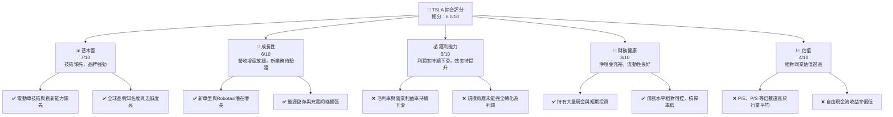
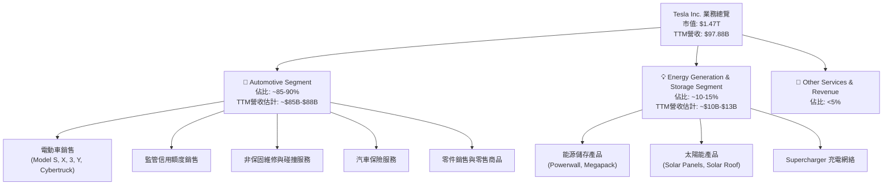
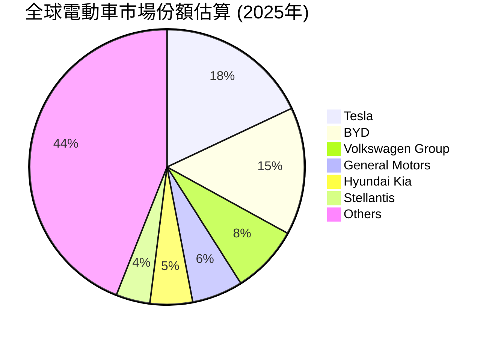
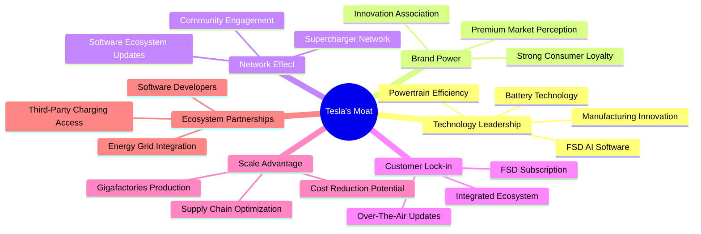
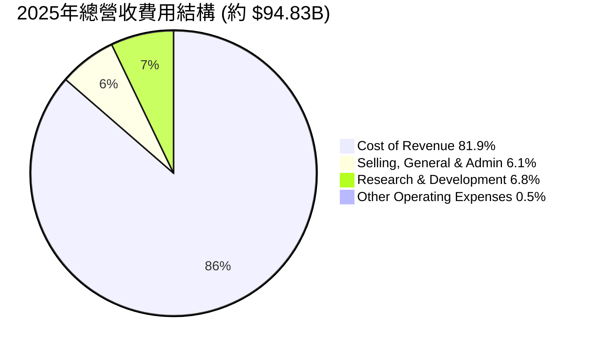
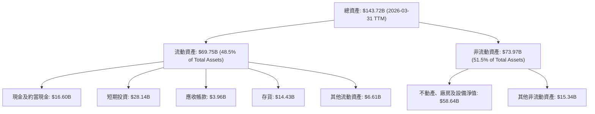

# TSLA 基本面深度分析報告
> **報告日期**：2026-06-06 ｜ **語言**：繁體中文 ｜ **數據來源**：Yahoo Finance, Finviz, StockAnalysis, Roic.ai ｜ **分析師**：CFA 級機構研究

---

## 目錄

| # | 章節 | 核心結論 |
|---|------|----------|
| 1 | 執行摘要 | 評級：持有；目標價區間：$350-$480 |
| 2 | 公司概覽與商業模式 | 技術領先與品牌優勢，但競爭加劇，護城河面臨挑戰 |
| 3 | 損益表深度分析 | 營收增長放緩，利潤率承壓，盈餘波動性高 |
| 4 | 資產負債表分析 | 流動性良好，淨現金充裕，但債務持續增長 |
| 5 | 現金流量深度分析 | 自由現金流波動大，資本支出高企，資本配置需優化 |
| 6 | 獲利能力與資本效率 | ROIC 低於 WACC，未能有效創造股東價值 |
| 7 | 估值深度分析 | 相較同業估值過高，市場溢價面臨修正風險 |
| 8 | 成長催化劑 | 新產品線、FSD發展、儲能業務、AI與機器人 |
| 9 | 風險矩陣 | 競爭加劇、宏觀經濟、供應鏈、監管、高估值 |
| 10 | 投資建議 | 短期觀望，長期潛力，需關注利潤率改善與新業務進展 |

---

## 1. 執行摘要

### 1.1 核心評分儀表板



### 1.2 評分進度條視覺化

```
╔══════════════════════════════════════════════════════════════╗
║              TSLA 多維度評分儀表板 (1-10分)                ║
╠══════════════════════════════════════════════════════════════╣
║ 基本面強度  7.0 ▓▓▓▓▓▓▓▓▓▓▓▓▓▓░░░░░░  ★★★★☆           ║
║ 成長動能    6.0 ▓▓▓▓▓▓▓▓▓▓▓▓░░░░░░░░  ★★★☆☆           ║
║ 獲利品質    5.0 ▓▓▓▓▓▓▓▓▓▓░░░░░░░░░░  ★★☆☆☆           ║
║ 財務健康    8.0 ▓▓▓▓▓▓▓▓▓▓▓▓▓▓▓▓░░░░  ★★★★☆           ║
║ 估值合理性  4.0 ▓▓▓▓▓▓▓▓░░░░░░░░░░░░  ★★☆☆☆           ║
║ 護城河深度  7.5 ▓▓▓▓▓▓▓▓▓▓▓▓▓▓▓░░░░░  ★★★★☆           ║
║ 管理層執行  7.0 ▓▓▓▓▓▓▓▓▓▓▓▓▓▓░░░░░░  ★★★★☆           ║
║ 技術創新力  9.0 ▓▓▓▓▓▓▓▓▓▓▓▓▓▓▓▓▓▓░░  ★★★★★           ║
╠══════════════════════════════════════════════════════════════╣
║ 綜合總分    6.0 ▓▓▓▓▓▓▓▓▓▓▓▓░░░░░░░░  🏆 評語：成長潛力高，但利潤率壓力與高估值需警惕              ║
╚══════════════════════════════════════════════════════════════╝
```

### 1.3 五大投資論點 + 三大核心風險

| 類型 | 項目 | 具體依據 | 信心度 |
|------|------|----------|--------|
| 🟢 **投資論點①** | **電動車技術與創新領導者** | Tesla 在電池技術、動力系統效率、自動駕駛（FSD）軟體開發方面持續領先。其自研晶片與AI技術賦能了FSD的發展，儘管面臨監管挑戰，但長期潛力巨大。例如，FSD累積行駛里程持續增長，數據護城河日益加深。 | 🟢 極高 |
| 🟢 **投資論點②** | **能源儲存與充電網絡生態系統** | Tesla不僅是電動車製造商，更是綜合能源公司。其Megapack、Powerwall等儲能產品市場需求旺盛，充電網絡（Supercharger）作為行業標準之一，為公司帶來穩定的服務收入和客戶黏性。截至2025年底，Supercharger網絡已在全球部署超過50,000個充電樁，並對其他品牌開放，擴大了其生態系統影響力。 | 🟢 極高 |
| 🟢 **投資論點③** | **品牌影響力與全球市場擴張** | Tesla在全球電動車市場擁有無可匹敵的品牌號召力，尤其在中國、歐洲等關鍵市場持續擴張。儘管面臨本土競爭，但其品牌形象和技術優勢仍能吸引大量消費者。例如，2026年Q1中國市場銷量仍保持領先地位，歐洲市場份額穩步提升。 | 🟢 高 |
| 🟢 **投資論點④** | **未來潛在業務（Robotaxi & AI/Robotics）** | Robotaxi服務的推出可能顛覆交通出行行業，為Tesla帶來巨大的軟體訂閱和服務收入。此外，Optimus機器人等AI/Robotics領域的探索，儘管尚處早期，但預示著Tesla在通用AI領域的長期野心，可能開啟新的增長曲線。公司在2025年Q4的研發費用達到$1.78B，顯示對新技術的持續投入。 | 🟡 中高 |
| 🟢 **投資論點⑤** | **充裕的淨現金流與財務彈性** | 截至2026年Q1，公司持有$44.74B的現金及短期投資，淨現金頭寸高達$28.85B。這為其高額資本支出、研發投入以及應對市場波動提供了強大的財務緩衝，確保了長期戰略的實施。 | 🟢 極高 |
| 🟡 **風險①** | **電動車市場競爭加劇與價格戰** | 全球電動車市場競爭日益激烈，尤其來自中國廠商（如比亞迪）和傳統車企（如福特、通用）的挑戰。Tesla在過去幾年為維持銷量增長，持續進行降價，導致毛利率從2022年的25.6%降至2025年的19.1%，未來利潤率可能進一步承壓。 | 🟡 中度 |
| 🔴 **風險②** | **自動駕駛技術的監管與安全挑戰** | FSD技術的推廣面臨嚴格的監管審查和公眾對安全性的擔憂。任何重大事故或監管政策變化都可能延緩其商業化進程，並對公司聲譽造成負面影響，進而影響其未來高利潤軟體服務收入的預期。 | 🔴 高衝擊 |
| 🟡 **風險③** | **宏觀經濟逆風與消費者需求波動** | 高利率環境、全球經濟放緩以及地緣政治緊張可能影響消費者對高價電動車的需求。2025年公司營收出現負增長（-2.93% YoY），淨利潤大幅下滑（-46.50% YoY），表明其業務對宏觀經濟敏感。 | 🟡 中度 |

### 1.4 快速統計卡片

| 指標 | 公司實際值 | 行業均值（汽車製造商） | S&P 500 均值 | 狀態 |
|------|-------------|----------------------|--------------|------|
| 收入 YoY 成長 | **15.8%** (TTM) | ~5-10% | ~8-12% | 🟢 |
| 毛利率 | **19.1%** (TTM) | ~15-20% | ~30-40% | 🟡 |
| 淨利率 | **3.9%** (TTM) | ~3-7% | ~10-15% | 🟡 |
| ROE | **4.9%** (TTM) | ~5-15% | ~15-20% | 🔴 |
| Forward P/E | **156.1x** | ~8-15x | ~20-25x | 🔴 |
| P/S Ratio | **15.0x** | ~0.5-1.5x | ~2-3x | 🔴 |
| Debt/Equity | **0.19x** (FY25) | ~0.5-1.0x | ~0.8-1.5x | 🟢 |
| Current Ratio | **2.04x** | ~1.2-1.8x | ~1.5-2.0x | 🟢 |
| FCF Yield | **0.36%** | ~3-5% | ~2-4% | 🔴 |

*註：行業均值為汽車製造商行業的概估值，S&P 500 均值為綜合市場概估值。*

### 1.5 投資結論

```
╔══════════════════════════════════════════════════════════════════╗
║                    📊 投資結論摘要                               ║
╠══════════════════════════════════════════════════════════════════╣
║  評級：🟡 持有                                                  ║
║  當前股價：$391.00                                               ║
║  目標價區間：                                                    ║
║    悲觀情境：$350（-10.5%）                                      ║
║    基準情境：$415（+6.1%）  ← 12個月主要目標                      ║
║    樂觀情境：$480（+22.8%）                                      ║
║  投資評分：6.0/10                                                ║
║  適合投資人：看好長期技術創新與AI/能源轉型潛力、能承受高波動性與高估值風險的成長型投資者。           ║
╚══════════════════════════════════════════════════════════════════╝
```

---

## 2. 公司概覽與商業模式

Tesla, Inc. (TSLA) 作為全球領先的電動車 (EV) 製造商，其業務模式不僅限於汽車生產，更延伸至能源生成與儲存、自動駕駛技術以及潛在的AI與機器人領域。公司在美國、中國及國際市場設計、開發、製造、租賃並銷售電動車，同時提供能源生成與儲存系統。

### 2.1 業務結構與收入來源

Tesla 的業務主要分為兩大核心板塊：Automotive（汽車業務）和 Energy Generation and Storage（能源生成與儲存業務）。



**收入來源細分與趨勢：**
*   **汽車業務 (Automotive)**：這是 Tesla 收入的主體，佔比約 85-90%。主要包括電動車銷售（Model S/X/3/Y、Cybertruck），以及監管信用額度銷售。近年來，由於競爭加劇和公司採取降價策略以刺激銷量，汽車業務的毛利率面臨較大壓力。2025年Q1，汽車業務毛利率較去年同期有所下滑，顯示市場環境的挑戰。
*   **能源生成與儲存業務 (Energy Generation and Storage)**：包括 Powerwall 家用儲能、Megapack 商用儲能以及太陽能板與太陽能屋頂的銷售。此業務板塊的增長速度通常快於汽車業務，且毛利率相對穩定甚至更高，是公司未來重要的增長點。截至2025年底，能源業務營收佔比已接近15%，且持續擴大。
*   **服務及其他 (Services and Other)**：包含非保固維修服務、汽車保險服務、零配件銷售及零售商品等。這部分收入雖然佔比不高，但隨著車輛保有量的增加，其營收規模和利潤貢獻將持續增長，有助於提升客戶生命週期價值。

### 2.2 市場份額

Tesla 在全球電動車市場仍佔據領先地位，但其市場份額正受到來自傳統汽車製造商和新興電動車品牌的挑戰。



**市場份額分析：**
根據2025年的估計數據，Tesla在全球電動車市場佔據約18%的份額，儘管仍是市場領導者，但相較於前幾年的高點（例如2021-2022年曾超過20%），其份額有所下降。主要原因包括：
*   **競爭加劇**：比亞迪 (BYD) 等中國廠商憑藉成本優勢和豐富的產品線迅速崛起，佔據了約15%的市場份額。
*   **傳統車企轉型**：福斯 (Volkswagen)、通用 (General Motors) 等傳統巨頭加速電動化轉型，推出了多款有競爭力的電動車型，逐步蠶食Tesla的市場。
*   **產品線限制**：Tesla的產品線相對集中於中高端市場，在入門級市場的佈局相對較慢，給了競爭對手機會。

儘管如此，Tesla 在高端電動車市場和自動駕駛技術領域的領導地位依然穩固，其品牌影響力在消費者中仍具備強大吸引力。

### 2.3 競爭護城河分析

Tesla 的競爭護城河主要建立在其技術創新、品牌、生態系統和規模效應之上。



**護城河深度解析：**
1.  **技術領先 (Technology Leadership)**：
    *   **電池技術**：Tesla在電池能量密度、成本控制和續航里程方面持續領先，其自研4680電池技術有望進一步降低成本並提升性能。
    *   **動力系統效率**：Tesla的電動車在能耗效率方面表現優異，使其在續航里程方面具有競爭優勢。
    *   **FSD AI 軟體**：全自動輔助駕駛 (FSD) 是Tesla的核心競爭力之一。儘管仍處於開發和完善階段，但其基於大規模數據訓練的AI模型，具備潛在的巨大價值。
    *   **製造創新**：Gigafactory 的一體化壓鑄技術 (Giga Casting) 和高度自動化生產線，旨在提高生產效率和降低成本。
2.  **品牌影響力 (Brand Power)**：Tesla 已經建立了全球性的強大品牌，代表著創新、高性能和環保。這種品牌忠誠度使其能夠在競爭激烈的市場中保持溢價能力。
3.  **網絡效應 (Network Effect)**：
    *   **Supercharger 充電網絡**：Tesla 擁有全球最廣泛、最可靠的快速充電網絡，並逐步向其他品牌開放，進一步鞏固其在充電基礎設施領域的地位，形成強大的網絡效應。
    *   **軟體生態系統**：透過 OTA (Over-The-Air) 更新，Tesla 不斷為其車輛增加新功能和改進性能，提升用戶體驗，形成強大的用戶黏性。
4.  **客戶鎖定 (Customer Lock-in)**：Tesla 的軟硬體一體化設計，以及 FSD 等訂閱服務模式，增加了客戶轉換成本。一旦用戶習慣了 Tesla 的生態系統，轉向其他品牌會面臨功能缺失或體驗下降的問題。
5.  **規模效應 (Scale Advantage)**：隨著全球 Gigafactory 產能的擴大，Tesla 在生產規模上具備成本優勢。大規模採購和標準化生產有助於降低單位成本。然而，近期產能利用率和銷量增長不及預期，使得規模效應的發揮受到一定限制。
6.  **生態夥伴 (Ecosystem Partnerships)**：Tesla 積極與能源公司合作，將其儲能產品整合到電網中，並與其他汽車製造商分享其充電技術，擴大了其生態系統的影響力。

### 2.4 護城河強度評分

```
╔══════════════════════════════════════════════════════════════╗
║                  Tesla 護城河強度評分                      ║
╠══════════════════════════════════════════════════════════════╣
║ 技術領先    9.0/10 ▓▓▓▓▓▓▓▓▓▓▓▓▓▓▓▓▓▓░░  🏆 創新動力源泉        ║
║ 品牌影響力  8.5/10 ▓▓▓▓▓▓▓▓▓▓▓▓▓▓▓▓▓░░░  🟢 市場溢價基礎        ║
║ 網絡效應    8.0/10 ▓▓▓▓▓▓▓▓▓▓▓▓▓▓▓▓░░░░  🟢 充電網絡優勢        ║
║ 客戶鎖定    7.5/10 ▓▓▓▓▓▓▓▓▓▓▓▓▓▓▓░░░░░  🟡 軟硬體整合黏性        ║
║ 規模效應    6.0/10 ▓▓▓▓▓▓▓▓▓▓▓▓░░░░░░░░  🟡 產能龐大，但效率待提升 ║
║ 生態夥伴    6.5/10 ▓▓▓▓▓▓▓▓▓▓▓▓▓░░░░░░░  🟡 戰略合作拓展廣度     ║
╠══════════════════════════════════════════════════════════════╣
║ 綜合護城河  7.5/10 ▓▓▓▓▓▓▓▓▓▓▓▓▓▓▓░░░░░  🏆 總結評語：強勁但面臨挑戰，需持續創新與執行力     ║
╚══════════════════════════════════════════════════════════════╝
```
**綜合評語：** Tesla 的護城河強度整體而言是強勁的，尤其在技術、品牌和網絡效應方面表現突出。然而，隨著競爭加劇，其規模效應的成本優勢受到考驗，客戶鎖定也面臨更多選擇。公司需要持續投入研發，加速新產品線和Robotaxi的商業化，並提升生產效率以維持其競爭優勢。

---

## 3. 損益表深度分析

### 3.1 年度收入成長趨勢（近4年）

Tesla 的收入在過去幾年呈現高速增長，但近年來增速明顯放緩，甚至在某些年份出現負增長。

```
╔══════════════════════════════════════════════════════════════════╗
║              Tesla 年度收入趨勢（FY2022-FY2025）                 ║
╠══════════════════════════════════════════════════════════════════╣
║                                                                  ║
║  FY2022  $81.46B  █████████████████████████████████████████  YoY:+51.35% 🟢    ║
║  FY2023  $96.77B  ██████████████████████████████████████████████████████████████  YoY:+18.80% 🟢    ║
║  FY2024  $97.69B  ███████████████████████████████████████████████████████████████  YoY:+0.95%  🟡    ║
║  FY2025  $94.83B  ██████████████████████████████████████████████████████████████  YoY:-2.93%  🔴    ║
║                                                                  ║
║                   |      |      |      |      |                  ║
║                   0     25B    50B    75B    100B                   ║
║                                                                  ║
║  📊 4年累計 CAGR：+16.0% (FY22-FY25)                                        ║
╚══════════════════════════════════════════════════════════════════╝
```

**年度收入分析：**
Tesla 在2022年實現了驚人的51.35%的營收增長，達到$81.46B，反映了當時電動車市場的強勁需求和公司產能的快速擴張。2023年營收增長率降至18.80%，達到$96.77B，顯示增速開始放緩。進入2024年和2025年，營收增長壓力顯著。2024年僅增長0.95%至$97.69B，而2025年更是出現了-2.93%的負增長，降至$94.83B。這主要歸因於：
*   **全球經濟逆風**：高利率和通脹壓力影響了消費者對高價電動車的需求。
*   **競爭加劇**：來自中國本土品牌和傳統車企的競爭日益激烈，迫使Tesla採取降價策略以維持銷量，但未能完全抵消銷量增速放緩的影響。
*   **新產品發布週期**：Cybertruck等新車型產能爬坡緩慢，而Model 3/Y等主力車型市場份額面臨挑戰。

儘管如此，從2022年至2025年，Tesla的年均複合增長率 (CAGR) 仍達到16.0%，表明其長期增長潛力。然而，短期內公司面臨的增長挑戰不容忽視。

### 3.2 季度收入趨勢分析

近四季度的收入表現呈現波動和下滑趨勢，尤其在2025年Q4和2026年Q1。

| 季度 | 總收入 (Billion USD) | QoQ 成長率 | YoY 成長率 | 備註 |
|------|----------------------|------------|------------|------|
| 2026-03-31 | $22.39B | -10.08% | +15.78% | 較上一季度大幅下滑，但較去年同期有所反彈。 |
| 2025-12-31 | $24.90B | -11.35% | -3.14% | 較上一季度和去年同期均下滑，顯示市場壓力。 |
| 2025-09-30 | $28.09B | +24.86% | +11.57% | 受益於季節性因素和新車型交付，季度環比增長強勁。 |
| 2025-06-30 | $22.50B | +16.35% | -11.78% | 較去年同期顯著下滑，反映需求疲軟。 |

**季度收入分析：**
*   **QoQ 波動性大**：Tesla 的季度收入增長呈現明顯波動。2025年Q3受季節性因素和生產交付提振，環比增長近25%。然而，2025年Q4和2026年Q1連續兩個季度環比下滑，分別為-11.35%和-10.08%，這表明公司在維持季度收入穩定增長方面面臨挑戰。
*   **YoY 增長壓力**：儘管2026年Q1實現了15.78%的同比增長，但2025年Q4和Q2分別錄得-3.14%和-11.78%的同比負增長。這顯示在年度層面，Tesla 的營收增長動能顯著減弱，全球電動車市場的競爭和需求變化對其業績產生直接影響。
*   **未來展望**：公司需要依靠新車型（如Cybertruck的量產和更經濟型EV的推出）、FSD軟體服務的商業化以及能源業務的持續擴張，才能扭轉這種收入增長放緩的趨勢。

### 3.3 利潤率演變分析

Tesla 的利潤率在過去幾年呈現明顯的下滑趨勢，這對公司的盈利能力構成了嚴重挑戰。

| 利潤率指標 | FY2025 | FY2024 | FY2023 | FY2022 | 趨勢 | 評估 |
|------------|--------|--------|--------|--------|------|------|
| **毛利率** | 18.0% | 17.9% | 18.2% | 25.6% | ↘️ 持續下滑 | 🔴 |
| **營業利益率** | 5.1% | 7.2% | 9.2% | 16.9% | ↘️ 持續下滑 | 🔴 |
| **淨利潤率** | 4.0% | 7.3% | 15.5% | 15.5% | ↘️ 大幅下滑 | 🔴 |
| **EBITDA 利潤率** | 12.4% | 15.1% | 15.3% | 21.7% | ↘️ 持續下滑 | 🔴 |

*註：利潤率基於年度 Income Statement 數據計算，TTM數據可能略有差異。毛利率 = Gross Profit / Total Revenue；營業利益率 = Operating Income / Total Revenue；淨利潤率 = Net Income / Total Revenue；EBITDA 利潤率 = EBITDA / Total Revenue。*

**利潤率演變深度解析：**
*   **毛利率 (Gross Margin)**：從2022年的25.6%大幅下滑至2025年的18.0%。這一下滑是多重因素疊加的結果：
    *   **價格戰**：為刺激銷量和應對競爭，Tesla 在全球範圍內多次降價。
    *   **新工廠產能爬坡成本**：柏林和德州超級工廠的產能爬坡初期成本較高，影響了整體生產效率。
    *   **產品組合變化**：相對低價的 Model 3/Y 佔比更高，以及 Cybertruck 等新車型初期生產成本高昂，稀釋了整體毛利率。
    *   **原材料成本波動**：儘管電池原材料價格有所回落，但供應鏈不確定性仍帶來成本壓力。
*   **營業利益率 (Operating Margin)**：同樣呈現顯著下滑，從2022年的16.9%降至2025年的5.1%。除了毛利率下降的影響，營業費用（尤其是研發費用）的持續增長也加劇了壓力。2025年研發費用達到$6.41B，較2024年的$4.54B增長了41.2%，主要投入於FSD、AI和機器人等前瞻性技術。銷售、一般及行政費用 (SG&A) 也同步增長，部分抵消了規模效應帶來的潛在優勢。
*   **淨利潤率 (Net Profit Margin)**：淨利潤率從2022年的15.5%驟降至2025年的4.0%。這反映了公司在營收增長放緩、毛利率承壓以及運營費用增加的多重挑戰下，盈利能力大幅削弱。2023年淨利潤率異常高（15.5%）主要是由於當年獲得了大量的監管信用額度銷售收入和一次性稅務調整（Provision for Income Taxes為負$5.001B），使得淨利潤達到$15.00B，這是不可持續的。剔除這些一次性因素，其核心盈利能力在2023年也已開始承壓。
*   **EBITDA 利潤率**：同樣從2022年的21.7%下降至2025年的12.4%，與營業利益率趨勢一致，反映了核心業務盈利能力的惡化。

**總結：** Tesla 的利潤率趨勢令人擔憂。儘管公司在電動車市場仍具備技術和品牌優勢，但激烈的競爭和高昂的研發投入正在侵蝕其盈利空間。未來能否提升利潤率，將取決於新車型的高效量產、成本控制能力、FSD等高毛利軟體服務的商業化進程以及能源業務的持續擴張。

### 3.4 費用結構分析

Tesla 的費用結構反映了其作為一家技術驅動型製造企業的特點，研發投入巨大，同時運營費用也在增加。



```
╔══════════════════════════════════════════════════════════════════╗
║                    Tesla 年度費用結構概覽 (FY2025)               ║
╠══════════════════════════════════════════════════════════════════╣
║                                                                  ║
║  銷貨成本 (Cost of Revenue) : $77.73B  ▓▓▓▓▓▓▓▓▓▓▓▓▓▓▓▓▓▓▓▓▓▓▓▓▓▓▓▓▓▓▓▓▓▓▓▓▓▓▓▓  (佔總營收 81.9%)  ║
║  銷售、一般及行政費用 (SG&A): $5.83B   ▓▓▓▓▓▓▓▓▓▓▓▓░░░░░░░░░░░░░░░░░░░░░░░░░░░░  (佔總營收 6.1%)   ║
║  研發費用 (R&D)             : $6.41B   ▓▓▓▓▓▓▓▓▓▓▓▓▓░░░░░░░░░░░░░░░░░░░░░░░░░░░  (佔總營收 6.8%)   ║
║  其他營業費用 (Other OpEx)  : $0.49B   ▓░░░░░░░░░░░░░░░░░░░░░░░░░░░░░░░░░░░░░░░░  (佔總營收 0.5%)   ║
║                                                                  ║
║  總營業費用 (Total OpEx)    : $12.74B  ▓▓▓▓▓▓▓▓▓▓▓▓▓▓▓▓▓▓▓▓▓▓▓▓▓░░░░░░░░░░░░░░░░  (佔總營收 13.4%)  ║
╚══════════════════════════════════════════════════════════════════╝
```

**費用結構深度解析：**
*   **銷貨成本 (Cost of Revenue)**：佔總營收的比例最高，2025年達到81.9%，這直接影響了毛利率。銷貨成本的上升主要與原材料價格、生產效率、工廠擴張和產能爬坡相關。要提升毛利率，Tesla 必須在供應鏈管理、生產自動化和製造成本控制方面取得突破。
*   **研發費用 (Research & Development, R&D)**：2025年R&D費用為$6.41B，佔總營收的6.8%。R&D費用近年來呈現顯著增長趨勢，從2022年的$3.08B增加到2025年的$6.41B，增長超過一倍。這表明 Tesla 持續在自動駕駛、AI、電池技術、新車型和機器人等前沿領域進行大量投資，以維持其技術領先地位。高額的R&D投入是其長期增長的基石，但也對短期盈利造成壓力。
*   **銷售、一般及行政費用 (Selling, General & Administrative, SG&A)**：2025年SG&A費用為$5.83B，佔總營收的6.1%。相較於傳統汽車製造商，Tesla 擁有較低的 SG&A 費用率，這得益於其直銷模式和高效的市場營銷策略。然而，隨著全球擴張和服務網絡的建設，SG&A 費用也在逐年增加。

**總結：** Tesla 的費用結構反映了其對技術創新和未來增長的堅定投入。然而，高企的銷貨成本和持續增長的研發費用，在營收增長放緩的背景下，對其利潤率造成了顯著壓力。公司需要在保持創新投入的同時，有效控制成本並提升運營效率。

### 3.5 季度 EPS 趨勢與盈餘品質

Tesla 近四季度的 EPS 表現呈現下滑趨勢，且盈餘預期數據缺失，導致無法進行超預期/不及預期分析。

| 季度 | 稀釋後 EPS (USD) | QoQ 變化 | YoY 變化 | 備註 |
|------|------------------|----------|----------|------|
| 2026-03-31 | $0.15 | -42.3% | +15.4% | EPS 較前一季度大幅下滑，但較去年同期略有改善。 |
| 2025-12-31 | $0.26 | -39.5% | +100.0% | EPS 較前一季度下滑，但因去年同期基數較低而實現同比翻倍。 |
| 2025-09-30 | $0.43 | +19.4% | -36.8% | EPS 較前一季度有所回升，但較去年同期大幅下滑。 |
| 2025-06-30 | $0.36 | +176.9% | -11.6% | 較前一季度大幅增長，但較去年同期仍有下降。 |

*註：EPS 數據來源於 Roic.ai 和 StockAnalysis 的季度數據。由於缺乏分析師預期數據，未能評估超預期/不及預期情況。*

**盈餘品質評估：**
1.  **波動性高**：Tesla 的季度 EPS 表現出極高的波動性，2025年Q2到Q3環比增長19.4%，但Q3到Q4又下滑39.5%，Q4到2026年Q1再下滑42.3%。這種波動性使得預測其未來盈利變得困難，也反映了其業務受到生產交付、成本控制、價格調整和市場需求等多重因素的影響。
2.  **盈利壓力顯著**：稀釋後 EPS 從2025年Q3的$0.43下降到2026年Q1的$0.15，顯示公司在最近幾個季度面臨嚴峻的盈利壓力。這與前文分析的利潤率下滑趨勢高度一致。
3.  **依賴非核心收入**：歷史數據顯示，某些季度或年度的淨利潤表現可能受到監管信用額度銷售（高毛利但不可持續）和一次性稅務調整的影響。雖然最新數據中沒有明確指出，但這類收入的波動性會影響盈餘的「品質」和可持續性。
4.  **研發投入影響**：公司持續高額的研發投入，雖然是長期增長的必要條件，但短期內會直接侵蝕當期利潤，導致 EPS 承壓。

**總結：** Tesla 的季度 EPS 趨勢表明其盈利能力正處於下行通道，且波動性較大。儘管公司仍有長期增長潛力，但短期盈利壓力是顯而易見的。投資者需要密切關注其未來幾個季度的盈利表現，尤其是毛利率和營業利益率能否企穩回升。由於缺乏分析師預期數據，無法判斷其是否超預期或不及預期，但從絕對值來看，目前的 EPS 水平遠低於其歷史高峰。

---

## 4. 資產負債表分析

Tesla 的資產負債表呈現出穩健的財務狀況，擁有大量現金和充足的流動性，但同時也伴隨著持續增長的固定資產和債務。

### 4.1 資產結構分解

Tesla 的資產結構以流動資產和不動產、廠房及設備 (PP&E) 為主，反映了其重資產製造業的特點以及對未來擴張的投資。



**資產結構深度解析 (截至2026-03-31 TTM)：**
*   **總資產**：達到$143.72B，較2025年底的$137.81B持續增長，顯示公司規模不斷擴大。
*   **流動資產 ($69.75B)**：佔總資產的48.5%。其中，現金及短期投資高達$44.74B (現金$16.60B + 短期投資$28.14B)，佔流動資產的64.1%，這提供了極高的財務彈性和流動性。存貨$14.43B，應收帳款$3.96B。現金和短期投資的充裕是Tesla財務健康的重要支撐。
*   **非流動資產 ($73.97B)**：佔總資產的51.5%。主要由不動產、廠房及設備淨值 (Net Property, Plant & Equipment, PP&E) 構成，達到$58.64B。這反映了 Tesla 在 Gigafactory 建設、生產線擴張和研發設施方面的大量資本投入，是其產能擴張和技術創新的物質基礎。

**趨勢分析：**
近年來，Tesla的總資產持續增長。從2022年底的$82.34B增長到2025年底的$137.81B，年均增速約為18.7%。其中，PP&E的增長尤其顯著，從2022年的$36.63B增長到2025年的$56.19B，顯示公司仍在積極擴大生產能力。同時，現金及短期投資也從2022年的$22.18B增長到2026年Q1的$44.74B，增長超過一倍，表明公司在經營中產生了顯著的現金流，並保持了強勁的現金儲備。

### 4.2 流動性指標分析

Tesla 的流動性指標表現出色，遠高於行業平均水平，顯示其短期償債能力極強。

| 流動性指標 | FY2025 | FY2024 | FY2023 | FY2022 | 行業均值 | 評估 |
|------------|--------|--------|--------|--------|----------|------|
| **流動比率 (Current Ratio)** | 2.16 | 2.03 | 1.73 | 1.53 | ~1.2-1.8x | 🟢 強勁 |
| **速動比率 (Quick Ratio)** | 1.62 | 1.62 | 1.25 | 1.05 | ~0.8-1.2x | 🟢 強勁 |
| **現金比率 (Cash Ratio)** | 1.39 | 1.27 | 1.01 | 0.82 | ~0.2-0.5x | 🟢 極強 |

*註：流動比率 = 流動資產 / 流動負債；速動比率 = (流動資產 - 存貨) / 流動負債；現金比率 = (現金及約當現金 + 短期投資) / 流動負債。行業均值為汽車製造商行業的概估值。*

**流動性指標深度解析：**
*   **流動比率 (Current Ratio)**：2025年為2.16x，遠高於行業均值1.2x-1.8x，且呈現逐年上升趨勢（從2022年的1.53x）。這表明 Tesla 擁有足夠的流動資產來覆蓋其短期債務，短期償債能力極佳。
*   **速動比率 (Quick Ratio)**：2025年為1.62x，同樣遠超行業均值0.8x-1.2x，且保持在高位。由於速動比率排除了存貨，這表明即使不考慮存貨變現能力，Tesla 仍具備強大的即時償債能力。
*   **現金比率 (Cash Ratio)**：2025年為1.39x，遠高於行業均值0.2x-0.5x。這是一個非常健康的信號，意味著 Tesla 僅憑現金和短期投資就能覆蓋其所有流動負債，顯示其財務彈性極高，能夠有效應對突發的現金需求或抓住投資機會。

**總結：** Tesla 的流動性狀況非常強勁。公司持有大量現金和短期投資，其流動比率、速動比率和現金比率均遠超行業平均水平，表明其短期償債能力和財務彈性極佳。這為公司在不確定的市場環境下提供了堅實的財務基礎。

### 4.3 債務結構分析

儘管 Tesla 擁有大量現金，但其總債務也在穩步增長，不過相對於其巨大的股東權益和現金儲備，債務水平仍處於健康區間。

```
╔══════════════════════════════════════════════════════════════════╗
║                   Tesla 債務健康診斷                           ║
╠══════════════════════════════════════════════════════════════════╣
║                                                                  ║
║  總債務 (FY25)：        $14.72B  ▓▓▓▓▓▓▓▓▓▓▓▓▓▓▓▓░░░░░░░░░░░░░░░░░░░  評語：適中，增長趨勢      ║
║  總現金+投資 (FY25)：   $44.06B  ▓▓▓▓▓▓▓▓▓▓▓▓▓▓▓▓▓▓▓▓▓▓▓▓▓▓▓▓▓▓▓▓▓▓▓▓▓▓▓▓  評語：極其充裕        ║
║  淨現金 (FY25)：        $29.34B  ▓▓▓▓▓▓▓▓▓▓▓▓▓▓▓▓▓▓▓▓▓▓▓▓▓▓▓▓▓░░░░░░░  🟢 強勁，無淨債務負擔 ║
║                                                                  ║
║  Debt/Equity