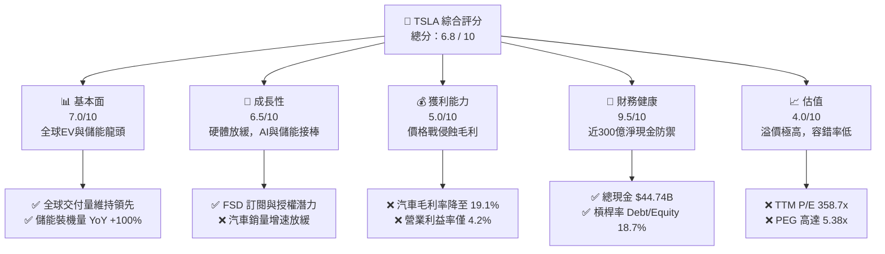
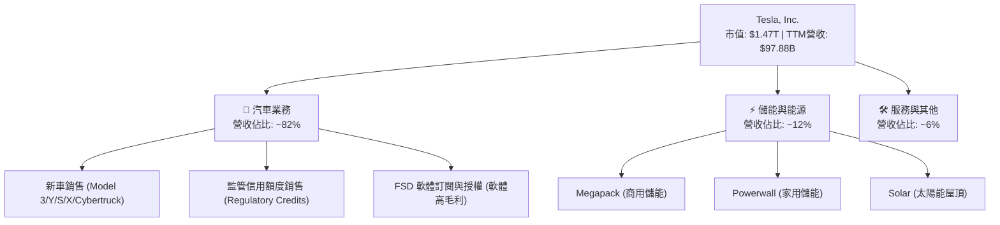
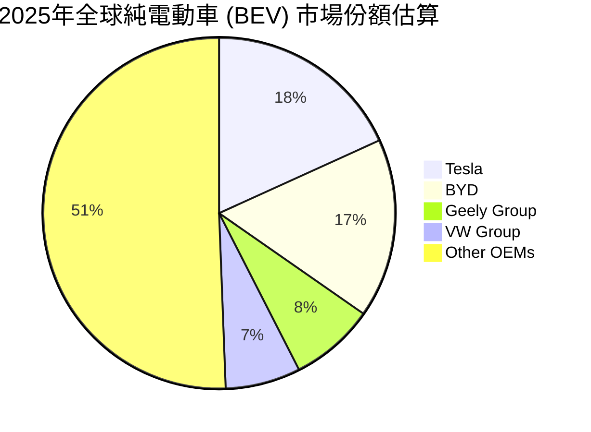
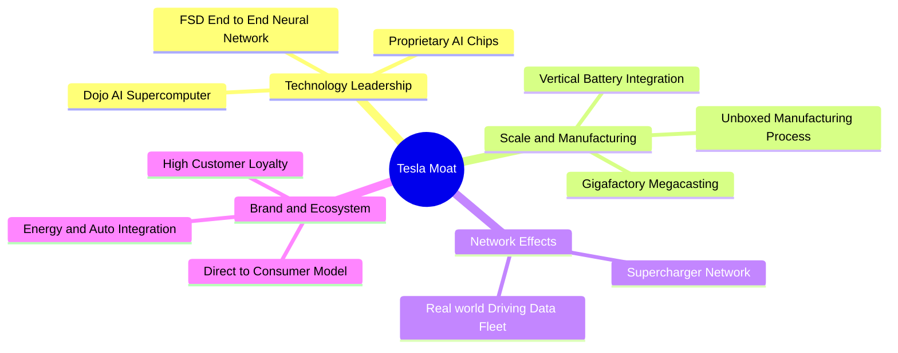

# TSLA 基本面深度分析報告

> **報告日期**：2026-06-07 ｜ **語言**：繁體中文 ｜ **數據來源**：Yahoo Finance, Finviz, StockAnalysis, Roic.ai ｜ **分析師**：CFA 級機構研究

---

## 目錄

| # | 章節 | 核心結論 |
|---|------|----------|
| 1 | 執行摘要 | 給予「持有」評級，基準目標價 $419.94，聚焦 AI 與儲能轉型 |
| 2 | 公司概覽與商業模式 | 汽車毛利承壓，儲能（Megapack）與 FSD 軟體生態構成核心護城河 |
| 3 | 損益表深度分析 | TTM 營收重回 15.8% 增長，但價格戰導致淨利率降至 3.9% 的歷史低點 |
| 4 | 資產負債表分析 | 淨現金高達 $28.85B，財務結構極度穩健，具備強大抗風險與再投資能力 |
| 5 | 現金流量深度分析 | OCF $16.53B 支撐 $8.53B 資本支出，AI 基礎建設（Dojo/GPU）吞噬現金 |
| 6 | 獲利能力與資本效率 | ROIC（6.6%）低於 WACC（13.9%），當前處於「價值毀滅」的轉型陣痛期 |
| 7 | 估值深度分析 | Trailing P/E 358.7x 顯示市場已透支 AI 預期，DCF 基準估值為 $410.25 |
| 8 | 成長催化劑 | FSD V12 授權、Robotaxi 落地及 Megapack 產能釋放為三大催化劑 |
| 9 | 風險矩陣 | 價格戰持續、FSD 監管延遲與關鍵人物風險為核心威脅 |
| 10 | 投資建議 | 建議於 $320-$350 區間逢低佈局，適合具備高風險承受度的長線投資人 |

---

## 1. 執行摘要

### 1.1 核心評分儀表板



### 1.2 評分進度條視覺化

```
╔══════════════════════════════════════════════════════════════╗
║                TSLA 多維度評分儀表板 (1-10分)                ║
╠══════════════════════════════════════════════════════════════╣
║ 基本面強度  7.0 ▓▓▓▓▓▓▓▓▓▓▓▓▓▓░░░░░░  ★★★★☆           ║
║ 成長動能    6.5 ▓▓▓▓▓▓▓▓▓▓▓▓▓░░░░░░░  ★★★☆☆           ║
║ 獲利品質    5.0 ▓▓▓▓▓▓▓▓▓▓░░░░░░░░░░  ★★★☆☆           ║
║ 財務健康    9.5 ▓▓▓▓▓▓▓▓▓▓▓▓▓▓▓▓▓▓▓░  ★★★★★           ║
║ 估值合理性  4.0 ▓▓▓▓▓▓▓▓░░░░░░░░░░░░  ★★☆☆☆           ║
║ 護城河深度  8.5 ▓▓▓▓▓▓▓▓▓▓▓▓▓▓▓▓▓░░░  ★★★★☆           ║
║ 管理層執行  7.5 ▓▓▓▓▓▓▓▓▓▓▓▓▓▓▓░░░░░  ★★★★☆           ║
║ 技術創新力  9.5 ▓▓▓▓▓▓▓▓▓▓▓▓▓▓▓▓▓▓▓░  ★★★★★           ║
╠══════════════════════════════════════════════════════════════╣
║ 綜合總分    6.8 ▓▓▓▓▓▓▓▓▓▓▓▓▓░░░░░░░  🏆 評級：持有 (Hold)  ║
╚══════════════════════════════════════════════════════════════╝
```

### 1.3 五大投資論點 + 三大核心風險

| 類型 | 項目 | 具體依據 | 信心度 |
|------|------|----------|--------|
| 🟢 **投資論點①** | **儲能業務進入爆發期** | Megapack 需求強勁，2025年儲能裝機量與營收快速增長，毛利率顯著高於汽車業務。 | 🟢 極高 |
| 🟢 **投資論點②** | **FSD V12 與 Robotaxi 願景** | 端到端神經網絡技術領先，FSD 滲透率提升與潛在的 B2B 授權將帶來高毛利的軟體收入。 | 🟢 高 |
| 🟢 **投資論點③** | **無與倫比的資產負債表** | 擁有 $44.74B 現金與短期投資，淨現金達 $28.85B，足以抵禦任何宏觀經濟下行。 | 🟢 極高 |
| 🟢 **投資論點④** | **垂直整合與製造優勢** | 一體化壓鑄與自主研發晶片，使 TSLA 在硬體成本控制上仍優於傳統底特律車廠。 | 🟡 中等 |
| 🟢 **投資論點⑤** | **下一代平坦化平台（Model 2）** | 預期於明後年量產的廉價車型將重新激活銷量成長引擎，打開大眾市場。 | 🟡 中等 |
| 🟡 **風險①** | **汽車利潤率持續惡化** | 全球 EV 競爭白熱化（尤其是比亞迪等中國車企），導致 TSLA 必須持續降價，侵蝕毛利。 | 🔴 高衝擊 |
| 🔴 **風險②** | **AI 估值溢價難以變現** | 當前 $1.47T 的市值中，有超過 80% 來自 AI、Robotaxi 與 Optmius 的遠期預期，若技術落地延遲將面臨估值崩潰。 | 🔴 高衝擊 |
| 🟡 **風險③** | **關鍵人物風險（Key Person Risk）** | 伊隆·馬斯克（Elon Musk）的多邊專注（X、SpaceX、xAI）及薪酬案爭議，可能分散其對 TSLA 的管理精力。 | 🟡 中度 |

### 1.4 快速統計卡片

| 指標 | TSLA 實際值 | 行業均值 (汽車製造) | S&P 500 均值 | 狀態 |
|------|-------------|----------|--------------|------|
| **收入 YoY 成長** | **15.8%** | ~5.2% | ~6.5% | 🟢 優異 |
| **毛利率** | **19.1%** | ~15.0% | ~30.0% | 🟡 一般 |
| **淨利率** | **3.9%** | ~6.0% | ~11.5% | 🔴 偏低 |
| **ROE** | **4.9%** | ~12.0% | ~15.0% | 🔴 偏低 |
| **Forward P/E** | **156.1x** | ~12.5x | ~21.5x | 🔴 極度昂貴 |
| **淨現金/總資產** | **20.1%** | -15.0% (淨債務) | ~5.0% | 🟢 極其健康 |

### 1.5 投資結論

```
╔══════════════════════════════════════════════════════════════════╗
║                    📊 TSLA 投資結論摘要                          ║
╠══════════════════════════════════════════════════════════════════╣
║  評級：🟡 持有 (Hold)                                            ║
║  當前股價：$391.00 (2026-06-07)                                  ║
║  目標價區間：                                                    ║
║    悲觀情境（硬體停滯，AI延遲）：$245.00（-37.3%）                ║
║    基準情境（儲能高增，FSD逐步變現）：$419.94（+7.4%）            ║
║    樂觀情境（Robotaxi全面落地，Model 2爆發）：$580.00（+48.3%）   ║
║  投資評分：6.8 / 10                                              ║
║  適合投資人：長線成長型、願意承受高波動並看好 AI/機器人願景者      ║
╚══════════════════════════════════════════════════════════════════╝
```

---

## 2. 公司概覽與商業模式

### 2.1 業務結構與收入來源

特斯拉（TSLA）已經從一家純粹的電動汽車製造商，轉型為「新能源 + 自動駕駛 AI」的生態型企業。截至 2026 年第一季，其業務結構可分為以下四大板塊：



### 2.2 全球純電動車（BEV）市場份額

根據 2025 年全球 BEV 交付數據估算，特斯拉與比亞迪（BYD）呈現雙雄爭霸格局：



### 2.3 競爭護城河分析

特斯拉的競爭護城河已超越傳統汽車製造的範疇，呈現多維度的網絡與生態效應：



### 2.4 護城河強度評分

```
╔══════════════════════════════════════════════════════════════╗
║                    TSLA 護城河強度評分                       ║
╠══════════════════════════════════════════════════════════════╣
║ 數據與 AI 算法  9.5/10 ▓▓▓▓▓▓▓▓▓▓▓▓▓▓▓▓▓▓▓░  🏆 絕對領先    ║
║ 超級充電網絡    9.0/10 ▓▓▓▓▓▓▓▓▓▓▓▓▓▓▓▓▓▓░░  🟢 極強護城河  ║
║ 製造與成本控制  8.0/10 ▓▓▓▓▓▓▓▓▓▓▓▓▓▓▓▓░░░░  🟢 行業一流    ║
║ 品牌與生態鎖定  8.5/10 ▓▓▓▓▓▓▓▓▓▓▓▓▓▓▓▓▓░░░  🟢 粉絲粘性極高║
║ 儲能垂直整合    8.0/10 ▓▓▓▓▓▓▓▓▓▓▓▓▓▓▓▓░░░░  🟢 Megapack領先║
╠══════════════════════════════════════════════════════════════╣
║ 綜合護城河強度  8.6/10 ▓▓▓▓▓▓▓▓▓▓▓▓▓▓▓▓▓░░░  🏆 寬廣護城河  ║
╚══════════════════════════════════════════════════════════════╝
```

---

## 3. 損益表深度分析

### 3.1 年度收入成長趨勢（近5年）

特斯拉的營收在經歷 2021-2022 年的高速增長後，於 2024-2025 年因全球電動車市場需求放緩及降價競爭而陷入停滯。然而，2026 年 TTM（滾動12個月）數據顯示營收重回增長軌道，達到 $97.88B，主要得益於儲能業務的爆發。

```
