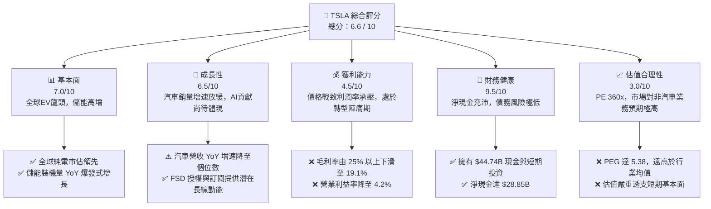
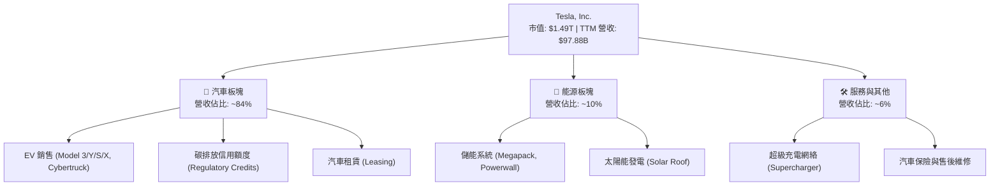
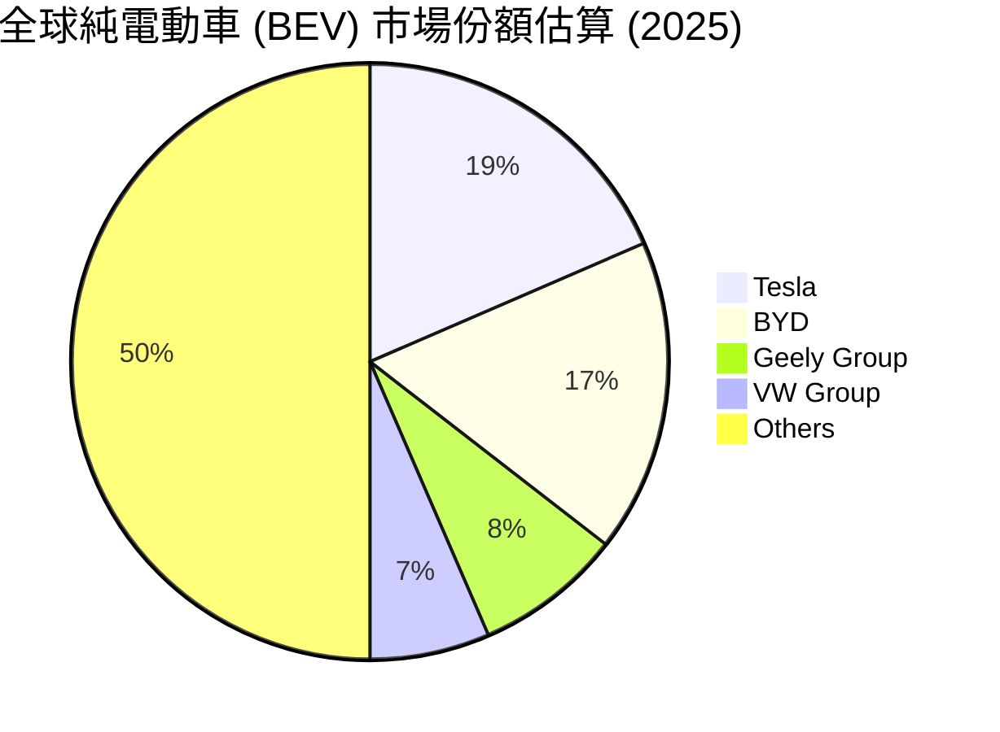
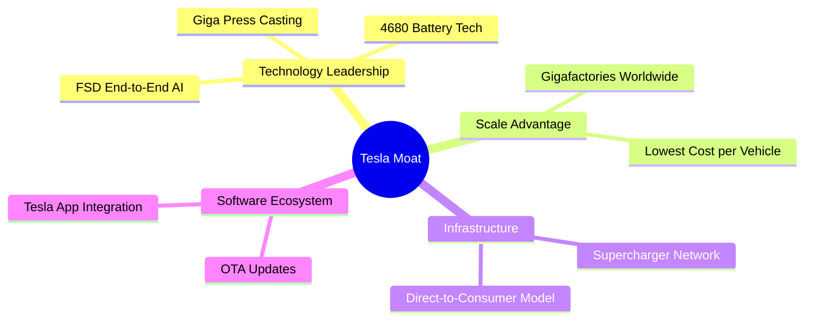

# TSLA 基本面深度分析報告

> **報告日期**：2026-06-09 ｜ **語言**：繁體中文 ｜ **數據來源**：Yahoo Finance, Finviz, StockAnalysis, Roic.ai ｜ **分析師**：CFA 級機構研究

---

## 目錄

| # | 章節 | 核心結論 |
|---|------|----------|
| 1 | **執行摘要** | 評級為「持有（Hold）」，目標價區間 $220.00 ~ $520.00，基準目標價 $420.00 |
| 2 | **公司概覽與商業模式** | 護城河正從「純電動車製造」向「AI、FSD 軟體與儲能生態」轉移 |
| 3 | **損益表深度分析** | 營收 TTM 達 $97.88B（YoY +15.8%），但價格戰侵蝕毛利率至 19.1%，淨利潤率降至 3.9% |
| 4 | **資產負債表分析** | 現金及短期投資達 $44.74B，淨現金 $28.85B，財務結構極其穩健 |
| 5 | **現金流量深度分析** | 營運現金流 TTM $16.53B，自由現金流 $5.25B，資本配置高度向 AI 算力基礎設施傾斜 |
| 6 | **獲利能力與資本效率** | ROE 降至 4.9%，ROIC (6.64%) 低於 WACC (13.1%)，面臨短期價值稀釋的挑戰 |
| 7 | **估值深度分析** | Trailing P/E 達 360.1x，Forward P/E 達 157.6x，估值隱含極高 AI 與自動駕駛溢價 |
| 8 | **成長催化劑** | FSD V12.x 全球推廣、Robotaxi 商業化落地、Megapack 產能釋放及下一代低成本車型 |
| 9 | **風險矩陣** | 核心風險為價格戰持續、FSD 監管與技術瓶頸，以及關鍵人物風險 |
| 10 | **投資建議** | 建議分批佈局，聚焦 FSD 滲透率與儲能毛利率兩大核心監控指標 |

---

## 1. 執行摘要

### 1.1 核心評分儀表板



### 1.2 評分進度條視覺化

```
╔══════════════════════════════════════════════════════════════╗
║                TSLA 多維度評分儀表板 (1-10分)                ║
╠══════════════════════════════════════════════════════════════╣
║ 基本面強度  7.0 ▓▓▓▓▓▓▓▓▓▓▓▓▓▓░░░░░░  ★★★☆☆           ║
║ 成長動能    6.5 ▓▓▓▓▓▓▓▓▓▓▓▓▓░░░░░░░  ★★★☆☆           ║
║ 獲利品質    4.5 ▓▓▓▓▓▓▓▓▓░░░░░░░░░░░  ★★☆☆☆           ║
║ 財務健康    9.5 ▓▓▓▓▓▓▓▓▓▓▓▓▓▓▓▓▓▓▓░  ★★★★★           ║
║ 估值合理性  3.0 ▓▓▓▓▓▓░░░░░░░░░░░░░░  ★☆☆☆☆           ║
║ 護城河深度  8.5 ▓▓▓▓▓▓▓▓▓▓▓▓▓▓▓▓▓░░░  ★★★★☆           ║
║ 管理層執行  7.5 ▓▓▓▓▓▓▓▓▓▓▓▓▓▓▓░░░░░  ★★★★☆           ║
║ 技術創新力  9.5 ▓▓▓▓▓▓▓▓▓▓▓▓▓▓▓▓▓▓▓░  ★★★★★           ║
╠══════════════════════════════════════════════════════════════╣
║ 綜合總分    6.6 ▓▓▓▓▓▓▓▓▓▓▓▓▓░░░░░░░  🏆 評級：持有 (Hold)  ║
╚══════════════════════════════════════════════════════════════╝
```

### 1.3 投資論點與核心風險

| 類型 | 項目 | 具體依據 | 信心度 |
|------|------|----------|--------|
| 🟢 **投資論點①** | **儲能業務（Energy Storage）成為第二增長極** | Megapack 產能持續釋放，2025年儲能業務對營收貢獻顯著提升，利潤率優於汽車業務。 | 🟢 極高 |
| 🟢 **投資論點②** | **FSD 與自動駕駛軟體的高毛利預期** | FSD V12 採用端到端神經網絡，若 Robotaxi 順利落地，將推動利潤率從硬體級（~15%）向軟體級（>70%）轉型。 | 🟡 中等 |
| 🟢 **投資論點③** | **無可匹敵的資產負債表韌性** | 持有 $44.74B 現金，即使面臨長期價格戰，亦有充足資金進行研發與資本支出。 | 🟢 極高 |
| 🟡 **風險①** | **全球電動車滲透率放緩與價格戰未息** | 汽車營收增長停滯（FY25 YoY -2.93%），主要受中美歐補貼退坡及競爭加劇影響。 | 🔴 高衝擊 |
| 🔴 **風險②** | **高估值下的容錯率極低** | Trailing P/E 360x，若 FSD 監管審批延遲或 Robotaxi 商業化不及預期，股價將面臨劇烈修正。 | 🔴 高衝擊 |

### 1.4 快速統計卡片

| 指標 | TSLA 實際值 | 行業均值 (Auto) | S&P 500 均值 | 狀態 |
|------|-------------|----------|--------------|------|
| **營收 TTM 成長** | **15.8%** | ~5.0% | ~6.5% | 🟢 優於同行 |
| **毛利率** | **19.1%** | ~14.5% | ~30.0% | 🟡 行業領先但自身下滑 |
| **淨利率** | **3.9%** | ~4.5% | ~11.5% | 🔴 處於歷史低位 |
| **ROE** | **4.9%** | ~8.5% | ~15.0% | 🔴 資產效率短期惡化 |
| **Forward P/E** | **157.6x** | ~11.5x | ~21.5x | 🔴 估值極度溢價 |
| **淨現金規模** | **$28.85B** | 普遍為淨負債 | N/A | 🟢 極其強勁 |

### 1.5 投資結論

```
╔══════════════════════════════════════════════════════════════════╗
║                    📊 TSLA 投資結論摘要                          ║
╠══════════════════════════════════════════════════════════════════╣
║  評級：🟡 持有 (Hold)                                            ║
║  當前股價：$396.10 (2026-06-09)                                  ║
║  目標價區間：                                                    ║
║    悲觀情境 (Bear Case)：$220.00 (-44.5%)                         ║
║    基準情境 (Base Case)：$420.00 (+6.0%)   ← 12個月主要目標      ║
║    樂觀情境 (Bull Case)：$520.00 (+31.3%)                        ║
║  投資評分：6.6 / 10                                              ║
║  適合投資人：具備高風險承受能力、長線看好 AI/自動駕駛的成長型投資者║
╚══════════════════════════════════════════════════════════════════╝
```

---

## 2. 公司概覽與商業模式

### 2.1 業務結構與收入來源

特斯拉已非單純的汽車製造商，其業務板塊主要由「汽車（Automotive）」與「能源生成與儲存（Energy Generation and Storage）」構成，並輔以「服務與其他（Services & Other）」業務。



### 2.2 市場份額估算

在 global 純電動車（BEV）市場中，特斯拉面臨來自比亞迪（BYD）及傳統車企的強烈競爭。



### 2.3 競爭護城河分析



### 2.4 護城河強度評分

```
╔══════════════════════════════════════════════════════════════╗
║                    TSLA 護城河強度評分                       ║
╠══════════════════════════════════════════════════════════════╣
║ 1. 製造與規模優勢  9.0/10 ▓▓▓▓▓▓▓▓▓▓▓▓▓▓▓▓▓▓░░  🟢 超低成本生產║
║ 2. 自動駕駛技術    9.5/10 ▓▓▓▓▓▓▓▓▓▓▓▓▓▓▓▓▓▓▓░  🟢 FSD 數據壁壘║
║ 3. 充電網絡基礎設施8.5/10 ▓▓▓▓▓▓▓▓▓▓▓▓▓▓▓▓░░░░  🟢 NACS 標準確立║
║ 4. 品牌溢價與生態  8.0/10 ▓▓▓▓▓▓▓▓▓▓▓▓▓▓▓░░░░░  🟢 極高粉絲黏性║
╠══════════════════════════════════════════════════════════════╣
║ 綜合護城河評級     8.8/10 ▓▓▓▓▓▓▓▓▓▓▓▓▓▓▓▓▓▓░░  🏆 寬廣護城河   ║
╚══════════════════════════════════════════════════════════════╝
```

---

## 3. 損益表深度分析

### 3.1 年度收入成長趨勢

特斯拉的營收在經歷 2021-2022 年的高速增長後，於 2024-2025 年進入高原期，反映出全球電動車市場競爭白熱化。

```
╔══════════════════════════════════════════════════════════════════╗
║                 TSLA 年度收入趨勢 (FY2021 - TTM)                 ║
╠══════════════════════════════════════════════════════════════════╣
║                                                                  ║
║  FY 2021  $53.82B  ███████████░░░░░░░░░░░░░░░░░░░  YoY: +70.7% 🟢║
║  FY 2022  $81.46B  █████████████████░░░░░░░░░░░░░  YoY: +51.4% 🟢║
║  FY 2023  $96.77B  ████████████████████░░░░░░░░░░  YoY: +18.8% 🟢║
║  FY 2024  $97.69B  ████████████████████░░░░░░░░░░  YoY: +1.0%  🟡║
║  FY 2025  $94.83B  ███████████████████░░░░░░░░░░░  YoY: -2.9%  🔴║
║  TTM      $97.88B  ████████████████████░░░░