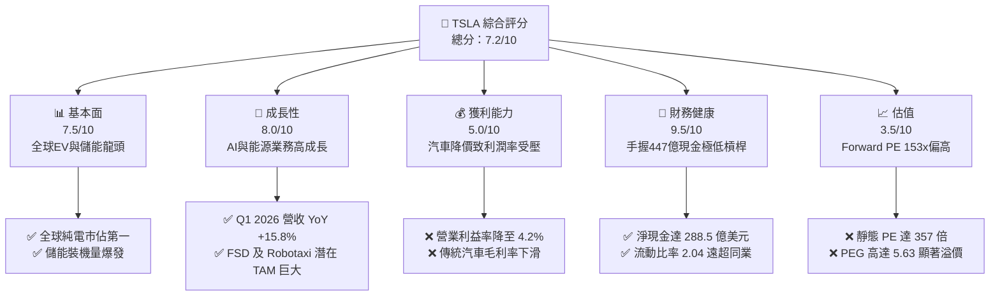

# TSLA 基本面深度分析報告
> **報告日期**：2026-06-10 ｜ **語言**：繁體中文 ｜ **數據來源**：Yahoo Finance, Finviz, StockAnalysis, Roic.ai ｜ **分析師**：CFA 級機構研究

---

## 目錄

| # | 章節 | 核心結論 |
|---|------|----------|
| 1 | 執行摘要 | 評級為「持有（Hold）」，基準目標價 $419.94，高估值與利潤率下行並存。 |
| 2 | 公司概覽與商業模式 | 汽車與儲能雙輪驅動，具備技術與規模護城河，但面臨激烈競爭。 |
| 3 | 損益表深度分析 | TTM 營收達 $97.88B（YoY +15.8%），但營業利益率降至 4.2%，獲利能力受壓。 |
| 4 | 資產負債表分析 | 淨現金高達 $28.85B，流動比率 2.04，財務結構極度穩健。 |
| 5 | 現金流量深度分析 | TTM 自由現金流 $5.25B，資本支出高達 $8.53B，大舉投資 AI 與產能。 |
| 6 | 獲利能力與資本效率 | ROE 降至 4.9%，ROIC (6.9%) 低於 WACC (12.7%)，面臨短期價值摧毀。 |
| 7 | 估值深度分析 | Trailing P/E 357x，Forward P/E 153x，估值處於歷史高位，隱含極高成長預期。 |
| 8 | 成長催化劑 | FSD V12、Robotaxi、Next-Gen 平價平台及 Megapack 儲能業務為核心驅動力。 |
| 9 | 風險矩陣 | 核心風險為價格戰持續、FSD 落地遲滯以及高管關鍵人風險。 |
| 10 | 投資建議 | 建議於 $330-$350 區間分批佈局，聚焦長期 AI 與能源轉型敘事。 |

---

## 1. 執行摘要

### 1.1 核心評分儀表板



### 1.2 評分進度條視覺化

```
╔══════════════════════════════════════════════════════════════╗
║               TSLA 多維度評分儀表板 (1-10分)                 ║
╠══════════════════════════════════════════════════════════════╣
║ 基本面強度  7.5 ▓▓▓▓▓▓▓▓▓▓▓▓▓▓▓░░░░░  ★★★★☆           ║
║ 成長動能    8.0 ▓▓▓▓▓▓▓▓▓▓▓▓▓▓▓▓░░░░  ★★★★☆           ║
║ 獲利品質    5.0 ▓▓▓▓▓▓▓▓▓▓░░░░░░░░░░  ★★★☆☆           ║
║ 財務健康    9.5 ▓▓▓▓▓▓▓▓▓▓▓▓▓▓▓▓▓▓▓░  ★★★★★           ║
║ 估值合理性  3.5 ▓▓▓▓▓▓▓░░░░░░░░░░░░░  ★★☆☆☆           ║
║ 護城河深度  9.0 ▓▓▓▓▓▓▓▓▓▓▓▓▓▓▓▓▓▓░░  ★★★★★           ║
║ 管理層執行  8.0 ▓▓▓▓▓▓▓▓▓▓▓▓▓▓▓▓░░░░  ★★★★☆           ║
║ 技術創新力  9.5 ▓▓▓▓▓▓▓▓▓▓▓▓▓▓▓▓▓▓▓░  ★★★★★           ║
╠══════════════════════════════════════════════════════════════╣
║ 綜合總分    7.2 ▓▓▓▓▓▓▓▓▓▓▓▓▓▓░░░░░░  🏆 持有 (Hold)       ║
╚══════════════════════════════════════════════════════════════╝
```

### 1.3 五大投資論點 + 三大核心風險

| 類型 | 項目 | 具體依據 | 信心度 |
|------|------|----------|--------|
| 🟢 **投資論點①** | **儲能業務（Energy）爆發式成長** | 2025年儲能裝機量大幅增長，能源部門營收佔比持續提升，利潤率優於汽車業務。 | 🟢 極高 |
| 🟢 **投資論點②** | **FSD 與 Robotaxi 的高毛利期權** | FSD V12 採用端到端神經網路，若商業化落地成功，將使 TSLA 轉型為高毛利軟體 SaaS 公司。 | 🟡 中等 |
| 🟢 **投資論點③** | **無與倫比的資產負債表實力** | 擁有 $44.74B 總現金，淨現金達 $28.85B，能支撐每年近百億的 R&D 與 Capex 投入。 | 🟢 極高 |
| 🟢 **投資論點④** | **垂直整合與超大型工廠規模效應** | 透過一體化壓鑄、自研電池及全球超級工廠，TSLA 仍保有全球最優的電動車生產成本結構。 | 🟢 高 |
| 🟢 **投資論點⑤** | **下一代平價車型（Model 2）釋放產能** | 預期於 2026-2027 年推出的 $25,000 平價平台將徹底打開大眾市場（Mass Market）空間。 | 🟡 中等 |
| 🟡 **風險①** | **全球電動車市場價格戰未歇** | 中國市場競爭白熱化（比亞迪等競爭），傳統汽車毛利率（Excluding Credits）持續承壓。 | 🔴 高衝擊 |
| 🔴 **風險②** | **極高估值倍數下的容錯率極低** | Forward P/E 153x 意味著市場已預支了未來數年 FSD 與 Robotaxi 的成功，任何延遲都將引發估值修正。 | 🔴 高衝擊 |
| 🟡 **風險③** | **監管審查與自動駕駛法律瓶頸** | FSD 即使技術成熟，在各國（美、中、歐）的監管審批仍面臨高度不確定性。 | 🟡 中度 |

### 1.4 快速統計卡片

| 指標 | 公司實際值 | 行業均值 (Auto) | S&P 500 均值 | 狀態 |
|------|-------------|----------|--------------|------|
| 收入 YoY 成長 | **15.8%** | ~5.0% | ~6.5% | 🟢 優於同業 |
| 毛利率 | **19.1%** | ~15.0% | ~30.0% | 🟡 行業領先，但自身下滑 |
| 營業利益率 | **4.2%** | ~6.0% | ~12.0% | 🔴 降至歷史低點 |
| ROE | **4.9%** | ~10.0% | ~15.0% | 🔴 資本效率短期惡化 |
| Forward P/E | **152.99x** | ~12.0x | ~21.0x | 🔴 估值極度昂貴 |
| 淨現金 / 總資產 | **20.1%** | 負債累累 | ~5.0% | 🟢 極度健康 |

### 1.5 投資結論

```
╔══════════════════════════════════════════════════════════════════╗
║                    📊 投資結論摘要                               ║
╠══════════════════════════════════════════════════════════════════╣
║  評級：🟡 持有 (Hold)                                            ║
║  當前股價：$382.46 (2026-06-10)                                  ║
║  目標價區間：                                                    ║
║    悲觀情境（價格戰加劇，FSD受阻）：$250.00 (-34.6%)             ║
║    基準情境（汽車回暖，儲能高成長）：$419.94 (+9.8%)             ║
║    樂觀情境（FSD獲監管批准，Robotaxi上路）：$550.00 (+43.8%)     ║
║  投資評分：7.2/10                                                ║
║  適合投資人：長線 AI 與能源轉型信仰者、能承受高波動之成長型投資人 ║
╚══════════════════════════════════════════════════════════════════╝
```

---

## 2. 公司概覽與商業模式

### 2.1 業務結構與收入來源

特斯拉已非單純的汽車製造商，而是集「硬體製造、軟體生態、能源網絡」於一體的科技巨頭。

```mermaid
graph TD
    TSLA["特斯拉集團<br/>市值: $1.44T ｜ TTM營收: $97.88B"]

    AUTO["🚗 汽車部門<br/>營收佔