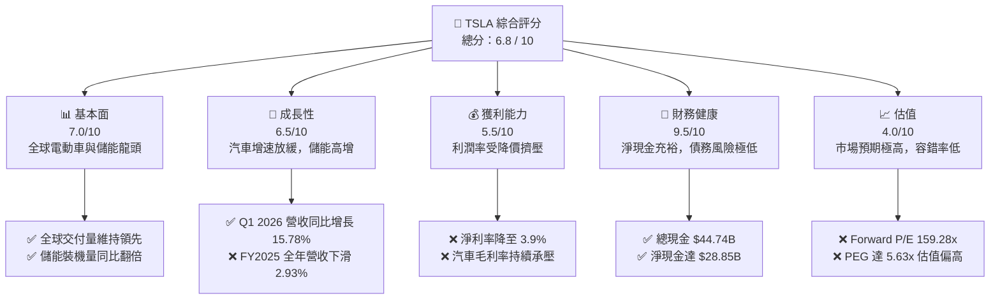

# TSLA 基本面深度分析報告

> **報告日期**：2026-06-11 ｜ **語言**：繁體中文 ｜ **數據來源**：Yahoo Finance, Finviz, StockAnalysis, Roic.ai ｜ **分析師**：CFA 級機構研究

---

## 目錄

| # | 章節 | 核心結論 |
|---|---|---|
| 1 | 執行摘要 | 評級「持有/觀望」，基準目標價 $420.00，預期上行空間 +5.4% |
| 2 | 公司概覽與商業模式 | 汽車與儲能雙輪驅動，以 FSD 與 Dojo 構築極深之軟硬體一體化護城河 |
| 3 | 損益表深度分析 | TTM 營收重回增長（+15.8%），但價格戰致使毛利率降至 19.1%，淨利率降至 3.9% |
| 4 | 資產負債表分析 | 淨現金高達 $28.85B，資產負債表極其強韌，具備抵禦產業週期的絕對實力 |
| 5 | 現金流量深度分析 | TTM FCF 達 $5.25B，資本支出轉向 AI 與儲能（FY25 Capex $8.53B） |
| 6 | 獲利能力與資本效率 | ROE 降至 4.9%，ROIC (6.64%) 低於 WACC (13.14%)，處於高額資本投入的價值過渡期 |
| 7 | 估值深度分析 | Trailing P/E 達 359x，Forward P/E 達 159x，估值溢價高度依賴非汽車業務的變現 |
| 8 | 成長催化劑 | FSD V12 授權、Robotaxi 落地與 Megapack 產能釋放為中長期核心驅動力 |
| 9 | 風險矩陣 | 面臨電動車市場飽和、價格戰持續及 FSD 監管與技術落地延遲等高衝擊風險 |
| 10 | 投資建議 | 適合長線成長型投資人，建議於 $340-$360 區間進行分批左側布局 |

---

## 1. 執行摘要

### 1.1 核心評分儀表板



### 1.2 評分進度條視覺化

```
╔══════════════════════════════════════════════════════════════╗
║               TSLA 多維度評分儀表板 (1-10分)                 ║
╠══════════════════════════════════════════════════════════════╣
║ 基本面強度  7.0 ▓▓▓▓▓▓▓▓▓▓▓▓▓▓░░░░░░  ★★★☆☆           ║
║ 成長動能    6.5 ▓▓▓▓▓▓▓▓▓▓▓▓▓░░░░░░░  ★★★☆☆           ║
║ 獲利品質    5.5 ▓▓▓▓▓▓▓▓▓▓▓░░░░░░░░░  ★★☆☆☆           ║
║ 財務健康    9.5 ▓▓▓▓▓▓▓▓▓▓▓▓▓▓▓▓▓▓▓░  ★★★★★           ║
║ 估值合理性  4.0 ▓▓▓▓▓▓▓▓░░░░░░░░░░░░  ★★☆☆☆           ║
║ 護城河深度  9.0 ▓▓▓▓▓▓▓▓▓▓▓▓▓▓▓▓▓▓░░  ★★★★★           ║
║ 管理層執行  8.0 ▓▓▓▓▓▓▓▓▓▓▓▓▓▓▓▓░░░░  ★★★★☆           ║
║ 技術創新力  9.5 ▓▓▓▓▓▓▓▓▓▓▓▓▓▓▓▓▓▓▓░  ★★★★★           ║
╠══════════════════════════════════════════════════════════════╣
║ 綜合總分    6.8 ▓▓▓▓▓▓▓▓▓▓▓▓▓░░░░░░░  🏆 觀望/持有        ║
╚══════════════════════════════════════════════════════════════╝
```

### 1.3 五大投資論點 + 三大核心風險

| 類型 | 項目 | 具體依據 | 信心度 |
|------|------|----------|--------|
| 🟢 **投資論點①** | **儲能業務步入爆發期** | FY2025 儲能裝機與 Megapack 產能釋放，帶動非汽車營收佔比提升，毛利率結構性改善。 | 🟢 極高 |
| 🟢 **投資論點②** | **資產負債表極其健康** | 持有 **$44.74B** 總現金，淨現金達 **$28.85B**，流動比率 **2.04x**，具備無與倫比的抗風險能力。 | 🟢 極高 |
| 🟢 **投資論點③** | **FSD V12 商業化與技術領先** | 隨著端到端神經網絡技術落地，FSD 授權與 Robotaxi 預期為公司帶來極高毛利的軟體服務收入。 | 🟡 高 |
| 🟢 **投資論點④** | **極致的生產成本控制** | 透過一體化壓鑄（Giga Press）與垂直整合，單車製造成本持續下降，抵禦價格戰。 | 🟢 高 |
| 🟢 **投資論點⑤** | **AI 算力基礎設施護城河** | 持續加大 R&D 投入（TTM 達 **$6.95B**），Dojo 超級電腦與 Nvidia H100/B200 算力集群奠定 AI 龍頭地位。 | 🟡 高 |
| 🟡 **風險①** | **全球電動車需求放緩與價格戰** | 全球 EV 滲透率遭遇瓶頸，比亞迪等中國廠商激烈競爭致使 TSLA 汽車毛利率承壓。 | 🔴 高衝擊 |
| 🔴 **風險②** | **短期估值極度溢價** | 當前 Trailing P/E 達 **359x**，Forward P/E 達 **159x**，若 AI 或 Robotaxi 進度不及預期將面臨劇烈殺估值。 | 🔴 高衝擊 |
| 🔴 **風險③** | **關鍵人物風險 (Key Man Risk)** | Elon Musk 的精力分散於多個實體（X, SpaceX, xAI），且其薪酬方案與股權控制爭議可能引發治理風險。 | 🟡 中度 |

### 1.4 快速統計卡片

| 指標 | 公司實際值 (TTM / 最新) | 行業均值 (汽車製造) | S&P 500 均值 | 狀態 |
|------|-------------|----------|--------------|------|
| 收入 YoY 成長 | **15.8%** | ~5.0% | ~6.5% | 🟢 優於同業 |
| 毛利率 | **19.1%** | ~14.5% | ~30.0% | 🟢 高於傳統車廠 |
| 淨利率 | **3.9%** | ~4.5% | ~11.5% | 🔴 處於歷史低位 |
| ROE | **4.9%** | ~8.0% | ~15.0% | 🔴 資本效率暫時承壓 |
| Forward P/E | **159.28x** | ~10.5x | ~21.5x | 🔴 估值極高溢價 |
| 淨現金規模 | **$28.85B** | -$12.5B (淨債務) | N/A | 🟢 極其強韌 |

### 1.5 投資結論

```
╔══════════════════════════════════════════════════════════════════╗
║                    📊 TSLA 投資結論摘要                          ║
╠════════════════════════════