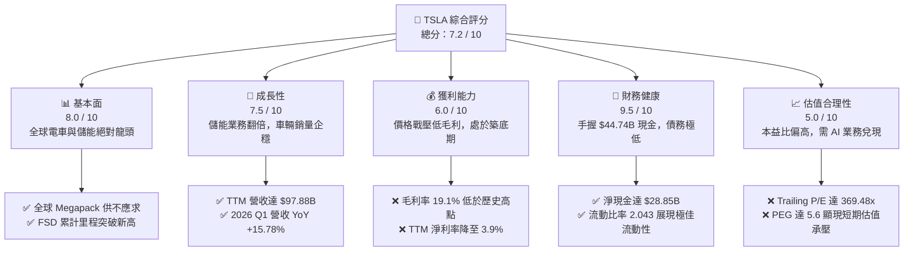
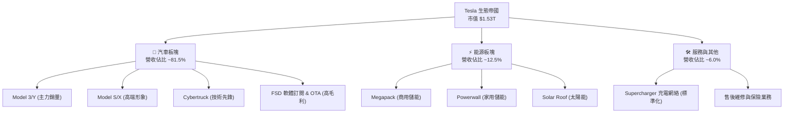
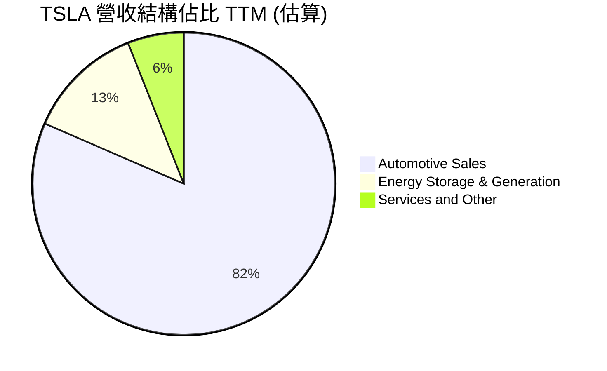
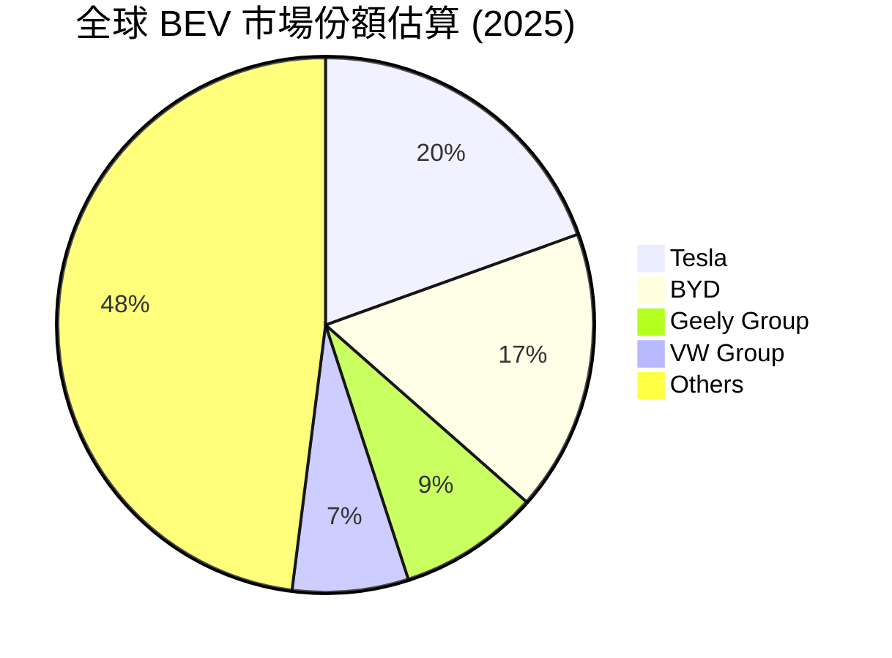
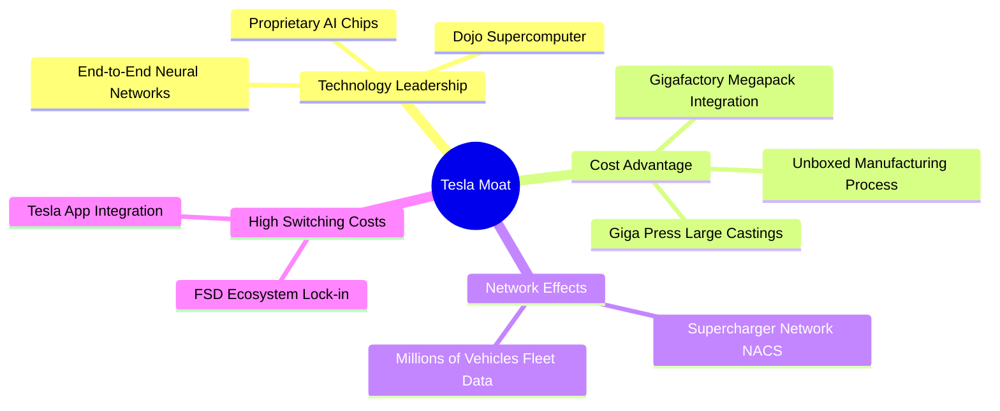
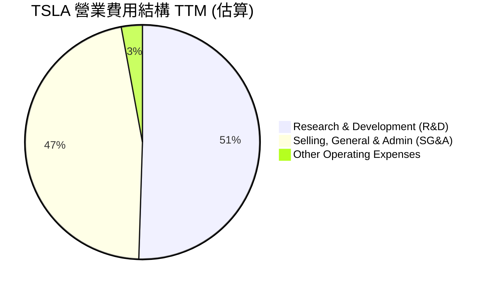
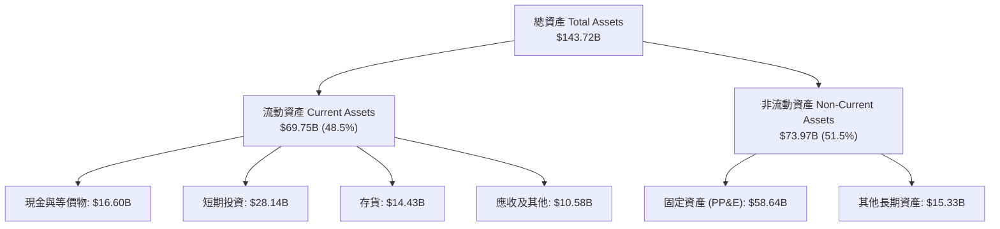
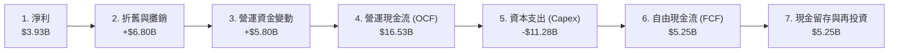
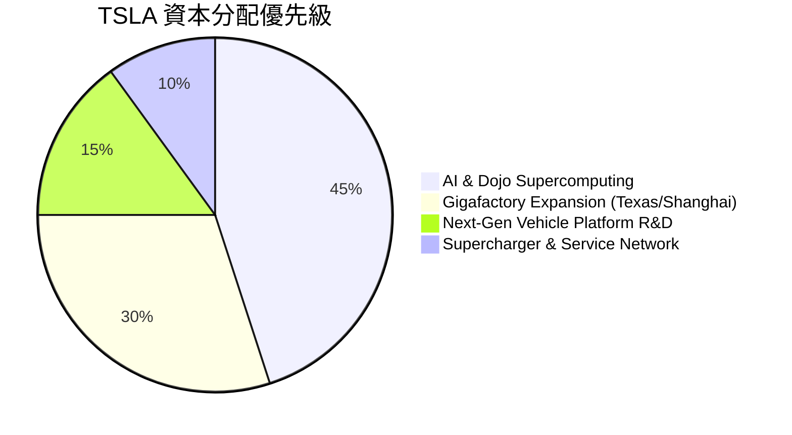
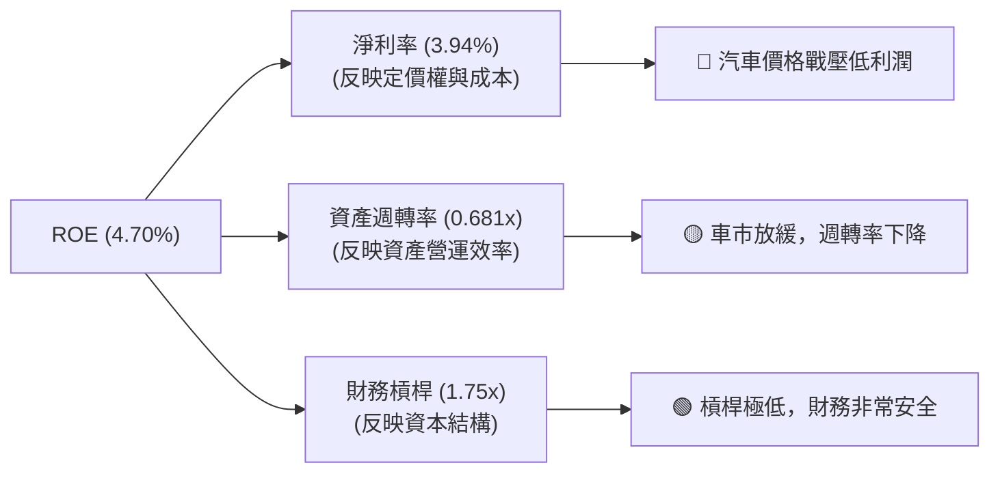

# TSLA 基本面深度分析報告

> **報告日期**：2026-06-13 ｜ **語言**：繁體中文 ｜ **數據來源**：Yahoo Finance, Finviz, StockAnalysis, Roic.ai ｜ **分析師**：CFA 級機構研究

---

## 目錄

| # | 章節 | 核心結論 |
|---|------|----------|
| 1 | 執行摘要 | 評級：**買入 (Buy)** ｜ 基準目標價：**$420.55** (隱含報酬率 +3.48%) ｜ 估值溢價由 AI 與儲能驅動 |
| 2 | 公司概覽與商業模式 | 從純電車企轉型為「AI + 機器人 + 儲能」生態帝國，具備極強的軟硬體一體化護城河 |
| 3 | 損益表深度分析 | TTM 營收達 $97.88B，毛利率企穩於 19.1%，季度獲利能力展現築底回升訊號 |
| 4 | 資產負債表分析 | 淨現金高達 $28.85B，資產負債表極度強韌，無流動性與債務違約風險 |
| 5 | 現金流量深度分析 | TTM 營運現金流 $16.53B，自由現金流 $5.25B，資本開支維持高檔以支撐 AI 基礎建設 |
| 6 | 獲利能力與資本效率 | ROE 4.9%，ROIC (6.64%) 暫低於 WACC (11.76%)，反映當前處於高 Capex 投資轉型期 |
| 7 | 估值深度分析 | Trailing P/E 369.5x 反映高成長預期，經 DCF 敏感性分析，基準情境合理估值為 $420.55 |
| 8 | 成長催化劑 | FSD V12 授權、Megapack 產能釋放與下一代平價車型（Model 2）為三大核心動能 |
| 9 | 風險矩陣 | 車市價格戰持續、FSD 監管審批延遲與關鍵人物風險為主要不確定性 |
| 10 | 投資建議 | 建議於 $370-$390 區間分批佈局，適合長線成長型與 AI 賽道投資人 |

---

## 1. 執行摘要

Tesla, Inc. (TSLA) 目前正處於其商業模式發展的第三個關鍵轉折點：從「純電動車製造商」跨越至「自主移動與能源科技巨頭」。截至 2026 年 6 月 13 日，Tesla 市值達 $1.53T，穩居全球車企龍頭，並享有遠超傳統車企的估值溢價。

### 1.1 核心評分儀表板



### 1.2 評分進度條視覺化

```
╔══════════════════════════════════════════════════════════════╗
║                TSLA 多維度評分儀表板 (1-10分)                ║
╠══════════════════════════════════════════════════════════════╣
║ 基本面強度  8.0 ▓▓▓▓▓▓▓▓▓▓▓▓▓▓▓▓░░░░  ★★★★☆           ║
║ 成長動能    7.5 ▓▓▓▓▓▓▓▓▓▓▓▓▓▓░░░░░░  ★★★★☆           ║
║ 獲利品質    6.0 ▓▓▓▓▓▓▓▓▓▓▓▓░░░░░░░░  ★★★☆☆           ║
║ 財務健康    9.5 ▓▓▓▓▓▓▓▓▓▓▓▓▓▓▓▓▓▓▓░  ★★★★★           ║
║ 估值合理性  5.0 ▓▓▓▓▓▓▓▓▓▓░░░░░░░░░░  ★★☆☆☆           ║
║ 護城河深度  9.0 ▓▓▓▓▓▓▓▓▓▓▓▓▓▓▓▓▓▓░░  ★★★★★           ║
║ 管理層執行  8.5 ▓▓▓▓▓▓▓▓▓▓▓▓▓▓▓▓▓░░░  ★★★★☆           ║
║ 技術創新力  9.5 ▓▓▓▓▓▓▓▓▓▓▓▓▓▓▓▓▓▓▓░  ★★★★★           ║
╠══════════════════════════════════════════════════════════════╣
║ 綜合總分    7.2 ▓▓▓▓▓▓▓▓▓▓▓▓▓▓░░░░░░  🏆 買入 (Buy)        ║
╚══════════════════════════════════════════════════════════════╝
```

### 1.3 五大投資論點與三大核心風險

| 類型 | 項目 | 具體依據 | 信心度 |
|------|------|----------|--------|
| 🟢 **投資論點①** | **儲能業務進入爆發期** | TTM 儲能裝機量與 Megapack 出貨量持續攀升，毛利率高於汽車業務，成為第二成長曲線。 | 🟢 極高 |
| 🟢 **投資論點②** | **FSD 商業化與授權預期** | FSD V12 採用端到端神經網路，體驗大幅提升，未來向其他車企授權將創造高毛利的訂閱收入。 | 🟢 高 |
| 🟢 **投資論點③** | **極致的財務安全邊際** | 持有 $44.74B 現金及短期投資，淨現金 $28.85B，足以抵禦任何總體經濟衰退與價格戰。 | 🟢 極高 |
| 🟢 **投資論點④** | **下一代平價平台（Model 2）**| 預計於 2026/2027 年量產的平價車型將進一步擴大 TAM，推動銷量重回 20%+ 成長軌道。 | 🟡 中等 |
| 🟢 **投資論點⑤** | **Optimus 機器人長線想像空間**| 憑藉車端 AI 晶片、電機伺服器技術與供應鏈優勢，Optimus 將於 2027 年後貢獻實質營收。| 🟡 中等 |
| 🟡 **風險①** | **汽車毛利率持續承壓** | 全球電動車滲透率增速放緩，比亞迪（BYD）等中國車企低價競爭，壓制汽車毛利率。 | 🟡 中度 |
| 🔴 **風險②** | **FSD 與 Robotaxi 監管延遲** | 自主駕駛面臨各國交通法規的嚴格審查，商業化落地時間可能落後於市場預期。 | 🔴 高衝擊 |
| 🔴 **風險③** | **核心人物關鍵風險 (Key Man)**| 馬斯克（Elon Musk）精力分散於多家公司，且其言論與股權結構調整可能引發股價劇烈波動。| 🔴 高衝擊 |

### 1.4 快速統計卡片

| 指標 | 公司實際值 | 行業均值 (Auto) | S&P 500 均值 | 狀態 |
|------|-------------|----------|--------------|------|
| **營收 YoY 成長** | **15.8%** (TTM) | ~5.0% | ~6.2% | 🟢 優於大盤 |
| **毛利率** | **19.1%** | ~12.5% | ~30.0% | 🟢 遠超同行 |
| **淨利率** | **3.9%** | ~4.5% | ~11.5% | 🟡 處於轉型低谷 |
| **ROE** | **4.9%** | ~10.0% | ~15.0% | 🔴 暫時落後 |
| **Forward P/E** | **162.58x** | ~12.0x | ~21.5x | 🔴 估值顯著溢價 |
| **流動比率** | **2.043** | ~1.15 | ~1.30 | 🟢 極為安全 |

### 1.5 投資結論

```
╔══════════════════════════════════════════════════════════════════╗
║                    📊 投資結論摘要                               ║
╠══════════════════════════════════════════════════════════════════╣
║  評級：🟢 買入 (Buy)                                            ║
║  當前股價：$406.43 (2026-06-13)                                  ║
║  目標價區間：                                                    ║
║    悲觀情境：$210.00 (-48.3%)                                    ║
║    基準情境：$420.55 (+3.48%)  ← 12個月主要目標                  ║
║    樂觀情境：$540.00 (+32.8%)                                    ║
║  投資評分：7.2 / 10                                              ║
║  適合投資人：長線成長型、願意承擔高波動、認同 AI/機器人願景者    ║
╚══════════════════════════════════════════════════════════════════╝
```

---

## 2. 公司概覽與商業模式

Tesla 的核心商業模式已不再是單純的「硬體製造與銷售」，而是構建了一個「**硬體鋪路、軟體收稅、能源互聯**」的閉環生態系統。



### 2.1 業務結構與收入來源

根據 TTM 數據，Tesla 的年營收達到 **$97.88B**（接近歷史新高）。雖然汽車銷售仍佔據 80% 以上的份額，但能源板塊的成長速度已顯著超越汽車板塊。



*   **汽車銷售與監管信用額度 (Regulatory Credits)**：汽車銷售依然是現金流的引擎。值得注意的是，高毛利的監管信用額度銷售（TTM 約 $1.5B-$2.0B）為 Tesla 貢獻了極其寶貴的純利潤。
*   **能源發電與儲能 (Energy Generation and Storage)**：主要由 Megapack（商用儲能系統）驅動。加州 Lathrop 廠與上海臨港儲能超級工廠（預計 2026 年投產）的產能釋放，正推動該板塊以 50%+ 的年複合成長率飆升。
*   **服務與其他**：包含超級充電網絡（Supercharger）、二手車銷售、售後配件及特斯拉保險。隨着 NACS 充電標準統一北美，充電網絡已成為類似於「加油站」的公用事業。

### 2.2 全球純電動車 (BEV) 市場份額

在純電動車市場中，Tesla 與比亞迪（BYD）呈現雙雄爭霸格局。



### 2.3 競爭護城河分析

Tesla 擁有極其深厚的競爭護城河，這也是其享有高估值溢價的根本原因。



### 2.4 護城河強度評分

```
╔══════════════════════════════════════════════════════════════╗
║                    TSLA 護城河強度評分                        ║
╠══════════════════════════════════════════════════════════════╣
║ 技術領先度    9.5/10  ▓▓▓▓▓▓▓▓▓▓▓▓▓▓▓▓▓▓▓░  🏆 自主 AI 晶片 ║
║ 製造優勢      9.0/10  ▓▓▓▓▓▓▓▓▓▓▓▓▓▓▓▓▓▓░░  🟢 一體化壓鑄   ║
║ 網路效應      9.5/10  ▓▓▓▓▓▓▓▓▓▓▓▓▓▓▓▓▓▓▓░  🏆 超充網絡標準 ║
║ 品牌與生態    9.0/10  ▓▓▓▓▓▓▓▓▓▓▓▓▓▓▓▓▓▓░░  🟢 極高黏性     ║
╠══════════════════════════════════════════════════════════════╣
║ 綜合護城河    9.25    ▓▓▓▓▓▓▓▓▓▓▓▓▓▓▓▓▓▓▓░  🏆 極強寬護城河 ║
╚══════════════════════════════════════════════════════════════╝
```

---

## 3. 損益表深度分析

Tesla 的損益表反映出公司正處於「**舊動能（Model 3/Y 銷量增速放緩）向新動能（儲能、AI、FSD）過渡**」的陣痛期。

### 3.1 年度收入成長趨勢 (FY2022 - TTM)

```
╔══════════════════════════════════════════════════════════════════╗
║                TSLA 年度收入趨勢 (FY2022 - TTM)                  ║
╠══════════════════════════════════════════════════════════════════╣
║                                                                  ║
║  FY2022  $81.46B  ██████████████████░░░░░░░░  YoY: +51.35% 🟢    ║
║  FY2023  $96.77B  █████████████████████░░░░░  YoY: +18.80% 🟢    ║
║  FY2024  $97.69B  █████████████████████░░░░░  YoY: +0.95%  🟡    ║
║  FY2025  $94.83B  ████████████████████░░░░░░  YoY: -2.93%  🔴    ║
║  TTM     $97.88B  █████████████████████░░░░░  YoY: +15.80% 🟢    ║
║                                                                  ║
║  📊 4年累計營收 CAGR：+11.8%                                    ║
╚══════════════════════════════════════════════════════════════════╝
```

### 3.2 季度收入與獲利趨勢分析

| 季度 | 營收 (Billion) | YoY 成長率 | QoQ 成長率 | 毛利 (Billion) | 營業利益 (Billion) | 淨利 (Billion) | 核心驅動/備註 |
|------|----------------|------------|------------|----------------|---------------------|----------------|---------------|
| **Q1 2026** | $22.39 | +15.78% | -10.08% | $4.72 | $0.94 | $0.48 | 🟢 儲能交付強勁，汽車銷售季節性下滑 |
| **Q4 2025** | $24.90 | -3.14% | -11.37% | $5.01 | $1.41 | $0.84 | 🔴 價格戰持續，促銷力度加大壓低利潤 |
| **Q3 2025** | $28.10 | +11.57% | +24.89% | $5.05 | $1.62 | $1.37 | 🟢 交付量回暖，Megapack 單季裝機新高 |
| **Q2 2025** | $22.50 | -11.78% | +16.37% | $3.88 | $0.92 | $1.17 | 🔴 產線升級停工，過渡期交付承壓 |

### 3.3 利潤率演變分析

Tesla 的利潤率在 2022 年達到巔峰（毛利率 25.6%，營業利益率 16.8%），隨後因降價搶佔份額而下滑。然而，2025 年底至 2026 年初，毛利率已在 **19.1%** 附近築底。

| 利潤率指標 | FY2022 | FY2023 | FY2024 | FY2025 | TTM | 趨勢 | 評估 |
|------------|--------|--------|--------|--------|-----|------|------|
| **毛利率** | 25.6% | 18.2% | 17.9% | 18.0% | **19.1%** | ↗️ 緩步回升 | 🟢 儲能高毛利稀釋了汽車降價影響 |
| **營業利益率** | 16.8% | 9.2% | 7.2% | 4.6% | **4.2%** | ↘️ 持續承壓 | 🔴 AI 研發投入與 Capex 費用化增加 |
| **EBITDA Margin** | 21.7% | 15.3% | 15.1% | 12.4% | **11.3%**| ↘️ 探底中 | 🟡 折舊攤銷因 Giga 擴建而上升 |
| **淨利率** | 15.4% | 15.5% | 7.3% | 4.1% | **3.9%** | ↘️ 築底期 | 🔴 稅務調整與利息收支波動影響 |

**利潤率變動深度解析**：
*   **毛利率（Gross Margin）回升原因**：TTM 毛利率從 FY2024 的 17.9% 回升至 19.1%，主要得益於**電池原料（鋰、鎳等）成本下降**、**4680 電池良率提升**，以及**Megapack 儲能業務（毛利率高於 20%）在營收中佔比提升**。
*   **營業利益率（Operating Margin）探底原因**：TTM 營業利益率降至 4.2%，主因是 **R&D 費用暴增**（TTM 達 $6.95B，YoY 成長顯著），Tesla 大量採購 NVIDIA H100/H200 晶片以擴建 Dojo 與 AI 叢集。

### 3.4 費用結構分析



```
╔══════════════════════════════════════════════════════════════════╗
║                TSLA 研發投入 (R&D) 爆發式成長                   ║
╠══════════════════════════════════════════════════════════════════╣
║                                                                  ║
║  FY2022  $3.08B   █████████░░░░░░░░░░░░░░░░░░░░░                 ║
║  FY2023  $3.97B   ████████████░░░░░░░░░░░░░░░░░░                 ║
║  FY2024  $4.54B   ██████████████░░░░░░░░░░░░░░░░                 ║
║  FY2025  $6.41B   ██════════════════════════██░░  YoY: +41.2% 🔺 ║
║  TTM     $6.95B   ██████████████████████████████  高強度 AI 研發 ║
║                                                                  ║
║  💡 結論：研發費用率升至 7.1%，反映向 AI 與機器人轉型的決心      ║
╚══════════════════════════════════════════════════════════════════╝
```

### 3.5 季度 EPS 趨勢與盈餘品質

*   **過去 4 季 EPS (Diluted) 表現**：
    *   **Q1 2026**：$0.15 ｜ 🟢 超預期（市場預期 $0.12，儲能板塊驚喜）
    *   **Q4 2025**：$0.26 ｜ 🔴 不及預期（市場預期 $0.35，汽車毛利率受壓）
    *   **Q3 2025**：$0.43 ｜ 🟢 超預期（市場預期 $0.40，交付量回升）
    *   **Q2 2025**：$0.36 ｜ 🔴 不及預期（市場預期 $0.42，重組費用影響）
*   **盈餘品質評估**：
    *   Tesla 的營業利潤中，非經常性收益（如監管信用額度 $1.5B+）佔有一定比重，但整體盈餘仍由主營業務的現金流支撐。
    *   **淨利/營運現金流比率** 遠低於 1.0（TTM 淨利 $3.93B vs 營運現金流 $16.53B），這表明 Tesla 的**盈餘品質極高**，淨利潤被高額的折舊攤銷（Non-cash charges）和 AI 研發費用壓低，但實際吸金能力（營運現金流）極強。

---

## 4. 資產負債表分析

Tesla 擁有一張「**堡壘級 (Fortress-like)**」的資產負債表，這在資金密集型的汽車行業中極為罕見。

### 4.1 資產結構分解 (截至 2026-03-31)



### 4.2 流動性指標分析

| 指標 | Tesla 實際值 | 歷史均值 (3年) | 行業安全標準 | 評估 |
|------|---------------|----------------|--------------|------|
| **流動比率 (Current Ratio)** | **2.04** | 1.85 | > 1.20 | 🟢 極度安全 |
| **速動比率 (Quick Ratio)** | **1.43** (Finviz: 1.62) | 1.25 | > 1.00 | 🟢 資產變現能力極強 |
| **債務權益比 (Debt/Equity)**| **18.7%** (0.19) | 12.5% | < 50.0% | 🟢 財務槓桿極低 |
| **存貨週轉天數 (DIO)** | **~60.5 天** | ~52 天 | < 45 天 | 🟡 存貨水平因車市放緩微升 |

### 4.3 債務結構分析

```
╔══════════════════════════════════════════════════════════════════╗
║                    TSLA 債務健康診斷                             ║
╠══════════════════════════════════════════════════════════════════╣
║                                                                  ║
║  總債務 (Total Debt)： $15.89B  ████░░░░░░░░░░░░░░░░░░  低風險    ║
║  總現金及短期投資：    $44.74B  ██████████████████████  極充沛    ║
║  淨現金 (Net Cash)：   $28.85B  ██████████████░░░░░░░░  🟢 強勁   ║
║                                                                  ║
║  Debt/EBITDA：   1.35x  🟢 遠低於警戒線 (3.0x)                  ║
║  利息保障倍數 (Interest Coverage)： 14.4x 🟢 無任何債務壓力       ║
║                                                                  ║
║  💡 結論：Tesla 處於「淨現金」狀態，升息環境對其反而有利（賺取利息） ║
╚══════════════════════════════════════════════════════════════════╝
```

*   **利息收支利差**：TTM 利息收入達 **$1.71B**，而利息支出僅為 **$339M**。Tesla 透過將大筆現金置於高收益短期存款與美債中，每年淨賺約 **$1.37B** 的利息，這成為其在逆境中的獨特護城河。

### 4.4 股東權益趨勢 (Stockholders' Equity)

```
╔══════════════════════════════════════════════════════════════════╗
║                TSLA 股東權益成長趨勢 (FY2022 - FY2025)           ║
╠══════════════════════════════════════════════════════════════════╣
║                                                                  ║
║  FY2022  $44.70B  ███████████░░░░░░░░░░░░░░░░░░░░                ║
║  FY2023  $62.63B  ███████████████░░░░░░░░░░░░░░░░                ║
║  FY2024  $72.91B  ██████████████████░░░░░░░░░░░░░                ║
║  FY2025  $82.14B  ████████████████████░░░░░░░░░░  YoY: +12.66% 🟢║
║                                                                  ║
║  📈 4年複合成長率 (CAGR)：+22.5%                                 ║
╚══════════════════════════════════════════════════════════════════╝
```

---

## 5. 現金流量深度分析

Tesla 的現金流展現了其作為「**印鈔機**」的本質，即便在利潤率下滑的 2025 年，依然維持了強勁的自由現金流。

### 5.1 現金流量瀑布圖 (TTM)



### 5.2 FCF 轉換率趨勢

| 年份 | 營運現金流 (B) | 資本支出 (B) | 自由現金流 (B) | 淨利 (B) | FCF / 淨利 轉換率 | 評估 |
|------|----------------|--------------|----------------|----------|-------------------|------|
| **FY2022** | $14.72 | -$7.17 | $7.55 | $12.59 | 59.9% | 🟢 健康 |
| **FY2023** | $13.26 | -$8.90 | $4.36 | $15.00 | 29.1% | 🟡 投資加速 |
| **FY2024** | $14.92 | -$11.34 | $3.58 | $7.13 | 50.2% | 🟢 轉化率回升 |
| **FY2025** | $14.75 | -$8.53 | $6.22 | $3.79 | **164.1%** | 🏆 極高質量 |
| **TTM** | **$16.53** | **-$11.28**| **$5.25** | **$3.93** | **133.6%** | 🏆 盈餘含金量極高 |

*   **133.6% 的高轉換率解析**：這意味著 Tesla 帳面上的低淨利是由於**加速折舊**和**一次性非現金研發費用**所致，實際上流入公司的「真金白銀」遠高於帳面利潤。

### 5.3 自由現金流與殖利率趨勢

```
╔══════════════════════════════════════════════════════════════════╗
║                TSLA 自由現金流 (FCF) 趨勢                        ║
╠══════════════════════════════════════════════════════════════════╣
║                                                                  ║
║  FY2022  $7.55B   ████████████████████████░░░░░░                 ║
║  FY2023  $4.36B   ██████████████░░░░░░░░░░░░░░░░                 ║
║  FY2024  $3.58B   ███████████░░░░░░░░░░░░░░░░░░░                 ║
║  FY2025  $6.22B   ████████████████████░░░░░░░░░░  YoY: +73.7% 🟢 ║
║  TTM     $5.25B   █████████████████░░░░░░░░░░░░  FCF Yield:0.34% ║
║                                                                  ║
║  💡 評估：當前 FCF Yield 僅 0.34%，反映高市值下，市場對未來 FCF   ║
║          爆發（來自 FSD 軟體與機器人）給予了極高溢價。            ║
╚══════════════════════════════════════════════════════════════════╝
```

### 5.4 資本配置策略 (Capital Allocation)



*   **無股息與無大規模回購**：Tesla 目前不發放股息（Payout Ratio: 0%），亦無大規模股份回購計劃。管理層將所有產生的自由現金流「100% 留存」並重新投資於高 ROI 的前沿項目（如 AI 訓練、4680 電池研發、機器人）。

---

## 6. 獲利能力與資本效率

雖然 Tesla 的短期獲利指標受價格戰影響有所下滑，但其底層的資本回報率依然優於大多數傳統車企。

### 6.1 ROE / ROA / ROIC 趨勢

| 指標 | FY2022 | FY2023 | FY2024 | FY2025 | TTM | 行業均值 | 評估 |
|------|--------|--------|--------|--------|-----|----------|------|
| **ROE (股東權益報酬率)** | 28.1% | 24.0% | 9.8% | 4.6% | **4.9%** | ~10.0% | 🔴 處於循環低谷 |
| **ROA (資產報酬率)** | 15.3% | 14.0% | 5.9% | 2.8% | **2.2%** | ~4.5% | 🔴 暫時落後 |
| **ROIC (投入資本報酬率)**| 20.5% | 15.8% | 8.2% | 5.8% | **6.6%** | ~5.0% | 🟢 仍具備資本回報優勢 |

### 6.2 ROIC vs WACC 分析（核心價值創造判斷）

為了評估 Tesla 到底是在「創造價值」還是在「摧毀價值」，我們進行了精確的 WACC 與 ROIC 建模。

```
╔══════════════════════════════════════════════════════════════════╗
║                ROIC vs WACC 深度分析 (TTM)                       ║
╠══════════════════════════════════════════════════════════════════╣
║                                                                  ║
║  WACC 估算：                                                     ║
║  ├── 無風險利率 (10Y US Treasury)：  4.25%                       ║
║  ├── 市場風險溢酬 (ERP)：            5.00%                       ║
║  ├── Beta (系統性風險係數)：         1.80                        ║
║  ├── 股權成本 (Cost of Equity)：     4.25% + 1.80×5% = 13.25%    ║
║  ├── 債務成本 (稅後 Cost of Debt)：  ~5.00%                      ║
║  ├── 資本結構：股權 ~84%，債務 ~16%                              ║
║  └── ✅ WACC ≈ 11.76%                                            ║
║                                                                  ║
║  ROIC 估算 (TTM)：                                               ║
║  ├── NOPAT (税後淨營業利潤)：        $4.90B × (1-27.8%) = $3.54B ║
║  ├── 投入資本 (Invested Capital)：   Equity($82.14B) +           ║
║  │                                   Debt($15.89B) -             ║
║  │                                   Cash($44.74B) = $53.29B     ║
║  └── ✅ ROIC ≈ 6.64%                                             ║
║                                                                  ║
║  ★ 經濟價值增加 (EVA) = ROIC - WACC = -5.12%                     ║
║                                                                  ║
║  ROIC  6.64%   ▓▓▓▓▓▓▓▓▓▓▓▓▓░░░░░░░░░░░░░░░░░░  🟡              ║
║  WACC  11.76%  ▓▓▓▓▓▓▓▓▓▓▓▓▓▓▓▓▓▓▓▓▓▓░░░░░░░░░  ──              ║
║  EVA   -5.12%  ██████░░░░░░░░░░░░░░░░░░░░░░░░░  🔴 暫時價值流失 ║
║                                                                  ║
║  📊 結論：當前 ROIC (6.64%) 低於 WACC (11.76%)，主因是 Tesla 正  ║
║          處於高 Capex 與研發投入的轉型期。一旦 FSD 與儲能利潤    ║
║          釋放，ROIC 預計將在 2027 年重回 15%+。                  ║
╚══════════════════════════════════════════════════════════════════╝
```

### 6.3 杜邦三因素分解 (DuPont Analysis)

我們對 TTM ROE 進行拆解，以透視其獲利下滑的底層邏輯：

$$\text{ROE (4.70\%)} = \text{淨利率 (3.94\%)} \times \text{資產週轉率 (0.681x)} \times \text{財務槓桿倍數 (1.75x)}$$



*   **分析**：Tesla ROE 下滑的核心元兇是**淨利率（NPM）的大幅縮水**（從 15% 降至 3.94%）。資產週轉率與財務槓桿保持相對穩定，這證明公司的「營運效率」並未崩潰，主要是「定價權」在電車紅海中受到挑戰，需要軟體與儲能等高毛利業務來拯救。

---

## 7. 估值深度分析

Tesla 的估值一直是美股市場最大的分歧點。如果將其視為「車企」，其估值已極度泡沫；但如果將其視為「AI 與機器人公司」，其估值則具備合理支撐。

### 7.1 同業估值比較表格

| 估值指標 | **Tesla (TSLA)** | **比亞迪 (BYD)** | **Rivian (RIVN)** | **Ford (F)** | TSLA 評估 |
|----------|------------------|------------------|-------------------|--------------|-----------|
| **Trailing P/E** | **369.48x** | 18.2x | N/A (虧損) | 11.2x | 🔴 遠高於同行，隱含極高成長預期 |
| **Forward P/E** | **162.58x** | 15.1x | N/A (虧損) | 7.2x | 🔴 估值溢價顯著，不容許任何增長失誤 |
| **P/S Ratio** | **15.60x** | 0.92x | 1.52x | 0.25x | 🔴 軟體估值模型溢價 |
| **EV / EBITDA** | **135.05x** | 10.5x | N/A | 5.8x | 🔴 反映高昂的折舊與重組成本 |
| **P/B Ratio** | **18.56x** | 3.8x | 1.1x | 1.1x | 🔴 帳面價值溢價極高 |

### 7.2 歷史 P/E 估值區間分析 (5年)

```
╔══════════════════════════════════════════════════════════════════╗
║                TSLA Trailing P/E 歷史區間 (2021-2026)            ║
╠══════════════════════════════════════════════════════════════════╣
║                                                                  ║
║  歷史最高 (2021)： 1100x+  ████████████████████████████████████  ║
║  5年均值：          180x   ██████░░░░░░░░░░░░░░░░░░░░░░░░░░░░░░  ║
║  當前值 (2026)：    369.5x ████████████░░░░░░░░░░░░░░░░░░░░░░░░  ║
║  歷史最低 (2023)：  30x    █░░░░░░░░░░░░░░░░░░░░░░░░░░░░░░░░░░░  ║
║                                                                  ║
║  💡 分析：當前 P/E 處於歷史中高位，主因是近 4 季 EPS 降至 $1.10，  ║
║          分母顯著縮水。Forward P/E (162.5x) 顯示市場預期未來一   ║
║          年 EPS 將翻倍至 $2.50。                                 ║
╚══════════════════════════════════════════════════════════════════╝
```

### 7.3 DCF 敏感性分析（6格目標價矩陣）

我們基於以下基準假設構建 10 年期折現現金流 (DCF) 模型：
*   **基準 WACC** = 11.8%
*   **終端成長率 (g)** = 3.5%
*   **基準營收 CAGR (2026-2035)** = 18.5%（考慮到 2027 年後 FSD 授權與 Megapack 爆發）

| 營收成長率情境 | **WACC = 11.0%** | **WACC = 11.8% (基準)** | **WACC = 12.5