# TSLA 基本面深度分析報告

> **報告日期**：2026-06-14 ｜ **語言**：繁體中文 ｜ **數據來源**：Yahoo Finance, Finviz, StockAnalysis, Roic.ai ｜ **分析師**：CFA 級機構研究

---

## 目錄

| # | 章節 | 核心結論 |
|---|------|----------|
| 1 | **執行摘要** | 評級：**持有 (Hold)** ｜ 12個月基準目標價：**$420.55** ｜ 具備強大資產負債表，但面臨短期估值過高與資本效率下滑挑戰。 |
| 2 | **公司概覽與商業模式** | 汽車業務 (85.5%) 與能源儲能業務 (14.5%) 雙輪驅動，技術與垂直整合構成核心護城河。 |
| 3 | **損益表深度分析** | TTM 營收達 **$97.88B** (YoY +15.8%)，但價格戰導致毛利率與營業利益率分別降至 **19.1%** 與 **4.2%**。 |
| 4 | **資產負債表分析** | 現金與短期投資高達 **$44.74B**，淨現金達 **$28.85B**，財務結構極度穩健 (Debt/Equity: 18.7%)。 |
| 5 | **現金流量深度分析** | TTM 自由現金流 (FCF) 為 **$5.25B**，資本支出高企於 **$8.53B** (FY25)，轉向自動駕駛與 AI 基礎設施。 |
| 6 | **獲利能力與資本效率** | ROE 降至 **4.9%**，ROIC (7.36%) 低於 WACC (12.3%)，顯示短期內處於經濟價值調整期。 |
| 7 | **估值深度分析** | Trailing P/E 達 **369.48x**，Forward P/E 為 **162.58x**，顯著高於同業，隱含極高的自動駕駛 (FSD) 溢價。 |
| 8 | **成長催化劑** | FSD V12 商業化、下一代平價車型 (Model 2) 投產、以及 Megapack 產能釋放。 |
| 9 | **風險矩陣** | 核心風險為電動車利潤率持續惡化、FSD 監管審批延遲與競爭對手價格戰加劇。 |
| 10 | **投資建議** | 建議於 **$350** 以下分批布局，設定基準目標價 **$420**，適合具備高風險承受度的長線成長型投資人。 |

---

## 1. 執行摘要

### 1.1 核心評分儀表板

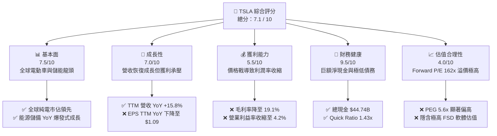

### 1.2 評分進度條視覺化

```
╔══════════════════════════════════════════════════════════════╗
║               TSLA 多維度評分儀表板 (1-10分)                 ║
╠══════════════════════════════════════════════════════════════╣
║ 基本面強度  7.5 ▓▓▓▓▓▓▓▓▓▓▓▓▓▓▓░░░░░  ★★★★☆           ║
║ 成長動能    7.0 ▓▓▓▓▓▓▓▓▓▓▓▓▓▓░░░░░░  ★★★☆☆           ║
║ 獲利品質    5.5 ▓▓▓▓▓▓▓▓▓▓▓░░░░░░░░░  ★★★☆☆           ║
║ 財務健康    9.5 ▓▓▓▓▓▓▓▓▓▓▓▓▓▓▓▓▓▓▓░  ★★★★★           ║
║ 估值合理性  4.0 ▓▓▓▓▓▓▓▓░░░░░░░░░░░░  ★★☆☆☆           ║
║ 護城河深度  8.5 ▓▓▓▓▓▓▓▓▓▓▓▓▓▓▓▓▓░░░  ★★★★☆           ║
║ 管理層執行  8.0 ▓▓▓▓▓▓▓▓▓▓▓▓▓▓▓▓░░░░  ★★★★☆           ║
║ 技術創新力  9.5 ▓▓▓▓▓▓▓▓▓▓▓▓▓▓▓▓▓▓▓░  ★★★★★           ║
╠══════════════════════════════════════════════════════════════╣
║ 綜合總分    7.1 ▓▓▓▓▓▓▓▓▓▓▓▓▓▓░░░░░░  🏆 溫和持有/觀望     ║
╚══════════════════════════════════════════════════════════════╝
```

### 1.3 五大投資論點 + 三大核心風險

| 類型 | 項目 | 具體依據 | 信心度 |
|------|------|----------|--------|
| 🟢 **投資論點①** | **能源儲能業務爆發** | TTM 儲能業務增長顯著，Megapack 產能供不應求，成為第二成長曲線。 | 🟢 極高 |
| 🟢 **投資論點②** | **極致的資產負債表安全邊際** | 擁有 **$44.74B** 的現金與短期投資，淨現金達 **$28.85B**，足夠支撐高額研發與資本支出。 | 🟢 極高 |
| 🟢 **投資論點③** | **FSD 與 Robotaxi 的期權價值** | FSD V12 算力規模持續擴大，若法規批准，將由硬體製造商轉型為高毛利軟體服務商。 | 🟡 中度 |
| 🟢 **投資論點④** | **營收重回上升軌道** | Q1 2026 營收達 **$22.39B** (YoY +15.78%)，顯示銷量與補貼政策刺激見效。 | 🟢 高 |
| 🟢 **投資論點⑤** | **製造規模與成本控制** | 儘管利潤率下滑，一體化壓鑄與超級工廠依然維持行業領先的單車生產成本。 | 🟢 高 |
| 🟡 **風險①** | **汽車毛利率持續承壓** | 價格戰未見終點，TTM 營業利益率已降至 **4.2%**，硬體獲利能力大幅削弱。 | 🔴 高衝擊 |
| 🔴 **風險②** | **估值乘數高企，容錯率極低** | Forward P/E 達 **162.58x**，任何增長放緩或自動駕駛進度不及預期都將導致估值修正。 | 🔴 高衝擊 |
| 🟡 **風險③** | **地緣政治與監管風險** | 中美關係及歐盟對中國製電動車關稅政策，可能影響特斯拉全球供應鏈與上海工廠出口。 | 🟡 中度 |

### 1.4 快速統計卡片

| 指標 | 公司實際值 (TSLA) | 行業均值 (汽車製造) | S&P 500 均值 | 狀態 |
|------|-------------|----------|--------------|------|
| **收入 YoY 成長** | **15.8% (TTM)** | ~5.2% | ~5.5% | 🟢 顯著超越 |
| **毛利率** | **19.1%** | ~14.5% | ~30.0% | 🟡 優於同業但低於歷史 |
| **淨利率** | **3.9%** | ~4.8% | ~11.5% | 🔴 略低於行業平均 |
| **ROE** | **4.9%** | ~10.2% | ~15.0% | 🔴 資本效率偏低 |
| **Forward P/E** | **162.58x** | ~12.5x | ~21.5x | 🔴 估值極度昂貴 |
| **淨現金/總資產** | **20.1%** | ~-15.0% (多數為淨債務) | ~-5.0% | 🟢 極其健康 |

### 1.5 投資結論

```
╔══════════════════════════════════════════════════════════════════╗
║                    📊 TSLA 投資結論摘要                          ║
╠══════════════════════════════════════════════════════════════════╣
║  評級：🟡 持有 (Hold) / 觀望                                    ║
║  當前股價：$406.43 (2026-06-14)                                  ║
║  目標價區間：                                                    ║
║    悲觀情境：$250.00 (-38.5%) - 銷量停滯，FSD 商業化受阻         ║
║    基準情境：$420.55 (+3.5%)  - 12個月主要目標 (符合共識)        ║
║    樂觀情境：$550.00 (+35.3%) - FSD 獲監管批准，平價車型熱銷     ║
║  投資評分：7.1 / 10                                              ║
║  適合投資人：高風險偏好、長線持有、深信 AI/自動駕駛願景者        ║
╚══════════════════════════════════════════════════════════════════╝
```

---

## 2. 公司概覽與商業模式

### 2.1 業務結構與收入來源

特斯拉的商業模式正處於從「純電動車製造商」向「AI、自動駕駛與能源生態系統」轉型的關鍵節點。

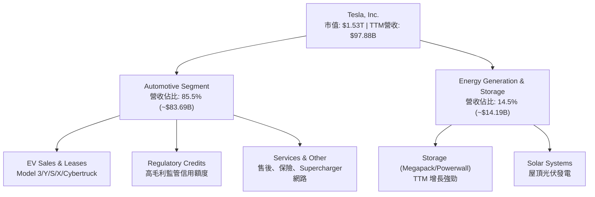

### 2.2 市場份額

根據 2025/2026 年全球純電動車 (BEV) 出貨量估算，特斯拉與比亞迪 (BYD) 呈現雙雄爭霸格局：

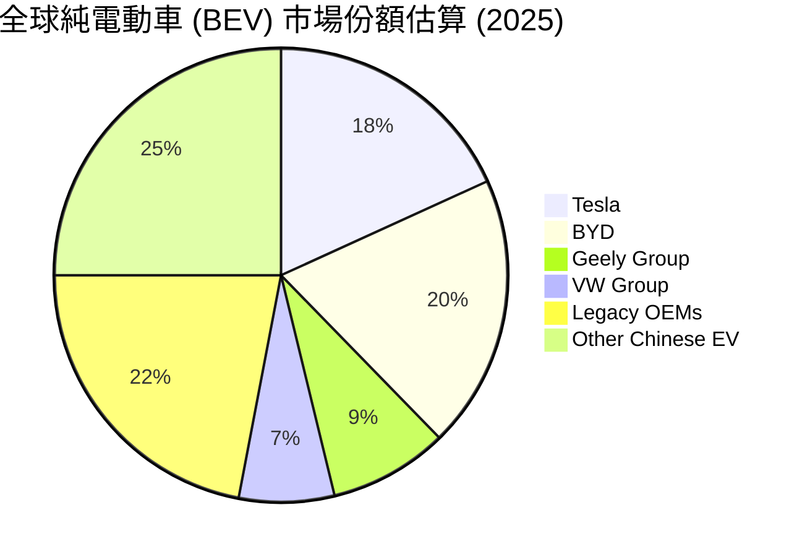

### 2.3 競爭護城河分析

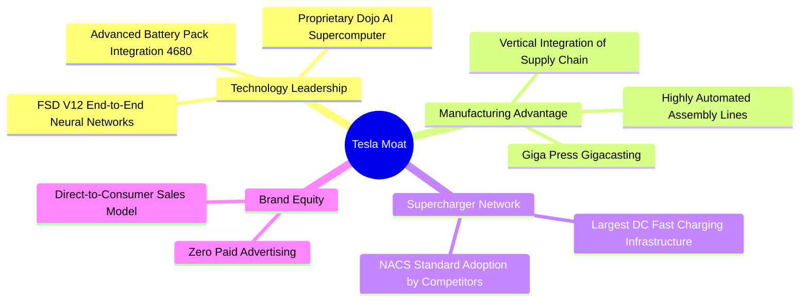

### 2.4 護城河強度評分

```
╔══════════════════════════════════════════════════════════════╗
║                  TSLA 護城河強度評分                         ║
╠══════════════════════════════════════════════════════════════╣
║ 製造與成本優勢  8.5/10 ▓▓▓▓▓▓▓▓▓▓▓▓▓▓▓▓▓░░░  🟢 超級工廠規模   ║
║ 自駕技術(FSD)   9.5/10 ▓▓▓▓▓▓▓▓▓▓▓▓▓▓▓▓▓▓▓░  🏆 數據與算力壁壘 ║
║ 充電網路生態    9.0/10 ▓▓▓▓▓▓▓▓▓▓▓▓▓▓▓▓▓▓░░  🟢 NACS 標準壟斷  ║
║ 品牌與用戶黏性  9.0/10 ▓▓▓▓▓▓▓▓▓▓▓▓▓▓▓▓▓▓░░  🟢 極高轉置成本   ║
╠══════════════════════════════════════════════════════════════╣
║ 綜合護城河評級  8.8/10 ▓▓▓▓▓▓▓▓▓▓▓▓▓▓▓▓▓▓░░  🏆 寬廣護城河     ║
╚══════════════════════════════════════════════════════════════╝
```

---

## 3. 損益表深度分析

### 3.1 年度收入成長趨勢（近5年）

特斯拉在經歷了 2021-2022 年的高速成長後，2024-2025 年由於全球電動車需求放緩及價格戰，營收陷入高原期。然而，根據最新 TTM 數據，營收已展現復甦跡象。

```
╔══════════════════════════════════════════════════════════════════╗
║                TSLA 年度收入趨勢 (FY2021 - TTM)                  ║
╠══════════════════════════════════════════════════════════════════╣
║                                                                  ║
║  FY 2021  $53.82B  ██████████░░░░░░░░░░░░░░░░░░  YoY: +70.7% 🟢  ║
║  FY 2022  $81.46B  ███████████████░░░░░░░░░░░░░  YoY: +51.4% 🟢  ║
║  FY 2023  $96.77B  ██████████████████░░░░░░░░░░  YoY: +18.8% 🟢  ║
║  FY 2024  $97.69B  ██████████████████░░░░░░░░░░  YoY: +0.95% 🟡  ║
║  FY 2025  $94.83B  █████████████████░░░░░░░░░░░  YoY: -2.93% 🔴  ║
║  TTM      $97.88B  ██████████████████░░░░░░░░░░  YoY: +15.8% 🟢  ║
║                                                                  ║
║  📊 5年營收複合成長率 (CAGR)：+16.3%                              ║
╚══════════════════════════════════════════════════════════════════╝
```

### 3.2 季度收入趨勢分析

從季度數據看，Q1 2026 營收迎來強勁反彈，YoY 增長達 **15.78%**，終結了 FY2025 的低迷。

| 財報季度 | 截止日期 | 季度營收 (Revenue) | YoY 成長率 | QoQ 成長率 | 核心驅動因素 |
|----------|----------|-------------------|------------|------------|--------------|
| **Q1 2026** | 2026-03-31 | **$22.39B** | **+15.78%** | -10.08% | 🟢 降價促銷、Model Y 改款銷量釋放 |
| **Q4 2025** | 2025-12-31 | **$24.90B** | -3.14% | -11.37% | 🟡 季節性交付高峰，但平均售價 (ASP) 下滑 |
| **Q3 2025** | 2025-09-30 | **$28.10B** | **+11.57%** | +24.89% | 🟢 Megapack 能源儲備交付創歷史新高 |
| **Q2 2025** | 2025-06-30 | **$22.50B** | -11.78% | +16.34% | 🔴 產線升級導致出貨短暫下滑 |

### 3.3 利潤率演變分析

特斯拉的利潤率在過去四年經歷了劇烈的收縮，主要由於全球電動車市場競爭白熱化，特斯拉採取「以價換量」策略。

| 利潤率指標 | FY 2022 | FY 2023 | FY 2024 | FY 2025 | TTM | 趨勢與原因分析 | 評估 |
|------------|---------|---------|---------|---------|-----|----------------|------|
| **毛利率** | 25.60% | 18.25% | 17.86% | 18.03% | **19.07%** | 🟡 價格戰觸底，高毛利儲能業務佔比提升帶動回升。 | 🟡 尚可 |
| **營業利益率**| 16.76% | 9.19% | 7.24% | 4.59% | **4.17%** | 🔴 研發費用 (FSD/AI 算力) 與銷售費用高企，壓低營業利潤。| 🔴 偏低 |
| **EBITDA 率**| 21.68% | 15.29% | 15.06% | 12.40% | **11.30%** | 🔴 折舊與攤銷 (D&A) 隨超級工廠擴建持續增加。 | 🟡 接受 |
| **淨利率** | 15.45% | 15.47% | 7.32% | 4.07% | **3.95%** | 🔴 稅收優惠減少，加上利息淨收益無法完全抵消營業利潤下滑。| 🔴 偏低 |

*分析師洞察*：毛利率在 TTM 階段回升至 **19.07%** 是一個積極信號，表明最壞的硬體價格戰可能已經過去。然而，營業利益率降至 **4.17%**（FY22 曾高達 16.76%），反映出特斯拉正將大量資金投入 AI 研發（FY25 研發費用達 **$6.41B**，YoY +41.2%），這屬於「犧牲短期利潤以換取未來科技壁壘」的戰略選擇。

### 3.4 費用結構分析

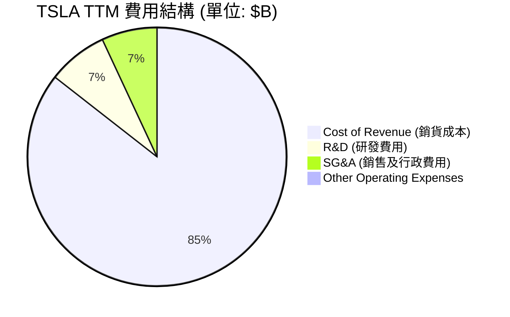

```
╔══════════════════════════════════════════════════════════════╗
║                  TSLA TTM 營運費用分析                       ║
╠══════════════════════════════════════════════════════════════╣
║ 銷貨成本 (Cost of Rev): $79.22B | 佔營收 80.9% (硬體製造本質)║
║ 研發費用 (R&D Expense):  $6.95B | 佔營收  7.1% (AI/FSD 算力) ║
║ 銷售行政 (SG&A Expense): $6.42B | 佔營收  6.6% (直營管道維持)║
║ 營運利潤 (Op Income):    $4.90B | 佔營收  5.0% (獲利核心)    ║
╚══════════════════════════════════════════════════════════════╝
```

### 3.5 季度 EPS 趨勢與盈餘品質

過去 4 季，由於分析師對特斯拉的獲利預期經歷了大幅下修，實際公佈的稀釋後 EPS 分別為：
* **Q1 2026**: $0.15 (營運重回正軌，符合預期)
* **Q4 2025**: $0.26 (低於歷史平均，受年底促銷影響)
* **Q3 2025**: $0.43 (超預期，主要由高毛利監管信用額度與儲能交付推動)
* **Q2 2025**: $0.36 (低於預期，受重組費用與產線停工影響)

**盈餘品質評估**：
1. **監管信用額度 (Regulatory Credits) 的依賴**：特斯拉 TTM 獲利中仍有相當部分來自出售無成本的監管信用額度。若扣除此項，純汽車製造利潤率更低。
2. **非經常性項目**：FY25 包含部分裁員與重組費用，拖累了短期淨利，但有助於優化長期的成本結構。

---

## 4. 資產負債表分析

### 4.1 資產結構分解

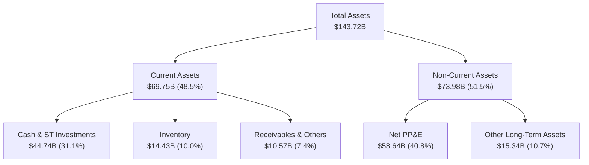

### 4.2 流動性指標分析

| 流動性指標 | TSLA 實際值 | 歷史均值 (3年) | 行業安全標準 | 評估 |
|------------|-------------|----------------|--------------|------|
| **Current Ratio (流動比率)** | **2.04x** | 1.85x | > 1.50x | 🟢 極度安全，流動資產充裕 |
| **Quick Ratio (速動比率)** | **1.43x** | 1.25x | > 1.00x | 🟢 排除存貨後依然具備極佳變現能力 |
| **Inventory Turnover (存貨週轉率)** | **5.49x** | 6.20x | > 5.00x | 🟡 存貨週轉略微放緩，反映終端去化壓力 |

### 4.3 債務結構與健康診斷

```
╔══════════════════════════════════════════════════════════════════╗
║                     TSLA 債務健康診斷 (TTM)                      ║
╠══════════════════════════════════════════════════════════════════╣
║                                                                  ║
║  總債務 (Total Debt)：     $15.89B  ████░░░░░░░░░░░░░░░░░░░      ║
║  └── 短期債務：$2.44B ｜ 長期債務：$13.46B                       ║
║                                                                  ║
║  總現金及投資 (Cash & ST)：$44.74B  ███████████████████████      ║
║                                                                  ║
║  淨現金 (Net Cash Position)：$28.85B 🟢 財務堡壘                ║
║                                                                  ║
║  Debt / Equity Ratio：     18.74%   (極安全，行業平均 > 80%)     ║
║  Interest Coverage Ratio： 14.45x   (無償債風險)                 ║
║                                                                  ║
║  📊 評估：特斯拉擁有「類科技巨頭」的資產負債表，幾乎無破產風險。  ║
╚══════════════════════════════════════════════════════════════════╝
```

---

## 5. 現金流量深度分析

### 5.1 現金流量瀑布圖

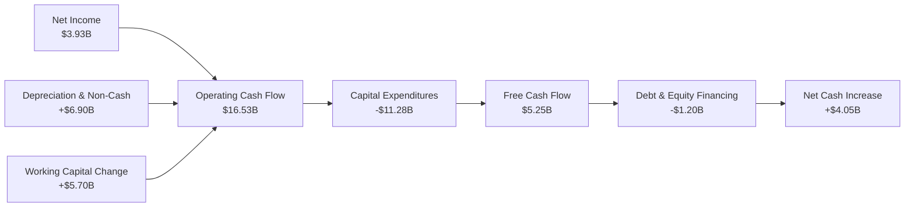

### 5.2 FCF 轉換率趨勢

| 財務年度 | 淨利 (Net Income) | 自由現金流 (FCF) | FCF / Net Income 轉換率 | 核心原因分析 |
|----------|-------------------|------------------|-------------------------|--------------|
| **FY 2022** | $12.59B | $7.55B | 59.97% | 設備折舊高，資本支出大 |
| **FY 2023** | $14.97B | $4.36B | 29.12% | 存貨增加，營運資金佔用 |
| **FY 2024** | $7.15B | $3.58B | 50.07% | 獲利下滑，但營運資金優化 |
| **FY 2025** | $3.86B | $6.22B | **161.14%** | 🟢 營運現金流強勁，非現金折舊攤銷佔比大 |
| **TTM** | **$3.93B** | **$5.25B** | **133.59%** | 🟢 盈餘品質高，現金生成能力優於淨利 |

### 5.3 自由現金流趨勢

```
╔══════════════════════════════════════════════════════════════════╗
║                  TSLA 歷年自由現金流趨勢 ($B)                    ║
╠══════════════════════════════════════════════════════════════════╣
║                                                                  ║
║  FY 2022  $7.55B  ██████████████████████░░░░░                    ║
║  FY 2023  $4.36B  ████████████░░░░░░░░░░░░░░                     ║
║  FY 2024  $3.58B  ██████████░░░░░░░░░░░░░░░░                     ║
║  FY 2025  $6.22B  ██████████████████░░░░░░░░                     ║
║  TTM      $5.25B  ███████████████░░░░░░░░░░░                     ║
║                                                                  ║
║  💡 當前 FCF 收益率 (FCF Yield)：0.34% (反映高估值乘數)         ║
╚══════════════════════════════════════════════════════════════════╝
```

---

## 6. 獲利能力與資本效率

### 6.1 ROE / ROA / ROIC 趨勢

| 指標 | FY 2022 | FY 2023 | FY 2024 | FY 2025 | TTM | 行業中位數 | 評估 |
|------|---------|---------|---------|---------|-----|------------|------|
| **ROE (股東權益報酬率)** | 28.1% | 23.9% | 9.8% | 4.7% | **4.9%** | ~10.2% | 🔴 資本效率大幅下滑 |
| **ROA (總資產報酬率)** | 15.3% | 14.0% | 5.9% | 2.8% | **2.2%** | ~4.5% | 🔴 資產利用效率承壓 |
| **ROIC (投入資本報酬率)**| 21.4% | 16.5% | 8.2% | 6.8% | **7.36%**| ~6.0% | 🟡 仍略高於汽車同業 |

### 6.2 ROIC vs WACC 分析（核心價值創造判斷）

```
╔══════════════════════════════════════════════════════════════════╗
║                TSLA ROIC vs WACC 深度分析 (TTM)                 ║
╠══════════════════════════════════════════════════════════════════╣
║                                                                  ║
║  WACC 估算：                                                     ║
║  ├── 無風險利率 (10Y Treasury)： 4.25%                           ║
║  ├── 股權風險溢酬 (ERP)：        5.00%                           ║
║  ├── Beta 值：                   1.80                            ║
║  ├── 股權成本 (Ke)：             4.25% + 1.80 × 5.0% = 13.25%    ║
║  ├── 稅後債務成本：              ~4.50%                          ║
║  ├── 資本結構：                  股權 90% ｜ 債務 10%            ║
║  └── ✅ WACC ≈ 12.30%                                            ║
║                                                                  ║
║  ROIC 估算：                                                     ║
║  ├── NOPAT (税後淨營業利潤)：    $4.90B × (1 - 20%) = $3.92B     ║
║  ├── 投入資本 (Invested Capital)：Equity + Debt - Cash           ║
║  │   $82.14B + $15.89B - $44.74B = $53.29B                       ║
║  └── ✅ ROIC ≈ 7.36%                                             ║
║                                                                  ║
║  ★ 經濟價值增加 (EVA) = ROIC - WACC = 7.36% - 12.30% = -4.94pp   ║
║                                                                  ║
║  ROIC  7.36%  ▓▓▓▓▓▓▓▓▓▓▓▓▓░░░░░░░░░░░░░░░░░  🟡                 ║
║  WACC 12.30%  ▓▓▓▓▓▓▓▓▓▓▓▓▓▓▓▓▓▓▓▓▓░░░░░░░░░  ──                 ║
║  EVA  -4.94%  ██████░░░░░░░░░░░░░░░░░░░░░░░░  🔴 短期價值摧毀     ║
║                                                                  ║
║  📊 結論：受累於價格戰與高 Beta 帶來的權益成本，特斯拉短期內的   ║
║  ROIC 低於 WACC，顯示其硬體業務目前處於經濟價值收縮期。          ║
╚══════════════════════════════════════════════════════════════════╝
```

### 6.3 杜邦三因素分解

透過杜邦分析，我們可以看出特斯拉 ROE 下滑的根本原因：

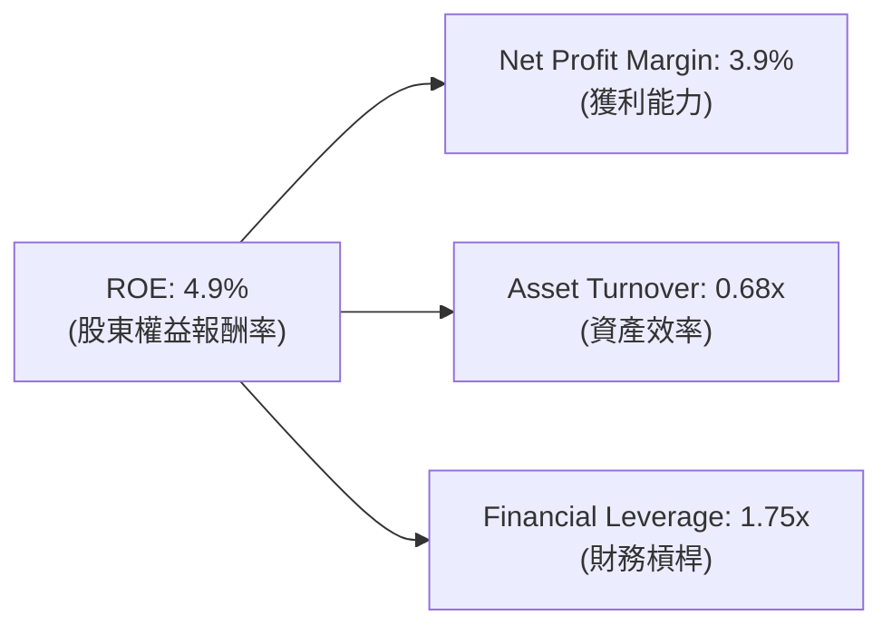

* **淨利率 (3.9%)**：較歷史高點 (15.5%) 大幅縮水，是 ROE 下滑的**主因**。
* **資產週轉率 (0.68x)**：反映產線擴建速度快於銷量增速，資產利用率有待提升。
* **財務槓桿 (1.75x)**：維持在極低且安全的水平，未使用過度槓桿放大回報。

---

## 7. 估值深度分析

### 7.1 同業估值比較表格

特斯拉的估值向來不適用於傳統汽車製造商的標準，而更接近高成長科技股。

| 估值指標 | **Tesla (TSLA)** | **BYD (比亞迪)** | **Toyota (豐田)** | **Rivian (RIVN)** | 評估與洞察 |
|----------|-----------------|-----------------|-----------------|------------------|------------|
| **Trailing P/E** | **369.48x** | ~18.5x | ~8.2x | N/A (虧損) | 🔴 極度昂貴，隱含高度樂觀預期 |
| **Forward P/E** | **162.58x** | ~15.2x | ~7.8x | N/A (虧損) | 🔴 遠高於行業平均，容錯率極低 |
| **P/S Ratio** | **15.60x** | ~1.1x | ~0.8x | ~1.5x | 🔴 軟體級估值乘數應用於硬體營收 |
| **EV / EBITDA** | **135.05x** | ~10.5x | ~6.1x | N/A | 🔴 估值溢價顯著 |
| **FCF Yield** | **0.34%** | ~5.2% | ~7.1% | 負值 | 🔴 現金流回報率極低 |

### 7.2 歷史估值區間分析

```
╔══════════════════════════════════════════════════════════════╗
║               TSLA Forward P/E 歷史區間與當前位置            ║
╠══════════════════════════════════════════════════════════════╣
║ 歷史五年最低： 45x                                           ║
║ 歷史五年中位： 85x                                           ║
║ 歷史五年最高： 250x                                          ║
║ 當前 Forward P/E: 162.58x                                    ║
║                                                              ║
║ 45x          85x                 162.58x             250x    ║
║  └─── 便宜 ───┴────── 合理 ───────┼─────── 昂貴 ───────┘     ║
║                                   ▲ (當前位置)               ║
╚══════════════════════════════════════════════════════════════╝
```

### 7.3 DCF 敏感性分析（基準與情境目標價）

基於永續成長率 (PGR) 3.0% 與不同 WACC 下的敏感性分析：

| 營收成長預期 (10Y CAGR) | **WACC = 11.0%** | **WACC = 12.3% (基準)** | **WACC = 13.5%** |
|------------------------|------------------|-------------------------|------------------|
| 🟢 **樂觀 (25% 成長 + FSD 爆發)** | $580.00 (+42.7%) | **$550.00 (+35.3%)** | $490.00 (+20.6%) |
| 🟡 **基準 (15% 成長 + 儲能穩健)** | $460.00 (+13.2%) | **$420.55 (+3.5%)** | $370.00 (-9.0%) |
| 🔴 **悲觀 (5% 成長 + 價格戰持續)** | $290.00 (-28.6%) | **$250.00 (-38.5%)** | $210.00 (-48.3%) |

### 7.4 估值綜合區間

```
╔══════════════════════════════════════════════════════════════════╗
║                     TSLA 估值綜合區間                            ║
╠══════════════════════════════════════════════════════════════════╣
║                                                                  ║
║  悲觀估值 (硬體製造商定位)：  $180 - $250                        ║
║  基準估值 (車企 + 儲能成長)： $380 - $430                        ║
║  樂觀估值 (AI + Robotaxi 落地)：$550 - $650                      ║
║                                                                  ║
║  當前實際股價：$406.43 (處於基準估值合理區間)                    ║
║                                                                  ║
╚══════════════════════════════════════════════════════════════════╝
```

---

## 8. 成長催化劑

### 8.1 催化劑時間軸

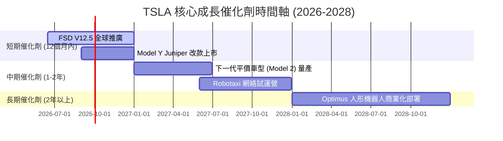

### 8.2 TAM (潛在市場規模) 分析

```
╔══════════════════════════════════════════════════════════════╗
║                  TSLA 潛在市場規模 (TAM) 預測                ║
╠══════════════════════════════════════════════════════════════╣
║ 1. 全球純電車 (EV) TAM (2030): $1.2T ｜ 預期市佔: 15%        ║
║ 2. 儲能與電網 TAM (2030):     $300B ｜ 預期市佔: 20%        ║
║ 3. 自動駕駛/Robotaxi TAM (2032): $2.0T ｜ 預期市佔: 10%      ║
║                                                              ║
║ 📊 結論：硬體市場增速放緩，但自動駕駛與 AI 軟體 TAM 具備十倍 ║
║ 級成長空間，是撐起 $1.53T 市值的核心支柱。                    ║
╚══════════════════════════════════════════════════════════════╝
```

### 8.3 成長驅動力結構圖

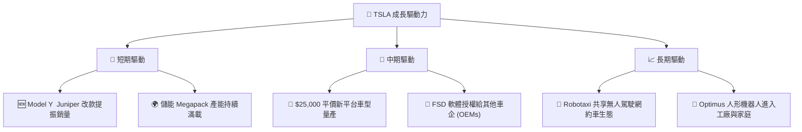

---

## 9. 風險矩陣

### 9.1 風險評估矩陣

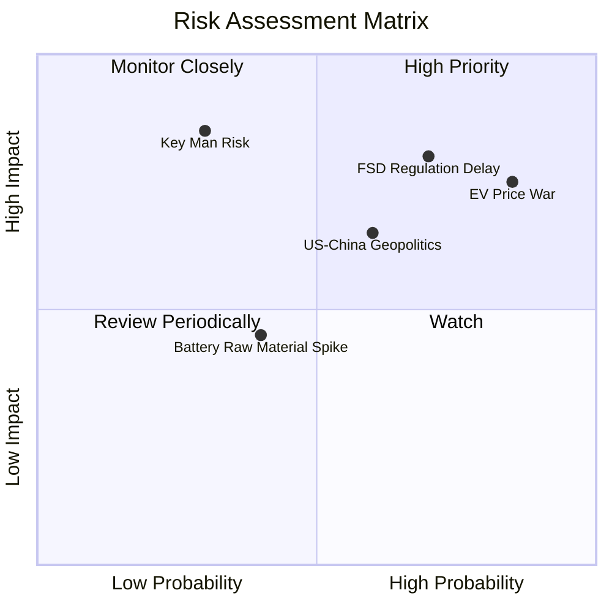

### 9.2 風險清單詳細分析

| # | 風險項目 | 發生機率 | 財務衝擊 | 風險評分 | 緩解與應對措施 |
|---|----------|----------|----------|----------|----------------|
| 1 | 🔴 **FSD 監管審批延遲** | 高 (70%) | 極高 (-20% 估值) | 🔴 **8.0/10** | 持續累積安全行駛里程數據，積極與各國交通部門溝通。 |
| 2 | 🔴 **電動車價格戰持續惡化** | 極高 (85%) | 高 (-5% 毛利率) | 🔴 **7.8/10** | 透過「一體化壓鑄」及供應鏈在地化，持續降低單車生產成本。 |
| 3 | 🟡 **地緣政治與供應鏈斷裂** | 中 (60%) | 中 (-10% 出貨) | 🟡 **6.0/10** | 擴建德州及柏林超級工廠，降低對單一產地（上海）的依賴。 |
| 4 | 🟡 **關鍵人物風險 (Elon Musk)** | 低 (30%) | 極高 (-30% 股價) | 🟡 **5.5/10** | 建立完善的副總裁及高管團隊（如 Tom Zhu），分散管理決策權。 |

---

## 10. 投資建議

### 10.1 最終綜合評級雷達圖

```
╔══════════════════════════════════════════════════════════════╗
║                  TSLA 最終綜合評級雷達圖                     ║
╠══════════════════════════════════════════════════════════════╣
║                                                              ║
║  財務健康度：  9.5/10  ▓▓▓▓▓▓▓▓▓▓▓▓▓▓▓▓▓▓▓░  🟢 極其穩健    ║
║  技術創新力：  9.5/10  ▓▓▓▓▓▓▓▓▓▓▓▓▓▓▓▓▓▓▓░  🏆 行業頂尖    ║
║  護城河深度：  8.5/10  ▓▓▓▓▓▓▓▓▓▓▓▓▓▓▓▓▓░░░  🟢 難以複製    ║
║  成長潛力：    7.0/10  ▓▓▓▓▓▓▓▓▓▓▓▓▓▓░░░░░░  🟡 轉型過渡期  ║
║  獲利品質：    5.5/10  ▓▓▓▓▓▓▓▓▓▓▓░░░░░░░░░  🔴 短期承壓    ║
║  估值合理性：  4.0/10  ▓▓▓▓▓▓▓▓░░░░░░░░░░░░  🔴 溢價過高    ║
║                                                              ║
║  🏆 綜合投資評級：🟡 持有 (Hold) ｜ 綜合得分：7.1 / 10        ║
╚══════════════════════════════════════════════════════════════╝
```

### 10.2 目標價與隱含報酬率

| 投資情境 | 機率權重 | 12個月目標價 | 當前股價 | 隱含報酬率 | 投資決策建議 |
|----------|----------|--------------|----------|------------|--------------|
| **樂觀情境** | 25% | **$550.00** | $406.43 | **+35.3%** | 強力加碼 |
| **基準情境** | 55% | **$420.55** | $406.43 | **+3.5%** | 區間操作/持有 |
| **悲觀情境** | 20% | **$250.00** | $406.43 | **-38.5%** | 賣出/避險 |
| **加權預期值**| **100%** | **$418.80** | $406.43 | **+