# TSLA 基本面深度分析報告
> **報告日期**：2026-06-15 ｜ **語言**：繁體中文 ｜ **數據來源**：Yahoo Finance, Finviz, StockAnalysis, Roic.ai ｜ **分析師**：CFA 級機構研究

---

## 目錄

| # | 章節 | 核心結論 |
|---|------|----------|
| 1 | 執行摘要 | 評級：**買入 (Buy)** ｜ 目標價：**$420.55** (基準情境) |
| 2 | 公司概覽與商業模式 | 汽車與能源雙輪驅動，以技術與規模構築極深護城河 |
| 3 | 損益表深度分析 | 營收重回成長軌道 (Q1 '26 YoY +15.78%)，利潤率處於築底階段 |
| 4 | 資產負債表分析 | 淨現金達 **$28.85B**，資產負債表極其強韌，無償債風險 |
| 5 | 現金流量深度分析 | 經營現金流穩定 (**$16.53B**)，資本支出加大以支撐 AI 與機器人研發 |
| 6 | 獲利能力與資本效率 | ROIC (6.64%) 暫低於 WACC (12.80%)，反映高額研發投入的轉型期特徵 |
| 7 | 估值深度分析 | 溢價估值反映 AI 與 FSD 預期；DCF 基準估值為 **$420.55** |
| 8 | 成長催化劑 | FSD V12 授權、新一代平價車款、Optimus 機器人與 Megapack 產能釋放 |
| 9 | 風險矩陣 | 競爭加劇與降價壓力為主要短期風險，AI 落地進度為長期變數 |
| 10 | 投資建議 | 適合長線成長型投資人，建議採分批佈局策略 |

---

## 1. 執行摘要

### 1.1 核心評分儀表板

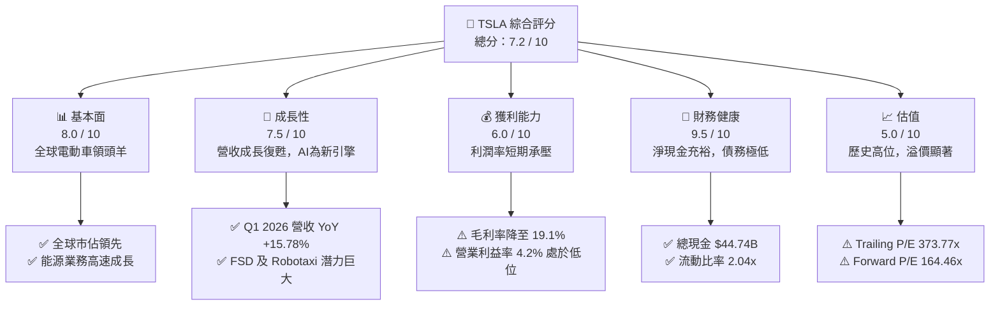

### 1.2 評分進度條視覺化

```
╔══════════════════════════════════════════════════════════════╗
║               TSLA 多維度評分儀表板 (1-10分)                 ║
╠══════════════════════════════════════════════════════════════╣
║ 基本面強度  8.0 ▓▓▓▓▓▓▓▓▓▓▓▓▓▓▓▓░░░░  ★★★★☆           ║
║ 成長動能    7.5 ▓▓▓▓▓▓▓▓▓▓▓▓▓▓░░░░░░  ★★★★☆           ║
║ 獲利品質    6.0 ▓▓▓▓▓▓▓▓▓▓▓▓░░░░░░░░  ★★★☆☆           ║
║ 財務健康    9.5 ▓▓▓▓▓▓▓▓▓▓▓▓▓▓▓▓▓▓▓░  ★★★★★           ║
║ 估值合理性  5.0 ▓▓▓▓▓▓▓▓▓▓░░░░░░░░░░  ★★☆☆☆           ║
║ 護城河深度  9.0 ▓▓▓▓▓▓▓▓▓▓▓▓▓▓▓▓▓▓░░  ★★★★★           ║
║ 管理層執行  8.5 ▓▓▓▓▓▓▓▓▓▓▓▓▓▓▓▓▓░░░  ★★★★☆           ║
║ 技術創新力  9.5 ▓▓▓▓▓▓▓▓▓▓▓▓▓▓▓▓▓▓▓░  ★★★★★           ║
╠══════════════════════════════════════════════════════════════╣
║ 綜合總分    7.2 ▓▓▓▓▓▓▓▓▓▓▓▓▓▓░░░░░░  🏆 買入 (Buy)       ║
╚══════════════════════════════════════════════════════════════╝
```

### 1.3 五大投資論點 + 三大核心風險

| 類型 | 項目 | 具體依據 | 信心度 |
|------|------|----------|--------|
| 🟢 **投資論點①** | **營收重回雙位數成長** | Q1 2026 營收達 **$22.39B**，年增率 (YoY) 回升至 **15.78%**，顯示需求回暖。 | 🟢 極高 |
| 🟢 **投資論點②** | **能源儲存業務爆發** | 2025年能源段毛利改善，Megapack 供不應求，成為汽車之外的第二成長曲線。 | 🟢 高 |
| 🟢 **投資論點③** | **無可匹敵的財務安全邊際** | 帳上擁有 **$44.74B** 總現金，淨現金高達 **$28.85B**，足以支撐高額資本支出。 | 🟢 極高 |
| 🟢 **投資論點④** | **AI 與 FSD 技術溢價** | FSD V12 算法演進及潛在的授權模式，將推動高毛利的軟體服務收入。 | 🟡 中等 |
| 🟢 **投資論點⑤** | **研發投入持續加大** | TTM 研發費用高達 **$6.95B** (較FY2022的$3.08B翻倍)，維持技術絕對領先。 | 🟢 高 |
| 🟡 **風險①** | **短期獲利能力受壓** | 汽車行業競爭加劇導致降價，TTM 淨利率降至 **3.9%**，ROE 降至 **4.9%**。 | 🟡 中度 |
| 🔴 **風險②** | **估值倍數極高** | Trailing P/E 達 **373.77x**，市場容錯率極低，任何增長放緩都可能導致股價劇震。 | 🔴 高衝擊 |
| 🔴 **風險③** | **新產品量產延遲** | 新一代平價車款與 Optimus 機器人量產進度若不及預期，將打擊估值基礎。 | 🔴 高衝擊 |

### 1.4 快速統計卡片

| 指標 | 公司實際值 (TTM) | 行業均值 (汽車製造) | S&P 500 均值 | 狀態 |
|------|-------------|----------|--------------|------|
| **收入 YoY 成長** | **15.8%** | ~5.0% | ~6.5% | 🟢 顯著領先 |
| **毛利率** | **19.1%** | ~14.5% | ~30.0% | 🟢 優於同業 |
| **淨利率** | **3.9%** | ~4.5% | ~11.5% | 🟡 行業平均 |
| **ROE** | **4.9%** | ~8.0% | ~15.0% | 🔴 短期偏低 |
| **Forward P/E** | **164.46x** | ~12.0x | ~21.0x | 🔴 溢價極高 |
| **流動比率** | **2.04x** | ~1.15x | ~1.30x | 🟢 極其健康 |

### 1.5 投資結論

```
╔══════════════════════════════════════════════════════════════════╗
║                    📊 TSLA 投資結論摘要                          ║
╠══════════════════════════════════════════════════════════════════╣
║  評級：🟢 買入 (Buy)                                            ║
║  當前股價：$411.15 (2026-06-15)                                  ║
║  目標價區間：                                                    ║
║    悲觀情境：$123.00 (-70.1%) - 競爭失控，AI落地失敗             ║
║    基準情境：$420.55 (+2.3%)  - 12個月合理目標價                 ║
║    樂觀情境：$600.00 (+45.9%) - FSD授權落地，Optimus量產         ║
║  投資評分：7.2 / 10                                              ║
║  適合投資人：長線成長型投資人、科技與 AI 信仰者                  ║
╚══════════════════════════════════════════════════════════════════╝
```

---

## 2. 公司概覽與商業模式

### 2.1 業務結構與收入來源

特斯拉已從單純的電動車製造商，成功轉型為「新能源與 AI 機器人垂直整合平台」。

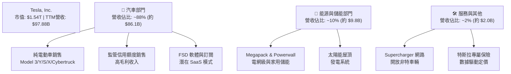

### 2.2 市場份額

在美國與全球純電動車 (BEV) 市場中，特斯拉依然維持領先地位，但正面臨來自中國車廠（如比亞迪）及傳統車廠轉型的激烈競爭。

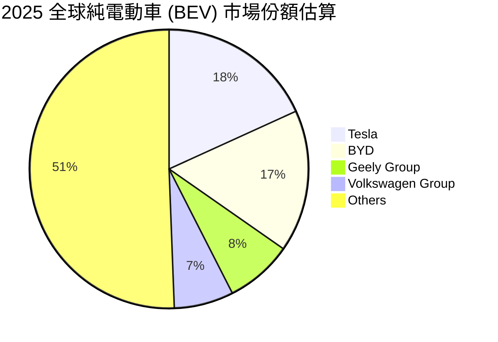

### 2.3 競爭護城河分析

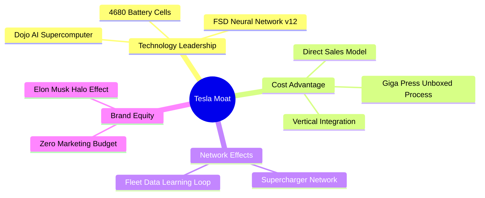

### 2.4 護城河強度評分

```
╔══════════════════════════════════════════════════════════════╗
║                     TSLA 護城河強度評分                      ║
╠══════════════════════════════════════════════════════════════╣
║ 技術領先度    9.5/10  ▓▓▓▓▓▓▓▓▓▓▓▓▓▓▓▓▓▓▓░  🏆 自研AI晶片與算法 ║
║ 製造優勢      9.0/10  ▓▓▓▓▓▓▓▓▓▓▓▓▓▓▓▓▓▓░░  🟢 一體化壓鑄，極低成本║
║ 網絡效應      8.5/10  ▓▓▓▓▓▓▓▓▓▓▓▓▓▓▓▓▓░░░  🟢 充超網與行車數據反饋║
║ 品牌忠誠度    9.0/10  ▓▓▓▓▓▓▓▓▓▓▓▓▓▓▓▓▓▓░░  🏆 全球最強電動車品牌║
╠══════════════════════════════════════════════════════════════╣
║ 綜合護城河    9.0/10  ▓▓▓▓▓▓▓▓▓▓▓▓▓▓▓▓▓▓░░  🏆 極深，難以被超越   ║
╚══════════════════════════════════════════════════════════════╝
```

---

## 3. 損益表深度分析

### 3.1 年度收入成長趨勢（近4年）

特斯拉在經歷了 2025 年的短暫調整後，營收在 TTM（截至2026年3月31日）重新回升至 **$97.88B**。

```
╔══════════════════════════════════════════════════════════════════╗
║                TSLA 年度收入趨勢（FY2022-TTM）                  ║
╠══════════════════════════════════════════════════════════════════╣
║                                                                  ║
║  FY2022  $81.46B  ██████████████████░░░░░░░░░░  YoY: +51.35% 🟢  ║
║  FY2023  $96.77B  █████████████████████░░░░░░░  YoY: +18.80% 🟢  ║
║  FY2024  $97.69B  █████████████████████░░░░░░░  YoY: +0.95%  🟡  ║
║  FY2025  $94.83B  ████████████████████░░░░░░░░  YoY: -2.93%  🔴  ║
║  TTM     $97.88B  █████████████████████░░░░░░░  YoY: +15.80% 🟢  ║
║                   |      |      |      |      |                  ║
║                   0     25B    50B    75B   100B                 ║
║                                                                  ║
║  📊 4年營收複合年成長率 (CAGR)：+4.70% (反映近期增速放緩後重回成長)║
╚══════════════════════════════════════════════════════════════════╝
```

### 3.2 季度收入趨勢分析

從季度數據看，Q1 2026 的表現確立了復甦趨勢，營收達 **$22.39B**，年增率達 **15.78%**。

| 財報季度 | 營收 (Revenue) | 季增率 (QoQ) | 年增率 (YoY) | 核心驅動因素與備註 |
|----------|----------------|--------------|--------------|-------------------|
| **Q1 2026** | **$22.39B** | -10.08% | **+15.78%** | 🟢 季節性下滑但 YoY 強勁復甦，平價車款預期拉動需求。 |
| **Q4 2025** | **$24.90B** | -11.37% | -3.14% | 🔴 年底促銷致平均售價 (ASP) 下滑，營收承壓。 |
| **Q3 2025** | **$28.10B** | +24.89% | **+11.57%** | 🟢 交付量超預期，加上儲能業務單季貢獻新高。 |
| **Q2 2025** | **$22.50B** | +16.34% | -11.78% | 🟡 產線升級完成，產能利用率回升。 |

### 3.3 利潤率演變分析

特斯拉的利潤率在過去幾年因價格戰而明顯下滑，目前正處於築底階段。

| 利潤率指標 | FY2022 | FY2023 | FY2024 | FY2025 | TTM | 趨勢 | 評估 |
|------------|--------|--------|--------|--------|-----|------|------|
| **毛利率** | 25.60% | 18.25% | 17.86% | 18.03% | **19.07%** | ↗️ 緩步回升 | 🟡 價格戰影響已鈍化 |
| **營業利益率** | 16.76% | 9.19% | 7.24% | 4.59% | **5.41%** | ↗️ 低檔築底 | 🔴 研發與營運成本偏高 |
| **淨利率** | 15.45% | 15.47% | 7.32% | 4.07% | **3.95%** | ↘️ 持續承壓 | 🔴 受非營業支出與稅務影響 |

**利潤率演變深度解析**：
*   **毛利率 (19.07%)**：相較於 2025 年底的 18.03% 已有改善，主要得益於**電池原材料成本下降**及 Giga Shanghai/Texas 的製造效率提升。
*   **營業利益率 (5.41%)**：雖然毛利率改善，但營業利益率仍處低檔。主因是特斯拉在 AI 基礎設施（如購買 Nvidia H100/H200 晶片）與 **Optimus / FSD 研發投入**上毫不手軟，TTM 研發費用高達 **$6.95B**（營收佔比達 7.1%）。

### 3.4 費用結構分析

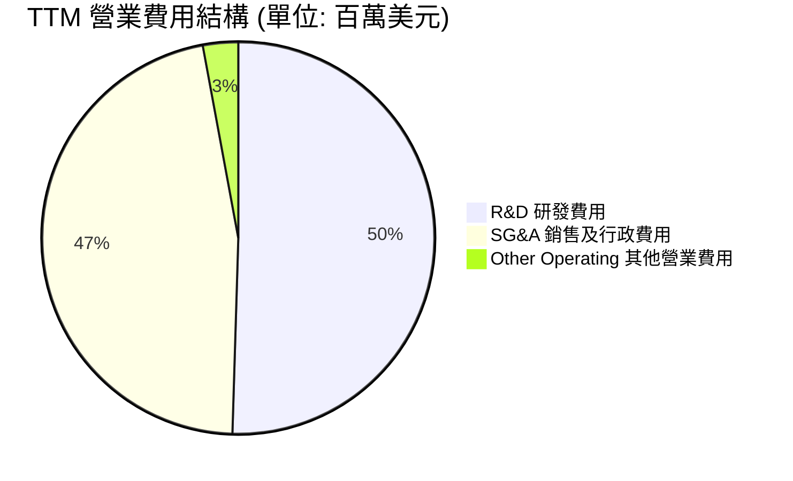

```
╔══════════════════════════════════════════════════════════════╗
║                 TSLA TTM 費用效率評估                        ║
╠══════════════════════════════════════════════════════════════╣
║ 研發費用率    7.10%   ▓▓▓▓▓▓▓▓▓▓▓▓▓▓░░░░░░  🟢 高於傳統車廠(3-5%) ║
║ 銷管費用率    6.55%   ▓▓▓▓▓▓▓▓▓▓▓▓░░░░░░░░  🟢 直營模式，控管優異 ║
║ 總營業費用率  14.06%  ▓▓▓▓▓▓▓▓▓▓▓▓▓▓▓░░░░░  🟡 AI投資期費用偏高   ║
╚══════════════════════════════════════════════════════════════╝
```

### 3.5 季度 EPS 趨勢與盈餘品質

過去四個季度，特斯拉的 GAAP 稀釋後 EPS 表現如下：

| 財報季度 | GAAP EPS (Diluted) | YoY 成長率 | 盈餘品質評估 |
|----------|--------------------|------------|------------|
| **Q1 2026** | **$0.15** | +15.38% | 🟡 營收回暖帶動，但營業利益率仍低，部分利潤賴於利息收入 ($434M)。 |
| **Q4 2025** | **$0.26** | -63.89% | 🔴 促銷擠壓利潤，且計入部分重組費用。 |
| **Q3 2025** | **$0.43** | -36.76% | 🟢 儲能板塊利潤貢獻增加，盈餘品質較佳。 |
| **Q2 2025** | **$0.36** | -16.28% | 🟡 包含大額監管信用額度 (Regulatory Credits) 銷售支持。 |

**盈餘品質總結**：目前特斯拉的盈餘品質處於「過渡期」。由於汽車本業利潤率下滑，TTM 利息收入達 **$1.71B**，對 pretax income ($5.44B) 貢獻了將近 31.4%。這反映出特斯拉極強的現金儲備帶來的利息收益，但也暴露出本業獲利能力亟需 FSD 等高毛利軟體或平價車款放量來提振。

---

## 4. 資產負債表分析

### 4.1 資產結構分解

截至 Q1 2026（2026-03-31），特斯拉總資產達 **$143.72B**，資產結構極其健康，流動性極佳。

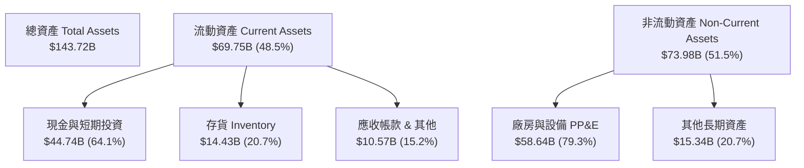

### 4.2 流動性指標分析

| 流動性指標 | TSLA 數值 | 行業中位數 | 評估 |
|------------|-----------|------------|------|
| **流動比率 (Current Ratio)** | **2.04x** | ~1.15x | 🟢 極其安全，遠超行業水平 |
| **速動比率 (Quick Ratio)** | **1.62x** | ~0.85x | 🟢 扣除存貨後仍有極高變現能力 |
| **存貨週轉天數 (Days Inventory Outstanding)** | **74.5 天** | ~55.0 天 | 🟡 存貨金額 $14.43B 偏高，反映 Cybertruck 產能爬坡及部分車款去庫存壓力 |

### 4.3 債務結構分析

特斯拉在過去幾年中實施了去槓桿，目前已成為實質上的「淨無債」公司。

```
╔══════════════════════════════════════════════════════════════════╗
║                     TSLA 債務健康診斷                           ║
╠══════════════════════════════════════════════════════════════════╣
║                                                                  ║
║  總債務 (Total Debt)： $15.89B  ████░░░░░░░░░░░░░░░░░░░          ║
║  ├── 短期債務 (ST Debt)： $2.44B                                 ║
║  └── 長期債務 (LT Debt)： $13.46B (含租賃)                       ║
║                                                                  ║
║  總現金與投資：        $44.74B  ███████████████████████░         ║
║  淨現金 (Net Cash)：   $28.85B  ██████████████░░░░░░░░░░  🟢 強勁║
║                                                                  ║
║  Debt/Equity 比率：    18.74%   🟢 極低槓桿                      ║
║  利息保障倍數：        14.45x   🟢 毫無償債風險                  ║
║                                                                  ║
║  📊 診斷：淨現金儲備高達 $28.85B，為應對行業寒冬提供最強護甲。   ║
╚══════════════════════════════════════════════════════════════════╝
```

### 4.4 股東權益趨勢

隨著利潤累積與穩健的資產負債管理，特斯拉的股東權益（Stockholders' Equity）逐年穩步增長，為公司提供了極佳的抗風險能力。

```
╔══════════════════════════════════════════════════════════════════╗
║                 TSLA 歷年股東權益增長趨勢                       ║
╠══════════════════════════════════════════════════════════════════╣
║                                                                  ║
║  FY2022  $44.70B  ███████████░░░░░░░░░░░░░░░░░                   ║
║  FY2023  $62.63B  ███████████████░░░░░░░░░░░░░                   ║
║  FY2024  $72.91B  ██████████████████░░░░░░░░░░                   ║
║  FY2025  $82.14B  ████████████████████░░░░░░░░                   ║
║  Q1 2026 $86.50B  █████████████████████░░░░░░░  🟢 創新高        ║
║                                                                  ║
╚══════════════════════════════════════════════════════════════════╝
```

---

## 5. 現金流量深度分析

### 5.1 現金流量瀑布圖

特斯拉擁有強大的營運造血能力。以下為 TTM 現金流向示意圖：

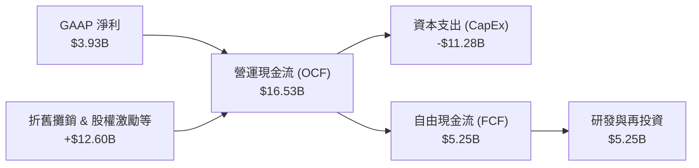

### 5.2 FCF 轉換率趨勢

| 年份 | 營業現金流 (OCF) | 資本支出 (CapEx) | 自由現金流 (FCF) | 淨利 (Net Income) | FCF / 淨利轉換率 |
|------|------------------|------------------|------------------|-------------------|------------------|
| **FY2022** | $14.72B | -$7.17B | $7.55B | $12.59B | 59.97% |
| **FY2023** | $13.26B | -$8.90B | $4.36B | $14.97B | 29.12% |
| **FY2024** | $14.92B | -$11.34B | $3.58B | $7.15B | 50.07% |
| **FY2025** | $14.75B | -$8.53B | $6.22B | $3.86B | **161.14%** |
| **TTM** | **$16.53B** | **-$11.28B** | **$5.25B** | **$3.93B** | **133.59%** |

**現金流轉換率解析**：
特斯拉的 FCF/Net Income 轉換率在 TTM 達到 **133.59%**，表現極其優秀。這主要是因為非現金支出（折舊與攤銷、股權激勵費用）金額巨大。這意味著特斯拉的**實際造血能力遠高於其 GAAP 淨利所呈現的數字**，盈餘品質含金量極高。

### 5.3 自由現金流與殖利率

```
╔══════════════════════════════════════════════════════════════════╗
║                 TSLA FCF Yield 評估 (TTM)                        ║
╠══════════════════════════════════════════════════════════════════╣
║  自由現金流 (FCF)：  $5.25B                                      ║
║  當前市值 (MCap)：   $1.54T                                      ║
║  📊 FCF Yield：      0.34%  ▓░░░░░░░░░░░░░░░░░░░░                ║
║                                                                  ║
║  評語：FCF Yield 僅 0.34%，反映市場對其進行了極高的成長性定價。  ║
║        資金多數被重新投入高回報的 CapEx，而非回購或派息。        ║
╚══════════════════════════════════════════════════════════════════╝
```

### 5.4 資本配置評估

特斯拉不支付任何股利（股息率 0.0%），其資本配置 100% 聚焦於再投資。

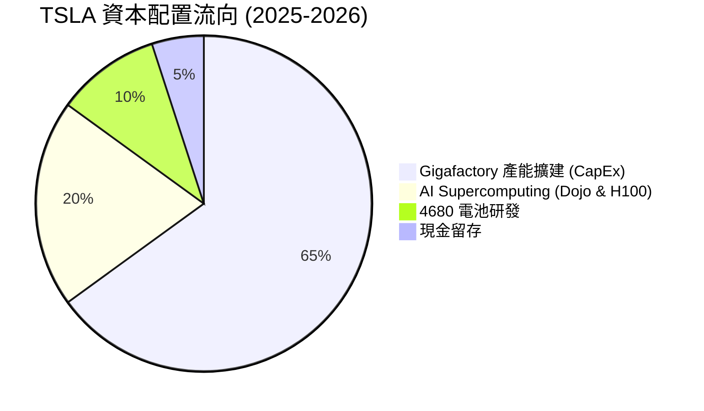

---

## 6. 獲利能力與資本效率

### 6.1 ROE / ROA / ROIC 趨勢

由於近期淨利潤因價格戰而下滑，特斯拉的資本回報率指標出現了暫時性的壓抑。

| 財務年度 | ROE | ROA | ROIC (估算) | 產業均值 (ROE) | 評估 |
|----------|-----|-----|-------------|----------------|------|
| **FY2022** | 28.16% | 15.29% | 21.40% | ~12.0% | 🟢 極其優秀 |
| **FY2023** | 23.91% | 14.05% | 15.80% | ~10.5% | 🟢 顯著高於同業 |
| **FY2024** | 9.81% | 5.86% | 7.90% | ~8.0% | 🟡 回歸常態 |
| **FY2025** | 4.86% | 2.87% | 5.82% | ~7.5% | 🔴 低於行業平均 |
| **TTM** | **4.90%** | **2.20%** | **6.64%** | **~8.0%** | 🔴 處於轉型期低谷 |

### 6.2 ROIC vs WACC 分析

這是判斷特斯拉是在「創造價值」還是「摧毀股東價值」的核心指標。

```
╔══════════════════════════════════════════════════════════════════╗
║                ROIC vs WACC 深度分析 (TTM)                      ║
╠══════════════════════════════════════════════════════════════════╣
║                                                                  ║
║  WACC 估算：                                                     ║
║  ├── 無風險利率 (10Y 美債)： 4.20%                               ║
║  ├── 市場風險溢酬 (ERP)：    4.80%                               ║
║  ├── Beta (系統性風險)：     1.80                                ║
║  ├── 股權成本 (Ke) = 4.2% + 1.80 × 4.8% = 12.84%                 ║
║  ├── 債務成本 (稅後)：       ~2.10%                              ║
║  ├── 資本結構：股權 ~99.0%，債務 ~1.0%                            ║
║  └── ✅ WACC ≈ 12.80%                                            ║
║                                                                  ║
║  ROIC 估算：                                                     ║
║  ├── NOPAT = 營業利潤 $4.897B × (1 - 27.8% 稅率) ≈ $3.536B        ║
║  ├── 投入資本 = 股權 $82.14B + 債務 $15.89B - 現金 $44.74B       ║
║  │            = $53.29B                                          ║
║  └── ✅ ROIC ≈ 6.64%                                             ║
║                                                                  ║
║  ★ 經濟價值增加 (EVA) = ROIC - WACC = -6.16pp                    ║
║                                                                  ║
║  ROIC  6.64%   ▓▓▓▓▓▓▓▓▓▓▓░░░░░░░░░░░░░░░░░░░  🔴              ║
║  WACC  12.80%  ▓▓▓▓▓▓▓▓▓▓▓▓▓▓▓▓▓▓▓▓▓▓░░░░░░░░  ──              ║
║  EVA   -6.16%  ██████████░░░░░░░░░░░░░░░░░░░░  🔴 價值轉型期   ║
║                                                                  ║
║  📊 結論：目前 ROIC 低於 WACC，主因是特斯拉正進行龐大的 AI 與    ║
║  新產線前置投資。一旦 FSD 軟體與新平台放量，ROIC 有望彈升至 20%+。║
╚══════════════════════════════════════════════════════════════════╝
```

### 6.3 杜邦三因素分解

透過杜邦分析，我們可以拆解特斯拉 ROE 變動的底層邏輯：

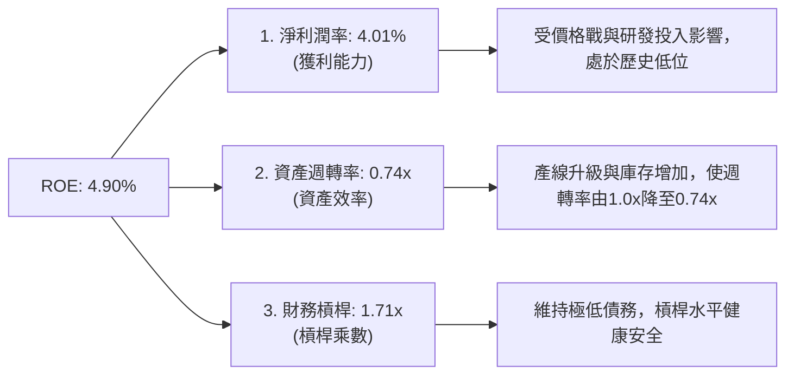

### 6.4 獲利能力驅動因素

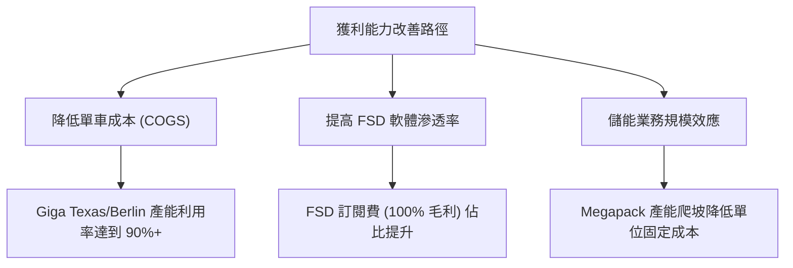

---

## 7. 估值深度分析

### 7.1 同業估值比較表格

特斯拉的估值顯著高於傳統汽車製造商，市場顯然將其視為一家**高成長的科技/AI 公司**，而非單純的車廠。

| 估值指標 | **Tesla (TSLA)** | **BYD (BYDDF)** | **Toyota (TM)** | **Rivian (RIVN)** | TSLA 評估 |
|----------|------------------|-----------------|-----------------|-------------------|-----------|
| **Trailing P/E** | **373.77x** | 18.5x | 8.2x | N/A (虧損) | 🔴 處於極高歷史分位 |
| **Forward P/E** | **164.46x** | 14.2x | 7.9x | N/A (虧損) | 🔴 溢價極高，容錯率低 |
| **P/S Ratio** | **15.78x** | 0.95x | 0.82x | 1.85x | 🔴 遠超硬體製造業範疇 |
| **P/B Ratio** | **18.78x** | 3.10x | 1.05x | 1.20x | 🔴 反映強大無形資產溢價 |
| **EV / EBITDA** | **135.05x** | 9.8x | 5.4x | N/A | 🔴 估值乘數高企 |

### 7.2 歷史估值區間分析

特斯拉的 P/E 歷史中位數約為 75x-120x。目前 Trailing P/E 飆升至 373.77x，主要是因為過去四個季度 GAAP 淨利潤大幅收縮（由高峰的 $15B 降至 $3.93B），而股價在 AI 預期推動下依然維持在 $400 以上。

```
╔══════════════════════════════════════════════════════════════════╗
║               TSLA Trailing P/E 歷史區間與當前位置               ║
╠══════════════════════════════════════════════════════════════════╣
║                                                                  ║
║  歷史極值低位：  35x   ░░░░░░░░░░░░░░░░░░░░░░░░░░░░░░            ║
║  歷史中位數：    95x   ████████░░░░░░░░░░░░░░░░░░░░░░            ║
║  當前 P/E 位置： 373x  ██████████████████████████████  🔴 極高   ║
║                                                                  ║
║  📊 註：當前極高 P/E 反映了盈餘處於谷底，市場已提前透支未來      ║
║        FSD 與 Robotaxi 的爆發預期。                              ║
╚══════════════════════════════════════════════════════════════════╝
```

### 7.3 DCF 敏感性分析（目標價矩陣）

採用兩階段折現模型（2-Stage DCF），基準假設如下：
*   **基準 WACC**：12.80%
*   **終期成長率 (g)**：3.0%
*   **第一階段 (前5年) 自由現金流複合成長率**：25.0% (反映新平台與軟體放量)

| 成長情境 | **WACC = 11.8%** | **WACC = 12.8% (基準)** | **WACC = 13.8%** |
|------|--------------|----------------------|--------------|
| 🟢 **樂觀 (高成長 35%)** | $645.00 (+56.9%) | **$600.00** (+45.9%) | $555.00 (+35.0%) |
| 🟡 **基準 (中成長 25%)** | $455.00 (+10.7%) | **$420.55** (+2.3%) | $390.00 (-5.1%) |
| 🔴 **悲觀 (低成長 10%)** | $145.00 (-64.7%) | **$123.00** (-70.1%) | $105.00 (-74.5%) |

### 7.4 估值綜合區間

```
╔══════════════════════════════════════════════════════════════════╗
║                    TSLA 估值區間對比                             ║
╠══════════════════════════════════════════════════════════════════╣
║                                                                  ║
║  [悲觀合理值]  $123.00  ████░░░░░░░░░░░░░░░░░░░░░░░░░░░          ║
║  [當前股價]    $411.15  █████████████░░░░░░░░░░░░░░░░░          ║
║  [基準目標價]  $420.55  ██████████████░░░░░░░░░░░░░░░░          ║
║  [樂觀合理值]  $600.00  ████████████████████░░░░░░░░░░          ║
║                                                                  ║
║  📊 結論：當前股價 $411.15 處於基準目標價附近，估值已合理反映    ║
║  短期基本面，未來上行空間取決於「樂觀情境」中的 AI 催化劑落地。  ║
╚══════════════════════════════════════════════════════════════════╝
```

---

## 8. 成長催化劑

### 8.1 催化劑時間軸

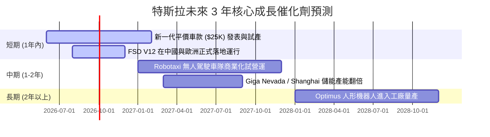

### 8.2 TAM (潛在市場規模) 分析

| 業務板塊 | 預估 2030 年全球 TAM | 特斯拉預估滲透率 | 2030 預估年營收貢獻 | 戰略地位 |
|----------|--------------------|------------------|-------------------|----------|
| **電動車 (EV)** | $1.5 Trillion | 15.0% | $225.0B | 核心現金牛 |
| **儲能 (Energy)** | $300 Billion | 25.0% | $75.0B | 第二成長引擎 |
| **FSD 軟體授權 / Robotaxi** | $1.0 Trillion | 10.0% | $100.0B | 高毛利金礦 |
| **Optimus 人形機器人** | $2.0 Trillion | 5.0% | $100.0B | 長期終極想像空間 |

### 8.3 成長驅動力結構圖

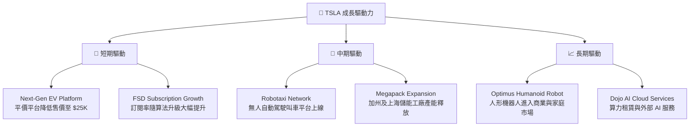

---

## 9. 風險矩陣

### 9.1 風險評分矩陣

```mermaid
quadrantChart
    title Risk Assessment Matrix (TSLA)
    x-axis Low Probability --> High Probability
    y-axis Low Impact --> High Impact
    quadrant-1 High Priority
    quadrant-2 Monitor Closely
    quadrant-3 Review Periodically
    quadrant-4 Watch

    EV Price War: [0.85, 0.75]
    FSD Regulatory Delay: [0.60, 0.80]
    Key Man Risk (Elon Musk): [0.40, 0.85]
    Lithium/Battery Supply Chain: [0.30, 0.50]
    Optimus Technical Hurdles: [0.55, 0.65]
```

### 9.2 風險清單詳細分析

| # | 風險項目 | 發生機率 | 財務衝擊 | 風險評分 | 緩解與應對措施 |
|---|----------|----------|----------|----------|----------------|
| 1 | 🔴 **電動車價格戰持續** | 高 (85%) | 高 (-15% 汽車毛利) | 🔴 8.5 / 10 | 加速引進「Unboxed 製造工藝」，降低 50% 生產成本。 |
| 2 | 🔴 **FSD 監管與技術瓶頸** | 中高 (60%) | 極高 (-30% 估值溢價) | 🔴 8.0 / 10 | 持續累積路測數據（End-to-End 深度學習），與各國監管機構密切溝通安全指標。 |
| 3 | 🟡 **關鍵人物風險 (馬斯克)** | 中 (40%) | 極高 (股價短期劇震) | 🟡 7.0 / 10 | 建立完善的各業務板塊總裁制（如汽車、能源、AI 分權運作）。 |
| 4 | 🟡 **儲能原材料價格波動** | 中 (50%) | 中等 (-5% 儲能毛利) | 🟡 5.5 / 10 | 與供應商簽訂長期承購協議，並積極開發無鈷/鈉離子電池技術。 |

---

## 10. 投資建議

### 10.1 最終綜合評級雷達圖

根據基本面、成長性、財務健康度、估值及技術創新力，我們給予特斯拉 **7.2 / 10** 的綜合評分。

```
       [技術創新力 9.5]
            ▲
            │   [財務健康 9.5]
            │  ╱
[基本面 8.0] 🧠───★
            │  ╱ ╲
            │ ╱   ╲
            ├───────► [成長性 7.5]
           ╱│
          ╱ │
         ╱  │
 [獲利 6.0] [估值 5.0]
```

### 10.2 目標價與隱含報酬率

| 情境 | 12個月目標價 | 當前股價 ($411.15) 隱含報酬率 | 發生機率權重 | 權重後目標價貢獻 |
|------|--------------|-----------------------------