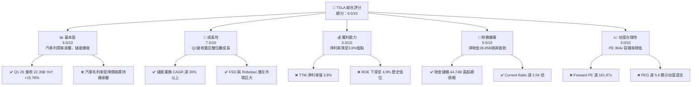
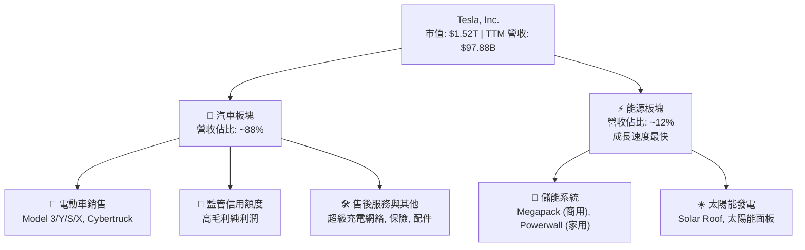
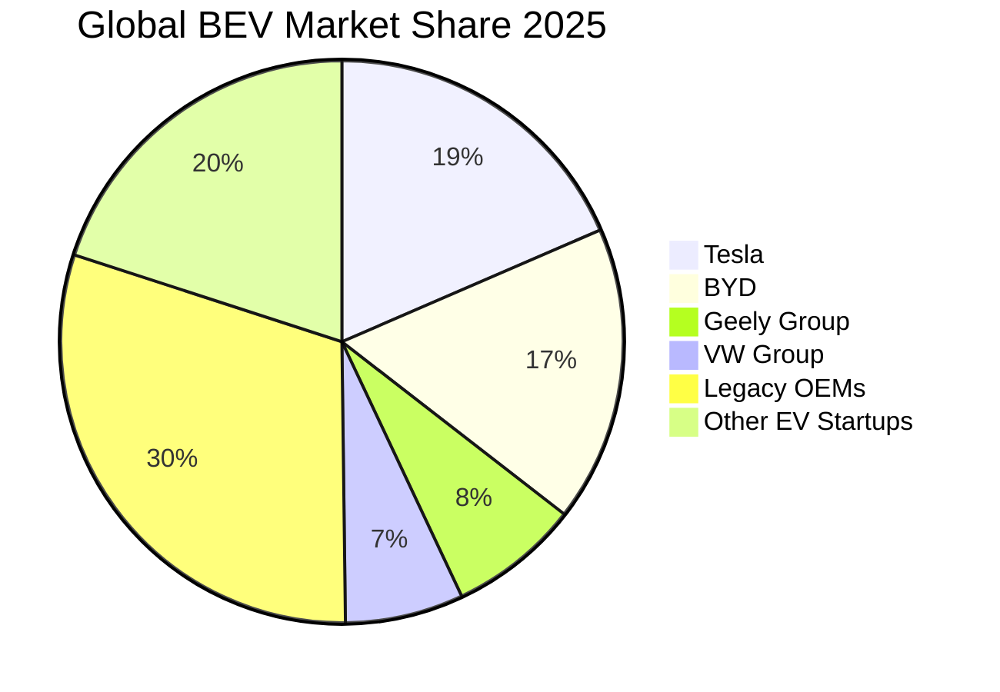
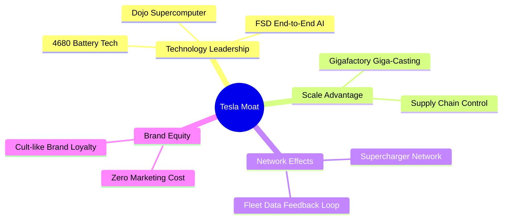
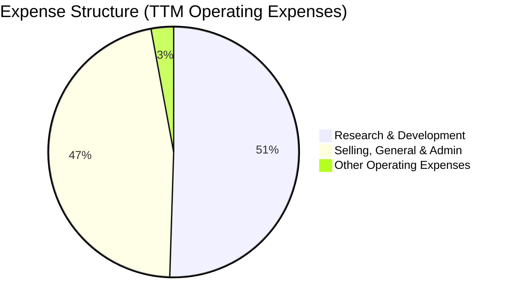
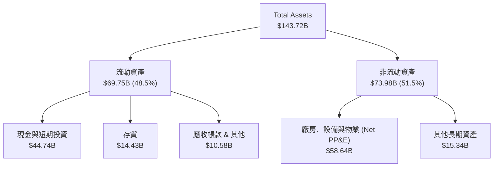
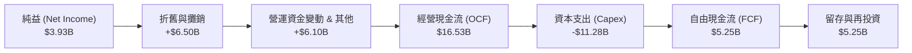
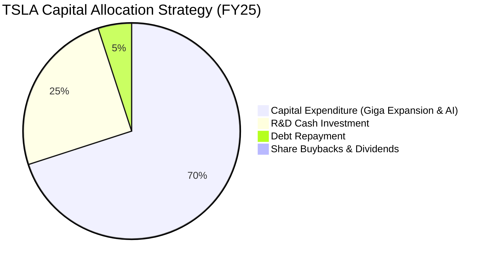
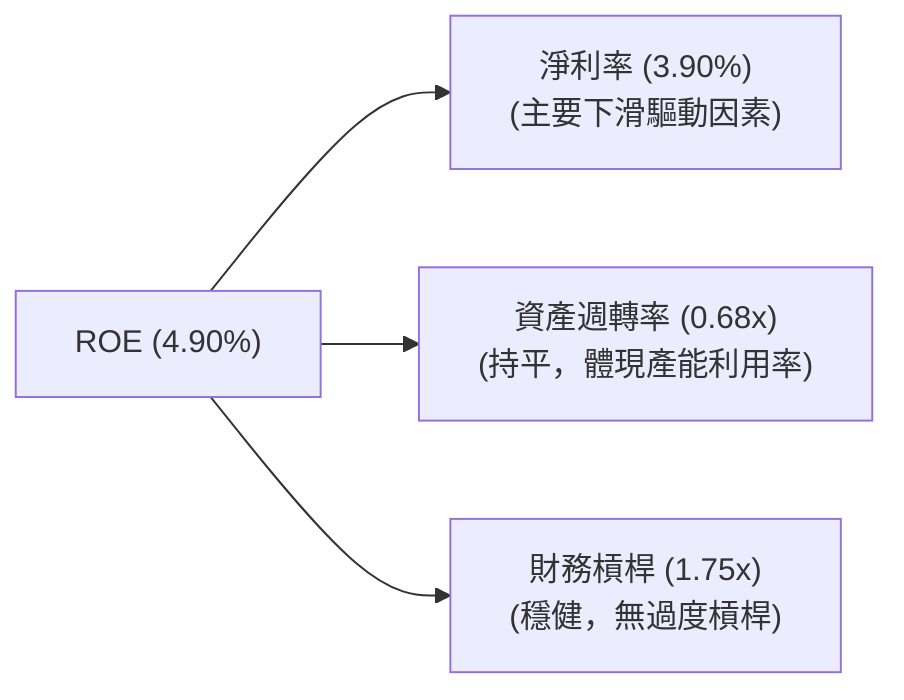
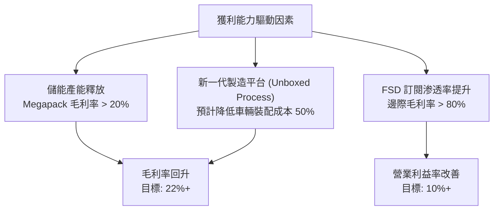

# TSLA 基本面深度分析報告
> **報告日期**：2026-06-16 ｜ **語言**：繁體中文 ｜ **數據來源**：Yahoo Finance, Finviz, StockAnalysis, Roic.ai ｜ **分析師**：CFA 級機構研究

---

## 目錄

| # | 章節 | 核心結論 |
|---|------|----------|
| 1 | 執行摘要 | 評級「持有（觀望）」，目標價 $420.55，AI 與儲能期權支撐極高估值 |
| 2 | 公司概覽與商業模式 | 汽車業務向 AI/儲能生態轉型，軟硬體一體化構築核心護城河 |
| 3 | 損益表深度分析 | Q1 2026 營收回暖（+15.78%），但降價與 R&D 激增壓低淨利率至 3.9% |
| 4 | 資產負債表分析 | 淨現金 $28.85B 奠定無風險財務防禦力，資產結構向 AI 算力傾斜 |
| 5 | 現金流量深度分析 | 經營現金流穩定（$16.53B），資本配置聚焦 AI 基礎設施與 Capex |
| 6 | 獲利能力與資本效率 | 杜邦分解揭示利潤率為 ROE 下滑主因；ROIC（6.64%）低於 WACC 暫時摧毀價值 |
| 7 | 估值深度分析 | 歷史與同業估值極端偏高（PE 364x），DCF 敏感性顯示市場溢價反映長線期權 |
| 8 | 成長催化劑 | 儲能 Megapack 爆發、FSD V12 商業化與新一代平價車型為核心動能 |
| 9 | 風險矩陣 | 價格戰持續、FSD 監管延遲與 AI 投入回報不及預期為主要下行風險 |
| 10 | 投資建議 | 建議分批逢低佈局，設定 $350 以下為安全邊際買入區間 |

---

## 1. 執行摘要

### 1.1 核心評分儀表板



### 1.2 評分進度條視覺化

```
╔══════════════════════════════════════════════════════════════╗
║              TSLA 多維度評分儀表板 (1-10分)                  ║
╠══════════════════════════════════════════════════════════════╣
║ 基本面強度  6.0 ▓▓▓▓▓▓▓▓▓▓▓▓░░░░░░░░  ★★★☆☆           ║
║ 成長動能    7.5 ▓▓▓▓▓▓▓▓▓▓▓▓▓▓▓░░░░░  ★★★★☆           ║
║ 獲利品質    5.0 ▓▓▓▓▓▓▓▓▓▓░░░░░░░░░░  ★★★☆☆           ║
║ 財務健康    9.5 ▓▓▓▓▓▓▓▓▓▓▓▓▓▓▓▓▓▓▓░  ★★★★★           ║
║ 估值合理性  3.0 ▓▓▓▓▓▓░░░░░░░░░░░░░░  ★☆☆☆☆           ║
║ 護城河深度  8.5 ▓▓▓▓▓▓▓▓▓▓▓▓▓▓▓▓▓░░░  ★★★★☆           ║
║ 管理層執行  8.0 ▓▓▓▓▓▓▓▓▓▓▓▓▓▓▓▓░░░░  ★★★★☆           ║
║ 技術創新力  9.5 ▓▓▓▓▓▓▓▓▓▓▓▓▓▓▓▓▓▓▓░  ★★★★★           ║
╠══════════════════════════════════════════════════════════════╣
║ 綜合總分    6.0 ▓▓▓▓▓▓▓▓▓▓▓▓░░░░░░░░  🏆 觀望 / 持有       ║
╚══════════════════════════════════════════════════════════════╝
```

### 1.3 五大投資論點 + 三大核心風險

| 類型 | 項目 | 具體依據 | 信心度 |
|------|------|----------|--------|
| 🟢 **投資論點①** | **儲能業務進入爆發期** | 儲能裝機量持續高增，Megapack 產能釋放，毛利率顯著高於汽車業務。 | 🟢 極高 |
| 🟢 **投資論點②** | **Q1 2026 營收重回成長** | Q1 2026 營業收入達 $22.39B，YoY 成長 15.78%，扭轉 2025 年的衰退趨勢。 | 🟢 高 |
| 🟢 **投資論點③** | **無懈可擊的財務防禦力** | 擁有 $44.74B 現金及短期投資，淨現金高達 $28.85B，足以支撐高額 AI 研發。 | 🟢 極高 |
| 🟢 **投資論點④** | **FSD V12 與自動駕駛期權** | FSD 端到端神經網絡技術領先，Robotaxi 商業化路徑清晰，打開軟體高毛利空間。 | 🟡 中等 |
| 🟢 **投資論點⑤** | **新一代平價平台（Model 2）** | 預計降低 50% 生產成本，打入主流消費市場，解決銷量成長瓶頸。 | 🟡 中等 |
| 🟡 **風險①** | **全球電動車價格戰未止** | 競爭對手（如比亞迪）成本優勢強大，特斯拉汽車毛利率恐持續承壓。 | 🔴 高衝擊 |
| 🔴 **風險②** | **估值極端透支** | Trailing PE高達 364.56x，Forward PE 161.87x，市場對盈餘容錯率極低。 | 🔴 高衝擊 |
| 🟡 **風險③** | **AI 與 Robotaxi 監管風險** | FSD 技術落地與 Robotaxi 商業化營運面臨各國法規監管，時間表具不確定性。 | 🟡 中度 |

### 1.4 快速統計卡片

| 指標 | TSLA 實際值 | 行業均值 (汽車製造) | S&P 500 均值 | 狀態 |
|------|-------------|--------------------|--------------|------|
| **營收 TTM 成長率** | **15.8%** | ~5.0% | ~6.5% | 🟢 領先 |
| **毛利率** | **19.1%** | ~14.5% | ~30.0% | 🟡 中等 |
| **淨利率** | **3.9%** | ~4.2% | ~11.5% | 🔴 落後 |
| **ROE** | **4.9%** | ~8.5% | ~15.0% | 🔴 落後 |
| **Forward P/E** | **161.87x** | ~12.5x | ~21.5x | 🔴 極高 |
| **淨現金規模** | **$28.85B** | 普遍為淨債務 | N/A | 🟢 極強 |

### 1.5 投資結論

```
╔══════════════════════════════════════════════════════════════════╗
║                    📊 投資結論摘要                               ║
╠══════════════════════════════════════════════════════════════════╣
║  評級：🟡 持有 (Hold) / 觀望                                    ║
║  當前股價：$404.66                                               ║
║  目標價區間：                                                    ║
║    悲觀情境：$260.00（-35.7%）- 汽車利潤率持續惡化               ║
║    基準情境：$420.55（+3.9%） - 儲能高成長，FSD逐步落地          ║
║    樂觀情境：$550.00（+35.9%）- Robotaxi成功商業化，平價車放量    ║
║  投資評分：6.0/10                                                ║
║  適合投資人：具備高風險承受力、看好自動駕駛與儲能的長線成長型投資者║
╚══════════════════════════════════════════════════════════════════╝
```

---

## 2. 公司概覽與商業模式

### 2.1 業務結構與收入來源

特斯拉（Tesla, Inc.）已從單一的電動車製造商，演變成一家整合「硬體製造、軟體生態、能源網絡」的 AI 與能源科技巨頭。其業務板塊主要分為汽車業務（Automotive）與能源生成與儲存業務（Energy Generation and Storage）。



### 2.2 市場份額

在純電動車（BEV）市場，特斯拉面臨來自比亞迪（BYD）及傳統車企的激烈競爭。以下為 2025 年全球純電動車市場份額估算：



### 2.3 競爭護城河分析

特斯拉的競爭護城河已從單純的「先發優勢」轉化為多維度的結構性壁壘。



### 2.4 護城河強度評分

```
╔══════════════════════════════════════════════════════════════╗
║                    TSLA 護城河強度評分                       ║
╠══════════════════════════════════════════════════════════════╣
║ 1. 技術領先度  9.5/10  ▓▓▓▓▓▓▓▓▓▓▓▓▓▓▓▓▓▓▓░  🏆 FSD與AI算力領先║
║ 2. 規模效應    9.0/10  ▓▓▓▓▓▓▓▓▓▓▓▓▓▓▓▓▓▓░░  🟢 超級工廠製造優勢║
║ 3. 網路效應    8.5/10  ▓▓▓▓▓▓▓▓▓▓▓▓▓▓▓▓▓░░░  🟢 超充與數據反饋  ║
║ 4. 客戶鎖定    8.0/10  ▓▓▓▓▓▓▓▓▓▓▓▓▓▓▓▓░░░░  🟢 軟體生態系統    ║
║ 5. 生態夥伴    7.5/10  ▓▓▓▓▓▓▓▓▓▓▓▓▓▓░░░░░░  🟡 供應鏈垂直整合  ║
╠══════════════════════════════════════════════════════════════╣
║ 綜合護城河     8.5/10  ▓▓▓▓▓▓▓▓▓▓▓▓▓▓▓▓▓░░░  🏆 極深且具延展性  ║
╚══════════════════════════════════════════════════════════════╝
```

---

## 3. 損益表深度分析

### 3.1 年度收入成長趨勢（FY22-TTM）

```
╔══════════════════════════════════════════════════════════════════╗
║                 TSLA 年度收入趨勢（FY21-TTM）                    ║
╠══════════════════════════════════════════════════════════════════╣
║                                                                  ║
║  FY21   $53.82B  ██████████░░░░░░░░░░░░░░░░░  YoY: +70.7% 🟢    ║
║  FY22   $81.46B  ███████████████░░░░░░░░░░░░  YoY: +51.4% 🟢    ║
║  FY23   $96.77B  ██████████████████░░░░░░░░░  YoY: +18.8% 🟢    ║
║  FY24   $97.69B  ██████████████████░░░░░░░░░  YoY: +0.95% 🟡    ║
║  FY25   $94.83B  █████████████████░░░░░░░░░░  YoY: -2.93% 🔴    ║
║  TTM    $97.88B  ██████████████████░░░░░░░░░  YoY: +15.8% 🟢    ║
║                   |      |      |      |      |                  ║
║                   0     25B    50B    75B    100B                ║
║                                                                  ║
║  📊 5年累計營收 CAGR：+12.7%                                     ║
╚══════════════════════════════════════════════════════════════════╝
```

### 3.2 季度收入趨勢分析

特斯拉在經歷了 2024 年底至 2025 年初的銷量低迷（2025-12-31 營收 YoY -3.14%）後，於 2026 年第一季展現了強勁的復甦勢頭。

| 財報季度 | 營業收入 (Revenue) | YoY 成長率 | QoQ 成長率 | 營業利益 (Op Income) | 淨利 (Net Income) | 備註 |
|----------|-------------------|------------|------------|---------------------|-------------------|------|
| **Q1 2026** | $22.39B | 🟢 +15.78% | 🔴 -10.09% | $941.00M | $477.00M | 營收重回雙位數年增，但季節性因素致季減 |
| **Q4 2025** | $24.90B | 🔴 -3.14% | 🔴 -11.37% | $1.41B | $840.00M | 銷量放緩與價格戰最激烈時期 |
| **Q3 2025** | $28.10B | 🟢 +11.57% | 🟢 +24.89% | $1.62B | $1.37B | 儲能裝機量創新高，帶動營收大增 |
| **Q2 2025** | $22.50B | 🔴 -11.78% | 🟢 +16.34% | $923.00M | $1.17B | 汽車降價促銷，利潤率見底 |

### 3.3 利潤率演變分析

特斯拉的利潤率在過去幾年經歷了顯著的「均值回歸」。由於全球電動車市場競爭加劇，特斯拉採取降價保量策略，導致各項利潤率指標大幅下滑。

| 利潤率指標 | FY22 | FY23 | FY24 | FY25 | TTM | 趨勢 | 評估 |
|------------|------|------|------|------|-----|------|------|
| **毛利率** | 25.60% | 18.25% | 17.86% | 18.03% | **19.10%** | ↗️ 緩慢回升 | 🟡 儲能高毛利逐步抵消汽車降價影響 |
| **營業利益率** | 16.76% | 9.19% | 7.24% | 4.59% | **4.20%** | ↘️ 持續承壓 | 🔴 AI 研發費用與營運開支激增 |
| **EBITDA 利潤率**| 21.68% | 15.29% | 15.06% | 12.40% | **11.30%** | ↘️ 下滑 | 🟡 折舊攤銷增加，體現產能擴建 |
| **淨利率** | 15.45% | 15.47% | 7.32% | 4.07% | **3.90%** | ↘️ 探底 | 🔴 稅務撥備與非營運損益波動 |

**利潤率演變深度解析**：
1. **毛利率見底回升**：TTM 毛利率回升至 19.1%，高於 FY24/FY25 的水平，這主要得益於儲能業務（毛利率通常高於 20%）的營收佔比提升，以及每輛車製造成本的持續優化。
2. **營業利益率與淨利率背離**：雖然毛利率有所改善，但 TTM 營業利益率降至 4.2% 的低點。主要原因在於**研發費用（R&D）的暴增**。FY25 R&D 費用高達 $6.41B（YoY +41.2%），TTM R&D 進一步上升至 $6.95B。這反映了特斯拉在 Dojo 超級計算機、FSD 算法優化以及人形機器人 Optimus 上的瘋狂投入。

### 3.4 費用結構分析



```
╔══════════════════════════════════════════════════════════════════╗
║                    研發費用 (R&D) 暴增趨勢                       ║
╠══════════════════════════════════════════════════════════════════╣
║                                                                  ║
║  FY22: $3.08B   ██████████░░░░░░░░░░░░                             ║
║  FY23: $3.97B   █████████████░░░░░░░░░                             ║
║  FY24: $4.54B   ███████████████░░░░░░                              ║
║  FY25: $6.41B   █████████████████████░                             ║
║  TTM : $6.95B   ████═════════════════  ← AI 算力基礎設施投入       ║
║                                                                  ║
║  💡 研發費用 3 年翻倍，佔營業費用比例突破 50%，體現 AI 轉型決心。║
╚══════════════════════════════════════════════════════════════════╝
```

### 3.5 季度 EPS 趨勢與盈餘品質

*   **最近四季 EPS（基本）表現**：
    *   **Q1 2026**：$0.15（上季為 $0.26）
    *   **Q4 2025**：$0.26（上季為 $0.43）
    *   **Q3 2025**：$0.43（上季為 $0.36）
    *   **Q2 2025**：$0.36（上季為 $0.13）
*   **盈餘品質評估（Quality of Earnings）**：
    *   **監管信用額度（Regulatory Credits）依賴度**：特斯拉的汽車利潤中仍有相當一部分來自出售監管信用額度。這部分收入屬於「純利潤」，但隨著其他傳統車企也加速電動化，這部分高毛利收入在長期內具有不可持續性。
    *   **非經營性損益影響**：Q1 2026 Pretax Income 為 $748M，而 Operating Income 為 $941M，主要受到非經營性支出（-$535M）的拖累，這與外匯波動及利息支出有關。整體而言，其盈餘品質中等，核心營業利益的成長才是支撐高估值的硬道理。

---

## 4. 資產負債表分析

### 4.1 資產結構分解

特斯拉擁有極其龐大且流動性極佳的資產結構。截至 2026-03-31，總資產達到 $143.72B。



### 4.2 流動性指標分析

| 流動性指標 | FY23 | FY24 | FY25 | TTM / Q1 26 | 行業中位數 | 評估 |
|------------|------|------|------|-------------|------------|------|
| **流動比率 (Current Ratio)** | 1.73 | 2.02 | 2.16 | **2.04** | ~1.20 | 🟢 極其安全，流動性充裕 |
| **速動比率 (Quick Ratio)** | 1.25 | 1.61 | 1.77 | **1.43** | ~0.85 | 🟢 扣除存貨後依然具備極強變現能力 |
| **存貨週轉天數 (Days Inv)** | 62.9 | 54.7 | 58.2 | **73.4** | ~55.0 | 🔴 存貨週轉天數上升，顯示去庫存壓力增加 |

### 4.3 債務結構與財務健康度

特斯拉是美股大型科技/汽車股中，少數維持「淨現金（Net Cash）」狀態的公司。這為其渡過行業週期寒冬與進行高風險 AI 投資提供了最強大的護盾。

```
╔══════════════════════════════════════════════════════════════════╗
║                     TSLA 債務健康診斷                            ║
╠══════════════════════════════════════════════════════════════════╣
║                                                                  ║
║  總債務 (Total Debt)：     $15.89B  ████░░░░░░░░░░░░░░░░░░░      ║
║  總現金及投資 (Total Cash): $44.74B  ██████████████████████░      ║
║  淨現金 (Net Cash)：       $28.85B  █████████████░░░░░░░░░  🟢    ║
║                                                                  ║
║  債務股權比 (Debt/Equity)：18.74%   🟢 極低                      ║
║  利息保障倍數 (Interest Coverage): 14.4x 🟢 無償債風險            ║
║  利息收入 ($1.71B) 遠大於利息支出 ($339M)，賺取高額淨利息收入。  ║
║                                                                  ║
║  📊 結論：特斯拉幾乎沒有破產風險，其財務彈性在汽車業居冠。       ║
╚══════════════════════════════════════════════════════════════════╝
```

### 4.4 股東權益趨勢

隨著利潤留存與股本微幅擴張，特斯拉的股東權益（Stockholders' Equity）呈現穩步增長，從 FY22 的 $44.70B 增長至 FY25 的 $82.14B，增幅達 83.8%。這為公司的資產安全提供了極為厚實的緩衝墊。

---

## 5. 現金流量深度分析

### 5.1 現金流量瀑布圖

特斯拉的現金流產生能力依然強勁，儘管淨利潤因降價而承壓，但折舊與攤銷等非現金項目的調整，使得經營現金流維持在高位。



### 5.2 FCF 轉換率趨勢

| 財務年度 | 經營現金流 (OCF) | 資本支出 (Capex) | 自由現金流 (FCF) | 純益 (Net Income) | FCF / 淨利轉換率 |
|----------|-----------------|-----------------|-----------------|-------------------|----------------|
| **FY22** | $14.72B | -$7.17B | $7.55B | $12.59B | 59.97% |
| **FY23** | $13.26B | -$8.90B | $4.36B | $14.97B | 29.12% |
| **FY24** | $14.92B | -$11.34B | $3.58B | $7.15B | 50.07% |
| **FY25** | $14.75B | -$8.53B | $6.22B | $3.86B | 161.14% |
| **TTM**  | **$16.53B** | **-$11.28B** | **$5.25B** | **$3.93B** | **133.59%** |

*   **分析**：TTM FCF 轉換率高達 133.59%，這是一個極其健康的信號，說明特斯拉的淨利潤含金量極高，並非由會計遊戲堆砌。然而，高額的 Capex（TTM 達 $11.28B）限制了 FCF 的絕對規模，這也是其 FCF Yield 僅為 0.35% 的主因。

### 5.3 自由現金流趨勢

```
╔══════════════════════════════════════════════════════════════════╗
║                 TSLA 歷年自由現金流 (FCF) 趨勢                   ║
╠══════════════════════════════════════════════════════════════════╣
║                                                                  ║
║  FY22   $7.55B   █████████████████████████░░░░░                  ║
║  FY23   $4.36B   ██████████████░░░░░░░░░░░░░░░░                  ║
║  FY24   $3.58B   ████████████░░░░░░░░░░░░░░░░░░                  ║
║  FY25   $6.22B   ████████████████████░░░░░░░░░░                  ║
║  TTM    $5.25B   █████████████████░░░░░░░░░░░░░                  ║
║                                                                  ║
║  💡 TTM 自由現金流收益率 (FCF Yield)：0.35% (相對於 $1.52T 市值) ║
╚══════════════════════════════════════════════════════════════════╝
```

### 5.4 資本配置評估

特斯拉的資本配置極其專注於**有機成長與未來技術投資**。



*   **不發放股息與無大規模回購**：特斯拉目前處於高成長科技股定位，將 100% 的留存收益用於再投資。這種配置在現階段是合理的，因為 AI 算力與儲能產能的投資回報率（長期潛在）遠高於發放股息。

---

## 6. 獲利能力與資本效率

### 6.1 ROE / ROA / ROIC 趨勢

由於利潤率在過去兩年大幅下滑，特斯拉的資本回報率指標也出現了相應的均值回歸。

| 指標 | FY22 | FY23 | FY24 | FY25 | TTM | 行業均值 | 評估 |
|------|------|------|------|------|-----|----------|------|
| **ROE** | 28.16% | 23.93% | 9.81% | 4.69% | **4.90%** | ~8.50% | 🔴 處於歷史低位，低於行業均值 |
| **ROA** | 15.29% | 14.04% | 5.86% | 2.80% | **2.20%** | ~2.50% | 🔴 資產利用效率因產能擴張期而暫時下降 |
| **ROIC**| 21.30% | 16.50% | 7.90% | 5.80% | **6.64%** | ~5.00% | 🟡 仍高於多數傳統車企，但優勢收窄 |

### 6.2 ROIC vs WACC 分析（核心價值創造判斷）

這是評估特斯拉是否在為股東「創造價值」還是「摧毀價值」的核心指標。

```
╔══════════════════════════════════════════════════════════════════╗
║                ROIC vs WACC 深度分析 (TTM)                      ║
╠══════════════════════════════════════════════════════════════════╣
║                                                                  ║
║  WACC 估算：                                                     ║
║  ├── 無風險利率（10Y美債）：  4.20%                              ║
║  ├── 市場風險溢酬 (ERP)：     5.00%                              ║
║  ├── Beta：                   1.80                               ║
║  ├── 股權成本 = 4.20% + 1.80 × 5.00% = 13.20%                    ║
║  ├── 債務成本（稅後）：       ~3.00%                             ║
║  ├── 資本結構：股權 ~90%，債務 ~10%                             ║
║  └── ✅ WACC ≈ 12.18%                                            ║
║                                                                  ║
║  ROIC 估算 (TTM)：                                               ║
║  ├── NOPAT = EBIT ($4.90B) × (1 - 有效稅率 27.8%) ≈ $3.54B        ║
║  ├── 投入資本 = 股東權益 ($82.14B) + 債務 ($15.89B) - 現金 ($44.74B)║
║  │   = $53.29B                                                   ║
║  └── ✅ ROIC ≈ 6.64%                                             ║
║                                                                  ║
║  ★ 經濟價值增加（EVA）= ROIC - WACC = -5.54%                     ║
║                                                                  ║
║  ROIC  6.64%  ▓▓▓▓▓▓▓▓▓▓▓▓░░░░░░░░░░░░░░░░░░  ──              ║
║  WACC 12.18%  ▓▓▓▓▓▓▓▓▓▓▓▓▓▓▓▓▓▓▓▓▓▓▓▓░░░░░░  ──              ║
║  EVA  -5.54%  ████████░░░░░░░░░░░░░░░░░░░░░░  🔴 價值流失      ║
║                                                                  ║
║  📊 結論：目前 ROIC 低於 WACC，顯示特斯拉在當前的轉型與降價期，  ║
║  暫時處於「價值摧毀」階段。這解釋了為何股價在 $400 附近面臨      ║
║  巨大的估值修正壓力。                                            ║
╚══════════════════════════════════════════════════════════════════╝
```

### 6.3 杜邦三因素分解

透過杜邦分解，我們可以清晰看到 ROE 下滑的根本原因：



*   **杜邦公式**：
    $$\text{ROE} (4.90\%) = \text{Net Profit Margin} (3.90\%) \times \text{Asset Turnover} (0.68) \times \text{Equity Multiplier} (1.75)$$
*   **診斷**：特斯拉 ROE 從 28% 暴跌至 4.9%，**唯一核心原因在於淨利率的崩塌（從 15.4% 降至 3.9%）**。資產週轉率與財務槓桿基本保持穩定。因此，未來特斯拉股價重回上升軌道的關鍵，在於**高毛利的 FSD 軟體與儲能業務能否將淨利率拉回 10% 以上**。

### 6.4 獲利能力儀表板



---

## 7. 估值深度分析

### 7.1 同業估值比較表格

特斯拉的估值一直以來都不適用於傳統車企的估值框架。若將其視為純車企，其估值已處於極端泡沫區間；若將其視為 AI 與機器人公司，則其估值部分反映了未來的成長期權。

| 估值指標 | **TSLA (特斯拉)** | **BYD (比亞迪)** | **TM (豐田)** | **NVDA (輝達)** | 評估 |
|----------|----------|---------|---------|---------|-----------|
| **Trailing P/E** | **364.56x** | 22.40x | 8.50x | 68.50x | 🔴 遠超同業，甚至高於 AI 龍頭 NVDA |
| **Forward P/E** | **161.87x** | 18.20x | 9.10x | 35.20x | 🔴 反映市場對其盈餘高速復甦的極高預期 |
| **P/S Ratio** | **15.53x** | 1.15x | 0.85x | 28.40x | 🔴 汽車製造商的營收很難支撐 15x 的 P/S |
| **EV / EBITDA** | **136.65x** | 12.50x | 7.80x | 48.20x | 🔴 估值倍數極高，容錯率極低 |
| **P/B Ratio** | **18.48x** | 3.80x | 1.10x | 42.00x | 🔴 淨資產溢價極高 |

### 7.2 歷史估值區間分析

```
╔══════════════════════════════════════════════════════════════════╗
║                 TSLA 歷史 P/E (Trailing) 區間與當前位置          ║
╠══════════════════════════════════════════════════════════════════╣
║                                                                  ║
║  歷史最低： 45x    ███░░░░░░░░░░░░░░░░░░░░░░░░░░░░░              ║
║  歷史中位： 120x   ████████░░░░░░░░░░░░░░░░░░░░░░░░              ║
║  當前位置： 364x   ████████████████████████████░░░  ← 極高估區間 ║
║  歷史最高： 1100x  ████████████████████████████████              ║
║                                                                  ║
║  ⚠️ 警告：當前 P/E 遠高於歷史中位數，主要因為 TTM 盈餘大幅下滑，║
║  而股價在 2025 年底至 2026 年因 AI 預期而大幅反彈。              ║
╚══════════════════════════════════════════════════════════════════╝
```

### 7.3 DCF 敏感性分析（6格目標價矩陣）

採用三階段 DCF 模型，假設基準 TTM 營收為 $97.88B，過渡期為 10 年。
*   **基準假設**：
    *   無風險利率：4.20%
    *   Beta：1.80
    *   WACC 基準：12.0%
    *   永續成長率（g）：4.5%（反映 AI 與能源的長期通膨與超額成長）

| 營收成長率 (前5年 CAGR) | **WACC = 11.0%** | **WACC = 12.0%（基準）** | **WACC = 13.0%** |
|----------------------|------------------|-------------------------|------------------|
| 🟢 **25% (樂觀 - FSD/Robotaxi 爆發)** | $585.