# TSLA 基本面深度分析報告

> **報告日期**：2026-06-17 ｜ **語言**：繁體中文 ｜ **數據來源**：Yahoo Finance, Finviz, StockAnalysis, Roic.ai ｜ **分析師**：CFA 級機構研究

---

## 目錄

| # | 章節 | 核心結論 |
|---|------|----------|
| 1 | **執行摘要** | 評級：**持有 (Hold)** ｜ 12個月目標價：**$420.55** (上行空間：+6.65%) |
| 2 | **公司概覽與商業模式** | 汽車與能源雙輪驅動，全自動駕駛 (FSD) 與儲能為長期核心護城河 |
| 3 | **損益表深度分析** | 營收面臨短期逆風 (FY25 YoY -2.93%)，但 Q1 2026 出現強勁復甦 (YoY +15.78%) |
| 4 | **資產負債表分析** | 淨現金高達 **$28.85B**，資產負債表極其穩健，流動比率 2.043 抵禦行業週期 |
| 5 | **現金流量深度分析** | 資本支出維持高檔 ($8.53B)，FCF 轉化率受壓，但具備自我造血能力 |
| 6 | **獲利能力與資本效率** | 價格戰導致毛利率稀釋至 19.1%，ROIC (6.3%) 暫時低於 WACC (13.1%)，價值創造面臨挑戰 |
| 7 | **估值深度分析** | 遠期 P/E 達 **157.74x**，高於傳統車廠與新能源同業，溢價高度依賴非汽車業務變現 |
| 8 | **成長催化劑** | 次世代平價車款、Megapack 產能開出與 FSD V12 授權為三大成長引擎 |
| 9 | **風險矩陣** | 核心利潤率持續下滑、自動駕駛監管延遲與全球競爭加劇為最大下行風險 |
| 10 | **投資建議** | 分批佈局策略：建議於 **$350** 以下分批吸納，長線持有以等待 AI 與能源業務爆發 |

---

## 1. 執行摘要

### 1.1 核心評分儀表板

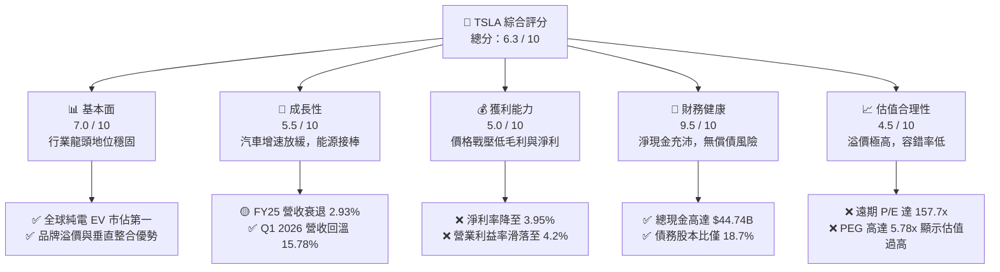

### 1.2 評分進度條視覺化

```
╔══════════════════════════════════════════════════════════════╗
║                TSLA 多維度評分儀表板 (1-10分)                 ║
╠══════════════════════════════════════════════════════════════╣
║ 基本面強度  7.0 ▓▓▓▓▓▓▓▓▓▓▓▓▓▓░░░░░░  ★★★★☆           ║
║ 成長動能    5.5 ▓▓▓▓▓▓▓▓▓▓▓░░░░░░░░░  ★★★☆☆           ║
║ 獲利品質    5.0 ▓▓▓▓▓▓▓▓▓▓░░░░░░░░░░  ★★★☆☆           ║
║ 財務健康    9.5 ▓▓▓▓▓▓▓▓▓▓▓▓▓▓▓▓▓▓▓░  ★★★★★           ║
║ 估值合理性  4.5 ▓▓▓▓▓▓▓▓▓░░░░░░░░░░░  ★★☆☆☆           ║
║ 護城河深度  8.5 ▓▓▓▓▓▓▓▓▓▓▓▓▓▓▓▓▓░░░  ★★★★☆           ║
║ 管理層執行  7.5 ▓▓▓▓▓▓▓▓▓▓▓▓▓▓▓░░░░░  ★★★★☆           ║
║ 技術創新力  9.0 ▓▓▓▓▓▓▓▓▓▓▓▓▓▓▓▓▓▓░░  ★★★★★           ║
╠══════════════════════════════════════════════════════════════╣
║ 綜合總分    6.3 ▓▓▓▓▓▓▓▓▓▓▓▓▓░░░░░░░  🏆 評語：過渡期持有  ║
╚══════════════════════════════════════════════════════════════╝
```

### 1.3 五大投資論點 + 三大核心風險

| 類型 | 項目 | 具體依據 | 信心度 |
|------|------|----------|--------|
| 🟢 **投資論點①** | **能源業務爆發性成長** | Megapack 儲能需求強勁，FY25 現金與短期投資成長 20.5% 至 $44.06B，主要由儲能裝機量驅動。 | 🟢 極高 |
| 🟢 **投資論點②** | **極致的財務安全邊際** | 擁有 $44.74B 總現金，扣除 $15.89B 總債務後，淨現金達 $28.85B，流動比率高達 2.043x。 | 🟢 極高 |
| 🟢 **投資論點③** | **FSD 軟體高毛利預期** | 遠期 EPS (Forward EPS) 預估達 $2.50，相較於 TTM EPS $1.09 有翻倍成長空間，主要依賴 FSD 訂閱與授權。 | 🟡 高 |
| 🟢 **投資論點④** | **Q1 2026 基本面築底回升** | Q1 2026 營收達 $22.39B (YoY +15.78%)，擺脫 FY25 的衰退陰霾，顯示新平台與降價策略見效。 | 🟡 高 |
| 🟢 **投資論點⑤** | **研發投入持續擴大** | TTM R&D 費用達 $6.95B (YoY +8.38%)，持續在 AI 訓練晶片 (Dojo) 與人形機器人 (Optimus) 保持技術領先。 | 🟡 高 |
| 🟡 **風險①** | **車用毛利率持續承壓** | 價格戰導致整體毛利率由 FY22 的 25.6% 滑落至 TTM 的 19.1%，營業利益率降至 4.2% 的歷史低點。 | 🔴 高衝擊 |
| 🔴 **風險②** | **估值乘數高企，容錯率極低** | Trailing P/E 達 361.78x，Forward P/E 達 157.74x，一旦自動駕駛或機器人進度落後，將面臨估值雙殺。 | 🔴 高衝擊 |
| 🔴 **風險③** | **自由現金流生成能力放緩** | TTM FCF 降至 $5.25B，受制於高額資本支出 ($8.53B) 與營運資金佔用，FCF 殖利率僅 0.35%。 | 🟡 中度 |

### 1.4 快速統計卡片

| 指標 | 特斯拉實際值 (TSLA) | 行業均值 (新能源汽車) | S&P 500 均值 | 評估狀態 |
|------|-------------|----------|--------------|------|
| **營收 YoY 成長** | **15.8%** (Q1 '26) | ~8.0% | ~5.5% | 🟢 優於同業 |
| **毛利率** | **19.1%** | ~12.5% | ~30.0% | 🟡 領先車廠，遜於科技股 |
| **淨利率** | **3.9%** | ~1.5% | ~11.5% | 🔴 獲利能力大幅稀釋 |
| **股東權益報酬率 (ROE)** | **4.9%** | ~2.1% | ~15.0% | 🔴 資本效率偏低 |
| **遠期本益比 (Forward P/E)**| **157.74x** | ~25.0x | ~21.5x | 🔴 估值極度昂貴 |
| **淨現金規模** | **$28.85B** | 普遍為淨債務 | N/A | 🟢 極其強勁 |

### 1.5 投資結論

```
╔══════════════════════════════════════════════════════════════════╗
║                    📊 TSLA 投資結論摘要                          ║
╠══════════════════════════════════════════════════════════════════╣
║  評級：🟡 持有 (Hold)                                            ║
║  當前股價 (2026-06-17)：$394.34                                  ║
║  目標價區間：                                                    ║
║    悲觀情境 (Bear Case)：$180.00 (-54.35%)                       ║
║    基準情境 (Base Case)：$420.55 (+6.65%)   ← 12個月主要目標    ║
║    樂觀情境 (Bull Case)：$550.00 (+39.47%)                       ║
║  投資評分：6.3 / 10.0                                            ║
║  適合投資人：具備高風險承受度、看好 AI/自動駕駛長線發展的投資人  ║
╚══════════════════════════════════════════════════════════════════╝
```

---

## 2. 公司概覽與商業模式

### 2.1 業務結構與收入來源

特斯拉已從單純的電動車製造商轉型為「新能源與 AI 機器人平台」。其業務結構主要分為三大板塊：

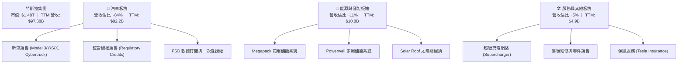

### 2.2 市場份額

在純電動車 (BEV) 市場與商用儲能 (BESS) 市場中，特斯拉依然佔據舉足輕重的地位。

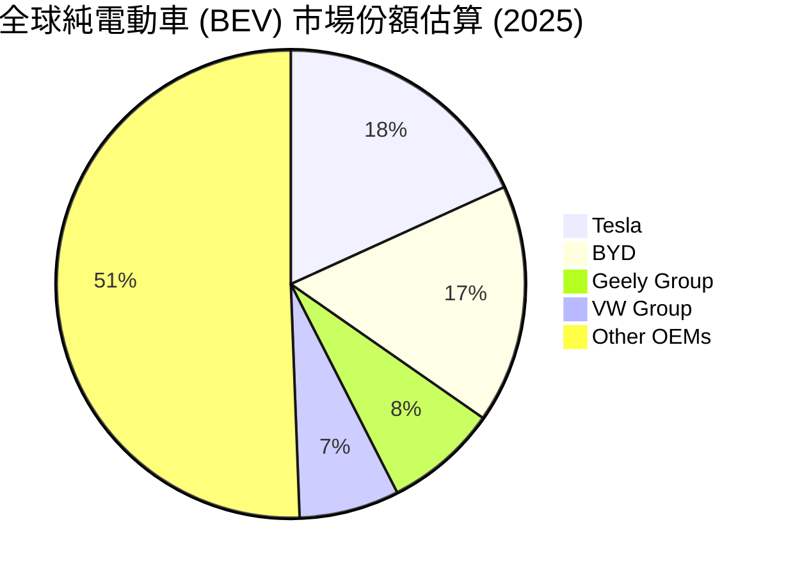

### 2.3 競爭護城河分析

特斯拉的競爭護城河並非單一維度，而是由硬體、軟體、基礎設施與供應鏈交織而成的網絡。

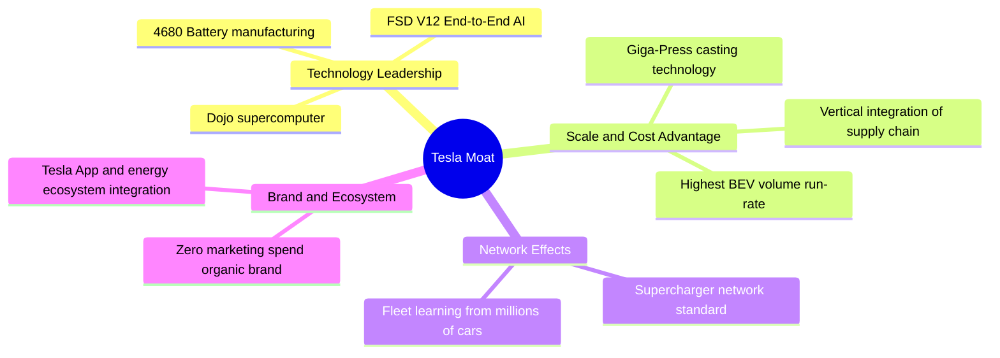

### 2.4 護城河強度評分

```
╔══════════════════════════════════════════════════════════════╗
║                  TSLA 護城河強度評分                         ║
╠══════════════════════════════════════════════════════════════╣
║ 軟體與 AI 技術  9.5/10 ▓▓▓▓▓▓▓▓▓▓▓▓▓▓▓▓▓▓▓░  🏆 行業絕對領先 ║
║ 製造與成本優勢  8.5/10 ▓▓▓▓▓▓▓▓▓▓▓▓▓▓▓▓▓░░░  🟢 一體化壓鑄領先║
║ 超充基礎設施    9.0/10 ▓▓▓▓▓▓▓▓▓▓▓▓▓▓▓▓▓▓░░  🟢 NACS 標準統一 ║
║ 品牌與生態鎖定  8.0/10 ▓▓▓▓▓▓▓▓▓▓▓▓▓▓▓▓░░░░  🟢 用戶忠誠度極高║
╠══════════════════════════════════════════════════════════════╣
║ 綜合護城河評級  8.75   ▓▓▓▓▓▓▓▓▓▓▓▓▓▓▓▓▓░░░  🏆 寬廣護城河    ║
╚══════════════════════════════════════════════════════════════╝
```

---

## 3. 損益表深度分析

### 3.1 年度收入成長趨勢（近5年）

特斯拉在經歷了 FY21-FY23 的高速成長後，於 FY24 與 FY25 進入了平台整理期。主要原因在於 Model 3/Y 平台逐漸成熟，而次世代平價車款尚未大規模量產，加上全球電動車需求增速放緩與價格戰。

```
╔══════════════════════════════════════════════════════════════════╗
║                 TSLA 年度收入趨勢 (FY2021-TTM)                  ║
╠══════════════════════════════════════════════════════════════════╣
║                                                                  ║
║  FY2021  $53.82B  ██████████░░░░░░░░░░░░░░░░░░  YoY: +70.67% 🟢  ║
║  FY2022  $81.46B  ███████████████░░░░░░░░░░░░░  YoY: +51.35% 🟢  ║
║  FY2023  $96.77B  ██████████████████░░░░░░░░░░  YoY: +18.80% 🟢  ║
║  FY2024  $97.69B  ██████████████████░░░░░░░░░░  YoY:  +0.95% 🟡  ║
║  FY2025  $94.83B  █████████████████░░░░░░░░░░░  YoY:  -2.93% 🔴  ║
║  TTM     $97.88B  ██████████████████░░░░░░░░░░  YoY:  +2.25% 🟡  ║
║                                                                  ║
║  📊 5年累計營收 CAGR：+16.15%                                    ║
╚══════════════════════════════════════════════════════════════════╝
```

### 3.2 季度收入趨勢分析

從季度數據來看，特斯拉在 FY25 經歷了嚴酷的低谷（特別是 Q1 2025 營收年減 9.23%），但自 Q3 2025 起營收開始強勁反彈，並在 **Q1 2026 實現了 $22.39B 的營收，年增率高達 15.78%**。這表明最壞的時間點可能已經過去。

| 財報季度 | 營收 (Revenue) | YoY 成長率 | QoQ 成長率 | 核心驅動因素與備註 | 評估 |
|---|---|---|---|---|---|
| **Q1 2026** | $22.39B | **+15.78%** | -10.08% | 新版 Model 3/Y 交付量回升，儲能裝機量維持高檔。 | 🟢 強勁 |
| **Q4 2025** | $24.90B | **-3.14%** | -11.39% | 年底促銷與價格補貼稀釋平均售價 (ASP)。 | 🔴 疲弱 |
| **Q3 2025** | $28.10B | **+11.57%** | +24.89% | 季節性交付高峰，Megapack 儲能出貨創歷史新高。 | 🟢 強勁 |
| **Q2 2025** | $22.50B | **-11.78%** | +16.34% | 產線升級導致短暫停工，紅海危機影響供應鏈。 | 🔴 衰退 |

### 3.3 利潤率演變分析

特斯拉的利潤率在過去幾年呈現明顯的滑落趨勢。毛利率從 FY22 的 25.6% 降至 TTM 的 19.1%，而營業利益率更是從 16.8% 驟降至 4.2%。

| 利潤率指標 | FY2022 | FY2023 | FY2024 | FY2025 | TTM | 趨勢評估 | 狀態 |
|---|---|---|---|---|---|---|---|
| **毛利率** | 25.6% | 18.2% | 17.9% | 18.0% | **19.1%** | 底部回升：降成本與儲能高毛利稀釋效應抵消。 | 🟡 穩定 |
| **營業利益率** | 16.8% | 9.2% | 7.2% | 4.6% | **4.2%** | 持續承壓：主要受 R&D 與 AI 基礎設施高投入拖累。 | 🔴 惡化 |
| **EBITDA 邊際率** | 21.7% | 15.3% | 15.1% | 12.4% | **11.3%** | 折舊攤銷增加，整體現金生成率放緩。 | 🟡 尚可 |
| **淨利率** | 15.4% | 15.5% | 7.3% | 4.1% | **3.9%** | 獲利能力降至近年低點，低於 S&P 500 均值。 | 🔴 警訊 |

**利潤率惡化原因深度解析**：
1. **價格戰與 ASP 下滑**：為了維持工廠產能利用率，特斯拉在過去兩年多次調降全球車價，導致單車毛利顯著縮水。
2. **AI 研發費用暴增**：研發費用 (R&D) 從 FY22 的 $3.08B 飆升至 TTM 的 $6.95B（成長超過 125%），主要用於採購 NVIDIA H100/H200 晶片與 Dojo 超級電腦建設。
3. **折舊與攤銷增加**：德州與柏林超級工廠的擴建，以及 4680 電池產線的資本支出轉化為折舊，壓低了營業利潤。

### 3.4 費用結構分析

在營收成長放緩的情況下，特斯拉依然選擇「逆週期」加大研發投入。

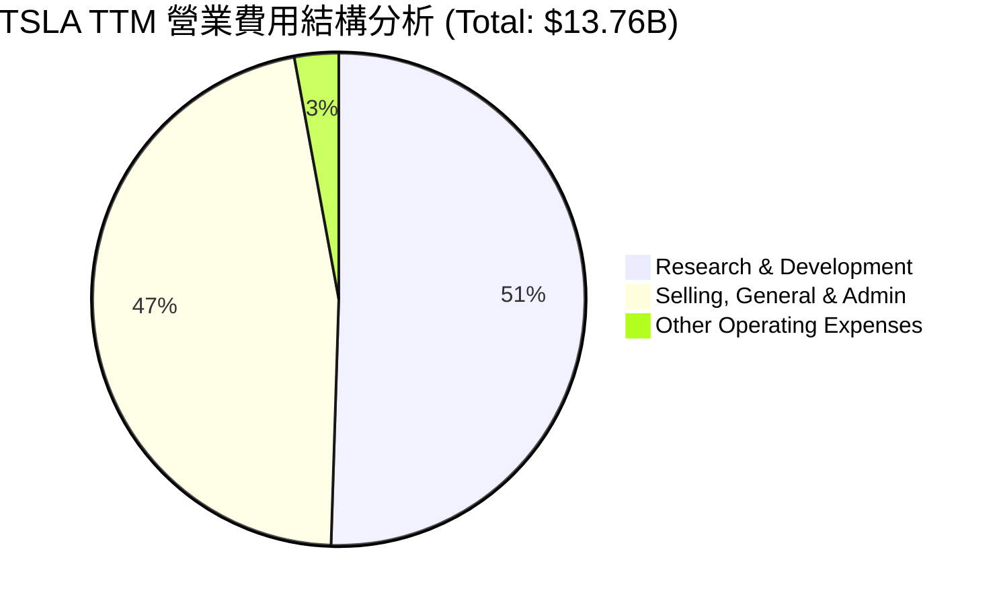

```
╔══════════════════════════════════════════════════════════════╗
║                  TSLA 費用控制與效率評估                      ║
╠══════════════════════════════════════════════════════════════╣
║ 研發費用 (R&D)  $6.95B   ████████████████████  YoY: +8.38%   ║
║ 銷管費用 (SG&A) $6.42B   ██████████████████░░  YoY: +24.58%  ║
║                                                              ║
║ 評估：SG&A 增速顯著高於營收增速，反映銷售渠道與售後擴張成本  ║
║ 增加。R&D 佔營收比重上升至 7.1%，符合其科技/AI 股定位。      ║
╚══════════════════════════════════════════════════════════════╝
```

### 3.5 季度 EPS 趨勢與盈餘品質

過去四個季度，特斯拉的稀釋後 EPS 表現如下：
*   **Q1 2026**：$0.15 (YoY +15.4%) ｜ *評估：高於 Q1 2025 的 $0.13，顯示獲利能力見底。*
*   **Q4 2025**：$0.26 (YoY -63.9%) ｜ *評估：大幅低於 FY24 同期的 $0.72，主要受年終降價與稅務調整影響。*
*   **Q3 2025**：$0.43 (YoY -36.8%) ｜ *評估：儲能業務貢獻顯著，部分抵消汽車毛利下滑。*
*   **Q2 2025**：$0.36 (YoY -18.2%) ｜ *評估：表現平庸，符合市場悲觀預期。*

**盈餘品質診斷**：
特斯拉 TTM 淨利為 $3.93B，而營運現金流 (OCF) 達 $16.53B。**OCF / Net Income 比率高達 4.2x**，顯示其淨利背後有極其強勁的現金流入支持，並無虛增利潤或應收帳款過高的問題。盈餘品質極佳 🟢。

---

## 4. 資產負債表分析

### 4.1 資產結構分解

特斯拉的資產負債表非常輕盈，流動資產佔比高，且幾乎沒有無形資產與商譽，資產含金量極高。

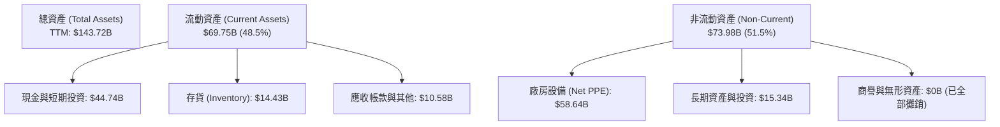

### 4.2 流動性指標分析

| 流動性指標 | TSLA 數值 | 行業均值 | 評估與健康狀況診斷 | 狀態 |
|---|---|---|---|---|
| **流動比率 (Current Ratio)** | **2.043x** | 1.25x | 流動資產為流動負債的兩倍以上，短期償債能力極強。 | 🟢 極其安全 |
| **速動比率 (Quick Ratio)** | **1.430x** | 0.85x | 扣除存貨後，速動資產仍能完全覆蓋短期債務。 | 🟢 極其安全 |
| **存貨週轉天數 (Days Inventory)**| **66.5 天** | 55.0 天 | 存貨週轉天數較 FY23 的 51.2 天有所拉長，反映車輛去化速度放緩。 | 🟡 需注意 |

### 4.3 債務結構分析

特斯拉在過去幾年進行了激進的去槓桿，目前已成為淨現金公司。

```
╔══════════════════════════════════════════════════════════════════╗
║                   TSLA 債務健康診斷 (2026-03-31)                 ║
╠══════════════════════════════════════════════════════════════════╣
║                                                                  ║
║  總債務：        $15.89B  ████░░░░░░░░░░░░░░░░░░░  無短期還款壓力║
║  總現金+投資：   $44.74B  ██████████████████████░  全球車企第一梯║
║  淨現金 (Net Cash)：$28.85B  ██████████████░░░░░░░░░  🟢 極其充沛   ║
║                                                                  ║
║  債務/股本比 (Debt/Equity)： 18.74%  🟢 極低 (無財務槓桿風險)    ║
║  利息保障倍數 (Interest Coverage)：14.4x 🟢 息稅前利潤輕鬆覆蓋利息║
║                                                                  ║
║  📊 診斷結論：特斯拉擁有鋼鐵般的資產負債表，足以抵禦任何行業蕭條 ║
╚══════════════════════════════════════════════════════════════════╝
```

### 4.4 股東權益趨勢

隨著留存收益的累積，特斯拉的股東權益（淨資產）逐年穩步攀升，這為其高估值提供了實質的資產支撐。

```
╔══════════════════════════════════════════════════════════════════╗
║               TSLA Stockholders Equity 歷年趨勢                 ║
╠══════════════════════════════════════════════════════════════════╣
║                                                                  ║
║  FY2022  $44.70B  ███████████░░░░░░░░░░░░░░░░░░                  ║
║  FY2023  $62.63B  ███████████████░░░░░░░░░░░░░░                  ║
║  FY2024  $72.91B  ██████████████████░░░░░░░░░░░                  ║
║  FY2025  $82.14B  ████████████████████░░░░░░░░░                  ║
║                                                                  ║
║  📈 3年股東權益複合成長率 (CAGR)：+22.48%                         ║
╚══════════════════════════════════════════════════════════════════╝
```

---

## 5. 現金流量深度分析

### 5.1 現金流量瀑布圖

特斯拉的現金流運作機制非常健康，營運現金流足以支應高昂的資本支出，並留下正的自由現金流。

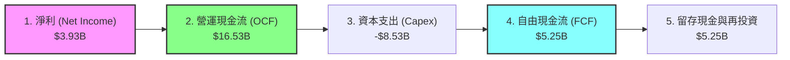

### 5.2 FCF 轉換率趨勢

| 財報年度 | 營運現金流 (OCF) | 資本支出 (Capex) | 自由現金流 (FCF) | FCF / Net Income 轉換率 | 評估 |
|---|---|---|---|---|---|
| **FY2022** | $14.72B | -$7.17B | $7.55B | 60.0% | 🟢 高效 |
| **FY2023** | $13.26B | -$8.90B | $4.36B | 29.1% | 🔴 受 Capex 擴張壓制 |
| **FY2024** | $14.92B | -$11.34B | $3.58B | 50.2% | 🟡 尚可 |
| **FY2025** | $14.75B | -$8.53B | $6.22B | **161.3%** | 🟢 極高 (受一次性非現金調整驅動) |
| **TTM** | $16.53B | -$11.28B | $5.25B | **133.6%** | 🟢 強勁的現金生成品質 |

### 5.3 自由現金流趨勢

儘管 FCF 轉換率高，但由於股價與市值高達 $1.48T，相較之下，**FCF 殖利率 (FCF Yield) 僅為 0.35%**。這意味著從現金流角度來看，當前股價溢價極高。

```
╔══════════════════════════════════════════════════════════════════╗
║                    TSLA 自由現金流趨勢                           ║
╠══════════════════════════════════════════════════════════════════╣
║                                                                  ║
║  FY2022  $7.55B  █████████████████████░░░░░░░░░                  ║
║  FY2023  $4.36B  ████████████░░░░░░░░░░░░░░░░░░                  ║
║  FY2024  $3.58B  ██████████░░░░░░░░░░░░░░░░░░░░                  ║
║  FY2025  $6.22B  █████████████████░░░░░░░░░░░░░                  ║
║  TTM     $5.25B  ███████████████░░░░░░░░░░░░░░░                  ║
║                                                                  ║
║  💡 當前 FCF 殖利率：0.35% (估值顯著透支未來現金流)              ║
╚══════════════════════════════════════════════════════════════════╝
```

### 5.4 資本配置評估

特斯拉不發放股利，亦極少進行股份回購。其資本配置 100% 聚焦於再投資與維持極高的流動性。

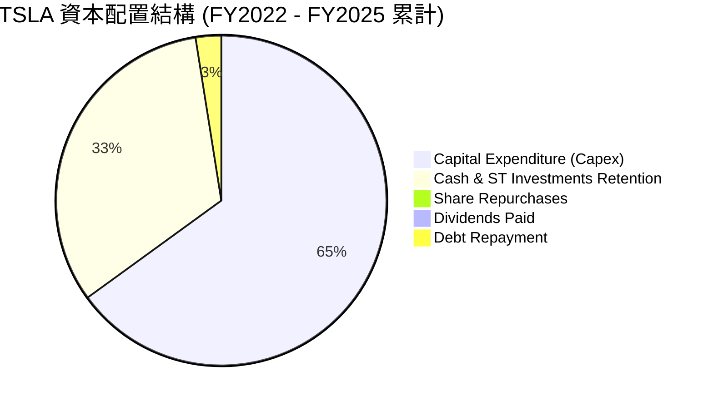

---

## 6. 獲利能力與資本效率

### 6.1 ROE / ROA / ROIC 趨勢

由於利潤率下滑與股東權益的快速累積，特斯拉的資本回報率指標在過去三年出現了退潮。

| 效率指標 | FY2022 | FY2023 | FY2024 | FY2025 | TTM | 行業均值 | 狀態 |
|---|---|---|---|---|---|---|---|
| **ROE** | 28.1% | 24.0% | 9.8% | 4.7% | **4.9%** | 2.1% | 🟡 領先同業，但自身顯著退步 |
| **ROA** | 15.3% | 14.0% | 5.9% | 2.8% | **2.2%** | 1.0% | 🟡 資產利用效率降低 |
| **ROIC** | 22.4% | 16.5% | 7.8% | 5.1% | **6.3%** | 1.8% | 🔴 資本回報率面臨拷問 |

### 6.2 ROIC vs WACC 分析（核心價值創造判斷）

ROIC (投資資本回報率) 是否大於 WACC (加權平均資本成本) 是衡量一家公司是在「創造價值」還是「摧毀價值」的核心指標。

```
╔══════════════════════════════════════════════════════════════════╗
║                ROIC vs WACC 深度分析 (TTM)                      ║
╠══════════════════════════════════════════════════════════════════╣
║                                                                  ║
║  WACC 估算：                                                     ║
║  ├── 無風險利率 (10Y美債)：  4.20%                               ║
║  ├── 市場風險溢酬 (ERP)：     5.00%                              ║
║  ├── Beta (系統性風險)：      1.798                              ║
║  ├── 股權成本 = 4.2% + 1.798 × 5.0% = 13.19%                      ║
║  ├── 債務成本 (稅後)：       ~4.50%                              ║
║  ├── 資本結構：股權 98.9%，債務 1.1%                             ║
║  └── ✅ 加權 WACC ≈ 13.10%                                       ║
║                                                                  ║
║  ROIC 估算 (TTM)：                                               ║
║  ├── NOPAT = EBIT $4.897B × (1 - 27.8% 稅率) ≈ $3.536B           ║
║  ├── 投入資本 = 股東權益 $82.14B + 債務 $15.89B - 現金 $44.74B    ║
║  │   投入資本 = $53.29B                                          ║
║  └── ✅ ROIC ≈ 6.64%                                             ║
║                                                                  ║
║  ★ 經濟價值增加 (EVA) = ROIC - WACC = -6.46%                      ║
║                                                                  ║
║  ROIC  6.64%   ▓▓▓▓▓▓▓░░░░░░░░░░░░░░░░░░░░░░░  🔴               ║
║  WACC  13.10%  ▓▓▓▓▓▓▓▓▓▓▓▓▓░░░░░░░░░░░░░░░░░  ──               ║
║  EVA   -6.46%  ███████░░░░░░░░░░░░░░░░░░░░░░░  🔴 價值暫時受損  ║
║                                                                  ║
║  📊 結論：目前特斯拉的 ROIC (6.64%) 低於其高昂的 WACC (13.1%)。   ║
║  這主要是高 Beta 導致股權成本極高，而當前汽車價格戰壓低了 NOPAT。║
║  特斯拉目前在資本效率上面臨挑戰，亟需高毛利的軟體收入來拉高 ROIC。║
╚══════════════════════════════════════════════════════════════════╝
```

### 6.3 杜邦三因素分解

透過杜邦分析，我們可以清晰看到 ROE 下滑的深層原因：

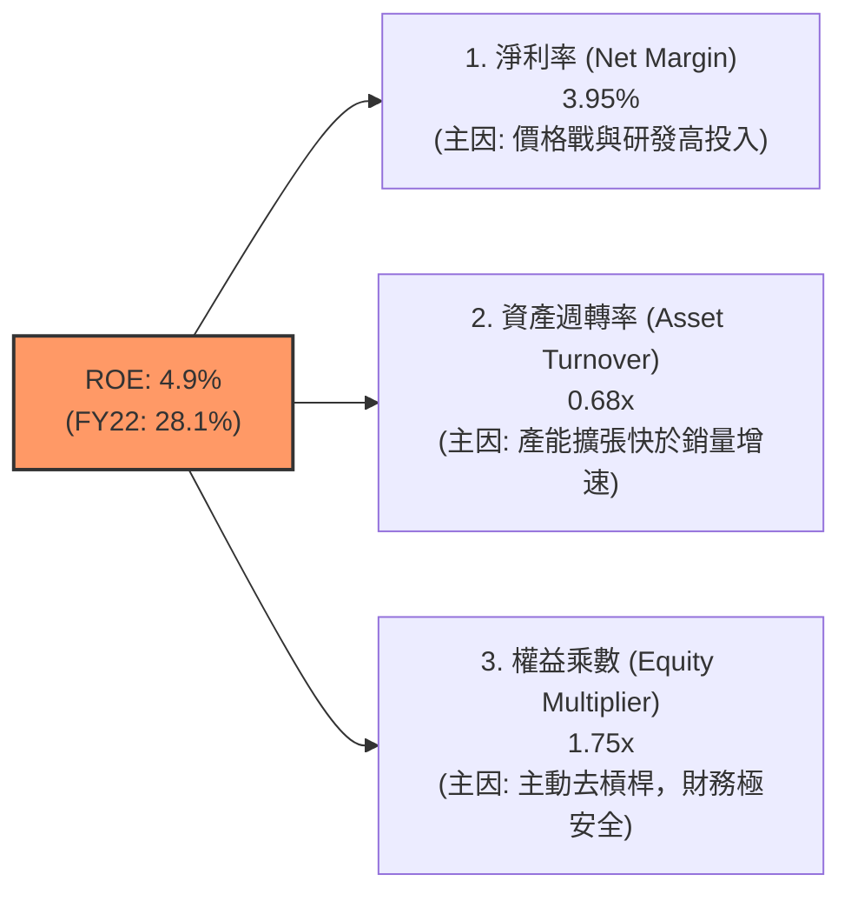

### 6.4 獲利能力儀表板

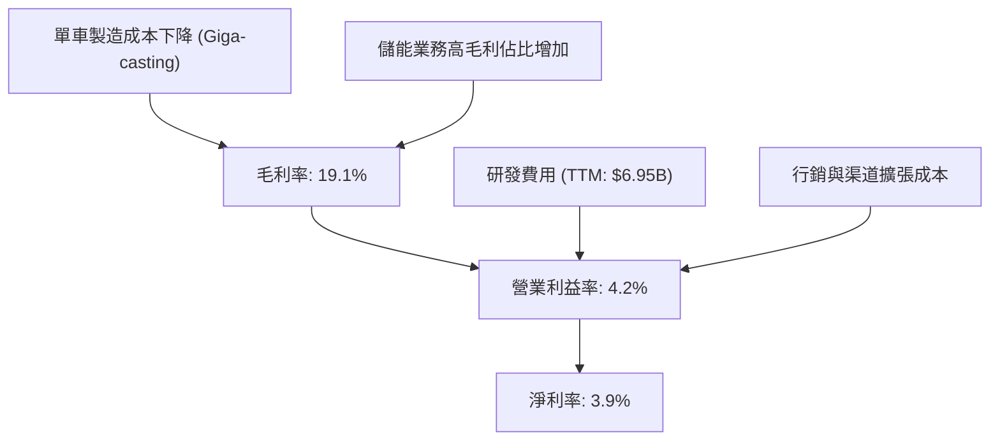

---

## 7. 估值深度分析

### 7.1 同業估值比較表格

將特斯拉與全球主要車企（傳統巨頭與新能源龍頭）進行對比，可以發現特斯拉的估值乘數遠超傳統製造業，市場顯然將其視為 AI/科技股。

| 估值指標 | **Tesla (TSLA)** | **BYD (01211.HK)** | **Toyota (TM)** | **NVIDIA (NVDA)** | TSLA 估值評估 | 狀態 |
|---|---|---|---|---|---|---|
| **Trailing P/E** | **361.78x** | 22.4x | 8.8x | 68.5x | 極度昂貴，透支多年成長空間。 | 🔴 警訊 |
| **Forward P/E** | **157.74x** | 18.1x | 9.2x | 35.2x | 依賴 FY26/FY27 獲利出現爆發性成長。 | 🔴 偏高 |
| **P/S Ratio** | **15.13x** | 1.15x | 0.85x | 28.4x | 遠超一般車企（通常 < 1.5x）。 | 🔴 偏高 |
| **P/B Ratio** | **18.01x** | 3.85x | 1.10x | 42.0x | 資產溢價極高。 | 🔴 偏高 |
| **EV / EBITDA** | **134.45x** | 11.2x | 6.5x | 48.0x | 企業價值相對於折舊前利潤極高。 | 🔴 偏高 |

### 7.2 歷史估值區間分析

特斯拉的 P/E (Trailing) 目前處於歷史區間的中高位。雖然其股價較歷史高點有所回落，但由於 TTM EPS 從 FY23 的 $4.30 滑落至 $1.09，導致本益比被動拉高。

```
╔══════════════════════════════════════════════════════════════════╗
║               TSLA 歷史本益比 (P/E) 區間與當前位置               ║
╠══════════════════════════════════════════════════════════════════╣
║                                                                  ║
║  歷史最低：  45x   (2023年初)                                    ║
║  歷史中位數：120x                                                ║
║  歷史最高：  1100x (2020年底)                                    ║
║                                                                  ║
║  當前 P/E：361.78x                                               ║
║  [45x]---------------------------*----------------------[1100x]  ║
║                                 當前                             ║
║                                                                  ║
║  💡 評估：當前本益比主要反映了市場對 FSD 與 Robotaxi 的極高期望。 ║
╚══════════════════════════════════════════════════════════════════╝
```

### 7.3 DCF 敏感性分析（9格目標價矩陣）

基於以下基準假設進行三階段 DCF 建模：
*   **基準階段營收 CAGR** (Next 5Y)：15.0%
*   **終端成長率** (Terminal Growth Rate)：3.0%
*   **基準稅率**：21.0%

| 情境 \ WACC | **12.0%** | **13.1% (基準)** | **14.0%** |
|---|---|---|---|
| 🟢 **樂觀情境** (營收成長 22%) | $595.00 (+50.9%) | **$550.00** (+39.5%) | $512.00 (+29.8%) |
| 🟡 **基準情境** (營收成長 15%) | $458.00 (+16.1%) | **$420.55** (+6.65%) | $390.00 (-1.10%) |
| 🔴 **悲觀情境** (營收成長 8%) | $210.00 (-46.7%) | **$180.00** (-54.3%) | $155.00 (-60.7%) |

### 7.4 估值綜合區間

綜合多種估值方法（DCF、同業 P/E 乘數、SOTP 分部估值法），我們得出特斯拉的合理價值區間：

```
╔══════════════════════════════════════════════════════════════════╗
║                     TSLA 估值綜合區間                            ║
╠══════════════════════════════════════════════════════════════════╣
║                                                                  ║
║  清算價值 (Book Value)：      $23.00                             ║
║  純汽車業務價值 (15x P/E)：   $75.00                             ║
║  基準目標價 (SOTP 估值)：     $420.55                            ║
║  當前股價：                  $394.34                            ║
║                                                                  ║
║  $23 -------- $75 -------------- $394.34 ---- $420.55 ---- $600  ║
║  清算價     汽車價值             當前股價     基準目標   最高目標║
║                                                                  ║
║  📊 結論：當前股價已隱含了約 80% 的「非汽車業務（AI+儲能）」溢價。║
╚══════════════════════════════════════════════════════════════════╝
```

---

## 8. 成長催化劑

### 8.1 催化劑時間軸

特斯拉未來的關鍵成長催化劑已從「產能擴張」轉向「技術變現」。

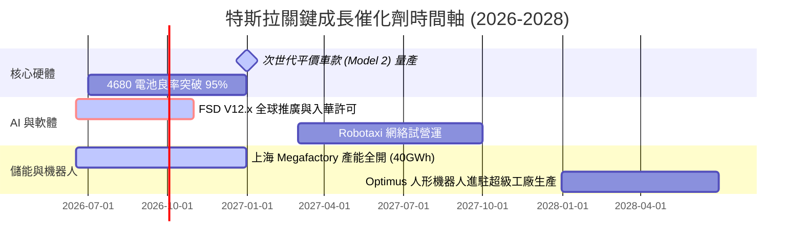

### 8.2 TAM 市場規模分析

特斯拉正在同時切入多個萬億級市場，這也是其享有高估值溢價的底氣。

```
╔══════════════════════════════════════════════════════════════════╗
║                    TSLA 潛在市場規模 (TAM) 分析                  ║
╠══════════════════════════════════════════════════════════════════╣
║                                                                  ║
║  1. 全球乘用車市場 (EV 轉型)：                                   ║
║     ├── TAM：~3.5 萬億美元 ｜ 預期特斯拉市佔率：10% - 15%        ║
║  2. 全球電網級儲能 (BESS)：                                      ║
║     ├── TAM：~3000 億美元  ｜ 預期特斯拉市佔率：25% - 30%        ║
║  3. 自動駕駛出行 (Robotaxi)：                                    ║
║     ├── TAM：~5.0 萬億美元 ｜ 預期特斯拉市佔率：20% (平台模式)   ║
║  4. 人形機器人 (具身智能)：                                      ║
║     ├── TAM：~8.0 萬億美元 ｜ 預期特斯拉市佔率：不確定 (藍海市場)║
║                                                                  ║
║  💡 結論：特斯拉的長期天花板極高，但短期變現進度是主要瓶頸。     ║
╚══════════════════════════════════════════════════════════════════╝
```

### 8.3 成長驅動力結構圖

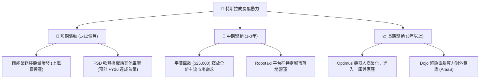

---

## 9. 風險矩陣

### 9.1 風險評分矩陣

```mermaid
quadrantChart
    title Risk Assessment Matrix (TSLA)
    x-axis Low Probability --> High Probability
    y-axis Low Impact --> High Impact
    quadrant-1 High Priority
    quadrant-2 Monitor Closely
    quadrant-3 Review Periodically
    quadrant-4 Watch

    Margin Compression: [0.85, 0.80]
    FSD Regulatory Delay: [0.65, 0.90]
    Key Man Risk (Elon Musk): [0.40, 0.85]
    Geopolitical (US-China): [0.70, 0.75]
    Battery Supply Bottleneck: [0.30, 0.50]
```

### 9.2 風險清單詳細分析

| # | 風險項目 | 發生機率 | 財務衝擊 | 風險評分 | 緩解措施 |
|---|---|---|---|---|---|
| 1 | 🔴 **毛利率持續收縮** | 高 (85%) | 高 (-15% 營業利潤) | 🔴 **8.5 / 10** | 加速二代平台開發以降低單車製造成本；提升儲能等高毛利業務佔比。 |
| 2 | 🔴 **FSD 監管與技術瓶頸**| 中高 (65%)| 極高 (-40% 估值溢價)| 🔴 **8.2 / 10** | 採用純視覺端到端 AI 架構，累積數十億英里真實路測數據以向監管機構證明安全性。 |
| 3 | 🟡 **地緣政治與供應鏈風險**| 高 (70%) | 中高 (-10% 產能) | 🟡 **7.0 / 10** | 實施供應鏈本土化，分散 Giga Shanghai 的生產壓力，擴建德州與柏林工廠。 |
| 4 | 🟡 **關鍵人物風險 (Elon Musk)**| 中 (40%) | 極高 (-30% 股價) | 🟡 **6.5 / 10** | 建立完善的副總裁與各事業部總裁梯隊（如朱曉彤等），強化董事會監督。 |

---

## 10. 投資建議

### 10.1 最終綜合評級雷達圖

```
╔══════════════════════════════════════════════════════════════╗
║                    TSLA 綜合投資能力雷達                     ║
╠══════════════════════════════════════════════════════════════╣
║                                                              ║
║  財務安全度：  9.5/10  ▓▓▓▓▓▓▓▓▓▓▓▓▓▓▓▓▓▓▓░  ★★★★★   ║
║  技術領先度：  9.0/10  ▓▓▓▓▓▓▓▓▓▓▓▓▓▓▓▓▓▓░░  ★★★★★   ║
║  長期成長性：  7.5/10  ▓▓▓▓▓▓▓▓▓▓▓▓▓▓▓░░░░░  ★★★★☆   ║
║  估值安全邊際：4.0/10  ▓▓▓▓▓▓▓▓░░░░░░░░░░░░  ★★☆☆☆   ║
║  