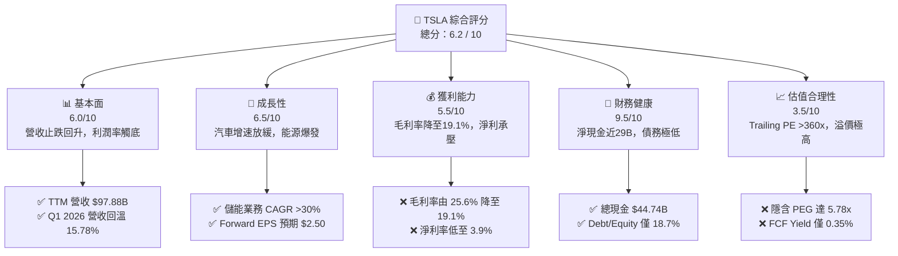
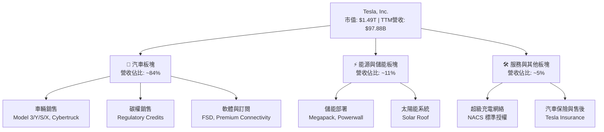
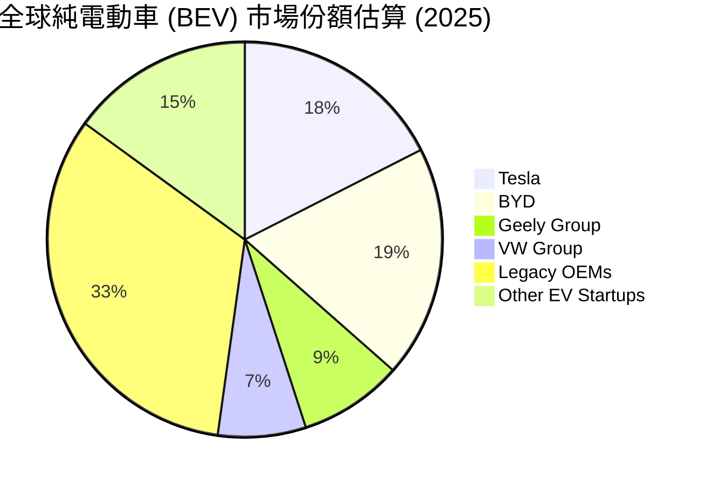
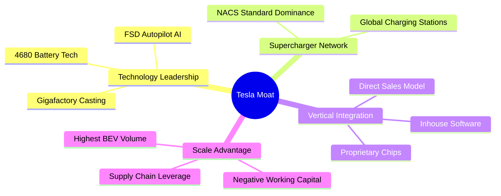
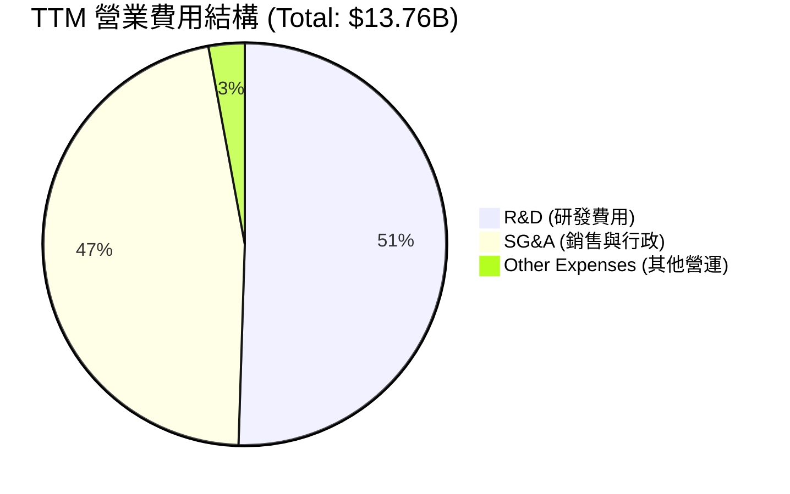
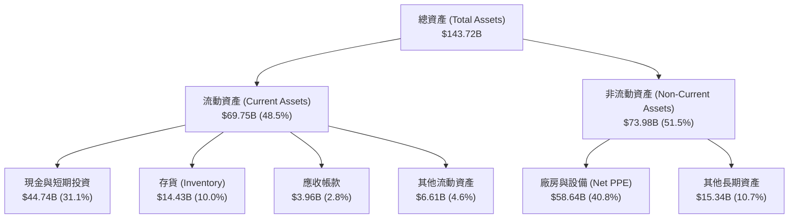
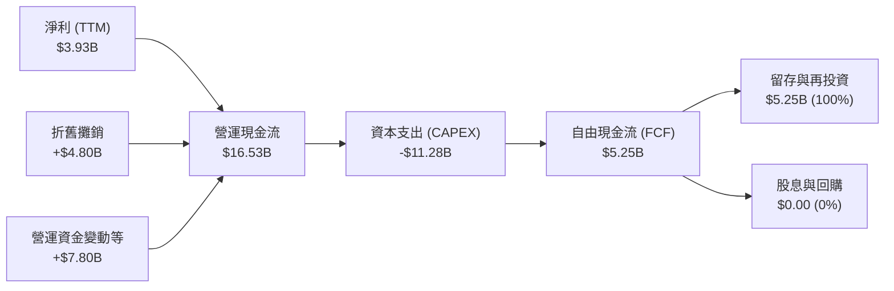
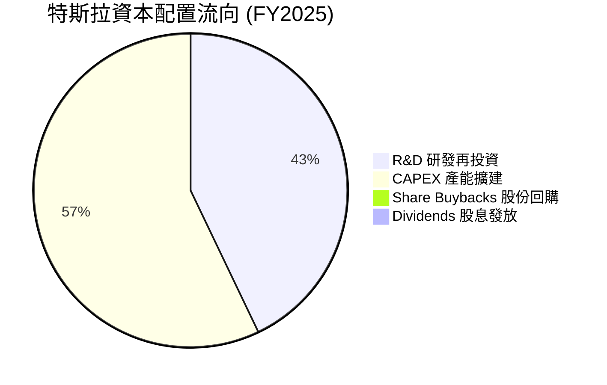
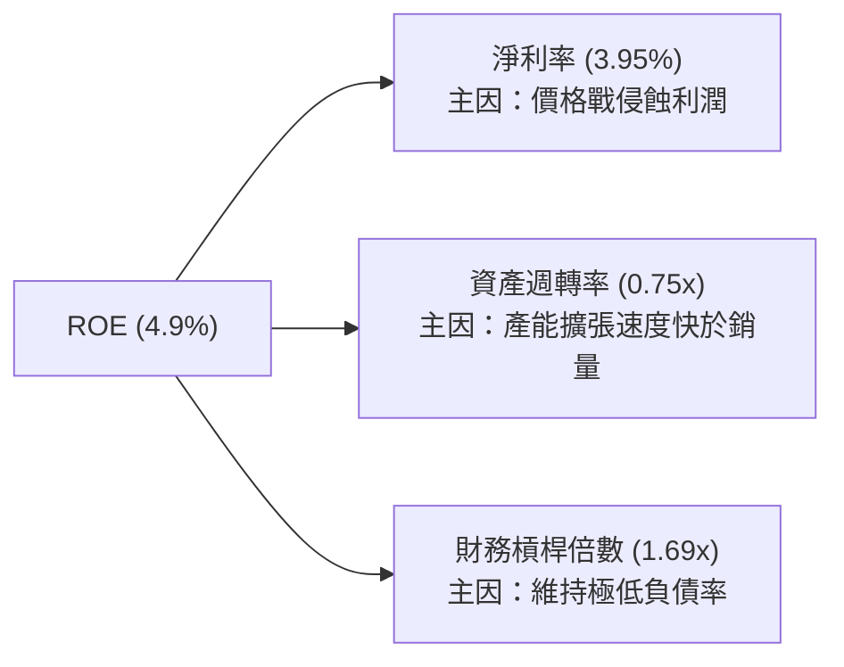
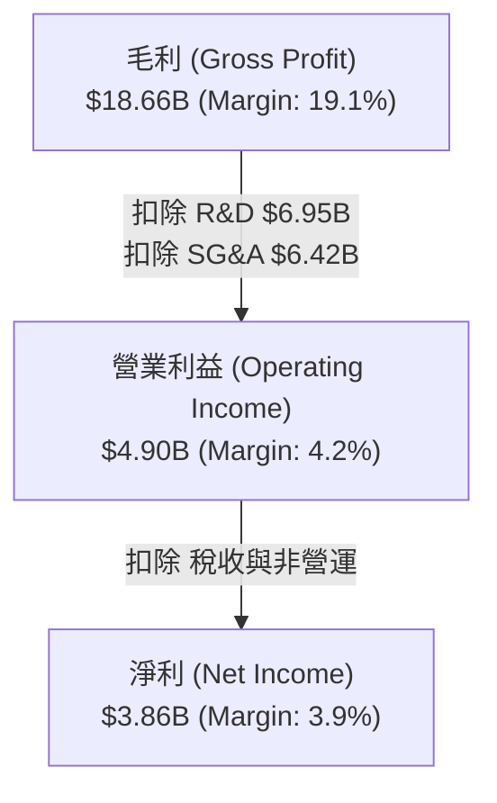

# TSLA 基本面深度分析報告

> **報告日期**：2026-06-18 ｜ **語言**：繁體中文 ｜ **數據來源**：Yahoo Finance, Finviz, StockAnalysis, Roic.ai ｜ **分析師**：CFA 級機構研究

---

## 目錄

| # | 章節 | 核心結論 |
|---|---|---|
| **1** | **執行摘要** | 評級為「持有」，基準目標價 $420.55，轉型期估值溢價偏高 |
| **2** | **公司概覽與商業模式** | 汽車與能源雙輪驅動，FSD 與生態系構成核心護城河 |
| **3** | **損益表深度分析** | 營收重回雙位數增長（Q1 YoY +15.78%），但毛利率承壓於 19.1% |
| **4** | **資產負債表分析** | 財務結構極度穩健，淨現金達 $28.85B，無流動性風險 |
| **5** | **現金流量深度分析** | TTM FCF 達 $5.25B，資本配置高度向研發與 CAPEX 傾斜 |
| **6** | **獲利能力與資本效率** | 杜邦分解顯示 ROE 降至 4.9%，ROIC（6.64%）低於 WACC 造成價值暫時流失 |
| **7** | **估值深度分析** | Trailing P/E 達 363.77x，Forward P/E 158.61x，相較同業具高溢價 |
| **8** | **成長催化劑** | 儲能裝機量暴增、FSD V12 商業化與下一代平價平台為關鍵驅動力 |
| **9** | **風險矩陣** | 價格戰侵蝕利潤率、自駕技術監管與關鍵人物風險為主要威脅 |
| **10** | **投資建議** | 建議採分批佈局策略，長線關注利潤率拐點與自駕進展 |

---

## 1. 執行摘要

### 1.1 核心評分儀表板



### 1.2 評分進度條視覺化

```
╔══════════════════════════════════════════════════════════════╗
║               TSLA 多維度評分儀表板 (1-10分)                 ║
╠══════════════════════════════════════════════════════════════╣
║ 基本面強度  6.0 ▓▓▓▓▓▓▓▓▓▓▓▓░░░░░░░░  ★★★☆☆           ║
║ 成長動能    6.5 ▓▓▓▓▓▓▓▓▓▓▓▓▓░░░░░░░  ★★★☆☆           ║
║ 獲利品質    5.5 ▓▓▓▓▓▓▓▓▓▓▓░░░░░░░░░  ★★★☆☆           ║
║ 財務健康    9.5 ▓▓▓▓▓▓▓▓▓▓▓▓▓▓▓▓▓▓▓░  ★★★★★           ║
║ 估值合理性  3.5 ▓▓▓▓▓▓░░░░░░░░░░░░░░  ★☆☆☆☆           ║
║ 護城河深度  8.5 ▓▓▓▓▓▓▓▓▓▓▓▓▓▓▓▓▓░░░  ★★★★☆           ║
║ 管理層執行  7.5 ▓▓▓▓▓▓▓▓▓▓▓▓▓▓▓░░░░░  ★★★☆☆           ║
║ 技術創新力  9.0 ▓▓▓▓▓▓▓▓▓▓▓▓▓▓▓▓▓▓░░  ★★★★★           ║
╠══════════════════════════════════════════════════════════════╣
║ 綜合總分    6.2 ▓▓▓▓▓▓▓▓▓▓▓▓░░░░░░░░  🏆 評語：過渡期持股║
╚══════════════════════════════════════════════════════════════╝
```

### 1.3 五大投資論點 + 三大核心風險

| 類型 | 項目 | 具體依據 | 信心度 |
|------|------|----------|--------|
| 🟢 **投資論點①** | **能源儲能業務爆發** | FY25 儲能部署加速，提供高於汽車業務的成長動能與利潤潛力。 | 🟢 極高 |
| 🟢 **投資論點②** | **極致的財務防禦力** | 擁有 $44.74B 的總現金與 $28.85B 的淨現金，能安然度過任何行業週期。 | 🟢 極高 |
| 🟢 **投資論點③** | **營收重回增長軌道** | Q1 2026 營收達 $22.39B，YoY 增長 15.78%，顯示需求端已見底回升。 | 🟢 高 |
| 🟢 **投資論點④** | **自駕（FSD）與軟體溢價** | FSD V12 滲透率提升，長線轉型為 AI/Robotaxi 生態系，享有科技股估值。 | 🟡 中等 |
| 🟢 **投資論點⑤** | **持續的研發與產能壁壘** | TTM 研發費用達 $6.95B 歷史新高，超級工廠一體化壓鑄持續優化成本。 | 🟢 高 |
| 🟡 **風險①** | **汽車利潤率持續承壓** | 價格戰持續，TTM 毛利率降至 19.1%，營業利益率僅 4.2%。 | 🔴 高衝擊 |
| 🔴 **風險②** | **極端高企的估值倍數** | Trailing P/E 363.77x，Forward P/E 158.61x，容錯率極低。 | 🔴 高衝擊 |
| 🟡 **風險③** | **新平台（平價車款）延遲** | 下一代低成本平台若無法如期在 2026/2027 年量產，成長將面臨真空。 | 🟡 中度 |

### 1.4 快速統計卡片

| 指標 | 公司實際值 | 行業均值 (Auto) | S&P 500 均值 | 狀態 |
|------|-------------|----------|--------------|------|
| **營收 YoY 成長** | **15.8%** | ~5.0% | ~6.5% | 🟢 領先 |
| **毛利率** | **19.1%** | ~14.5% | ~30.0% | 🟡 中等 |
| **淨利率** | **3.9%** | ~5.2% | ~11.5% | 🔴 偏低 |
| **ROE** | **4.9%** | ~8.5% | ~15.0% | 🔴 偏低 |
| **Forward P/E** | **158.61x** | ~12.5x | ~21.5x | 🔴 極高 |
| **淨現金規模** | **$28.85B** | 負債累累 | 淨債務 | 🟢 極強 |

### 1.5 投資結論

```
╔══════════════════════════════════════════════════════════════════╗
║                    📊 TSLA 投資結論摘要                          ║
╠══════════════════════════════════════════════════════════════════╣
║  評級：🟡 持有 (Hold)                                            ║
║  當前股價：$396.51 (2026-06-18)                                  ║
║  目標價區間：                                                    ║
║    悲觀情境：$250.00 (-37%)  ← 價格戰惡化，FSD 進度受阻          ║
║    基準情境：$420.55 (+6%)   ← 12個月主要目標（共識均值）        ║
║    樂觀情境：$550.00 (+39%)  ← FSD 授權成功，儲能利潤超預期      ║
║  投資評分：6.2 / 10                                              ║
║  適合投資人：願意承受高波動、看好 AI/自駕長線前景的成長型投資人   ║
╚══════════════════════════════════════════════════════════════════╝
```

---

## 2. 公司概覽與商業模式

### 2.1 業務結構與收入來源

特斯拉已從單純的電動車製造商，轉型為「智慧出行 + 能源儲備 + AI 軟體」的平台型企業。



### 2.2 市場份額

在北美與全球純電動車（BEV）市場中，特斯拉依然維持領先，但面臨比亞迪（BYD）等中國車企的強力挑戰。



### 2.3 競爭護城河分析



### 2.4 護城河強度評分

```
╔══════════════════════════════════════════════════════════════╗
║                   TSLA 護城河強度評分                        ║
╠══════════════════════════════════════════════════════════════╣
║ 技術與 AI 領先 9.0/10  ▓▓▓▓▓▓▓▓▓▓▓▓▓▓▓▓▓▓░░  🏆 FSD 具先發優勢║
║ 充電網絡壁壘   9.5/10  ▓▓▓▓▓▓▓▓▓▓▓▓▓▓▓▓▓▓▓░  🟢 NACS 統一北美 ║
║ 製造與成本優勢 8.5/10  ▓▓▓▓▓▓▓▓▓▓▓▓▓▓▓▓▓░░░  🟢 一體化壓鑄領先║
║ 品牌與生態鎖定 8.0/10  ▓▓▓▓▓▓▓▓▓▓▓▓▓▓▓▓░░░░  🟢 用戶忠誠度極高║
╠══════════════════════════════════════════════════════════════╣
║ 綜合護城河     8.75    ▓▓▓▓▓▓▓▓▓▓▓▓▓▓▓▓▓░░░  🏆 強大且難以複製║
╚══════════════════════════════════════════════════════════════╝
```

---

## 3. 損益表深度分析

### 3.1 年度收入成長趨勢

特斯拉的營收在經歷了 2021-2022 年的高速增長後，於 2024-2025 年進入高基期放緩平台期，但在 TTM（截至 2026 年第一季）展現出回暖跡象。

```
╔══════════════════════════════════════════════════════════════════╗
║                TSLA 年度收入趨勢 (FY2021 - TTM)                  ║
╠══════════════════════════════════════════════════════════════════╣
║                                                                  ║
║  FY 2021  $53.82B  ███████████░░░░░░░░░░░░░░░░░░░  YoY: +70.7% 🟢║
║  FY 2022  $81.46B  █████████████████░░░░░░░░░░░░░  YoY: +51.4% 🟢║
║  FY 2023  $96.77B  ████████████████████░░░░░░░░░░  YoY: +18.8% 🟢║
║  FY 2024  $97.69B  ████████████████████░░░░░░░░░░  YoY: +1.0%  🟡║
║  FY 2025  $94.83B  ███████████████████░░░░░░░░░░░  YoY: -2.9%  🔴║
║  TTM      $97.88B  ████████████████████░░░░░░░░░░  YoY: +2.3%  🟡║
║                                                                  ║
║                   |      |      |      |      |                  ║
║                   0     20B    40B    60B    80B                 ║
║                                                                  ║
║  📊 4年複合成長率 (CAGR)：+16.1%                                 ║
╚══════════════════════════════════════════════════════════════════╝
```

### 3.2 季度收入趨勢分析

| 季度 | 營收 (Billion) | YoY 成長率 | QoQ 成長率 | 核心驅動因素與備註 | 評估 |
|------|----------------|------------|------------|-------------------|------|
| **Q1 2026** | **$22.39B** | **+15.78%** | -10.09% | 季節性銷量放緩，但受惠於儲能出貨與中國市場回溫，YoY 強勁反彈。 | 🟢 偏多 |
| **Q4 2025** | **$24.90B** | -3.14% | -11.37% | 年底促銷折扣侵蝕營收，且面臨強烈競爭。 | 🔴 偏空 |
| **Q3 2025** | **$28.10B** | **+11.57%** | **+24.89%** | 交付量創季度新高，Cybertruck 產能爬坡順利。 | 🟢 偏多 |
| **Q2 2025** | **$22.50B** | -11.78% | **+16.35%** | 經歷 Q1 的交付低谷後顯著回升。 | 🟡 中立 |

*分析：季度營收在 Q3 2025 達到高峰後，Q4 2025 與 Q1 2026 受到季節性與價格戰雙重影響而下滑。然而，Q1 2026 的 YoY 增長率重回 15.78%，顯示最差的時期可能已經過去。*

### 3.3 利潤率演變分析

| 利潤率指標 | FY 2022 | FY 2023 | FY 2024 | FY 2025 | TTM | 趨勢 | 評估 |
|------------|---------|---------|---------|---------|-----|------|------|
| **毛利率** | 25.60% | 18.25% | 17.86% | 18.03% | **19.07%** | ↘️ 觸底回升 | 🟡 改善中 |
| **營業利益率** | 16.76% | 9.19% | 7.24% | 4.59% | **4.20%** | ↘️ 下行 | 🔴 承壓 |
| **EBITDA  Margin** | 21.68% | 15.30% | 15.06% | 12.40% | **11.30%** | ↘️ 下行 | 🔴 承壓 |
| **淨利率** | 15.45% | 15.47% | 7.32% | 4.07% | **3.95%** | ↘️ 下行 | 🔴 偏低 |

**利潤率演變深度解析**：
1. **毛利率觸底**：毛利率從 FY22 的 25.60% 暴跌至 FY24 的 17.86%，主因是降價促銷。然而，TTM 已回升至 19.07%，顯示儲能業務（毛利率較高）佔比提升，以及汽車製造工藝（一體化壓鑄）帶來的成本優化開始顯現。
2. **營業利益率與研發剪刀差**：儘管毛利率回穩，營運利益率 TTM 卻降至 4.20%，這主要是因為特斯拉在 AI、FSD 與 Optimus 機器人上的研發費用（TTM 達 $6.95B）呈爆發式增長，研發費用佔營收比重從 3.8% 攀升至 7.1%。

### 3.4 費用結構分析



```
╔══════════════════════════════════════════════════════════════╗
║               TSLA TTM 費用控制與效率分析                     ║
╠══════════════════════════════════════════════════════════════╣
║ 研發費用 (R&D)   $6.95B  ▓▓▓▓▓▓▓▓▓▓▓▓▓▓▓▓▓▓▓▓  ★ AI/自駕核心投入║
║ 銷管費用 (SG&A)  $6.42B  ▓▓▓▓▓▓▓▓▓▓▓▓▓▓▓▓▓▓░░  🟢 營運效率優異  ║
║ 研發佔營收比重   7.10%   ▓▓▓▓▓▓▓▓░░░░░░░░░░░░  ★ 科技股特徵明顯║
╚══════════════════════════════════════════════════════════════╝
```

### 3.5 季度 EPS 趨勢與盈餘品質

* **過去四季 EPS 表現**：
  * Q1 2026: $0.15 (YoY +13.3%, QoQ -42.3%)
  * Q4 2025: $0.26 (YoY -63.9%, QoQ -39.5%)
  * Q3 2025: $0.43 (YoY -36.8%, QoQ +19.4%)
  * Q2 2025: $0.36 (YoY -18.2%, QoQ +176.9%)
* **盈餘品質評估**：
  * **碳權依賴度**：特斯拉的淨利中仍有一定比例來自監管碳權（Regulatory Credits）銷售。若扣除碳權，其實際汽車業務利潤更為微薄。
  * **非經常性損益**：FY25 淨利大幅下滑 46.5% 至 $3.86B，主要受到稅收撥備與重組費用的影響。整體而言，盈餘品質處於中等水平，獲利能力高度依賴於銷量規模與生產效率的提升。

---

## 4. 資產負債表分析

### 4.1 資產結構分解

特斯拉擁有極其強大且輕資產化的資產負債表。截至 2026-03-31，總資產達到 $143.72B。



### 4.2 流動性指標分析

| 指標 | FY 2023 | FY 2024 | FY 2025 | TTM / Current | 行業均值 | 評估 |
|------|---------|---------|---------|---------------|----------|------|
| **流動比率 (Current Ratio)** | 1.73 | 2.02 | 2.16 | **2.04** | ~1.25 | 🟢 極其安全 |
| **速動比率 (Quick Ratio)** | 1.25 | 1.61 | 1.77 | **1.43** | ~0.85 | 🟢 資產變現力強 |
| **存貨週轉天數 (Days Inventory)**| 62.9 | 54.7 | 58.2 | **66.5** | ~55.0 | 🟡 存貨略有積壓 |

*分析：流動比率維持在 2.04 的高水位，遠高於傳統車企。存貨週轉天數受 Cybertruck 產能爬坡與全球物流影響，上升至 66.5 天，需持續監控是否會引發進一步的降價壓力。*

### 4.3 債務結構分析

```
╔══════════════════════════════════════════════════════════════════╗
║                    TSLA 債務健康診斷 (2026-03-31)                ║
╠══════════════════════════════════════════════════════════════════╣
║                                                                  ║
║  總現金與短期投資：$44.74B  ██████████████████████████████░      ║
║  總債務 (Total Debt)：$15.89B  ██████████░░░░░░░░░░░░░░░░░░░░    ║
║  淨現金 (Net Cash)：   $28.85B  ███████████████████░░░░░░░░░░░   ║
║                                                                  ║
║  債務股權比 (Debt/Equity)：18.74%  🟢 極低 (傳統車企常 >100%)    ║
║  利息保障倍數 (Interest Coverage)：14.4x  🟢 無償債風險          ║
║  長期債務結構：                                                  ║
║  ├── 短期債務：$2.44B                                            ║
║  ├── 長期借款：$7.65B                                            ║
║  └── 長期租賃：$5.81B                                            ║
║                                                                  ║
║  📊 結論：特斯拉擁有「堡壘級」資產負債表，淨現金充足，抗風險能力極強║
╚══════════════════════════════════════════════════════════════════╝
```

### 4.4 股東權益趨勢

特斯拉的股東權益（淨資產）隨利潤留存與資本公積增加而持續穩步上升，為公司提供了極強的防禦墊。

```
╔══════════════════════════════════════════════════════════════════╗
║                  TSLA 股東權益增長趨勢 (FY22 - FY25)             ║
╠══════════════════════════════════════════════════════════════════╣
║                                                                  ║
║  FY 2022  $44.70B  ███████████░░░░░░░░░░░░░░░                     ║
║  FY 2023  $62.63B  ████████████████░░░░░░░░░░                     ║
║  FY 2024  $72.91B  ███████████████████░░░░░░░                     ║
║  FY 2025  $82.14B  █████████████████████░░░░░                     ║
║                                                                  ║
║  📈 3年累計增長率：+83.8%                                         ║
╚══════════════════════════════════════════════════════════════════╝
```

---

## 5. 現金流量深度分析

### 5.1 現金流量瀑布圖

特斯拉的現金流運作模式：強勁的營運現金流完全足以覆蓋其高昂的資本支出（CAPEX），並持續累積淨現金。



### 5.2 FCF 轉換率趨勢

| 指標 | FY 2022 | FY 2023 | FY 2024 | FY 2025 | TTM |
|------|---------|---------|---------|---------|-----|
| **營運現金流 (OCF)** | $14.72B | $13.26B | $14.92B | $14.75B | **$16.53B** |
| **自由現金流 (FCF)** | $7.55B | $4.36B | $3.58B | $6.22B | **$5.25B** |
| **FCF / 淨利 (轉換率)**| 60.0% | 29.1% | 50.1% | 161.4% | **133.6%** |

*分析：TTM FCF 轉換率高達 133.6%，主因是折舊與攤銷金額龐大（隨著全球超級工廠設備折舊增加），這意味著特斯拉的實際現金生成能力遠比帳面會計淨利更為強大。*

### 5.3 自由現金流趨勢

```
╔══════════════════════════════════════════════════════════════════╗
║                    TSLA 自由現金流 (FCF) 趨勢                    ║
╠══════════════════════════════════════════════════════════════════╣
║                                                                  ║
║  FY 2022  $7.55B  ████████████████████████░░░░░░                 ║
║  FY 2023  $4.36B  ██████████████░░░░░░░░░░░░░░░                 ║
║  FY 2024  $3.58B  ███████████░░░░░░░░░░░░░░░░░░                 ║
║  FY 2025  $6.22B  ████████████████████░░░░░░░░░                 ║
║  TTM      $5.25B  █████████████████░░░░░░░░░░░░                 ║
║                                                                  ║
║  💡 當前 FCF 收益率 (FCF Yield)：0.35% (估值高企導致收益率極低)   ║
╚══════════════════════════════════════════════════════════════════╝
```

### 5.4 資本配置評估

特斯拉不支付任何股息，亦極少進行股份回購，其資本配置策略是典型的「高成長再投資」模式。



---

## 6. 獲利能力與資本效率

### 6.1 ROE / ROA / ROIC 趨勢

由於利潤率被價格戰侵蝕，且股東權益基數因利潤留存而持續擴大，特斯拉的資本回報率指標在過去兩年出現了顯著的下滑。

| 指標 | FY 2022 | FY 2023 | FY 2024 | FY 2025 | TTM | 行業均值 | 評估 |
|------|---------|---------|---------|---------|-----|----------|------|
| **ROE** | 28.1% | 24.0% | 9.8% | 4.7% | **4.9%** | ~8.5% | 🔴 偏低 |
| **ROA** | 15.3% | 14.0% | 5.9% | 2.8% | **2.2%** | ~3.0% | 🔴 偏低 |
| **ROIC**| 22.4% | 17.5% | 8.2% | 5.1% | **6.64%**| ~5.5% | 🟡 中立 |

### 6.2 ROIC vs WACC 分析（核心價值創造判斷）

這是評估特斯拉是否在為股東「創造價值」還是「摧毀價值」的核心指標。

```
╔══════════════════════════════════════════════════════════════════╗
║                TSLA ROIC vs WACC 深度分析 (TTM)                  ║
╠══════════════════════════════════════════════════════════════════╣
║                                                                  ║
║  WACC (加權平均資本成本) 估算：                                  ║
║  ├── 無風險利率 (10Y 美債)：  4.25%                              ║
║  ├── 市場風險溢酬 (ERP)：     5.00%                              ║
║  ├── Beta：                   1.80                               ║
║  ├── 股權成本 = 4.25% + 1.80 × 5.00% = 13.25%                    ║
║  ├── 債務成本 (稅後)：       ~5.00%                              ║
║  ├── 資本結構：股權 90%，債務 10%                                ║
║  └── ✅ WACC ≈ 12.43%                                            ║
║                                                                  ║
║  ROIC (投入資本回報率) 估算：                                    ║
║  ├── NOPAT (税後淨營業利潤) = $4.90B × (1 - 27.8%) ≈ $3.54B      ║
║  ├── 投入資本 = 股東權益 + 債務 - 現金 = $53.29B                 ║
║  └── ✅ ROIC ≈ 6.64%                                             ║
║                                                                  ║
║  ★ 經濟增加值 (EVA) = ROIC - WACC = -5.79%                       ║
║                                                                  ║
║  ROIC  6.64%   ▓▓▓▓▓▓▓░░░░░░░░░░░░░░░░░░░░░░░░  ──              ║
║  WACC  12.43%  ▓▓▓▓▓▓▓▓▓▓▓▓░░░░░░░░░░░░░░░░░░░  ──              ║
║  EVA   -5.79%  ██████░░░░░░░░░░░░░░░░░░░░░░░░░  🔴 價值暫時流失 ║
║                                                                  ║
║  📊 結論：當前過渡期，ROIC 低於 WACC，反映高昂研發投入尚未轉化為 ║
║            即期利潤。長線需依賴 FSD 軟體高毛利營收來拉高 ROIC。  ║
╚══════════════════════════════════════════════════════════════════╝
```

### 6.3 杜邦三因素分解

透過杜邦分析，我們可以清晰看出 ROE 下行的根本原因：



* **淨利率 (Net Profit Margin)**：從高點的 15.47% 降至 3.95%，是 ROE 下滑的**最主要元凶**。
* **資產週轉率 (Asset Turnover)**：維持在 0.75x 左右，顯示新工廠（德州、柏林）利用率仍有提升空間。
* **權益乘數 (Equity Multiplier)**：1.69x，特斯拉選擇不使用高財務槓桿，確保了極高的安全性，但也壓低了 ROE。

### 6.4 獲利能力儀表板



---

## 7. 估值深度分析

### 7.1 同業估值比較表格

將特斯拉與傳統車企龍頭（豐田）、中國 EV 龍頭（比亞迪）以及高成長科技股（以輝達為代表）進行對比：

| 估值指標 | **TSLA (特斯拉)** | **1211.HK (比亞迪)** | **TM (豐田汽車)** | **NVDA (輝達)** | TSLA 評估 |
|---|---|---|---|---|---|
| **Trailing P/E** | **363.77x** | 22.5x | 8.4x | 68.5x | 🔴 遠超汽車行業，高於科技龍頭 |
| **Forward P/E** | **158.61x** | 18.2x | 9.1x | 32.4x | 🔴 隱含市場極高的成長預期 |
| **PEG Ratio** | **5.78x** | 1.15x | 1.85x | 1.20x | 🔴 成長性溢價偏高 |
| **P/S Ratio** | **15.21x** | 1.12x | 0.85x | 26.4x | 🟡 介於硬體與軟體估值之間 |
| **EV / EBITDA** | **134.45x** | 11.4x | 6.2x | 48.2x | 🔴 估值處於極端高位 |

### 7.2 歷史估值區間分析

特斯拉的 P/E 