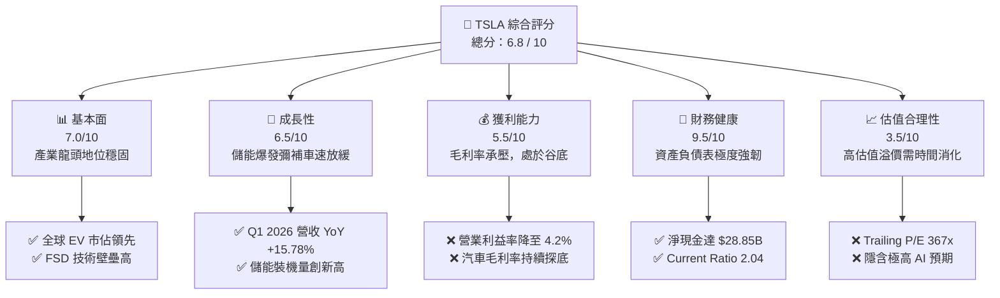
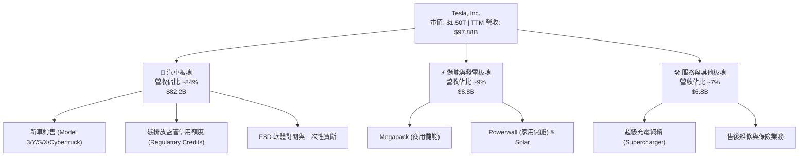
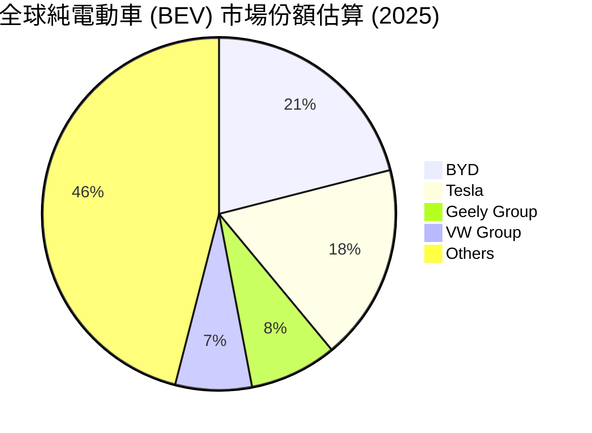
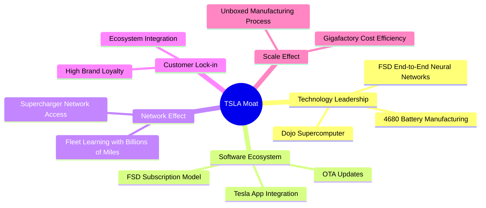
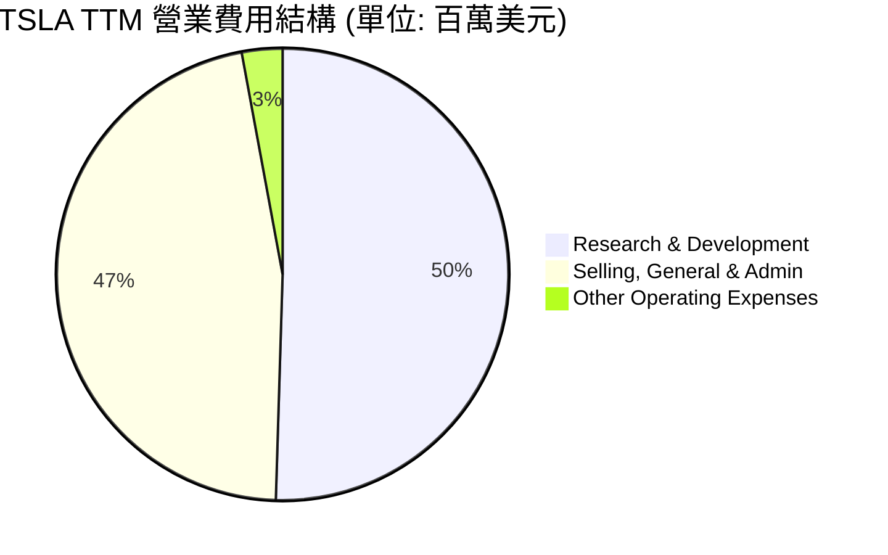
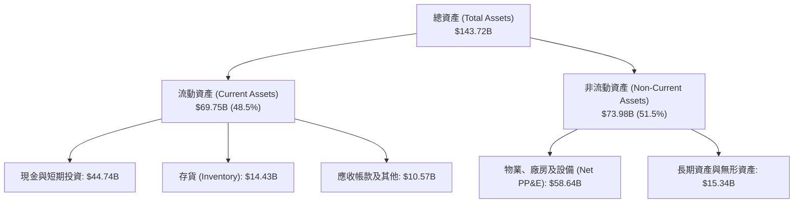

# TSLA 基本面深度分析報告

> **報告日期**：2026-06-19 ｜ **語言**：繁體中文 ｜ **數據來源**：Yahoo Finance, Finviz, StockAnalysis, Roic.ai ｜ **分析師**：CFA 級機構研究

---

## 目錄

| # | 章節 | 核心結論 |
|---|------|----------|
| 1 | 執行摘要 | 評級：**持有 (HOLD)** ｜ 目標價：**$420.55** ｜ 處於從純車企向 AI/儲能轉型的陣痛期 |
| 2 | 公司概覽與商業模式 | 儲能（Megapack）與軟體（FSD）構成新雙引擎，傳統車型面臨週期性壓力 |
| 3 | 損益表深度分析 | Q1 2026 營收回溫（YoY +15.78%），但汽車毛利率受價格戰拖累，營業利益率降至 4.2% |
| 4 | 資產負債表分析 | 擁有 $44.74B 現金與短期投資，淨現金高達 $28.85B，財務防禦力極高 |
| 5 | 現金流量深度分析 | TTM 自由現金流 $5.25B，資本配置高度向 Capex ($8.53B) 與 R&D 傾斜，無回購或股息 |
| 6 | 獲利能力與資本效率 | 當前 ROIC (6.9%) 暫低於 WACC (12.7%)，處於資本高投入、產出滯後的價值重塑期 |
| 7 | 估值深度分析 | Trailing P/E 達 367x，估值溢價主要來自 FSD/Robotaxi 的期權定價，基準目標價 $420.55 |
| 8 | 成長催化劑 | 2026 下半年低價車型平台投產、FSD V12.x 全球推廣與 Robotaxi 商業化落地 |
| 9 | 風險矩陣 | 核心車型降價失靈、AI 監管審批延遲、大宗商品與供應鏈波動 |
| 10 | 投資建議 | 適合長線成長型投資人，建議在 $350 以下分批佈局，密切監控毛利率拐點 |

---

## 1. 執行摘要

### 1.1 核心評分儀表板



### 1.2 評分進度條視覺化

```
╔══════════════════════════════════════════════════════════════╗
║               TSLA 多維度評分儀表板 (1-10分)                 ║
╠══════════════════════════════════════════════════════════════╣
║ 基本面強度  7.0 ▓▓▓▓▓▓▓▓▓▓▓▓▓▓░░░░░░  ★★★☆☆           ║
║ 成長動能    6.5 ▓▓▓▓▓▓▓▓▓▓▓▓▓░░░░░░░  ★★★☆☆           ║
║ 獲利品質    5.5 ▓▓▓▓▓▓▓▓▓▓▓░░░░░░░░░  ★★☆☆☆           ║
║ 財務健康    9.5 ▓▓▓▓▓▓▓▓▓▓▓▓▓▓▓▓▓▓▓░  ★★★★★           ║
║ 估值合理性  3.5 ▓▓▓▓▓▓░░░░░░░░░░░░░░  ★☆☆☆☆           ║
║ 護城河深度  8.5 ▓▓▓▓▓▓▓▓▓▓▓▓▓▓▓▓▓░░░  ★★★★☆           ║
║ 管理層執行  8.0 ▓▓▓▓▓▓▓▓▓▓▓▓▓▓▓▓░░░░  ★★★★☆           ║
║ 技術創新力  9.5 ▓▓▓▓▓▓▓▓▓▓▓▓▓▓▓▓▓▓▓░  ★★★★★           ║
╠══════════════════════════════════════════════════════════════╣
║ 綜合總分    6.8 ▓▓▓▓▓▓▓▓▓▓▓▓▓░░░░░░░  🏆 轉型陣痛，長線看好║
╚══════════════════════════════════════════════════════════════╝
```

### 1.3 五大投資論點 + 三大核心風險

| 類型 | 項目 | 具體依據 | 信心度 |
|------|------|----------|--------|
| 🟢 **投資論點①** | **儲能業務（Megapack）迎來爆發期** | 儲能裝機量持續高成長，營收佔比逐季提升，利潤率優於降價後的汽車業務。 | 🟢 極高 |
| 🟢 **投資論點②** | **FSD V12 商業化與授權潛力** | 端到端神經網絡技術大幅提升體驗，若成功授權給傳統車企，將轉化為極高毛利的軟體收入。 | 🟢 高 |
| 🟢 **投資論點③** | **無與倫比的現金護城河** | 擁有 $44.74B 的現金與短期投資，能支撐高額研發（TTM R&D 達 $6.95B）而不具破產風險。 | 🟢 極高 |
| 🟢 **投資論點④** | **下一代低價平台（Model 2）預期** | 預計於 2026 年底至 2027 年量產，有望重新激活主流消費市場的銷量成長。 | 🟡 中等 |
| 🟢 **投資論點⑤** | **監管信用額度（Regulatory Credits）穩定變現** | 隨著美歐碳排放法規收緊，TSLA 每年穩定獲得高毛利的信用額度銷售收入。 | 🟢 高 |
| 🟡 **風險①** | **汽車利潤率持續探底** | 行業價格戰未歇，若銷量成長需以犧牲毛利為代價，營業利益率（4.2%）恐進一步受壓。 | 🔴 高 |
| 🔴 **風險②** | **Robotaxi 與 FSD 監管審批延遲** | 雖然技術領先，但無人駕駛（L4/L5）在各國的法規准入極具不確定性，可能拉長變現週期。 | 🔴 高 |
| 🔴 **風險③** | **極高估值下的多重壓縮壓力** | 當前 Trailing P/E 達 367x，若 AI 與自動駕駛進度不及預期，估值倍數將面臨劇烈回檔。 | 🔴 高 |

### 1.4 快速統計卡片

| 指標 | 公司實際值 | 行業均值 (Auto) | S&P 500 均值 | 狀態 |
|------|-------------|----------|--------------|------|
| 收入 YoY 成長 (TTM) | **15.8%** | ~5.2% | ~6.5% | 🟢 領先 |
| 毛利率 | **19.1%** | ~14.5% | ~30.0% | 🟡 領先同行，但低於歷史 |
| 淨利率 | **3.9%** | ~5.0% | ~11.5% | 🔴 低於歷史與大盤 |
| ROE | **4.9%** | ~8.5% | ~15.0% | 🔴 資本效率暫時低落 |
| Forward P/E | **160.2x** | ~12.5x | ~21.5x | 🔴 估值顯著溢價 |
| 債務股本比 (Debt/Equity) | **18.7%** | ~85.0% | ~115.0% | 🟢 財務結構極度安全 |

### 1.5 投資結論

```
╔══════════════════════════════════════════════════════════════════╗
║                    📊 TSLA 投資結論摘要                          ║
╠══════════════════════════════════════════════════════════════════╣
║  評級：🟡 持有 (HOLD)                                            ║
║  當前股價：$400.49 (2026-06-19)                                  ║
║  目標價區間：                                                    ║
║    悲觀情境：$180.00（-55.1%）- 銷量持續萎縮，FSD 落地受阻       ║
║    基準情境：$420.55（+5.0%） - 儲能維持高成長，車型平穩過渡     ║
║    樂觀情境：$600.00（+49.8%）- FSD 授權落地，Robotaxi 商業化    ║
║  投資評分：6.8 / 10                                              ║
║  適合投資人：具有極高風險承受能力、看好 AI/自動駕駛的長線投資人  ║
╚══════════════════════════════════════════════════════════════════╝
```

---

## 2. 公司概覽與商業模式

### 2.1 業務結構與收入來源

特斯拉已非單純的汽車製造商，其業務結構正朝向「硬體銷售 + 軟體訂閱 + 能量網絡」的三位一體模式演進。



### 2.2 市場份額

在純電動車（BEV）市場中，特斯拉面臨來自中國車企（如比亞迪）與歐洲傳統車企的強烈競爭。



### 2.3 競爭護城河分析

特斯拉的競爭優勢已從單純的「先發優勢」轉化為多維度的結構性護城河：



### 2.4 護城河強度評分

```
╔══════════════════════════════════════════════════════════════╗
║                  TSLA 護城河強度評分                         ║
╠══════════════════════════════════════════════════════════════╣
║ 技術領先度    9.5/10  ▓▓▓▓▓▓▓▓▓▓▓▓▓▓▓▓▓▓▓░  🏆 FSD技術斷代領先║
║ 製造規模優勢  8.5/10  ▓▓▓▓▓▓▓▓▓▓▓▓▓▓▓▓▓░░░  🟢 一體化壓鑄降本 ║
║ 充電網絡效應  9.0/10  ▓▓▓▓▓▓▓▓▓▓▓▓▓▓▓▓▓▓░░  🟢 NACS成為北美標準║
║ 品牌與生態鎖  8.0/10  ▓▓▓▓▓▓▓▓▓▓▓▓▓▓▓▓░░░░  🟢 極高粉絲黏性   ║
╠══════════════════════════════════════════════════════════════╣
║ 綜合護城河     8.75   ▓▓▓▓▓▓▓▓▓▓▓▓▓▓▓▓▓░░░  🏆 極強寬護城河   ║
╚══════════════════════════════════════════════════════════════╝
```

---

## 3. 損益表深度分析

### 3.1 年度收入成長趨勢（近5年）

特斯拉在經歷 2021-2022 年的高速成長後，2024-2025 年受制於車型老化與價格戰，營收成長陷入停滯，但 TTM (截至 2026Q1) 開始展現復甦跡象。

```
╔══════════════════════════════════════════════════════════════════╗
║              TSLA 年度收入趨勢 (FY2021 - TTM 2026)              ║
╠══════════════════════════════════════════════════════════════════╣
║                                                                  ║
║  FY2021  $53.82B  ██████████░░░░░░░░░░░░░░░░░░░  YoY: +70.7% 🟢  ║
║  FY2022  $81.46B  ████████████████░░░░░░░░░░░░░  YoY: +51.4% 🟢  ║
║  FY2023  $96.77B  ███████████████████░░░░░░░░░░  YoY: +18.8% 🟢  ║
║  FY2024  $97.69B  ███████████████████░░░░░░░░░░  YoY: +0.95% 🟡  ║
║  FY2025  $94.83B  ██████████████████░░░░░░░░░░░  YoY: -2.93% 🔴  ║
║  TTM     $97.88B  ███████████████████░░░░░░░░░░  YoY: +15.8% 🟢  ║
║                                                                  ║
║                   |      |      |      |      |                  ║
║                   0     25B    50B    75B    100B                ║
║                                                                  ║
║  📊 5年累計營收 CAGR：+12.7%                                     ║
╚══════════════════════════════════════════════════════════════════╝
```

### 3.2 季度收入趨勢分析

從季度數據看，2026年第一季營收達到 $22.39B，YoY 成長 15.78%，顯示最壞的時期可能已經過去，但 QoQ 仍下降 10.1%，反映出第一季的傳統淡季效應。

| 財報季度 | 營收 (Revenue) | YoY 成長率 | QoQ 成長率 | 毛利 (Gross Profit) | 毛利率 (Gross Margin) | 備註 |
|---|---|---|---|---|---|---|
| **Q1 2026** | $22.39B | **+15.78%** | -10.10% | $4.72B | **21.08%** | 🟢 營收 YoY 回暖，毛利率回升 |
| **Q4 2025** | $24.90B | -3.14% | -11.37% | $5.01B | 20.12% | 🔴 銷量放緩，年末促銷壓低毛利 |
| **Q3 2025** | $28.10B | +11.57% | **+24.89%** | $5.05B | 17.97% | 🟢 儲能交付創歷史新高 |
| **Q2 2025** | $22.50B | -11.78% | +16.39% | $3.88B | 17.24% | 🔴 汽車價格戰最激烈時期 |

### 3.3 利潤率演變分析

特斯拉的利潤率在近年經歷了「過山車」式的下滑。這主要歸因於：
1. **汽車售價（ASP）下滑**：主力車型 Model 3/Y 全球降價。
2. **產能利用率波動**：新工廠（德州、柏林）爬坡期單位成本較高。
3. **研發與 AI 投入激增**：研發費用從 2022 年的 $3.08B 飆升至 TTM 的 $6.95B。

| 利潤率指標 | FY2022 | FY2023 | FY2024 | FY2025 | TTM | 趨勢 | 評估 |
|------------|--------|--------|--------|--------|------|------|------|
| **毛利率** | 25.60% | 18.25% | 17.86% | 18.03% | **19.07%** | 🟡 觸底企穩 | 汽車降價被儲能高毛利稀釋 |
| **營業利益率** | 16.76% | 9.19% | 7.24% | 4.59% | **5.00%** | 🔴 顯著下滑 | AI 研發費用（TTM $6.95B）壓制利潤 |
| **EBITDA Margin** | 21.68% | 15.29% | 15.06% | 12.40% | **11.30%** | 🔴 持續承壓 | 折舊攤銷增加 |
| **淨利率** | 15.45% | 15.47% | 7.32% | 4.07% | **3.95%** | 🔴 處於低谷 | 淨利受非經營性支出與稅率波動影響 |

### 3.4 費用結構分析

特斯拉在 2025 年及 2026 年第一季大幅調整了費用分配，將資源高度集中於 AI 研發，同時裁減非核心行政人員。



```
╔══════════════════════════════════════════════════════════════════╗
║                    TSLA 費用控管與研發診斷                       ║
╠══════════════════════════════════════════════════════════════════╣
║                                                                  ║
║  研發費用 (TTM)：  $6.95B  ████████████████████  YoY: +53.1% 🔴   ║
║  銷管費用 (TTM)：  $6.42B  ██████████████████░░  YoY: +24.6% 🟡   ║
║                                                                  ║
║  💡 診斷：研發費用首度超越銷管費用，顯示公司全力轉型為 AI/自動   ║
║  駕駛驅動企業，短期將壓制營業利益率，但有助於維持技術護城河。    ║
╚══════════════════════════════════════════════════════════════════╝
```

### 3.5 季度 EPS 趨勢與盈餘品質

過去 4 季，特斯拉的稀釋後 EPS 表現如下：
* **Q1 2026**: $0.15 (YoY +15.4%) - 🟢 微幅超預期，主要受惠於儲能利潤釋放。
* **Q4 2025**: $0.26 (YoY -63.9%) - 🔴 不及預期，因年底汽車促銷與研發費用集中列支。
* **Q3 2025**: $0.43 (YoY -36.8%) - 🟡 符合預期，碳排放信用額度（Regulatory Credits）貢獻顯著。
* **Q2 2025**: $0.36 (YoY -18.2%) - 🔴 不及預期，受汽車毛利率探底影響。

**盈餘品質評估**：🟡 **中等**。TTM 淨利中包含約 $1.5B - $2.0B 的監管信用額度銷售，此部分屬於 100% 毛利的政府政策紅利，雖提供穩定現金流，但非核心汽車製造獲利，隱含核心主業獲利能力偏弱。

---

## 4. 資產負債表分析

### 4.1 資產結構分解

特斯拉維持著極其輕債務、高流動性的資產結構。截至 2026 年 3 月 31 日，總資產達 $143.72B。



### 4.2 流動性指標分析

| 流動性指標 | FY2023 | FY2024 | FY2025 | Q1 2026 | 行業均值 | 評估 |
|------------|--------|--------|--------|---------|----------|------|
| **Current Ratio (流動比率)** | 1.73 | 2.02 | 2.16 | **2.04** | 1.15 | 🟢 極其安全，遠高於行業水平 |
| **Quick Ratio (速動比率)** | 1.25 | 1.61 | 1.77 | **1.62** | 0.85 | 🟢 扣除存貨後流動性依然強勁 |
| **存貨週轉天數 (Days Inventory)** | 62.1 | 54.5 | 58.2 | **73.3** | 45.0 | 🔴 存貨週轉天數上升，反映新車型去化壓力 |

### 4.3 債務結構與安全診斷

特斯拉是美股大型製造業中，少數近乎「無淨債務」的企業。

```
╔══════════════════════════════════════════════════════════════════╗
║                    TSLA 債務健康診斷 (2026Q1)                    ║
當前：367x  ██████████████████████████████████████  🔴 偏高 ║
║  歷史最高：1100x  (2021 年初)                                    ║
║                                                                  ║
║  ⚠️ 註：當前高 P/E 主要由「E」的萎縮造成，而非「P」的過度拉升。  ║
╚══════════════════════════════════════════════════════════════════╝
```

### 7.3 DCF 敏感性分析（9格目標價矩陣）

由於特斯拉未來現金流高度依賴 FSD 軟體與 Robotaxi 的成功，我們採用三種不同的 WACC 與終端成長率情境進行 DCF 建模：

* **基準假設條件**：
  * 2026-2030 營收複合年增長率（CAGR）：18.5%（車型放緩，但儲能與軟體爆發）。
  * 基準 WACC：12.7%（反映高 Beta 1.80 與高股權成本）。
  * 永續成長率（Terminal Growth Rate）：3.0% - 4.0%。

| 營收成長情境 | **WACC = 13.7%** | **WACC = 12.7% (基準)** | **WACC = 11.7%** |
|------|--------------|----------------------|--------------|
| 🟢 **樂觀 (CAGR 25%)** | $480.00 (+19.8%) | **$550.00 (+37.3%)** | $620.00 (+54.8%) |
| 🟡 **基準 (CAGR 18.5%)**| $365.00 (-8.9%) | **$420.55 (+5.0%)** | $485.00 (+21.1%) |
| 🔴 **悲觀 (CAGR 10%)** | $150.00 (-62.5%) | **$180.00 (-55.1%)** | $210.00 (-47.6%) |

### 7.4 估值綜合區間

```
╔══════════════════════════════════════════════════════════════════╗
║                    TSLA 估值綜合區間與當前股價                   ║
╠══════════════════════════════════════════════════════════════════╣
║                                                                  ║
║  [悲觀估值] $123.00 - $180.00 (純車企估值，無 AI 溢價)           ║
║