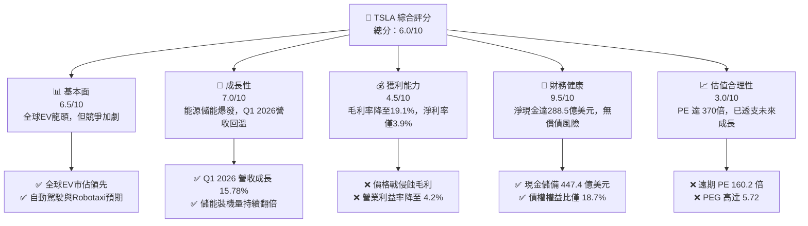
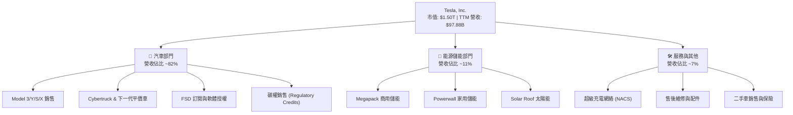
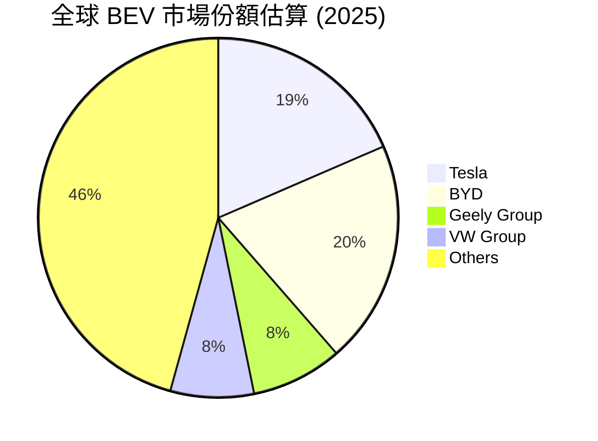
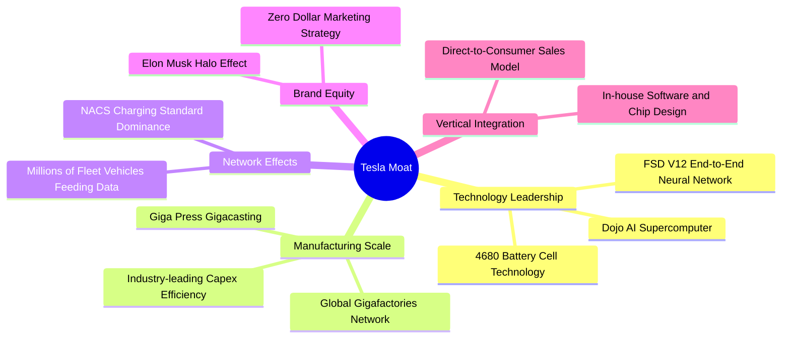
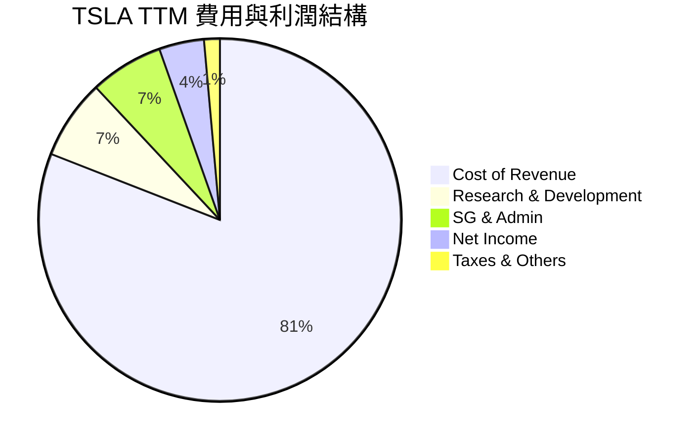
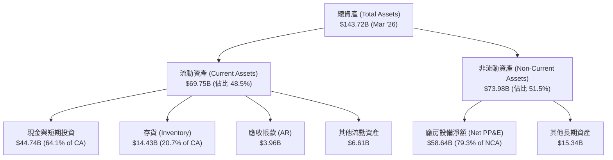
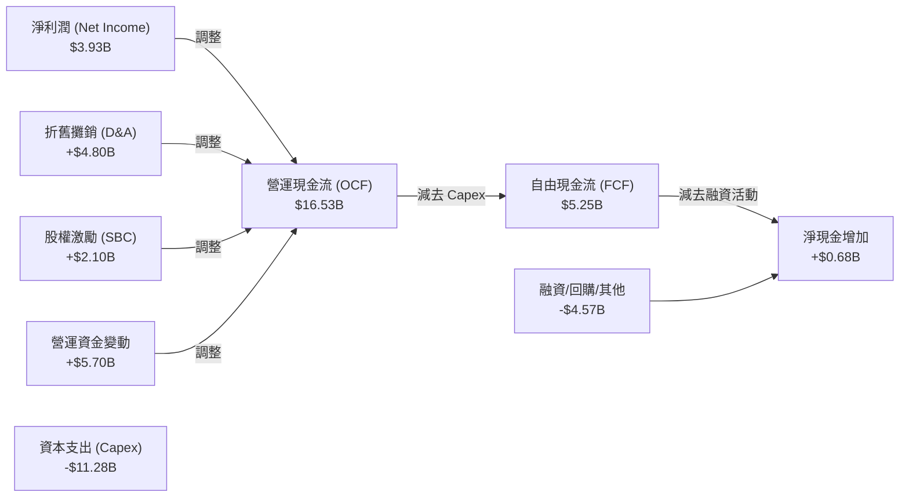
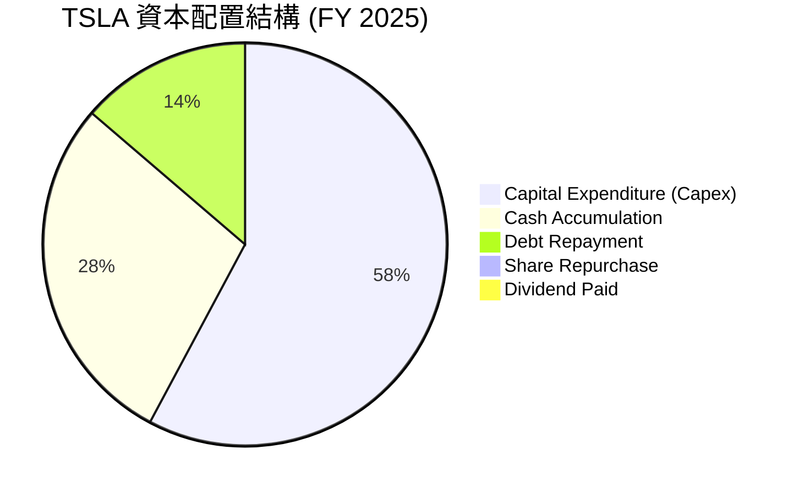

# TSLA 基本面深度分析報告

> **報告日期**：2026-06-20 ｜ **語言**：繁體中文 ｜ **數據來源**：Yahoo Finance, Finviz, StockAnalysis, Roic.ai ｜ **分析師**：CFA 級機構研究

---

## 目錄

| # | 章節 | 核心結論 |
|---|------|----------|
| 1 | 執行摘要 | 評級為「持有（Hold）」，目標價 $420.55，短期估值透支，長期看好 AI 與能源。 |
| 2 | 公司概覽與商業模式 | 汽車與能源雙輪驅動，FSD 與 Robotaxi 構成長期核心期權。 |
| 3 | 損益表深度分析 | Q1 2026 營收回溫（+15.78% YoY），但價格戰導致毛利率與淨利率承壓。 |
| 4 | 資產負債表分析 | 淨現金達 $288.5 億，資產負債表極度穩健，具備極高抗風險能力。 |
| 5 | 現金流量深度分析 | TTM FCF 達 $52.5 億，資本配置高度偏向 Capex 研發，無股息發放。 |
| 6 | 獲利能力與資本效率 | ROE 降至 4.9%，ROIC (6.64%) 低於 WACC (11.97%)，短期內面臨價值摧毀。 |
| 7 | 估值深度分析 | Trailing P/E 370.8x，Forward P/E 160.2x，溢價極高，DCF 基準價 $420。 |
| 8 | 成長催化劑 | 儲能裝機量爆發、下一代平價車型（Model 2）投產與 FSD 商業化落地。 |
| 9 | 風險矩陣 | 核心風險為毛利率持續下滑、AI 變現不及預期及中國市場競爭加劇。 |
| 10 | 投資建議 | 適合長線成長型投資人，建議採逢低分批布局策略，關鍵監控毛利率拐點。 |

---

## 1. 執行摘要

### 1.1 核心評分儀表板



### 1.2 評分進度條視覺化

```
╔══════════════════════════════════════════════════════════════╗
║               TSLA 多維度評分儀表板 (1-10分)                 ║
╠══════════════════════════════════════════════════════════════╣
║ 基本面強度  6.5 ▓▓▓▓▓▓▓▓▓▓▓▓▓░░░░░░░  ★★★☆☆           ║
║ 成長動能    7.0 ▓▓▓▓▓▓▓▓▓▓▓▓▓▓░░░░░░  ★★★☆  ║
║ 獲利品質    4.5 ▓▓▓▓▓▓▓▓▓░░░░░░░░░░░  ★★☆☆☆           ║
║ 財務健康    9.5 ▓▓▓▓▓▓▓▓▓▓▓▓▓▓▓▓▓▓▓░  ★★★★★           ║
║ 估值合理性  3.0 ▓▓▓▓▓▓░░░░░░░░░░░░░░  ★☆☆☆☆           ║
║ 護城河深度  8.5 ▓▓▓▓▓▓▓▓▓▓▓▓▓▓▓▓▓░░░  ★★★★☆           ║
║ 管理層執行  8.0 ▓▓▓▓▓▓▓▓▓▓▓▓▓▓▓▓░░░░  ★★★★☆           ║
║ 技術創新力  9.5 ▓▓▓▓▓▓▓▓▓▓▓▓▓▓▓▓▓▓▓░  ★★★★★           ║
╠══════════════════════════════════════════════════════════════╣
║ 綜合總分    6.0 ▓▓▓▓▓▓▓▓▓▓▓▓░░░░░░░░  🏆 評級：持有 (Hold) ║
╚══════════════════════════════════════════════════════════════╝
```

### 1.3 五大投資論點 + 三大核心風險

| 類型 | 項目 | 具體依據 | 信心度 |
|------|------|----------|--------|
| 🟢 **投資論點①** | **能源儲能板塊爆發** | 儲能業務（Megapack）出貨量呈指數級增長，成為第二成長曲線，毛利率優於汽車。 | 🟢 極高 |
| 🟢 **投資論點②** | **Q1 2026 營收重回增長** | Q1 2026 營收達 $223.87 億，YoY 增長 15.78%，顯示最壞的衰退期已過。 | 🟢 高 |
| 🟢 **投資論點③** | **無可匹敵的財務安全邊際** | 擁有 $447.43 億現金與短期投資，淨現金高達 $288.5 億，足以應對任何宏觀逆風。 | 🟢 極高 |
| 🟢 **投資論點④** | **FSD 與 AI 生態期權** | 研發費用 TTM 達 $69.48 億，Dojo 超算與 FSD V12 算法領先，Robotaxi 潛在市場巨大。 | 🟡 中等 |
| 🟢 **投資論點⑤** | **極致的垂直整合與製造優勢** | 一體化壓鑄與 4680 電池自產，長期看仍具備同業難以企及的單位成本下降空間。 | 🟢 高 |
| 🟡 **風險①** | **競爭加劇與價格戰持續** | 中國 OEM（如 BYD）低價車擠壓市佔，導致 TSLA 淨利率下滑至 3.9%。 | 🔴 高衝擊 |
| 🔴 **風險②** | **估值極度高企（De-rating）** | Trailing P/E 達 370.8x，若 AI 與 Robotaxi 進度延遲，估值將面臨劇烈修正。 | 🔴 高衝擊 |
| 🟡 **風險③** | **關鍵人物風險與監管壓力** | Elon Musk 的精力分散與 FSD 全自動駕駛在各國面臨的法規准入限制。 | 🟡 中度 |

### 1.4 快速統計卡片

| 指標 | 公司實際值 | 行業均值 (Auto) | S&P 500 均值 | 狀態 |
|------|-------------|----------|--------------|------|
| 收入 YoY 成長 | **15.78% (Q1 '26)** | ~5.0% | ~6.5% | 🟢 優異 |
| 毛利率 | **19.1% (TTM)** | ~15.0% | ~30.0% | 🟢 領先同業 |
| 淨利率 | **3.9% (TTM)** | ~4.5% | ~11.5% | 🟡 承壓 |
| ROE | **4.9% (TTM)** | ~12.0% | ~15.0% | 🔴 低於平均 |
| Forward P/E | **160.2x** | ~10.5x | ~21.5x | 🔴 極度昂貴 |
| 淨現金 / 總資產 | **20.1%** | -15.0% (多為淨債務) | ~2.0% | 🟢 極為健康 |

### 1.5 投資結論

```
╔══════════════════════════════════════════════════════════════════╗
║                    📊 TSLA 投資結論摘要                          ║
╠══════════════════════════════════════════════════════════════════╣
║  評級：🟡 持有 (Hold)                                            ║
║  當前股價：$400.49 (2026-06-20)                                  ║
║  目標價區間：                                                    ║
║    悲觀情境：$250.00 (-37.6%) - 價格戰惡化，AI 進度延宕          ║
║    基準情境：$420.55 (+5.0%)  - 12個月主要目標（估值維持高位）   ║
║    樂觀情境：$580.00 (+44.8%) - FSD 獲准商用，平價車型提前量產   ║
║  投資評分：6.0 / 10                                              ║
║  適合投資人：具備高風險承受力、長線看好 AI 與機器人生態的投資者  ║
╚══════════════════════════════════════════════════════════════════╝
```

---

## 2. 公司概覽與商業模式

### 2.1 業務結構與收入來源

特斯拉已從單純的汽車製造商，轉型為整合「硬體 + 軟體 + 能源」的多元化 AI 科技企業。



### 2.2 全球純電動車（BEV）市場份額估算



*註：根據 2025 年末全球純電動車銷量數據，BYD 在總量上略微領先，但 Tesla 在高端市場與單車利潤（雖然下滑）上仍保持優勢。*

### 2.3 競爭護城河分析



### 2.4 護城河強度評分

```
╔══════════════════════════════════════════════════════════════╗
║                    TSLA 護城河強度評分                       ║
╠══════════════════════════════════════════════════════════════╣
║ 技術領先度    9.5/10  ▓▓▓▓▓▓▓▓▓▓▓▓▓▓▓▓▓▓▓░  🏆 FSD 與 AI 超前 ║
║ 製造與成本    8.5/10  ▓▓▓▓▓▓▓▓▓▓▓▓▓▓▓▓▓░░░  🟢 一體化壓鑄優勢 ║
║ 網絡效應      9.0/10  ▓▓▓▓▓▓▓▓▓▓▓▓▓▓▓▓▓▓░░  🏆 充電與數據飛輪 ║
║ 品牌與渠道    9.0/10  ▓▓▓▓▓▓▓▓▓▓▓▓▓▓▓▓▓▓░░  🟢 強大直營與溢價 ║
║ 垂直整合      9.5/10  ▓▓▓▓▓▓▓▓▓▓▓▓▓▓▓▓▓▓▓░  🏆 供應鏈掌控力強 ║
╠══════════════════════════════════════════════════════════════╣
║ 綜合護城河    9.1/10  ▓▓▓▓▓▓▓▓▓▓▓▓▓▓▓▓▓▓░░  🏆 頂級科技護城河 ║
╚══════════════════════════════════════════════════════════════╝
```

---

## 3. 損益表深度分析

### 3.1 年度收入成長趨勢（FY2021 - TTM）

```
╔══════════════════════════════════════════════════════════════════╗
║                TSLA 年度收入趨勢 (FY2021 - TTM)                  ║
╠══════════════════════════════════════════════════════════════════╣
║                                                                  ║
║  FY 2021  $53.82B  ███████████░░░░░░░░░░░░░░░░░░░  YoY: +70.7% 🟢║
║  FY 2022  $81.46B  █████████████████░░░░░░░░░░░░░  YoY: +51.4% 🟢║
║  FY 2023  $96.77B  ████████████████████░░░░░░░░░░  YoY: +18.8% 🟢║
║  FY 2024  $97.69B  ████████████████████░░░░░░░░░░  YoY: +1.0%  🟡║
║  FY 2025  $94.83B  ███████████████████░░░░░░░░░░░  YoY: -2.9%  🔴║
║  TTM      $97.88B  ████████████████████░░░░░░░░░░  YoY: +2.3%  🟢║
║                                                                  ║
║  📊 4 年營收複合年增長率 (CAGR)：+16.1%                         ║
╚══════════════════════════════════════════════════════════════════╝
```

### 3.2 季度收入趨勢分析

| 季度 | 營收 (Billion) | YoY 成長率 | QoQ 成長率 | 核心驅動/備註 | 狀態 |
|------|----------------|------------|------------|----------------|------|
| **Q1 2026** | **$22.39B** | **+15.78%** | -10.08% | 汽車交付回暖，儲能業務持續高增長，季節性下滑。 | 🟢 改善 |
| **Q4 2025** | **$24.90B** | -3.14% | -11.37% | 年底促銷力度加大，但平均售價（ASP）下滑拖累營收。 | 🔴 疲軟 |
| **Q3 2025** | **$28.10B** | **+11.57%** | **+24.89%** | Model Y 煥新版放量，儲能裝機創歷史新高。 | 🟢 強勁 |
| **Q2 2025** | **$22.50B** | -11.78% | **+16.34%** | 工廠升級與供應鏈短暫中斷，交付量低於預期。 | 🔴 衰退 |

### 3.3 利潤率演變分析

| 利潤率指標 | FY 2022 | FY 2023 | FY 2024 | FY 2025 | TTM | 趨勢 | 評估 |
|------------|---------|---------|---------|---------|-----|------|------|
| **毛利率** | 25.60% | 18.25% | 17.86% | 18.03% | **19.07%** | 底部回升 | 🟡 價格戰影響仍存 |
| **營業利益率**| 16.76% | 9.19% | 7.24% | 4.59% | **5.00%** | 低位震盪 | 🔴 研發與行銷費用增加 |
| **淨利率** | 15.45% | 15.47% | 7.32% | 4.07% | **4.01%** | 承壓 | 🔴 稅收正常化與非營運損益 |

**利潤率演變深度解析**：
*   **毛利率觸底反彈**：毛利率在 FY2024 降至 17.86% 的低點後，TTM 回升至 19.07%。這主要得益於**儲能業務（Megapack）**的高毛利貢獻，以及 4680 電池生產良率提升帶來的成本下降。
*   **營業利益率承壓**：儘管毛利率微升，但營業利益率（TTM 5.00%）相較於 FY2022 的 16.76% 出現劇烈下滑。主要原因在於**研發費用（R&D）的剛性支出**（TTM 研發費用高達 $69.48 億，營收佔比達 7.1%），特斯拉在 Dojo 超算、FSD 算法以及 Optimus 機器人上的研發投入持續擴大。

### 3.4 費用結構分析



```
╔══════════════════════════════════════════════════════════════╗
║                    TSLA TTM 費用管控診斷                     ║
╠══════════════════════════════════════════════════════════════╣
║ 銷貨成本率    80.9%   ████████████████████░░░░  🔴 價格戰承壓 ║
║ 研發費用率    7.1%    ██░░░░░░░░░░░░░░░░░░░░  🟢 主動技術投資 ║
║ 銷管費用率    6.6%    ██░░░░░░░░░░░░░░░░░░░░  🟢 行銷控管極佳 ║
╚══════════════════════════════════════════════════════════════╝
```

### 3.5 季度 EPS 趨勢與盈餘品質

*   **過去 4 季 EPS 表現**：
    *   Q1 2026: $0.15（基本）/ $0.15（稀釋）
    *   Q4 2025: $0.26（基本）/ $0.24（稀釋）
    *   Q3 2025: $0.43（基本）/ $0.39（稀釋）
    *   Q2 2025: $0.36（基本）/ $0.33（稀釋）
*   **盈餘品質評估**：
    *   **碳權收入依賴度**：特斯拉的淨利潤中仍有相當一部分來自無成本的汽車監管碳權銷售（Regulatory Credits）。在汽車毛利受擠壓的季度，碳權常扮演「扭虧為盈」或「超預期」的關鍵。
    *   **利息收入貢獻**：得益於 $447.43 億的龐大現金儲備，TTM 利息收入高達 $17.14 億，有效對沖了部分營運利潤的下滑，顯示出極佳的防守性，但這也反映了核心汽車業務的盈利含金量有所下降。

---

## 4. 資產負債表分析

### 4.1 資產結構分解



### 4.2 流動性指標分析

| 指標 | FY 2023 | FY 2024 | FY 2025 | TTM (Q1 '26) | 行業均值 | 評估 |
|------|---------|---------|---------|--------------|----------|------|
| **流動比率 (Current Ratio)** | 1.73 | 2.02 | 2.16 | **2.04** | 1.25 | 🟢 極其安全 |
| **速動比率 (Quick Ratio)** | 1.25 | 1.61 | 1.77 | **1.62** | 0.85 | 🟢 無存貨變現壓力 |
| **天數指標：存貨週轉天數** | 62.9 天 | 54.7 天 | 58.2 天 | **59.5 天** | 72.0 天 | 🟢 優於行業平均 |

### 4.3 債務結構分析

```
╔══════════════════════════════════════════════════════════════════╗
║                    TSLA 債務健康診斷 (2026-03-31)                ║
╠══════════════════════════════════════════════════════════════════╣
║                                                                  ║
║  總現金與短期投資：$44.74B  ███████████████████████████████████ ║
║  總債務 (Total Debt)：$15.89B  ████████████░░░░░░░░░░░░░░░░░░░░  ║
║  ├─ 短期債務：$2.44B                                             ║
║  ├─ 長期借款：$7.65B                                             ║
║  └─ 長期融資租賃：$5.81B                                         ║
║                                                                  ║
║  淨現金 (Net Cash)：+$28.85B  🟢 淨現金公司，無任何破產或債務風險 ║
║                                                                  ║
║  Debt/Equity 比率：18.74%  🟢 槓桿率極低                          ║
║  利息保障倍數 (Interest Coverage)：14.4x 🟢 利息支出無壓力        ║
╚══════════════════════════════════════════════════════════════════╝
```

### 4.4 股東權益趨勢

```
╔══════════════════════════════════════════════════════════════════╗
║                  TSLA 股東權益增長趨勢 (FY22-FY25)               ║
╠══════════════════════════════════════════════════════════════════╣
║                                                                  ║
║  FY 2022  $44.70B  ███████████░░░░░░░░░░░░░░░░                      ║
║  FY 2023  $62.63B  ███████████████░░░░░░░░░░░                       ║
║  FY 2024  $72.91B  ██████████████████░░░░░░░░                       ║
║  FY 2025  $82.14B  ████████████████████░░░░░░                       ║
║                                                                  ║
║  📊 股東權益 3 年年均增長率：+22.5% (保留盈餘持續累積)            ║
╚══════════════════════════════════════════════════════════════════╝
```

---

## 5. 現金流量深度分析

### 5.1 現金流量瀑布圖

特斯拉具備極強的自身造血能力，其營運現金流足以完全覆蓋龐大的資本支出，並持續累積現金。



### 5.2 FCF 轉換率趨勢

| 指標 | FY 2022 | FY 2023 | FY 2024 | FY 2025 | TTM | 評估 |
|------|---------|---------|---------|---------|-----|------|
| **營運現金流 (OCF)** | $14.72B | $13.26B | $14.92B | $14.75B | **$16.53B** | 🟢 持續流入 |
| **自由現金流 (FCF)** | $7.55B | $4.36B | $3.58B | $6.22B | **$5.25B** | 🟢 保持正值 |
| **FCF / 淨利潤 (轉換率)**| 60.0% | 29.1% | 50.1% | 161.1% | **133.6%** | 🟢 盈餘含金量高 |

*註：FY2025 與 TTM 的 FCF 轉換率大於 100%，主要是因為非現金支出（折舊攤銷與 SBC）金額龐大，且營運資金管理優化（應付帳款增加與存貨周轉加快）。*

### 5.3 自由現金流趨勢

```
╔══════════════════════════════════════════════════════════════════╗
║                  TSLA 自由現金流與收益率趨勢                     ║
╠══════════════════════════════════════════════════════════════════╣
║                                                                  ║
║  FY 2022  $7.55B  ██████████████████████░░░░░  FCF Yield: 0.50%  ║
║  FY 2023  $4.36B  ████████████░░░░░░░░░░░░░░░  FCF Yield: 0.29%  ║
║  FY 2024  $3.58B  ██████████░░░░░░░░░░░░░░░░░  FCF Yield: 0.24%  ║
║  FY 2025  $6.22B  ██████████████████░░░░░░░░░  FCF Yield: 0.41%  ║
║  TTM      $5.25B  ███████████████░░░░░░░░░░░░  FCF Yield: 0.35%  ║
║                                                                  ║
║  📊 當前 FCF 收益率為 0.35% (反映估值分位數極高，溢價顯著)        ║
╚══════════════════════════════════════════════════════════════════╝
```

### 5.4 資本配置評估



*評估：特斯拉採取典型的**高成長科技股**資本配置策略。所有營運資金100%留存，無任何股息發放（Payout Ratio: 0%）與大規模回購。資金優先投入資本支出（Capex $85.3億至 $113.4億）以建設超級工廠、購置 AI 算力（Nvidia H100/H200 晶片），其餘資金用於累積現金以維持極高