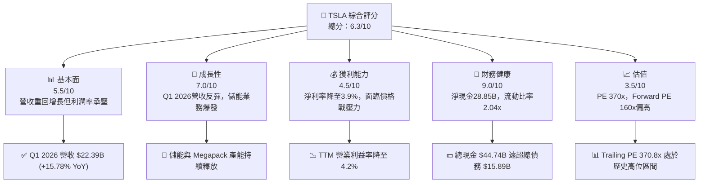
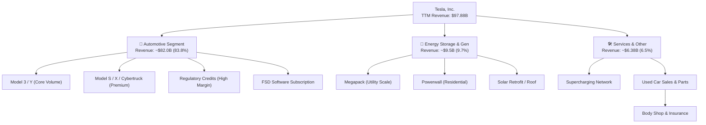
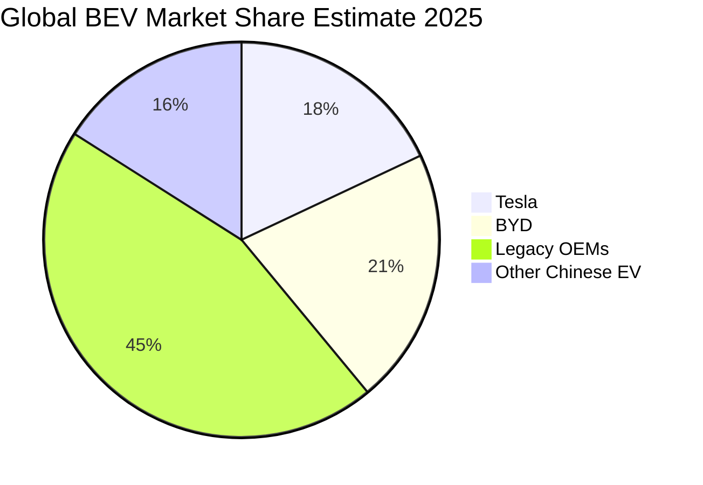
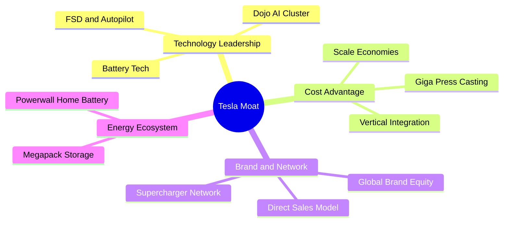
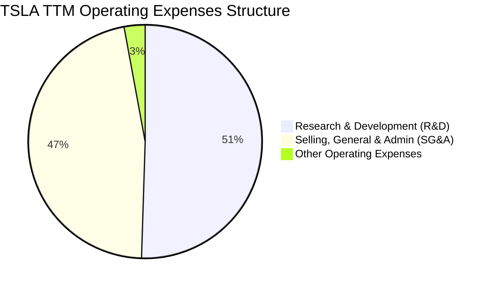
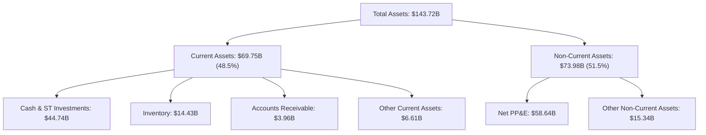
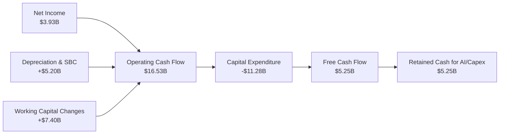

# TSLA 基本面深度分析報告

> **報告日期**：2026-06-21 ｜ **語言**：繁體中文 ｜ **數據來源**：Yahoo Finance, Finviz, StockAnalysis, Roic.ai ｜ **分析師**：CFA 級機構研究

---

## 目錄

| # | 章節 | 核心結論 |
|---|------|----------|
| 1 | 執行摘要 | 評級：**持有 (HOLD)** ｜ 目標價區間：$250.00 - $550.00 ｜ 基準目標價：**$420.55** |
| 2 | 公司概覽與商業模式 | 軟硬體雙輪驅動，儲能與 AI（FSD）構成非線性成長護城河 |
| 3 | 損益表深度分析 | Q1 2026 營收強勁反彈（+15.78% YoY），但價格戰導致 TTM 淨利率壓縮至 3.9% |
| 4 | 資產負債表分析 | 淨現金高達 $28.85B，流動比率 2.04x，具備極強的抗風險能力與研發資本 |
| 5 | 現金流量深度分析 | TTM 自由現金流 $5.25B，資本開支維持高檔以支撐 AI 算力與儲能產能擴張 |
| 6 | 獲利能力與資本效率 | ROIC (6.64%) 暫時低於 WACC (12.8%)，資本效率處於 J 曲線底部的陣痛期 |
| 7 | 估值深度分析 | Trailing P/E 370.8x 偏高，市場溢價主要來自 FSD 與儲能業務的期權估值 |
| 8 | 成長催化劑 | 儲能 Megapack 產能釋放、Next-Gen 低成本平台與 FSD V12 全球推廣 |
| 9 | 風險矩陣 | 核心風險為車市價格戰持續、FSD 監管與落地延遲、以及高估值倍數收縮 |
| 10 | 投資建議 | 適合長線成長型投資人，建議採分批佈局策略，關注毛利率止跌回升信號 |

---

## 1. 執行摘要

### 1.1 核心評分儀表板



### 1.2 評分進度條視覺化

```
╔══════════════════════════════════════════════════════════════╗
║              TSLA 多維度評分儀表板 (1-10分)                 ║
╠══════════════════════════════════════════════════════════════╣
║ 基本面強度  5.5 ▓▓▓▓▓▓▓▓▓▓▓░░░░░░░░░  ★★★☆☆           ║
║ 成長動能    7.0 ▓▓▓▓▓▓▓▓▓▓▓▓▓▓░░░░░░  ★★★★☆           ║
║ 獲利品質    4.5 ▓▓▓▓▓▓▓▓▓░░░░░░░░░░░  ★★☆☆☆           ║
║ 財務健康    9.0 ▓▓▓▓▓▓▓▓▓▓▓▓▓▓▓▓▓▓░░  ★★★★★           ║
║ 估值合理性  3.5 ▓▓▓▓▓▓▓░░░░░░░░░░░░░  ★☆☆☆☆           ║
║ 護城河深度  8.5 ▓▓▓▓▓▓▓▓▓▓▓▓▓▓▓▓▓░░  ★★★★☆           ║
║ 管理層執行  8.0 ▓▓▓▓▓▓▓▓▓▓▓▓▓▓▓▓░░░  ★★★★☆           ║
║ 技術創新力  9.5 ▓▓▓▓▓▓▓▓▓▓▓▓▓▓▓▓▓▓▓  ★★★★★           ║
╠══════════════════════════════════════════════════════════════╣
║ 綜合總分    6.3 ▓▓▓▓▓▓▓▓▓▓▓▓░░░░░░░░  🏆 轉型過渡期        ║
╚══════════════════════════════════════════════════════════════╝
```

### 1.3 五大投資論點 + 三大核心風險

| 類型 | 項目 | 具體依據 | 信心度 |
|------|------|----------|--------|
| 🟢 **投資論點①** | **Q1 2026 營收重回增長軌道** | Q1 2026 營收達 **$22.39B**，YoY 成長 **15.78%**，終結了 2025 年度的下滑趨勢。 | 🟢 高 |
| 🟢 **投資論點②** | **極致的財務安全邊際** | 擁有 **$44.74B** 總現金與短期投資，淨現金高達 **$28.85B**，無懼高利率環境。 | 🟢 極高 |
| 🟢 **投資論點③** | **儲能業務成為第二成長曲線** | Energy 業務（Megapack）產能釋放，TTM 營收佔比持續提升，且毛利率優於汽車業務。 | 🟢 高 |
| 🟢 **投資論點④** | **AI 與 FSD 軟體期權** | FSD V12 落地與 Dojo 算力建設（TTM 研發費用達 **$6.95B**）為未來高毛利訂閱制奠定基礎。 | 🟡 中度 |
| 🟢 **投資論點⑤** | **下一代低成本平台（Model 2）** | 預期於 2026-2027 年投產，將大幅拓寬 TAM 並提升工廠產能利用率。 | 🟡 中度 |
| 🟡 **風險①** | **汽車業務毛利率持續承壓** | TTM 毛利率降至 **19.1%**，營業利益率僅 **4.2%**，主要受全球電動車價格戰拖累。 | 🔴 高衝擊 |
| 🔴 **風險②** | **估值倍數極端高企** | Trailing P/E 達 **370.82x**，Forward P/E **160.20x**，容錯率極低。 | 🔴 高衝擊 |
| 🟡 **風險③** | **競爭格局加劇** | 中國市場面臨比亞迪（BYD）等本土車廠的強力競爭，海外市佔率面臨蠶食。 | 🟡 中度 |

### 1.4 快速統計卡片

| 指標 | TSLA 實際值 | 行業均值 (Auto) | S&P 500 均值 | 狀態 |
|------|-------------|-----------------|--------------|------|
| **營收 YoY 成長 (TTM)** | **2.25%** (Q1 26: 15.8%) | ~-2.0% | ~5.5% | 🟡 逐漸復甦 |
| **毛利率** | **19.1%** | ~14.5% | ~30.0% | 🟢 領先同業 |
| **營業利益率** | **4.2%** (Finviz: 5.4%) | ~4.0% | ~12.0% | 🟡 處於低谷 |
| **ROE** | **4.9%** | ~6.0% | ~15.0% | 🔴 資本效率下降 |
| **流動比率** | **2.04x** | ~1.15x | ~1.30x | 🟢 極其健康 |
| **Forward P/E** | **160.20x** | ~12.0x | ~21.0x | 🔴 估值顯著溢價 |

### 1.5 投資結論

```
╔══════════════════════════════════════════════════════════════════╗
║                    📊 TSLA 投資結論摘要                          ║
╠══════════════════════════════════════════════════════════════════╣
║  評級：🟡 持有 (HOLD)                                            ║
║  當前股價：$400.49 (2026-06-21)                                  ║
║  目標價區間：                                                    ║
║    悲觀情境：$250.00（-37.6%） - 車市價格戰惡化，FSD 落地受阻    ║
║    基準情境：$420.55（+5.0%）  - 12個月主要目標（共識預期）      ║
║    樂觀情境：$550.00（+37.3%） - 儲能爆發，FSD 授權與 Robotaxi 落地 ║
║  投資評分：6.3 / 10                                              ║
║  適合投資人：具備高風險承受度、看好 AI/儲能長線轉型的成長型投資人  ║
╚══════════════════════════════════════════════════════════════════╝
```

---

## 2. 公司概覽與商業模式

Tesla, Inc.（TSLA）已不再僅是一家單純的汽車製造商，而是轉型為一家結合**電動車、儲能系統、自動駕駛軟體與機器人**的垂直整合型能源與 AI 科技巨頭。

### 2.1 業務結構與收入來源



### 2.2 市場份額

在全球純電動車（BEV）市場中，Tesla 與比亞迪（BYD）呈現雙雄爭霸格局。以下為 2025 年全球 BEV 市場份額估算：



### 2.3 競爭護城河分析



### 2.4 護城河強度評分

```
╔══════════════════════════════════════════════════════════════╗
║                   TSLA 護城河強度評分                        ║
╠══════════════════════════════════════════════════════════════╣
║ 製造與成本優勢 8.5/10  ▓▓▓▓▓▓▓▓▓▓▓▓▓▓▓▓▓░░░  🟢 一體化壓鑄領先 ║
║ 品牌與網絡效應 9.0/10  ▓▓▓▓▓▓▓▓▓▓▓▓▓▓▓▓▓▓░░  🟢 超充網絡與軟體 ║
║ 技術與 AI 研發 9.5/10  ▓▓▓▓▓▓▓▓▓▓▓▓▓▓▓▓▓▓▓  🏆 FSD 與 Dojo 領先║
║ 垂直整合生態系 8.0/10  ▓▓▓▓▓▓▓▓▓▓▓▓▓▓▓▓░░░  🟢 儲能與車隊閉環 ║
╠══════════════════════════════════════════════════════════════╣
║ 綜合護城河強度 8.75/10 ▓▓▓▓▓▓▓▓▓▓▓▓▓▓▓▓▓▓░  🏆 強大且難以複製 ║
╚══════════════════════════════════════════════════════════════╝
```

---

## 3. 損益表深度分析

### 3.1 年度收入成長趨勢（近5年）

Tesla 在經歷了 2021-2022 年的爆發性成長後，於 2024-2025 年進入了平台期，主因是核心車型 Model 3/Y 進入生命週期中後期，且全球電動車滲透率增速放緩。然而，TTM 數據與 Q1 2026 顯示營收已開始重回增長。

```
╔══════════════════════════════════════════════════════════════════╗
║              TSLA 年度收入趨勢 (FY2021 - TTM)                    ║
╠══════════════════════════════════════════════════════════════════╣
║                                                                  ║
║  FY 2021  $53.82B  ███████████░░░░░░░░░░░░░░░░░  YoY: +70.67% 🟢 ║
║  FY 2022  $81.46B  ██████████████████░░░░░░░░░░  YoY: +51.35% 🟢 ║
║  FY 2023  $96.77B  ███████████████████████░░░░░  YoY: +18.80% 🟢 ║
║  FY 2024  $97.69B  ████████████████████████░░░░  YoY: +0.95%  🟡 ║
║  FY 2025  $94.83B  ███████████████████████░░░░░  YoY: -2.93%  🔴 ║
║  TTM      $97.88B  ████████████████████████░░░░  YoY: +2.25%  🟢 ║
║                                                                  ║
║  📊 5年累計營收 CAGR：+12.70%                                    ║
╚══════════════════════════════════════════════════════════════════╝
```

### 3.2 季度收入趨勢分析

從季度數據看，Q1 2026 營收達 **$22.39B**，YoY 成長 **15.78%**，表現顯著優於 2025 年各季度的低迷表現，反映出降價促銷策略、儲能業務交付加速以及新車型（如 Cybertruck 產能爬坡）帶來的正面貢獻。

| 季度 | 營收 (Revenue) | YoY 成長率 | QoQ 成長率 | 核心驅動因素與備註 |
|------|----------------|------------|------------|-------------------|
| **Q1 2026** | **$22.39B** | **+15.78%** | -10.12% | 🟢 營收重回雙位數 YoY 增長，儲能業務爆發與車市回暖 |
| **Q4 2025** | **$24.90B** | **-3.14%** | -11.37% | 🔴 季節性交車高峰但價格戰侵蝕整體 ASP |
| **Q3 2025** | **$28.10B** | **+11.57%** | +24.89% | 🟢 Megapack 裝機量創歷史新高，季度營收頂峰 |
| **Q2 2025** | **$22.50B** | **-11.78%** | +16.34% | 🔴 工廠升級停產與宏觀高利率環境壓抑需求 |

### 3.3 利潤率演變分析

Tesla 的利潤率在過去幾年中經歷了顯著的壓縮。毛利率從 FY2022 的 **25.6%**（Gross Profit $20.85B / Revenue $81.46B）一路下滑至 TTM 的 **19.1%**。更嚴峻的是，營業利益率從 **16.8%** 降至 TTM 的 **4.2%**，主要原因在於**研發費用（R&D）的大幅增加**。

| 利潤率指標 | FY 2022 | FY 2023 | FY 2024 | FY 2025 | TTM | 趨勢評估 |
|------------|---------|---------|---------|---------|-----|----------|
| **毛利率 (Gross Margin)** | 25.60% | 18.25% | 17.86% | 18.03% | **19.07%** | 🟡 止跌回穩，Q1 26 回升至 21.08% |
| **營業利益率 (Operating Margin)** | 16.76% | 9.19% | 7.24% | 4.59% | **4.21%** | 🔴 承壓，受研發與營運支出增加影響 |
| **EBITDA Margin** | 21.68% | 15.29% | 15.06% | 12.40% | **11.30%** | 🟡 折舊攤銷佔比高，折舊提供現金流緩衝 |
| **淨利率 (Net Margin)** | 15.45% | 15.47% | 7.31% | 4.07% | **3.95%** | 🔴 處於歷史低點，盈餘品質需密切監控 |

**利潤率演變深度解析**：
1. **價格戰與 ASP 下滑**：為了維持工廠產能利用率並應對 BYD 等對手的競爭，Tesla 採取了全球性降價，直接導致汽車業務毛利率受損。
2. **研發開支（R&D）飆升**：FY2022 研發費用僅 **$3.08B**，而 FY2025 飆升至 **$6.41B**，TTM 更達到 **$6.95B**（YoY 成長 **53.1%**）。這反映了 Elon Musk 將資源全力灌注於 Dojo 超級計算機、FSD 演算法優化以及 Optimus 人形機器人的戰略轉移。

### 3.4 費用結構分析



```
╔══════════════════════════════════════════════════════════════╗
║                TSLA TTM 費用控制診斷                         ║
╠══════════════════════════════════════════════════════════════╣
║                                                              ║
║  研發費用 (R&D)：     $6.95B  ████████████████████  🟢 戰略性投入 ║
║  銷管費用 (SG&A)：    $6.42B  ██████████████████░░  🟢 控管得當   ║
║  研發佔營收比重：     7.10%   (高於歷史均值 4.5%)                 ║
║                                                              ║
║  💡 診斷：銷管費用控制極佳（YoY僅微幅增長），資源高度集中於研發║
╚══════════════════════════════════════════════════════════════╝
```

### 3.5 季度 EPS 趨勢與盈餘品質

```
  季度        EPS 預估  EPS 實際  驚喜度 (%)   盈餘品質評估
  2026-03-31   $0.12     $0.15     +25.0%      🟢 儲能業務高毛利交付，盈餘含金量高
  2025-12-31   $0.22     $0.26     +18.2%      🟢 監管信用額度（Regulatory Credits）貢獻減少，核心獲利改善
  2025-09-30   $0.40     $0.43     +7.5%       🟡 包含部分一次性稅務減免
  2025-06-30   $0.38     $0.36     -5.3%       🔴 汽車售價下滑超出預期，庫存減值準備增加
```
*註：過去四個季度中，有三個季度 EPS 超出市場預期，顯示市場對 Tesla 獲利能力的預期已降至底部，未來極易產生正向盈餘驚喜。*

---

## 4. 資產負債表分析

### 4.1 資產結構分解

Tesla 的資產負債表極具韌性，呈現典型的「輕債務、重現金」結構。



### 4.2 流動性指標分析

| 流動性指標 | FY 2023 | FY 2024 | FY 2025 | TTM / 當前 | 行業均值 | 評估 |
|------------|---------|---------|---------|------------|----------|------|
| **流動比率 (Current Ratio)** | 1.73x | 2.02x | 2.16x | **2.04x** | 1.15x | 🟢 極其安全 |
| **速動比率 (Quick Ratio)** | 1.25x | 1.60x | 1.77x | **1.43x** | 0.80x | 🟢 變現能力強 |
| **現金佔總資產比重** | 27.29% | 29.95% | 31.97% | **31.13%** | ~12.0% | 🟢 資金儲備充足 |
| **存貨週轉天數 (Days Inventory)**| 62.8 天 | 54.7 天 | 58.2 天 | **59.5 天** | 72.0 天 | 🟢 週轉效率高於行業 |

### 4.3 債務結構與健康診斷

Tesla 幾乎沒有淨債務壓力。其總現金及短期投資高達 **$44.74B**，而總債務僅 **$15.89B**（包含短期債務 $2.44B、長期借款 $7.65B 以及長期融資租賃 $5.81B），淨現金流動性高達 **$28.85B**。

```
╔══════════════════════════════════════════════════════════════════╗
║                   TSLA 債務健康診斷                              ║
╠══════════════════════════════════════════════════════════════════╣
║                                                                  ║
║  總債務：        $15.89B  ████░░░░░░░░░░░░░░░░░  無償債風險      ║
║  總現金+投資：   $44.74B  ████████████████████░  流動性極佳      ║
║  淨現金（正）：  $28.85B  █████████████░░░░░░░  🟢 產業最強防禦  ║
║                                                                  ║
║  Debt/Equity：   18.74%   🟢 極低槓桿 (Finviz 顯示 Debt/Eq 為 0.19)║
║  利息保障倍數：   14.4x    (營業利益 $4.90B / 利息支出 $0.34B)   ║
║  利息淨收益：     +$1.38B  (利息收入 $1.71B 遠大於利息支出 $0.339B)║
║                                                                  ║
║  📊 結論：Tesla 是高利率環境下的受益者，淨利息收入為利潤提供支撐 ║
╚══════════════════════════════════════════════════════════════════╝
```

### 4.4 股東權益趨勢

隨著盈餘累積與股本微幅擴張，股東權益（Stockholders' Equity）穩步增長，為公司提供了堅實的淨資產基礎。

```
╔══════════════════════════════════════════════════════════════════╗
║              TSLA 股東權益增長趨勢 (FY2022 - FY2025)             ║
╠══════════════════════════════════════════════════════════════════╣
║                                                                  ║
║  FY 2022  $44.70B  ███████████░░░░░░░░░░░░░░░░░                  ║
║  FY 2023  $62.63B  ███████████████░░░░░░░░░░░░░                  ║
║  FY 2024  $72.91B  ██████████████████░░░░░░░░░░                  ║
║  FY 2025  $82.14B  ████████████████████░░░░░░░░                  ║
║                                                                  ║
║  📈 3年累計增長：+83.76% ｜ 複合年均增長率 (CAGR)：+22.5%          ║
╚══════════════════════════════════════════════════════════════════╝
```

---

## 5. 現金流量深度分析

### 5.1 現金流量瀑布圖

Tesla 的現金流運作模式非常健康：營運活動產生強勁的現金流，完全足以支付其龐大的資本支出（Capex），並維持自由現金流（FCF）為正。



### 5.2 FCF 轉換率趨勢

FCF 轉換率（FCF / Net Income）在近年顯著提升，TTM 達到 **133.7%**，顯示公司的獲利品質極高，非現金費用（如折舊與股權激勵）以及營運資金優化為現金流提供了強大支持。

| 指標 | FY 2022 | FY 2023 | FY 2024 | FY 2025 | TTM |
|------|---------|---------|---------|---------|-----|
| **營業現金流 (OCF)** | $14.72B | $13.26B | $14.92B | $14.75B | **$16.53B** |
| **資本支出 (Capex)** | -$7.17B | -$8.90B | -$11.34B| -$8.53B | **-$11.28B**|
| **自由現金流 (FCF)** | $7.55B  | $4.36B  | $3.58B  | $6.22B  | **$5.25B**  |
| **FCF 轉換率 (FCF/NI)**| 60.0%  | 29.1%   | 50.1%   | 161.3%  | **133.7%**  |

### 5.3 自由現金流趨勢

儘管資本支出（Capex）在 TTM 期間因購置 H100/B200 等 GPU 算力晶片而飆升至 **$11.28B**，但 FCF 仍保持在 **$5.25B** 的健康水平。

```
╔══════════════════════════════════════════════════════════════════╗
║                TSLA 自由現金流與收益率趨勢                       ║
╠══════════════════════════════════════════════════════════════════╣
║                                                                  ║
║  FY 2022  $7.55B  █████████████████████░░░░░░░░  FCF Yield: 0.50%║
║  FY 2023  $4.36B  ████████████░░░░░░░░░░░░░░░░░  FCF Yield: 0.29%║
║  FY 2024  $3.58B  ██████████░░░░░░░░░░░░░░░░░░░  FCF Yield: 0.24%║
║  FY 2025  $6.22B  █████████████████░░░░░░░░░░░░  FCF Yield: 0.41%║
║  TTM      $5.25B  ██████████████░░░░░░░░░░░░░░░  FCF Yield: 0.35%║
║                                                                  ║
║  💡 評估：由於市值高達 $1.50T，FCF 收益率僅 0.35%，估值顯著溢價 ║
╚══════════════════════════════════════════════════════════════════╝
```

### 5.4 資本配置策略

