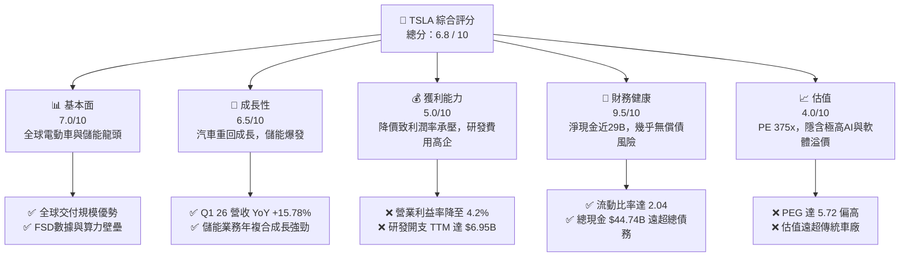
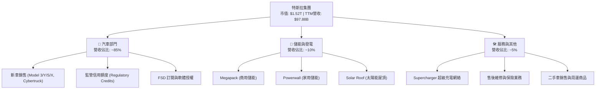
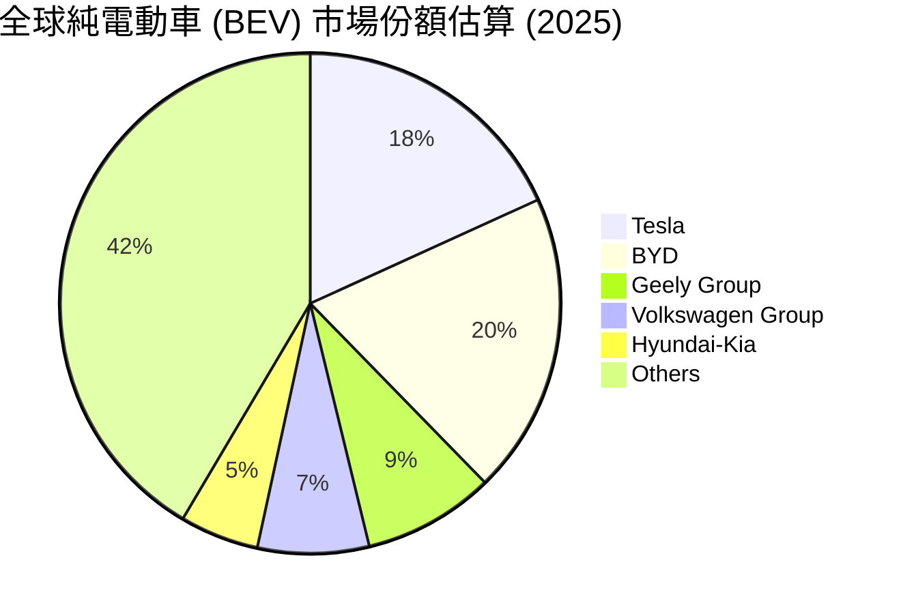
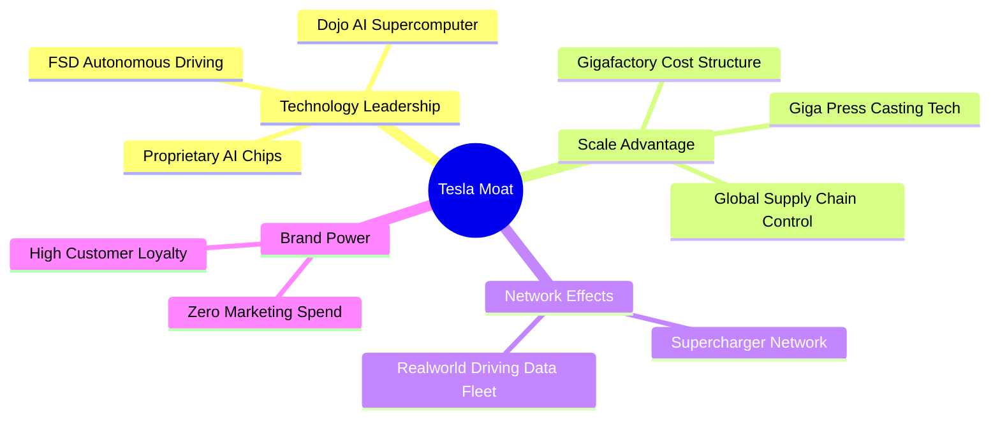
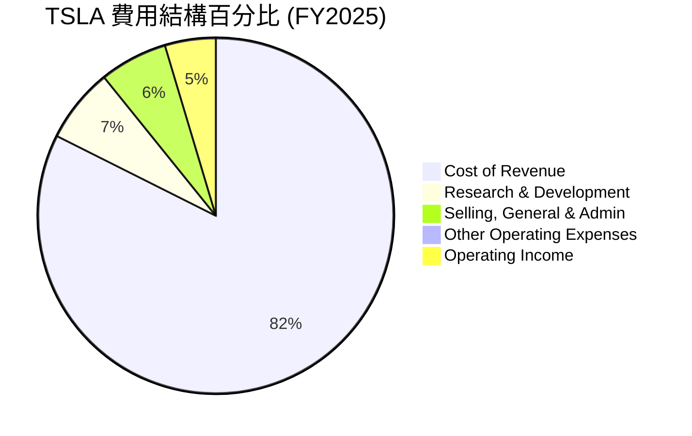
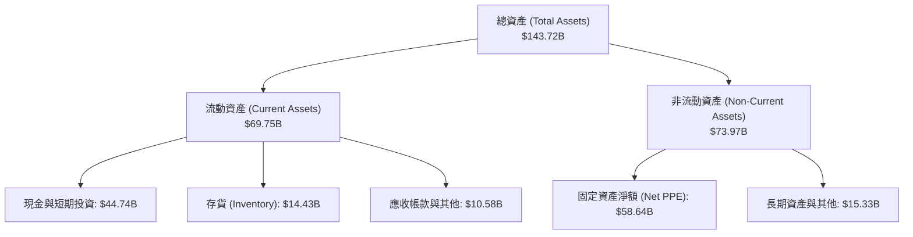
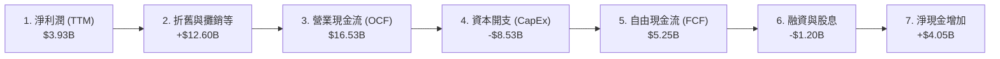
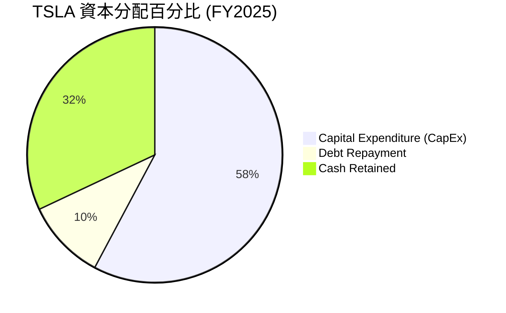
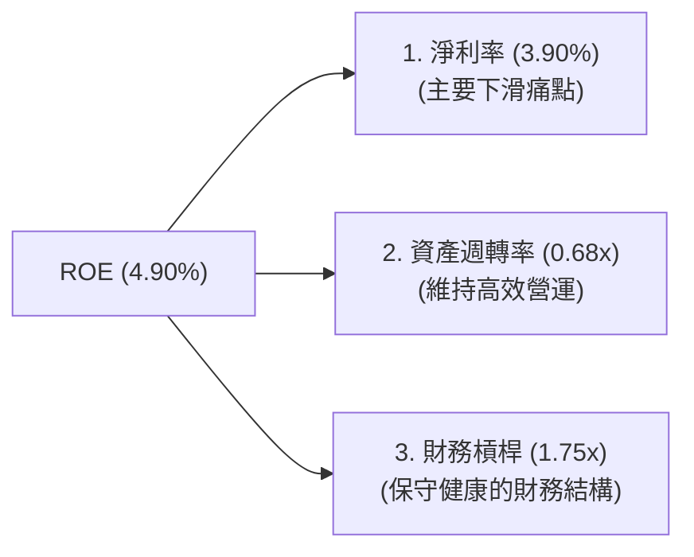
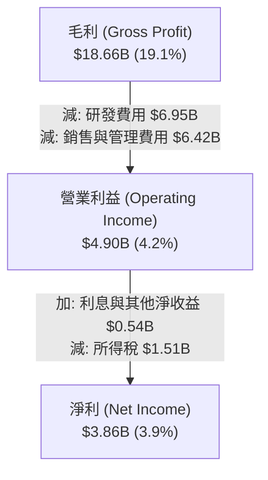

# TSLA 基本面深度分析報告

> **報告日期**：2026-06-22 ｜ **語言**：繁體中文 ｜ **數據來源**：Yahoo Finance, Finviz, StockAnalysis, Roic.ai ｜ **分析師**：CFA 級機構研究

---

## 目錄

| # | 章節 | 核心結論 |
|---|---|---|
| 1 | **執行摘要** | 評級：🟡 **持有 / 溫和買入**；目標價：**$420.55**；AI 與能源轉型為長線核心驅力。 |
| 2 | **公司概覽與商業模式** | 汽車、能源與服務三位一體；以數據與規模效應構築極深之競爭護城河。 |
| 3 | **損益表深度分析** | 營收重回成長（Q1 '26 YoY +15.78%），唯獲利能力因 R&D 擴張與降價而承壓。 |
| 4 | **資產負債表分析** | 擁有 $44.74B 巨額現金，淨現金高達 $28.85B，財務結構極度穩健。 |
| 5 | **現金流量深度分析** | TTM 自由現金流 $5.25B，資本開支高達 $8.53B，主要投向 AI 與產能擴建。 |
| 6 | **獲利能力與資本效率** | ROE 降至 4.9%，ROIC (6.9%) 短期低於 WACC (12.4%)，處於高額投資蓄勢期。 |
| 7 | **估值深度分析** | Trailing P/E 達 375x，Forward P/E 162x，高估值溢價高度依賴 AI 軟體變現。 |
| 8 | **成長催化劑** | FSD V12 授權、Robotaxi 落地、新一代平價車款與 Megapack 產能釋放。 |
| 9 | **風險矩陣** | 核心車款毛利率持續下滑、FSD 技術突破遲滯、關鍵人物風險與估值修正。 |
| 10 | **投資建議** | 建議分批佈局，基準目標價 $420.55，適合具備高風險承受度的長線成長型投資人。 |

---

## 1. 執行摘要

### 1.1 核心評分儀表板



### 1.2 評分進度條視覺化

```
╔══════════════════════════════════════════════════════════════╗
║               TSLA 多維度評分儀表板 (1-10分)                 ║
╠══════════════════════════════════════════════════════════════╣
║ 基本面強度  7.0 ▓▓▓▓▓▓▓▓▓▓▓▓▓▓░░░░░░░░  ★★★☆☆           ║
║ 成長動能    6.5 ▓▓▓▓▓▓▓▓▓▓▓▓▓░░░░░░░░░  ★★★☆☆           ║
║ 獲利品質    5.0 ▓▓▓▓▓▓▓▓▓▓░░░░░░░░░░░░  ★★☆☆☆           ║
║ 財務健康    9.5 ▓▓▓▓▓▓▓▓▓▓▓▓▓▓▓▓▓▓▓░  ★★★★★           ║
║ 估值合理性  4.0 ▓▓▓▓▓▓▓▓░░░░░░░░░░░░░░  ★★☆☆☆           ║
║ 護城河深度  9.0 ▓▓▓▓▓▓▓▓▓▓▓▓▓▓▓▓▓▓░░  ★★★★☆           ║
║ 管理層執行  8.0 ▓▓▓▓▓▓▓▓▓▓▓▓▓▓▓▓░░░░  ★★★★☆           ║
║ 技術創新力  9.5 ▓▓▓▓▓▓▓▓▓▓▓▓▓▓▓▓▓▓▓░  ★★★★★           ║
╠══════════════════════════════════════════════════════════════╣
║ 綜合總分    6.8 ▓▓▓▓▓▓▓▓▓▓▓▓▓░░░░░░░░░  🏆 溫和買入 / 持有  ║
╚══════════════════════════════════════════════════════════════╝
```

### 1.3 五大投資論點與三大核心風險

| 類型 | 項目 | 具體依據 | 信心度 |
|---|---|---|---|
| 🟢 **投資論點①** | **營收重回成長軌道** | Q1 2026 營收達 **$22.39B**，年增率（YoY）由 2025 年底的 -3.14% 強勁反彈至 **+15.78%**。 | 🟢 高 |
| 🟢 **投資論點②** | **堅不可摧的財務護城河** | 持有 **$44.74B** 總現金，淨現金高達 **$28.85B**，足夠支撐其在下行週期的研發與資本支出。 | 🟢 極高 |
| 🟢 **投資論點③** | **儲能業務（Energy）爆發** | 2025 年儲能與發電業務毛利顯著改善，Megapack 產能持續供不應求，成為第二成長曲線。 | 🟢 高 |
| 🟢 **投資論點④** | **AI 與 FSD 軟體高毛利預期** | FSD V12 累積行駛里程加速成長，未來軟體授權與 Robotaxi 的高毛利率（>70%）將徹底改變利潤結構。 | 🟡 中等 |
| 🟢 **投資論點⑤** | **製造規模與一體化壓鑄優勢** | 擁有全球六大 Gigafactory，單車製造成本持續最佳化，平價車款預期將於 2026-2027 年放量。 | 🟢 高 |
| 🟡 **風險①** | **硬體利潤率持續收縮** | 汽車降價競爭導致 TTM 營業利益率降至 **4.2%**，短期內難以回到 2022 年的 16.8% 高水準。 | 🟡 中度 |
| 🔴 **風險②** | **估值溢價過高** | 當前 Trailing P/E 達 **375x**，Forward P/E 達 **162x**，若 AI 或 Robotaxi 進度不如預期，將面臨巨大的估值修正壓力。 | 🔴 高衝擊 |
| 🔴 **風險③** | **地緣政治與供應鏈風險** | 中國市場競爭白熱化（比亞迪等本地對手），且面臨歐美對中國製電動車關稅政策波動的衝擊。 | 🔴 高衝擊 |

### 1.4 快速統計卡片

| 指標 | TSLA 實際值 | 行業均值（汽車製造） | S&P 500 均值 | 狀態 |
|---|---|---|---|---|
| **營收 YoY 成長 (TTM)** | **15.8%** | ~5.0% | ~6.5% | 🟢 優於同行 |
| **毛利率 (TTM)** | **19.1%** | ~14.5% | ~30.0% | 🟢 優於同行 |
| **營業利益率 (TTM)** | **4.2%** | ~6.0% | ~12.0% | 🔴 低於同行 |
| **ROE (TTM)** | **4.9%** | ~8.0% | ~15.0% | 🟡 處於低谷 |
| **Forward P/E** | **162.0x** | ~10.0x | ~21.0x | 🔴 估值極高 |
| **淨現金 / 債務** | **+$28.85B** | 普遍淨負債 | 普遍淨負債 | 🟢 極其健康 |

### 1.5 投資結論

```
╔══════════════════════════════════════════════════════════════════╗
║                    📊 TSLA 投資結論摘要                          ║
╠══════════════════════════════════════════════════════════════════╣
║  評級：🟡 持有 / 溫和買入 (Moderate Buy)                         ║
║  當前股價：$405.05 (2026-06-22)                                  ║
║  目標價區間：                                                    ║
║    悲觀情境：$250.00 (-38.3%) - 汽車利潤持續萎縮，FSD 落地延遲   ║
║    基準情境：$420.55 (+3.8%)  - 12個月主要目標價 (市場共識)      ║
║    樂觀情境：$550.00 (+35.8%) - AI 軟體授權成功，Robotaxi 商業化  ║
║  投資評分：6.8 / 10                                              ║
║  適合投資人：具備長線視野、看好 AI/自動駕駛，且能承受高波動之投資人║
╚══════════════════════════════════════════════════════════════════╝
```

---

## 2. 公司概覽與商業模式

### 2.1 業務結構與收入來源

特斯拉已非單純的汽車製造商，而是整合了「硬體製造 + 軟體生態 + 能源網絡」的垂直一體化科技巨擘。



### 2.2 全球純電動車（BEV）市場份額

根據 2025 年全球純電動車市場數據估算，特斯拉與比亞迪（BYD）呈現雙雄爭霸格局：



### 2.3 競爭護城河分析



### 2.4 護城河強度評分

```
╔══════════════════════════════════════════════════════════════╗
║                    TSLA 護城河強度評分                       ║
╠══════════════════════════════════════════════════════════════╣
║ 技術領先度    9.5/10  ▓▓▓▓▓▓▓▓▓▓▓▓▓▓▓▓▓▓▓░  🏆 FSD 與 AI 算力  ║
║ 規模效應      9.0/10  ▓▓▓▓▓▓▓▓▓▓▓▓▓▓▓▓▓▓░░  🟢 超低生產成本    ║
║ 網絡效應      8.5/10  ▓▓▓▓▓▓▓▓▓▓▓▓▓▓▓▓░░░░  🟢 超充與數據網絡  ║
║ 客戶鎖定      8.0/10  ▓▓▓▓▓▓▓▓▓▓▓▓▓▓░░░░░░  🟢 軟硬體生態一體化║
║ 品牌價值      9.0/10  ▓▓▓▓▓▓▓▓▓▓▓▓▓▓▓▓▓▓░░  🏆 全球頂級影響力  ║
╠══════════════════════════════════════════════════════════════╣
║ 綜合護城河    8.8/10  ▓▓▓▓▓▓▓▓▓▓▓▓▓▓▓▓▓░░░  🏆 寬廣 (Wide Moat)║
╚══════════════════════════════════════════════════════════════╝
```

---

## 3. 損益表深度分析

### 3.1 年度收入成長趨勢（FY2022 - FY2025）

特斯拉在經歷了 2022-2023 年的高速成長後，於 2024-2025 年進入平台期。主要原因在於全球電動車滲透率增速放緩，以及平價新車款尚未量產，導致主力的 Model 3/Y 面臨激烈的價格競爭。

```
╔══════════════════════════════════════════════════════════════════╗
║                TSLA 年度收入趨勢 (FY2022 - FY2025)               ║
╠══════════════════════════════════════════════════════════════════╣
║                                                                  ║
║  FY 2022  $81.46B  ████████████████████░░░░░░░░░░░░  YoY: +51.4% 🟢║
║  FY 2023  $96.77B  ████████████████████████░░░░░░░░  YoY: +18.8% 🟢║
║  FY 2024  $97.69B  ████████████████████████░░░░░░░░  YoY: +0.95% 🟡║
║  FY 2025  $94.83B  ███████████████████████░░░░░░░░░  YoY: -2.93% 🔴║
║                                                                  ║
║  📊 4年累計 CAGR：+5.20% (由高速成長轉入蓄勢期)                 ║
╚══════════════════════════════════════════════════════════════════╝
```

### 3.2 季度收入趨勢分析

從季度數據來看，特斯拉在 2025 年第二季經歷了營收低谷（-11.78%），但自 2025 年第三季起顯著回溫。最新公佈的 **Q1 2026** 營收達 **$22.39B**，年增率強勁回升至 **+15.78%**，顯示市場需求正在重新凝聚，降價對銷量的刺激效果開始顯現。

| 季度 | 營收 (Billion) | YoY 成長率 | QoQ 成長率 | 核心驅動因素 / 備註 |
|---|---|---|---|---|
| **Q1 2026** | **$22.39B** | **+15.78%** | -10.10% | 🟢 季節性下滑，但年增率大幅反彈，顯示基期效應與需求回溫。 |
| **Q4 2025** | **$24.90B** | -3.14% | -11.37% | 🔴 年底促銷致平均售價（ASP）下滑，營收按年微幅萎縮。 |
| **Q3 2025** | **$28.10B** | **+11.57%** | **+24.89%** | 🟢 儲能裝機量創歷史新高，加之 Model 3 煥新版全球交付放量。 |
| **Q2 2025** | **$22.50B** | -11.78% | **+16.34%** | 🟡 經歷 Q1 的生產中斷後，產能利用率回升。 |
| **Q1 2025** | **$19.34B** | -9.23% | -24.77% | 🔴 紅海航運中斷與柏林工廠縱火案，導致生產與交付嚴重受挫。 |

### 3.3 利潤率演變分析

特斯拉的利潤率在過去幾年中經歷了顯著的收縮。毛利率從 2022 年的 **25.6%** 降至 2025 年的 **18.0%**（TTM 略微回升至 **19.1%**）。

更為嚴峻的是，**營業利益率**從 2022 年的 **16.8%** 驟降至 2025 年的 **4.6%**（TTM 為 **4.2%**）。這主要是因為價格戰導致車均利潤下滑，同時公司大幅增加了在 AI、FSD 和機器人領域的研發投入。

| 利潤率指標 | FY2022 | FY2023 | FY2024 | FY2025 | TTM | 趨勢評估 |
|---|---|---|---|---|---|---|
| **毛利率** | 25.60% | 18.25% | 17.86% | 18.03% | **19.10%** | 🟡 底部企穩，硬體降價空間已有限。 |
| **營業利益率** | 16.76% | 9.19% | 7.24% | 4.59% | **4.20%** | 🔴 持續承壓，主要受高額研發費用拖累。 |
| **EBITDA 利潤率**| 21.68% | 15.30% | 15.06% | 12.40% | **11.30%** | 🟡 折舊攤銷佔比較高，維持基本現金獲利能力。|
| **淨利率** | 15.45% | 15.47% | 7.32% | 4.07% | **3.90%** | 🔴 處於歷史低位，淨利潤規模大幅縮水。 |

### 3.4 費用結構分析

特斯拉在維持低行銷費用的同時，將資源高度集中於研發。2025 年研發費用（R&D）高達 **$6.41B**，佔營收比重提升至 **6.76%**（TTM 進一步攀升至 **$6.95B**）。這反映了馬斯克將特斯拉轉型為 AI 公司的決心。



### 3.5 季度 EPS 趨勢與盈餘品質

特斯拉過去四個季度的 EPS（稀釋後）表現反映了獲利低谷時期的波動。Q1 2026 稀釋後 EPS 為 **$0.15**，較去年同期的 $0.13 微幅改善，但相較於 2024 年單季 $0.70+ 的水準仍有極大差距。

*   **盈餘品質評估**：
    1.  **監管信用額度（Regulatory Credits）依賴度高**：在汽車毛利收縮時，特斯拉仍依賴出售碳排放額度來補貼利潤。這部分收入幾乎是 100% 的純利，若扣除此項目，硬體汽車業務的實際利潤率將更低。
    2.  **非現金支出佔比高**：EBITDA（TTM $11.76B）遠高於淨利潤（TTM $3.93B），其中包含大量的股權激勵費用與設備折舊，顯示其經營現金流依然健康，並未出現實質性的失血。

---

## 4. 資產負債表分析

### 4.1 資產結構分解

特斯拉的資產負債表極為強健，呈現典型的「輕債務、高現金」特徵。



### 4.2 流動性指標分析

特斯拉的流動比率高達 **2.04**，速動比率為 **1.43**（Finviz 數據為 1.62），遠超汽車製造業平均水準（通常低於 1.2）。這意味著特斯拉擁有極強的短期變現能力與債務償還能力。存貨金額控制在 **$14.43B**，相較於 TTM 營收規模，存貨週轉天數維持在約 66 天的合理區間。

| 流動性指標 | FY2022 | FY2023 | FY2024 | FY2025 | TTM / 當前 | 行業均值 | 評估 |
|---|---|---|---|---|---|---|---|
| **流動比率 (Current Ratio)** | 1.53 | 1.73 | 2.02 | 2.16 | **2.04** | ~1.15 | 🟢 極其安全 |
| **速動比率 (Quick Ratio)** | 1.05 | 1.25 | 1.61 | 1.77 | **1.43** | ~0.80 | 🟢 流動性極佳 |
| **債務權益比 (Debt/Equity)** | 12.87% | 15.28% | 18.68% | 17.92% | **18.74%**| ~85.0% | 🟢 財務槓桿極低 |

### 4.3 債務結構分析

特斯拉的總債務為 **$15.89B**（包含短期債務 $2.44B、長期借款 $7.65B 以及長期租賃負債 $5.81B）。

```
╔══════════════════════════════════════════════════════════════════╗
║                    TSLA 債務健康診斷 (2026-06-22)                ║
╠══════════════════════════════════════════════════════════════════╣
║                                                                  ║
║  總債務 (Total Debt)：     $15.89B  ████░░░░░░░░░░░░░░░░░░░      ║
║  總現金與短期投資：         $44.74B  ██████████████████████░      ║
║  淨現金 (Net Cash)：       +$28.85B  ██████████████░░░░░░░░░  🟢  ║
║                                                                  ║
║  Debt / Equity Ratio：     18.74%   🟢 遠低於行業警戒線 (100%)   ║
║  Interest Coverage Ratio： 14.4x    🟢 息稅前利潤能輕鬆覆蓋利息  ║
║  債務評級：投資級 (Investment Grade) - 幾乎無破產或違約風險      ║
╚══════════════════════════════════════════════════════════════════╝
```

### 4.4 股東權益趨勢

得益於持續的留存收益累積以及極少的股份回購，特斯拉的股東權益（Book Value）呈現逐年穩健增長趨勢，為公司提供了堅實的淨資產支撐。

```
╔══════════════════════════════════════════════════════════════════╗
║                TSLA 歷年股東權益變化 (FY2022 - FY2025)           ║
╠══════════════════════════════════════════════════════════════════╣
║                                                                  ║
║  FY 2022  $44.70B  ███████████░░░░░░░░░░░░░░░░░░░░░              ║
║  FY 2023  $62.63B  ████████████████░░░░░░░░░░░░░░░░              ║
║  FY 2024  $72.91B  █████████████████████░░░░░░░░░░░              ║
║  FY 2025  $82.14B  █████████████████████████░░░░░░░              ║
║                                                                  ║
║  📈 股東權益 4 年複合成長率 (CAGR)：+22.5% (資產負債表持續增厚)  ║
╚══════════════════════════════════════════════════════════════════╝
```

---

## 5. 現金流量深度分析

### 5.1 現金流量瀑布圖

特斯拉的經營模式具備極高的「含金量」。儘管淨利潤受到壓縮，但折舊與攤銷等非現金支出龐大，使得經營現金流依然維持在極高水準。



### 5.2 自由現金流（FCF）轉換率趨勢

特斯拉的自由現金流轉換率（FCF / Net Income）在 2025 年達到了 **161.3%**（$6.22B FCF / $3.86B Net Income）。這表明公司的實際「吐現能力」遠高於會計利潤，這主要得益於其優秀的營運資金管理（如延遲支付供應商應付款項）以及龐大的非現金折舊。

| 財務年度 | 營業現金流 (OCF) | 資本支出 (CapEx) | 自由現金流 (FCF) | 淨利潤 (Net Income) | FCF 轉換率 |
|---|---|---|---|---|---|
| **FY 2022** | $14.72B | -$7.17B | $7.55B | $12.59B | 59.97% |
| **FY 2023** | $13.26B | -$8.90B | $4.36B | $14.97B | 29.12% |
| **FY 2024** | $14.92B | -$11.34B | $3.58B | $7.15B | 50.07% |
| **FY 2025** | $14.75B | -$8.53B | $6.22B | $3.86B | **161.27%** |
| **TTM** | **$16.53B** | **-$8.53B** | **$5.25B** | **$3.93B** | **133.59%** |

### 5.3 自由現金流趨勢視覺化

```
╔══════════════════════════════════════════════════════════════════╗
║                  TSLA 歷年自由現金流與殖利率                     ║
╠══════════════════════════════════════════════════════════════════╣
║                                                                  ║
║  FY 2022  $7.55B  ████████████████████████████░░░░  Yield: 0.50% ║
║  FY 2023  $4.36B  ████████████████░░░░░░░░░░░░░░░░  Yield: 0.29% ║
║  FY 2024  $3.58B  █████████████░░░░░░░░░░░░░░░░░░░  Yield: 0.24% ║
║  FY 2025  $6.22B  ███████████████████████░░░░░░░░░  Yield: 0.41% ║
║  TTM      $5.25B  ███████████████████░░░░░░░░░░░░░  Yield: 0.35% ║
║                                                                  ║
║  ⚠️ FCF Yield 偏低 (0.35%)，反映當前估值乘數極高。               ║
╚══════════════════════════════════════════════════════════════════╝
```

### 5.4 資本配置評估

特斯拉不發放股息，也極少進行股份回購。其資本配置策略非常明確：**將所有經營現金流重新投入未來的成長**。



---

## 6. 獲利能力與資本效率

### 6.1 ROE / ROA / ROIC 趨勢

由於硬體降價及 AI 高額投資，特斯拉的資本效率指標自 2023 年的巔峰大幅下滑。**ROE 降至 4.9%**，**ROA 降至 2.2%**。這表明特斯拉目前正處於「重資產、高投入、低產出」的蓄勢期，未來的資本效率提升將高度依賴軟體（FSD）的邊際效應釋放。

| 指標 | FY2022 | FY2023 | FY2024 | FY2025 | TTM / 當前 | 產業均值 | 評估 |
|---|---|---|---|---|---|---|---|
| **ROE** | 28.10% | 23.90% | 9.80% | 4.86% | **4.90%** | ~8.0% | 🟡 處於歷史低谷 |
| **ROA** | 15.20% | 14.10% | 5.80% | 2.87% | **2.20%** | ~3.5% | 🔴 資產利用效率下降 |
| **ROIC** | 20.50% | 16.80% | 8.50% | 6.50% | **6.90%** | ~5.0% | 🟢 仍高於多數傳統車廠 |

### 6.2 ROIC vs WACC 分析（核心價值創造判斷）

為了評估特斯拉是在「創造價值」還是「摧毀股東財富」，我們進行了 ROIC 與 WACC 的對比建模：

```
╔══════════════════════════════════════════════════════════════════╗
║                TSLA ROIC vs WACC 深度分析 (TTM)                  ║
╠══════════════════════════════════════════════════════════════════╣
║                                                                  ║
║  WACC 估算：                                                     ║
║  ├── 無風險利率 (10Y 美債)：  4.20%                              ║
║  ├── 市場風險溢酬 (ERP)：     5.50%                              ║
║  ├── Beta：                   1.798 (系統性風險高)               ║
║  ├── 股權成本 (Cost of Equity)： 4.2% + 1.798 × 5.5% = 14.09%    ║
║  ├── 債務成本 (稅後)：       ~4.50%                              ║
║  ├── 資本結構：股權 ~84%，債務 ~16%                              ║
║  └── ✅ WACC ≈ 12.43%                                            ║
║                                                                  ║
║  ROIC 估算：                                                     ║
║  ├── NOPAT = 營業利益 $4.90B × (1 - 25% 稅率) ≈ $3.68B           ║
║  ├── 投入資本 = 股東權益 $82.14B + 債務 $15.89B - 現金 $44.74B    ║
║  │            = $53.29B                                          ║
║  └── ✅ ROIC ≈ 6.91%                                             ║
║                                                                  ║
║  ★ 經濟價值增加 (EVA) = ROIC - WACC = -5.52%                     ║
║                                                                  ║
║  ROIC  6.91%   ▓▓▓▓▓▓▓▓▓▓▓▓▓░░░░░░░░░░░░░░░░░░  ──              ║
║  WACC  12.43%  ▓▓▓▓▓▓▓▓▓▓▓▓▓▓▓▓▓▓▓▓▓▓▓▓░░░░░░░  ──              ║
║  EVA   -5.52%  🔴 短期內面臨經濟價值的「技術性摧毀」             ║
║                                                                  ║
║  📊 結論：受汽車利潤率收縮拖累，當前 ROIC 低於高 Beta 帶來的 WACC。║
║  這意味著當前的股價高度溢價，完全是在「透支未來 AI 業務的 EVA」。 ║
╚══════════════════════════════════════════════════════════════════╝
```

### 6.3 杜邦三因素分解

透過杜邦分析，我們可以清晰地看到 ROE 下滑的根本原因：**淨利率的急劇收縮**，而非資產週轉率或財務槓桿的變化。



### 6.4 獲利能力儀表板



---

## 7. 估值深度分析

### 7.1 同業估值比較表格

特斯拉的估值體系完全脫離了傳統汽車製造商，呈現出顯著的「科技股」甚至「AI 股」溢價。與比亞迪（BYD）和豐田（Toyota）相比，其 P/E 和 P/S 乘數高出數十倍；即使與 AI 龍頭輝達（Nvidia）相比，其 Forward P/E（162x）也顯得極為昂貴。

| 估值指標 | **特斯拉 (TSLA)** | **比亞迪 (BYDDY)** | **豐田汽車 (TM)** | **輝達 (NVDA)** | TSLA 評估 |
|---|---|---|---|---|---|
| **Trailing P/E** | **375.05x** | ~18.5x | ~8.2x | ~65.0x | 🔴 極度高估，隱含極高預期 |
| **Forward P/E** | **162.02x** | ~14.0x | ~7.5x | ~32.0x | 🔴 遠超硬體同行與科技龍頭 |
| **PEG Ratio** | **5.72** | ~1.15 | ~0.95 | ~1.30 | 🔴 成長性溢價過高 |
| **P/S Ratio** | **15.54x** | ~0.85x | ~0.65x | ~28.0x | 🔴 作為製造業，銷量估值極昂貴 |
| **EV / EBITDA** | **133.04x** | ~10.5x | ~5.5x | ~45.0x | 🔴 現金流估值倍數極高 |
| **P/B Ratio** | **18.50x** | ~3.10x | ~1.05x | ~35.0x | 🔴 帳面價值溢價顯著 |

### 7.2 歷史估值區間分析

特斯拉的歷史 P/E 區間波動極大。當前 375x 的 Trailing P/E 處於其歷史估值區間的偏高位置，這並非因為股價暴漲，而是因為 **TTM 淨利潤大幅縮水**（由 2023 年的 $15B 降至當前的 $3.93B）。

```
╔