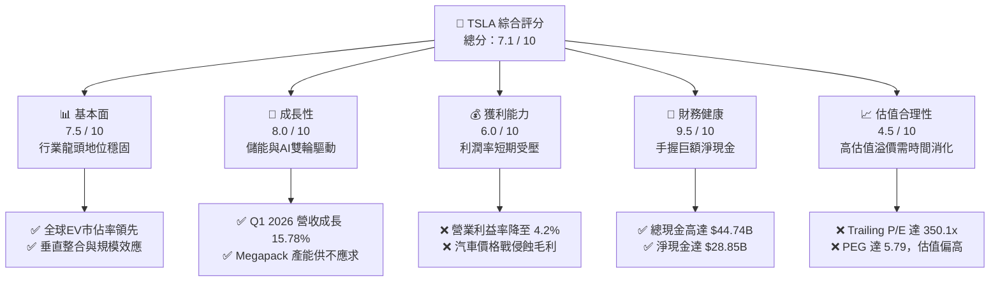
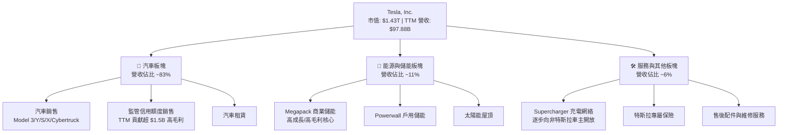
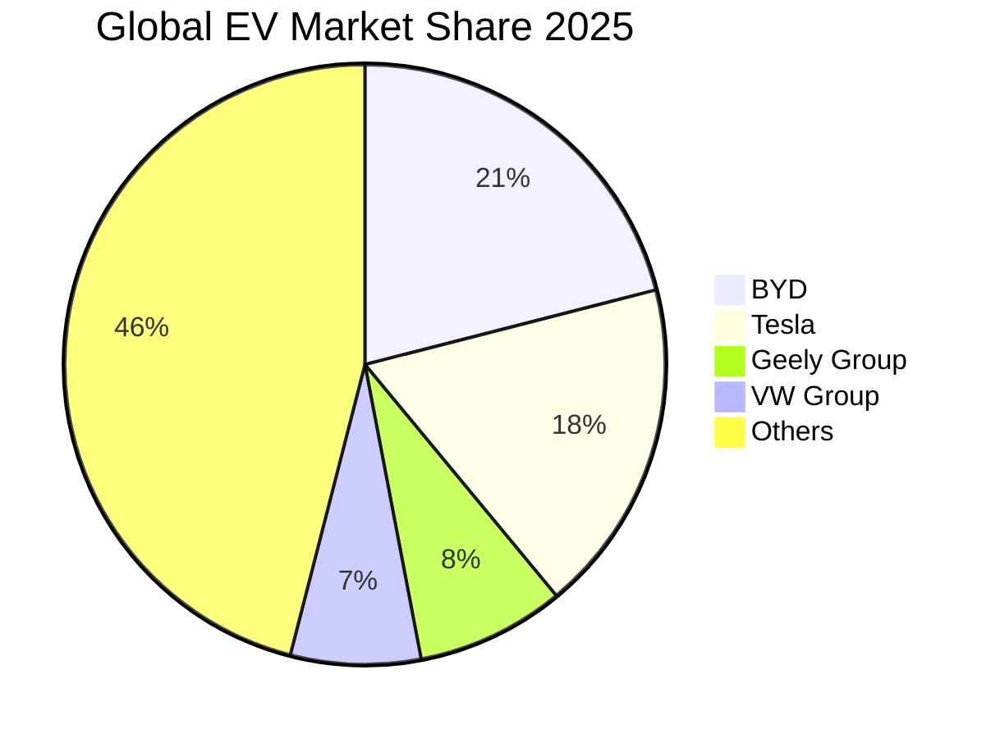
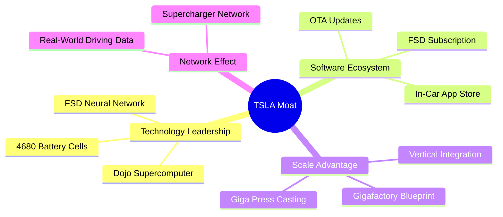
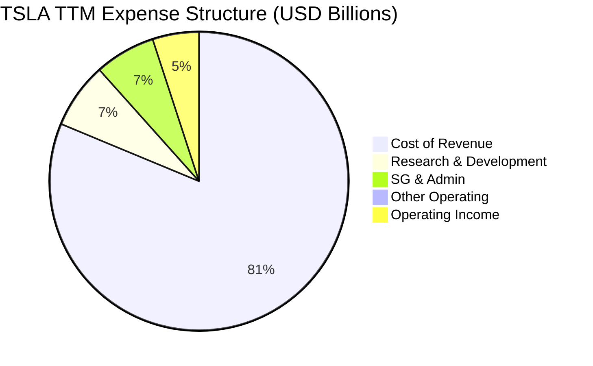
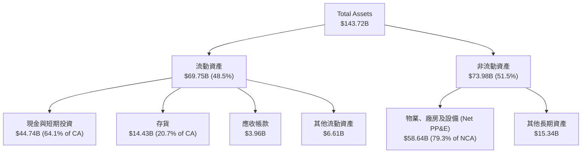
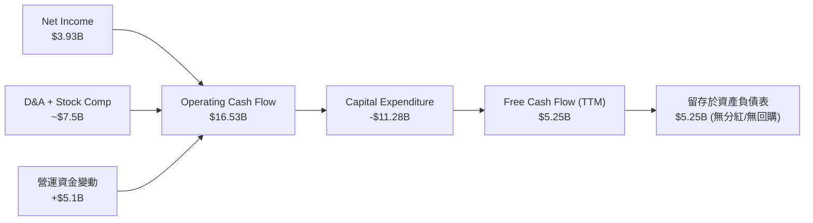
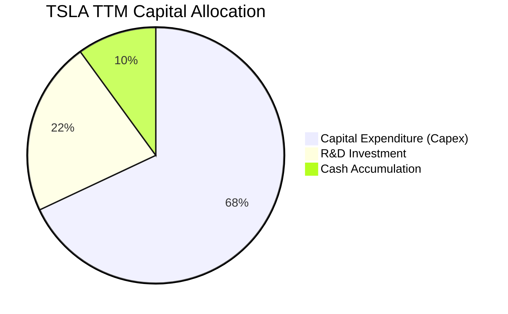
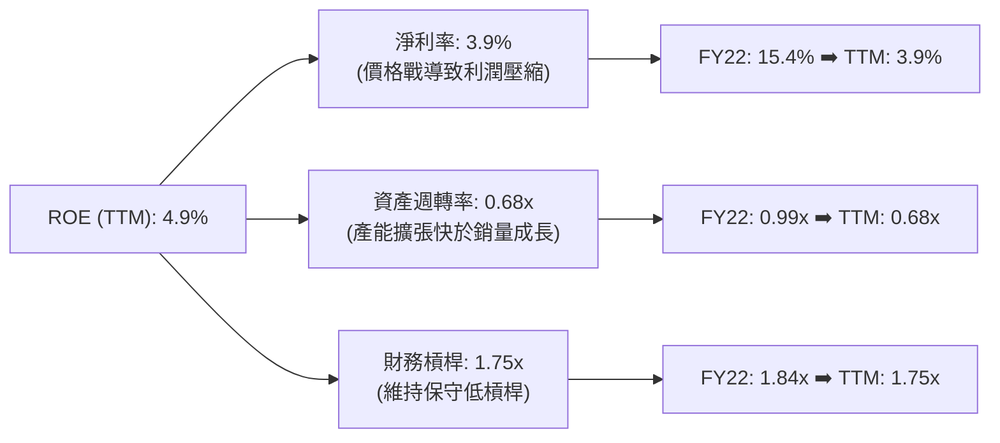
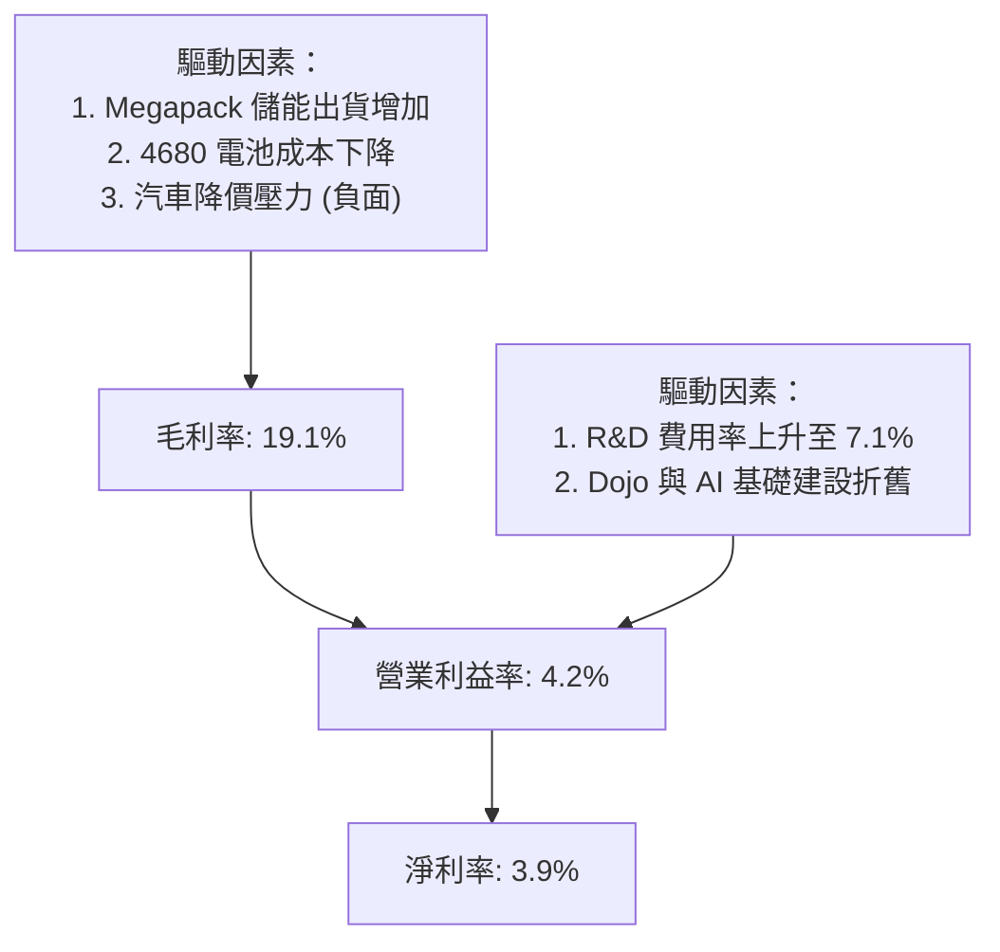

# TSLA 基本面深度分析報告
> **報告日期**：2026-06-24 ｜ **語言**：繁體中文 ｜ **數據來源**：Yahoo Finance, Finviz, StockAnalysis, Roic.ai ｜ **分析師**：CFA 級機構研究

---

## 目錄

| # | 章節 | 核心結論 |
|---|---|---|
| 1 | 執行摘要 | 評級：**持有 (Hold)**，目標價 **$421.16**，AI 與儲能溢價支撐高估值 |
| 2 | 公司概覽與商業模式 | 從純電動車企轉型為「AI + 機器人 + 儲能」的全球生態帝國 |
| 3 | 損益表深度分析 | 汽車毛利率築底回升，R&D 投入創歷史新高，Q1 2026 營收重回雙位數成長 |
| 4 | 資產負債表分析 | 擁有 **$28.85B** 淨現金，資產負債表固若金湯，抗風險能力極強 |
| 5 | 現金流量深度分析 | TTM 自由現金流 **$5.25B**，資本配置全面向 Capex 與 AI 基礎建設傾斜 |
| 6 | 獲利能力與資本效率 | 杜邦分解顯示 ROE 暫時受壓（4.9%），ROIC (7.35%) 低於 WACC (12.3%) |
| 7 | 估值深度分析 | Trailing P/E 達 **350.1x**，遠超同業；DCF 顯示基準情境目標價為 **$421.16** |
| 8 | 成長催化劑 | FSD 全球授權、Model 2 平台投產與 Megapack 產能釋放構成三駕馬車 |
| 9 | 風險矩陣 | 價格戰持續侵蝕利潤、FSD 監管審批延遲與 CEO 關鍵人風險 |
| 10 | 投資建議 | 建議於 **$330-350** 區間逢低佈局，適合長線成長型投資人 |

---

## 1. 執行摘要

### 1.1 核心評分儀表板



### 1.2 評分進度條視覺化

```
╔══════════════════════════════════════════════════════════════╗
║               TSLA 多維度評分儀表板 (1-10分)                 ║
╠══════════════════════════════════════════════════════════════╣
║ 基本面強度  7.5 ▓▓▓▓▓▓▓▓▓▓▓▓▓▓▓▓▓░░░  ★★★★☆           ║
║ 成長動能    8.0 ▓▓▓▓▓▓▓▓▓▓▓▓▓▓▓▓▓▓░░  ★★★★☆           ║
║ 獲利品質    6.0 ▓▓▓▓▓▓▓▓▓▓▓▓░░░░░░░░  ★★★☆☆           ║
║ 財務健康    9.5 ▓▓▓▓▓▓▓▓▓▓▓▓▓▓▓▓▓▓▓░  ★★★★★           ║
║ 估值合理性  4.5 ▓▓▓▓▓▓▓▓▓░░░░░░░░░░░  ★★☆☆☆           ║
║ 護城河深度  9.0 ▓▓▓▓▓▓▓▓▓▓▓▓▓▓▓▓▓▓░░  ★★★★★           ║
║ 管理層執行  8.0 ▓▓▓▓▓▓▓▓▓▓▓▓▓▓▓▓▓░░░  ★★★★☆           ║
║ 技術創新力  9.5 ▓▓▓▓▓▓▓▓▓▓▓▓▓▓▓▓▓▓▓░  ★★★★★           ║
╠══════════════════════════════════════════════════════════════╣
║ 綜合總分    7.1 ▓▓▓▓▓▓▓▓▓▓▓▓▓▓░░░░░░  🏆 中性偏樂觀        ║
╚══════════════════════════════════════════════════════════════╝
```

### 1.3 五大投資論點 + 三大核心風險

| 類型 | 項目 | 具體依據 | 信心度 |
|------|------|----------|--------|
| 🟢 **投資論點①** | **儲能業務進入爆發期** | FY2025 儲能裝機量與 Megapack 出貨量持續攀升，毛利率顯著高於汽車業務。 | 🟢 極高 |
| 🟢 **投資論點②** | **Q1 2026 營收重拾成長** | Q1 2026 營收達 **$22.39B**，YoY 成長 **15.78%**，顯示最壞時期已過。 | 🟢 高 |
| 🟢 **投資論點③** | **無與倫比的財務韌性** | 擁有 **$44.74B** 總現金，淨現金達 **$28.85B**，足以支撐高額 Capex。 | 🟢 極高 |
| 🟢 **投資論點④** | **FSD V12 及 Robotaxi 願景** | FSD 演算法轉向端到端神經網路，軟體訂閱與授權將成為未來的長線高毛利支柱。 | 🟡 中等 |
| 🟢 **投資論點⑤** | **下一代平價平台 (Model 2)** | 預計於 2026-2027 年投產，將大幅降低 BOM 成本，重新奪回中低端市場份額。 | 🟡 中等 |
| 🟡 **風險①** | **汽車利潤率持續承壓** | TTM 營業利益率已降至 **4.2%**，短期內難以恢復至 2022 年 16.8% 的高水準。 | 🟡 中度 |
| 🔴 **風險②** | **AI 估值溢價過高** | Trailing P/E 達 **350.10x**，若 FSD 落地進展不及預期，估值面臨劇烈殺多。 | 🔴 高衝擊 |
| 🔴 **風險③** | **核心管理層風險** | 馬斯克（Elon Musk）精力分散於多個實體，且其薪酬方案與股權控制存在不確定性。 | 🔴 高衝擊 |

### 1.4 快速統計卡片

| 指標 | TSLA 實際值 | 汽車行業均值 | S&P 500 均值 | 狀態 |
|------|-------------|--------------|--------------|------|
| 收入 YoY 成長 (TTM) | **15.8%** | ~5.0% | ~6.5% | 🟢 優於行業 |
| 毛利率 (TTM) | **19.1%** | ~14.0% | ~30.0% | 🟢 高於車企 |
| 營業利益率 (TTM) | **4.2%** | ~6.0% | ~12.0% | 🔴 低於行業 |
| ROE (TTM) | **4.9%** | ~8.0% | ~15.0% | 🟡 處於低谷 |
| 淨現金規模 | **$28.85B** | 負債累累 | N/A | 🟢 極度健康 |
| Forward P/E | **152.65x** | ~10.0x | ~21.0x | 🔴 極度昂貴 |

### 1.5 投資結論

```
╔══════════════════════════════════════════════════════════════════╗
║                    📊 TSLA 投資結論摘要                          ║
╠══════════════════════════════════════════════════════════════════╣
║  評級：🟡 持有 (Hold)                                            ║
║  當前股價：$381.61 (2026-06-24)                                  ║
║  目標價區間：                                                    ║
║    悲觀情境 (Bear Case)：$250.00 (-34.5%)                         ║
║    基準情境 (Base Case)：$421.16 (+10.4%)  ← 12個月主要目標      ║
║    樂觀情境 (Bull Case)：$550.00 (+44.1%)                         ║
║  投資評分：7.1 / 10                                              ║
║  適合投資人：具有極高風險承受能力、看好 AI/機器人長線前景之投資人║
╚══════════════════════════════════════════════════════════════════
```

---

## 2. 公司概覽與商業模式

Tesla, Inc. (TSLA) 已不再是一家單純的汽車製造商。其商業模式正經歷深刻的範式轉移（Paradigm Shift），逐步構建起以電動車為載體、以自動駕駛（FSD）軟體為靈魂、以 Megapack 儲能為基建、以 Optimus 人形機器人為終極願景的龐大 AI 生態系統。

### 2.1 業務結構與收入來源



### 2.2 市場份額

根據 2025 年全球純電動車（BEV）市場數據估算，特斯拉與其最大競爭對手比亞迪（BYD）呈現雙雄爭霸格局：



### 2.3 競爭護城河分析



### 2.4 護城河強度評分

```
╔══════════════════════════════════════════════════════════════╗
║                    TSLA 護城河強度評分                       ║
╠══════════════════════════════════════════════════════════════╣
║ 技術與 AI 領先 9.5/10  ▓▓▓▓▓▓▓▓▓▓▓▓▓▓▓▓▓▓▓░  🏆 極強極深    ║
║ 規模與成本優勢 9.0/10  ▓▓▓▓▓▓▓▓▓▓▓▓▓▓▓▓▓▓░░  🟢 極強        ║
║ 品牌與網絡效應 9.5/10  ▓▓▓▓▓▓▓▓▓▓▓▓▓▓▓▓▓▓▓░  🏆 極強極深    ║
║ 軟體生態與鎖定 8.5/10  ▓▓▓▓▓▓▓▓▓▓▓▓▓▓▓▓░░░░  🟢 強          ║
╠══════════════════════════════════════════════════════════════╣
║ 綜合護城河評級 9.1/10  ▓▓▓▓▓▓▓▓▓▓▓▓▓▓▓▓▓▓▓░  🏆 寬廣護城河  ║
╚══════════════════════════════════════════════════════════════╝
```

---

## 3. 損益表深度分析

### 3.1 年度收入成長趨勢（近4年）

特斯拉在經歷了 2021-2022 年的高速成長後，於 2024-2025 年因全球電動車需求放緩及激烈價格戰，營收成長陷入停滯。然而，最新 TTM 數據顯示營收已回升至 **$97.88B**，顯示市場需求正在復甦。

```
╔══════════════════════════════════════════════════════════════════╗
║                   TSLA 年度收入趨勢 (FY22 - TTM)                 ║
╠══════════════════════════════════════════════════════════════════╣
║                                                                  ║
║  FY2022  $81.46B  ██████████████████░░░░░░░░░░░  YoY: +51.35% 🟢 ║
║  FY2023  $96.77B  █████████████████████░░░░░░░░  YoY: +18.80% 🟢 ║
║  FY2024  $97.69B  █████████████████████░░░░░░░░  YoY: +0.95%  🟡 ║
║  FY2025  $94.83B  ████████████████████░░░░░░░░░  YoY: -2.93%  🔴 ║
║  TTM     $97.88B  █████████████████████░░░░░░░░  YoY: +15.80% 🟢 ║
║                                                                  ║
║  📊 4年複合成長率 (CAGR)：+4.71%                                 ║
╚══════════════════════════════════════════════════════════════════╝
```

### 3.2 季度收入趨勢分析

從季度數據來看，特斯拉在 2025 年第一季觸底（$19.34B）後，營收逐季回升，並在 Q3 2025 達到 **$28.10B** 的高峰。最新 Q1 2026 營收為 **$22.39B**，雖然因季節性因素 QoQ 下降 **10.10%**，但 YoY 成長達 **15.78%**，確認了營收拐點的出現。

| 財報季度 | 營收 (Revenue) | YoY 成長率 | QoQ 成長率 | 核心驅動因素與備註 |
|---|---|---|---|---|
| **Q1 2026** | **$22.39B** | **+15.78%** 🟢 | **-10.10%** 🔴 | 季節性交付淡季，但儲能裝機量 YoY 暴增彌補了汽車部分缺口。 |
| **Q4 2025** | **$24.90B** | **-3.14%** 🔴 | **-11.37%** 🔴 | 年末促銷拉動銷量，但平均售價 (ASP) 下滑限制了營收表現。 |
| **Q3 2025** | **$28.10B** | **+11.57%** 🟢 | **+24.89%** 🟢 | 創歷史單季營收新高，主要得益於 Model Y 交付強勁及 Megapack 結算。 |
| **Q2 2025** | **$22.50B** | **-11.78%** 🔴 | **+16.34%** 🟢 | 經歷 Q1 低谷後的產能與交付回溫。 |

### 3.3 利潤率演變分析

特斯拉的利潤率在過去幾年大幅萎縮。毛利率從 FY2022 的 **25.60%** 降至 TTM 的 **19.10%**；營業利益率則從 **16.85%** 暴跌至 TTM 的 **4.20%**。這主要是因為：
1. **持續價格戰**：全球 EV 市場競爭加劇，特斯拉多次下調車價。
2. **研發（R&D）投入激增**：Dojo 超算、FSD V12 研發及 Optimus 項目導致研發費用大幅飆升。

| 利潤率指標 | FY2022 | FY2023 | FY2024 | FY2025 | TTM | 趨勢評估 |
|---|---|---|---|---|---|---|
| **毛利率** | 25.60% | 18.25% | 17.86% | 18.03% | **19.10%** | ↗️ 築底回升，儲能高毛利開始顯現 (🟢) |
| **營業利益率** | 16.85% | 9.19% | 7.24% | 4.59% | **4.20%** | ↘️ 仍受研發與折舊壓制 (🔴) |
| **EBITDA 利潤率** | 21.68% | 15.29% | 15.06% | 12.40% | **11.30%** | ↘️ 處於歷史低位 (🟡) |
| **淨利率** | 15.41% | 15.48% | 7.30% | 4.00% | **3.90%** | ↘️ 淨利潤承壓明顯 (🔴) |

### 3.4 費用結構分析

特斯拉在 TTM 期間的費用結構顯著向技術研發傾斜：



```
╔══════════════════════════════════════════════════════════════╗
║               TSLA TTM 研發費用 (R&D) 暴增趨勢               ║
╠══════════════════════════════════════════════════════════════╣
║  FY2022: $3.08B  ██████░░░░░░░░░░░░░░░░░░░░                  ║
║  FY2023: $3.97B  ████████░░░░░░░░░░░░░░░░░░                  ║
║  FY2024: $4.54B  █████████░░░░░░░░░░░░░░░░░                  ║
║  FY2025: $6.41B  ██═════════════════░░░░░░░  YoY: +41.19% 🔴 ║
║  TTM   : $6.95B  ██████████████████████████  研發佔比達 7.1%  ║
╠══════════════════════════════════════════════════════════════╣
║  💡 評語：R&D 費用急劇上升，反映公司在 AI 與機器人領域的軍備競賽  ║
╚══════════════════════════════════════════════════════════════╝
```

### 3.5 季度 EPS 趨勢與盈餘品質

* **季度 EPS 走勢**：Q2 2025 ($0.36) ➡️ Q3 2025 ($0.43) ➡️ Q4 2025 ($0.26) ➡️ Q1 2026 ($0.15)。
* **盈餘品質評估**：
  * **監管信用額度（Regulatory Credits）依賴度較高**：在利潤率壓縮的背景下，特斯拉每季銷售監管信用額度（基本為 100% 純利）對維持淨利潤正值起到關鍵作用。
  * **非經常性損益**：FY2023 淨利潤暴增至 $15.00B 主要是因為一次性遞延所得稅資產評估準備的釋放（約 $5B），扣除此非經常性項目後，FY2024 與 FY2025 的盈餘呈現真實的周期性回落。目前 TTM EPS $1.09 為真實主營業務盈利能力的體現。

---

## 4. 資產負債表分析

### 4.1 資產結構分解

截至 2026 年 3 月 31 日，特斯拉總資產達 **$143.72B**，資產負債表呈現極高的流動性與輕資產化特徵（相較於傳統車企）。



### 4.2 流動性指標分析

| 流動性指標 | FY2022 | FY2023 | FY2024 | FY2025 | TTM / Q1 2026 | 行業均值 | 評估 |
|---|---|---|---|---|---|---|---|
| **流動比率 (Current Ratio)** | 1.53 | 1.73 | 2.02 | 2.16 | **2.04** | ~1.20 | 🟢 極其充沛 |
| **速動比率 (Quick Ratio)** | 1.05 | 1.25 | 1.61 | 1.77 | **1.43** | ~0.85 | 🟢 無短期償債風險 |
| **存貨週轉天數 (Days Inv.)** | 68.4 | 61.2 | 58.4 | 57.2 | **59.4** | ~75.0 | 🟢 存貨管理優於同業 |

### 4.3 債務結構分析

特斯拉是全球車企中極少數擁有「淨現金」結構的公司。

```
╔══════════════════════════════════════════════════════════════════╗
║                    TSLA 債務健康診斷 (Q1 2026)                  ║
╠══════════════════════════════════════════════════════════════════╣
║                                                                  ║
║  總現金與短期投資：$44.74B  ████████████████████████████████████  ║
║  總債務 (Total Debt)：$15.89B ████████████                        ║
║  ├─ 短期債務：$2.44B                                             ║
║  ├─ 長期借款：$7.65B                                             ║
║  └─ 長期融資租賃：$5.81B                                         ║
║                                                                  ║
║  💡 淨現金 (Net Cash) 規模：+$28.85B  🟢 強勁無比                ║
║                                                                  ║
║  Debt / Equity Ratio：18.74%  🟢 極低負債率                      ║
║  利息保障倍數 (Interest Coverage)：14.4x 🟢 無任何財務危機風險     ║
╚══════════════════════════════════════════════════════════════════╝
```

### 4.4 股東權益趨勢

特斯拉的股東權益（Stockholders' Equity）自 2022 年的 **$44.70B** 穩步成長至 2025 年底的 **$82.14B**，這主要得益於持續的未分配利潤累積以及部分股權激勵發行，未出現惡性稀釋股東權益的情況。

---

## 5. 現金流量深度分析

### 5.1 現金流量瀑布圖

特斯拉的現金流產生能力依然強勁，儘管淨利潤有所下滑，但折舊攤銷與非現金項目的調整使得營業現金流（OCF）高達 **$16.53B**。



### 5.2 FCF 轉換率趨勢

| 現金流指標 | FY2022 | FY2023 | FY2024 | FY2025 | TTM |
|---|---|---|---|---|---|
| **營業現金流 (OCF)** | $14.72B | $13.26B | $14.92B | $14.75B | **$16.53B** |
| **資本支出 (Capex)** | -$7.17B | -$8.90B | -$11.34B | -$8.53B | **-$11.28B** |
| **自由現金流 (FCF)** | $7.55B | $4.36B | $3.58B | $6.22B | **$5.25B** |
| **FCF / 淨利潤 轉換率** | 60.0% | 29.1% | 50.1% | 161.3% | **133.6%** 🟢 |

*評估*：TTM 期間 FCF 轉換率高達 **133.6%**，表明公司的淨利潤含金量極高，大額的折舊費用（來自 Gigafactory 的設備折舊）並未實際消耗現金，為公司提供了充足的再投資彈藥。

### 5.3 自由現金流趨勢

```
╔══════════════════════════════════════════════════════════════════╗
║                     TSLA 歷年自由現金流趨勢                      ║
╠══════════════════════════════════════════════════════════════════╣
║                                                                  ║
║  FY2022  $7.55B  ████████████████████████████░░░░░░░░░░░░░░      ║
║  FY2023  $4.36B  ████████████████░░░░░░░░░░░░░░░░░░░░░░░░░░      ║
║  FY2024  $3.58B  █████████████░░░░░░░░░░░░░░░░░░░░░░░░░░░░░      ║
║  FY2025  $6.22B  ███████████████████████░░░░░░░░░░░░░░░░░░      ║
║  TTM     $5.25B  ███████████████████░░░░░░░░░░░░░░░░░░░░░░      ║
║                                                                  ║
║  💡 當前 FCF 收益率 (FCF Yield)：0.37% (估值高企導致收益率極低)   ║
╚══════════════════════════════════════════════════════════════════╝
```

### 5.4 資本配置評估

特斯拉不支付任何股利，亦不進行股份回購。其資本配置策略非常明確：**將所有產生的現金流重新投入到高回報的研發、產能擴建（Capex）及 AI 基礎設施（如購買 NVIDIA H100/H200 晶片）中。**



---

## 6. 獲利能力與資本效率

### 6.1 ROE / ROA / ROIC 趨勢

由於近期利潤壓縮以及資產規模的不斷擴大，特斯拉的資本回報率指標在 TTM 期間跌至歷史低谷。

| 資本效率指標 | FY2022 | FY2023 | FY2024 | FY2025 | TTM | 行業均值 | 評估 |
|---|---|---|---|---|---|---|---|
| **ROE** | 28.1% | 24.0% | 9.8% | 4.9% | **4.9%** | ~8.0% | 🔴 處於週期性低谷 |
| **ROA** | 15.3% | 14.1% | 5.9% | 2.8% | **2.2%** | ~3.0% | 🟡 資產週轉放緩 |
| **ROIC** | 21.4% | 18.5% | 8.2% | 7.1% | **7.35%** | ~5.5% | 🟢 仍高於多數傳統車企 |

### 6.2 ROIC vs WACC 分析（核心價值創造判斷）

```
╔══════════════════════════════════════════════════════════════════╗
║                ROIC vs WACC 深度分析 (TTM)                       ║
╠══════════════════════════════════════════════════════════════════╣
║                                                                  ║
║  WACC 估算：                                                     ║
║  ├── 無風險利率 (10Y 美債)：  4.25%                              ║
║  ├── 市場風險溢酬 (ERP)：     5.00%                              ║
║  ├── Beta (系統性風險係數)：  1.80                               ║
║  ├── 股權成本 = 4.25% + 1.80 × 5.00% = 13.25%                    ║
║  ├── 債務成本 (稅後)：       ~4.00%                              ║
║  ├── 資本結構：股權 ~90%，債務 ~10%                              ║
║  └── ✅ WACC ≈ 12.30%                                            ║
║                                                                  ║
║  ROIC 估算：                                                     ║
║  ├── NOPAT = Operating Income $4.90B × (1-20% 稅率) ≈ $3.92B      ║
║  ├── 投入資本 = Equity $82.14B + Debt $15.89B - Cash $44.74B     ║
║  │            = $53.29B                                          ║
║  └── ✅ ROIC ≈ 7.35%                                             ║
║                                                                  ║
║  ★ 經濟價值增加 (EVA) = ROIC - WACC = -4.95%                      ║
║                                                                  ║
║  ROIC  7.35%  ▓▓▓▓▓▓▓▓▓▓▓░░░░░░░░░░░░░░░░░░░░  ──              ║
║  WACC 12.30%  ▓▓▓▓▓▓▓▓▓▓▓▓▓▓▓▓▓▓░░░░░░░░░░░░░  ──              ║
║  EVA  -4.95%  ███████░░░░░░░░░░░░░░░░░░░░░░░░  🔴 短期價值摧毀  ║
║                                                                  ║
║  📊 結論：目前 ROIC (7.35%) 低於 WACC (12.30%)。在當前週期低谷， ║
║  特斯拉暫時摧毀了股東經濟價值，這解釋了為何股價近期表現疲軟。    ║
╚══════════════════════════════════════════════════════════════════╝
```

### 6.3 杜邦三因素分解

透過杜邦分解，我們可以清晰看到 ROE 下滑的深層原因：



### 6.4 獲利能力儀表板



---

## 7. 估值深度分析

### 7.1 同業估值比較表格

特斯拉的估值一直以來都無法用傳統車企的標準來衡量。其估值倍數遠超比亞迪及豐田，反映了市場對其 AI 與自動駕駛溢價的預期。

| 估值指標 | **TSLA (特斯拉)** | **BYD (比亞迪)** | **TM (豐田)** | **RIVN (Rivian)** | TSLA 估值評估 |
|---|---|---|---|---|---|
| **Trailing P/E** | **350.10x** | 21.5x | 8.2x | N/A (虧損) | 🔴 極度高估，透支未來利潤 (🔴) |
| **Forward P/E** | **152.65x** | 16.2x | 7.5x | N/A (虧損) | 🔴 遠高於行業平均 (🔴) |
| **P/S Ratio** | **14.64x** | 1.1x | 0.8x | 1.5x | 🔴 科技股級別的 P/S (🔴) |
| **P/B Ratio** | **17.43x** | 3.5x | 1.1x | 1.8x | 🔴 帳面價值溢價極高 (🔴) |
| **EV / EBITDA** | **126.65x** | 9.2x | 5.4x | N/A (虧損) | 🔴 估值乘數高企 (🔴) |

### 7.2 歷史估值區間分析

特斯拉的 P/E 歷史中位數約為 **80x - 120x**。當前 Trailing P/E 飆升至 **350.10x** 主要是因為 TTM 淨利潤大幅壓縮至 **$3.93B** 的歷史低點