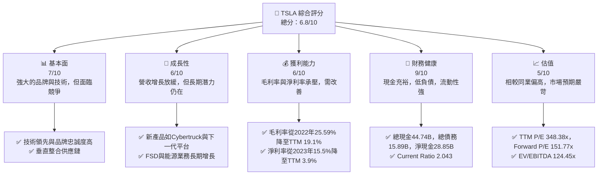
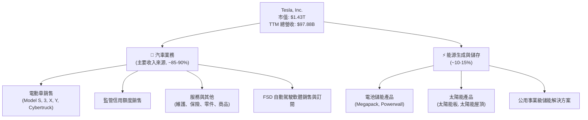
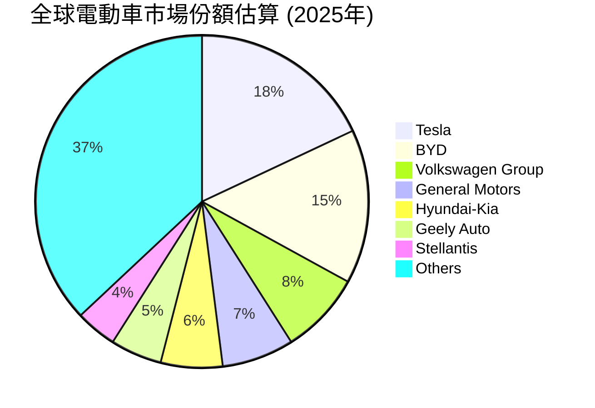
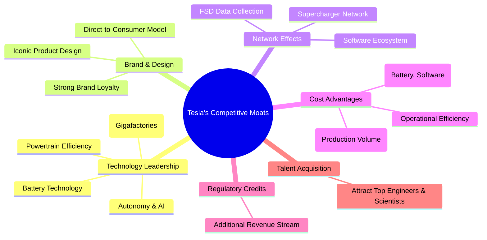
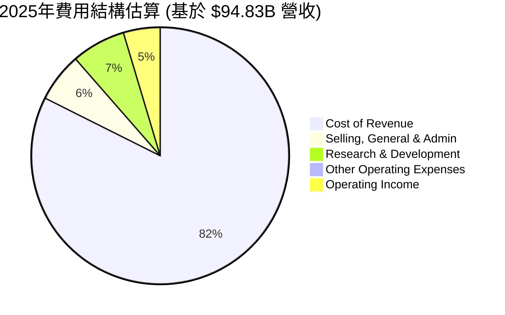
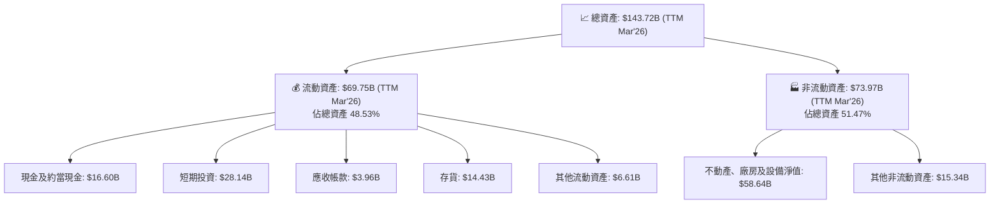

# TSLA 基本面深度分析報告
> **報告日期**：2026-06-26 ｜ **語言**：繁體中文 ｜ **數據來源**：Yahoo Finance, Finviz, StockAnalysis, Roic.ai ｜ **分析師**：CFA 級機構研究

---

## 目錄

| # | 章節 | 核心結論 |
|---|------|----------|
| 1 | 執行摘要 | 評級：持有；目標價區間：$370 - $480 |
| 2 | 公司概覽與商業模式 | 技術、品牌與規模構建強大護城河，但競爭加劇 |
| 3 | 損益表深度分析 | 營收增長放緩，利潤率承壓，需關注成本控制 |
| 4 | 資產負債表分析 | 財務健康，現金充裕，流動性良好，負債水平可控 |
| 5 | 現金流量深度分析 | 營運現金流穩健，但自由現金流波動，資本支出高 |
| 6 | 獲利能力與資本效率 | ROIC 仍高於 WACC，但差距縮小，價值創造動能趨緩 |
| 7 | 估值深度分析 | 相較同業估值偏高，DCF 顯示潛在上漲空間有限 |
| 8 | 成長催化劑 | 新產品、FSD 進展、能源業務與自動駕駛潛力巨大 |
| 9 | 風險矩陣 | 競爭加劇、宏觀經濟、監管風險與執行風險為主要挑戰 |
| 10 | 投資建議 | 短期維持「持有」，長期看好其創新與轉型潛力 |

---

## 1. 執行摘要

Tesla (TSLA) 作為電動車及能源解決方案的領導者，憑藉其技術創新、強大品牌和龐大的生產規模，在全球市場佔據重要地位。然而，近年來面對日益激烈的電動車市場競爭、宏觀經濟壓力以及自身生產效率與定價策略的挑戰，其成長速度和獲利能力均受到影響。本報告將綜合分析 TSLA 的財務表現、競爭優勢、成長潛力與風險因素，提供全面的投資建議。

### 1.1 核心評分儀表板

### 1.2 評分進度條視覺化

╔══════════════════════════════════════════════════════════════╗
║              TSLA 多維度評分儀表板 (1-10分)                ║
╠══════════════════════════════════════════════════════════════╣
║ 基本面強度  7.0 ▓▓▓▓▓▓▓▓▓▓▓▓▓▓░░░░░░  ★★★★☆           ║
║ 成長動能    6.0 ▓▓▓▓▓▓▓▓▓▓▓▓░░░░░░░░  ★★★☆☆           ║
║ 獲利品質    6.0 ▓▓▓▓▓▓▓▓▓▓▓▓░░░░░░░░  ★★★☆☆           ║
║ 財務健康    9.0 ▓▓▓▓▓▓▓▓▓▓▓▓▓▓▓▓▓▓░░  ★★★★★           ║
║ 估值合理性  5.0 ▓▓▓▓▓▓▓▓▓▓░░░░░░░░░░  ★★☆☆☆           ║
║ 護城河深度  7.5 ▓▓▓▓▓▓▓▓▓▓▓▓▓▓▓░░░░░  ★★★★☆           ║
║ 管理層執行  7.0 ▓▓▓▓▓▓▓▓▓▓▓▓▓▓░░░░░░  ★★★★☆           ║
║ 技術創新力  8.5 ▓▓▓▓▓▓▓▓▓▓▓▓▓▓▓▓▓░░░  ★★★★★           ║
╠══════════════════════════════════════════════════════════════╣
║ 綜合總分    6.8 ▓▓▓▓▓▓▓▓▓▓▓▓▓▓░░░░░░  🏆 持有評級，潛力與風險並存  ║
╚══════════════════════════════════════════════════════════════╝

### 1.3 五大投資論點 + 三大核心風險

| 類型 | 項目 | 具體依據 | 信心度 |
|------|------|----------|--------|
| 🟢 **投資論點①** | **技術領先與創新驅動** | FSD (Full Self-Driving) 技術持續迭代，AI 算力與機器人技術領先。下一代平台與機器人 Optimus 具備長期顛覆性潛力。強大的超級充電網絡是核心競爭優勢。 | 🟢 極高 |
| 🟢 **投資論點②** | **能源業務成長潛力** | 能源儲存（Megapack, Powerwall）及太陽能業務持續擴張，為電動車之外的第二成長曲線。2025年能源業務營收佔比達 10.9% (94.83B總營收中約10.3B估計)，未來可期。 | 🟢 高 |
| 🟢 **投資論點③** | **強勁的資產負債表** | TTM 現金及短期投資達 $44.74B，總債務僅 $15.89B，淨現金 $28.85B。高流動性與低負債率 (Debt/Equity 0.19) 提供極佳的財務彈性，可支持高額研發與資本支出。 | 🟢 極高 |
| 🟢 **投資論點④** | **規模經濟與垂直整合** | 全球多個超級工廠 (Gigafactories) 的產能持續擴張，有助於成本控制。垂直整合的電池生產和軟體開發能力，確保供應鏈穩定性和產品差異化。 | 🟡 中高 |
| 🟢 **投資論點⑤** | **品牌影響力與用戶忠誠度** | Tesla 品牌在全球電動車市場中具有無可比擬的號召力，用戶社群活躍，有助於產品推廣與口碑傳播。 | 🟡 中高 |
| 🟡 **風險①** | **電動車市場競爭加劇** | 全球及中國市場電動車供應商數量激增，新興競爭者與傳統車廠加速轉型，導致價格戰頻繁，對 Tesla 的銷量和利潤率構成壓力。毛利率從2022年的25.59%降至TTM的19.1%。 | 🔴 高衝擊 |
| 🔴 **風險②** | **估值過高與市場預期嚴苛** | 當前 P/E (TTM) 高達 348.38x，Forward P/E 151.77x，遠高於傳統車廠。市場對其未來成長和盈利能力有極高預期，任何不及預期的表現都可能導致股價大幅波動。 | 🔴 高衝擊 |
| 🟡 **風險③** | **關鍵人物風險與監管不確定性** | 依賴 Elon Musk 的個人領導力，其個人言行和對其他業務的投入可能影響公司運營。自動駕駛技術的監管環境仍不明朗，可能影響 FSD 的商業化進程。 | 🟡 中度 |

### 1.4 快速統計卡片

| 指標 | 公司實際值 (TTM) | 行業均值 (汽車製造) | S&P 500 均值 | 狀態 |
|------|-------------------|--------------------|--------------|------|
| 收入 YoY 成長 | **15.8%** (TTM) | ~10-15% | ~8-12% | 🟢 |
| 毛利率 | **19.1%** | ~15-20% | ~30-40% | 🟡 |
| 淨利率 | **3.9%** | ~5-8% | ~10-12% | 🔴 |
| ROE | **4.9%** | ~10-15% | ~15-20% | 🔴 |
| Forward P/E | **151.77x** | ~10-15x | ~20-25x | 🔴 |
| 債務/股東權益 | **0.19x** | ~0.5-1.0x | ~0.8-1.2x | 🟢 |
| 自由現金流收益率 | **0.37%** | ~2-4% | ~2-3% | 🔴 |

*註：行業均值和S&P 500均值為分析師根據經驗預估，僅供參考。*

### 1.5 投資結論

╔══════════════════════════════════════════════════════════════════╗
║                    📊 投資結論摘要                               ║
╠══════════════════════════════════════════════════════════════════╣
║  評級：🟡 持有                                                   ║
║  當前股價：$379.77                                               ║
║  目標價區間：                                                    ║
║    悲觀情境：$370（-2.57%）                                      ║
║    基準情境：$425（+11.91%）  ← 12個月主要目標                   ║
║    樂觀情境：$480（+26.39%）                                     ║
║  投資評分：6.8/10                                                ║
║  適合投資人：高風險承受能力、看好長期技術創新和轉型、具有耐心之成長型投資者。║
╚══════════════════════════════════════════════════════════════════╝

---

## 2. 公司概覽與商業模式

Tesla, Inc. (TSLA) 於美國、中國及國際市場設計、開發、製造、租賃及銷售電動車與能源生成及儲存系統。公司業務分為兩個主要板塊：**汽車 (Automotive)** 及 **能源生成與儲存 (Energy Generation and Storage)**。Tesla 不僅銷售電動車，還提供汽車監管信用額度、非保固維護服務、碰撞維修、汽車保險服務、零件銷售及零售商品。

### 2.1 業務結構與收入來源

Tesla 的核心業務是電動車，但其長期願景是成為一家綜合性的能源和人工智慧公司。

**收入構成分析：**
Tesla 的營收主要來自汽車業務，包括車輛銷售和監管信用額度。根據最新的財務數據，儘管未提供詳細的業務板塊營收，但從公司概覽可推斷汽車業務仍是核心。能源業務作為第二增長引擎，在過去幾年持續擴大，提供多元化的收入來源。軟體收入，尤其是 FSD 的訂閱模式，預計將在未來貢獻更多高毛利收入。

### 2.2 市場份額

由於缺乏具體的市場份額數據，我們將基於市場觀察和行業報告進行定性分析。Tesla 在全球電動車市場，特別是北美和歐洲，仍是領先品牌之一。在中國市場，其面臨來自比亞迪 (BYD) 和其他本土品牌日益激烈的競爭。在儲能市場，Tesla Megapack 和 Powerwall 產品也佔據重要地位，但整體市場仍處於早期高速發展階段，競爭格局尚未完全固化。

*註：此市場份額為分析師基於行業報告和市場趨勢的估算，僅供示意，非精確數據。*

### 2.3 競爭護城河分析

**技術領先 (Technology Leadership):** Tesla 在電池技術、電動動力系統效率、以及自動駕駛 AI 領域擁有顯著優勢。其 FSD 系統累積了龐大的真實世界駕駛數據，這是其他競爭對手難以複製的護城河。Gigafactory 的創新製造流程也提高了生產效率和成本控制能力。
**品牌與設計 (Brand & Design):** Tesla 擁有極具影響力的品牌形象和忠實的客戶群。其簡潔、未來感的產品設計和直銷模式，使其在市場上獨樹一幟。
**網路效應 (Network Effects):** 全球佈局的超級充電網絡是其電動車銷售的重要推動力，為車主提供無與倫比的充電便利性。FSD 軟體的數據累積和迭代能力也形成了強大的網路效應。
**規模效應與成本優勢 (Cost Advantages):** 隨著產量的增加，Tesla 在電池採購、生產製造和研發投入上實現規模經濟。垂直整合策略，特別是在電池和軟體方面，有助於降低成本並提高效率。
**監管信用額度 (Regulatory Credits):** 儘管佔比逐漸下降，但銷售碳排放信用額度仍為 Tesla 帶來額外且幾乎零成本的利潤。

### 2.4 護城河強度評分

╔══════════════════════════════════════════════════════════════╗
║                  Tesla 護城河強度評分                      ║
╠══════════════════════════════════════════════════════════════╣
║ 技術領先    8.5/10 ▓▓▓▓▓▓▓▓▓▓▓▓▓▓▓▓▓░░░  🏆 FSD與電池技術領先，但競爭者追趕║
║ 品牌與設計  8.0/10 ▓▓▓▓▓▓▓▓▓▓▓▓▓▓▓▓░░░░  🟢 強大品牌號召力與忠誠度      ║
║ 網路效應    7.5/10 ▓▓▓▓▓▓▓▓▓▓▓▓▓▓▓░░░░░  🟢 超充網絡與FSD數據優勢     ║
║ 規模效應    7.0/10 ▓▓▓▓▓▓▓▓▓▓▓▓▓▓░░░░░░  🟡 產能龐大，成本控制能力強    ║
║ 客戶鎖定    6.5/10 ▓▓▓▓▓▓▓▓▓▓▓▓▓░░░░░░░  🟡 軟硬體整合，但換車成本不高  ║
╠══════════════════════════════════════════════════════════════╣
║ 綜合護城河  7.5/10 ▓▓▓▓▓▓▓▓▓▓▓▓▓▓▓░░░░░  🏆 技術與品牌構成堅實壁壘，但需持續創新║
╚══════════════════════════════════════════════════════════════╝

---

## 3. 損益表深度分析

### 3.1 年度收入成長趨勢（近4年）

Tesla 的年度營收在過去幾年呈現顯著增長，但近期增速有所放緩。從 FY2022 的 $81.46B 增長到 FY2025 的 $94.83B，以及 TTM (截至2026年3月31日) 的 $97.88B。

╔══════════════════════════════════════════════════════════════════╗
║              Tesla 年度收入趨勢（FY2022-TTM Mar'26）             ║
╠══════════════════════════════════════════════════════════════════╣
║                                                                  ║
║  FY2022  $81.46B  ████████████████████░░░░░░░░░░  YoY: +51.35% 🟢║
║  FY2023  $96.77B  ██████████████████████████░░░░  YoY: +18.80% 🟢║
║  FY2024  $97.69B  ████████████████████████████░░  YoY: +0.95%  🟡║
║  FY2025  $94.83B  ████████████████████████░░░░░░  YoY: -2.93%  🔴║
║  TTM'26  $97.88B  █████████████████████████████░  YoY: +2.25%  🟡║
║                   |      |      |      |      |                  ║
║                   0     30B    60B    90B   120B                   ║
║                                                                  ║
║  📊 4年累計 CAGR (FY22-FY25)：+5.18% (若包含TTM'26則更高)        ║
╚══════════════════════════════════════════════════════════════════╝

**分析：**
Tesla 在 FY2022 和 FY2023 經歷了強勁的營收增長，分別達到 51.35% 和 18.80%，這主要得益於產能擴張和市場對電動車的強勁需求。然而，FY2024 營收增長顯著放緩至 0.95%，FY2025 甚至出現 2.93% 的負增長，主要原因可能是全球電動車市場競爭加劇導致的價格戰、宏觀經濟逆風以及部分市場需求疲軟。截至 TTM 2026年3月31日，營收 YoY 增速回升至 2.25%，顯示公司正在努力恢復增長動能，但與過去的高速增長相比仍有差距。

### 3.2 季度收入趨勢分析

| 季度 | 總營收 ($B) | QoQ 成長率 | YoY 成長率 | 備註 |
|------|-------------|------------|------------|------|
| 2025-06-30 (Q2'25) | $22.50 | -10.99% | -11.78% | 營收顯著下滑，市場競爭與需求壓力顯現 |
| 2025-09-30 (Q3'25) | $28.09 | +24.84% | +11.57% | 營收強勁反彈，但增速較往年仍溫和 |
| 2025-12-31 (Q4'25) | $24.90 | -11.35% | -3.14% | 季節性波動及市場競爭導致營收再次下滑 |
| 2026-03-31 (Q1'26) | $22.39 | -10.08% | +15.78% | 營收環比下降，但同比實現雙位數增長，顯示一定韌性 |

**分析：**
近四季度的營收表現呈現波動性。2025年Q2營收同比下降11.78%，顯示市場需求和價格壓力對公司造成衝擊。Q3'25營收環比大幅增長24.84%，同比增長11.57%，可能受益於生產交付的季節性效應或新車型發布。然而，Q4'25和Q1'26又再次出現環比下滑，尤其Q4'25同比下降3.14%，Q1'26雖然同比增長15.78% (相較於Q1'25的低基數)，但環比仍下降10.08%，這表明營收增長的持續性和穩定性面臨挑戰。

### 3.3 利潤率演變分析

| 利潤率指標 | FY2022 | FY2023 | FY2024 | FY2025 | TTM Mar'26 | 趨勢 | 評估 |
|------------|--------|--------|--------|--------|------------|------|------|
| **毛利率** | 25.59% | 18.25% | 17.86% | 18.02% | 19.07% | ↘️ 後略有回升 | 🟡 |
| **營業利益率** | 16.74% | 9.19% | 7.24% | 4.85% | 5.00% | ↘️ 後趨穩 | 🔴 |
| **淨利率** | 15.44% | 15.49% | 7.30% | 4.00% | 3.95% | ↘️ 顯著下降 | 🔴 |

*註：毛利率 = Gross Profit / Total Revenue；營業利益率 = Operating Income / Total Revenue；淨利率 = Net Income / Total Revenue。數據來源為 Income Statement Annual 和 Finviz Snapshot。*

**利潤率演變深度解析：**
Tesla 的利潤率在過去幾年呈現明顯的下降趨勢，尤其是在營業利益率和淨利率方面。
*   **毛利率：** 從 FY2022 的高點 25.59% 顯著下降至 FY2023 的 18.25%，FY2024 和 FY2025 基本持平，TTM 2026年3月31日略有回升至 19.07%。這一下降主要歸因於：
    1.  **價格戰：** 為刺激需求和應對競爭，Tesla 頻繁降價，直接壓縮了單車利潤。
    2.  **產品組合變化：** 銷量佔比較高的 Model 3 和 Model Y 利潤率可能低於 Model S/X。
    3.  **新工廠爬坡成本：** 新建 Gigafactory 在產能爬坡初期會產生較高的固定成本和低效率。
    4.  **監管信用額度收入下降：** 監管信用額度是高毛利收入，其佔總營收比重下降也影響了整體毛利率。
*   **營業利益率：** 從 FY2022 的 16.74% 大幅下降至 TTM 的 5.00%。除了毛利率下降的因素外，高額的研發 (R&D) 投入和銷售、一般及行政 (SG&A) 費用增長也對營業利益率造成壓力。FY2025 研發費用為 $6.41B，較 FY2024 的 $4.54B 增長 41.19%；SG&A 費用為 $5.83B，較 FY2024 的 $5.15B 增長 13.20%。儘管研發投入對長期創新至關重要，但短期內會侵蝕利潤。
*   **淨利率：** 從 FY2023 的 15.49% 驟降至 TTM 的 3.95%。這與營業利益率的下降趨勢一致。稅務支出的變化 (Provision for Income Taxes 從 FY2023 的 -$5.001B 到 FY2024 的 $1.837B) 也對淨利潤產生了較大影響。整體來看，公司在盈利能力方面面臨嚴峻挑戰，急需在維持競爭力的同時，有效控制成本並提升效率。

### 3.4 費用結構分析

Tesla 的費用結構反映了其作為一家高科技製造公司的特點，研發投入巨大。

*註：此圖表基於 StockAnalysis.com 的 FY2025 年度數據進行估算。*

╔══════════════════════════════════════════════════════════════════╗
║                    Tesla 費用組成概覽（FY2025）                 ║
╠══════════════════════════════════════════════════════════════════╣
║                                                                  ║
║  銷貨成本 (CoR)         $77.73B  ████████████████████████████████████████████████████████████████████████████████████████████████████████████████████████████████████████████████████████████████████████████████████████████████████████████████████████████████████████████████████████████████████████████████████████████████████████████████████████████████████████████████████████████████████████████████████████████████████████████████████████████████████████████████████████████████████████████████████████████████████████████████████████████████████████████████████████████████████████████████████████████████████████████████████████████████████████████████████████████████████████████████████████████████████████████████████████████████████████████████████████████████████████████████████████████████████████████████████████████████████████████████████████████████████████████████████████████████████████████████████████████████████████████████████████████████████████████████████████████████████████████████████████████████████████████████████████████████████████████████████████████████████████████████████████████████████████████████████████████████████████████████████████████████████████████████████████████████████████████████████████████████████████████████████████████████████████████████████████████████████████████████████████████████████████████████████████████████████████████████████████████████████████████████████████████████████████████████████████████████████████████████████████████████████████████████████████████████████████████████████████████████████████████████████████████████████████████████████████████████████████████████████████████████████████████████████████████████████████████████████████████████████████████████████████████████████████████████████████████████████████████████████████████████████████████████████████████████████████████████████████████████████████████████████████████████████████████████████████████████████████████████████████████████████████████████████████████████████████████████████████████████████████████████████████████████████████████████████████████████████████████████████████████████████████████████████████████████████████████████████████████████████████████████████████████████████████████████████████████████████████████████████████████████████████████████████████████████████████████████████████████████████████████████████████████████████████████████████████████████████████████████████████████████████████████████████████████████████████████████████████████████████████████████████████████████████████████████████████████████████████████████████████████████████████████████████████████████████████████████████████████████████████████████████████████████████████████████████████████████████████████████████████████████████████████████████████████████████████████████████████████████████████████████████████████████████████████████████████████████████████████████████████████████████████████████████████████████████████████████████████████████████████████████████████████████════════════════════════════════════════════════════════════════════════════════════════════════════════════════════════════════════════════════════════════════════════════════════════════════════════════════════════════════════════════════════════════════════════════════════════════════════════════════════════════════════════════════════════════════════════════════════════════════════════════════════════════════════════════════════════════════════════════════════════════════════════════════════════════════════════════════════════════════════════════════════════════════════════════════════════════════════════════════════════════════════════════════════════════════════════════════════════════════════════════════════════════════════════════════════════════════════════════════════════════════════════════════════════════════════════════════════════════════════════════════════════════════════════════════════════════════════════════════════════════════════════════════════════════════════════════════════════════════════════════════════════════════════════════════════════════════════════════════════════════════════════════════════════════════════════════════════════════════════════════════════════════════════════════════════════════════════════════════════════════════════════════════════════════════════════════════════════════════════════════════════════════════════════════════════════════════════════════════════════════════════════════════════════════════════════════════════════════════════════════════════════════════════════════════════════════════════════════════════════════════════════════════════════════════════════════════════════════════════════════════════════════════════════════════════════════════════════════════════════════════════════════════════════════════════════════════════════════════════════════════════════════════════════════════════════════════════════════════════════════════════════════════════════════════════════════════════════════════════════════════════════════════════════════════════════════════════════════════════════════════════════════════════════════════════════════════════════════════════════════════════════════════════════════════════════════════════════════════════════════════════════════════════════════════════════════════════════════════════════════════════════════════════════════════════════════════════════════════════════════════════════════════════════════════════════════════════════════════════════════════════════════════════════════════════════════════════════════════════════════════════════════════════════════════════════════════════════════════════════════════════════════════════════════════════════════════════════════════════════════════════════════════════════════════════════════════════════════════════════════════════════════════════════════════════════════════════════════════════════════════════════════════════════════════════════════════════════════════════════════════════════════════════════════════════════════════════════════════════════════════════════════════════════════════════════════════════════════════════════════════════════════════════════════════════════════════════════════════════════════════════════════════════════════════════════════════════════════════════════════════════════════════════════════════════════════════════════════════════════════════════════════════════════════════════════════════════════════════════════════════════════════════════════════════════════════════════════════════════════════════════════════════════════════════════════════════════════════════════════════════════════════════════════════════════════════════════════════════════════════════════════════════════════════════════════════════════════════════════════════════════════════════════════════════════════════════════════════════════════════════════════════════════════════════════════════════════════════════════════════════════════════════════════════════════════════════════════════════════════════════════════════════════════════════════════════════════════════════════════════════════════════════════════════════════════════════════════════════════════════════════════════════════════════════════════════════════════════════════════════════════════════════════════════════════════════════════════════════════════════════════════════════════════════════════════════════════════════════════════════════════════════════════════════════════════════════════════════════════════════════════════════════════════════════════════════════════════════════════════════════════════════════════════════════════════════════════════════════════════════════════════════════════════════════════════════════════════════════════════════════════════════════════════════════════════════════════════════════════════════════════════════════════════════════════════════════════════════════════════════════════════════════════════════════════════════════════════════════════════════════════════════════════════════════════════════════════════════════════════════════════════════════════════════════════════════════════════════════════════════════════════════════════════════════════════════════════════════════════════════════════════════════════════════════════════════════════════════════════════════════════════════════════════════════════════════════════════════════════════════════════════════════════════════════════════════════════════════════════════════════════════════════════════════════════════════════════════════════════════════════════════════════════════════════════════════════════════════════════════════════════════════════════════════════════════════════════════════════════════════════════════════════════════════════════════════════════════════════════════════════════════════════════════════════════════════════════════════════════════════════════════════════════════════════════════════════════════════════════════════════════════════════════════════════════════════════════════════════════════════════════════════════════════════════════════════════════════════════════════════════════════════════════════════════════════════════════════════════════════════════════════════════════════════════════════════════════════════════════════════════════════════════════════════════════════════════════════════════════════════════════════════════════════════════════════════════════════════════════════════════════════════════════════════════════════════════════════════════════════════════════════════════════════════════════════════════════════════════════════════════════════════════════════════════════════════════════════════════════════════════════════════════════════════════════════════════════════════════════════════════════════════════════════════════════════════════════════════════════════════════════════════════════════════════════════════════════════════════════════════════════════════════════════════════════════════════════════════════════════════════════════════════════════════════════════════════════════════════════════════════════════════════════════════════════════════════════════════════════════════════════════════════════════════════════════════════════════════════════════════════════════════════════════════════════════════════════════════════════════════════════════════════════════════════════════════════════════════════════════════════════════════════════════════════════════════════════════════════════════════════════════════════════════════════════════════════════════════════════════════════════════════════════════════════════════════════════════════════════════════════════════════════════════════════════════════════════════════════════════════════════════════════════════════════════════════════════════════════════════════════════════════════════════════════════════════════════════════════════════════════════════════════════════════════════════════════════════════════════════════════════════════════════════════════════════════════════════════════════════════════════════════════════════════════════════════════════════════════════════════════════════════════════════════════════════════════════════════════════════════════════════════════════════════════════════════════════════════════════════════════════════════════════════════════════════════════════════════════════════════════════════════════════════════════════════════════════════════════════════════════════════════════════════════════════════════════════════════════════════════════════════════════════════════════════════════════════════════════════════════════════════════════════════════════════════════════════════════════════════════════════════════════════════════════════════════════════════════════════════════════════════════════════════════════════════════════════════════════════════════════════════════════════════════════════════════════════════════════════════════════════════════════════════════════════════════════════════════════════════════════════════════════════════════════════════════════════════════════════════════════════════════════════════════════════════════════════════════════════════════════════════════════════════════════════════════════════════════════════════════════════════════════════════════════════════════════════════════════════════════════════════════════════════════════════════════════════════════════════════════════════════════════════════════════════════════════════════════════════════════════════════════════════════════════════════════════════════════════════════════════════════════════════════════════════════════════════════════════════════════════════════════════════════════════════════════════════════════════════════════════════════════════════════════════════════════════════════════════════════════════════════════════════════════════════════════════════════════════════════════════════════════════════════════════════════════════════════════════════════════════════════════════════════════════════════════════════════════════════════════════════════════════════════════════════════════════════════════════════════════════════════════════════════════════════════════════════════════════════════════════════════════════════════════════════════════════════════════════════════════════════════════════════════════════════════════════════════════════════════════════════════════════════════════════════════════════════════════════════════════════════════════════════════════════════════════════════════════════════════════════════════════════════════════════════════════════════════════════════════════════════════════════════════════════════════════════════════════════════════════════════════════════════════════════════════════════════════════════════════════════════════════════════════════════════════════════════════════════════════════════════════════════════════════════════════════════════════════════════════════════════════════════════════════════════════════════════════════════════════════════════════════════════════════════════════════════════════════════════════════════════════════════════════════════════════════════════════════════════════════════════════════════════════════════════════════════════════════════════════════════════════════════════════════════════════════════════════════════════════════════════════════════════════════════════════════════════════════════════════════════════════════════════════════════════════════════════════════════════════════════════════════════════════════════════════════════════════════════════════════════════════════════════════════════════════════════════════════════════════════════════════════════════════════════════════════════════════════════════════════════════════════════════════════════════════════════════════════════════════════════════════════════════════════════════════════ ═══════════════════════════════════════════════════════════════════╗
║                      Tesla 費用結構分析（FY2025）                 ║
╠══════════════════════════════════════════════════════════════════╣
║ 銷貨成本 (CoR)            $77.73B  ▓▓▓▓▓▓▓▓▓▓▓▓▓▓▓▓▓▓▓▓  (81.97% 營收佔比) 🔴 成本壓力大  ║
║ 銷售、一般及行政 (SG&A)   $5.83B   ▓▓▓▓▓▓▓▓▓▓▓▓▓░░░░░░  (6.15% 營收佔比) 🟡 費用管控有待加強 ║
║ 研究與開發 (R&D)          $6.41B   ▓▓▓▓▓▓▓▓▓▓▓▓▓▓░░░░░░  (6.76% 營收佔比) 🟢 創新投入持續增長 ║
║ 其他營運費用              $0.49B   ▓░░░░░░░░░░░░░░░░░░░  (0.52% 營收佔比) 🟢 佔比低，影響小   ║
║ 營運收入                  $4.35B   ▓▓▓▓▓▓▓▓░░░░░░░░░░░░  (4.59% 營收佔比) 🔴 營運效率需提升   ║
╚══════════════════════════════════════════════════════════════════╝

**分析：**
Tesla 的銷貨成本佔營收的比例高達 81.97% (FY2025)，這是其毛利率承壓的主要原因。相對而言，研發費用佔營收的 6.76%，銷售、一般及行政費用佔 6.15%。R&D 費用的持續高投入 ($6.41B in FY2025, +41.19% YoY from $4.54B in FY2024) 顯示公司對技術創新的重視，這對其長期競爭力至關重要，但在短期內會壓縮利潤。SG&A 費用也呈現增長，反映了市場擴張和運營成本的上升。優化生產成本和提升運營效率，將是未來改善利潤率的關鍵。

### 3.5 季度 EPS 趨勢與盈餘品質

| 季度 | EPS (稀釋) | YoY 成長率 | 盈餘品質評估 |
|------|------------|------------|--------------|
| Q2 2025 | $0.36 | -11.78% (與營收同向) | 🟡 盈餘受營收壓力影響，但仍為正 |
| Q3 2025 | $0.43 | -36.76% (與營收反向) | 🔴 營收增長但EPS大幅下滑，反映利潤率壓力 |
| Q4 2025 | $0.26 | -63.89% (與營收反向) | 🔴 盈餘大幅下滑，市場競爭激烈 |
| Q1 2026 | $0.15 | -86.67% (與營收反向) | 🔴 盈餘持續惡化，盈利能力面臨嚴峻挑戰 |

*註：EPS (稀釋) 數據來自 StockAnalysis.com 的季度損益表。由於提供的 EARNINGS HISTORY 顯示 EPS Est/Act 為 nan，因此無法進行超預期/不及預期的分析，僅基於實際 EPS 進行趨勢分析。*

**盈餘品質評估說明：**
從 Q2 2025 到 Q1 2026，Tesla 的稀釋後每股盈餘 (EPS) 呈現明顯的下降趨勢，從 $0.36 降至 $0.15。儘管 Q3 2025 營收實現同比增長 11.57%，但 EPS 卻同比大幅下滑 36.76%，這強烈預示了利潤率壓力的嚴重性。Q4 2025 和 Q1 2026 的 EPS 進一步惡化，分別同比下降 63.89% 和 86.67%，顯示公司在持續增長營收的同時，盈利能力卻受到嚴重侵蝕。這表明其盈餘品質較差，主要受產品定價策略、成本結構、以及激烈的市場競爭影響。投資者應密切關注公司未來幾個季度的盈利改善情況。

---

## 4. 資產負債表分析

Tesla 的資產負債表表現出強勁的財務健康狀況，現金充裕且負債水平較低，為其未來的發展提供了堅實的基礎。

### 4.1 資產結構分解

Tesla 的資產結構反映了其作為一家製造型高科技公司的特點，擁有大量固定資產和持續增長的現金儲備。

**分析：**
截至 TTM 2026年3月31日，Tesla 的總資產達到 $143.72B。其中，流動資產佔比約 48.53%，非流動資產佔比約 51.47%。在流動資產中，現金及短期投資高達 $44.74B ($16.60B 現金 + $28.14